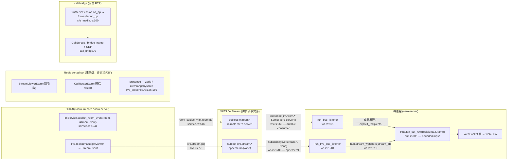

# AGENTS.md — Aero IM

> 编码 agent + 系统智能体（bots/workers/timers）操作手册：**怎么干活、哪些常驻智能体在跑、别踩哪些坑、什么在范围内**。会漂移的数字（迁移序号、功能数、测试数、**代码行号**）一律以 `README.md`+`migrations/`+源码为准，本文件只给文件名/符号名当 grep 锚点。架构/设计规范 → `docs/specs/2026-05-22-aero-im-design.md`。

## §1 系统总览与事件 DAG

aero-im 是纯 Rust 的 AI-Native IM + 互动直播平台。全系统的复用骨架是**事件驱动 + 进程内扇出**：业务层产事件 → NATS 按 subject 跨实例投递 → 每进程 `Hub` 在本地扇出到 WebSocket。

- **房间实时**：`RoomEvent` → `ImService::room_subject` 拼 `im.room.{id}`（`service.rs:516`）→ `publish_room_event` 在发布前 mint per-subject seq 并 `stamped_event_bytes` 打 `"seq"` 戳后发 NATS（`service.rs:1941-1953`）→ `run_bus_listener` 订阅 `im.room.*`（**durable** consumer `Some("aero-server")`，`ws.rs:965`）→ 两阶段解码（先 raw JSON `extract_seq` 再 typed `RoomEvent`，`ws.rs:974-978`）→ 展开 `NotifyBatch`/查房间成员 → `Hub.fan_out_raw` → WS。
- **直播实时**：`StreamEvent` → `live.stream.{id}`（`live.rs:77`）→ `run_live_bus_listener` 订阅 `live.stream.*`（**ephemeral** consumer `None`，因每实例都须见全部事件给本地 watcher 扇出，丢几条弹幕无碍，`ws.rs:1205,1196-1200`）→ `hub.stream_watchers(stream_id)`（`ws.rs:1219`）→ `fan_out_raw`。
- **跨实例事实源 = NATS subject 上的 durable consumer**；`Hub` 只在本进程内 bounded `mpsc` 扇出（`ws.rs:254`、`hub.rs:311`），多开实例即水平扩消息吞吐。两命名空间 `im.room.{id}`/`live.stream.{id}` 各自 per-subject 单调 seq（`bus/seq.rs:16`），at-least-once 重投携同一 seq 供客户端去重/排序。
- **集群级状态走 Redis sorted set**，绝不靠单进程内存：房间 presence、直播观看数(`StreamViewerStore`)、通话 roster(`CallRosterStore`)，心跳 `zadd` + `zremrangebyscore` 驱逐过期成员（`live_presence.rs:126,169,222,264`），多节点一致。
- **跨节点通话媒体 = call-bridge**（明文 RTP，DTLS-SRTP 只在客户端腿）：`SfuMediaSession.on_rtp` 把解密 RTP 转给 `SfuForwarder.on_rtp`（`sfu_media.rs:100`）→ 转发本地订阅者并喂 `CallEgress`，经 `bridge_frame` 编帧 + UDP 收发跨节点（`call_bridge.rs`、`bridge_frame.rs`）。SFU peer roster 是 `aero-live-webrtc` 进程内 `Arc<RwLock<HashMap<CallId, CallState>>>`（`SfuRouter`，`lib.rs:97`，**非** DashMap、**非** Redis），每节点独立；**别和 Hub 的 `call_rosters`（`hub.rs:120` DashMap = P6 WS-mesh 通话名册）混**。跨节点媒体不靠任一者，走 call-bridge。

### crate 地图（依赖自下而上，勿成环）

| 层 | crate | 职责 |
|---|---|---|
| 基础 | `aero-common` | **叶子**：共享类型/ID/`Block`/`RoomEvent`/`StreamEvent`/`Error`/Config/telemetry；MLS 仅不透明字节 scaffold（`src/mls.rs`，无状态机） |
| 基础 | `aero-bus` | NATS JetStream `EventBus` trait + 实现（per-subject seq `bus/seq.rs`） |
| 基础 | `aero-storage` | sqlx 仓储（每功能一个 `XRepo`）+ `BlobStore`（LocalFs / `S3BlobStore`）+ Redis presence/roster |
| 基础 | `aero-auth` | Argon2id + RS256 JWT + `AuthUser`（JWT 失败回落 `aero_pat_*` PAT）+ OIDC + TOTP |
| 基础 | `aero-signaling` | `RtcConfig`/`IceServer`/SDP·ICE 校验/`CallRoster` |
| IM | `aero-im-core` | `ImService` 编排（消息/编辑/删除/反应/已读/通知/通话/审核）+ `KeywordModerator` |
| IM | `aero-im-call` | 1:1/群通话编排：`CallOrchestrator` 落库 + SFU peer 簿记 + 未接检测 |
| IM | `aero-ai` | Anthropic / Voyage / `HashEmbedder` / `AiService` / `AiWorker` |
| IM | `aero-push` | 移动推送网关（FCM + APNs），token-provider seam + `FakeGateway` |
| 直播 | `aero-live-core`·`-rtmp`·`-hls` | `LiveIngest` trait · rml_rtmp 摄入 · `HlsWriter` + `FlvToTsConverter`（真 MPEG-TS mux） |
| 直播 | `aero-live-whip` | str0m WHIP/WHEP：SDP 应答 + RFC 6184 H.264 解包 + RTP→HLS + NAL 中继 |
| 直播 | `aero-live-webrtc` | str0m SFU：选择性转发 + seq/ts 重映射 + Simulcast + RTCP(PLI/FIR) + 多 codec 关键帧 + 跨节点 `CallBridge` 中继 |
| 直播 | `aero-live-srt` | 手写 SRT HSv5 + AES-CTR + Key Wrap(RFC 3394) + ACK/NAK + `MpegTsSegmenter` |
| 组合 | `aero-server` | Axum gateway：HTTP + WS + WHIP/WHEP + HLS + RTMP `:1935` + bots/workers/timers + `Hub` |
| 组合 | `web/` | 零依赖 ES2020 SPA（hls.js / RTCPeerConnection / SpeechRecognition CDN） |

**技术栈**：Rust 2021 / MSRV 1.80 · tokio · axum 0.7 · sqlx 0.8 · fred 9(Redis 7) · async-nats 0.36(JetStream) · str0m 0.19（纯 Rust DTLS-SRTP，仅 `aero-live-webrtc`/`-whip` 各自 `Cargo.toml` 声明，**不在 root**）· Postgres 17 + pgvector + pg_trgm。

## §2 核心智能体定义（CORE AGENT PROFILES）

> 全部由 `bin/aero-server.rs` 在 boot 时装配；行号皆 grep 锚点会漂移。「触发」列标 OPT-IN 的须 env gate，否则无条件常驻。

| 智能体 | 触发 (trigger) | 输入 | 核心逻辑 | 产物 (output) | 硬性约束 |
|---|---|---|---|---|---|
| **agent_bot** @提及AI应答 | bus `im.room.*` durable `aero-bot`，仅 `RoomEvent::Message`；无条件常驻（`agent_bot.rs:27`、`aero-server.rs:927`） | `MessageEnvelope`：抽 `Block::Mention{participant}`，问题取 `env.message.searchable_text()` | 收集所有被 @ 者；逐个 gate：必须 `Bot`/`Agent` kind、`bot.id!=sender`（无自回）、`rooms.is_member`、问题非空 → `ai.answer_question(room,q,8)`（交互路径，非 ai_jobs）→ `Block::text(answer)` (+citation `Card`) → `im.send_message(bot.id,room,blocks,Some(reply_to),None)`（`agent_bot.rs:70-107`） | 以被 @ 的 bot/agent 身份发新消息，threaded 回原消息；AI 错误退化为「(AI 暂不可用:{e})」道歉 | 非 opt-in。**无预算/限流、无幂等去重**——每个合格 @ 都触发新 AI 调用。Fail-OPEN：AI 错误降级道歉不丢消息；自回守卫防环 |
| **ooo_bot** 离线自动回复 | bus `im.room.*` durable `aero-ooo`，仅 `RoomEvent::Message`；无条件常驻（`ooo_bot.rs:39`、`aero-server.rs:940`） | `MessageEnvelope`；读 `rooms.members`、`DmRepo.find_direct`、`OutOfOfficeRepo.is_active/should_autoreply/get` | 成员恰为 2 且为真 1:1 direct DM（`find_direct(sender,other)==Some(room)`）；`is_active(other,now)` 在窗内；`should_autoreply(other,sender)`（NOT EXISTS）→ 以 `other` 身份发 `status.message`，**send 成功后才** `record_autoreply`（`ooo_bot.rs:60-104`、`out_of_office.rs:203-231`） | DM 内以缺席者身份发其 OOO 文案，每 (ooo_user, sender) 对**至多一次** | 非 opt-in。**有 per-sender 幂等**（`ON CONFLICT DO NOTHING`）。无 AI、无预算。结构性无自回（以 other 身份）。Record-after-send：失败下条重试 |
| **unfurl_bot** 链接预览(OG) | bus `im.room.*` durable `aero-unfurl`，仅 `RoomEvent::Message`；**OPT-IN：`AERO_UNFURL`**（`unfurl_bot.rs:55`、`aero-server.rs:1000`） | `MessageEnvelope`；`extract_urls` 从 Text block 取 http(s)；`UnfurlRepo` 缓存 + 可注入 `Unfurler`（实 `ReqwestUnfurler`） | **Loop-guard**：任一 block 已是 `is_link_preview_card` 即 return（防自产 Edited 重入）；逐 URL `resolve()`=缓存命中或 `fetch→parse_og→put`，仅留 `has_metadata`；append `Card` 经 `MessageRepo::edit`（系统补丁，绕作者守卫）→ `broadcast_room_event(Edited)`（`unfurl_bot.rs:82-148`） | 原消息原地编辑追加 link_preview Card 并重广播 Edited；副作用填充 unfurl 缓存；不产新消息 | **OPT-IN**。幂等/loop-guard：跳过已带 preview 的消息。仅 `has_metadata` 成卡。Fail-OPEN：不可达/空解析/缓存失败/持久失败皆 log-skip。系统代发：绕 author-only edit 检查 |
| **transcribe_bot** 语音转写 | bus `im.room.*` durable `aero-transcribe`，仅 `RoomEvent::Message`；无条件常驻（`transcribe_bot.rs:25`、`aero-server.rs:980`） | `MessageEnvelope`；扫 `Block::Voice{blob_id,transcript:None}`，blob-meta 取 mime | 收集未转写 Voice → 取 blob bytes → `ai.transcribe(bytes,mime)`（有 `OPENAI_API_KEY` 用 Whisper，否则 `StubTranscriber`）→ `MessageRepo::update_voice_transcript` → 重广播 `Edited`（`transcribe_bot.rs:48-99`） | 消息行原地写入 transcript 文本 + best-effort 重广播 Edited | 非 opt-in；**质量**由 `OPENAI_API_KEY` 门控（缺则 stub 占位）。幂等守卫：仅 `transcript.is_none()` 命中。Fail-OPEN per-target（缺 blob/空/错皆 continue）。无预算/限流 |
| **golive_bot** 开播关注者通知 | bus `live.stream.*` queue-group durable `aero-golive`（集群单节点扇出），仅 `StreamEvent::Status{Live}`；无条件常驻（`golive_bot.rs:45`、`aero-server.rs:966`） | go-live `StreamEvent::Status{stream_id}`；`streams.get` 解析 owner/title | Status==Live → load stream → `StreamFollowRepo::followers(owner)`（空则 return）→ 逐 follower `ActivityFeedRepo::insert(follower,"stream_live",owner,stream_id,summary)`（`golive_bot.rs:51-90`） | 每关注者一条 `stream_live` 动态 feed 行；不发消息/推送 | Fail-OPEN per-follower。**非幂等**——重投插重复 feed 行。**覆盖限**：仅 WHIP ingest 发 go-live 事件；RTMP/SRT 走无 EventBus 的 `mark_live`，那条路径不触发本 bot（`golive_bot.rs:17-24`） |
| **push_bot** 移动推送分发 | bus `im.room.*` durable `aero-push`，匹配 `RoomEvent::Notify` + `NotifyBatch`（逐 recipient）；**OPT-IN：`state.push.any_enabled()`**（FCM/APNs≥1，`push_bot.rs:41`、`aero-server.rs:953`、`state.rs:362`） | targeted Notify/NotifyBatch；load 发送者 display_name + message 取 body 预览 + deep-link | resolve sender_name（兜底 "Someone")→ fetch message once → `preview` 截 140 字符（char 边界 + 省略号 + 空白折叠）→ kind→title → `PushPayload` → 逐 token `push.for_platform(t.platform).send`（`push_bot.rs:48-149,171`） | 每注册设备一条 FCM/APNs 推送；**死 token 回收**：`PushError::Rejected` → `unregister` 删行 | **OPT-IN**（any_enabled）。Fail-OPEN：缺消息/列表错/未配平台/send 错皆 log-skip，`push_to_participant` 不返错。回收=死 token 卫生（非事件幂等，重投会重推）。无限流 |
| **moderation_bot** AI内容审核 | bus `im.room.*` durable `aero-moderation`，仅 `RoomEvent::Message`；**OPT-IN：`AERO_AI_MODERATION` 且 AI 已配**（`moderation_bot.rs:264,219`、`aero-server.rs:987`） | `env.message.searchable_text()`（空白跳过）；建 `ModerationJob{message_id,room_id,text}`（enqueue 时锁文本） | consumer `try_send` 非阻塞→有界 mpsc（`QUEUE` 默 512）→ N worker（默 2）；per-job：room→ws 解析（失败退全局门）→ admit_call **先 per-ws `KeyedCostBudget` 后全局 `CostBudget`**→ `ai.moderate`，Anthropic 记成本；`Ok(Some(reason))`→120 字 digest→`im.moderate_delete`；总 ack（`moderation_bot.rs:179-366,293`、`service.rs:1267`） | 命中即**软删 + `message.moderated` 审计**单事务（`moderate_delete`）+ 广播 Deleted；metrics calls/flagged/skipped/cost | **OPT-IN**。Fail-OPEN 筛查（非投递门，消息已送达）；skip 记 `skipped_total{reason}`。**双固定窗预算**：全局 300/per-ws 60 over 60s，per-ws 先查使一租户不耗全局。有界队列 try_send 满即 skip，不背压共享 consumer。软删天然幂等；删+审计原子 |
| **AiWorker** AI作业队列工作者 | **无 bus subject**——轮询 PG `ai_jobs`（`FOR UPDATE SKIP LOCKED`）；AI 服务构造即无条件常驻至 shutdown（`aero-server.rs:240`、`ai_job.rs:130`、`worker.rs:474`）。kinds：Embed/Summarize/Moderate/Answer | claimed `AiJob`{id,kind,target_id,workspace_id,attempts,payload}；per-kind payload（Embed→MessageId；Answer→{room_id,question,k}…） | run_loop：claim 量=剩余全局预算（≤8）→ per-ws `KeyedCostBudget` 超→`defer`（不耗 retry）→全局 weighted `try_acquire_n(weight)` all-or-nothing 不足→defer→`Semaphore` 限并发 `process_batch`；run_one：dead-letter 守卫 `attempts>5`→fail 不花钱；handle_embed 空文本 skip 付费（`worker.rs:223-553,256,296`、`metrics.rs:154`） | per-kind 持久 result JSON：Embed→`update_embedding`；Summarize→{summary…}；Moderate→block 则 `soft_delete`；Answer→{answer,citations}；metrics duration/cost/jobs/queue_depth | 非 opt-in（无 key 时启发式/no-op）。**预算 FAILS-CLOSED on spend**：全局 120 按 per-kind WEIGHT(Embed1/Mod2/Sum3/Ans5) + per-ws 120 over 60s，超额 defer 下窗（不丢/不失败/不耗 retry）。**DEAD-LETTER MAX_ATTEMPTS=5**→`dead` 终态。幂等：Embed 空跳付费、Moderate 已删 no-op。仅成功记成本。`SKIP LOCKED` 水平扩 |
| **retention/ephemeral/ban/points sweep** 合规清扫 | `interval(AERO__SERVER__RETENTION_SWEEP_SECS`，默 3600，0 禁)，跳首 tick，持 cancel token（`aero-server.rs:454-475`） | `now_utc`；per-ws 留存窗、ephemeral TTL、`stream_bans.expires_at`(mig0108)、`channel_points.earn_expires_at`(mig0113) | 顺跑 4 set-based 清扫：(1)`sweep_expired_messages` 软删 (2)`sweep_ephemeral` 硬删 (3)`sweep_expired_bans` 硬删 (4)`sweep_expired_points` 清零；(1)(2) 每删行调 `announce_message_deleted` 扇 Deleted（`aero-server.rs:478,486,508`） | 软/硬删 DB 行 + per-purged Deleted 扇出 + info 计数；无返回值 | Best-effort：每段 Err warn 不 panic；SECS=0 全禁。`MissedTickBehavior::Skip` 慢扫不堆 tick |
| **call_route_heartbeat** 跨节点通话路由心跳 | `interval(AERO_CALL_ROUTE_HEARTBEAT_SECS`，默 30，0 禁)，跳首 tick（`aero-server.rs:557-568`） | `sfu_router.roster_snapshot()`→本节点 (CallId,ParticipantId)；`public_base_url`；`CallRouteRegistry`(Redis) | 每 tick 快照 roster，逐 (call,participant) `heartbeat(call,participant,node_url)` 重盖 Redis TTL（`aero-server.rs:576,579`） | 刷新 `call→{participant→node}` 映射 TTL，跨节点桥目标可解析 | Redis 已接线。SECS=0 禁。roster 空时无害 no-op。per-entry Err warn 续 |
| **stream_route_heartbeat** 跨节点直播路由心跳 | `interval(AERO_STREAM_ROUTE_HEARTBEAT_SECS`，默 30，0 禁)，跳首 tick（`aero-server.rs:607-618`） | `stream_repo.list_live()`→本节点摄入流；`public_base_url`；`StreamRouteRegistry`(Redis) | 每 tick 列本节点 live 流，逐流 `heartbeat(stream.id,node_url)` 重盖 `stream_id→ingesting node` TTL（publish 时打戳，否则无刷新，`aero-server.rs:626,630`） | 刷新 sticky-routing TTL，重定向到摄入节点持续可用 | Redis 已接线。SECS=0 禁。`list_live` Err→warn skip tick；per-stream Err→warn 续 |
| **observability_gauge_samplers** 指标采样定时器组 | 三独立定时器（无 env，不跳首）：DB 池+WHIP 15s(`:664`)、AI DLQ 30s(`:694`)、NATS backlog 30s(`:723`) | sqlx `PgPool` stats；`WhipRegistry.active_sessions`；`AiJobRepo.count_dead`(per kind)；`JetStreamBus.consumer_pending` | Pool/WHIP：set DB_POOL_SIZE/IN_USE/WHIP_SESSIONS。DLQ：KINDS=[embed,summarize,moderate,answer]→`AI_DEAD_LETTER_QUEUE_SIZE{kind}`。NATS：CONSUMERS=[(IM_MESSAGES,aero-server),(AI_QUEUE,aero-ai)]→`NATS_CONSUMER_PENDING_MESSAGES{stream,consumer}`（`:674,692,728`） | 进程级 Prometheus gauge（`/metrics` 抓取）；无 DB/bus mutation | 纯观察永不改状态。query Err warn，gauge 留旧。`pending Ok(None)`=consumer 未注册→skip。**这 3 个不持 cancel token**，跑到进程退 |
| **blob_gc_drain** Blob 删除队列回收(GDPR) | `interval` 固定 60s（`aero-server.rs:752`）。**不持 cancel token** | `BlobGcRepo.drain(50)`→≤50 队列 blob id；`blob_store` | 每 tick drain 一批；逐 id `blob_store.delete(id)`，**仅 Ok 才** `gc_repo.ack(id)` 删队列行（delete-then-ack：失败留行下 tick 重试，`aero-server.rs:756,760`） | 删存储对象(disk/S3) + ack 队列行；GDPR 右-to-erasure 完成 | Best-effort：drain/delete/ack Err 各 warn。幂等（行仅成功才移） |
| **embedding_backfill** 向量补全回填(RAG) | `interval` 固定 300s（5min）；持 ai_shutdown token via select!（`aero-server.rs:866-872`） | `MessageRepo.list_without_embedding(200)`；`RoomRepo.room_workspace`；`AiJobRepo` | 每 tick 扫 ≤200 无 embedding 消息（编辑清空 embedding、AI 前历史无），解析 ws → `enqueue_unique(Embed,msg_id,ws,{room_id,backfill:true})` dedup 守卫（`aero-server.rs:873,879`） | 入队 Embed AiJob 供 AiWorker 填；batch 随 worker 追平而缩；不直接写 embedding | 有界 batch(200)；enqueue dedup 守卫(`Ok(None)`=已队跳)。下游受 per-ws+全局 AI 预算约束。Err→warn 续 |
| **rate_limiter_idle_bucket_sweep** 限流桶回收(DoS) | `interval(AERO_RATE_LIMIT_SWEEP_SECS`，默 60，`.max(1)`)，持 cancel token（`aero-server.rs:1084-1091`） | `Instant::now`；idle 阈 `AERO_RATE_LIMIT_IDLE_SECS`(默 600)；AppState 四 limiter(rate/auth/login/forgot) | 每 tick 对四 limiter `sweep_idle(now,idle)` 求和驱逐；丢「idle 且满桶」的 per-client 桶（等价从未见过，安全），界定 map 增长（`aero-server.rs:1093,1080`） | 缩小内存 limiter map，防无界增长(DoS 放大器)；无外部副作用 | 仅驱逐 idle+满桶（等价 fresh 安全）。SWEEP_SECS≥1。SIGTERM 经 cancel token 干净退出 |
| **run_bus_listener** 房间事件→WS 扇出 | NATS `im.room.*` durable `aero-server`（at-least-once）；boot 起一个/进程，循环 `stream.next()`（`ws.rs:961-969`） | raw JSON → 两阶段解码 (RoomEvent, Option<u64> seq)；recipients 经 `explicit_recipients()` 或 `rooms.members` | 解码前 lift `seq`（serde 丢未知键）；`NotifyBatch` 展开为 per-recipient Notify 帧（避 O(N) NATS）；`RoomEvent::Message` inc `MESSAGES_SENT_TOTAL`（唯一非重复计数点）；`room_event_to_frame_json`→`fan_out_raw`→ack；typed 失败回落 legacy envelope，否则 warn+nack（`ws.rs:965,986,1019`） | per-recipient WS 帧入本地 Hub；`MESSAGES_SENT_TOTAL`；NATS ack/nack | durable cursor（与 webhook dispatcher 不同）。ack 仅在扇出后；坏 payload nack。消息计数在此唯一收口（bus=单一事实源） |
| **run_live_bus_listener** 直播事件→WS 扇出 | NATS `live.stream.*` **EPHEMERAL** consumer（第二参 None）；boot 起一个/进程（`ws.rs:1201-1207`） | raw JSON → (StreamEvent, seq)；本地 watcher 集 `hub.stream_watchers(stream_id)` | lift `seq` → typed 解码 → 解析 `stream_id` 本地 watcher，非空则 `ServerFrame::StreamEvent`→`stamped_frame_json`→`fan_out_raw`→ack；坏 payload warn+nack（`ws.rs:1205,1219,1196`） | 戳 seq 的 StreamEvent 帧（弹幕/礼物/观看）仅发本地 watcher；NATS ack/nack | **EPHEMERAL 设计**：直播互动是广播，每实例须见每事件扇本地 watcher，重启丢几条弹幕无碍。无本地 watcher 时整跳扇出 |
| **call_bridge_supervisor** 跨节点桥接监督(PULL+PUSH) | call-lifecycle 驱动（非定时器）：`CallJoin` 且 orchestrator 返 `BridgeTo(urls)`→`ensure_bridges`(`ws.rs:677`)；`CallLeave` 末位本地参与者→`cancel_call`(`ws.rs:699`)；`ensure_egress` 无生产调用方 | PULL：`ensure_bridges(call,peer_urls)` 他节点列表。PUSH：`ensure_egress(call,tap)`。subscribe 端点 POST→`BridgeSubscriberRegistry`；`UpstreamFactory=NodeRtpPullerFactory`(真 UDP) | PULL：per 未桥 peer，`factory.connect`→`UdpRtpUpstream::bind`→POST `/api/internal/call-bridge/subscribe`（Bearer cluster secret）→`spawn_bridge` 拉 `decode_bridge_frame` UDP 入本地 `SfuRouter`；registry keyed (call,peer_url) 幂等 + monotonic task id。PUSH：`ensure_egress` bind `UdpRtpEgress`，tap→`encode_bridge_frame`→逐 subscriber send。`cancel_call` 取消全部桥+egress（`call_bridge_supervisor.rs:477,144,326`） | spawn/cancel 桥 JoinHandle 把远端 RTP 扇入本地 SFU；egress UDP relay 本地 RTP 给订阅 puller；subscribe 端点 registry mutation | 真-WebRTC-客户端 seam：`factory.connect` 返 None（不可达/单节点无 BridgeTo）则**全休眠不 panic**。后端可信：明文 RTP，DTLS-SRTP 仅客户端腿。幂等：同 census re-join 不双 spawn。**`ensure_egress` 已建+单测但生产未接线**（待 SfuMediaSession-fed tap）；真两节点跑是剩余 seam |
| **sfu_media_session** SFU 单参与者媒体会话 | call-media lifecycle：`SfuMediaSession::bind`→`run(cancel)` per participant。**生产无实例化**——`lib.rs:8` 无条件 `pub mod sfu_media`，但唯一 `bind`/`run` 调用方在 `sfu_media.rs` 的 `#[cfg(test)]`，live socket loop 待真实 WebRTC 客户端接线 | `bind(call,participant,Arc<SfuForwarder>,Option<CallEgress>,bind_addr)`→UdpSocket；`accept_offer(sdp)` 答 recvonly/sendrecv；入站 UDP(ICE/DTLS/SRTP/RTP) | `run()`：drain `SfuPeer::poll()` 至 Timeout——Transmit→`send_to`(ICE/DTLS/RTCP)；Media→`deliver`=`forwarder.on_rtp` 给本地订阅者 **且** `egress.is_some`(跨节点) 则 `egress.publish(BridgeRtp)`；`select!` over cancel/`recv_from`→handle（`sfu_media.rs:99,125`） | 转发 RTP 给本地 SFU 订阅者 + 跨节点 CallEgress publish；出站 ICE/DTLS/RTCP；驱动 SfuForwarder BWE/simulcast/keyframe 机制 | **真-WebRTC-客户端 seam**：ICE/DTLS/SRTP 握手交付真实媒体需真对端（浏览器/配对 str0m），staging 非 CI。仅结构 + SDP-answer 拒绝单测；on_rtp 半在 forward.rs + call-bridge 测。**本 build 无 live socket loop 调用方**（测外无） |

## §3 功能矩阵与状态触发器（FEATURE MATRIX & STATE TRIGGERS）

> 完整功能清单见 `README.md`「功能矩阵」表；迁移文件数见 `migrations/`（当前 0001–0125，`ls migrations | wc -l` 即得，勿在文档硬编码计数）。全部路由在 `crates/aero-server/src/routes.rs::build()` 一处装配（核心路由内联，扩展能力以 `.merge(crate::<mod>::routes())` 挂载，约 100+ 子模块）。WS 帧定义见 `crates/aero-server/src/ws.rs`（`ClientFrame` L58 / `ServerFrame` L165）。下表按能力分组，强调 **触发 → 确定性产物**，非散文。

| 能力域 | 触发（REST / WS 帧 / 总线 / 定时器） | 确定性产物 / 副作用 |
|---|---|---|
| **IM 消息：发/历史/编辑/删/反应** | WS `send_message`(ws.rs L386) / `edit_message` / `delete_message` / `react`；REST `POST /api/rooms/:id/messages`?（历史 `GET`）、`PATCH /api/messages/:id`、`DELETE /api/messages/:id`、`POST /api/messages/:id/reactions`(routes.rs L73-81) | 持久化消息行 + 房内 `RoomEvent` 扇出（`message`/`edited`/`deleted`/`reaction`）；删除走事务化软删 + 审计行（`soft_delete_audited`，routes.rs L1078），失败回滚返 5xx；编辑捕获前版本入 `message_history` |
| **协作：已读/回执/typing/线程/未读** | WS `mark_read` / `typing`(ws.rs L439-442)；REST `POST /api/rooms/:id/read`、`GET /api/rooms/:id/receipts`(routes.rs L75-76)；`crate::thread_subs`/`read_all`/`mark_unread` merge | 回执游标推进 + `read`/`typing` 帧扇出；标记全部已读清零未读；mark-unread 回拨游标使房间重新标红 |
| **工作区/频道/角色/RBAC** | REST `crate::workspaces`/`channels`/`channel_roles`/`guests` merge(routes.rs L119-256)；`POST /api/rooms`(create_room→`create_room_in_workspace`，租户+建频道权限校验，routes.rs L826) | 多租户房间持久化（`rooms.workspace_id` NOT NULL）；公开/私有/归档/topic、查看/改角色/转让所有权；访客单频道隔离 |
| **Presence/在线名册** | WS 连接（hub 进程内视图）；REST `crate::online` merge(routes.rs L336) | Redis presence + 房内在线名册/计数（侧边栏装饰、移动端轮询） |
| **AI：摘要/问答(RAG)/流式/嵌入/翻译/写作** | REST `POST /api/ai/summarize`、`/api/ai/ask`、`/api/ai/ask/stream`(SSE)、`/api/ai/ask/context`(routes.rs L86-89)；`crate::translate`/`ai_rewrite`/`catchup`/`workspace_ask`/`thread_summarize`/`digests`/`find_expert` merge | Anthropic Messages(`claude-sonnet-4-6`) + Voyage 嵌入(1024 维，无 key 退 `HashEmbedder`)；RAG 向量检索答案；流式 token SSE；无 key 时启发式 fallback |
| **AI：审核/情感/异步队列(ai_jobs)** | 同步关键词预审 `AERO_BLOCKED_WORDS`；异步 `AERO_AI_MODERATION` 入有界预算队列(`AiWorker` drain `ai_jobs`，aero-ai/lib.rs L10)；`crate::message_sentiment`/`message_reports` merge | 命中词拒发；AI 审核异步出结果 + DLQ(`crate::ai_dlq`)；`score_message_sentiment`(aero-ai `AiService` service.rs:903，`crate::message_sentiment` handler)→{sentiment, toxicity, tone} 非阻塞标注 |
| **直播摄入 RTMP/WHIP/WHEP/SRT → HLS** | TCP `:1935` RTMP；REST `POST /whip/:stream_key`、`POST /whep/:stream_id`(body=SDP)、`DELETE /whip/resource/:id`(routes.rs L100-102)；SRT HSv5(UDP) | str0m SDP 应答 + H.264 解包(RFC6184)/打包(FU-A/STAP-A) + 重排序缓冲 → 真 MPEG-TS(SPS/PPS/ADTS) `.ts`/`.m3u8`；SRT AES-CTR(KMREQ/KMRSP)+ACK/NAK |
| **直播互动：弹幕/礼物/榜单/观看数** | WS `stream_chat`/`stream_gift`/`watch_stream`/`unwatch_stream`(ws.rs L709-792)；REST `/api/streams/:id/{chat,gifts,leaderboard}`、`/api/live/gifts`(routes.rs L95-98) | NATS `live.stream.*` 扇出 `stream_event`(`chat`/`gift`/`viewers`/`status`)；持久弹幕/礼物 + 打赏榜；hype-train/raid/prediction/goal/channel-points 子系统(routes.rs L374-443) |
| **通话：1:1/群 mesh+SFU/字幕/跨节点桥** | WS `call_invite`/`call_answer`/`call_ice`/`call_end`/`call_join`/`call_leave`/`call_offer`/`call_caption`(ws.rs L445-703)；内部 `POST /api/internal/call-bridge/subscribe`(secret-gated，routes.rs L435) | NATS 信令；`CallOrchestrator` start/answer/end + roster + 漏接检测；SFU str0m 选择性转发 + Simulcast + RTCP PLI/FIR；字幕经 Anthropic 翻译；通话结束持久字幕 + AI 复盘(`/api/calls/:id/{transcript,recap}`) |
| **搜索：FTS/向量/hybrid + 高级操作符** | REST `POST /api/rooms/:id/search` `mode`∈`fts`/`vector`/`hybrid`/`auto`(routes.rs L1197)；`crate::search`(跨房成员边界)/`saved_searches`/`search_advanced`(`from:`/`in:`/`before:`/`after:`) merge | FTS(pg_trgm) / pgvector / 二者 `merge_hits` 融合；保存搜索复用成员边界跨房检索 |
| **通知/移动推送/动态 feed** | `crate::notif_prefs`(频道静音+DND)/`keyword_alerts`/`snooze`/`activity`/`push_tokens`(`POST/DELETE/GET /api/me/push-token`) merge(routes.rs L141-327)；golive_bot/missed-call 总线扇出 | 持久通知收件箱（表情/线程/开播/未接来电）+ 静音/DND/snooze 门控；推送 token 注册 |
| **企业接入：SSO/SCIM/OIDC/2FA/PAT/Webhook** | REST `POST /api/auth/oidc`(`crate::sso`)；`/scim/v2/*`(Bearer，`crate::scim`)；`crate::twofa`/`pat`/`webhooks`/`webhook_admin`/`invitations`/`ip_allowlist` merge | OIDC JIT 开户；SCIM 2.0(RFC7643/7644) 供给；登录 TOTP 强制(auth_login L706，缺/错码返 `2fa_required`)；PAT 作 bearer 通用；入/出站 webhook + DLQ + requeue |
| **治理：审核/留存/GDPR/法务保全/会话吊销** | REST `GET /api/me/export`(`crate::me_export`)；`crate::legal_holds`/`channel_retention`/`info_barriers`/`deactivation`/`sessions`/`admin_sessions` merge(routes.rs L245-331)；留存清扫定时器（跳过被保全消息） | 个人数据导出(可移植性)；按频道 retention(COALESCE 覆盖工作区默认)；法务保全跳过清扫；停用成员被 `assert_room_access` 挡住；会话清单 + 远程/全局登出 |
| **限流/可观测/健康** | REST `GET /metrics`(自门控 bearer，routes.rs L460)、`/health`、`/health/live`、`/health/ready`(routes.rs L62-64)；WS/room 路径调 `check_ws_rate_room`(routes.rs L931) | Prometheus 指标 + OTLP；liveness 仅进程、readiness 探 PG/Redis/NATS/blob + draining 时 503；按工作区限流档位(`AERO_WS_RATE_*`，Redis 故障 fail-open) |
| **请求关联/压缩** | 全局中间件 `inject_request_id` + `CompressionLayer`(routes.rs L470-471) | 每响应回写 `x-request-id`(缺则生成 UUID v4)；text/json/html gzip 压缩 |

## §4 全局约束 & 边界规则（GLOBAL CONSTRAINTS & EDGE-CASE RULES）

> 凡引用行号皆 grep 锚点，会漂移；以源码为准。本节只给「动手前必须遵守的硬规则 + 运行期坑 + 范围红线」。

### 4.1 加功能配方（迁移→仓储→路由→鉴权→实时，load-bearing）

绝大多数新功能是**应用层**，照抄 `storage/src/saved_search.rs` + `server/src/saved_searches.rs`：

1. **迁移** `migrations/NNNN_x.sql`（下一序号，`CREATE TABLE IF NOT EXISTS`、uuid 主键、幂等）→ ⚠️ **加迁移后必须先 `cargo build` 再 `aero-cli migrate`**（迁移编译期嵌入 bin，见 §4.2）。如需新 ID 先于仓储：`common/src/ids.rs::define_id!`。
2. **仓储** `storage/src/x.rs`：`XRepo` 包 `PgPool`，方法 owner/room-scoped；db_tests `#[ignore]`+`DATABASE_URL` 门控；`lib.rs` `pub mod`+`pub use`（**别 root re-export 撞名 token helper**，见 §4.2）。
3. **HTTP** `server/src/x.rs`：主流 `pub fn routes() -> Router<AppState>` 内 `XRepo::new(s.pg.clone())` **内联建仓储**，`.merge` 进 `routes::build`；个别（`user_blocks`）用 `pub fn router()` + 预接 AppState store。
4. **鉴权**：`AuthUser` extractor；房间数据路由**一律先** `ImService::assert_room_access(participant, room)`（**participant 在前**）；工作区管理端 `WorkspaceRepo::member_role`（Owner/Admin）。CI `authz_lint` 兜底。
5. **实时**（如需）：加 `RoomEvent`/`StreamEvent` variant（当心 `kind` tag）→ `Hub` 扇出 → WS 帧 → web 处理。**后台任务**（如需）：`bin/aero-server.rs` 里 `tokio::spawn`（既有清单见 §2）。

**多 agent 并行集成**：一 agent 管一**不相交单元**，git worktree 隔离，**先 `git reset --hard master` 校准基线**；依赖只加自身 crate `Cargo.toml`（别动 root）。集成时**拉新文件** + **手接共享文件**（`routes::build` `.merge` 链、`lib.rs` re-export、`ids.rs`、`RoomEvent`/match 臂），合后 `cargo check --workspace`。

### 4.2 硬性工程规则（违反即坏）

- **迁移编译期嵌入，加迁移必先 `cargo build` 再 migrate**：`migrate()` 唯一调用点 `crates/aero-storage/src/db.rs:34` 的 `sqlx::migrate!("../../migrations")` 把整个 `migrations/` 目录烤进 bin。改/加 `migrations/NNNN_*.sql`（当前到 `0125`，共 125 个）后**没重新 build 就 `aero-cli migrate` → 新迁移静默 no-op**。顺序：`cargo build` → `migrate`。
- **房间数据路由一律先 `assert_room_access(participant, room)`**：唯一获批的租户守卫，定义 `crates/aero-im-core/src/service.rs:610`，**`participant` 参数在前**；内部串联「room→workspace 解析 + workspace 成员 + room 成员 + 停用门 + workspace 强制 2FA 门」，未知 room 返 `NotFound`、拒绝返 `Forbidden`。CI 源码扫 `crates/aero-server/tests/authz_lint.rs`：handler 内 parse 出 `RoomId`/`WorkspaceId`（marker `parse_room(`/`RoomId::from_str(`/`parse_workspace(` 等，见 :21,:24）却没出现 sanctioned guard（`assert_room_access(`/`.is_member(`/`member_role(`/`assert_admin`/`caller_role(` 等，:34-63）即红——拿了 id 不守卫会被这测试逮住。workspace 管理端用 `WorkspaceRepo::member_role` + `can_administer`（Owner/Admin）。
- **tagged-enum `kind` 标签撞名陷阱**：总线 enum 用 `tag="kind"` 扇出，**variant 内不得再有名为 `kind` 的字段**（否则 serde `duplicate field kind` panic）。已用 `#[serde(rename=...)]` 规避，全在 `crates/aero-common/src/model.rs`：`CallEvent::{Invite,Join,Roster}` 的 `kind` → `call_kind`（:605,:649,:664）、`RoomEvent::Notify` 的 `kind` → `notify_kind`（:369,:788）。新增 enum variant 复刻此模式，web 客户端兜底 `event.call_kind || event.kind`。
- **token helper 同名不可在 crate root re-export**：`webhook`/`scim`/`invitation` 各自有 `generate_token`+`hash_token`，`revoked_token` 只有 `hash_token`。`crates/aero-storage/src/lib.rs` 里**只有 `webhook::{generate_token, hash_token}` 在 crate root re-export**（:164-168）；`invitation`/`scim`/`revoked_token` 的同名 helper **故意不 re-export**（显式注释 :130,:151,:199），消费方走子路径 `aero_storage::invitation::` / `::scim::`。别把它们提到 root，会撞名。
- **workspace lints — 不引新警告**：root `Cargo.toml:30-44`：`unsafe_code = "forbid"`（:31，硬禁，非 deny）、`unreachable_pub = "warn"`（:32）、clippy `all`+`pedantic` 均 `warn`（:35-36，已 `allow` 一组如 `module_name_repetitions`/`missing_errors_doc`）。提交前 `cargo clippy --workspace --all-targets` 不得新增警告；storage/server 的存量 pedantic 债非本批次别背。
- **AI 无 key 退化，逻辑路径不变**：无 Voyage/Anthropic key 时退到确定性 `HashEmbedder`（`crates/aero-ai/src/embed.rs:190`，`EMBED_DIM=1024` :27，对齐 voyage-3）+ 启发式 completion；`default_embedder` 在 `lib.rs:29` 导出。**沙箱 AI 路由也应 200**——别因「没 key」就认为路径断了。

### 4.3 运行期边界条件（本地起服务/活验证）

- **server 只能前台跑**：后台长驻网络进程被 harness 回收（**exit 144 / SIGURG**），`run_in_background` 不行。活法：前台跑 server，短命 smoke 放后台 subshell，跑完 `pkill aero-server`，输出重定向到文件再 `cat`。（注：bin 内 `crates/aero-server/src/bin/aero-server.rs:229` 起有 `CancellationToken` 优雅 drain，是正常关停路径，与 harness 回收无关。）
- **config 前缀双下划线 `AERO__SECTION__KEY`**（figment，`crates/aero-common/src/config.rs:172` `Env::prefixed("AERO__").split("__")`），如 `AERO__DATABASE__URL`、`AERO__SERVER__BLOB_DIR`。**例外：限流是单下划线 plain env** `AERO_RATE_LIMIT_PER_SEC`/`AERO_RATE_LIMIT_BURST`（`crates/aero-server/src/config.rs:105-106`，默认 20/s burst 40 见同文件 :47-51），冒烟前调高免 429；同类单下划线还有 `AERO_TRACE_SAMPLE_RATE`（config.rs:150 注释明示与 `AERO__TELEMETRY__*` 区分）、`AERO_S3_*`、`AERO_INTERNAL_BRIDGE_SECRET`。
- **端口 8080 vs 3030 必须二选一对齐**：`config.example.toml:7` = `8080`（`make env` 拷它成 `config.toml`，Makefile:18），但**仓库已存的 `config.toml:7` = `3030`**，且所有 smoke 脚本默认 `AERO_HOST=http://localhost:3030`（`scripts/smoke_*.py`）。起服务的实际端口取决于落地的 `config.toml`——对不齐就连不上，按脚本端口校准。RTMP 固定 `:1935`。
- **`data/` 由容器以 root 创建，默认写不进**：`ls -la data/` = `root:root`；默认 `blob_dir=data/blobs`、`hls_dir=data/hls`（`crates/aero-common/src/config.rs:34-38`）。覆写到 `/tmp`：`AERO__SERVER__BLOB_DIR=/tmp/aero/blobs AERO__SERVER__HLS_DIR=/tmp/aero/hls`。
- **活验证用全新一次性库**：共享 dev 库的 `_sqlx_migrations` 账本可能被并行 agent 弄乱序 → boot 时 `migrate()` 拒绝。`CREATE DATABASE` 新库再迁，**别手改账本**。
- **提交前必过**：`cargo check --workspace`（干净）· `cargo test --workspace --lib`（全绿是底线，数见 README；PG 门控测试加 `-- --ignored`，需 `DATABASE_URL`+已迁移）· `cargo clippy --workspace --all-targets`（别新增警告）。
- zsh 裸 glob（`--include=*.rs`）被 shell 抢先展开报 `no matches found`；加引号或 `rg --glob '*.rs'`。

### 4.4 禁区 / 非目标（产品既定，别造）

- **MLS E2E 客户端**：`crates/aero-common/src/mls.rs` 仅「opaque storage envelope」不透明字节 scaffold，**不实现 MLS 状态机**（:1,:3-4 注释明示「Drop in `openmls`」），无 openmls 依赖。别当 seam 补客户端密码学。
- **联邦（federation）**：零代码零 scaffold（`grep -ri federation/activitypub` 命中 0），明确出范围。
- **移动端原生 SDK**：Web 优先；`aero-push`（`crates/aero-push/src/lib.rs:4`）是服务端 FCM/APNs 网关，不是客户端 SDK。
- **设计边界（已实现，但别越界补全 / 别当 TODO）**：SCIM 仅**入站**供给（`crates/aero-server/src/scim.rs` RFC 7643/7644，IdP 驱动，无出站同步、无完整 PATCH path-filter 文法）；VOD 只管录制元数据/章节/生命周期（`vod.rs`/`vod_chapters.rs`），切片骑既有 HLS writer，**非独立转码管线**。

### 4.5 Staging seams（已建+已测，真实端到端验证需真对端——写「待联调」别写「完成」）

- **真实 WebRTC 客户端 ICE/DTLS/SRTP 握手交付真实媒体**：str0m 握手 + `SfuMediaSession`（`crates/aero-server/src/sfu_media.rs:42`，`on_rtp` :96-100 把解密 RTP 喂 `SfuForwarder`）已接线；事件循环 `run`（:111）已写，但真实媒体需真实对端（浏览器/配对 str0m），**CI 不跑**（:19 注释明示）。**call-bridge 传输/控制面已建+localhost 测，别当未接线重造**：`bridge_frame` 编解帧（`crates/aero-live-webrtc/src/bridge_frame.rs:34,52`）、`/api/internal/call-bridge/subscribe` 带 cluster secret 订阅（`crates/aero-server/src/call_bridge_subscribe.rs:42`，secret 未配则默认关 :70）。
- **真实 ffmpeg/OBS 推流**：逻辑链路（RTMP/WHIP/SRT 摄入、HLS 切片）已建，真实推流器联调另算。
- **真实 S3/FCM/APNs 网络往返**：`S3BlobStore` 是真实 reqwest+HMAC 实现（`crates/aero-storage/src/s3_blob_store.rs`，`blob_store_from_env` 按 `AERO_S3_BUCKET` 选后端，未配返 `None` 回落 LocalFs）；push 网关 builder + `FakeGateway` 已单测，**真实凭据往返不在沙箱跑**（`crates/aero-push/src/lib.rs:21-24`：FCM OAuth2 / APNs ES256 由集成方插入闭包）。

**str0m 声明位置**：仅 `crates/aero-live-whip/Cargo.toml`、`crates/aero-live-webrtc/Cargo.toml` 各自声明，**root `Cargo.toml` 无 str0m**——别往 root 加。
