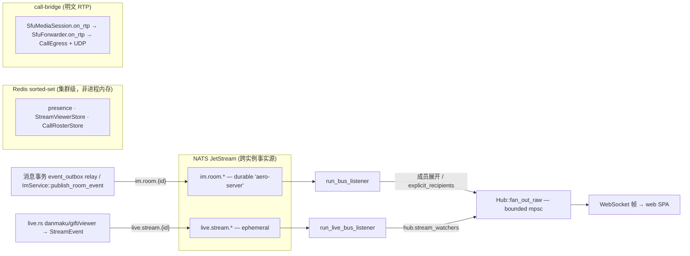

# AGENTS.md — Aero IM

> 编码 agent + 系统智能体（bots/workers/timers）操作手册：**怎么干活、哪些常驻智能体在跑、别踩哪些坑、什么在范围内**。
> **锚点约定**：会漂移的数字（迁移序号、功能/测试计数、**行号**）一律用源码与命令现场获取（如 `ls migrations/*.sql`、`cargo test`）——本文件只给**文件/模块/符号名当 grep 锚点，不写行号**。架构规范 → `docs/specs/2026-05-22-aero-im-design.md`。

## §1 系统骨架与事件 DAG

纯 Rust 的 AI-Native IM + 互动直播平台。全系统复用骨架 = **事件驱动 + 进程内扇出**：业务层产事件 → NATS 按 subject 跨实例投递 → 每进程 `Hub` 在本地扇出到 WebSocket。

- **房间实时**：消息创建/编辑/删除在同一 PG 事务追加 `event_outbox` 聚合版本，relay 严格按消息版本发布；其余 `RoomEvent` 可经 `ImService::publish_room_event`（`im-core/service/events.rs`）发布。两者统一拼 subject `im.room.{id}`、mint per-subject seq 并打 `"seq"` 戳发 NATS → `run_bus_listener`（**durable** consumer `aero-server`，`ws/ws_impl/bus.rs`）两阶段解码（先 raw JSON lift `seq` 再 typed `RoomEvent`）、展开 `NotifyBatch` / 查房成员 → `Hub::fan_out_raw` → WS。
- **直播实时**：`StreamEvent` → `live.stream.{id}` → `run_live_bus_listener`（**ephemeral** consumer——每实例都须见全部事件给本地 watcher 扇出，丢几条弹幕无碍）→ `hub.stream_watchers` → 扇出。
- **跨实例事实源 = NATS subject 上的 durable consumer**；`Hub` 只在本进程内 bounded `mpsc` 扇出（`hub.rs`），多开实例即水平扩。两命名空间各自 per-subject 单调 seq（`bus/seq.rs`），at-least-once 重投携同一 seq 供客户端去重/排序。
- **集群级状态走 Redis sorted-set**，绝不靠单进程内存：房间 presence、直播观看数（`StreamViewerStore`）、通话 roster（`CallRosterStore`），心跳 `zadd` + `zremrangebyscore` 驱逐过期（`live_presence.rs`）。
- **跨节点通话媒体 = call-bridge**（明文 RTP，DTLS-SRTP 只在客户端腿）：`SfuMediaSession.on_rtp` → `SfuForwarder.on_rtp` → 本地订阅者 + `CallEgress`，经 `bridge_frame` 编帧 + UDP 跨节点。SFU peer roster 是 `aero-live-webrtc` 进程内 `SfuRouter`（`Arc<RwLock<HashMap>>`，**非** DashMap、**非** Redis），每节点独立；**别和 Hub 的 `call_rosters`（P6 WS-mesh 通话名册）混**——跨节点媒体不靠任一者，走 call-bridge。

### crate 地图（依赖自下而上，勿成环）

| 层 | crate | 职责 |
|---|---|---|
| 基础 | `aero-common` | **叶子**：共享类型/ID/`Block`/`RoomEvent`/`StreamEvent`/`Error`/Config/telemetry；MLS 仅不透明字节 scaffold（`src/mls.rs`，无状态机） |
| 基础 | `aero-bus` | NATS JetStream `EventBus` trait + 实现（per-subject seq `bus/seq.rs`） |
| 基础 | `aero-storage` | sqlx 仓储（每功能一个 `XRepo`）+ `BlobStore`（LocalFs / `S3BlobStore`）+ Redis presence/roster |
| 基础 | `aero-auth` | Argon2id + RS256 JWT + `AuthUser`（JWT 失败回落 `aero_pat_*` PAT）+ OIDC + TOTP + 登录限流 |
| 基础 | `aero-signaling` | `RtcConfig`/`IceServer`/SDP·ICE 校验/`CallRoster` |
| IM | `aero-im-core` | `ImService` 编排（消息/编辑/删除/反应/已读/通知/通话/审核）+ `KeywordModerator` |
| IM | `aero-im-call` | 1:1/群通话编排：`CallOrchestrator` 落库 + SFU peer 簿记 + 未接检测 |
| IM | `aero-ai` | Anthropic / Voyage / `HashEmbedder` / `AiService` / `AiWorker` |
| IM | `aero-push` | 移动推送网关（FCM + APNs），token-provider seam + `FakeGateway` |
| 直播 | `aero-live-core`·`-rtmp`·`-hls` | `LiveIngest` trait · rml_rtmp 摄入 · `HlsWriter` + `FlvToTsConverter`（真 MPEG-TS mux） |
| 直播 | `aero-live-whip` | str0m WHIP/WHEP：SDP 应答 + RFC 6184 H.264 解包 + RTP→HLS + NAL 中继 |
| 直播 | `aero-live-webrtc` | str0m SFU：选择性转发 + seq/ts 重映射 + Simulcast + RTCP(PLI/FIR) + 跨节点 `CallBridge` |
| 直播 | `aero-live-srt` | 手写 SRT HSv5 + AES-CTR + Key Wrap(RFC 3394) + even/odd SEK 周期轮换 + ACK/NAK + `MpegTsSegmenter` |
| 组合 | `aero-server` | Axum gateway：HTTP + WS + WHIP/WHEP + HLS + RTMP `:1935` + bots/workers/timers + `Hub`；boot 装配在 `bin/boot/` |
| 组合 | `web/` | 零依赖 ES2020 SPA（hls.js / RTCPeerConnection / SpeechRecognition CDN） |

**技术栈**：Rust 2021 / MSRV 1.80 · tokio · axum 0.7 · sqlx 0.8 · fred 9(Redis 7) · async-nats 0.36(JetStream) · str0m 0.19（纯 Rust DTLS-SRTP，仅 `aero-live-whip`/`-webrtc` 各自 `Cargo.toml` 声明，**不在 root**）· Postgres 17 + pgvector + pg_trgm。

## §2 常驻智能体（CORE AGENT PROFILES）

> 全部由 `bin/boot/`（`background.rs` 装 bot，其余装 timer/worker）在 boot 时装配。「触发」标 **OPT-IN** 的须 env gate，否则无条件常驻。每行锚点 = 该智能体自己的模块（稳定，可 grep）。

### 总线消费 bot（订阅 NATS subject，逐事件反应）

| bot（模块） | 触发 / opt-in | 行为 + **关键不变量** |
|---|---|---|
| **agent_bot**（`agent_bot.rs`） | `im.room.*` durable `aero-bot`，`Message` | @提及的 Bot/Agent 应答：gate（bot kind / 非自回 / `is_member` / 问题非空）→ `ai.answer_question`（交互路径，非 ai_jobs）→ threaded 回原消息。**每个新的合格事件无独立预算/限流**；已完成事件由通用 consumer receipt 阻止重放再调用。Fail-open：AI 错误降级道歉不丢消息；自回守卫防环 |
| **ooo_bot**（`ooo_bot.rs`） | `im.room.*` durable `aero-ooo`，`Message` | 真 1:1 DM 内以缺席者身份发其 OOO 文案。**有 per-(ooo_user,sender) 幂等**（`ON CONFLICT DO NOTHING`），record-after-send（失败下条重试）。结构性无自回 |
| **unfurl_bot**（`unfurl_bot.rs`） | `im.room.*` durable `aero-unfurl`；**OPT-IN `AERO_UNFURL`** | 原消息原地 `edit` 追加 link-preview `Card` 并重广播 `Edited`。**loop-guard**：已带 preview 即跳（防自产 Edited 重入）；仅 `has_metadata` 成卡；系统代发绕 author-only 守卫。Fail-open log-skip |
| **transcribe_bot**（`transcribe_bot.rs`） | `im.room.*` durable `aero-transcribe`，`Message` | 未转写 `Block::Voice` → `ai.transcribe`（`OPENAI_API_KEY`→Whisper，否则 stub 占位）→ 原地写 transcript + 重广播 `Edited`。幂等守卫：仅 `transcript.is_none()` 命中。Fail-open per-target |
| **golive_bot**（`golive_bot.rs`） | `live.stream.*` queue-group durable `aero-golive`（集群单节点扇出），`Status{Live}` | 开播 → `StreamFollowRepo::followers` → 逐 follower `insert_go_live`。按 `(participant_id, stream_id)` 唯一，`ON CONFLICT DO NOTHING`，重投幂等。Fail-open per-follower。**三种摄入统一通知**：WHIP/RTMP/SRT 均在标记 `live` 的同一 PG 语句中写入 `stream_go_live_outbox` 快照；轮询 relay 以 stable `event_id` 幂等发布 NATS，并将匹配的 `stream.live` webhook 物化为持久 delivery 后才完成 outbox 行 |
| **push_bot**（`push_bot.rs`） | `im.room.*` durable `aero-push`，`Notify`/`NotifyBatch`；**OPT-IN `state.push.any_enabled()`**（FCM/APNs≥1） | 每注册设备一条 FCM/APNs 推送（sender 名 + 140 字预览 + deep-link）。**死 token 回收**：`Rejected`→`unregister`。已完成事件由 consumer receipt 去重；外部网关成功后、receipt 完成前进程崩溃仍是 at-least-once 的经典不确定窗口。Fail-open log-skip；无限流 |
| **moderation_bot**（`moderation_bot.rs`） | `im.room.*` durable `aero-moderation`；**OPT-IN `AERO_AI_MODERATION` 且 AI 已配** | 有界 mpsc（默 512）→ N worker（默 2）；per-job：**先 per-ws `KeyedCostBudget`(60) 后全局 `CostBudget`(300) over 60s** → `ai.moderate` → 命中即软删 + `message.moderated` 审计**单事务** + 广播 `Deleted`。Fail-open 筛查（非投递门）；有界队列满即 skip 不背压；软删幂等 |

`agent_bot` / `ooo_bot` / `unfurl_bot` / `transcribe_bot` / `moderation_bot` / `push_bot` / `bot_dispatch` / webhook dispatcher 的外部副作用均先以 `(consumer,event_id)` 领取 `ConsumerEventReceiptRepo` 租约；完成后落 durable receipt，失败释放、过期可 fencing 重领，避免 NATS 超出 broker 去重窗口后的重放重复外发。`golive_bot` 接收由事务 outbox 固化并随 NATS 事件传递的 stable `event_id`；其 follower 通知仍以 `(participant_id,stream_id)` 业务唯一键幂等。`stream.live` webhook 不由 relay 直接外发，而是先以同一 `event_id` 物化到 durable delivery 队列，由统一 webhook worker 重试。

### 作业 / worker

| 智能体（模块） | 触发 | 行为 + **关键不变量** |
|---|---|---|
| **AiWorker**（`aero-ai/.../worker`） | **无 bus**——轮询 PG `ai_jobs`（`FOR UPDATE SKIP LOCKED`）；AI 服务构造即常驻。kinds：Embed/Summarize/Moderate/Answer | claim 量 = 剩余全局预算 → per-ws 超则 `defer`（不耗 retry）→ 全局 weighted all-or-nothing → `Semaphore` 限并发。**预算 FAILS-CLOSED on spend**：全局 120 按 per-kind WEIGHT(Embed1/Mod2/Sum3/Ans5) + per-ws 120 over 60s，超额 defer 下窗（不丢/不失败/不耗 retry）。**付费调用先 reserve 再出网**：稳定 operation id + fencing token；成功按真实用量 finalize 并持久化最小可重放结果，普通失败 cancel，传输结果不明保留 reservation 并超时按保守估算结算；重试不得二次调用 provider。**DEAD-LETTER `MAX_ATTEMPTS=5`→`dead`**。幂等：Embed 空跳付费、Moderate 已删 no-op；`SKIP LOCKED` 水平扩 |

### 定时清扫 / 心跳（`interval`，多数 env 可禁、`MissedTickBehavior::Skip`、Best-effort warn 不 panic）

| 定时器 | 触发 / env | 行为 + **关键不变量** |
|---|---|---|
| **retention/ephemeral/ban/points sweep** | `AERO__SERVER__RETENTION_SWEEP_SECS`（默 3600，0 禁） | 顺跑 4 set-based 清扫（过期消息软删 / ephemeral 硬删 / 过期 ban 硬删 / 过期 points 清零）；软删每行扇 `Deleted`。跳被法务保全的消息 |
| **rate_limiter / spam / slow-mode / login-throttle 空闲清扫** | `AERO_RATE_LIMIT_SWEEP_SECS`（默 60）；持 cancel token | 驱逐空闲+满桶的 per-client 桶（等价 fresh，安全）+ spam-guard 空闲 sender + slow-mode `LAST_POST`（进程级 static，按 `MIN_SAFE_SWEEP_IDLE` floor）+ in-process login-throttle，**界定所有 per-key map 增长（DoS 放大器）** |
| **call_route / stream_route heartbeat** | `AERO_{CALL,STREAM}_ROUTE_HEARTBEAT_SECS`（默 30，0 禁） | 每 tick 快照本节点 roster / live 流，重盖 Redis TTL，使跨节点桥/sticky-routing 目标持续可解析。Redis 已接线 |
| **blob_gc_drain**（GDPR/附件清理） | 固定 60s，持共享 cancel token | drain ≤50：普通清理先查 live reference，有引用则 `cancel`；GDPR/失效 reservation 等 `force_delete` 不可取消；随后 `blob_store.delete`，**仅 Ok 才 `ack`**（delete-then-ack，失败留行重试）。消息附件加锁校验与普通 enqueue 的 `FOR UPDATE` 共同封住 attach/enqueue/delete 竞态 |
| **integration receipt sweep** | `AERO__SERVER__INTEGRATION_RECEIPT_SWEEP_SECS`（0 禁），持共享 cancel token | 有界清扫过期 machine request / notification / blob 幂等 receipt；live processing lease 不删。最后一个 blob receipt 到期只入普通 blob GC，消息仍引用则取消删除；安装 blob ledger 仅随 blob 真删除扣账 |
| **embedding_backfill**（RAG） | 固定 300s | 扫 ≤200 无 embedding 消息 → `enqueue_unique(Embed)` dedup → AiWorker 填；受下游 AI 预算约束 |
| **observability_gauge_samplers** | 九个采样 timer（DB 池+WHIP 15s / index-size 60s（`AERO_INDEX_SIZE_SAMPLE_SECS`，0/非法回默认）/ PG stats 60s（`AERO_PG_STATS_SAMPLE_SECS`，0 禁）/ AI DLQ 30s / failed-pairs DLQ 30s / audit-relay counter snapshot 30s / audit outbox Tier-1 30s / Tier-2 默认 300s（`AERO__SERVER__AUDIT_OUTBOX_FULL_SAMPLE_SECS`，0/非法禁用）/ NATS backlog 30s），均持共享 cancel token + `MissedTickBehavior::Skip` | 只读设 Prometheus gauge，永不改状态；查询失败不伪造零值并保留旧值（Tier-1 另设 `sampler_up=0`、递增 errors） |

### 核心扇出循环（boot 起一个/进程）

| 循环（`ws/ws_impl/bus.rs`） | 行为 + **关键不变量** |
|---|---|
| **run_bus_listener** | `im.room.*` **durable** `aero-server`（at-least-once）：解码前 lift `seq`（serde 丢未知键）→ `NotifyBatch` 展开为 per-recipient（避 O(N) NATS）→ `RoomEvent::Message` inc `MESSAGES_SENT_TOTAL`（**唯一非重复计数收口**）→ `fan_out_raw` → ack。坏 payload nack。durable cursor（与 webhook dispatcher 不同） |
| **run_live_bus_listener** | `live.stream.*` **EPHEMERAL**：每实例须见每事件扇本地 `hub.stream_watchers`，重启丢几条弹幕无碍；无本地 watcher 时整跳扇出 |

### 媒体生产接线（结构/localhost 已测；真实网络仍须 staging）

| 组件（模块） | 状态 |
|---|---|
| **call_bridge_supervisor**（`call_bridge_supervisor.rs`） | PULL（`ensure_bridges`：拉远端 RTP 入本地 SFU）+ PUSH（`ensure_egress`：UDP relay 本地 RTP 给订阅 puller）均在 call/SFU lifecycle 接线；secret-gated `/api/internal/call-bridge/{subscribe,feedback}` 分别承载 egress 宣告与 PLI/FIR/REMB。registry keyed `(call,peer_url)` 幂等；单节点/不可达时休眠不 panic。本机双 gateway、重连与真实 v3/v4 混跑已通过，剩余是跨主机可达地址、NAT/防火墙联调 |
| **sfu_media_session**（`sfu_media.rs`） | `SfuMediaRegistry::from_env` 在生产 supervisor 构造，WS `call_sfu_v2` offer/ICE/subscription 驱动 `bind`→`run(cancel)`；Media→`forwarder.on_rtp` 给本地订阅者，并经 egress 跨节点 `publish`。generation/revision 隔离重协商与旧 ICE。真实 Chrome/Firefox 虚拟媒体及本机 coturn 强制 relay 已通过；物理设备、Safari 与跨主机公网网络仍待 staging |

## §3 功能能力索引（FEATURE MATRIX）

> **完整功能清单见 `README.md`「功能矩阵」**。全部路由在 `routes/routes.rs::build()` 一处装配（核心内联，扩展能力以 `.merge(crate::<mod>::routes())` 挂载，约 100+ 子模块）。WS 帧定义见 `ws/ws_impl/`（`ClientFrame` / `ServerFrame`）。下表只给**能力域 → 触发面 → 确定性产物**当导航。

| 能力域 | 触发面（REST / WS / 总线 / 定时器） | 确定性产物 / 副作用 |
|---|---|---|
| **IM 消息**（发/历史/单条 GET/编辑/删/反应） | WS `send_message`/`edit_message`/`delete_message`/`react`；REST `POST /api/rooms/:id/messages`（`Idempotency-Key` / `client_message_id`）、`GET /api/messages/:id`、`PATCH`/`DELETE /api/messages/:id`、`POST /api/messages/:id/reactions` | 消息、sender 幂等键、聚合版本 event outbox、通知/AI side-effect jobs 同事务；relay 保序发房内 `RoomEvent`；删除走事务化软删 + 审计（`soft_delete_audited`）；编辑捕获前版本入 `message_history` |
| **协作**（已读/回执/typing/线程/未读） | WS `mark_read`/`typing`；REST `read`/`receipts`、`crate::thread_subs`（线程订阅/通知级/参与者）、`read_all`/`mark_unread` | 回执游标推进 + 帧扇出；mark-unread 回拨游标重标红；线程参与者名册有界（roster 是 UI 装饰） |
| **工作区/频道/RBAC** | `crate::{workspaces,channels,channel_roles,guests}`；`POST /api/rooms`（`create_room_in_workspace`，**名校验** trim/拒空/≤128） | 多租户房间（`rooms.workspace_id` NOT NULL）；公开/私有/归档/topic、角色/转让所有权；访客单频道隔离 |
| **Presence/在线名册** | WS 连接（hub 进程内视图）；REST `crate::online`（走 `participant_cache`） | Redis presence + 房内在线名册/计数 |
| **AI**（摘要/RAG 问答/流式/嵌入/翻译/写作/跨房画像） | REST `summarize`/`ask`/`ask/stream`(SSE)/`ask/context`；`crate::{translate,ai_rewrite,catchup,workspace_ask,thread_summarize,digests,find_expert}` | Anthropic Messages + Voyage 嵌入（1024 维，无 key 退 `HashEmbedder`）；RAG 向量检索；跨房画像 opt-in `AERO_AI_CROSS_ROOM_PROFILE`（读时按需抽取填表） |
| **AI 审核/情感/异步队列** | 同步关键词 `AERO_BLOCKED_WORDS`；异步 `AERO_AI_MODERATION` 入预算队列；`crate::{message_sentiment,message_reports}` | 命中词拒发；AI 审核异步出结果 + DLQ（`crate::ai_dlq`）；情感/毒性/语气非阻塞标注 |
| **直播摄入 RTMP/WHIP/WHEP/SRT → HLS** | TCP `:1935` RTMP；REST `whip`/`whep`/`whip/resource`（body=SDP）；SRT HSv5(UDP) | str0m SDP 应答 + H.264 解/打包 + 重排序 → 真 MPEG-TS `.ts`/`.m3u8`；SRT AES-CTR + even/odd SEK 轮换 + ACK/NAK |
| **直播互动**（弹幕/礼物/榜/观看数/hype/raid/prediction/goal/points） | WS `stream_chat`/`stream_gift`/`watch_stream`；REST `/api/streams/:id/{chat,gifts,leaderboard}` 等 | NATS `live.stream.*` 扇出 `stream_event`；持久弹幕/礼物 + 打赏榜；prediction outcomes ≤24 上限 |
| **通话**（1:1 / 群 mesh+SFU / 字幕 / 跨节点桥） | WS `call_*` / `call_sfu_*`；内部 `POST /api/internal/call-bridge/{subscribe,feedback}`（secret-gated） | NATS 信令；`CallOrchestrator` start/answer/end + roster + 漏接检测；浏览器 SFU v2 + Simulcast + RTCP；跨节点明文 RTP 与反馈控制；字幕经 Anthropic 翻译；结束持久字幕 + AI 复盘 |
| **搜索**（FTS/向量/hybrid + 操作符） | REST `POST /api/rooms/:id/search` `mode`∈`fts`/`vector`/`hybrid`/`auto`；`crate::{search,saved_searches,search_advanced}`（`from:`/`in:`/`before:`/`after:`） | pg_trgm / pgvector / `merge_hits` 融合；跨房复用成员边界 |
| **投票（polls）** | REST `POST/GET /api/rooms/:id/polls`（含 `?open=`）、`GET /api/polls/:id`、`vote`/`close`；web `polls.js` UI；`Poll` RoomEvent | 单/多选 + 匿名（读路径不暴露投票人）；vote 在 `FOR UPDATE` 锁下复检 `closed_at`（防 TOCTOU）；creator-only close |
| **通知/推送/动态 feed** | `crate::{notif_prefs,keyword_alerts,snooze,activity,push_tokens}`；golive/missed-call 总线扇出 | 持久收件箱 + 静音/DND/snooze 门控；推送 token 注册 |
| **企业接入**（SSO/SCIM/OIDC/2FA/PAT/Webhook/IP 名单） | REST `auth/oidc`、`/scim/v2/*`（Bearer）；`crate::{twofa,pat,webhooks,webhook_admin,invitations,ip_allowlist}` | OIDC JIT；SCIM 2.0 入站供给；登录 TOTP 强制；PAT 通用 bearer；webhook + DLQ + requeue（revoke 经房访问鉴权 + 清理专用 bot）；**IP 名单经 `ip_allowlist::enforce_layer` 中间件强制**（空名单=放行，DB 错 fail-open，管理路由豁免防自锁） |
| **治理**（审核/留存/GDPR/法务保全/会话吊销） | REST `GET /api/me/export`；`crate::{legal_holds,channel_retention,info_barriers,deactivation,sessions,admin_sessions}`；留存清扫定时器 | 个人数据导出；按频道 retention（COALESCE 覆盖工作区默认）；GDPR 删号 tombstone + 显式删全部 participant-keyed PII 表（cascade 不触发，见 `participant.rs` 删除列表）；会话清单 + 远程/全局登出 |
| **限流/可观测/健康** | REST `/metrics`（bearer 门控）、`/health{,/live,/ready}`；WS 路径 `check_ws_rate_room` | Prometheus + OTLP；readiness 探 PG/Redis/NATS/blob + draining 503；按工作区限流档（`AERO_WS_RATE_*`，Redis 故障 fail-open）；`X-RateLimit-*` + `Retry-After` 头 |
| **请求关联/压缩** | 全局中间件 `inject_request_id` + `CompressionLayer` | 每响应 `x-request-id`（缺则 UUID v4）；text/json/html gzip |

## §4 全局约束 & 边界规则

> 只给「动手前必守的硬规则 + 运行期坑 + 范围红线」。引用皆 grep 锚点，以源码为准。

### 4.1 加功能配方（迁移 → 仓储 → 路由 → 鉴权 → 实时，load-bearing）

照抄 `storage/saved_search.rs` + `server/saved_searches.rs`：

1. **迁移** `migrations/NNNN_x.sql`（下一序号，`CREATE TABLE IF NOT EXISTS`、uuid 主键、幂等）→ ⚠️ **加迁移后必先 `cargo build` 再 `aero-cli migrate`**（迁移编译期嵌入 bin，见 §4.2）。需新 ID 先于仓储：`common/src/ids.rs::define_id!`。
2. **仓储** `storage/src/x.rs`：`XRepo` 包 `PgPool`，方法 owner/room-scoped；db_tests `#[ignore]`+`DATABASE_URL` 门控；`lib.rs` `pub mod`+`pub use`（**别 root re-export 撞名 token helper**，见 §4.2）。
3. **HTTP** `server/src/x.rs`：`pub fn routes() -> Router<AppState>` 内 `XRepo::new(s.pg.clone())` **内联建仓储**，`.merge` 进 `routes::build`。
4. **鉴权**：`AuthUser` extractor；房间数据路由**一律先** `ImService::assert_room_access(participant, room)`（**participant 在前**）；工作区管理端用 `WorkspaceRepo::effective_member_role`（Owner/Admin），把停用、删号和强制 2FA 一并纳入判定。CI `authz_lint` 兜底。**所有 mutating 路由必须校验调用者拥有/可管理目标资源**——绑 `_auth`（丢身份）或按全局 id 改而不校验 = IDOR。
5. **实时**（如需）：加 `RoomEvent`/`StreamEvent` variant（当心 `kind` tag）→ `Hub` 扇出 → WS 帧 → **web 端须有对应 `ws.on('msg:..')` 处理**（否则帧静默丢，UI 不更新）。**后台任务**（如需）：`bin/boot/` 里 `tokio::spawn`（既有清单见 §2）。
6. **输入校验**：name/title 等文本字段照 sibling/edit 路径 trim + 拒空 + 长度上限（`create_room`≤128 / bot 名≤64 / stream title≤200 / poll outcomes≤24）——create 路径勿漏 edit 已有的校验。批量 `Vec` 请求体必须有上限（broadcast 目标≤100，否则一请求 N 次 DB 往返 = DoS）。

**多 agent 并行集成**：一 agent 管一**不相交单元**，git worktree 隔离，**先 `git reset --hard master` 校准基线**；依赖只加自身 crate `Cargo.toml`（别动 root）。集成时**拉新文件** + **手接共享文件**（`routes::build` `.merge` 链、`lib.rs` re-export、`ids.rs`、`RoomEvent`/match 臂），合后 `cargo check --workspace`。

### 4.2 硬性工程规则（违反即坏）

- **迁移编译期嵌入，加迁移必先 `cargo build` 再 migrate**：`migrate()` 唯一调用点（`aero-storage/db.rs` 的 `sqlx::migrate!("../../migrations")`）把整个 `migrations/` 烤进 bin。改/加 `migrations/NNNN_*.sql` 后没重新 build 就 `aero-cli migrate` → **新迁移静默 no-op**。顺序：build → migrate。**迁移计数勿在文档硬编码**（`ls migrations/*.sql | wc -l` 即得）。
- **房间数据路由一律先 `assert_room_access(participant, room)`**：唯一获批的通用房间租户守卫（`im-core/service/`，**participant 参在前**），内部串「room→workspace 解析 + workspace 成员 + room 成员 + 停用门 + 强制 2FA 门」，未知 room→`NotFound`、拒绝→`Forbidden`。CI `tests/authz_lint.rs` 源码扫：handler parse 出 `RoomId`/`WorkspaceId` 却没出现 canonical/effective guard 即红，并另行禁止把裸 `.is_member(`/`.member_role(` 当调用者鉴权。workspace 管理端用 `effective_member_role` + `can_administer`；只有 lint 内明确列出的目标资源检查例外可用 raw lookup。
- **tagged-enum `kind` 标签撞名陷阱**：总线 enum 用 `tag="kind"`，**variant 内不得再有名为 `kind` 的字段**（否则 serde `duplicate field kind` panic）。已用 `#[serde(rename=...)]` 规避（`common/src/model/`：`CallEvent::{Invite,Join,Roster}` 的 `kind`→`call_kind`、`RoomEvent::Notify` 的 `kind`→`notify_kind`）。新 variant 复刻；web 兜底 `event.call_kind || event.kind`。
- **token helper 同名不可在 crate root re-export**：`webhook`/`scim`/`invitation` 各有 `generate_token`+`hash_token`。`aero-storage/lib.rs` **只 re-export `webhook::{generate_token,hash_token}`**；`invitation`/`scim`/`revoked_token` 的同名 helper **故意不 re-export**，消费方走子路径 `aero_storage::invitation::` 等。别提到 root，会撞名。
- **workspace lints — 不引新警告**：root `Cargo.toml`：`unsafe_code = "forbid"`（硬禁）、`unreachable_pub = "warn"`、clippy `all`+`pedantic` 均 `warn`（已 `allow` 一组）。提交前 `cargo clippy --workspace --all-targets` 不得新增警告；storage/server 的存量 pedantic 债非本批次别背。
- **AI 无 key 退化，逻辑路径不变**：无 Voyage/Anthropic key 退确定性 `HashEmbedder`（`EMBED_DIM=1024`，对齐 voyage-3）+ 启发式 completion。**沙箱 AI 路由也应 200**——别因「没 key」就认为路径断了。
- **项目结构治理（根最小化 + crate=feature 单位）**：根目录常规文件 **≤16** 且仅 allowlist（`Cargo.{toml,lock}`/`rust-toolchain.toml` + `README`/`AGENTS`/`HARNESS`/`BOOTSTRAP`/`Makefile`/`deny.toml`/`docker-compose.yml`/`.gitignore`/`.env.example`/`config.example.toml`/CI）；散落脚本归 `scripts/`。**feature-first 单位是 crate，不是 `src/{domain}/`**——勿照搬 Node 分层；新领域开新 crate，或 crate 内按 `repo/service/route` 分模块（子模块走目录 + `mod.rs` 收口）。尺寸阈值**以 `scripts/file-size-check.sh` 为唯一来源**（Rust 800 WARN / 1200 HARD，JS 1000，`routes/routes.rs`≤3000）——别引第二套「500」数字。整理流程见 `skills/project-reorganization.md`；**禁止在另一次重构中途（`git status` 有大量在途删除）叠加结构迁移**。
- **缓存写读两面**：每个改 participant 字段的写路径（`update_me`/`delete_me`）都要 `participant_cache.invalidate`；热可轮询读路径（如 `online`）走 `participant_cache.get_or_fetch` 而非裸 `participants.get`。
- **at-least-once 状态机**：付费/外发/计费副作用须有幂等键；每个非成功分支都要把已认领的行**重泊到可重试态**（如 webhook redeliver 的 transient 错误 `mark_failed_with_backoff`），否则被 claim/sweep/requeue 的状态过滤变僵尸行。

### 4.3 运行期边界条件（本地起服务 / 活验证）

- **server 只能前台跑**：后台长驻网络进程被 harness 回收（**exit 144 / SIGURG**）。活法：前台跑 / `setsid … &` 起 server，短命 smoke 跑完 `pkill aero-server`，输出重定向到文件再读。（bin 内有 `CancellationToken` 优雅 drain，是正常关停，与 harness 回收无关。）
- **config 前缀双下划线 `AERO__SECTION__KEY`**（figment，`Env::prefixed("AERO__").split("__")`），如 `AERO__DATABASE__URL`、`AERO__SERVER__BLOB_DIR`。**例外：限流是单下划线 plain env** `AERO_RATE_LIMIT_PER_SEC`/`AERO_AUTH_RATE_LIMIT_PER_SEC`（冒烟前调高免 429）；同类单下划线还有 `AERO_TRACE_SAMPLE_RATE`、`AERO_S3_*`、`AERO_INTERNAL_BRIDGE_SECRET`、`AERO_TRUSTED_PROXY_CIDRS`。后者默认空：只有 transport peer 命中可信代理 CIDR 时才按代理链解析转发头，直连客户端伪造 `X-Forwarded-For` 不得参与 IP 授权或限流。
- **端口 8080 vs 3030 对齐**：`config.example.toml` = `8080`，但仓库已存的 `config.toml` = `3030`，smoke 脚本默认 `AERO_HOST=http://localhost:3030`。实际端口取决于落地的 `config.toml`，对不齐就连不上。RTMP 固定 `:1935`。
- **`data/` 由容器以 root 创建，默认写不进**：覆写 `AERO__SERVER__BLOB_DIR=/tmp/aero/blobs AERO__SERVER__HLS_DIR=/tmp/aero/hls`。
- **活验证用全新一次性库**（`CREATE DATABASE` 再迁，别动共享 dev 库 / 别手改 `_sqlx_migrations` 账本）；用完 `DROP DATABASE`。`make migrate-smoke` 在 throwaway 库 replay 全链验 fresh-deploy。
- **提交前必过**：`cargo check --workspace`（干净）· `cargo test --workspace --lib`（全绿是底线；PG 门控测试加 `-- --ignored`，需 `DATABASE_URL`+已迁移）· `cargo clippy --workspace --all-targets`（别新增警告）· `scripts/{truth-check,file-size-check,web-check}.sh`（0 违规）。**「跑全量 test」非「光 check」**——孤儿模块/零调用 builder 编译过但是死代码（`truth-check.sh` 抓）。
- zsh 裸 glob（`--include=*.rs`）被 shell 抢先展开报 `no matches found`；加引号或 `rg --glob '*.rs'`。

### 4.4 禁区 / 非目标（产品既定，别造）

- **MLS E2E 客户端**：`common/src/mls.rs` 仅不透明字节 scaffold，**不实现状态机**，无 openmls 依赖。`mls_upsert_group` 存 E2E 加密不透明 blob（server 无法校验，client 端 crypto 是安全边界）——别当 seam 补客户端密码学。
- **联邦（federation）**：零代码零 scaffold，明确出范围。
- **移动端原生 SDK**：Web 优先；`aero-push` 是服务端 FCM/APNs 网关，非客户端 SDK。
- **设计边界（已实现，别越界补全 / 别当 TODO）**：SCIM 仅**入站**供给（无出站同步、无完整 PATCH path-filter 文法）；VOD 只管录制元数据/章节/生命周期，切片骑既有 HLS writer（非独立转码管线）；OpenAPI 是手写示意性文档（非全量契约）。
- **`truth-check` allowlist 中的零调用 builder**（如 `with_relay`/`with_cost_model`/`with_rtmp_listen`）是可选 infra 扩展 seam，非死代码；它们与 §2 已接线的 SFU/call-bridge 生产路径不是一回事——别为了消警告强接。

### 4.5 Staging seams（已建+已测，真实端到端需真对端——写「待联调」别写「完成」）

- **真实 WebRTC ICE/DTLS/SRTP 握手**：浏览器 `call_sfu_v2`、str0m `SfuMediaSession`、多发布者 topology 和 egress 已接线；真实 Chrome/Firefox 虚拟媒体、Chrome WHEP 与本机 coturn 强制 relay 已通过，**CI 不跑**。物理设备、Safari、跨主机公网 NAT/防火墙/公网 TURN 仍待。
- **真实两节点网络/NAT**：call-bridge 明文 RTP、`bridge_frame`、secret-gated subscribe + RTCP feedback 已建并 localhost 测；仍须以可路由的 `AERO_{SFU,BRIDGE}_ADVERTISE_HOST` 验证节点路由、UDP 可达、NAT/防火墙。
- **真实 ffmpeg/OBS 推流**：真实 ffmpeg RTMP/WHIP/加密 SRT（含 post-handshake SEK 轮换）和真实 OBS Studio RTMP → HLS 已通过；物理推流设备与跨网部署另算。
- **真实外部凭据网络往返**：`S3BlobStore` 是真 reqwest+SigV4 实现（生产 boot 仅在 `AERO_BLOB_BACKEND=s3` 时启用，配置不全 fail-loud；否则 LocalFs）；push 网关、SMTP/OIDC/OTLP 等均有实现/测试 seam，**真实 S3/MinIO、FCM/APNs、SMTP、OIDC/OTLP 凭据往返不在沙箱跑**。SAML 不是同类“只差凭据”项：metadata/AuthnRequest/JIT 骨架已建，但 ACS 默认 fail-closed；`AERO_SAML_EXPERIMENTAL_VERIFY=1` 仅启用未审计 verifier，生产仍须接入并评审经审计的 XML-DSig 实现。
- **web poll UI 的视觉/点击交互** browser-only 无法自动测——api 路由对齐后端 smoke、DOM-id 1:1、eslint no-undef + web-check 已静态验透，逻辑隔离在 `web/polls.js`。

**str0m 声明位置**：仅 `aero-live-whip`/`aero-live-webrtc` 各自 `Cargo.toml`，**root 无 str0m**——别往 root 加。
