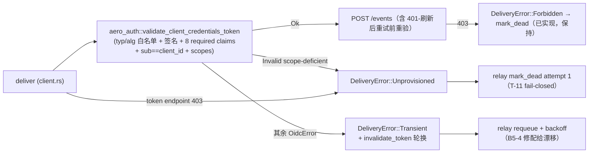

# Design — aero-auth 机器令牌（client_credentials）验证 seam 作为 relay connector 唯一验证源（B5-2）

- **Module (analysis root)**: `crates/aero-auth`（seam 所在，**零生产代码改动**）；落地全部在 `crates/aero-audit-connector`（untracked）
- **Requirements**: `docs/requirements/2026-08-08-aero-auth-b5-2-machine-token-verification-seam.req.md`（本设计以其 §5 R1-R6 / §6 G1-G3 为验收基线）
- **Supersedes**: `docs/design/2026-08-07-aero-auth-b5-2-machine-token-verification-seam.design.md`（其「0239 未落库 → drill SKIP」状态已过期；2026-08-08 现场复核修正证据行号/计数）
- **Status**: Design（全部引用经源码 grep + 实跑测试复核，见 §1）

## 1. 证据复核处置（2026-08-08 现场，全部 ✅）

| 引用 | 复核结果 |
|---|---|
| E1 `oidc.rs` seam（LEEWAY 60 :293、`ClientCredentialsTokenConfig` :364、`granted_scopes` :387、`validate_client_credentials_token` :406、typ/alg 白名单、sub==client_id :445-450、future-iat :453、jti :455-459、scope :461-466） | ✅ 逐条命中。`required_spec_claims` = iss/aud/exp/nbf/iat/jti/sub/client_id 8 项 :440。**机制勘误（crypto_reviewer 实测 jsonwebtoken 9.3.1 源码）**：`validate()` 对 `required_spec_claims` 只认 exp/sub/iss/aud/nbf，其余名字 `_ => continue` 静默忽略——iat/jti/client_id 三项的「必须存在」实际由 **serde 非 `Option` 字段**（`ClientCredentialsClaims` 的 `iat: u64`/`jti: String`/`client_id: String`，:372-378）强制：缺失 → serde missing-field → `OidcError::Invalid`。功能上 8 项全 fail-closed（已实测），但该集合对 3 项是死代码；**若日后有人给这三字段加 `#[serde(default)]`，库层不会兜底**——§7 G2 的缺 client_id/缺 sub 用例就是这道防线的回归钉（红线内只能在 connector 侧补，见下） |
| E2 `oidc/tests.rs` 8 测试 :332/:350/:366/:378/:392/:406/:429/:452 + 夹具 :64/:163/:214/:230 | ✅ 精确命中；**实跑 `cargo test -p aero-auth --lib` = 81/81 绿** |
| E3 `lib.rs:27-31` re-export（验证器 + 配置 + KeyProvider + Static/Jwks 实现） | ✅ 命中，`validate_client_credentials_token` 在 :28 |
| E4 唯一生产消费者 `integrations.rs`（`authenticate_machine` :236-246，:240 调用；`INTEGRATION_JWKS` :63） | ✅ 命中（fn 行号 :236，比引用的 :233 漂 3 行，符号稳定）；全仓 grep 确认仅 lib/oidc/oidc.tests/integrations 出现 |
| E5 `client.rs` 重复验证器：`validate_token_claims` :197-263（4 查 iss/aud/scope/sub，sub 比对 `expected_sub`）、`decode_jwt_claims` :415（base64url 无验签）、`deliver` :120 前置 :126 | ✅ 全部命中 |
| E6 `stub.rs` `make_jwt` :233-245 alg:none + 假签名 | ✅ 命中，doc 注释明言 "fake signature is enough" |
| E7 `Cargo.toml` 无 aero-auth、仅 base64 "0.22" | ✅ 命中；base64 仅 client.rs:16 + stub.rs:10 两处使用 |
| E8 勘误：18≠17（claim_validation 11 + state_machine 7）；`forbidden_dead_on_first_attempt` :231≠:216；drill 在 `src/bin/`；26 passed/3 ignored | ✅ **全部复核确认**（实跑：lib 8 + claim_validation 11 + state_machine 7 = 26 passed / 3 PG-ignored；`forbidden_dead_on_first_attempt` 现位 state_machine.rs:177） |
| E9 状态机：Forbidden→dead :202（无 `is_dead_at` 门）、Permanent→requeue×1→dead :216、Transient→requeue :232、`transient_claim_drift_requeues_without_any_post` :398；`SinkBehavior` **无** `token_style`/`token_endpoint_status` | ✅ 命中（AC2(b) 需新增字段的旗标成立）；`FakeStatus::Dead`=3，claim_due 排除 Delivered/Dead :207 |
| 勘误④ 0239/0240/0241 已落库、`test-integration.sh` A3 :306-341 / T-11 :344+ 门已开 | ✅ 命中（`ls migrations | tail` = 0241；门条件 `[ -f migrations/0239_audit_governance_outbox.sql ]` 现为真） |

**新增复核事实（设计据此）**：
- `request_token` :287 对一切非 200 `bail!`（anyhow）→ 经 `#[from]` 变 Transient——**token-endpoint 403 目前无独立分类点**，R4/AC2(b) 需要显式映射。
- stub 默认 `token_claims` 只有 iss/aud/scope/sub，**无 exp/nbf/iat/jti/client_id**——换验证器后（8 项 required claims + sub==client_id）默认夹具必然 fail-closed，stub 必须补发齐。
- `RelayConfig` 字面量构造共 **6 处**（3 个 drill `relay-drill.rs:92`/`t11-drill.rs:122`/`priority-drill.rs:144` + `state_machine.rs:44` + `claim_validation.rs:26` + **`relay.rs:263` 在模块 `test_config`——设计原稿漏列**），全部带 `expected_sub: "aero-im.source"`——字段删除/收敛是横切改动，漏一处即编译红（gate 8 的 `--all-targets` 兜底）。
- `AuditClient::new` 构造点共 **10 处**（3 个 drill `relay-drill.rs:125`/`t11-drill.rs:153`/`priority-drill.rs:198` + `state_machine.rs:57` + `claim_validation.rs:68/:158/:188/:218/:237` 共 5 处 + **`relay.rs:311` 在模块 transient 三例**）——全部须随迁 `with_key_provider(StaticKeyProvider::single(...))`，否则删 `expected_sub` 编译红、且 relay.rs 在模块三例运行时 JWKS 不可达 → Transient → `posts()==0` vs 断言 `posts()==1`（`transient_5xx…`/`transient_timeout…`）红。
- **seam cc 路径 8 测试未覆盖的三面**（红线内不可给 aero-auth 加测试，由 connector G2 矩阵补）：缺 typ（cc 路径只有错 typ `"JWT"` 一例 :366，缺 typ 仅 id 路径 `assert_id_token_type_policy` 测过且 id 路径本就容忍缺 typ——cc 路径缺 typ 是独立输入面）、缺 client_id（`client_id` 是夹具 struct 的非 Option 字段，seam 夹具今天根本无法省略它）、HS256 混淆（seam 的 `rejects_algorithm_outside_explicit_allowlist` 只在 id 路径，cc 路径无算法混淆回归钉）。
- **T-11 字符串钉**：`t11-drill.rs:185-187` 断言 `last_error LIKE '%audit connector HTTP transport failed%' == N`（每轮）；该字面量唯一产自 `client.rs:455 transport_error()`，经 `DeliveryError::Transient` Display（"transient audit delivery failure: …"）保留 substring 落库——`request_token` 返回类型变更（step 3）后必须原样存活。relay.rs 在模块 `transient_timeout…` 另断言 last_error 含 `"transport failed"`（relay.rs:389），同一钉的第二道门。
- `validate_jwks_uri` :54：HTTPS 或 loopback-HTTP、无 userinfo/query/fragment；`JwksKeyProvider::new(impl Into<String>)` :571；`StaticKeyProvider::single(DecodingKey)` :262。
- `AERO_AUDIT_*` 未进 `.env.example`/`config.example.toml`（grep 无命中）——env 契约只在 connector 自身与 drill 内。

## 2. 设计总览

把 `deliver` 的 claim 校验从手写 4 查（无验签）换成 `aero_auth::validate_client_credentials_token`（RFC 9068 at+jwt：typ/alg 白名单 + **强制签名验证** + 8 required claims + sub==client_id + future-iat/jti 约束 + scopes）。验证器为只读 seam，aero-auth **零改动**；签名验证由 connector 现行 "[PROPOSED]" 姿态变为强制（T-11 方向一致）。配套：`SinkBehavior` 增 `token_style`/`token_endpoint_status` 驱动 stub 签发**真签 RS256** token（opaque/alg:none 保留为拒绝路径），T-11 dead 语义补 scope-deficient 与 token-endpoint 403 两面，claim 契约测试矩阵镜像 `oidc/tests.rs` 8 项。



## 3. API 变更（逐文件，具体签名）

### 3.1 `crates/aero-audit-connector/Cargo.toml`
```toml
[dependencies]
aero-auth.workspace = true        # + 验证 seam（workspace crate，零新增供应链项）
aero-common.workspace = true      # + 指标注册表（叶子 crate，零环；§5.1）
jsonwebtoken.workspace = true     # + stub 真签（root 已钉 :133 jsonwebtoken = "9"）
# − base64 = "0.22"               # −（client.rs:16 / stub.rs:10 两处使用点均删除/改写）
```
`cargo tree -p aero-audit-connector` 验证：aero-auth + jsonwebtoken 入树、**无直接 base64**（jsonwebtoken 转依赖仍带 base64，门禁措辞见 §6 step 1/G3）。

### 3.2 `src/config.rs` — `RelayConfig`
```rust
pub struct RelayConfig {
    // …既有字段不变…
    pub jwks_uri: String,          // + NEW
    // − pub expected_sub: String   // − REMOVED（验证器强制 sub==client_id，expected_sub 不再参与输入）
}

impl RelayConfig {
    /// 派生验证器配置（每次构造一次，随 client 复用）。
    pub fn token_config(&self) -> aero_auth::ClientCredentialsTokenConfig {
        aero_auth::ClientCredentialsTokenConfig {
            issuer: self.expected_iss.clone(),
            audience: self.expected_aud.clone(),
            required_scopes: vec![self.expected_scope.clone()],
        }
    }
}
```
`from_env`：
- **+ `AERO_AUDIT_JWKS_URI`**（`required_env` 级别，缺失/非法 → `bail!` fail-loud，relay 不启动不 claim）：先 `aero_auth::validate_jwks_uri(&raw)`（HTTPS 或 loopback-HTTP、无 userinfo/query/fragment、≤`MAX_JWKS_URI_BYTES`、trim 校验），再存原串。loopback-HTTP 与既有 `AERO_AUDIT_ALLOW_INSECURE_LOOPBACK` 开发姿态自洽，无需额外 flag。
- **− 不再读 `AERO_AUDIT_EXPECTED_SUB`**。旧 env 变惰性（`from_env` 的 stray 检查只在 `AERO_AUDIT_TOKEN_ENDPOINT` 缺失时触发，不影响已配全的部署）。

### 3.3 `src/client.rs` — `AuditClient` / `DeliveryError`

> **保留现有 `warn!(reason = …)`（现 :132-134）**：设计替换片段不得丢弃它——connector 零 metrics/gauges，relay Transient 臂 requeue 成功时无日志，`last_error` 列与这条 warn 是仅有的两个可观测信号（deploy_reviewer 指出）。
```rust
pub enum DeliveryError {
    Transient(#[from] anyhow::Error),
    Permanent(PermanentKind),
    Forbidden,                    // 既有：sink 投递 403
    Unprovisioned(UnprovisionedKind), // + NEW：token-endpoint 403 或 scope-deficient token
}

/// Unprovisioned 死面的两个成因——决定 `last_error` 哨兵串与复苏面（§5.1）。
pub enum UnprovisionedKind {
    ScopeDeficient,   // 验证器拒 scope → 真配给故障，不复苏
    TokenEndpoint403, // token endpoint 403 → 可能是临时限流误判，复苏 SQL 只打这条
}

impl AuditClient {
    /// 生产：内部建 `JwksKeyProvider::new(config.jwks_uri.clone())`（懒取，首次验证时 fetch）。
    pub fn new(config: RelayConfig) -> anyhow::Result<Self>;
    /// 测试/drill：注入 `StaticKeyProvider::single(dec)`，绝不触碰 jwks_uri。
    pub fn with_key_provider(config: RelayConfig, keys: Arc<dyn aero_auth::KeyProvider>)
        -> anyhow::Result<Self>;
    // `new` 实现为 `Self::with_key_provider(config, Arc::new(JwksKeyProvider::new(...)))`，单一构造路径。
}
```
`deliver`（:120）循环内替换：
```rust
let claims = aero_auth::validate_client_credentials_token(&token, &self.config.token_config(), self.keys.as_ref()).await;
```
- 失败分支（替换现 :126-140）：`self.invalidate_token(&token).await` + `record_token_rejection(aero_common::metrics::global(), &error)`（§5.1 唯一验证器拒绝计数点）+ **保留 `warn!(reason = %error, event_id = %claim.event_id, …)`（现 :132-134 形态）** + 返回 `classify_oidc_error(&err)`——**首 POST 前与 401-刷新后重试 POST 前每次重验**（循环结构不变，刷新后 token 天然重过验证器；两次都过同一收口点）。
- **分类单一收口点 + 拒绝原因 label（有界）**：
```rust
/// 唯一分类点。scope-deficient → Unprovisioned(ScopeDeficient)（dead 面）；其余一律 Transient（轮换重试面）。
/// 串匹配失败时回落 Transient——死面永不误扩（fail-safe 方向）。
fn classify_oidc_error(error: &aero_auth::OidcError) -> DeliveryError {
    match error {
        aero_auth::OidcError::Invalid(msg) if msg == "token lacks a required application scope" =>
            DeliveryError::Unprovisioned(UnprovisionedKind::ScopeDeficient),
        _ => DeliveryError::Transient(anyhow!("audit token validation failed: {error}")),
    }
}

/// 拒绝原因 → `aero_audit_token_rejections_total{reason}` 的固定 label 集（6 值，防基数爆炸）。
/// 纯函数，G2 #15 单测钉死映射（§5.1）。
fn rejection_reason_label(error: &aero_auth::OidcError) -> &'static str {
    match error {
        aero_auth::OidcError::Invalid(msg) if msg == "token lacks a required application scope" => "scope",
        aero_auth::OidcError::Invalid(_) => "claims",
        aero_auth::OidcError::UnknownKey(_) => "unknown_key",
        aero_auth::OidcError::MalformedToken(_) => "malformed",
        aero_auth::OidcError::UnsupportedAlgorithm => "unsupported_alg",
        _ => "other", // 未来新 variant 的安全回落（仍属固定集合）
    }
}
```
  - `OidcError::Invalid` Display = `"token rejected: {0}"`（oidc.rs:232）→ Transient 落库文案 = `"…audit token validation failed: token rejected: …"`。**relay.rs 在模块 `transient_claim_drift_requeues_without_any_post`（relay.rs:398）现断言 last_error 含 `"claim validation failed"`（relay.rs:411）——新文案不含该 fragment，迁移须同步改为 `"audit token validation failed"`**（deploy_reviewer 遗漏点，gate 8 会红）。
- `request_token`（:287）：返回类型 `anyhow::Result<TokenResponse>` → `Result<TokenResponse, DeliveryError>`；**403 → `Unprovisioned(UnprovisionedKind::TokenEndpoint403)`**，其余非 200 / 401 → `Transient`（401 可被 secret 轮换修复，保持 Transient）；`access_token` 同步传播。
- **删除**：`validate_token_claims` :197-263、`decode_jwt_claims` :415-435、`ClaimRejection`、`MAX_ACCESS_TOKEN_BYTES`（若仅此用）、client.rs:16 的 base64 import。
- **保留**：`validate_token_shape` :398（token 响应形状快速失败，非契约校验）、`validate_delivery_payload`（payload guard）、`invalidate_token`、token 缓存。

### 3.4 `src/relay.rs` — dead 臂扩展 + 投递 outcome 计数 + requeue 日志
```rust
Err(DeliveryError::Forbidden) => { /* 既有 :202-214 mark_dead 臂，串不变 */ }
Err(DeliveryError::Unprovisioned(kind)) => {
    let reason = match kind {
        UnprovisionedKind::ScopeDeficient =>
            "audit token lacks a required application scope (unprovisioned)",
        UnprovisionedKind::TokenEndpoint403 =>
            "audit token endpoint rejected the client credentials (HTTP 403)",
    };
    /* mark_dead(event_id, token, attempts, reason) —— 两条哨兵串 §5.1 钉死；复苏 SQL 只匹配 TokenEndpoint403 */
}
```
T-11 语义：两者均 **attempt 1 即 dead**、无 `is_dead_at` 门、无 requeue（403 注释原样适用：身份/配给故障，非 payload 类）。`deliver_claim` 四臂各加 `record_delivery_outcome(aero_common::metrics::global(), …)`（`delivered`/`transient`/`permanent`/`forbidden`/`unprovisioned`，镜像 `WEBHOOK_DELIVERY_OUTCOMES_TOTAL` 模式，§5.1）；**Transient 臂新增成功 requeue 日志**：
```rust
Err(DeliveryError::Transient(error)) => {
    let reason = error.to_string();
    warn!(%event_id, attempts, reason = %reason,
          "audit delivery transient; row requeued with backoff"); // + NEW（部署复核 2：此前成功 requeue 零日志）
    let parked = self.repo.requeue(event_id, token, attempts, &reason).await;
    /* …既有 fence 失败分支不变… */
}
```
（日志行与 `last_error` 列同文，ops grep 一处即可。）

### 3.5 `src/stub.rs` — 签名化 + 行为字段
```rust
pub enum TokenStyle { Signed, Opaque, AlgNone }   // Default: Signed

pub struct SinkBehavior {
    // …既有字段…
    pub token_style: TokenStyle,          // + NEW
    pub token_endpoint_status: u16,       // + NEW（默认 200）
}
```
- `make_jwt(claims: &Value) -> String`：`jsonwebtoken::encode(&Header { alg: RS256, kid: Some("test-key"), typ: Some("at+jwt") }, claims, &EncodingKey::from_rsa_pem(EMBEDDED_TEST_RSA_PEM))`。**缺省补齐**：claims 缺 exp/nbf/iat/jti 时自动填 `now+3600 / now-10 / now / uuid`（stub token 端点与 drill 永远发齐 8 required claims）；缺 `client_id` 时自动填 `sub` 值（保证 sub==client_id）。测试矩阵用**测试内本地 keypair + 自建 claims**（见 §7），不走补齐。
- 新增 `pub fn decoding_key() -> DecodingKey`（同一内嵌 RSA 的 public 侧），供 `StaticKeyProvider::single`。
- 默认 `token_claims`：`sub` `"aero-im.source"` → **`"drill-client"`**（== client_id，兼容 R2 强制 sub==client_id）。
- `/token` handler（:168-186）：按 `token_style` 发 token——`Signed` = `make_jwt`；`Opaque` = `"opaque-bearer-token"`；`AlgNone` = **静态 const 字面量**（`eyJhbGciOiJub25l…` 三段式，固定 claims，零 base64 依赖）；按 `token_endpoint_status` 响应（非 200 时 body 随意）。
- 内嵌 RSA：固定 2048-bit 测试密钥对 PEM（确定性，跨进程稳定），`pub(crate)` 常量。

### 3.6 drill 三个 bin + 测试 helper（横切收敛，共 **6 处 config 字面量 + 10 处 `AuditClient::new` 构造点**）
`src/bin/aero-audit-relay-drill.rs` :87-92（构造 :125）、`aero-audit-t11-drill.rs` :117/:122（构造 :153）、`aero-audit-priority-drill.rs` :139/:144（构造 :198）、`tests/state_machine.rs` `test_config` :34（构造 :57）、`tests/claim_validation.rs` `config` :16（构造 :68/:158/:188/:218/:237）、**`src/relay.rs` 在模块 `test_config` :263（构造 :311，transient 三例）**：
- `RelayConfig` 字面量：**删 `expected_sub`**、**增 `jwks_uri: "https://idp.example.test/jwks".into()`**（占位，配合 with_key_provider 永不 fetch）。
- 构造点：`AuditClient::new(config)` → `AuditClient::with_key_provider(config, Arc::new(StaticKeyProvider::single(stub.decoding_key())))`（**10 处全迁**，含 relay.rs 在模块三例——漏 `relay.rs:311` 则 `transient_5xx…`/`transient_timeout…` 断言 `posts()==1` 实得 0）。
- relay drill 的 `StubSink::start()` 用默认行为 = Signed + 200，token 自动满足新契约 → A3 drill 语义不变（COUNT(status=2)==N + event_id parity）。
- relay.rs 在模块三例的 `expected_error_fragment` 随迁：`"claim validation failed"` → `"audit token validation failed"`（§3.3 新文案），`"transport failed"`/`"500"` 不变。

## 4. 兼容性约束

1. **aero-auth 零改动（红线）**：`git diff --stat crates/aero-auth` 为空；测试夹具镜像 E2 模式（测试内复制 keypair/claims），不导出 test-support。
2. **契约变严（行为变更，fail-closed）**：旧 4 查不验 typ/exp/nbf/iat/jti/签名/sub==client_id；新验证器全查。**staging 预期：对 Azure AD v2/Keycloak/Auth0/Okta 的默认 client-credentials token 形状（`typ:"JWT"/"Bearer"`、无 jti、azp 而非 client_id、Keycloak sub=client UUID）投递量为零**，直至 IdP 配置为发 RFC 9068 at+jwt——这不是 bug 而是契约变严的直接后果，观测面是 requeue 行的 `last_error` sentinel（AGENTS.md §4.5 写「待联调」）。
3. **env 契约**：`AERO_AUDIT_JWKS_URI` 新增且**生产必填**（缺失/非法 fail-loud 拒启）；`AERO_AUDIT_EXPECTED_SUB` 退役为惰性（已设旧值不报错——stray 检查仅在 TOKEN_ENDPOINT 缺失时触发）。**注意**：seam 的 sub==client_id 是 token 内的**自指检查**（RFC 9068 合规 IdP 恒满足），不是「sub vs env」比对——真实 fail-closed 触发面是旧 4 查从未验的 typ/signature/jti/iat/exp/nbf（§4.2 与 §5 已按此框架，勿把迁移风险挂在 `expected_sub` 上）。
4. **stub 契约**：默认夹具补 exp/nbf/iat/jti/client_id；`expected_sub`/`client_id` 全仓收敛 `"drill-client"`。drill 随迁必须与 stub 签名化**同一变更落地**，否则 `test-integration.sh` A3/T-11 门（0239 已落库、门已开）红。
5. **分类面钉死**：仅 scope-deficient + token-endpoint 403 → Dead；其余 claim 违规（wrong iss/aud、sub≠client_id、typ、expired、iat/jti、unknown key、opaque、坏签名）→ Transient requeue + 下次轮换新 token（B5-4 修漂移）。sink 403 → Forbidden dead 已实现保持。
6. **依赖面**：+aero-auth（workspace crate）、+jsonwebtoken（root 已钉 "9"，零新增第三方供应链项）、−base64 直接依赖。
7. **缓存/重试语义不变**：token 缓存至 refresh_at；401 刷新一次；刷新后 token 重过验证器再 POST；at-least-once 状态机（requeue/mark_dead/lease/fence）不动。

## 5. 失败模式

| 失败模式 | 行为 | 缓解 |
|---|---|---|
| JWKS 不可达 / kid 未知 | `JwksKeyProvider` 懒取返回 None → `UnknownKey` → **Transient** requeue（backoff 有界；不误杀） | `AERO_AUDIT_JWKS_URI` fail-loud 只查 URI 合法性与必填，不查可达性；staging 验可达 |
| 真实 IdP 发 opaque / 无 typ / 缺 claims 的 token | `MalformedToken`/`Invalid` → Transient 无限重试（backoff 有界） | B5-4 配给门修复；last_error 落库可观测 |
| 真实 IdP token 形状不满足新契约（typ 非 at+jwt / 无 jti / azp 非 client_id / Keycloak sub=UUID / 缺 exp/nbf） | 验证器拒 → **全部投递 fail-closed，行 stuck-Transient 有界 requeue，永不 Dead**（仅 scope-deficient / token-endpoint-403 进 dead 面） | **§5.1 指标面自动可探测**（不再靠轮询 last_error）：`aero_audit_outbox_transient_requeue` > 0 且 `delivered` rate = 0 → CRITICAL（fail-closed 零投递签名）；`aero_audit_token_rejections_total{reason}` 定位根因；哨兵串钉 runbook（docs/runbooks/audit-relay-zero-delivery.md）；`deliver`/requeue 的 `warn!(reason=…)` 保留为进程内信号；staging 探针（§6 step 9） |
| token-endpoint 403 实为临时限流而非未配给 | **误杀 dead attempt 1** | acceptance 钉死 dead（spec §8 明示）；401 保持 Transient（secret 轮换可修复）；staging 复核；**回滚路径 = 显式 revival SQL（§5.1，只匹配 `%audit token endpoint rejected the client credentials (HTTP 403)%` 的 dead 行）**——dead 行永久排除于 `claim_due`（fake.rs:207，无 ops-requeue 面），部署后 watch 窗口内误杀时执行；二进制回退后同样适用（无 durable consumer 需回滚，outbox 行即 durable 位置，租约 30s 过期后旧二进制重新 claim） |
| seam 错误文案变更（scope-deficient 串匹配失效） | 分类回落 Transient（**安全方向**，永不假 dead） | 单测钉死精确文案 `"token lacks a required application scope"`，seam 变更 → 测试响亮失败；串漂移在 CI 前失败，运行期回滚 = 普通 `git revert` + redeploy |
| stub 迁移与 drill 不同步 | A3/T-11 集成门红 | 同变更落地（§6 step 2-7 原子）；`scripts/test-integration.sh` 是活门禁 |
| 删 `decode_jwt_claims` 后残留引用/测试 | 编译红 / `jwt_claims_decode_roundtrip` 孤儿 | 同步删测试与 base64 import；truth-check 兜底 |
| **JWKS 冷取在 lease 关键路径内**（首次验证 ≤8s fetch、unknown-kid 刷新 ≤16s；加 access_token ≤10s + 401 刷新 ≤10s + 重试 POST ≤10s，最坏 ≈48-56s vs 默认 lease 30s） | 二实例可能中途 reclaim（有界影响：at-least-once + `Idempotency-Key` 去重 + fenced settle 拒败者） | 建议 relay 启动时**预热 JWKS 缓存**（client 持有共享 `Arc<dyn KeyProvider>`，boot 时 fetch 一次把冷取移出 lease；或 §3.3 的 `check_lease_invariant` 预算加 token+JWKS 时间）——可选项，非 acceptance |
| LEEWAY 60s 与 request_timeout 10s | 验证通过后 POST 期间 token 不过期（60s > 10s，安全） | 无需处理，文档注记 |

## 5.1 可观测面（最小表面，部署复核 2 收口）

> 现状基线：connector **零指标**；relay Transient 臂成功 requeue 无日志；`deliver` 的 `warn!` 在替换片段中有被丢弃的风险。本节收**最小可告警面**，使 fail-closed 零投递（真实 IdP 默认形状 → stuck-Transient）**无需轮询 DB 即可探测**。**不是 F10 全量可观测**（§8 红线保持：ops-requeue、仪表盘等仍 out of scope）。

### 指标（4 条 series，全部有界基数，镜像 AI DLQ / webhook outcomes 模式）

| series | 类型 | 语义 / label 值域 | 发出点 | 采样 |
|---|---|---|---|---|
| `aero_audit_outbox_transient_requeue` | gauge | `status IN (0,1) AND attempts > 0` 行数 = 已 claim 过、未投递、未 dead 的 **stuck-Transient 群体** | aero-server `metrics_tasks.rs` 新 sampler（AI DLQ 块逐行复刻模板） | 30s，`MissedTickBehavior::Skip`，Err → warn 留旧值 |
| `aero_audit_outbox_dead` | gauge | `status = 3` 行数（false-Dead 复苏 watch 面） | 同上（1 条 SQL 出 2 个 gauge） | 同上 |
| `aero_audit_token_rejections_total` | counter | 验证器拒绝数，`reason` ∈ {`scope`,`claims`,`unknown_key`,`malformed`,`unsupported_alg`,`other`}（**固定 6 值**，`rejection_reason_label` 纯函数钉死） | `deliver` 验证失败分支（`classify_oidc_error` 单一收口点——首 POST 前与 401 刷新后重验全覆盖） | 无 |
| `aero_audit_delivery_outcomes_total` | counter | 每行投递结果，`outcome` ∈ {`delivered`,`transient`,`permanent`,`forbidden`,`unprovisioned`}（**固定 5 值**，镜像 `WEBHOOK_DELIVERY_OUTCOMES_TOTAL`） | relay `deliver_claim` 四臂 | 无 |

落地：
- 新文件 `crates/aero-audit-connector/src/metrics.rs`（aero-ai `metrics.rs` 模板：crate 内 const 名 + 注入 `&Registry` 的 `record_token_rejection`/`record_delivery_outcome` helper，生产接 `aero_common::metrics::global()`）——**名称不进 `aero_common::metrics::names`**（共享叶子避免无关 diff，aero-ai 先例）。`Cargo.toml` + `aero-common.workspace = true`（§3.1）。
- `PgOutboxRepo::counts()`（concrete impl，**不动 OutboxRepo trait/fake**）：
```rust
pub struct OutboxCounts { pub transient_requeue: i64, pub dead: i64 }
impl PgOutboxRepo {
    pub async fn counts(&self) -> Result<OutboxCounts, Error> {
        // SELECT count(*) FILTER (WHERE status IN (0,1) AND attempts > 0),
        //        count(*) FILTER (WHERE status = 3)
        //   FROM audit_governance_outbox
    }
}
```
- aero-server `metrics_tasks.rs` 加第 4 个 gauge sampler（30s）：boot 时 `register_help` 4 名一次，循环里 `counts()` → `set_gauge_labeled`（AI DLQ 块逐行复刻）。**无条件跑**（0239 未落库时 Err → warn 留旧值，与 relay 同姿态）。
- `deliver` 失败分支：`record_token_rejection(global(), &error)` + **保留 `warn!(reason = %error, …)`**（§3.3）；relay Transient 臂：`record_delivery_outcome(global(), "transient")` + **新增成功 requeue 日志** `warn!(%event_id, attempts, reason = %reason, "audit delivery transient; row requeued with backoff")`——日志行与 `last_error` 列同文（§3.4）。

### 告警规则（runbook 同文钉死）

```promql
# FAIL-CLOSED 零投递签名（真实 IdP 默认 token 形状被拒 → stuck-Transient）：唯一必须立刻响应的规则
# 正常瞬态（backoff ≤300s）自行排空；requeue>0 且 delivered=0 持续 = 结构性拒绝
rate(aero_audit_delivery_outcomes_total{outcome="delivered"}[30m]) == 0
  and aero_audit_outbox_transient_requeue > 0        # → CRITICAL，for: 30m
aero_audit_outbox_dead > 0                            # → WARN（403 误杀 / scope-deficient 真配给故障）
increase(aero_audit_token_rejections_total{reason="unknown_key"}[15m]) > 0   # → JWKS URI/可达性/kid 问题
increase(aero_audit_token_rejections_total{reason="claims"}[15m]) > 0       # → IdP token 形状（typ/jti/client_id/iat…）
```

### 哨兵串（runbook 钉死；`last_error` 精确串）

| 场景 | 精确串（前缀可 grep） |
|---|---|
| 验证器拒（Transient，卡重试面） | `transient audit delivery failure: audit token validation failed: ` + seam 文案之一：`token rejected: token is not an RFC 9068 access token`（typ）/ `token rejected: token is not a client_credentials machine identity`（sub≠client_id）/ `token rejected: token issued-at time is in the future` / `token rejected: token id is invalid` / `token rejected: missing field \`client_id\``（serde 缺字段）/ `no signing key for kid …`（UnknownKey）/ `malformed token: …` / `unsupported signing algorithm` |
| scope-deficient → Unprovisioned dead | `audit token lacks a required application scope (unprovisioned)`（**本设计新钉**，relay mark_dead 串，§3.4） |
| token-endpoint 403 → Unprovisioned dead | `audit token endpoint rejected the client credentials (HTTP 403)`（**本设计新钉**；复苏 SQL 只匹配这条） |
| 既有 403 dead（不改） | `audit sink rejected the service identity (HTTP 403)` |
| T-11 钉（不改） | `audit connector HTTP transport failed: …`（t11-drill.rs:185-187 断言子串） |

### false-Dead 复苏（403 误杀回滚；§5 表行的完整版）

```sql
UPDATE audit_governance_outbox
   SET status = 0, attempts = 0, last_error = NULL,
       available_at = clock_timestamp(),
       claim_token = NULL, lease_expires_at = NULL   -- 必须同清，过 audit_governance_claim_state CHECK（0239:47-50）
 WHERE status = 3
   AND last_error LIKE '%audit token endpoint rejected the client credentials (HTTP 403)%';
```
scope-deficient dead 行**不复苏**（真配给故障——修 IdP scope，不是重投）；401→Transient 路径不变（secret 轮换自愈，无需人工）。

### 部署后 watch 窗口（24–72h）
- 三 grep：`last_error` LIKE `%audit token validation failed%` / `%unprovisioned%` / `%token endpoint rejected%`（对应验证器拒 / scope 配给 / 403 误杀三类，哨兵表见 runbook）；
- 四条告警规则持续生效——CRITICAL 规则即 fail-closed 零投递的自动检测，**取代 §5 表旧「部署告警」的言过其实表述**（已改）。

## 6. 迁移步骤（step 2-7 **一个原子变更**——编译耦合（expected_sub 删除横切 6 处字面量）+ 运行耦合（A3/T-11 门已开，stub 不签名或 drill 不随迁 `with_key_provider` ⇒ JwksKeyProvider 拉 `idp.example.test/jwks` DNS 失败 ⇒ UnknownKey ⇒ Transient 无限 requeue ⇒ `delivered != rows` 红）互锁，不可拆序执行。每步给出可执行门禁）

1. `Cargo.toml`：+aero-auth、+aero-common（§5.1 指标）、+jsonwebtoken、−base64。
   **门禁**：`cargo check --workspace` 绿；`cargo tree -p aero-audit-connector` 无**直接** base64（jsonwebtoken 转依赖仍带 base64——门禁写「无直接依赖」，`cargo tree -i base64 -p aero-audit-connector` 或 grep Cargo.toml，勿写「无 base64」）。
2. `config.rs`：+`jwks_uri`（`AERO_AUDIT_JWKS_URI`，`validate_jwks_uri` 校验，fail-loud）；−`expected_sub` 读；+`token_config()`。
   **门禁**：config 在模块单测（from_env：JWKS_URI 缺失/非法 → bail；`token_config()` 三字段映射）+ `cargo test -p aero-audit-connector --all-targets` 编译绿（6 处字面量未删完即红）。
3. `client.rs`：`DeliveryError::Unprovisioned(UnprovisionedKind)`（ScopeDeficient/TokenEndpoint403）+ `record_token_rejection`/`rejection_reason_label`（新文件 `src/metrics.rs`）；`with_key_provider` + `new` 委托；`deliver` 换验证器 + `classify_oidc_error`；`request_token` 403 映射 + 返回类型；删 `validate_token_claims`/`decode_jwt_claims`/`ClaimRejection`/base64 import。
   **门禁（含 T-11 字符串钉）**：`request_token` 返回类型变更**必须原样保留 `transport_error` 字面量 `"audit connector HTTP transport failed: …"`**（client.rs:455）——T-11 drill 每轮断言 `last_error LIKE '%audit connector HTTP transport failed%' == N`（t11-drill.rs:185-187，2 轮），经 `DeliveryError::Transient` Display substring 落库；relay.rs 在模块 `transient_timeout…` 另断言 `"transport failed"`（relay.rs:389）。谁「顺手改进」该文案 = 集成门红。`deliver` 的 `warn!(reason=…)` 保留；`record_token_rejection`/`rejection_reason_label` 落地（§5.1，新文件 `src/metrics.rs`）。
4. `relay.rs`：Forbidden/Unprovisioned 臂（§3.4 哨兵串，两者均 attempt 1 dead、无 `is_dead_at` 门）+ `record_delivery_outcome` 四臂 + Transient 臂成功 requeue `warn!`；`pg.rs`：+`PgOutboxRepo::counts()`（§5.1 采样 SQL）；aero-server `metrics_tasks.rs`：+30s gauge sampler（AI DLQ 块模板）。
   **门禁**：`tests/state_machine.rs` G1 三面（§7）+ relay.rs 在模块 transient 三例（fragment 更新后绿）。
5. `stub.rs`：内嵌 RSA PEM + `decoding_key()`；`make_jwt` 改 `jsonwebtoken::encode`（RS256/kid/typ at+jwt + 缺省补齐 exp/nbf/iat/jti/client_id）；`TokenStyle` + `token_endpoint_status`；默认 sub→`"drill-client"`；AlgNone 静态字面量。
   **门禁**：新单测 **make_jwt→decoding_key() 自往返**（§7 G2 #16：stub 默认夹具 + 补齐逻辑在验证器下 Ok）——这是 A3 drill 可执行的前提（默认 Signed token 必须过新验证器）。
6. 测试：`tests/claim_validation.rs` 重写（§7 G2 矩阵 + 保留路径 + 401 两例）；`tests/state_machine.rs` 三面（§7 G1）+ helper 收敛；**relay.rs 在模块 test_config/构造点随迁 + `expected_error_fragment` `"claim validation failed"`→`"audit token validation failed"`**；删 `jwt_claims_decode_roundtrip`。
   **门禁**：`cargo test -p aero-audit-connector --all-targets`（≥26 + 新增全绿）；`scripts/truth-check.sh`（孤儿删除）。
7. 三个 drill bin：config 字面量删 `expected_sub`、增 `jwks_uri` 占位、`with_key_provider(stub.decoding_key())`（relay-drill.rs:125 / t11-drill.rs:153 / priority-drill.rs:198）。
   **门禁**：`scripts/test-integration.sh` A3（:325-341，`COUNT(status=2)==N` + event_id parity）与 T-11（:351+，含 transport_error LIKE 钉）绿——0239 已落库、门已开，**活门禁**。
8. 全量门禁：`cargo check --workspace` · `cargo test -p aero-auth --lib`（81 绿，seam 零改动）· `cargo test -p aero-audit-connector --all-targets`（≥26 + 新增，含 `rejection_reason_label` 映射钉；`-- --ignored` PG 门控需 `DATABASE_URL`）· `cargo clippy --workspace --all-targets` 无新警告 · `scripts/{truth-check,file-size-check}.sh` · `cargo tree -p aero-audit-connector`（无直接 base64、零新增第三方项）· `git diff --stat crates/aero-auth` 为空 · `scripts/test-integration.sh` A3/T-11 drill 绿 · **AGENTS.md §2 observability 定时器行同步（采样器入册）**。
9. staging（AGENTS.md §4.5，写「待联调」）：真实 token endpoint + JWKS 可达 + 真实签发 token 核对。**每项给具体探针**：
   - **kid**：JWKS 有 kid 条目 + token header 无 kid（或反之）⇒ `UnknownKey` ⇒ Transient 永续——staging 先比 header kid ∈ JWKS kid 集；
   - **jti 存在性**（cc token 最易静默 fail-closed 的一项）：token 必须带 jti 且非空/无控制字符；
   - **时钟同步 vs 60s leeway**：future-iat（iat > now+60）与 nbf 窗口；
   - **真跑 relay 而非离线解码**：跑 `scripts/test-integration.sh` 同款 relay 对 staging endpoint，grep `last_error` sentinel（**哨兵表见 runbook docs/runbooks/audit-relay-zero-delivery.md**；`"audit token validation failed: token rejected: …"` / scope-deficient Unprovisioned 文案）；
   - **回滚预案**：误杀 403 的 revival SQL（§5 表）在 runbook 就位；部署后 watch `last_error` 窗口。

## 7. 可测验收映射（G1/G2/G3 → 具体断言）

### G1（T-11 三面）— `tests/state_machine.rs`（fake outbox + stub sink，无 DB）

构造面说明：三面均走 `relay.dispatch_batch()` 全链路（claim → deliver → 分类 → 泊位），夹具 = `with_key_provider(StaticKeyProvider::single(stub.decoding_key()))`（relay helper 随迁）。每个断言都落到四类可执行断言之一：`posts()` / `FakeStatus` / `attempts` / `claim_due` 迭代。

| 面 | 构造 | 断言（全部四类齐备） |
|---|---|---|
| AC2(a) scope-deficient 签名 token | `SinkBehavior { token_style: Signed(默认), token_claims: json!({…iss/aud/sub…, "scope": "billing:entitlement:read"}), ..Default }` → dispatch 一轮（其余 5 项 exp/nbf/iat/jti/client_id 由 stub 自动补齐，验证器只败在 scope 一项） | `posts() == 0`（验证在首 POST 前拦截）；`row.status == FakeStatus::Dead`；`row.attempts == 1`（attempt 1 即 dead，无 `is_dead_at` 门）；再次 `fake.claim_due(LEASE, 10)` 迭代为空（dead 行被 fake.rs:207 过滤） |
| AC2(b) token-endpoint 403 | `SinkBehavior { token_endpoint_status: 403, ..Default }`（token 永未签发） | 同上四断言（`posts() == 0`） |
| AC2(c) sink 403 保持 | 既有 `forbidden_dead_on_first_attempt`（state_machine.rs:177）不改，仅构造随迁 | `posts() == 1`（token 已发、POST 得 403）；`row.status == FakeStatus::Dead`；`row.attempts == 1`；`claim_due` 迭代为空——与 (a)/(b) 的 `posts()==0` 形成对照：dead 面三分支各自钉死 |

### G2（claim 契约矩阵 15 行 + 2 钉 = 17 表行；镜像 oidc/tests.rs 8 项 + 补 3 个 seam 未覆盖输入面 + 自往返钉）— `tests/claim_validation.rs` 重写

夹具（全部镜像 seam E2 模式，**零新增 dev-deps**）：
- 测试内固定 RSA 2048-bit 测试密钥对 **PEM 常量**（`FIXTURE_RSA_PRIVATE_PEM`/`FIXTURE_RSA_PUBLIC_PEM`，确定性、跨进程稳定，模式同 aero-auth 的 `ED25519_PRIVATE_PEM` 常量）——`EncodingKey::from_rsa_pem` / `DecodingKey::from_rsa_pem` 均来自 jsonwebtoken（step 1 已入树），**不引 rsa/rand dev-deps**（保持 `cargo tree` 门禁干净）；
- 签名器 A（矩阵主路径）：`sign_value(enc, claims: &serde_json::Value, typ: Option<&str>)`——`Header { alg: RS256, kid: Some("test-key"), typ }`，**载荷用 Value 直接 encode**（镜像 seam :230 的 header 形状；`typ: None` 即省略 typ 头——jsonwebtoken `Header::new` 默认 typ=None）；
- 签名器 B（HS256 混淆）：`EncodingKey::from_secret(FIXTURE_RSA_PUBLIC_PEM.as_bytes())` + `Algorithm::HS256`；
- claims builder `good_claims()` 返回 **Value**（8 required claims 全齐：iss/aud/exp+3600/nbf−10/iat now/jti uuid/sub/client_id 均 `"drill-client"`/scope `"audit:event:write"`，镜像 seam :214）——**Value 形态是缺 client_id/缺 sub 用例可构造的前提**（struct 夹具的 `client_id: String` 非 Option，无法省略，这正是 crypto_reviewer 指出的不可测性）；
- client = `AuditClient::with_key_provider(cfg, Arc::new(StaticKeyProvider::single(fixture_dec)))`；断言统一 `stub.posts()`。

| # | 用例（镜像 oidc/tests.rs） | 断言 |
|---|---|---|
| 1 | scopes 数组 `["audit:event:write"]`（seam :332） | `Ok(())` + `posts() >= 1` |
| 2 | 空格分隔 `"audit:event:write metering:read"`（seam :350） | `Ok(())` + `posts() >= 1` |
| 3a | **缺 typ**（header typ=None；seam 未覆盖——cc 路径只有错 typ 一例） | `Err(DeliveryError::Transient(_))` + `posts() == 0`；message 含 `"RFC 9068"`（钉 typ 门而非其他 Invalid 源） |
| 3b | 错 typ `"JWT"`（seam :366） | 同 3a——缺 typ 与错 typ 是同一 seam 检查的两个输入面，断言同文案同分类，但签名路径不同（typ=None vs typ="JWT"），拆两行防未来某面被放宽 |
| 4 | sub≠client_id（seam :378） | `Err(DeliveryError::Transient(_))` + `posts() == 0` |
| 5 | **缺 sub / 缺 client_id**（serde 非 Option 字段强制：`Value` 载荷省略该键 → missing-field → `Invalid`——**seam 夹具无法构造此面，connector Value 夹具专为此设**；防未来 `#[serde(default)]` 放宽的回归钉） | 两子例各 `Err(DeliveryError::Transient(_))` + `posts() == 0` |
| 6 | 缺 `audit:event:write`（scope=`billing:entitlement:read`，seam :392） | `Err(DeliveryError::Unprovisioned(_))` + `posts() == 0`（唯一 dead 面） |
| 7 | 错 iss / 错 aud（两子例，seam :406） | `Err(DeliveryError::Transient(_))` + `posts() == 0` |
| 8 | expired / 缺 nbf（seam :429） | `Err(DeliveryError::Transient(_))` + `posts() == 0` |
| 9 | 缺 iat / future iat / 缺 jti / empty jti / control jti（5 子例参数化，seam :452） | 各 `Err(DeliveryError::Transient(_))` + `posts() == 0` |
| 10 | **HS256 混淆**：`EncodingKey::from_secret(FIXTURE_RSA_PUBLIC_PEM 字节)` + `Algorithm::HS256` 签（header `{alg: HS256, typ: "at+jwt"}`——typ 合规所以必达 alg 门） | `Err(DeliveryError::Transient(_))` 且 message 含 `"unsupported signing algorithm"`（钉 seam oidc.rs:425 的闭式 alg 选择在 connector 全链路上生效）+ `posts() == 0`；**非 Dead**（混淆 ≠ 配给故障，轮换重试面） |
| 11 | opaque（`token_style: Opaque`） | `Err(DeliveryError::Transient(_))` + `posts() == 0`（fail-closed） |
| 12 | alg:none（`token_style: AlgNone`） | `Err(DeliveryError::Transient(_))` + `posts() == 0`（fail-closed） |
| 13 | 401-刷新一次重试（`unauthorized_once`） | `posts() == 2` + `Ok(())`（随迁保持） |
| 14 | 刷新后 token 重过验证器（`token_claims_after_first` = scope-deficient） | `posts() == 1`、`Err(DeliveryError::Unprovisioned(_))`（重试 POST 前重验拦截——比现状断言更强：现在只断言 Transient，新分类可断言到 Unprovisioned） |
| 15 | 分类钉死：`classify_oidc_error` 对精确文案 `"token lacks a required application scope"` → `Unprovisioned(ScopeDeficient)`；对 `Invalid("other")`/`MalformedToken`/`UnknownKey`/`UnsupportedAlgorithm` → Transient；**`rejection_reason_label` 对 5 variant 映射到固定 6 值 label 集**（scope/claims/unknown_key/malformed/unsupported_alg/other，§5.1 有界基数） | `src/client.rs` 在模块 `#[cfg(test)]` 单测（私有 fn 直测；`OidcError` 经 `aero_auth::OidcError` 公共 re-export 可构造——seam 文案变更 → 响亮失败） |
| 16 | **stub 自往返钉**：`make_jwt(&齐全 claims)` → `aero_auth::validate_client_credentials_token(…, StaticKeyProvider::single(stub.decoding_key()))` → `Ok` 且 `claims.sub == claims.client_id == "drill-client"` | `src/stub.rs` 在模块或 claim_validation 单测——编译/测试期钉死内嵌 PEM ↔ `decoding_key()` 一致性 + header 契约（RS256/kid/typ at+jwt）+ 缺省补齐逻辑（stub 默认 token 必须过新验证器，A3 drill 才可执行） |

保留（随迁）：`payload_guard_rejects_tenant_selection_as_permanent`、`client_classifies_statuses`（更新变体表：sink 403→Forbidden、422→Permanent(Unprocessable)、409→Permanent(Conflict)、5xx→Transient、401→refresh）。删除：`jwt_claims_decode_roundtrip`（`decode_jwt_claims` 已删）、被矩阵取代的 6 个旧用例（旧 `deliver_with_claims` 走 stub alg:none 夹具，新矩阵全走本地签名器）。

### G3（回归守卫）
- `cargo test -p aero-auth --lib`：8 项 seam 测试零改动仍绿（81/81 基线）——**缺 typ/缺 client_id/HS256 三面只在 connector 侧补**（红线：aero-auth 零 diff），seam 侧保持现状。
- `cargo test -p aero-audit-connector --all-targets`：重写后总数 ≥ 26 基线且可数（claim_validation 11 → 矩阵 17 表行 + 保留 2 = 19；state_machine 7 → 9（三面）；lib 8 → 10（+client.rs 分类钉 + stub.rs 自往返钉）；删 `jwt_claims_decode_roundtrip` + 6 个被矩阵取代旧用例）+ 3 PG-ignored。
- `git diff --stat crates/aero-auth` 为空。
- drill 编译 + 语义：`cargo test -p aero-audit-connector --all-targets` 覆盖 3 个 bin 编译；`scripts/test-integration.sh` A3/T-11（门已开）绿——T-11 的 `transport_error` LIKE 钉（t11-drill.rs:185-187）是 step 3 的字面量守门。
- 依赖面：`cargo tree -p aero-audit-connector` 无**直接** base64（转依赖经 jsonwebtoken 仍有——门禁措辞按 crypto_reviewer 修正）；aero-auth + jsonwebtoken 入树；测试夹具只用 jsonwebtoken 自身 API（无 rsa/rand dev-deps）。

## 8. 明确不做（scope 红线）

- **aero-auth 生产代码改动：零**（含不加 typed error——分类走单点串匹配 + fail-safe 回落）。
- `integrations.rs` / `snaplink_commercial/`（唯一消费者 + v1 入站面，B5-1/campaign 决策）。
- outbox/lease/退避/投递/回执/payload guard/config 其余字段（既有 B5-2 connector spec 已钉）。
- 0239/0240/0241 与 `audit_governance.rs`（B5-1 已落库）；priority（B5-3）；配给门（B5-4）。
- AC3 allowlist/scope registry（[PROPOSED]）、F10 全量可观测/ops-requeue（review 追加）、freshness floor（max token age）——均非本 direction acceptance。**例外：本设计收 F10 的最小可告警子集**（§5.1：2 gauge + 2 counter + `warn!` 保留 + runbook 哨兵/复苏 SQL），F10 其余（ops-requeue 面、仪表盘等）仍 out of scope。
