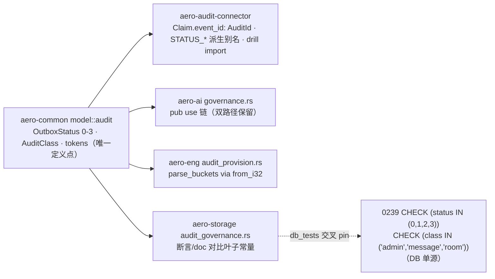

# Design — 把 B5 契约词表单源化为 aero-common 叶子类型（`model::audit`）

- **Module**: `crates/aero-common`（叶子层）；消费面 `crates/aero-audit-connector`（新增依赖边）、`crates/aero-ai/src/governance.rs`（re-export 链）、`crates/aero-eng/src/audit_provision.rs`（Q3 桶解析）、`crates/aero-storage/src/audit_governance.rs`（交叉 pin）、`crates/aero-audit-connector/src/bin/aero-audit-priority-drill.rs`（token import）
- **Source**: `docs/requirements/2026-08-08-aero-common-b5-contract-vocabulary-leaf-types.req.md`（R1–R8 / AC1–AC5）
- **Campaign**: `aero-im-b5-outbox-relay`；gate G6 (B5) = "37/37、T-11、moderation 优先级"
- **Sibling designs**: `2026-08-08-aero-audit-connector-b5-3-claim-lane-carriage.design.md`（GovernanceLane 映射所有权）、`2026-08-08-aero-ai-b5-1-migration-0239-verified-landing.design.md`（DDL 孪生）
- **Verification date**: 2026-08-08（本 design 亲自复跑全部基线 + 逐条 grep 核对）

## 0. Evidence verification（untrusted claims 逐条重查，2026-08-08 实跑）

| Claim | Verdict | Evidence |
|---|---|---|
| `AuditId` at `ids.rs:122`（define_id! Ulid 新类型） | ✅ | `crates/aero-common/src/ids.rs:122`；宏 :12 派生 `Clone, Copy, PartialEq, Eq, PartialOrd, Ord, Hash, Serialize, Deserialize`（BTreeMap 键/`#[serde(transparent)]` 均可用）；`nil()` :52-58、`to_uuid`/`from_uuid` :35-46、`Display` :66-70、`From<AuditId> for Uuid` :92-95（宏内 `impl From<$name> for uuid::Uuid`） |
| connector `Cargo.toml` 无 aero-common | ✅ | `[dependencies]` = tokio/tokio-util/async-trait/futures/reqwest/sqlx/serde/serde_json/thiserror/anyhow/tracing/time/uuid/base64 —— 无 aero-common |
| `Claim { event_id: Uuid, .. }` at `outbox.rs:34` | ✅ | struct :34-49（field :35）；doc :27-33 自述 "`event_id` is the stable audit event id (`audit_events.id` — B5-1 1:1 parity)"——**1:1 目前只是 doc 惯例**；`Claim` 仅 derive `Debug/Clone/PartialEq/Eq`（无 serde → 换型零线格式影响） |
| `STATUS_*` at `pg.rs:28-31` 且仓内零消费 | ✅ | :28-31 四常量，doc :27 "B5-1 0239 DDL normative values"；`rg STATUS_ENQUEUED` crate 内除定义外零命中——纯文档锚 |
| governance 常量 :31/:33/:56 + `GovernanceLane` :64-91 | ✅ | `GOVERNANCE_PRIORITY_MODERATION=100` :31、`GOVERNANCE_PRIORITY_BACKLOG=10` :33、`GOVERNANCE_CLASS_ADMIN/MESSAGE/ROOM` :37-41、`LOCAL_ACTION_MODERATED` :49、`MODERATION_OUTBOUND_ACTION` :56、`GovernanceLane` :64-91、:197 测试臂含字面量断言；`aero-ai/lib.rs:36` `pub use governance::{…}` 双路径存在 |
| `Q3_SQL` at `audit_provision.rs:48`；`parse_buckets` :271-284 | ✅ | `Q3_SQL` :48（"0=pending, 1=claimed, 2=delivered, 3=dead"）；`parse_buckets` 以 `usize` 索引 :280-283，越界忽略 :282 |
| migrations tracked 尾号 0238、untracked 0239/0240/0241 | ✅ | `git ls-files migrations/` 末位 = `0238_message_recall.sql`；`git status --short` = 3 个 `??`；0239:31 `CHECK (status IN (0,1,2,3))` + pin 注释 "connector status machine (pg.rs:27-30)"、:33 `CHECK (class IN ('admin','message','room'))` + governance pin、:18 注释 pin `governance.rs:31/:33/:60` |
| `admin.content.flag` 12 处 / 4 文件 | ✅ | 实跑 `rg` = governance.rs ×4（:53/:56/:159/:197）+ drill bin ×2（:15/:68）+ aero-storage/audit_governance.rs ×6（:17/:243/:319/:820/:858/:883），与 R6 枚举表逐一吻合 |
| `Claim` 构造点 3 处 / 消费点 | ✅ | fake.rs:231、pg.rs:59（`From<ClaimRow>`）、tests/claim_validation.rs:39（helper :37）；消费 = relay.rs:183 `let event_id = claim.event_id`（:187/:206 settle/requeue、:190/:194 `%event_id` tracing）、client.rs:143 `Idempotency-Key` header `to_string()`、:385 receipt 比对 `to_string()`；trait `settle` :77 / `requeue` :84-86 / `mark_dead` :94-96 均 `event_id: Uuid`，`reconcile` :61 / `claim_due` :72 不带 event_id 参数 |
| 测试计数 | ✅ | **本 design 复跑**：aero-common **lib 93 passed** + **doc-tests 3 passed/1 ignored**；state_machine **7 passed**；claim_validation **11 passed**；connector lib 8 passed + 3 ignored；aero-ai `governance::` **6 passed**；aero-eng `--test audit_provision` **25 passed** |
| b5-pin 37 槽（15 执行 + 22 [PROPOSED]） | ✅ | `scripts/b5-pin.sh` :4-6 注释 + `B5_CONTRACT_TEST_LIST`；`audit_governance::` :37、`t11-fail-closed` :40、`moderation-priority-drill` :41、`audit-provision-check` :46 在列 |
| 依赖合法性：aero-eng/storage/ai 均已依赖 aero-common | ✅ | `aero-eng/Cargo.toml:13`、`aero-storage/Cargo.toml:13`、`aero-ai/Cargo.toml:13` 均 `aero-common.workspace = true`——R8 零新依赖边；**唯一新增边 = connector → aero-common（R3）** |
| aero-common 接线惯例 | ✅ | `lib.rs:40` 显式 re-export 清单（一段 `pub use model::{…}` 块）；`model/mod.rs` `pub mod` + `pub use *` 扁平惯例；serde/serde_json/serde_with 已在 deps（**无 serde_repr** → 手写 serde impl 正确） |

**本 design 核证中发现的两处补充（不改变方向范围）**：

1. **aero-server 是 connector 的隐藏消费方**：`crates/aero-server/Cargo.toml:36` + `bin/main.rs:251-259` 经 `Arc<dyn OutboxRepo>` + `AuditRelay::new/spawn` 装配——**只走 trait-object seam，不构造 `Claim`、不调 `settle/requeue/mark_dead`** → 换型对该调用点零改动（§2.2 兼容性证明）。
2. **`%event_id` tracing 字段**（relay.rs:190/:194）：`AuditId` 有 `Display`（宏 :66-70），`%` 字段直接可用——relay.rs 消费点确证零改动。

**结论**：requirements 证据全部准确；两处补充均为强化性发现（aero-server seam 透明、tracing Display 已备），无方向级偏差。

## 1. Design overview

在叶子 crate `aero-common` 新增 `model::audit` 模块，把 B5 契约词表（outbox status 0/1/2/3、class message/room/admin、outbound/local action token）定义为**唯一 Rust 侧定义点**；connector 的 `Claim.event_id` 从 `Uuid` 换型 `AuditId`，把「event_id 与 `audit_events.id` 1:1」从 doc 惯例升级为**编译期不变量**；governance.rs 的常量改为 re-export 链；aero-eng 桶解析与 aero-storage 断言改走叶子符号。**不改任何 DDL**——0239 CHECK 字面量仍是 DB 侧单源，经 aero-storage db_tests 与叶子交叉互钉。**零新增外部依赖**。



## 2. API changes

### 2.1 新叶子模块 `crates/aero-common/src/model/audit.rs`（R1）

```rust
//! B5 contract vocabulary — Rust-side single source of truth for the audit
//! relay outbox wire contract. DB-side twin: 0239 CHECK constraints
//! (migrations/0239_audit_governance_outbox.sql). SQL cannot import Rust, so
//! the CHECKs stay the DB single source; aero-storage db_tests cross-pin the
//! two sides (leaf ↔ DDL).

/// Outbox lifecycle status. 0239 twin: `CHECK (status IN (0,1,2,3))`; Q3
/// psql output is the same integers.
#[derive(Debug, Clone, Copy, PartialEq, Eq, Hash)]
#[repr(i32)]
pub enum OutboxStatus {
    Enqueued = 0,
    Claimed = 1,
    Delivered = 2,
    Dead = 3,
}

impl OutboxStatus {
    /// const fn so derived consts below can call it.
    pub const fn as_i32(self) -> i32 { self as i32 }
    /// Fail-open parse: unknown → None（Q3 桶解析保持「未知忽略」语义）。
    pub const fn from_i32(value: i32) -> Option<Self> {
        match value { 0 => Some(Self::Enqueued), 1 => Some(Self::Claimed),
                      2 => Some(Self::Delivered), 3 => Some(Self::Dead), _ => None }
    }
}

impl serde::Serialize for OutboxStatus { /* as_i32() → i32 */ }
impl<'de> serde::Deserialize<'de> for OutboxStatus {
    /* i32 → from_i32；None → Err（fail-closed：线格式未知值必须报错，与 CHECK 同构） */
}

/// Governance class. 0239 twin: `CHECK (class IN ('admin','message','room'))`.
#[derive(Debug, Clone, Copy, PartialEq, Eq, Hash, serde::Serialize, serde::Deserialize)]
#[serde(rename_all = "lowercase")]
pub enum AuditClass { Message, Room, Admin }

impl AuditClass {
    /// const fn——`GOVERNANCE_CLASS_*` 派生常量依赖它。
    pub const fn as_str(self) -> &'static str {
        match self { Self::Message => "message", Self::Room => "room", Self::Admin => "admin" }
    }
}

// ---- Action-token vocabulary（全仓唯一合法字面量点）----
pub const MODERATION_OUTBOUND_ACTION: &str = "admin.content.flag";
pub const LOCAL_ACTION_MODERATED: &str = "message.moderated";
// ---- Class 派生别名（保 0239 DDL 注释 pin 文本与 aero_ai::governance::* 链稳定）----
pub const GOVERNANCE_CLASS_ADMIN: &str = AuditClass::Admin.as_str();
pub const GOVERNANCE_CLASS_MESSAGE: &str = AuditClass::Message.as_str();
pub const GOVERNANCE_CLASS_ROOM: &str = AuditClass::Room.as_str();
```

**接线**：`model/mod.rs` 增 `pub mod audit;` + `pub use audit::*;`；`lib.rs:40` 显式 re-export 清单追加 `OutboxStatus, AuditClass, MODERATION_OUTBOUND_ACTION, LOCAL_ACTION_MODERATED, GOVERNANCE_CLASS_ADMIN, GOVERNANCE_CLASS_MESSAGE, GOVERNANCE_CLASS_ROOM`（house 惯例——root 与 `model::audit::` 是同一 item，无歧义）。

**关键 API 细节（易错点，已钉死）**：

- `as_str`/`as_i32`/`from_i32` **必须 `const fn`**——`GOVERNANCE_CLASS_*` 与 `STATUS_*` 派生常量在 const 上下文调用；实现成非 const fn 直接编译失败（fail-fast，但设计先钉）。
- **`from_i32` fail-open（None）与 serde Deserialize fail-closed（Err）是有意的不对称**：解析路径（Q3 桶）容忍未知行继续跳过；线格式路径（serde）对未知值拒绝——两者分别对应「扫描工具宽容」与「契约严格」。R2 测试双面钉死，防后人把 serde 改成宽容。
- 显式判别值 `= 0..3` 防重排；加变体必须选新值，无漂移面。
- **Deserialize 入口钉死**：`deserializer.deserialize_i32(Visitor)`，Visitor 实现 `visit_i32`，`visit_i64`/`visit_u64` 经 `i32::try_from` 收敛后走同一 `from_i32`——serde_json 的整数走 `visit_i32`；入口用 `deserialize_any`、或 `deserialize_i32` 只实现 i64，都会在真实 JSON 整数上 Err（R2 往返测试能抓到入口错，但形态先在 design 钉死）。
- **R2 断言精确线文本**：`serde_json::to_string(&OutboxStatus::Enqueued) == "0"`（`"1".."3"` 同理），不只值级往返——serialize-as-string / deserialize-from-string 的一对也能过值级往返测试，却破坏整数线契约。

### 2.2 connector 换型（R3/R4）

| 位置 | 变更 |
|---|---|
| `Cargo.toml` | `[dependencies]` 增 `aero-common.workspace = true` |
| `outbox.rs:35` | `pub event_id: AuditId`；doc :27-33 改写为「`event_id: AuditId` = `audit_events.id` 的编译期 1:1（P2）」 |
| `outbox.rs:77/:84-86/:94-96` | `settle`/`requeue`/`mark_dead` 参数 `event_id: Uuid` → `AuditId`；`reconcile`/`claim_due` 签名不动 |
| `pg.rs:28-31` | `pub const STATUS_ENQUEUED: i32 = OutboxStatus::Enqueued as i32;` 等四行派生别名（常量名保留，0239 注释 pin "pg.rs:27-30" 文本稳定） |
| `pg.rs:59` | `From<ClaimRow>`：`event_id: AuditId::from_uuid(row.event_id)` |
| `pg.rs` 三方法 SQL bind | `event_id` 在绑定边界 `.to_uuid()`（`From<AuditId> for Uuid` 已存在，ids.rs:92-95） |
| `fake.rs:79` | `rows: BTreeMap<AuditId, FakeRow>`（AuditId 派生 Ord，键合法）；:231 构造直通 |
| `tests/claim_validation.rs:37-39` | helper `claim()` 用 `AuditId::new()`（测试内显式 `Uuid` 构造换 `AuditId::new()`/`from_uuid`） |
| `bin/aero-audit-priority-drill.rs:68` | `const MODERATION_ACTION` → `use aero_common::model::audit::MODERATION_OUTBOUND_ACTION`；:15 doc 引叶子符号 |
| `relay.rs:183-215` / aero-server `bin/main.rs:251-259` | **零改动**（`Display` 覆盖 `to_string()` 与 `%event_id` tracing；server 只走 trait-object seam；`%event_id` 渲染变 base32，与仓内 `AuditEvent.id: AuditId`（aero-storage/audit.rs:19）惯例一致，log↔SQL 对照需格式意识——psql 打印 hyphenated UUID） |
| `client.rs:385` | **必改（D1）**：receipt 校验从字符串相等改**值级双格式比较**——`Uuid::from_str` → `AuditId::from_uuid` 或 `AuditId::from_str` 解析 `receipt.event_id` 后 `== claim.event_id`（对 echo 源两种格式都稳）。原因：0239 触发器 payload 内嵌 `NEW.id::text`（hyphenated UUID，0239:107-108），换型后 `claim.event_id.to_string()` 是 ULID base32——字符串比对必然 `ReceiptMismatch` → ≤1 retry 后 dead。**现有测试 helper 同值同格式构造（claim_validation.rs:37-52、state_machine.rs:27-29、relay.rs:284-286）会掩盖此 break**；须新增镜像 0239 触发器格式的测试（payload event_id 为 UUID 格式、`claim.event_id = AuditId::from_uuid(同值)`） |
| `client.rs:143` | **隐式变更（D2，wire artifact）**：`Idempotency-Key` 头格式 UUID → base32（`AuditId` Display）；key 对 sink 保持不透明，头部不再与 payload 内嵌 event_id 字符串相等——§3.2 注明 |
| `tests/state_machine.rs:27-29/:384/:389`、`src/relay.rs` 测试模块 :284-286 | 编译强制涟漪（D4）：`claim_payload(Uuid)` 换 `AuditId`、`Vec<Uuid>` → `Vec<AuditId>`、`claims[0].event_id` 对比 Uuid——`cargo check` fail-fast，低危但计入变更面 |
| `fake.rs:122/:133/:172` | 公共 API 涟漪（D4）：`insert`/`insert_lane`/`row` 签名 `Uuid` → `AuditId`，波及全部测试调用点——编译强制 |

### 2.3 governance.rs re-export 链（R5）

```rust
// 删除本地定义，改为：
pub use aero_common::model::audit::{
    GOVERNANCE_CLASS_ADMIN, GOVERNANCE_CLASS_MESSAGE, GOVERNANCE_CLASS_ROOM,
    LOCAL_ACTION_MODERATED, MODERATION_OUTBOUND_ACTION,
};
```

- `aero_ai::governance::*`（worker/mod.rs 等 crate 内消费）与 `aero_ai::*`（lib.rs:36 re-export 链）双路径**原样保留**——re-export 的 item 与定义同名同路径解析。
- `GovernanceLane`/`governance_lane_for`/`is_admin_class`/`GOVERNANCE_PRIORITY_*` **留在 governance.rs**（sibling direction #2 所有权；本设计只单源化其引用的词表）。
- :197 字面量断言删除（规范值 pin 迁至叶子测试 R2）；:53/:159 doc 改引叶子符号、不拼写 token。

### 2.4 aero-eng 桶解析（R8）

```rust
// audit_provision.rs parse_buckets：usize 索引 → 叶子枚举
if let (Ok(status), Ok(count)) =
    (status.trim().parse::<i32>(), count.trim().parse::<i64>())
{
    if let Some(status) = OutboxStatus::from_i32(status) {
        buckets[status as usize] = count;
    }
}
```

行为不变：未知 status 依旧忽略、缺失桶保持 0（`parse_buckets_fills_missing_statuses_with_zero` 四臂原样通过）。**索引用 `status as usize` 而非 `as i32 as usize`**——后者触发 `clippy::cast_sign_loss`（workspace pedantic 生效中），step 6 零新增警告门会红；`from_i32` 的 `Some` 保证 0..3，行为等价。aero-eng **已依赖** aero-common（Cargo.toml:13）——零新依赖边。

### 2.5 aero-storage 交叉 pin（R6/R7）

- 六处 doc/断言（:17/:243/:319/:820/:858/:883）改对比 `MODERATION_OUTBOUND_ACTION` 等叶子常量；六项 db_tests 断言 0239 触发器产出的 class/priority/action，改对比叶子常量后成为**叶子 ↔ DDL 的活交叉 pin**（b5-pin `audit_governance::` 非空转守卫继续成立）。aero-storage 已依赖 aero-common——合法通道（依赖 aero-ai 才非法）。

## 3. Compatibility constraints

1. **符号名全保留**：`STATUS_*`、`GOVERNANCE_CLASS_*`、`MODERATION_OUTBOUND_ACTION`、`LOCAL_ACTION_MODERATED` 名字不变（值改为派生），sibling 消费方零破坏。DDL 注释 pin 分两半处理（见步骤 5）："pg.rs:27-30"（派生别名保持同 4 行）与 "governance.rs:31/:33"（`GOVERNANCE_PRIORITY_*` 留守）继续有效；指向已搬走 class/token 常量及 `GovernanceLane` 行号的注释（0239:11/:14/:18/:22/:33、0241:18）**re-point 到 `aero_common::model::audit`**（纯注释、零 DDL）——不接受的漂移是「注释指向已不存在的符号」。
2. **`Claim` 字段名/顺序不变**，仅 `event_id` 类型变；`Claim` 无 serde derive（已验证）→ 请求体无线格式变化；**`Idempotency-Key` 头格式 UUID → base32**（D2，wire artifact）——key 对 sink 保持不透明、不再与 payload 内嵌 event_id 字符串相等。**`AuditId` 的 `#[serde(transparent)]` 委托 Ulid 的 serde = 26 字符 base32 字符串，不是 UUID 形状**（D3 更正）；本方向不序列化 AuditId（`Claim` 无 serde），若未来真需要 UUID 形状线格式须 `#[serde(with = "ulid::serde::ulid_as_uuid")]`。
3. **`AuditId` 完备性**：Copy/Ord/Hash/Display/serde 全齐（define_id! 宏派生）——BTreeMap 键、tracing `%`、`to_string()` 全部可用，无补充 impl 需求。
4. **SQL 字面量不动**：0239 CHECK/DEFAULT、pg.rs 谓词（`status IN (0,1)` 等）、drill 种子 INSERT 的 status/class 字面量均为 SQL 侧单源/测试夹具，不属于类型面（SQL 无法 import Rust）。
5. **行为语义冻结**：`parse_buckets` 未知忽略、缺失补 0；`from_i32` 越界 None；serde 越界 Err——三项均入测试。
6. **无 semver 面**：connector `publish = false`、workspace 内消费；唯一外部消费者 aero-server 经 trait-object seam（零改动，已核证）。
7. **零新外部依赖**：aero-common 不引 serde_repr（手写 ~30 行 serde impl）；唯一新依赖边 = connector → aero-common（workspace path，无供应链新增）。

## 4. Failure modes

| # | 失效模式 | 触发 | 缓解 |
|---|---|---|---|
| F1 | serde 被改成宽容（未知 status 静默通过） | 后人用 derive 替代手写 impl，`Deserialize` 丢 fail-closed | R2 测试钉死 `deserialize("4")`/`"-1"` → Err；注释写明不对称理由 |
| F2 | `as_str`/`from_i32` 写成非 const fn → 派生常量编译失败 | 实现疏忽 | 编译期捕获（fail-fast）；§2.1 已钉 API 形态 |
| F3 | 叶子 ↔ DDL 漂移（0239 CHECK 改值、Rust 侧没跟） | 未来 DDL 变更 | R7 六项 db_tests 断言触发器产物对比叶子常量——PG 环境实跑即活 pin；CI 无 PG 时 `--ignored` 门控 + b5-pin `audit_governance::` 非空转守卫兜底（现状机制，无新增面）。**b5-pin 加固两处（本 design 纳入 step 7 前）**：① `run_migration_regression`（test-integration.sh:151-162）补空过滤守卫——同款 `test result: ok. [1-9][0-9]* passed` grep（现仅 `run_migrated_integration` :199 有），否则未来 legacy 测试改名/删除后该槽静默空转绿；② 删 moderation-priority-drill skip 路径的重复 PASS 行（:482 无条件 `b5_check PASS` 在 RC==2 分支后覆盖 SKIP 证据——RC==0 分支已写 PASS） |
| F4 | `admin.content.flag` 在 doc 注释里复活 | 新代码手写 token 而非引符号 | AC4 rg 扫描 = 0 作为提交门：并入 `scripts/truth-check.sh` 新「TOKEN 单源」硬违规类别（§6 给出正确形态——naive 一行在 `set -euo pipefail` 下双向失效：rg 零命中 exit 1 误红、命中时管道 exit 0 无人检查漏报）；叶子 pin 测试兜底语义（拼接/SQL/docs 字面量是 grep 固有盲区） |
| F5 | untracked 基线丢失：connector crate/governance.rs/audit_provision.rs/0239-0241 均未提交，验收无基准 | 只提交本 direction 改动 | §5 步骤 0：先提交（或同一 PR 连带提交）全部 B5 untracked 文件 |
| F6 | `to_uuid()` 漏在 SQL bind 边界 | 换型后 bind `AuditId` | 编译期错误（sqlx ToSql 未实现）——fail-fast，无静默路径 |
| F7 | glob import 歧义（`aero_ai::governance::*` + `aero_common::model::audit::*` 同模块） | 两处 re-export 同一 item | 同一 item 双路径，Rust glob 无歧义（非 duplicate definition）；不构成风险，文档注明 |
| F8 | 计数锚点漂移（direction 曾记 9/14，实为 7/11） | 套件增删测试 | 验收以「命令 + 全绿」为不变式，计数仅核对参考（§6 锚定实跑值） |
| F9 | sibling direction #2 迁移 GovernanceLane 到叶子时与 re-export 链冲突 | 未来工作 | 叶子已是单源，sibling 只需把映射体搬走——re-export 链自动继续解析，零破坏 seam 已在 §2.3 预留 |

## 5. Migration steps（每步带验证命令）

> AGENTS.md §4.2：迁移编译期嵌入——本方向**不改 DDL**，但 0239-0241 是 B5 批次的一部分，若此前未 migrate 过 throwaway 库，顺序仍是 **build → migrate**。

0. **基线固化**：**用显式路径 `git add <paths>` 提交**全部 untracked B5 文件（connector crate、`governance.rs`、`audit_provision.rs`、`audit_governance.rs`、drills、`migrations/0239-0241`、b5-pin 改动）——或确认其在途 PR；`git status --short` 无 B5 文件残留。⚠️ 勿 `git add -A`：当前另有非 B5 untracked 文件（`.pi-batch.lock`、`crates/aero-live-srt/src/isolation_tests.rs`、`docs/campaigns/audit-batch.out`），「无残留」检查不覆盖它们；已修改的 tracked 文件（root `Cargo.toml`/`.lock`、aero-ai lib/worker、aero-eng lib/run、aero-server、aero-storage lib.rs、`scripts/test-integration.sh`）是同一基线的在途 PR 另一半——**基线可复现 = untracked 提交 + 该 PR 一起**。复跑基线：§6 表格全部命令。
1. **R1+R2**：建 `model/audit.rs` + `model/mod.rs`/`lib.rs` 接线 + in-module 测试 → `cargo test -p aero-common`（**lib 93 → 93+N**；doc-tests 3 passed/1 ignored 不动；新增 ≈10 项全绿）。
2. **R3+R4**：connector 依赖 + `Claim.event_id: AuditId` + trait 三方法换参 + pg.rs 别名/`From<ClaimRow>`/bind `.to_uuid()` + fake.rs 键 → `cargo check --workspace`（干净）+ `cargo test -p aero-audit-connector`（lib 8+3、state_machine 7、claim_validation 11）。
3. **R5**：governance.rs 删定义改 `pub use`，:197 断言删、:53/:159 doc 改写 → `cargo test -p aero-ai governance::`（6）。
4. **R8**：aero-eng `parse_buckets` 走 `OutboxStatus::from_i32` → `cargo test -p aero-eng --test audit_provision`（25，四臂行为不变）。
5. **R6+R7**：drill bin import 叶子 + aero-storage 六处改对比叶子常量 + **注释 pin re-point**（0239:11/:14/:18/:22/:33、0241:18 中指向 class/token 常量与 `GovernanceLane` 行号的注释，及 connector 测试 doc pin：outbox.rs:42、fake.rs:119-120/:124-125、claim_validation.rs:49-52、state_machine.rs:335-336 → `aero_common::model::audit`；纯注释、零 DDL；`GOVERNANCE_PRIORITY_*` :31/:33 与 "pg.rs:27-30" pin 保持）→ `rg 'admin.content.flag' crates/ --glob '*.rs'`（排除叶子文件 `crates/aero-common/src/model/audit.rs`；migrations/docs 字面量不计——SQL 无法 import Rust）= 0；aero-storage db_tests：throwaway 已迁移库 `cargo test -p aero-storage --lib audit_governance:: -- --ignored`（AGENTS.md §4.2 流程——build → migrate 是 §4.2 规则，§4.3 只写「CREATE DATABASE 再迁」：`CREATE DATABASE` → `cargo build` → migrate → 测 → `DROP DATABASE`）。
6. **收尾门**：`cargo clippy --workspace --all-targets` 零新增警告 · `scripts/{truth-check,file-size-check,web-check}.sh` · `scripts/test-b5-pin-guard.sh` · 提交（含本 design + requirements）。
7. **全链**：`scripts/test-integration.sh`（真实门——Makefile 无 `gate-b5` target，`make gate` = `aero-cli gate all` 不等价）→ b5-pin 37/37，`audit_governance::`/`t11-fail-closed`/`moderation-priority-drill`/`audit-provision-check` 槽 verdict 齐全。

## 6. Testable acceptance mapping

| AC | 验收（可执行） | 命令 | 基线（2026-08-08 实跑） |
|---|---|---|---|
| AC1 叶子 + serde | `model/audit.rs` 存在；status 0..3 整数 serde 往返（含精确线文本 `"0".."3"`）、`from_i32(4)/(-1)`→None、serde 未知→Err；class "message"/"room"/"admin" 往返；token/别名 pin | `cargo test -p aero-common` | **lib 93 passed（→ 93+N）**；**doc-tests 3 passed/1 ignored**；新增 ≈10 全绿 |
| AC2 编译期 1:1 | `Claim.event_id: AuditId`；trait 三方法参数 `AuditId`；**负证**：临时把 `event_id: AuditId::new()` 换 `Uuid::new_v4()` → 编译失败 | `cargo check --workspace` | 干净 |
| AC3 connector 不回归 | 三套件全绿 | `cargo test -p aero-audit-connector --test state_machine`（**7**）· `--test claim_validation`（**11**）· `--lib`（8 + 3 ignored） | 本 design 复跑确认 |
| AC4 token 单源 | rg 扫描 = 0 | `rg 'admin.content.flag' crates/ --glob '*.rs'`（排除叶子文件 `crates/aero-common/src/model/audit.rs`；migrations/docs 字面量不计） | 现 12 处 → 0 |
| AC5 aero-eng 桶解析 | `parse_buckets` 经 `OutboxStatus::from_i32`，四臂行为不变 | `cargo test -p aero-eng --test audit_provision` | 25 passed |
| AC6 b5-pin | 37/37 槽 + 非空转守卫 | `scripts/test-b5-pin-guard.sh`；`scripts/test-integration.sh` B5 段 | 37 槽（15 执行 + 22 [PROPOSED]） |

**建议新增的持久门**（一处、非新增脚本）：`scripts/truth-check.sh` 新增第三类硬违规「TOKEN 单源」（AC4 回归守卫，F4 缓解）——naive 一行在 `set -euo pipefail` 下双向失效（rg 零命中 exit 1 → 误红；命中时管道 exit 0 → 输出无人检查 = 漏报）。正确形态（与脚本 `|| true` 惯例一致、保持单一 exit 点）：

```bash
# 3. TOKEN 单源（AC4 回归守卫）：admin.content.flag 只允许出现在叶子 audit.rs
token_leaks=$(rg -l 'admin.content.flag' crates/ --glob '*.rs' 2>/dev/null \
    | grep -v '^crates/aero-common/src/model/audit\.rs$' | wc -l | tr -d ' ' || true)
if [ "${token_leaks:-0}" -gt 0 ]; then
    echo "  ❌ TOKEN LEAK: admin.content.flag 出现在叶子 model::audit 之外（单源违规）"
    orphan_violations=$((orphan_violations + 1))
fi
```

要点：过滤精确到 `model/audit.rs` 单文件（排除整个 `crates/aero-common/` 会漏其他模块字面量）；范围仅 `crates/ *.rs`——`migrations/0239`(:123)/`0241`(:110) 的 INSERT 字面量与 docs 属 SQL/文档侧，由 db_tests 交叉 pin 覆盖；拼接等字符串技巧是 grep 固有盲区，语义兜底在 R2 叶子 pin 测试。同步更新脚本头部注释与 summary 行（第三类别）。

## 7. Out of scope（红线复述，防越界）

- GovernanceLane/governance_lane_for/is_admin_class 迁移叶子（sibling #2 所有权）；`GOVERNANCE_PRIORITY_*`（车道值非词表）。
- 0239/0240/0241 DDL 内容、L1 聚合、`enqueue_in_tx`、AppConfig/403/422/409 分类、drill 种子 INSERT 的 status/class SQL 字面量、`FakeStatus`。
- 新外部依赖：零（serde/serde_json 已在 aero-common；唯一新边 = connector → aero-common workspace path）。
