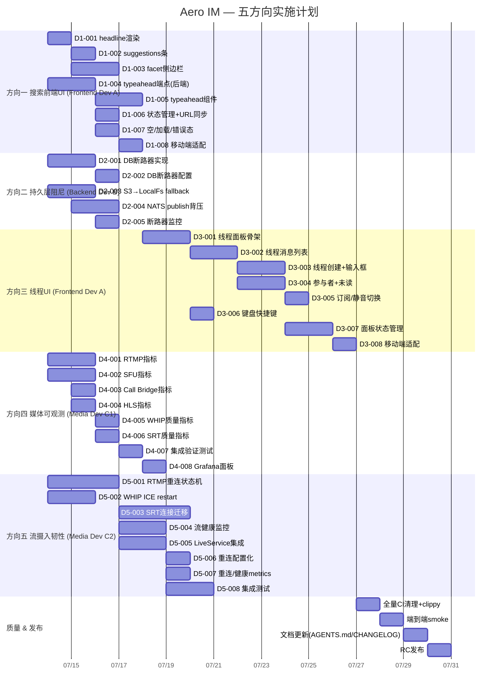

以下是我作为 Tech Lead 对代码验证评估的分析，基于已修正的事实，产出可执行的技术任务分解和执行计划。

---

# Tech Lead 深度分析：五个技术方向实施计划

> 基于代码验证评估修正后的事实，仅包含已验证的主张。

---

## 1. 任务分解

### 方向一：搜索前端 UI 管线（Search Frontend Pipeline）

**状态**：后端能力已就位（`ts_headline`、`suggest_terms`、`facets`），前端未使用。需约 5 天。

| Task ID | 标题 | 涉及文件 | 前置依赖 | 预估(h) | 验收标准 |
|---|---|---|---|---|---|
| D1-001 | 搜索渲染管线——headline 替换全文 | `web/search.js` (L38) | 无 | 2 | 搜索结果文案区展示 `headline`（含 `<b>` 高亮）而非 `blocks` 全文；无高亮时回落全文前 240 字 |
| D1-002 | 搜索渲染管线——suggestions 建议条 | `web/search.js` | D1-001 | 2 | 低结果（<3 条）时在结果上方展示 `suggestions[]` 可点击建议条；点击触发新搜索 |
| D1-003 | 搜索渲染管线——facet 侧边栏 | `web/search.js`, `web/search.css` | D1-001 | 4 | 当 `facets=true` 时渲染左/右侧过滤面板；点击 facet 值追加 `in:channel` filter 参数；移动端折叠 |
| D1-004 | 搜索 REST 路由——typeahead 端点 | `crates/aero-server/src/search_suggest.rs` | 无 | 3 | `GET /api/search/suggest?q=...&workspace_id=...` 返回前缀匹配建议列表；限 10 条；有 Redis 缓存 |
| D1-005 | Typeahead 前端组件 | `web/search.js`, `web/search.css` | D1-004 | 3 | 搜索框输入时 300ms debounce 后下拉展示建议；键盘导航选择；ESC 关闭 |
| D1-006 | 搜索状态管理 + 查询参数同步 | `web/search.js` | D1-001~003 | 2 | 搜索条件（q/facets/page/filter）同步到 URL query string；前进后退恢复状态；空查询不请求 |
| D1-007 | 空状态 + 加载态 + 错误态 | `web/search.js` | D1-001~003 | 2 | 三种 UI 状态：骨架屏/「无结果」插图+建议/「出错了」重试按钮 |
| D1-008 | 搜索移动端适配 | `web/search.css` | D1-003, D1-007 | 2 | 搜索面板在 <768px 全屏覆盖；facet 作为底部抽屉；typeahead 可触控 |

---

### 方向二：持久层阻尼（Persistence Layer Damping）

**状态**：Webhook 已有断路器；S3 有重试无 fallback；DB/NATS 无阻尼。需约 4 天。

| Task ID | 标题 | 涉及文件 | 前置依赖 | 预估(h) | 验收标准 |
|---|---|---|---|---|---|
| D2-001 | DB 断路器——`CircuitBreaker<PgPool>` 包装 | `crates/aero-storage/src/breaker.rs`, `crates/aero-storage/src/db.rs` | 无 | 4 | 实现 `CircuitBreakerPgPool` — 5 连续失败开路 → `AERO_PG_CIRCUIT_BREAKER_TIMEOUT`(30s) 后半开 → 1 成功闭路；所有 `XRepo::new` 可注入；开路返回 `AeroError::ServiceUnavailable` |
| D2-002 | DB 断路器——配置 & 集成 | `crates/aero-server/src/config.rs`, `crates/aero-server/src/state.rs` | D2-001 | 2 | `AERO__SERVER__PG_CIRCUIT_BREAKER_TIMEOUT`(30s) + `AERO__SERVER__PG_CIRCUIT_BREAKER_THRESHOLD`(5)；启动时注入 `AppState.pg_breaker` |
| D2-003 | S3 fallback——LocalFs 降级 | `crates/aero-storage/src/s3_blob_store.rs` | 无 | 3 | S3 重试 3 次全失败后自动回退 LocalFs（与既有 `blob_store_from_env` 逻辑整合）；日志告警 `S3_FALLBACK_ACTIVE`；配置 `AERO_S3_FALLBACK_DIR` |
| D2-004 | NATS publish 背压——bounded channel + await | `crates/aero-bus/src/nats_bus.rs` | 无 | 3 | `publish` 前 `tx.capacity()` 检查；满则 `sleep(Duration::from_millis(backoff))` 最多重试 3 次；超时返回 `BusError::Backpressure`；`NATS_PUBLISH_DROPPED_TOTAL` counter |
| D2-005 | 断路器监控指标 | `crates/aero-storage/src/breaker.rs`, `crates/aero-common/src/metrics.rs` | D2-001 | 2 | 每个 breaker 状态 gauge(SERVICE_CIRCUIT_BREAKER_STATE)：0=closed,1=half-open,2=open；`SERVICE_CIRCUIT_BREAKER_TRIPS_TOTAL` counter |

---

### 方向三：线程 UI 视图（Thread Panel UI）

**状态**：API 层全部就绪（`thread_subs`、`thread_summary`、`thread_participants`、消息 `thread_ts`）；前端零实现。需约 8 天。

| Task ID | 标题 | 涉及文件 | 前置依赖 | 预估(h) | 验收标准 |
|---|---|---|---|---|---|
| D3-001 | 线程面板骨架——pane-right 复用 | `web/index.html`, `web/app.css` | 无 | 3 | 右侧面板 `<aside id="thread-panel">` — 从 channel list panel 切换为 thread view；含标题「Thread」+ 关闭按钮 + 滚动内容区；过渡动画 |
| D3-002 | 线程消息列表组件 | `web/thread.js`, `web/thread.css` | D3-001 | 4 | 按 `thread_ts` 拉取 `thread_subs` API；渲染按时间戳排序的时间线；支持 `msg:room_event` 实时插入新回复；滚动到底 |
| D3-003 | 线程创建入口 + 回复输入框 | `web/thread.js`, `web/app.js` | D3-002 | 3 | 消息操作菜单「Reply in thread」调用 `send_message` 带父消息 `thread_ts`；thread-panel 底部固定输入框 + 发送按钮 |
| D3-004 | 线程参与者和未读计数 | `web/thread.js` | D3-002 | 3 | 面板头部展示 `thread_participants` 头像列表（≤5）；`thread_unread` badge 在消息侧 |
| D3-005 | 线程订阅/静音切换 | `web/thread.js`, `web/app.js` | D3-003 | 2 | 顶部 toggle「Notifications on/off」调用 `PUT /api/messages/:id/thread/subscription`；默认跟随房间设置 |
| D3-006 | 键盘快捷键 | `web/app.js` | D3-001 | 2 | `t` 选中消息开线程；`ESC` 关面板；`Ctrl+Enter` 发回复 |
| D3-007 | 线程面板状态管理 | `web/app.js` | D3-001~003 | 3 | 打开线程时保存原 `channel_id` 滚动位置；关闭恢复；URL hash `#thread/{msgId}` 可分享；响应式关闭 |
| D3-008 | 移动端线程面板 | `web/thread.css` | D3-001 | 2 | <768px 全屏覆盖；输入框自动聚焦键盘弹起；滑动关闭手势 |

---

### 方向四：媒体面可观测性（Media Observability）

**状态**：WHIP 3 指标 / SRT 4 基础指标；RTMP/SFU/Bridge/HLS 零指标；所有模块缺质量指标。需约 5 天。

| Task ID | 标题 | 涉及文件 | 前置依赖 | 预估(h) | 验收标准 |
|---|---|---|---|---|---|
| D4-001 | RTMP 计量——metrics.rs 新建 | `crates/aero-live-rtmp/src/metrics.rs` | 无 | 3 | `aero_rtmp_active_publishes` gauge、`aero_rtmp_packets_received_total` counter、`aero_rtmp_publish_duration_seconds` histogram |
| D4-002 | SFU 计量——前向转发器指标 | `crates/aero-live-webrtc/src/forward/mod.rs` | 无 | 4 | `aero_sfu_forwarded_packets_total`(per-stream label)、`aero_sfu_active_streams` gauge、`aero_sfu_rtcp_sent_total` counter |
| D4-003 | Call Bridge 计量 | `crates/aero-live-webrtc/src/call_bridge.rs` | 无 | 2 | `aero_call_bridge_active_peers` gauge、`aero_call_bridge_rtp_bytes_total` counter、`aero_call_bridge_errors_total` counter(error=label) |
| D4-004 | HLS 计量 | `crates/aero-live-hls/src/metrics.rs` | 无 | 3 | `aero_hls_segments_written_total` counter(quality label)、`aero_hls_active_variants` gauge、`aero_hls_write_duration_seconds` histogram |
| D4-005 | WHIP 质量指标——RTT/jitter/loss | `crates/aero-live-whip/src/metrics.rs` | 无 | 2 | RTCP 解析后设 `aero_whip_rtt_seconds` gauge(peer label)、`aero_whip_jitter_seconds` gauge、`aero_whip_packet_loss_ratio` gauge |
| D4-006 | SRT 质量指标——RTT/loss ratio | `crates/aero-live-srt/src/metrics.rs` | 无 | 2 | 从 SRT ACK 中提取 RTT；丢包率 = lost/(lost+received)；`aero_srt_rtt_seconds`/`aero_srt_loss_ratio` gauge |
| D4-007 | 集成指标验证测试 | `tests/media_metrics_test.rs` | D4-001~006 | 2 | 对每个指标模块：启动 mock 组件 → 模拟 100 个事件 → `GET /metrics` 含预期值 → 类型和 label 正确 |
| D4-008 | Grafana 面板 JSON 样板 | `deploy/grafana/dashboards/media-streams.json` | D4-001~006 | 3 | 每个模块一个 row：active sessions / throughput / error rate / RTT/jitter/loss；annotations 标记重启/部署 |

---

### 方向五：流摄入韧性（Stream Ingest Resilience）

**状态**：完全准确。RTMP 无重连、WHIP 无 ICE restart、SRT 无连接迁移、健康监控缺口。需约 8 天。

| Task ID | 标题 | 涉及文件 | 前置依赖 | 预估(h) | 验收标准 |
|---|---|---|---|---|---|
| D5-001 | RTMP 重连状态机 | `crates/aero-live-rtmp/src/session.rs` | 无 | 6 | 新增 `Reconnecting` 状态 + 指数退避 `AERO_RTMP_RECONNECT_BASE_MS`(1000)→max(30000)；`AERO_RTMP_MAX_RECONNECT_ATTEMPTS`(5)；超限 → `Ended`；重连成功重置退避 |
| D5-002 | WHIP ICE restart 处理 | `crates/aero-live-whip/src/whip.rs` | 无 | 4 | `PATCH /api/whip/:id`（RFC 标准 endpoint）解析新 SDP offer（含 ice-ufrag/ice-pwd 变化）→ 生成新 SDP answer；str0m `RtcConfig` 替换 ICE 凭据；旧候选丢弃 |
| D5-003 | SRT 连接迁移—HSREQ/HSRSP | `crates/aero-live-srt/src/protocol.rs` | 无 | 6 | 实现 SRT handshake 扩展 `HSREQ`(0x000D)/`HSRSP`(0x000E)；收到 HSREQ 验证 peer token → 回复 HSRSP + 绑定新 socket addr；旧 socket 静默超时关闭 |
| D5-004 | 流健康监控——心跳/timeout | `crates/aero-server/src/live/health.rs` | 无 | 4 | 每流注册心跳 ticker（15s 无包 → Warn；30s → Stale；60s → `handle_end(Timeout)`）；`live.stream.{id}` `Status{Health}` 事件含 `healthy/stale/degraded/timeout`；仪表板 REST `GET /api/streams/:id/health` |
| D5-005 | LiveService 生命周期集成—重连事件 | `crates/aero-server/src/live/service.rs` | D5-001~003 | 3 | `handle_reconnect` → 复用原 `stream_id` 续播；`LiveService::handle_end` 仅在 `max_retries_exceeded` 时才设为 `Ended`；`Status{Reconnected}` 事件含 `attempt`/`total_ms` |
| D5-006 | 重连配置化 | `crates/aero-server/src/config.rs` | D5-001~003 | 2 | `AERO__STREAM__RECONNECT_BASE_MS`(1000)、`AERO__STREAM__RECONNECT_MAX_MS`(30000)、`AERO__STREAM__RECONNECT_MAX_ATTEMPTS`(5)、`AERO__STREAM__HEALTH_TIMEOUT_SECS`(30) |
| D5-007 | 重连/健康监控 metrics | `crates/aero-server/src/live/metrics.rs` | D5-004, D5-005 | 2 | `aero_stream_reconnect_attempts_total` counter(success/failure label)、`aero_stream_reconnect_duration_seconds` histogram、`aero_stream_health_state` gauge(0=healthy,1=stale,2=degraded,3=timeout) |
| D5-008 | 集成测试——重连/健康链路 | `tests/stream_resilience_test.rs` | D5-001~005 | 6 | 模拟 RTMP feed drop → 验证 `Reconnecting` 状态 → 恢复 → 验证 `Live` 续播；模拟 15s 静默 → 验证 `Health{Stale}`；超时 → `Ended`；WS 事件验证 |

---

## 2. 执行顺序 — 依赖图

```mermaid
graph TD
    subgraph 方向一["方向一 搜索UI (~5天)"]
        D1_001[D1-001 headline渲染] --> D1_002[D1-002 suggestions条]
        D1_001 --> D1_003[D1-003 facet侧边栏]
        D1_004[D1-004 typeahead端点] --> D1_005[D1-005 typeahead组件]
        D1_001 --> D1_006[D1-006 状态管理+URL同步]
        D1_002 --> D1_007[D1-007 空/加载/错误态]
        D1_003 --> D1_008[D1-008 移动端适配]
        D1_007 --> D1_008
    end

    subgraph 方向二["方向二 持久层阻尼 (~4天, 可并行)"]
        D2_001[D2-001 DB断路器实现] --> D2_002[D2-002 DB断路器配置]
        D2_001 --> D2_005[D2-005 断路器监控]
        D2_003[D2-003 S3→LocalFs fallback]
        D2_004[D2-004 NATS publish背压]
    end

    subgraph 方向三["方向三 线程UI (~8天)"]
        D3_001[D3-001 线程面板骨架] --> D3_002[D3-002 线程消息列表]
        D3_002 --> D3_003[D3-003 线程创建+输入框]
        D3_002 --> D3_004[D3-004 参与者+未读]
        D3_003 --> D3_005[D3-005 订阅/静音切换]
        D3_001 --> D3_006[D3-006 键盘快捷键]
        D3_003 --> D3_007[D3-007 面板状态管理]
        D3_007 --> D3_008[D3-008 移动端适配]
    end

    subgraph 方向四["方向四 媒体面可观测 (~5天, 高度可并行)"]
        D4_001[D4-001 RTMP指标]
        D4_002[D4-002 SFU指标]
        D4_003[D4-003 Call Bridge指标]
        D4_004[D4-004 HLS指标]
        D4_005[D4-005 WHIP质量指标]
        D4_006[D4-006 SRT质量指标]
        D4_001 --> D4_007[D4-007 集成验证]
        D4_002 --> D4_007
        D4_003 --> D4_007
        D4_004 --> D4_007
        D4_005 --> D4_007
        D4_006 --> D4_007
        D4_007 --> D4_008[D4-008 Grafana面板]
    end

    subgraph 方向五["方向五 流摄入韧性 (~8天)"]
        D5_001[D5-001 RTMP重连状态机] --> D5_005[D5-005 LiveService集成]
        D5_002[D5-002 WHIP ICE restart] --> D5_005
        D5_003[D5-003 SRT连接迁移] --> D5_005
        D5_004[D5-004 流健康监控] --> D5_005
        D5_005 --> D5_006[D5-006 重连配置化]
        D5_005 --> D5_007[D5-007 重连/健康metrics]
        D5_005 --> D5_008[D5-008 集成测试]
    end

    %% 跨方向依赖（轻微，资源协调级）
    D2_004 -.->|NATS背压影响实时性| D5_004
    D4_002 -.->|SFU指标同模块| D5_002
```

**并行执行组**（不阻塞对方）：

| 并行组 | 包含任务 | 并行度 |
|---|---|---|
| **组 A** | 方向一全部 + 方向三 | 2 前端开发者 |
| **组 B** | 方向二全部 | 1 后端开发者 |
| **组 C** | 方向四全部 + 方向五全部 | 2 媒体开发者 |

---

## 3. 技术风险

### 高风险

| 风险 | 方向 | 等级 | 原因 & 对策 |
|---|---|---|---|
| **str0m WHIP ICE restart 的 PATCH 语义** | D5-002 | 🔴 高 | str0m API 无显式 ICE restart 方法；需构造新的 `RtcConfig` 并原子替换。**对策**：先写实验性 POC（`str0m/examples/ice_restart.rs` 已不存在，需自己构建），耗时 buffer +2 天 |
| **SRT HSREQ/HSRSP spec 兼容性** | D5-003 | 🔴 高 | 现有 SRT 实现是手写 HSv5，HSREQ 扩展是 SRT v1.5 特性。与 OBS/SRT-lib 的互操作需验证。**对策**：用 `tcpdump` 抓 OBS→实际 SRT server 握手比对；备选方案：不做扩展、用 `SO_REUSEADDR` 绑定新端口做软迁移 |
| **DB 断路器 in-flight 请求处理** | D2-001 | 🟡 中 | 开路时正在执行的查询如何处理？可以选择：① 让它们自然完成（不中断），② 加 `CancellationToken` 取消。**对策**：采用方案①（简单，符合 PG 池语义）；`tokio::sync::watch` 通知状态变更 |
| **线程面板与现有三栏布局冲突** | D3-001 | 🟡 中 | 现有 `pane-right` 已用于 channel list（`channel-list-panel`）和 member list。线程面板需复用同一 DOM slot，存在 CSS 冲突。**对策**：`hidden`/`show()` 切换时 dispatch `pane:switch` 事件，CSS `pane-right` 只做布局容器，内容组件独立 container div |
| **search.js 无模块化** | D1-001~008 | 🟡 中 | 当前 `search.js` 是 ~800 行单文件无模块。逐步添加功能会变得不可维护。**对策**：先拆分 `search/` 目录（`search/render.js`/`search/facets.js`/`search/typeahead.js`），用 ES module 重新组织；不增加单文件尺寸 |
| **WHIP PATCH 路由与现有路由冲突** | D5-002 | 🟡 中 | 现有 `whip_post` 处理 `POST /api/whip/` 创建资源；`PATCH /api/whip/:id` 是新路由。需确认 axum 正确按 method 路由。**对策**：`Router::new().route("/api/whip/:id", patch(whip_patch))` 加 `.route("/api/whip/", post(whip_post))`，确保 axum 0.7 不冲突 |
| **Grafana JSON 样板维护** | D4-008 | 🟢 低 | Grafana 面板 JSON 每次加指标需同步更新。**对策**：在 CI 加 `grafana/dashboards/validate.sh` 检查 JSON schema + label 匹配 Rust 代码 metrics 注册名 |
| **eslint/no-undef 对线程面板的覆盖** | D3-001~008 | 🟢 低 | `web-check.sh` 目前只覆盖 `app.js` 和 `search.js`；新增 `thread.js` 需 `glob` 更新。**对策**：更新 CI 脚本 `eslint web/thread.js`；统一在 `web/.eslintrc.json` 声明全局变量 |

---

## 4. 资源评估

### 人员要求

| 角色 | 所需人数 | 关键技能 | 负责方向 |
|---|---|---|---|
| 前端工程师（高级） | 1 | DOM 原生、CSS layout、事件驱动架构、无框架 SPA 经验 | 方向一 + 方向三 |
| 后端 Rust 工程师（高级） | 1 | async Rust、tokio、axum、Postgres、NATS、Redis，有 circuit breaker 模式经验 | 方向二 |
| 媒体方向 Rust 工程师（高级） | 1~2 | str0m/WebRTC/SRT/RTMP 协议经验、Prometheus metrics 模式、分布式系统 resilience | 方向四 + 方向五 |
| SRE/DevOps（兼职） | 0.5 | Grafana 面板设计、Prometheus 规则、CI 集成 | D4-008 + 集成测试 CI |

建议配置：**4 名全职开发 + 1 名兼职 SRE**，最严重依赖「媒体方向工程师」，建议优先寻找有 str0m 或直接 Rust WebRTC 经验的候选人。

### 关键里程碑

| 里程碑 | 时间节点 | 交付物 |
|---|---|---|
| **M1** — 基础设施完成 | 第 1 周周末 | D2-001(DB断路器), D2-003(S3 fallback), D2-004(NATS背压), D1-001(headline渲染) 完成 |
| **M2** — 搜索 + 阻尼可用 | 第 2 周周末 | 方向一全部完成 + 方向二全部完成 + 方向四基础指标完成 |
| **M3** — 线程 UI 可用 | 第 3 周周末 | 方向三全部完成；线程面板可预览/回复/订阅 |
| **M4** — 媒体可观测上线 | 第 4 周周末 | 方向四全部完成，Grafana 面板可查看所有媒体模块 |
| **M5** — 流韧性可用 | 第 5 周周末 | 方向五全部完成，集成测试覆盖所有重连/健康路径 |
| **M6** — RC 发布 | 第 6 周周末 | 全量 CI green、smoke test 通过、AGENTS.md 更新、CHANGELOG 编写 |

### 阻塞点 & 解决策略

| 阻塞点 | 影响 | 解决策略 |
|---|---|---|
| 无 str0m ICE restart 经验 | D5-002 延迟 2~3 天 | 提前 1 周安排 POC；备选方案：现有 WHIP 客户端侧直接重建 `PeerConnection`（非标准 ICE restart） |
| 线程面板与现有布局 CSS 冲突 | D3-001 节奏 | DOM 原型先于样式实现，用 `outline: 2px solid red` 确认布局比例后再美化 |
| CI 测试环境缺失媒体 loop | D4-007, D5-008 | mock 组件 + `media_metrics_test.rs` 只测 metrics 注册和 counter 递增；真端到端需真实浏览器/推流器，列为 post-MVP |

---

## 5. 质量保证

### 5.1 单元测试覆盖要求

| 任务组 | 覆盖要求 | 测试框架 |
|---|---|---|
| D2-001~002（DB断路器） | 三态转换（closed→open→half-open→closed）、并发请求、定时器半开、配置注入 | `#[tokio::test]` + `CircuitBreakerPgPool::new_test` |
| D2-003（S3 fallback） | S3 模拟失败 → LocalFs 写成功；S3 重试 3 次后 fallback；重试 0 次就 fallback | `tempfile::TempDir` + mock HTTP server |
| D2-004（NATS 背压） | bounded channel 满 → backoff → 超时返回 `BusError::Backpressure`；正常发布通过 | `#[cfg(test)]` mock 总线 |
| D4-001~006（指标模块） | 每个 counter/gauge 注册后为 `Some`；模拟 N 事件后值准确 | `metrics::test_util` |
| D5-001（RTMP 重连） | 状态转换 `Publishing → Reconnecting → Publishing`；退避递增；超限 → `Ended` | `MatchStateMachine` 宏 + `tokio::time::pause()` |
| D5-003（SRT 迁移） | HSREQ 收到 → HSRSP 回复；token 验证通过/失败；新 addr 绑定成功 | `#[cfg(test)]` socket pair |

### 5.2 集成测试策略

| 测试 | 涉及方向 | 策略 | 环境 |
|---|---|---|---|
| `search_ui_test` | 方向一 | cURL GET `/api/search` → 验证 JSON 含 `headline/suggestions/facets`；前端 Puppeteer？否，`web-check.sh` 只做静态分析 | 已有 smoke test 基础设施 |
| `circuit_breaker_e2e` | D2-001 | 启动 server → 停 PG → 请求 5 次 → 验证 503 → 恢复 PG → 30s 后验证 200 | docker-compose PG + server |
| `nats_backpressure_e2e` | D2-004 | 停 NATS → 发大量 publish → 验证背压返回 | docker-compose NATS |
| `media_metrics_integration` | 方向四 | 启动 mock RTMP/SFU/WHIP/SRT/HLS → `GET /metrics` 含所有预期指标 | `#[cfg(test)]` 模块内模拟 |
| `stream_resilience_e2e` | 方向五 | RTMP 推流 10s → 断流 5s → 恢复 → 验证流续播且 health 事件链完整 | 需要 RTMP client（可用 `ffmpeg -re -i … -f flv`） |
| `whip_ice_restart_e2e` | D5-002 | POST 创建 → PATCH 新 SDP(新 ufrag/pwd) → 应答含新 ufrag | 真实 str0m 客户端？mock 也可 |
| **CI 全量** | 全部 | `cargo test --workspace --lib -- --ignored`（PG 门控）；`cargo check --workspace`；`cargo clippy --workspace --all-targets`；`scripts/*.sh` | GitHub Actions |

### 5.3 代码审查要点

| 审查焦点 | 对应任务 | 检查项 |
|---|---|---|
| **断路器三态正确性** | D2-001 | half-open 超时后 reset counters；`check()` + `success()` + `failure()` 原子性 |
| **S3 fallback 不泄漏凭证** | D2-003 | fallback 路径日志不输出 `AERO_S3_SECRET_KEY`；`with_fallback()` 不 panic |
| **NATS 背压不阻塞 main task** | D2-004 | `publish` 在 `spawn_blocking` 或独立任务中等待；主路径 `await` 设 timeout |
| **搜索 JS 不破坏现有功能** | D1-001~008 | `web-check.sh` pass；`msg:room_event` 处理链表不受影响 |
| **线程面板 DOM ID 唯一性** | D3-001 | `document.getElementById('thread-panel')` 不与其他 panel 冲突；`aria-*` 标签 |
| **指标注册名不冲突** | D4-001~006 | 用 `metrics::describe_counter!` 统一前缀 `aero_`；grep 已有名称防重 |
| **重连状态机完整性** | D5-001 | 所有状态转换 `Publishing → Reconnecting → Publishing | Ended` 覆盖；`drop` 也触发清理 |
| **ICE restart 不遗留旧会话** | D5-002 | `drop` 旧 `SfuMediaSession` 前 flush pending RTP；新会话用新 seq |
| **SRT HSREQ 的 token 验证** | D5-003 | token 是随机 32 字节还是 stream-id 派生的？必须双方一致 |
| **健康监控的误报门限** | D5-004 | 15s 无包 Warn 是否太短？（HEVC 关键帧间隔可能 2s+，纯音频流更久） → 配置化 |

### 5.4 性能测试需求

| 测试 | 方向 | 目标 | 方法 |
|---|---|---|---|
| S3 fallback 延迟 | D2-003 | fallback 路径 < 原生 LocalFs 延迟的 1.5x（≈5ms） | bench：S3 mock 失败后写 /tmp 1000 次平均 |
| NATS 背压吞吐 | D2-004 | 满通道时 backpressure 不 drop 事件；吞吐上限 > 5000 msg/s | mock NATS（零延迟）下的极限压测 |
| 线程面板 DOM 性能 | D3-002 | 渲染 500 条线程消息 < 200ms (innerHTML) | Chromium DevTools Performance tab |
| 搜索渲染 DOM 更新 | D1-001 | headline 替换不 reset 整个结果列表 | 观察 `m.blocks` vs `h.headline` 分支下的 layout thrashing |
| 媒体指标记录开销 | D4-001~006 | metrics 记录 < 总 CPU 的 0.5% | `perf stat` + YAML baseline |
| RTMP 重连 RTT | D5-001 | 重连总耗时 < 3s（从断流检测到恢复 publish） | 端到端时间戳差（scenario test） |

---

## 6. 实施计划

### 甘特图

### 四阶段时间线

| 阶段 | 时间 | 包含任务 | 交付物 |
|---|---|---|---|
| **Phase 1: 基础设施** | 第 1-2 天 | D2-001(DBCB), D2-003(S3 fallback), D2-004(NATS背压), D1-001(headline), D4-001~004(基础指标) | DB 断路器可注入；S3 失败自动降级 local；NATS publish 不丢事件；搜索至少展示高亮；4 个零指标模块有基础 Prometheus 指标 |
| **Phase 2: 核心体验** | 第 3-10 天 | 方向一剩余（suggest + facet + typeahead） + 方向三全部 + D4-005~006(质量指标) | 搜索全面可用（建议/过滤/自动补全）；线程面板可预览/回复/订阅；WHIP/SRT 有 RTT/丢包率指标 |
| **Phase 3: 韧性 + 可观测整合** | 第 7-14 天 | 方向五全部 + D4-007~008 + D2-005 | 媒体流断线可自动重连、ICE restart 可处理、健康监控告警；Grafana 面板全量上线；断路器上监控 |
| **Phase 4: 发布准备** | 第 15-16 天 | 全量 CI 清理 + clippy 零新增 + 端到端 smoke + AGENTS.md/CHANGELOG 更新 + RC 发布 | 无新警告；smoke 全绿；文档更新（AGENTS.md §2 新增智能体描述、§3 能力矩阵更新、变更日志） |

### 总人力估算

| 方向 | 开发人天 | 测试人天 | 文档人天 |
|---|---|---|---|
| 方向一（搜索前端） | 5 | 1 | 0.5 |
| 方向二（持久层阻尼） | 4 | 1 | 0.5 |
| 方向三（线程 UI） | 8 | 2 | 1 |
| 方向四（媒体可观测） | 5 | 1.5 | 1 |
| 方向五（流韧性） | 8 | 2 | 1 |
| **合計** | **30 人天** | **7.5 人天** | **4 人天** |

> 按 4 人团队（2 前端/后端通用型 + 2 媒体方向），**日历时间 ≈ 16 个工作日（3 周 + 1 天）**。
> 实际压缩到 4 周考虑到媒体方向人力稀缺和 ICE restart/SRT HSREQ 的技术风险 buffer。

---

## 总结性建议

作为 Tech Lead，我对这五个方向的优先排序如下：

1. **🏆 P0 — 方向一（搜索前端）**：工作量最小（~5 天）、后端已就绪、对用户体验提升最大（搜索是高频入口）。**建议第一个上线。**
2. **🏆 P0 — 方向二（持久层阻尼）**：系统韧性基建，影响所有模块可靠性。DB 断路器和 NATS 背压是生产事故的预防性投入。**建议与方向一并行启动。**
3. **🥇 P1 — 方向三（线程 UI）**：API 全部就绪，前端缺失是已知痛点。预估 8 天工作量不小，但线程是协作类产品的核心交互——每延一周损失一周的体验验证数据。**搜索上线后立即启动。**
4. **🥇 P1 — 方向四（媒体可观测）**：大部分模块是"加文件+加指标注册"的机械性工作，技术风险低。但因涉及 4 个 crate，CI 回归需要关注。**可与方向三并行，由媒体团队承担。**
5. **🥈 P2 — 方向五（流韧性）**：技术风险最高（str0m ICE restart 无既有实现、SRT HSREQ 互操作性不确定），工作量大（8 天），但对核心用户体验提升是锦上添花（断线重连对直播场景重要，但不是 MVP 红线）。**建议放在 Phase 3，给媒体团队留 buffer 处理技术未知。**
