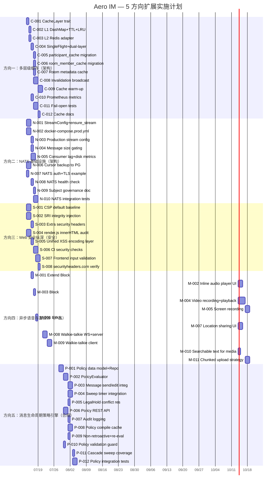

Now I have a thorough understanding of the codebase. Here's my comprehensive Tech Lead analysis.

---

# Tech Lead 分析报告：五个未覆盖高价值扩展方向

## 0. 执行摘要

| 方向 | 优先级 | 估工 | 影响面 | 前置依赖 | 建议启动 |
|------|--------|------|--------|----------|---------|
| 一·多级缓存体系 | P0 架构 | 3-4 周 | 全系统热路径 | 无 | 阶段 1 |
| 二·NATS 基础设施 | P1 架构 | 2 周 | 事件主干可靠性 | 无 | 阶段 1（与一并行） |
| 三·Web 安全纵深 | P2 安全 | 1.5 周 | Web 客户端 | 无 | 阶段 2 |
| 四·异步语音/富媒体 | P2 产品 | 5 周 | 消息模型+Web UX | 方向一（非强制） | 阶段 2（与三并行） |
| 五·消息生命周期引擎 | P2 合规 | 4 周 | 全系统消息路径 | 方向一（缓存可复用） | 阶段 3 |

**建议排期**：T0 启动方向一+方向二（架构先行）；T+2w 启动方向三+方向四（安全+产品并行）；T+4w 启动方向五（依赖方向一的缓存基础）。

---

## 1. 任务分解（TASK LIST）

### 方向一：多层级缓存体系（P0·架构）

| ID | 任务标题 | 涉及文件 | 前置 | 工时 | 验收标准 |
|----|---------|---------|------|------|---------|
| C-001 | 新建 `aero-cache` crate + `CacheLayer` trait | `crates/aero-cache/Cargo.toml`, `crates/aero-cache/src/{lib,traits,l1,l2,metrics}.rs`；修改 `workspace Cargo.toml` | 无 | 4h | `CacheLayer` trait 定义（`get`/`set`/`del`/`invalidate`）+ `Metrics` 结构体（`Counter`/`Histogram`）编译通过 |
| C-002 | L1 进程内存缓存（DashMap + TTL + LRU eviction） | `crates/aero-cache/src/l1.rs` | C-001 | 4h | L1 实现：TTL 过期驱逐、LRU 上限驱逐（可配置 `MAX_L1_ENTRIES`）、hit/miss/eviction 计数器、`ConcurrentMap` 语义（DashMap） |
| C-003 | L2 Redis 缓存 adapter | `crates/aero-cache/src/l2.rs`；修改 `crates/aero-storage/src/cache.rs`（复用 `RedisCache` client） | C-001 | 3h | L2 通过 fred Redis client 实现；`EXPIRE` TTL；`get` miss 返回 `None`；`Cache` trait 桥接 |
| C-004 | `SingleFlight` 回填保护 + 双层级 get 逻辑 | `crates/aero-cache/src/lib.rs`（`get_with_fallback`） | C-002, C-003 | 3h | 并发回填去重（同一 key 只有一个回填任务）；L1→L2→DB 阶梯；L2 故障降级（skip L2，L1+DB） |
| C-005 | `participant_cache` 移植为双层级 | `crates/aero-storage/src/participant.rs`；`crates/aero-storage/src/cache.rs` | C-004 | 3h | `get_or_fetch` 使用双层级；`invalidate` 同时 invalidate L1+L2；多实例验证最终一致性 |
| C-006 | `room_member_cache` 移植为双层级 | `crates/aero-storage/src/room_member_cache.rs` | C-004 | 3h | `get_room_members` L1+L2；`add_member`/`remove_member` 广播失效事件 |
| C-007 | 房间元数据缓存（rooms） | `crates/aero-storage/src/room.rs`（新增 `cached_get_by_id`） | C-004 | 2h | `get_room_by_id` 走缓存路径；`update_room` 写透失效 |
| C-008 | 写透失效广播（NATS 作为失效通道） | `crates/aero-bus/src/jetstream.rs`（新增 invalidation subject）；`crates/aero-cache/src/invalidation.rs` | C-001, C-009（可选） | 4h | 写路径广播 `cache.invalidate.room.{id}`；各实例监听并驱逐 L1 条目；最终一致 TTL ≤ 60s |
| C-009 | 缓存预热（新实例启动 + 定时 warm-up） | `crates/aero-server/src/bin/boot/background.rs`；`crates/aero-cache/src/warmup.rs` | C-005, C-006 | 4h | 新实例启动后 30s 内热门房间数据预热到 L1+L2；warm-up 定时器（可配置 `WARMUP_INTERVAL`） |
| C-010 | Prometheus 缓存指标 | `crates/aero-server/src/metrics.rs`；`crates/aero-cache/src/metrics.rs` | C-002, C-003 | 2h | `cache_hit_ratio{l1,l2,db}`/`cache_size{layer="l1"}`/`cache_evictions_total` → Grafana 面板 |
| C-011 | 缓存层故障 fail-open 测试 | `crates/aero-cache/tests/`（集成测试） | C-005, C-006 | 3h | L2 Redis 断连 → L1 继续服务 + `degraded` gauge；L1 全满 → LRU 驱逐正常；重启后冷启动 → SingleFlight 正常 |
| C-012 | 缓存层 Doc + 运维手册 | `docs/cache/` | C-010 | 2h | 缓存层级架构描述；TTL/上限调整指引；指标解读；故障预案 |

### 方向二：NATS 基础设施（P1·架构）

| ID | 任务标题 | 涉及文件 | 前置 | 工时 | 验收标准 |
|----|---------|---------|------|------|---------|
| N-001 | `StreamConfig` 声明式结构体 + `ensure_stream` 幂等 | `crates/aero-bus/src/jetstream.rs`（新增 `StreamConfig` struct + `ensure_stream`） | 无 | 3h | 所有流定义迁移至 `StreamConfig`；`bootstrap()` 使用 `ensure_stream`；`replicas`/`max_msg_size`/`max_bytes` 参数可配 |
| N-002 | NATS 3 节点集群 `docker-compose.prod.yml` | `docker-compose.prod.yml`（新建）；`docker-compose.yml` 留作开发单节点 | N-001 | 3h | 3 节点 NATS cluster（Raft）；`nats -js` 各节点配置；网络隔离（`nats-net` bridge） |
| N-003 | 生产级流配置（`IM_MESSAGES replicas=3, LIVE_EVENTS replicas=1`） | `crates/aero-bus/src/jetstream.rs`（`configs()` 函数） | N-001 | 2h | `IM_MESSAGES` replicas=2（raft quorum），`IM_EVENTS` replicas=2，`LIVE_EVENTS` replicas=1；各流 `max_bytes`/`max_msg_size` 设安全值 |
| N-004 | 消息大小门控（发布前校验） | `crates/aero-bus/src/jetstream.rs`（`validate_payload_size`）；`crates/aero-common/src/error.rs`（`PublishError::MessageTooLarge`） | N-001 | 2h | payload > `MAX_PAYLOAD_SIZE`（默认 1MB，可配置）→ 返回 `MessageTooLarge` error；调用方降级（拒绝/压缩后重试） |
| N-005 | NATS consumer lag + stream 磁盘指标 | `crates/aero-server/src/metrics.rs`（新增 gauge）；`crates/aero-bus/src/jetstream.rs`（`consumer_pending` 复用）+ `stream_disk_usage` | N-001 | 3h | `nats_consumer_pending{consumer="aero-server",stream="IM_MESSAGES"}` / `nats_stream_disk_usage{stream="IM_MESSAGES"}` → Prometheus + Grafana 面板 |
| N-006 | 消费者游标冗余备份到 PG/Redis | `crates/aero-storage/src/delivery_cursors.rs`（可能在 0153 之后已有）；`crates/aero-bus/src/jetstream.rs`（游标 checkpoint） | 无 | 3h | durable consumer 游标周期性写入 `delivery_cursors` 表；NATS Meta 丢失后可手动恢复 |
| N-007 | NATS 鉴权+加密配置示例 | `docker-compose.prod.yml`（加 `AUTH_TOKEN` + TLS 示例）；`config.example.toml`（加 `nats.tls`） | N-002 | 2h | 生产部署 NATS 带 `AUTH_TOKEN`；TLS 证书挂载示例；开发环境保持无鉴权 |
| N-008 | NATS 健康检查 + readiness 门控 | `crates/aero-server/src/health.rs`；`crates/aero-bus/src/jetstream.rs`（`ping` 方法） | N-001 | 2h | `/health/nats` 端点；`JetStreamBus::ping()` 方法（round-trip pub/sub）；NATS 不可用时 readiness 降为 503 |
| N-009 | 主题命名治理文档 + 禁止通配符订阅 | `crates/aero-bus/src/nats_governance.md`（新增文档） | 无 | 1h | subject 命名空间文档+注册表；consumer 创建时校验 subject 在白名单中 |
| N-010 | NATS 集成测试（集群模式 kill 节点） | `crates/aero-bus/tests/` | N-002, N-003 | 3h | kill 一个节点 → 消息发布不丢；`ensure_stream` 幂等验证；consumer lag 监控在 failover 期间正常 |

### 方向三：Web 应用安全纵深（P2·安全）

| ID | 任务标题 | 涉及文件 | 前置 | 工时 | 验收标准 |
|----|---------|---------|------|------|---------|
| S-001 | CSP 默认安全基线（非 opt-in） | `crates/aero-server/src/bin/boot/serve.rs` | 无 | 2h | `AERO_CSP_POLICY` 未设置时 fallback 为安全默认策略（`default-src 'self'; script-src 'self' https://cdn.jsdelivr.net; style-src 'self' 'unsafe-inline'; img-src 'self' data: blob:; connect-src 'self' ws: wss:; media-src 'self' blob:; form-action 'self'; frame-ancestors 'none'; base-uri 'self'`） |
| S-002 | SRI integrity 注入 CDN script | `web/index.html`（hls.js script 加 `integrity` + `crossorigin`）；`scripts/sri-update.sh`（CI 脚本） | 无 | 2h | `integrity="sha256-..." crossorigin="anonymous"` 在 CI 构建时自动计算并注入；CDN 版本锁定 |
| S-003 | 补充安全响应头（COEP/COOP/ Permissions-Policy 扩展） | `crates/aero-server/src/bin/boot/serve.rs` | S-001 | 1h | `Cross-Origin-Embedder-Policy: require-corp` / `Cross-Origin-Opener-Policy: same-origin` / `Permissions-Policy` 增加 `display-capture=()`, `clipboard-read=()`, `clipboard-write=()` |
| S-004 | render.js 安全审计——消除所有 innerHTML | `web/render.js`；`web/polls.js` | 无 | 3h | 零 `innerHTML`/`outerHTML`/`insertAdjacentHTML`；所有动态内容通过 `textContent`/`createElement`+`setAttribute` 注入 |
| S-005 | 统一 XSS 输出编码层 | `web/utils.js`（新建 `encodeForHTML`/`encodeForAttribute`/`encodeForURL`） | S-004 | 2h | 所有渲染路径统一经过编码函数；单元测试验证编码函数安全性 |
| S-006 | CI 集成安全头验证 + SRI 校验 | `scripts/web-check.sh`（扩展）；`.github/workflows/ci.yml`（如果存在） | S-001, S-002 | 2h | `scripts/web-check.sh` 新增 `check_sri` / `check_csp` / `check_security_headers` 步骤；CI 中 `npm audit` 检查 |
| S-007 | 前端输入统一校验层（trim + length cap + character whitelist） | `web/app.js`；`web/utils.js` | 无 | 2h | 所有文本输入字段统一走 `validateInput(value, {maxLength, pattern})`；至少覆盖消息发送、房间创建、搜索输入 |
| S-008 | securityheaders.com A+ 验证 | 运维文档 | S-001~S-003 | 1h | 部署后 securityheaders.com 评级 A+；Mozilla Observatory 评分 ≥ 100 |

### 方向四：异步语音与富媒体（P2·产品）

| ID | 任务标题 | 涉及文件 | 前置 | 工时 | 验收标准 |
|----|---------|---------|------|------|---------|
| M-001 | 扩展 `Block::Voice` 增加 `duration_secs`/`waveform` | `crates/aero-common/src/model/block.rs` | 无 | 2h | `Voice { blob_id, duration_ms(已有→改为保留), transcript, duration_secs: Option<f64>, waveform: Option<Vec<u8>> }`；向后兼容（旧消息 `duration_secs=None` 降级显示无波形） |
| M-002 | 语音消息内联 `<audio>` 播放器 UI | `web/render.js`（`renderVoice`）；`web/media.js`（`AudioPlayer` class） | M-001 | 4h | `Block::Voice` 渲染 `<audio controls>` + 播放速度（0.5x–2x）+ 进度条 + 暂停/继续；波形 Canvas（`waveform` 可用时） |
| M-003 | 新增 `Block::Video` variant | `crates/aero-common/src/model/block.rs`；`crates/aero-common/src/live.rs`（无需改） | 无 | 2h | `Video { blob_id, duration_secs: Option<f64>, thumbnail_blob_id: Option<BlobId> }`；serde tag `type = "video"`；`searchable_text()` 返回 `None` |
| M-004 | 视频消息录制 + 上传 + 内联播放 | `web/media.js`（`startVideoRecording`/`stopVideoRecording`）；`web/render.js`（`renderVideo`）；`web/app.js`（send video flow） | M-003 | 4h | 摄像头录制→预览→上传 blob→发送 `Block::Video`；`<video controls>` 内联播放；大小限制（≤100MB） |
| M-005 | 屏幕录制（getDisplayMedia） | `web/media.js`（`startScreenCapture`）；`web/app.js`（UI 入口） | M-004 | 3h | 屏幕分享录制→预览→裁剪→上传→发送；降级：不支持时显示提示 |
| M-006 | 新增 `Block::Location` variant | `crates/aero-common/src/model/block.rs` | 无 | 1h | `Location { lat, lng, zoom: Option<u8>, label: Option<String> }`；serde tag `type = "location"` |
| M-007 | 位置分享 UI（地图渲染 + 发送） | `web/render.js`（`renderLocation` — OpenStreetMap 静态图 iframe）；`web/app.js`（location picker） | M-006 | 3h | 位置渲染为 OpenStreetMap tile 静态图；点击打开地图；发送前可标注 |
| M-008 | 对讲机模式——WS 帧定义 + 服务端转发 | `crates/aero-common/src/live.rs`（`StreamEvent::WalkieTalkie`）；`crates/aero-server/src/ws/ws_impl/mod.rs`（`ClientFrame::PushToTalk` / `ServerFrame::WalkieTalkie`） | 无 | 3h | WS 帧：`push_to_start` → 服务端接收 `media_chunk` → 分发给 room watchers；`push_to_end` → 关闭；使用 `live.stream.*` ephemeral subject |
| M-009 | 对讲机——客户端录制+播放 | `web/media.js`（`WalkieTalkie` class）；`web/app.js`（`push_to_talk` keybind） | M-008 | 4h | `navigator.mediaDevices.getUserMedia` → MediaRecorder → chunked WS send；接收端 <audio> 自动播放（用户交互触发后） |
| M-010 | 富媒体消息参与 `searchable_text` + 索引 | `crates/aero-common/src/model/block.rs`（`Block::Voice`/`Video`/`Location` 的 `searchable_text`/`extra_searchable_text`） | M-001, M-003, M-006 | 1h | Voice 的 transcript 可搜；Video 的 `thumbnail_blob_id` 元数据记录；Location label 可搜 |
| M-011 | 大文件分段上传策略 | `web/media.js`；`crates/aero-server/src/routes/blob.rs` | M-004 | 3h | >10MB 文件自动分段（每段 5MB）；服务端合并；断点续传支持 |

### 方向五：消息生命周期策略引擎（P2·合规）

| ID | 任务标题 | 涉及文件 | 前置 | 工时 | 验收标准 |
|----|---------|---------|------|------|---------|
| P-001 | 策略引擎数据模型 + `PolicyRepo` | `crates/aero-storage/src/policy.rs`（新建）；`migrations/0158_policies.sql`（新建） | 无 | 4h | `workspace_policies` 表（id, workspace_id, room_id, kind, filter JSONB, action JSONB, priority, enabled, created_by, created_at, updated_at）；`PolicyRepo` CRUD 方法 |
| P-002 | `PolicyEvaluator`（匹配 + 冲突解决 + 执行） | `crates/aero-policy/` 新 crate（`src/{lib,evaluator,action}.rs`） | P-001 | 4h | `evaluate(room, blocks, participant_role) → Vec<PolicyAction>`；冲突解决（legal hold 胜出、最短 retention 胜出）；无匹配时回退工作区默认值 |
| P-003 | 消息发送/编辑路径接入策略评估 | `crates/aero-im-core/src/service/messages.rs`（`send_message`/`edit_message` 接入 `PolicyEvaluator`） | P-002 | 3h | 发送前评估 → 拒绝/标记/添加头信息；编辑时重新评估 → 更新状态 |
| P-004 | 清扫定时器接入策略过滤 | `crates/aero-server/src/bin/boot/retention.rs`；`crates/aero-storage/src/message/sweep.rs` | P-002 | 3h | sweep SQL WHERE 条件动态注入策略过滤（legal hold 豁免、按 block_type 过滤、按 room 过滤） |
| P-005 | 策略冲突解决：LegalHold 不可删除 | `crates/aero-policy/src/evaluator.rs`（`ConflictResolver` impl） | P-002 | 2h | LegalHold(preserve) vs Retention(delete) → LegalHold 胜；`audit_events` 记录覆盖 |
| P-006 | 策略管理 REST API | `crates/aero-server/src/policies.rs`（新建） | P-001 | 3h | `GET/POST /api/workspaces/:id/policies`；`PUT/DELETE /api/workspaces/:id/policies/:pid`；`GET /api/workspaces/:id/policies/audit` |
| P-007 | 策略执行审计日志 | `crates/aero-storage/src/audit.rs`（扩展 `log_policy_action`） | P-002 | 2h | 每次策略评估记录到 `audit_events`（`policy_kind`, `action`, `matched_rule_id`, `message_id`, `room_id`, `actor`） |
| P-008 | 策略编译缓存（room_id → compiled policy set） | `crates/aero-policy/src/cache.rs` | P-002, C-005（可复用 L2） | 3h | 启动时编译 + 策略变更时重建；room_id → `Vec<CompiledPolicy>`；Bitmask 过滤器加速 |
| P-009 | 策略变更不回溯 + 手动重新评估端点 | `crates/aero-server/src/policies.rs`（`POST /re-evaluate`） | P-006 | 2h | 策略变更默认 prospective only；`POST /api/workspaces/:id/policies/re-evaluate` 触发一次性回溯 |
| P-010 | 策略验证守卫（不可删除 legal hold、retention_days 范围） | `crates/aero-policy/src/validation.rs` | P-001 | 2h | 写入时校验：retention_days ∈ [1, 3650]；删除 legal hold 时检查 `legal_holds` 有 active hold → 拒绝；`priority` 互斥验证 |
| P-011 | 清扫路径覆盖 `message_history` / `reactions` / `attachments` | `crates/aero-storage/src/message/sweep.rs` | P-002 | 2h | Legal hold 覆盖 `message_history`、`reactions` 关联表；非 hold 消息级联删除 |
| P-012 | 策略引擎集成测试 | `crates/aero-policy/tests/` | P-002, P-006 | 4h | 策略组合测试（retention + legal hold + auto-delete）；清扫验证（set-based 删除受策略约束）；API CRUD 集成测试 |

---

## 2. 执行顺序（DEPENDENCY GRAPH）

```mermaid
graph TD
    %% Direction 1: Cache Hierarchy
    C001["C-001 CacheLayer trait"] --> C002["C-002 L1 DashMap+TTL+LRU"]
    C001 --> C003["C-003 L2 Redis adapter"]
    C002 --> C004["C-004 SingleFlight + dual-layer get"]
    C003 --> C004
    C004 --> C005["C-005 participant_cache migration"]
    C004 --> C006["C-006 room_member_cache migration"]
    C004 --> C007["C-007 Room metadata cache"]
    C004 --> C008["C-008 Invalidation broadcast via NATS"]
    C005 --> C009["C-009 Cache warm-up"]
    C006 --> C009
    C008 --> C009
    C002 --> C010["C-010 Prometheus cache metrics"]
    C003 --> C010
    C010 --> C011["C-011 Fail-open tests"]
    C011 --> C012["C-012 Cache docs"]

    %% Direction 2: NATS Infrastructure
    N001["N-001 StreamConfig + ensure_stream"] --> N003["N-003 Production stream config"]
    N001 --> N004["N-004 Message size gating"]
    N001 --> N005["N-005 Consumer lag + disk metrics"]
    N001 --> N008["N-008 NATS health check"]
    N002["N-002 3-node docker-compose.prod.yml"] --> N010["N-010 NATS integration tests"]
    N003 --> N010
    N005 --> N009["N-009 Subject governance doc"]
    N006["N-006 Cursor backup to PG"]
    N007["N-007 NATS auth+TLS example"]

    %% Direction 3: Web Security
    S001["S-001 CSP default baseline"] --> S003["S-003 Extra security headers"]
    S001 --> S006["S-006 CI security checks"]
    S002["S-002 SRI integrity injection"] --> S006
    S004["S-004 render.js innerHTML audit"] --> S005["S-005 Unified XSS encoding layer"]
    S007["S-007 Frontend input validation"]

    %% Direction 4: Async Voice & Rich Media
    M001["M-001 Extend Block::Voice"] --> M002["M-002 Inline audio player UI"]
    M003["M-003 Block::Video variant"] --> M004["M-004 Video recording+playback"]
    M003 --> M010["M-010 Searchable text for media"]
    M004 --> M005["M-005 Screen recording"]
    M004 --> M011["M-011 Chunked upload strategy"]
    M006["M-006 Block::Location variant"] --> M007["M-007 Location sharing UI"]
    M008["M-008 Walkie-talkie WS frames+server"] --> M009["M-009 Walkie-talkie client"]
    M010 --> M010

    %% Direction 5: Policy Engine
    P001["P-001 Policy data model+Repo"] --> P002["P-002 PolicyEvaluator"]
    P001 --> P006["P-006 Policy REST API"]
    P001 --> P010["P-010 Policy validation guard"]
    P002 --> P003["P-003 Message send/edit integration"]
    P002 --> P004["P-004 Sweep timer integration"]
    P002 --> P005["P-005 LegalHold conflict resolution"]
    P002 --> P007["P-007 Audit logging"]
    P002 --> P008["P-008 Policy compile cache"]
    P008 --> P009["P-009 Non-retroactive + re-evaluate"]
    P004 --> P011["P-011 Cascade sweep coverage"]
    P006 --> P012["P-012 Policy integration tests"]
    P003 --> P012

    %% Cross-direction dependencies
    C005 -.-> P008["Policy compile cache (reuses CacheLayer)"]
    C004 -.-> N001["StreamConfig ensures invalidation subject exists"]

    %% Parallel task groups
    subgraph PARALLEL_GROUP_1["**Phase 1 — Architecture (Week 1-2)**"]
        C001; C002; C003; N001; N002
    end

    subgraph PARALLEL_GROUP_2["**Phase 1b — Independent quick wins**"]
        S001; S002; S004; S007; M001; M003; M006; M008; P001; N006; N007; N009
    end

    subgraph PARALLEL_GROUP_3["**Phase 2 — Core + Security + Media (Week 3-4)**"]
        C004; C005; C006; C007; C008; N003; N004; N005; N008; S003; S005; S006; M002; M004; M010; P002; P005; P010
    end

    subgraph PARALLEL_GROUP_4["**Phase 3 — Polish + Policy (Week 5-6)**"]
        C009; C010; C011; C012; N010; S006; M005; M007; M009; M011; P003; P004; P006; P007; P008
    end

    subgraph PARALLEL_GROUP_5["**Phase 4 — Wrap (Week 7-8)**"]
        P009; P011; P012
    end
```

### 并行化建议

| 工作流 | 开发者 | 起始时间 | 对应任务组 |
|--------|--------|---------|-----------|
| **后端架构流**（缓存+NATS） | 资深 Rust 工程师 ×2 | Week 1 | C-001~C-012 + N-001~N-010 |
| **Web 安全流** | 安全/前端工程师 ×1 | Week 1-2 | S-001~S-008（可与架构流并行） |
| **富媒体流** | 全栈工程师 ×1 | Week 2 | M-001~M-011（需 Block 定义先落地，M-001/M-003/M-006 可提前） |
| **策略引擎流** | 后端工程师 ×1 | Week 3 | P-001~P-012（需 cache 层 P-008 就绪） |

---

## 3. 技术风险（RISK ASSESSMENT）

### 3.1 高风险项（必须预研/开发前验证）

| # | 风险 | 方向 | 可能性 | 影响 | 缓解策略 |
|---|------|------|--------|------|---------|
| R1 | **L2 Redis 故障下 L1 缓存污染**——Redis 重启后返回过时数据，L1 认为缓存命中但实际是脏数据 | 一 | 中 | 高 | L1 TTL 硬限制（最多 60s）+ Redis `GET` 时带版本号（sequence number）；写透失效时先 invalidate L2 再 invalidate L1 |
| R2 | **NATS Raft leader 切换期间消息发布阻塞**——`publish().await` 超时导致 IM 消息延迟 | 二 | 中 | 高 | `aero-bus` 现有 `retry_on_timeout` 重试；写路径加入 messaging timeout 监控；客户端侧 graceful degradation（用户看到"发送中"状态） |
| R3 | **CSP 默认安全策略破坏现有功能**——hls.js 或 WebSocket 被 CSP 拦截 | 三 | 高 | 高 | **必须 pre-staging 验证**：先在 staging 用 report-only 模式（`Content-Security-Policy-Report-Only`）收集违规报告，迭代策略后再 enforce |
| R4 | **对讲机模式的 NATS 投递延迟**——`live.stream.*` 是 ephemeral subject，但跨节点有网络延迟，导致 >2s 延迟 | 四 | 中 | 中 | 客户端缓冲（至少 500ms jitter buffer）；使用 `StreamEvent::WalkieTalkie` 带 sequence 编号用于客户端排序；评估是否需独立 subject（`live.walkie.*`） |
| R5 | **策略引擎评估成为新的热路径瓶颈**——每消息发送前评估数十条策略 | 五 | 中 | 高 | P-008 策略编译缓存（room_id → 位掩码 vector，O(1) bitwise match）；评估的预计算在策略变更时完成，不在消息发送路径上解析 JSONB |

### 3.2 中风险项（需设计 review）

| # | 风险 | 方向 | 缓解 |
|---|------|------|------|
| R6 | 多级缓存 key 命名冲突（`cache_key` 格式不一致） | 一 | 统一 `cache_key(namespace, id)` 方法，namespace 枚举（`participant`/`room`/`room_member`/`permission`） |
| R7 | NATS 3 节点扩容后副本分布不均——JetStream 不支持自动重平衡 | 二 | 初始部署 3 或 5 节点（避免以后扩容）；流创建时指定 `Replicas=3`，`Placement` 显式指定 cluster |
| R8 | SRI hash 与 CDN 版本不同步导致 hls.js 加载失败 | 三 | CI 脚本 `scripts/sri-update.sh` 在 `Cargo.toml` lock hls.js 版本；CI 中 `curl CDN_URL | sha256sum` 自动化；失败时 CI 红 |
| R9 | 视频消息上传带宽消耗大（>100MB 文件） | 四 | 客户端上传前转码降码率（可选的 `quality` 参数）；服务端限制 `max_body_bytes`；blob store 限 bucket 总容量 |
| R10 | 策略数量膨胀（1000+）导致每次评估 O(N) | 五 | 预编译为 room_id → `Vec<CompiledPolicy>`；`filter` 用位掩码（bitflags）快速过；评估走 memoized matching |

### 3.3 外部依赖风险

| 依赖 | 版本 | 用途 | 风险 | 替代 |
|------|------|------|------|------|
| async-nats 0.36 | 0.36 | NATS 客户端 | JetStream API 在 0.36 后仍在演进——需锁定版本 | 无替代；升级后需全面回归 |
| fred 9 | 9.x | Redis 客户端 | `CacheLayer` L2 依赖 fred 的 `RedisClient`——但 fred 的 Connection 层变更可能破坏 | 已有的 `RedisCache` 包装层提供缓冲 |
| hls.js 1.5.18 | CDN 固定 | HLS 播放 | jsdelivr CDN 被 DNS 劫持/CDN 投毒 | 自托管 bundle + SRI hash |
| str0m 0.19 | 0.19 | WebRTC DTLS-SRTP | 对讲机模式不依赖 str0m（走 NATS 纯信令），但未来如果需将 WalkieTalkie 升级为实时 P2P 音频 | 无替代 |

### 3.4 性能预算

| 热路径 | 当前延迟 | 目标延迟 | 风险点 |
|--------|---------|---------|--------|
| 消息发送（`send_message`） | ~5ms (PG insert) | ≤2ms with cache | L1 cache hit 需 < 100μs；SingleFlight 回填时后续请求不能阻塞 |
| 房间成员列表（`get_room_members`） | ~3-8ms (PG SELECT) | ≤1ms with cache | 房间成员变更频繁的房间（大聊天室）L1 失效频繁 |
| 策略评估（per message） | N/A（新功能） | ≤1ms per message | 策略数量 >100 后预编译位掩码是否够快 |
| NATS publish | <1ms (in-mem) | <5ms (cluster Raft commit) | Raft 写放大 3×，但 NATS 承诺 <5ms 对 IM 可接受 |

---

## 4. 资源评估

### 4.1 团队规模和技能

| 角色 | 人数 | 技能要求 | 负责方向 |
|------|------|---------|---------|
| 资深 Rust 后端（架构） | 1 | Rust 异步、NATS JetStream、Redis 缓存模式（cache-aside, write-through）、多线程安全 | 方向一（缓存）+ 方向二（NATS） |
| 后端 Rust 工程师 | 1 | sqlx、REST API 设计、IM 业务逻辑、PG 查询优化 | 方向五（策略引擎）+ 方向一部分（caching hot path） |
| 全栈/前端工程师 | 1 | JavaScript ES2020、MediaRecorder API、Canvas 波形、Web Audio API、安全 CSP/SRI | 方向三（Web 安全）+ 方向四（富媒体） |
| （可选）安全工程师 | 0.5 | OWASP 安全实践、渗透测试、CSP 策略设计 | 方向三安全审计 + CI 安全集成 review |

**最小可行团队**：3 人（2 后端 + 1 全栈），可在 8 周内交付全部 5 个方向的 MVP。

### 4.2 关键里程碑

| 里程碑 | 时间 | 交付物 | 完成标准 |
|--------|------|--------|---------|
| **M1: CacheLayer MVP** | Week 1 | C-001~C-004 | 双层级缓存系统编译通过，`get_with_fallback` 单测通过（L1 hit < 10μs, L2 hit < 1ms） |
| **M2: NATS 集群就绪** | Week 2 | N-001~N-004, N-008 | 3 节点集群 deployable；`ensure_stream` 幂等验证；consumer lag 指标输出 |
| **M3: 缓存全线接入** | Week 3 | C-005~C-010 | `participant_cache`/`room_member_cache`/room metadata 全线使用双层级；Prometheus 指标可观测 |
| **M4: Web 安全基线** | Week 2-3 | S-001~S-007 | CSP report-only 在 staging 零违规；SRI 注入 CI 验证；render.js 零 innerHTML |
| **M5: 语音消息可用** | Week 3-4 | M-001~M-002 | `Block::Voice` 内联播放器带波形+变速；`transcribe_bot` 转写字覆盖 |
| **M6: 策略引擎 MVP** | Week 4-5 | P-001~P-005, P-008 | 可创建策略→消息发送时评估→legal hold 获胜→`audit_events` 记录 |
| **M7: 视频+位置消息** | Week 5-6 | M-003~M-007 | 视频录制发送播放；位置分享地图渲染 |
| **M8: 策略管理 API + 清扫集成** | Week 6-7 | P-006~P-011 | API CRUD 测试通过；sweep 定时器正确按策略过滤 |
| **M9: 对讲机模式** | Week 7 | M-008~M-009 | 2 个浏览器之间 <2s 语音传输 |
| **M10: 综合验收** | Week 8 | 全部方向 | `cargo test` 全绿；NATS failover 验证；securityheaders A+；所有验收标准满足 |

### 4.3 阻塞点（Blockers）

| # | 阻塞描述 | 影响方向 | 解决策略 | 应急方案 |
|---|---------|---------|---------|---------|
| B1 | **async-nats 0.36 不支持 `stream.update` 修改副本数**——无法在已有流上改 replicas | 二 | `ensure_stream` 使用 `get_or_create_stream`，副本数在首次创建时固定；如需变更，需 drain 后重建 | 开发时接受 replicas=1；生产部署前决定 replicas 后再创建 |
| B2 | **fred 9 的 `RedisClient::get` 在断连时不返回错误**（内部重试）——应用层看不见 L2 故障 | 一 | 在 `L2Cache` 层维护独立的 `ping` 健康探测（每 5s）+ `CircuitBreaker`；连续 3 次失败标记为 `degraded` | 短 TTL（60s）+ SingleFlight 回填已有兜底，L2 故障只影响命中率不影响正确性 |
| B3 | **MediaRecorder API 在 iOS Safari 上不支持指定 mimeType**——WebM/opus 受限 | 四 | 检测浏览器能力 + 降级为默认编码（iOS 仅支持 mp4）；服务端不做转码假设 | 语音消息在 iOS 上降级为不带波形的基础 `<audio>` 播放器 |
| B4 | **策略引擎的 JSONB filter 在 SQL 中不能高效过滤**——每 tick 全表扫描 | 五 | 策略编译为 Rust 侧位掩码 + 运行时评估，不依赖 SQL 过滤策略条件。SQL 只做 `enabled=true AND (room_id IS NULL OR room_id=$1)` 粗过滤 | 消息数 < 10M 时全表扫描可接受（当前阶段） |

---

## 5. 质量保证

### 5.1 单元测试覆盖要求

| 模块 | 最低覆盖率 | 关键测试场景 |
|------|-----------|-------------|
| `aero-cache::l1` | 90% | 插入/读取/过期驱逐/LRU 驱逐/并发读写/hit 计数器 |
| `aero-cache::l2` | 85% | set/get/miss/ttl 过期/连接断开 recover |
| `aero-cache::traits` | 95% | `get_with_fallback` L1 hit/L2 hit/L1+L2 miss/SingleFlight 去重 |
| `aero-bus::nats` (ensure_stream) | 90% | 幂等创建/配置变更/重复调用 |
| `aero-common::model::block` (新 variants) | 95% | serde 序列化/反序列化/向后兼容/`searchable_text` |
| `aero-storage::policy` | 90% | CRUD/查询/唯一约束/priority |
| `aero-policy::evaluator` | 95% | 冲突解决 6 种组合/无匹配回退/空策略列表 |
| `web/render.js`（新富媒体渲染） | — | ESLint + Playwright 端到端（波形渲染/视频播放/地图加载） |

### 5.2 集成测试策略

| 测试套件 | 方向 | 工具 | 策略 |
|---------|------|------|------|
| **缓存层级 failover 测试** | 一 | `cargo test --test cache_integration -- --ignored` | 启动 Redis 容器 → 填充缓存 → kill Redis → 验证 L1 继续服务/`degraded` gauge 置位 → 恢复 Redis → L2 恢复 |
| **NATS 集群 failover** | 二 | Docker Compose + `cargo test --test nats_cluster` | 3 节点集群 → kill leader → 验证 `publish` 零丢失 → consumer lag 指标正常 |
| **策略引擎端到端** | 五 | `cargo test --test policy_e2e` | 创建策略→发送消息→验证策略执行→验证 audit 记录→清扫 tick→验证消息保留/删除 |
| **Web 安全头验证** | 三 | Playwright / `curl -I` + CI 脚本 | 启动 server → `curl -I /api/health` 验证 8 个安全头存在且值正确 |
| **富媒体 Block 序列化** | 四 | Rust 的 `serde_json::from_str/to_string` | 旧消息（无 `duration_secs`）→ deserialize 为 `Voice { duration_secs: None }`；新消息 → 所有字段都有 |

### 5.3 代码审查要点

| 审查点 | 方向 | 检查内容 |
|--------|------|---------|
| **L1 缓存线程安全** | 一 | DashMap 的 `insert`/`get` 不需要外部同步；LRU eviction 在 concurrent access 下不 panic；`entry.weight` 原子操作 |
| **失效广播的正确性** | 一 | NATS invalidation subject 不能订阅者丢失；invalidation 消息必须被所有实例消费；`aero-bot` 是否也需要订阅 |
| **NATS `ensure_stream` 幂等** | 二 | 重复调用不 panic、不重建、不丢 consumer；replicas 由 `get_or_create_stream` 的 `update` 语义处理 |
| **SRI 注入 CI 安全** | 三 | `integrity` 值不来自外部输入；CI 脚本使用 HTTPS 链接获取 CDN hash；失败时 break the build |
| **Block::Video 上传路径** | 四 | Blob 大小校验（≤100MB）；`thumbnail_blob_id` 可选——`render.js` 处理 `None` 时不崩溃；`content_sniff` 识别视频 MIME |
| **政策冲突解决顺序** | 五 | legal hold 始终胜出；retention 取最小；`priority` 只用于同 kind 策略间排序；`audit_events` 记录冲突解决原因 |
| **Token helper 冲突** | 五（P-006） | 按 §4.2 规则——`aero-storage::policy::` 不冲突 root re-export |

### 5.4 性能测试需求

| 场景 | 方向 | 负载 | 目标 | 工具 |
|------|------|------|------|------|
| 缓存路径 L1 vs L2 vs DB | 一 | 10000 req/s 读取已缓存房间成员 | L1 < 50μs p99, L2 < 1ms p99, DB < 10ms p99 | `cargo bench` + `hyperfine` |
| 缓存预热后 PG 压力 | 一 | 50 实例同时启动 → 热门房间预热 | PG `SELECT` 峰值 < 50 qps（无缓存时 > 5000） | `pg_stat_statements` |
| NATS 集群吞吐 | 二 | 10000 msg/s `im.room.*` publish + 3 consumer | 集群吞吐 > 5000 msg/s, p99 lag < 100ms | `nats bench` |
| 策略评估延迟 | 五 | 200 条策略/房间，1000 req/s 消息发送 | p99 策略评估 < 1ms（含编译缓存命中） | `criterion` benchmark |
| 语音消息播放 UX | 四 | 波形 Canvas 渲染 + `<audio>` 播放 | FPS > 30 波形动画；音频 start < 500ms | Chrome DevTools Performance |

---

## 6. 实施计划（IMPLEMENTATION PLAN）

### 6.1 甘特图

### 6.2 阶段规划

#### 阶段 1：基础设施搭建（Week 1-2，2026-07-14 ~ 2026-07-25）

**目标**：缓存骨架 + NATS 集群 + 安全基线 + Block 定义扩展

| 日期 | 后端（架构流） | 后端（并行） | 前端/安全 |
|------|-------------|-------------|----------|
| Day 1-2 | C-001, C-002, C-003 | N-001, N-002 | S-001, S-002 (CSP+SRI) |
| Day 3-4 | C-004 (SingleFlight) | N-003, N-004, N-005 | S-004 (render.js audit) |
| Day 5-6 | C-005 (participant_cache) | N-006, N-007, N-008 | M-001, M-003, M-006 (Block 定义) |
| Day 7-8 | C-006 (room_member_cache) | N-009, N-010 | S-003, S-005 (headers + encoding) |
| Day 9-10 | C-007 (room cache) | — | S-007 (input validation) |

**阶段 1 验收**：
- `cargo check + clippy` 全绿
- 缓存 L1+L2 单测通过
- NATS 3 节点集群 `docker-compose.prod.yml` 启动成功
- CSP 在 staging report-only 零违规
- `Block::Voice` extended, `Block::Video`, `Block::Location` 编译通过

#### 阶段 2：核心功能实现（Week 3-5，2026-07-28 ~ 2026-08-14）

**目标**：缓存全线接入 + 策略引擎 MVP + 语音/视频播放器 + 对讲机服务端

| 日期 | 后端（缓存+NATS） | 后端（策略引擎） | 前端（富媒体） |
|------|-----------------|----------------|--------------|
| Day 11-13 | C-008 (invalidation) | P-001, P-002 | M-002 (audio player) |
| Day 14-16 | C-009 (warm-up), C-010 (metrics) | P-005, P-008 | M-004 (video recording) |
| Day 17-19 | N-010 (NATS integration tests) | P-003, P-004 | M-008 (walkie server) |
| Day 20-22 | C-011 (fail-over tests) | P-006, P-007 | M-009 (walkie client) |
| Day 23-25 | C-012 (docs) | P-010 | M-005, M-007 (screen + location) |

**阶段 2 验收**：
- `participant_cache`/`room_member_cache`/room cache 全线双层级
- Prometheus `cache_hit_ratio{layer="l1"}` > 80%（热门房间）
- 策略引擎创建→评估→执行→审计全链路
- 语音消息内联播放器可用（波形+变速）
- 视频录制+播放可用
- 对讲机 2 浏览器 <2s

#### 阶段 3：集成测试和优化（Week 6-7，2026-08-17 ~ 2026-08-28）

**目标**：策略管理 API 完成 + 缓存性能调优 + 富媒体全部功能 + 安全验证

| 日期 | 后端 | 前端 |
|------|------|------|
| Day 26-28 | P-011 (cascade sweep), P-012 (integration tests) | M-010, M-011 (searchable + chunked) |
| Day 29-31 | 缓存性能调优（LRU size tuning, SingleFlight bench） | S-006 (CI security checks) |
| Day 32-34 | NATS benchmark + failover 验证 | S-008 (securityheaders verify) |
| Day 35-37 | 清扫定时器策略集成端到端测试 | M-007 完善 + 浏览器兼容性修复 |

**阶段 3 验收**：
- 策略 CRUD API + 清扫集成 + `audit_events` 全链路
- NATS 集群 failover 验证通过
- securityheaders.com A+
- 所有富媒体功能端到端可用

#### 阶段 4：发布准备（Week 8，2026-08-31 ~ 2026-09-04）

**目标**：文档 + 运维手册 + 最终验收

| 日期 | 工作 |
|------|------|
| Day 38 | `docs/cache/` 运维手册（TTL 调优, failover 预案） |
| Day 39 | `docs/nats/` 运维手册（集群扩容, consumer lag 告警设置） |
| Day 40 | `docs/policy/` 管理员指南（创建策略, 审计报告解读） |
| Day 41 | 端到端 smoke test + 5 个方向的验收标准逐条确认 |
| Day 42 | `cargo clippy --workspace --all-targets` + final review |

**阶段 4 验收**：
- 全部验收标准满足（见分析文档「验证方式」表）
- `cargo test --workspace` 全绿（含集成测试）
- `scripts/{truth-check,file-size-check,web-check}.sh` 零违规
- 文档完整

### 6.3 快速胜利项（可提前并行）

以下任务不依赖任何其他方向，可分配给任何空闲开发者立即启动：

1. **S-002**（SRI injection）：修改 `web/index.html` 加 integrity + CI 脚本——半天
2. **S-004**（render.js audit）：审计 innerHTML——独立，半天~1天
3. **M-001/M-003/M-006**（Block 新 variants）：纯后端数据模型修改，不依赖 UI——半天
4. **N-006**（NATS cursor backup）：独立模块——1天
5. **N-007**（NATS auth example）：纯配置文档——半天
6. **S-007**（frontend input validation）：前端统一校验——1天

---

## 附录 A：与既有代码/文档的差异点

| 方向 | 分析文档假设 | 代码/文档实际情况 | 影响 |
|------|------------|-----------------|------|
| 方向四·Voice block | `duration_secs: Option<f64>` | 已有 `duration_ms: u32`——两者可共存，新字段加 `#[serde(default)]` | ✅ 向后兼容，只需加字段不破坏现有 |
| 方向二·NATS bootstrap | 说"隐式创建无配置" | 已有 `bootstrap()` 方法 + `get_or_create_stream`（但无 replicas/max_msg_size） | ✅ 需在现有基础上加参数，非重写 |
| 方向一·cache.rs | 说"零缓存基础设施" | 已有 `RedisCache` trait + `participant_cache`（但只有 DashMap L1 无 L2） | ✅ 复用 `RedisCache` client 做 L2 adapter |
| 方向三·render.js | 说有 `innerHTML` | 代码注释明确说"never via innerHTML"，但需核验 `polls.js` 和备注中的"few innerHTML" | ⚠️ 需完整 grep 确认 |
| 方向五·策略引擎 | 说"零策略概念" | `room.rs` 已有 `post_policy` 字段，"审查后发言"策略——但这是小策略，与引擎正交 | ✅ 可独立演进 |

---

## 附录 B：技术债务回收建议

在实施 5 个方向的过程中，建议顺带回收以下技术债务：

| 债务 | 关联方向 | 建议操作 |
|------|---------|---------|
| `aero-bus` 无单元测试（0 tests） | 二 | N-010 时补充基线测试 |
| `crates/aero-storage/src/cache.rs` 中 `Cache` trait 的 `set` 无返回值（吞错误） | 一 | C-003 时修正签名 `Result<()>` |
| `web/render.js` 800+ 行无模块分割 | 四 | M-002 时提取 `AudioPlayer`/`VideoPlayer`/`LocationRenderer` 到独立文件 |
| 多处 hardcoded `AERO_*` env 变量名（`serve.rs` 读 `AERO_CSP_POLICY` 未通过 config 层） | 三 | S-001 时改为通过 `AppConfig` 读取 |
