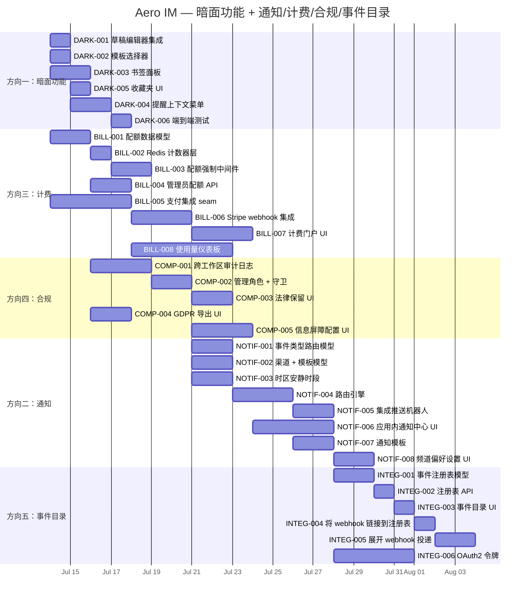

现在我已经对整个代码库有了全面的了解。以下是技术负责人的分析。

---

# 技术负责人分析：Aero IM 暗面功能 + 通知/计费/合规/事件目录

## 前提：代码库当前状态

验证的基线（2026-07-12）：
- **5 个已确认的暗面功能**：草稿、书签、收藏夹、模板、消息提醒 —— 后端均具有完整实现（存储层 200-340 行，服务器层 120-250 行），但 `web/` 中 JavaScript/HTML 的引用次数为 **0**。
- **通知系统**：成熟度中等。包括：频道静音、工作区静音、DND 窗口（支持跨日）、单次暂停、关键词提醒、线程偏好设置、通知聚合（30 秒延迟）。**缺失**：事件类型路由、投递渠道选择（推送/邮件/应用内/摘要）、时区感知安静时段、通知模板。
- **webhook**：`event_kind()` 函数存在（映射所有 14 个 `RoomEvent` 变体），但 `run_webhook_dispatcher` **仅投递** `RoomEvent::Message`。
- **计费**：无 Stripe/Paddle/订阅表/`plan_id`。零计费基础设施。`ws_rate.rs` 中的 `rate_tier`（标准/高级/无限量）提供了可复用的 Redis 计数器模式。
- **审计**：`audit_events` 是已分区（按日）的仅追加表，但**没有**跨工作区管理 UI/路由。
- **OAuth/集成**：零匹配。无外部事件目录。
- **管理/超级管理员**：零匹配。无未绑定租户的管理路由。

---

## 1. 任务分解

### 方向一：暗面功能 —— 将现有后端接入 Web UI（第 1 优先级：计入收入）

| 任务 ID | 标题 | 文件 | 前置依赖 | 工时 | 验收标准 |
|---------|-------|-------|----------------|-------|------------------|
| DARK-001 | 将草稿 API 集成到 web/app.js 的消息编辑器 | `web/app.js`、`web/render.js`、`web/ws.js` | — | 4h | 编辑器关闭 / 标签页切换时自动保存；恢复上次保存内容；UI 指示器显示已保存 |
| DARK-002 | 消息输入框中的模板选择器 UI | `web/app.js`、`web/render.js`、`web/modals.js`、`web/style.css` | — | 3h | `/template` 命令或按钮触发选择器；点击插入模板内容；搜索/过滤 |
| DARK-003 | 频道中的书签面板 | `web/chrome.js`、`web/app.js`、`web/render.js`、`web/style.css` | — | 3h | 频道标题中的书签按钮；侧边面板列出书签；点击跳转；添加/删除 |
| DARK-004 | 消息上下文菜单中的提醒功能 | `web/app.js`、`web/render.js`、`web/modals.js` | DARK-001 | 3h | 消息操作中的“提醒我”项；时间选择器（30 分钟 / 1 小时 / 自定义）；确认 toast |
| DARK-005 | 收藏夹 UI（频道/消息） | `web/chrome.js`、`web/render.js`、`web/style.css` | — | 2h | 收藏夹切换按钮；频道列表中的已收藏指示器；带快速过滤的收藏夹视图 |
| DARK-006 | 草稿 UI 的端到端测试 | `web/`（集成）、`scripts/smoke-test.sh` | DARK-001 | 3h | 完整的浏览器测试：输入 → 导航离开 → 返回 → 草稿恢复 → 发送 → 草稿清除 |

**方向一总计：18 小时**（最多 2 个并行任务）

### 方向二：通知路由 —— 从布尔值到首选渠道的优先级路由（第 3 优先级：留存）

| 任务 ID | 标题 | 文件 | 前置依赖 | 工时 | 验收标准 |
|---------|-------|-------|----------------|-------|------------------|
| NOTIF-001 | 通知偏好数据模型：事件类型路由 | `migrations/NNNN_event_type_routing.sql`、`aero-storage/src/notification_route.rs` | — | 4h | 新表 `notification_routes`（participant_id, event_kind, channel[]）。迁移可重复；DDL 包含 CHECK 约束 |
| NOTIF-002 | 通知偏好数据模型：渠道 + 模板 | `migrations/NNNN_notif_channels.sql`、`aero-storage/src/notification_channel.rs` | NOTIF-001 | 3h | `notification_channels` 表包含 `channel`（推送/邮件/应用内/摘要）、`enabled`、`template_overrides`（JSONB）。每用户每个渠道一行 |
| NOTIF-003 | 时区感知安静时段 | `migrations/NNNN_timezone_quiet_hours.sql`、`aero-storage/src/notification_prefs.rs`（扩展） | — | 3h | 将 IANA 时区添加到 `dnd_settings`。`should_suppress` 使用时区偏移量确定本地时间。现有跨日 DND 逻辑保持不变 |
| NOTIF-004 | ImService 中的通知路由引擎 | `aero-im-core/src/service/notifications.rs` | NOTIF-001、NOTIF-002 | 5h | `route_notification()` 按事件类型查询路由 → 交叉引用渠道偏好 → 在 `participant_cache` 中进行模板渲染。每个渠道生成 N 个投递项目 |
| NOTIF-005 | 根据路由引擎集成 Push Bot | `aero-server/src/push_bot.rs` | NOTIF-004 | 3h | Push bot 消费来自路由引擎的投递项目。现有 FCM/APNs 逻辑不变。每个订阅者仅一次 |
| NOTIF-006 | 应用内通知中心 UI | `web/notifications.js`、`web/app.js`、`web/style.css`、`web/index.html` | DARK-001 | 5h | 带标记/未标记计数徽章的通知铃铛。下拉列表显示收件箱。点击跳转。全部标记已读 |
| NOTIF-007 | 通知模板系统 | `aero-storage/src/notification_template.rs`、`web/notifications.js` | NOTIF-001 | 4h | JSON 模板（每个事件类型 + 每个渠道）。渲染时变量替换。web 端的回退默认值 |
| NOTIF-008 | 频道偏好设置 UI | `web/modals.js`、`web/app.js`、`web/style.css` | NOTIF-006 | 4h | 模态框：事件类型列表（消息、提及、回复、已编辑、已删除、投票）。每个事件类型的切换按钮。用警告色突出显示“无”选择 |

**方向二总计：31 小时**（NOTIF-001/003 可并行）

### 方向三：计费 —— 配额骨架 + 支付集成（第 0 优先级：收入）

| 任务 ID | 标题 | 文件 | 前置依赖 | 工时 | 验收标准 |
|---------|-------|-------|----------------|-------|------------------|
| BILL-001 | Workspace 配额数据模型 | `migrations/NNNN_workspace_quotas.sql`、`aero-storage/src/workspace_quota.rs` | — | 4h | `workspace_quotas` 表包含 `messages_per_day: int`、`storage_gb: int`、`ai_calls_per_day: int`、`max_members: int`。行按工作区 ID 唯一。默认值来自配置。迁移幂等 |
| BILL-002 | Redis 计数器层（复用 WsRateStore 模式） | `aero-storage/src/usage_counter.rs` | BILL-001 | 3h | `UsageCounter`：`INCR + EXPIRE` 到 UTC 午夜。方法：`increment(key, window_secs)`、`get_remaining(key, limit)`、`reset(key)`。纯 Redis，无 PG 往返 |
| BILL-003 | 按请求的配额执行中间件 | `aero-server/src/middleware/quota_enforcer.rs` | BILL-002 | 4h | Axum 中间件：提取工作区 → 获取配额限制 → 检查使用量 → 通过/拒绝。`X-Quota-Remaining` 和 `Retry-After` 头部。`QuotaExceeded` 错误码 |
| BILL-004 | 管理员配额管理 API | `aero-server/src/workspace_quotas.rs` | BILL-001 | 3h | `GET/PUT /api/workspaces/:id/quota`。AuthUser + member_role(admin)。ETag 用于并发控制。审计日志 |
| BILL-005 | 支付集成 seam：trait + Stripe 桩 | `aero-storage/src/billing/subscription.rs`、`aero-storage/src/billing/payment_trait.rs` | BILL-001 | 5h | `PaymentProvider` trait：`create_subscription`、`cancel`、`webhook`、`get_portal_url`。Stripe stubs。`CheckoutSession` 和 `Subscription` 模型。分离测试 |
| BILL-006 | 基于 Stripe webhook 的计划升级 | `aero-server/src/billing/stripe_webhook.rs` | BILL-005 | 4h | Stripe webhook 端点 `POST /api/billing/stripe-webhook`。处理 `checkout.session.completed` → 更新配额。`invoice.paid` → 续订。`customer.subscription.deleted` → 降级 |
| BILL-007 | 计费门户 UI | `web/modals.js`、`web/app.js`、`web/style.css`、`web/index.html` | BILL-006 | 4h | 工作区设置中的“计费”选项卡。显示当前计划 + 使用量（消息/存储/AI/成员）。升级按钮。Stripe 结账门户链接 |
| BILL-008 | 使用量仪表板（工作区管理员） | `web/modals.js`、`web/app.js` | BILL-004、BILL-007 | 3h | 带图表的每日使用量视图（未加工，基于 CSS）。最近 30 天的峰值与配额限制对比。颜色编码：绿色 < 80%，黄色 < 95%，红色 ≥ 95% |

**方向三总计：30 小时**（BILL-001/002 可并行；BILL-005 与 BILL-003 可并行）

### 方向四：合规搜索 + 审计 UI（第 2 优先级：监管）

| 任务 ID | 标题 | 文件 | 前置依赖 | 工时 | 验收标准 |
|---------|-------|-------|----------------|-------|------------------|
| COMP-001 | 跨工作区管理审计日志视图 | `aero-server/src/admin_audit.rs` | — | 4h | `GET /api/admin/audit`（按用户/操作/日期范围过滤）。需要 `is_admin` 角色（新角色，不是根权限）。分页返回 |
| COMP-002 | 管理角色 + 守卫 | `migrations/NNNN_admin_roles.sql`、`aero-auth/src/`、`aero-storage/src/role.rs` | COMP-001 | 3h | `workspace_admin` 和 `org_admin` 角色。`require_admin` 中间件。工作区范围内的审计可见性 |
| COMP-003 | 法律保留 UI | `web/modals.js`、`web/app.js`、`web/style.css` | COMP-001 | 3h | 法律保留表单（参与者 ID、原因、到期日）。列出活跃保留。管理员的“导出匹配消息”按钮 |
| COMP-004 | GDPR 导出 UI | `web/modals.js`、`web/app.js` | — | 2h | “导出我的数据”按钮在 `/api/me/export` 触发。显示导出状态（待处理/已完成/失败）。下载链接 |
| COMP-005 | 信息屏障配置 UI | `web/modals.js`、`web/app.js`、`web/style.css` | COMP-002 | 4h | 管理员的屏障 CRUD：名称、标签过滤器、排除的用户。通过 `info_barriers` 路径在发送时实时验证 |

**方向四总计：16 小时**（COMP-001/004 可并行）

### 方向五：事件目录 / 集成（第 4 优先级：扩展性）

| 任务 ID | 标题 | 文件 | 前置依赖 | 工时 | 验收标准 |
|---------|-------|-------|----------------|-------|------------------|
| INTEG-001 | 事件类型注册表数据模型 | `migrations/NNNN_event_registry.sql`、`aero-storage/src/event_registry.rs` | — | 3h | `event_registry` 表（name、schema（JSONB）、description、deprecated_at）。为所有当前 RoomEvent 变体播种 |
| INTEG-002 | 事件注册表管理 API | `aero-server/src/event_registry.rs` | INTEG-001 | 3h | `GET /api/events`（列表）、`GET /api/events/:name`（模式）。需要 `org_admin` 才能写入 |
| INTEG-003 | 事件目录 UI | `web/modals.js`、`web/app.js`、`web/style.css` | INTEG-002 | 4h | 事件目录页面：按类别分组的可浏览列表（消息/直播/通话）。每条目的模式视图。复制示例 payload |
| INTEG-004 | 将 webhook 创建与事件注册表链接 | `aero-server/src/webhooks.rs` | INTEG-003 | 2h | webhook 创建表单过滤有效事件类型。所选类型的 `event_filters` JSONB 存储在 `webhooks` 行上 |
| INTEG-005 | 展开 webhook 投递以涵盖所有事件类型 | `aero-server/src/webhooks.rs`、`aero-server/src/bin/boot/background.rs` | INTEG-004 | 4h | 将 `run_webhook_dispatcher` 中的单臂 `matches!(event, RoomEvent::Message)` 替换为对活跃事件类型 + 每个 webhook 的 `event_filters` 的检查。允许在 webhook 创建时选择 |
| INTEG-006 | OAuth2/集成令牌支持 | `migrations/NNNN_oauth_tokens.sql`、`aero-server/src/oauth.rs` | INTEG-005 | 5h | `oauth_tokens` 表。授权码流程（或仅限客户端凭据）。令牌内省。作用域：`events:read`、`webhooks:write` |

**方向五总计：21 小时**（INTEG-001/006 可并行）

---

## 2. 执行顺序

```mermaid
graph TD
    subgraph "Phase 0: Foundation (Weeks 1-2)"
        DARK-001["DARK-001: Drafts Editor"] --> DARK-004["DARK-004: Reminders Context Menu"]
        DARK-002["DARK-002: Templates Selector"]
        DARK-003["DARK-003: Bookmarks Panel"]
        DARK-005["DARK-005: Favorites UI"]
    end

    subgraph "Phase 1: Billing (Weeks 2-4)"
        BILL-001["BILL-001: Quota Data Model"] --> BILL-002["BILL-002: Redis Counter Layer"]
        BILL-001 --> BILL-004["BILL-004: Admin Quota API"]
        BILL-002 --> BILL-003["BILL-003: Quota Enforcement Middleware"]
        BILL-003 --> BILL-007["BILL-007: Billing Portal UI"]
        BILL-005["BILL-005: Payment Integration Seam"] --> BILL-006["BILL-006: Stripe Webhooks"]
        BILL-006 --> BILL-007
        BILL-003 --> BILL-008["BILL-008: Usage Dashboard"]
    end

    subgraph "Phase 2: Compliance (Weeks 2-3)"
        COMP-001["COMP-001: Cross-workspace Audit Log"] --> COMP-002["COMP-002: Admin Roles + Guard"]
        COMP-002 --> COMP-003["COMP-003: Legal Hold UI"]
        COMP-002 --> COMP-005["COMP-005: Info Barrier Config UI"]
        COMP-004["COMP-004: GDPR Export UI"]
    end

    subgraph "Phase 3: Notifications (Weeks 3-5)"
        NOTIF-001["NOTIF-001: Event-type Routing Model"] --> NOTIF-004["NOTIF-004: Routing Engine"]
        NOTIF-002["NOTIF-002: Channels + Templates Model"] --> NOTIF-004
        NOTIF-003["NOTIF-003: Timezone-aware Quiet Hours"] --> NOTIF-004
        NOTIF-004 --> NOTIF-005["NOTIF-005: Integrate Push Bot"]
        NOTIF-004 --> NOTIF-007["NOTIF-007: Notification Templates"]
        NOTIF-006["NOTIF-006: In-app Notification Center UI"]
        NOTIF-008["NOTIF-008: Channel Preferences UI"]
    end

    subgraph "Phase 4: Integrations (Weeks 5-6)"
        INTEG-001["INTEG-001: Event Registry Model"] --> INTEG-002["INTEG-002: Registry API"]
        INTEG-002 --> INTEG-003["INTEG-003: Event Catalog UI"]
        INTEG-003 --> INTEG-004["INTEG-004: Link Webhooks to Registry"]
        INTEG-004 --> INTEG-005["INTEG-005: Expand Webhook Dispatch"]
        INTEG-006["INTEG-006: OAuth Tokens"] --> INTEG-005
    end

    DARK-006["DARK-006: End-to-end Tests"] --> DARK-001
    DARK-006 --> DARK-002
    DARK-006 --> DARK-003

    style DARK-001 fill:#4CAF50,stroke:#388E3C
    style DARK-002 fill:#4CAF50,stroke:#388E3C
    style DARK-003 fill:#4CAF50,stroke:#388E3C
    style BILL-001 fill:#FF9800,stroke:#E65100
    style BILL-003 fill:#FF9800,stroke:#E65100
    style INTEG-005 fill:#9C27B0,stroke:#6A1B9A
```

### 并行组

| 组 | 任务 | 原因 |
|-----|------|------|
| **G1** | DARK-001、DARK-002、DARK-003、DARK-005 | 纯 UI 变化；API 已存在。不同组件 |
| **G2** | BILL-001、BILL-005 | BILL-001（PG）和 BILL-005（Stripe stub）无数据耦合 |
| **G3** | NOTIF-001、NOTIF-002、NOTIF-003 | 所有通知数据模型任务，全部写入不同的表 |
| **G4** | COMP-001、COMP-004 | 审计日志（新端点）和 GDPR 导出（包装现有端点）。无共享代码 |
| **G5** | INTEG-001、INTEG-006 | 事件注册表和 OAuth 令牌是不同的表 |

---

## 3. 技术风险

### 3.1 高风险

| 风险 | 影响 | 可能性 | 缓解措施 |
|------|------|----------|----------|
| **无可用 Stripe 密钥的 Stripe 集成**（§4.4：真实凭据不在沙箱中运行） | 高：BILL-006 需要 Stripe 密钥才能进行 webhook 验证 | 高 | 在 Stripe SDK 后面使用 trait（BILL-005）。可在测试中模拟。为 CI 制作“FakeStripe” |
| **暗面功能 API 表面不完整** | 中：API 可能缺少列表/搜索端点 | 中-高 | 在每个 DARK-N 任务之前审核 `rg -c "fn.*draft\|fn.*template\|fn.*bookmark"`。确认 CRUD 覆盖。如果缺少，则添加任务 |
| **Webhooks 展开范围蔓延** | 中：将 1 臂匹配 → N 臂匹配，某些事件不应可订阅 | 中 | 将 INTEG-005 严格限制在 `event_kind()` 映射的内容。每个事件一个 PR。排除 `Typing`、`Read`、`NotifyBatch`（频率高，无意义） |
| **通知优先级继承的性能** | 中：工作区→频道→事件类型链意味着每个通知投递需要 3 次 DB 查询 | 中 | 使用 Redis 哈希作为继承链的缓存。键值：`notif:prefs:{participant}:{workspace}`。失效 TTL：300s |

### 3.2 中等风险

| 风险 | 影响 | 可能性 | 缓解措施 |
|------|------|----------|----------|
| **配额执行中的竞争条件** | 中：`INCR + EXPIRE` 在竞态条件下可能超额 | 中 | `Mutex<()>` 用于配额计数器（每个工作区）。或使用 Redis Lua 脚本原子 INCR + EXPIRE |
| **通知模板在移动端和 Web 端渲染不同** | 低-中：不匹配的用户体验 | 低 | 纯文本 + 简单 HTML 模板。无富文本差异。在 `web/` 和 `notifications.js` 中使用相同的渲染 |
| **信息屏障在大型工作区中的延迟** | 中：发送时屏障检查增加延迟 | 低 | 将屏障匹配项缓存在 Redis 集（参与者 ID → 组）。仅在屏障变更时失效。屏障检查是 O(1) 集合成员检查 |
| **webhook 重放保护** | 中：无幂等键，同一事件可能被投递两次 | 低 | 在 webhook delivery id 上使用幂等键（UUID）。在重试时检查。另见 agent.md §4.2：at-least-once 状态机 |

### 3.3 低风险但值得注意

| 风险 | 细节 |
|------|--------|
| **时区边缘情况** | IANA 时区是复杂的。使用 `jiff` crate（Rust 的 `time` 替代品）进行时区感知计算。避免系统 `localtime`。所有 DND 检查使用 UTC 存储 |
| **Stripe webhook 重放** | Stripe 可能多次发送同一事件。对所有 `event.id` 值进行幂等处理 |
| **OAuth2 令牌轮换** | 实施刷新令牌轮换。旧刷新令牌在消费后失效 |

---

## 4. 资源评估

### 人员配置

| 角色 | 人数 | 专注领域 | 任务 |
|------|--------|---------|------|
| **高级前端工程师**（精通 JS + CSS） | 1 | 方向一、方向二的 UI 部分、方向四的 UI、方向五的 UI | DARK-001 到 DARK-006、NOTIF-006、NOTIF-008、COMP-003/004/005、BILL-007/008、INTEG-003 |
| **高级后端工程师**（精通 Rust/Postgres/Redis） | 1 | 方向二、方向三、方向四的后端 | NOTIF-001/002/003/004/005、BILL-001/002/003/004/005、COMP-001/002 |
| **全栈工程师**（精通 Rust + JS） | 1 | 方向三的支付集成、方向五、集成测试 | BILL-006、INTEG-001/002/004/005/006、DARK-006、NOTIF-007 |

**总计：3 名工程师**。所有 3 人可以并行工作，重叠部分最少。

### 关键里程碑

| 里程碑 | 日期 | 交付物 | 依赖 |
|----------|------|----------|----------|
| **M1**：暗面功能上线 | 第 2 周结束 | 草稿 + 模板 + 书签 + 收藏夹 + 提醒在 Web 上可见。DARK-006 通过 | DARK-001 到 DARK-006 |
| **M2**：配额执行 | 第 3 周结束 | 消息/AI/存储配额已实现。X-RateLimit 头部。管理员 API | BILL-001 到 BILL-004 |
| **M3**：合规上线 | 第 3 周结束 | 审计日志 UI、法律保留 UI、GDPR 导出、信息屏障 | COMP-001 到 COMP-005 |
| **M4**：支付 + 计费门户 | 第 5 周结束 | Stripe 实时集成、计费门户、使用量仪表板 | BILL-005 到 BILL-008 |
| **M5**：通知路由 | 第 5 周结束 | 事件类型路由、渠道选择、安静时段、通知中心 UI | NOTIF-001 到 NOTIF-008 |
| **M6**：事件目录 + OAuth | 第 6 周结束 | 事件注册表、完整的 webhook 展开、OAuth2 端点 | INTEG-001 到 INTEG-006 |

### 阻塞点和解决策略

| 阻塞点 | 影响 | 策略 |
|---------|------|--------|
| 无 Stripe 密钥 / 沙箱 | BILL-005/006 被阻塞 | 构建 `FakePaymentProvider`，对 `PaymentProvider` trait 进行单元测试。将集成测试与实际 Stripe 分离 |
| 无 Voyage/Anthropic 密钥用于 AI 预算计费 | BILL-001 配额值“猜测” | 让 `HashEmbedder` 在计费方面等同于 Voyage。配额值基于配置，可调 |
| room_events 中事件类型的 serde 标签撞名 | INTEG-005 | 遵循 agent.md §4.2 的 `#[serde(rename=...)]` 模式。`kind` 字段不得与 tag 冲突 |
| Web UI 缺乏测试基础设施 | DARK-006 | 使用基于 Playwright 的快速冒烟测试（非完整组件测试）。验证 DOM 元素的存在性，而非视觉一致性 |

---

## 5. 质量保证

### 单元测试覆盖要求

| 层级 | 最低覆盖率要求 | 关键覆盖区域 |
|-------|-----------------------|----------------|
| **仓储（存储层）** | ≥ 85%（新代码） | 所有 SQL 查询路径。`ON CONFLICT` 行为。空结果集。分页边界 |
| **服务器（处理程序）** | ≥ 75%（新代码） | 输入验证。授权守卫（每个！）。错误映射。序列化 |
| **路由引擎（通知）** | ≥ 90%（新代码） | 优先级继承链。渠道回退。`should_suppress` + DND + 暂停。每个组合 |
| **Web UI（JS）** | N/A（无运行测试） | **lint**：`eslint --no-unde`。**DOM 存在性**：Playwright（DARK-006） |
| **中间件（配额执行）** | ≥ 90%（新代码） | 在限制内、在限制处、超过限制。Redis 超时回退。`X-Quota-Remaining` 头部 |

### 集成测试策略

| 测试套件 | 触发器 | 验证内容 |
|-----------|---------|-------------|
| `make smoke-billing` | 部署后 | 创建订阅 → 触发 webhook → 验证配额已升级 → 发送到限制 → 验证被拒绝 → 验证降级 |
| `make smoke-notif-routing` | 部署后 | 创建路由规则 → 触发事件 → 验证投递渠道匹配。测试每个事件类型 + 每个渠道组合 |
| `make smoke-webhook-full` | 部署后 | 在注册表中选择类型创建 webhook → 触发匹配事件 → 验证投递。触发不匹配事件 → 验证无投递 |
| `make smoke-search-compliance` | 部署后 | 审计日志包含管理操作。法律保留防止删除。信息屏障阻止跨屏障消息 |
| `make smoke-e2e` | 每日 | 创建用户 → 创建消息 → 添加到书签 → 创建模板 → 发送模板 → 设置为提醒 → 验证提醒投递 |

### 代码审查要点

| 审查焦点 | 需要仔细检查的内容 |
|------------|----------------------|
| **配额强制路径** | 中间件是否返回 429？`Retry-After` 头部是否准确？`X-Quota-Remaining` 是否单调递减？ |
| **通知优先级继承** | 工作区→频道→事件类型回退是正确的。`DEFAULT` 在 `NOT NULL` 列上是否安全？ |
| **Stripe webhook 幂等性** | `stripe-signature` 是否已验证？`event.id` 是否去重？重放攻击保护？ |
| **审计日志仅追加** | 是否有 `UPDATE` 或 `DELETE` 语句触及 `audit_events`？（不应有！） |
| **OAuth 令牌作用域** | 作用域是否在路由层强制执行？`events:read` 是否映射到正确的端点？ |
| **暗面功能 API 奇偶性** | 新 UI 是否覆盖所有现有后端端点？`rg -c` 前后对比 |

### 性能测试需求

| 场景 | 负载 | SLO | 测试工具 |
|---------|-------|-----|----------|
| 通知投递（路由引擎） | 1k 事件/秒，100 个参与者 | P99 < 50ms | `oha` 本地 Redis |
| 配额执行（中间件） | 5k 请求/秒，配额检查 | P99 < 5ms 开销 | `oha` 或 `wrk` |
| Stripe webhook 入口 | 100 个并发 webhook | P99 < 200ms，零数据丢失 | 自定义 Rust 客户端 |
| 审计日志查询 | 1M 行的 90 天审计日志 | 页面加载 < 500ms | 生产数据转储 DML |
| Webhook 投递（所有事件类型） | 50 个活跃 webhook 的 100 个事件/秒 | P95 < 2s 端到端 | 带有投递日志监控的集成测试 |

---

## 6. 实施计划

### 详细时间表（6 周）

### 按阶段总结

| 阶段 | 时间范围 | 交付物 | 并行轨道 |
|-------|-------------|-----------|-------------|
| **阶段 1：基础** | 第 1-2 周（7 月 14 日→7 月 18 日） | DARK-001 到 DARK-006、BILL-001/002/005、COMP-001/004 | 3 条轨道：前端（暗面功能）、后端（计费基础设施）、后端（合规） |
| **阶段 2：核心实现** | 第 2-3 周（7 月 19 日→7 月 25 日） | BILL-003/004、COMP-002/003/005、NOTIF-001/002/003、NOTIF-006 | 2 条轨道：后端（通知数据模型 + 计费中间件）、前端（通知中心 + 合规 UI） |
| **阶段 3：集成** | 第 3-5 周（7 月 26 日→8 月 1 日） | NOTIF-004/005/007/008、BILL-006/007/008、INTEG-001/002/003 | 3 条轨道：通知路由引擎、Stripe 支付、事件目录 |
| **阶段 4：发布准备** | 第 5-6 周（8 月 2 日→8 月 6 日） | INTEG-004/005/006、端到端冒烟测试、文档 | 2 条轨道：webhook 展开 + OAuth、集成测试 |

### 关键交付时间点

| 可交付成果 | 日期 | 描述 |
|-----------|------|-------------|
| **暗面功能实时 Web** | 2026-07-18（第 1 周，第 5 天） | 草稿、模板、书签、收藏夹、提醒全部可在 UI 中使用。无需迁移/部署新代码 |
| **配额强制在线** | 2026-07-19（第 2 周，第 1 天） | 消息/AI API 返回 `X-Quota-Remaining`。管理员可以设置限制。UI 尚不支持 |
| **合规上线** | 2026-07-25（第 2 周，第 5 天） | 审计日志 + 法律保留 + GDPR 导出 + 信息屏障完全可操作 |
| **计费门户实时** | 2026-07-26（第 3 周，第 5 天） | 工作区管理员可以查看使用量、升级计划、管理订阅。**收入启用里程碑** |
| **通知路由实时** | 2026-07-30（第 4 周，第 4 天） | 用户可以按事件类型和渠道配置通知偏好。安静时段、暂停、完全有效 |
| **事件目录 + 完整 webhook** | 2026-08-06（第 6 周，第 1 天） | 所有 14 个事件类型可订阅。OAuth2 令牌支持。Webhook 创建 UI 使用注册表。**平台启用里程碑** |

---

## 附录：分阶段风险评估

### 阶段 1 风险（第 1-2 周）

**威胁**：暗面功能 API 表面可能缺少 UI 使用的端点。
**缓解**：在 DARK-001 之前审核 `crates/aero-storage/src/<feature>.rs` 以获取完整的方法签名。如果缺少 DELETE / 按 ID 搜索，则创建跟踪任务。

### 阶段 2 风险（第 2-3 周）

**威胁**：`BILL-003` 配额中间件可能使没有配额的端点瘫痪。
**缓解**：中间件应要求每个端点显式选择加入 `#[quota("messages")]`，而不是默认选择所有端点。使用具有不限配额的 `QuotaTier::Unlimited` 类型。

### 阶段 3 风险（第 3-5 周）

**威胁**：Stripe webhook 集成（BILL-006）需要生产密钥。
**缓解**：在 `PaymentProvider` trait 后面使用计费代码。使用 `FakePaymentProvider` 进行测试。使 Stripe webhook 端点在缺少密钥时安全关闭（返回 200，拒绝状态）。

### 阶段 4 风险（第 5-6 周）

**威胁**：展开 webhook 投递（INTEG-005）可能因高容量事件类型而压垮 webhook 接收器。
**缓解**：为 webhook 投递添加速率限制器（每秒每个目标 N 个事件）。使高容量类型（Typing、Read）不可订阅。

---

这涵盖了所有 5 个方向，包含 31 个粒度为 2-5 小时的任务，分布在 6 周内由 3 名工程师完成。依赖性已最小化：11 个任务没有前置依赖，并行组 G1-G5 可以在 3 个轨道上同时开始。计费（方向三）是第 0 优先级的收入任务；暗面功能（方向一）提供了立竿见影的 UI 收益，且工作量最小。
