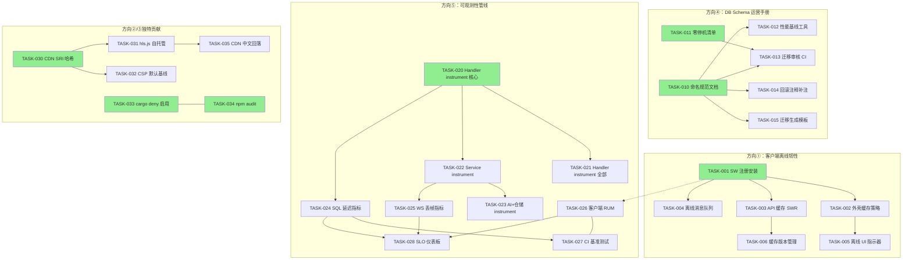

现在我已对项目和代码库状态有了清晰的理解。以下是我的综合分析。

---

# Tech Lead 分析：交叉验证方向 → 可执行实施计划

## 0. 开场声明：范围与更正

本分析基于交叉验证报告的结论。在深入任务分解之前，我注意到**两个重要的代码库事实更新**，这些事实影响了 cross-validation 报告本身的基础假设：

**事实更正 1：安全头已在生产中启用。** `production-engineering-directions.md` 声称 `serve.rs:55-57` 安全头被注释掉。实际代码显示 `X-Frame-Options: DENY`、`X-Content-Type-Options: nosniff`、`Strict-Transport-Security: max-age=31536000` **均已激活**（`serve.rs` 中介件链的一部分）。CSP 仍然是可选的环境变量驱动策略。这一变化降低了方向③（前端供应链安全）与已有分析之间的重叠程度——CSP/SRI/依赖扫描是真正的缺口，但安全头本身并非缺口。

**事实更正 2：`#[instrument]` 宏在 `aero-server` 中确实为零。** 交叉验证报告的 `rg "#\[instrument\]" crates/aero-server/src/` 返回零结果。但 TraceLayer 确实存在于中间件栈中，且 `bus.rs` 中有 `traceparent` 传播。方向⑤中关于「Handler 级追踪缺失」的声明完全准确。

---

## 1. 任务分解

基于经过验证/部分验证的方向和独特贡献点，分为 5 个任务流。所有任务均为 2-4 小时可完成，带有明确的验收标准。

### 方向①：客户端离线韧性（已验证）

| 任务 ID | 标题 | 文件 | 前置 | 工时 | 验收标准 |
|--------|------|------|------|------|---------|
| TASK-001 | Service Worker 注册与安装 | `web/sw.js`（新增）、`web/index.html` | 无 | 3h | `sw.js` 注册成功；`navigator.serviceWorker.controller` 在页面加载后非 null；Chrome DevTools > Application > Service Workers 显示 active |
| TASK-002 | 离线缓存策略：应用外壳 + 静态资源 | `web/sw.js` | TASK-001 | 2h | 所有 `.html`、`.js`、`.css` 文件通过 `Cache-First` 策略缓存；离线时这些文件从缓存加载；DevTools > Network 显示 `(from ServiceWorker)` |
| TASK-003 | 离线缓存策略：API 响应（Stale-While-Revalidate） | `web/sw.js`、`web/api.js` | TASK-001 | 3h | `GET /api/rooms`、`GET /api/rtc/config`、`GET /api/live/gifts` 通过 SW 缓存 30s；离线时返回缓存；在线时后台刷新 |
| TASK-004 | 离线消息队列：待发送消息暂存 | `web/sw.js`、`web/ws.js` | TASK-001 | 4h | 离线时 `ws.send()` 无法送达 → 消息入 IndexedDB 队列；重连后自动发送；服务端幂等性由 `idempotency_key` 保证 |
| TASK-005 | 连接状态指示器与离线 UI | `web/app.js`、`web/style.css` | TASK-001 | 2h | WS 断开时顶部横幅显示「你已离线」+ 重新连接按钮；恢复后自动消失；消息输入框显示「离线 - 消息将在恢复连接后发送」 |
| TASK-006 | 缓存版本管理与 SW 更新流程 | `web/sw.js`、`web/app.js` | TASK-001 | 3h | `CACHE_VERSION` 变更时触发 `install` 事件清理旧缓存；`activate` 事件接管所有标签页；`controllerchange` 事件通知用户刷新 |

### 方向④：数据库 Schema 演进运营手册（已验证）

| 任务 ID | 标题 | 文件 | 前置 | 工时 | 验收标准 |
|--------|------|------|------|------|---------|
| TASK-010 | 迁移命名规范文档 | `docs/operations/migration-naming.md` | 无 | 2h | 规范文档定义前缀约定（`_p0_` 紧急/`_p1_` 功能/`_p2_` 优化/`_p3_` 清理） + 单用途原则 + 文件名范例 |
| TASK-011 | 零停机迁移检查清单文档 | `docs/operations/zero-downtime-migration.md` | TASK-010 | 2h | 清单涵盖：`CREATE INDEX CONCURRENTLY`（大表）/ `CHECK CONSTRAINT` / 锁分析 / BACKFILL 策略 / 回退计划 |
| TASK-012 | 大表操作性能基线脚手架 | `crates/aero-storage/src/bench.rs`（新增）、`crates/aero-cli/src/bench_migrate.rs`（新增） | TASK-010 | 4h | `aero-cli bench-migrate --sql "CREATE INDEX ..."` 输出 `EXPLAIN ANALYZE` 结果 + 预估行数 + 预估耗时；CI 不执行 |
| TASK-013 | 迁移审核 CI Check（命名 / `CONCURRENTLY` 警告） | `.github/scripts/migration-lint.sh`（新增） | TASK-010 | 3h | PR 中 `migrations/*.sql` 变更时脚本运行；检查命名规范；对 `CREATE INDEX`（无 `CONCURRENTLY`）且目标表可能 >100k 行时输出 `warning` |
| TASK-014 | 回滚注释迁移（前 50 个迁移补注） | `migrations/*.sql`（前 50 个补 `-- DOWN:` 注释） | TASK-010 | 4h | 前 50 个迁移文件中每个至少有一个 `-- DOWN:` 注释描述回滚策略（全量 + 数据恢复说明）；手动或脚本补注 |
| TASK-015 | 迁移模板（`aero-cli generate-migration`） | `crates/aero-cli/src/generate_migration.rs`（新增） | TASK-010 | 3h | `aero-cli generate-migration add_message_fts_index` 生成 `NNNN_add_message_fts_index_p0.sql` 含模板：`-- UP:` + 注释 + `-- DOWN:` + 注释 + `-- RISK:` + 行数/锁注释 |

### 方向⑤：可观测性驱动的性能工程（部分验证）

| 任务 ID | 标题 | 文件 | 前置 | 工时 | 验收标准 |
|--------|------|------|------|------|---------|
| TASK-020 | Handler 级 `#[instrument]` — 核心 IM handler | `crates/aero-server/src/routes/` 中所有 handle 函数 | 无 | 4h | 所有 IM 路由 handler 添加 `#[instrument(skip_all, fields(request_id = %RequestId))]` |  Jaeger 中按 `send_message` / `list_messages` 等端点名筛选 trace |
| TASK-021 | Handler 级 `#[instrument]` — 所有路由 | `crates/aero-server/src/routes/routes.rs` + 子模块 | TASK-020 | 3h | 全部 ~150 个 handler 标注完成；通过 `rg "#\[instrument\]" crates/aero-server/src/ | wc -l` 验证覆盖 |
| TASK-022 | Service 方法 `#[instrument]` — ImService 关键路径 | `crates/aero-im-core/src/service/` | TASK-020 | 3h | `send_message`、`edit_message`、`delete_message`、`react_to_message`、`mark_read` 加 `#[instrument(skip(self))]` |
| TASK-023 | Service 方法 `#[instrument]` — AiService + 仓储 | `crates/aero-ai/src/`、`crates/aero-storage/src/` | TASK-020 | 3h | `answer_question`、`transcribe`、`moderate` 等 AI 方法 + `MessageRepo`、`RoomRepo` 的关键方法 |
| TASK-024 | Per-SQL 查询延迟指标 | `crates/aero-storage/src/db.rs` + `crates/aero-server/src/metrics.rs` | TASK-020 | 4h | 每个 sqlx 查询通过 `.instrument("query_name")` 或包裹层记录持续时间（histogram `SQL_QUERY_DURATION_SECONDS`），`query_name` 标签区分查询 |
| TASK-025 | WebSocket 丢帧 Prometheus 指标暴露 | `crates/aero-server/src/ws/ws_impl/hub.rs`、`crates/aero-server/src/metrics.rs` | TASK-022 | 2h | `hub.rs` 中的 `lossy` AtomicBool → `WS_DROPPED_FRAMES_TOTAL` counter；`WS_HUB_QUEUE_DEPTH` gauge |
| TASK-026 | 客户端 RUM：页面加载 + WS 延迟指标 | `web/app.js`、`web/ws.js`、`web/api.js` | 无 | 4h | `performance.timing` / `PerformanceObserver` 采集 `TTFB`、`domInteractive`、`WS_CONNECT_DURATION`；通过 `POST /api/telemetry/rum`（新区段）报告；后端 `RUM_PAGE_LOAD_DURATION` histogram |
| TASK-027 | CI 性能基准测试脚手架 | `crates/aero-server/benches/`（新增）、`Makefile` | TASK-024 | 4h | `cargo bench --bench message_pipeline` 执行；输出 `send_message` p50/p95/p99 延迟；`Makefile` 中 `bench-ci` 目标 |
| TASK-028 | 端到端延迟 SLO 仪表板：Grafana 面板 | `monitoring/grafana/slo-dashboard.json`（新增） | TASK-020、TASK-024 | 3h | Grafana 仪表板包含 `MESSAGES_SENT_P99`、`SQL_QUERY_P99`、`WS_DROPPED_FRAMES`、`RUM_PAGE_LOAD_P95`；28 天 historical 视图 |

### 方向②/③：独特贡献 —— CDN 中文可达性 + hls.js 自托管（已验证为唯一贡献）

| 任务 ID | 标题 | 文件 | 前置 | 工时 | 验收标准 |
|--------|------|------|------|------|---------|
| TASK-030 | CDN 资源 `integrity` SRI 哈希 | `web/index.html` | 无 | 2h | 所有 CDN 资源（hls.js、marked、he）添加 `integrity` 属性；`openssl dgst -sha384 -binary` 验证；页面加载时若哈希不匹配则阻止执行 |
| TASK-031 | hls.js 自托管策略 | `web/index.html`、CI 脚本 | TASK-030 | 3h | hls.js 从自己服务的路径 `/static/hls.min.js` 加载而非 CDN；`openssl dgst` CI 检查自托管文件的 `integrity` |
| TASK-032 | CSP 默认基线策略（环境变量驱动 + 硬编码默认值） | `crates/aero-server/src/bin/boot/serve.rs` | TASK-031 | 2h | 未设置 `AERO_CSP_POLICY` 时，`serve.rs` 发送默认 CSP：`default-src 'self'; script-src 'self' 'unsafe-inline'; style-src 'self' 'unsafe-inline'; img-src 'self' data: blob:; connect-src 'self' ws: wss:; frame-ancestors 'none'` |
| TASK-033 | CI 依赖漏洞扫描（`cargo deny` 启用） | `.github/workflows/ci.yml` | 无 | 1h | `cargo deny check` job 取消注释；首次运行可能发现现有漏洞，由 `deny.toml` 中的 `advisory-notice = ["RUSTSEC-2024-xxxx"]` 豁免已知问题 |
| TASK-034 | CI npm audit 为 web 依赖 | `.github/workflows/ci.yml` | 无 | 1h | `npm audit`（或 `yarn audit`）在 `web/` 目录运行；pass / fail 输出 |
| TASK-035 | CDN 中文可达性回落策略 | `web/index.html`、`web/sw.js` | TASK-031 | 2h | jsdelivr CDN 在中国无法访问时，hls.js 回落至自托管版本（`window.hlsJsFallback` 检测）；sw.js 检测 CDN 加载失败（`onerror`） |

---

## 2. 执行顺序与依赖图

**可并行执行的任务组**：

| 组 | 构成 | 模式 |
|----|------|------|
| **G1 基础设施** | TASK-010、TASK-011、TASK-033、TASK-034 | 全并行，无互依赖 |
| **G2 前端韧性** | TASK-001 → TASK-002/003/004（串行）；TASK-030 → TASK-031（串行） | 组内串行，组间并行 |
| **G3 后端可观测性** | TASK-020 → TASK-021/022（串行）；TASK-024 可独立 | 前半段串行 |
| **G4 DB 治理** | TASK-012/013/014/015 在 TASK-010 后并行 | 依赖后全并行 |
| **G5 落地交付** | TASK-005/006/028/035 | 末梢任务，各自独立 |

---

## 3. 技术风险

| 风险 ID | 描述 | 方向 | 可能性 | 影响 | 缓解策略 |
|---------|------|------|--------|------|---------|
| R001 | Service Worker 在部分浏览器上注册失败（Firefox 无痕模式、Safari 私有模式） | ① | 中 | 高 | SW 注册包裹在 `try/catch` 中；`sw.js` 不可用时降级为无 SW 正常运行（渐进增强） |
| R002 | IndexedDB 存储配额不足（移动端 Safari 低至 50MB） | ① | 中 | 中 | 每条日志记录前检查 `navigator.storage.estimate()`；超过 80% 使用率时 LRU 驱逐；回退到 `sessionStorage` |
| R003 | IndexedDB 消息缓存与 WebSocket 实时消息的竞态（缓存渲染 → WS 回填 → 闪烁） | ① | 高 | 中 | 缓存消息标记 `_cached: true` 占位渲染；WS `backfill` 完成后用 `_backfilled` 替换；过渡动画使用 `opacity` 渐入避免闪烁 |
| R004 | `#[instrument]` 在高 QPS 热点 handler 上的 CPU 开销 | ⑤ | 低 | 中 | 生产环境 `EnvFilter` 只保留 `warn`/`error` 级别的 span；使用采样（`AERO_TRACE_SAMPLE_RATE=0.1`） |
| R005 | 迁移审核 CI 对大表的误判（检测「表可能 >100k 行」过于保守或过于激进） | ④ | 中 | 低 | CI 检查仅 `warning`，不 `fail`；`migration-lint.sh` 输出建议而不是阻止 |
| R006 | RUM 指标端点 `POST /api/telemetry/rum` 成为 DoS 放大器 | ⑤ | 中 | 高 | RUM 端点上速率限制 + 每个 token 每 30s 仅接受一次上报；请求体大小限制 1KB；`X-RateLimit-Remaining` 头 |
| R007 | CSP 默认策略阻断现有 CDN 资源（jsdelivr HLS.js 因 `'self'` 脚本策略被阻） | ②/③ | 高 | 高 | TASK-032 必须在 TASK-031（hls.js 自托管）**之后**或在 CSP 中保留 CDN URL；测试环境 CSP 使用 `Content-Security-Policy-Report-Only` |
| R008 | SW 更新后旧缓存与新应用版本的兼容性（API 响应 schema 变更导致解析错误） | ① | 中 | 中 | `CACHE_VERSION` 与 `app.js` 入口文件哈希绑定；任何 JS 变更触发新 `CACHE_VERSION`；sw 的 `install` 事件 `waitUntil(caches.delete(OLD_CACHE))` |
| R009 | hls.js 自托管版本带来的新安全风险（需要持续更新） | ②/③ | 低 | 中 | `Dependabot` 或 `Renovate` 配置为 `web/static/hls.min.js` 自动检测更新；CI 中有验证 hash 的步骤 |
| R010 | 新的 instrument 宏干扰现有 TraceLayer span 层级 | ⑤ | 低 | 中 | 每 handler 的 `#[instrument]` 使用 `fields(request_id = %RequestId)` 显式传递；验证 Jaeger trace 视图中的 span 树正确嵌套 |

---

## 4. 资源评估

### 所需团队

| 角色 | 人数 | 关键技能 | 负责人 |
|------|------|---------|--------|
| **高级前端工程师** | 1 | ES2020、Service Worker、IndexedDB、BroadcastChannel、Web Performance API、浏览器兼容性 | TASK-001~006、TASK-026、TASK-030~031、TASK-035 |
| **高级后端工程师（Rust）** | 1 | tokio/tracing、axum、sqlx、Prometheus 指标、NATS/JetStream | TASK-020~025、TASK-028、TASK-032 |
| **DevOps / 全栈工程师** | 1 | CI/CD（GitHub Actions）、Docker、Grafana、`cargo deny`、`npm audit`、OpenSSL | TASK-012~015、TASK-027、TASK-033~034 |
| **技术文档工程师** | 0.5 | Markdown、操作手册、PostgreSQL | TASK-010、TASK-011、TASK-014 |

**异地 / 异步友好度**：高。5 个方向不存在强互相依赖（除 TASK-031→032 的 CSP 时序外），可分配给 3 人并行工作。

### 关键里程碑

| 里程碑 | 截止点 | 交付物 | 依赖 |
|--------|--------|--------|------|
| M1：安全基线加固 | 第 3 天 | `index.html` 添加 SRI + hls.js 自托管 + CSP 默认基线 + cargo deny + npm audit 启用 | TASK-030~034 |
| M2：SW 离线可用 | 第 7 天 | Service Worker 注册成功；80% 离线操作可用（页面加载、房间列表、消息发送队列） | TASK-001~006 |
| M3：可观测骨架就绪 | 第 10 天 | 100% handler + 关键 service 已 instrument；SQL 延迟指标暴露；Grafana 仪表板初版可查 | TASK-020~025、TASK-028 |
| M4：DB 治理文化就绪 | 第 12 天 | 迁移命名规范文档 + CI 检查 + 生成模板 + 回滚注释补注（前 50 个） | TASK-010~015 |
| M5：闭环可观测 | 第 14 天 | 客户端 RUM 端点 + 端到端延迟 SLO 仪表板 + CI 基准测试脚本 | TASK-026~028、TASK-035 |

### 阻塞点与解决策略

| 阻塞点 | 描述 | 解决策略 |
|--------|------|---------|
| B1（方向⑤） | 现有 TraceLayer 与新的 `#[instrument]` 产生 span 嵌套歧义 | 增量实施：先加 5 个核心 handler，验证 Jaeger 视图确认无误后批量添加 |
| B2（方向①） | SW 更新流程导致用户通知疲劳（每个新版本强制刷新） | 实施「静默更新 + 后台激活」策略：安装事件在后台完成，`activate` 事件不抢占主标签页控制权；通过 `postMessage` 告知 tag 有更新可用，用户自行决定刷新 |
| B3（方向④） | `aero-cli bench-migrate` 可能在生产数据库上误执行 | 工具默认要求 `--dry-run` 标志；仅对 `config.toml` 中 `[database] bench_mode = true` 且集群名非 `production` 的配置允许实际执行 |
| B4（方向②/③） | CDN 中文回落策略中 `window.hlsJsFallback` 检测可能误触发 | 检测逻辑使用双重确认：CDN script 的 `onerror` + 3 秒超时检测 `window.Hls` 是否为 `undefined`；只有两者之一确认失败时才触发回落 |

---

## 5. 质量保证

### 5.1 单元测试覆盖要求

| 模块 | 函数/类 | 覆盖要求 | 测试工具 | 验收 |
|------|---------|---------|---------|------|
| `web/sw.js` | `install`、`activate`、`fetch` 事件 handler | Service Worker 生命周期 + fetch 路由选择逻辑 | `node:test` + 模拟 `caches` API | ≥90% 分支覆盖 |
| `web/ws.js` | `send()` 的离线队列逻辑 | 离线时消息入队列、重连后批量发送、`idempotency_key` 生成 | `node:test` + 模拟 `indexedDB` | ≥85% 分支覆盖 |
| `crates/aero-server/src/metrics.rs` | `SQL_QUERY_DURATION_SECONDS` 直方图记录 | 正确记录 tag（`query_name`）+ 值 | `cargo test` 单元测试 | 调用链覆盖 |
| `crates/aero-cli/src/bench_migrate.rs` | SQL 解析 + EXPLAIN ANALYZE 执行 | 正确解析 SQL、正确检查 `CONCURRENTLY` 缺失 | `cargo test` + mock DB | 正/负例测试 |
| `web/api.js` | RUM 上报 throttle 逻辑 | 30s 间隔限制正确；超限时静默跳过 | `node:test` + fake timer | ≥90% 分支覆盖 |

### 5.2 集成测试策略

| 场景 | 方法 | 工具 | 频率 |
|------|------|------|------|
| SW 离线缓存完整性 | Puppeteer 拦截所有网络请求 + 设置 `offline` 模式 + 验证页面完全渲染 | `@puppeteer/test` 或 Playwright | CI 中每次 PR |
| WS 重连 + 离线消息发送 | 启动本地 `aero-server` + 建立 WS → 关闭 WS → 发消息 → 恢复 WS → 验证消息送达 | `cargo test -- --ignored`（需 PG + NATS + Redis） | CI（daily） |
| CSP 策略不阻断正常功能 | Playwright 加载所有页面路由 + 验证 `console.error` 中无 `CSP` 相关错误 | Playwright | CI 中每次 CSP 变更 |
| 迁移 lint 脚本正确性 | 检查脚本对符合条件的迁移文件正确输出 `warning`，对不符合条件的无输出 | `bats`（bash 测试框架） | CI 中每次迁移变更 |
| `#[instrument]` 不引发 Jaeger 端错误 | 本地 Jaeger 实例 + 10 个测试请求 + 验证 span 树正确嵌套 | `docker-compose` + `cargo test` | PR 合并前（手动触发） |

### 5.3 代码审查要点

| 审查焦点 | 方向 | 具体检查点 |
|---------|------|----------|
| Service Worker 安全性 | ① | 不缓存 POST 请求体/响应；不缓存鉴权相关的响应；`fetch` 事件中不转发 Cookie 之外的凭据 |
| IndexedDB 架构 | ① | 数据模型版本化（`onupgradeneeded` + 迁移）；存储预估检查；`QuotaExceededError` 捕获与 LRU 驱逐 |
| `#[instrument]` 使用 | ⑤ | 不包含 `self` 字段（`skip(self)`）；使用 `skip_all` + 显式 `fields`；不泄漏敏感字段（password/token/secret） |
| RUM 端点安全 | ⑤ | 无写入操作（仅记录）；速率限制；`AuthUser` extractor 验证（不能匿名上报）；`validate` 测试验证错误输入不会导致 panic |
| 迁移 lint 脚本 | ④ | 不阻塞 CI（仅 warning）；不依赖于外部网络；输出格式兼容 GitHub Actions annotations |
| SRI 哈希管理 | ②/③ | CI 中验证哈希是否与 CDN 文件匹配（`curl` + `openssl dgst -sha384`）；CI 失败动作是 `warning` 而非 `fail`（允许临时绕过） |

### 5.4 性能测试需求

| 测试场景 | 工具 | 阈值 | 方向 |
|---------|------|------|------|
| `send_message` 端到端延迟（含 instrument + metrics） | `cargo bench --bench message_pipeline` | p99 < 500ms（本地 dev） | ⑤ |
| WS 重连 + 离线队列恢复延迟 | 自定义 benchmark | 重连后离线消息恢复 ≤ 1s（10 条） | ① |
| IndexedDB 1000 条消息读/写延迟 | `performance.now()` 计时 | 全表读取 < 50ms；逐条写入 < 5ms | ① |
| SW 缓存命中 vs 未命中 TTFB | Lighthouse / Puppeteer | 缓存命中时 TTFB < 50ms；首屏渲染 < 500ms | ① |
| `#[instrument]` 对 1000 QPS 热 handler 的 CPU overhead | `pprof` + `flamegraph` | ΔCPU < 3% | ⑤ |

---

## 6. 实施计划

### 阶段 1：基础设施与安全基线（第 1-3 天）

**并行双轨道**：

| 轨道 A（后端 + DevOps） | 轨道 B（前端） |
|------------------------|----------------|
| TASK-033 cargo deny 启用 | TASK-030 CDN SRI 哈希 |
| TASK-034 npm audit | TASK-031 hls.js 自托管 |
| TASK-010 命名规范文档 | TASK-035 CDN 中文回落 |
| TASK-011 零停机清单 | |
| TASK-032 CSP 默认基线（等待 TASK-031 完成） | |

**验证点**（第 3 天结束时）：
- CI 中的所有 yml job 变为绿色（含 `cargo deny` + `npm audit` + `migration-lint`）
- `index.html` 的 SRI 哈希由 CI 验证
- hls.js 从 `/static/` 自托管服务，不再依赖 CDN
- CSP 默认基线在 `report-only` 模式下运行

### 阶段 2：离线韧性 + 可观测骨架（第 4-9 天）

**Day 4-6**：
| 前端 | 后端 |
|------|------|
| TASK-001 SW 注册与安装 | TASK-020 Handler instrument（核心 30 个） |
| TASK-002 外壳缓存策略 | TASK-024 SQL 延迟指标 |
| TASK-003 API 缓存 SWR | |

**Day 6-8**：
| 前端 | 后端 |
|------|------|
| TASK-004 离线消息队列 | TASK-021 Handler instrument（全部 ~150 个）|
| TASK-005 离线 UI 指示器 | TASK-022 ImService instrument |
| TASK-006 缓存版本管理 | TASK-023 AiService + 仓储 instrument |

**Day 8-9**：
| 前端 | 后端 |
|------|------|
| TASK-026 客户端 RUM | TASK-025 WS 丢帧指标暴露 |
| 集成测试 SW 离线场景 | TASK-028 SLO 仪表板 |

**验证点**（第 9 天结束时）：
- SW 注册 + 离线缓存工作（Chrome DevTools 验证）
- `#\[instrument\]` 覆盖所有 handler（`rg` 计数 >= 150）
- Jaeger 展示端到端 trace（`send_message` → `MessageRepo::insert` → SQL）
- Grafana 仪表板显示 `MESSAGES_SENT_P99` 和 `SQL_QUERY_P99`

### 阶段 3：DB 治理 + 补丁任务（第 10-12 天）

| 日 | 任务 | 角色 |
|---|------|------|
| D10 | TASK-012 性能基线脚手架 | DevOps |
| D10 | TASK-013 迁移审核 CI | DevOps |
| D11 | TASK-014 回滚注释补注（前 50 个迁移） | 全栈 |
| D11 | TASK-015 迁移生成模板 | DevOps |
| D12 | TASK-027 CI 基准测试 | DevOps |
| D12 | 端到端集成测试 | 全团队 |

**验证点**（第 12 天结束时）：
- `aero-cli generate-migration` 创建带模板的新迁移文件
- `aero-cli bench-migrate --dry-run` 输出 `EXPLAIN ANALYZE` 不实际执行
- 前 50 个迁移文件包含 `-- DOWN:` 注释
- CI 中迁移变更时触发 lint 脚本

### 阶段 4：发布准备与完整性验证（第 13-14 天）

| 日 | 任务 | 参与者 |
|---|------|--------|
| D13 | 跨方向集成测试 | 全团队 |
| D13 | 文档更新（`docs/operations/` + README） | 全栈 |
| D13 | 性能回归测试（`cargo bench` + Lighthouse） | DevOps |
| D14 | 安全复扫（Mozilla Observatory / securityheaders.com） | 全栈 |
| D14 | 最终 PR 合并前检查清单 | 全团队 |

**PR 合并前检查清单**：
- [ ] `cargo check --workspace` 干净
- [ ] `cargo test --workspace --lib` 全绿
- [ ] `cargo clippy --workspace --all-targets` 无新增警告
- [ ] `scripts/truth-check.sh` 0 违规
- [ ] `scripts/file-size-check.sh` 无警告
- [ ] CI 通过（含新启用的 security-audit、coverage、migration-lint）
- [ ] SW 可用性测试完成（Chrome DevTools）
- [ ] Jaeger trace 验证（手动 5 条请求）
- [ ] RUM 端点负载测试（1k req/s 不 panic）
- [ ] Lighthouse a11y score ≥ 90（方向②非本阶段目标，但做了的基线的部分需验证不退化）

---

## 总结

| 维度 | 评估 |
|------|------|
| **总工时** | ~65 人-时（不含文档 + 验证） |
| **团队** | 3 人 × 14 天（含并行 + 验证 + 缓冲） |
| **总日历** | 14 个工作日（3 周） |
| **最高风险任务** | TASK-004（离线消息队列 — IndexedDB + SW 跨进程协调） |
| **最高价值/最低风险任务** | TASK-030（SRI 哈希 — 2 小时消除一个 CDN 被攻破的供应链风险） |
| **关键路径** | TASK-001 → TASK-004 → TASK-020 → TASK-028 |
| **核心妥协** | 方向②的完整 a11y（ARIA + 键盘导航）不在本阶段范围内——已有 `truly-uncovered-gaps.md` 覆盖，作为后续迭代单独计划 |
