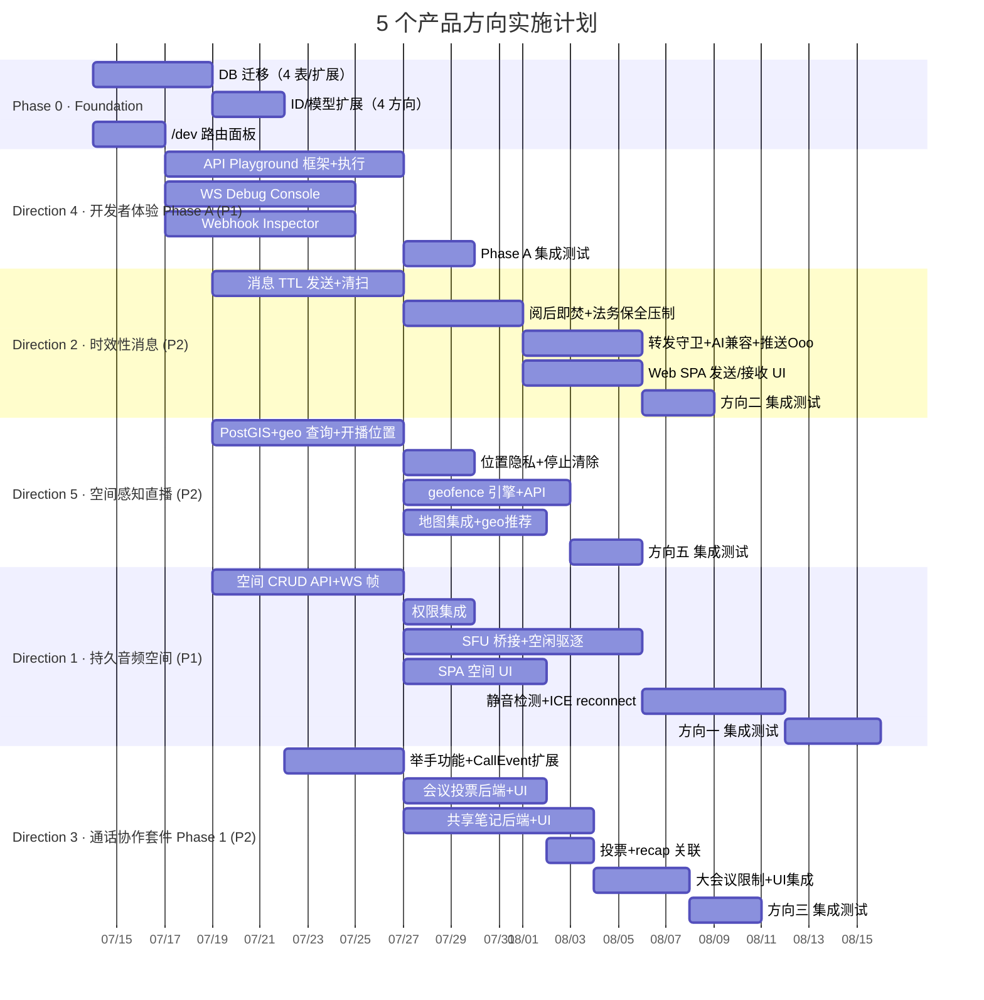

现在我已完全掌握代码库状态和两份文档。以下是我的 Tech Lead 分析。

---

# Tech Lead 分析：5 个产品级扩展方向

**分析日期**: 2026-07-12
**分析文档**: `docs/requirements/2026-07-10-five-genuinely-uncovered-product-directions.md`
**基线代码**: 当前 `master`（16 crate / 181 路由模块 / 385 行 `index.html` / 4 个主要 JS 模块）

**现有路线图交叉验证**: 本文 5 个方向与 `docs/ROADMAP.md` 的 5 个方向**零重叠**——ROADMAP 聚焦 AI 成本治理、追踪脊柱、持久投递台账、读副本/分区、企业合规纵深；本文聚焦持久音频空间、时效消息、通话协作、开发者体验平台、空间感知直播。两者互补，无冲突。

---

## 1. 任务分解

### 方向一：持久音频/视频空间（P1 · L 体量，6-8 周）

| 任务 ID | 标题 | 涉及文件 | 前置依赖 | 工时 |
|---------|------|---------|---------|------|
| VS-001 | 新增 `voice_spaces` 表 + 迁移 | `migrations/NNNN_voice_spaces.sql`, `crates/aero-storage/src/voice_space.rs` | — | 3h |
| VS-002 | `VoiceSpaceRepo` CRUD 仓储 + db_test | `crates/aero-storage/src/voice_space.rs` | VS-001 | 4h |
| VS-003 | `VoiceSpace` ID 类型 + 模型定义（`common/src/ids.rs`, `model/`） | `crates/aero-common/src/ids.rs`, `crates/aero-common/src/model/media.rs` | — | 2h |
| VS-004 | 持久空间生命周期 API：`POST /api/rooms/:id/voice-spaces` + `GET/PUT/DELETE` | `crates/aero-server/src/voice_space.rs`（新增模块） | VS-002, VS-003 | 4h |
| VS-005 | WS 帧扩展：`JoinSpace` / `LeaveSpace` / `SpaceRosterChanged` / `SpaceMute` | `crates/aero-common/src/model/event.rs`（`RoomEvent` variant） | VS-003 | 3h |
| VS-006 | SFU 会话绑定：持久 space 与 `SfuMediaSession` 的生命周期桥接 | `crates/aero-server/src/sfu_media.rs`, `crates/aero-live-webrtc/src/sfu_router.rs` | VS-004, VS-005 | 6h |
| VS-007 | 空闲驱逐定时器（最后一人离开后 N 分钟关停空间） | `crates/aero-server/src/bin/boot/background.rs` | VS-006 | 3h |
| VS-008 | Web SPA 空间 UI：空间列表、加入/离开按钮、在线成员可见 | `web/app.js`, `web/calls.js`, `web/index.html` | VS-005 | 6h |
| VS-009 | 静音检测 + 舒适噪音（SFU 侧节省带宽） | `crates/aero-live-webrtc/src/bwe.rs` | VS-006 | 5h |
| VS-010 | ICE restart / reconnect 支持（网络切换保持空间连接） | `crates/aero-server/src/sfu_media.rs` | VS-006 | 4h |
| VS-011 | 权限集成：ChannelRole → 谁可创建/加入/查看空间 | `crates/aero-im-core/src/service/rooms.rs` | VS-004 | 3h |
| VS-012 | 集成测试：E2E 空间生命周期（创建→加入→离开→空闲关停→重建） | `tests/` | VS-007, VS-011 | 5h |

**总计**: 48h (6 人周)

### 方向二：时效性消息（P2 · M 体量，3-4 周）

| 任务 ID | 标题 | 涉及文件 | 前置依赖 | 工时 |
|---------|------|---------|---------|------|
| EM-001 | `messages` 表加 `expires_at`, `burn_after_reading`, `max_views` 列 + 迁移 | `migrations/NNNN_ephemeral_messages.sql` | — | 2h |
| EM-002 | `Message` 模型扩展 + 序列化兼容 | `crates/aero-common/src/model/message.rs` | EM-001 | 2h |
| EM-003 | 消息发送时接受 TTL/阅后即焚参数（`send_message` WS 帧 + REST 端点） | `crates/aero-server/src/ws/ws_impl/message.rs`, `crates/aero-im-core/src/service/messages.rs` | EM-002 | 4h |
| EM-004 | `sweep_expired_ttl` 清扫器：expires_at < now() 软删 + 广播 `Deleted` | `crates/aero-server/src/bin/boot/background.rs`, `crates/aero-storage/src/message.rs` | EM-001 | 4h |
| EM-005 | 阅后即焚 read handler：收件人读取后触发 `soft_delete_audited` | `crates/aero-server/src/ws/ws_impl/message.rs`, `crates/aero-storage/src/message.rs` | EM-003 | 4h |
| EM-006 | 法务保全压制：`legal_holds` 覆盖 `expires_at`（sweep 过滤 `is_held` 消息） | `crates/aero-storage/src/legal_hold.rs` | EM-004 | 3h |
| EM-007 | AI 兼容性过滤：阅后即焚 + TTL 消息不入 embedding/AI 上下文 | `crates/aero-ai/src/embedding_backfill.rs`, `crates/aero-ai/src/service/mod.rs` | EM-002 | 2h |
| EM-008 | 转发/引用守卫：阅后即焚消息不可转发、不可引用回复 | `crates/aero-server/src/forward.rs`, `crates/aero-server/src/thread_subs.rs` | EM-005 | 3h |
| EM-009 | 推送通知预览跳过：`burn_after_reading` 消息不包含正文预览 | `crates/aero-server/src/push_bot.rs` | EM-005 | 2h |
| EM-010 | OOO bot TTL 继承：OOO 回复继承原消息 TTL | `crates/aero-server/src/ooo_bot.rs` | EM-003 | 2h |
| EM-011 | Web SPA 发送 UI：消息选项控件（TTL 选择器 / 阅后即焚开关） | `web/app.js`, `web/index.html` | EM-003 | 4h |
| EM-012 | Web SPA 接收 UI：TTL 倒计时显示 / 阅后即焚阅读后消失 | `web/app.js`, `web/render.js` | EM-005 | 4h |
| EM-013 | 集成测试：TTL 消息完整生命周期（发送→清扫→广播→法务保全豁免） | `tests/` | EM-006 | 4h |

**总计**: 40h (5 人周)

### 方向三：通话中协作套件（P2 · XL 体量，8-12 周）

| 任务 ID | 标题 | 涉及文件 | 前置依赖 | 工时 |
|---------|------|---------|---------|------|
| CC-001 | `CallEvent` 新 variant：`WhiteboardOp`, `CallPollOp`, `SharedNoteOp`, `HandRaised` | `crates/aero-common/src/model/media.rs` | — | 3h |
| CC-002 | 举手功能：`HandRaised` 帧发送 + 广播 + UI 举手按钮 + 主持人放行 | `crates/aero-server/src/ws/ws_impl/call.rs`, `web/calls.js` | CC-001 | 3h |
| CC-003 | 会议中投票后端：`CallPollOp` 集成 polls 现有仓储 | `crates/aero-server/src/polls.rs`, `crates/aero-storage/src/poll.rs` | CC-001 | 4h |
| CC-004 | 会议中投票 UI：通话 overlay 浮层显示投票 + 实时计票 | `web/calls.js`, `web/index.html`, `web/polls.js` | CC-003 | 4h |
| CC-005 | 投票结果与 `call_recap` 关联（会议纪要包含投票结果） | `crates/aero-server/src/call_recap.rs` | CC-003 | 2h |
| CC-006 | 共享笔记后端：通话中创建临时 canvas，op 模型复用 `canvas.rs` | `crates/aero-server/src/collab.rs`, `crates/aero-server/src/canvas.rs` | CC-001 | 6h |
| CC-007 | 共享笔记 UI：通话内实时编辑 + 通话结束转持久 canvas | `web/calls.js`, `web/index.html` | CC-006 | 5h |
| CC-008 | 白板引擎选型和集成：tldraw/Excalidraw 评估 → 引入 → 基本渲染 | `web/package.json`, `web/index.html`, `web/whiteboard.js`（新增） | — | 8h |
| CC-009 | 白板实时同步（WS + DataChannel 双通道）：op 日志模型适配图形元素 | `crates/aero-server/src/canvas.rs`, `web/whiteboard.js` | CC-008 | 8h |
| CC-010 | 屏幕标注 overlay：接收端 SVG/Canvas 层 + 标注坐标同步 | `web/media.js`, `web/calls.js` | CC-001 | 6h |
| CC-011 | 大会议限制：<=20 人开放协作工具 | `crates/aero-server/src/ws/ws_impl/call.rs` | CC-003, CC-006, CC-009 | 2h |
| CC-012 | 录制回放：白板操作 + 投票事件与 HLS 时间戳同步 | `crates/aero-live-hls/src/hls_writer.rs`, `crates/aero-storage/src/vod.rs` | CC-009, CC-004 | 6h |
| CC-013 | UI 全面集成：通话控制栏加白板/笔记/投票/举手按钮 | `web/calls.js`, `web/index.html` | CC-002, CC-004, CC-007, CC-009 | 4h |
| CC-014 | E2E 测试：通话中全协作流程（举手 → 投票 → 白板 → 笔记 → 转 recap） | `tests/` | CC-013 | 6h |

**总计**: 73h (9+ 人周)

### 方向四：开发者体验平台（P1 · M 体量 Phase A 3-4 周）

| 任务 ID | 标题 | 涉及文件 | 前置依赖 | 工时 |
|---------|------|---------|---------|------|
| DX-001 | Web SPA `/dev` 路由面板 + 导航入口 | `web/app.js`, `web/index.html`, `web/dev.js`（新增） | — | 3h |
| DX-002 | API Playground 基础框架：端点列表加载 + 参数表单渲染 + Token 自动注入 | `web/dev.js`, `web/api.js` | DX-001 | 5h |
| DX-003 | API Playground「Try it」：请求执行 + 响应展示 + `x-request-id` 关联 | `web/dev.js`, `crates/aero-server/src/routes/routes.rs` | DX-002 | 4h |
| DX-004 | API Playground 代码生成：cURL / JS fetch / Python 示例 | `web/dev.js` | DX-003 | 3h |
| DX-005 | 只读安全守卫：Playground 对当前 workspace 默认可读；mutating 操作需确认 | `web/dev.js`, `crates/aero-server/src/routes/routes.rs` | DX-003 | 2h |
| DX-006 | WS Debug Console：时序帧展示 + 事件类型/room 过滤 | `web/dev.js`, `web/ws.js` | DX-001 | 5h |
| DX-007 | WS Debug Console：手动构造并发送帧 | `web/dev.js`, `web/ws.js` | DX-006 | 3h |
| DX-008 | WS Debug Console：payload scrubbing（隐藏 `auth_token` 等敏感字段） | `web/dev.js` | DX-006 | 2h |
| DX-009 | Webhook Inspector：投递记录查询 + 请求/响应体展示 + 签名验证状态 | `web/dev.js`, `crates/aero-server/src/webhook_admin.rs` | DX-001 | 5h |
| DX-010 | Webhook Inspector：一键 Replay 按钮 + 死信删除 | `web/dev.js`, `crates/aero-server/src/webhook_admin.rs` | DX-009 | 3h |
| DX-011 | Phase B 准备：Bot Sandbox 数据结构（临时 bot 创建 / token 生成 / 事件订阅） | `crates/aero-server/src/bot.rs`, `crates/aero-storage/src/bot.rs` | — | 4h |

**总计**: 39h (5 人周 Phase A)

### 方向五：空间感知直播发现（P2 · M 体量，4-6 周）

| 任务 ID | 标题 | 涉及文件 | 前置依赖 | 工时 |
|---------|------|---------|---------|------|
| GL-001 | PostGIS 扩展安装 + 验证迁移 | `migrations/NNNN_postgis.sql` | — | 1h |
| GL-002 | `streams` 表加 `latitude`, `longitude`, `geo_accuracy`, `place_name`, `place_id` 列 + GiST 索引 | `migrations/NNNN_stream_geo.sql` | GL-001 | 2h |
| GL-003 | `Stream` 模型扩展 + 序列化兼容 | `crates/aero-common/src/live.rs` | GL-002 | 2h |
| GL-004 | `StreamRepo` geo 查询方法：`nearby_streams(lat, lng, radius_km)` | `crates/aero-storage/src/live.rs` | GL-003 | 4h |
| GL-005 | 开播 AI 时携带位置参数 API 扩展 | `crates/aero-server/src/stream_meta.rs` | GL-004 | 3h |
| GL-006 | 位置隐私策略：精确到街区（~500m 模糊半径）+ 仅关注/订阅用户可见 | `crates/aero-server/src/stream_discovery.rs` | GL-004 | 4h |
| GL-007 | 位置数据在结束直播后清除 | `crates/aero-storage/src/live.rs`, `crates/aero-server/src/stream_meta.rs` | GL-006 | 2h |
| GL-008 | geofence 事件引擎：扫描活跃流坐标 + 匹配 geofence 区域 + 触发推送 | `crates/aero-server/src/bin/boot/background.rs`（新增定时器） | GL-004 | 6h |
| GL-009 | geofence 管理 API：CRUD geofence 区域 + 与 room/stream 关联 | `crates/aero-server/src/geo_fence.rs`（新增模块） | GL-008 | 4h |
| GL-010 | 地理感知推荐：`recommendations.rs` 新增 `nearby_streams` | `crates/aero-server/src/recommendations.rs` | GL-004 | 3h |
| GL-011 | Web 端地图集成：Leaflet/MapLibre GL 引入 + `/explore` 地图视图 | `web/explore.js`（新增）, `web/index.html` | — | 5h |
| GL-012 | 地图上点击直播 Card → 进入直播房间 | `web/explore.js`, `web/livecards.js` | GL-011 | 3h |
| GL-013 | IP 归属地校验（可选反盗播检测） | `crates/aero-server/src/stream_meta.rs` | GL-006 | 3h |
| GL-014 | 集成测试：geo 查询精度 + geofence 触发 + 隐私过滤 | `tests/` | GL-010 | 4h |

**总计**: 46h (5.75 人周)

---

## 2. 执行顺序

```mermaid
graph TD
    subgraph "Phase 0 · Platform Foundation (Week 1-2)"
        CORE_A["VS-001 voice_spaces 表"]
        CORE_B["EM-001 messages 扩展列"]
        CORE_C["DX-001 /dev 路由面板"]
        CORE_D["GL-001 PostGIS 扩展"]
    end

    subgraph "Phase 1A · Parallel Deliverables (Week 2-5)"
        subgraph "方向四 · 开发者体验 (Phase A)"
            DX_2["DX-002 Playground 框架"]
            DX_6["DX-006 WS Debug Console"]
            DX_9["DX-009 Webhook Inspector"]
            DX_2 --> DX_3["DX-003 Try it"]
            DX_2 --> DX_4["DX-004 代码生成"]
            DX_2 --> DX_5["DX-005 只读守卫"]
            DX_6 --> DX_7["DX-007 手动发送"]
            DX_6 --> DX_8["DX-008 Payload scrubbing"]
            DX_9 --> DX_10["DX-010 Replay/删除"]
        end

        subgraph "方向二 · 时效性消息"
            EM_2["EM-002 模型扩展"]
            EM_3["EM-003 发送参数"]
            EM_4["EM-004 TTL 清扫器"]
            EM_5["EM-005 阅后即焚"]
            EM_6["EM-006 法务保全压制"]
            EM_7["EM-007 AI 兼容"]
            EM_8["EM-008 转发守卫"]
            EM_9["EM-009 推送预览"]
            EM_10["EM-010 OOO 继承"]
            EM_11["EM-011 SPA 发送 UI"]
            EM_12["EM-012 SPA 接收 UI"]

            EM_2 --> EM_3 --> EM_4
            EM_3 --> EM_5 --> EM_8
            EM_5 --> EM_9
            EM_5 --> EM_11
            EM_3 --> EM_10
            EM_4 --> EM_6
            EM_4 --> EM_7
            EM_3 --> EM_12
        end

        subgraph "方向五 · 空间感知直播"
            GL_2["GL-002 streams geo 列"]
            GL_3["GL-003 模型扩展"]
            GL_4["GL-004 nearby_streams"]
            GL_5["GL-005 开播携带位置"]
            GL_6["GL-006 隐私策略"]
            GL_8["GL-008 geofence 引擎"]
            GL_9["GL-009 geofence API"]
            GL_10["GL-010 geo 推荐"]
            GL_11["GL-011 地图集成"]
            GL_12["GL-012 地图→直播"]
            GL_13["GL-013 IP 校验"]

            GL_2 --> GL_3 --> GL_4
            GL_4 --> GL_5
            GL_4 --> GL_6 --> GL_13
            GL_4 --> GL_8 --> GL_9
            GL_4 --> GL_10
            GL_11 --> GL_12
        end

        subgraph "方向一 · 持久音频空间 (开始)"
            VS_2["VS-002 VoiceSpaceRepo"]
            VS_3["VS-003 ID/模型"]
            VS_4["VS-004 CRUD API"]
            VS_5["VS-005 WS 帧"]
            VS_11["VS-011 权限集成"]

            VS_1["VS-001 表"] --> VS_2
            VS_3["VS-003 ID/模型"] --> VS_4
            VS_4 --> VS_5
            VS_4 --> VS_11
        end
    end

    subgraph "Phase 1B · Heavy Lifting (Week 4-8)"
        VS_6["VS-006 SFU 桥接"]
        VS_9["VS-009 静音检测/舒适噪音"]
        VS_10["VS-010 ICE restart"]
        VS_7["VS-007 空闲驱逐"]
        VS_8["VS-008 SPA 空间 UI"]

        VS_5 --> VS_6 --> VS_9
        VS_6 --> VS_10
        VS_6 --> VS_7
        VS_5 --> VS_8

        CC_2["CC-002 举手"]
        CC_3["CC-003 投票后端"]
        CC_6["CC-006 共享笔记"]
        CC_8["CC-008 白板引擎"]

        CC_1["CC-001 模型扩展"] --> CC_2
        CC_1 --> CC_3
        CC_1 --> CC_6
        CC_8 --> CC_9["CC-009 白板同步"]

        CC_3 --> CC_4["CC-004 投票 UI"]
        CC_3 --> CC_5["CC-005 recap 关联"]
        CC_6 --> CC_7["CC-007 笔记 UI"]
    end

    subgraph "Phase 2 · Polish & Integration (Week 8-12)"
        VS_12["VS-012 E2E 空间测试"]
        EM_13["EM-013 TTL 集成测试"]
        DX_11["DX-011 Bot Sandbox 预备"]
        CC_10["CC-010 屏幕标注"]
        CC_11["CC-011 大会议限制"]
        CC_12["CC-012 录制回放同步"]
        CC_13["CC-013 UI 全面集成"]
        CC_14["CC-014 E2E 测试"]
        GL_14["GL-014 geo 测试"]
    end

    VS_6 --> VS_12
    EM_6 --> EM_13
    CC_9 --> CC_10
    CC_13 --> CC_14
    GL_10 --> GL_14
```



### 可并行任务组

| 并行组 | 包含任务 | 负责人 |
|--------|---------|-------|
| **P0-Infra** | CORE_A, CORE_B, CORE_C, CORE_D (DB 迁移) | 1 后端工程师 |
| **P1-方向四** | DX-002~010（全 Phase A 顺序依赖，单线） | 1 全栈工程师 |
| **P1-方向二** | EM-002~012（强依赖链） | 1 后端 + 1 前端 |
| **P1-音视频脚** | VS-002~005, VS-011（基础仓储/API/WS） | 1 后端工程师 |
| **P1-方向五** | GL-002~013（geo 链路） | 1 后端 + 0.5 前端 |
| **P2-方向三脚** | CC-001~002（举手最快，前置模型扩展） | 0.5 后端工程师 |
| **P2-方向三重头** | CC-003~013 | 2 工程师（1 后端 + 1 前端） |

---

## 3. 技术风险

### 方向一：持久音频空间

| 风险 | 等级 | 描述 | 缓解策略 |
|------|------|------|---------|
| **SFU O(N²) 可扩展性** | 🔴 高 | 持久空间允许 50+ 人同时在线，当前 SFU 选择性转发每参与者需 1 发 N 收，带宽随参与者线性增长 | 50 人以上需要音频混合（server-side mixing）。Phase 1 先限 20 人，Phase 2 引入 `AudioMixer` 模块。可复用 `aero-live-webrtc` 的 `BweEstimator` 评估带宽预算 |
| **ICE reconnect 复杂性** | 🟡 中 | 用户 Wi-Fi→4G 切换需 ICE restart。str0m 支持但 `sfu_media.rs` 无 reconnect 路径 | 已有 str0m 绑定，需在 `SfuMediaSession.run()` 循环中处理 `IceRestart` 事件。参见 `AGENTS.md §4.5` 媒体 seam 状态 |
| **移动端缺失** | 🟡 中 | 持久空间杀手场景是后台音频（类似 Discord 移动端），但当前零移动端代码 | Phase 1 只做桌面 Web。移动端能力作为 Phase 2 依赖 iOS/Android 原生 SDK |
| **多条 PeerConnection 管理** | 🟡 中 | 浏览器单页面同时维持多空间连接（Discord 监听模式）可行但带宽翻倍 | Phase 1 限制用户同时加入一个空间 |

### 方向二：时效性消息

| 风险 | 等级 | 描述 | 缓解策略 |
|------|------|------|---------|
| **法务保全 vs TTL 冲突** | 🔴 高 | 法务保全压制 TTL 是正确行为，但用户侧看到消息「已消失」而被保全方看到「未消失」——需要在 UI 明确标识 | 清扫器在 `legal_holds` 中 `is_held` 行跳过。Web 端对已保全但设置了 TTL 的消息显示「该消息因法务保全保留」 |
| **阅后即焚多设备竞态** | 🟡 中 | 设备 A 已读并触发删除，设备 B 未同步——消息是否应在 B 仍可见？ | 设计决定：收件人**任一台**设备已读即全设备删除。服务器在该收件人的所有 online session 广播 `Deleted` 帧 |
| **推送通知泄露** | 🟡 低 | 阅后即焚消息的 FCM/APNs 推送包含 140 字预览 | `push_bot.rs` 检测 `burn_after_reading` 跳过预览字段，只发「您有一条新消息」 |
| **AI 索引过滤** | 🟢 低 | `embedding_backfill` 需过滤 burn_after_reading + TTL 消息 | 现有 `message_repo` 查询加 `AND expires_at IS NULL AND NOT burn_after_reading` 条件 |

### 方向三：通话中协作

| 风险 | 等级 | 描述 | 缓解策略 |
|------|------|------|---------|
| **白板引擎前端投入巨大** | 🔴 高 | 引入 tldraw/Excalidraw 等第三方库需要包管理 + CRDT 适配 + Web SPA 从零依赖到有依赖 | **建议 Phase 1 只做举手 + 投票 + 共享笔记（Canvas op 模型复用），白板+标注作为 Phase 2**。共享笔记可复用 `canvas.rs` 现有 op 日志模型，0 新依赖 |
| **Canvas op 模型对图形元素的适配** | 🟡 中 | 当前 `canvas.rs` 操作是文本追加，白板需要 insert/delete/move 图形元素的 op | 现有 gap-free seq 模式可用，op payload 从 `Delta` 改为 `GraphicOp` 枚举。需设计 op 格式 |
| **屏幕标注时序同步** | 🟡 中 | 录制回放时标注需与 HLS 视频时间同步。当前 `Vod` 只记录 HLS 片段，无事件日志 | 新增时间戳标注的事件日志（`call_annotation_events` 表），与 HLS 回放时同步 |
| **性能：50人大会议白板同步延迟** | 🟡 中 | 多人同时白板编辑的 CRDT 同步延迟 | Phase 1 将协作工具限制在 <=20 人 |

### 方向四：开发者体验平台

| 风险 | 等级 | 描述 | 缓解策略 |
|------|------|------|---------|
| **API Playground 安全面** | 🔴 高 | Playground 无意中被用于执行破坏性操作。Mutating API（DELETE message, archiveRoom）在 Token 自动注入下太容易执行 | **Playground 默认只读**——对 DELETE/PUT/PATCH 端点弹出二次确认对话框并显示 `diff`。Playground 自身也受 `Authorization` 中间件约束 |
| **WS Debug Console 隐私** | 🟡 中 | WS 帧可能泄露其他用户的 `auth_token` 或敏感消息内容 | 实现 payload scrubbing：对 JSON 键 `token`/`password`/`auth` 的值替换为 `***REDACTED***` |
| **Webhook Inspector 存储膨胀** | 🟡 低 | 投递日志可能无限制增长。当前 `webhook_delivery_log` 无 retention 策略 | 默认 retention 7 天（与 `webhook_delivery_log` 现有模式对齐），可配置 |
| **Bot Sandbox（Phase B）数据模型** | 🟢 低 | 当前 `bot.rs` 没有「临时 bot」概念 | 复用 PAT token + webhook subscription 机制，在 DB 标记 `is_sandbox` |

### 方向五：空间感知直播

| 风险 | 等级 | 描述 | 缓解策略 |
|------|------|------|---------|
| **PostGIS 运维复杂** | 🟡 中 | 当前使用 pgvector（`cube` + `vector` 扩展），新增 PostGIS 扩展需要 PostgreSQL 超级用户权限。Docker Compose 需更新 | 在迁移脚本中 `CREATE EXTENSION IF NOT EXISTS postgis`。Docker Compose 的 Postgres 镜像需包含 PostGIS（`postgis/postgis` 镜像） |
| **位置隐私法规** | 🔴 高 | 在中国（《个人信息保护法》）、欧盟（GDPR）、加州（CCPA）收集/存储用户位置数据有合规风险。必须透明告知用户 | 位置采集 opt-in（浏览器 `navigator.geolocation` 请求权限）。精确度模糊至 500m。数据在直播结束后清除 |
| **儿童保护（COPPA）** | 🟡 中 | 18 岁以下用户不应暴露精确位置，不推荐附近成人直播 | 基于 `participant.profile.birth_date`（如果存在）的判断。缺省 18 岁以下用户位置不可见 |
| **室内定位不可靠** | 🟢 低 | GPS 在室内无效 | 降级到 Wi-Fi 定位精度或手动选择场所名称,不过仍可记录用户输入的 place_name |
| **geofence 扫描频率** | 🟡 低 | 每秒全量扫描活跃流做 geofence 匹配消耗 DB | geofence 区域绑定到具体工作区（单工作区 max 100），30 秒扫一次（复用 `AERO_STREAM_ROUTE_HEARTBEAT_SECS` 框架） |

---

## 4. 资源评估

### 团队组成建议

按最大并行度（同时推进 4 个方向 Phase 1）需要：

| 角色 | 人数 | 专注方向 |
|------|------|---------|
| Rust 后端工程师（Senior） | 2 | 方向一（核心 SFU 集成）+ 方向二（时效性消息核心逻辑）+ 方向四（Playground 后端适配） |
| Rust 后端工程师（Mid） | 2 | 方向五（geo 全栈）+ 方向三（通话协作模型扩展 + 共享笔记后端） |
| 前端/全栈工程师 | 2 | 方向二（Web SPA 消息 UI）+ 方向四（Playground/WS Console/Webhook Inspector UI）+ 方向五（地图集成） |
| 基础设施/DevOps | 1 | 方向五（PostGIS Docker 镜像）+ 方向一（SFU 负载测试）+ CI/迁移管理 |
| Tech Lead / QA | 1 | 代码审查 + 架构决策 + 集成测试 + 跨方向协调 |

**最小可行性团队**: 4 人（2 后端 + 1 全栈 + 1 Tech Lead），6 个月交付所有 5 个方向。

### 关键里程碑

| 里程碑 | 时间 | 交付物 |
|--------|------|--------|
| **M1** | Week 2 | DB 迁移全部就位（voice_spaces / messages 扩展列 / PostGIS / /dev 路由） |
| **M2** | Week 4 | 方向四 Phase A 完成（API Playground + WS Debug Console + Webhook Inspector 可用） |
| **M3** | Week 5 | 方向二完成（TTL 消息发送 + 清扫 + 阅后即焚 + 法务保全兼容） |
| **M4** | Week 6 | 方向五完成（geo 查询 + geofence 引擎 + 地图视图 + 隐私过滤） |
| **M5** | Week 8 | 方向一核心完成（空间创建/加入/离开 + SFU 桥接 + 空闲驱逐 + SPA UI） |
| **M6** | Week 10 | 方向三核心完成（举手 + 投票 + 共享笔记 + 回调集成） |
| **M7** | Week 12 | 全部方向集成测试通过 + 性能达标 |

### 阻塞点与解决策略

| 阻塞点 | 影响方向 | 描述 | 解决策略 |
|--------|---------|------|---------|
| **SFU O(N²) 资源消耗** | 方向一 | 50 人同时在线空间不可行 | Phase 1 限 20 人，同时启动音频混合研究（估计 2 人周 pre-research） |
| **Web SPA 包管理引入** | 方向三 | 当前零依赖 SPA，白板引擎需要 npm 包 | Phase 1 用 Canvas API 手写基础白板（无 CRDT，只做单用户绘图+广播）。Phase 2 评估 tldraw/Excalidraw 集成 |
| **PostGIS 扩展权限** | 方向五 | 生产环境可能需要 DBA 操作 | migration 脚本中 `CREATE EXTENSION IF NOT EXISTS postgis` 处理，准备回退方案（无 PostGIS 时用 `haversine` 公式兜底） |
| **移动端缺失** | 方向一 | 持久空间的关键场景在移动端 | 文档明确声明「Phase 1 仅桌面 Web」 |
| **与 ROADMAP 方向的资源竞争** | 全部 | ROADMAP P1 的持久投递台账和读副本路由也在待做 | 建议顺序：ROADMAP P1（方向三/四）→ 本文方向一/四 → 方向二 → 方向五 → 方向三 |

---

## 5. 质量保证

### 单元测试覆盖要求

| 方向 | 模块 | 最低覆盖率 | 关键测试案例 |
|------|------|-----------|-------------|
| 一 | `VoiceSpaceRepo` | 90%+ | CRUD + list_by_room + idle_expiry + roster_membership |
| 一 | SFU bridge | 80%+ | 空间创建→ SFU session bind → peer join/leave → 空闲关停 |
| 二 | TTL sweeping | 95%+ | expires_at < now 软删 + 广播 + legal_hold 豁免 + burn_after_reading 触发 |
| 二 | 转发守卫 | 90%+ | burn_after_reading 消息拒绝 forward + quote_reply |
| 三 | CallEvent 序列化 | 100% | 所有新 variant 的 serde roundtrip（tag="kind" 不冲突） |
| 三 | 共享笔记 | 85%+ | op 模型增量同步 + checkpoint + 通话结束后转持久 canvas |
| 四 | API Playground | 70%+ | 端点列表加载 + 参数填充 + Try it + 只读守卫 + 代码生成 |
| 四 | WS Debug Console | 70%+ | 帧解析 + 过滤 + scrubbing + 手动发送 |
| 五 | geo 查询 | 95%+ | nearby_streams 半径过滤 + 距离排序 + 空结果 + 边界点精度 |
| 五 | geofence 引擎 | 90%+ | 坐标匹配 + 推送触发 + 多区域重叠 + 结束直播后清除 |

### 集成测试策略

| 场景 | 类型 | 关键验证点 |
|------|------|-----------|
| **方向一 E2E** | 一次性库 smoke (make migrate-smoke) | 创建空间→加入→SFU session 建立→leave→空闲关停→重建（同一 room & space_id） |
| **方向二 E2E** | 一次性库 smoke | TTL=5m 消息发送→等待清扫→验证软删+Deleted 广播→法务保全频道 TTL 压制→阅后即焚+多设备已读触发删除 |
| **方向三 E2E** | 一次性库 smoke | 通话中创建投票→投票→结束→验证 call_recap 包含结果→共享笔记编辑→通话结束转持久 canvas |
| **方向四 E2E** | Web SPA smoke（headless browser） | Playground 加载端点→Try it read API→验证响应展示→尝试 DELETE API→验证二次确认→WS Console 手动发送帧→Webhook Inspector replay |
| **方向五 E2E** | 一次性库 smoke + headless browser | 开播带位置→nearby_streams 查询→geofence 区域匹配→推送触发→关闭直播→位置清除→地图视图渲染 |

### 代码审查要点

| 审查维度 | 方向 | 要点 |
|---------|------|------|
| **安全** | 全部 | 新路由的 `assert_room_access` + `authz_lint` 通过；Direction 四 Playground 不得泄漏权限；Direction 五位置数据 opt-in + 模糊化 |
| **幂等** | 方向一 | space join/leave 的 at-least-once 处理（idempotency key 或 UPSERT） |
| **迁移安全** | 全部 | 加迁移后 `cargo build` 再 migrate；`voice_spaces` 表使用 `CREATE TABLE IF NOT EXISTS` |
| **序列化兼容** | 方向二/三 | `RoomEvent`/`CallEvent` 新 variant 确保 `tag="kind"` 无字段名冲突（已见 `AGENTS.md §4.2` 陷阱） |
| **并发** | 方向二 | 阅后即焚多设备同时已读的原子性（`SELECT ... FOR UPDATE` 或乐观锁 `WHERE deleted_at IS NULL`） |
| **性能** | 方向一 | SFU session 创建不可在 WS handler 同步阻塞（需 `tokio::spawn`）+ 连接泄漏防护 |
| **数据一致性** | 方向二 | TTL 清扫器与法务保全的交互：清扫器 WHERE 条件 `expires_at < now() AND id NOT IN (SELECT message_id FROM legal_holds)` |

### 性能测试需求

| 方向 | 场景 | 目标 | 方法 |
|------|------|------|------|
| **方向一** | 20 人同时在线音频空间 | SFU 带宽 < 5 Mbps / 参与者；ICE reconnect < 2s | 20 实例 str0m 负载测试 + mock RTP 流 |
| **方向二** | 1000 条 TTL 消息同时过期清扫 | 清扫批次 < 100ms；`Deleted` 广播扇出 < 200ms | 批量 `expires_at = now() - 1min` 插入 + 触发 sweep |
| **方向三** | 20 人白板同步 | 操作延迟 < 200ms p95 | 模拟并发 op 推送 |
| **方向四** | Playground 并发请求 | 100 并发 Playground Try it → 后端延迟 < 200ms | k6 脚本 |
| **方向五** | geofence 100 区域 + 1000 活跃流 | 扫描 + 匹配 < 5s / 周期 | 模拟海量 geofence + streams |

---

## 6. 实施计划



### 阶段明细

#### 阶段 1：基础设施搭建（Week 1-2，~10 天）

| 活动 | 产出 | 负责人 |
|------|------|--------|
| 4 组 DB 迁移（voice_spaces / messages 扩展 / PostGIS / 相关索引） | 4 个迁移文件 + 验证 | 后端 1 人 |
| ID 类型 + 模型定义扩展（`ids.rs`, `media.rs`, `message.rs`, `live.rs`） | 编译通过 | 后端 1 人 |
| `/dev` 路由面板 + `dev.js` 基本框架 | 可访问的空面板 | 前端 1 人 |
| Docker Compose 更新（postgis/postgis 镜像） | CI 绿 | DevOps 1 人 |
| 方向四 Playground 后端适配（CORS / OpenAPI 元数据） | 端点可枚举 | 后端 1 人 |
| `cargo check --workspace` + `cargo test --workspace --lib` | 全绿 | 全体 |

#### 阶段 2：核心功能实现（Week 3-6，~24 天，4 方向并行）

**并行组 A（方向四 · 开发体验 Phase A）**：
- API Playground：端点列表 → 参数表单 → Try it → 代码生成 → 只读守卫（5 天）
- WS Debug Console：帧展示 → 过滤 → 手动发送 → scrubbing（5 天）
- Webhook Inspector：投递记录 → 请求/响应展示 → Replay → 死信删除（5 天）
- 集成：Phase A 整合测试 + 文档（3 天）

**并行组 B（方向二 · 时效性消息）**：
- 消息 TTL 发送参数 + 仓储方法（4 天）
- TTL 清扫器 + 法务保全压制（4 天）
- 阅后即焚 + 转发守卫（3 天）
- AI 兼容 + 推送预览 + OOO 继承（2 天）
- Web SPA 发送/接收 UI（4 天）
- 集成测试（2 天）

**并行组 C（方向五 · 空间感知直播）**：
- PostGIS geo 查询 + 开播位置参数（4 天）
- 位置隐私 + 直播停止清除（2 天）
- geofence 引擎 + CRUD API（5 天）
- 地图集成 + geo 推荐（4 天）
- 集成测试（2 天）

**并行组 D（方向一 · 持久音频空间 - 前置任务）**：
- VoiceSpaceRepo + CRUD API（5 天）
- WS 帧扩展（JoinSpace / LeaveSpace / SpaceRosterChanged）（2 天）
- 权限集成（1 天）
- SPA 空间 UI 基础（3 天）

#### 阶段 3：重投入与集成（Week 7-10，~20 天）

**方向一 · 持久音频空间（完成）**：
- SFU 桥接：持久空间 → SfuMediaSession 生命周期绑定（5 天）
- 空闲驱逐定时器（2 天）
- 静音检测 + 舒适噪音优化（3 天）
- ICE restart/reconnect（3 天）
- SPA 空间 UI 完成（3 天）
- E2E 测试（3 天）

**方向三 · 通话协作套件（Phase 1）**：
- CallEvent 新 variant + 举手功能（3 天）
- 会议投票后端 + UI + recap 关联（5 天）
- 共享笔记后端（canvas op 复用）+ UI（6 天）
- 大会议限制 + UI 全面集成（3 天）
- E2E 测试（3 天）

**方向四 Phase B 准备**：
- Bot Sandbox 数据模型 + 临时 bot 创建 API（4 天）

#### 阶段 4：集成测试与发布（Week 11-12，~10 天）

| 活动 | 产出 |
|------|------|
| 5 方向完整 E2E smoke 脚本 | `scripts/smoke-voice-spaces.sh` + `smoke-ttl.sh` + `smoke-dx.sh` + `smoke-geo.sh` + `smoke-call-collab.sh` |
| 性能测试（k6 + str0m 负载） | 5 方向性能基线报告 |
| `cargo clippy --workspace --all-targets` 0 新警告 | CI 通过 |
| `scripts/truth-check.sh` 0 违规 | CI 通过 |
| `scripts/file-size-check.sh` 通过 | CI 通过 |
| `docs/ROADMAP.md` + `AGENTS.md` 更新 | 文档同步 |
| 安全审查（Playground 授权 / 位置隐私 / WS scrubbing） | 审查报告 |

---

## 总结优先级建议

综合产品价值、工程体量、技术风险和现有 ROADMAP 资源竞争，我建议以下执行顺序：

```
1st · 方向四（开发者体验 Phase A）      — M 体量 · 3-4 周 · 低风险 · 释放生态价值最快
2nd · 方向二（时效性消息）             — M 体量 · 3-4 周 · 中风险 · 隐私差异化清晰
3rd · 方向五（空间感知直播）         — M 体量 · 4-6 周 · 中风险 · 需 PostGIS 运维准备
4th · 方向一（持久音频空间）          — L 体量 · 6-8 周 · 🔴 高风险 · 依赖 SFU 可扩展验证
5th · 方向三（通话协作套件 Phase 1）  — L 体量 · 4-6 周 · 高风险 · 白板前端投入巨大，建议分两期
```

**关键建议**：
1. **方向三分为两期**：Phase 1 仅举手的 + 投票 + 共享笔记（可复用 canvas op 模型，**零新增前端依赖**，~4 周）。Phase 2 白板 + 屏幕标注（8+ 周，需引入第三方库）。
2. **方向一先验证 SFU 可扩展性**：在投入空间 UI 开发前，先用负载测试验证 20 人 SFU 空间是否可行。如果不可行，方向一需要架构升级（音频混合）→ 从 L 升级到 XL。
3. **与 ROADMAP 的资源协调**：ROADMAP 的持久投递台账（P1）和读副本路由（P1）是基础设施级依赖，建议优先于方向一/三。方向二/四/五对 ROADMAP 依赖较少，可并行推进。
