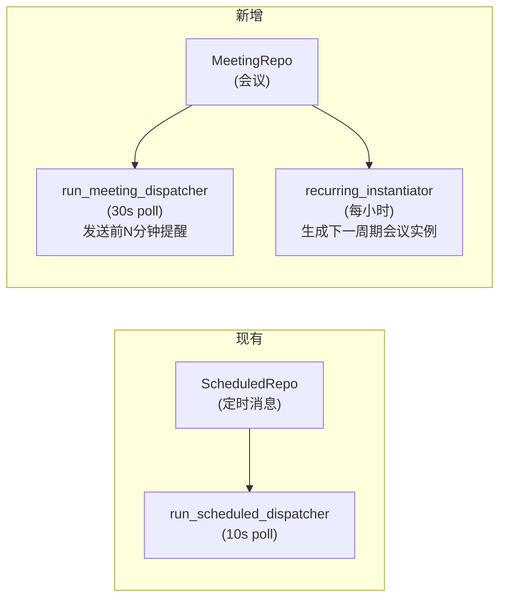
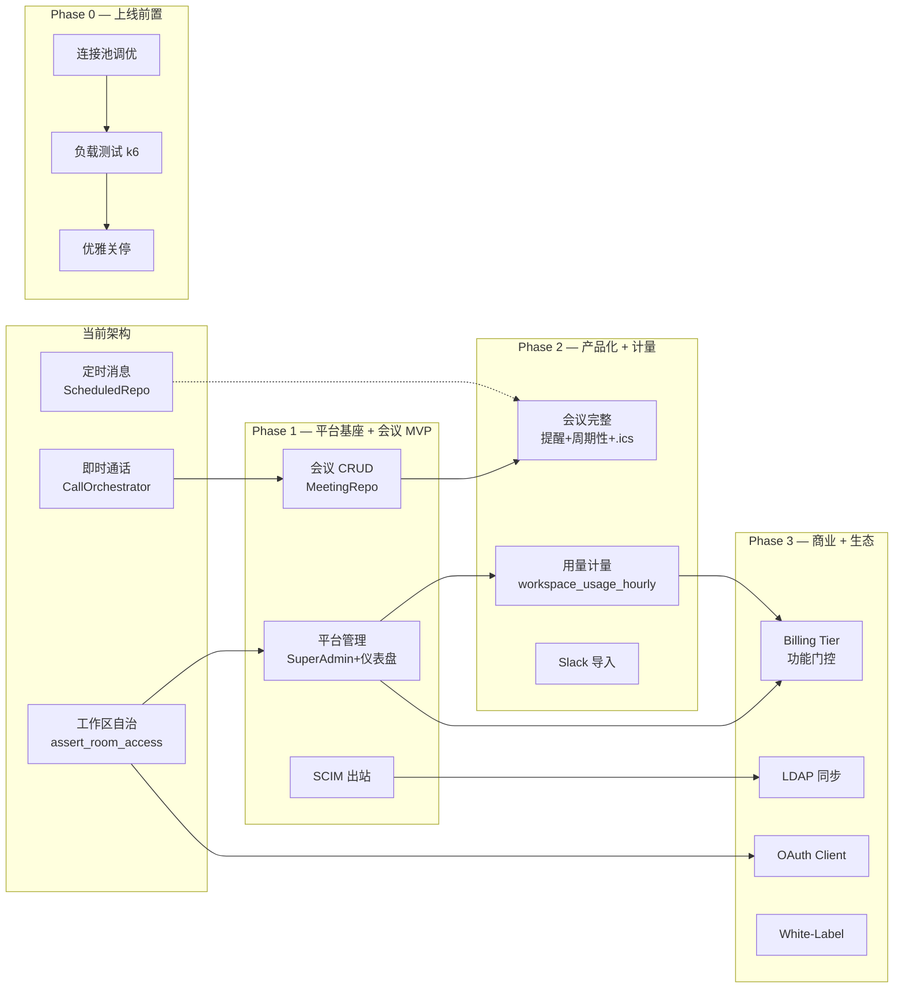

现在我有了足够的代码库理解来写全面的架构分析。开始吧。

---

# Aero IM — 架构扩展分析报告

> **分析依据**：`docs/requirements/2026-07-11-round-8-global-scan-five-strategic-expansion-directions.md`
> **代码库状态**：2026-07-12，基于源码扫描与 AGENTS.md 上下文

---

## 1. 架构评估

### 1.1 当前架构优势

现有架构在以下方面表现扎实：

| 维度 | 优势点 | 证据 |
|------|--------|------|
| **事件驱动骨架** | NATS JetStream 做跨实例事实源，Hub 进程内 bounded mpsc 扇出，无背压雪崩 | `run_bus_listener`（durable） + `run_live_bus_listener`（ephemeral）的二段式设计 |
| **crate 分层** | 严格自下而上依赖（common → bus → storage → auth → im-core → server），无环 | `AGENTS.md §1 crate 地图` |
| **集群态 vs 进程态** | Redis sorted-set 持有 presence/call roster/stream viewers；进程内只缓存 | `live_presence.rs` 的 `zadd`+`zremrangebyscore` |
| **功能门控** | `OPT-IN` env gate 模式贯穿 bot/timer/worker，默认安全 | `background.rs` 中 `AERO_UNFURL` / `AERO_AI_MODERATION` |
| **守卫模式** | `assert_room_access(participant, room)` 是统一的租户-房间守卫 | CI 层 `authz_lint.rs` 强制扫描 |
| **迁移嵌入** | `sqlx::migrate!("../../migrations")` 在编译期烤进 bin，无运行时遗漏 | `aero-storage/db.rs` |

### 1.2 关键局限性

**局限一：工作区即管理边界——不存在平台级抽象**

当前所有权限、鉴权、路由都假设「一个工作区 = 一个自治域」。`assert_room_access` 串联的是「房间 → 工作区 → 工作区成员 → 房间成员 → 停用门 + 2FA 门」，没有任何绕过这个链条的路径。这意味着：

- 没有超级管理员概念——平台运营人员无法看到任何工作区的内部状态
- 没有跨工作区的数据聚合层——`analytics.rs` 是工作区级别的
- 没有计量/计费抽象——`ai_usage.rs` 追踪 token 消耗但不关联到 billing tier

**局限二：调度基础设施窄化——有定时器但无日历/会议抽象**

`run_scheduled_dispatcher` 和 `recurring` 只能调度消息，没有通用的「未来事件」抽象。`digests.rs` 的 `run_digest_dispatcher` 是另一个定时器，但专用于 AI digest。要支持会议日程，需要将定时器泛化为 `ScheduledEvent` 抽象，而非继续堆砌专用定时器。

**局限三：数据管道只有出口，没有入口**

- 出口：`me_export.rs`（个人）、`conversation_export.rs`（单房间）、`analytics.rs`（工作区统计）
- 入口：**零**。没有数据导入管道、没有格式转换器、没有幂等重入保护

**局限四：OAuth 框架完全缺失**

当前认证只有 PAT（Personal Access Token）和 JWT。没有 `OAuth2` 授权码流程、没有 `client_registrations` 表、没有 `scopes` 模型、没有 token 吊销队列。这意味着第三方应用不可能安全地代表用户调用 Aero API。

### 1.3 架构债务与技术债

| 债务类型 | 位置 | 影响 | 建议纾解优先级 |
|----------|------|------|----------------|
| 连接池默认配置 | `AppState.pg`（sqlx `PgPool` 默认）、fred `RedisPool` 默认 | 峰值时 queue 堆积 → PG 连接雪崩 | P1（方向五的一部分） |
| 优雅关停无系统性验证 | `shutdown.rs` 只有 `CancellationToken` + drain sleep，无 WS `GOING_AWAY` / NATS `Nak` / DB drain 验证 | 重启时可能丢消息 / 打断进行中请求 | P1（方向五） |
| 无性能基准套件 | 零 `#[bench]` 或 `cargo bench` | 无法检测回归 | P2（方向五） |
| 管理员路由散落 | `webhook_admin.rs` / `workspace_security.rs` / `sessions.rs` / `admin_sessions.rs` 各为独立 `.merge` | 无统一管理入口，无跨工作区聚合 | P1（方向二） |
| 会议室模型空白 | 通话结构全（`CallOrchestrator` / `SfuMediaSession` / `call_bridge`），但 **无 `meetings` 表** | 无法支持预约/周期性会议 | P1（方向一） |

---

## 2. 架构扩展方向

### 方向一（P1）：Meeting Scheduler & Calendar Integration

#### 为什么需要

现有通话基建**已经完备**——P2P、Mesh、SFU、字幕、AI 复盘、未接通知——但全部是**即时触发**的。没有「预约 → 提醒 → 加入 → 录制归档」的产品半层。Slack 收购了（后来独立出）的 Zoom 替代品、Teams 将通话/会议/日历深度绑定、Discord 有 Stage 和 Scheduled Events。Aero IM 如果停留在即时通话，就永远是一个 feature 集合而不是一个会议产品。

**业务价值**：将即时通话能力包装为「会议产品」是直接从功能到收入的跨越——会议是可计费的独立 SKU。
**技术价值**：现有的 `CallOrchestrator` + `sfu_media.rs` + `call_bridge_supervisor.rs` 线路全部可用，只需要上层编排逻辑。

#### 核心挑战

1. **定时器泛化**：现有 `run_scheduled_dispatcher` 是消息专属，其 `ScheduledRepo` 表结构（`scheduled_at` + `blocks` + `reply_to`）不适合会议。需要一个新的 `MeetingRepo` + `run_meeting_dispatcher`，或者将 `ScheduledRepo` 泛化为 `FutureEventRepo`。
2. **状态机设计**：会议有明确的生命周期（`Waiting → Live → Ended → Archived`），比消息调度复杂。会议状态机需要处理：准入控制（waiting room）、迟到加入、recurring 实例自动创建。
3. **时区处理**：`start_at` 存 UTC + 在展示层根据参与者 `timezone` 偏好渲染本地时间。Rust 的 `time` / `chrono` crate 已有成熟工具，但跨时区会议创建时需要「创建者设北京时间 → 存储 UTC → 各参会者看到各自 TZ」的完整链路。

#### 预期架构变更

```
  crates/aero-server/src/meeting/
  ├── mod.rs           # routes() + MeetingServiceBuilder
  ├── meeting.rs       # MeetingService (create/update/cancel/get)
  ├── recurring.rs     # recurring instance generator
  ├── reminders.rs     # run_meeting_reminder_dispatcher (定时器)
  └── ical.rs          # .ics export generator

  迁移:
  migrations/NNNN_meetings.sql           # meetings 表 + meeting_participants
  migrations/NNNN_meeting_recurring.sql  # meeting_series 表 (可选)

  AppState 新增字段:
  pub meetings: MeetingRepo,
```

**对现有系统的冲击**：
- 低冲击：`CallOrchestrator` 不需要改，会议「开始」时其实就是触发一次群通话
- 中冲击：定时提醒需要一个新的 `tokio::spawn` 循环（或泛化现有调度器）
- 关键决策点：**是否重用 `run_scheduled_dispatcher`？**

| 选项 | 权衡 |
|------|------|
| **A. 新建 `run_meeting_dispatcher`** | 代码隔离清晰，但多一个轮询循环（+1 DB 连接开销） |
| **B. 泛化 `ScheduledRepo` → `FutureEventRepo`** | 减少轮询数量，但现有 `ScheduledRepo` 表结构变更影响已有定时消息 |

**建议**：选 A（独立 meeting dispatcher），因为会议状态机比消息调度复杂得多，合并会使 `ScheduledRepo` 承担两类不同语义——且轮询频率不同（消息调度 10s，会议提醒是分钟级）。

#### 与既有定时器模式的映射



---

### 方向二（P1）：Platform Administration Console

#### 为什么需要

这是**商业化盲区中最大的一个**。当前 60+ 份分析全部假设「一个工作区 = 管理的边界」，但对于 SaaS 运营来说，平台级管理是比任何功能都更优先的工程投资——没有 metering 无法计费，没有 tier 无法差异化定价，没有 super admin 无法排障。

**业务价值**：metring + tier = 产品商业化基座。无此方向则 Aero IM 永远只能是「自建工具」而非「商业产品」。
**技术价值**：迫使架构引入「平台层 vs 租户层」的明确划分——这是 SaaS 架构成熟的关键标志。

#### 核心挑战

1. **鉴权模型的突破**：现有 `assert_room_access` 守卫模式严格绑定「participant → workspace → room」的链表。超级管理员需要跳过这个链表，但**不能完全跳过审计**。需要设计一个 `SuperAdminGuard` 中间件，它：
   - 检查 `AuthUser` 是否在 `super_admin_participants` 表
   - 如果否 → 回退到 `assert_room_access` 正常路径
   - 如果是 → 放行但注入 `x-admin-audit: {super_admin_id, target_workspace, action}` 到审计日志

2. **用量计量的存储设计**：`workspace_usage_hourly` 表在 1000 个工作区、30 个维度、保留 30 天细粒度 → 约 2,160 万行/月。需要设计聚合策略：
   - 原始数据（每 API 调用/每消息）→ 不存，直接累加计数器
   - 小时级聚合 → 保留 30 天
   - 日级聚合 → 保留 18 个月

3. **Billing Tier 的功能门控**：不是简单的 bool flag，而是一个 `Tier → FeatureSet` 的映射表，需要在以下点注入门控检查：
   - 路由层：`tier.allow("search_advanced")` → 403
   - AI 预算层：`tier.ai_token_budget_per_month`
   - 存储层：`tier.storage_bytes_per_workspace`
   - 成员上限：`tier.max_members_per_workspace`

#### 预期架构变更

```
  crates/aero-server/src/admin/
  ├── mod.rs           # routes() — 所有 /api/admin/* 路由
  ├── middleware.rs    # SuperAdminGuard — 鉴权中间件
  ├── dashboard.rs    # 只读仪表盘端点
  ├── workspaces.rs   # 跨工作区管理
  ├── metering.rs     # 用量查询 + 聚合
  └── tiers.rs        # SubscriptionTier CRUD + 功能门控枚举

  crates/aero-storage/src/
  ├── super_admin.rs  # SuperAdminRepo
  ├── metering.rs     # UsageHourlyRepo
  └── tier.rs         # SubscriptionTierRepo

  迁移:
  migrations/NNNN_super_admin.sql           # super_admin_participants 表
  migrations/NNNN_workspace_usage_hourly.sql # 用量聚合表
  migrations/NNNN_subscription_tiers.sql     # tier 表 + workspace.tier_id FK
```

**关键设计决策**：Super Admin 鉴权的实现方式

| 选项 | 优点 | 缺点 |
|------|------|------|
| **A. 独立中间件 + 独立路由前缀 `/api/admin/`** | 隔离清晰，不可能意外在普通路由上放行 | 两套路由树，审计逻辑必须在中间件中插入 |
| **B. 在所有现有路由中加 `OptionalAdmin` extractor** | 不需要独立路由前缀 | 改动面大，每个 handler 都要 adapter，易遗漏 |
| **C. 数据库行级角色 (`workspace_membership.is_super_admin`)** | 复用既有成员关系表 | 混淆了「工作区成员」和「平台管理员」语义 |

**建议**：选 **A**。新路由前缀 `/api/admin/` + 专用 `SuperAdminGuard` 中间件。理由：
- 与现有 `.merge()` 模式一致
- 独立的审计注入点
- 不影响既有 100+ 路由的鉴权逻辑
- 未来可以加 `admin-impersonation` 模式（super admin 以指定工作区身份操作）

---

### 方向三（P2 → P1 候选）：Enterprise Identity Deepening

#### 为什么需要

文档指出「SCIM 出站 / LDAP / Self-Registration 是企业采购的硬门槛」——但需要修正优先级判断。

SCIM 出站的缺失是**合规风险**而非功能缺口。HR 系统删了一个员工，Aero 侧不会自动 deactivate——这在 SOC2 / ISO 27001 审计中是 finding。**建议将 SCIM 出站从 P2 提升到 P1**，其余子方向保持 P2。

#### 核心挑战

1. **SCIM 出站的幂等 + 重试**：`participant.deactivated_at` 设置 → 调用 IdP 的 SCIM 端点 → IdP 超时/5xx。不能回滚 deactivation，必须确保 SCIM 调用最终送达。需要类似 `webhook_delivery_log` 的模式：`scim_outbound_queue` 表 + `run_scim_outbound_retry_loop`。

2. **LDAP 同步的环路防护**：双向同步（Aero ↔ AD）是最棘手的设计问题。Aero 停用用户 → AD 收到更新 → 下次 LDAP 同步拉回差异 → 重新启用。

3. **JIT 组同步与 RBAC 的冲突**：OIDC 登录时自动将用户加入频道 vs 手工设置的 `channel_roles`。不能覆盖手工设置的角色。

#### 预期架构变更

```
  新增:
  crates/aero-storage/src/scim_outbound.rs  # ScimOutboundRepo (队列 + 递送日志)
  crates/aero-server/src/scim_outbound.rs   # SCIM 出站 hook (在 deactivation 路径上)
  crates/aero-server/src/ldap_sync.rs       # LDAP 同步连接器 (定时任务)
  crates/aero-server/src/registration.rs    # 自助注册 + 邮箱验证门控

  迁移:
  migrations/NNNN_scim_outbound.sql         # scim_outbound_queue 表
  migrations/NNNN_ldap_config.sql           # 工作区 LDAP 配置表
  migrations/NNNN_registration.sql          # registration_verification_tokens 表
```

---

### 方向四（P2）：Integration Ecosystem & Data Portability

#### 为什么需要

降低迁入成本 = 降低获客门槛。当前 Aero IM 有全部「迁走后怎么办」的路径（GDPR 导出），但没有「迁来时怎么办」的路径。

**强调一个被分析文档低估的点**：Slack 导入工具不仅是获客杠杆，也是**工程基础设施**。编写导入工具会迫使你构建一个 `MessageImportAdapter`——这个抽象一旦建成，就可以被其他导入源复用（Teams / Discord / Mattermost / generic JSON）。

#### 核心挑战

1. **导入的幂等性**：Slack `export.zip` 的每条消息有 `ts`（timestamp）唯一标识。需要以 `(source_platform, source_channel_id, source_message_id)` 为唯一键做 `ON CONFLICT DO NOTHING`。导入工具必须支持**断点续传**——百万级消息的导入不能一次性全量加载到内存。

2. **消息作者映射**：Slack 导出中的 `user` 字段（`U0XXX`）→ Aero 的 `ParticipantId`。通过邮箱匹配。匹配不到的：创建 `import-bot` 代理，消息显示「由 import-bot 代表 @original_name 发送」。

3. **Email ↔ Chat 网关的线程漂移**：邮件线程和聊天线程的会话模型不同（邮件是同一线程所有人可见，聊天有频道/线程层级）。设计决定：Email 入站总是在频道的「主线程」（非 reply-thread）中创建新消息，或者在邮件 `Subject: Re:` 头中嵌入 `thread_id` 元数据以恢复线程关联。

#### 预期架构变更

```
  新增:
  crates/aero-cli/src/commands/import_slack.rs  # CLI 离线工具
  crates/aero-server/src/gateways/             # 网关抽象
  ├── mod.rs
  ├── email.rs                                 # Email ↔ Chat
  └── gateway_repo.rs                          # 网关配置仓储
  crates/aero-server/src/oauth/                # OAuth 框架
  ├── mod.rs
  ├── registry.rs                              # client_registrations CRUD
  ├── authorization.rs                         # authorization_code / client_credentials 流程
  └── scopes.rs                                # Permission scope 枚举

  迁移:
  migrations/NNNN_import_ledger.sql             # 导入幂等表
  migrations/NNNN_client_registrations.sql      # OAuth client 注册表
  migrations/NNNN_gateways.sql                  # Email/IRC/Webhook 网关配置
```

---

### 方向五（P2 → P1 候选）：Production Resilience Infrastructure

#### 为什么需要

**需要提升优先级判断**。文档正确地指出「841 测试覆盖正确性，零覆盖韧性」，但这个判断的后果被低估了：**连接池默认配置 + 无优雅关停验证 + 无负载测试 = 首次上线几乎必然出事**。这三个子项应该作为 P1 前置条件（上线门的必要项），其他子项（benchmark suite / chaos engineering）保持 P2。

**建议调整**：
- 连接池调优 + 优雅关停系统性加固 → **P1，上线前置条件**
- 负载测试场景 → **P1，发布流程的组成部分**
- 性能基准套件 → P2
- 混沌工程 → P2

#### 核心挑战

1. **连接池调优的多环境适配**：max_connections 在 dev（5）vs staging（20）vs production（50-200）需要不同的值。sqlx 的 `PgPoolOptions` 不支持热更新。建议：环境变量可配置 + 启动时打印最终配置 + 运行期 metrics 导出 `aero_pg_*`。

2. **优雅关停的时序文档化**：当前 `shutdown.rs` 的流程是：
   ```
   SIGTERM/SIGINT → shutting_down=true → sleep(drain_secs) → ai_shutdown.cancel()
   ```
   缺失：
   - 停止 HTTP listener（`axum::serve` 的 `with_graceful_shutdown` 已支持）
   - 通知所有 WS 客户端 `GOING_AWAY` 帧
   - 排空进行中的请求（`CancellationToken` 传播到所有 handler）
   - 停止 NATS consumer（`subscription.drain().await`）
   - 关闭 DB 连接池

   **建议的完整 drain 时序**：

   ```
   Phase 1 (0s):  停止接受新 HTTP 连接
                  对所有现有 WS 连接发送 GOING_AWAY 帧
                  设置 /health/ready → 503
   Phase 2 (drain):等待进行中的请求完成 (CancellationToken propagate)
                  停止 NATS subscription (drain + Nak 未完成的 message)
                  排空 Hub 的 fan_out channel
   Phase 3 (+1s): 关闭 DB 连接池 (PgPool::close())
                  关闭 Redis 连接
                  关闭 AI 服务 (ai_shutdown.cancel())
   ```

3. **负载测试场景的真实性**：k6 脚本需要模拟真实的用户行为——不仅仅是批量 HTTP 请求，还包括 WebSocket 连接生命周期（connect → auth → join room → subscribe → receive → disconnect）。

#### 预期架构变更

```
  新增:
  scripts/load/k6_*.js              # k6 测试脚本
  benches/                          # Criterion 基准
  ├── message_serde.rs
  ├── db_queries.rs
  └── ai_embed.rs
  tests/e2e/graceful_shutdown.rs    # 优雅关停集成测试

  修改:
  crates/aero-server/src/bin/boot/shutdown.rs  # 完整 drain 时序
  crates/aero-server/src/state.rs              # 连接池配置从 env 读取 + 暴露 metrics
  crates/aero-server/src/metrics.rs            # 新增 aero_pg_* / aero_wss_* 指标
```

---

## 3. 接口设计建议

### 3.1 关键新接口

#### `MeetingService` —— 会议编排接口

```
MeetingService {
    create(creator, room_id, title, start_at, end_at, timezone, recurring?) → Meeting
    update(meeting_id, fields...) → Meeting
    cancel(meeting_id) → ()
    get(meeting_id) → Meeting
    list(workspace_id, from_date, to_date) → Vec<Meeting>
    join(meeting_id, participant_id) → Result<CallSession>
    
    // 内部使用
    trigger_reminders() → Vec<DueReminder>    // 由 run_meeting_dispatcher 调用
    instantiate_recurring() → Vec<MeetingId>   // 由 recurring_instantiator 调用
    expire_old_meetings() → usize             // 清扫
}
```

设计原则：`MeetingService` 不直接操作 `CallOrchestrator`——它只维护会议元数据，实际呼叫触发通过 `CallOrchestrator::start_call` 完成，保持两层之间的关注点分离。

#### `SuperAdminGuard` —— 鉴权中间件

```
SuperAdminGuard {
    // 中间件签名
    fn check(auth: AuthUser) -> Result<SuperAdminSession, Forbidden>
    
    // 审计包裹
    struct SuperAdminSession {
        admin_id: ParticipantId,
        target_workspace: Option<WorkspaceId>,
        target_action: AdminAction,
    }
}
```

设计原则：所有 `/api/admin/*` 路由共享此中间件。非 super admin 直接 403。在审计日志中，`audit_log.super_admin_id` 列记录谁以平台身份操作了什么，避免审计盲区。

#### `ImportPipeline` —— 数据导入管道

```rust
trait ImportPipeline {
    type Source;
    type Progress;
    
    fn validate(source: &Self::Source) -> Result<(), ImportError>;
    fn import(source: Self::Source) -> Pin<Box<dyn Future<Output=Result<ImportReport>>>>;
    fn dry_run(source: &Self::Source) -> Pin<Box<dyn Future<Output=ImportPreview>>>;
}

// 具体实现：
struct SlackImport;      // impl ImportPipeline for SlackExport
struct TeamsImport;      // impl ImportPipeline for TeamsExport
struct GenericJsonImport;
```

设计原则：`ImportPipeline` trait 将导入器与 Aero 内部模型解耦。每个导入器只需要提供 `Source` 类型（Slack `export.zip` → 临时目录路径）和实现三步接口：`validate`（源格式完整性检查）、`dry_run`（预览——多少个频道/消息/成员将被导入）、`import`（实际写入）。

#### `OAuthProvider` —— OAuth 2.0 授权框架

```rust
struct OAuthProvider {
    // 注册
    fn register_client(name, redirect_uris, scopes) -> ClientCredentials;
    fn revoke_client(client_id) -> ();
    
    // 授权流程
    fn authorize(client_id, redirect_uri, scope, state) -> AuthorizationCode;
    fn exchange(code, client_secret) -> AccessToken;
    fn refresh(refresh_token) -> Tokens;
    fn introspect(token) -> TokenInfo;
    
    // 资源鉴权
    fn verify_scopes(token, required_scopes) -> Result<ParticipantId, Forbidden>;
}
```

#### `IdentityProvider` trait —— 企业身份抽象

```rust
#[async_trait]
trait IdentityProvider: Send + Sync {
    /// 目录用户查询
    async fn lookup_user(email: &str) -> Result<Option<DirectoryUser>>;
    /// 组内成员列表
    async fn group_members(group_id: &str) -> Result<Vec<DirectoryUser>>;
    /// 推送 provisioning/deprovisioning 事件
    async fn push_deprovision(participant_id: &str) -> Result<()>;
}

// 实现：
struct ScimInboundProvider;   // 包装现有 scim.rs
struct ScimOutboundProvider;  // 出站调用 IdP
struct LdapProvider;          // LDAP/AD 连接器
```

### 3.2 向后兼容性策略

| 变更类型 | 兼容策略 |
|----------|----------|
| 新增路由 | 无兼容问题——新路由不修改既有 handler |
| 新 DB 表 | 所有新表使用 `CREATE TABLE IF NOT EXISTS` + 自有前缀（`meeting_`, `admin_`, `oauth_`），不修改既有表结构 |
| 新迁移 | 照搬 §4.1 配方：幂等创建、uuid 主键、可选 FK（可 NULL 回落） |
| 子方向 OPT-IN | 方向三（LDAP）/方向四（Import/OAuth）默认全关，`AERO_*` env gate 激活 |
| Super Admin 对既有路由的影响 | **零**——全部新路由在 `/api/admin/*` 前缀下。现有 100+ 路由不受影响 |
| Meeting 对 CallOrchestrator 的影响 | **零**——Meeting 只编排「何时触发呼叫」，不修改呼叫本身。`CallOrchestrator` 无需改变 |

---

## 4. 技术选型

### 4.1 各方向所需的新依赖

| 方向 | 依赖 | 评估 | 建议 |
|------|------|------|------|
| **方向一（会议）** | `.ics` 生成 | 纯字符串模板，零外部依赖 | 自建 ~50 行 Rust 函数，复用现有 `time` crate |
| **方向一（会议）** | 周期性事件库（cron/ical） | `cron` crate（用于解析 `"0 9 * * 1-5"`）或 `rschedule` | 建议：只用 `cron` crate（最小、纯 Rust、无 unsafe），因为只解析 recurrence rule，不需全量 iCal RRULE 解析 |
| **方向二（管理）** | 无新依赖 | 全部使用已有基础设施（axum + sqlx + Redis） | - |
| **方向三（LDAP）** | LDAP 客户端 | `ldap3` crate（纯 Rust，tokio 兼容）、`ldap-utils` | 建议：`ldap3`。它是唯一维护的 Rust LDAP crate，支持 StartTLS、SASL、async。但需要评估其生产稳定性（~1.5k GitHub stars，中等活跃度） |
| **方向四（OAuth）** | OAuth 2.0 服务端框架 | Rust 生态缺少成熟的 OAuth 2.0 授权服务器 crate | **建议自建**（见下文详细分析） |
| **方向四（Slack 导入）** | Slack 导出格式解析 | JSON 反序列化（已有 `serde_json`） | 零新依赖。Slack export.zip 是标准 JSON，直接 `serde` deser |
| **方向四（Email 网关）** | IMAP/POP3 接收 | `imap` crate | 建议：延迟到需求明确后再引入。Phase C 的 Email ↔ Chat 是最大的未知，更值得先做 Slack 导入和 OAuth |
| **方向五（负载测试）** | k6 | JavaScript 脚本（无 Rust 绑定） | 建议：外部 k6 二进制 + `scripts/load/` 目录存 .js 脚本。无需引入 Rust 依赖 |
| **方向五（基准测试）** | `criterion` | Rust 基准框架 | 建议：`dev-dependencies` 引入 `criterion`。重量级但成熟；或使用 `#[bench]`（Rust nightly） |

### 4.2 关键技术选型决策

#### 决策一：OAuth 2.0 授权服务器——自建 vs 第三方

| 选项 | 优点 | 缺点 |
|------|------|------|
| **A. 完全自建**（基于现有 `AuthService` + JWT） | 1. 代码可控性最高<br>2. 不需要引入 C 绑定或外部进程<br>3. 与现有 PAT/JWT 认证流程一致 | 1. 需要实现 `authorization_code` / `client_credentials` / `refresh_token` 完整流程<br>2. Token 吊销需要额外数据结构<br>3. 安全审计面较大 |
| **B. 使用 `oxide-auth` / `oauth2-rs`** | 1. 协议层已被正确实现<br>2. Scope 验证、code 交换、PKCE 开箱即用 | 1. 集成到 axum 需要 adapter<br>2. `oxide-auth` 对 axum 0.7 的支持不明确<br>3. 社区 crate 的长期维护风险 |
| **C. 使用外部 OAuth 网关**（Hydra / Keycloak） | 1. 协议完整性最高<br>2. 与现有 OIDC 供应商集成 | 1. 引入额外运维复杂度<br>2. 与 Aero 的用户/workspace 模型需要 mapping<br>3. 性能损耗（HTTP 调用） |

**建议**：选 **A（自建）**，理由：
- OAuth 2.0 的核心流程（`client_registrations` → `authorization_code` → `access_token` → `scope_verification`）大约 400-600 行 Rust 代码，体量可控
- 已经基于 JWT 实现了 `AuthUser` extractor，OAuth access token 可以被相同机制处理（只需验证 token 的 `client_id` + `scope` claim 即可）
- 不需要外部进程的部署开销

**风险缓解**：实现 OAuth 2.0 的核心是 Scope 设计——`messages:read`、`rooms:read`、`profile:read`、`messages:send` 等 scope 与现有 RBAC 模型的映射。建议先从 `client_credentials` 流程开始（server-to-server 集成），`authorization_code` 流程涉及用户交互（浏览器重定向 → 授权页面 → code 交换）复杂度更高，留到 Phase D。

#### 决策二：LDAP 连接器——同步 vs 事件驱动

| 选项 | 优点 | 缺点 |
|------|------|------|
| **A. 定时轮询（30-60分钟）** | 实现简单，crash-safe（重启后重拉完整差异） | 用户变更最多延迟 30 分钟 |
| **B. 事件监听（LDAP 变更日志）** | 近实时同步 | LDAP 服务器需要开启 changelog，配置复杂，crash 后需要补全缺失事件 |

**建议**：选 **A（定时轮询）**，LDAP/AD 目录不是高频变更系统——员工入职/离职/转组是小时或天级的变更频率，30 分钟轮询延迟完全可接受。且轮询模式天然支持断点续传（从上次时间戳开始）。

#### 决策三：优雅关停中 NATS consumer 的处理

`async-nats` 的 `jetstream::consumer::Consumer` 提供了 `stop()` 方法，但 `stop()` 不会等待 inflight 消息完成。需要额外逻辑：

```rust
// 伪代码——drain 阶段
nats_consumer.stop().await?;                // 停止接收新消息
// 等待所有 inflight handler 完成（通过 CancellationToken 传播）
cancellation_token.child_token().cancel();  // 通知所有 handler 放弃
// 对已拉取但未 ack 的消息做 Nak（让其他实例重投）
for msg in inflight_messages {
    msg.nak(Some(Duration::from_secs(30))).await?;
}
```

---

## 5. 实施路线图

### 5.1 优先级矩阵（修订版）

| 方向 | 优先级 | 理由 | 依赖 |
|------|--------|------|------|
| **方向二·Phase A：Super Admin + 只读仪表盘** | **P0** | 商业化基座——无此基础无法做任何平台级操作 | 无 |
| **方向一·Phase A：`meetings` 表 + 基础 CRUD** | **P1** | 调用基础设施已完备，只缺编排层 | 无 |
| **方向五·Phase C：优雅关停系统性加固** | **P1** | 上线前置条件 | 需 `CancellationToken` 传播梳理 |
| **方向五·Phase D：连接池调优 + 监控** | **P1** | 上线前置条件 | 需 metrics 导出接入 |
| **方向五·Phase B：负载测试场景** | **P1** | 发布流程的必要组成部分 | 需 staging 环境 |
| **方向三·Phase A：SCIM 出站** | **P1** | 合规需求（SOC2/ISO27001 finding） | 需要 `webhook_delivery_log` 模式复用 |
| **方向一·Phase B-D：提醒/周期性/等待室** | **P2** | 会议产品化迭代 | Phase A 完成 |
| **方向二·Phase B：用量计量管线** | **P2** | 计费和容量规划 | Super Admin 基建完成 |
| **方向二·Phase C-D：Billing Tier + White-Label** | **P2** | 产品商业化 | 用量计量基础 |
| **方向四·Phase A：Slack 导入工具** | **P2** | 获客杠杆 | 无 |
| **方向四·Phase C：Email ↔ Chat 网关** | **P2** | 触达非技术用户 | 需网关抽象设计 |
| **方向四·Phase D：OAuth Client 注册表** | **P2** | 生态平台 | 需 Scope 设计 |
| **方向三·Phase B-D：LDAP/自助注册/JIT 组同步** | **P2** | 企业获客 | SCIM 出站经验 |
| **方向五·Phase A：性能基准 suite** | **P2** | 回归检测 | `criterion` 引入 |
| **方向五·Phase E：混沌工程** | **P2** | 韧性验证 | 需要 staging 环境 |

### 5.2 阶段划分与里程碑

**Phase 0（前 2 周）——上线前置条件**
- [ ] `AppState` 连接池配置 env 化 + metrics 导出（`aero_pg_*`）
- [ ] 优雅关停完整 drain 时序（5 阶段）
- [ ] 基础负载测试 k6 脚本（WebSocket 建立 + 保持 + 消息收发）

**Phase 1（第 3-6 周）——平台管理基座 + 会议 MVP**
- [ ] `/api/admin/` 路由前缀 + `SuperAdminGuard` 中间件
- [ ] `super_admin_participants` 表 + 只读仪表盘端点
- [ ] `meetings` 表 + REST CRUD + 会议链接生成
- [ ] SCIM 出站队列 + `deactivation` 路径钩子

**Phase 2（第 7-12 周）——会议产品化 + 计量管线**
- [ ] `run_meeting_dispatcher`（提醒 + 过期清理）
- [ ] 周期性会议 + `.ics` 导出
- [ ] `workspace_usage_hourly` 聚合管线
- [ ] Slack 导入 CLI 工具（幂等 + 断点续传）

**Phase 3（第 13-20 周）——商业 + 生态**
- [ ] `subscription_tiers` + 功能门控系统
- [ ] LDAP 同步连接器
- [ ] OAuth Client 注册表（`client_credentials` 流程）
- [ ] White-Label（自定义域名/logo/主题）

**Phase 4（持续）——韧性 + 生态深化**
- [ ] `cargo bench` 基准套件 + CI 门禁
- [ ] 等待室 + 准入控制
- [ ] Email ↔ Chat 网关
- [ ] 混沌工程演练

### 5.3 风险点与缓解策略

| 风险 | 概率 | 影响 | 缓解 |
|------|------|------|------|
| **Super Admin 权限膨胀**：超级管理员误操作或账号泄露 | 中 | 灾难性 | 所有 super admin 操作双记录：`audit_log` + 独立的 `super_admin_audit` 表。可选的「二次确认」模式：对高危操作（全平台消息清空、租户删除）需要第二个 super admin 批准 |
| **OAuth 安全审计不充分**：Scope 绕过或 CSRF | 中 | 严重 | OAuth 实现前进行安全设计评审；`authorization_code` 流程强制 PKCE；scope 使用最小权限原则；引入 `oauth2-security.md` 文档 |
| **LDAP 同步引入 SoT 冲突**：Aero 和 AD 各持一份真相，出现循环同步 | 低 | 高 | 所有 Aero 侧 outbound 变更携带 `aero-origin` 标签；LDAP inbound 同步跳过该标签；文档明确「Identity Source of Truth 在 IdP 侧」 |
| **会议系统与现有 `CallOrchestrator` 的时间竞争**：会议开始前的状态检查和立即开始的呼叫有时间差 | 中 | 中 | `Meeting::start_call()` 使用 PG 行级锁（`SELECT ... FOR UPDATE`）确保同一会议不会被打两次；`started_at` 标志位在 `CallOrchestrator` 回调中设置 |
| **Slack 导入千万级消息撑爆内存** | 中 | 中 | 导入器流式处理：按频道逐个导入，每个频道内按消息时间分批（每批 1000 条）。使用 serde `StreamDeserializer` 而非 `serde_json::from_str` |
| **Billing Tier 降级 TOCTOU**：降级后用户在下一请求仍使用 Pro 功能 | 高 | 中 | 功能门控必须在**每次请求**时检查 `workspace.tier_id`，不能缓存超过 5 分钟。降级操作时立即 `participant_cache.invalidate` workspace 级缓存 |

### 5.4 架构演进路线图（图示）



---

## 总结

这 5 个方向共同构成了 Aero IM **从功能完备的工程师工具到商业级平台**的架构跨越：

1. **方向一（会议）** 是产品化跳跃——在完备的通话基建上盖一层预约编排，将「通话功能」升级为「会议产品」
2. **方向二（平台管理）** 是商业化基座——没有它，其他所有功能都无法被计量和变现
3. **方向三（企业身份）** 是获客门槛——SCIM 出站和 LDAP 是企业采购清单上的必要条件
4. **方向四（集成生态）** 是平台化杠杆——降低迁入壁垒 + 开放 OAuth 桥接是平台网络效应的起点
5. **方向五（生产韧性）** 是可靠性基石——在上市之前确保系统能承受真实负载

架构层面的关键设计原则贯穿全部方向：
- **新增 crate 或模块，不改既有模块**（向后兼容）
- **所有新功能默认关闭**（OPT-IN env gate）
- **复用既有模式**（`assert_room_access`、`.merge` 路由、迁移配方）
- **Super Admin 不走 `assert_room_access`，走独立中间件**（不污染既有守卫模式）
- **会议不修改 `CallOrchestrator`**（新增编排层，不修改呼叫核心）
