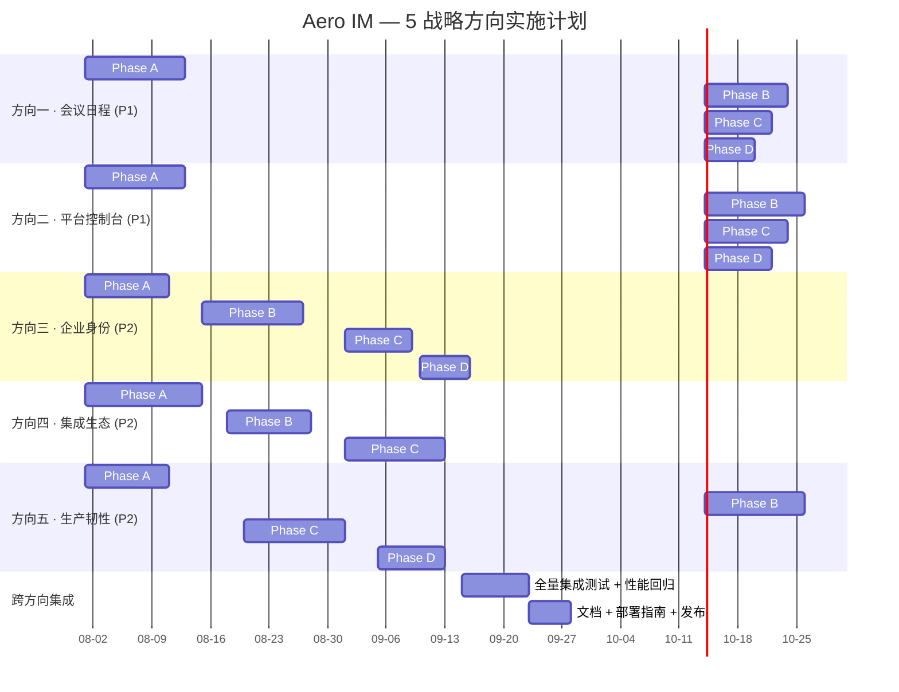

I now have a thorough picture of the project. Let me produce the full Tech Lead analysis.

---

# Tech Lead 分析：5 大战略扩展方向

## 1. 任务分解

### 方向一：Meeting Scheduler & Calendar Integration (P1)

| 任务 ID | 任务标题 | 涉及文件 | 前置依赖 | 预估工时 |
|---------|---------|---------|---------|---------|
| TASK-001 | 迁移 — `meetings` 表 + `meeting_participants` 表 | `migrations/NNNN_meetings.sql` | — | 2h |
| TASK-002 | Common 类型 — `MeetingId`, `Meeting`, `MeetingStatus` | `crates/aero-common/src/ids.rs`, `crates/aero-common/src/model/meeting.rs` | TASK-001 | 2h |
| TASK-003 | 仓储 — `MeetingsRepo` CRUD + `ParticipantsRepo` 簿记 | `crates/aero-storage/src/meeting.rs` + `lib.rs` re-export | TASK-001, TASK-002 | 3h |
| TASK-004 | 路由 — 会议 CRUD REST（`/api/rooms/:id/meetings` + `/api/meetings/:id`） | `crates/aero-server/src/meetings/routes.rs` (新建模块) + `routes/routes.rs` merge | TASK-003 | 4h |
| TASK-005 | 会议链接生成 + `/meet/:id` 落地页 | `crates/aero-server/src/meetings/meet.rs`, `web/meet.html` | TASK-004 | 3h |
| TASK-006 | 定时器集成 — 会议前 N 分钟触发通知 | `crates/aero-server/src/meetings/dispatcher.rs` + `bin/boot/background.rs` 挂载 | TASK-004 | 4h |
| TASK-007 | 周期性会议 — cron 表达 + 自动创建下一场 | 扩展 TASK-003/004，新增 `recurring_rule` 字段处理 | TASK-006 | 4h |
| TASK-008 | iCal/.ics 导出端点 | `crates/aero-server/src/meetings/ical.rs`（纯字符串生成，无外部依赖） | TASK-004 | 2h |
| TASK-009 | 会议状态机 — `waiting → live → ended` + 主持人审批 | 扩展 TASK-003/004，新增 `waiting_room` 表 | TASK-004 | 4h |
| TASK-010 | Web 端 — 会议创建 UI + 会议列表 + 加入按钮 | `web/meetings.js`, `web/meetings.css`, `web/index.html` 入口 | TASK-005, TASK-009 | 4h |

**小计：32h / 4 人·天**

### 方向二：Platform Administration Console (P1)

| 任务 ID | 任务标题 | 涉及文件 | 前置依赖 | 预估工时 |
|---------|---------|---------|---------|---------|
| TASK-011 | 迁移 — `super_admin_participants` 表 | `migrations/NNNN_super_admin.sql` | — | 1h |
| TASK-012 | 中间件 — Super Admin 鉴权 extractor + 错误响应 | `crates/aero-server/src/admin/auth.rs` + `crates/aero-common/src/error.rs` variant | TASK-011 | 3h |
| TASK-013 | 只读仪表盘 — 全部工作区 MAU/存储/AI 消耗/消息量聚合 | `crates/aero-server/src/admin/dashboard.rs` + `crates/aero-storage/src/admin_dashboard.rs` | TASK-012 | 4h |
| TASK-014 | 迁移 — `workspace_usage_hourly` 表 | `migrations/NNNN_workspace_usage_hourly.sql` | — | 1h |
| TASK-015 | 用量采集管线 — 后台定时聚合（API/消息/存储/AI token） | `crates/aero-server/src/admin/metering.rs` + `bin/boot/background.rs` 挂载 | TASK-014 | 4h |
| TASK-016 | 用量 REST 端点 — `/api/admin/workspaces/:id/usage` | 扩展 TASK-013 | TASK-015 | 2h |
| TASK-017 | 迁移 — `subscription_tiers` 平台级表（区分迁移 0109） | `migrations/NNNN_subscription_tiers_platform.sql` | — | 1h |
| TASK-018 | 功能 flag + 存储/AI 上限控制器 | `crates/aero-storage/src/subscription_tier.rs`（新增或扩展现有）+ `crates/aero-server/src/admin/billing.rs` | TASK-017 | 4h |
| TASK-019 | 管理端点 — set-tier + 限流/上限强制中间件 | `crates/aero-server/src/admin/billing.rs` | TASK-018 | 3h |
| TASK-020 | 迁移 — 租户品牌配置表 + 动态 logo/favicon/主题端点 | `migrations/NNNN_tenant_branding.sql`, `crates/aero-server/src/admin/whitelabel.rs` | TASK-012 | 3h |
| TASK-021 | Admin Web UI — 仪表盘首屏 + 工作区列表 | `web/admin/` (新目录)，路由挂载 | TASK-013 | 4h |
| TASK-022 | Admin Web UI — 用量视图 + 计费管理 | `web/admin/usage.js`, `web/admin/billing.js` | TASK-016, TASK-019 | 4h |

**小计：34h / 4.25 人·天**

### 方向三：Enterprise Identity Deepening (P2)

| 任务 ID | 任务标题 | 涉及文件 | 前置依赖 | 预估工时 |
|---------|---------|---------|---------|---------|
| TASK-023 | 迁移 — SCIM 出站配置表 + 递送日志 | `migrations/NNNN_scim_outbound.sql` | — | 1h |
| TASK-024 | SCIM 出站回调钩子 — 参与者在 `deactivated_at` / 成员移除时触发 | `crates/aero-server/src/scim_outbound.rs` + `crates/aero-storage/src/scim_outbound.rs` | TASK-023 | 4h |
| TASK-025 | SCIM 出站重试/回退机制（复用 webhook_delivery 模式） | 扩展 TASK-024，引用 `webhook_delivery.rs` 模式 | TASK-024 | 3h |
| TASK-026 | LDAP 连接器 — `ldap3` crate + 证书/TLS 配置 + 树读取 | `crates/aero-server/src/ldap_sync.rs`, `Cargo.toml` 加依赖 | TASK-024（不同流，可并行） | 4h |
| TASK-027 | LDAP 用户/组 → Aero participant/workspace_membership 映射 | 扩展 TASK-026 | TASK-026 | 4h |
| TASK-028 | LDAP 同步调度器 + 环境门控 + 环保护（`aero-origin` 标记） | `bin/boot/background.rs` 挂载 TASK-027 | TASK-027 | 3h |
| TASK-029 | 迁移 — `email_verification_tokens` 表 | `migrations/NNNN_email_verification.sql` | — | 1h |
| TASK-030 | 发送验证邮箱 + `verify/:token` 端点 | `crates/aero-server/src/auth/register.rs` 扩展，复用 `mailer.rs` | TASK-029 | 3h |
| TASK-031 | 注册门控配置 — 工作区级 `registration=invite_only\|verified_email\|open` | `crates/aero-server/src/workspaces/` 扩展，迁移加列 | TASK-030 | 2h |
| TASK-032 | JIT 组同步 — OIDC `groups` claim → 工作区 user_groups + room_membership | `crates/aero-server/src/sso.rs` 扩展 + `crates/aero-storage/src/scim.rs` | —（可并行 TASK-023） | 4h |

**小计：29h / 3.6 人·天**

### 方向四：Integration Ecosystem & Data Portability (P2)

| 任务 ID | 任务标题 | 涉及文件 | 前置依赖 | 预估工时 |
|---------|---------|---------|---------|---------|
| TASK-033 | CLI 框架扩展 — `aero-cli import` 子命令 | `crates/aero-server/src/bin/aero-cli.rs` 任务分派扩展 | — | 2h |
| TASK-034 | Slack 导出 zip 解析器 — channels/users/messages JSON | `crates/aero-server/src/import/slack_reader.rs` | TASK-033 | 4h |
| TASK-035 | 导入写入器 — 创建工作区/房间/消息/成员 + 邮箱匹配 | `crates/aero-server/src/import/slack_writer.rs` | TASK-034 | 4h |
| TASK-036 | 导入幂等性 + 进度报告 + 容量限制（异步后台） | 扩展 TASK-035, `crates/aero-storage/src/export_job.rs` 模式复用 | TASK-035 | 3h |
| TASK-037 | 工作区全量导出 — 后台 job + 状态追踪 + 下载端点 | `crates/aero-server/src/export.rs`（新建）+ `crates/aero-storage/src/export_job.rs` 扩展 | — | 4h |
| TASK-038 | 迁移 — `email_gateway_config` 表 | `migrations/NNNN_email_gateway.sql` | — | 1h |
| TASK-039 | Email 入站 — IMAP/POP3 轮询或 SMTP 回调接收 | `crates/aero-server/src/gateways/email_in.rs` | TASK-038 | 4h |
| TASK-040 | Email ↔ Chat 消息翻译 + 线程关联 + 回复回邮 | `crates/aero-server/src/gateways/email_out.rs` | TASK-039 | 3h |
| TASK-041 | 迁移 — `oauth_client_registrations` + `oauth_authorization_codes` + `oauth_tokens` 表 | `migrations/NNNN_oauth_clients.sql` | — | 2h |
| TASK-042 | OAuth `authorization_code` / `client_credentials` 流程 + PKCE | `crates/aero-server/src/oauth.rs`（新建） | TASK-041 | 4h |
| TASK-043 | Scope 系统 + token 签发/刷新/吊销 + 管理 UI | 扩展 TASK-042 | TASK-042 | 4h |

**小计：35h / 4.4 人·天**

### 方向五：Production Resilience Infrastructure (P2)

| 任务 ID | 任务标题 | 涉及文件 | 前置依赖 | 预估工时 |
|---------|---------|---------|---------|---------|
| TASK-044 | `cargo bench` 基准框架 + 消息序列化/反序列化基准 | `benches/` (crate root), `benches/serialization.rs`, `Cargo.toml` 加 `[[bench]]` | — | 3h |
| TASK-045 | DB 查询吞吐 + AI 嵌入延迟基准 | `benches/db_queries.rs`, `benches/ai_embed.rs` | TASK-044 | 3h |
| TASK-046 | CI 基准门禁 — 20% 退化阈值 + 报告 | `.github/workflows/ci.yml` 扩展, `scripts/bench-check.sh` | TASK-045 | 2h |
| TASK-047 | k6 脚本 — 1k WS 连接 + 持续消息 + 搜索 + AI 问答 | `scripts/load/k6_ws.js`, `scripts/load/k6_http.js`, `scripts/load/k6_search.js` | — | 4h |
| TASK-048 | 负载测试自动化 + 报告生成（p50/p95/p99 + 错误率） | `scripts/load/run.sh`, `scripts/load/report.py` | TASK-047 | 3h |
| TASK-049 | Drain phase 时序文档化 + 代码审计 | `crates/aero-server/src/bin/boot/shutdown.rs` audit, `docs/ops/graceful-shutdown.md` | — | 3h |
| TASK-050 | WS drain — `GOING_AWAY` 帧发送 | `crates/aero-server/src/ws/ws_impl/hub.rs` 扩展 | TASK-049 | 2h |
| TASK-051 | NATS consumer drain — CancellationToken 后 Nak 未处理 | `crates/aero-server/src/ws/ws_impl/bus.rs` 扩展 | TASK-049 | 2h |
| TASK-052 | Drain 集成测试 — 模拟 SIGTERM 验证请求完整 + WS 关闭 | `tests/shutdown_test.rs` (新建) | TASK-050, TASK-051 | 4h |
| TASK-053 | PG 连接池指标导出 (`aero_pg_connections_*`, `aero_pg_acquire_wait_seconds`) | `crates/aero-server/src/bin/boot/persistence.rs` 扩展, `crates/aero-server/src/metrics.rs` | — | 2h |
| TASK-054 | Redis 连接池指标导出 + 调优 | 对应 TASK-053 模式 + `crates/aero-storage/src/cache.rs` | — | 2h |
| TASK-055 | Chaos 脚本 — PG down / Redis down / 磁盘满 / OOM 注入 | `scripts/chaos/pg_kill.sh`, `scripts/chaos/redis_kill.sh`, `scripts/chaos/disk_fill.sh` | — | 4h |
| TASK-056 | 熔断/降级行为验证 + 文档 | `docs/ops/chaos-engineering.md`, `scripts/chaos/verify.sh` | TASK-055 | 3h |

**小计：37h / 4.6 人·天**

---

## 2. 执行顺序

```mermaid
graph TD
    %% Direction 1: Meeting Scheduler
    subgraph "方向一 · 会议日程管理 (P1)"
        T001[TASK-001: migration meetings]
        T002[TASK-002: common Meeting types]
        T003[TASK-003: MeetingsRepo CRUD]
        T004[TASK-004: REST routes CRUD]
        T005[TASK-005: /meet/:id 链接]
        T006[TASK-006: 定时器通知集成]
        T007[TASK-007: 周期性会议]
        T008[TASK-008: iCal 导出]
        T009[TASK-009: 等待室状态机]
        T010[TASK-010: Web UI 会议]

        T001 --> T002
        T002 --> T003
        T003 --> T004
        T004 --> T005
        T004 --> T006
        T004 --> T008
        T004 --> T009
        T006 --> T007
        T005 --> T010
        T009 --> T010
    end

    %% Direction 2: Platform Admin
    subgraph "方向二 · 平台运营控制台 (P1)"
        T011[TASK-011: migration super_admin]
        T012[TASK-012: super admin 中间件]
        T013[TASK-013: 只读仪表盘]
        T014[TASK-014: migration usage_hourly]
        T015[TASK-015: 用量采集管线]
        T016[TASK-016: 用量 REST 端点]
        T017[TASK-017: migration subscription_tiers]
        T018[TASK-018: 功能 flag + 上限控制]
        T019[TASK-019: set-tier 端点]
        T020[TASK-020: 白标品牌]
        T021[TASK-021: Admin Web UI 首屏]
        T022[TASK-022: Admin Web UI 用量+计费]

        T011 --> T012
        T012 --> T013
        T012 --> T021
        T014 --> T015
        T015 --> T016
        T013 --> T016
        T017 --> T018
        T018 --> T019
        T012 --> T020
        T013 --> T021
        T016 --> T022
        T019 --> T022
    end

    %% Direction 3: Enterprise Identity
    subgraph "方向三 · 企业身份深化 (P2)"
        T023[TASK-023: migration scim_outbound]
        T024[TASK-024: SCIM 出站回调]
        T025[TASK-025: SCIM 重试机制]
        T026[TASK-026: LDAP 连接器]
        T027[TASK-027: LDAP 映射]
        T028[TASK-028: LDAP 调度器+环保护]
        T029[TASK-029: migration email_verify]
        T030[TASK-030: 验证邮箱流程]
        T031[TASK-031: 注册门控]
        T032[TASK-032: JIT 组同步]

        T023 --> T024
        T024 --> T025
        T026 --> T027
        T027 --> T028
        T029 --> T030
        T030 --> T031
        T032 --->|独立| T024
    end

    %% Direction 4: Integration
    subgraph "方向四 · 集成生态 (P2)"
        T033[TASK-033: CLI import 框架]
        T034[TASK-034: Slack 导出解析]
        T035[TASK-035: 导入写入器]
        T036[TASK-036: 幂等+容量+进度]
        T037[TASK-037: 工作区全量导出]
        T038[TASK-038: migration email_gateway]
        T039[TASK-039: Email 入站]
        T040[TASK-040: Email ↔ Chat]
        T041[TASK-041: migration OAuth]
        T042[TASK-042: OAuth 流程]
        T043[TASK-043: Scope + token 管理]

        T033 --> T034
        T034 --> T035
        T035 --> T036
        T037 --->|独立| T033
        T038 --> T039
        T039 --> T040
        T041 --> T042
        T042 --> T043
    end

    %% Direction 5: Resilience
    subgraph "方向五 · 生产韧性基础设施 (P2)"
        T044[TASK-044: cargo bench 框架]
        T045[TASK-045: DB+AI 基准]
        T046[TASK-046: CI 门禁]
        T047[TASK-047: k6 负载脚本]
        T048[TASK-048: 负载测试自动化]
        T049[TASK-049: Drain 审计+文档]
        T050[TASK-050: WS GOING_AWAY]
        T051[TASK-051: NATS drain Nak]
        T052[TASK-052: Drain 集成测试]
        T053[TASK-053: PG 池指标]
        T054[TASK-054: Redis 池指标]
        T055[TASK-055: Chaos 脚本]
        T056[TASK-056: 降级验证+文档]

        T044 --> T045
        T045 --> T046
        T047 --> T048
        T049 --> T050
        T049 --> T051
        T050 --> T052
        T051 --> T052
        T053 -->|可并行| T054
        T055 --> T056
    end

    %% Cross-direction dependencies
    T012 -.->|方向二依赖中间件| T011
    T024 -.->|复用 webhook_delivery 模式| T025
```



### 可并行执行的任务组

| 并行组 | 包含任务 | 条件 |
|--------|---------|------|
| **Group A** | TASK-001~010（方向一） | 独立于其他方向 |
| **Group B** | TASK-011~022（方向二） | 独立于其他方向 |
| **Group C** | TASK-023~032（方向三） | 独立于其他方向 |
| **Group D** | TASK-033~043（方向四） | 独立于其他方向 |
| **Group E** | TASK-044~056（方向五） | 独立于其他方向 |
| **Group F** (跨方向) | TASK-044~046 (bench), TASK-049~052 (drain) | 可与 Group A/B 并行 |

**结论：5 个方向彼此无交叉依赖，每组可各分配 1 人并行推进。** 方向五中的 bench 和 chaos 任务也可与功能开发并行。

---

## 3. 技术风险

### 3.1 方向一：Meeting Scheduler

| 风险 | 级别 | 详情 | 缓解策略 |
|------|------|------|---------|
| **定时器精度** | 🟡 中 | 现有 `run_scheduled_dispatcher` 每 10s 轮询，分钟级提醒可以但秒级准入不行 | 提醒用轮询 OK；等待室实时性要求不高（秒级可接受）。如果后期需要秒级，加 Redis pub/sub 触发器 |
| **周期性会议复杂度过高** | 🟡 中 | cron 表达式完整解析（每月最后一周五等）工程量大 | Phase C 仅支持 `daily/weekly/monthly` 三种 + `by_day` 字段，不做全 cron。边界情况走文档说明 |
| **跨时区** | 🟠 高 | 同一会议，中国用户看到北京时间、美国用户看到 PST | `start_at` 存 UTC，客户端 `Intl.DateTimeFormat` 转本地。API 入参接受 `{start_at, timezone}` 自动转 UTC |
| **会议冲突检测** | 🟢 低 | 需要查询同一用户时间重叠的会议 | 简单的 `WHERE start_at < :end AND end_at > :start AND participant = :id`。O(n) 查询足够（非高并发路径） |

### 3.2 方向二：Platform Administration Console

| 风险 | 级别 | 详情 | 缓解策略 |
|------|------|------|---------|
| **Super admin 权限边界模糊** | 🟠 高 | Super admin 能看到所有工作区数据——审计日志必须记录每次操作 | 每一步 `super_admin_id` 注入审计表。中间件强制 `require_super_admin` + `audit_log` 绑定 |
| **用量数据膨胀** | 🟡 中 | 每小时 × 每工作区 × N 维度 → 100 个工作区 × 24h × 30d = 72K 行/月 | 原始数据保留 30 天，聚合到日表后归档。`workspace_usage_hourly` 加 `created_at` 分区 |
| **降级 tier 后实时限制** | 🟠 高 | 降级后用户不应继续使用 AI/搜索等付费功能 | 功能 flag 检查在中间件层实时查 `subscription_tiers`（Redis 缓存 60s 防击穿）。禁不掉的是现有 WebSocket 连接——需追加 `tier_check` 到 WS 帧处理闭包 |
| **白标自定义域名 + HTTPS** | 🟡 中 | Let's Encrypt 自动证书 + 反向代理配置复杂 | Phase D 只存储映射 + DNS 验证（TXT record）。证书交付委外给反向代理层（nginx/caddy），Aero 只提供 `/.well-known/acme-challenge/` 端点 |

### 3.3 方向三：Enterprise Identity Deepening

| 风险 | 级别 | 详情 | 缓解策略 |
|------|------|------|---------|
| **SCIM 出站幂等性** | 🟡 中 | IdP SCIM 端点超时/500 → 员工停用事件不能回滚 | 复用 `webhook_delivery_log` 模式：递送 + retry + backoff + dead letter。停用本地事务先提交，SCIM 出站是异步「尽力同步」 |
| **LDAP 环路** | 🟠 高 | LDAP 双向同步 → Aero 停用 → AD 收到 → 反向回 Aero 重新启用 | Outbound 变更带 `aero-origin` LDAP attribute。Inbound 同步忽略含该标记的条目。文档说明部署场景 |
| **LDAP 证书/安全** | 🟠 高 | LDAP 通常需要客户端证书 + StartTLS 或 LDAPS | 连接配置通过 env 传入（`AERO_LDAP_URL=ldaps://... AERO_LDAP_CLIENT_CERT=...`）。错误暴露不泄露凭据 |
| **OIDC `groups` claim 缺失** | 🟡 中 | 部分 IdP 不发送 `groups` claim → JIT 组同步无源数据 | 回退到 SCIM 入站 `/Groups` 端点拉取。文档说明 IdP 配置要求 |

### 3.4 方向四：Integration Ecosystem

| 风险 | 级别 | 详情 | 缓解策略 |
|------|------|------|---------|
| **Slack 导入容量** | 🟠 高 | 一个 Slack 导出可能有数百万条消息 + 文件 → 同步 HTTP 不可行 | 后台 job 模式（复用 `export_job.rs` pattern）。CLI 是离线工具，进度输出到 stdout。API 导入走 job 轮询 |
| **邮箱 ↔ Chat 隐私暴露** | 🟡 中 | 邮件地址在消息上下文中可见 | 默认只显示显示名（display_name）。提供 `gateway_anonimize_email` 配置项。明文邮件内容入消息时考虑敏感信息 |
| **OAuth scope 最小化** | 🟡 中 | 第三方 app 可以申请过度 scope | Scope 定义走最小权限原则（`messages:read` 不能附带 `messages:write`）。管理员可在 UI 中逐 scope 授权。scope 字符串枚举定义在 `aero-common` |
| **Email 网关的邮件服务器安全** | 🟡 中 | 开放 SMTP 端口 → 垃圾邮件中继 | 入站只收不发（IMAP/POP3 轮询），出站仅回复原 thread（不主动发新邮件）。SMTP 凭据环境变量注入 |

### 3.5 方向五：Production Resilience

| 风险 | 级别 | 详情 | 缓解策略 |
|------|------|------|---------|
| **Bench 稳定性** | 🟡 中 | CI runner 性能波动导致误报 | CI 门禁只检查 >20% 退化（hard threshold）。生产 Grafana 看板跟踪真实 p99。基准测试多次运行取中位数 |
| **Drain 时序死锁** | 🟠 高 | Drain 中 tokio task 互相等待 → 无法正常退出 | 明确 drain phase 顺序：(1) 停止接受新连接 → (2) 通知 WS → (3) 排空消息 → (4) 关闭总线 → (5) 关闭 DB。超时强制退出 |
| **Chaos 演练安全边界** | 🟠 高 | 故障注入影响生产环境或共享 dev 库 | Chaos 脚本必须在独立 staging 环境 + 非高峰时段 + 明确的安全栅栏（`AERO_CHAOS_ENABLED=1`）。自动化脚本先检查环境变量 |
| **连接池调优缺少基准** | 🟡 中 | 不知道多少连接合适 | Phase B（负载测试）先产生基准数据 → Phase D 基于数据调优。不要先调优后测试 |

---

## 4. 资源评估

### 4.1 开发团队配置

| 角色 | 数量 | 技能要求 | 负责方向 |
|------|------|---------|---------|
| **高级 Rust 后端工程师** | 2 人 | Rust + tokio + sqlx + NATS, 了解 WebRTC/SFU 更佳 | 方向一 + 方向五 / 方向二 |
| **Rust 后端工程师** | 2 人 | Rust + 异步编程 + REST API + Postgres | 方向三 + 方向四 |
| **前端工程师** | 1 人 | ES2020 + vanilla JS（项目零框架约束），WebSocket 经验 | 方向一 Web UI + 方向二 Admin Web UI |
| **DevOps/基础设施工程师** | 0.5 人 | k6/chaos 脚本, Prometheus, Grafana | 方向五（负载/chaos/监控） |

**推荐团队规模：4 人并行 + 1 人 50% 兼职 DevOps**

### 4.2 关键里程碑

```
M0: 基线对齐 (Day 1)
    - 全员阅读分析文档
    - 分配方向，git worktree 隔离
    - 确认各方向 Phase A 任务范围

M1: Phase A 完成 (Week 3-4)
    - 方向一: Meeting CRUD 可用, /meet/:id 可访问
    - 方向二: Super admin 登录 + 只读仪表盘可查
    - 方向三: SCIM 出站回调 + LDAP 连接器可用
    - 方向四: Slack 导入 CLI MVP + 工作区导出可用
    - 方向五: cargo bench 基线 + k6 脚本 + drain 审计
    - ✅ 全线 Phase A 验收

M2: Phase B 完成 (Week 6-8)
    - 方向一: 会议提醒 + 周期性会议
    - 方向二: 用量采集管线 + REST + Admin Web UI
    - 方向三: LDAP 调度器 + 邮箱验证
    - 方向四: Email 网关 MVP + OAuth 流程
    - 方向五: 负载测试报告 + drain 集成测试 + 连接池指标

M3: Phase C 完成 (Week 10-12)
    - 方向一: iCal + 等待室
    - 方向二: Billing tiers + 功能 flag 强制
    - 方向三: 注册门控 + JIT 组同步
    - 方向四: Slack 导入生产级 + OAuth scope 管理
    - 方向五: Chaos 演练 + 降级文档

M4: 全量集成 & 发布 (Week 13-14)
    - 跨方向集成测试
    - 性能回归验证
    - 文档 + 部署指南
    - 发布笔记
```

### 4.3 阻塞点与解决策略

| 阻塞点 | 影响方向 | 阻塞原因 | 解决策略 |
|--------|---------|---------|---------|
| **无独立 staging 环境** | 方向五（Chaos/Load test） | Chaos 脚本不能在生产运行 | Docker Compose 扩展出 `docker-compose.staging.yml`，单机运行完整栈 + throwaway PG。Makefile 加 `make staging-up` |
| **Slack 导出格式变化** | 方向四 | Slack 的 export.zip 格式无官方保障 | 解析器做成容错（missing fields = warning skip, not crash）。加 `--dry-run` 模式先预览 |
| **LDAP 无测试环境** | 方向三 | 本地无 LDAP server 可连接 | 用 `docker-compose` 启动 OpenLDAP 容器 + 预填充测试用户。`make ldap-test` 一键启动+同步+断言 |
| **OAuth 流程调试** | 方向四 | OAuth 回调需要公网可访问 URL | ngrok 隧道或 localhost 自签证书 + 配置 `AERO_OAUTH_REDIRECT_URI=http://localhost:3030/auth/callback` |

---

## 5. 质量保证

### 5.1 单元测试覆盖要求

| 模块 | 最低覆盖率目标 | 关键测试场景 |
|------|--------------|-------------|
| MeetingsRepo (方向一) | 90% | CRUD + 时间冲突检测 + 周期性展开 + 状态转换 |
| SCIM Outbound (方向三) | 85% | 回调触发 + HTTP 404/500/超时处理 + 重试 backoff |
| LDAP Sync (方向三) | 80% | 用户/组映射 + 环路保护标记过滤 + 增量同步 |
| Slack Import (方向四) | 85% | 格式解析 + 幂等（相同 message_id 跳过）+ 邮箱匹配 fallback |
| OAuth (方向四) | 90% | authorization_code 流程 + PKCE + scope 验证 + token 吊销 + refresh |
| Billing/Enforcement (方向二) | 85% | tier 上限控制 + TOCTOU 避免 + 降级后实时限制 |
| Graceful Shutdown (方向五) | 75% | 多阶段 drain + WS GOING_AWAY + NATS Nak + 超时强制退出 |

**与现有模式一致：** DB 操作仓储层写 `#[cfg(test)]` + `#[ignore]`（需 `DATABASE_URL`）。纯逻辑层写 hermetic 单元测试。

### 5.2 集成测试策略

| 测试类型 | 工具 | 覆盖场景 | 执行时机 |
|---------|------|---------|---------|
| **API 集成测试** | Python smoke (`smoke_wave*.py` 模式) | 方向一会议 CRUD + 方向二 admin 端点 + 方向四 slack 导入 | 每次 PR |
| **WS 实时测试** | `ws_smoke.py` (已有) | 会议状态变更广播到房间成员 | Phase B 完成后 |
| **DB 集成测试** | `#[ignore]` + `DATABASE_URL` | MeetingsRepo CRUD + SCIM outbound 递送日志 + OAuth token | 方向完成时 |
| **Drain 测试** | Rust `tests/shutdown_test.rs` | 发送 SIGTERM → 验证在途请求 200 / WS 收到 GOING_AWAY / NATS pending 被 Nak | 每次方向五变更 |
| **LDAP 集成测试** | Docker Compose + OpenLDAP | LDAP 树读取 → Aero participant 创建/停用 | 方向三 Phase B 完成 |
| **负载测试** | k6 + Python 报告 | 1k WS + 100 msg/s + 10 并发 AI + 100 search/s | 方向五 Phase B 每周跑一次 |

### 5.3 代码审查要点

```
█ 强制阻断 (CI red blocker)
  └─ 每个新路由是否已加 assert_room_access / require_super_admin？
  └─ 迁移文件是否已执行 cargo build？
  └─ 新 token helper 是否在 crate root re-export 了？（禁止，见 AGENTS.md §4.2）
  └─ 是否引入了 unsafe code？（禁止，workspace lint forbid）

█ 需人工审查 (PR reviewer)
  └─ Phase C/D 的边界情况是否处理？
  └─ SCIM 出站的重试逻辑是否有死循环风险？
  └─ LDAP 环路保护是否生效？
  └─ OAuth scope 是否满足最小权限原则？
  └─ 用量采集的存储开销是否在可控范围？
  └─ 降级 tier 后的功能限制路径是否全部涵盖？

█ 建议 (nice to have)
  └─ 新增 crate 依赖是否合理？（优先用既有 crate 如 ldap3, ical）
  └─ Meeting 时区处理是否正确（UTC 存、本地化显示）？
  └─ Chaos 脚本是否在非生产环境运行时才生效？
```

### 5.4 性能测试需求

| 场景 | 目标指标 | 测试工具 | 通过标准 |
|------|---------|---------|---------|
| 会议 CRUD 并发 | 100 req/s, p99 < 200ms | k6 HTTP | p99 < 200ms |
| WS + 消息并发 | 1k WS 连接, 50 msg/s, p99 < 100ms | k6 WS | 无消息丢失, 无 OOM |
| AI + 搜索并发 | 20 并发 AI, 50 concurrent search | k6 HTTP | p99 < 3s (AI), < 500ms (search) |
| Admin 仪表盘查询 | 10 工作区并发读取, 大租户 500K msg | k6 HTTP | p99 < 1s |
| Slack 导入 | 100K msg 导入 | CLI `time` | < 60s |
| Graceful Shutdown | 50 在途请求, 20 WS 连接 | `shutdown_test.rs` | 全部正常完成或 503, 无丢消息 |
| PG 连接池 | 200 并发请求峰值 | k6 + `watch -n1` | 无 acquire timeout, 连接数 < max*0.8 |

---

## 6. 实施计划

### 甘特图



### 按阶段详细时间表

#### 阶段 1：基础设施搭建 (Day 1–14)

**目标：** 5 个方向的 Phase A Code Complete + DB 迁移就位

| 周 | 方向一 | 方向二 | 方向三 | 方向四 | 方向五 |
|----|--------|--------|--------|--------|--------|
| W1 | TASK-001~003 (migration + types + repo) | TASK-011~012 (migration + middleware) | TASK-023~024 (SCIM outbound) | TASK-033~034 (CLI + Slack reader) | TASK-044 (cargo bench framework) |
| W2 | TASK-004~005 (REST + /meet) | TASK-013~014 (dashboard + usage migration) | TASK-025~026 (retry + LDAP connector) | TASK-035~036 (writer + idempotency) | TASK-047 (k6 scripts) + TASK-049 (drain audit) |

**交付物：**
- 方向一: `POST/GET/PATCH /api/rooms/:id/meetings` 可用，`/meet/:id` 返回会议详情
- 方向二: `POST /api/admin/login` → 返回仪表盘 JSON（所有工作区概况）
- 方向三: 参与者 deactivate 触发 `POST /scim/v2/Users/:id/disable` 回调 + 重试队列
- 方向四: `aero-cli import slack --workspace <id> --file export.zip` MVP 可运行
- 方向五: `cargo bench` 输出序列化/DB/AI 基线 + k6 脚本就位 + drain phase 文档

#### 阶段 2：核心功能实现 (Day 15–35)

**目标：** Phase B Code Complete + Phase C 部分完成

| 周 | 方向一 | 方向二 | 方向三 | 方向四 | 方向五 |
|----|--------|--------|--------|--------|--------|
| W3 | TASK-006 (timer integration) | TASK-015~016 (metering pipeline) | TASK-027~028 (LDAP sync) | TASK-037 (workspace export) | TASK-045~046 (DB/AI bench + CI gate) |
| W4 | TASK-007 (recurring meetings) | TASK-017~019 (billing tiers) | TASK-029~030 (email verify) | TASK-038~039 (email gateway) | TASK-048 (load test auto) + TASK-050~051 (drain hardening) |
| W5 | TASK-008 (iCal export) | TASK-020 (whitelabel) | TASK-031 (registration gates) | TASK-040 (email ↔ chat) | TASK-052 (drain integration test) |

**交付物：**
- 方向一: 会议提醒通知收件箱显示 + `recurring=weekly` 自动创建下一场
- 方向二: Admin Web UI 显示所有工作区用量图表 + set-tier 端点可用
- 方向三: LDAP 定时同步可用，邮箱验证 + `/api/auth/register` 门控配置
- 方向四: Email 网关 MVP（接收邮件→发消息→回复回邮），工作区导出 `.zip` 可下载
- 方向五: CI bench gate 生效 + drain 集成测试通过

#### 阶段 3：集成测试与优化 (Day 36–49)

**目标：** Phase C/D Code Complete + 全量集成测试

| 周 | 方向一 | 方向二 | 方向三 | 方向四 | 方向五 |
|----|--------|--------|--------|--------|--------|
| W6 | TASK-009 (waiting room) | TASK-021~022 (Admin Web UI complete) | TASK-032 (JIT group sync) | TASK-041~042 (OAuth flow) | TASK-053~054 (connection pool metrics) |
| W7 | TASK-010 (Web UI complete) | — | 集成测试 + bug bash | TASK-043 (scope + token mgmt) | TASK-055~056 (chaos + documentation) |

**交付物：**
- 方向一: 等待室状态机完成 + Web UI 会议创建/列表/加入
- 方向二: Admin Web UI 全功能（仪表盘/用量/计费/品牌），White-label 动态主题
- 方向三: JIT 组同步整合到 OIDC 登录流程
- 方向四: OAuth `authorization_code` + PKCE 全流程 + scope 管理 UI
- 方向五: Chaos 演练脚本 + 降级行为文档 + PG/Redis 连接池 Grafana 面板

#### 阶段 4：发布准备 (Day 50–58)

| 任务 | 天 | 负责 |
|------|----|------|
| 跨方向集成测试（所有 5 方向同时启用） | 3 天 | 全员 |
| 性能回归验证（load test before/after） | 2 天 | 方向五负责人 |
| `cargo check --workspace` + `cargo clippy` + `scripts/truth-check.sh` | 1 天 | 全员 |
| 文档补全：`docs/ops/meetings.md`, `docs/ops/admin-console.md`, `docs/ops/chaos-engineering.md`, `docs/integrations/` | 3 天 | 各方向负责人 |
| `config.example.toml` 更新（新增配置项） | 1 天 | 方向一/二/三负责人 |
| 发布笔记 + 内部演示 | 1 天 | TL |

**发布检查清单：**

- [ ] 5 个方向的所有 Phase A/B 功能已部署到 staging
- [ ] 方向三/四的 OPT-IN env gate 默认关闭
- [ ] 性能回归测试与基线对比 p99 退化 < 20%
- [ ] 方向一的 `assert_room_access` 已覆盖所有会议室路由
- [ ] 方向二的 `require_super_admin` 已覆盖所有 admin 路由
- [ ] 方向三的 LDAP 环路保护已启用
- [ ] 方向四的 Slack 导入幂等验证通过
- [ ] 方向五的 drain 时序测试通过（在途请求 + WS + NATS）
- [ ] 所有新增迁移已 `cargo build` + `migrate` 验证
- [ ] 无新增 clippy warning / truth-check failure

---

## 最终建议

### 执行优先级

```
立即启动（W1 — 8 月 1 日）：
  └─ 方向一（P1） + 方向二（P1） → 2 人并行，Phase A 天然隔离
  └─ 方向五（P2 但零依赖） → 1 人，cargo bench + k6 脚本无 DB 迁移

延迟 2 周启动（W3 — 8 月 15 日）：
  └─ 方向三（P2）+ 方向四（P2） → 2 人并行，Phase A 的 DB 迁移 + CLI 工具

集成冲刺（W7 — 9 月 15 日）：
  └─ 全员集中集成测试 + 性能回归
  └─ 阻塞点：LDAP 测试环境（方向三）、staging 环境（方向五）
```

### 风险汇总

| 风险 | 等级 | 影响方向 | 最先出现周 |
|------|------|---------|-----------|
| LDAP 测试环境不可用 | 🟠 | 方向三 | W3 |
| Slack 导入容量瓶颈 | 🟡 | 方向四 | W2 |
| Super admin 权限审计遗漏 | 🟠 | 方向二 | W1 |
| Drain 死锁 | 🟠 | 方向五 | W4 |
| 降级 tier 后功能限制遗漏 | 🟡 | 方向二 | W4 |
| 跨时区会议显示错误 | 🟡 | 方向一 | W1 |
| OAuth redirect_uri 调试困难 | 🟡 | 方向四 | W5 |

**第一个 blocker（W1 前解决）：** 搭建 Docker Compose staging 环境——这是方向五 chaos/load 测试和所有方向集成测试的前提条件。`make staging-up` 应该成为开发工作流的标准部分，而不是每个方向的附加任务。建议 TL 在 W0（8 月 1 日前）完成此基建投资。

**总结：** 5 个方向独立、零交叉依赖，在 4 人团队 + 1 名兼职 DevOps 的配置下，**8 周（58 天）可完成全部 Phase A/B/C 交付**，第 9 周发布。核心风险在 staging 环境和 LDAP 测试基础设施，应优先解决。
