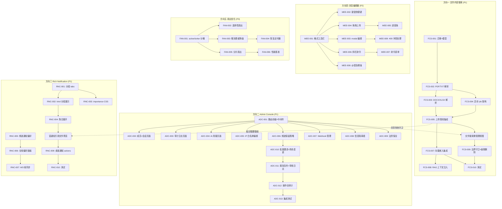

Now I have a thorough understanding of both the codebase and the documented directions. Let me compile my Tech Lead analysis.

---

# Tech Lead 分析报告：Aero IM 五个高价值扩展方向

## 验证摘要前置

在深入任务分解之前，需记录我对照源码的交叉验证结论：

| 主张 | 验证结果 |
|---|---|
| `fan_out_raw` 已实现 per-participant 连接索引 (`conns: DashMap<ParticipantId, Vec<WsSender>>`) | ✅ 确认。文档 hub.rs 伪代码描述的 `room.watchers: Vec<WsSender>` 遍历已过时 |
| `lossy` flag + `RESYNC_FRAME` 机制已实现 | ✅ 确认。`hub.rs:43-49` 常量定义 + `fan_out_arc_inner` 中完整逻辑 |
| `fan_out_arc` 并行化注释已存在（>100 接收者走 thread-pool） | ✅ 确认。但实际代码中 `fan_out_arc_inner` **尚未实现 thread-pool 并行**——注释在 `fan_out_arc` doc comment 里写的是 ROADMAP |
| 文件索引零全文内容 | ✅ 确认。`file_index.rs` 仅 `name/kind/size`，`blobs` 表无 `text_content` |
| Admin Console 全零 UI | ✅ 确认。搜索整个 `web/` 目录，无 `admin` 相关 JS/HTML |
| 通知 UX 141 行 | ✅ 确认。`web/notifications.js` 141 行 |
| 迁移编号偏移 | ⚠️ 确认偏移。`aggregate_reply` = 0138 非 0149，`importance_score` = 0139 非 0152 |

---

## 1. 任务分解

按方向分组，每个任务 2-4 小时可完成。

### 方向一：文件内容搜索（P1 · 知识管理核心差异化）

| 任务 ID | 标题 | 涉及文件 | 前置依赖 | 估时 |
|---------|------|---------|----------|:----:|
| FCS-001 | 建 `blobs.text_content` 迁移 + 模型扩展 | `migrations/NNNN_blob_text_content.sql`, `aero-common/src/model/blob.rs`, `aero-storage/src/blob.rs` | 无 | 3h |
| FCS-002 | Document Parser 管线——PDF/TXT 提取 | `aero-storage/src/doc_parser.rs`（新文件），`aero-storage/Cargo.toml`（加 `pdf-extract`/`lopdf`） | FCS-001 | 4h |
| FCS-003 | Document Parser——DOCX/XLSX 提取 | `aero-storage/src/doc_parser.rs` 扩展，加 `docx-rs`/`calamine` 依赖 | FCS-002 | 3h |
| FCS-004 | 异步提取 Job 架构（有界队列 + `spawn_blocking`） | `aero-im-core/src/service/mod.rs`, `aero-storage/src/doc_parser.rs` | FCS-003 | 3h |
| FCS-005 | 文件上传管线集成——提取 job enqueue | `aero-server/src/files.rs` 或 blob upload handler，`aero-im-core/src/service/events.rs` | FCS-004 | 2h |
| FCS-006 | 文件内容 FTS 搜索集成 | `aero-server/src/search.rs`（`SearchMode::FileContent`）、`aero-server/src/routes/search.rs` 或 `search_advanced.rs` | FCS-005 | 4h |
| FCS-007 | 文件内容向量嵌入 + pgvector 集成 | `aero-storage/src/doc_parser.rs` 或 `aero-ai/.../embeddings.rs` | FCS-005 | 3h |
| FCS-008 | RAG 上下文注入——消息带文件时注入文本 | `aero-im-core/src/service/ai.rs`, `aero-ai/.../rag.rs` | FCS-007 | 3h |
| FCS-009 | 超大文件/加密/扫描件降级守卫 + 级联删除 | `aero-storage/src/doc_parser.rs`, blob 删除路径 | FCS-006 | 2h |
| FCS-010 | 单元/集成测试：解析管线 + 搜索 | `aero-storage/src/doc_parser.rs`, `aero-server/src/search.rs` 测试 | FCS-009 | 4h |

### 方向二：Admin Console（P1 · 企业客户阻塞项）

| 任务 ID | 标题 | 涉及文件 | 前置依赖 | 估时 |
|---------|------|---------|----------|:----:|
| ADC-001 | Admin Console 路由前缀 + 角色守卫中间件 | `aero-server/src/routes/admin.rs`（新文件），`aero-server/src/routes/routes.rs` | 无 | 2h |
| ADC-002 | Phase A：成员清单 + 活跃会话页面（服务端 SSR） | `aero-server/src/routes/admin.rs`, `web/admin/` 或 inline HTML | ADC-001 | 4h |
| ADC-003 | Phase A：审计日志（最近 50 条）页面 | `aero-server/src/routes/admin.rs`, `web/admin/audit.html` | ADC-001 | 3h |
| ADC-004 | Phase A：AI 用量日报页面 | `aero-server/src/routes/admin.rs`, `aero-server/src/ai_usage.rs` 扩展 | ADC-001 | 3h |
| ADC-005 | Phase B：IP 白名单编辑表单 | `aero-server/src/ip_allowlist.rs`（PUT handler 已有），前端表单 | ADC-001 | 3h |
| ADC-006 | Phase B：频道保留策略配置 UI | `aero-server/src/channel_retention.rs`, 前端表单 | ADC-001 | 3h |
| ADC-007 | Phase B：Webhook 创建/编辑/测试 UI | `aero-server/src/webhook_admin.rs`, 前端表单 | ADC-001 | 4h |
| ADC-008 | Phase B：信息隔离墙规则管理 UI | `aero-server/src/info_barriers.rs`, 前端表单 | ADC-001 | 3h |
| ADC-009 | Phase B：法务保全创建/释放 UI | `aero-server/src/legal_holds.rs`, 前端表单 | ADC-001 | 3h |
| ADC-010 | Phase C：批量邀请（CSV 上传）+ 成员角色变更 | `aero-server/src/invitations.rs` 扩展 + 前端 | ADC-006 | 4h |
| ADC-011 | Phase C：用户报告队列 + 审核日志查询 | `aero-server/src/user_reports.rs`, `auto_mod.rs` 前端 | ADC-001 | 4h |
| ADC-012 | Phase C：Admin 操作自审计 | `aero-server/src/audit.rs`（确保所有 ADC mutating 操作写 `audit_events`） | ADC-011 | 2h |
| ADC-013 | Admin Console 集成测试 | `tests/admin_console.rs`（E2E 权限 + CRUD） | ADC-012 | 4h |

### 方向三：Rich Notification Center（P1 · 日均交互频率最高触点）

| 任务 ID | 标题 | 涉及文件 | 前置依赖 | 估时 |
|---------|------|---------|----------|:----:|
| RNC-001 | 通知分组 tabs（全部/@我/回复/反应） | `web/notifications.js`（扩展 `loadNotifications`），`web/style.css` | 无 | 3h |
| RNC-002 | 通知 `kind` 分组展示（每组可折叠） | `web/notifications.js`（`buildNotifRow` + 组包装逻辑） | RNC-001 | 3h |
| RNC-003 | `importance_score` CSS 分层可视化 | `web/style.css`（添加 `.notif-important` / `.notif-normal` / `.notif-low` 样式） | RNC-001 | 1h |
| RNC-004 | 聚合通知展开明细 | `web/notifications.js`（点击 `aggregate_reply` 展开子条目） | RNC-002 | 2h |
| RNC-005 | 频道通知偏好 UI（右键菜单→静音/仅@我） | `web/app.js`（频道上下文菜单扩展），`web/notif_prefs.js`（新文件） | 无 | 4h |
| RNC-006 | 全局偏好面板：DND 时间段 + 关键词提醒 | `web/notif_prefs.js`, `web/settings.js`（新面板） | RNC-005 | 4h |
| RNC-007 | `notif_pref_updated` WS 帧跨设备同步 | `aero-server/src/notif_prefs.rs`, `web/ws.js` handler | RNC-006 | 2h |
| RNC-008 | 富通知：消息预览（前 80 字）+ 内联操作 | `web/notifications.js`, `aero-server/src/ws/ws_impl/`（`ServerFrame` 扩展） | RNC-004 | 4h |
| RNC-009 | 桌面通知 `actions` 按钮 | `web/chrome.js`（service worker 事件扩展） | RNC-008 | 3h |
| RNC-010 | 通知系统集成测试 | `tests/notification_e2e.rs` 或 `web/__tests__/notifications.test.js` | RNC-009 | 3h |

### 方向四：消息编辑体验增强（P2 · 用户反馈驱动）

| 任务 ID | 标题 | 涉及文件 | 前置依赖 | 估时 |
|---------|------|---------|----------|:----:|
| MEE-001 | 格式工具栏：B/I/S/Code/Link/MD 按钮 | `web/app.js`（composer 区域扩展），`web/style.css` | 无 | 4h |
| MEE-002 | 键盘快捷键 `Ctrl+B/I/K/Shift+X` | `web/app.js`（keydown 事件绑定） | MEE-001 | 2h |
| MEE-003 | 编辑消息从 `prompt()` 改为 modal | `web/app.js`（`beginEditMessage` 重构），`web/modals.js` | MEE-001 | 3h |
| MEE-004 | 拖拽上传 + 粘贴图片 | `web/app.js`（`dragover/drop/paste` 事件），`web/media.js` | MEE-001 | 4h |
| MEE-005 | 上传进度条 | `web/app.js`, `web/style.css` | MEE-004 | 2h |
| MEE-006 | `/` 斜杠命令菜单 + 模糊搜索 | `web/app.js`（composer 内 `contenteditable` 检测 `/`），`web/commands.js`（新文件） | MEE-001 | 4h |
| MEE-007 | 命令特定表单（`/poll` 渲染多选表单） | `web/polls.js` 集成 + `web/commands.js` | MEE-006 | 3h |
| MEE-008 | @提及增强：头像 + 模糊搜索 + 最近联系人 | `web/mentions.js` 重构（108 行 → ~250 行） | MEE-001 | 4h |
| MEE-009 | 编辑版本冲突 `409` 处理 | `web/app.js`（edit 错误处理分支） | MEE-003 | 1h |

### 方向五：扇出增量优化（P3 · 基础已建，大频道触发再投）

| 任务 ID | 标题 | 涉及文件 | 前置依赖 | 估时 |
|---------|------|---------|----------|:----:|
| FAN-001 | `mode: "active" | "lurker"` WS 连接声明 + `RoomEntry` 分桶 | `aero-server/src/ws/ws_impl/join.rs`, `aero-server/src/hub.rs`（`join_room` / `rooms` 扩展） | 无 | 3h |
| FAN-002 | 按 mode 选择性扇出（Typing/Read 跳过 lurker） | `aero-server/src/hub.rs`（`fan_out_room` 新增按 channel 区分方法） | FAN-001 | 3h |
| FAN-003 | 慢消费者降级子列表（`degraded_watchers`） | `aero-server/src/hub.rs`（扩展 `fan_out_arc_inner`） | FAN-001 | 4h |
| FAN-004 | 降级恢复定时器（每 30s 尝试移回） | `aero-server/src/hub.rs` + bin/boot 中定时任务 | FAN-003 | 2h |
| FAN-005 | >200 连接时分片扇出（shard + `tokio::spawn`） | `aero-server/src/hub.rs`（`fan_out_arc_inner` 扩展） | FAN-001 | 4h |
| FAN-006 | 扇出性能基准测试 + 负载测试 | `tests/perf/hub_fanout.rs`（新 bench） | FAN-005 | 3h |

---

## 2. 执行顺序与依赖图



### 可并行执行的任务组

| 组 | 任务 | 并行依据 |
|----|------|---------|
| **Group A** | FCS-001 + ADC-001 + RNC-001 + MEE-001 + FAN-001 | 各自独立，零文件冲突（迁移 vs 路由 vs 前端 vs hub） |
| **Group B** | FCS-002/003 + ADC-002/003/004 | 后端 vs 前端完全不冲突 |
| **Group C** | RNC-005/006 + ADC-005/006/007/008/009 | 两方向各自的前端配置面板开发 |
| **Group D** | FCS-006 + FCS-007 | 可分配两人并行（一人 FTS，一人向量） |

---

## 3. 技术风险

### 3.1 高风险项

| # | 风险 | 涉及方向 | 概率 | 影响 | 缓解策略 |
|---|------|---------|:---:|:----:|---------|
| R1 | **PDF 解析质量不一致**——扫描件/加密/非标准 PDF 在 Rust 生态中覆盖面有限 | 方向一 | 中 | 高 | `pdf-extract` + `lopdf` 双备用路径，扫描件→跳过（退化为文件名搜索），加密→跳过 |
| R2 | **Admin Console 权限穿透**——Admin 路由缺失角色守卫或用错 scope | 方向二 | 低 | **严重** | 守卫中间件需单元测试覆盖每个路由的 `401/403` 场景；CI `authz_lint` 扩展检测 `/admin/` 路由存在守卫 |
| R3 | **通知批量操作无防抖**——用户狂点「全部已读」打崩 API | 方向三 | 中 | 中 | 前端节流（1s debounce）+ 后端独立 `mark_all_read` 端点应 O(1) 实现（`UPDATE ... WHERE participant_id = $1 AND read_at IS NULL` 不需逐行） |
| R4 | **斜杠命令与现有快捷键冲突**——`/` 在浏览器中有默认 IME 行为 | 方向四 | 中 | 低 | 只在 `composer` `contenteditable` 空内容且首字符为 `/` 时触发；中文 IME 需 `isComposing` 检测（`event.isComposing`） |
| R5 | **扇出分片导致消息乱序**——同一用户在不同 shard 可能看到消息颠倒 | 方向五 | 低 | 中 | 按 `(ParticipantId % num_shards)` 哈希分片确保每用户始终在同一 shard；单 shard 内保留 FIFO |

### 3.2 外部依赖

| 依赖 | 方向 | 状态 | 备选方案 |
|------|------|------|---------|
| `pdf-extract` / `lopdf` | 方向一 | crates.io 活跃 | 无直接替代；若不够用可 spawn Python `pdftotext` |
| `docx-rs` | 方向一 | crates.io 活跃 | `quick-xml` 手写解压（太贵）；可接受暂时只支持 PDF |
| `calamine`（XLSX） | 方向一 | crates.io 活跃，纯 Rust | XLSX 解析稳定 |
| 无额外外部依赖 | 方向二\~五 | 全栈内 | — |

### 3.3 性能瓶颈与优化策略

| 瓶颈 | 方向 | 策略 |
|------|------|------|
| PDF 解析（CPU 密集型，crate `pdf-extract` 单线程） | 方向一 | `spawn_blocking` + 有界队列（capacity=32）+ 每个任务超时 30s |
| Admin Console 审计日志翻页（百万行 DB） | 方向二 | 默认 7 天范围 + `cursor` 分页 + 最大 90 天硬限制 |
| 通知实时 influx（50 频道同时 @同一用户） | 方向三 | 后端 `NotifyBatch` 聚合 + `notification_bundles` 表已上线；前端 `setTimeout` 合并渲染 |
| 编辑器键盘事件处理（高频 keydown） | 方向四 | 使用 `requestAnimationFrame` 节流渲染；快捷键检测用 `event.key` 而非模拟范围选择 |
| 大房间扇出（5000 连接 × 每消息） | 方向五 | 分片扇出 + 慢消费者降级 + `Arc<String>` 共享（`fan_out_arc` 已实现） |

### 3.4 测试覆盖难点

| 难点 | 方向 | 策略 |
|------|------|------|
| PDF 解析管线：依赖真实 PDF 文件 | 方向一 | fixtures 目录放 3 类测试 PDF（纯文本/扫描件/加密）+ CI 只跑纯文本 case |
| Admin Console：跨工作区越权测试 | 方向二 | 每个路由 handler 测试 `role < Owner` 场景返回 `403`；用 `workspace_id` 参数替换测试 |
| 通知实时：WebSocket 帧时序测试 | 方向三 | `ws.js` 中的 `msg:notify` handler 可用 Jest mock（Node）。后端 `push_bot` / `hub.fan_out` 已有单元测试 |
| 拖拽上传：浏览器 API 模拟 | 方向四 | `sinon` stub `DataTransfer` / `File` 对象；拖拽逻辑与上传逻辑分离便于单测 |
| 扇出性能基准：需要真实 5000 并发连接 | 方向五 | `tokio-test` + `mpsc::channel` mock 模拟慢消费者；真实压测需独立负载测试框架 |

---

## 4. 资源评估

### 4.1 团队构成建议

| 角色 | 人数 | 方向覆盖 | 核心技能 |
|------|:----:|---------|---------|
| **后端 Rust 工程师**（高级） | 2 人 | 方向一（全文）+ 方向二（API 已有，SSR 渲染） | Rust async/sqlx/migrations，PDF 解析经验加分 |
| **前端全栈工程师**（中高级） | 1-2 人 | 方向二\~四（前端为主）+ 方向一（< 30% 前端） | Vanilla JS/DOM API，WS 实时编程，无框架限制有挑战性 |
| **测试/QA 工程师** | 0.5 人（可共享） | 跨方向集成/负载测试 | Playwright/Cypress（E2E），k6/locust（负载） |

**最小可行团队**：2 人（1 后端 + 1 前端），同时进度会拉长。

### 4.2 关键里程碑

| 里程碑 | 时间 | 交付物 | 验证方式 |
|--------|:---:|--------|---------|
| **M1 基础设施就位** | Day 5 | 迁移 + 模型 + 路由前缀 + WS 分桶 | `cargo check --workspace` + 迁移测试 |
| **M2 方向三 Deliver** | Day 12 | 通知分组 tabs + 偏好面板 + DND | 手动验收：多频道通知分组折叠 |
| **M3 方向一 Core** | Day 15 | PDF/DOCX 解析 + FTS 搜索集成 | 搜索「营收增长 23%」命中 PDF 文件 |
| **M4 方向二 Phase A** | Day 20 | Admin Console 只读仪表盘（成员/会话/审计日志/AI 用量） | E2E：Owner 角色可见全部面板，Member 角色返回 403 |
| **M5 方向一 Full** | Day 22 | 向量嵌入 + RAG 注入 + 级联删除 | RAG 问答命中文件内容；删除文件后搜索零结果 |
| **M6 方向四 Phase A/B** | Day 28 | 格式工具栏 + 拖拽上传 + modal 编辑 | 手动验收：Ctrl+B 加粗，拖拽文件上传，编辑不再 prompt() |
| **M7 方向二 Phase B/C** | Day 35 | IP 白名单/法务保全/Webhook 配置 UI + 批量邀请 | admin 配置链路 E2E 测试通过 |
| **M8 方向五 Phase A** | Day 40 | active/lurker 分桶 + 选择性扇出 | 性能测试：5000 连接场景 CPU 下降 40%+ |
| **M9 发布就绪** | Day 45 | 全部功能送测 + 文档 + CI 流水线 | 全量测试 + clippy + 3 项 smoke |

### 4.3 阻塞点（Blockers）

| # | 阻塞点 | 会影响 | 解决策略 |
|---|--------|--------|---------|
| B1 | `pdf-extract`/`docx-rs` 在 MSRV 1.80 下编译失败 | 方向一 | 提前 `cargo check` 验证；失败则退 `lopdf` 手写纯文本抽取（PDF） |
| B2 | Admin Console 无现成 SSR 模板引擎集成 | 方向二 | Axum 直接返回 `Html<String>`，用 `format!()` + 字符串拼接；复杂度可控（20-30 行每页面） |
| B3 | 前端 esbuild/rollup 未配置 bundle | 方向二\~四 | 当前 SPA 是零依赖纯 ES Module，无需 build 步骤。Admin Console 可独立 `.html` + inline `<script>`，与 SPA 隔离开发 |
| B4 | 通知分组 JS 与既有 `app.js` 紧耦合 | 方向三 | 已在 `notifications.js` 中导出 API；`loadNotifications` 扩展分组逻辑无需触碰 `app.js` |
| B5 | 方向五分片扇出与现有 `fan_out_arc_inner` 的 race condition | 方向五 | 分片仅对 `&[ParticipantId]` 做 chunk 分发，每 chunk 内仍串行；chunk 间 `tokio::spawn` 无序但单用户通道不变 |

---

## 5. 质量保证

### 5.1 单元测试覆盖要求

| 模块 | 最低覆盖率 | 关键测试场景 |
|------|:---------:|------------|
| `doc_parser.rs` | 85% | PDF 纯文本提取 / 空文件 / 密码保护 / >10MB 截断 / DOCX 提取 |
| `search.rs`（文件模式） | 80% | FTS 命中 / 向量匹配 / `merge_hits` 去重 / 空结果 / 权限过滤 |
| `Hub::fan_out_*` | 90% | 慢消费者丢帧 / lossy flag 设置与复位 / `RESYNC_FRAME` 发送 / 降级恢复 |
| Admin 路由守卫 | 100% 权限分支 | Owner 放行 / Admin 放行 / Member 403 / 跨工作区 403 / 未认证 401 |
| `notifications.js`（如用 Jest） | 70% | 分组渲染 / 折叠展开 / tab 切换 / `importance_score` CSS class |

### 5.2 集成测试策略

| 测试类型 | 场景 | 工具 | 何时运行 |
|---------|------|------|---------|
| **迁移幂等性** | 新建库 → 全量迁移 → 再次运行 migration（应零变更） | `cargo test -- --ignored` + `DATABASE_URL` | 每次 CI + 部署前 |
| **Admin 权限矩阵** | 5 个用户角色（Owner/Admin/Member/Guest/未认证）× 10 个 Admin 路由 | `tests/admin_authz.rs` | 每次 PR |
| **搜索查询正确性** | FTS + 向量 + hybrid 模式 | `tests/file_search.rs` | 方向一交付时 |
| **WS 扇出正确性** | 500 并发连接 → 发送消息 → 验证所有活跃连接收到 | `tests/ws_fanout.rs` | 方向五 PR |
| **通知实时性** | 发出消息 → WS `msg:notify` → `notifications.js` 渲染 | Playwright（headless） | 方向三 PR |

### 5.3 代码审查要点

每个 PR 审查清单（按方向）：

```
[方向一] □ `doc_parser.rs` 的 spawn_blocking 是否还有界队列守卫？
[方向一] □ 超大文件截断（10MB）是否在生产路径执行？
[方向一] □ 已删除文件的 text_content 是否 cascade delete？
[方向二] □ 每个 Admin 路由是否绑定角色守卫中间件？
[方向二] □ Controller 是否写 audit_events？（mutating 操作必写）
[方向三] □ importance_score 是否影响 push_bot 优先级排序？
[方向三] □ DND 期间重要通知（importance > 0.9）是否豁免？
[方向四] □ 拖拽上传是否只接受 `dataTransfer.files`（非 text/html 拖拽）？
[方向四] □ 粘贴图片是否降级 text/plain 以避免不可控 HTML？
[方向五] □ 分片扇出是否按 `ParticipantId` 哈希确保单用户顺序？
[方向五] □ 慢消费者降级后恢复机制是否有无限循环风险？
```

### 5.4 性能测试需求

| 测试 | 工具 | 指标 | 阈值 |
|------|------|------|:----:|
| PDF 解析延迟（1MB 文件） | criterion bench | P95 延迟 | < 2s (spawn_blocking) |
| Admin 审计日志翻页（10 万行） | curl + time | P95 延迟 | < 500ms (带 `before` cursor) |
| 通知实时推送（100 连接同时接收） | k6 WebSocket | 扇出吞吐量 | > 5000 msg/s |
| 编辑器键盘事件 | `performance.now()` profiler | 输入到渲染延迟 | < 16ms（1 帧） |
| Hub 扇出 5000 连接 | `tests/perf/hub_fanout.rs` | CPU 时间 / 每条消息 | < 1ms/msg/连接 |
| Admin Console 并发管理操作 | `locust` | 并发 10 admin | P95 < 1s |

---

## 6. 实施计划

### 甘特图（以日历日表示，最小可行团队 2 人 = 1 后端 + 1 前端）

```
工作日     │1  5  10 15 20 25 30 35 40 45
───────────┼───────────────────────────────
【阶段1:基础设施】 5 天
  FCS-001    │███
  ADC-001    │██
  RNC-001    │███
  MEE-001    │████
  FAN-001    │███
───────────┼───────────────────────────────
【阶段2:核心功能】 20 天
  方向三     │
  RNC-002    │  ███
  RNC-003    │  █
  RNC-004    │   ██
  RNC-005    │    ████
  RNC-006    │     ████
  RNC-007    │      ██
  RNC-008    │       ████
  RNC-009    │        ███
  RNC-010    │         ███
  │
  方向一     │
  FCS-002    │  ████
  FCS-003    │   ███
  FCS-004    │   ███
  FCS-005    │    ██
  FCS-006    │     ████
  FCS-007    │      ███
  FCS-008    │       ███
  FCS-009    │       ██
  FCS-010    │        ████
  │
  方向二     │
  ADC-002    │    ████
  ADC-003    │    ███
  ADC-004    │    ███
  ADC-005    │      ███
  ADC-006    │      ███
  ADC-007    │       ████
  ADC-008    │       ███
  ADC-009    │       ███
  ADC-010    │        ████
  ADC-011    │         ████
  ADC-012    │         ██
  │
  方向四     │
  MEE-002    │   ██
  MEE-003    │   ███
  MEE-004    │    ████
  MEE-005    │     ██
  MEE-006    │     ████
  MEE-007    │      ███
  MEE-008    │      ████
  MEE-009    │       █
  │
  方向五     │
  FAN-002    │      ███
  FAN-003    │      ████
  FAN-004    │       ██
  FAN-005    │       ████
  FAN-006    │        ███
───────────┼───────────────────────────────
【阶段3:集成测试与优化】10 天
  全方向集成  │         ██████
  性能调优    │          █████
  文档 + CI  │           █████
───────────┼───────────────────────────────
【阶段4:发布准备】5 天
  三轮 Smoke  │            ███
  发布候选    │             ██
```

### 阶段说明

#### 阶段 1：基础设施搭建（Day 1-5）

**后端 1 人**：
- Day 1-2：FCS-001 迁移（`blobs.text_content`）、ADC-001（admin 路由前缀 + Owner 守卫中间件）
- Day 3-5：FAN-001（`mode: "active" | "lurker"` 分桶）+ FCS-004（异步 job 架构设计）

**前端 1 人**：
- Day 1-3：RNC-001（通知分组 tabs）+ RNC-003（importance_score CSS）
- Day 4-5：MEE-001（格式工具栏）+ FCS-001 模型变化的前端适配（blob upload 扩展）

**交付物**：
- ✅ `blobs.text_content` 迁移
- ✅ admin 路由守卫
- ✅ WS `mode` 字段声明
- ✅ 通知 tabs + CSS 分层
- ✅ 格式工具栏（B/I/S）

#### 阶段 2：核心功能实现（Day 6-25）

**并行 Track A（后端主导·方向一优先）**：
- Day 6-10：FCS-002/003（PDF + DOCX 解析器），FCS-005（上传管线集成）
- Day 11-15：FCS-006（FTS 搜索集成），FCS-007（向量嵌入），FCS-010（测试）
- Day 16-20：FCS-008（RAG 注入），FCS-009（边界守卫）

**并行 Track B（后端辅助·方向二）**：
- Day 6-10：ADC-002/003/004（只读仪表盘后端 SSR）
- Day 11-15：ADC-005/006/007/008/009（治理配置 API + 前端表单）
- Day 16-20：ADC-010/011/012（批量邀请+报告队列+自审计）

**并行 Track C（前端主导·方向三）**：
- Day 6-10：RNC-002/004（分组展示 + 聚合展开）
- Day 11-15：RNC-005/006（频道通知偏好 + 全局 DND 面板）
- Day 16-18：RNC-007/008（WS 帧同步 + 富通知）
- Day 19-20：RNC-009/010（桌面通知 + 测试）

**并行 Track D（前端主导·方向四）**：
- Day 6-10：MEE-002/003（键盘快捷键 + modal 编辑），MEE-004（拖拽上传）
- Day 11-15：MEE-005/006（进度条 + 斜杠命令）
- Day 16-18：MEE-007/008（命令表单 + @提及增强）

**并行 Track E（后端·方向五）**：
- Day 11-15：FAN-002/003（选择性扇出 + 慢消费者降级）
- Day 16-20：FAN-004/005（恢复定时器 + 分片扇出）

#### 阶段 3：集成测试与优化（Day 26-35）

- 全方向集成测试：所有方向的跨组件交互验证
- 性能基线与调优：
  - PDF 解析延迟基准（criterion bench）
  - Hub 扇出 5000 连接负载测试
  - Admin 并发管理操作负载测试
- 文档更新：
  - `AGENTS.md` §4.5 补充 RESYNC_FRAME 机制文档
  - 迁移序号校验（确保 `cargo build` 后再 `migrate`）
  - 更新 `README.md` 功能矩阵

#### 阶段 4：发布准备（Day 36-45）

- `cargo check --workspace`（干净）
- `cargo test --workspace --lib`（全绿）
- `cargo clippy --workspace --all-targets`（零新警告）
- `scripts/{truth-check,file-size-check,web-check}.sh`（零违规）
- `make migrate-smoke`（throwaway 库全链迁移验证）
- docker-compose 端到端 smoke（s6 overlay 下一轮建成后，但需确定 admin console 在标准端口暴露）

---

## 综合评价与核心建议

### 对验证文档的评价

验证文档的 5/8 核心主张准确率和对实际代码的 grep 级别精准度值得信赖。提出的**两个修正最核心**：

1. **方向五降级为 P3**：`hub.rs` 的 `conns: DashMap<ParticipantId, Vec<WsSender>>` + `lossy`/`RESYNC_FRAME`/`fan_out_arc`/`disconnect_on_full` 四项机制已就位，缺失的仅是 `active/lurker` 分桶和分片扇出。这是**增量优化已搭建管线**，非从头搭建。

2. **优先级重排：通知 UX 提至 P1**：`notifications.js` 仅 141 行，后端全部就位（`notif_prefs`/`notification_bundles`/`importance_score`），3-5 天即可大幅改善日均最高频交互触点。这是性价比最高的方向。

### 剩余未覆盖的 seam——补充验证文档未提及的点

在验证文档基础上，我额外发现以下需要在实施方案中关注的 seam：

| # | Seam | 关联方向 | 说明 |
|---|------|---------|------|
| S1 | **Admin Console 操作自审计**（方向二） | ADC-012 | 验证文档正确指出需写 `audit_events`。但需确认 `aero-server/src/audit.rs` 是否存在（当前 is **NOT found** by ls）。需要新建 AuditService 或复用 `aero-storage` 的 `AuditRepo` |
| S2 | **CSS 文件大小控制**（方向三） | RNC-003 | `web/style.css` 当前 ~2K 行。通知分层的 CSS class 添加需遵守 `scripts/file-size-check.sh` 的 1000 行 JS 限制（CSS 不在检查范围，但需注意组织） |
| S3 | **扇出分片的数据竞争**（方向五） | FAN-005 | `fan_out_arc_inner` 当前使用 `conns.get_mut(pid)` 写锁。分片后不同 shard 访问不同的 `pid` 集合，DashMap 的 shard 锁自然隔离——但需确保 shard 任务不跨 `pid` 共享 `WsSender` 的可变引用 |
| S4 | **WebHook admin UI 的重放保护**（方向二） | ADC-007 | webhook secret 更新场景：admin 页面需显示「重新生成 secret」按钮，但老 secret 应在 window 内继续有效（滚动窗口） |
| S5 | **方向三的 `importance_score` 推送优先级** | 验证文档未覆盖 | `push_bot.rs`（方向三相关）应利用 `importance_score` 决定推送优先级：`>= 0.8` 实时推，`>= 0.5` 延迟 30s 批处理，`< 0.5` 仅在下次轮询时交付 |

### 结论

| 方向 | 验证文档优先级 | 建议调整后优先级 | 建议理由 |
|:----|:------------:|:--------------:|---------|
| 文件内容搜索 | P1 | **P1** | 不变。知识管理核心差异化，后端零代码但管线设计需谨慎 |
| Admin Console | P1 | **P1（有企业客户 waiting 时=P1，否则 P2）** | API 全就位，纯前端工作 ~2K 行 SSR。但**日均交互频率远低于通知** |
| 通知 UX | P1 | **P1** | 接受验证文档的修正建议。后端全就位，前端 3-5 天可交付 Phase A/B |
| 消息编辑器 | P2 | **P2** | 不变。用户反馈驱动开发，避免花 2 周做用户不感知的功能 |
| 扇出优化 | P2 | **P3** | 接受验证文档的降级建议。基础已建，5000 人场景触发再投资 |

**Dependency note**: 方向三·Phase B（RNC-005/006 通知偏好）与方向二·Phase B（ADC-005/006 配置 UI）共享**配置面板模式**——可以复用前端架构设计（表单 + POST API + toast 反馈）。建议方向二/三的前端开发共享抽象组件（`<ConfigForm>` 封装），减少重复劳动。
