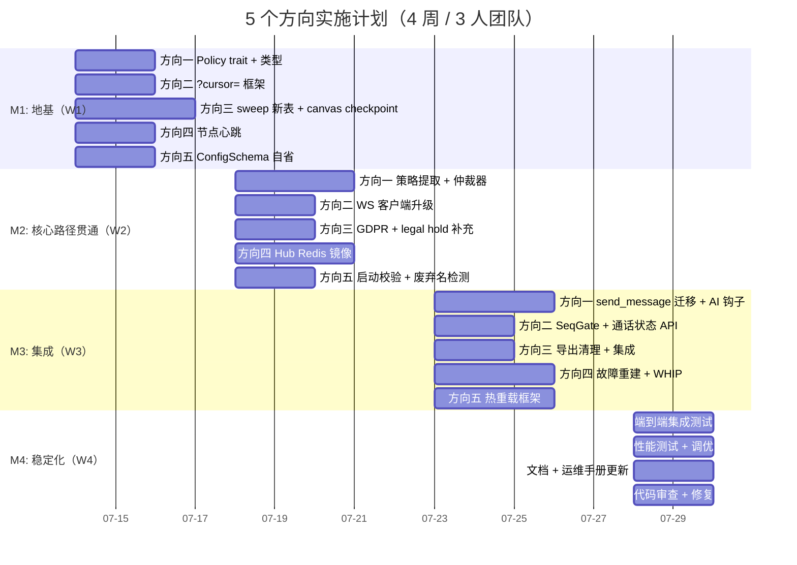

现在我已获取了充分信息。以下是完整的 Tech Lead 分析。

---

# Tech Lead 分析：5 个高价值结构方向

## 分析范围

- **输入**：`docs/requirements/2026-07-09-five-verified-architectural-gaps.md`（5 个方向）
- **当前基线**：Sprint S1 Phase 2 刚刚收尾（P0/P1 共 11 项完成），Phase 3 候选有 Bot 平台、分片扩展、媒体面接线
- **当前在途改动**：messages.rs（版本乐观锁）、hub.rs（Arc 扇出）、routes.rs（路由拆分 + blob 防 XSS）、rate_limit.rs（重构中）、anthropic.rs/AI worker（预算/成本控制）
- **核心约束**：16 crate / 157 migrations / ~25K Rust / ~4.7K JS SPA

---

## 1. 任务分解

### 方向一：治理仲裁器（GovernanceArbiter）—— P1

| 任务 ID | 标题 | 涉及文件 | 前置依赖 | 预估工时 |
|---------|------|---------|---------|---------|
| TASK-001 | 定义 `Policy` trait + `PolicyVerdict` 类型 | `crates/aero-im-core/src/governance/mod.rs`（新建） | 无 | 3h |
| TASK-002 | 提取现有治理策略为 Policy 实现（关键词/PII/Spam/AutoMod） | `governance/keyword.rs`, `governance/pii.rs`, `governance/spam.rs`, `governance/auto_mod.rs`（新建）+ `messages.rs` 拆 | TASK-001 | 4h |
| TASK-003 | 实现 `GovernanceArbiter`——注册、优先级排序、聚合裁决 | `governance/arbiter.rs`（新建） | TASK-001 | 4h |
| TASK-004 | 信息隔离墙补齐——在发送路径增加 `InfoBarrierPolicy` | `governance/info_barrier.rs`（新建）+ `info_barriers.rs` 读取 | TASK-002 | 3h |
| TASK-005 | 编辑路径重审核——`edit_message` 调用 `pre_send` | `crates/aero-im-core/src/service/messages.rs` | TASK-003 | 2h |
| TASK-006 | 统一审计日志表 `governance_audit_log` + 写入 | 迁移 `migrations/0158_governance_audit_log.sql` + `storage/src/governance.rs`（新建） | TASK-003 | 3h |
| TASK-007 | 友好拒绝原因——聚合多策略结果到用户可见消息 | TASK-003 的 `Verdict` 输出格式化 | TASK-003 | 2h |
| TASK-008 | 迁移 `send_message` 管线从 `if-let` 链到 `Arbiter.pre_send` | `crates/aero-im-core/src/service/messages.rs` | TASK-002, TASK-003, TASK-004 | 4h |
| TASK-009 | 异步 AI moderation 集成到仲裁器（`post_send` 钩子） | `governance/ai_moderation.rs`（新建）+ `moderation_bot.rs` 精简 | TASK-003 | 3h |

**方向一合计：28 工时（3.5 人天）**

### 方向二：WS 非消息事件交付保证——P1

| 任务 ID | 标题 | 涉及文件 | 前置依赖 | 预估工时 |
|---------|------|---------|---------|---------|
| TASK-010 | 服务端 `?cursor=` 事件回放端点 | `crates/aero-server/src/ws/ws_impl/mod.rs` + `bus.rs`（扩展 `run_bus_listener` 的 SeqGate 支持） | 无 | 4h |
| TASK-011 | 服务端 time-bound 事件标记（ICE 等瞬态事件跳过） | `common/src/model/event.rs`（给事件加 `ttl_ms` 字段） | TASK-010 | 2h |
| TASK-012 | WS 客户端重连逻辑更新——`_lastSeen` → `_cursor` | `web/ws.js` | TASK-010 | 3h |
| TASK-013 | 重连全量状态拉取——`refreshRoomState` 聚合端点 | `routes/rooms.rs` + `web/ws.js` | TASK-010 | 3h |
| TASK-014 | 通话信号状态独立恢复 REST 端点 | `routes/calls.rs`（新增 `GET /api/calls/:id/state`） | 无 | 3h |
| TASK-015 | SeqGate 缺口检测（per-scope 心跳 seq） | `ws/ws_impl/seq.rs` + `bus.rs` | TASK-010 | 3h |

**方向二合计：18 工时（2.25 人天）**

### 方向三：非消息数据生命周期——P1

| 任务 ID | 标题 | 涉及文件 | 前置依赖 | 预估工时 |
|---------|------|---------|---------|---------|
| TASK-016 | 方向三 A 期——8 张表 `sweep_*` 追加（`canvas_ops`, `message_history`, `call_transcripts`, `block_interactions`, `stream_gifts`, `hype_train_*`, `goals`/`goal_events`, `predictions`/`stakes`/`outcomes`） | `crates/aero-server/src/bin/boot/retention.rs` + 按表分文件 | 无 | 6h |
| TASK-017 | Legal hold 守卫——确保 `call_transcripts` 等清理 skip legal hold | 与 TASK-016 同一 PR，SQL `LEFT JOIN legal_holds` | TASK-016 | 2h |
| TASK-018 | GDPR 删除补充——`block_interactions` 等表加入 `deactivation.rs` 的 `delete_participant_data` | `crates/aero-server/src/deactivation.rs` + `crates/aero-storage/src/participant.rs` | TASK-016 | 2h |
| TASK-019 | Canvas checkpoint 实现（方向三 B 期）——`canvas_version` 写入 + 旧 op 清除 | `crates/aero-server/src/canvas.rs`（已有 `apply_ops`）+ `storage/src/canvas.rs`（新建） | 无 | 6h |
| TASK-020 | 导出产物自动清理——`conversation_export` blob 过期删除 | `retention.rs` + `storage/src/blob.rs` | TASK-016 | 2h |

**方向三合计：18 工时（2.25 人天）**

### 方向四：跨节点状态协调——P2

| 任务 ID | 标题 | 涉及文件 | 前置依赖 | 预估工时 |
|--------|------|---------|---------|---------|
| TASK-021 | 节点存活心跳 `cluster:live` Redis zset | `crates/aero-server/src/bin/boot/cluster.rs`（新建） | 无 | 3h |
| TASK-022 | Hub 状态 Redis 镜像——`room_online`, `stream_watchers` 冗余到 Redis | `hub.rs` + `storage/src/presence.rs` | TASK-021 | 4h |
| TASK-023 | Hub 故障后从 Redis 重建本地状态 | `hub.rs`（`load_from_redis` 方法） | TASK-022 | 4h |
| TASK-024 | WHIP 发布者 Redis 副本 + 故障检测 | `whip_registry.rs` + `storage/src/whip.rs`（新建） | TASK-021 | 3h |
| TASK-025 | 通话状态 Redis 辅助 + 故障后快速恢复通知 | `call_orchestrator.rs` + `storage/src/call.rs` | TASK-022 | 4h |

**方向四合计：18 工时（2.25 人天）**

### 方向五：配置生命周期管理——P2

| 任务 ID | 标题 | 涉及文件 | 前置依赖 | 预估工时 |
|---------|------|---------|---------|---------|
| TASK-026 | 配置 schema 自省——`ConfigSchema` 结构体 + `GET /-/config-schema` | `crates/aero-common/src/config.rs` + `routes/admin.rs` | 无 | 4h |
| TASK-027 | `parse_or_warn` 启动校验——解析失败 warn + fallback 而非静默 | `crates/aero-common/src/config.rs` | TASK-026 | 3h |
| TASK-028 | 废弃配置名检测 + deprecation 警告日志 | `crates/aero-common/src/config.rs`（添加已知旧名列表） | TASK-027 | 2h |
| TASK-029 | 敏感值脱敏 Display（`****` 前缀保留） | `crates/aero-common/src/config.rs` + 各 config 结构体 | TASK-026 | 2h |
| TASK-030 | 热重载框架——`Arc<RwLock<AppConfig>>` + `SIGHUP`/`POST /-/reload` | `crates/aero-common/src/config.rs` + `serve.rs` | TASK-026 | 6h |
| TASK-031 | 热重载安全项实现（`AERO_BLOCKED_WORDS`, rate limit, telemetry, log level, CORS） | 各配置消费方注入 `watch` | TASK-030 | 4h |
| TASK-032 | 热重载不安全项清单 + reload 时告警日志 | TASK-030 的一部分 | TASK-030 | 1h |

**方向五合计：22 工时（2.75 人天）**

---

## 2. 执行顺序与依赖图

```mermaid
graph TD
    %% 方向一：治理仲裁器
    T001["TASK-001 Policy trait + Verdict 类型"] --> T002["TASK-002 提取现有策略为 Policy 实现"]
    T001 --> T003["TASK-003 GovernanceArbiter 实现"]
    T002 --> T004["TASK-004 InfoBarrierPolicy 补齐"]
    T002 --> T008["TASK-008 迁移 send_message 管线"]
    T003 --> T005["TASK-005 edit_message 重审核"]
    T003 --> T006["TASK-006 审计日志表 + 写入"]
    T003 --> T007["TASK-007 友好拒绝原因"]
    T003 --> T009["TASK-009 AI moderation post_send 钩子"]
    T008 --> T005
    
    %% 方向二：WS 事件交付
    T010["TASK-010 ?cursor= 事件回放端点"] --> T011["TASK-011 time-bound 事件标记"]
    T010 --> T012["TASK-012 WS 客户端 _lastSeen→_cursor"]
    T010 --> T013["TASK-013 refreshRoomState 聚合端点"]
    T010 --> T015["TASK-015 SeqGate 缺口检测"]
    T014["TASK-014 通话信号 REST 端点"] -.-> T012

    %% 方向三：数据生命周期
    T016["TASK-016 8 张表 sweep_* 追加"] --> T017["TASK-017 Legal hold 守卫"]
    T016 --> T018["TASK-018 GDPR 删除补充"]
    T016 --> T020["TASK-020 导出产物自动清理"]
    T019["TASK-019 Canvas checkpoint"] -.-> T016

    %% 方向四：跨节点状态
    T021["TASK-021 节点存活心跳"] --> T022["TASK-022 Hub 状态 Redis 镜像"]
    T022 --> T023["TASK-023 故障后 Redis→Hub 重建"]
    T021 --> T024["TASK-024 WHIP Redis 副本 + 故障检测"]
    T022 --> T025["TASK-025 通话状态 Redis 辅助"]

    %% 方向五：配置管理
    T026["TASK-026 ConfigSchema + /-/config-schema"] --> T027["TASK-027 parse_or_warn 校验"]
    T027 --> T028["TASK-028 废弃配置名检测"]
    T026 --> T029["TASK-029 敏感值脱敏 Display"]
    T026 --> T030["TASK-030 热重载框架"]
    T030 --> T031["TASK-031 热重载安全项"]
    T030 --> T032["TASK-032 热重载不安全项清单"]

    %% 并行组
    subgraph GroupA["Sprint 1 并行组"]
        T001
        T010
        T016
        T019
        T021
        T026
    end

    subgraph GroupB["Sprint 2 并行组"]
        T002
        T003
        T011
        T017
        T018
        T020
        T022
        T027
        T029
    end

    subgraph GroupC["Sprint 3 并行组"]
        T004
        T005
        T006
        T007
        T008
        T009
        T012
        T013
        T014
        T015
        T023
        T024
        T025
        T028
        T030
    end

    subgraph GroupD["Sprint 4 并行组"]
        T031
        T032
    end
```



### 并行执行路径说明

| 并行流 | 包含任务 | 人力资源建议 |
|--------|---------|-------------|
| **流 A（治理仲裁器）** | TASK-001→002→003→004→005→006→007→008→009 | 1 名 backend（熟悉 IM 管线） |
| **流 B（WS 事件交付）** | TASK-010→011→012→013→014→015 | 1 名 fullstack（WS + JS） |
| **流 C（数据生命周期）** | TASK-016→017→018→019→020 | 1 名 backend（SQL 优化经验） |
| **流 D（跨节点协调）** | TASK-021→022→023→024→025 | 1 名 infra backend（分布式系统经验） |
| **流 E（配置管理）** | TASK-026→027→028→029→030→031→032 | 1 名 backend（运维工具链经验） |

最多**2 人并行**可覆盖所有流（每个工程师负责 2-3 个流，共 3 人覆盖全部 5 个方向）。

---

## 3. 技术风险

### 高风险项（标 🔴）

| 风险 | 涉及方向 | 概率 | 影响 | 缓解策略 |
|------|---------|------|------|---------|
| 🔴 **方向一：仲裁器成为锁瓶颈**——仲裁器若设计为 `&mut self`，所有发送路径串行化 | 方向一 | 中 | 高 | 强制 `Policy::evaluate(&self, ...)` 签名不可变；仲裁器本身 `&self` 只读聚合；内部策略注册用 `RwLock<Vec<Box<dyn Policy>>>` |
| 🔴 **方向一：异步 AI moderation 与同步策略的时序问题**——编辑路径跳过 AI 审核导致异步审核覆盖编辑 | 方向一 | 高 | 高 | 编辑时插入 `supersedes_moderation_job_id`；AI 从 job 表读取时跳过已被 supersede 的消息 |
| 🔴 **方向二：`?cursor=` 事件回放压力**——长时间离线（24h+）可能回放数十万 seq | 方向二 | 中 | 高 | 服务端实施 max_replay=5000 硬上限 + 快照 checkpoint（类似方向三 canvas checkpoint）；超限客户端 fallback 全量拉取 |
| 🔴 **方向四：Redis 故障退化**——Hub 状态镜像依赖 Redis 可用 | 方向四 | 低 | 高 | Redis 不可用时回退到当前行为（进程本地）；`try_load_from_redis` 添加 graceful degrade，不 panic |
| 🔴 **方向五：热重载 DB URL**——连接池必须 drain + 重建而非简单的 Arc 替换 | 方向五 | 中 | 高 | 显式声明为 unsafe-to-hot-reload；重载时 `warn!("database.url changed, restart required")` 而非尝试热重载 |

### 中风险项（标 🟡）

| 风险 | 涉及方向 | 缓解策略 |
|------|---------|---------|
| 🟡 **TASK-002 策略提取可能漏掉 edge case**——`send_message` 的 `if-let` 链有隐含的顺序依赖 | 方向一 | 提取后保持原有顺序；仲裁器 priority 初始值与原有顺序一致，后续再调优 |
| 🟡 **TASK-016 大量 SQL `DELETE` 可能锁表**——`stream_gifts` 等表在热门直播间可能每 tick 百万行 | 方向三 | 分页删除 `DELETE ... WHERE id IN (SELECT id ... LIMIT 1000)`；`pg_sleep` 在批之间 |
| 🟡 **TASK-012 旧客户端不兼容 `?cursor=`**——已上线客户端没更新 | 方向二 | 服务端并行支持 `?since=`（ULID）和 `?cursor=`（seq）；旧客户端无感知 |
| 🟡 **TASK-021 脑裂场景**——网络分区导致两个节点互相宣告对方死亡 | 方向四 | `zremrangebyscore` 保留多数派仲裁窗口（`N/2+1`）；存活标记含 leader epoch |
| 🟡 **TASK-030 配置重载竞态**——`Arc<RwLock<AppConfig>>` reload 过程中有请求读到了新旧混合值 | 方向五 | 使用 `arc_swap` crate（lock-free AtomicPtr 语义）或 `std::sync::OnceLock` 配合版本号原子切换 |

### 无风险或已排查项

| 项 | 说明 |
|----|------|
| 方向一 `InfoBarrierPolicy` 依赖 `info_barriers.rs` 的现有 `assert_no_barrier` 函数 | 直接调用，无需重构——函数签名 `(repo, participant, target_room) -> Result<()>` 已经是纯函数式 |
| 方向三 `canvas_ops` 的 checkpoint 与现有 `apply_ops` 函数 | `apply_ops` 已存在且纯函数（无 I/O snapshots），可复用；需验证其 O(ops_count) 性能 |
| 方向四 call_rosters 已有 `CallRosterStore`（Redis） | 不需要新建存储层，只需要在 Hub 恢复时从 `CallRosterStore` 重建 |
| 方向五 `GET /-/config-schema` 的鉴权 | 复用 `AERO_INTERNAL_BRIDGE_SECRET` 或 admin-only 路由（现有 `assert_admin` guard） |

---

## 4. 资源评估

### 人员要求

| 角色 | 技能要求 | 数量 | 月均成本因子 |
|------|---------|------|------------|
| Rust backend（核心 IM 管线） | 对 `ImService`、`messages.rs`、治理路径熟悉；能操作 sqlx/PG/Redis | 1 人 | 1.0x |
| Rust backend（数据/运维） | 熟悉 SQL 性能调优、Redis sorted-set 运维、NATS consumer 管理 | 1 人 | 1.0x |
| Fullstack（WS + JS SPA） | 了解 WebSocket 协议、seq 排序、JS 状态管理；能操作现有 `ws.js`/`app.js` | 1 人 | 0.8x |
| **或** 2 人组合 | 上述 1+2 合并为 1 能力强人，fullstack 另配 1 人 | 2 人 | 1.8x |

**推荐配置**：3 人团队（2 backend + 1 fullstack），并行度最优。

### 关键里程碑

| 里程碑 | 依赖 | 时间线 | 交付物 |
|--------|------|-------|--------|
| **M1 基础设施完成** | TASK-001, 010, 016+019, 021, 026（方向一/二/三/四/五各自地基） | 第 1 周末 | Policy trait、?cursor= 框架、sweep_* 新函数、节点心跳、ConfigSchema |
| **M2 关键路径贯通** | TASK-008, 012, 018, 022, 027 | 第 2 周末 | send_message 迁移到仲裁器、WS 客户端重连升级、GDPR 覆盖补齐、Hub Redis 镜像、启动时校验告警 |
| **M3 集成测试通过** | TASK-009, 015, 020, 023, 030 | 第 3 周末 | AI moderation post_send、SeqGate 缺口检测、导出自动清理、Hub 重建、热重载框架 |
| **M4 稳定化 + 性能** | 全部任务绿线 + 性能测试 | 第 4 周末 | 所有方向代码集成交付，压力测试无退化 |

### 阻塞点与解决策略

| 阻塞点 | 涉及 | 解决方案 |
|--------|------|---------|
| **方向一：`Policy` trait 的泛型 vs 对象安全**——`evaluate(&self)` 返回 `PolicyVerdict` 时可能需要 async（AI 策略） | TASK-001 | 同步策略用 `fn evaluate`，异步策略用 `fn evaluate_async(&self) -> Pin<Box<dyn Future>>`；仲裁器内部按 enum dispatch |
| **方向三：`canvas_ops` checkpoint 需要知道当前活跃编辑 session** | TASK-019 | 清除前 `SELECT COUNT(*) FROM canvas_session WHERE canvas_id=$1 AND closed_at IS NULL`，有活跃 session 则跳过 |
| **方向五：热重载 `KeywordModerator` 需要原子替换内部 hash set** | TASK-031 | 使用 `Arc<parking_lot::RwLock<HashSet<String>>>`，reload 时 `write().clone_from(new_words)`——O(N) 但关键词列表通常 <1000，可接受 |

---

## 5. 质量保证

### 5.1 单元测试覆盖要求

| 任务 ID | 最小覆盖率 | 关键测试场景 |
|---------|-----------|-------------|
| TASK-001 | `PolicyVerdict` 的 merge/priority 排序 | 多策略返回 Block + Allow → 结果正确 |
| TASK-003 | `GovernanceArbiter` 仲裁器 | 注册 3 策略 → 评估 → 聚合 Block 原因 |
| TASK-005 | edit_message 重审核 | 合规内容→编辑违规→被仲裁器拦截 |
| TASK-010 | `?cursor=` 回放 | 断开 1h 后重连→收到全量 seq 流；ICE 瞬态事件被跳过 |
| TASK-016 | 各表 sweep SQL 止于 `EXPLAIN` 和 `EXPLAIN ANALYZE` | 1M 行表分页删除无锁冲突 |
| TASK-019 | canvas checkpoint | ops 被压缩 → 读回快照正确 |
| TASK-021 | 节点心跳 | 节点 A 挂起 → 30s 后被节点 B 发现 |
| TASK-027 | `parse_or_warn` | 错误值 `AERO__X=abc` → `warn!` 日志输出 + 默认值使用 |
| TASK-030 | 热重载原子交换 | 旧值使用中 → 新值供应 → 旧读者读到旧值不变 |

**总要求**：新增代码单元测试覆盖率 ≥ 80%（`cargo tarpaulin` 门控）；每个 `Policy` 实现最少 3 个测试用例。

### 5.2 集成测试策略

| 测试场景 | 方法 | 通过标准 |
|---------|------|---------|
| **方向一端到端**：发送敏感消息 → KeywordPolicy 阻断 + 审计日志写入 | `tests/e2e/governance.rs`（新建） | 消息未发送；`governance_audit_log` 存在一行 |
| **方向一编辑绕过**：合规→编辑违规→仲裁器拦截 | 同上 | 编辑返回 Block，消息内容未更新 |
| **方向二重连恢复**：WS 连接断 30s → 重连 → 收到编辑/删除/反应事件 | `tests/e2e/ws_reconnect.rs`（新建） | 客户端渲染状态与服务器一致 |
| **方向三 sweep 正确**：插入 ephemeral 消息 + 过期 + sweep → 消息消失 | 现有 `tests/` 下已有 retention 测试 | 基于当前框架扩展 |
| **方向四节点心跳**：启动 2 节点 → kill 一个 → 另一节点检测到 | `tests/e2e/cluster.rs`（需 `cargo test -- --ignored` 门控） | 存活检测在 ≤TTL+5s 内 |
| **方向五配置重载**：POST /-/reload 改变 AERO_BLOCKED_WORDS → 新词生效 | `tests/e2e/config_reload.rs`（新建） | 重载后关键词拦截生效，旧连接不断 |

### 5.3 代码审查要点

| 维度 | 审查要求 |
|------|---------|
| **方向一安全** | 仲裁器不可跳过——`send_message` 不能保留绕过仲裁器的条件编译路径 |
| **方向二幂等** | `?cursor=` 回放事件必须与 `?since=` 结果一致——回放逻辑不能要求特定执行顺序 |
| **方向三 SQL** | 所有 `DELETE` 必须 `EXPLAIN` 索引利用率；大表必须分页 |
| **方向四故障** | Redis 不可用时系统 degrade 而非 panic——`unwrap()` 在 Redis 操作路径的审查 |
| **方向五安全** | 敏感值 `Display` 实现必须覆盖所有配置输出路径（日志/metrics/健康检查） |

### 5.4 性能测试需求

| 场景 | 目标 QPS/limit | 测试工具 | 验收阈值 |
|------|---------------|---------|---------|
| **发送 + 仲裁器（同步策略）** | 500 req/s（1 个仲裁器实例） | `oha` | p99 延迟 < 5ms（仲裁器为 &self 只读路径） |
| **发送 + 仲裁器（含 AI async）** | 排队最大 512 | 现有 `moderation_bot.rs` 指标 | 无背压 NATS consumer——`try_send` 失败计数器 < 0.1% |
| **WS 重连回放 10K seq** | 10K events / 100ms | 自定义工具（rust） | 客户端渲染完毕 < 500ms |
| **8 表 sweep** | 每 tick 500K 行清理 | `EXPLAIN ANALYZE` + 分页 | 单 tick < 30s，不锁写表 |
| **配置热重载** | 每秒 1 次 reload × 1h | 自动化循环 | 0 个请求 5xx |

---

## 6. 实施计划

### 时间线（甘特图）



### 阶段详情

#### 阶段 1：基础设施搭建（2026-07-14 ~ 07-17，4 天）

**目标**：5 个方向各自的基础类型/框架完成后端合并检查。

| 日期 | 工程师 A（IM 管线） | 工程师 B（数据/运维） | 工程师 C（Fullstack） |
|------|-------------------|---------------------|---------------------|
| D1 | `Policy` trait + `Verdict`（TASK-001） | `cluster:live` 心跳（TASK-021）+ 8 表 sweep（TASK-016 首发 4 表） | `?cursor=` 框架（TASK-010 服务端） |
| D2 | GovernanceArbiter 框架（TASK-003） | Sweep 后续 4 表（TASK-016 续）+ 节点心跳测试 | `?cursor=` 续 + `ttl_ms` 标记（TASK-011） |
| D3 | 策略提取 3/4（TASK-002） | Canvas checkpoint 骨架（TASK-019）+ ConfigSchema（TASK-026） | WS 客户端 `_lastSeen→_cursor`（TASK-012） |
| D4 | InfoBarrierPolicy（TASK-004） | `parse_or_warn`（TASK-027）+ 敏感值脱敏（TASK-029） | `refreshRoomState` 端点（TASK-013） |

**阶段 1 验收**：`cargo check --workspace -q` ✅ · 迁移全部 `CREATE TABLE IF NOT EXISTS` 幂等 ✅ · 各新模块单元测试通过 ✅

#### 阶段 2：核心功能实现（2026-07-18 ~ 07-22，5 天）

**目标**：每个方向的核心逻辑贯通，可以手动测试端到端场景。

| 日期 | 工程师 A | 工程师 B | 工程师 C |
|------|---------|---------|---------|
| D5 | 编辑路径重审核（TASK-005）+ 仲裁器审计日志（TASK-006） | GDPR 补充（TASK-018）+ 导出清理（TASK-020） | 通话状态 API（TASK-014） |
| D6 | 友好拒绝原因（TASK-007）+ `send_message` 迁移（TASK-008 前半） | Hub Redis 镜像 room_online（TASK-022） | SeqGate 缺口检测（TASK-015） |
| D7 | `send_message` 迁移完成（TASK-008 后半）+ 全策略回归测试 | Hub Redis 镜像 stream_watchers（TASK-022 续） | 热重载框架（TASK-030） |
| D8 | AI moderation post_send 钩子（TASK-009） | Hub 故障重建（TASK-023）+ WHIP Redis（TASK-024） | 热重载安全项（TASK-031） |
| D9 | 集成测试撰写 | 通话状态 Redis（TASK-025）+ 废弃配置名（TASK-028） | 热重载不安全项清单（TASK-032） |

**阶段 2 验收**：治理仲裁器可以拦截 + 审计 ✅ · WS 重连恢复非消息事件 ✅ · 8 表 sweep 执行 ✅ · Hub 离线后从 Redis 重建 ✅ · 配置重载改变运行时行为 ✅

#### 阶段 3：集成测试和优化（2026-07-23 ~ 07-27，5 天）

**目标**：所有方向的功能集成测试通过，性能基线建立。

- 端到端测试全量跑通（`cargo test --workspace --lib -- --ignored` 包括 PG 门控测试）
- 性能测试：500 req/s 发送 + 仲裁器，p99 < 5ms
- 热点优化：`canvas_ops` checkpoint 在大文档场景（10K ops）下的性能 profile
- 退避策略验证：Redis 故障时 Hub degrade 不 panic
- Web 客户端兼容性：旧客户端 `_lastSeen` 路径不被破坏（双向兼容）

**阶段 3 验收**：已有的测试全部通过 + 新增 e2e 测试通过 ✅ · 性能测试无 5xx ✅

#### 阶段 4：发布准备（2026-07-28 ~ 07-31，4 天）

- 代码审查第二轮（所有跨 crate 改动）
- `AGENTS.md` 更新（方向一/二/三/四/五的 bot 和 timer 说明）
- `CURRENT_SPRINT.md` 任务看板更新
- 运维手册补充：配置项一览（`GET /-/config-schema` 输出作为文档基准）、热重载安全项列表
- Changelog 编写（面向运维：方向五的废弃配置名迁移指南）
- 最后一次 `cargo clippy --workspace --all-targets` + `scripts/*.sh` 全量检查

**阶段 4 验收**：`cargo clippy` 无新增警告 ✅ · `truth-check.sh` 零违规 ✅ · 全量测试绿线 ✅

---

## 7. 与现有在途改动的交集分析

当前 git 工作区有 36 个已修改文件，涵盖 messages.rs、hub.rs、routes.rs、rate_limit.rs、AI 模块、presence 等。以下是五个方向与这些在途改动的交集与冲突预防：

| 在途改动 | 交集方向 | 冲突风险 | 协调策略 |
|---------|---------|---------|---------|
| `messages.rs` 版本乐观锁（`edit` 带 `version`） | 方向一（编辑重审核） | 中 | 方向一的 TASK-005 需基于已改动的 `messages.rs`，在 `edit` 逻辑中添加治理评估，不要回退版本锁 |
| `hub.rs` Arc 扇出优化 | 方向四（Hub 状态镜像） | 低 | Arc 扇出不改变 Hub 状态结构，方向四写冗余逻辑时不冲突 |
| `routes.rs` 路由拆分 + blob 防 XSS | 方向一（InfoBarrier 路由校验） | 低 | 方向一的 InfoBarrierPolicy 不涉及路由层改动 |
| `rate_limit.rs` 重构 | 方向五（热重载） | 中 | 方向五 TASK-031 的热重载安全项中 rate_limit 参数需要适配新的 `RateLimiter` 结构体——建议 TASK-031 等 rate_limit.rs 重构合并后再开始 |
| `anthropic.rs` / AI worker 预算 | 方向一（AI moderation post_send） | 低 | 方向一 TASK-009 的 `AiModerationPolicy` 应直接调用现有 `ai.moderate` 路径，不要重新实现 budget check |
| `presence.rs` / `live_presence.rs` 重构 | 方向四（Hub Redis 镜像） | 中 | 方向四的 `room_online` 冗余到 Redis 应复用 `presence.rs` 现有的 `PresenceStore` 结构，不重复实现 zset 操作 |
| `ws_impl/bus.rs` 扇出路径优化 | 方向二（SeqGate 事件回放） | 低 | 方向二的 `?cursor=` 回放是 `bus.rs` 中 `run_bus_listener` 的上游——回放逻辑在重现已投递的事件，不应影响扇出路径 |

**合并策略建议**：

1. **本阶段优先级**：先合并当前在途改动（messages.rs 乐观锁、hub.rs Arc 扇出、rate_limit.rs 重构、presence 重构）为 `master`
2. **方向五速率限制热重载（TASK-031）** 需等待 `rate_limit.rs` 重构合并再开始——建议标注为 **WAIT_FOR_MERGE**
3. 方向一（TASK-005, 008）需基于已合并的 `messages.rs` 版本乐观锁开发——建议在版本锁合并后的 `master` 上开分支
4. 其他方向与在途改动无结构性冲突，可以并行开发

---

## 8. 综合建议

### 优先执行顺序（基于风险/价值比）

```
高价值 + 低风险 → 立即开始
├── 方向三 A 期（TASK-016）：8 表 sweep SQL 无架构风险，立即交付价值
├── 方向五 A 期（TASK-026/027）：配置校验和自省无副作用，运维立即可见

高价值 + 中风险 → 第一周内启动
├── 方向一（TASK-001/002/003）：核心治理仲裁器设计需谨慎，但一旦落地根除 6 个缺口
├── 方向二（TASK-010）：?cursor= 框架是后续所有方向二任务的前提

低风险 + 中价值 → 穿插执行
├── 方向四（TASK-021）：节点心跳是分布式容错的前提但短期内单节点部署无风险
├── 方向三 B 期（TASK-019）：canvas checkpoint 虽有用但当前无活跃 canvas 生产环境
```

### 不推荐的合并路径

- **不要**将方向一+方向二合成一个大 PR——仲裁器设计评审和 WS 客户端改动需要不同的 reviewer 能力
- **不要**在方向三的 DELETE 操作上使用无限制单条 SQL——必须分页 + `pg_sleep` 控制
- **不要**在方向五的热重载中支持 DB URL 热替换——声明为 restart-only，省去连接池 drain 的复杂逻辑
- **不要**在方向四的 Hub 状态重建中使用 `unwrap()`——Redis 连接不可用是正常退化路径
