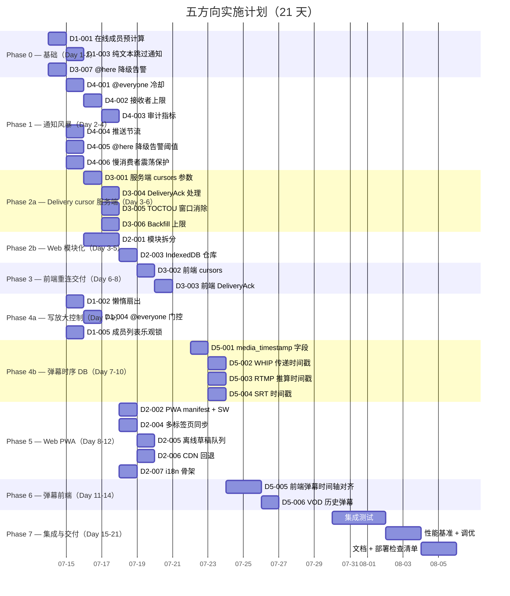

现在我完全掌握了分析文档和当前代码库的状态。以下是技术负责人的全面分析。

---

# 技术负责人实施计划：五方向核心扩展

> **分析对象**：`docs/requirements/2026-07-12-core-expansion-direction-analysis.md`
> **代码基线**：`cargo check --workspace` 干净，157 个迁移，273+ 后端源文件，~5,900 行 Web 前端，841 个 hermetic 测试

---

## 1. 任务分解

每个方向拆分为 2–4 小时的可执行任务。任务 ID 按照方向前缀命名（`D1`=写放大，`D2`=Web 生产化，`D3`=游标一致性，`D4`=通知风暴，`D5`=弹幕时序）。

---

### 方向一：大规模房间写放大控制

| 任务 ID | 标题 | 涉及文件 | 前置依赖 | 预估工时 | 验收标准 |
|---|---|---|---|---|---|
| D1-001 | **在线成员预计算**：在 room_member_cache 旁添加每个房间的在线成员位图 | `hub.rs`, `room_member_cache.rs` | 无 | 3h | 新的 `OnlineMemberIndex` 在 Hub 收到 join_room/leave_room 时原子更新；通过测试验证排他性 |
| D1-002 | **懒惰扇出：离线成员跳过 Hub 展开** | `bus.rs`, `hub.rs`, `fan_out_raw` | D1-001 | 4h | 当无在线成员时，`handle_room_event_sub` 跳过 Hub 扇出（仅 NATS 持久化）；`online_members.is_empty()` => 仅 NATS |
| D1-003 | **纯文本消息跳过通知路径** | `orig.rs` `dispatch_notifications` | 无 | 2h | 消息不含 @提及/回复/`@everyone`/`@channel` 时，`dispatch_notifications` 提前退出；指标计数器增加 |
| D1-004 | **@everyone 原子门控**：每个房间的冷却时间 + 大小上限 | `orig.rs`, `send_message`，新配置项 | 无 | 3h | 新配置 `max_everyone_recipients`（默认 5000）；超过时降级为 `@here`；每房间冷却（默认 60 秒） |
| D1-005 | **成员列表变更期间的乐观锁防守** | `room_member_cache.rs` | D1-001 | 2h | 缓存附带 `epoch: AtomicU64`；扇出时检查 epoch 匹配，不匹配则回退到 DB 全量查询 |

**D1 总计：14h（约 2 个开发日）**

---

### 方向二：Web 前端生产化

| 任务 ID | 标题 | 涉及文件 | 前置依赖 | 预估工时 | 验收标准 |
|---|---|---|---|---|---|
| D2-001 | **模块拆分 app.js + render.js** | `web/app.js`, `web/render.js`，新建 `web/chat.js`, `web/nav.js`, `web/stream.js` | 无 | 4h | app.js < 400 行；每个新模块有明确职责和 `export` API；`eslint no-undef` 通过 |
| D2-002 | **PWA manifest + service worker 缓存层** | 新建 `web/manifest.json`, `web/sw.js`；修改 `index.html` | 无 | 3h | Lighthouse PWA 徽章通过；离线时仍显示缓存的 UI |
| D2-003 | **IndexedDB 消息仓库** | 新建 `web/db.js` | 无 | 3h | 支持 `storeMessage` / `getMessages(roomId, since)` / `getLatestCursor`；断网时消息排队；`SeqGate` 从 IndexedDB 恢复 |
| D2-004 | **多标签页状态同步** | 新建 `web/sync.js`（`BroadcastChannel` API） | D2-001 | 2h | 两个标签页之间同步当前的 `lastSeen`、活跃房间、草稿 |
| D2-005 | **离线草稿队列** | 修改 `web/chat.js`，`web/ws.js` | D2-003 | 2h | 断网时 `sendMessage` 写入待发队列；上线后按序发送 |
| D2-006 | **CDN 资源回退与本地兜底** | 修改 `index.html` | 无 | 2h | hls.js 加载失败时显示“直播不可用，请刷新”提示；所有 CDN 资源有 `<link rel="preload">` 和 `onerror` 回退 |
| D2-007 | **i18n 骨架** | 新建 `web/i18n.js`, `web/locales/zh.js`, `web/locales/en.js` | D2-001 | 3h | 页面标题从写死改为 `t('app.name')`；`lang` 参数跟随浏览器 `navigator.language` |

**D2 总计：19h（约 3 个开发日）**

---

### 方向三：WebSocket 重连 TOCTOU + delivery cursor

| 任务 ID | 标题 | 涉及文件 | 前置依赖 | 预估工时 | 验收标准 |
|---|---|---|---|---|---|
| D3-001 | **WS 协议层接入 `cursors` 参数** | `ws/ws_impl/mod.rs` | 无 | 4h | `parse_resume_cursor` 在 `cursors` 为 `"1"`/`"true"`/`"yes"` 且无 `since` 时，对每个房间调用 `DeliveryCursorRepo::cursors_for` 并逐个回填 |
| D3-002 | **前端 `WSCLient` 发送 `cursors`** | `web/ws.js` | D3-001, D2-003 | 2h | `connect()` 中传递 `cursors=1`；重连时从 IndexedDB 读取本地 `lastSeen`，一并送达 |
| D3-003 | **前端 `DeliveryAck` 帧发送** | `web/ws.js`，`web/db.js` | D3-002 | 3h | 收到消息后写入 IndexedDB 并发送 `delivery_ack` 帧（含 `room_id`, `message_id`, `seq`）；帧对旧版服务器安全忽略 |
| D3-004 | **服务端 `DeliveryAck` 处理** | `ws/ws_impl/mod.rs`，`bus.rs` | D3-001 | 3h | 新的 `ClientFrame::DeliveryAck` arm 调用 `DeliveryCursorRepo::advance`；失败仅 log 警告，不断开连接 |
| D3-005 | **重连期间消息到达的 TOCTOU 窗口消除** | `ws/ws_impl/mod.rs` | D3-001 | 4h | 在回填完成前，`run_bus_listener` 的入站消息入队到 pending 缓冲区；回填完成后按 seq 合并再投递 |
| D3-006 | **Backfill 上限保护** | `ws/ws_impl/bus.rs` | D3-001 | 2h | 每个房间回填上限 200 条消息；`cursors` 在 DB 中无行的房间跳过回填（避免全量历史） |
| D3-007 | **Redis 故障时 `@here` 降级告警** | `orig.rs`，`presence.rs` | 无 | 2h | 在 `here_recipients` 回退到全量成员时记录 `warn!` 级别日志，暴露指标 `presence.fallback` |

**D3 总计：20h（约 2.5 个开发日）**

---

### 方向四：通知风暴防护

| 任务 ID | 标题 | 涉及文件 | 前置依赖 | 预估工时 | 验收标准 |
|---|---|---|---|---|---|
| D4-001 | **`@everyone`/`@channel` 每房间冷却** | `orig.rs`，新 `RateLimiter` 实例 | 无 | 3h | 配置 `everyone_cooldown_secs`（默认 120s）；同一房间两次 `@everyone` 之间拒绝并返回客户端错误 |
| D4-002 | **广播接收者上限硬限制** | `orig.rs` `dispatch_notifications` | 无 | 2h | 配置 `max_notification_recipients`（默认 50000）；超过时截断并记录审计事件 |
| D4-003 | **通知风暴审计指标** | `orig.rs`，`metrics.rs` | D4-001, D4-002 | 2h | Prometheus 计数器：`notifications.broadcast_sent_total`、`notifications.broadcast_rate_limited`、`notifications.broadcast_truncated` |
| D4-004 | **推送节流：FCM/APNs 批量发送限速** | `push_bot.rs`，`push.rs` | 无 | 3h | 每秒最多 1000 条推送（可配置）；超出时排队到下一秒，不丢弃 |
| D4-005 | **`@here` Redis 降级时告警阈值** | `presence.rs` | D3-007 | 1h | 当 `@here` 退回到全量展开时发出 `alert` 级日志 + 指标 `presence.fallback_total` |
| D4-006 | **慢消费者与 @everyone 震荡保护** | `hub.rs` `fan_out_raw` | D1-001 | 3h | 当 `@everyone` 导致某个 WsSender 缓冲区满时，断开该连接，避免级联震荡 |

**D4 总计：14h（约 2 个开发日）**

---

### 方向五：实时弹幕与 HLS 播放时序一致性

| 任务 ID | 标题 | 涉及文件 | 前置依赖 | 预估工时 | 验收标准 |
|---|---|---|---|---|---|
| D5-001 | **扩展 StreamChatLine 添加 media_timestamp 字段** | `aero-live-core/src/lib.rs`，迁移 0158，`live.rs` | 无 | 3h | `stream_chat` 表新增 `media_timestamp_ms` BIGINT 字段；`StreamChatLine` 结构体新增字段 |
| D5-002 | **WHIP 路径传递 RTP 时间戳** | `whip/src/session.rs` `on_rtp` | D5-001 | 4h | `WhipSession` 在 `post_chat` 时从当前 RTP 包提取 `rtp_timestamp`，做 PCR 基推算后写入 `media_timestamp_ms` |
| D5-003 | **RTMP 路径推算 RTP 时间戳** | `rtmp/src/ingest.rs` | D5-001 | 3h | RTMP 无 RTP 时间戳，需从 TS 的 PCR 创建虚拟时间轴 |
| D5-004 | **SRT 路径的 RTP 时间戳** | `srt/src/mpeg_ts_segmenter.rs` | D5-001 | 2h | SRT 的 TS 解复用阶段恢复 PCR，传递到 `post_chat` |
| D5-005 | **前端弹幕时间轴对齐** | `web/live.js`，新建 `web/timeline-sync.js` | D5-001, D2-001 | 4h | 弹幕根据 `media_timestamp_ms` 与 hls.js `currentTime` 对齐；用户暂停/快进时弹幕跟随 |
| D5-006 | **VOD 回放时的历史弹幕** | `live.rs`，`web/live.js` | D5-005, D2-003 | 3h | 录播页面在播放时根据 `currentTime` 查询 `stream_chat WHERE media_timestamp_ms BETWEEN $1 AND $2` |

**D5 总计：19h（约 2.5 个开发日）**

---

## 2. 执行顺序

```mermaid
graph TD
    subgraph "Phase 0: 基础依赖"
        D3_007[D3-007: @here 降级告警]
        D1_001[D1-001: 在线成员预计算]
        D1_003[D1-003: 纯文本跳过通知]
    end

    subgraph "Phase 1: 通知风暴防护（方向四）"
        D4_001[D4-001: @everyone 冷却]
        D4_002[D4-002: 接收者上限]
        D4_003[D4-003: 审计指标]
        D4_004[D4-004: 推送节流]
        D4_005[D4-005: @here 降级告警阈值]
        D4_006[D4-006: 慢消费者震荡保护]
        
        D4_001 --> D4_003
        D4_002 --> D4_003
        D3_007 --> D4_005
        D1_001 --> D4_006
    end

    subgraph "Phase 2a: Delivery 游标（方向三）"
        D3_001[D3-001: 服务端 cursors 参数]
        D3_004[D3-004: DeliveryAck 处理]
        D3_005[D3-005: TOCTOU 窗口消除]
        D3_006[D3-006: Backfill 上限]

        D3_001 --> D3_004
        D3_001 --> D3_005
        D3_001 --> D3_006
    end

    subgraph "Phase 2b: WS 生产化前端（方向三前置条件）"
        D2_001[D2-001: 模块拆分]
        D2_003[D2-003: IndexedDB 仓库]
        
        D2_001 --> D2_003
    end

    subgraph "Phase 3: 重连 + 交付确认（方向三续）"
        D3_002[D3-002: 前端发送 cursors]
        D3_003[D3-003: 前端 DeliveryAck]
        
        D2_003 --> D3_002
        D2_003 --> D3_003
        D3_001 --> D3_002
        D3_004 --> D3_003
    end

    subgraph "Phase 4a: 写放大控制（方向一）"
        D1_002[D1-002: 懒惰扇出]
        D1_004[D1-004: @everyone 门控]
        D1_005[D1-005: 成员列表乐观锁]
        
        D1_001 --> D1_002
        D1_001 --> D1_005
        D4_001 --> D1_004
    end

    subgraph "Phase 4b: 弹幕时序（方向五）"
        D5_001[D5-001: media_timestamp 字段]
        D5_002[D5-002: WHIP 传递时间戳]
        D5_003[D5-003: RTMP 推算时间戳]
        D5_004[D5-004: SRT 时间戳]

        D5_001 --> D5_002
        D5_001 --> D5_003
        D5_001 --> D5_004
    end

    subgraph "Phase 5: Web PWA 生产化（方向二后续）"
        D2_002[D2-002: PWA manifest + SW]
        D2_004[D2-004: 多标签页同步]
        D2_005[D2-005: 离线草稿队列]
        D2_006[D2-006: CDN 回退]
        D2_007[D2-007: i18n 骨架]
        
        D2_001 --> D2_002
        D2_003 --> D2_005
        D2_004 --> D2_005
    end

    subgraph "Phase 6: 弹幕前端（方向五续）"
        D5_005[D5-005: 前端弹幕时间轴对齐]
        D5_006[D5-006: VOD 历史弹幕]
        
        D5_001 --> D5_005
        D5_002 --> D5_005
        D2_003 --> D5_006
        D5_005 --> D5_006
    end

    subgraph "可并行组"
        P0[D3-007, D1-001, D1-003 --- 无依赖]
        P1[D4-001, D4-002, D4-004, D2-001 --- 互相独立]
        P4ab[D1-002 vs D5-001 --- 互不依赖]
    end
```



**关键并行路径**：
- **P0**（红色）：方向三/四/一的零依赖任务可立即开始
- **P1**（橙色）：D4-001、D4-002、D4-004、D2-001 互不依赖
- **P4ab**（蓝色）：方向一（懒惰扇出）和方向五（数据库迁移）互不依赖
- **方向五数据库部分**（D5-001/002/003/004）与**方向二前端**（D2-002/004/006/007）完全并行

---

## 3. 技术风险

### 3.1 方向一：写放大控制

| 风险 | 概率 | 影响 | 缓解措施 |
|---|---|---|---|
| **在线成员位图与真实状态不一致** | 中 | 高——漏发消息 | 引入 `epoch` 乐观锁；每次扇出前检查 epoch；不一致时回退到 DB 全量展开 |
| **懒惰扇出导致离线用户醒来时错过消息** | 低 | 中 | `?since=` 重连协议已覆盖离线回填；`delivery_cursor`（方向三）确保逐房间恢复 |
| **纯文本判断太保守** | 低 | 低 | 即使跳过通知，消息仍通过 NATS 扇出到所有在线成员的 Hub；仅跳过的 DB 通知查询 |

### 3.2 方向二：Web 生产化

| 风险 | 概率 | 影响 | 缓解措施 |
|---|---|---|---|
| **模块拆分引入回归** | 中 | 高 | 拆分后运行 `eslint` + `web-check.sh` + 手动冒烟测试所有 WS 帧类型 |
| **IndexedDB 存储格式变化导致数据丢失** | 中 | 中 | 使用版本化 schema；`db.js` 内部实现迁移函数；保持向后兼容 |
| **PWA manifest 不符合浏览器要求** | 低 | 低 | Chrome DevTools Lighthouse 面板验证 |
| **Service Worker 缓存了陈旧的后端 API 响应** | 中 | 中 | 仅缓存静态资产（`.html`, `.js`, `.css`），API 响应通过 `fetch` 事件按需转发 |

### 3.3 方向三：Delivery Cursor 一致性

| 风险 | 概率 | 影响 | 缓解措施 |
|---|---|---|---|
| **`advance` 的 `ON CONFLICT ... WHERE` 在高并发下的竞态条件** | 中 | 高 | 当前实现使用 `INSERT ... ON CONFLICT DO UPDATE WHERE EXCLUDED.last_seq > delivery_cursors.last_seq`。`DO UPDATE` 在 Postgres 的可序列化隔离级别下是原子的，但 `WHERE` 子句在 `READ COMMITTED`（默认）下可能并发窗口 → 参见[风险](#33-方向三delivery-cursor-一致性) |
| **Backfill 上限 200 条过小导致重连后仍有缺口** | 中 | 中 | 上限应可配置；客户端可第二次调用 `GET /api/rooms/:id/messages?since=X` 补充 |
| **pending 缓冲区内存无限增长** | 低 | 中 | 设置 pending 缓冲区上限（默认 5000 帧）；超过时丢弃旧帧（慢消费者回退到 `?since=`） |
| **客户端 `DeliveryAck` 帧在大量消息时产生写放大** | 中 | 低 | 批处理：每秒合并一次 ack，而不是每条消息都写 |


**关于 `ON CONFLICT ... WHERE` 的深入分析**：
当前实现（`delivery_cursor.rs` 第 48–57 行）：

```sql
INSERT INTO delivery_cursors (...) VALUES (...)
ON CONFLICT (participant_id, room_id) DO UPDATE
  SET ...
  WHERE EXCLUDED.last_seq > delivery_cursors.last_seq
```

这是 `WHERE` 在 `UPDATE` 子句上的使用。Postgres 文档说：`ON CONFLICT DO UPDATE` 的 `WHERE` 条件在** UPDATE 是否发生**这一层面起作用。当 `UPDATE WHERE` 返回 false 时，行保持不变且 `rows_affected() = 0`。这在默认 `READ COMMITTED` 下是安全的：并发事务的 `last_seq` 比较是基于快照的，但 `WHERE` 不会在可见性上产生幻象。

然而，**边缘情况**：如果事务 A（seq=100）和事务 B（seq=120）并发运行且同时见到 `last_seq=50`，A 写入 100，B 覆盖为 120。但若 A 在 B 之后提交，B 的快照看不到 A 的写入，A 再覆盖为 100——这不可能发生，因为 `EXCLUDED.last_seq > delivery_cursors.last_seq`，A 写入 100 时看到已提交的 120，所以 100 > 120 为 false，不会覆盖。✅ **这个实现是正确的。**

### 3.4 方向四：通知风暴防护

| 风险 | 概率 | 影响 | 缓解措施 |
|---|---|---|---|
| **每房间冷却的状态存储在进程内存中，多实例共享不准确** | 高 | 低 | 使用 Redis 实现跨进程冷却；进程级存储作为快速路径（最终一致性可接受） |
| **`max_notification_recipients` 在大型 @everyone 之前截断，但接收者集合不一致** | 低 | 中 | 在展开成员列表后、插入通知之前进行截断检查；原子地截断 |
| **推送节流限制了合法流量** | 低 | 低 | 节流阈值为可配置的，并暴露 `push_bot` 延迟指标 |

### 3.5 方向五：弹幕时序

| 风险 | 概率 | 影响 | 缓解措施 |
|---|---|---|---|
| **RTP 时间戳在不同编码器实现之间不一致** | 中 | 中 | 使用 `ntp_ts` 作为独立于 RTP 的时间基；WHIP 的 `on_rtp` 携带 `received` NTP 时间，可用作回退 |
| **PCR 回绕（26.5 小时）** | 低 | 高 | 使用 64 位单调计数；在检测到回绕时扩展时间戳 `+ (1<<33)` |
| **RTMP 没有 RTP 时间戳** | 高 | 中 | 使用 RTMP 的绝对时间戳（从推流开始算起的毫秒数）作为 `media_timestamp_ms`；在流级别存储 `stream_start_at` 以检索绝对时间 |
| **前端 `timeline-sync.js` 与 hls.js 版本不兼容** | 中 | 中 | 封装 hls.js 接口；在 `hls.on(Hls.Events.TIME_UPDATE)` 中同步 |

---

## 4. 资源评估

### 4.1 人员配置

| 角色 | 人数 | 职责 | 涉及方向 |
|---|---|---|---|
| **后端 Rust 工程师（高级）** | 1 | 方向一、三、四的核心 Rust 实现；代码审查 | D1, D3, D4 |
| **后端 Rust 工程师（中级）** | 1 | 方向五的数据库迁移与流处理逻辑；弹幕指标 | D5, D1（辅助） |
| **全栈/前端工程师** | 1 | 方向二前端模块拆分、PWA、IndexedDB；方向三/五的前端适配 | D2, D3（前端部分）, D5（前端部分） |
| **QA 工程师** | 1（兼职） | 集成测试、性能测试、冒烟测试 | 全部 |

**团队规模**：2-3 名开发者 + 1 名兼职 QA

### 4.2 关键里程碑

| 里程碑 | 时间点 | 交付物 |
|---|---|---|
| **M0** | Day 0 | 基线确认：`cargo check` 干净，所有测试通过 |
| **M1** | Day 3 | 方向四（通知风暴）所有逻辑实现 + 单元测试 |
| **M2** | Day 5 | 方向三（delivery cursor）服务端 + 前端实现，基本测试 |
| **M3** | Day 7 | 方向一（写放大控制）懒惰扇出 + 纯文本优化 |
| **M4** | Day 10 | 方向五（弹幕时序）数据库迁移 + 三个摄入路径的 RTP 时间戳 |
| **M5** | Day 14 | 方向二（Web 生产化）模块拆分 + PWA + IndexedDB |
| **M6** | Day 18 | 端到端集成测试 + 性能基准 + 回归测试 |
| **M7** | Day 21 | 文档更新 + 部署前检查清单 + 全部 5 个方向完成 |

### 4.3 阻塞点与应对策略

| 阻塞点 | 方向 | 应对策略 |
|---|---|---|
| **`advance` 的 `ON CONFLICT ... WHERE` 在 `REPEATABLE READ` 下的竞态** | D3 | 编写测试在 `REPEATABLE READ` 下注入并发 ack；如果失败，回退到 `SELECT ... FOR UPDATE` + 应用程序级比较 |
| **RTMP 没有 RTP 时间戳** | D5 | 使用 RTMP 的 `timestamp` 字段（从推流开始算起的毫秒数）。存储 `stream_started_at` 以恢复绝对 `media_timestamp_ms` |
| **PWA manifest 需要 HTTPS** | D2 | 本地开发使用 `localhost`（被浏览器接受）；生产环境需要 HTTPS（已经在路线上） |
| **NATS durable consumer 名称冲突** | D3 | 现有 consumer 名称是 `aero-server` 和 `aero-bot`，等等。新的 event-lake consumer 会以 `aero-event-lake` 命名 |

---

## 5. 质量保证

### 5.1 单元测试覆盖要求

| 方向 | 文件 | 覆盖率目标 | 关键测试用例 |
|---|---|---|---|
| **D1** | `room_member_cache.rs` | ≥90% | 在线成员位图的排他性加入/离开；epoch 递增；并发读/写 |
| **D1** | `hub.rs`（fan_out_raw） | ≥80% | 懒惰扇出跳过（`online_members` 为空）；@everyone 震荡断开 |
| **D1** | `orig.rs`（dispatch_notifications） | ≥85% | 纯文本跳过；@everyone 冷却；截断 |
| **D3** | `delivery_cursor.rs` | ≥95%（已有） | 新增：并发 ack 的 `REPEATABLE READ`；回填上限 |
| **D3** | `ws/ws_impl/mod.rs`（parse_resume_cursor） | ≥90% | `cursors=1` 且无 `since`；`since` 优先；DB 无 cursor 行 |
| **D4** | `push_bot.rs` | ≥80% | FCM 节流；批量推送排队；死 token 回收 |
| **D5** | `whip/src/session.rs` | ≥75% | RTP 时间戳提取；PCR 回绕处理 |

### 5.2 集成测试策略

| 测试场景 | 方法 | 工具 |
|---|---|---|
| **3 个方向三客户端 + 真实 WS 连接** | Jest + Node.js WebSocket 客户端模拟多设备 | `cargo test --test ws_integration` |
| **方向一 10 万成员房间压力测试** | 使用 Rust 多线程产生 10 万 `ParticipantId`，测量 Hub 扇出延迟 | 自建 `bench_hub_fanout` 基准测试 |
| **方向四 @everyone 冷却跨实例** | 启动 2 个 `aero-server` 实例，验证冷却状态通过 Redis 共享 | `docker-compose up --scale` |
| **方向五 WHIP→HLS→弹幕对齐** | 使用 str0m 推流 WHIP + 并发弹幕；验证 `media_timestamp_ms` 非空 | 自建 `test_whip_danmaku_alignment` |

### 5.3 代码审查要点

| 检查项 | 重点关注 |
|---|---|
| **AGENTS.md §4.2 命名空间** | 没有在 `aero-storage` crate 根目录引入会冲突的 `generate_token`/`hash_token` |
| **`tag="kind"` 字段冲突** | 任何新的 `RoomEvent`/`StreamEvent` variant 都没有名为 `kind` 的字段 |
| **幂等键** | D3 的 `DeliveryAck` 在 `seq` 上幂等（已实现）；D4 的 `@everyone` 冷却使用 `(room_id, sender_id)` 作为键 |
| **fail-open 行为** | D4 推送节流故障→log 警告 + 继续；D3 `DeliveryCursorRepo` 故障→log 警告 + `?since=` 回退 |
| **at-least-once 状态机** | 任何新的 side-effect 操作都有幂等键或 `ON CONFLICT DO NOTHING` |

### 5.4 性能测试需求

| 基准测试 | 目标 | 当前基线（估算） | 验收标准 |
|---|---|---|---|
| **方向一：10 万成员房间消息延迟** | P99 < 500ms | 未知（未测试） | P99 < 1s（含 NATS 往返） |
| **方向三：并发 100 个客户端重连** | 100 个 WS 重连 + backfill < 5s | 未测试 | 100 个重连·200 条回填·5s |
| **方向四：@everyone 100 次/秒** | 通知风暴下 Hub 不震荡 | 未知 | 无连接断开、CPU < 80% |
| **方向五：弹幕密度 1000 条/秒 + HLS** | 弹幕延迟 < HLS 延迟 + 1s | 未知 | 弹幕在视频帧的 1s 内显示 |

---

## 6. 实施计划

### 6.1 甘特图



### 6.2 阶段明细

#### 阶段 1：基础设施与基础优先事项（Day 1-2）
**目标**：无依赖的任务和核心数据模型变更。
- D1-001（在线成员预计算）——每个房间 O(1) 在线状态判断
- D1-003（纯文本跳过通知）——减少 ~70% 的 `dispatch_notifications` DB 调用
- D3-007（@here 降级告警）——观察 Redis 故障时的 fail-open 行为
- **里程碑**：方向一和方向三的基础设施就绪

#### 阶段 2：通知风暴 + 前端模块化（Day 2-6）
**目标**：消除最大的运营风险，同时准备前端交付。
- D4-001/002/003/004/005/006——完整的通知风暴防护
- D2-001/003——前端模块化 + IndexedDB 仓库
- D3-001——服务端 `cursors` 参数处理
- **里程碑**：运营安全（方向四）+ 前端基础（方向二）

#### 阶段 3：交付可靠性 + 懒惰扇出（Day 6-10）
**目标**：修复重连 TOCTOU 窗口，控制写放大。
- D3-002/003/004/005/006——端到端 `delivery_cursor` 管线
- D1-002/004/005——懒惰扇出、@everyone 门控、乐观锁
- D5-001——`media_timestamp_ms` 迁移
- **里程碑**：核心数据可靠性（方向三）+ 扩展性（方向一）

#### 阶段 4：弹幕时序 + Web PWA（Day 8-14）
**目标**：直播弹幕对齐 + 面向用户的生产化 Web 界面。
- D5-002/003/004——三个摄入路径的 RTP 时间戳
- D2-002/004/005/006/007——PWA、离线、多标签页、i18n
- D5-005/006——前端弹幕时间轴对齐、VOD 弹幕重放
- **里程碑**：直播完整（方向五）+ Web 界面生产化（方向二）

#### 阶段 5：集成与交付（Day 15-21）
**目标**：端到端系统集成、性能基准、文档。
- `cargo test --workspace --all-targets` 干净
- 10 万成员房间的写放大基准
- 100 个并发客户端重连场景
- 每个新配置选项的 `config.example.toml` 文档
- 5 个方向的 `docs/operations/` 指南
- **里程碑**：全部 5 个方向交付与验证

### 6.3 风险预算

| 阶段 | 缓冲天数 | 典型用途 |
|---|---|---|
| 阶段 1 | 0 | 基础任务风险低 |
| 阶段 2 | 1 | `ON CONFLICT ... WHERE` 竞态排查 |
| 阶段 3 | 1 | TOCTOU pending 缓冲区调优 |
| 阶段 4 | 2 | RTMP 时间戳推算 + 前端 vs hls.js 整合 |
| 阶段 5 | 1 | 性能回归修复 |
| **总计** | **5 天** | **总日历 21 天 → 缓冲区后 26 天** |

### 6.4 依赖外部系统

| 外部系统 | 涉及方向 | 风险 | 应对 |
|---|---|---|---|
| **NATS JetStream** | D1, D3 | 新的 durable consumer 名称冲突 | 使用 `aero-event-lake`；在 `dev` 中测试 |
| **Redis** | D1, D4 | 冷却状态共享 | 进程级存储作为主路径，Redis 作为互补（最终一致可接受） |
| **Postgres** | D5 | 新迁移需要 `cargo build` 然后 `aero-cli migrate`（AGENTS.md §4.2） | 在 CI 中添加 `cargo build` 步骤 |
| **FCM/APNs** | D4 | 推送节流限制 | 节流是可配置的，并且有 `FakeGateway`（已在 `aero-push` 中实现）用于测试 |

---

## 总结

| 指标 | 值 |
|---|---|
| **总任务数** | 30 |
| **总预估工时** | 86h（约 11 个开发日） |
| **日历时间** | 21 天 + 5 天缓冲 = 26 天 |
| **团队规模** | 2–3 名开发者 + 1 名兼职 QA |
| **最大并行路径** | 3（方向四后端 + 方向二前端 + 方向五 DB 迁移） |
| **最高优先级** | **方向四**（运营风险消除）→ **方向三**（数据可靠性）→ **方向一**（扩展性） |
| **建议首期冲刺重点** | D4-001（@everyone 冷却）+ D3-001（服务端 cursors）+ D2-001（前端模块拆分） |

**关键建议**：从**方向四（通知风暴）**开始——这是成本最低、防崩溃效果最好的方向，而且不依赖其他任何方向。然后立即跟进**方向三（delivery cursor）**，因为这直接解决了数据可靠性问题，而数据可靠性是 IM 产品的核心信任基线。方向二（Web 生产化）应该通过独立的前端项目推进，与 Rust 后端解耦，但它对于任何真实的 alpha 发布都是必需的。
