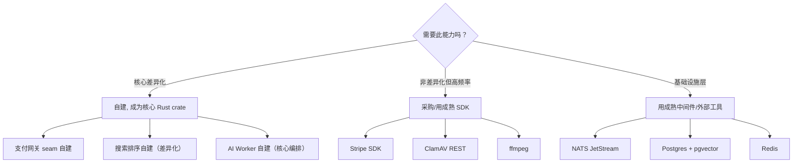

以下是我基于对 `docs/requirements/2026-07-10-five-strategic-product-directions.md` 文档和全代码库架构理解（AGENTS.md、设计 spec、BlobStore seam 模式、crate 分层、NATS+Hub 扇出架构）的架构分析。

---

# 架构分析：Aero IM 五个战略产品方向

## 1. 架构评估

### 1.1 当前架构的优势

Aero IM 的架构在每个决策点上做了**超前的工程投入**，这是它和绝大多数创业项目最本质的区别：

| 优势 | 证据 | 工程价值 |
|---|---|---|
| **事件 DAG 清晰** | NATS JetStream durable consumer `aero-server` + ephemeral `live.stream.*`，Hub 本地 `mpsc` 扇出 | 水平扩展不需要改动业务代码，加实例即扩容 |
| **Seam 模式成熟** | `BlobStore` trait（`LocalFsBlobStore` / `S3BlobStore`）、`PaymentGateway` 预留、`AvScan` stub | 新后端实现仅加 struct + `impl Trait`，不需要改调用方 |
| **Crate 边界正交** | 17 个 crate 按功能域切分（`aero-im-core` / `aero-ai` / `aero-live-webrtc` 等），依赖方向自下而上单向 | CI 缓存高效，单 crate 修改不会触发全量重新编译 |
| **预算/限流内建** | AiWorker 双层预算（per-ws 60 + 全局 300 over 60s），`KeyedCostBudget` 防止单用户耗尽全局配额 | 多租户场景不需要额外接入限流层 |
| **集群状态有明确归属** | presence → Redis sorted-set、SFU roster → 进程内 `Arc<RwLock<HashMap>>`、call roster → Redis | 没有"这个状态到底在哪"的模糊地带 |

### 1.2 当前架构的局限性

这些局限来自一个核心矛盾：**工程完备性超前于产品完备性**。

```
后端工程密度（815+ 单元测试，分布式中枢，SFU 跨节点桥）
        ↑
        │        ★ 当前所在位置
        │       /
        │      /  ★ 产品面：前端 debug client，支付 stub，搜索无反馈闭环
        │     /
        └────→ 产品完备性
```

具体到架构层面：

**（A）前端无架构可言**
- `web/app.js` 是 1009 行单体文件，全局可变状态（`context.js`），无组件树、无路由、无生命周期
- 没有构建步骤（零 bundler），ES Module import 是唯一的模块化手段
- 这意味着每个新 `routes.rs` 里的路由（150+）都需要在前端手动维护对应的 UI 页面——**这个映射关系没有系统化**
- 代码库有 `web/polls.js` 这样独立封装的领域模块，说明开发者在试图让前端有结构，但缺少一个框架层面的约定来统一

**（B）搜索架构有"半闭环"**
- `search_click_events` 表 + `CtrStats` 结构体收集了排序所需的全部信号（query、rank、click、timestamp）
- 但无监督融合（reciprocal rank fusion）是搜索链路的终点，**没有任何模块消费点击数据来调整排序权重**
- `AiWorker` 有预算队列基础设施，但 Embed 和 Moderate 是两个消费端，搜索反馈训练还不存在
- 这是一座已修建但无人通行的桥

**（C）支付领域模型有数据结构无行为**
- `creator_subscription.rs` + `subscription_tier.rs` 定义了完整的订阅模型（会员档位、月费、权益）
- 但 `PaymentGateway` trait 只在文档中预留，代码里不存在——订阅扣款是纯数据库状态的"影子操作"
- 这是一个有完整 schema 但零事务的财务系统

**（D）运营视图缺失跨组件可观测性**
- 虽然有 Prometheus recording rules + alert rules + Grafana dashboard，但缺少：
  - 断路器全局状态视图（`breaker.rs` 只在 webhook 模块内部，无管理 API）
  - NATS JetStream backlog 每个 subject 的积压量（NATS 自身能暴露但未纳入 dashboard）
  - 跨节点桥（`call_bridge_supervisor`）的连接状态检查
- 这些状态都存在，只是没有被拉到一个统一面板

**（E）媒体管道有拼图但缺少两块**
- 缩略图/转码/CDN Pre-signed URL / ClamAV 扫描各自都有独立的前提条件就绪
- 但缺少一个**统一的媒体处理管线抽象**（类似 `MediaPipeline { stages: Vec<Box<dyn MediaStage>> }`）
- 当前是每个路径自己调 `content_sniff.rs` → 存 blob，没有中间处理步骤的插入点

### 1.3 关键架构决策复盘

| 决策 | 评价 | 原因 |
|---|---|---|
| NATS 作事件总线（非 Kafka/Redis Streams） | ✅ 合理 | NATS 的 consumer 模型（durable/ephemeral）完美匹配 IM（at-least-once）+ 直播（best-effort）混合需求。JetStream 持久化 + 水平扩 |
| SFU 进程内 HashMap 非 Redis | ⚠️ 有条件合理 | 通话媒体转发需要纳秒级查找，Redis 往返 0.5ms+ 不可接受。但跨节点故障转移时需要重建全量 SFU 状态——当前没有此机制 |
| Hub 本进程 bounded mpsc 扇出 | ✅ 合理 | 避免 NATS 广播到所有实例再过滤，mpsc 通道在 Rust 下的开销 < 500ns |
| AiWorker `FOR UPDATE SKIP LOCKED` 轮询 | ✅ 合理 | 对标 Postgres-as-queue 模式，无额外依赖（不需要 RabbitMQ/Redis List），但 5 次失败进 dead 队列的设计需配合告警 |
| 前端零框架 | ❌ 架构债 | 当时应该选一个渐进式框架（Vue/Svelte/Lit），而不是跳过。现在 1009 行 app.js 的重构成本远高于当时选框架的决策成本 |

---

## 2. 扩展方向

我基于文档的五个方向，从架构角度做扩展和深化——不是重复文档内容，而是补充架构层面的决策树。

### 方向一：前端产品化 → 应拆为两个子架构问题

文档把"前端产品化"看作一个方向，但我认为它实际上是**两个独立的架构问题**：

#### 子问题 A：前端框架选型（P0）

**选项对比：**

| 选项 | 迁移成本 | 学习曲线 | 实时 WS 支持 | 生态成熟度 | 推荐场景 |
|---|---|---|---|---|---|
| **Lit**（Web Components） | 低——渐进式，现有 HTML 可以直接用 | 低——标准 Web API | 一般——需自己封装 | 中 | 渐进式迁移，保留现有 hand-rolled code |
| **Svelte 5**（runes） | 中——需要重写组件 | 低 | 好——reactive state 天然适合 WS 实时推送 | 中高 | 新前端完整重写 |
| **Vue 3**（Composition API） | 中 | 中 | 好——VueUse 有 useWebSocket | 高 | 团队熟悉 Vue 的选择 |
| **Alpine.js**（低代码） | 极低——直接在 HTML 上加 `x-data` | 低 | 有限 | 中 | 管理控制台快速搭建，不做复杂前端 |

**我的建议：** 分两阶段。**阶段 1（管理控制台）**用 **Alpine.js + htmx**——零构建步骤，SVG 图标 + 表格 + 表单即可覆盖 80% 的管理员功能。**阶段 2（用户面 SPA）**用 **Svelte 5**——reactive 状态管理 + 细粒度 DOM 更新天然适合 IM 这种高频率状态变更场景。

#### 子问题 B：API 契约对齐（隐含但关键）

当前 80+ 路由模块的前后端接口只有 `web/app.js` 这个唯一消费者。这意味着：

1. **没有 OpenAPI/Swagger 规范**——API 变更时前端只能靠"跑起来看坏没坏"
2. **没有 mock server**——前端开发依赖后端运行
3. **没有类型共享**——Rust `RoomEvent` enum 和 JS 侧的 `{ type: "message", ... }` 之间没有任何类型检查

**建议增加最小可行契约层：**

```
┌──────────────────────┐   手工维护（但 CI 对比）
│ docs/api/rooms.md    │ ← 每个模块的 HTTP/WS 接口文档
│ docs/api/search.md   │
│ docs/api/live.md     │
└──────┬───────────────┘
       │ CI 验证：
       │ - 路由存在性（`rg "get|post|patch|delete"` 匹配）
       │ - 响应结构一致性（`rg "Json<"` 匹配返回类型）
       ▼
┌──────────────────────┐
│ web/api.js           │ ← 前端 API 调用层（已有，需自动化）
└──────────────────────┘
```

不做完整的 OpenAPI 生成（`utoipa` 需要大量侵入式注解），但至少要有一个**机器可读的端点清单**供 CI 验证"每个路由至少有一个调用测试"。

### 方向二：搜索 Relevance Engine — 架构设计

文档建议了 LTR 闭环，但从架构角度需要补一个关键设计决策：

#### 核心问题：在线排序在哪里做？

**选项 A：PG 函数内（`plv8` 或 `plrust`）**
- 优点：零网络延迟，直接在查询中做 rerank
- 缺点：PL 语言维运成本高，`plrust` 需要编译 PG 扩展
- 推荐度：❌ 不推荐

**选项 B：应用层 Rust 推理（`linfa` / `smartcore`）**
- 优点：无外部依赖，复用 AiWorker 基础设施
- 缺点：加载模型需要初始化时间，每查询需要拉特征向量到内存
- 推荐度：✅ 推荐（与现有 AiWorker 模式一致）

**选项 C：外部排序服务（单独的 `aero-search` crate + gRPC）**
- 优点：解耦、可用 GPU 加速、独立扩缩容
- 缺点：引入 gRPC + 额外的网络跳
- 推荐度：⏸ 延迟到方向二进入 P2 后再考虑

#### 特征向量设计（架构级建议）

目前的 `fuse_rankings` 使用固定的 reciprocal rank fusion。LTR 模型需要结构化特征。建议的特征集：

```
特征组               来源                        当前是否有
──────────────────────────────────────────────────────────
FTS score            pg_trgm ts_rank             ✅ 有
Vector cosine        pgvector <=>                ✅ 有
消息年龄(小时)        created_at                   ✅ 有
发送者历史CTR        search_click_events 聚合     需要跨表 JOIN
消息长度(字符数)      jsonb_length(blocks)         ✅ 有
提及数              blocks -> Mention count       ✅ 有
附件有无            blocks -> File/Voice           ✅ 有
回复数              reply_to 聚合                 需要从 messages 表聚合
发送者角色          room_members.role             ✅ 有
```

**架构变更：** `search_advanced.rs` 的 `merge_hits` 函数需要变成 `rerank(features: Vec<f64>, model: &RankingModel) -> Vec<Hit>`，其中 `RankingModel` 是一个 trait：

```rust
trait RankingModel: Send + Sync {
    fn predict(&self, features: &[f64]) -> f64;
    fn train(&mut self, dataset: Vec<(Vec<f64>, f64)>) -> Result<(), TrainError>;
}
```

这个 trait 可以有一个 `LinearRegressionRanker` 实现（确定性，可导出权重数组用于调试），也可以有一个 `LinfaRanker`（使用 `linfa-logistic`）。关键在于**排序逻辑不再硬编码**。

### 方向三：支付与创作者变现 — 架构设计

文档提议了 `PaymentGateway` trait（类比 `BlobStore`），这是正确的抽象。我补充几个架构层面容易被忽略的点：

#### 关键架构决策：支付状态应在哪维护？

**选项 A：完全委托 Stripe（Stripe 是事实源）**
- 本地表只存 `stripe_subscription_id` 引用
- 本地扣款状态通过 Stripe webhook 更新
- 优点：不分裂事务状态，Stripe 保证一致性
- 缺点：离线时无法判断订阅状态；webhook 可能丢（需重试 + 定期 sync）

**选项 B：本地数据库做双写（本地是事实源）**
- 本地 `subscriptions` 表存完整状态 + `stripe_id`
- 每次操作先落本地库，再同步到 Stripe
- 优点：离线可读，幂等控制好做
- 缺点：两阶段故障风险高

**选项 C：混合（本地只读缓存，Stripe 是事实源）**
- 用户请求 → 本地查缓存 → 缓存过期或缺失时回源 Stripe API
- 写操作直接走 Stripe API，成功后异步更新本地表
- 优点：兼顾离线读可用性和一致性
- 缺点：实现复杂度中等

**我的建议：选项 A（第一阶段）→ 选项 C（第二阶段）。** 第一版只依赖 Stripe webhook 更新本地状态，允许 5 秒的延迟。当启动创作者提现、退款等需要离线读的场景时，再加本地缓存层。

#### 需要新增的 seam / trait

```
aero-payment/
├── payment_gateway.rs        # PaymentGateway trait（charge / payout / refund / verify_webhook）
├── stripe_gateway.rs         # Stripe 实现
├── alipay_gateway.rs         # 支付宝实现（中国区）
├── subscription_orch.rs      # 订阅生命周期编排（create → charge → dunning → cancel）
├── payout_engine.rs          # 月结提现引擎
└── compliance.rs             # 税务记录 / audit 日志写入
```

**关键 API 面：**

```rust
#[async_trait]
trait PaymentGateway: Send + Sync + 'static {
    /// Create a subscription. Returns the payment provider's subscription ID.
    async fn create_subscription(
        &self,
        customer_id: &str,
        price_id: &str,
        metadata: HashMap<String, String>,
    ) -> Result<String, PaymentError>;

    /// Charge a one-time payment (gifts, points top-up).
    async fn charge(
        &self,
        amount_cents: u64,
        currency: &str,
        payment_method_id: &str,
    ) -> Result<PaymentResult, PaymentError>;

    /// Payout to a creator (Stripe Connect / Alipay).
    async fn payout(
        &self,
        destination: &str,
        amount_cents: u64,
        currency: &str,
    ) -> Result<PayoutResult, PaymentError>;

    /// Verify a webhook signature from the payment provider.
    async fn verify_webhook(
        &self,
        payload: &[u8],
        signature: &str,
    ) -> Result<PaymentEvent, PaymentError>;
}
```

### 方向四：运营基础设施 — 架构设计中"最容易被推迟"的一条

文档列举了 Helm chart、负载测试、迁移安全、断路器 API、多区域路由。我从架构角度补充最关键的一条：

#### 迁移安全执行器是 P0，不是 P4

当前 `sqlx::migrate!("../../migrations")` 在 `aero-storage/db.rs` 里热嵌于二进制。首次部署没问题。但生产运营中：

1. **在 messages 表（百万级行）上加索引**——`CREATE INDEX CONCURRENTLY` 不是标准迁移框架能处理的
2. **在 messages 表上加 `NOT NULL` 列**——需要 `ALTER TABLE ... ADD COLUMN ... DEFAULT ...` 再逐步 backfill
3. **迁移回滚**——sqlx 不支持降级迁移

**架构建议：** 在 `aero-cli` 中实现一个 **pre-flight 检查步骤**，在 `migrate()` 调用前扫描待执行的迁移 SQL，识别高风险 DDL：

```sql
-- 高风险标记（自动检测）
-- 1. CREATE INDEX ON large_table  → 警告：建议用 CONCURRENTLY
-- 2. ALTER TABLE large_table ADD COLUMN ... NOT NULL  → 阻塞：需要拆分迁移
-- 3. ALTER TABLE large_table ALTER COLUMN ... TYPE  → 阻塞：可能导致全表重写
```

这个 pre-flight 检查器的输出应该是一个"可读的 DDL 风险报告"，而不是直接退出——给运维自主权判断。

#### 断路器管理 API 的架构位置

当前 `breaker.rs` 在 webhook 模块内实现断路器（状态机 + 半开重试）。但断路器是一个**横切关注点**，不应该只有 webhook 用它。

**建议拓展：** 将断路器抽象为一个泛用模式，注册到 `AppState`：

```rust
struct AppState {
    // ... 现有字段
    breakers: Arc<RwLock<HashMap<String, BreakerState>>>,
}
```

然后通过 `GET /api/admin/breakers` 暴露所有断路器的状态，`POST /api/admin/breakers/:id/reset` 人工复位。不仅仅是 webhook 用——AI 服务调用的限流背压、S3 blob store 断连、NATS consumer 积压超标都可以用同一机制。

### 方向五：媒体管道优化 — 架构设计

文档建议了缩略图/转码/CDN/病毒扫描/ABR。架构层面的核心缺失是一个**媒体处理管线抽象**。

#### 当前架构

```
blob upload → content_sniff.rs → blob_store.put()
                                       ↓
                                  (直接存储，不做任何转换)
```

#### 建议架构

```
blob upload → content_sniff.rs
                   ↓
          ┌── pipeline dispatcher ──┐
          │  for each registered    │
          │  stage:                 │
          │  1. check(mime)         │
          │  2. process(bytes)      │
          │  3. store result        │
          └────────────────────────┘
                   ↓
              blob_store.put()  ← 原始 blob
              blob_store.put()  ← 缩略图（命名约定 `id_thumb.webp`）
              blob_store.put()  ← 转码结果（`id_lo.mp4`）
```

**核心 trait：**

```rust
#[async_trait]
trait MediaPipelineStage: Send + Sync {
    /// The input MIME types this stage accepts.
    fn accepts(&self, mime: &Mime) -> bool;
    /// Process the blob, returning zero or more derived blobs.
    async fn process(
        &self,
        id: BlobId,
        mime: Mime,
        bytes: Bytes,
    ) -> Result<Vec<(BlobId, Mime, Bytes)>, StageError>;
}
```

这个 trait 可以有如下实现：

| Stage | 输入 | 输出 | 依赖 |
|---|---|---|---|
| `ThumbnailStage` | image/* | `_thumb.webp` (320px width) | `image` crate（已有 `content_sniff.rs` 依赖） |
| `AudioTranscodeStage` | audio/* (flac/wav) | `_opus.ogg` (Opus 24kbps) | `ffmpeg` 外部命令 |
| `VideoTranscodeStage` | video/* | `_lo.mp4` (h264 baseline) | `ffmpeg` 外部命令 |
| `VirusScanStage` | */* | 审计日志（阻断写入） | `clamd` socket 或 `clamav-rest` |

**相比文档的补充建议：**

1. **CDN Pre-signed URL 不应加到 BlobStore trait**。`BlobStore` 是"存储"抽象，CDN 是"分发"抽象。应该新增一个 `BlobDistributor` trait：

```rust
#[async_trait]
trait BlobDistributor: Send + Sync + 'static {
    async fn url_for(&self, blob_id: BlobId, expires_in: Duration) -> Option<String>;
}
```

这样 `S3BlobStore` 实现 `BlobStore`，`S3PreSignedUrlDistributor` 实现 `BlobDistributor`，两者解耦。`LocalFsBlobStore` 对应的 `LocalFsDistributor` 返回 `None`，由应用服务器 fallback 代理。

2. **HLS ABR 的实现前提是 SIMULCAST 输出的消费**。当前 WHIP 摄入 → SFU 转发是 web 端 Simulcast（一个源编码 3 个分辨率）。SFU 端已经可以分别转发三个 Simulcast 流。HLS writer 需要分别接收这三个流并各自切片——**这需要 SFU 到 HLS writer 的通道不是单一的 `mpsc`，而是三个 `mpsc`（每个 layer 一个）**。

---

## 3. 接口设计建议

### 3.1 已有的好模式应延续

`BlobStore` trait 的 seam 模式是 Aero IM 架构中最好的抽象之一。新扩展应当沿用**同一套模式语言**：

| 模式 | 定义 | 实例 |
|---|---|---|
| **Seam trait** | `#[async_trait] pub trait Xxx: Send + Sync + 'static { ... }` | `BlobStore`, `PaymentGateway` |
| **Env-gated construction** | `pub fn from_env() -> Result<Box<dyn Xxx>, ConfigError>` | `blob_store_from_env()` |
| **Default no-op impl** | `struct NoopXxx; impl Xxx for NoopXxx { ... }` | `FakeGateway`, `LocalFsBlobStore` |
| **Health check in trait** | `async fn health_check(&self) -> Result<(), Error> { Ok(()) }` | `BlobStore::health_check()` |
| **Fail-open on transient** | 扫描/检测失败不阻断主流程 | `av_scan.rs` 的 `Ok(None)` stub |

### 3.2 需要新引入的抽象层

| 抽象 | 必要性 | 预期位置 |
|---|---|---|
| `RankingModel` | 方向二的核心 trait | `aero-ai` crate（复用 AiWorker 基础设施） |
| `PaymentGateway` | 方向三的核心 trait | 新 crate `aero-payment` |
| `MediaPipelineStage` | 方向五的核心 trait | 新 crate `aero-media` 或直接放 `aero-common` |
| `BlobDistributor` | 方向五 CDN 分发 | `aero-storage`（和 BlobStore 同级） |
| `BreakerRegistry` | 方向四断路器中台 | `aero-server`（横切关注点，集中在 AppState） |
| `UISpec` | 方向一前后端契约 | `docs/api/`（手工维护 + CI 验证，非代码） |

### 3.3 向后兼容策略

| 变更类型 | 兼容策略 | 例子 |
|---|---|---|
| 新增 trait 方法带默认实现 | 提供 `{ }` 默认体 | `BlobStore::health_check()` 的 `Ok(())` |
| 新增 Event enum variant | serde `deny_unknown_fields` 不应在消费端开启 | RoomEvent 新 variant 需在 web 端加 `ws.on('msg:..')` |
| 新增数据库列 | `ALTER TABLE ADD COLUMN ... DEFAULT NULL`（非 NOT NULL） | 新特征列可空 |
| 新增 REST 路由 | Axum 0.7 路由不冲突，用 `.merge()` 追加 | 新 `routes()` 返回 `Router` |
| WS 帧新字段 | `#[serde(default)]` 让老客户端不发送而能解析 | 搜索反馈增加字段 |

---

## 4. 技术选型

### 4.1 新引入的技术栈评估

| 方向 | 建议技术 | 备选 | 决策依据 |
|---|---|---|---|
| 前端框架（方向一） | **Svelte 5**（SPA 用户面）+ **Alpine.js**（管理控制台） | Lit / Vue 3 / React | Svelte 的细粒度响应式适合 WS 高频率推送；Alpine 零构建适合后台 |
| 前端测试（方向一） | **Playwright**（E2E）+ **Vitest**（单元） | Cypress | Playwright 的 Web-First assertions + 跨浏览器支持 + CI 友好 |
| ML 推理（方向二） | **smartcore**（纯 Rust，无外部依赖） | linfa / candle | linfa 需要 ndarray + BLAS，candle 需要 GPU 驱动。smartcore 零外部依赖，适合一个简单的 pairwise ranker（不需要 GPU） |
| 支付 SDK（方向三） | **Stripe**（国际）+ **Alipay SDK**（中国） | Paddle / LemonSqueezy | Stripe 的 webhook 模型 + 开发者体验最好。支付宝是中国区必需 |
| 前端构建（方向一） | **Vite** | esbuild / webpack | Vite 的 HMR + Svelte 插件官方维护 + 零配置起步 |
| 负载测试（方向四） | **k6**（Grafana 生态，JS 脚本） | locust（Python）/ ghz（gRPC） | k6 的 WS 支持 + Prometheus 输出 = 直接复用现有 monitoring 管线 |
| 病毒扫描（方向五） | **ClamAV via REST API**（`clamav-rest` 容器） | 独立 clamd 进程 | REST > Unix socket 在容器化环境中更容易管理。fail-open: 超时时不阻断上传，写审计日志 |
| ABR 转码（方向五） | **ffmpeg** 外部命令（配置 `AERO_FFMPEG_PATH`） | 自建转码管线 | ffmpeg 是标准答案。spawn + wait 在 tokio 里开销可控 |

### 4.2 自建 vs 采购决策框架



具体到五个方向：

| 组件 | 建议 | 理由 |
|---|---|---|
| 支付网关抽象 | **自建** | 支付是核心业务流程，`PaymentGateway` trait 只有 15 行接口定义，但编排逻辑（订阅生命周期/dunning/payout）是产品差异化 |
| 搜索排序模型 | **自建** | LTR 是 AI-Native 叙事的核心证据，不能交给外部 API |
| 缩略图生成 | **开源库** | `image` crate 已在 `content_sniff.rs` 中，直接复用 |
| 病毒扫描 | **外部服务** | ClamAV 是标准方案，自建签名库不现实 |
| CDN Pre-signed URL | **S3 SDK** | 直接用 AWS SDK 的 pre-signed URL 生成API，不自建 |
| 前端框架 | **开源框架** | 不自建框架（这个不需要说，但文档中提到的"零框架"路线不应继续） |

### 4.3 依赖引入的标准

新的第三方依赖应满足以下条件（建议写入 `HARNESS.md`）：

1. **Rust crate**：`cargo deny` 审核通过（license、yanked、advisory）
2. **外部二进制**：有官方 Docker 镜像 / 包管理器分发的稳定版本
3. **前端 SDK**：ES module >= IE11 不需要（`web/` 已是 2026 年的 Web API）
4. **支付 SDK**：支持 webhook 双向 TLS + 签名验证
5. **安全性**：支付和身份相关依赖需有第三方安全审计报告

---

## 5. 实施路线图

### 5.1 优先级矩阵

```
                   高
                   ↑
    产品差异化     │  方向三(支付)★★★★★  方向一(前端)★★★★★
                   │  方向二(搜索)★★★★
                   │
                   │  方向五(媒体)★★★★
                   │
                   │                方向四(运维)★★★
                   │
                   └──────────────────────────────→ 技术难度
                        低                       高
```

但**和技术难度不同，架构依赖关系是另一个维度**：

```
方向一(前端) ─ 无前置依赖 ─→ 可立即启动
方向三(支付) ─ 无前置依赖 ─→ 可立即启动（数据结构已就绪）
方向二(搜索) ─ 无前置依赖 ─→ 可立即启动（数据已收集）
方向五(媒体) ─ 弱依赖方向四 ─→ 可在 Docker Compose 中先行开发
方向四(运维) ─ 贯穿全程   ─→ 建议第一个生产部署前必出 Helm chart
```

### 5.2 阶段划分

#### Phase 1（Immediate — Week 1-4）

| 方向 | 可交付物 | 架构层面影响 |
|---|---|---|
| **方向一** | ✅ Alpine.js 管理控制台（成员管理 + 工作区设置 + 审计日志查看） | 无——纯前端，后端路由已就绪 |
| **方向三** | `PaymentGateway` trait + Stripe 实现 + `POST /api/subscriptions/*` | 新增 `aero-payment` crate，2-3 个 seam 实现 |
| **方向四** | Helm chart（aero-server/nats/redis/postgres）+ pre-flight 迁移检查器 | 无代码变更，纯运维工具链 |

**检查点 1（Week 4 末）：**
- 管理员可以在 Web UI 上查看成员列表 + 修改工作区设置（代替 curl）
- 用户点击"订阅创作者"后真实扣款（Stripe test mode）
- `helm install aero-im` 能拉起整套集群

#### Phase 2（Weeks 5-10）

| 方向 | 可交付物 | 架构层面影响 |
|---|---|---|
| **方向一** | ✅ Svelte 5 用户面 SPA（消息列表 + Composer + 房间列表 + 已读回执） | 从 `web/` 零框架迁移到 Vite + Svelte |
| **方向二** | `RankingModel` trait + `LinearRegressionRanker` + 离线训练 interval job | `aero-ai` 增加 ~300 行，新增 `search_ranking` 模块 |
| **方向五** | `MediaPipelineStage` trait + `ThumbnailStage` + `S3PreSignedUrlDistributor` | 新增 `aero-media` crate 或合并入 `aero-storage` |

**检查点 2（Week 10 末）：**
- 用户可以看到真正的 SPA 界面（而非 debug client）
- 搜索结果排序考虑了 CTR 特征（搜索结果质量可感知提升）
- 图片上传后自动生成缩略图

#### Phase 3（Weeks 11-16）

| 方向 | 可交付物 | 架构层面影响 |
|---|---|---|
| **方向一** | ✅ PWA（Service Worker + IndexedDB 离线缓存）+ i18n | `sw.js` + `locale/` 目录，影响 webpack 配置 |
| **方向三** | ✅ 创作者提现月结工作流 + 礼物法币支付 + 合规审计 | `payout_engine.rs` + 定时 interval |
| **方向四** | ✅ 断路器管理 API + Grafana dashboard 扩展（NATS backlog / breaker state / bridge health） | `BreakerRegistry` 横切注入 `AppState` |
| **方向五** | ✅ HLS ABR + ClamAV 集成 + format-transcode | 外部 `ffmpeg` + `clamav-rest` 容器依赖 |

**检查点 3（Week 16 末）：**
- 用户在离线状态下可查看缓存的历史消息
- 创作者月结看到真实收入数字
- 运营 dashboard 展示全组件健康状态
- 直播流有 ABR 多码率 + VOD 回放

### 5.3 风险点和缓解策略

| 风险 | 发生概率 | 影响程度 | 缓解策略 |
|---|---|---|---|
| **前端架构重构过重**（方向一） | 中 | 高——1009 行 app.js 重构可能破裂 | 用 Alpine.js 做管理控制台（15% 代码行数），用户面 Svelte 迁移采用"走道模式"（新功能用 Svelte，旧功能逐步替换） |
| **支付网关合规审查延迟**（方向三） | 高 | 高——支付相关代码可能因合规问题被阻挡 | **代码和合规分离**：先提交 `PaymentGateway` trait + Stripe 实现 + `FakeGateway`（用于测试），支付上线单独立项走合规审批。代码不阻塞 |
| **搜索 LTR 模型效果不达预期**（方向二） | 中 | 中——做了训练但 CTR 没提升 | **离线评估先行**：训练前用 `search_click_events` 数据回测 baseline vs 模型排序的 hit-rate。带"this is experimental"标记上线，用 A/B 框架对冲 |
| **ClamAV 容器运维复杂度**（方向五） | 中 | 低——fail-open 设计 | 运维不部署 ClamAV 时不阻塞功能——写审计日志，提示"文件扫描未启用" |
| **多区域 NATS Gateway 联调失败**（方向四） | 中 | 中——延迟达不到目标 | P0 版本只做单区域 + 就近 DNS 路由。NATS Gateway 降级为 P1 |
| **前端契约漂移**（方向一） | 高（长期） | 中——API 变了前端没跟上 | 最少：CI 中 `rg` 检测 API 路径变更 + 通知。理想：`schemathesis` 或 `dredd` 对比 docs 和实际路由 |

### 5.4 不建议在这个阶段做的（反对建议）

1. **不做完整的 GraphQL 迁移**——方向一的前后端分离可能会自然引出"要不要上 GraphQL"的问题。当前 REST + WS 双通道已经覆盖了所有场景，GraphQL 的订阅和 REST 的 WS 扇出重叠。投入产出比不高。

2. **不做搜索服务的独立部署**——方向二的 LTR 模型推理放在 `aero-ai` crate 内，共享 AiWorker 的基础设施，不需要独立的 search service 或 gRPC 端点。等流量到了需要 3+ 实例独立扩缩时才做拆分。

3. **不做完整的视频转码管线**——方向五的转码建议从 `ffmpeg` spawn 开始，绝不从零写 `h264`/`aac` 编码器。rust-ffmpeg 包装器是未来选项，不是 P0。

4. **不做 BI/数仓管道**——搜索反馈数据、支付数据、观看数据当前都沉淀在 Postgres 中。等数据量 > 100GB 或需要复杂 ETL 时再考虑引入 ClickHouse/Redshift。P0 不要动。

5. **不要一次性放弃 `web/` 现有代码**——方向一的 Svelte 迁移应该是渐进式的：新功能用 Svelte，现有功能保持工作。不要"重写全部"，否则 4 周后你将有一个坏掉的 Vite 配置和零功能可交付。

---

## 总结

| | 工程密度 | 产品缺口 | 架构准备度 | 建议优先级 |
|---|---|---|---|---|
| **方向一（前端产品化）** | 极高（后端）→ 极低（前端） | 最高 | 中（需框架选型） | **P0** |
| **方向二（搜索 LTR）** | 高（数据收集）→ 无（消费） | 高 | 高（AiWorker 可复用） | **P1**（和方向一并行） |
| **方向三（支付变现）** | 中（数据结构）→ 无（行为） | 最高 | 中（需新 crate + 合规） | **P0**（代码可先行） |
| **方向四（运营运维）** | 中（监控已就位）→ 无（部署/ops） | 高（生产就绪前必须） | 高（标准方案） | **P0**（第一次生产部署前） |
| **方向五（媒体管道）** | 中（BlobStore 已就位）→ 无（管线） | 高 | 中（需新抽象层） | **P1**（紧接方向一 CDN 需求） |

**一句话总结：方向一和三并行启动（产品面最大），方向二利用现有数据基础快速跟进（差异化最深），方向四在第一次生产部署前完成（生存必需），方向五在 CDN 需求出现时嵌入媒体管线抽象（不紧急但重要）。**
