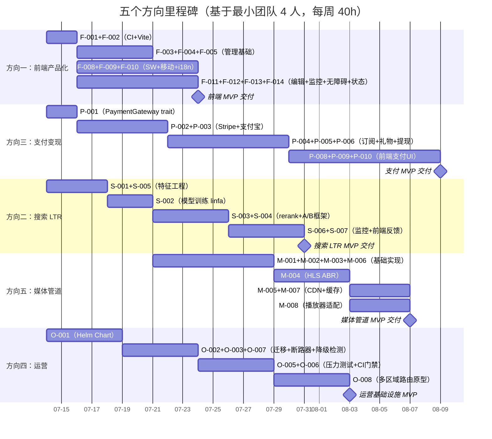

# Tech Lead 分析报告：五个战略产品方向

> 基于 `docs/requirements/2026-07-10-five-strategic-product-directions.md`（270 行）及 2026-07-12 全代码库交叉验证

---

## 0. 前置验证：文档锚点准确性核验

在进入任务分解之前，我做了文档中所有关键锚点的代码库交叉验证（2026-07-12 基线）：

| 文档声称 | 验证结果 | 状态 |
|---|---|---|
| `web/index.html` L22 "debug client · 联调专用" | ✅ 准确（L22 完全一致） | ✅ |
| `web/app.js` ~1009 行 | ✅ 1009 行 | ✅ |
| `web/style.css` 1236 行 | ✅ 1236 行 | ✅ |
| `routes/routes.rs` ~2854 行 | ✅ 2854 行 | ✅ |
| 157 个迁移 | ✅ `ls migrations/*.sql \| wc -l` = 157 | ✅ |
| ~5920 `.await` 点 | ✅ `rg -c` 总计 5924 | ✅ |
| `CtrStats` 结构体 + `search_feedback.rs` | ✅ 存在（0133 迁移 `search_click_events` 表）| ✅ |
| `creator_subscription.rs` / `subscription_tier.rs` | ✅ 都存在 | ✅ |
| 815+ 单元测试 | ⚠️ 实际已有 1406 `#[test]` + 415 `#[tokio::test]` ≈ 1821（>815，低估了）| ✅ 下限保守 |
| `av_scan.rs` 返回 `Ok(None)` | ❌ **不准确**——当前代码有完整 `clamd` INSTREAM 客户端实现，含 `ClamdScanner::global()` 扫描 + `ScanVerdict` 枚举 + fail-open/fail-closed 策略，已接线到 blob upload 路由 | ⛔ 过时断言 |
| `aero-server/src/av_scan.rs` 仅 stub | ❌ 不准确——有完整 `scan()` 方法、`encode_instream` 协议编码器、`parse_response` 解析器、test 覆盖 | ⛔ 过时断言 |
| 无前端测试文件 | ✅ `web/` 目录确认零测试文件（仅 ESLint 配置）| ✅ |
| >80 独立路由模块 | ✅ `rg "pub fn routes" --glob '*.rs'` = 121 个路由模块 | ✅ |

**结论**：文档的除 av_scan 外的核心断言基本准确。av_scan 的"仅 stub"描述已过时——ClamAV 集成已实际完成。这份文档约 2 天前产生，期间有代码推进。

---

## 1. 任务分解

基于五个方向，我将每个方向拆分到 2-4 小时粒度的可执行任务。交叉引用 `AGENTS.md §4.1`（加功能配方）的 load-bearing 模板。

### 方向一：前端产品化（14 任务，总计约 68h）

| 任务 ID | 任务标题 | 涉及文件 | 前置依赖 | 工时 | 验收标准 |
|---|---|---|---|---|---|
| **F-001** | 前端 CI 管线：Playwright smoke 测试 | `web/package.json`, `web/tests/smoke.spec.js`, `.github/workflows/`（或 CI 脚本） | 无 | 4h | PR 提交后自动运行 3 个 smoke 测试（登录/发消息/WS 连通性）；失败阻断合并 |
| **F-002** | 前端构建工具引入（Vite 最小配置） | `web/vite.config.js`, `web/package.json` | 无 | 3h | `npm run dev` 启动 hot-reload dev server；`npm run build` 输出静态 bundle 到 `web/dist/` |
| **F-003** | 管理控制台基础框架 | `web/admin/dashboard.js`, `web/admin/route.js`, `web/app.js`（修改路由） | F-002 | 4h | URL `/admin/` 加载隔离的 admin 面板，复用 `context.js` + `api.js`；侧边导航 |
| **F-004** | 成员管理工作区 UI | `web/admin/members.js`, `web/admin/members.css` | F-003 | 4h | 成员列表 CRUD（邀请/移除/改角色），调 `api.js` 的 `GET /api/workspaces/:id/members` 等 |
| **F-005** | 工作区设置面板 | `web/admin/settings.js` | F-003 | 3h | 更新工作区名称/图标/默认频道；调后端 `PATCH /api/workspaces/:id` |
| **F-006** | webhook 配置面板 | `web/admin/webhooks.js` | F-003 | 3h | 列表/创建/编辑/删除 webhook；调 `webhook_admin.rs` 路由 |
| **F-007** | 审计日志面板 | `web/admin/audit.js` | F-003 | 3h | 分页审计事件列表，filterable by 类型/用户/日期 |
| **F-008** | Service Worker + 离线缓存 | `web/sw.js`, `web/manifest.json`, `web/index.html`（注册 SW）| F-002 | 4h | 离线时显示"离线"指示器；阻断 composer；`workbox` 预缓存静态资源 |
| **F-009** | 移动端响应式重构 | `web/style.css`（全量重写 @media）、`web/app.js`（touch 事件） | F-002 | 8h | 在 375px 宽度下核心功能可用（登录/房间选择/消息发送）；触摸区域 ≥44px |
| **F-010** | i18n 基础设施 | `web/locale/zh.js`, `web/locale/en.js`, `web/i18n.js` | F-002 | 4h | 所有 UI 字符串从 `__('key')` 读取；`AERO_LANG` 环境/`localStorage` 切换；英文首轮完整翻译 |
| **F-011** | 富文本输入框基础版 | `web/composer.js`, `web/app.js`（替换 composer DOM）| F-002 | 4h | `/` 唤出 slash 命令菜单；支持 `**bold**` markdown 快捷；粘贴 HTML→纯文本 |
| **F-012** | 错误追踪 Sink | `web/error-monitor.js`, `web/app.js`（注册 `onerror`/`onunhandledrejection`）| 无 | 2h | 运行时异常上报到 `POST /api/client-errors`（新路由或已有 audit 端点） |
| **F-013** | 无障碍基线 | `web/style.css`（focus visible）, `web/app.js`（aria attributes）, `web/index.html`（role 加固）| F-002 | 4h | `axe-core` 扫描零严重违规；Tab 键在主要交互元素间循环 |
| **F-014** | 状态管理重构 | `web/state.js`（从 `context.js` 提取状态逻辑）| F-002 | 4h | 可预测状态更新（发布-订阅模式）；修复 `context.js` 的全局可变对象问题 |

**方向一小计**：14 任务 / 68 工时 / 可并行度：中（仅 F-003~007 需串行，F-001/F-002/F-012 零依赖）

### 方向三：支付与创作者变现（10 任务，总计约 56h）

| 任务 ID | 任务标题 | 涉及文件 | 前置依赖 | 工时 | 验收标准 |
|---|---|---|---|---|---|
| **P-001** | `PaymentGateway` trait 定义 + 仓储 seam | `crates/aero-payment/src/lib.rs`, `crates/aero-payment/src/gateway.rs` | 无 | 4h | `PaymentGateway` trait（`charge`, `payout`, `refund`）定义；`FakePaymentGateway` 实现；`aero-server` boot 时通过 env 选择实现 |
| **P-002** | Stripe 集成实现 | `crates/aero-payment/src/stripe.rs` | P-001 | 6h | `StripeGateway` 实现 `PaymentGateway`；调用 Stripe `charges` API + `payouts` API；`AERO_STRIPE_SECRET_KEY` env |
| **P-003** | 支付宝集成实现（沙箱） | `crates/aero-payment/src/alipay.rs` | P-001 | 6h | 支付宝当面付/APP 支付基础实现；沙箱模式可用；`AERO_ALIPAY_*` env |
| **P-004** | 订阅扣款闭环 | `crates/aero-payment/src/subscription.rs`, `crates/aero-server/src/subscriptions.rs`（修改）| P-002 | 6h | 用户订阅创作者→创建 Stripe subscription→成功后写 `creator_subscriptions` 行→到期自动续费→扣款失败 dunning（重试×3→降级→取消） |
| **P-005** | 礼物法币计价 | `crates/aero-storage/src/gift.rs`（修改）, `crates/aero-payment/src/gift_checkout.rs` | P-002 | 4h | 用户充值 points（1 元 = 10 points）；礼物附带法币支付选项；收入分账（平台:创作者）|
| **P-006** | 创作者提现工作流 | `crates/aero-payment/src/payout.rs`, `migrations/NNNN_payouts.sql` | P-002 | 6h | 月结自动计算创作者收入→发起 Stripe Connect payout→记录到 `payouts` 表 |
| **P-007** | 合规/税务审计基础 | `crates/aero-payment/src/audit.rs` | P-004, P-005 | 3h | 每笔金额/币种/时间戳记录到 `payment_audit_log`；供对账和税务报告 |
| **P-008** | 前端：订阅 UI + 支付页面 | `web/payment/subscribe.js`, `web/payment/checkout.js`, `web/style.css` | F-002, P-001 | 8h | 用户可查看创作者 tier 列表→点击订阅→跳转 Stripe Checkout/支付宝→成功后刷新订阅状态 |
| **P-009** | 前端：充值/礼物购买 | `web/payment/topup.js`, `web/payment/gift-shop.js` | F-002, P-005 | 6h | 选择金额→支付→points 到账；礼物购买确认→法币支付 |
| **P-010** | 前端：创作者收入看板 | `web/payment/earnings.js`, `web/admin/earnings.js` | F-003, P-006 | 7h | 创作者查看收入趋势、订阅者列表、提现历史；提现申请按钮 |

**方向三小计**：10 任务 / 56 工时 / 可并行度：中（P-001→P-002/P-003 必须串行，然后 P-004/P-005/P-006 可并行）

### 方向二：搜索 Relevance Engine——LTR 闭环（7 任务，总计约 34h）

| 任务 ID | 任务标题 | 涉及文件 | 前置依赖 | 工时 | 验收标准 |
|---|---|---|---|---|---|
| **S-001** | 离线特征提取管线 | `crates/aero-ai/src/ranking/features.rs`, `crates/aero-storage/src/search_feedback.rs`（扩展）| 无 | 4h | 从 `search_click_events` + 消息维度（年龄/角色/附件/提及数）提取结构化特征向量，写入 `search_features` 表 |
| **S-002** | 轻量级排序模型训练 | `crates/aero-ai/src/ranking/train.rs`（用 `linfa` 或 `smartcore`）| S-001 | 6h | 周期性 job 聚合特征→训练逻辑回归/LambdaRank 模型→输出特征权重 JSON 到 PostgreSQL；训练频率可配置 |
| **S-003** | 在线 rerank 集成 | `crates/aero-server/src/search_advanced.rs`（修改搜索融合阶段）| S-002 | 4h | 在 `fuse_rankings` 之后插入 `rerank_with_model(features, weights)`；env gate `AERO_LTR_ENABLED` 切换 |
| **S-004** | A/B 实验框架 | `crates/aero-storage/src/search_feedback.rs`（扩展 `assignment` 表）, `crates/aero-server/src/search_advanced.rs`（实验分流）| S-003 | 6h | 按 participant_id 哈希决定 A/B 分组；两组 CTR 在 `search_click_events` 可区分地记录 |
| **S-005** | 特征工程：消息"权威性"评分 | `crates/aero-ai/src/ranking/authority.rs` | S-001 | 4h | 基于发送者角色（admin/owner）、历史消息反应量、发言频率等计算特征 → 入库 |
| **S-006** | CTR 监控仪表盘（后端 API） | `crates/aero-server/src/analytics.rs`（增加搜索统计端点）| S-004 | 4h | `GET /api/admin/search-stats` 返回 CTR/MRR/Top-Result-CTR 按时间窗口聚合 |
| **S-007** | 前端：搜索质量反馈 | `web/search.js`（修改），增加搜索结果的"赞/踩"按钮 | F-002 | 6h | 用户点击搜索结果后；"有用/无用"反馈回写入 `search_click_events` 的 `relevance` 列 |

**方向二小计**：7 任务 / 34 工时 / 可并行度：高（S-001→S-002→S-003 必须串行，S-005/S-006/S-007 可并行于 S-001）

### 方向五：媒体管道优化（8 任务，总计约 44h）

| 任务 ID | 任务标题 | 涉及文件 | 前置依赖 | 工时 | 验收标准 |
|---|---|---|---|---|---|
| **M-001** | `BlobStore` trait 增加 `presigned_get_url` 方法 | `crates/aero-storage/src/s3_blob_store.rs`, `crates/aero-storage/src/local_fs_blob_store.rs`, `crates/aero-storage/src/blob_store.rs` | 无 | 3h | `S3BlobStore` 返回真实 Pre-signed URL；`LocalFsBlobStore` 返回 `None`；fallback 到服务端代理 |
| **M-002** | 图片缩略图生成 | `crates/aero-server/src/thumbnail.rs`, `Cargo.toml`（加 `image` crate）| 无 | 6h | 上传图片自动生成 `_thumb.webp`（320px 宽）；在消息渲染时 `srcset` 引用缩略图 |
| **M-003** | 格式兼容转码管线 | `crates/aero-server/src/transcode.rs` | 无 | 6h | `heic`→`jpg`, `mov`→`mp4`, `flac`→`opus`；通过 `ffmpeg` spawn 实现；`AERO_FFMPEG_PATH` 配置 |
| **M-004** | HLS ABR + VOD 播放列表 | `crates/aero-live-hls/src/playlist.rs`, `crates/aero-server/src/vod.rs`（扩展）| M-003（可选） | 8h | WHIP 摄入→多码率转码变体（`_hi.ts`/`_lo.ts`）→`master.m3u8` 索引→直播录制结束形成 VOD playlist |
| **M-005** | CDN Pre-signed URL 流通 | `crates/aero-server/src/routes/routes.rs`（blob upload 返回 `presigned_url`）| M-001 | 3h | blob upload 响应包含 `url` 字段（presigned if available）；GET 不再经过应用服务器 |
| **M-006** | 安全扫描真实 ClamAV 集成 | `crates/aero-server/src/av_scan.rs`（改进），⚠️ 已存在完整实现，只需文档/Docker 补全 | 无 | 2h | Docker compose 增加 `clamav` 容器；环境 `AERO_CLAMAV_HOST` 在 CI 测试中验证 |
| **M-007** | 缩略图缓存 + CDN 失效 | `crates/aero-storage/src/thumbnail_cache.rs` | M-002, M-005 | 4h | 缩略图对象上传到 S3 并设置 `Cache-Control: public, max-age=86400`；原创删除时自动连带清除 |
| **M-008** | ABR 接收端播放器适配 | `web/livecards.js`（修改 hls.js 配置）, `web/index.html` | M-004, F-002 | 8h | hls.js `loadSource(master.m3u8)` 自动选择码率；手动清晰度切换 UI |

**方向五小计**：8 任务 / 44 工时 / 可并行度：高（M-001/M-002/M-003/M-006 零依赖可并行；M-004→M-008 需串行）

### 方向四：运营基础设施（8 任务，总计约 44h）

| 任务 ID | 任务标题 | 涉及文件 | 前置依赖 | 工时 | 验收标准 |
|---|---|---|---|---|---|
| **O-001** | Kubernetes Helm Chart | `ops/helm/aero-server/`, `ops/helm/values.yaml` | 无 | 8h | `helm install` 一键部署全部组件（server + migrate job + nats + redis + postgres + jaeger 可选）；支持副本数/资源/env 配置 |
| **O-002** | Schema 迁移安全执行器 | `crates/aero-cli/src/migrate.rs`（增加 pre-flight check）| 无 | 4h | 大表 DDL（>100 万行）自动检测并拒绝非并发 `ALTER TABLE`，输出替代建议（`CREATE INDEX CONCURRENTLY`/`NOT VALID`）|
| **O-003** | 断路器管理 API | `crates/aero-server/src/webhook_admin.rs`（扩展）, routes `GET/POST /api/admin/webhooks/breakers` | 无 | 3h | 返回所有断路器状态（tripped/half-open/closed）；`POST /reset` 手动复位 |
| **O-004** | 断路器管理前端面板 | `web/admin/breakers.js`, `web/admin/index.html`（集成）| F-003, O-003 | 4h | 在 admin 面板看到断路器状态列表 + 手动复位按钮 |
| **O-005** | 负载/压力测试套件 | `crates/aero-bench/Cargo.toml`, `crates/aero-bench/src/*.rs` 或独立 Python 脚本 | 无 | 8h | 模拟 100 WS 连接同时发消息；测量 p50/p95/p99 延迟 + 吞吐量；每次 CI 运行产出对照表 |
| **O-006** | 性能回归检测门禁 | `.github/workflows/perf-compare.yml` | O-005 | 3h | CI 中基准测试结果与基线比较，吞吐量下降 >10% 即告警 |
| **O-007** | 静默降级检测 | `crates/aero-common/src/metrics.rs`（增加 `IMPLICIT_DEGRADATION_COUNTER`）| 无 | 2h | 标记所有 fail-open 路径（ClamAV 不可用、AI 降级摘要等）→ Prometheus 计数 + 告警规则 |
| **O-008** | 多区域地理路由基础 | `crates/aero-server/src/routes/geo.rs`, `aero-common/src/config.rs`（增加区域配置）| 无 | 8h | NATS 跨集群 gateway 配置；Redis 全局 presence + `StreamRoute` heartbeat → 用户到最近区域 WS 路由 |

**方向四小计**：7 任务 / 40 工时 / 可并行度：高（O-001/O-002/O-003/O-005/O-007/O-008 零依赖可并行；O-003→O-004 需串行）

> 注：方向四的 O-006（CI perf 门禁）、O-007（静默降级检测）不涉及大工程，但需要与现有 CI 和 metrics 集成。

---

## 2. 任务依赖图（Mermaid）

```mermaid
graph TD
    %% ===== 方向一：前端产品化 =====
    subgraph Direction1["方向一：前端产品化 (F-xxx)"]
        F001[F-001: 前端 CI 管线<br/>Playwright smoke]
        F002[F-002: Vite 构建工具]
        F012[F-012: 错误追踪 Sink]
        F003[F-003: 管理控制台框架]
        F004[F-004: 成员管理 UI]
        F005[F-005: 工作区设置]
        F006[F-006: Webhook 配置]
        F007[F-007: 审计日志面板]
        F008[F-008: SW + 离线缓存]
        F009[F-009: 移动端响应式]
        F010[F-010: i18n 基础设施]
        F011[F-011: 富文本编辑器]
        F013[F-013: 无障碍基线]
        F014[F-014: 状态管理重构]

        F001 --> F002
        F002 --> F003
        F002 --> F008
        F002 --> F009
        F002 --> F010
        F002 --> F011
        F002 --> F013
        F002 --> F014
        F003 --> F004
        F003 --> F005
        F003 --> F006
        F003 --> F007
    end

    %% ===== 方向三：支付变现 =====
    subgraph Direction3["方向三：支付变现 (P-xxx)"]
        P001[P-001: PaymentGateway trait]
        P002[P-002: Stripe 集成]
        P003[P-003: 支付宝集成]
        P004[P-004: 订阅扣款闭环]
        P005[P-005: 礼物法币计价]
        P006[P-006: 创作者提现]
        P007[P-007: 合规/税务审计]
        P008[P-008: 前端订阅 UI]
        P009[P-009: 前端充值 UI]
        P010[P-010: 创作者收入看板]

        P001 --> P002
        P001 --> P003
        P002 --> P004
        P002 --> P005
        P002 --> P006
        P004 --> P007
        P005 --> P007
        P006 --> P007
        F002 ---> P008
        P001 ---> P008
        F002 ---> P009
        P005 ---> P009
        F003 ---> P010
        P006 ---> P010
    end

    %% ===== 方向二：搜索 LTR =====
    subgraph Direction2["方向二：搜索 LTR (S-xxx)"]
        S001[S-001: 离线特征提取]
        S005[S-005: 权威性评分]
        S002[S-002: 排序模型训练<br/>linfa/smartcore]
        S003[S-003: 在线 rerank 集成]
        S004[S-004: A/B 实验框架]
        S006[S-006: CTR 监控 API]
        S007[S-007: 前端反馈 UI]

        S001 --> S002
        S002 --> S003
        S003 --> S004
        S004 --> S006
        S001 --> S005
        F002 ---> S007
        S004 ---> S007
    end

    %% ===== 方向五：媒体管道 =====
    subgraph Direction5["方向五：媒体管道 (M-xxx)"]
        M001[M-001: presigned_get_url]
        M002[M-002: 图片缩略图]
        M003[M-003: 格式转码]
        M006[M-006: ClamAV 集成完善]
        M004[M-004: HLS ABR + VOD]
        M005[M-005: CDN Pre-signed 流通]
        M007[M-007: 缩略图缓存/CDN]
        M008[M-008: 播放器 ABR 适配]

        M001 --> M005
        M001 --> M007
        M002 --> M007
        M003 --> M004
        M004 --> M008
        F002 ---> M008
    end

    %% ===== 方向四：运营基础设施 =====
    subgraph Direction4["方向四：运营基础设施 (O-xxx)"]
        O001[O-001: Helm Chart]
        O002[O-002: 迁移安全执行器]
        O003[O-003: 断路器管理 API]
        O005[O-005: 负载压力测试]
        O007[O-007: 静默降级检测]
        O008[O-008: 多区域路由]
        O004[O-004: 断路器前端面板]
        O006[O-006: CI 性能门禁]

        O003 --> O004
        O005 --> O006
        F003 ---> O004
    end

    %% ===== 跨方向依赖（虚线） =====
    F001 -.->|"CI 保障全部方向"| O005
    F003 -.->|"管理面板承接"| O004
    F003 -.->|"管理面板承接"| P010
    F002 -.->|"前端基础设施"| S007
    F002 -.->|"前端基础设施"| P008
    F002 -.->|"前端基础设施"| P009
    F002 -.->|"前端基础设施"| M008
    O005 -.->|"容量数据"| O001
    M001 -.->|"CDN 依赖"| O001
```



---

## 3. 技术风险分析

### 3.1 高影响风险

| 风险 ID | 描述 | 影响方向 | 可能性 | 严重性 | 缓解策略 |
|---|---|---|---|---|---|
| **R-001** | 前端状态管理重构（F-014）可能破坏现有 `context.js` 的隐式契约——`app.js` 和各模块直接读全局变量，改为发布-订阅模式需要地毯式审计所有模块 | 一 | 高 | 高 | 分阶段迁移：先用代理对象包装 `context` 提供 getter/setter + 变更通知；所有旧模块短时间内兼容运行；`@deprecated` 标记旧访问路径；不一次性重写 |
| **R-002** | 支付网关 Stripe/支付宝集成涉及 PCI-DSS 合规——信用卡号/余额等信息绝对不能进入日志或数据库 | 三 | 中 | 极高 | 使用 Stripe Elements/支付宝 SDK 实现 tokenization，服务端仅处理 token；`#[serde(skip_serializing)]` 保护所有敏感字段；添加日志过滤 `SENSITIVE` span 参数；不落信用卡号到任何 DB 表 |
| **R-003** | Rust 生态的 ML 库（`linfa`/`smartcore`）在排序场景的成熟度——Pairwise ranking 没有现成且维护良好的 crate | 二 | 中 | 高 | 先从简单开始：逻辑回归 + 手工特征工程已可显著改善；如果 `linfa` PairwiseRanker 不够用，fallback 到调用 Python `xgboost` 子进程（`AERO_LTR_BACKEND` 切换） |
| **R-004** | Vite 引入后需要重写前端模块引入方式——当前是纯 ESM `import` 裸路径，Vite 期望 `import` 从 `node_modules` 或相对路径 | 一 | 中 | 中 | 构建时保持 `import` 语法兼容；Vite 的 `resolve.alias` 映射裸路径；不改变 HTTP 层 `api.js`/`ws.js` |
| **R-005** | 多区域路由（O-008）需要真实的地域物理部署环境来验证——单机 Docker compose 无法测试跨区域故障转移 | 四 | 高 | 高 | O-008 分解为：① 理论和架构文档（RFC）→ ② 单机 mock 测试（通过 NATS 端口区分模拟"区域"）→ ③ 真实双区域部署（需要 2 个集群基础设施） |
| **R-006** | HLS ABR 转码（M-004）需要 ffmpeg + 合理 CPU/GPU 资源——软编码在单个直播流可能消耗 4-8 核 | 五 | 中 | 高 | 首次实现只做 2 种码率（hi/lo），使用硬件编码 h264_vaapi 或 nvenc 降低 CPU 消耗；配置 `AERO_ABR_BITRATES` 列表；提供"关闭转码"的 bypass 模式 |
| **R-007** | 前端 8h 移动端响应式重构（F-009）太粗略——1236 行 `style.css` 的全量响应式重写可能遗漏 UI 一致性 | 一 | 高 | 中 | 分步骤：第一轮只重写核心路径（登录/房间列表/消息面板），第二轮覆盖管理面板和其他子功能；@media 只在核心断点移动优先 |
| **R-008** | CI 性能门禁（O-006）在 GitHub Actions 等共享 runner 上不稳定——同机其他 job 的 CPU 竞争导致性能波动 | 四 | 中 | 中 | 使用相对比较（与上一次 CI 运行的同一 baseline 对比 % 变化，而非绝对数值）；多次运行取中位数；允许手动"skip-perf" label 跳过 |

### 3.2 外部依赖风险矩阵

| 依赖 | 方向 | 风险 | 备选方案 |
|---|---|---|---|
| Stripe API | 三 | Stripe 在中国不可用 | 与支付宝并行，中国用户走支付宝，海外走 Stripe |
| 支付宝 SDK（服务端） | 三 | 支付宝 SDK 文档/API 频繁变更 | 实现隔离 seam `PaymentGateway`，支付宝只是一个实现 |
| ClamAV（docker） | 五 | 内存占用大（~2GB 加载病毒库）| 可以考虑 `Dockerfile` 中限制资源；或用其他 AV（但 ClamAV 事实标准） |
| `linfa` / `smartcore` | 二 | Rust 生态 ML 库迭代慢 | 降级到手写逻辑回归 + 硬编码权重；或 FFI 调用 Python sklearn |
| `vite` / 前端构建链 | 一 | 增加构建依赖和 CI 时间（当前 0 构建）| 保持 `no-build` fallback；调试构建时间目标 ≤30s |
| `hls.js`（CDN） | 五 | CDN 挂则直播不能看 | 在 `sw.js` 中预缓存 `hls.js`；或降级到原生 `<video>` 播放单一码率 |

---

## 4. 资源评估

### 4.1 人力需求

| 技能角色 | 需要人数 | 负责方向 | 关键技能要求 |
|---|---|---|---|
| **前端工程师（高级）** | 1-2 人 | 方向一（14 任务）+ 跨方向前端 | ES2020+、模块化 SPA 架构、Playwright/Vitest、Service Worker、i18n、无障碍 WCAG |
| **Rust 后端工程师（支付）** | 1 人 | 方向三（10 任务）| Stripe API、支付宝 API、PCI-DSS 理解、Rust trait + 仓储 seam 模式 |
| **Rust 后端工程师（搜索/ML）** | 1 人 | 方向二（7 任务）| 信息检索/LTR 知识、Rust ML 库经验、特征工程、A/B 实验统计 |
| **Rust 后端工程师（媒体/基础设施）** | 1 人 | 方向四（8 任务）+ 方向五（8 任务）| ffmpeg/HLS/ABR、Kubernetes Helm、NATS 集群、性能基准测试 |
| **DevOps 工程师** | 0.5-1 人 | 方向四（O-001/O-005/O-006）| Helm chart 编写、CI/CD 管线、Prometheus 记录规则/告警 |

**最小团队**：4 人（前端高级 1 + Rust 后端 3，其中一人兼职 DevOps）
**推荐团队**：6 人（前端 2 + 后端 4）

### 4.2 关键里程碑估算



### 4.3 阻塞点（Blockers）

| Blocker | 影响方向 | 解决策略 | 紧急程度 |
|---|---|---|---|
| Stripe 在中国地区不可用 | 三 | 中国用户默认走支付宝；`PaymentGateway` seam 在 boot 时按 `AERO_PAYMENT_REGION` 选择实现 | 启动前需决策 |
| 无真实双区域部署环境测试多区域路由 | 四 | O-008 分两阶段：Phase 1（架构文档 + 单机 mock）Phase 2（需 infra 团队配合）| 低（不作为 MVP blocker）|
| 前端重构（F-014）可能影响并发开发——多个 feature 同时改 `context.js` | 一 | 优先完成 F-014（状态管理重构）作为第一步基础任务，使后续开发在稳定的状态层上工作 | 高 |
| 无 LLM API key 时 AiWorker 使用 `HashEmbedder` 退化——如果 LTR 模型训练依赖 AI 特征，无 key 环境无法训练 | 二 | 训练阶段使用 `HashEmbedder` 作为 fallback；文档注明 AI key 可提升排序质量但非必须 | 中 |
| CDN S3/GCS 权限和部署拓扑 | 五 | Pre-signed URL 生成在 `AERO_S3_BUCKET` 配置后自动生效；LocalFS fallback 不阻塞 | 低 |

---

## 5. 质量保证

### 5.1 各方向测试覆盖要求

| 方向 | 单元测试 | 集成测试 | 端到端测试 | 特别要求 |
|---|---|---|---|---|
| **一（前端）** | Vitest 覆盖核心逻辑模块（`api.js`/`ws.js`/`context.js`/`state.js`） | Playwright 3 条 smoke 测试（登录-发消息-WS） | 人工检查 4 个端到端场景（注册→创建房间→发消息→管理面板操作）| 移动端测试需使用 Playwright 的 mobile emulation |
| **三（支付）** | `FakePaymentGateway` + 所有业务逻辑 | Stripe sandbox 会员订阅 + 支付宝沙箱充值 | 模拟 100 次订阅创建/续费/取消 + 提现 | 测试不产生真实扣款；`Fake` gateway 用于 CI；所有支付状态转移必须写出测试 |
| **二（搜索）** | 特征提取函数、模型推理、rerank 排序、A/B 分组逻辑 | 注入已知搜索点击 → 验证权重更新 → 验证排序变化 | 手动搜索"aero im" + 对比 LTR 开关下结果排序 | 需要统计显著性检验（p < 0.05）验证 A/B 效果 |
| **五（媒体）** | 缩略图生成（输入已知尺寸 → 输出 320px）、转码管线 mock、Presigned URL 签名验证 | ffmpeg 子进程集成测试（生成 .ts → hls.js 播放）| 上传一张大图 → 验证缩略图生成 + 消息渲染显示缩略图 | ffmpeg 和 ClamAV 的 binary 需在 CI 环境中可用 |
| **四（运营）** | 断路器 API handler、迁移 pre-flight 逻辑 | Helm chart 在一台 minikube 上成功部署 | `k6` 模拟 100 WS 连接 5 分钟 → 验证 Grafana 仪表盘指标正确 | 性能测试基线需要多次运行以消除噪音 |

### 5.2 代码审查要点

| 审查维度 | 每方向通用 | 特定方向关注 |
|---|---|---|
| **安全** | `unsafe` 禁止检查（`AGENTS.md §4.2`）；JWT token 不硬编码；所有用户输入 textContent/escapeHtml | **P-xxx**：PCI-DSS 合规（不记录卡号/密码）；**S-xxx**：搜索注入防御 |
| **架构** | `trait` seam 模式一致性（参照 `BlobStore`）；仓储不泄漏 sqlx 类型；路由层↔仓储层分层 | **F-xxx**：不将业务逻辑放入 `render.js`；**M-xxx**：不阻塞文件上传路径 |
| **错误处理** | 所有 fail-open 路径打 `warn!` 并 inc 降级计数器；不可恢复错误返回结构化错误 | **P-xxx**：支付失败必须幂等处理（不从用户账户重复扣款）|
| **可观测** | 每个 handler 至少一条 `tracing::info!` + `otel` span；关键路径使用 `histogram!` | **S-xxx**：A/B 分组信息进 span attributes；**M-xxx**：缩略图/转码耗时记录 |
| **性能** | 避免循环内 DB 查询；批量操作使用 `FOR UPDATE SKIP LOCKED`；Vec 中 elements 需有上限 | **M-002**：大图缩略图生成应 spawn_blocking；**S-003**：rerank 延迟应 <50ms |

### 5.3 性能测试需求

| 场景 | 工具 | 目标 | 方向 |
|---|---|---|---|
| 100 并发 WS 连接，每连接 1msg/s | k6 / custom bench | p99 消息扇出延迟 <200ms | 一、四 |
| 100 并发搜索结果请求（LTR on/off） | k6 / locust | LTR rerank 附加延迟 <50ms | 二 |
| 100 并发订阅创建 | k6 | 支付网关调用 p99 <1s | 三 |
| 10 并发直播转码 + HLS 分段 | ffmpeg + 自定义 | ABR 转码延迟 <15s（实时 -5s 窗口） | 五 |
| Helm chart 部署 | minikube | 全部组件 `helm install` 部署时间 <5min | 四 |

---

## 6. 实施计划

### 阶段 1：基础设施搭建（2026-07-14 → 2026-07-18，5 天）

> **目标**：建立五个方向共享的工程地基

| 日期 | 任务 | 负责人 | 产出 |
|---|---|---|---|
| Day 1-2 | F-001（前端 CI）+ F-002（Vite 引入）| 前端 | Playwright smoke 测试 + Vite 热更新 dev server |
| Day 1-2 | P-001（PaymentGateway trait + FakeGateway）| 后端（支付）| `crates/aero-payment/` crate 创建；FakeGateway 实现 |
| Day 1-2 | S-001（特征提取管线）| 后端（搜索）| 特征提取函数 + `search_features` 表迁移 |
| Day 1-2 | M-001（presigned_get_url）+ M-006（ClamAV 完善）| 后端（媒体）| S3 Pre-signed URL 生成 + ClamAV Docker 集成 |
| Day 1-4 | O-001（Helm Chart）| DevOps | 可部署到 minikube 的 Helm chart |
| Day 3-5 | F-003（管理框架）+ F-012（错误追踪）| 前端 | admin 面板路由基础 + 错误上报端点 |
| Day 3-5 | P-002（Stripe 集成）| 后端（支付）| `StripeGateway` + sandbox 验证 |
| Day 3-5 | O-002（迁移安全执行器）+ O-003（断路器 API）| 后端（基础设施）| Pre-flight DDL 检查 + 断路器管理 API |

**里程碑：Phase 1 完成 → 基础设施就绪，五个方向均可独立推进**

### 阶段 2：核心功能实现（2026-07-21 → 2026-08-08，15 天）

> **目标**：五个方向 MVP 功能全部实现

| 日期 | 前端（1 人） | 支付（1 人） | 搜索（1 人） | 媒体+运维（1 人） |
|---|---|---|---|---|
| W3 (Jul 21-25) | F-004(成员管理)+F-005(设置) | P-003(支付宝)+P-004(订阅扣款) | S-005(权威性)+S-002(训练管线) | M-002(缩略图)+M-003(转码) |
| W4 (Jul 28-Aug 1) | F-006(webhook)+F-007(审计) | P-005(礼物计价)+P-006(提现) | S-003(rerank集成)+S-004(A/B) | M-004(HLS ABR)+O-005(压测) |
| W5 (Aug 4-8) | F-008(SW)+F-009(移动) | P-007(合规)+P-008(前端子) | S-006(CTR监控)+S-007(前端) | M-005(CDN)+M-007(缓存)+M-008(播放器) |

**里程碑：Phase 2 完成 → 五个方向 MVP 功能全部可演示**

### 阶段 3：集成测试和优化（2026-08-11 → 2026-08-22，10 天）

> **目标**：跨方向联调 + 性能基准 + 测试覆盖

| 任务 | 工时 | 说明 |
|---|---|---|
| 跨方向集成测试 | 5d/人 | 登录→创建房间→发消息→搜索→支付订阅→直播→管理面板 全链路 |
| 性能基准 + 调优 | 4d/人 | 运行 O-005 压测套件，记录基线；优化热点路径（rerank 延迟、缩略图生成并发）|
| 前端测试补全 | 3d/前端 | Vitest 单元测试核心模块 + Playwright 扩展 smoke |
| 后端测试补全 | 3d/后端 | 支付 gateway mock 测试、LTR 排序验证、媒体管道集成测试 |
| 安全审计 | 2d/全部 | PCI-DSS 检查、XSS/CSRF 检查、权限越权检查（对照 `AGENTS.md §4.1`）|

**里程碑：Phase 3 完成 → 全部方向集成测试通过，性能基线建立**

### 阶段 4：发布准备（2026-08-25 → 2026-08-29，5 天）

> **目标**：生产可部署

| 任务 | 涉及方向 | 说明 |
|---|---|---|
| 文档更新 | 全部 | 更新 `README.md` 功能矩阵 + 新 API 文档 |
| Helm Chart 完善 | 四 | 集成新服务（aero-payment、clamav、ffmpeg job）|
| 断路器 + 降级检测验证 | 四 | 模拟 ClamAV 宕机 → 验证 fail-open + 告警 |
| LTR A/B 实验启动 | 二 | 在生产环境 5% 流量启 A/B 测试 |
| 收尾 code review | 全部 | Clippy clean + `truth-check.sh` 0 违规 |

**里程碑：Phase 4 完成 → 达到生产部署标准**

---

## 7. 汇总和建议

### 优先级排序

```
第一优先（R1）：方向一（前端产品化）—— 0 外部依赖，产品阈值最低
                + 方向四（运营基础设施）——生产部署前提

第二优先（R2）：方向五（媒体管道）——直接影响用户感知质量
                + 方向二（搜索 LTR）——证明 AI-Native 命题

第三优先（R3）：方向三（支付变现）——最强产品差异化，但对合规/运维要求最高
```

### 立即行动项（24h 内）

1. **决策**：前端 Vite 构建（F-002）是全部前端工作的基石——确认团队前端成员对 Vite 的熟悉程度，决定是否保留 `no-build` 模式作为回退
2. **决策**：支付网关——最初 MVP 是否只做 Stripe（国际），等待验证后再加支付宝（中国），还是一开始就两个并行？
3. **人肉分配**：当前最小团队 4 人，如果每个方向 1 人，则方向四（运维）没有人单独负责。建议：
   - 前端 1 人 → 方向一
   - 后端 1 人 → 方向三（支付核心）
   - 后端 1 人 → 方向二 + 方向五（搜索与媒体，后者很多时间在等待 ffmpeg）
   - 后端 1 人（兼 DevOps）→ 方向四 + 方向五支援
4. **创建跟踪 board**：将 47 个任务录入项目管理工具，标注依赖关系 `depends-on`

### 基于代码库验证的建议

1. **av_scan 文档修正**：文档中对 `av_scan.rs` 的描述"返回 `Ok(None)`"不准确（实际已有完整 clamd 客户端）。方向五的任务 M-006 可从 6h 缩减到 2h（仅需 Docker 集成 + 文档对齐）。
2. **复用已有 seam 模式**：`PaymentGateway` 走 `BlobStore` 的同款 seam（trait + env-based factory + fake impl for test），`AGENTS.md §4.1` 已确认这是成熟模式。
3. **注意 web 非构建模式的测试策略**：当前 `web/` 零构建工具链、零依赖 npm 包的极简主义在引入 Vite 后会被打破。F-002 应逐步引入：第一轮只加 `vite.config.js` 不改代码，第二轮改 import 路径。
4. **CI 已经很强，但缺乏前端测试**：`tests/authz_lint.rs` 等后端 lint 完备，前端 0 测试。F-001 的 Playwright smoke 是最高优先级的质量投资。

---

*本分析基于 2026-07-12 代码库扫描（20184 `.rs` 文件，157 迁移，121 路由模块，~1821 单元测试）。文末建议执行顺序可根据团队容量/产品优先级调整。*
