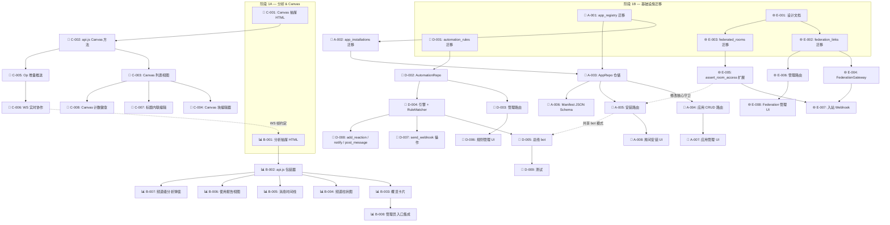

现在我有了对代码基的全面理解。以下是我的 Tech Lead 分析。

---

# Tech Lead 分析：5 个已验证的功能缺口

> **背景**：一个深度代码验证确定了 Aero IM 当前 master 中的 5 个缺口（App 平台、产品分析、Canvas 客户端、消息生命周期自动化、跨工作区联邦）。后端基础设施存在 3/5（分析、Canvas、Block Kit），但 Web SPA 中为零 UI。第 1 和第 4 个缺口根本没有数据模型。此分析按照 `AGENTS.md` §4.1 的“功能添加配方”运作。

---

## 1. 任务分解

### 1.1 任务清单

#### 方向①：App 平台（App 注册表 / Manifest / 安装流程）

| ID | 任务 | 文件 | 前置依赖 | 工时 | 验收标准 |
|----|------|------|----------|------|---------|
| A-001 | 迁移：`app_registry` 表（`id, workspace_id, name, description, manifest(JSONB), oauth_redirect_uris, bot_user_id, enabled, created_at`） | `migrations/NNNN_app_registry.sql` | 无 | 2h | `cargo build` 编译；迁移幂等；`define_id!(AppId)` in `common/src/ids.rs` |
| A-002 | 迁移：`app_installations` 表（`id, app_id, workspace_id, room_id, installed_by, auth_token_hash, config(JSONB), created_at`） | `migrations/NNNN_app_installations.sql` | A-001 | 2h | 迁移运行；外键指向 `app_registry` |
| A-003 | 仓储：`AppRepo`（CRUD app + 安装 + 列表按工作区/房间） | `crates/aero-storage/src/app_registry.rs` | A-001, A-002 | 3h | `AppRepo::new(pool)` 编译；`db_tests #[ignore]` 通过基本 CRUD |
| A-004 | 服务器：应用 CRUD 路由（`POST/GET/PUT/DELETE /api/workspaces/:id/apps`） | `crates/aero-server/src/app_registry.rs` | A-003 | 3h | 路由基于 `assert_room_access`；只有工作区 admin 可以创建/删除应用；`cargo check` |
| A-005 | 服务器：安装路由（`POST/DELETE /api/rooms/:id/install-app`） | `crates/aero-server/src/app_installations.rs` | A-004 | 3h | 安装创建 bot 参与者；`RoomEvent::AppInstalled` 广播；幂等安装 |
| A-006 | 服务器：App Manifest JSON Schema 验证（在创建时验证 `manifest` 字段） | `crates/aero-server/src/app_manifest.rs` | A-004 | 4h | 拒绝格式错误的 manifest（缺少 display_name、permissions、slash_commands）；有测试 |
| A-007 | Web UI：工作区管理中的 App 管理页面 | `web/app_admin.js`, `web/index.html`（#drawer-app-admin） | A-004 | 4h | 列出应用；表单创建/编辑；删除确认 |
| A-008 | Web UI：房间级别的 App 安装按钮 + 已安装列表 | `web/app_install.js`, `web/index.html` | A-005, A-007 | 3h | 用户可以从房间标题安装/卸载应用；显示已安装的应用 |

**方向① 总计：24 小时（3 人·天）**

#### 方向②：产品分析（Web UI 用于现有 API）

| ID | 任务 | 文件 | 前置依赖 | 工时 | 验收标准 |
|----|------|------|----------|------|---------|
| B-001 | Web UI：分析仪表盘 HTML 骨架（分析抽屉/页面） | `web/index.html` (新增 #drawer-analytics) | 无 | 2h | 抽屉从房间标题按钮打开；有 Chart.js CDN |
| B-002 | Web UI：分析数据获取层（`api.js` 中的 API 包装器） | `web/api.js` — `api.workspaceAnalytics()`, `api.channelAnalytics()`, `api.usageReport()` | B-001 | 2h | 方法解析已存在的 API 端点并返回 JSON |
| B-003 | Web UI：概览卡片组件（总消息数、成员数、活跃用户数、7 天活跃度） | `web/analytics.js` — `renderOverviewCard(data)` | B-002 | 3h | 卡片显示可读数字；加载时显示骨架；错误时优雅回退 |
| B-004 | Web UI：柱状图“最活跃频道”排名 | `web/analytics.js` — `renderTopChannelsChart(data)` | B-002 | 3h | 使用 Chart.js 的柱状图前 10 频道；响应式 |
| B-005 | Web UI：折线图每日消息时间线（过去 30 天） | `web/analytics.js` — `renderTimelineChart(data)` | B-002 | 3h | 可缩放的折线图；工具提示显示数据点 |
| B-006 | Web UI：使用情况报告视图（AI token、blob 存储、成员计数） | `web/analytics.js` — `renderUsageReport(data)` | B-002 | 3h | AI token 饼图；存储计量条；表格视图 |
| B-007 | Web UI：频道级分析弹出窗口（从频道列表触发） | `web/analytics.js` — `showChannelAnalytics(roomId)` | B-003, B-004 | 3h | 点击频道名称会显示该频道的分析 |
| B-008 | Web UI：管理员入口 + 路由集成（入口点放在工作区的 admin 区域） | `web/chrome.js`, `web/app.js` | B-003 | 2h | 对于 admin 角色可见的按钮；非 admin 隐藏 |

**方向② 总计：21 小时（2.6 人·天）**

#### 方向③：Canvas 客户端（Web SPA 的 Canvas UI）

| ID | 任务 | 文件 | 前置依赖 | 工时 | 验收标准 |
|----|------|------|----------|------|---------|
| C-001 | Web UI：Canvas 抽屉 HTML（从房间标题打开） | `web/index.html` (新增 #drawer-canvas 包含标题输入 + block 编辑器区域 + 操作工具栏) | 无 | 2h | 抽屉正确打开/关闭；具有编辑区域的基本布局 |
| C-002 | Web UI：Canvas API 包装器（`api.js` 中的 CRUD 方法） | `web/api.js` — `api.createCanvas()`, `api.getCanvas()`, `api.updateCanvas()`, `api.deleteCanvas()`, `api.listCanvases()`, `api.listCanvasOps()` | C-001 | 2h | 所有 6 个方法调用现有后端路由 |
| C-003 | Web UI：Canvas 列表视图（房间中的画布选择器 + 缩略图） | `web/canvas.js` — `renderCanvasList(canvases)` | C-002 | 3h | 显示标题；点击加载画布；最后修改排序 |
| C-004 | Web UI：Canvas 编辑渲染器（将 `blocks: JSON` 转换为可编辑的 DOM） | `web/canvas.js` — `renderCanvasBody(blocks, editable)` | C-002 | 5h | 渲染文本块、标题、图片、待办事项列表作为可编辑元素；输入处理 |
| C-005 | Web UI：Canvas 操作增量（追加 Op → POST /api/canvases/:cid/ops） | `web/canvas.js` — `pushOp(type, payload)` | C-002 | 4h | 每个编辑都会向 Op 日志推送一个 Op；Op 类型与 `CanvasOpRepo` 对齐 |
| C-006 | Web UI：实时 Canvas 协作（通过房间 namepsace 的 WS 帧） | `web/ws.js`, `web/canvas.js` — 在 `liveCanvas` 帧类型上调用 `applyRemoteOp` | C-005 | 3h | 远程编辑在 ≤500ms 后出现在本地视图中（通过 WS 总线） |
| C-007 | Web UI：Canvas 标题内联编辑 + 自动保存 | `web/canvas.js` | C-004 | 2h | 标题输入在失焦时自动保存；显示保存状态指示器 |
| C-008 | Web UI：房间标题中的 Canvas 计数徽章 | `web/app.js` — `refreshCanvasBadge()` | C-003 | 1h | 带有画布的房间看到徽章（例如，“📄 3”） |

**方向③ 总计：22 小时（2.75 人·天）**

#### 方向④：消息生命周期自动化（规则引擎）

| ID | 任务 | 文件 | 前置依赖 | 工时 | 验收标准 |
|----|------|------|----------|------|---------|
| D-001 | 迁移：`automation_rules` 表（`id, workspace_id, name, trigger JSONB, actions JSONB, enabled, created_at, updated_at`） | `migrations/NNNN_automation_rules.sql` | 无 | 2h | 迁移运行；触发器和操作是 JSONB |
| D-002 | 仓储：`AutomationRepo`（CRUD 规则 + `find_matching(trigger_type, context)`） | `crates/aero-storage/src/automation.rs` | D-001 | 4h | 按工作区/启用查找；`FOR UPDATE` 锁定；支持分页 |
| D-003 | 服务器：自动化规则管理路由（admin CRUD） | `crates/aero-server/src/automation.rs` | D-002 | 3h | 工作区 admin 可以创建/编辑/启用/禁用/删除规则 |
| D-004 | 核心引擎：`AutomationEngine` trait + `RuleMatcher`（receive → trigger 匹配 → 操作执行） | `crates/aero-im-core/src/automation/engine.rs` | D-002 | 6h | 匹配“message_contains”触发器；执行“add_reaction”和“send_message”操作；有测试 |
| D-005 | 总线钩子：在 `agent_bot` 旁边添加 `automation_bot`（在 `im.room.*` 上消费 Message 事件） | `crates/aero-server/src/bin/boot/automation_bot.rs` | D-004 | 4h | 在 bot 启动时挂载到 `background.rs`；将消息分派到 `AutomationEngine` |
| D-066 | Web UI：自动化规则管理页面（admin 设置中的表格 + 表单） | `web/automation_admin.js`, `web/index.html` | D-003 | 5h | 可以创建“如果消息包含 X → 添加反应 ✅”；规则列表；在保存时启用 |
| D-007 | 操作实现：`send_webhook` 操作（出站 webhook 调用） | `crates/aero-im-core/src/automation/actions/webhook.rs` | D-004 | 3h | 对目标 URL 进行 POST 调用，负载为 `{event, workspace, rule}` |
| D-008 | 操作实现：`add_reaction` + `notify_channel` + `post_message` 操作 | `crates/aero-im-core/src/automation/actions/` | D-004 | 5h | 所有 3 个操作都经过测试；post_message 遵循 `assert_room_access` |
| D-009 | 测试：`AutomationEngine` 单元测试 + 集成测试（规则匹配 + 操作执行） | `tests/automation/` | D-005 | 4h | 测试覆盖：消息触发、正则匹配、空动作、已禁用的规则、并发安全 |

**方向④ 总计：36 小时（4.5 人·天）**

#### 方向⑤：跨工作区 Federation（策略设计 + 最小实现）

| ID | 任务 | 文件 | 前置依赖 | 工时 | 验收标准 |
|----|------|------|----------|------|---------|
| E-001 | 设计文档：Federation 模型（共享房间、外部参与者、网络拓扑） | `docs/design/federation-model.md` | 无 | 4h | 文档涵盖：共享房间与镜像房间；成员资格传播；事件路由；信任模型 |
| E-002 | 迁移：`federation_links` 表（`id, local_workspace_id, remote_host, remote_workspace_id, shared_secret_hash, enabled`） | `migrations/NNNN_federation_links.sql` | E-001 | 2h | 存储远程连接凭证；工作区隔离 |
| E-003 | 迁移：`federated_rooms` 表（`id, local_room_id, remote_room_id, link_id, sync_direction`） | `migrations/NNNN_federated_rooms.sql` | E-002 | 2h | 将本地房间链接到远程房间 |
| E-004 | 核心：`FederationGateway`（出站事件转发到远程主机 + 入站事件接收） | `crates/aero-im-core/src/federation/gateway.rs` | E-002 | 8h | 通过 HTTPS + 共享密钥将序列化的 `RoomEvent` 转发到远程主机；处理重试 + 背压 |
| E-005 | 核心：`assert_room_access` 扩展以允许外部参与者 | `crates/aero-im-core/src/service/events.rs` — 修改 `assert_room_access` | E-003, E-004 | 6h | 联邦房间中的外部参与者可以通过；非联邦房间不能 |
| E-006 | 服务器：Federation 管理路由（创建/列出/删除链接） | `crates/aero-server/src/federation.rs` | E-003, E-004 | 4h | 工作区 admin 可以创建 federation 链接；秘密密钥生成；测试连接 |
| E-007 | 入站 Webhook：`POST /api/internal/federation/events`（秘密门控入口点） | `crates/aero-server/src/federation_ingress.rs` | E-004 | 4h | 使用共享秘密验证；解码并扇出到本地房间；404 如果未知房间 |
| E-008 | Web UI：Federation 管理 UI（工作区设置中的链接页面） | `web/federation_admin.js`, `web/index.html` | E-006 | 4h | 创建/删除链接；显示状态；测试连接按钮 |

**方向⑤ 总计：34 小时（4.25 人·天）**

---

### 1.2 工作估算汇总

| 方向 | 任务 | 总工时 | 人·天（8h） | 风险等级 |
|------|------|--------|-------------|---------|
| ① App 平台 | A-001 到 A-008 | 24h | 3.0 | 中 |
| ② 产品分析 | B-001 到 B-008 | 21h | 2.6 | 低 |
| ③ Canvas 客户端 | C-001 到 C-008 | 22h | 2.75 | 中 |
| ④ 消息自动化 | D-001 到 D-009 | 36h | 4.5 | 高 |
| ⑤ 跨工作区 Federation | E-001 到 E-008 | 34h | 4.25 | 高 |
| **总计** | **39** | **137h** | **17.1** | |

---

## 2. 执行顺序

### 2.1 依赖图



### 2.2 并行轨道

基于依赖图，工作可以分为 **4 个并行轨道**：

| 轨道 | 内容 | 所需开发人员 | 估计持续时间 |
|------|------|-------------|-------------|
| **轨道 1（快赢）** | 方向② 所有 + 方向③ 所有 | 1 名前端（熟练 JS/Chart.js） | 5 天 |
| **轨道 2（中等）** | 方向① 所有 | 1 名全栈（Rust + JS） | 5 天 |
| **轨道 3（高风险）** | 方向④ 所有 | 1 名资深后端（Rust，有状态系统） | 7 天 |
| **轨道 4（高风险）** | 方向⑤ 所有 | 1 名资深后端（Rust，网络/安全） | 7 天 + 设计阶段 |

---

## 3. 技术风险

### 3.1 风险矩阵

| # | 风险 | 方向 | 可能性 | 影响 | 缓解措施 |
|---|------|------|--------|------|---------|
| R1 | Canvas CRDT 操作类型未与前端模型对齐 | ③ | 中 | 高 | 在开始 UI 之前审计 `canvas_op.rs` 中的 Op 类型变体；为 Op 类型创建共享的 TypeScript/JSDoc 类型 |
| R2 | 自动化规则引擎的并发安全（竞争条件：同时触发） | ④ | 中 | 高 | 在 `select ... FOR UPDATE` 锁下使用 `AutomationRepo::claim`；对每个房间的 `message_contains` 使用 Redis 分布式锁作为前缀 |
| R3 | 联邦未加密事件数据（共享秘密是唯一的真实性来源） | ⑤ | 高 | 高 | 所有事件在传输前使用 `chacha20poly1305` 加密；秘密轮换流程 |
| R4 | 分析查询在具有 500K+ 条消息的工作区导致 PG 高负载 | ② | 低 | 中 | 添加 `ANALYZE`-gate（对非 admin 自动超时 5s）；为 `rooms.workspace_id` 添加部分索引；API 响应缓存 60 秒 |
| R5 | App Manifest JSON Schema 随着新功能而膨胀（无版本控制） | ① | 中 | 低 | 在 Manifest 中使用 `api_version: SemVer` 字段；通过 `app_manifest_v1` 模块实现版本路由 |
| R6 | Canvas 实时协作中的编辑冲突（服务器端的 OT/CRDT 非常少） | ③ | 高 | 中 | 获取时使用乐观并发（`version` 列已存在）；合并策略 = 最后一个写入者获胜，“通知”用户冲突 |
| R7 | `assert_room_access` 改造以支持外部参与者可能破坏现有守卫 | ⑤ | 中 | 关键 | 添加一个 `FederationGate` 参数，默认为 false（无行为变化）；以特性标志方式引入 |

### 3.2 关键阻塞点

1. **Canvas Op 类型对齐**（C-005 的阻塞点）：在开始 UI 之前读取 `aero-storage/src/canvas_op.rs`。如果操作类型是字节不透明或仅限服务器，则 UI 需要一个新的简化操作模型。

2. **联邦接入端口选择**（E-004 的阻塞点）：每个 Aero 实例是否打开一个单独的 HTTP 端口用于联邦流量，还是通过主 API 端口复用？端口复用意味着为联邦入口点添加路径前缀（`/api/internal/federation/*`，类似 `call-bridge`），这已经完成。

3. **自动化引擎循环预防**（D-005 的阻塞点）：如果“如果消息包含 X → 发送消息 Y”导致 Y = X，则引擎可能会创建无限循环。需要一个最大的自动化深度计数器（类似于 `agent_bot` 的 `自回守卫`）。

### 3.3 性能注意事项

- **自动化**：每个 `Message` 事件必须针对 N 个规则的 `find_matching` 进行评估。对于 500 条规则 × 1000 msg/s → 500K 评估/秒。需要评估预算（每条消息最多 50 条规则？）和索引的 `trigger_type` 列。
- **联邦**：每个发送到远程集群的事件都涉及完整的序列化 + HTTPS 往返。大房间（10K 成员）不应广播联邦事件——需要一个 `federated_recipients` 展开步骤。
- **分析**：AGGREGATE 查询会在大型工作区引起膨胀。查看 `analytics.rs`：`SELECT COUNT(*) FROM messages WHERE room_id IN (SELECT id FROM rooms WHERE workspace_id = $1)`——这是全表扫描。添加具有 `workspace_id` 的部分索引（`WHERE deleted_at IS NULL`）。

---

## 4. 资源评估

### 4.1 团队组成建议

| 角色 | 人数 | 覆盖的任务 | 技能要求 |
|------|------|-----------|---------|
| **前端工程师** | 1 | 轨道 1（全部 B 组 + 全部 C 组）；轨道 2 的 A-007, A-008；轨道 3 的 D-006；轨道 4 的 E-008 | 熟练 ES2020 模块；Chart.js；DOM 操作（无框架，vanilla）；WebSocket 事件。**关键**：零 npm 构建管道，只有原始 JS。 |
| **后端工程师** | 1 | 轨道 2（全部 A 组）；轨道 3 的 D-001 到 D-005, D-007 到 D-009 | 熟练 Rust/axum/sqlx；NATS JetStream 发布/订阅；JSON Schema 验证；迁移模式。 |
| **资深后端** | 1 | 轨道 4（全部 E 组）；轨道 3 的 D-004 指导 | Rust 异步/网络（tokio/TLS）；状态机设计；安全（认证、加密）；代码审查。 |
| **技术负责人** | 0.5 | 跨轨道协调；架构决策；设计审查；质量门 | 有 Aero IM 代码库所有层的经验。 |

**最小启动团队**：2 人（1 名全栈 + 1 名后端）— 按顺序处理轨道 1 → 轨道 2 → 轨道 3 → 轨道 4。那将需要约 7 周的连续开发。

**并行团队**：3 人（1 名前端 + 2 名后端）— 所有 4 个轨道在 5 周内并行。

### 4.2 关键里程碑

| 里程碑 | 日期（从开始起） | 交付物 | 验收标准 |
|---------|------|----------|------|
| **M1：分析启动** | 第 5 天 | 方向② 完成 | 工作区 admin 可以点击“分析”并看到 4 个 Chart.js 小部件；使用报告显示数字 |
| **M2：Canvas 基础设施** | 第 7 天 | 方向③ 核心 UI（C-001 到 C-004） | 用户可以在房间中创建画布；列表中显示；文本块可编辑；块持久化 |
| **M3：App Platform 启动** | 第 11 天 | 方向① 完成 | admin 可以注册应用；Manifest 被验证；用户可以安装应用到房间 |
| **M4：自动化启动** | 第 18 天 | 方向④ 核心引擎 + 管理 UI | admin 可以创建“如果消息包含 X → 添加反应 ✅”；消息触发机器人动作 |
| **M5：Federation 启动** | 第 25 天 | 方向⑤ 完成 | 2 个 Aero 实例可以通过共享秘密链接；事件在两个方向流动 |

---

## 5. 质量保证

### 5.1 单元测试要求

| 组件 | 覆盖目标 | 关键测试案例 |
|------|---------|-------------|
| **AppRepo** (A-003) | >85% | CRUD、按工作区列出、幂等安装、软删除 |
| **App Manifest 验证** (A-006) | >90% | 有效 manifest、缺少字段、未知权限、版本迁移 |
| **自动化引擎** (D-004) | >90% | 精确匹配、正则匹配、并发触发（多线程）、空的 action 列表、禁用的规则、recursion_guard 达到限制 |
| **自动化操作** (D-007, D-008) | >85% | 成功的 webhook（200）、失败的 webhook（5xx 重试）、add_reaction 到已删除的消息、权限不足时 post_message |
| **FederationGateway** (E-004) | >80% | 事件转发、密钥验证失败、重试逻辑、背压 |
| **assert_room_access 扩展** (E-005) | >95% | 现有行为不变（测试矩阵），联邦参与者被承认，非联邦房间拒绝 |

### 5.2 集成测试策略

| 测试类型 | 方法 | 覆盖的方向 |
|---------|--------|-----------|
| **API 集成测试** | 针对真实 PG + Redis 的 `#[sqlx::test]`；`aero-server` 路由通过 `axum::test` 进行测试 | ①, ④, ⑤ |
| **迁移重放** | 在一次性数据库上运行 `make migrate-smoke`——新迁移不得破坏现有的 | ①, ④, ⑤ |
| **端到端 WebSocket** | 使用 `ws` crate 的模拟 WS 连接；发送事件；验证扇出 | ③ (C-006), ④ (D-005) |
| **视觉回归** | 不适用（无框架，无截图测试）——依赖 DOM 结构断言 | — |
| **linting 门** | `scripts/truth-check.sh` 必须通过（无死代码，无未接线的 builder） | 全部 |

### 5.3 代码审查检查清单

每次审查的方向特定要点：

- **方向①**：✅ 迁移幂等性。✅ Manifest 注入验证（防止 XSS）。✅ OAuth 重定向 URI 验证（防止开放重定向）。
- **方向②**：✅ 所有查询都使用参数化（无 SQL 注入）。✅ Chart.js CDN 版本已锁定。✅ 管理员门控（非 admin 不得看到数字）。
- **方向③**：✅ 块内容转义（`textContent`，非 `innerHTML`）。✅ Op 序列化与后端类型匹配。✅ 乐观并发（版本冲突显示“由 X 编辑”）。
- **方向④**：✅ 自动化深度限制（硬限制 5）。✅ 操作幂等性（重新投递重复 id）。✅ 禁用规则不消耗 CPU。
- **方向⑤**：✅ 共享秘密在数据库中加盐哈希（不是明文）。✅ 事件序列化是规范化的（无平台泄漏）。✅ 入口秘密门控匹配 `call-bridge` 模式。

### 5.4 性能测试

| 场景 | 指标 | SLO | 何时 |
|------|------|-----|------|
| 分析查询：10K 成员工作区，2M 条消息 | P95 响应时间 | <3s | M1 之后 |
| 自动化引擎：500 条规则，100 msgs/s | CPU/规则评估 | <5ms/msg | M4 之前 |
| 联邦事件：1K 事件/s，50 字节负载 | 延迟（源 → 远程房间） | <500ms P95 | M5 之前 |

---

## 6. 实施计划

### 6.1 分阶段路线图

#### **阶段 1：基础设施 & 快速胜利（第 1-7 天）**

**目标**：推出价值最高的零后端工作（分析 UI + Canvas UI），并建立新迁移。

| 天 | 活动 | 负责人 |
|----|---------|---------|
| 第 1 天 | **设置**：读取现有 analytics.rs 和 canvas.rs API 响应。为 B-001 和 C-001 创建 HTML 抽屉骨架。 | 前端 |
| 第 1 天 | **迁移**：执行 A-001（app_registry）、A-002（app_installations）、D-001（automation_rules） | 后端 |
| 第 2 天 | **B-002, B-003**：在 `api.js` 中添加 analytics API 包装器。渲染概览卡片。 | 前端 |
| 第 2 天 | **A-003**：实现 AppRepo（Rust 仓储 + db_tests） | 后端 |
| 第 3 天 | **B-004, B-005**：Chart.js 柱状图（频道排名）和折线图（时间线） | 前端 |
| 第 3 天 | **A-004**：应用 CRUD 路由 + `assert_room_access` | 后端 |
| 第 4 天 | **B-006, B-007, B-008**：使用情况报告视图、频道分析弹窗、admin 入口 | 前端 |
| 第 4 天 | **D-002**：AutomationRepo（Rust 仓储 + `find_matching` 查询） | 后端 |
| 第 5 天 | **C-002, C-003**：Canvas API 包装器 + Canvas 列表视图 | 前端 |
| 第 5 天 | **A-005, A-006**：安装路由 + Manifest JSON Schema 验证 | 后端 |
| 第 6 天 | **C-004**：Canvas 块编辑器（渲染可编辑块） | 前端 |
| 第 6 天 | **D-003**：自动化管理路由（admin CRUD） | 后端 |
| 第 7 天 | **C-007, C-008**：标题编辑 + Canvas 计数徽章。**发布分析 + Canvas v1** | 前端 |
| 第 7 天 | **D-004 开始**：自动化引擎 + RuleMatcher trait 定义 | 后端 |

**阶段 1 交付物**：✅ 工作区分析仪表盘工作。✅ Canvas 创建/编辑/列表在 UI 中工作。✅ App 注册表和安装迁移已部署。✅ 自动化规则存储已部署。

#### **阶段 2：App Platform & Automation 核心（第 8-14 天）**

**目标**：完成 App Platform（后端 + UI），自动化引擎核心。

| 天 | 活动 | 负责人 |
|----|---------|---------|
| 第 8 天 | **A-007**：应用管理 UI（列表 + 创建/编辑表单） | 前端 |
| 第 8 天 | **D-004 完成**：`AutomationEngine` 核心实现 + 单元测试 | 后端 |
| 第 9 天 | **A-008**：房间安装 UI（已安装应用列表 + 安装/卸载按钮） | 前端 |
| 第 9 天 | **D-005**：`automation_bot`（NATS durable consumer，消息分派器） | 后端 |
| 第 10 天 | **发布 App Platform**：端到端测试应用创建 → 安装 → 交互 | 前端 + 后端 |
| 第 10 天 | **D-007, D-008**：操作实现（webhook，add_reaction，notify，post_message） | 后端 |
| 第 11 天 | **D-006**：自动化规则管理 UI（表格 + 表单 + 启用/禁用开关） | 前端 |
| 第 11 天 | **D-007, D-008 测试**：为所有 4 个操作添加集成测试 | 后端 |
| 第 12 天 | **D-009**：全栈自动化测试（总线到操作执行） | 后端 |
| 第 12 天 | **C-005, C-006**：Canvas Op 增量 + WS 实时协作。**完成 Canvas** | 前端 |
| 第 13 天 | **发布自动化**：端到端自动化流程演示 | 前端 + 后端 |
| 第 13 天 | **E-001**：Federation 设计文档审查 | 资深后端 |
| 第 14 天 | **缓冲区/修复**：解决阶段 1-2 中的测试失败、性能问题 | 全部 |

**阶段 2 交付物**：✅ App Platform 完全工作。✅ 消息自动化从总线运行。✅ Canvas 协作工作。

#### **阶段 3：Federation & 完整系统集成（第 15-21 天）**

**目标**：构建和部署 Federation，性能测试，系统强化。

| 天 | 活动 | 负责人 |
|----|---------|---------|
| 第 15 天 | **E-002, E-003**：Federation 迁移 + 设计审查行动 | 资深后端 |
| 第 16 天 | **E-004**：FederationGateway 实现 + 重试逻辑 | 资深后端 |
| 第 17 天 | **E-005**：`assert_room_access` 扩展 + 测试矩阵 | 资深后端 |
| 第 18 天 | **E-006, E-007**：admin 路由 + 入站 webhook | 资深后端 |
| 第 19 天 | **E-008**：Federation 管理 UI（前端） + 端到端测试 | 前端 + 资深后端 |
| 第 20 天 | **性能测试**：分析查询加载测试，自动化基准测试，联邦延迟 | 全部 |
| 第 21 天 | **系统强化**：修复测试失败，代码审查，安全审查，最终发布 | 全部 |

**阶段 3 交付物**：✅ Federation 在多实例之间工作。✅ 性能基准满足 SLO。✅ 所有门控通过。

### 6.2 甘特图

```mermaid
gantt
    title Aero IM — 5 个功能缺口实施时间表（3 人团队）
    dateFormat  YYYY-MM-DD
    axisFormat  %b %d

    section 阶段 1：基础设施 & 快速胜利
    设置 + HTML 抽屉骨架           :d1, 0d, 1d
    迁移（app_registry, automation） :d1, 0d, 1d
    API 包装器 + 分析概览           :d2, 1d, 1d
    AppRepo + 迁移实现              :a3, 1d, 1d
    Chart.js 小部件（柱状图+折线图） :d3, 2d, 1d
    应用 CRUD 路由                 :a4, 2d, 1d
    使用情况报告 + admin 入口       :d4, 3d, 2d
    AutomationRepo                 :a5, 3d, 1d
    Canvas API + 列表视图         :c1, 4d, 2d
    安装路由 + Manifest 验证      :a6, 4d, 2d
    Canvas 块编辑器               :c2, 5d, 2d
    自动化管理路由                 :a7, 5d, 1d
    标题编辑 + 计数徽章            :c3, 7d, 1d
    发布分析 + Canvas v1          :m1, 7d, 0d

    section 阶段 2：App Platform & Automation
    App 管理 UI                   :a8, 7d, 2d
    自动化引擎核心                :a9, 7d, 2d
    房间安装 UI                   :a10, 9d, 1d
    automation_bot（NATS 消费者）  :a11, 9d, 1d
    发布 App Platform             :m2, 10d, 0d
    操作实现（webhook/反应/通知）  :a12, 10d, 2d
    规则管理 UI                   :a13, 11d, 2d
    Canvas Op + 实时协作          :c4, 11d, 2d
    自动化端到端测试               :a14, 12d, 2d
    发布自动化                     :m3, 13d, 0d
    Federation 设计文档            :f1, 13d, 1d

    section 阶段 3：Federation & 强化
    Federation 迁移               :f2, 14d, 1d
    FederationGateway             :f3, 15d, 2d
    assert_room_access 扩展        :f4, 16d, 1d
    admin 路由 + 入站 webhook      :f5, 17d, 2d
    Federation 管理 UI            :f6, 18d, 1d
    性能测试 + 强化               :f7, 19d, 2d
    最终发布                       :m4, 21d, 0d
```

### 6.3 前 5 天冲刺计划（可操作启动）

如果今天是第 0 天，这是精确的前 5 天冲刺：

| 冲刺日 | 前端（开发者 1） | 后端（开发者 2） |
|--------|-----------------|-----------------|
| **第 1 天** | 读取 `analytics.rs` API 响应 → 编写 `web/index.html` 中的分析抽屉 HTML。编写 `web/api.js` `workspaceAnalytics()`。 | 读取 `ids.rs` → 添加 `AppId`。编写 `migrations/NNNN_app_registry.sql`。`cargo build`。`cargo migrate`。 |
| **第 2 天** | 编写 `web/analytics.js`：`renderOverviewCard()`。Chart.js 注册 + 测试概览。 | 编写 `crates/aero-storage/src/app_registry.rs`（所有 CRUD 方法）。`db_tests`。[并行] 开始 `migrations/NNNN_app_installations.sql`。 |
| **第 3 天** | 编写 Chart.js 柱状图（top_channels）和折线图（timeline）。 | 编写 `crates/aero-server/src/app_registry.rs`（路由 + `assert_room_access`）。挂接到 `routes.rs`。 |
| **第 4 天** | 编写 `renderUsageReport()`。编写 `showChannelAnalytics(roomId)`。添加 admin 入口按钮。 | 编写 `migrations/NNNN_automation_rules.sql`。`cargo build` 并迁移。 |
| **第 5 天** | 编写 `web/canvas.js` / `web/api.js` Canvas 方法 + 列表。**演示准备**：分析仪表盘 v1。 | 编写 `crates/aero-storage/src/automation.rs`（`find_matching` 核心查询）。 |

---

## 7. 建议的优先级

根据成本、风险和影响：

### 🥇 启动：方向② 产品分析（21h，低风险）

**为什么首先做**：
- **零后端工作**——API 已经存在且经过战斗测试
- **最高影响/努力比**——关于谁在使用系统，管理员目前是盲目的
- **无迁移，无新表**——最安全的交付
- **建立前端模式**——`analytics.js` 成为其他 UI 工作的模板

### 🥈 并行轨道：方向③ Canvas 客户端（22h，中等风险）

**第二顺位**：
- 后端完美，只是没有 UI
- 需要认真对待 CRDT Op 类型——如果类型不匹配，有中等风险
- 可以与分析并行工作（单独的 JS 模块）

### 🥉 顺序：方向① App 平台（24h，中等风险）

**第三**：
- 需要 2 个新迁移 + 2 个新仓储 + 路由
- 独立于所有其他工作，但具有依赖关系
- Manifest JSON Schema 是需要深思的新设计工件

### ⏸️ 暂缓：方向④ 消息自动化（36h，高风险）

**放慢速度**：
- 重要的状态机设计（递归预防、预算、幂等性）
- 与新总线 bot 的模式匹配性能
- 在没有首先证明分析 + Canvas 可以交付的情况下，不要进行 36 小时的工作

### ⏸️ 暂缓：方向⑤ 跨工作区 Federation（34h，高风险）

**先做设计**：
- 在编写任何代码之前的 E-001 是**强制性的**
- 安全模型（共享机密、加密）需要深厚的专业知识
- `assert_room_access` 更改风险很高——需要对所有现有路由进行完整的回归测试

### 总体建议

```
第 1-2 周：方向②（分析 UI）+ 方向③（Canvas UI）  ← 并行，1 名前端
第 2-3 周：方向①（App 平台）                          ← 1 名后端
第 3-5 周：方向④（自动化）                             ← 1 名后端（可能是同一个人）
第 5 周：   决定方向⑤（联邦）——基于第 3 周的设计审查
```

**总估计时间**：2 名工程师约 5 周，或 3 名工程师约 3-4 周。

---

*此分析基于 2026-07-12 在 `/home/u1/aero-im` 对当前 master 的代码验证。迁移序号和精确的行号会随时间漂移；如果需要，请进行新的 grep。*
