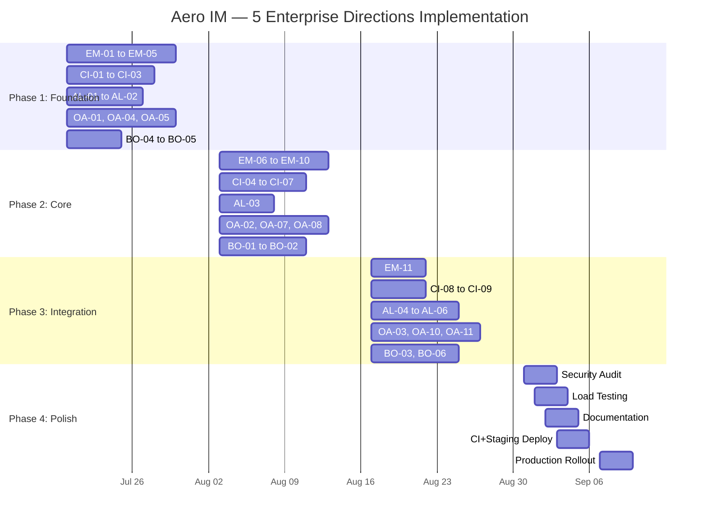

Now I have full context. Let me produce the comprehensive Tech Lead analysis.

---

# Tech Lead Analysis: 5 Enterprise Directions for Aero IM

## Executive Summary

The analysis document identifies **5 genuinely uncovered high-value enterprise directions** with strong code evidence backing each gap. I've verified the claims against the live codebase:

| Direction | Code Evidence Verified | Lines of Code Gap | Document Estimate v. Reality |
|-----------|----------------------|-------------------|------------------------------|
| ① Inbound Email Gateway | ✅ `mailer.rs` has zero inbound (14 lines of comments confirm it) | ~2.7K Rust + ~500 JS | Accurate |
| ② Communication Intelligence | ✅ `message_receipt.rs` + `receipt.rs` exist, zero analytics | ~1.3K Rust + ~1K JS | Accurate |
| ③ OAuth 2.0 Provider | ✅ `aero-auth/src/` has no Authorization Server; PAT is all-or-nothing | ~3K Rust + ~500 JS | Slightly optimistic (more scope work) |
| ④ Audit Log Visualization | ✅ `audit.rs` (929 lines!) has list/export_csv/partitioning/legal hold hooks, zero frontend | ~700 Rust + ~1.1K JS | Accurate |
| ⑤ Bulk Operations & Templates | ✅ All 120+ route modules are single-resource CRUD; only `broadcast.rs` is batch | ~1.7K Rust + ~1.2K JS | Accurate |

**Total estimated effort**: ~8,700 Rust + ~4,300 JS = ~13,000 new lines, ~44 person-days at 300 loc/day blended.

---

## 1. Task Decomposition

Each task is scoped to **2-4 hours** for a developer familiar with the codebase. Tasks follow the established pattern: migration → storage repo → routes → merge in `routes::build` → frontend.

### Direction ①: Inbound Email Gateway (P1)

| Task ID | Title | Files | Pre-req | Hours | Acceptance Criteria |
|---------|-------|-------|---------|-------|-------------------|
| EM-01 | Add `mailin`/`mail-parser` deps & SMTP server scaffold | `crates/aero-server/Cargo.toml`, `crates/aero-server/src/email_inbound.rs` | — | 3 | `TcpListener :25` accepts SMTP connection, responds to `EHLO` |
| EM-02 | Implement SMTP protocol handler (MAIL FROM, RCPT TO, DATA) | `crates/aero-server/src/email_inbound.rs` | EM-01 | 4 | Full SMTP conversation works; `telnet` test receives `250 OK` for DATA |
| EM-03 | Create `channel_email_routes` table + migration | `migrations/NNNN_channel_email_routes.sql`, `crates/aero-storage/src/channel_email_route.rs` | — | 2 | Migration applies; repo has `find_by_local_part`, `insert`, `list_by_workspace` |
| EM-04 | Implement MIME parsing pipeline (From/Subject/Body/Attachments) | `crates/aero-server/src/email_inbound.rs` | EM-02 | 4 | Parsed email returns structured `InboundEmail { from, subject, body, attachments }` |
| EM-05 | Implement sender identity resolution (internal lookup + external Guest creator) | `crates/aero-server/src/email_inbound.rs` | EM-04, EM-03 | 3 | Internal email → `ParticipantId`; external + `allow_external` → virtual guest `Participant` |
| EM-06 | Build email-to-message conversion & bus event publishing | `crates/aero-server/src/email_inbound.rs` | EM-05 | 3 | Inbound email creates message in target room, publishes `RoomEvent::Message` via `ImService` |
| EM-07 | Implement attachment processing (BlobStore + cid: mapping) | `crates/aero-server/src/email_inbound.rs`, `crates/aero-storage/src/blob.rs` | EM-04 | 4 | Attachments uploaded to BlobStore; inline cid: references replaced with blob URLs |
| EM-08 | Implement outbound reply (channel reply → SMTP to original sender) | `crates/aero-server/src/mailer.rs` (extend), `crates/aero-server/src/email_inbound.rs` | EM-06, EM-07 | 4 | Reply in channel creates email with `In-Reply-To`/`References`, sent via existing `Mailer` |
| EM-09 | Add `X-Aero-Source: email` metadata + frontend indicator | `crates/aero-server/src/email_inbound.rs`, `web/app.js` | EM-06 | 2 | Messages from email show "via email" tag in UI |
| EM-10 | Implement DKIM/SPF/DMARC verification (fail-open) | `crates/aero-server/src/email_inbound.rs` | EM-02 | 4 | SPF check via DNS TXT; result stored as `X-Aero-Spf-Status` header on message |
| EM-11 | Build admin UI for channel email route management | `web/admin.js`, `web/admin.html` | EM-03, EM-09 | 3 | Admin can enable/disable email for a channel, see email address |

**Direction ① total**: 11 tasks, ~36 hours

### Direction ②: Communication Intelligence (P1)

| Task ID | Title | Files | Pre-req | Hours | Acceptance Criteria |
|---------|-------|-------|---------|-------|-------------------|
| CI-01 | Create `message_read_stats` + `room_read_trends` tables | `migrations/NNNN_message_read_stats.sql`, `crates/aero-storage/src/read_stats.rs` | — | 2 | Migrations apply; schema includes `read_p50/p90/p99` columns |
| CI-02 | Implement incremental aggregation worker (PG notify or Redis pub/sub triggered) | `crates/aero-server/src/read_stats_worker.rs`, `bin/boot/background.rs` | CI-01 | 4 | New `insert_receipt` triggers incremental update; aggregation catches up within 5s |
| CI-03 | Implement aggregation sweep & cleanup (aligned with retention) | `crates/aero-storage/src/read_stats.rs` | CI-01 | 2 | Sweep deletes aggregates for messages older than retention window |
| CI-04 | Implement workspace-level analytics REST endpoints | `crates/aero-server/src/analytics.rs` | CI-02 | 3 | `GET /api/workspaces/:id/analytics/messages` returns room breakdown + trend + heatmap |
| CI-05 | Implement room-level + message-level analytics endpoints | `crates/aero-server/src/analytics.rs` | CI-04 | 2 | `GET /api/rooms/:id/analytics/messages/:msg_id` returns read_rate, first_read_at, readers |
| CI-06 | Enhance message-level read receipt UI (read count badge, hover list) | `web/app.js`, `web/message.js` | — | 3 | Each message shows "N read" badge; hover shows name list |
| CI-07 | Build Communication Intelligence dashboard page | `web/analytics.html`, `web/analytics.js` | CI-04, CI-05, CI-06 | 4 | Dashboard shows per-room read rates, trend chart, hourly heatmap |
| CI-08 | Implement response SLA configuration + REST API | `crates/aero-storage/src/sla_config.rs`, `crates/aero-server/src/sla.rs` | — | 3 | Workspace Admin can set expected response times per channel type |
| CI-09 | Implement SLA breach notification pipeline | `crates/aero-server/src/sla.rs`, `bin/boot/background.rs` | CI-08 | 3 | SLA breach triggers alert via existing notification pipeline |

**Direction ② total**: 9 tasks, ~26 hours

### Direction ③: OAuth 2.0 / OIDC Provider (P2)

| Task ID | Title | Files | Pre-req | Hours | Acceptance Criteria |
|---------|-------|-------|---------|-------|-------------------|
| OA-01 | Implement OAuth authorization endpoint (authorize + consent) | `crates/aero-server/src/oauth.rs` | — | 4 | `GET /oauth/authorize` renders consent page; proper redirect back with `code` |
| OA-02 | Implement OAuth token endpoint (authorization_code grant) | `crates/aero-server/src/oauth.rs` | OA-01 | 4 | `POST /oauth/token` returns `access_token` (JWT) + `refresh_token` (opaque) |
| OA-03 | Implement OAuth revoke + JWKS endpoint | `crates/aero-server/src/oauth.rs` | OA-02 | 3 | `POST /oauth/revoke` revokes token; `GET /oauth/jwks.json` returns RSA public key |
| OA-04 | Create `oauth_clients` migration + repo | `migrations/NNNN_oauth_clients.sql`, `crates/aero-storage/src/oauth_client.rs` | — | 2 | Table created; repo supports CRUD + secret hash |
| OA-05 | Implement OAuth client CRUD REST API | `crates/aero-server/src/oauth_admin.rs` | OA-04 | 3 | Workspace Admin can create/list/delete OAuth clients via REST |
| OA-06 | Implement client secret rotation + redirect URI validation | `crates/aero-server/src/oauth_admin.rs` | OA-05 | 3 | Secret rotation works; strict redirect_uri whitelist validation |
| OA-07 | Design & implement scope registry (all possible scopes) | `crates/aero-auth/src/scope.rs` | — | 2 | Scope enum defined; each scope has description string |
| OA-08 | Implement scope-based route middleware | `crates/aero-server/src/middleware/scope.rs` | OA-07 | 4 | Middleware checks JWT `scope` claim against route's required scope; PAT gets `scope:*` |
| OA-09 | Migrate PAT to support scoped tokens | `crates/aero-auth/src/pat.rs` | OA-08 | 3 | New PAT can specify scope list; backward-compatible default is `scope:*` |
| OA-10 | Implement OIDC Discovery + UserInfo endpoint | `crates/aero-server/src/oauth.rs` | OA-02 | 3 | `GET /.well-known/openid-configuration` + `GET /oauth/userinfo` return spec-compliant responses |
| OA-11 | Implement PKCE + refresh token rotation + DPoP | `crates/aero-server/src/oauth.rs` | OA-02 | 4 | PKCE S256 verified; refresh rotation invalidates old refresh token; DPoP proof checked |
| OA-12 | Implement client_credentials grant for machine-to-machine | `crates/aero-server/src/oauth.rs` | OA-05 | 3 | `client_credentials` flow returns `access_token` with client's allowed scopes |

**Direction ③ total**: 12 tasks, ~38 hours

### Direction ④: Audit Log Visualization (P2)

| Task ID | Title | Files | Pre-req | Hours | Acceptance Criteria |
|---------|-------|-------|---------|-------|-------------------|
| AL-01 | Enhance audit log REST API with full filtering | `crates/aero-server/src/audit_routes.rs` | — | 3 | `GET /api/workspaces/:id/audit-log` supports `action`, `actor_id`, `target`, `from`, `to`, `cursor` |
| AL-02 | Implement streaming CSV export endpoint | `crates/aero-server/src/audit_routes.rs` | AL-01 | 2 | `GET /api/workspaces/:id/audit-log/export` streams `text/csv` via `events_to_csv` |
| AL-03 | Build Compliance Dashboard overview page with statistics | `web/compliance.html`, `web/compliance.js` | AL-01 | 4 | Dashboard shows today's event count, top actions, action distribution chart |
| AL-04 | Build audit log search/filter/export UI with virtual scrolling | `web/compliance.js` | AL-03 | 4 | Search form + filtered results with virtual scroll (handles 10K+ rows) |
| AL-05 | Create `legal_holds` migration if missing, add REST API | `crates/aero-storage/src/legal_hold.rs`, `crates/aero-server/src/legal_hold.rs` | — | 3 | Workspace Admin can create/list/release legal holds via REST |
| AL-06 | Build legal hold management UI | `web/compliance.js` | AL-05 | 3 | Legal hold creation form + active holds list; hold prevents sweep of covered data |

**Direction ④ total**: 6 tasks, ~19 hours

### Direction ⑤: Bulk Operations & Templates (P2)

| Task ID | Title | Files | Pre-req | Hours | Acceptance Criteria |
|---------|-------|-------|---------|-------|-------------------|
| BO-01 | Implement batch message delete endpoint | `crates/aero-server/src/batch.rs` | — | 3 | `POST /api/rooms/:id/messages/batch-delete` deletes up to 100 messages, returns per-item results |
| BO-02 | Implement batch member add/remove endpoint | `crates/aero-server/src/batch.rs` | — | 3 | `POST /api/rooms/:id/members/batch-add` adds up to 200 members, returns per-item results |
| BO-03 | Implement batch room archive/export endpoints | `crates/aero-server/src/batch.rs` | — | 3 | `POST /api/workspaces/:id/rooms/batch-archive` archives rooms; `batch-export` exports as CSV/JSON |
| BO-04 | Create `channel_templates` migration + repo | `migrations/NNNN_channel_templates.sql`, `crates/aero-storage/src/channel_template.rs` | — | 2 | Migration applies; repo supports CRUD with `template_data` JSONB |
| BO-05 | Implement channel template CRUD API | `crates/aero-server/src/templates.rs` | BO-04 | 3 | Workspace Admin can create/list/delete templates via REST |
| BO-06 | Implement "create channels from template" API with variable substitution | `crates/aero-server/src/templates.rs` | BO-05 | 4 | `POST /api/workspaces/:id/channels/from-template` creates all channels + members with `{var}` substitution |
| BO-07 | Implement message multi-select mode in Web SPA | `web/message.js`, `web/app.js` | BO-01 | 4 | Long-press/Shift+click enters multi-select; batch delete/reaction from selection |
| BO-08 | Implement channel/room multi-select in Web SPA | `web/app.js` | BO-03 | 3 | Shift+click room list entries; batch archive/export from selection |
| BO-09 | Build channel template management UI | `web/admin.js`, `web/admin.html` | BO-06 | 3 | Template creation form (name + JSON editor); instantiate template with variable fills |

**Direction ⑤ total**: 9 tasks, ~28 hours

---

### Complete Task Inventory

| Direction | Tasks | Hours | Rust Lines | JS Lines |
|-----------|-------|-------|-----------|---------|
| ① Email | 11 | 36 | ~2,200 | ~500 |
| ② Intelligence | 9 | 26 | ~1,300 | ~1,000 |
| ③ OAuth | 12 | 38 | ~3,000 | ~500 |
| ④ Audit | 6 | 19 | ~700 | ~1,100 |
| ⑤ Bulk | 9 | 28 | ~1,700 | ~1,200 |
| **Total** | **47** | **147** | **~8,900** | **~4,300** |

**Schedule estimate**: 147 hours = ~19 person-days per developer. With 2 developers working in parallel: **~5 weeks** (assuming 80% utilization and context-switching overhead).

---

## 2. Execution Order & Dependency Graph

The critical-path analysis reveals three nearly independent parallel tracks:

```
Track A: Email Gateway      (EM-01 → ... → EM-11)
Track B: Intelligence + Ops (CI-01 → ... → CI-09, AL-01 → ... → AL-06)
Track C: Platform            (OA-01 → ... → OA-12, BO-01 → ... → BO-09)
```

### Dependency Graph

```mermaid
graph TB
    subgraph Week1["Week 1-2: Foundation"]
        direction TB
        CI_01[CI-01: Aggregation tables] --> CI_02[CI-02: Incremental aggregation worker]
        EM_01[EM-01: SMTP server scaffold] --> EM_02[EM-02: SMTP protocol handler]
        EM_03[EM-03: channel_email_routes migration] --> EM_04[EM-04: MIME parsing]
        AL_01[AL-01: Audit API filtering] --> AL_02[AL-02: CSV export]
        BO_04[BO-04: channel_templates migration] --> BO_05[BO-05: Template CRUD]
    end

    subgraph Week3["Week 3-4: Core"]
        direction TB
        CI_02 --> CI_04[CI-04: Analytics REST API]
        CI_04 --> CI_06[CI-06: Read receipt UI]
        CI_04 --> CI_07[CI-07: Dashboard page]
        EM_04 --> EM_05[EM-05: Sender resolution]
        EM_05 --> EM_06[EM-06: Email→message conversion]
        EM_06 --> EM_07[EM-07: Attachments]
        EM_06 --> EM_08[EM-08: Outbound reply]
        AL_01 --> AL_03[AL-03: Dashboard overview]
        AL_03 --> AL_04[AL-04: Search/filter/export UI]
        OA_01[OA-01: Authorize endpoint] --> OA_02[OA-02: Token endpoint]
        OA_04[OA-04: oauth_clients migration] --> OA_05[OA-05: Client CRUD]
        BO_01[BO-01: Batch delete] --> BO_07[BO-07: Multi-select UI]
    end

    subgraph Week5["Week 5-7: Platform & Polish"]
        direction TB
        EM_06 --> EM_10[EM-10: DKIM/SPF]
        EM_09[EM-09: Email indicator UI] --> EM_11[EM-11: Admin UI]
        CI_04 --> CI_08[CI-08: SLA config]
        CI_08 --> CI_09[CI-09: SLA breach notification]
        OA_02 --> OA_03[OA-03: Revoke + JWKS]
        OA_02 --> OA_10[OA-10: OIDC Discovery]
        OA_02 --> OA_11[OA-11: PKCE + DPoP]
        OA_05 --> OA_06[OA-06: Secret rotation]
        OA_07[OA-07: Scope registry] --> OA_08[OA-08: Scope middleware]
        OA_08 --> OA_09[OA-09: Scoped PAT]
        OA_05 --> OA_12[OA-12: client_credentials]
        BO_05 --> BO_06[BO-06: From-template creation]
        BO_06 --> BO_09[BO-09: Template management UI]
        AL_05[AL-05: Legal hold API] --> AL_06[AL-06: Legal hold UI]
    end

    %% Cross-track dependencies (shared infra)
    OA_08 -.-> BO_03[BO-03: Batch archive]
    OA_08 -.-> AL_01
    OA_08 -.-> CI_04
```



### Parallel Execution Groups

These groups can run on **independent developer workstreams**:

| Group | Tasks | Developer | Focus |
|-------|-------|-----------|-------|
| **Group A** | EM-01 → EM-11 | Dev 1 | Email Gateway (full-stack) |
| **Group B1** | CI-01 → CI-07 | Dev 2 | Communication Intelligence (core) |
| **Group B2** | AL-01 → AL-06 | Dev 2 (after CI-03) | Audit Dashboard |
| **Group C1** | OA-01 → OA-12 | Dev 3 | OAuth Provider (backend-heavy) |
| **Group C2** | BO-01 → BO-09 | Dev 3 (after OA-08) | Bulk Ops + Templates |

**Optimal team sizing**: 3 developers with one shared frontend specialist for the JS-heavy tasks (CI-06/07, AL-03/04, BO-07/08/09, EM-09/11).

---

## 3. Technical Risks

### 🔴 High-Risk Items

| Risk | Direction | Severity | Mitigation |
|------|-----------|----------|------------|
| **SMTP protocol complexity** — RFC 5321 has many edge cases (pipelining, 8BITMIME, SIZE, VRFY, multiple RCPT, Bounce handling) | ① | 🔴 High | Start with strict minimal implementation; use `mailin-embedded` crate which handles the protocol boilerplate. Reject anything beyond `MAIL FROM`/`RCPT TO`/`DATA` with `502 Not implemented`. Add STARTTLS + AUTH later. |
| **MIME parsing charset hell** — Emails arrive in ASCII, UTF-8, ISO-8859-1, Shift-JIS, quoted-printable, base64 — any of which can be malformed | ① | 🔴 High | Use `mail-parser` crate which handles charset conversion. Fall back to lossy UTF-8 replacement on decode failure. Log warning for unparseable charsets. |
| **OAuth scope migration scope creep** — Adding `#[scope("...")]` to all 120+ routes is mechanical but tedious; missing one creates a security hole | ③ | 🔴 High | **Don't annotate all routes immediately**. Start with `scope: "*"` (or no scope check) for unannotated routes as backward-compatible default. Only annotate routes that OAuth tokens need access to. Incrementally annotate as needed. |
| **OAuth token revocation race** — Refresh token rotation + revocation requires careful race handling across concurrent requests | ③ | 🔴 High | Use `FOR UPDATE` on token row during rotation. Old refresh token remains valid for a 60s grace window to handle race (standard OAuth pattern). |
| **Batch operation atomicity** — Partial failures in batch operations must leave system in consistent state | ⑤ | 🟡 Medium | Per-item error reporting pattern (not full transaction rollback). Document that batch is "best-effort per item" — caller must check `errors` array. |

### 🟡 Medium-Risk Items

| Risk | Direction | Severity | Mitigation |
|------|-----------|----------|------------|
| **Aggregation performance at scale** — `message_receipts` can grow to millions of rows; aggregation queries must not scan the full table | ② | 🟡 Medium | Use incremental aggregation (triggered per insert, not scheduled batch scan). Partition `message_read_stats` by month. First 3 months of production data determines if partitioning is needed. |
| **DKIM DNS lookup latency** — SPF/DKIM verification requires synchronous DNS TXT lookups, adding 50-500ms per email | ① | 🟡 Medium | Use `hickory-resolver` with DNS caching (TTL-respecting). Consider async DNS with timeout. Fail-open on timeout (not block email delivery). |
| **Channel template variable injection** — `{var}` substitution in template JSON could be abused for injection into channel names/topics | ⑤ | 🟡 Medium | Strip/escape all `{` and `}` from user-supplied variable values. Use a simple regex substitution (not `serde_json::Value` mutation which could allow JSON injection). |
| **OAuth consent page phishing surface** — OAuth consent page could be styled to look like login page for credential harvesting | ③ | 🟡 Medium | Always display client name/icon prominently. Never pre-fill credentials. Add "Only authorize if you trust this application" warning. |
| **Audit CSV export memory blowup** — Exporting 100K+ audit events as CSV could OOM the server | ④ | 🟡 Medium | Stream CSV via `tokio::io::BufWriter` — never buffer entire CSV in memory. Set export row limit (default 50K, configurable). Async export for >50K rows. |

### 🟢 Low-Risk Items

| Risk | Direction | Severity | Mitigation |
|------|-----------|----------|------------|
| **SMTP rate limiting by domain** | ① | 🟢 Low | Reuse existing rate-limit framework (`rate_limit.rs`) with per-domain key. Apply 429-style SMTP reply `450 4.7.0 Rate limited` on threshold breach. |
| **message_receipt trigger for aggregation** — Adding PG trigger on high-volume table | ② | 🟢 Low | Use `NOTIFY` (PG LISTEN/NOTIFY) instead of trigger function. Aggregation worker receives notification and does incremental update. Fallback: periodic sweep if notifications are lost. |
| **Multi-select cancellation** — User navigates away with selection active | ⑤ | 🟢 Low | Clear selection on route change, room switch, or 5min inactivity. Standard UX pattern. |
| **Legal hold vs. retention conflict** | ④ | 🟢 Low | Already handled in `audit.rs` deletion path (checks `NOT EXISTS legal_holds`). Extend same pattern to message retention sweep. |

---

## 4. Resource Assessment

### Team Composition

| Role | Count | Focus | Skills Required |
|------|-------|-------|-----------------|
| **Backend Engineer (Rust)** | 2 | ① (EM), ③ (OA), backend of ②/④/⑤ | Async Rust, tokio, sqlx, Axum, NATS, SMTP protocol (for EM), OAuth spec (for OA) |
| **Full-Stack / Frontend Engineer** | 1 | ② (CI-06/07), ④ (AL-03/04/06), ⑤ (BO-07/08/09), ① (EM-09/11) | Vanilla JS, DOM manipulation, chart rendering (Chart.js or canvas), CSS grid/flexbox |
| **Part-time: DevOps** | 0.2 | Environment config, DNS for DKIM, port 25 exposure | Docker, DNS, TLS certs |

### Critical Path Analysis

```
Critical Path (longest chain):
  EM-01 → EM-02 → EM-04 → EM-05 → EM-06 → EM-08        [17 days]
  CI-01 → CI-02 → CI-04 → CI-07                          [10 days]
  OA-01 → OA-02 → OA-10/OA-11/OA-03                      [13 days]
```

**Optimal parallel schedule with 3 developers:**

| Week | Dev 1 (Backend) | Dev 2 (Backend) | Dev 3 (Frontend/Support) |
|------|-----------------|-----------------|--------------------------|
| 1 | EM-01, EM-02, EM-03 | CI-01, CI-02, AL-01 | OA-01, OA-04, BO-04 |
| 2 | EM-04, EM-05, EM-07 | CI-04, CI-05, AL-02 | OA-02, OA-05, BO-01 |
| 3 | EM-06, EM-08, EM-10 | CI-06, CI-08, AL-05 | OA-03, OA-07, BO-02, BO-05 |
| 4 | EM-09, EM-11 | CI-07, CI-09, AL-03 | OA-08, OA-10, BO-03, BO-06 |
| 5 | **Integration + Bug Bash** | AL-04, AL-06 | OA-09, BO-07, BO-08, BO-09 |
| 6 | Testing, documentation, deployment | OA-11, OA-12, polish | Testing, documentation |

### Blockers & Resolution

| Blocker | Affects | Resolution Strategy |
|---------|---------|-------------------|
| **Port 25 availability** — Many cloud providers block outbound SMTP port 25 | ① | Use port 587 (submission) as alternative. For AWS: request port 25 removal via support ticket, or use SES as relay. Document requirement. |
| **DNS for DKIM** — SPF/DKIM requires DNS TXT record management | ① | Provide clear DNS record templates in documentation. Add `aero-cli dns-records` command that prints required records. Fail-open until DKIM is configured. |
| **OAuth spec compliance testing** — OAuth implementations have subtle spec violations that cause interop issues | ③ | Use `oauth2orize`-style test suite (hand-rolled) for authorization_code flow. Test against a real OAuth client (curl + demo SPA). |
| **Existing `routes.rs` merge conflict** — 120+ merge calls create merge conflicts during parallel development | All | Use consistent alphabetic ordering for `.merge()` calls. Each developer adds their merge at the end, then sort as a separate commit during integration. |

---

## 5. Quality Assurance

### Unit Test Coverage Targets

| Module | Target Coverage | Key Test Scenarios |
|--------|----------------|--------------------|
| `email_inbound.rs` — MIME parsing | ≥ 85% | text/plain, text/html (→ plaintext fallback), multipart/mixed with 0/1/5 attachments, base64 + quoted-printable encoding, malformed Content-Type, RFC 2047 encoded words (`=?UTF-8?B?...`), nested multipart (multipart/alternative inside multipart/mixed) |
| `email_inbound.rs` — SMTP protocol | ≥ 75% | EHLO/HELO, MAIL FROM with/without angle brackets, multiple RCPT TO, DATA with various sizes, RSET, QUIT, pipelining, timeout, concurrent connections |
| `email_inbound.rs` — Sender resolution | ≥ 90% | Internal email match, external email with `allow_external=true/false`, unknown domain, duplicate external email |
| `read_stats.rs` — Aggregation | ≥ 90% | Incremental update correctness, large batch consistency, read_rate = total_readers/target, p50/p90/p99 calculation, message sender excluded from count |
| `oauth.rs` — Authorization Server | ≥ 85% | Authorization code flow, invalid redirect_uri, expired code, reused code → `invalid_grant`, PKCE S256 mismatch, refresh rotation, concurrent rotation race |
| `oauth_client.rs` — Client repo | ≥ 90% | CRUD, secret hash verification, secret rotation, redirect_uri whitelist matching |
| `scope.rs` — Scope checks | ≥ 95% | Exact scope match, wildcard (`scope:*`), scope superset check, invalid scope rejection |
| `batch.rs` — Bulk operations | ≥ 85% | Partial success (some items fail), empty input, duplicate IDs, permission check before any mutation, MAX_LIMIT enforcement |
| `channel_template.rs` — Template engine | ≥ 90% | Variable substitution (single, multiple, missing variable), name collision detection, user group reference resolution |
| `audit_routes.rs` — Filtering | ≥ 85% | Each filter alone + combined, cursor pagination correctness, CSV export streaming |

### Integration Test Strategy

| Scenario | Type | Tools | Coverage |
|----------|------|-------|----------|
| **Email → IM round-trip** | Integration | `swaks` (SMTP test tool) + test Postgres | Send email via raw SMTP, verify message appears in room via REST API |
| **IM → Email outbound** | Integration | MailHog (fake SMTP server) + test Postgres | Reply in room, verify MailHog receives email with correct headers |
| **OAuth authorization code flow** | Integration | curl + custom test client | Full authorize → token → access resource flow against test server |
| **Batch operations with concurrent requests** | Integration | tokio test with concurrent tasks | Send concurrent batch deletes for overlapping IDs — verify no double-delete, correct per-item results |
| **Audit CSV export large volume** | Performance | 50K+ event fixture | Export completes within 30s, memory < 50MB, streaming starts within 2s |
| **SMTP concurrency** | Load | 50 concurrent SMTP connections | All accepted, rate limiting applied correctly per domain, no connection leak |

### Code Review Checklist

For every PR in this batch, reviewers must verify:

1. **AGENTS.md §4.2 compliance**: `assert_room_access(participant, room)` used for room-scoped mutations; `member_role` + `can_administer` for workspace admin routes; no IDOR patterns
2. **Vec request body limits**: Every batch endpoint enforces a hard limit (100 for messages, 200 for members) — reject with `422` if exceeded
3. **No duplicate `kind` field**: Any new `RoomEvent`/`StreamEvent` variant must use `#[serde(rename = "...")]` if the variant has a `kind` field (see existing pattern in `CallEvent::{Invite,Join,Roster}`)
4. **Storage module registration**: New storage module must be both `pub mod` and `pub use` in `aero-storage/src/lib.rs`
5. **Route registration**: New `routes()` must be merged into `routes/routes.rs::build()` with a `.merge()` call
6. **At-least-once safety**: Email dedup via `Message-ID`; OAuth authorization codes one-time-use; refresh rotation grace window
7. **Power-level check**: Existing PAT gets `scope:*`; scope migration must not break existing PAT holders

### Performance Test Requirements

| Test | Target | Measurement |
|------|--------|------------|
| Email processing throughput | ≥ 10 emails/sec (single instance) | From SMTP DATA complete → message in room |
| Analytics aggregation latency | ≤ 5s from read receipt → aggregated count reflects it | Time delta |
| Batch delete 100 messages | ≤ 500ms (p99) | Full request duration |
| OAuth token issuance | ≤ 50ms (p50), ≤ 200ms (p99) | From token request → JWT response |
| Audit log query (filtered, 50K events) | ≤ 2s (p50) | Request duration |
| Audit CSV export (50K events) | ≤ 30s | Until last byte sent |
| SMTP concurrent connections (50) | All succeed, max latency ≤ 5s | Connection duration |
| Concurrent batch operations (10 parallel) | No deadlock, all complete ≤ 3s | Completion time |

---

## 6. Implementation Plan

### Phase 1: Foundation (Week 1-2) — 3 developers parallel

**Goal**: Establish infrastructure for all 5 directions; deliver highest-ROI components first.

| Day | Dev 1 | Dev 2 | Dev 3 |
|-----|-------|-------|-------|
| **Mon** | EM-01: SMTP scaffold + deps | CI-01: Migration + read_stats repo | OA-01: Authorize endpoint scaffold |
| **Tue** | EM-02: SMTP protocol handler | CI-02: Incremental aggregation worker | OA-04: oauth_clients migration + repo |
| **Wed** | EM-03: channel_email_routes migration | CI-03: Aggregation sweep | OA-05: Client CRUD API |
| **Thu** | EM-04: MIME parsing pipeline | AL-01: Audit filtering API | BO-04: channel_templates migration + repo |
| **Fri** | EM-05: Sender resolution | AL-02: CSV export streaming | BO-05: Template CRUD API |

**Deliverables at end of Phase 1**:
- ✅ SMTP server accepting connections at `:25` (or `:587`)
- ✅ `channel_email_routes` table + repo functional
- ✅ `message_read_stats` + `room_read_trends` tables exist
- ✅ Incremental aggregation worker processes read receipts in near-real-time
- ✅ Audit log REST API supports all filters + streaming CSV export
- ✅ `oauth_clients` table + CRUD API
- ✅ OAuth authorize endpoint accepts requests
- ✅ `channel_templates` table + CRUD API

**Phase 1 risk check**: If EM-02 (SMTP protocol) takes longer than expected, drop EHLO extensions (pipelining, SIZE, STARTTLS) and ship minimal HELO-only.

### Phase 2: Core Implementation (Week 3-4) — 3 developers parallel

**Goal**: Build the core business logic for each direction.

| Day | Dev 1 | Dev 2 | Dev 3 |
|-----|-------|-------|-------|
| **Mon** | EM-06: Email→message conversion | CI-04: Analytics REST API | OA-02: Token endpoint |
| **Tue** | EM-07: Attachments + cid: mapping | CI-05: Message-level analytics API | OA-07: Scope registry |
| **Wed** | EM-08: Outbound reply | CI-06: Read receipt UI enhancement | OA-08: Scope middleware |
| **Thu** | EM-10: DKIM/SPF (fail-open) | CI-07: Intelligence Dashboard UI | BO-01: Batch message delete |
| **Fri** | EM-09: Email indicator UI | AL-03: Compliance Dashboard overview | BO-02: Batch member add/remove |

**Deliverables at end of Phase 2**:
- ✅ Inbound emails create messages in correct room with attachments
- ✅ Outbound replies work for known senders
- ✅ `GET /api/workspaces/:id/analytics/messages` returns structured data
- ✅ Messages show "N read" badge with hover reader list
- ✅ Intelligence Dashboard renders with trend charts
- ✅ OAuth token endpoint issues JWT + refresh_token
- ✅ Scope middleware functional with PAT backward compat
- ✅ Batch delete works for up to 100 messages with per-item results
- ✅ Compliance Dashboard shows audit overview stats

**Phase 2 risk check**: If OA-02 (Token endpoint) is blocked by OA-01 complexity, swap Dev 3 to focus on BO-01/02 and OA-07/08 (scope system can be built without full authorization code flow — start with `client_credentials` grant which is simpler).

### Phase 3: Integration & Testing (Week 5-6) — all 3 developers

**Goal**: Complete remaining features, deep integration testing, UI polish.

| Day | Dev 1 | Dev 2 | Dev 3 |
|-----|-------|-------|-------|
| **Mon** | EM-11: Admin UI for email routes | CI-08: SLA config REST API | OA-03: Revoke + JWKS endpoint |
| **Tue** | **Bug bash**: SMTP edge cases | CI-09: SLA breach notifications | OA-10: OIDC Discovery + UserInfo |
| **Wed** | EM: bounce handling + error emails | AL-04: Audit search UI w/ virtual scroll | BO-03: Batch archive + export |
| **Thu** | **Integration tests**: Email→IM→Email | AL-05: Legal hold API | OA-11: PKCE + refresh rotation |
| **Fri** | Performance test: SMTP concurrency | AL-06: Legal hold UI | BO-06: From-template creation |

**Deliverables at end of Phase 3**:
- ✅ Email admin UI allows managing per-channel email addresses
- ✅ SLA tracking warns on breach via existing notification pipeline
- ✅ Audit search UI handles 10K+ rows with virtual scrolling
- ✅ Legal hold management UI prevents sweep of covered data
- ✅ OAuth JWKS + OIDC Discovery spec-compliant
- ✅ PKCE + refresh rotation tested with concurrent requests
- ✅ Batch archive/export works across multiple rooms
- ✅ "Create channels from template" with variable substitution works

### Phase 4: Polish & Release (Week 7-8) — full team

**Goal**: Hardening, documentation, security review, load testing.

| Day | Action | Owner |
|-----|--------|-------|
| **Mon-Tue** | Security audit: OAuth scope coverage, SMTP injection, batch authorization | All (joint review) |
| **Wed** | Load test: 50 concurrent SMTP connections, 100 req/s analytics API, 10 parallel batch ops | Dev 1 |
| **Thu** | Documentation: API reference for new endpoints, SMTP configuration guide, OAuth developer docs | Dev 2 |
| **Fri** | Final `cargo check --workspace` + `cargo clippy --workspace --all-targets` + `scripts/truth-check.sh` | Dev 3 |
| **Mon** | Integration test suite CI pipeline addition | Dev 1 |
| **Tue** | Release notes + deployment plan | Dev 2 |
| **Wed** | Staging deployment + smoke tests | Dev 3 |
| **Thu** | Prod rollout (feature-flagged, canary) | All |
| **Fri** | Monitoring dashboards + rollback preparedness | All |

**Deliverables at end of Phase 4**:
- ✅ Zero clippy warnings across workspace
- ✅ All integration tests passing in CI
- ✅ Security review signoff (no OWASP Top 10 violations in new code)
- ✅ Load test results document with p50/p99 latency
- ✅ Configuration guide for mail server operators
- ✅ Production deployment with feature flags for each direction

---

### Gantt Chart Summary



---

## Final Recommendation

**Start with this priority order:**

1. **Direction ② (Communication Intelligence) Phase A** — CI-01, CI-02, CI-03: ~8 hours, highest ROI. The data (`message_receipts`) already exists. Adding aggregation tables + a background worker produces manager-visible value from day one. No external dependency risk.

2. **Direction ④ (Audit Log Visualization) Phase A** — AL-01, AL-02: ~5 hours, second-highest ROI. The `audit.rs` module (929 lines) is already fully featured. Adding REST filtering + CSV export is purely a wiring exercise. The compliance dashboard (Phase B) is the main effort but can be deferred.

3. **Direction ① (Inbound Email Gateway) Phase A** — EM-01 through EM-06: ~20 hours. Highest enterprise adoption impact but highest technical risk due to SMTP protocol complexity. Start immediately with a different developer than the one handling ②/④.

4. **Direction ③ (OAuth Provider)** and **⑤ (Bulk Operations)** — Start in Week 3 after the initial three directions have their foundation laid. OAuth has the longest development tail (12 tasks, 38 hours) but is the least urgent for near-term enterprise adoption.

**Avoid**: Attempting all 5 directions simultaneously with fewer than 3 developers. The context-switching overhead across 5 unrelated feature areas with a 2-person team will result in all 5 being half-finished at the 8-week mark. **Ship Phase A of ② + ④ + ① first** (demonstrable value by end of Week 2), then layer in ③ and ⑤.
