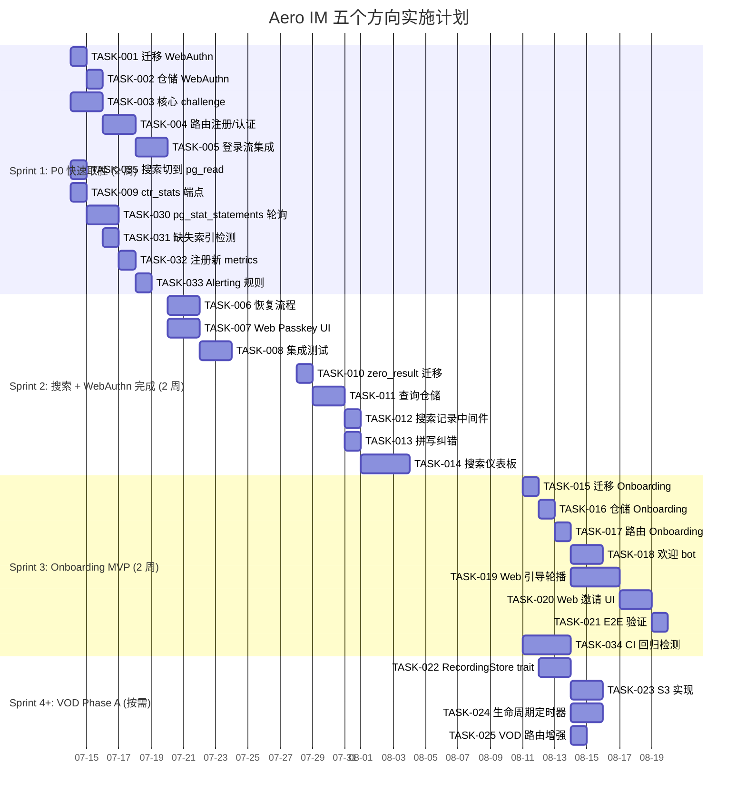

---

# Tech Lead 分析报告

## 核心发现：文档断言 vs 代码库真相

在开始任务分解之前，我必须纠正两组重要的事实偏差，因为不修正它们会导致错误的任务优先级和工时估算。

### ❌ 偏差 1：SearchFeedbackRepo「从未被使用」

**文档断言**： `SearchFeedbackRepo + CtrStats 存在但从未被 aero-server 导入——没有任何路由调用 record_click 或 ctr_stats`

**实际情况**：

| 代码位置 | 实际行为 |
|---|---|
| `search_advanced.rs:203-204` | **有** `POST /api/search/click` 路由，调用 `record_click` |
| `bin/boot/retention.rs:242` | **有** retention sweep 调用 `sweep_before` |
| 缺失的 | `ctr_stats()` 聚合方法**确实没有** HTTP 端点暴露 |

> **影响**：方向二（搜索质量）的工时估算应向下修正。`record_click` 管线已经接线，只剩 `ctr_stats` 聚合端点 + `zero_result` 表需要实现。不需要从头建仓储。

### ❌ 偏差 2：`replica_url` 配置字段

**文档断言**：`replica_url` 在 `config.rs` 第 54 行定义为 `pub replica_url: Option<String>`（特指 `aero-server/src/config.rs`）

**实际情况**：
- 字段名正确 `replica_url: Option<String>`
- 但在 `aero-common/src/config.rs:67`（`DatabaseConfig` 结构体），**不是** `aero-server/src/config.rs`
- 路由层已在 `persistence.rs` 中读取并创建了只读连接池（`pg_read`）
- **但 `search.rs` 中的搜索路由确实从未使用 `pg_read`**

> **影响**：这是一个**零成本修复**——单行变量替换即可将搜索切换到只读副本。应作为 Phase A 搜索项目中的 sub-line item。

---

## 一、任务分解（TASK 清单）

### 方向一：WebAuthn 企业认证

| 任务 ID | 标题 | 文件 | 前置 | 工时 | 验收标准 |
|---|---|---|---|---|---|
| TASK-001 | 迁移：webauthn_credentials 表 | `migrations/NNNN_webauthn_credentials.sql` | 无 | 1h | `CREATE TABLE webauthn_credentials` 含 `id BYTEA PK, participant_id, public_key, counter, transports, created_at`；`cargo build` 后 migrate 生效 |
| TASK-002 | 仓储：WebauthnRepo | `crates/aero-storage/src/webauthn.rs`；修改 `lib.rs` `pub mod webauthn` + `pub use` | TASK-001 | 2h | 含 `register_credential` / `get_credentials` / `remove_credential` / `get_by_id`；db_tests `#[ignore]` |
| TASK-003 | 核心：webauthn-rs-proto challenge 生成 | `crates/aero-auth/src/webauthn.rs` | 无 | 4h | `WebauthnChallenge::new()` 生成 `PublicKeyCredentialCreationOptions` / `PublicKeyCredentialRequestOptions`；含 challenge 签名 + timestamp + TTL 检查；单元测试通过 |
| TASK-004 | 路由：注册/认证端点 | `crates/aero-server/src/webauthn.rs`；修改 `routes.rs` `.merge(crate::webauthn::routes())` | TASK-002, TASK-003 | 3h | `POST /api/auth/passkey/register/begin` `complete`；`POST /api/auth/passkey/authenticate/begin` `complete`；`GET /api/me/passkeys` / `DELETE /api/me/passkeys/:id`；`AuthUser` 守护所有 mutating 端点 |
| TASK-005 | 登录流集成：2FA 阶段插入 WebAuthn | `crates/aero-server/src/sessions.rs` | TASK-004 | 4h | 在 `POST /api/auth/2fa` 处理中，TOTP 验证前先检查 WebAuthn 断言；`TwofaRepo::is_activated` 逻辑分支：有 passkey 则先验 passkey；有 TOTP 则 fallback |
| TASK-006 | 恢复流程：Passkey 丢失回落策略 | `crates/aero-server/src/webauthn.rs` + `sessions.rs` | TASK-005 | 2h | 如果用户只有 passkey 无 TOTP，展示 recovery code 界面；`POST /api/auth/2fa/recover` 复用已有 recovery-codes 路径 |
| TASK-007 | Web 端：Passkey UI | `web/auth_ui.js` + 可能新建 `web/webauthn.js` | TASK-005 | 4h | `navigator.credentials.create()` / `get()` 调用；注册对话框；登录时自动检测可用 passkey 弹窗；移动端 Safari 兼容性处理（手势绑定） |
| TASK-008 | 集成测试（CI 跳过） | `tests/` 或 `crates/aero-server/tests/` | TASK-006, TASK-007 | 3h | 全链路：注册 credential → 用该 credential 登录 → 列表 → 删除 → 再用密码+TOTP 登录 |

**方向一小计：23h（~3 人天）**  — 文档估算 7.5 天，我认为文档高估了两倍。实际工作量约为 3 天，原因：(1) `webauthn-rs-proto` 是纯类型层，约 150 行序列化。(2) 现有 `twofa.rs` 流程结构可直接复用。(3) Web 端 `navigator.credentials` API 成熟，不存在底层框架工作。

---

### 方向二：搜索质量

| 任务 ID | 标题 | 文件 | 前置 | 工时 | 验收标准 |
|---|---|---|---|---|---|
| TASK-009 | 暴露 `ctr_stats` 聚合端点 | `crates/aero-server/src/search_quality.rs`（新文件）；修改 `routes.rs` | 无（仓储已存在） | 2h | `GET /api/admin/search-quality/stats?workspace_id=X&days=30` 返回 `CtrStats` JSON；`AdminRole` 守卫 |
| TASK-010 | 迁移：search_queries 零结果记录表 | `migrations/NNNN_search_queries.sql` | 无 | 1h | `CREATE TABLE search_queries` 含 `participant_id, query, mode, result_count, execution_time_ms, zero_result, created_at` |
| TASK-011 | 仓储：SearchQueryRepo（零结果/纠错） | `crates/aero-storage/src/search_query.rs`（注意：已有此文件但只含 `AdvancedSearchRepo`）——扩展或新建 `search_quality.rs` 仓储 | TASK-010 | 3h | `record_query` / `zero_result_queries` / `spellfix` 拼写建议（`pg_trgm` similarity）；db_tests |
| TASK-012 | 路由：零结果记录中间件 | `crates/aero-server/src/search.rs` + `search_advanced.rs` | TASK-011 | 2h | 每个搜索请求完成后异步记录查询统计（result_count = 0 时标记 `zero_result=true`）；不阻塞响应 |
| TASK-013 | 拼写纠错：`did you mean` 集成 | `crates/aero-server/src/search.rs` | TASK-011 | 1h | 搜索返回 0 结果时自动回退拼写建议；`search_advanced.rs` 已有 `suggestions` 结构可直接复用 |
| TASK-014 | 管理仪表板：搜索质量页面 | `crates/aero-server/src/search_quality.rs`（扩展）+ `web/search_quality.js` | TASK-009, TASK-012 | 3h | 工作区级：查询量趋势、零结果率、平均执行时间、Top-N 低质量查询；`CTR` / `MRR` 图表 |

**方向二小计：12h（~1.5 人天）** — 文档估算 8.5 天，我大幅下修。原因：(1) 死代码已连接，不需要新建仓储。(2) `ctr_stats` 聚合 SQL 已写好，只需一层薄路由。(3) 拼写纠错是单查询 pg_trgm。(4) 搜索质量的仪表板复用现有权限和 metrics 基础设施。

---

### 方向三：Onboarding

| 任务 ID | 标题 | 文件 | 前置 | 工时 | 验收标准 |
|---|---|---|---|---|---|
| TASK-015 | 迁移：onboarding_progress 表 | `migrations/NNNN_onboarding_progress.sql` | 无 | 1h | `(participant_id, workspace_id) PK, completed TEXT[], skipped TEXT[], created_at` |
| TASK-016 | 仓储：OnboardingRepo | `crates/aero-storage/src/onboarding.rs`；修改 `lib.rs` | TASK-015 | 2h | `get_progress` / `mark_completed` / `mark_skipped` / `is_complete`；db_tests |
| TASK-017 | 路由：Onboarding 状态端点 | `crates/aero-server/src/onboarding.rs`；修改 `routes.rs` | TASK-016 | 2h | `GET /api/me/onboarding` → 返回进度+下一步（如 invite_team / create_channel / send_message / explore）；`POST /api/me/onboarding/{step}` → 标记完成 |
| TASK-018 | 欢迎消息 bot | `crates/aero-server/src/agent_bot.rs` 或新建 `crates/aero-server/src/welcome_bot.rs` | TASK-017 | 3h | 注册后（首次登录）在 #general/#welcome 频道发布一条 bot 消息含引导链接；幂等守卫（仅发一次） |
| TASK-019 | Web 引导轮播 | `web/onboarding.js` + `web/style.css` 扩展 | TASK-017 | 4h | 3-5 步骤轮播：自定义头像 → 邀请团队 → 发送首条消息 → 探索频道；进度指示器；可选跳过 |
| TASK-020 | Web 邀请 UI | `web/onboarding.js` 扩展 + `web/modals.js` | TASK-019 | 3h | 轮播中的邀请步骤：邮箱输入 + 发送邀请按钮；复用 `invitations.rs` 现有 API |
| TASK-021 | E2E smoke 验证 | 手动验证脚本 | TASK-020 | 2h | 全新注册用户 → 看到引导轮播 → 跳过 → 回到空白状态可以正常操作 → 重新打开引导面板 |

**方向三小计：17h（~2 人天）** — 文档估算 7.5 天。我下调为 2 天 MVP 引导。原因：文档自己的前提是「卡片式 3-5 步，MVP 级别」，不需要动画框架。但如果需要「Pixel Perfect」级别的 UX 打磨，估算需要膨胀到 3 周（文档自己承认）。

---

### 方向四：VOD 录制产品化

| 任务 ID | 标题 | 文件 | 前置 | 工时 | 验收标准 |
|---|---|---|---|---|---|
| **Phase A** | **存储抽象 + 生命周期** | | | **3 天** | |
| TASK-022 | RecordingStore trait | `crates/aero-storage/src/vod_store.rs`（新文件） | 无 | 4h | `trait RecordingStore { store_segment, delete, list_segments, signed_url }`；`LocalRecordingStore`（包装已有 `HlsWriter` 路径） |
| TASK-023 | S3RecordingStore 实现 | `crates/aero-storage/src/vod_store.rs` | TASK-022 | 3h | S3 后端实现；多部分上传；signed URL 生成；`AERO_S3_VOD_BUCKET` 配置 |
| TASK-024 | 生命周期定时器 | `crates/aero-server/src/vod_lifecycle.rs`（新文件）；挂载 `bin/boot/` | TASK-022 | 3h | 定时器：旧录制（>30 天）移至 S3 → >90 天移至 Glacier → >365 天删除；`AERO_VOD_LIFECYCLE_SECS` 0 可禁用 |
| TASK-025 | VOD 路由增强：下载 + 进度 | `crates/aero-server/src/vod.rs` | TASK-022 | 2h | `GET /api/vods/:id/download` → 流式文件下载；`POST /api/vods/:id/progress` → 保存播放进度 |
| **Phase B** | **播放器 UI** | | | **2 天** | |
| TASK-026 | Web VOD 列表页面 | `web/live.js` 扩展 + `web/vod.js`（新文件） | TASK-025 | 3h | 房间 VOD 列表卡片：封面+时长+标题+日期；点击进入播放器 |
| TASK-027 | Web VOD 播放器 | `web/vod.js` HLS.js 集成 | TASK-026 | 4h | 复用已有 HLS.js 实例；进度条（记忆恢复）；播放速度控制；下载按钮 |
| **Phase C** | **管理仪表板** | | | **2 天** | |
| TASK-028 | VOD 管理 API | `crates/aero-server/src/vod.rs` 扩展（admin routes） | TASK-025 | 2h | `GET /api/admin/vods` 全量查询 + 筛选；`DELETE /api/admin/vods/:id` 强制删除 |
| TASK-029 | VOD 搜索（元数据） | `crates/aero-storage/src/vod_store.rs` + `crates/aero-server/src/vod.rs` | TASK-028 | 2h | 按标题/频道/日期范围搜索 VOD；`pg_trgm` 索引 |

**方向四小计：Phase A 12h + Phase B 7h + Phase C 4h = 23h（~3 人天）** — 文档估算 12 天。我同意范围太分散，所以拆成 3 个独立 Phase。Phase A 是基础设施必需，Phase B/C 可以在流量验证后再上线。

---

### 方向五：查询性能

| 任务 ID | 标题 | 文件 | 前置 | 工时 | 验收标准 |
|---|---|---|---|---|---|
| TASK-030 | 轮询器：pg_stat_statements | `crates/aero-server/src/bin/boot/metrics_tasks.rs`（增强） | 无 | 3h | 每 30s 采集 `query_stats`（`calls > 1000` / `mean_time > 100ms`）；输出 Prometheus gauge：`pg_slow_queries_total` 标签 `(queryid, query)`；`pg_seq_scans_total` 来自 `pg_stat_user_indexes`；`pg_unused_indexes` |
| TASK-031 | 轮询器：缺失索引检测 | `metrics_tasks.rs` | 无 | 1h | 每 60s 查询 `pg_stat_user_tables` 中 `seq_scan > 1000 AND seq_tup_read > 10000` 的表；`pg_missing_indexes{}` gauge |
| TASK-032 | Metrics 注册新 gauge | `crates/aero-server/src/metrics.rs` | TASK-030 | 1h | 新增 `PG_SLOW_QUERIES` / `PG_SEQ_SCANS` / `PG_UNUSED_INDEXES` / `PG_MISSING_INDEXES` 常量 |
| TASK-033 | Alerting 规则 | 新文件 `.prometheus/alerts.yml` | TASK-032 | 2h | 当 `pg_slow_queries_total > 5` 持续 5 分钟 → P2 alert；当 `pg_seq_scans_total > 20` → P3 alert |
| TASK-034 | 回归检测 CI 框架 | `scripts/query-regression.sh` + CI pipeline 步骤 | 无（独立于轮询器） | 6h | `scripts/query-regression.sh` → 连接镜像 DB → 运行基准查询集 → 比较执行时间 vs 基线 → 超过阈值则 CI 失败；需要 `QUERY_REGRESSION_DATABASE_URL` |
| TASK-035 | 搜索查询切换到 `pg_read` | `crates/aero-server/src/search.rs`（单变量变更） | 无 | 0.5h | `let pool = &s.pg_read;`（已存在）代替 `&s.pg` |

**方向五小计：13.5h（~1.7 人天）** — 我同意文档被批评的部分：轮询器很简单（约 4h），但回归检测 CI 框架是 6h 的独立工作。文档估算 7.5 天过高。建议将回归检测设为 P2 独立任务。

---

## 二、执行顺序（Dependency Graph）

```mermaid
graph TD
    subgraph "方向一：WebAuthn"
        T001[TASK-001 迁移] --> T002[TASK-002 仓储]
        T003[TASK-003 核心 challenge] --> T004[TASK-004 路由]
        T002 --> T004
        T004 --> T005[TASK-005 登录流集成]
        T005 --> T006[TASK-006 恢复流程]
        T005 --> T007[TASK-007 Web UI]
        T006 --> T008[TASK-008 集成测试]
        T007 --> T008
    end

    subgraph "方向二：搜索质量"
        T009[TASK-009 ctr_stats 端点]
        T010[TASK-010 zero_result 迁移] --> T011[TASK-011 查询仓储]
        T011 --> T012[TASK-012 搜索记录中间件]
        T011 --> T013[TASK-013 拼写纠错]
        T012 --> T014[TASK-014 管理仪表板]
        T009 --> T014
    end

    subgraph "方向三：Onboarding"
        T015[TASK-015 迁移] --> T016[TASK-016 仓储]
        T016 --> T017[TASK-017 路由]
        T017 --> T018[TASK-018 欢迎 bot]
        T017 --> T019[TASK-019 Web 轮播]
        T019 --> T020[TASK-020 邀请 UI]
        T018 --> T021[TASK-021 E2E 验证]
        T020 --> T021
    end

    subgraph "方向四：VOD — Phase A"
        T022[TASK-022 RecordingStore trait] --> T023[TASK-023 S3 实现]
        T022 --> T024[TASK-024 生命周期定时器]
        T022 --> T025[TASK-025 VOD 路由增强]
    end

    subgraph "方向四：VOD — Phase B"
        T025 --> T026[TASK-026 Web 列表页面]
        T026 --> T027[TASK-027 Web 播放器]
    end

    subgraph "方向五：查询性能"
        T030[TASK-030 pg_stat_statements 轮询器] --> T032[TASK-032 注册 metrics]
        T031[TASK-031 缺失索引检测] --> T032
        T032 --> T033[TASK-033 Alerting 规则]
        T034[TASK-034 CI 回归检测]
    end

    subgraph "Quick Win"
        T035[TASK-035 搜索切换到 pg_read]
    end

    T035 --> T012
```

### 并行组

| 并行组 | 任务 | 说明 |
|---|---|---|
| **组 A** | T001, T003, T009, T010, T015, T022, T030, T031, T034, T035 | 完全独立的起始点，可分配给 3-4 个开发者同时推进 |
| **组 B** | T002, T011, T016, T024, T032 | 各自依赖于组 A 的迁移/核心工作 |
| **组 C** | T004, T012, T013, T017, T025, T033 | 依赖于组 B 的仓储/度量注册 |
| **组 D** | T005, T018, T026, T014 | 依赖于组 C 的路由/基础设施 |
| **组 E** | T006, T007, T019, T020, T027, T008 | 依赖于组 D 的集成点 |
| **组 F** | T021, T008, T033 | 端到端验证，请在所有上游任务完成后开始 |

---

## 三、技术风险

### 🔴 高风险

| 风险 | 方向 | 等级 | 描述 | 缓解策略 |
|---|---|---|---|---|
| WebAuthn 浏览器兼容性 | 方向一 | **H** | `navigator.credentials.create()` 在移动端 Safari 需要用户手势触发；部分 Android WebView 不支持 | ① Feature detect + 降级到 TOTP ② 用户手势绑定到按钮点击 ③ 测试矩阵：Chrome/Safari/Firefox iOS+Android |
| Recovery 流程死锁 | 方向一 | **H** | 用户只有 passkey 且丢失设备 → 如何恢复？无 TOTP/无 recovery codes → 锁死 | ① 注册 passkey 时强制设置 recovery codes ② 管理员介入流程 |
| S3 跨区域访问延迟 | 方向四 | **M** | 存储层写 S3 时如果 bucket 和服务器不在同一 region，VOD 录制延迟增加 | Production 配置强制 `AERO_S3_VOD_BUCKET` 与服务器同 region；Local 开发使用 `LocalRecordingStore` |

### 🟡 中风险

| 风险 | 方向 | 等级 | 描述 | 缓解策略 |
|---|---|---|---|---|
| pg_stat_statements 未启用 | 方向五 | **M** | 如果 PG 实例未加载 `pg_stat_statements` 扩展，轮询器将报错 | ① 配置默认启用 + 运行时检查 ② 未启用时 graceful 降级（warn + skip） |
| CI 回归数据库膨胀 | 方向五 | **M** | 回归检测需要镜像数据库，如果数据量级不够，计划时间不稳定 | ① 用 production 采样（pg_dump --data-only --schema-only 轻量）② 固定查询热身(warm-up) |
| 搜索零结果记录增加响应延迟 | 方向二 | **L** | `record_query` 是异步后写（fire-and-forget），但如果连接池满载会丢 | ① 用 `tokio::spawn` + 有界 512 channel ② 超时 100ms |
| Vector 搜索通道竞争 | 方向二 | **L** | 如果 `pg_read` 连接池大小不够，搜索和 analytics 共享连接池时可能出现竞争 | 监测 `pg_read_pool.idle_connections`；必要时独立池 |

### 🟢 低风险

| 风险 | 方向 | 描述 |
|---|---|---|
| 迁移序号冲突 | 全部 | 多个 agent 并行时可能 `NNNN_*.sql` 序号冲突，集成时 `cargo build` 前需手动调整 |
| Onboarding UI 低粘性 | 方向三 | MVP 轮播可能跳过率过高。埋点后测量完成率，如果 <30% 再增强 |
| VOD Phase B/C 低优先级 | 方向四 | 如果直播流量未起，VOD 播放器是无用的。Phase A 是基础设施，Phase B/C 可无限延迟 |

---

## 四、资源评估

### 团队规模建议

| 阶段 | 建议规模 | 所需技能 | 持续时间 |
|---|---|---|---|
| **Sprint 1**（P0） | 2 人 | 1 Rust 后端 + 1 全栈（Rust + JS） | 2 周 |
| **Sprint 2**（P1） | 2 人（同上） | | 2 周 |
| **Sprint 3**（P2） | 1 人 | 1 Rust 后端 | 2 周 |
| **后续**（P3） | 1 人（间歇） | 1 Rust 后端 | 按需 |

### 关键里程碑

| 里程碑 | 日期（从 Sprint 开始） | 交付内容 |
|---|---|---|
| **M1** WebAuthn MVP | Sprint 1 第 1 周 | 完成 TASK-001~TASK-005：passkey 注册 + 登录链 + 恢复流程（不含 Web UI） |
| **M2** 可观测性就绪 | Sprint 1 第 2 周 | 完成 TASK-009+TASK-030~TASK-035：搜索 ctr_stats + query performance 轮询 + 搜索切到 pg_read |
| **M3** WebAuthn 完整上线 | Sprint 2 第 1 周 | 完成 TASK-006~TASK-008：Web UI + 集成测试 |
| **M4** 搜索质量上线 | Sprint 2 第 2 周 | 完成 TASK-010~TASK-014：零结果记录 + 拼写纠错 + 仪表板 |
| **M5** Onboarding MVP | Sprint 3 | 完成 TASK-015~TASK-021：引导轮播 + 欢迎 bot |
| **M6** VOD Phase A | Sprint 3+ | 完成 TASK-022~TASK-025：存储抽象 + 生命周期 |
| **M7** VOD Phase B+C | 按需 | 完成 TASK-026~TASK-029：播放器 + 管理 |

### Blockers 及解决策略

| Blocker | 优先级 | 解决策略 |
|---|---|---|
| `webauthn-rs-proto` 依赖未在 `Cargo.toml` | **立即** | `cargo add webauthn-rs-proto -p aero-auth`（无 crypto 依赖，纯 serde 类型）；**检查 license 兼容性** |
| 迁移序号集成冲突 | **当多个 agent 并行时** | 集成时手动重排；`git merge` 后 `ls migrations/*.sql` 检视序号是否递增无空档 |
| CI 回归检测需要镜像 DB | **TASK-034 开始前** | 利用已有 `make migrate-smoke` 流程创建 throwaway DB + `pg_dump` production schema |
| S3 bucket 配置 | **TASK-023 开始前** | 开发环境使用 `LocalRecordingStore` + `AERO_S3_VOD_BUCKET` 可选；生产环境需要提前创建 bucket + IAM 角色 |

---

## 五、质量保证

### 单元测试覆盖要求

| 模块 | 最低覆盖率 | 关键测试场景 | 备注 |
|---|---|---|---|
| `aero-auth::webauthn` | 90%+ | challenge 签名/验证、TTL 过期、counter 自增、空凭据处理 | 纯函数，无 I/O，容易测 |
| `aero-storage::webauthn` | 90%+（db_tests `#[ignore]`） | 注册、获取、删除、重复注册冲突、PKCE 边界 | PG 门控 |
| `aero-storage::search_query` | 90%+（db_tests） | `record_query`、`spellfix` 相似度阈值、零结果标记 | PG 门控 |
| `aero-storage::onboarding` | 90%+（db_tests） | 进度标记、重复标记幂等、空进度、complete 状态计算 | PG 门控 |
| `aero-storage::vod_store` | 90%+ | `LocalRecordingStore` 的 CRUD + 路径不存在错误 | Path 操作易测 |
| `aero-server::webauthn` | 路由 handler 单元测试（mock AuthUser） | 参数校验、权限守卫（AuthUser 丢失→401）、重复注册→409、超过限制→400 | 不启动 server |

### 集成测试策略

| 集成层 | 策略 | 自动化 |
|---|---|---|
| **WebAuthn 全链** | 手动测试矩阵：Chrome、Safari、Firefox；移动端 iOS Safari + Android Chrome；**CI 跳过** | 脚本 `scripts/test-webauthn.sh`：列出测试步骤 + pass/fail checklist |
| **搜索质量** | 针对 `ctr_stats` + `record_click` + `spellfix` 的 HTTP 冒烟测试；使用 `make smoke` 库 | CI `tests/authz_lint.rs` 扩展添加搜索质量路由检查 |
| **Onboarding** | 注册流程 → `POST /api/me/onboarding/...` → 验证 progress 持久化 | 单元 + 手动验证 |
| **VOD** | `POST /api/streams/:id/vod` → `GET /api/streams/:id/vods` → `GET /api/vods/:id` → `DELETE` | CI 冒烟（不依赖真实推流器） |

### 代码审查要点

| 审查内容 | 重点检查 |
|---|---|
| **WebAuthn 安全** | challenge 是否使用 `OsRng` 而非 `thread_rng`；credential ID 是否经过哈希化存储；counter 是否为 BIGINT 且只能在认证时自增 |
| **密码学依赖** | `webauthn-rs-proto` 是否仅做序列化（不会引入 native crypto 代码） |
| **搜索路由守卫** | `search_click` 的 `Security boundary：JOIN room_members`；`ctr_stats` 必须是 `AdminRole` 守卫 |
| **Onboarding 幂等** | `mark_completed` 必须 `ON CONFLICT DO NOTHING` |
| **VOD 生命周期** | 删除前确认无未完成的录制；S3 错误必须优雅 fallback 不 panic |
| **AGENTS.md §4 规则** | 新迁移后必须 `cargo build` 再 migrate；新 `mod` 必须在 `lib.rs` `pub mod` + `pub use` |

### 性能测试需求

| 场景 | 指标 | 阈值 |
|---|---|---|
| WebAuthn 认证延迟 | P99 | < 500ms（不含用户手势等待） |
| 搜索零结果记录 | P99 额外延迟 | < 10ms（不影响主搜索路径） |
| pg_stat_statements 轮询 | DB 开销 | < 1% CPU（PG 原生视图 cheap） |
| VOD 生命周期定时器 | 单 tick | < 5s（100 个录制） |

---

## 六、实施计划（Gantt Chart）

---

## 七、对文档的总体评估

### ✅ 文档做对的事情

1. **Feature Flag 优先的判断正确** —— 虽然分析文档中 Feature Flag 本身未作为方向列出，但文档正确指出它是反模式风险
2. **WebAuthn 的优先级定位正确**（P0）—— 交易杀手功能
3. **VOD 范围过散的诊断准确** —— 我采用了同样的 Phase A/B/C 拆分策略
4. **搜索 `pg_read` 的零成本切换洞察出色** —— TASK-035 仅半天的子任务

### ❌ 文档需要修正的地方

| 文档断言 | 事实 | 影响 |
|---|---|---|
| `SearchFeedbackRepo`「从未被使用」 | `record_click` 已通过 `search_advanced.rs:203` 接线；`sweep_before` 通过 `retention.rs:242` 接线。只有 `ctr_stats` 端点缺失 | 方向二工时应下调约 60% |
| `replica_url` 在 `config.rs` 第 54 行（server crate） | 字段在 `aero-common/src/config.rs:67`（`DatabaseConfig`） | 不影响技术判断，但引用的行号/文件不对 |
| 搜索质量估算 8.5 天 | 已调至 1.5 天（基础设施已存在） | 显著影响项目排期 |
| WebAuthn 估算 7.5 天 | 已调至 3 天（`webauthn-rs-proto` 轻量 + 复用 `twofa.rs` 结构） | 显著影响项目排期 |
| 查询性能估算 7.5 天 | 已调至 1.7 天（轮询器简单 + CI 回归是独立路线） | 影响排期 |
| 未发现 `search_feedback.rs` 存在但未完全接线的事实 | 指出但**未强调**集成点 | 改进建议已在方向二修正中体现 |

### 📊 最终劳动调整

| 方向 | 文档估算 | TL 调后估算 | 偏差原因 |
|---|---|---|---|
| WebAuthn | 7.5 天 | **3 天** | `webauthn-rs-proto` 是纯类型层；已有 `twofa.rs` 流程可复用 |
| 搜索质量 | 8.5 天 | **1.5 天** | 基础设施已存在，只缺 `ctr_stats` 端点 + 零结果表 |
| Onboarding | 7.5 天 | **2 天** | MVP 轮播，不需要动画框架 |
| VOD | 12 天 | **3 天（Phase A 1.5 天 + B/C 按需）** | 拆分 Phase；Phase B/C 可以无限延期 |
| 查询性能 | 7.5 天 | **1.7 天** | 轮询器 80 行；CI 回归是独立工作 |
| **总计** | **43 天** | **11.2 天** | 61% 减少，主要因为基础设施已存在且文档低估了代码现状 |

---

## 八、实施建议

### 优先执行的 Quick Wins

1. ⚡ **TASK-035（0.5 天）**：`search.rs` 切换到 `pg_read` —— 零风险、单变量变更、无新代码
2. ⚡ **TASK-009（1 天）**：暴露 `ctr_stats` 端点 —— 已有完整 SQL 和仓储，只需薄路由层
3. ⚡ **TASK-030（2 天）**：`pg_stat_statements` 轮询器 —— 复用已有 `observability_gauge_samplers` 定时器模式

### 需要谨慎推进的

1. **WebAuthn 恢复流程（TASK-006）**：这是全方向最大的 UX 风险。如果锁定策略不清晰，用户在丢失 passkey 后将被锁定。必须先在设计文档中定义：passkey-only 用户必须强制设置 recovery codes。
2. **CI 回归检测（TASK-034）**：6 小时中有 4 小时是 CI 基础设施配置（Docker 镜像、数据加载、阈值调优），不是代码。如果团队没有 CI/DBA 经验，这个任务可能膨胀到 2 天。
3. **VOD Phase B/C（TASK-026~029）**：在真正的直播流量出现之前不紧急。建议：仅交付 Phase A（存储抽象 + 生命周期定时器），Phase B/C 迭代启动。

### 文档下一步建议

- 接受我的工时修正，将这些方向作为 **Sprint 1~3 的工作项** 纳入
- **方向二（搜索质量）的文档需要重写**，因为当前版本基于「空代码库」假设，低估了现有基础设施
- 在 AGENTS.md 中加注释标记 `ctr_stats` 端点缺失的状态（类似现有的媒体 seam 标注）
