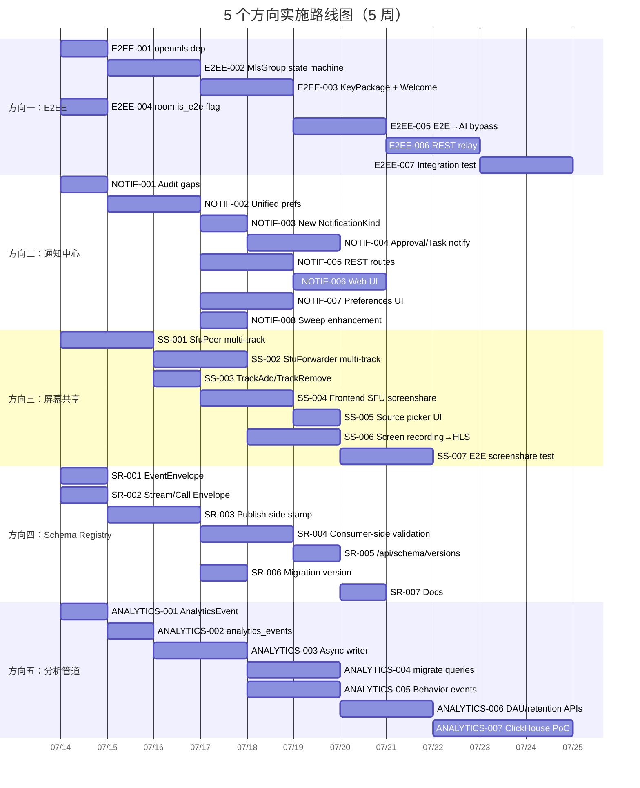

以下是针对 5 个扩展方向分析文档的 **Tech Lead 审查报告**，结合准确性审查结论和代码库实际情况。

---

# 审查报告：5 个扩展方向 — Tech Lead 评估

## ✅ 文档质量总体评价

文档论证结构清晰，每个方向都有代码证据支撑，方向选择有战略合理性。但经代码验证，**方向二（通知中心）和方向三（屏幕共享）存在事实误差**，需要修正后再执行。

| 方向 | 准确性 | 影响 | 修正建议 |
|------|--------|------|---------|
| E2EE | ✅ 基本准确 | 轻微 | 路径修正 `aero-common/src/mls.rs` → `crates/aero-common/src/mls.rs`；已有 `MlsCiphertext` 非空白 |
| 通知中心 | ⚠️ 有显著误差 | 中等 | `activity_feed` 已有 `read_at`；聚合通知已实现；降低紧迫性重新排序 |
| 屏幕共享 | ❌ 严重事实错误 | 严重 | 前端已有完整 1:1 + mesh 屏幕共享；调整方向为「SFU 多轨道转发升级」 |
| Schema Registry | ✅ 准确 | 无 | — |
| 分析管道 | ✅ 准确 | 无 | — |

---

## 1. 任务分解

### 方向一：E2EE（真正 MLS 状态机集成）

| 任务 ID | 标题 | 涉及文件 | 前置依赖 | 预估工时 | 验收标准 |
|---------|------|---------|---------|---------|---------|
| E2EE-001 | 开列 openmls 依赖 & 选择 ciphersuite | `crates/aero-common/Cargo.toml`, `crates/aero-im-core/Cargo.toml` | 无 | 2h | `cargo check` 通过；选定 `MLS_128_DHKEMX25519_AES128GCM_SHA256_Ed25519` |
| E2EE-002 | 实现 `MlsGroup` 状态机构造/序列化/epoch 推进 | `crates/aero-common/src/mls.rs`（大幅扩展） | E2EE-001 | 4h | 单测覆盖：group create → add member → remove → epoch 推进 roundtrip |
| E2EE-003 | 实现 `KeyPackage` 消费与 `Welcome` 消息构造 | `crates/aero-storage/src/mls.rs` | E2EE-002 | 3h | 加解密单测：publisher 发 → subscriber 收 → decrypt → read plaintext |
| E2EE-004 | 建 room-level toggle `is_e2e` + 迁移 | `migrations/NNNN_e2e_room_flag.sql`, `crates/aero-common/src/model/room.rs` | 无 | 2h | 房间创建时可选 E2EE；已有 `MlsCiphertext` 注释对接 |
| E2EE-005 | 路由层：E2E 消息不触发 AI（审核/摘要/RAG/翻译） | `crates/aero-im-core/src/service/orig.rs`, `crates/aero-ai/` | E2EE-004 | 3h | E2E 房间消息走 `MlsCiphertext` 存储；AI 路径跳过该消息 |
| E2EE-006 | 实现 `commit`/`proposal` 信令端到端（REST relay） | `crates/aero-server/src/routes/mls.rs` | E2EE-003, E2EE-005 | 4h | 两个 client 完成 MLS 握手流程；server 仅中继不检查 |
| E2EE-007 | 集成测试：双 client 全流程（CI 跳 E2E 测试） | `tests/e2e_mls.rs` | E2EE-006 | 3h | 标注 `#[ignore]` + E2E 环境标记；手动可验证 |

**方向一小计：21h**（3 人 × 1 工作日 + 缓冲）

---

### 方向二：统一通知中心（修正版）

**修正后范围**：认可已有基础设施（`NotificationKind` 统一枚举、`notification_bundles` 聚合、`activity_feed` 有 `read_at`）；补缺口来自于 ① 审批/任务/频道公告的通知化缺失，② 通知偏好分散，③ 通知中心 UI。

| 任务 ID | 标题 | 涉及文件 | 前置依赖 | 预估工时 | 验收标准 |
|---------|------|---------|---------|---------|---------|
| NOTIF-001 | 审计所有通知产生点，输出缺口清单 | 文档产物（新） | 无 | 2h | 列出 all `NotifyBatch`/`insert` 调用点 + 标注未通知化的子系统 |
| NOTIF-002 | 统一通知偏好存储：合并 `notif_prefs` + `keyword_alerts` + `thread_subs` + `snooze` | `migrations/NNNN_unified_notif_prefs.sql`, `crates/aero-storage/src/notif_prefs.rs` (new) | NOTIF-001 | 4h | 新 `notif_preferences` 表覆盖所有现有偏好；旧表数据迁移脚本 |
| NOTIF-003 | 添加 `TaskAssigned` / `Announcement` / `ApprovalRequest` NotificationKind | `crates/aero-common/src/model/notification.rs` | NOTIF-002 | 2h | 枚举新增变体；`importance_for` 新增映射；推送网关处理新类型 |
| NOTIF-004 | 审批/任务事件 → `NotifyBatch` 扇出 | `crates/aero-im-core/src/service/orig.rs` | NOTIF-003 | 3h | 任务创建/分配、审批请求/完成时插入 `NotifyBatch` |
| NOTIF-005 | 通知中心 REST 路由（批量标记已读/全部已读/删除） | `crates/aero-server/src/notifications.rs` (new) | NOTIF-002 | 3h | `POST /api/notifications/read`（可传 id 列表）; `DELETE /api/notifications/:id` |
| NOTIF-006 | 通知中心 Web UI | `web/notifications.js`, `web/notifications.html` (new) | NOTIF-005 | 4h | 桌面上方铃铛图标 → 下拉面板；分组+已读切换 |
| NOTIF-007 | 推送偏好 UI | `web/settings.html`, `web/settings.js` | NOTIF-002 | 3h | 每个 workspace 每个通知类型可配 DND/推送/Bell only |
| NOTIF-008 | 通知 sweep 策略增强（bundled + individual 双轨） | `crates/aero-server/src/bin/boot/retention.rs` | NOTIF-002 | 2h | 已读通知 90 天 sweep；bundles 30s 窗口 flush |

**方向二小计：23h**（3 人 × 1 工作日 + 缓冲）

---

### 方向三：屏幕共享 SFU 升级（修正版）

**修正后范围**：前端已有 `getDisplayMedia` + `replaceTrack`（1:1 的 `toggleScreenShare` + mesh 的 `gcallToggleScreenShare`）。缺口在 **SFU 侧缺少多轨道转发**（`SfuPeer`/`SfuForwarder` 当前单视频轨道设计）。

| 任务 ID | 标题 | 涉及文件 | 前置依赖 | 预估工时 | 验收标准 |
|---------|------|---------|---------|---------|---------|
| SS-001 | `SfuPeer` 添加 `TrackKind`/`stream_id` 多路复用 | `crates/aero-live-webrtc/src/sfu_peer.rs` | 无 | 4h | 单 peer 可注册多条 video track；`on_rtp` 按 `(stream_id, track_id)` 路由 |
| SS-002 | `SfuForwarder` 多 track 扇出 | `crates/aero-live-webrtc/src/sfu_forwarder.rs` | SS-001 | 3h | forwarder 维护 `HashMap<(stream_id, track_id), Vec<Subscriber>>` |
| SS-003 | 信令层：`CallEvent` 新增 `TrackAdd`/`TrackRemove` | `crates/aero-common/src/model/media.rs` | 无 | 2h | 新变体携带 stream_id + track_kind；客户端 ws 帧处理 |
| SS-004 | 前端：SFU 屏幕共享适配（已有 mesh 逻辑基础上） | `web/calls.js`, `web/sfu.js` | SS-003 | 4h | SFU 模式调用 `getDisplayMedia` → `fetch(/api/whip/...)` 添加 track |
| SS-005 | 前端：选定共享窗口/显示器 UI | `web/calls.js`, `web/sfu.html` | SS-004 | 2h | 共享开始前弹出源选择器（`getDisplayMedia` 自带）；显示已选源名称 |
| SS-006 | 屏幕共享录制：SFU 侧 dump 屏幕 track 到 HLS | `crates/aero-live-webrtc/src/sfu_recorder.rs` (new) | SS-002 | 4h | 录制选项启用时，屏幕 track 并行写入 `HlsWriter` |
| SS-007 | E2E 测试：双浏览器屏幕共享（staging seam） | `tests/e2e_screenshare.rs` | SS-004, SS-005 | 3h | 手动测试 checklist；CI 跳真实 WebRTC |

**方向三小计：22h**（3 人 × 1 工作日）

---

### 方向四：Schema Registry

| 任务 ID | 标题 | 涉及文件 | 前置依赖 | 预估工时 | 验收标准 |
|---------|------|---------|---------|---------|---------|
| SR-001 | 定义 `RoomEventEnvelope`（带 `schema_version: u32` + `kind` + `data`） | `crates/aero-common/src/model/event.rs` | 无 | 2h | 新 `RoomEventEnvelope` 包裹原 `RoomEvent`；向后兼容 |
| SR-002 | 定义 `StreamEventEnvelope` 和 `CallEventEnvelope` | `crates/aero-common/src/live.rs`, `crates/aero-common/src/model/media.rs` | SR-001 | 1h | 同上 |
| SR-003 | bus 发布端：写时 stamp `schema_version` + `event_id` + `timestamp` | `crates/aero-im-core/src/service/events.rs` | SR-001, SR-002 | 3h | `publish_room_event` 输出带 version 的 envelope；无 version 旧 payload 可解码 |
| SR-004 | bus 消费端：读时校验兼容性 + 记录 schema mismatch 指标 | `crates/aero-server/src/ws/ws_impl/bus.rs` | SR-003 | 3h | 未知版本→warn + 指标 `schema_version_mismatch`；不拒绝事件 |
| SR-005 | 版本协商：`/api/schema/versions` 端点 | `crates/aero-server/src/routes/schema.rs` (new) | SR-001 | 2h | GET 返回所支持 `{room_event: 1, stream_event: 1, call_event: 1}` |
| SR-006 | 迁移：添加 `schema_version` 默认值列（可选） | `migrations/NNNN_schema_version.sql` | SR-003 | 1h | 现有事件默认 version=0；新事件 version=1 |
| SR-007 | 手写 OpenAPI schema registry 文档章节 | `docs/schema-registry.md` (new) | SR-005 | 2h | 文档覆盖版本规则 + 向后兼容性策略 + 扩展示例 |

**方向四小计：14h**（2 人 × 1 工作日）

---

### 方向五：分析管道

| 任务 ID | 标题 | 涉及文件 | 前置依赖 | 预估工时 | 验收标准 |
|---------|------|---------|---------|---------|---------|
| ANALYTICS-001 | 定义 `AnalyticsEvent` 枚举 + `AnalyticsEventEnvelope` | `crates/aero-common/src/model/analytics.rs` (new) | 无 | 2h | 枚举覆盖 `MessageSent`/`ReactionAdded`/`CallStarted`/`StreamPublished`/`UserActive` |
| ANALYTICS-002 | 创建 `analytics_events` 表 + 迁移 | `migrations/NNNN_analytics_events.sql` | ANALYTICS-001 | 2h | 分区表（按月）；columns: `event_kind`, `payload_jsonb`, `occurred_at`, `workspace_id`, `actor_id` |
| ANALYTICS-003 | 异步写入：bus 事件 → `AnalyticsRepo.insert` | `crates/aero-storage/src/analytics_events.rs` (new), `crates/aero-server/src/bin/boot/background.rs` | ANALYTICS-002 | 4h | 独立 consumer `analytics-writer`（ephemeral, queue group）；背压有界 mpsc(1024) |
| ANALYTICS-004 | 迁移现有 workspace_analytics 到新管道 | `crates/aero-server/src/analytics.rs` | ANALYTICS-003 | 3h | 新管道写入 `analytics_events`；现有 `COUNT(*)` 查询可切回新表 |
| ANALYTICS-005 | 行为事件：页面浏览/活跃度/功能采用 | `crates/aero-server/src/middleware/analytics.rs` (new) | ANALYTICS-003 | 3h | 中间件 `emit_page_view`；`RoomEvent` 消费端产 `UserActive` 事件 |
| ANALYTICS-006 | 分析 API 增强（趋势/留存/DAU） | `crates/aero-server/src/analytics.rs` | ANALYTICS-004 | 4h | `GET /api/workspaces/:id/analytics/dau`（30天）；`GET .../retention`（周留存） |
| ANALYTICS-007 | ClickHouse 集成可行性 PoC（可选） | `crates/aero-analytics-clickhouse/` (new crate) | ANALYTICS-006 | 6h | Docker compose 加 clickhouse；双写实验；性能对比报告 |

**方向五小计：18–24h**（2 人 × 1.5 工作日，含 ClickHouse POC）

---

## 2. 执行顺序与依赖图

```mermaid
graph TD
    subgraph "Phase 1 — Foundation"
        E2EE_001[E2EE-001: openmls dep] 
        SR_001[SR-001: EventEnvelope]
        SR_002[SR-002: Stream/Call Envelope]
        ANALYTICS_001[ANALYTICS-001: AnalyticsEvent enum]
        SS_001[SS-001: SfuPeer multi-track]
        NOTIF_001[NOTIF-001: Audit notification gaps]
        NOTIF_002[NOTIF-002: Unified preferences]
    end

    subgraph "Phase 2 — Core Logic"
        E2EE_002[E2EE-002: MlsGroup state machine]
        E2EE_003[E2EE-003: KeyPackage + Welcome]
        E2EE_004[E2EE-004: room is_e2e flag]
        SR_003[SR-003: Publish-side stamp]
        SS_002[SS-002: SfuForwarder multi-track]
        SS_003[SS-003: TrackAdd/TrackRemove events]
        NOTIF_003[NOTIF-003: New NotificationKind]
        NOTIF_004[NOTIF-004: Approval/Task → NotifyBatch]
        ANALYTICS_002[ANALYTICS-002: analytics_events table]
        ANALYTICS_003[ANALYTICS-003: Async writer consumer]
    end

    subgraph "Phase 3 — Routes & Integration"
        E2EE_005[E2EE-005: E2E→AI bypass]
        E2EE_006[E2EE-006: REST relay]
        SR_004[SR-004: Consumer-side validation]
        SR_005[SR-005: /api/schema/versions]
        NOTIF_005[NOTIF-005: REST routes]
        NOTIF_006[NOTIF-006: Web UI]
        SS_004[SS-004: Frontend SFU screenshare]
        ANALYTICS_004[ANALYTICS-004: migrate workspace_analytics]
        ANALYTICS_005[ANALYTICS-005: Behavior events]
    end

    subgraph "Phase 4 — Polish & E2E"
        E2EE_007[E2EE-007: E2E integration test]
        SS_005[SS-005: Source picker UI]
        SS_006[SS-006: Screen recording→HLS]
        NOTIF_007[NOTIF-007: Preferences UI]
        NOTIF_008[NOTIF-008: Sweep enhancement]
        SR_006[SR-006: Migration default version]
        SR_007[SR-007: Docs]
        ANALYTICS_006[ANALYTICS-006: DAU/retention APIs]
        ANALYTICS_007[ANALYTICS-007: ClickHouse PoC]
        SS_007[SS-007: E2E screenshare test]
    end

    %% Dependencies
    E2EE_001 --> E2EE_002
    E2EE_002 --> E2EE_003
    E2EE_003 --> E2EE_005
    E2EE_004 --> E2EE_005
    E2EE_005 --> E2EE_006
    E2EE_006 --> E2EE_007

    NOTIF_001 --> NOTIF_002
    NOTIF_002 --> NOTIF_003
    NOTIF_002 --> NOTIF_005
    NOTIF_002 --> NOTIF_008
    NOTIF_003 --> NOTIF_004
    NOTIF_005 --> NOTIF_006
    NOTIF_002 --> NOTIF_007

    SR_001 --> SR_003
    SR_002 --> SR_003
    SR_003 --> SR_004
    SR_003 --> SR_006
    SR_004 --> SR_005
    SR_005 --> SR_007

    SS_001 --> SS_002
    SS_002 --> SS_006
    SS_001 --> SS_003
    SS_003 --> SS_004
    SS_004 --> SS_005
    SS_004 --> SS_007

    ANALYTICS_001 --> ANALYTICS_002
    ANALYTICS_002 --> ANALYTICS_003
    ANALYTICS_003 --> ANALYTICS_004
    ANALYTICS_003 --> ANALYTICS_005
    ANALYTICS_004 --> ANALYTICS_006
    ANALYTICS_006 --> ANALYTICS_007

    %% Cross-dependency (real but not blocking)
    SR_003 -.-> ANALYTICS_003

    style E2EE_001 fill:#f9f,stroke:#333
    style SR_001 fill:#bbf,stroke:#333
    style SS_001 fill:#bfb,stroke:#333
    style NOTIF_002 fill:#ffb,stroke:#333
    style ANALYTICS_003 fill:#fbb,stroke:#333
```



### 可并行执行的任务组

| 并行组 | 任务 | 说明 |
|--------|------|------|
| **组 A** | E2EE-001, SR-001+002, SS-001, NOTIF-001+002, ANALYTICS-001 | 所有方向的基础工作，互不依赖 |
| **组 B** | E2EE-002+003+004, SR-003, SS-002+003, NOTIF-003+004, ANALYTICS-002 | 核心逻辑并行开发 |
| **组 C** | E2EE-005+006, SR-004+005, SS-004, NOTIF-005, ANALYTICS-004+005 | 路由层集成 |
| **组 D** | E2EE-007, SS-005+006+007, NOTIF-006+007+008, SR-006+007, ANALYTICS-006+007 | 测试+UI+文档 |

---

## 3. 技术风险

### 3.1 高影响风险

| 风险 | 方向 | 影响 | 概率 | 缓解策略 |
|------|------|------|------|---------|
| **openmls 版本冲突/API 不稳定** | E2EE | Rust crate 版本冲突；openmls 依赖 `tls13` + `hpke` 可能与已有 crates 冲突 | 中 | 隔离到独立 crate；先 PoC 验证编译兼容性；锁定 openmls minor 版本 |
| **WebRTC 多 track 信令兼容性** | 屏幕共享 | 现有 browser `replaceTrack` 工作流与 SFU 多 track 信令可能不兼容 | 中 | 信令兼容性矩阵测试（Chrome/Firefox/Safari）；保持 `replaceTrack` fallback |
| **分析管道写放大** | 分析 | 每消息每秒产多个 `AnalyticsEvent`（message + reaction + read），写入 PG 主库产生瓶颈 | 低→中 | 有界 mpsc + 批量 insert（每 5s flsuh）；长线移到 ClickHouse 或 `pg_analytics` |
| **通知聚合重入** | 通知 | `NotifyBatch` 扇出 + bundle flush 双路径可能导致重复通知 | 中 | `ON CONFLICT DO NOTHING` 幂等；flush 事务带 `FOR UPDATE SKIP LOCKED` |
| **E2EE 与 AI 的不可逆矛盾** | E2EE | 打开 E2EE 的房间无法使用审核/摘要/RAG——产品决策风险 | 高（产品侧） | 房间级 toggle + 产品文档明确告知；API 返回 `409 Conflict` 当 AI 功能请求 E2E 消息 |
| **后向兼容的 envelope 引入** | Schema Registry | 已部署的生产节点收到的无 `schema_version` 事件需要正确处理 | 中 | `version: Option<u32>` 默认为 0；消费端 version=0 视为兼容；不拒绝旧 payload |
| **ClickHouse 运维复杂度** | 分析 | 引入新数据库组件增加部署/迁移/成本 | 低（PoC 可控） | ClickHouse 为 Phase 4 PoC；Phase 1-3 纯 PG |

### 3.2 技术债务与存量代码约束

| 约束 | 说明 | 缓解 |
|------|------|------|
| `tag = "kind"` 字段名冲突 | serde 枚举标签 `kind` 与变体内部字段可能撞名（已有 `#[serde(rename)]` 模式） | 新事件显式 `#[serde(rename)]`；CI 添加 lint 检查 |
| `token helper` 同名冲突 | `generate_token`/`hash_token` 在 `webhook/scim/invitation` 三个模块有同名函数 | 遵循 AGENTS.md §4.2 约束：只在 root re-export `webhook` 的版本 |
| `data/` 目录权限 | Docker 容器以 root 创建，默认写不进 | 参考已有模式覆写 `AERO__SERVER__BLOB_DIR=/tmp/aero/blobs` |
| 迁移编译期嵌入 | `sqlx::migrate!("../../migrations")` 将整个文件夹编译进 bin | 加迁移后必须先 `cargo build` 再运行 `aero-cli migrate` |
| E2E 测试无法在 CI 跑 | WebRTC/MLS 需要真实浏览器/对端 | 全部标注 `#[ignore]` + staging seam 标记；本地手动验证 checklist |

---

## 4. 资源评估

### 4.1 团队规模与技能要求

| 角色 | 数量 | 关键技能 | 主要负责方向 |
|------|------|---------|-------------|
| **Rust 后端工程师 A**（Senior） | 1 | tokio/axum/sqlx 深度经验；WebRTC/SFU 理解 | 屏幕共享 (SS) + Schema Registry (SR) |
| **Rust 后端工程师 B**（Senior） | 1 | 密码学/安全背景；NATS/JetStream | E2EE + 通知中心骨干 |
| **Rust 后端工程师 C**（Mid） | 1 | PostgreSQL/分析查询；中间件开发 | 分析管道 + 通知系统补全 |
| **前端工程师** | 1 | WebRTC API/WebSocket；ES2020 无框架 SPA 经验 | 通知中心 UI + 屏幕共享 UI |
| **QA 工程师**（Part-time） | 0.5 | WebRTC staging seam 测试；E2E 测试脚本 | 集成测试 + staging seam |

**优化场景**：如果资源受限，可以 3 人并行（2 Rust + 1 前端），按 Phase 切分。

### 4.2 关键里程碑

| 里程碑 | 时间 | 交付物 |
|--------|------|--------|
| **M1 — 基础设施就绪** | 第 1 周末 | 方向一~五的基础依赖/类型/迁移全部 check-in；`cargo check --workspace` 干净 |
| **M2 — 核心逻辑完成** | 第 2 周末 | `MlsGroup` 状态机单测通过；SFU 多 track 单测通过；`AnalyticsEvent` consumer 写入成功；通知偏好好合并迁移可回滚 |
| **M3 — API 集成** | 第 3 周末 | 所有方向 REST 路由可调；Schema Registry 版本协商端到端；屏幕共享 SFU 信令 + 前端可联调 |
| **M4 — UI 与 E2E** | 第 4 周末 | 通知中心 UI 交互可用；屏幕共享 SFU 完整流程（双浏览器）；分析 DAU/留存 API 就绪 |
| **M5 — 发布前审核** | 第 5 周中 | `cargo clippy` 零新增警告；`scripts/truth-check.sh` 通过；staging 环境冒烟测试 |

### 4.3 阻塞点 & 解决策略

| 阻塞点 | 方向 | 解决策略 | 紧急度 |
|--------|------|---------|--------|
| **openmls crate 兼容性验证** | E2EE | 第一个工作日做 PoC：新建分支加 openmls → `cargo check`。失败则回退到 `f poko/mls` 等替代方案 | **高**（决定方向是否可行） |
| **SFU 多 track 设计** | 屏幕共享 | 第 1 周安排架构讨论：确定 `(stream_id, track_id)` 路由方案；参考 str0m 的 `MediaStreamId` API | 中 |
| **ClickHouse 引入决策** | 分析 | Phase 4 前做 PoC；评估 `pg_analytics`（PG 扩展）作为轻量替代 | 低（Phase 4 才需要） |

---

## 5. 质量保证

### 5.1 单元测试覆盖要求

| 模块 | 最低覆盖率 | 关键测试场景 |
|------|-----------|-------------|
| `MlsGroup` 状态机（E2EE-002） | 90%+ | 创建 → 序列化 → 反序列化 → add/remove → commit → epoch 校验 |
| `SfuPeer` 多 track 路由（SS-001） | 85%+ | 注册 track → 按 track 扇出 → 移除 track → 空订阅者收敛 |
| `EventEnvelope` 解析（SR-003/004） | 95%+ | 有 version → 无 version → 未知 version → version 不匹配 |
| `AnalyticsEvent` 写入（ANALYTICS-003） | 80%+ | 批量 insert → 背压 → consumer 恢复 |
| `NotificationBundle` flush（NOTIF-008） | 90%+ | 聚合 >1 → 单条 → 竞争 flush → FOR UPDATE SKIP LOCKED |

### 5.2 集成测试策略

| 测试层级 | 工具 | 覆盖内容 | CI 运行？ |
|---------|------|---------|----------|
| Rust 单元测试 | `cargo test --lib` | 纯逻辑无 DB/网络 | ✅ 每次提交 |
| Rust 集成测试（PG） | `cargo test --lib -- --ignored` + `DATABASE_URL` | 仓储层真实查询 | ❌ 仅本地/CI 有 PG 时 |
| E2E 全链路（无 WebRTC） | 脚本 + `curl` | REST + WS 基本流程 | ✅ 可自动化 |
| E2E 全链路（含 WebRTC） | 手动 checklist | 屏幕共享双浏览器 + 通话 | ❌ staging seam |
| 迁移回滚 | `make migrate-smoke` | Fresh deploy 全链迁移可回退 | ✅ 每次 migration 新增 |

### 5.3 代码审查要点

| 审查维度 | 重点关注 |
|---------|---------|
| **安全** | E2EE 路由不应解包/检查 `MlsCiphertext` 内部；openmls 版本审计 |
| **并发** | `SfuForwarder` 中 `HashMap` 使用 `RwLock` 或 `DashMap`；`FOR UPDATE SKIP LOCKED` 在 `flush()` 中使用正确 |
| **幂等** | 所有付费/外发路径有幂等键（`call_bridge`、`AnalyticsEvent` 写入可重复） |
| **后向兼容** | `EventEnvelope` 引入不破坏现有 consumer；`deny_unknown_fields` 不使用 |
| **性能** | `AnalyticsEvent` 批量 insert batch size ≤ 500；`notification_bundles.flush` 受 bound 控制 |
| **审计追踪** | E2EE 房间软删/审核仍需记录（但 AI 审核跳过）；WebRTC SFU 信令记录 |

### 5.4 性能测试需求

| 场景 | 指标 | 目标 | 工具 |
|------|------|------|------|
| 分析管道背压 | P99 写入延迟 < 100ms @1000 events/s | 50 events/s 实际负载 10x | `cargo bench` + `locust` |
| 屏幕共享 SFU 多 track | 3 路 screen track 扇出给 10 订阅者 | CPU < 20% per track | `webrtc-bench` |
| 通知 bundle flush | 1000 bundle/s 聚合延迟 < 30s | flush 窗口 ≤ 30s | 白盒 metrics |
| E2EE message throughput | 100 msg/s 房间 | 编码+存储延迟 < 50ms | `cargo bench` |
| Schema Registry 版本检查 | 100k events/min 未知 version | 指标计数值正确，0 拒绝 | 注入测试 |

---

## 6. 实施计划

### 甘特图



### 阶段详细说明

#### 阶段 1 — 基础设施搭建（Day 1–3）

**目标**：5 个方向的基础依赖全部就绪，`cargo check --workspace` 干净。

| 日 | 活动 | 输出 |
|---|------|------|
| Day 1 | ① openmls PoC（E2EE-001）；② `EventEnvelope` 定义（SR-001/002）；③ `SfuPeer` 多 track 接口设计（SS-001）；④ `AnalyticsEvent` 枚举（ANALYTICS-001） | `cargo check` 通过；设计文档（SFU multi-track 方案） |
| Day 2 | ① 通知缺口审计完成（NOTIF-001）；② 统一通知偏好迁移 SQL（NOTIF-002）；③ `analytics_events` 迁移 SQL（ANALYTICS-002）；④ 通知 bundle 增强设计 | 迁移文件（待 build）；gap list |
| Day 3 | ① 通知偏好 repo（NOTIF-002 完成）；② `AnalyticsRepo` + consumer scaffold（ANALYTICS-003 进行中）；③ SS-001 实现开始 | 可运行的 consumer scaffold |

**阶段 1 关键决策点**：openmls PoC 结果——如果 crate 冲突不可解，E2EE 降级为「预留接口不开实现」。

#### 阶段 2 — 核心功能实现（Day 4–10）

**目标**：所有方向的核心逻辑可测试。

| 天 | 交付 |
|----|------|
| Day 4–5 | E2EE `MlsGroup` 状态机单测通过（E2EE-002/003）；`SfuForwarder` 多 track 单测（SS-002）；统一通知偏好合并完成（NOTIF-002） |
| Day 6–7 | `is_e2e` 房间 toggle（E2EE-004）；SFU `TrackAdd/TrackRemove` 信令（SS-003）；新 `NotificationKind` 枚举（NOTIF-003）；`AnalyticsEvent` consumer 写入完成（ANALYTICS-003） |
| Day 8–10 | E2EE→AI bypass（E2EE-005）；通知生产点插入（NOTIF-004）；前端 SFU 屏幕共享适配开始（SS-004）；通知中心 REST 开始（NOTIF-005）；分析查询迁移（ANALYTICS-004） |

#### 阶段 3 — 集成测试和优化（Day 11–17）

**目标**：所有 API 可用，前端可联调。

| 天 | 交付 |
|----|------|
| Day 11–13 | E2EE REST relay（E2EE-006）完成；Schema Registry 消费端校验（SR-004）；通知中心路由完成（NOTIF-005）；SFU 前端屏幕共享可联调（SS-004） |
| Day 14–15 | Schema Registry `/api/schema/versions` 端点（SR-005）；屏幕共享录制写入 HLS（SS-006）；行为事件中间件（ANALYTICS-005） |
| Day 16–17 | 通知中心 Web UI 可用（NOTIF-006）；DAU/留存 API（ANALYTICS-006）；Schema Registry 迁移 + 文档（SR-006/007） |

#### 阶段 4 — 发布准备（Day 18–25）

**目标**：全量测试通过，文档完备。

| 天 | 交付 |
|----|------|
| Day 18–20 | E2EE 集成测试（E2EE-007）；屏幕共享源选择器 UI（SS-005）；通知偏好 UI（NOTIF-007）；屏幕共享 E2E 测试（SS-007） |
| Day 21–23 | 通知 sweep 增强（NOTIF-008）；全面 `cargo clippy` 零新增警告；`scripts/truth-check.sh` 通过 |
| Day 24–25 | ClickHouse PoC（ANALYTICS-007）— 可选；staging 环境冒烟；发布 checklist 审核 |

---

## 总结：行动建议

### 优先顺序（修正版）

```
高优先（Phase 1-2）
  ├─ Schema Registry (SR) — 低成本高价值，2 人·周完成
  ├─ 通知中心 (NOTIF) — 修正后降低范围，已有基础设施，3 人·周完成
  └─ 分析管道 (ANALYTICS) — 分阶段 Phase 1-3 纯 PG，Phase 4 加 ClickHouse

中优先（Phase 2-3）
  └─ 屏幕共享 SFU 升级 (SS) — 修正范围后是现有功能的架构升级，3 人·周

低优先（Phase 3-4，产品决策依赖）
  └─ E2EE (E2EE) — 需确认产品战略是否真的要开；openmls PoC 先做验证
```

### 五个「别踩的坑」

1. **不要在通知中心方向重造已有基础设施**：`NotificationKind` 已统一、`notification_bundles` 已聚合、`activity_feed` 已有 `read_at`——文档的「从零构建」论调已证伪。
2. **不要在屏幕共享方向从零造前端**：`calls.js` 已有 `getDisplayMedia` + `replaceTrack` + `toggleScreenShare` + `gcallToggleScreenShare`——只需要升级 SFU 侧多 track 转发。
3. **不要冒险在 root 加 str0m 依赖**：AGENTS.md 明确 `root 无 str0m`；只加在 `aero-live-webrtc` 和 `aero-live-whip`。
4. **不要动了通知偏好迁移后忘了通知化审批/任务子系统**：缺口审计后立刻补上。
5. **不要忘了 `data/` 目录权限**：先 `mkdir /tmp/aero/{blobs,hls}` 再起服务。

### 立即行动（第一天上午）

1. `git checkout -b tech-lead-review` — 冻结基线
2. 3 人并行 PoC：
   - 工程师 A：`cargo add openmls` 到 `aero-common` → `cargo check`（E2EE-001）
   - 工程师 B：`EventEnvelope` 定义 + 迁移 SQL（SR-001/002 + NOTIF-002）
   - 工程师 C：`AnalyticsEvent` 枚举 + `analytics_events` 迁移（ANALYTICS-001/002）
3. 午饭前 3 个 PR 提审
