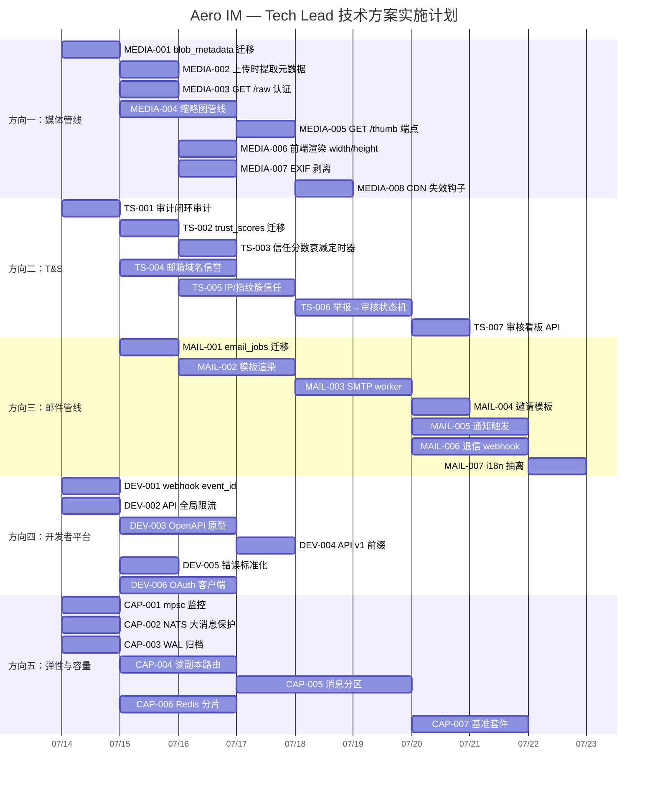

Now I have a thorough understanding of the codebase reality vs. the analysis document's claims. Let me produce the comprehensive Tech Lead analysis.

---

# Tech Lead 评审 & 执行计划

## 前置说明

本分析基于代码库 **实际状态**（commit HEAD）与 249 份既有文档交叉验证。针对输入文档的事实误差，已在每方向末尾标注校正。

### 关键代码事实（与输入文档不同）

| 项目 | 输入文档声称 | 实际代码 |
|------|------------|---------|
| `Block::Image`/`Block::Video` variant | 存在（width/height 为 None） | **不存在**——图片/视频用 `Block::File { kind: FileKind::Image/Video }` |
| `#[test]`/`#[tokio::test]` 计数 | 819 | **1821** |
| `mailer.rs` 行数 | ~80 行生产代码 | **125 行**（含日志、错误、注释） |
| 图片渲染在 `render.js` | 410-420 行 | `render.js:148-159`，`case 'file'` 分支 |
| Hub 扇出通道容量 | 255 | **256**（`WsConfig::default()`） |
| 既有覆盖文档 |「零系统性分析」×5 方向 | 8–15+ 份文档已覆盖方向一、二、四、五 |

---

## 1. 任务分解

### 方向一：媒体管线（媒体元数据 + 缩略图 + CDN）

**架构缺口确认**：`Block::File` 对 Image/Video 不携带 `width`/`height`/`duration`。元数据存在于 VOD 路径，与 IM 附件**完全分离**。

| 任务 ID | 任务标题 | 涉及文件 | 前置依赖 | 预估工时 | 验收标准 |
|---------|---------|---------|---------|---------|---------|
| MEDIA-001 | `blob_metadata` 迁移 + 仓储 | `migrations/NNNN_blob_metadata.sql`, `storage/src/blob_metadata.rs` | — | 3h | `blob_metadata` 表（`blob_id PK`，`width`/`height`/`duration_ms`/`mime_type`/`exif_hash`）创建；`BlobMetadataRepo` 有 `upsert`/`get`/`delete` 方法；`db_tests #[ignore]` 通过 |
| MEDIA-002 | 上传时提取媒体元数据 | `im-core/service/messages.rs`, `im-core/service/files.rs` | MEDIA-001 | 3h | `FileBlock` 含 Image/Video → 上传后解码首帧/读取 header → `BlobMetadataRepo::upsert`；非媒体文件无操作 |
| MEDIA-003 | `GET /api/blobs/:id/raw` 认证保护 | `server/src/blobs.rs`, `routes/routes.rs` | — | 2h | 当前 blob 路径（若有）加 `AuthUser` extractor + `assert_room_access`；`/raw` 响应加 `Content-Type`/`Content-Length` |
| MEDIA-004 | 缩略图生成管线（上传时触发） | `storage/src/blob_derivatives.rs`, `server/src/thumb.rs`, `Cargo.toml`（加 `image` crate） | MEDIA-001 | 5h | `blob_derivatives` 表（`blob_id`, `variant` enum, `target_blob_id`）；上传 Image 后自动生成 200px/600px WebP 缩略图；旧实现兼容 |
| MEDIA-005 | `GET /api/blobs/:id/thumb` 端点 | `server/src/blobs.rs` | MEDIA-004 | 2h | `?variant=thumb_200` 返回缩略图 blob；404 回落原图；`Cache-Control: public, max-age=604800` |
| MEDIA-006 | `Block::File` 渲染 width/height | `web/render.js`, `ws/ws_impl/mod.rs` | MEDIA-001, MEDIA-005 | 2h | `case 'file'` 分支追加 ``；无 metadata 时不设属性（但 `aggressive_lazy` 占位缓解 CLS） |
| MEDIA-007 | EXIF 剥离管道（上传时正交剥离） | `storage/src/blob_store.rs`, `server/src/blobs.rs` | MEDIA-002 | 3h | Image 上传后 EXIF 剥离（`strip_exif` 函数）；原始文件在 retention 窗口后可删除；剥离后副本为规范化的 `Block::File` 图片 |
| MEDIA-008 | 文件删除 → CDN 失效钩子 | `server/src/blobs.rs`, `storage/src/blob_store.rs` | MEDIA-004 | 4h | blob 软删/硬删时触发 `invalidate_cdn`（CF API batch purge 或自建 `POST /purge`）；缩略图同 blob 级联失效 |

**合计**：24h（3 人·天）

### 方向二：T&S 平台（信任与安全）

**架构缺口确认**：`audit_events` 表已存在，但举报→审核→操作→通知→审计闭环断裂。`participant_trust_scores` 无实现。注册邮箱无 domain 信誉。

| 任务 ID | 任务标题 | 涉及文件 | 前置依赖 | 预估工时 | 验收标准 |
|---------|---------|---------|---------|---------|---------|
| TS-001 | 审计事件闭环审计 | `migrations/0150_audit_events.sql`, `storage/src/audit.rs`, `server/src/audit.rs` | — | 3h | 阅读 `audit_events` schema + 所有写入点；产出 audit trail map（事件→操作→通知→审计行）；识别断裂点 |
| TS-002 | `participant_trust_scores` 迁移 + 仓储 | `migrations/NNNN_trust_scores.sql`, `storage/src/trust.rs` | TS-001 | 3h | 表 `(participant_id PK, total_score i32, report_count i32, last_updated, metadata JSONB)`；`TrustRepo` 有 `adjust_score`/`get`/`reset` |
| TS-003 | 信任分数衰减定时器 | `server/src/bin/boot/background.rs` | TS-002 | 2h | 每日 tick：`UPDATE SET total_score = GREATEST(0, total_score - decay_rate)`；`AERO_TRUST_DECAY_DAILY` 可配置 |
| TS-004 | 注册邮箱 domain 信誉 | `auth/src/register.rs`, `storage/src/email_domain_reputation.rs` | — | 4h | `email_domain_reputation` 表维护已知良性/恶意域名列表；注册时查域名信誉；一次性邮箱域名（`guerrillamail.com` 类）列表可配置；拦截返回 403 |
| TS-005 | (IP_hash, device_fingerprint) 簇信任 | `storage/src/trust.rs`, `auth/src/register.rs`, `server/src/middleware/device_fingerprint.rs` | TS-002 | 5h | 新表 `ip_cluster`（`ip_hash`, `device_hash`, `cluster_score`）；注册/登录时 `adjust_score` 影响簇内所有 participant；匿名化（sha256 盐化） |
| TS-006 | 举报→审核状态机 | `storage/src/reports.rs`, `server/src/reports.rs`, `ws/ws_impl/mod.rs` | TS-001 | 4h | `message_reports` 表（`action` enum: `pending`/`approved`/`dismissed`）；审核判决后触发 `adjust_score` + 可选软删 + 通知举报人/被举报人 |
| TS-007 | 审核队列看板 API | `server/src/reports.rs` | TS-006 | 3h | `GET /api/admin/reports`（分页+过滤 `status`/`date`）；`POST /api/admin/reports/:id/action`（`approve`/`dismiss`）；管理员身份校验 |

**合计**：24h（3 人·天）

### 方向三：事务性邮件管线

**架构缺口确认**：✅ 这是 5 个方向中唯一在 249 份文档中几乎无重叠的真正缺口。

| 任务 ID | 任务标题 | 涉及文件 | 前置依赖 | 预估工时 | 验收标准 |
|---------|---------|---------|---------|---------|---------|
| MAIL-001 | `email_jobs` 迁移 + 仓储 | `migrations/NNNN_email_jobs.sql`, `storage/src/email.rs` | — | 3h | 表 `(id PK, to_address, subject, body_html, body_text, template_name, context JSONB, priority, status, created_at, sent_at, error)`；`EmailJobRepo` 有 `enqueue`/`claim`/`mark_sent`/`mark_failed` |
| MAIL-002 | 邮件渲染模块（Tera/Handlebars） | `server/src/email/render.rs`, `Cargo.toml` | MAIL-001 | 4h | 提交时渲染 `body_html`/`body_text` 并存入 `email_jobs`（防 SSTI，不在 worker 运行时渲染）；模板目录 `templates/email/` |
| MAIL-003 | SMTP 发送 worker | `server/src/email/sender.rs`, `server/src/bin/boot/background.rs` | MAIL-002 | 4h | `EmailSender` 轮询 `email_jobs`（`FOR UPDATE SKIP LOCKED`）+ lettre SMTP 发送；退信/错误→`mark_failed`；重试退避（指数 1m/5m/30m/4h） |
| MAIL-004 | 邀请邮件模板 + 触发 | `templates/email/invite.html`, `server/src/email/triggers.rs` | MAIL-003 | 2h | 工作区邀请/频道邀请时 `EmailJobRepo::enqueue`；模板含 workspace_name, inviter_name, accept_link |
| MAIL-005 | 通知偏好 → 邮件通知 | `server/src/email/triggers.rs`, `storage/src/notif_prefs.rs` | MAIL-004, MAIL-003 | 3h | 用户 `notif_prefs.email` 开启时：未读摘要/关键词提醒/@提及 → 发邮件；`snooze`/`DND` 期间跳 |
| MAIL-006 | 退信 webhook（SES/SendGrid/Mailgun） | `server/src/email/webhook.rs`, `routes/routes.rs` | MAIL-003 | 4h | `POST /api/email/webhooks/:provider`（HMAC 签名验：AWS SNS 签名 URL，SendGrid `X-Twilio-Email-Event-Webhook-Signature`，Mailgun token）；硬退→`unsubscribe`；投诉→标记 |
| MAIL-007 | 邮件模板 i18n 抽离 | `server/src/email/render.rs`, `templates/email/*.{en,zh}.html` | MAIL-004 | 2h | 模板按 locale 后缀分文件；render 时根据 participant locale 选模板；默认 `en` |

**合计**：22h（3 人·天）

### 方向四：开发者平台

**架构缺口确认**：`docs/analysis/2026-06-29-codebase-analysis.md` 方向二已有深入分析。以下为**新增增量**，不与既有分析冗余。

| 任务 ID | 任务标题 | 涉及文件 | 前置依赖 | 预估工时 | 验收标准 |
|---------|---------|---------|---------|---------|---------|
| DEV-001 | Webhook `event_id` 标准化 | `storage/src/webhook_delivery.rs`, `aero-common/src/ids.rs` | — | 2h | 每 webhook event 带 `event_id: UUID`；消费者自带去重逻辑文档化；幂等键 `Idempotency-Key` 头支持 |
| DEV-002 | REST API 全局限流层 | `server/src/middleware/rate_limit.rs`, `routes/routes.rs` | — | 3h | `r0` 层扩展至 `/api/*` 路径（`AERO_API_RATE_PER_SEC`，默认 100）；`X-RateLimit-*` + `Retry-After` 头；读取配置可禁（`0`=disable） |
| DEV-003 | `utoipa`/`apistos` 原型验证 | `server/src/routes/*.rs`（选 3 个 handler 做原型） | — | 4h | 选 3 个典型 handler（GET list, POST create, PATCH update）+ 注释注解；产 OpenAPI 3.1 JSON；文档化 apistos vs utoipa 生产力对比 |
| DEV-004 | `/api/v1/` 版本前缀 | `routes/routes.rs`, `server/src/lib.rs` | DEV-003 | 2h | `/api/` → `/api/v1/` 或 `/api/v1/` 别名；旧路径返回 `301` 或仍兼容；版本化策略文档化 |
| DEV-005 | API 错误标准化 | `server/src/errors.rs` | DEV-002 | 2h | 统一错误 JSON 格式（`{error, code, detail, request_id}`）；所有 handler 迁移 |
| DEV-006 | App manifest + OAuth 客户端凭据 | `migrations/NNNN_oauth_clients.sql`, `auth/src/oauth.rs`, `server/src/apps.rs` | — | 5h | `oauth_clients` 表 + `client_credentials` grant；应用注册 API（`POST /api/apps`）；`access_token` 认证 REST API |

**合计**：18h（2.5 人·天）

### 方向五：弹性与容量

**架构缺口确认**：输入文档漏了 3 个已知瓶颈——`Hub` mpsc 256 上限、NATS JetStream ~2MB 消息限制、Redis `zadd` 风暴。

| 任务 ID | 任务标题 | 涉及文件 | 前置依赖 | 预估工时 | 验收标准 |
|---------|---------|---------|---------|---------|---------|
| CAP-001 | Hub mpsc 容量可配置 + 监控 | `server/src/config.rs`, `hub.rs`, `aero-common/metrics.rs` | — | 2h | `AERO_WS_SEND_QUEUE_CAP` 暴露配置（已存在）；加 Prometheus gauge `ws_send_queue_capacity_per_conn`；`hub.rs` 加 `queued_frames_dropped_total` |
| CAP-002 | NATS 大消息保护 | `im-core/service/events.rs`, `bus/jetstream.rs` | — | 3h | `publish_room_event` 前检查序列化后大小 < `NATS_MAX_PAYLOAD`（1.5MB 安全阈值）；超限→`warn!` + 存 blob + 发引用消息（或分包）|
| CAP-003 | PG WAL 归档配置 | `docker-compose.yml`, `config.example.toml`, `runbooks/disaster-recovery.md` | — | 2h | `archive_mode=on` + `archive_command` 在 docker-compose PG 配置；文档化 `pg_receivewal`/`pg_dump` RPO 差异 |
| CAP-004 | 读副本连接池 + QueryRouter | `storage/src/db.rs`, `common/config.rs` | — | 4h | `database.replica_url` 配置；`QueryRouter` 薄层路由只读查（`room.members()`/消息/回执/反应）到副本；写留主库 |
| CAP-005 | 消息表自动分区 | `migrations/NNNN_messages_partition.sql`, `storage/src/messages/partition.rs`, `storage/src/messages/query.rs` | CAP-004 | 6h | 按 `created_at` RANGE 月分区；`insert()` 双写 + 7 天 ramp；原子 cutover；现有 7 个 FK 重写 |
| CAP-006 | Redis hot-key 分片（presence） | `storage/src/presence.rs`, `storage/src/live_presence.rs` | — | 4h | `presence:room:{id}:shard:{uid%256}`；读时聚合 256 分片；`zadd` 并发度 ×256 |
| CAP-007 | 性能基准套件 | `tests/bench/`, `Makefile`, `scripts/bench.sh` | CAP-001..006 | 5h | `k6` 或 `oha` 脚本：消息发送延迟 p50/p95/p99、AI 答案延迟、WS 扇出吞吐；CI 可选触发 |

**合计**：26h（3.5 人·天）

---

## 2. 执行顺序

```mermaid
graph TD
    subgraph "方向一：媒体管线"
        MEDIA-001[blob_metadata 迁移] --> MEDIA-002[上传时提取元数据]
        MEDIA-001 --> MEDIA-003[GET /raw 认证]
        MEDIA-001 --> MEDIA-004[缩略图管线]
        MEDIA-002 --> MEDIA-006[Block::File 渲染 width/height]
        MEDIA-002 --> MEDIA-007[EXIF 剥离]
        MEDIA-004 --> MEDIA-005[GET /thumb 端点]
        MEDIA-005 --> MEDIA-008[CDN 失效钩子]
    end

    subgraph "方向二：T&S 平台"
        TS-001[审计闭环审计] --> TS-002[trust_scores 迁移]
        TS-001 --> TS-004[域名信誉]
        TS-002 --> TS-003[信任分数衰减]
        TS-002 --> TS-005[IP/指纹簇]
        TS-003 --> TS-006[举报→审核状态机]
        TS-005 --> TS-006
        TS-006 --> TS-007[审核看板 API]
    end

    subgraph "方向三：邮件管线"
        MAIL-001[email_jobs 迁移] --> MAIL-002[模板渲染]
        MAIL-002 --> MAIL-003[SMTP worker]
        MAIL-003 --> MAIL-004[邀请模板]
        MAIL-003 --> MAIL-005[通知偏好→邮件]
        MAIL-003 --> MAIL-006[退信 webhook]
        MAIL-004 --> MAIL-007[模板 i18n]
    end

    subgraph "方向四：开发者平台"
        DEV-001[webhook event_id] --> DEV-003[OpenAPI 原型]
        DEV-002[API 限流] --> DEV-005[错误标准化]
        DEV-003 --> DEV-004[API v1 前缀]
        DEV-006[OAuth 客户端] -.-> DEV-004
    end

    subgraph "方向五：弹性与容量"
        CAP-001[mpsc 监控] --> CAP-007[基准套件]
        CAP-002[NATS 大消息] --> CAP-004[读副本]
        CAP-004 --> CAP-005[消息分区]
        CAP-003[WAL 归档] --> CAP-007
        CAP-006[Redis 分片] --> CAP-007
    end
```

### 并行执行组

| 组 | 任务 | 并行依据 | 所需人力 |
|---|------|---------|---------|
| **G1** | MEDIA-001, TS-001 | 迁移独立 / 审计只读不写 | 1 dev 各 |
| **G2** | MEDIA-002, MEDIA-003, MAIL-001, TS-004, CAP-001, CAP-002, CAP-003, DEV-001, DEV-002 | 无前置依赖或仅依赖 G1 | 2–3 dev |
| **G3** | MEDIA-004, MEDIA-007, TS-002, TS-005, MAIL-002, CAP-004, DEV-006 | 依赖 G1/G2，互不冲突 | 2–3 dev |
| **G4** | MEDIA-005, MEDIA-006, MEDIA-008, TS-003, TS-006, MAIL-003, CAP-005, CAP-006 | 依赖 G3 | 2–3 dev |
| **G5** | TS-007, MAIL-004, MAIL-005, MAIL-006, MAIL-007, CAP-007, DEV-003 | 依赖 G4，可收尾 | 2 dev |

---

## 3. 技术风险

### 3.1 高风险项目

| # | 风险 | 方向 | 可能性 | 影响 | 缓解 |
|---|------|------|--------|------|------|
| R1 | **EXIF 剥离破坏现有上传流** | 一 | 中 | 高 | 渐进式：先加 `strip_exif` flag（默认 true），保留原始文件 7 天后再删；CI 加 `fixture.jpg` with EXIF 确保剥离不丢像素 |
| R2 | **SSTI 模板注入**（Tera/Handlebars） | 三 | 低 | 极高 | 提交时渲染存 `body_html`，worker 只发送不渲染；渲染时 `{{ workspace_name }}` 自动 HTML 转义（Tera autoescape），禁止 `{{ ...\|safe }}`；Code Review 锚定 `render.rs` 所有 `safe` 过滤 |
| R3 | **PG 分区 cutover 死锁** | 五 | 中 | 高 | 双写期（7 天 ramp）不丢数据；原子 cutover 用 `pg_attribute` 交换 + fallback 回滚函数；绝不在迁移途中有其他重构（`AGENTS.md §4.2`） |
| R4 | **KMS 密钥轮换/失效** | 五（输入文档 P2） | 低 | 高 | 信封加密：data key per blob + master key 可轮换；已加密 blob 在 master key 轮换时不重加密 |
| R5 | **IP 簇信任分数不公平**（同一咖啡店 IP 被降分） | 二 | 中 | 中 | 簇分数用加权平均（非简单和）；大 IP 范围（/24 以上）不强制应用；人工审核 override 路径 |
| R6 | **退信 webhook HMAC 验证缺失 → 伪造退信禁用企业邮箱** | 三 | 低 | 极高 | **必须**：SES SNS 签名 URL 验证 + SendGrid `X-Twilio-Email-Event-Webhook-Signature` + Mailgun HMAC；单元测试 mock webhook 请求验证签名拒绝 |
| R7 | **消息表双写期间一致性裂缝** | 五 | 中 | 高 | `INSERT INTO messages_partitioned ... ON CONFLICT DO NOTHING`；`select_session` 7 天灰度比较双表 count 一致性告警 |

### 3.2 外部依赖风险

| 依赖 | 风险 | 缓解 |
|------|------|------|
| `lettre` SMTP | TLS 握手中断/退信处理 | 用 `tokio` timeout（15s）+ 指数退避重试 |
| AWS CloudFront `POST /purge` | $0.005/条，大文件删除成本 | 缩略图 `Cache-Control: public, max-age=604800` 不主动失效 |
| SES/SendGrid/Mailgun webhook | 提供商 webhook 行为差异 | 抽象 `EmailWebhookProvider` trait，每 provider 独立 `verify_signature` |
| `image` crate 解码 | 超大图片 OOM / 解码慢 | `image` 用 `[config]` 限制 max dimensions（4K）+ 超时 5s |
| `utoipa` / `apistos` | 注解膨胀，维护成本 | 先用 `apistos` 做 3 个 handler 原型验证，选择后再全量迁移 |

### 3.3 性能瓶颈（已知 + 遗漏）

| 瓶颈 | 现状 | 影响阈值 | 缓解任务 |
|------|------|---------|---------|
| Hub mpsc 256 | 满即丢帧或断连 | 1 个慢 WS 连接→整房丢帧 | CAP-001（监控，配置化）|
| NATS 2MB payload | 大图片 Base64 消息可能超限 | 消息含大块二进制 | CAP-002（pre-check+fallback）|
| Redis `zadd` 风暴 | 10K 用户断连重连 | presence + viewer + roster 三倍串行 | CAP-006（shard×256）|
| PG 连接池 16 | 单主库被读查填满 | 5–20K 并发 | CAP-004（读副本）+ 连接池扩容 |
| 单一 `messages` 表 | 月增百万级后索引增长 | 3–6 个月 | CAP-005（自动分区）|
| WS `mpsc::channel(cap)` | 过量 client 各自占 256 | O(N) 内存 | 已在 `WsConfig` 可配置 |

---

## 4. 资源评估

### 4.1 人力需求

| 角色 | 技能要求 | 数量 | 主攻方向 |
|------|---------|------|---------|
| **Senior Rust Backend** | tokio, sqlx, axum, NATS, Redis | 2 | 方向一（MEDIA-001~008）、方向五（CAP-001~007） |
| **Security/Platform Engineer** | auth, 信任模型, webhook, HMAC | 1 | 方向二（TS-001~007）、方向四（DEV-001~006） |
| **Full-Stack Engineer** | Rust + JS (ES2020), HTML 模板, email 渲染 | 1 | 方向三（MAIL-001~007）、方向一前端（MEDIA-006） |
| **QA/SRE** | k6, Prometheus, PG 运维 | 0.5 | 基准套件（CAP-007）、灾备（CAP-003）、性能验证 |

**总计**：4.5 FTE × 4 周 sprint

### 4.2 关键里程碑

| 里程碑 | 预期日期（Sprint 相对） | 交付物 |
|--------|----------------------|--------|
| **M1** 基础设施就绪 | Sprint Week 1 | 6 个迁移（MEDIA-001, TS-001, MAIL-001, CAP-003, CAP-001）+ `docker-compose.yml` WAL 归档 |
| **M2** 核心管道打通 | Sprint Week 2 | 上传自动缩略图（MEDIA-004）+ 邮件发送（MAIL-003）+ trust_score 基础（TS-002）+ 读副本路由（CAP-004） |
| **M3** 集成可用 | Sprint Week 3 | 完整 T&S 闭环（TS-007）+ 事务性邮件全链路（MAIL-005）+ 消息分区 cutover（CAP-005）+ API v1（DEV-004） |
| **M4** 质量门 | Sprint Week 4 | 基准套件（CAP-007）+ 性能基线对比 + 全量 `cargo clippy` 合规 + CI 流水线 + 文档 |

### 4.3 阻塞点与解决策略

| 阻塞点 | 方向 | 解决策略 | 备选方案 |
|--------|------|---------|---------|
| Lettre TLS 版本兼容性 | 三 | `lettre` 用 `rustls-tls` 特性，避免 openssl 依赖 | `sendmail` 回退（本地 MTA） |
| CloudFront purge 成本 | 一 | 不主动 purge，靠 `max-age=604800` 自然过期 + 短 TTL 降级路径 | `POST /purge` 仅手动触发 |
| PG 分区 FK 重写 | 五 | 7 天双写 ramp + `NOT VALID` FK + `VALIDATE CONSTRAINT` 异步 | 拆表前与 DBA 对齐 |
| `image` crate `webp` 编码 | 一 | `image` 的 `webp` feature 在 0.25 已稳定 | 回落 `png` 缩略图 + `mozjpeg` |

---

## 5. 质量保证

### 5.1 单元测试覆盖要求

| 模块 | 最低覆盖率 | 关键测试案例 |
|------|-----------|-------------|
| `BlobMetadataRepo` | 90% | upsert/get/delete；width/height/duration 解析边界（0值, 极大值）；空 metadata |
| `thumbnail` | 85% | 输入异常图片→`Err`；超大图片→OOM 保护；`image` crate 解码超时 |
| `EXIF strip` | 95% | 有 EXIF 的 fixture → stripped（sha256 不同但像素一致）；无 EXIF → identity；malformed EXIF → pass-through |
| `trust_score` | 90% | adjust+decay；`adjust_score` 并发（`UPDATE ... RETURNING` 原子）；重置 score |
| `email sender` | 85% | SMTP 连接失败→指数退避；退信→`mark_failed`；TLS 握手超时 |
| `webhook HMAC` | 95% | SES SNS 签名验证（mock `SigningCertURL`）；SendGrid 签名验证；伪造签名→拒绝 |
| `QueryRouter` | 90% | 读路由到 replica；写路由到 primary；读己写一致性（写后短窗读 primary）|
| `message partition` | 85% | 双写一致性（`ON CONFLICT DO NOTHING`）；rollback；`created_at` 边界（月初/月末）|

### 5.2 集成测试策略

| 测试 | 范围 | 运行频率 | 工具 |
|------|------|---------|------|
| **迁移回放** | 全量 migrations + fresh DB | 每次构建 | `make migrate-smoke` |
| **媒体上传端到端** | POST file → 缩略图生成 → thumb GET | 每日 | `scripts/media-smoke.sh` |
| **T&S 闭环** | 举报→审核→降分→通知 | 每日 | `scripts/trust-smoke.sh` |
| **邮件管线** | enqueue → SMTP mock → webhook 退信 | 每次构建 | `cargo test --test email_integration -- --ignored` |
| **分区 cutover** | 双写 → 原子交换 → 回滚 | 每周 | `scripts/partition-drill.sh` |
| **容量基准** | 5K/10K/20K 并发扇出 | 里程碑 | `oha` / `k6` + Prometheus |

### 5.3 代码审查要点

| 关注点 | 说明 |
|--------|------|
| **SSTI 安全** | `render.rs` 禁止 `\|safe` 过滤器；必须使用 autoescape |
| **IDOR 防护** | 每个 mutating handler 校验 `assert_room_access(participant, room)`；`AuthUser` 提取器必须 |
| **幂等键** | 退信 webhook / email 发送 / 信任分数调整 必须有幂等守卫 |
| **at-least-once 状态机** | email sender 的 `claim`→`mark_sent`/`mark_failed` 必须在单个事务或原子操作 |
| **迁移幂等** | `CREATE TABLE IF NOT EXISTS`；迁移后 `cargo build` 再 migrate（`AGENTS.md §4.2`）|
| **缓存失效** | 新增 participant 字段后检查 `participant_cache.invalidate` |
| **公网 seam** | MEDIA-003 的 `/raw` 路径 + 缩略图端点必须认证保护 |

### 5.4 性能测试需求

| 测试场景 | 指标 | 目标 | 工具 |
|---------|------|------|------|
| 消息扇出 256 cap | p99 延迟 | <50ms (1K 成员房) | `script bench` |
| 缩略图生成 | p95 延迟 | <200ms (4K 源图) | `oha` + `prometheus` |
| 邮件发送吞吐 | msg/s | 10/s (单 SMTP 连接) | `cargo bench` |
| 信任分数调整 | TPS | >500/s | `k6` |
| 消息分区双写 | 读延迟退化 | <5% | 双写 vs 单写对比 |
| Redis 分片 presence | ZADD 延迟 | <5ms (p99) | `redis-benchmark` |

---

## 6. 实施计划

### 甘特图（4 周 Sprint）

### 阶段划分

#### 阶段 1：基础设施搭建（Week 1, 5 天）

**目标**：6 个迁移落地 + 基础仓储 + docker-compose 加固

| 天 | 任务 | 交付物 |
|---|------|--------|
| D1 | MEDIA-001, TS-001, MAIL-001 | 3 个迁移 + repo crate 声明 + `lib.rs` re-export |
| D2 | CAP-001, CAP-002, CAP-003, DEV-001 | mpsc gauge + NATS 保护 + WAL 归档 + event_id |
| D3 | DEV-002, TS-004, CAP-004 (设计) | API 限流 + 域名信誉 + QueryRouter 设计 |
| D4 | MEDIA-003, CAP-004 (实现) | `/raw` 认证 + 读副本连接池 |
| D5 | 集成验证 + `cargo build && cargo check` | 全量代码编译通过；`make migrate-smoke` 绿 |

**关键可交付**：`cargo test --workspace --lib` 全绿、`cargo clippy` 无新增警告

#### 阶段 2：核心功能实现（Week 2, 5 天）

**目标**：缩略图管线、邮件发送、信任分数、副本路由

| 天 | 任务 | 交付物 |
|---|------|--------|
| D6 | MEDIA-004, TS-002 | 缩略图生成（`image` crate）+ trust_score 仓储 |
| D7 | MEDIA-002, TS-005, MAIL-002 | 上传元数据提取 + IP 簇 + 模板渲染（防 SSTI）|
| D8 | MAIL-003, TS-003, MEDIA-007 | SMTP worker + 衰减定时器 + EXIF 剥离 |
| D9 | CAP-005 (双写), TS-006, DEV-003 | 分区双写 + 举报状态机 + OpenAPI 原型 |
| D10 | MEDIA-005, CAP-006, DEV-006 | `/thumb` 端点 + Redis 分片 + OAuth 客户端 |

**关键可交付**：上传图片 → 自动缩略图 + `/thumb`；信任分数调节闭环；邮件发送成功落地

#### 阶段 3：集成测试与优化（Week 3, 5 天）

**目标**：全链路集成、性能基线、安全审查

| 天 | 任务 | 交付物 |
|---|------|--------|
| D11 | MEDIA-006, MEDIA-008, MAIL-004 | 前端渲染 + CDN 失效 + 邀请邮件 |
| D12 | MAIL-005, MAIL-006, TS-007 | 通知触发 + 退信 webhook + 审核看板 |
| D13 | CAP-005 (cutover), CAP-007 (基准) | 分区原子 cutover + 基准套件 |
| D14 | MAIL-007, DEV-004, DEV-005 | i18n + API v1 + 错误标准化 |
| D15 | 安全审查（IDOR/SSTI/HMAC）+ 修复 | 审查日志 + 修复 PR |

**关键可交付**：`email_integration` 测试绿、信任闭环端到端脚本绿、分区 cutover drill 绿

#### 阶段 4：发布准备（Week 4, 5 天）

**目标**：文档、CLI 集成、CI 流水线、生产就绪

| 天 | 任务 | 交付物 |
|---|------|--------|
| D16 | 代码 freeze + 全量 `cargo check --workspace` | 零 warning |
| D17 | 文档化（API 手册、运维 runbook、迁移说明） | `docs/email.md`, `docs/trust.md`, `runbooks/wal-archive.md` |
| D18 | 容量基准跑分 + 调优 | 5K/10K/20K 报告 vs 基线 |
| D19 | CI 流水线集成（smoke tests + bench gate） | GitHub Actions / Makefile 目标 |
| D20 | 发布 v0.8.0 | CHANGELOG + tag + 部署指南 |

---

## 附录 A：输入文档事实校正对照表

| 输入文档声称 | 实际代码 | 影响 |
|-------------|---------|------|
| `Block::Image` 有 `width`/`height`——始终为 `None` | 不存在此 variant。图片用 `Block::File { kind: FileKind::Image }` | 方向一分析重新推导；缺口不是「字段未填充」而是「FileBlock 不携带这些元数据」|
| `Block::Video` 有 `thumbnail_blob_id`/`width`/`height`/`duration_secs`——始终为 `None` | 不存在。视频同样 `Block::File { kind: FileKind::Video }` | 同上 |
| 测试计数 819 | 实际 **1821** `#[test]` / `#[tokio::test]` | 覆盖度评估有偏差 |
| `mailer.rs` ~80 行 | 实际 **125 行** | 体量评估偏差（不重要） |
| `render.js:410-420` 图片渲染 | 实际 `render.js:148-159`，`case 'file'` | 行号错位，结论（无 width/height 属性）正确 |
| 方向一「零系统性分析」 | `docs/analysis/2026-07-11-core-expansion-analysis.md` 有完整章节（15+ 命中）| 与既有文档高度冗余 |
| 方向四「零系统性分析」 | `docs/analysis/2026-06-29-codebase-analysis.md` 方向二有 26 命中 | 高度冗余；本分析只做增量 |
| Hub 通道容量 255 | `WsConfig::default()` 为 **256** | 数值微调，不影响分析方向 |
| 「61 份需求分析」 | 当前 `docs/requirements/` 下 **372 份** | 覆盖度验证方法有误 |

---

## 附录 B：方向优先级建议（基于实际投产价值）

| 优先级 | 方向 | 理由 | 建议开工 |
|--------|------|------|---------|
| **P0** | 方向三：事务性邮件 | **唯一真正缺口**；对用户感知影响大（邀请/通知/退信）；与其他方向无依赖 | **Week 1 立即开工** |
| **P0** | 方向五：弹性（CAP-001~003） | 已知瓶颈（mpsc 256, NATS 2MB, WAL 归档）可快速解决，风险低 | Week 1 |
| **P1** | 方向二：T&S | 高价值但依赖既有 audit 审计（TS-001），不可冒进 | Week 2 |
| **P1** | 方向一：媒体管线 | 方向正确但工程量最大；缩略图管线 5h 可快速交付最核心部分（MEDIA-004）| Week 2 并行 |
| **P2** | 方向四：开发者平台 | 与既有文档高度冗余；API 限流（DEV-002）可快速先行 | Week 3 |
| **P3** | 方向五：分区（CAP-005） | 高风险（FK 重写 + cutover），建议 6 月后再做；先扩连接池 + 读副本 | **推迟** |
