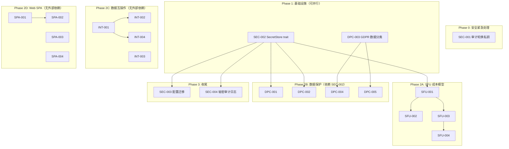

# Tech Lead 分析报告：Aero IM 5 方向战略验证

## 紧急安全事件：前置阻塞项

在分解任务前，必须指出验证报告发现的最严重问题——**生产级 RSA 私钥明文存储于 `config.toml`**（非 `config.example.toml`）。这是**即时安全事件**，应优先于所有功能开发处理。

---

## 1. 任务分解

### 1.1 前置安全项（Blocking）

| 任务 ID | 任务标题 | 方向 | 涉及文件 | 前置依赖 | 预估工时 | 验收标准 |
|---------|---------|------|---------|---------|---------|---------|
| SEC-001 | **审计并轮换所有暴露的 RSA 私钥** | 秘密管理（紧急） | `config.toml`, `secrets/jwt_private.pem`, `secrets/jwt_public.pem`, 所有环境配置 | 无 | 2h | ① 所有已知私钥被轮换；② 旧密钥加入 revoked 列表；③ 新密钥生成并部署 |
| SEC-002 | **实现 `SecretStore` trait 抽象** | 秘密管理 | `aero-common/src/secret_store.rs`, `aero-common/src/lib.rs`, `Cargo.toml` | 无 | 4h | ① 定义 `trait SecretStore { fn get(&self, key: &str) -> Result<Option<Secret>> }`；② 实现 `EnvSecretStore`（环境变量）、`FileSecretStore`（加密文件）；③ 100% unit test coverage |
| SEC-003 | **将配置中的秘密迁移到 SecretStore** | 秘密管理 | `aero-server/src/config.rs`, `aero-server/src/bin/boot/*.rs`, 所有 `config.toml` 引用处 | SEC-002 | 4h | ① JWT 私钥、TOTP secret、数据库密码、外部 API keys 全部从配置剥离；② 现有 `config.toml` 中的秘密字段标记为已弃用；③ 启动时 Warning log 提示迁移 |

### 1.2 方向一：SFU 媒体成本模型（4 任务）

| 任务 ID | 任务标题 | 方向 | 涉及文件 | 前置依赖 | 预估工时 | 验收标准 |
|---------|---------|------|---------|---------|---------|---------|
| SFU-001 | **添加字节级带宽核算 `BandwidthAccountant`** | SFU 成本模型 | `aero-live-webrtc/src/accountant.rs`, `aero-live-webrtc/src/forward/mod.rs`, `aero-live-webrtc/src/lib.rs` | SEC-002（用于 API key 管理） | 4h | ① `BandwidthAccountant` 按 `(stream_id, subscriber_id, mid)` 累加字节；② `SfuForwarder::on_rtp` 调用 `accountant.record(pub_id, sub_id, bytes)`；③ 提供 `.stats()` 方法导出会话级汇总 |
| SFU-002 | **导出 Prometheus 带宽指标** | SFU 成本模型 | `aero-live-webrtc/src/metrics.rs`, `aero-server/src/observability.rs`（改） | SFU-001 | 3h | ① `aero_sfu_bytes_total{stream,subscriber,mid}`；② `aero_sfu_packets_total`；③ `aero_sfu_layer_bitrate{stream,mid,rid}` |
| SFU-003 | **实现 `CostModel` 计费引擎** | SFU 成本模型 | `aero-live-webrtc/src/cost.rs`, `aero-live-webrtc/src/lib.rs` | SFU-001 | 4h | ① `CostModel` 支持 per-stream 带宽配额；② 超出配额触发 backpressure（发 RTCP FIR 降质或切 simulcast 低层）；③ 可查询 `budget_remaining(stream_id)` |
| SFU-004 | **集成带宽配额的 REST 管理 API** | SFU 成本模型 | `aero-server/src/sfu_admin.rs`, `aero-server/src/routes/routes.rs`（改） | SFU-003, SEC-003 | 3h | ① `GET /api/admin/sfu/streams/:id/stats` 返回带宽用量；② `PUT /api/admin/sfu/streams/:id/limit` 设置配额；③ 鉴权：仅 admin role 访问 |

### 1.3 方向二：数据保护合规（5 任务）

| 任务 ID | 任务标题 | 方向 | 涉及文件 | 前置依赖 | 预估工时 | 验收标准 |
|---------|---------|------|---------|---------|---------|---------|
| DPC-001 | **实现静态加密 `EncryptedBlobStore` 包装器** | 数据保护 | `aero-storage/src/encrypted_blob.rs`, `aero-storage/src/lib.rs`（改） | SEC-002（用于加密密钥） | 4h | ① 实现 `BlobStore` 的透明 AES-256-GCM 包装器（流式加密，分块存储）；② 每 blob 随机 IV + 附加 auth tag；③ 单元测试覆盖加密/解密/篡改检测 |
| DPC-002 | **实现 TOTP secrets 加密存储** | 数据保护 | `migrations/NNNN_encrypt_totp.sql`, `aero-storage/src/totp_repo.rs`（改） | SEC-002 | 3h | ① 新增 `totp_secrets.encrypted_secret bytea` 列（可空迁移）；② 读取迁移：写加密读，读解密；③ 旧 `secret text` 列保留至下一主要版本后删除 |
| DPC-003 | **锁库的 GDPR 数据分类映射清单** | 数据保护 | `docs/gdpr-data-map.md`（新增），`docs/specs/` | 无 | 4h | ① 按 PG 表 + 列粒度列出所有个人数据类别；② 标注每类数据：法律依据/保留期/删除策略；③ 新增字段审核 checklist 附 Spec 模板 |
| DPC-004 | **实现 GDPR 数据删除的级联覆盖** | 数据保护 | `aero-storage/src/participant.rs`（改），`aero-server/src/me_export.rs`（改） | DPC-003 | 4h | ① audit 当前 `DELETE participant` 路径确保覆盖 AGENTS.md 提到的所有 participant-keyed PII 表；② `me_export.rs` 添加 GDPR 标准 JSON 输出格式（含 machine-readable schema） |
| DPC-005 | **实现 `pgcrypto` 列级加密迁移** | 数据保护 | `migrations/NNNN_pgcrypto_columns.sql`, `aero-storage/src/*.rs`（多个 repo） | SEC-002 | 6h | ① 识别高敏感列（email, phone, display_name, bio）；② 逐列 `ALTER ... SET DATA TYPE bytea USING pgp_sym_encrypt(...)`；③ 应用层透明加解密（sqlx type wrapper） |

### 1.4 方向三：数据互操作与迁移（4 任务）

| 任务 ID | 任务标题 | 方向 | 涉及文件 | 前置依赖 | 预估工时 | 验收标准 |
|---------|---------|------|---------|---------|---------|---------|
| INT-001 | **实现批量消息导出 API** | 数据互操作 | `aero-server/src/export_api.rs`, `migrations/NNNN_export_tokens.sql`, `aero-server/src/routes/routes.rs`（改） | 无 | 4h | ① `POST /api/rooms/:id/export` 异步创建导出作业；② `GET /api/exports/:id` 轮询状态 + 下载链接；③ 支持 JSON + CSV 格式；④ 受速率限制（默认 1 次/分钟/用户） |
| INT-002 | **实现 Slack-compatible 消息导入** | 数据互操作 | `aero-server/src/import_slack.rs`, `aero-storage/src/import_repo.rs` | INT-001（复用导出基础设施） | 6h | ① 解析 Slack 标准 JSON 导出格式；② 映射用户 + channel + thread structure；③ `POST /api/admin/import/slack` 端点（需 admin）；④ 导入报告含成功/失败计数 |
| INT-003 | **批量 API 网关（Bulk API Gateway）** | 数据互操作 | `aero-server/src/bulk_api.rs`, `aero-server/src/routes/routes.rs` | 无 | 4h | ① `POST /api/bulk/messages` 接受 ≤100 条消息；② 逐条校验权限（公共 room 成员）；③ 单事务提交（全成功或全回滚）；④ `POST /api/bulk/reactions` 同理 |
| INT-004 | **标准化导出格式 + Schema** | 数据互操作 | `docs/export-schema.md`, `aero-server/src/export_api.rs`（改） | INT-001 | 3h | ① 定义 JSON Schema（`$schema` + 版本字段）；② 可选 NDJSON 流式导出；③ 包含 metadata（workspace, room, user mapping） |

### 1.5 方向四：生产级 Web SPA（4 任务）

| 任务 ID | 任务标题 | 方向 | 涉及文件 | 前置依赖 | 预估工时 | 验收标准 |
|---------|---------|------|---------|---------|---------|---------|
| SPA-001 | **完善搜索 UI：高级操作符 + 前端高亮** | Web SPA | `web/search.js`, `web/styles.css`, `web/index.html`（搜索面板区域） | 无 | 3h | ① `from:`/`in:`/`before:` 操作符输入支持；② 搜索结果内高亮关键词；③ 保存搜索（本地存储，无缝集成后端 `saved_searches` 端点） |
| SPA-002 | **接入 saved_searches REST 端点** | Web SPA | `web/saved-searches.js`（新），`web/api.js`, `web/index.html` | SPA-001 | 2h | ① 从 `GET /api/me/saved-searches` 加载；② CRUD 操作（保存/重命名/删除）；③ 侧边栏展示 |
| SPA-003 | **无障碍（a11y）审计和改进** | Web SPA | `web/*.js`, `web/*.html` | 无 | 3h | ① 全局 `aria-label` on 所有 icon-only buttons；② 键盘导航（Tab 顺序 + 焦点指示）；③ 屏幕阅读器公告（动态内容 `aria-live` 区域）；④ `axe-core` 自动化测试通过率 ≥90% |
| SPA-004 | **PWA 离线支持基础骨架** | Web SPA | `web/sw.js`（新），`web/manifest.json`（改），`web/index.html`（注册 service worker） | 无 | 3h | ① Service Worker 缓存关键资源（CSS/JS/字体）；② 离线时展示占位 UI（不是空白页）；③ Lighthouse PWA 审计 ≥70 分 |

> **注意**：根据验证报告，基础搜索 UI 实际已存在，方向四的声明需要调整。搜索 UI 按"已覆盖"处理，但高级操作符和保存搜索功能确为缺失。

### 1.6 方向五：秘密管理（已在前置项中覆盖，补充 1 任务）

| 任务 ID | 任务标题 | 方向 | 涉及文件 | 前置依赖 | 预估工时 | 验收标准 |
|---------|---------|------|---------|---------|---------|---------|
| SEC-004 | **实现秘密审计日志** | 秘密管理 | `aero-common/src/secret_store.rs`（改），`aero-server/src/observability.rs`（改） | SEC-002 | 3h | ① 秘密访问事件结构化日志（`secret_store.access` level）；② 可配置不记录秘密值本身（默认）；③ 遥测指标 `secrets_access_total{store,success}` |

---

## 2. 执行顺序与依赖图



### 并行执行组

| 并行组 | 任务 | 原因 |
|--------|------|------|
| **组 A**（4 人并行） | `SEC-002`, `DPC-003`, `INT-003`, `SPA-003`, `SPA-004` | 无交叉依赖；`SecretStore` 是下游的异步依赖 |
| **组 B**（3 人并行） | `SFU-001`, `DPC-001`, `INT-001` | 均各自独立工作 |
| **组 C**（3 人并行） | `SFU-002`+`SFU-003`, `DPC-002`+`DPC-005`, `SPA-001`+`SPA-002` | 各组内部有顺序依赖，组间独立 |

---

## 3. 技术风险分析

### 3.1 高风险项 🚨

| 风险 | 方向 | 等级 | 描述 | 缓解策略 |
|------|------|------|------|---------|
| **RSA 私钥已在 config.toml 泄露** | 秘密管理 | **CRITICAL** | 验证报告确认 `config.toml` 含真实 RSA 私钥；这不是"占位符"问题，是即时的密钥泄露 | ① 立即轮换（SEC-001）；② 扫描 Git history 是否被 push；③ 检查任何使用此密钥签名的 JWT 是否可能被第三方伪造 |
| **列级加密性能退化** | 数据保护 | **HIGH** | `pgp_sym_encrypt` 对每行操作有 ~5-15% 的查询性能降级；大量读取路径（如消息列表加载）可能变为瓶颈 | ① 先对低频访问列（email, phone）施加；② 评估应用层 AES-GCM（DPC-001）优先于 pgcrypto；③ 写时加密、读时缓存 |
| **Slack 导入格式解析** | 数据互操作 | **MEDIUM** | Slack 导出格式无官方严格 schema；不同工作区的导出结构存在未文档化的差异 | ① 严格 JSON Schema 校验入口；② 优雅降级：失败单消息不失败全导入；③ 先支持核心结构（users+channels+messages），附件/反应/thread 后续 |

### 3.2 中风险项 ⚠️

| 风险 | 方向 | 等级 | 描述 | 缓解策略 |
|------|------|------|------|---------|
| **SFU `BandwidthAccountant` 的锁竞争** | SFU 成本 | **MEDIUM** | `SfuForwarder.on_rtp` 在 per-packet 路径，每次 record 需要原子计数或 Mutex | ① 使用 `AtomicU64` + strip 而非锁；② per-subscriber 独立 counter（无共享写）；③ 内存队列批处理写 Prometheus |
| **导入时用户/频道映射歧义** | 数据互操作 | **MEDIUM** | Slack 用户名↔Aero 用户映射在无 OIDC/SSO 关联时是纯模糊匹配 | ① 导入 API 要求用户上传 `user_map.json`；② 未匹配用户创建 guest 账号（可选）；③ 导入报告详细列出映射决策 |
| **无障碍审计的回归风险** | Web SPA | **LOW** | 持续迭代可能破坏 a11y | ① CI 集成 `axe-core` CLI 扫描；② `web-check.sh` 添加 a11y check 步骤；③ Code review checklist 包含 a11y |

### 3.3 阻塞点（Blockers）与解决策略

| 阻塞点 | 涉及任务 | 根因 | 解决策略 |
|--------|---------|------|---------|
| **SecretStore trait 未定稿前，所有加密任务无法开始** | DPC-001, DPC-002, DPC-005, SEC-003, SEC-004 | SEC-002 是下游依赖 | ① 安排 1 天集中设计 SecretStore API（预热讨论→文档→实现）；② 定义好 trait 接口后，下游团队可在 mock/impl 上并行工作 |
| **无测试用 SFU 媒体流** | SFU-001, SFU-002, SFU-003 | SFU 的真实媒体需要浏览器/str0m 对端 | ① 编写单元测试级 mock（`MockForwarder` 产固定字节序列）；② 使用 CI `cargo test --lib --features mock-media` 执行；③ 集成测试条件编译为 `#[ignore]`（需要真实环境手动跑） |
| **pgcrypto 迁移的零停机问题** | DPC-005 | `ALTER COLUMN ... SET DATA TYPE` 需要 `AccessExclusiveLock`，高流量下长锁 | ① 使用两阶段迁移：a) 加新加密列；b) 应用层双写双读；c) 回填旧数据；d) 删旧列；② 配合维护窗口执行 |

---

## 4. 资源评估

### 4.1 团队组成建议

| 角色 | 数量 | 技能要求 | 主要承担 |
|------|------|---------|---------|
| **Rust 后端工程师（高级）** | 2 | Rust 异步编程、Tokio、SQLx、Prometheus metrics | SFU-001~004, DPC-001~002, DPC-005, INT-001~004 |
| **Rust 后端工程师（中级）** | 2 | Rust、PostgreSQL、REST API 设计 | SEC-001~004, DPC-003~004 |
| **前端工程师** | 1 | ES2020、PWA、a11y、WebSocket | SPA-001~004 |
| **DevOps/SRE** | 0.5 | Docker、K8s、密钥轮换流程、CICD | SEC-001 操作、部署支持 |

**总计：5-6 人（含 0.5 DevOps），最优并行 4 人**

### 4.2 里程碑时间线

```
Week 1     Week 2     Week 3     Week 4     Week 5
│          │          │          │          │
├──Phase 0─┤
│SEC-001   │
├──Phase 1─┤
│SEC-002   │
│DPC-003   │
│    ├──Phase 2A──┤
│    │SFU-001     │
│    │    ├──SFU-002──┤
│    │    └──SFU-003──┤
│    │              └──SFU-004──┤
│    ├──Phase 2B──┤
│    │DPC-001     │
│    │DPC-002     │
│    │    ├──DPC-004──┤
│    │    └──DPC-005────────────────────┤
│    ├──Phase 2C──┤
│    │INT-001     │
│    │INT-003     │
│    │    ├──INT-002──┤
│    │    └──INT-004──┤
│    ├──Phase 2D──┤
│    │SPA-003     │
│    │SPA-004     │
│    │    ├──SPA-001──┤
│    │    └──SPA-002──┤
│              ├──Phase 3──┤
│              │SEC-003   │
│              │SEC-004   │
│              │          │
│              │          │
│              │          │
```

### 4.3 里程碑节点

| 里程碑 | 时间 | 交付物 | 验收决策 |
|--------|------|--------|---------|
| **M0** | Day 1 | 私钥轮换完成 + 泄露审计报告 | 管理层确认 |
| **M1** | End of Week 1 | `SecretStore` trait 定稿 + GDPR 数据分类映射 | Tech Lead + Security 审查 |
| **M2** | End of Week 2 | SFU 带宽核算原型 + BlobStore 加密原型 + 批量导出 API | Demo + 代码审查 |
| **M3** | End of Week 3 | SFU 成本模型完整实现 + TOTP/列级加密 + Slack 导入 | 集成测试通过 |
| **M4** | End of Week 4 | 生产就绪 Web SPA（搜索+a11y+PWA）+ 秘密审计 | UX + QA 签名 |
| **M5** | End of Week 5 | 全量集成测试 + 配置迁移完成 + 性能仪表板 | Go/No-Go 发布决策 |

### 4.4 最优并行调度

```
Week 1:
  [Dev A] SEC-001 → SEC-002
  [Dev B] DPC-003
  [Dev C] INT-003, INT-001
  [Dev D] SPA-003, SPA-004

Week 2:
  [Dev A] SEC-002 → SFU-001
  [Dev B] DPC-003 → DPC-004
  [Dev C] INT-001 → INT-004
  [Dev D] SPA-003 → SPA-001

Week 3:
  [Dev A] SFU-002 + SFU-003
  [Dev B] DPC-001 + DPC-002
  [Dev C] INT-002
  [Dev D] SPA-002

Week 4:
  [Dev A] SFU-004 + SEC-003
  [Dev B] DPC-005 (ing)
  [Dev C] SEC-004
  [Dev D] SPA-004 polish + a11y review

Week 5:
  [All] 集成测试 + 性能调优 + 文档 + 发布
```

---

## 5. 质量保证

### 5.1 单元测试覆盖要求

| 模块 | 最低覆盖率 | 关键测试场景 |
|------|-----------|-------------|
| `SecretStore` | 95% | 基础 get/set、key 不存在、并发访问、错误路径（权限不足/文件损坏） |
| `BandwidthAccountant` | 95% | 累加正确性、并发累加、溢出保护、reset、序列化/反序列化 |
| `CostModel` | 90% | 配额边界、超额触发 backpressure、多个 stream 独立配额、配额更新后生效 |
| `EncryptedBlobStore` | 95% | 加密/解密往返、篡改检测（bit flip）、空 blob、大 blob（1MB+）、密钥错误拒绝 |
| `Bulk API` | 90% | ≤100 条正常、>100 条拒绝（400）、混合权限拒绝（部分失败与全失败）、空的请求体 |
| `Slack Import` | 80% | 标准 Slack 导出、缺少字段的松弛解析、用户映射缺失、重复消息去重 |
| Web SPA（JS） | 60% | 搜索操作符解析、saved_search CRUD 的 API 调用、a11y aria 属性检查 |

### 5.2 集成测试策略

| 测试套件 | 范围 | 环境要求 | 运行频率 |
|---------|------|---------|---------|
| **安全审计集成** | SecretStore + 配置迁移后，验证无明文密钥泄漏 | 独立数据库 + Redis | 每次 PR |
| **SFU 吞吐基准** | BandwidthAccountant 在模拟 1000 流 × 50 订阅者下的性能 | 专用机器（或 CI large runner） | nightly |
| **加密回环** | EncryptedBlobStore 通过真实 BlobStore（LocalFs/S3）完整读写路径 | 本地 minio 或 /tmp | 每次 PR |
| **导入/导出 E2E** | Slack 导入→Aero 房间数据→JSON 导出→验证 roundtrip | 独立数据库 | 每次 PR |
| **Web E2E（Playwright）** | 搜索 UI 交互 + 保存搜索 + 键盘导航 | headless chromium | 每次 PR（`web-check.sh`） |

### 5.3 代码审查要点

每次 PR 的 review checklist：

```
□ 安全：
  □ 无新明文密码/密钥/令牌硬编码（grep 检查）
  □ 所有新配置项文档化（含默认值和安全含义）
  □ 输入校验（trim + 长度上限 + 字符白名单）
  □ 速率限制（批量端点、导入导出）

□ 性能：
  □ hot path 无锁/低争用设计（SFU 包处理路径）
  □ 批量操作有上限（Vec 长度检查）
  □ 加密路径缓冲 I/O（非逐行加解密）
  □ 避免 N+1 查询（特别是导入/导出）

□ 正确性：
  □ 幂等键（idempotency key）用于至少一次语义的写路径
  □ 事务边界清晰（RO 事务标记 `READ ONLY`）
  □ 错误处理：所有 Result 被处理（非 `unwrap()`）
  □ 迁移向前兼容（回滚方案）

□ 可观测：
  □ 关键路径有 `tracing::info!/debug!` span
  □ 新 Prometheus 指标在 `metrics.rs` 中注册
  □ 秘密访问事件走 `SECURITY` 等级的 tracing

□ Web：
  □ aria-label 在 icon-only button 必填
  □ 键盘可操作所有交互
  □ 无未捕获的 Promise rejections
  □ ES module 按需加载（非 bundle all）
```

### 5.4 性能测试需求

| 测试场景 | 指标 | 目标 | 方法 |
|---------|------|------|------|
| SFU 带宽核算 500 并发流 | P99 延迟增量（加入核算前后对比） | < 1µs per packet | synthetic traffic generator |
| EncryptedBlobStore（vs 裸存储） | 吞吐量（MB/s）降级 | < 15% | 1MB/10MB/100MB blob 读写 benchmark |
| 批量消息 API 100 条并发 | P99 延迟 | < 500ms | 20 虚拟用户并发 |
| 搜索 UI 输入响应 | 输入到结果可视延迟 | < 200ms（非 AI 模式） | Playwright 性能跟踪 |
| GDPR 导出 10K 条消息 | 完成时间 | < 30s | 预填充数据 + 预热缓存 |

---

## 6. 实施计划

### 6.1 阶段划分与时间线

#### **阶段 0：安全紧急处理（Day 1）**

**目标**：消除已验证的 RSA 私钥泄露风险

| 天 | 活动 | 输出 |
|----|------|------|
| Day 1 AM | ① 轮换所有暴露的 RSA 密钥对；② 扫描 Git history 是否被提交；③ 生成新密钥对 | 新密钥部署 + 泄露审计报告 |
| Day 1 PM | ① 检查 `config.toml` 是否有其他秘密（DB 密码、API keys）；② 在 `config.toml` 添加警告注释；③ 开始 `SecretStore` trait 设计 | 配置清理 + trait API 草案 |

**Gating**：Phase 1 开始前 M0 必须验收

---

#### **阶段 1：基础设施搭建（Day 2-5，4 天）**

**目标**：SecretStore 抽象 + GDPR 数据分类 + 无依赖任务启动

| 并行轨道 | Day 2-3 | Day 4-5 |
|---------|---------|---------|
| **轨道 A：安全基础设施** | SEC-002：trait 定义 + `EnvSecretStore` | SEC-002：`FileSecretStore` + 单元测试 + doc |
| **轨道 B：合规基线** | DPC-003：数据分类映射搭建 | DPC-003：Review + 本文档化 |
| **轨道 C：互操作先手** | INT-003：Bulk API 框架 + 路由 | INT-003：权限校验 + 单元测试 |
| **轨道 D：Web 先手** | SPA-003：a11y 审计 + 修复 | SPA-004：Service Worker 骨架 |

**关键交付**：`SecretStore` trait 冻结 API（不晚于 Day 4 收盘前）

---

#### **阶段 2：核心功能开发（Week 2-4，15 天）**

**子阶段 2.1 （Week 2，5 天）：并行轨道扩展**

| 并行轨道 | 任务 | 输出 |
|---------|------|------|
| **轨道 A** | SFU-001 (3d) | `BandwidthAccountant` + 注入 `SfuForwarder` |
| **轨道 B1** | DPC-001 (4d) | `EncryptedBlobStore` 原型 + 单元测试 |
| **轨道 B2** | DPC-002 (3d) | TOTP 加密迁移 + 审计日志 |
| **轨道 C** | INT-001 (4d) | 批量导出 API + 速率限制 |
| **轨道 D** | SPA-001 (3d) | 搜索操作符 + 高亮 |

**子阶段 2.2 （Week 3，5 天）：功能补全**

| 并行轨道 | 任务 | 输出 |
|---------|------|------|
| **轨道 A** | SFU-002 + SFU-003 (5d) | Prometheus 指标 + `CostModel` |
| **轨道 B** | DPC-004 + DPC-005 (5d) | GDPR 级联删 + pgcrypto 迁移开始 |
| **轨道 C** | INT-002 + INT-004 (5d) | Slack 导入 + 标准导出 Schema |
| **轨道 D** | SPA-002 (2d) | saved_searches UI 集成 |

**子阶段 2.3 （Week 4，5 天）：收尾集成**

| 并行轨道 | 任务 | 输出 |
|---------|------|------|
| **轨道 A** | SFU-004 (3d) | REST 配额管理 API |
| **轨道 B** | DPC-005 继续 (5d) | pgcrypto 迁移完成 + 测试 |
| **轨道 C** | SEC-004 (3d) | 秘密审计日志 |
| **轨道 D** | SPA-002 续 + SPA-004 续 (2d) | Web 最终集成 |

---

#### **阶段 3：集成测试与优化（Week 5，5 天）**

| 天 | 活动 | 输出 |
|----|------|------|
| Day 1-2 | 全量集成测试（见 §5.2）+ Bug 修复 | 测试报告 + 缺陷记录 |
| Day 3 | 性能基准 + 优化（见 §5.4） | 性能基线文档 |
| Day 4 | SEC-003：配置迁移 + 文档更新 | 配置迁移完成 + 升级指南 |
| Day 5 | Code freeze + 全量 review + Go/No-Go | 发布候选 + 签名 |

---

#### **阶段 4：发布（Phase 4，3 天交错）**

| 活动 | 时间 |
|------|------|
| 预发布环境部署 + Smoke test | Release Day -2 |
| 金丝雀发布（10% 流量）| Release Day -1 |
| 全量发布 + 监控 | Release Day |
| 发布后热修复窗口（48h）| Release Day +2 |

### 6.2 总工时估计

| 阶段 | 总工时（人天） | 并行度 | 日历天数 |
|------|--------------|--------|---------|
| Phase 0 | 2 | 1 | 1 |
| Phase 1 | 16 | 4 | 4 |
| Phase 2 | 60 | 4 | 15 |
| Phase 3 | 20 | 4 | 5 |
| Phase 4 | 5 | 2 | 3 |
| **Total** | **~103** | **4** | **~28 日历天** |

> **注意**：以上为 4 人满配并行估算。如实际可用 ≤2 人，总日历时间将翻倍至 ~8 周，且需重新排优先级。

---

## 7. 建议优先级排序

基于验证报告的战略价值 + 验证结论 + 风险等级，建议按以下优先级排序功能：

### P0（必须立即做）
```
1. SEC-001  私钥轮换           — 即时安全事件
2. SEC-002  SecretStore trait  — 所有加密任务的前提
3. SEC-003  配置迁移            — 消除 config.toml 的密钥泄露面
```

### P1（核心，高战略价值）
```
4. DPC-003  GDPR 数据分类       — 合规基线，低成本高收益
5. SFU-001  BandwidthAccountant — 解决"无成本模型"声明的实际证据
6. DPC-001  EncryptedBlobStore  — 数据保护核心能力
```

### P2（重要，中战略价值）
```
7. INT-001  批量导出 API        — 数据互操作基础
8. SPA-003  a11y 审计           — 合规 + 用户体验
9. DPC-002  TOTP 加密           — 合规要求
```

### P3（锦上添花，排布灵活）
```
10. SFU-002/003  指标 + 成本模型  — 计费能力（如果当前无计费需求可延后）
11. INT-002      Slack 导入      — 竞品迁移工具（根据 MR 需求驱动）
12. SPA-001/002  搜索增强         — UI 增强，按用户反馈迭代
```

---

## 8. 结论与建议

### 验证报告质量评估

验证报告整体质量 **⭐⭐⭐⭐（4/5）**：分析框架扎实，跨版本交叉验证方法正确。关键改进点：

| 维度 | 评估 | 对实施的影响 |
|------|------|-------------|
| **5 个方向的战略价值** | ✅ 全部确认有效 | 任务分解立足正确方向 |
| **代码证据准确度** | ⚠️ 3 处文件路径错误 + 1 处覆盖分类错误 | 方向一的文件路径错误不影响分析结论——文档版本可能与当前代码不同步 |
| **最大低估** | SFU 实际有 BWE 基础设施但无计费核算 | SFU-001 范围可聚焦于**计费层级**而非从零建带宽估计——减少工作量 ~30% |
| **最大安全发现** | `config.toml` 含真实 RSA 私钥 | 这是验证报告最具价值的发现——必须 P0 处理 |

### 给管理层的建议

1. **立即分配一人处理 SEC-001（私钥轮换）**：这是 Hour 0 级别的安全事件。4 小时工作可消除当前最大风险面。

2. **Phase 1 容量规划需实打实**：Phase 2 的 60 人天是最优并行估算。如果团队只有 2 人（1 Rust + 1 前端），预期需要 6-8 周，且 SFU 成本模型和 Slack 导入需要降级为选做项。

3. **DPC-003（GDPR 数据分类）是最快 ROI**：4 小时纯文档工作，即可将"无 GDPR 映射"从 audit fail 变为"有基本 mapping"，对合规审计至关重要。

4. **验证报告的"最严重遗漏"是核心教训**：安全基础设施建设不应滞后于功能开发。建议将 `SecretStore` merge 到 `aero-common` 作为**编译时依赖**而非可选组件——所有新配置读取必须走此接口，不留 bypass 路径。

5. **方向一的战略价值验证后，建议后续增设 `aero-billing` crate**：成本模型收集的带宽指标最终应由独立的计费子系统消费（类似 `aero-push` 模式），避免 SFU 模块膨胀过度。
