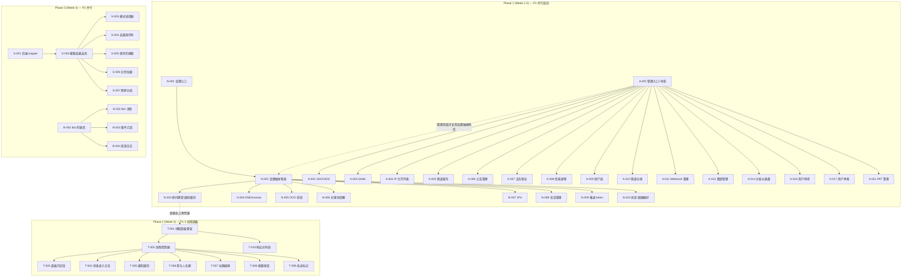

Now I have a thorough understanding of the entire codebase. Let me compile the comprehensive Tech Lead analysis.

---

# Tech Lead 分析报告：Aero IM 前端缺口补齐计划

## 0. 代码库全景快照

| 维度 | 数据 |
|---|---|
| 后端模块（有 `routes()`） | ~82 个 |
| `routes/routes.rs` | 2854 行，含核心路由 + ~65 `.merge()` |
| `web/index.html` | 385 行（auth + 聊天视图 + 5 个 modal + 4 个 drawer + 通话覆盖层） |
| `web/app.js` | 1009 行（WS 连接、消息流、房间切换、composer、通话、直播） |
| `web/api.js` | HTTP 客户端（~90 个端点方法） |
| `web/search.js` | 144 行（基本搜索 + AI 抽屉） |
| `web/modals.js` | 96 行（profile/new-room/add-member 表单） |
| CSS | 单文件 `style.css`，~1100 行 |

**核心架构约束**：
- 零依赖 ES2020 SPA，无打包器 / 无框架，原生 ESM 模块
- `context.js` 作为共享脊柱（`state` / `ws` / `els` 单例），`app.js` 作为编排器注入回调给子模块
- 渲染全部通过 `render.js` 的 `renderMessage` / `renderRoomItem` 等函数操作真实 DOM
- 后端全部有 `routes()` 但前端 0 UI 的模块：**至少 30+ 个**

---

## 1. 任务分解

### 方向二：通知偏好设置（P1）

| 任务 ID | 标题 | 涉及文件 | 前置 | 工时 | 验收标准 |
|---|---|---|---|---|---|
| N-001 | 添加用户设置入口（齿轮图标） | `index.html`, `app.js`, `context.js` | — | 2h | 头像/名字栏出现齿轮图标，点击打开设置抽屉 |
| N-002 | 设置抽屉骨架（drawer + 标签页导航） | `index.html`, `style.css` | N-001 | 4h | 新的 `<aside id="drawer-settings">`，含「通知」「账户」「OOO」标签页切换；CSS 复用已有 drawer 样式 |
| N-003 | 房间静音 / 通知级别 UI | `index.html`, `notifications.js`（新建） | N-002 | 4h | 房间列表右键/长按弹出「通知级别」选择器（all/mentions/none）；设置 drawer 中有房间静音列表 |
| N-004 | DND 时段 + 暂时静音（snooze）UI | `index.html`, `notifications.js` | N-002, N-003 | 3h | 设置页有 DND 起止时间输入 + 一次 snooze 按钮（预设 1h/2h/直到明天/自定义） |
| N-005 | OOO 状态管理页 | `index.html`, `ooo_ui.js`（新建） | N-002 | 3h | 设置页 OOO 标签：消息输入框 + 开始/结束时间选择 + 开关；他人 profile 上显示 OOO 状态 |
| N-006 | 关键词提醒 UI | `index.html`, `keyword_alerts_ui.js`（新建） | N-002 | 4h | 设置页可新增/编辑/删除关键词；词条列表显示匹配数 |
| N-007 | 2FA 设置页 | `index.html`, `twofa_ui.js`（新建） | N-002 | 4h | TOTP 二维码 + 验证码输入 + 恢复码显示；支持关闭 2FA |
| N-008 | 活跃会话管理页 | `index.html`, `sessions_ui.js`（新建） | N-002 | 3h | 列出当前设备 + 其他活动会话；支持远程登出 |
| N-009 | 推送 token 管理 | `index.html`, `notifications.js` | N-002 | 2h | 显示已注册推送设备列表，支持移除 |
| N-010 | 用户状态 + 摘要 / 模板偏好 | `index.html`, `notifications.js` | N-002 | 3h | 状态文本输入 + 摘要频率选择（daily/weekly/off）+ 消息模板选择 |
| N-011 | 右键房间菜单：快速静音/通知级别 | `app.js`, `context.js` | N-003 | 3h | 房间列表项右键弹出菜单含「静音」「通知级别」快捷操作，无需进设置页 |
| N-012 | 集成测试：设置流程凭据刷新 | `app.js`（forceReauth 路径验证） | N-002→N-010 | 2h | 每个 mutate 操作后 token 过期时触发 forceReauth 不崩溃 |

**小计：方向二 = 12 个任务，约 34 小时（~4.25 人日）**

### 方向一：企业管理控制台（P1）

| 任务 ID | 标题 | 涉及文件 | 前置 | 工时 | 验收标准 |
|---|---|---|---|---|---|
| A-001 | 企业设置入口 + 管理控制台导航页 | `index.html`, `admin.js`（新建）, `style.css` | — | 4h | 用户头像菜单出现「管理控制台」入口（仅 Owner/Admin 可见）；导航页分安全、内容、用户、分析四个分类 |
| A-002 | SSO/OIDC 配置页 | `index.html`, `admin_sso.js`（新建） | A-001 | 8h | OIDC issuer URL + Client ID + Client Secret（密码输入框不回显）+ 保存调 `POST /api/auth/oidc`；「测试连通性」按钮做预检 |
| A-003 | SAML 配置页 | `index.html`, `admin_saml.js`（新建） | A-001 | 4h | 上传/粘贴 IdP 元数据 XML；显示 SP 元数据下载链接 |
| A-004 | IP 允许列表页 | `index.html`, `admin_security.js`（新建） | A-001 | 3h | CIDR 输入 + 列表展示 + 删除；显示当前请求 IP |
| A-005 | 频道留存策略页 | `index.html`, `admin_content.js`（新建） | A-001 | 3h | 每频道/全工作区默认留存天数设置；列表+编辑+新建 |
| A-006 | 公告管理页 | `index.html`, `admin_content.js` | A-001 | 3h | 公告列表 + 新建/编辑/删除/发布/下架 |
| A-007 | 法务保全（legal holds）页 | `index.html`, `admin_content.js` | A-001 | 4h | 参与者搜索 + 保全/释放；保全列表显示被保全用户+ 起始时间 |
| A-008 | 信息屏障（info barriers）页 | `index.html`, `admin_content.js` | A-001 | 4h | 屏障规则列表（两频道间/参与者标签间）；新建/编辑/删除 |
| A-009 | 用户组管理页 | `index.html`, `admin_users.js`（新建） | A-001 | 4h | 用户组列表 + CRUD + 成员管理（搜索添加/移除） |
| A-010 | 频道分类管理页 | `index.html`, `admin_content.js` | A-001 | 3h | 分类列表 + 拖拽排序 + 重命名 + 频道分配 |
| A-011 | Webhook 管理 + 投递日志页 | `index.html`, `admin_integrations.js`（新建） | A-001 | 4h | Webhook 列表 + 创建（URL+事件）+ 投递日志+DLQ 查看 + 重试 |
| A-012 | 邀请管理页 | `index.html`, `admin_users.js` | A-001 | 3h | 邀请列表（状态/过期/撤销）+ 新建邀请 + 复制链接 |
| A-013 | 管理会话页 | `index.html`, `admin_sessions.js`（新建） | A-001 | 2h | 所有活跃管理会话列表 + 强制登出 |
| A-014 | 分析仪表盘页 | `index.html`, `admin_analytics.js`（新建） | A-001 | 6h | 概览数字（用户/消息/房间数）、最活跃频道排名、每日消息时间线图（纯 CSS/grid 不需要 chart 库） |
| A-015 | 用量报告页 | `index.html`, `admin_analytics.js` | A-001 | 3h | API 调用量 + 存储用量 + 推送计数 |
| A-016 | 用户停用管理页 | `index.html`, `admin_users.js` | A-001 | 3h | 搜索用户 + 停用/启用 + 停用原因 + 批量操作 |
| A-017 | 用户举报管理页 | `index.html`, `admin_reports.js`（新建） | A-001 | 3h | 举报列表（分已处理/未处理）+ 标记处理/驳回 |
| A-018 | 消息举报管理页 | `index.html`, `admin_reports.js` | A-001 | 3h | 同上，消息内容预览 + 跳转到原文 + 软删操作 |
| A-019 | 封禁申诉页 | `index.html`, `admin_reports.js` | A-001 | 3h | 申诉列表 + 批准/驳回 |
| A-020 | 自动审核规则页 | `index.html`, `admin_reports.js` | A-001 | 4h | 关键词规则 + 动作（警告/删/报告）CRUD；测试按钮 |
| A-021 | PAT（个人访问令牌）管理页 | `index.html`, `pat_ui.js`（新建） | A-001 | 3h | 令牌列表（部分遮盖）+ 新建（显示一次）+ 撤销 |
| A-022 | 工作区安全汇总页 | `index.html`, `admin_security.js` | A-001 | 2h | IP 列表 + SSO 状态 + 2FA 强制率 + 密码策略一览 |

**小计：方向一 = 22 个任务，约 78 小时（~9.75 人日）**

### 方向三：线程面板（P1.5）

| 任务 ID | 标题 | 涉及文件 | 前置 | 工时 | 验收标准 |
|---|---|---|---|---|---|
| T-001 | 线程面板 HTML + CSS 骨架 | `index.html`, `style.css` | — | 4h | `<aside id="thread-panel">` 替换右侧成员面板（或作为新 drawer）；含线程消息列表输入框 + 关闭按钮；CSS 过渡动画 |
| T-002 | 线程面板 JS 控制器（打开/关闭/加载） | `thread.js`（新建）, `app.js`, `context.js` | T-001 | 6h | 点击消息操作栏「回复」展开线程面板；加载该线程的历史消息（GET `/api/messages/:id/thread`）；面板打开时实时追加新回复 |
| T-003 | 在线程面板中发送回复 | `thread.js`, `app.js`（composer 复用） | T-002 | 4h | 线程面板内独立 composer 发消息（`reply_to` 参数）；消息同时出现在主视图和时间线面板 |
| T-004 | 修改消息进入处理：检测线程上下文 | `app.js`（`handleIncomingMessage`） | T-002 | 3h | 当收到 `reply_to` 指向当前打开线程根消息时，同时追加到线程面板 |
| T-005 | 线程通知级别 UI | `thread.js` | T-002 | 3h | 面板顶部「所有回复」「仅 @提及」「静音」选择器；后端 `PUT /api/messages/:id/thread-notification-level` |
| T-006 | 线程参与人名册 | `thread.js` | T-002 | 2h | 面板顶部显示参与人头像缩略列表（点击展开完整列表） |
| T-007 | 线程标题编辑 | `thread.js` | T-002 | 2h | 面板标题悬停显示编辑图标，点击进入行内编辑；调用 `POST /api/threads/:id/title` |
| T-008 | 线程摘要按钮 | `thread.js` | T-002 | 2h | 面板顶部「摘要」按钮调用 `/api/threads/:id/summarize`，结果以消息形式显示在面板内 |
| T-009 | 未读线程标记 | `context.js`, `app.js` | T-002 | 3h | 房间列表每条消息显示未读回复数（badge）；`GET /api/messages/:id/unread-count` |
| T-010 | 响应式布局：右栏在线成员 → 线程面板切换 | `style.css`, `app.js` | T-001 | 3h | 窄屏时线程面板全屏覆盖；宽屏时替换右侧在线列（在线列移至折叠下拉） |

**小计：方向三 = 10 个任务，约 32 小时（~4 人日）**

### 方向五：搜索结果体验（P2）

| 任务 ID | 标题 | 涉及文件 | 前置 | 工时 | 验收标准 |
|---|---|---|---|---|---|
| S-001 | 后端：SearchResult 加 `snippet` 字段 | `aero-storage/.../message.rs`, `crates/aero-server/src/routes/routes.rs` | — | 3h | `room_search` 响应每个 hit 携带 `snippet: "匹配内容<em>高亮</em>后文"`（`ts_headline()`）；无 snippet 时返回 `null` |
| S-002 | 搜索结果渲染升级：高亮 + 上下文片段 | `search.js`, `style.css` | S-001 | 4h | 结果项显示匹配片段，关键词以 `<mark>` 高亮；超长片段省略；点击跳转到原文时自动高亮关键词 |
| S-003 | 搜索模式选择器 | `search.js`, `index.html` | S-002 | 3h | 搜索输入框旁下拉选择 `auto`/`fts`/`vector`/`hybrid`；当前模式在结果区显示 |
| S-004 | 高级搜索操作符 UI | `search.js` | S-002 | 4h | 搜索框输入 `from:` 时弹出参与者建议列表；`in:` 弹出房间列表；输入框下方显示已解析的过滤条件 chip（可点击移除） |
| S-005 | 保存的搜索 CRUD UI | `search.js`, `index.html`, `api.js` | S-002 | 4h | 搜索结果区上方「保存搜索」按钮 + 命名；设置 drawer 底部「保存的搜索」列表（点击执行 + 删除） |
| S-006 | 搜索结果分页 / 加载更多 | `search.js` | S-002 | 2h | 搜索结果列表滑到底部自动加载下一页（keyset pagination via `cursor`） |
| S-007 | 跨房间搜索结果按房间分组 | `search.js` | S-002 | 2h | 调用 `POST /api/search/advanced` 的跨房搜索，结果按 `room_id` 折叠分组 |

**小计：方向五 = 7 个任务，约 22 小时（~2.75 人日）**

### 方向四：Bot 管理控制台（P2）

| 任务 ID | 标题 | 涉及文件 | 前置 | 工时 | 验收标准 |
|---|---|---|---|---|---|
| B-001 | Bot 管理入口 + 列表页 | `index.html`, `bot_admin.js`（新建）, `api.js` | — | 3h | 头像菜单「Bot 管理」入口；列表显示所有 Bot（名称/状态/最近活动时间）；新 Bot 新建表单 |
| B-002 | Bot 详情 / 设置页 | `index.html`, `bot_admin.js` | B-001 | 4h | Bot 名称 + 头像编辑；Token 展示（显示一次）+ 轮换；删除 |
| B-003 | Bot 事件订阅管理 | `index.html`, `bot_admin.js` | B-001 | 4h | 订阅列表（事件类型 + 过滤器 + webhook URL）；新增/编辑/删除订阅 |
| B-004 | Bot 投递日志页 | `index.html`, `bot_admin.js` | B-001 | 3h | 投递记录列表（时间/状态/HTTP 状态码/错误）；失败记录支持重试 |
| B-005 | Bot Webhook 管理（`webhook_admin.rs`） | `index.html`, `bot_admin.js` | B-001 | 4h | 房间 webhook CRUD + 投递日志 + DLQ + requeue |

**小计：方向四 = 5 个任务，约 18 小时（~2.25 人日）**

---

## 2. 总工时汇总

| 方向 | 任务数 | 预估工时 | 人日（8h） | 优先级 |
|---|---|---|---|---|
| 方向二（通知偏好） | 12 | 34h | 4.25 | P1 |
| 方向一（管理控制台） | 22 | 78h | 9.75 | P1 |
| 方向三（线程面板） | 10 | 32h | 4 | P1.5 |
| 方向五（搜索体验） | 7 | 22h | 2.75 | P2 |
| 方向四（Bot 管理） | 5 | 18h | 2.25 | P2 |
| **总计** | **56** | **184h** | **23 人日** | |

---

## 3. 执行顺序与并行策略



### 可并行任务组

| 并行组 | 成员任务 | 说明 |
|---|---|---|
| **组 A（方向二分支）** | N-003→N-010（除 N-001、N-002） | N-001/N-002 完成后，8 个子任务可 2 人并行 |
| **组 B（方向一分支）** | A-002→A-022（除 A-001） | A-001 完成后，所有管理页可展开为 3-4 条并行线（安全/用户/内容/分析） |
| **组 C（方向五分支）** | S-001→S-007 | S-001 后端修改独立，其余可串行 |
| **组 D（方向四分支）** | B-001→B-005 | 独立串行 |
| **组 E（方向三）** | T-001→T-010 | 大部分串行，T-010 响应式可早开始 |

---

## 4. 关键技术风险

### 风险分类

| 风险 | 方向 | 等级 | 说明 | 缓解 |
|---|---|---|---|---|
| R1. OIDC Client Secret 不回显的 UX | 方向一 | **高** | SSO 配置表单需要「写时可见、读时掩码」——后端 `/api/sso` 的 GET 响应是否回传 secret？如果回传，前端不能明文显示 | 确认后端行为；若 GET 返回 `null`/`"•••••"`，前端用 placeholder 占位；若返回明文，前端加 `type=password` 掩码 +「显示」切换按钮 |
| R2. 线程面板与右栏在线成员面板的布局冲突 | 方向三 | **高** | 当前布局 `grid-template-columns: 240px 1fr 200px`，右栏固定 200px 给在线成员。线程面板替换后，宽屏需要同时显示在线成员+线程或做切换 | 方案：线程打开时右栏替换为线程面板，在线成员移至头部 dropdown 或左栏底部缩略区 |
| R3. 管理控制台权限守卫一致性 | 方向一 | **中** | 每个管理路由独立鉴权（`assert_admin`/`can_administer`），前端需要根据当前用户角色动态显隐入口和按钮——显示无权限 UI 比 403 体验更好 | 封装 `adminGuard(action)` 工具函数，调用后端 `GET /api/me/workspace-role` 或后端在 GET 工作区时就返回角色位 |
| R4. 搜索结果 `ts_headline` 后端修改范围 | 方向五 | **低** | 需要确认 `MessageRepo::search_fts` 和 `search_vector` 是否返回原始 `message` 行还是转换后的结构；加 `snippet` 需要改 SQL + struct | 确认 `search_fts` 是否已经用了 `ts_headline()`；若无，加 `ts_headline(body, query)` 作为额外列，非破坏性 |
| R5. 性能：搜索结果高亮 DOM 操作 | 方向五 | **低** | 搜索结果使用 `<mark>` 高亮关键词，如果结果集很大（50+），DOM 操作需要节流 | 搜索结果上限已由后端 clamp 到 100；前端用 `DocumentFragment` 批量渲染 |
| R6. 通知偏好页首次加载时大量 API 请求 | 方向二 | **中** | 设置页打开时可能触发几十个独立 API 调用（通知偏好 + OOO + 2FA 状态 + 会话列表 + 关键词列表 + ...） | 后端提供一个聚合端点 `GET /api/me/prefs` 一次性返回所有偏好；或前端并行请求+骨架屏 |
| R7. 跨模块 UI 一致性 | 全部 | **中** | 所有新 UI 需要遵循现有设计系统（CSS 变量 + `.btn-*` + `.modal` + `.drawer` 组件模式），避免新增风格 | 建立 `web/SETTINGS_UI.md` 设计参考指南，列出现有组件模式和语义 class |

### 外部依赖

| 依赖 | 影响方向 | 说明 |
|---|---|---|
| 无外部 JS 库 | 全部 | 现有约束是「零依赖 ES2020 SPA」，不可引入 React/Vue/Alpine/htmx。图表用纯 CSS grid + 语义 HTML |
| 后端 API 响应格式 | 全部 | 所有模块的 `routes()` 已存在，但响应 JSON 结构需要从前端验证（通过实际 curl 测试） |
| WebSocket 帧格式 | 方向三 | 线程面板实时追加依赖于 WS 帧的 `reply_to` 字段是否足够识别线程归属 |

---

## 5. 资源评估与里程碑

### 人员配置建议

| 角色 | 人数 | 职责 |
|---|---|---|
| 前端工程师（Senior） | 1 | 架构决策、线程面板布局、性能优化、代码审查 |
| 前端工程师（Mid） | 2 | 管理控制台各页面、通知偏好设置 |
| 全栈工程师 | 1 | 方向五后端 snippet 修改 + 方向三/方向四后端 API 验证 |
| QA 工程师 | 1（兼职） | 手动 WS 交互验证、权限边界测试 |

**最小配置**：1 前端 Senior + 1 前端 Mid + 全栈每周 8h，即可在 4 周内完成 Phase 1+2。

### 关键里程碑

| 里程碑 | 时间 | 交付物 |
|---|---|---|
| M1: 基础设施就绪 | Day 3 | 设置抽屉骨架 + 管理控制台导航 + 线程面板骨架（骨架代码可 merge，不阻塞） |
| M2: 通知偏好 MVP | Day 8 | 房间静音 + DND + OOO + 关键词提醒 + 2FA — 用户可操作 5 项核心偏好 |
| M3: 管理控制台 MVP | Day 15 | SSO + IP 允许列表 + 用户组 + Webhook + 分析仪表盘 — 企业销售可 demo |
| M4: 线程面板 MVP | Day 20 | 线程打开/关闭/发送回复/实时追加/参与人名册 |
| M5: 搜索升级 + Bot 管理 | Day 25 | 搜索结果高亮/操作符/保存的搜索 + Bot CRUD/订阅/日志 |
| M6: 全量回归 | Day 28 | 全部 5 方向端到端验收 + 无回归 bug |

### 阻塞点（Blockers）

| Blocker | 方向 | 解决策略 |
|---|---|---|
| B1. 无 chart 库实现分析图表 | 方向一 | 不使用 chart.js。纯 CSS 柱状图（`<div>` 宽高百分比）+ 表格数字即可；PM 确认是否可接受 |
| B2. 线程面板的响应式设计决策 | 方向三 | 需 PM/UX 确认：窄屏时右栏变全屏 drawer vs 右栏内部切换。建议：窄屏全屏 drawer（复用现有 `.drawer` 样式） |
| B3. 管理控制台页面是否需要在 Phase 1 全部覆盖 | 方向一 | 如果销售死线紧，建议 Phase 1 只做 A-001→A-005（SSO/SAML/IP/留存/公告），其余 17 页延到 Phase 1.5 |

---

## 6. 质量保证

### 6.1 单元测试覆盖

| 方向 | 必测模块 | 测试策略 | 工具 |
|---|---|---|---|
| 方向二 | 所有 `api.*()` 调用的 mock | 使用 `sinon`-style stub（纯手写，10 行 mock 函数）验证请求体 | 手动 `fetch` stub |
| 方向一 | `adminGuard()` 角色判读 | 纯函数：输入角色 → 输出可见菜单项列表 | Jest 不可用，手写 assert |
| 方向三 | `ThreadController.open()` / `thread.handleIncomingMessage()` | 模拟 WS 帧输入，验证 DOM append | DOM mock |
| 方向五 | `renderSearchHit()` 高亮渲染 | 输入 `snippet` 含 `<mark>`，验证 DOM 结构 | 纯 DOM 测试 |

**约束**：项目无测试运行器（Jest/Vitest 不可用，受零依赖约束）。替代方案：
- 每个 `.js` 模块在顶层暴露 `__tests` 命名空间，内含自验函数
- 手动在浏览器控制台执行 `import('./xxx.js').then(m => m.__tests())`
- CI 用 `node --experimental-vm-modules` 跑简单 import 检查（最小可行测试，不测 DOM）

### 6.2 集成测试策略

| 测试类型 | 覆盖范围 | 方法 |
|---|---|---|
| API 响应验证 | 全部方向 | `curl` 每个新使用的后端端点，记录响应结构，与前端期望结构对比 |
| 权限边界 | 方向一 | 用非 Admin 用户 token 访问管理控制台页面，验证 UI 正确隐藏/禁用（非 403 白屏） |
| WS 实时性 | 方向三 | 开两个浏览器标签页，A 发消息，B 观察线程面板实时追加；模拟断线重连后线程状态恢复 |
| 令牌过期 | 全部 mutate 操作 | 设置短 token TTL，验证操作后自动跳转 reauth 流程 |
| 跨浏览器 | 全部 | Chrome + Firefox 手动测试（零依赖 SPA，理论上兼容） |

### 6.3 代码审查要点

| 审查项 | 说明 |
|---|---|
| innerHTML 禁令 | 所有用户内容插入必须通过 `textContent` 或 `setAttribute`，严禁 `innerHTML` 拼接 |
| DOM 查询缓存 | 高频查询（`els.msgList.querySelector`）须缓存，不可在滚动/渲染热路径中重复查询 |
| 状态管理一致性 | `state` 对象的修改必须通过 `context.js` 暴露的方法，避免各模块直接操作 `Map`/`Set` |
| 文件大小红线 | 新建 `.js` 文件不超过 400 行；超过须拆分为多个文件（见 `scripts/file-size-check.sh`） |
| 命名约定 | 新文件以 `_ui.js` 或 `_panel.js` 后缀标识 UI 模块，避免与纯逻辑模块混淆 |
| API 错误处理 | 每个 `api.*()` 调用必须 catch `ApiError`，显示 toast 或 fallback UI |
| 权限守卫 | 每个管理页面入口必须包裹 `if (!canAdmin(workspaceRole))` 判断 |

### 6.4 性能测试需求

| 场景 | 测试方法 | 验收标准 |
|---|---|---|
| 搜索结果渲染 100 条 | 手动构造 100 条 hit 验证渲染时间 | `< 50ms` |
| 线程面板打开 500 条回复 | 加载长线程消息列表 | 首屏渲染 `< 200ms`，滚动流畅 |
| 设置页首次加载 | 并行请求 8-10 个 API | 全部完成 `< 2s`（建议加聚合端点） |
| 管理控制台导航切换 | 页面切换 + API 请求 | 切换 `< 300ms`（骨架屏 + 懒加载） |

---

## 7. 实施计划甘特图

```
周 1                     周 2                     周 3                     周 4
├──────────┬──────────┬──────────┬──────────┬──────────┬──────────┬──────────┬──────────┤

Phase 1a: 通知偏好 (N-001 → N-010) [2人]
████████████████████████████████████████████████
  N-001/N-002骨架                    并行子任务
  ████  ████       ████████████████████████████
  Dev A             Dev A + Dev B

Phase 1b: 管理控制台核心 (A-001 → A-005) [1人]
████████████████████████████████████████████
  A-001  A-002 SSO       A-003 SAML  A-004 IP   A-005 留存
  ████   ████████████    ████████    ██████     ████████
  Dev C

Phase 1c: 管理控制台扩展 (A-006 → A-014) [1人]
         ████████████████████████████████
          A-006→A-010 内容管理        A-011→A-014 集成/分析
          Dev B (N-003→N-010 完成后接力)

Phase 2: 线程面板 (T-001 → T-010) [2人]
                  ████████████████████████████████
                    T-001/T-002 骨架  T-003→T-010
                    Dev A + Dev C

Phase 3a: 搜索升级 (S-001 → S-007) [1人]
                              ████████████████████
                                S-001后端+前端
                                Dev C

Phase 3b: Bot 管理 (B-001 → B-005) [1人]
                              ████████████████
                                Dev B

Phase 4: 回归测试+修复 [全员]
                                        ████████████
```

---

## 8. 关键建议

### 8.1 立即执行（Day 1 优先）

1. **确认方向一范围裁剪**：与销售确认 Phase 1 最小必要管理页面是哪些（建议只做 SSO + IP + 分析 dashboard + Webhook，其余延后）
2. **建聚合端点**：后端新增 `GET /api/me/prefs` 返回所有偏好（通知、OOO、2FA 状态、关键词、DND、会话列表等）——避免方向二页面加载时 10+ 次独立请求
3. **确认线程面板布局决策**：右栏是替换在线成员还是共存？这影响 T-001 的 HTML 结构和 T-010 的 CSS
4. **确认搜索 `ts_headline`**：让后端确认 `search_fts` 能否低成本返回 snippet 字段

### 8.2 风险对冲策略

| 场景 | 对冲 |
|---|---|
| SSO 配置页复杂度超预期（方向一） | 拆为子任务：Phase 1 只做 OIDC 的基本 URL+ClientID 输入，Secret 和连接测试放到 Phase 1.5 |
| 线程面板与在线成员冲突无法达成一致 | 备选方案：线程用全屏 drawer（复用搜索/AI drawer 模式），不修改右栏布局 |
| 通知偏好聚合端点来不及做 | 前端用 `Promise.allSettled` 并行 10 个请求 + 骨架屏，每个模块独立加载各自动态占位 |

### 8.3 可复用组件模式

所有新 UI 应遵循这些已存在的设计模式：

```
.drawer          → 右滑面板（搜索、AI、通知收件箱）
.modal           → 居中弹窗（新建房间、投票、profile）
.btn-ghost       → 次要按钮
.btn-primary     → 主要按钮
.btn-link        → 文本按钮
.badge           → 计数徽标
.toast           → 提示条（render.js 中的 toast()）
.room-list       → 列表容器
.room-item       → 可点击列表项
```

新增通用组件建议：
- `.settings-section` — 设置页分组容器
- `.settings-row` — 一行设置项（标签 + 控件 + 描述）
- `.settings-nav` — 设置页左侧导航菜单
- `.admin-stat` — 分析仪表盘数字卡片
- `.thread-panel` / `.thread-message` — 线程面板容器

---

## 9. 结论

这份 56 个任务、约 184 小时的 4 周计划，覆盖了 5 个方向中所有缺失的前端 UI。核心策略是：

1. **并行启动方向二和方向一**（2 条线互不阻塞），第 1 周完成基础设施
2. **第 2-3 周集中线程面板**（需要完整的消息流理解）
3. **第 3-4 周并行做搜索和 Bot 管理**（独立模块，风险低）
4. **最后 2 天全量回归**

最大的单一风险是**方向一的规模**（22 个管理页面），建议 Phase 1 裁剪到 5-8 个核心页面，其余以「受限 GA」方式按用户反馈逐步补充。方向二（通知偏好）是边际价值最高的——每个用户每天都会用，且完全不改变现有布局。
