现在我已掌握足够的代码库上下文。以下是全面的技术主管分析。

---

# Tech Lead 分析：Aero IM 生产就绪计划

## 执行摘要

基于 143K LOC Rust、16 个 crate、157 次迁移、376 条路由和 4K+ 行零测试 SPA 覆盖的代码库，五个方向提出了一条结构良好的从功能完备到生产交付的路径。主要风险维度：**测试覆盖率极低（~5%）、SIGHUP 之前无运行时配置、无租户隔离、通话媒体仅可通过 CI 测试**。

---

## 1. 任务分解

### 1.1 方向一：Web SPA 生产成熟度

| ID | 标题 | 文件 | 前置依赖 | 工时 | 验收标准 |
|---|---|---|---|---|---|
| TASK-001 | 搭建 Vite + vitest 骨架 | `web/vite.config.js`, `web/package.json`, `web/vitest.config.js` | 无 | 3h | `npm run dev` 启动 dev server；`npx vitest run` 通过空测试套件 |
| TASK-002 | 为渲染函数编写 JSDoc 类型 | `web/render.js` | 无 | 2h | 每个导出函数有 `@param`/`@returns` JSDoc；`npm run lint` 通过 |
| TASK-003 | 提取已发布的公共/静态资产 | `web/index.html` — 内联 CSS → `web/style.css` | TASK-001 | 2h | 无内联 `<style>` 块；生产构建产生独立的 css/js 文件 |
| TASK-004 | 为纯函数编写 vitest 单元测试 | `web/render.test.js`, `web/ws.test.js`, `web/api.test.js` | TASK-001, TASK-002 | 6h | 核心渲染函数、WS 帧编组、API 调用模式的测试覆盖率 ≥30% |
| TASK-005 | HTTP 请求批处理/去抖动 | `web/api.js` | TASK-004 | 4h | 同时挂起的 `hot_room` 请求上限为 4；`initial_load` 合并 ≤3 个 XHR |
| TASK-006 | CSS 拆分为逻辑文件 | `web/components.css`, `web/layout.css`, `web/theme.css` | TASK-003 | 3h | `style.css` 拆分；每个拆分文件 <500 行 |
| TASK-007 | 引入 Preact 用于 UI 组件 | `web/src/`, `web/src/Message.jsx`, `web/src/RoomList.jsx` | TASK-001, TASK-006 | 16h | 至少 3 个组件（Message、RoomList、Composer）从 DOM API 移植到 Preact；HMR 工作 |
| TASK-008 | 通话 UI 从 Direct DOM 迁移到 Preact | `web/calls.js` → `web/src/CallUI.jsx` | TASK-007 | 8h | 通话控件使用 Preact 渲染；RTCPeerConnection 逻辑保留在独立模块中 |
| TASK-009 | E2E 测试设置（Playwright） | `web/e2e/` | TASK-004, TASK-007 | 8h | 3 个 E2E 场景通过：登录、发送消息、发起通话 |
| TASK-010 | 可访问性（ARIA + 键盘导航）审计 | `web/src/*.jsx` | TASK-007 | 4h | 所有交互式元素有 `role`；通过 axe-core 扫描 |
| TASK-011 | 删除旧版 `web/app.js` 兼容层 | `web/app.js` | TASK-010 | 2h | 零引用旧版代码；所有路由指向新 SPA |
| TASK-012 | 冗余页面/加载状态 | `web/src/Skeleton.jsx` | TASK-007 | 3h | 初始加载时显示骨架屏幕；HTTP 错误显示内联重试 |

### 1.2 方向二：租户隔离

| ID | 标题 | 文件 | 前置依赖 | 工时 | 验收标准 |
|---|---|---|---|---|---|
| TASK-020 | `TenantPgPool`：每个工作区的 PG 连接池 | `crates/aero-storage/src/tenant_pool.rs` | 无 | 8h | 新类型包装 `PgPool` 映射；`max_connections` 上限可配置；缺省回退到原始池 |
| TASK-021 | 将 `PresenceStore` 迁移到工作区前缀键 | `crates/aero-storage/src/presence.rs` | 无 | 4h | `presence:ws:{ws}:room:{room}:shard:{shard}`；支持回退到旧键 |
| TASK-022 | 将 `StreamViewerStore` 迁移到工作区前缀键 | `crates/aero-storage/src/live_presence.rs` | TASK-021 | 2h | 所有 `live_presence` Redis 操作带有工作区前缀；回退读取旧键 |
| TASK-023 | 将 `CallRosterStore` 迁移到工作区前缀键 | `crates/aero-storage/src/live_presence.rs` | TASK-021 | 2h | 通话名单键带有工作区前缀 |
| TASK-024 | 将 `CallRouteRegistry`/`StreamRouteRegistry` 迁移到工作区前缀 | `crates/aero-storage/src/call_route.rs`, `crates/aero-storage/src/stream_route.rs` | TASK-021 | 3h | 路由心跳使用工作区范围键 |
| TASK-025 | `TenantAwareBlobStore` 包装器 | `crates/aero-storage/src/blob_store.rs` | 无 | 4h | 写入路径：`{workspace_id}/{blob_id}`；读取路径：回退到 `{blob_id}` |
| TASK-026 | 将 `SeqRepo`（序列）迁移到工作区键 | `crates/aero-storage/src/seq.rs` | TASK-021 | 2h | 序列键带有工作区前缀 |
| TASK-027 | 扫描并修补 Redis 键字面量 | 跨 crate 的 `rg 'format!\("'` 结果 | TASK-021—TASK-026 | 4h | 所有 `format!("presence:*"`、`format!("stream:*"` 等被捕获；更新为 `format!("ws:{ws_id}:...` |
| TASK-028 | 添加零停机迁移回退读取 | 在所有受影响的文件中 | TASK-027 | 4h | bg 迁移定时器：带前缀的写入；读取则 `try prefix → fallback` |
| TASK-029 | 后台映射现有 blob | `crates/aero-server/src/bin/boot/retention.rs` | TASK-025 | 3h | 扫描无工作区前缀的 blob 的后台任务；回填前缀引用 |
| TASK-030 | 每个工作区的 per-tenant 连接池 | `crates/aero-storage/src/tenant_pool.rs`, `crates/aero-server/src/state.rs` | TASK-020 | 4h | `AppState.tenant_pools` 字段延迟初始化 `PgPool`；Repo 通过网关授予 |

### 1.3 方向三：Feature Flag

| ID | 标题 | 文件 | 前置依赖 | 工时 | 验收标准 |
|---|---|---|---|---|---|
| TASK-040 | SIGHUP 处理程序 + 配置重载 | `crates/aero-server/src/signal.rs`, `crates/aero-server/src/config.rs` | 无 | 4h | `kill -HUP <pid>` 触发 `AppState` 上的 `reload_config()`；~10 个热重载配置项 |
| TASK-041 | 暴露 `/admin/config` 端点 | `crates/aero-server/src/routes/admin_config.rs` | TASK-040 | 2h | 带 `*_auth` 防护的 `GET/PUT /admin/config`；运行时配置突变 |
| TASK-042 | `FeatureFlag` 模型和迁移 | `migrations/0158_feature_flags.sql`, `crates/aero-storage/src/feature_flag.rs` | 无 | 3h | `feature_flags` 表包含 `name, workspace_id, enabled, rules(JSONB), created_at, expected_removal_at` |
| TASK-043 | `FeatureFlagRepo` 带 Redis 缓存 | `crates/aero-storage/src/feature_flag.rs` | TASK-042 | 4h | `get_flag(workspace, name)`：若存在则返回 Redis 缓存 flag；否则从 PG 加载并填入 30s TTL 的缓存 |
| TASK-044 | `FlagService` 作用域评估层 | `crates/aero-server/src/feature_flags.rs` | TASK-043 | 4h | `is_enabled(scope, flag)` 检查作用域层次（全局→工作区→用户）；支持灰度/% 回滚 |
| TASK-045 | Admin API 用于管理 Flag | `crates/aero-server/src/routes/admin_feature_flags.rs` | TASK-044 | 4h | CRUD 端点用于创建/更新/删除 flag；`?workspace_id=` 查询参数 |
| TASK-046 | 将现有 env 门控迁移到 Feature Flag | 跨 crate 的 `rg 'AERO_.*_ENABLED\|AERO_AI_MODERATION\|AERO_UNFURL'` | TASK-045 | 6h | `AERO_AI_MODERATION` → `ai_moderation` flag；`AERO_UNFURL` → `unfurl` flag |
| TASK-047 | Flag 过期治理脚本 | `scripts/flag-cleanup.sh` | TASK-045 | 2h | 扫描 `expected_removal_at` > 90 天前的 flag；发送告警 |

### 1.4 方向四：WebRTC 通话质量

| ID | 标题 | 文件 | 前置依赖 | 工时 | 验收标准 |
|---|---|---|---|---|---|
| TASK-060 | 每 5 秒轮询 `getStats()` 的 WS 上报路径 | `web/calls.js`, `crates/aero-server/src/ws/ws_impl/frame.rs` | 无 | 6h | 客户端每 5 秒发送 `call_stats` 帧；服务器接收并存储 |
| TASK-061 | `call_stats` 表和 `CallStatsRepo` | `migrations/0158_call_stats.sql`, `crates/aero-storage/src/call_stats.rs` | TASK-060 | 3h | 表包含 `call_id, participant_id, ts, rtt_ms, packet_loss_pct, jitter_ms, available_bitrate, framerate` |
| TASK-062 | ICE restart 触发器（1:1 通话） | `crates/aero-im-call/src/lib.rs`, `web/calls.js` | 无 | 8h | 当 RTT > 500ms 超过 5 秒时，`CallOrchestrator` 发起点对点 ICE restart |
| TASK-063 | 通话质量评分函数（MOS 风格） | `crates/aero-storage/src/call_stats.rs` | TASK-061 | 4h | Rust 函数：`score_from_stats(rtt, loss, jitter, bitrate) -> u8`（1-5） |
| TASK-064 | 管理员通话质量仪表盘 REST API | `crates/aero-server/src/routes/call_quality.rs` | TASK-063 | 4h | `GET /api/calls/:id/stats` 返回时间序列 + 评分；`GET /api/admin/calls/quality` 聚合 |
| TASK-065 | SFU 端 ICE restart 处理 | `crates/aero-live-webrtc/src/sfu_media.rs` | TASK-062 | 8h | SFU 接受新 ICE 候选而不中断 RTP 流转发（仅 1:1） |
| TASK-066 | 实时通话字幕 WS 流 | `web/calls.js`, `crates/aero-server/src/ws/ws_impl/frame.rs`, `crates/aero-ai/src/service/service_impl.rs` | TASK-060 | 8h | 通过 `ai.transcribe` 从 SFU RTP 流式转录；WS 帧 `call_transcript` 推送至所有参与者 |
| TASK-067 | 多方通话的 ICE restart | `crates/aero-live-webrtc/src/sfu_media.rs` | TASK-065 | 12h | 多方 ICE restart 的 SFU 信号扩展；所有订阅者连接同步重建 |
| TASK-068 | `call_bridge_supervisor` 生产接线 | `crates/aero-live-webrtc/src/call_bridge_supervisor.rs` | TASK-067 | 8h | `ensure_egress` 从 `SfuMediaSession` tap 馈送；跨节点 RTP 桥接工作 |

### 1.5 方向五：负载测试

| ID | 标题 | 文件 | 前置依赖 | 工时 | 验收标准 |
|---|---|---|---|---|---|
| TASK-080 | 消息发送延迟 k6 测试 | `scripts/k6/message-throughput.js` | 无 | 4h | k6 脚本每秒发送 100/500/1000 条消息；输出 p50/p99 延迟 |
| TASK-081 | WS 并发连接 k6 测试 | `scripts/k6/ws-connections.js` | 无 | 4h | k6 脚本建立 100/500/1000 个并行 WS 连接；测量吞吐量 |
| TASK-082 | Criterion 基准测试：消息持久化 | `crates/aero-im-core/benches/message_persist.rs` | 无 | 4h | `cargo bench` 在消息插入、编辑、删除、扇出上的计时 |
| TASK-083 | Criterion 基准测试：Hub 扇出 | `crates/aero-server/benches/hub_fanout.rs` | 无 | 3h | 向 10/50/200 个连接扇出 `RoomEvent` 的基准测试 |
| TASK-084 | AI 检索延迟基准测试 | `crates/aero-ai/benches/embed_search.rs` | 无 | 4h | 嵌入生成 + pgvector 搜索的 `cargo bench` |
| TASK-085 | 数据库查询扩展基准测试 | `scripts/bench/list_since_growth.sql` | 无 | 3h | 编写模拟 100K/500K/1M 消息表的 SQL 查询；测量 `list_since` 时延 |
| TASK-086 | 性能仪表盘文档 | `docs/benchmarks/performance-dashboard.md` | TASK-080—TASK-085 | 3h | 每个基准场景的表格（p50、p99、错误率、峰值吞吐量） |
| TASK-087 | CI 门控：Criterion 回归检查 | `.github/workflows/bench.yml` | TASK-082, TASK-083 | 4h | GitHub Action 运行 `cargo bench`；与基线比较；p99 退化 >10% 则标记 |
| TASK-088 | 每周全链路负载测试编排 | `scripts/k6/full-stack.js` | TASK-080, TASK-081 | 8h | 在暂存环境上的 30 分钟负载测试；触发 PG、Redis、NATS 压力 |

---

## 2. 执行顺序

```mermaid
graph TD
    subgraph "Phase 0: 基础"
        T080[TASK-080: 消息延迟 k6]
        T081[TASK-081: WS 并发 k6]
        T082[TASK-082: Criterion 消息持久化]
        T083[TASK-083: Criterion Hub 扇出]
        T084[TASK-084: AI 检索基准测试]
    end

    subgraph "Phase 1: 快速胜利"
        T040[TASK-040: SIGHUP 重载]
        T001[TASK-001: Vite + vitest 骨架]
        T002[TASK-002: JSDoc 渲染函数]
    end

    subgraph "Phase 2: 基础设施"
        T041[TASK-041: /admin/config 端点]
        T003[TASK-003: 提取静态资产]
        T004[TASK-004: vitest 单元测试]
        T042[TASK-042: FeatureFlag 模型+迁移]
        T020[TASK-020: TenantPgPool]
        T021[TASK-021: Presence 工作区前缀]
        T060[TASK-060: getStats WS 上报]
        T085[TASK-085: 数据库扩展基准测试]
    end

    subgraph "Phase 3: 核心实现"
        T043[TASK-043: FeatureFlagRepo]
        T044[TASK-044: FlagService]
        T005[TASK-005: HTTP 请求批处理]
        T006[TASK-006: CSS 拆分]
        T022[TASK-022: StreamViewer 前缀]
        T023[TASK-023: CallRoster 前缀]
        T024[TASK-024: CallRoute 前缀]
        T061[TASK-061: call_stats 表]
        T062[TASK-062: ICE restart 1:1]
        T086[TASK-086: 性能仪表盘]
    end

    subgraph "Phase 4: 集成"
        T045[TASK-045: FeatureFlag Admin API]
        T007[TASK-007: Preact UI 组件]
        T025[TASK-025: TenantAwareBlobStore]
        T026[TASK-026: Seq 工作区键]
        T063[TASK-063: 通话质量评分]
        T064[TASK-064: 管理员质量仪表盘]
    end

    subgraph "Phase 5: 生产强化"
        T046[TASK-046: env 门控→Feature Flag]
        T008[TASK-008: 通话 UI→Preact]
        T009[TASK-009: E2E Playwright]
        T027[TASK-027: Redis 键审计]
        T028[TASK-028: 零停机回退]
        T065[TASK-065: SFU ICE restart]
        T066[TASK-066: 实时字幕]
    end

    subgraph "Phase 6: 完成"
        T010[TASK-010: 可访问性审计]
        T011[TASK-011: 删除旧版 app.js]
        T012[TASK-012: 骨架/加载状态]
        T029[TASK-029: blob 回填]
        T030[TASK-030: per-tenant 池接线]
        T047[TASK-047: Flag 清理脚本]
        T067[TASK-067: 多方 ICE restart]
        T068[TASK-068: call_bridge 接线]
        T087[TASK-087: CI 基准回归]
        T088[TASK-088: 每周负载测试]
    end

    T080 --> T040
    T081 --> T040
    T082 --> T086
    T083 --> T086
    T084 --> T086
    T085 --> T086

    T040 --> T041
    T001 --> T003
    T001 --> T004
    T002 --> T004

    T041 --> T043
    T042 --> T043
    T043 --> T044
    T003 --> T006
    T004 --> T005
    T020 --> T030
    T021 --> T022
    T021 --> T023
    T021 --> T024
    T060 --> T061

    T044 --> T045
    T006 --> T007
    T022 --> T027
    T023 --> T027
    T024 --> T027
    T005 --> T007
    T007 --> T008
    T061 --> T063
    T063 --> T064
    T025 --> T028

    T045 --> T046
    T007 --> T009
    T027 --> T028
    T028 --> T029
    T030 --> T030
    T046 --> T047
    T062 --> T065
    T065 --> T067
    T060 --> T066
    T008 --> T010
    T009 --> T011
    T010 --> T012
    T067 --> T068
    T086 --> T087
    T087 --> T088
```



### 可以并行执行的任务组

| 组 | 任务 | 原因 |
|---|---|---|
| **G1：基准测试** | T080、T081、T082、T083、T084、T085 | 无共享状态；每个任务在不同 crate/脚本上独立 |
| **G2：配置** | T040（SIGHUP）、T042（Flag 模型） | 不同领域；T042 需要 T042（迁移），但 T040 不需要 |
| **G3：Web 基础** | T001（Vite）、T002（JSDoc） | T001（工具设置），T002（纯文档） |
| **G4：Redis 键** | T021、T022、T023、T024 | T021（presence）先行；其他依赖 T021 的模式 |
| **G5：通话初始** | T060（getStats）、T062（ICE restart） | T060（仪表板基础），T062（ICE restart 逻辑） |
| **G6：Web 组件化** | T005、T006、T007 | T005（批处理）和 T006（CSS 拆分）可以部分并行；T007（Preact）在两者之后 |
| **G7：Feature Flag 后端** | T043、T044 | T043（Repo+缓存），T044（评估引擎） |

---

## 3. 技术风险

### 3.1 高风险项目

| 风险 | 方向 | 可能性 | 影响 | 缓解 |
|---|---|---|---|---|
| **ICE restart 在多方 SFU 场景** | D4 | 中 | 高 | Phase A 中仅 1:1 ICE restart；多方场景推迟到 Phase B。在具有 3 个以上对等点的测试环境下验证 |
| **零停机 Redis 键迁移** | D2 | 中 | 高 | 双重读取（try prefix → fallback）是安全的；在负载测试下验证回退路径 + 后台重填 |
| **per-tenant 连接池达到 PG `max_connections`** | D2 | 中 | 高 | 对 PG 使用 PgBouncer（事务模式）；实施连接配额（每个租户 2-8 个连接） |
| **从 DOM API 到 Preact 的 SPA 重写** | D1 | 中 | 中 | 渐进式迁移：每个组件移植后独立部署；旧版保留 `web/legacy/` |
| **Feature Flag 膨胀失控** | D3 | 高 | 低 | 治理工具（TASK-047）；每个 flag 必须的 `expected_removal_at` |
| **AI 预算对负载测试的影响** | D5 | 中 | 中 | AI 检测试在 mock/退化模式下运行（`HashEmbedder`，无 API 密钥）；真实 AI 负载测试仅在暂存环境 |
| **call_bridge_supervisor 生产接线** | D4 | 高 | 中 | 此代码已构建并经过单元测试，但从未在生产路径中运行。需要全面的集成测试 |

### 3.2 外部依赖

| 依赖 | 用途 | 风险 |
|---|---|---|
| **str0m 0.19** | DTLS-SRTP 和 ICE 媒体平面 | 低——仅 `aero-live-whip`/`aero-live-webrtc` crate 使用；对服务器核心没有影响 |
| **k6** | 负载测试 | 低——开发工具依赖；可在沙箱中运行（若不可用则跳过） |
| **Playwright** | Web E2E 测试 | 低——只有 CI 需要；本地可选 |
| **PgBouncer** | per-tenant 连接池 | 中——需要基础设施设置和配置 |
| **Redis 7+** | 缓存层 | 低——已存在 |
| **NATS JetStream** | 跨实例总线 | 低——已存在 |

### 3.3 性能瓶颈

| 瓶颈 | 当前限制 | 缓解 |
|---|---|---|
| **`hub.fan_out_raw` 有界 mpsc** | 慢速客户端会被断开连接 | 已经是正确的设计——无 OOM 风险 |
| **`presence` Redis 热点** | 大型房间中的个体参与者键 | 已经是 256 路分片——扩展性好 |
| **消息列表 `list_since`** | 随表大小增长的无法索引的查询 | 将基准测试（TASK-085）作为前提条件；如果退化到 >100ms，添加覆盖索引 |
| **单进程 WS 连接** | 理论最大值 ~10K 每个内核 | 通过 NATS 水平扩展；在每个实例上添加 WS 连接仪表（metrics） |

### 3.4 测试覆盖的难点

| 难点 | 原因 | 方法 |
|---|---|---|
| **WebRTC 媒体平面测试** | 需要真正的浏览器/对等点 | 对应用逻辑使用 `#[cfg(test)]` 中的 unit/mock str0m；对浏览器测量使用 Playwright |
| **SFU 多对等点场景** | 需要 3+ 个对等点 signal + 媒体 | 自定义 Rust 测试二进制文件直接构建 RTP 包（现有 `#[cfg(test)]` 基础上构建 |
| **跨节点 call-bridge** | 最少需要 2 个服务器实例 | 专用的 localhost 集成测试；CI 中的 docker-compose 设置 |
| **租户连接池耗尽** | 需要 100+ 个虚拟租户 | 负载测试场景；按配额设计 |

---

## 4. 资源评估

### 4.1 团队组成

| 角色 | 数量 | 专注领域 |
|---|---|---|
| **高级 Rust 后端工程师** | 2 | 方向二（租户隔离）、方向三（Feature Flag）、方向四（通话质量） |
| **全栈工程师（前端侧重）** | 1-2 | 方向一（Web SPA）、方向四（通话 UI） |
| **DevOps/基础设施工程师** | 1（兼职） | 方向五（负载测试）、PgBouncer 设置、CI/CD 修改 |
| **技术主管（本文件作者）** | 1（兼职） | 架构监督、代码审查、跨方向协调 |

### 4.2 关键里程碑

| 里程碑 | 时间 | 交付物 |
|---|---|---|
| **M1：基线完成** | 第 2 周结束 | T080—T085 完成；性能仪表盘存档 |
| **M2：SIGHUP + Vite 工作** | 第 3 周结束 | T040、T001、T002 完成；`npm run dev` 和 `kill -HUP` 工作 |
| **M3：Feature Flag 后端 + 前缀迁移** | 第 5 周结束 | T042—T044、T021—T024 完成；所有 Redis 键带有工作区前缀 |
| **M4：SPA 组件化 + 通话统计** | 第 7 周结束 | T005—T007、T060—T062 完成；第一次 Preact 渲染；通话统计被记录 |
| **M5：集成冻结** | 第 9 周结束 | T045、T008、T025—T026、T063—T064 完成；所有主要集成工作 |
| **M6：生产就绪** | 第 12 周结束 | 所有剩余任务完成；`cargo check --workspace`、`cargo test`、`cargo clippy`、E2E 全部绿色 |

### 4.3 阻塞点

| 阻塞点 | 描述 | 解决策略 |
|---|---|---|
| **B1：PgBouncer 设置** | per-tenant 连接池需要 PgBouncer 以避免 PG 连接耗尽 | 在 Phase 2 早期设置 PgBouncer；在 docker-compose 中添加 |
| **B2：真实 FCM/APNs 凭据** | 推送网关负载测试需要真实凭据 | 使用 `FakeGateway` 进行 CI 测试；仅暂存环境使用真实凭据 |
| **B3：跨节点媒体** | call-bridge 集成测试需要 2 节点集群 | 在 CI 中使用 docker-compose 设置 2 个本地实例；端口/网络隔离 |
| **B4：S3/MinIO** | blob 存储负载测试需要 S3 后端 | 使用本地文件进行测试；暂存环境配置 MinIO |

---

## 5. 质量保证

### 5.1 单元测试覆盖要求

| 面积 | 最低覆盖率 | 关键测试场景 |
|---|---|---|
| `aero-storage/src/presence.rs` | 80% | 带前缀键格式、回退读取、键冲突 |
| `aero-storage/src/feature_flag.rs` | 80% | 缓存命中/未命中、TTL 过期、存储过程错误 |
| `aero-storage/src/call_stats.rs` | 90% | 评分功能边界（0 RTT、100% 丢包等） |
| `aero-storage/src/tenant_pool.rs` | 85% | 池创建、配额执行、上下文耗尽回退 |
| `aero-im-call/src/lib.rs` | 70% | ICE restart 触发器、多方信令 |
| `aero-live-webrtc/src/sfu_media.rs` | 65% | ICE restart 处理、RTP 转发不间断 |
| `aero-server/src/feature_flags.rs` | 85% | 标志评估层次结构、灰度百分比、用户排除 |
| `aero-ai/src/service/service_impl.rs` | 60% | 转录、字幕流 |

### 5.2 集成测试策略

| 集成点 | 方法 | 频率 |
|---|---|---|
| **Presence → Redis** | 使用 `redis-test` crate 或 Testcontainers | 每次提交（`cargo test -- --ignored` 使用 `DATABASE_URL`） |
| **Feature Flag → Redis + PG** | 事务性测试：写入 PG → 缓存到 Redis → 验证 TTL | 每次提交 |
| **Call stats 持久化** | WS 帧 → 服务器 → 数据库往返 | 每次提交 |
| **ICE restart 信号** | 2 个本地 WS 连接：ICE restart 触发器 → 新候选交换 | 每天（专用 CI 作业） |
| **跨节点 call-bridge** | docker-compose 带有 2 个实例 + 共享 NATS/Redis | 每周 |
| **Web E2E** | Playwright 针对本地 dev 服务器 | 每次提交 |

### 5.3 代码审查要点

| 重点领域 | 审查规则 |
|---|---|
| **Redis 键格式** | 所有字面量 Redis 键必须有工作区前缀；无硬编码 `presence:room:` |
| **回退读取路径** | 每次 `try prefix → fallback` 必须记录日志；`warn!` 如果回退以帮助迁移完成 |
| **Feature Flag 评估** | 无法解析的 flag → 关闭（安全）→ 记录；无恐慌 |
| **ICE restart 安全** | SFU 侧：RTP 转发不能在 restart 期间中断；如果失败则恢复旧连接 |
| **连接池配额** | `TenantPgPool` 必须强制 `min:2, max:N`；超过 `max` 的请求必须排队，不能失败 |
| **MOS 评分函数** | 必须是确定性的；使用浮点运算；记录输入参数以进行调试 |

### 5.4 性能测试要求

| 场景 | 阈值（警告） | 阈值（严重） |
|---|---|---|
| 消息发送 p50 @ 100 msg/s | < 20ms | < 50ms |
| 消息发送 p99 @ 1000 msg/s | < 200ms | < 500ms |
| WS 并发连接（单进程） | > 5000 | > 10000 |
| AI 检索 p95（1000 条消息） | < 500ms | < 2s |
| `list_since` 在 500K 条消息下 | < 50ms | < 200ms |
| SFU 转发延迟 @ 10 个对等点 | < 20ms | < 50ms |
| NATS 吞吐量（消息/秒） | > 5000 | > 10000 |

---

## 6. 实施计划

```mermaid
gantt
    title Aero IM 生产就绪 — 12 周实施计划
    dateFormat  YYYY-MM-DD
    axisFormat  %b %d

    section 第 0 阶段：基准测试（第 0-2 周）
    T080 消息延迟 k6           :2026-07-14, 2d
    T081 WS 并发 k6            :2026-07-14, 2d
    T082 Criterion 持久化       :2026-07-15, 2d
    T083 Criterion Hub 扇出     :2026-07-15, 2d
    T084 AI 检索基准测试        :2026-07-16, 2d
    T085 数据库扩展基准测试      :2026-07-17, 2d
    T086 性能仪表盘             :2026-07-21, 2d

    section 第 1 阶段：快速胜利（第 2-3 周）
    T040 SIGHUP 重载           :2026-07-22, 2d
    T001 Vite + vitest 骨架    :2026-07-22, 2d
    T002 JSDoc 渲染函数         :2026-07-23, 1d
    T041 /admin/config 端点     :2026-07-24, 1d
    T003 提取静态资产           :2026-07-24, 1d

    section 第 2 阶段：基础设施（第 3-5 周）
    T004 vitest 单元测试        :2026-07-28, 3d
    T042 FeatureFlag 模型+迁移  :2026-07-28, 2d
    T020 TenantPgPool           :2026-07-29, 4d
    T021 Presence 工作区前缀     :2026-07-30, 2d
    T060 getStats WS 上报        :2026-07-31, 3d
    T043 FeatureFlag Repo       :2026-08-04, 2d
    T044 FlagService            :2026-08-05, 2d

    section 第 3 阶段：核心实现（第 5-7 周）
    T005 HTTP 批处理            :2026-08-07, 2d
    T006 CSS 拆分               :2026-08-07, 2d
    T022 StreamViewer 前缀       :2026-08-10, 1d
    T023 CallRoster 前缀         :2026-08-10, 1d
    T024 CallRoute 前缀          :2026-08-11, 1d
    T061 call_stats 表           :2026-08-11, 2d
    T062 ICE restart 1:1        :2026-08-12, 4d
    T045 FeatureFlag Admin API  :2026-08-14, 2d

    section 第 4 阶段：集成（第 7-9 周）
    T007 Preact UI 组件         :2026-08-18, 8d
    T025 TenantAwareBlobStore   :2026-08-19, 2d
    T026 Seq 工作区键           :2026-08-20, 1d
    T063 通话质量评分           :2026-08-21, 2d
    T064 管理员质量仪表盘       :2026-08-24, 2d
    T046 env 门控 → Feature Flag:2026-08-25, 3d

    section 第 5 阶段：生产强化（第 9-11 周）
    T008 通话 UI → Preact       :2026-08-28, 4d
    T009 E2E Playwright         :2026-09-01, 4d
    T027 Redis 键审计            :2026-09-02, 2d
    T028 零停机回退             :2026-09-03, 2d
    T065 SFU ICE restart        :2026-09-04, 4d
    T066 实时字幕               :2026-09-07, 4d

    section 第 6 阶段：完成（第 11-12 周）
    T010 可访问性审计           :2026-09-11, 2d
    T011 删除旧版 app.js        :2026-09-14, 1d
    T012 骨架/加载状态          :2026-09-14, 2d
    T029 blob 回填              :2026-09-15, 2d
    T030 per-tenant 池接线       :2026-09-16, 2d
    T047 Flag 清理脚本           :2026-09-17, 1d
    T067 多方 ICE restart       :2026-09-17, 6d
    T068 call_bridge 接线        :2026-09-21, 4d
    T087 CI 基准回归            :2026-09-22, 2d
    T088 每周负载测试            :2026-09-23, 2d
```

### 6.1 分阶段交付摘要

#### 第 0 阶段：基础设施（第 0-2 周）—— 6 个任务，10 个工作日
**目标**：建立性能基线以衡量所有未来改进
**交付物**：`docs/benchmarks/performance-dashboard.md`，包含消息延迟、WS 并发、AI 检索、数据库扩展的基线指标
**出口标准**：方向五的 Phase A + B 完成

#### 第 1 阶段：快速胜利（第 2-3 周）—— 5 个任务，5 个工作日
**目标**：解决第一个痛点——零测试 SPA 和静态配置
**交付物**：`npm run dev` 工作、JSDoc + 测试骨架、SIGHUP 热重载、`/admin/config` 端点
**出口标准**：方向一的 Phase A 完成；方向三的 Phase A 完成

#### 第 2 阶段：基础设施（第 3-5 周）—— 7 个任务，18 个工作日
**目标**：为方向二、三、四奠定持久化基础
**交付物**：`TenantPgPool`（方向二，Phase A）、`FeatureFlagRepo` + `FlagService`（方向三，Phase B）、Redis 键前缀开始（方向二，Phase A）、call_stats 基础设施（方向四，Phase A）
**出口标准**：方向二的 Phase A 完成 60%；方向三的 Phase B 完成

#### 第 3 阶段：核心实现（第 5-7 周）—— 7 个任务，14 个工作日
**目标**：交付每个方向的中间成果
**交付物**：HTTP 请求批处理 + CSS 拆分（方向一，Phase B）、剩余 Redis 前缀迁移（方向二，Phase A）、ICE restart 1:1（方向四，Phase A）、Feature Flag Admin API（方向三，Phase B）
**出口标准**：方向二的 Phase A 完成；方向四的 Phase A 完成

#### 第 4 阶段：集成（第 7-9 周）—— 6 个任务，12 个工作日
**目标**：将独立部件集成到生产就绪功能中
**交付物**：Preact 组件（方向一，Phase C — 部分）、`TenantAwareBlobStore` + 零停机回退（方向二，Phase B）、通话质量仪表盘（方向四，Phase B）、Feature Flag 迁移（方向三，Phase C）
**出口标准**：方向二的 Phase B 完成 50%；方向三的 Phase C 完成

#### 第 5 阶段：生产强化（第 9-11 周）—— 6 个任务，19 个工作日
**目标**：测试覆盖 + 生产韧性
**交付物**：通话 UI Preact（方向一，Phase C — 完成）、E2E Playwright 测试（方向一，Phase C — 完成）、零停机迁移（方向二，Phase B — 完成）、SFU ICE restart（方向四，Phase B）、实时字幕（方向四，Phase C）
**出口标准**：方向一的 Phase C 完成；方向四的 Phase B 完成；方向四的 Phase C 部分完成

#### 第 6 阶段：完成（第 11-12 周）—— 10 个任务，23 个工作日
**目标**：收尾 + CI 门控
**交付物**：可访问性审计 + 旧版清理（方向一，Phase C — 最终）、blob 回填 + per-tenant 池接线（方向二，Phase B — 完成）、多方 ICE restart + call_bridge 接线（方向四，Phase C — 完成）、CI 基准回归门控（方向五，Phase C）、Flag 清理脚本（方向三，Phase C）
**出口标准**：所有五个方向全部 Phase 完成；`cargo check --workspace`、`cargo test --workspace`、`cargo clippy --workspace`、E2E 全部绿色

---

## 7. 结论与建议

### 7.1 关键建议给项目发起人

1. **立即启动方向五（第 0 阶段）**——在任何架构决策之前，团队需要基准数据。10 个工作日交付一个有根据的决策基础。

2. **方向一（Phase A）和方向三（Phase A）是最高性价比的工作**——2 个工程师花 5 个工作日交付`npm run dev` + 测试骨架 + SIGHUP 热重载。这是你会获得最大「痛点缓解 / 工时」比的地方。

3. **方向二（Phase A）的租户隔离是有条件的「必须做」**——这取决于 Aero IM 是否有多租户客户。如果产品现在是单租户部署的，请将方向二推迟到第一个多租户销售机会出现时。如果产品已经是多租户的，这是**最高风险方向**，必须立即进行。

4. **方向四（Phase A）ICE restart 是确定性投资**——通话质量问题是最常见的 WebRTC 产品投诉。`getStats` 轮询 + 1:1 ICE restart 是投入产出比很高的投资。**将多方 ICE restart 保留到 Phase B**——复杂性曲线是 1:1 的 3 倍。

5. **方向二（Phase B）零停机迁移值得额外付出**——没有这个，你不能在集群重新部署之外切换 Redis 键。10 天的额外工作在防止「部署窗口」崩溃方面有无限回报。

### 7.2 值得关注的意外发现

| 发现 | 含义 |
|---|---|
| **143K LOC Rust 只有 7.8K 测试（~5%）** | 重构阻力很高。方向二的 Redis 键重命名可能无声无息地破坏东西。方向一的渲染函数重写在 vitest 下会发现隐藏的 bug。|
| **2415 行 `routes/build()` 函数** | `truth-check.sh` 3000 行警告阈值即将到达。方向二的新路由（admin flag、admin config、call quality）将使该文件超过 3000。考虑在 Phase 5 拆分为 `routes/admin.rs`。|
| **`app.js` 是 39928 行** | 这个文件占项目 JS 的 40%。单文件迁移到 Preact 组件将证明具有挑战性——我会将其视为**部分保留/按原样使用**，直到 Phase 6 完全重写，而不是提前破坏。|
| **`calls.js` 是 26880 行** | 与 `app.js` 相同的担忧。通话 UI 是通话系统的公众形象——这是 Preact 迁移中收益最高的目标。|
| **157 个 SQL 迁移，方向二将增加几个** | 迁移计数没有硬性限制，但值得考虑在 Phase 6 进行迁移清理（合并非常早期的迁移）以保持`migrate()`快速。|
| **20+ 个 git worktree 分支的活动** | 多 Agent 并行开发正在发生。这 5 个方向中的任何一个方向的工作都需要协调，以避免 Agent 之间的冲突——特别是方向二的 Redis 键更改（影响 ~15 个文件，所有 Agent 都使用 Redis）。|

### 7.3 最终想法

这份分析文档是**Aero IM 迄今为止最重要的文档**——它将视角从「构建更多功能」转变为「让人们信任现有功能」。10-12 周的实施计划是积极的但可行的，前提是有 2-3 名全职工程师专注于此。

最大的执行风险不是技术性的——是**范围蔓延**。在这 12 周内，团队将看到可以改进的地方。抵抗住。专注于这五个方向，直到它们达到生产就绪。

祝重构顺利。
