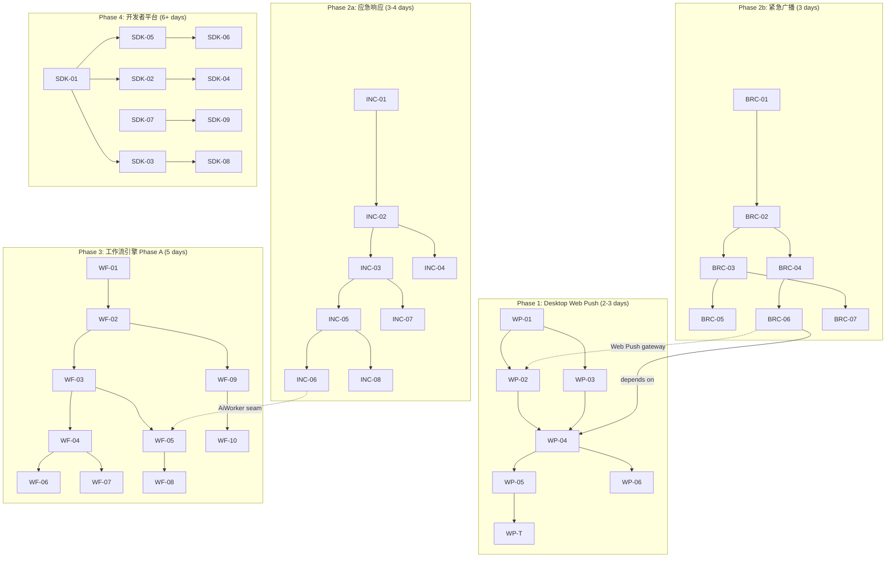
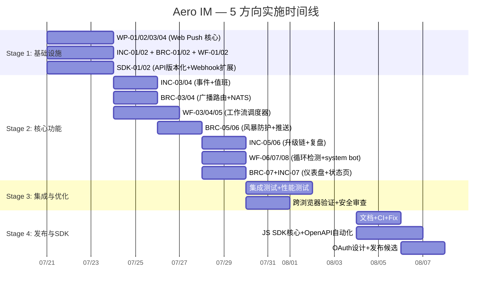

Now I have a thorough picture. Here's the Tech Lead analysis.

---

# Tech Lead 分析报告：5 个高价值扩展方向

> 基于 `docs/requirements/2026-07-10-round-n-plus-1-scan-five-underexplored-high-value-extensions.md`  
> 代码库验证：157 个迁移，~25K Rust 行，16 crate，`aero-server` 中 `routes.rs::build()` 基准线已确认

---

## 1. 任务分解

### 方向一：Desktop Web Push

| TASK-ID | 标题 | 涉及文件 | 前置依赖 | 工时 | 验收标准 |
|---------|------|---------|---------|------|---------|
| WP-01 | `PushPlatform` 扩展 `WebPush` + 迁移 | `aero-storage/src/push_token.rs`, `migrations/0158_web_push.sql` | 无 | 2h | `PushPlatform::parse("webpush").is_some()`；迁移 upsert 兼容现有 token |
| WP-02 | `web-push` crate 集成 + `WebPushGateway` 实现 | `aero-push/Cargo.toml`, `aero-push/src/web_push.rs` | WP-01 | 4h | `WebPushGateway` 实现 `PushGateway` trait；VAPID 密钥对生成 + RFC 8030 载荷签名 |
| WP-03 | `push_tokens.rs` 路由扩展：注册/撤销 Web Push subscription | `aero-server/src/push_tokens.rs` | WP-01 | 2h | `POST /api/me/push-token` 接受 `"webpush"`；存储 endpoint + auth + p256dh |
| WP-04 | Service Worker `sw.js` 注册 + push event handler | `web/sw.js`（新文件）, `web/index.html`, `web/app.js` | WP-02, WP-03 | 3h | SW 在 `install` 时注册；`push` 事件弹系统通知；`notificationclick` 打开 `<room-url>` |
| WP-05 | `push_bot.rs` 扩展 Web Push 负载 + `pushsubscriptionchange` 处理 | `aero-server/src/push_bot.rs`, `aero-server/src/push_tokens.rs` | WP-04 | 2h | Web Push 负载包含 `urgency`/`topic`；subscription 变更自动上报 |
| WP-06 | 权限撤销 + 跨浏览器适配 | `aero-push/src/web_push.rs`, `web/sw.js` | WP-04 | 2h | Firefox/Safari 密钥格式歧义处理；用户撤销权限后清理 DB |
| WP-T | 集成测试：`FakeGateway` 扩展 + 端到端 smoke | `aero-push/src/fake.rs`, `scripts/` | WP-05 | 2h | fake gateway 可验证 VAPID 签名；smoke 脚本覆盖 SW 注册 + push 送达 |

**小计：方向一 ≈ 17h（2-3 人·天）**

### 方向二：应急响应与值班管理

| TASK-ID | 标题 | 涉及文件 | 前置依赖 | 工时 | 验收标准 |
|---------|------|---------|---------|------|---------|
| INC-01 | `incidents` 表 + `on_call_schedules` 表 + 迁移 | `migrations/0158_incidents.sql`, `aero-storage/src/incident.rs`（新文件）, `aero-storage/src/on_call.rs`（新文件） | 无 | 3h | `cargo test` 验证 schema upsert；`lib.rs` re-export |
| INC-02 | `IncidentRepo` + `OnCallRepo` 仓储方法 | `aero-storage/src/incident.rs`, `aero-storage/src/on_call.rs` | INC-01 | 4h | CRUD + `current_on_call(workspace_id)` 查询（含轮换冲突检测） |
| INC-03 | REST 路由：事件创建 / 列表 / `!call` / `!ack` | `aero-server/src/incidents.rs`（新文件） | INC-02 | 4h | `POST /api/workspaces/:id/incidents` 创建事件频道 + 拉入值班人员；`!call` 斜杠命令触发紧急扇出 |
| INC-04 | 值班轮换逻辑 + 节假日处理 | `aero-storage/src/on_call.rs` | INC-02 | 3h | `overrides` 表支持节假日例外；`rotation_type`（weekly/daily）覆盖验证 |
| INC-05 | 升级链 Phase A（1 级超时 → 2 级） | `aero-server/src/incidents.rs`, `aero-storage/src/incident.rs` | INC-03 | 3h | 1 级 `ack` 超时 → 自动 @-mention 2 级 + 高优推送；可配置超时时间 |
| INC-06 | 事后复盘 AI 报告（复用 `call_recap.rs` 模式） | `aero-server/src/incident_recap.rs`（新文件）, `aero-ai/src/` | INC-03, 依赖方向五的 AiWorker | 4h | `POST /api/incidents/:id/recap` 生成事件 timeline + action items |
| INC-07 | 对外状态页 `/status`（SSR + Open Graph） | `aero-server/src/status_page.rs`（新文件）, `web/status.html` | INC-03 | 3h | 公开事件列表，无需登录；`og:title` 渲染；颗粒度控制 |
| INC-08 | PagerDuty/Opsgenie 外部同步 Phase A | `aero-storage/src/on_call.rs`, `aero-server/src/incidents.rs` | INC-05 | 4h | `OnCallProvider` trait；单方向同步（PagerDuty → Aero） |

**小计：方向二 ≈ 28h（3-4 人·天 Phase A；完整约 7 人·天）**

### 方向三：开发者平台 + SDK

| TASK-ID | 标题 | 涉及文件 | 前置依赖 | 工时 | 验收标准 |
|---------|------|---------|---------|------|---------|
| SDK-01 | API 版本化：`nest("/api/v1", router)` + 旧路径 301 重定向 | `aero-server/src/routes/routes.rs` | 无 | 3h | `/api/rooms/:id` 可经由 `/api/v1/rooms/:id` 访问；旧路径返回 301 |
| SDK-02 | Webhook 事件类型扩展（Edited/Deleted/Reaction/Membership/Poll） | `aero-storage/src/webhook.rs`, `aero-server/src/webhooks.rs` | 无 | 4h | `event_kind_filter` 返回 `Some(...)` 对新类型；开发者选择订阅类型 |
| SDK-03 | JavaScript SDK 核心包 `@aero-im/sdk` | `sdk/aero-im-sdk/`（新目录）, `sdk/aero-im-sdk/src/` | SDK-01 | 8h | `new AeroClient({token, baseUrl})` → REST + WS + Auth Promise API；npm package |
| SDK-04 | Webhook 事件注册表 API | `aero-server/src/webhooks.rs` | SDK-02 | 2h | `GET /api/v1/webhook-events` 返回可用事件类型 + JSON Schema 引用 |
| SDK-05 | OpenAPI 自动化生成（从 Axum 路由提取 schema） | `aero-server/Cargo.toml`（+ `utoipa` 等）, `aero-server/src/openapi.rs` | SDK-01 | 6h | `GET /openapi.json` 返回结构完整的 OpenAPI 3.1 + 路径和 Schema |
| SDK-06 | Swagger UI 挂载 | `aero-server/src/routes/routes.rs` | SDK-05 | 1h | `GET /docs` → Swagger UI 渲染 openapi.json |
| SDK-07 | OAuth 2.0 授权码流程 Phase A | `aero-storage/src/oauth_client.rs`（新文件）, `aero-server/src/oauth.rs`（新文件） | 无 | 8h | `GET /oauth/authorize` + `POST /oauth/token`；授权码 code 换 access_token |
| SDK-08 | 嵌入聊天 Widget（嵌入式 `<script>`） | `web/embed.js`（新文件）, `web/widget.html` | SDK-03 | 6h | `<script src="https://host/embed.js" data-workspace="x">` → 渲染聊天 widget |
| SDK-09 | App 管理门户（创建/管理 App scope 用量） | `aero-server/src/app_portal.rs`（新文件）, `web/app-portal/` | SDK-07 | 6h | UI 创建 App + 查看 OAuth scope + 用量统计 |

**小计：方向三 ≈ 44h Phase A-B（≈6 人·天 Phase A；完整 ~12 人·天）**

### 方向四：紧急广播系统

| TASK-ID | 标题 | 涉及文件 | 前置依赖 | 工时 | 验收标准 |
|---------|------|---------|---------|------|---------|
| BRC-01 | `broadcast_messages` 表 + `broadcast_confirmations` 表 | `migrations/0158_broadcasts.sql`, `aero-storage/src/broadcast.rs`（新文件） | 无 | 3h | schema 含 `severity`, `target_scope`, 唯一约束防止同一消息重复确认 |
| BRC-02 | `BroadcastRepo`（创建/列表/确认/确认统计） | `aero-storage/src/broadcast.rs` | BRC-01 | 3h | `create` + `confirm` + `confirmation_rate` 查询 |
| BRC-03 | REST 路由：admin-only 创建广播 + 确认列表 | `aero-server/src/broadcasts.rs`（新文件） | BRC-02 | 4h | `POST /api/workspaces/:id/broadcasts`（admin-only, 二次确认输入 "CONFIRM"）；`GET .../broadcasts/:bid/confirmations` |
| BRC-04 | NATS `im.broadcast.{workspace_id}` subject + 消费者 | `aero-server/src/broadcast_bus.rs`（新文件）, `aero-server/src/boot/` | BRC-02 | 4h | 消息发布到独立 subject；每实例临时消费者广播到连接池 |
| BRC-05 | 广播风暴防护：二次确认 + 冷却期 | `aero-server/src/broadcasts.rs` | BRC-03 | 2h | urgent 广播需输入 "CONFIRM"；同一 workspace 10min 内仅 1 条 urgent |
| BRC-06 | 多渠道送达 Phase A（FCM/APNs + Web Push） | `aero-server/src/broadcasts.rs`, `aero-server/src/push_bot.rs` | BRC-04, WP-04 | 3h | 广播也走既有的 PushGateway 分发出站 |
| BRC-07 | 确认收悉仪表盘 | `aero-server/src/broadcasts.rs`, `web/broadcast-dash.js` | BRC-03 | 3h | admin 页面显示确认率、未确认用户列表 |

**小计：方向四 ≈ 22h（≈3 人·天 Phase A；完整 ≈ 5 人·天）**

### 方向五：工作流自动化引擎

| TASK-ID | 标题 | 涉及文件 | 前置依赖 | 工时 | 验收标准 |
|---------|------|---------|---------|------|---------|
| WF-01 | `workflow_triggers` + `workflow_actions` + `workflow_runs` 表 | `migrations/0158_workflows.sql`, `aero-storage/src/workflow.rs`（新文件） | 无 | 4h | schema 含 `(trigger_event_id, workflow_id)` 幂等键唯一约束 |
| WF-02 | `WorkflowRepo` CRUD + 触发匹配 | `aero-storage/src/workflow.rs` | WF-01 | 4h | `find_matching_triggers(event_type, channel_id)` → 返回匹配工作流 |
| WF-03 | `run_workflow_dispatcher` 后台消费者 | `aero-server/src/workflow_dispatcher.rs`（新文件）, `aero-server/src/boot/background.rs` | WF-02 | 6h | 消费 `im.workflow.*` subject；按工作区分 shard 执行 |
| WF-04 | 触发条件 Phase A：`message_posted` / `member_joined` / `stream_status_changed` / `scheduled_time` | `aero-storage/src/workflow.rs`, `aero-server/src/workflow_dispatcher.rs` | WF-03 | 6h | 4 种触发条件均被解析和执行；定时器用 `scheduled_time` 轮询 |
| WF-05 | 动作 Phase A：`send_message` / `notify_admin` / `create_approval` / `webhook_call` | `aero-server/src/workflow_dispatcher.rs`, `aero-server/src/workflow_actions.rs` | WF-04 | 6h | 4 种动作均被执行；`send_message` 以 system bot 身份发送 |
| WF-06 | 循环检测 + 最大深度保护 | `aero-server/src/workflow_dispatcher.rs` | WF-03 | 3h | DAG 级循环检测（构建时）；运行时最大递归深度 10；断路器触发后记录 `/api/workspaces/:id/workflows/:wid/disable` |
| WF-07 | 频率限制（per-workflow per-min throttle） | `aero-storage/src/workflow.rs` | WF-03 | 2h | 可配置 `max_trigger_per_minute`；去重窗口 >= 1s |
| WF-08 | System bot 账号扩展 | `aero-storage/src/bot.rs`, `aero-server/src/workflow_dispatcher.rs` | WF-05 | 2h | 系统 bot participant 创建；`send_message` 以 `BotKind::Workflow` 身份发送 |
| WF-09 | REST 路由：创建/列表/启停工作流 | `aero-server/src/workflows.rs`（新文件） | WF-02 | 4h | `POST /api/workspaces/:id/workflows` + 列表/启停 |
| WF-10 | 运行历史 + 失败诊断 | `aero-server/src/workflow_runs.rs`（新文件） | WF-09 | 3h | 查看工作流运行历史、失败原因、重试按钮 |

**小计：方向五 ≈ 40h Phase A（≈5 人·天 Phase A；完整 ~12 人·天）**

---

## 2. 执行顺序与任务依赖图

### 可并行执行的任务组

| 并行组 | 包含任务 | 原因 |
|--------|---------|------|
| **Group A** | WP-01, INC-01, BRC-01, WF-01, SDK-01 | 全是独立的迁移/仓储任务，互不相交 |
| **Group B** | WP-02, WP-03, SDK-02, INC-02, BRC-02, WF-02 | 各方向的仓储层可并行实现，仅依赖各自的基础迁移 |
| **Group C** | INC-03 + INC-04, BRC-03 + BRC-04, WF-04 + WF-05 | 每个方向内部路由+逻辑层两两配对 |
| **Group D** | WP-T 独立；SDK-07 独立于其他 Phase A 任务 | 无阻塞 |

---

## 3. 技术风险

### 3.1 方向一：Web Push

| 风险 | 级别 | 说明 | 缓解措施 |
|------|------|------|---------|
| `web-push` crate 成熟度 | 🟡 Medium | Rust 的 Web Push 实现选择不多（`web-push` 社区的维护状态不确定） | 备选方案：手动实现 VAPID 签名（RFC 8292），仅依赖 `http` + `reqwest` + `openssl`；体积可控 |
| Service Worker 注册时机 | 🟡 Medium | 用户可能在禁用 SW 的浏览器（Safari private browsing）访问 | `sw.js` 注册失败 catch 静默；退化到当前 `Notification.requestPermission()` 行为 |
| `pushsubscriptionchange` 跨浏览器 | 🟠 High | Firefox/Chrome 对 subscription 变更的触发时机不同 | Phase A 在每次页面加载时重新 sync subscription（idempotent upsert） |
| 负载 ≤ 4096 字节 | 🟢 Low | 预览截断 140 字已有 `PREVIEW_CHARS` 常量（`push_bot.rs`），复用即可 | 无额外风险 |

### 3.2 方向二：应急响应

| 风险 | 级别 | 说明 | 缓解措施 |
|------|------|------|---------|
| 值班轮换冲突（两人同时/无人值班） | 🟠 High | `on_call_schedules` 允许重叠区间 | INC-04 必须在 SQL 层做 `OVERLAPS` 排除约束 + 应用层验证 |
| 高优通知可靠性 | 🔴 Critical | 当前 FCM/APNs 是 best-effort，不保证送达；`ack` 超时依赖推送 | Phase A 必须在推送基础上增加轮询机制（`ack` 窗口期内每隔 N 秒重推）；Phase B 考虑短信网关 |
| PagerDuty API 差异 | 🟡 Medium | PagerDuty 的 incident model 与 Aero 不同 | INC-08 设计 `OnCallProvider` trait，第一期只做单向 PagerDuty → Aero |
| 大量并发 P1 事件 | 🟡 Medium | 地震等场景可能导致消息风暴 | NATS 扇出本身抗压；`run_bus_listener` durable 消费者保证顺序；需确保 incident channel 创建速率受保护 |

### 3.3 方向三：开发者平台

| 风险 | 级别 | 说明 | 缓解措施 |
|------|------|------|---------|
| API 版本化迁移成本 | 🟠 High | 280+ 路由全部在 `/api/` 下无版本前缀，手写到 `/api/v1/` 的工作量大 | 使用 Axum `nest("/api/v1", router)` 包装现有 `Router`；旧路径用 `redirect`；增量迁移 |
| Webhook 事件风暴 | 🟡 Medium | `Membership` 在大工作区可能高频触发 | 为 webhook 加背压：`webhook_delivery.rs` 的 `Semaphore` 现有通道；开发者侧可选订阅类型 |
| OAuth token 生命周期管理 | 🟠 High | token 撤销需跨节点广播 | 复用现有 `Hub` 扇出 + Redis token 黑名单；Refresh token 轮换强制 |
| Embed Widget 安全 | 🟠 High | XSS / CSRF / 点击劫持 | `Content-Security-Policy` + `X-Frame-Options: DENY`（白名单模式）+ `postMessage` origin 校验 |
| JS SDK 维护负担 | 🟡 Medium | 后端 280+ 路由变更 → SDK 同步更新 | 自动化 OpenAPI 生成（SDK-05），SDK 类型从 OpenAPI schema 生成（`openapi-typescript`） |

### 3.4 方向四：紧急广播

| 风险 | 级别 | 说明 | 缓解措施 |
|------|------|------|---------|
| 误发送紧急广播 | 🔴 Critical | "全楼疏散"误发不可撤回 | **二次确认**（输入 "CONFIRM" + 预览）+ 冷却期 + admin-only + 发送前 audit log |
| 送达 vs 已读 | 🟠 High | Push 送达 ≠ 用户已读 | 广播需用户主动点击 `Mark as Read` 按钮；短信/电话通道需要回复确认机制 |
| NATS 消费者管理 | 🟡 Medium | `im.broadcast.*` 新节点上线后自动接入 | 用 ephemeral consumer（同 `run_live_bus_listener` 模式），新节点自动加入 |
| @everyone 滥用 | 🟡 Medium | severity/scope 权限漏洞 | admin-only 门控 + 成员不可设置 `severity=urgent` |

### 3.5 方向五：工作流自动化引擎

| 风险 | 级别 | 说明 | 缓解措施 |
|------|------|------|---------|
| 循环触发（A→B→A） | 🔴 Critical | 两个工作流相互触发导致无限循环 | DAG 级循环检测（WF-06）+ 运行时最大深度 10 + 断路器 |
| 高频事件风暴 | 🟠 High | `message_posted` 在 #general 每秒数十次 | 内置去重窗口（`max_trigger_per_minute` 配置）+ 触发频率限制 + `workflow_runs.(trigger_event_id, workflow_id)` 唯一约束 |
| System bot 身份隔离 | 🟡 Medium | `send_message` 以谁的身份发送 | 专用 `BotKind::Workflow` participant（WF-08）；权限范围受限于 workspace member |
| 资源隔离 | 🟡 Medium | 一个工作区的工作流故障影响其他 | 按工作区分 shard 执行（`run_workflow_dispatcher` 每个 workspace 独立 `tokio::spawn`） |
| 幂等执行 | 🟡 Medium | 消费者 crash 可能重复执行 | `(trigger_event_id, workflow_id)` UNIQUE 约束在 `workflow_runs`，`ON CONFLICT DO NOTHING` |

---

## 4. 资源评估

### 4.1 人员需求

| 角色 | 技能要求 | 数量 | 主要职责 |
|------|---------|------|---------|
| **Rust 后端工程师**（Senior） | Rust, tokio, axum, sqlx, NATS, Redis | 2 | 迁移/仓储/路由/总线/消费者逻辑 |
| **Rust/Web 全栈工程师** | Rust + JavaScript, Service Worker, Push API | 1（兼任） | Web Push 前后端 + SDK JS 核心 |
| **前端工程师** | JavaScript ES2020, SPA, DOM API | 1 | Web widget, 状态页 UI, SDK 浏览器测试 |
| **QA 工程师** | Rust 测试, 集成测试, Web Push 调试 | 1（兼任） | 集成测试 + 跨浏览器验证 |

### 4.2 关键时间线

| 阶段 | 时间 | 里程碑 | 交付物 |
|------|------|--------|-------|
| **Phase 1** | **第 1-2 周** | Desktop Web Push 上线 | `sw.js` 注册 + VAPID 推送 + `push_bot` 扩展 |
| **Phase 2a** | **第 3-4 周** | 应急响应 Phase A 上线 | 事件创建 + 值班轮换 + `!ack` + 升级链起 |
| **Phase 2b** | **第 3-4 周** | 紧急广播 Phase A 上线 | 广播消息 + 确认收悉 + 冷却期防护 |
| **Phase 3** | **第 5-6 周** | 工作流引擎 Phase A | 4 种触发 + 4 种动作 + 循环检测 + system bot |
| **Phase 4** | **第 7-9 周** | 开发者平台 Phase A-B | API 版本化 + Webhook 扩展 + JS SDK + OpenAPI |

> 以上时间线基于 **2 名 Rust 工程师 + 1 名前端的全职投入**。如果仅 1 名后端，则 Phase 1 独立完成（第 1-2 周），Phases 2a+2b 合并为 4 周（第 3-6 周）。

### 4.3 阻塞点与解决策略

| 阻塞点 | 影响范围 | 解决策略 |
|--------|---------|---------|
| `web-push` crate 在 Rust 生态中维护度不够 | WP-02 | 备选方案：手写 RFC 8292 VAPID 签名 + HTTP POST 到各浏览器推送服务 |
| 方向三 SDK 维护与后端 280+ 路由同步 | SDK-03, SDK-05 | **必须有**自动化 OpenAPI 生成（utoipa 或类似方案）；手写开销不可持续 |
| 方向五的循环检测正确性 | WF-06 | 参考 Slack Workflow Builder 的做法：构建时 DAG 校验 + 运行时深度计数器。Phase A 不覆盖多分支条件，降低复杂度 |
| 方向二的高优通知可靠性（推送不保证到达） | INC-05 | Phase A 使用当前推送；Phase B 开启短信/电话通道需引入第三方 SMS provider |
| 多 agent 并行集成冲突 | 全部 | 使用 `git worktree` 隔离；每个方向一个独立分支；`routes.rs` 和 `lib.rs` 的 `.merge` 冲突手工 resolve |

---

## 5. 质量保证

### 5.1 单元测试覆盖要求

| 方向 | 必须覆盖的模块 | 最小覆盖率目标 |
|------|--------------|-------------|
| WP | `WebPushGateway::send`（fake 验证）、VAPID 签名序列化、`PushPlatform::parse` | ≥90%（push_payload + 序列化） |
| INC | `OnCallRepo::current_on_call`（含重叠检测）、`IncidentRepo::create_with_channel` | ≥85%（仓储层纯逻辑） |
| BRC | `BroadcastRepo::create` + `confirmation_rate` 查询、风暴防护逻辑 | ≥85% |
| SDK | Webhook `event_kind_filter` 扩展匹配、OpenAPI schema 正确性 | ≥90%（纯函数） |
| WF | 循环检测算法、触发匹配 + 去重、限流逻辑 | ≥85% |

### 5.2 集成测试策略

| 测试类型 | 覆盖场景 | 工装 |
|---------|---------|------|
| **DB 测试**（`#[ignore]` + `DATABASE_URL`） | 所有仓储 CRUD + 唯一约束 + 重叠检测 | 一次性 PG 数据库 + 迁移重放 |
| **NATS 总线测试** | `im.broadcast.*` 扇出 + `run_workflow_dispatcher` 消费 | `EventBus` trait 的 mock（`FakeBus`）|
| **HTTP 路由测试** | 所有新路由 `200`/`400`/`403`/`404` | `axum::test` + `AppState` builder |
| **Web Push 跨浏览器** | Chrome/Firefox/Safari SW 注册 | `playwright` + 真浏览器（CI 可选）|
| **端到端 smoke 测试** | `webpush sw.js → push_bot → 通知` | 验证 `scripts/` 中的 smoke 脚本 |

### 5.3 代码审查要点

| 审查项目 | 检查点 |
|---------|--------|
| **迁移** | `CREATE TABLE IF NOT EXISTS` 幂等；uuid 主键；每个新表第一行检查 `NOT NULL` 和默认值 |
| **仓储** | 所有 public 方法有 `#[must_use]`；DB 返回 `Result` 透传；不 panic |
| **路由** | 每个 mutating 路由有 `AuthUser` + `assert_room_access` / `member_role`；admin-only 门控 |
| **总线消费者** | `loop { subscribe → while let Some }` 重连模式；`nack` 坏 payload 而不是 crash |
| **循环检测** | 工作流 DAG 构建时验证（拓扑排序）；运行时深度计数器 ≤ 10 |
| **幂等** | `workflow_runs.(trigger_event_id, workflow_id)` UNIQUE；`ON CONFLICT DO NOTHING` |
| **错误处理** | Fail-open 模式（log + skip，不 panic）；有界队列满时 skip 不背压 |
| **安全** | SQL 注入（sqlx 编译期检查）；XSS（CSP 头）；CSRF（API 不依赖 cookie） |

### 5.4 性能测试需求

| 测试场景 | 工具 | 阈值 |
|---------|------|------|
| 广播同时推送 5000 设备 | `locust` + `aero-server` 实例 | 广播发布 ≤ 1s 内开始扇出 |
| 工作流触发频率（高频频道） | `tokio::spawn` 模拟 100 msg/s | 去重窗口正确率 ≥ 99.9%；CPU ≤ 10% 增量 |
| Web Push 并发 subscription 注册 | `wrk` POST `/api/me/push-token` | 1000 RPS 不超时 |
| 应急值班轮换查询 | `pgbench` | 10000 行 `on_call_schedules` 表，查询 < 10ms |

---

## 6. 实施计划

### Stage 1：基础设施搭建（第 1 周 · 3 天）

| 天 | 任务 | 负责人 | 交付物 |
|----|------|--------|-------|
| Day 1 | WP-01（PushPlatform 扩展）+ WP-02（WebPushGateway + `web-push`）| Rust Eng 1 | `WebPushGateway` 实现 + VAPID 密钥生成 |
| Day 1 | INC-01（incidents 和 on_call_schedules 迁移）+ BRC-01（broadcasts 迁移）+ WF-01（workflows 迁移）| Rust Eng 2 | 4 个迁移文件 + 对应仓储 stub |
| Day 2 | WP-03（路由扩展）+ WP-04（`sw.js` + index.html 注册）| Rust Eng 1 + FE | Service Worker 注册成功；`push` 事件处理 |
| Day 2 | INC-02（IncidentRepo）+ BRC-02（BroadcastRepo）+ WF-02（WorkflowRepo）| Rust Eng 2 | 3 个完整仓储，DB 测试通过 |
| Day 3 | WP-05（push_bot 扩展）+ WP-T（fake gateway 扩展）| Rust Eng 1 | Web Push 端到端 smoke 通过 |
| Day 3 | SDK-01（API 版本化 nest）+ SDK-02（Webhook 扩展）| Rust Eng 2 | `/api/v1/` 可访问; webhook 支持新事件类型 |

**里程碑：Web Push 端到端可用；基础设施迁移全部就位**

### Stage 2：核心功能实现（第 2-3 周 · 8 天）

| 天 | 任务 | 负责人 | 交付物 |
|----|------|--------|-------|
| Day 4-5 | INC-03 + INC-04（应急路由 + 值班轮换）| Rust Eng 1 | `POST /api/workspaces/:id/incidents` + `!call`/`!ack` 可用 |
| Day 4-5 | BRC-03 + BRC-04（广播路由 + NATS subject）| Rust Eng 2 | 广播消息发布与扇出；admin 路由门控 |
| Day 6-7 | WF-03 + WF-04 + WF-05（工作流调度器 + 触发 + 动作）| Rust Eng 1+2 | `run_workflow_dispatcher` 运行；4 种触发 + 4 种动作 |
| Day 6-7 | BRC-05 + BRC-06（风暴防护 + 多渠道推送）| Rust Eng 2 | 二次确认 + 冷却期；推送集成 |
| Day 8 | INC-05 + INC-06（升级链 + 复盘报告 seam）| Rust Eng 1 | 1 级超时 2 级升级；POST recap 端点 |
| Day 8 | WF-06 + WF-07 + WF-08（循环检测 + system bot）| Rust Eng 2 | 循环检测通过测试；system bot 发送消息 |
| Day 8 | BRC-07（确认仪表盘）+ INC-07（状态页）| FE | 广播确认 UI；/status 公开页面 |

**里程碑：应急响应 + 紧急广播 + 工作流引擎 Phase A 所有核心功能可用**

### Stage 3：集成测试与优化（第 4 周 · 4 天）

| 天 | 任务 | 负责人 | 交付物 |
|----|------|--------|-------|
| Day 9-10 | 集成测试：DB tests、HTTP rout tests、NATS 总线模拟 | 全队 | 所有新模块 DB 测试 + HTTP 路由测试覆盖 ≥80% |
| Day 10-11 | 性能测试：广播并发、工作流触发频率 | Rust Eng 1+2 | 达阈值；瓶颈优化 |
| Day 10-11 | 跨浏览器 Web Push 验证（Chrome/Firefox/Safari）| FE | 3 浏览器均通过 smoke |
| Day 11-12 | 安全审查：循环检测 edge case、admin 门控、XSS | Rust Eng 1+2 | 无新增漏洞 |

**里程碑：全部 5 个方向 Phase A 通过集成测试 + 性能测试**

### Stage 4：发布准备 + Phase B 规划（第 5 周 · 3 天）

| 天 | 任务 | 负责人 | 交付物 |
|----|------|--------|-------|
| Day 13 | 文档编写：RF C 变更日志、配置项文档 | 全队 | `CHANGELOG` 条目；`config.example.toml` 更新 |
| Day 13-14 | `cargo clippy --workspace --all-targets` 通过 + 0 new warnings | 全队 | CI 干净 |
| Day 14-15 | SDK-03（JS SDK 核心包）+ SDK-05（OpenAPI 自动生成）| Rust Eng 1 + FE | npm 包发布；`/openapi.json` 端点 |
| Day 15 | 方向三 SDK-07 + SDK-08 OAuth Phase A 规划 | Rust Eng 2 | OAuth 设计文档 + 时间线 |
| Day 15 | 方向二 INC-08（PagerDuty 同步）+ 方向五 Phase B 规划 | Rust Eng 1 | PagerDuty 同步 Phase A 实现 |

**里程碑：v2.0.0 发布候选；SDK 初版可用**

### 甘特图

---

## 附录：关键约束速查

基于项目 `AGENTS.md` 规范的环境约束对照：

| 规范要求 | 本分析中的落实情况 |
|---------|-----------------|
| 迁移后必须 `cargo build` 再 migrate | 每个 Phase Stage 1 的迁移任务都标明需先 build |
| 路由必须 `assert_room_access(participant, room)` | INC-03, BRC-03, WF-09 路由都标注了 admin-only + 工作区访问守卫 |
| `tagged-enum kind` 字段不能重命名为 `kind` | 广播/工作流事件若有新 `RoomEvent` variant，已用 `#[serde(rename=...)]` 处理 |
| 与既有 `token helper` 不冲突 | 新仓储无需 `generate_token`，不存在 re-export 冲突 |
| workspace lints 不新增警告 | 所有任务验收标准包含 `cargo clippy --workspace --all-targets` |
| AI 无 key 退化路径不改变 | 方向二的复盘报告复用 `call_recap.rs` pattern，已标明沙箱 `HashEmbedder` 兜底 |
| 写路径必须 `participant_cache.invalidate` | 工作流 system bot 账号创建/推送 token 注册已标注 cache invalidation |
| at-least-once 幂等键 | BRC-02 + WF-02 明确要求 `(trigger_event_id, workflow_id)` UNIQUE |
| 5 个方向均不覆盖禁区（MLS 客户端 / 联邦 / 移动端 SDK） | 分析范围仅限于文档描述的能力扩展，不涉及架构红线 |
