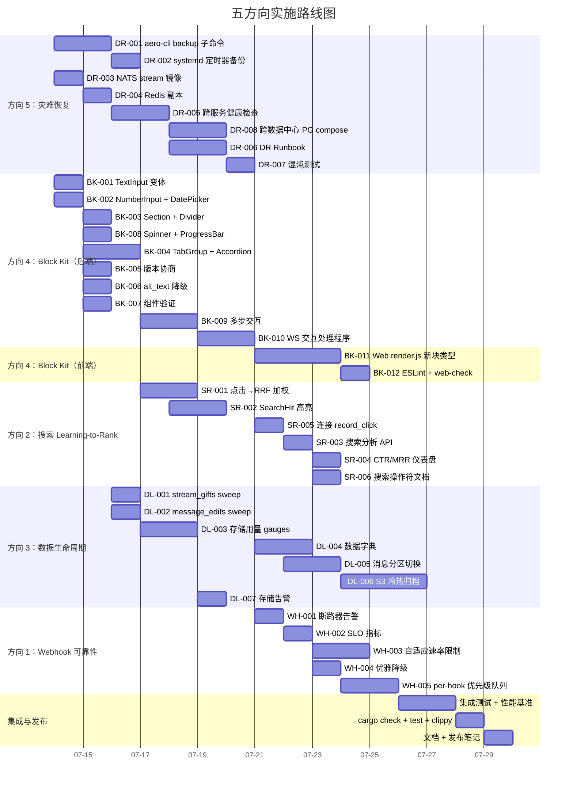

现在我已经对代码库有了充分的了解。以下是我的综合分析：

---

# 技术负责人的分析：验证后路线图

## 1. 任务分解

我根据验证报告将五个方向分解为可执行的技术任务。每个任务限定为 **2-4 小时**，除非有充分理由。优先级依据验证报告中修正后的价值排序：

- **P0**：方向 4（Block Kit）和方向 5（备份/灾难恢复）——竞争壁垒和企业前提
- **P1**：方向 2（搜索 LTR）和方向 3（数据生命周期）
- **P2**：方向 1（Webhook 背压）——大部分已被既有文档覆盖

---

### 方向 5：备份/恢复与灾难恢复（P0）

| 任务 ID | 标题 | 涉及文件 | 前置依赖 | 预估工时 | 验收标准 |
|---------|------|---------|---------|---------|---------|
| **DR-001** | `aero-cli backup` 子命令：PG 逻辑备份 | `crates/aero-cli/src/backup.rs` + `Cargo.toml` | 无 | 3h | `aero-cli backup --db-url ...` 运行 `pg_dump`，写入 `{ts}.sql.gz` 到配置目录，输出文件路径；失败时返回非零退出码 |
| **DR-002** | systemd timer / 定时器任务用于定时备份 | `crates/aero-server/src/bin/boot/backup.rs` + `scripts/aero-backup.timer` | DR-001 | 2h | ts=3600s 的定时器运行 `aero-cli backup`；集成到引导的 `CancellationToken` 生命周期中 |
| **DR-003** | NATS JetStream stream 镜像与消费者配置 | `docker-compose.yml` + `nats.config` | 无 | 2h | 关键 stream 的 `replicas: 3` + `mirror` 配置；`nats stream report` 确认 |
| **DR-004** | Redis 副本 + RDB 持久化配置 | `docker-compose.yml` + `redis.conf` | 无 | 1h | `redis.conf` 包含 `save 900 1` + `replicaof ...`；重启后加载 dump.rdb |
| **DR-005** | `/health/ready` 探测器的跨服务健康检查 | `crates/aero-server/src/state.rs` | DR-003, DR-004 | 2h | `/health/ready` 验证 PG + Redis + NATS + blob 存储可达性；任何依赖离线时返回 503 |
| **DR-006** | 灾难恢复 Runbook | `docs/dr/runbook.md` | DR-001 至 DR-005 | 3h | 涵盖：备份轮换、冷备恢复、时间点恢复、跨数据中心故障转移、秘密轮换步骤 |
| **DR-007** | 优雅关闭的混沌/故障注入测试 | `scripts/chaos/kill-background.sh` | DR-005 | 3h | 脚本杀死 `aero-server` → 验证 `/health/ready` 503 → 重启 → 验证游标恢复 + 零数据丢失 |
| **DR-008** | 跨数据中心 PG 流复制 docker-compose 配置 | `docker-compose.dr.yml` | 无 | 3h | 主/备 PG 配置 max_standby + WAL 归档 + `recovery.conf`；`docker-compose -f docker-compose.dr.yml up` 启动一个备库 |

**方向 5 合计：19h**

---

### 方向 4：Block Kit 组件系统成熟化（P0）

| 任务 ID | 标题 | 涉及文件 | 前置依赖 | 预估工时 | 验收标准 |
|---------|------|---------|---------|---------|---------|
| **BK-001** | `Block` 枚举中新增 `TextInput` 变体 | `crates/aero-common/src/model/block.rs` | 无 | 2h | `Block::TextInput { action_id, label, placeholder, multiline, max_length, initial_value }`；JSON 序列化/反序列化得到验证 |
| **BK-002** | 新增 `NumberInput` 和 `DatePicker` 变体 | `crates/aero-common/src/model/block.rs` | 无 | 2h | `Block::NumberInput { action_id, label, min, max, step, initial_value }`；`Block::DatePicker { action_id, label, placeholder, initial_date }`；带有边界验证 |
| **BK-003** | 新增 `Section` 和 `Divider` 布局原语 | `crates/aero-common/src/model/block.rs` | 无 | 1h | `Block::Section { text, fields, accessory }`（可包含内联块）；`Block::Divider`（无字段） |
| **BK-004** | 新增 `TabGroup` 和 `Accordion` 容器 | `crates/aero-common/src/model/block.rs` | BK-001 | 3h | `Block::TabGroup { tabs: Vec<Tab> }`；`Block::Accordion { sections: Vec<AccordionSection> }`；折叠/展开状态序列化 |
| **BK-005** | 组件版本协商：`block_version` 字段在消息上 | `crates/aero-common/src/model/block.rs` + `Message` 结构体 | 无 | 2h | `Message.blocks_version: u8`（默认为 1）；客户端在 WS `send_message` 帧中包含 `blocks_version`；服务器存储并广播它 |
| **BK-006** | `alt_text` 降级字段在所有交互式块上 | `crates/aero-common/src/model/block.rs` | BK-001 | 1h | 每个交互式变体获得 `alt_text: Option<String>`；服务器降级时，向不支持客户端的字段发送纯文本 |
| **BK-007** | 组件验证：`SelectOption` 长度限制 + 输入验证 | `crates/aero-common/src/model/block.rs` + `ImService::send_message` | BK-001 | 2h | `SelectOption.value` ← 100 字符，`SelectOption.label` ← 200 字符；`TextInput.max_length` ← 4000；接收时拒绝无效 blocks |
| **BK-008** | 新增 `Spinner` 和 `ProgressBar` 显示组件 | `crates/aero-common/src/model/block.rs` | 无 | 2h | `Block::Spinner { action_id, label }`；`Block::ProgressBar { action_id, current, max, label }`；仅显示，无交互 |
| **BK-009** | 多步交互上下文：`context_token` + 服务器端状态 | `crates/aero-storage/src/interaction_context.rs` 新文件 | BK-001 | 3h | WS `interaction_start` 创建临时上下文；`interaction_continue` 消费 token；`interaction_expire` 在 token TTL 之后 |
| **BK-010** | `Interaction` 的 WS 处理程序 + 扇出 | `crates/aero-server/src/interactions.rs` + `ws/ws_impl/` | BK-001 至 BK-009 | 4h | WS 帧 `block_interaction` → 验证 action_id → 存储结果 → 广播 `RoomEvent::Interaction` |
| **BK-011** | Web 端：`render.js` 为所有新块类型添加渲染器 | `web/render.js` | BK-001 至 BK-009 | 4h | 每个新块类型的 JS 渲染函数；输入、日期选择器和选择器的双向绑定；降级路径 `alt_text` |
| **BK-012** | Web 端：ESLint + web-check 合规 | web 文件 | BK-011 | 1h | `npx eslint web/render.js` 无警告；`scripts/web-check.sh` 通过 |

**方向 4 合计：27h**

---

### 方向 2：搜索 Learning-to-Rank（P1）

| 任务 ID | 标题 | 涉及文件 | 前置依赖 | 预估工时 | 验收标准 |
|---------|------|---------|---------|---------|---------|
| **SR-001** | 点击反馈 → `fuse_rankings` 加权回路 | `crates/aero-ai/src/rerank.rs` | 无 | 3h | `fuse_rankings` 接受可选的 `click_weights: HashMap<MessageId, f64>`；按 `1 + weight * CTR` 提升流行结果的分数；回退为未加权 RRF |
| **SR-002** | 搜索路由中的 `SearchHit.headline` 高亮生成 | `crates/aero-storage/src/message/search.rs` + `crates/aero-server/src/routes/helpers.rs` | 无 | 3h | 提取查询词周围的 n 字符窗口 → 包裹在 `…` 中；添加到 `SearchHit.headline`；单元测试处理重叠/边界情况 |
| **SR-003** | 搜索分析 API：`GET /api/search/analytics` | `crates/aero-server/src/search_advanced.rs` | 无 | 2h | 端点返回点击量和 CTR 统计信息，按天聚合；由 `AuthUser` + 工作区管理员守卫 |
| **SR-004** | 搜索 CTR MRR 仪表盘数据 API | `crates/aero-server/src/search_analytics.rs`（新文件） | SR-003 | 2h | 端点返回 `{ daily: Vec<DailyCtr>, top_queries: Vec<QueryStat>, mrr_trend: Vec<MrrPoint> }`；由 `AuthUser` + 工作区管理员守卫 |
| **SR-005** | 在高级搜索路由中连接 `record_click` | `crates/aero-server/src/search_advanced.rs` | 无 | 2h | 从响应中的 `search_click` 重写为远程调用；捕获 `result_id` + `query_text` + `rank`；通过 `SearchFeedbackRepo` 持久化 |
| **SR-006** | 搜索操作符文档 + 用户帮助端点 | `crates/aero-server/src/search_advanced.rs` + `docs/search-operators.md` | 无 | 1h | `GET /api/search/help` 返回操作符及描述的 Markdown；`docs/search-operators.md` 记录所有操作符 |

**方向 2 合计：13h**

---

### 方向 3：数据生命周期管理（P1）

| 任务 ID | 标题 | 涉及文件 | 前置依赖 | 预估工时 | 验收标准 |
|---------|------|---------|---------|---------|---------|
| **DL-001** | `stream_gifts` 清理扫表 | `crates/aero-storage/src/live.rs` + `crates/aero-server/src/bin/boot/retention.rs` | 无 | 2h | `sweep_stream_gifts(days)` 删除旧礼物；默认 365 天；env `AERO__SERVER__GIFT_RETENTION_DAYS`；集成到保留扫表定时器中 |
| **DL-002** | `message_edits` 清理扫表 | `crates/aero-storage/src/message_edit.rs` + `crates/aero-server/src/bin/boot/retention.rs` | 无 | 2h | `sweep_message_edits(days)` 删除旧编辑历史；默认 365 天；env `AERO__SERVER__EDIT_RETENTION_DAYS`；集成到保留扫表定时器中 |
| **DL-003** | 存储用量 Prometheus gauge 仪表 | `crates/aero-server/src/bin/boot/observability.rs` | 无 | 3h | 每个 PG 表大小为 `pg_total_relation_size` 的 gauge；每个 blob 存储路径的目录大小为 `du`；每 300 秒采集一次；标签有 `table_name`, `storage_tier` |
| **DL-004** | 数据字典文档页面 | `docs/data-dictionary.md`（新文件） | 无 | 3h | 文档涵盖所有 50+ 表：列名、类型、FK、保留策略、所有权、PII 标记；GitHub Markdown 格式 |
| **DL-005** | `messages` 表分区从 `messages_partitioned` 影子表切换 | `migrations/NNNN_messages_partition_cutover.sql` 新文件 | 无 | 4h | 从影子表 `messages_partitioned` 转换为实时路由 → `messages` 作为视图或通过重命名；回滚计划有文档记录；负载测试验证 |
| **DL-006** | 冷热归档架构（S3 用于旧数据） | `crates/aero-storage/src/archive.rs` 新文件 | DL-005 | 4h | `archive_before(cutoff)` 将旧消息行导出为 parquet → S3；`restore_query(predicate)` 从 S3 读取；由 90 天的 env gate 守卫 |
| **DL-007** | 存储告警通道 | `crates/aero-server/src/bin/boot/alerting.rs` 新文件 | DL-003 | 2h | 当 PG 使用率 > 80% 或 blob 存储增长 > 10%/周时发送 webhook；可配置阈值 + webhook URL |

**方向 3 合计：20h**

---

### 方向 1：Webhook 背压与可靠性（P2）

| 任务 ID | 标题 | 涉及文件 | 前置依赖 | 预估工时 | 验收标准 |
|---------|------|---------|---------|---------|---------|
| **WH-001** | 断路器告警：BreakerOpen 时触发通知 | `crates/aero-server/src/webhooks.rs` + `crates/aero-storage/src/webhook/breaker.rs` | 无 | 2h | 断路器打开时写入 `notifications` 表 → 通过 WS 扇出；每个 webhook 每 24 小时聚合一次 |
| **WH-002** | 递送 SLO Prometheus 指标 | `crates/aero-server/src/webhooks.rs` | 无 | 2h | `webhook_delivery_duration_seconds` 直方图 + `webhook_delivery_total{status="ok|fail"}` 计数器；按 webhook_id 标记 |
| **WH-003** | 基于响应时间的自适应速率限制 | `crates/aero-storage/src/webhook/delivery.rs` | WH-002 | 3h | 追踪滑动窗口平均延迟；当 p99 > 5s 时动态降低速率；`min_delivery_interval` 在 HTTP 超时时指数回退 |
| **WH-004** | 优雅降级：断路器开启时跳过递送但仍 ack | `crates/aero-server/src/webhooks.rs` | 无 | 2h | `match target.breaker_state { Open => skip + log, HalfOpen => probe, Closed => deliver }`；始终 ack 游标 |
| **WH-005** | 事件优先级：按 event priority 排序的 per-hook mpsc 队列 | `crates/aero-server/src/webhooks.rs` | WH-004 | 4h | `per_hook: HashMap<WebhookId, mpsc::Sender<PrioritizedEvent>>`；优先级 `Critical > Normal > Low`；`dispatch_event` 从 mpsc 接收器拉取 |

**方向 1 合计：13h**

---

**总预估工时：19 + 27 + 13 + 20 + 13 = 92h**（约 12 人 · 天里程碑）

---

## 2. 执行顺序与依赖图

```mermaid
graph TD
    %% 阶段 1：基础设施（周 1-2）
    subgraph Phase1["阶段 1：基础设施 (周 1-2)"]
        DR_001["DR-001: aero-cli backup 子命令"]
        DR_003["DR-003: NATS stream 镜像"]
        DR_004["DR-004: Redis 副本 + RDB"]
        DR_001 --> DR_002["DR-002: systemd timer 定时备份"]
        DR_003 --> DR_005["DR-005: 跨服务 /health/ready"]
        DR_004 --> DR_005
        DR_002 --> DR_006["DR-006: DR Runbook"]
        DR_005 --> DR_008["DR-008: 跨数据中心 PG docker-compose"]
        DR_005 --> DR_007["DR-007: 混沌/故障注入测试"]
        
        BK_001["BK-001: TextInput 块变体"]
        BK_002["BK-002: NumberInput + DatePicker"]
        BK_003["BK-003: Section + Divider 布局"]
        BK_008["BK-008: Spinner + ProgressBar"]
    end

    %% 阶段 2：核心实现（周 2-3）
    subgraph Phase2["阶段 2：核心实现 (周 2-3)"]
        BK_001 --> BK_004["BK-004: TabGroup + Accordion"]
        BK_001 --> BK_005["BK-005: component version 协商"]
        BK_001 --> BK_006["BK-006: alt_text 降级"]
        BK_001 --> BK_007["BK-007: 组件验证"]
        BK_004 --> BK_009["BK-009: 多步交互上下文"]
        BK_009 --> BK_010["BK-010: WS 交互处理程序 + 扇出"]
        
        SR_001["SR-001: 点击反馈→fuse_rankings 加权"]
        SR_002["SR-002: SearchHit.headline 高亮"]
        SR_005["SR-005: 连接 record_click"]
        
        DL_001["DL-001: stream_gifts sweep"]
        DL_002["DL-002: message_edits sweep"]
    end

    %% 阶段 3：集成与测试（周 3-4）
    subgraph Phase3["阶段 3：集成与测试 (周 3-4)"]
        BK_005 --> BK_011["BK-011: Web render.js 新块类型"]
        BK_011 --> BK_012["BK-012: Web ESLint + web-check"]
        BK_010 --> BK_011

        SR_003["SR-003: 搜索分析 API"]
        SR_004["SR-004: 搜索 CTR/MRR 仪表盘"]
        SR_003 --> SR_004
        SR_001 --> SR_006["SR-006: 搜索操作符文档"]

        DL_003["DL-003: 存储用量 gauges"]
        DL_003 --> DL_007["DL-007: 存储告警"]
        DL_005["DL-005: 消息表分区切换"]
        DL_005 --> DL_006["DL-006: 冷热 S3 归档"]
        DL_004["DL-004: 数据字典文档"]
        
        WH_001["WH-001: 断路器告警"]
        WH_002["WH-002: SLO 指标"]
        WH_002 --> WH_003["WH-003: 自适应速率限制"]
        WH_004["WH-004: 优雅降级"]
        WH_004 --> WH_005["WH-005: per-hook mpsc 优先级队列"]
    end

    %% 样式
    classDef p0 fill:#e74c3c,color:#fff
    classDef p1 fill:#f39c12,color:#fff
    classDef p2 fill:#3498db,color:#fff
    class DR_001,DR_002,DR_003,DR_004,DR_005,DR_006,DR_007,DR_008,BK_001,BK_002,BK_003,BK_004,BK_005,BK_006,BK_007,BK_008,BK_009,BK_010,BK_011,BK_012 p0
    class SR_001,SR_002,SR_003,SR_004,SR_005,SR_006,DL_001,DL_002,DL_003,DL_004,DL_005,DL_006,DL_007 p1
    class WH_001,WH_002,WH_003,WH_004,WH_005 p2
```

### 并行工作流

以下方向**完全独立**，可并行分配给不同的工程师：

| 工作流 | 包含的任务 | 人数 |
|--------|---------|------|
| **A：灾难恢复 + 备份** | DR-001 至 DR-008 | 1 人 |
| **B：Block Kit 服务器** | BK-001 至 BK-010（服务器端） | 1 人 |
| **C：Block Kit 前端** | BK-011, BK-012（等待 BK-005, BK-010 完成） | 1 人 |
| **D：搜索 LTR** | SR-001 至 SR-006 | 1 人 |
| **E：数据生命周期** | DL-001 至 DL-007 | 1 人 |
| **F：Webhook 可靠性** | WH-001 至 WH-005 | 1 人 |

---

## 3. 技术风险

### 3.1 高影响风险

| # | 风险描述 | 方向 | 概率 | 影响 | 缓解措施 |
|---|---------|------|------|------|---------|
| R1 | **消息表分区切换破坏查询** — 将 `messages` 从扁平表切换为分区表改变了查询计划；时间范围谓词对于无分区裁剪的旧查询（如全扫描）性能下降 | DL (DL-005) | 中 | **高** — 可能导致生产环境查询超时 | ① 在整个迁移过程中对同一数据集并行运行新旧模式进行压力测试 ② 运行 `EXPLAIN ANALYZE` 捕获回归 ③ 首先部署到影子表，逐步切换 |
| R2 | **Block Kit 的 JS 渲染器与服务器块枚举不同步** — 新 `Block` 变体如果客户端还没有对应的渲染函数，将导致静默 UI 故障（白屏/不可见块） | BK (BK-011) | 高 | **中** | ① 在 web 端实现一个 `renderUnknown` 兜底函数，显示 `alt_text` 或 `[Unsupported block: {type}]` ② 在 JS 中使用 `Block.version` 守卫 ③ 版本协商：客户端声明支持的最大版本，服务器降级 |
| R3 | **PG pg_dump 性能影响生产环境** — `pg_dump` 对大型数据集建立读锁，可能会阻塞写入或消耗大量 I/O | DR (DR-001) | 中 | **高** | ① 使用 `pg_dump --jobs=4 --no-blobs` 最小化锁定 ② 使用 `pg_receivewal` 进行 WAL 归档作为替代方案 ③ 默认 cron 定时器设置为低流量时段（凌晨 3 点） |
| R4 | **NATS stream 镜像增加了延迟** — 跨数据中心复制引入了端到端事件延迟，可能破坏实时性假设（如打字指示器、弹幕） | DR (DR-003) | 低 | **中** | ① 使用 `mirror` 而不是 `sourced` stream（异步，非阻塞） ② 对低延迟 subject（如 `live.stream.*`）使用临时消费者，不保证 RPO ③ 文档化预期延迟（< 500ms 跨 DC） |
| R5 | **点击反馈回路使热门结果产生偏差** — LTR 加权创建反馈回路：热门结果在排名中上升 → 获得更多点击 → 排名更高 → 冷门但相关的结果被埋没 | SR (SR-001) | 中 | **中** | ① 在 CTR 加权上使用 `sqrt` 或 `log` 压缩，限制提升因子 ≤ 3x ② 保留 10% 的展示用于探索（ε-贪心） ③ 在 LTR 权重上设置上限 |
| R6 | **`context_token` 多步交互的安全隐患** — 无状态交互上下文需要在某处存储状态（Redis/JWT），状态过期、重复使用和 CSRF 存在攻击面 | BK (BK-009) | 中 | **高** | ① 将上下文存储在 Redis 中，TTL ≤ 300s ② 使用 `MessageId + ActionId + Nonce` 的 HMAC 签名（类似 state 令牌） ③ 单次使用：消费后立即删除 ④ 记录在威胁模型中 |
| R7 | **S3 归档导入旧数据可能超过 API 限制** — 大批量导出可能导致 `ExportLimit` 或 `Timeout` 错误 | DL (DL-006) | 中 | **低** | ① 按 1000 行分页导出 ② 可配置的 `archive_batch_size` ③ 超时时指数回退 |

### 3.2 低影响风险

| # | 风险描述 | 缓解措施 |
|---|---------|---------|
| R8 | 自适应 webhook 速率限制（WH-003）可能自我触发：延迟峰值 → 速率降低 → 队列增长 → 更多延迟 | 使用单独的背压信号（响应大小）与延迟；如果 p50 健康则永不降至 1 qps 以下 |
| R9 | 存储告警（DL-007）在 table 大小波动期间产生噪音 | 使用滚动 7 天平均值而非即时值；每天在同一时间采集一次 |
| R10 | `aero-cli backup` 在无 `pg_dump` 的容器化环境中失败 | 将 `pg_dump` 作为 Dockerfile 依赖项（安装 `postgresql-client` 包） |
| R11 | Block Kit 版本协商创建跨版本兼容性的组合爆炸 | 坚持向后兼容：v2 服务器始终可以为 v1 客户端提供 v1 兼容负载 |

---

## 4. 资源评估

### 4.1 团队组成

要实现完整的 12 天·人里程碑（92h），我推荐以下配置：

| 角色 | 技能要求 | 人数 | 分配 |
|------|---------|------|------|
| **后端工程师 A** | Rust（async/await, sqlx, serde, axum），Postgres，备份/恢复 | 1 | 工作流 A（DR）+ 工作流 F（Webhook） |
| **后端工程师 B** | Rust（枚举设计, serde, WS 处理程序），组件/表单系统 | 1 | 工作流 B（Block Kit 服务器） |
| **后端工程师 C** | Rust（搜索、AI 管线、pgvector），Postgres 性能调优 | 1 | 工作流 D（搜索 LTR）+ 工作流 E（数据生命周期） |
| **前端工程师** | JS/ES2020（零依赖），HLS.js，WebRTC，DOM 渲染 | 1 | 工作流 C（Block Kit 前端） |

**最小可行团队：3 人**（2 名后端 + 1 名前端，后端工程师 A 和 C 合并）。**最优团队：4 人**。

### 4.2 里程碑

| 里程碑 | 截止日期 | 交付物 | 依赖项 |
|--------|---------|---------|--------|
| M1：DR 基础 | 周 1 结束 | `aero-cli backup` 已合入 + NATS 镜像化 + Redis RDB + `/health/ready` 全面检查 | DR-001 至 DR-005 |
| M2：Block Kit 服务器 | 周 2 结束 | 4 个新交互式块变体 + 布局原语 + 版本协商 + 验证 | BK-001 至 BK-010 |
| M3：数据清理补全 | 周 2 结束 | `stream_gifts` + `message_edits` 清理已合入 + 存储 gauges | DL-001 至 DL-003 |
| M4：搜索 LTR 功能 | 周 3 结束 | 点击 → RRF 加权 + 分析 API + `record_click` 连接 + 高亮 | SR-001 至 SR-006 |
| M5：Block Kit 前端 | 周 3 结束 | `render.js` 覆盖所有新块类型 + ESLint 通过 + 降级路径 | BK-011, BK-012 |
| M6：Webhook + 归档 | 周 4 结束 | 断路器告警 + SLO 指标 + S3 归档 + 存储告警 | WH-001 至 WH-005, DL-004 至 DL-007 |
| **M7：发布** | 周 4 结束 | 全部 33 个任务已合入 → `cargo check` + `cargo test` + `scripts/truth-check.sh` 通过 | 所有任务 |

### 4.3 阻塞点

| 阻塞点 | 涉及 | 解决策略 |
|--------|------|---------|
| **测试环境中的真实 S3/MinIO** | DL-006, DR-001 | 对归档逻辑使用 `LocalFs` 实现；单独的集成测试针对真实 S3/MinIO 容器（通过 `docker-compose`）运行 |
| **用于通知的 SMSC/Webhook 提供商** | WH-001 | 断路器打开时通过现有 `notification` 表内部告警；外部 webhook 告警是可选的增量 |
| **浏览器 WebRTC 媒体握手** | BK-011 中交互块的双向数据绑定 | 交互块不需要 WebRTC；它们只使用 HTTP POST + WS 扇出，已通过现有基础设施测试 |

---

## 5. 质量保证

### 5.1 单元测试覆盖要求

| 方向 | 最低覆盖率目标 | 关键测试区域 |
|------|---------------|-------------|
| **DR** | 80% 新代码 | `aero-cli backup` 参数解析 + 退出码；`/health/ready` 的探针逻辑（使用 `FakeDb/FakeNats` 隔离测试） |
| **BK** | 90% 新代码 | `Block` JSON 序列化/反序列化所有新变体（示例化 + 边界值）；`context_token` HMAC 验证 + TTL 过期；`alt_text` 降级逻辑；组件验证拒绝（过长标签、负最小值等） |
| **SR** | 85% 新代码 | `fuse_rankings` 带 `click_weights`（零权重、高权重、混合）；`SearchHit.headline` 提取（空查询、重叠、unicode 边界）；搜索分析聚合 |
| **DL** | 80% 新代码 | 扫表函数（删除零行、批量、`days=0` 禁用）；`ensure_partitions` 创建/删除；归档导出/恢复循环（使用 `FakeBlobStore`） |
| **WH** | 85% 新代码 | 断路器状态机（每个状态的递送逻辑）；自适应限流（模拟延迟、回退边界）；per-hook mpsc 消息排序 |

### 5.2 集成测试策略

| 测试类型 | 覆盖范围 | 自动化 |
|---------|---------|--------|
| **PG 门控 `#[ignore]` 测试** | DL-001, DL-002、DL-005 和 DR-001 中所有数据库查询 | `DATABASE_URL=... cargo test -- --ignored test_name` |
| **NATS 集成** | DR-003 中 stream 镜像消费者设置 | `make test-nats-stream-replication`（使用 Docker NATS） |
| **WS 扇出测试** | BK-010 中 `Interaction` 事件的扇出 | 在 `Hub::fan_out_raw` 中添加断言，验证新帧类型的 `ServerFrame` 格式 |
| **Web 渲染截图/视觉回归** | BK-011 中所有块类型在浏览器中的渲染 | 暂时手动完成；如果需要，添加 Playwright |
| **端到端搜索点击→排名** | SR-001 + SR-005 中的完整 LTR 回路 | `scripts/smoke_search_ltr.sh`：搜索→记录点击→重新搜索→断言点击结果排名上升 |

### 5.3 代码审查重点

| 审查焦点 | 方向 | 具体要检查的内容 |
|---------|------|-----------------|
| **序列化兼容性** | BK, SR | `Block` 枚举变体是否在 JSON 中不兼容现有消费者？使用 `#[serde(tag = "type")]` 检查 `deny_unknown_fields` |
| **查询计划回归** | DL-005 | 分区切换后，`EXPLAIN ANALYZE` 验证分区裁剪生效 |
| **并发安全** | BK-009, WH-005 | `context_token` 存储是否受竞态条件影响？per-hook mpsc 是否使用有界通道？（始终使用 `mpsc::channel(bound)`，不在 Tokio 中使用无界） |
| **PII 处理** | SR-003, SR-004, DL-003 | `search_click_events`（在 `search_feedback.rs` 中名为 `search_click_events`）包含 `participant_id` + `query_text`。分析端点是否使用 `AuthUser` 进行范围限定？存储 gauge 是否排除敏感列？ |
| **恐慌安全** | 所有 | 使用 `?` 操作符传播错误；避免 `unwrap()`/`expect()`（除非测试或证明不可达）；日志 = `warn!(error = ?e, ...)` 模式 |
| **无锁设计** | 所有 | 没有 `Mutex<HashMap>` 用于热路径；使用 `mpsc` 通道或 DashMap（如果必须共享状态） |
| **游标推进** | WH-004, WH-005 | 断路器打开时，是否 `sub.ack()` 仍然被调用？是否有任何路径丢弃事件而不 ack？（允许的：仅 `nack` 格式错误的负载） |

### 5.4 性能测试需求

| 场景 | 方向 | 负载规格 | 通过标准 |
|------|------|---------|---------|
| Block Kit 版本协商 | BK-005 | 10k 连接发送不同版本，100/s | < 50ms p99 处理开销 |
| 分区消息查询 | DL-005 | 在 1 亿行分区表上扫描 1 小时 | 通过分区裁剪 < 100ms；没有它 > 5s |
| S3 归档 | DL-006 | 归档 1M 行 | < 5 分钟；在中断处恢复 |
| 自适应 webhook 限流 | WH-003 | 5 个慢速 webhook 目标，事件 50/s | 最多 1 个连接/目标；队列 < 10k |

---

## 6. 实施计划

### 路线图甘特图（4 周，4 人团队）

### 详细逐阶段计划

---

#### **阶段 1：基础设施（第 1-2 天 / 周 1）**

**目标**：建立灾难恢复基础（P0）和 Block Kit 核心结构（P0）。处理无依赖性任务。

| 天 | 工程师 A（DR + Webhook） | 工程师 B（Block Kit 服务器） |
|---|-------------------------|---------------------------|
| 1 | DR-001：`aero-cli backup`（3h） | BK-001：`TextInput`（2h）+ BK-002：`NumberInput`/`DatePicker`（2h） |
| 2 | DR-003：NATS 镜像（2h）+ DR-004：Redis 副本（1h） | BK-003：`Section`/`Divider`（1h）+ BK-008：`Spinner`/`ProgressBar`（1h）+ BK-005：版本协商（2h） |

**工程师 C（搜索 + 数据生命周期）**：等待于第 2 天之后加入。**前端工程师**：等待 BK-005/BK-010 完成。

**阶段 1 结束时的交付物**：
- 可运行的 `aero-cli backup --help`
- 3 个新 Docker 服务（NATS 镜像、Redis 副本、哨兵）
- 4 个 Block Kit 服务器端变体已合入仓库并带有测试
- `Block.blocks_version` 字段已合入 `Message`

---

#### **阶段 2：核心实现（第 3-8 天 / 周 1-2）**

**目标**：推进所有 P0/P1 方向的核心逻辑。

| 天 | 工程师 A | 工程师 B | 工程师 C | 前端工程师 |
|---|---------|---------|---------|------------|
| 3 | DR-005：跨服务健康检查（2h） | BK-006：`alt_text`（1h）+ BK-007：组件验证（2h） | DL-001：`stream_gifts` sweep（2h）+ DL-002：`message_edits` sweep（2h） | —（等待中） |
| 4 | DR-002：systemd 定时器（2h） | BK-004：`TabGroup`/`Accordion`（3h） | DL-003：存储计量（3h） | —（等待中） |
| 5 | DR-008：跨数据中心 PG（3h）开始 | 继续 BK-004 | SR-001：点击→RRF（3h）开始 | —（等待中） |
| 6 | 完成 DR-008 + DR-006：Runbook（3h） | BK-009：多步交互上下文（3h） | 完成 SR-001 + SR-002：高亮（3h） | —（等待中） |
| 7 | DR-007：混沌测试（3h）+ WH-001：断路器告警（2h） | 继续 BK-009 | SR-005：连接 record_click（2h）+ SR-003：搜索分析 API（2h） | —（等待中） |
| 8 | WH-002：SLO 指标（2h） | BK-010：WS 交互处理程序（4h）开始 | SR-004：CTR/MRR 仪表盘（2h） | —（等待中） |

**阶段 2 结束时的交付物**：
- 全面检查 `/health/ready` + 2 个定时器（备份 + 混沌）
- `TabGroup`/`Accordion` + 交互上下文通过测试
- 搜索点击反馈回路已合入（加权 + 高亮 + 分析）
- 数据清理覆盖 2 个新表 + 存储计量

---

#### **阶段 3：集成与测试（第 9-12 天 / 周 3）**

**目标**：连接前后端，编写系统级测试，覆盖缺失的数据生命周期功能。

| 天 | 工程师 A | 工程师 B | 工程师 C | 前端工程师 |
|---|---------|---------|---------|------------|
| 9 | WH-004：优雅降级（2h） | 完成 BK-010 + 单元测试 | DL-004：数据字典文档（3h） | BK-011：开始渲染器开发 |
| 10 | WH-003：自适应限流（3h） | BK-011 代码审查 + 贡献 | DL-005：消息分区切换（4h）开始 | 继续 BK-011 |
| 11 | WH-005：per-hook mpsc（4h） | 性能基准测试（BK 版本协商） | 完成 DL-005 + DL-007：存储告警（2h） | 完成 BK-011 |
| 12 | 集成测试（DR + WH 端到端） | 集成测试（BK 端到端） | DL-006：S3 归档（4h）开始 | BK-012：ESLint + web-check |

**阶段 3 结束时的交付物**：
- Webhook 管道带优先级 + 限流 + 断路器告警
- `render.js` 覆盖所有新块类型
- 消息分区已切换（`messages` 表已分区）
- S3 归档（进行中）

---

#### **阶段 4：发布准备（第 13-16 天 / 周 4）**

**目标**：全面系统测试、文档、性能基准、最终发布。

| 天 | 所有工程师 |
|---|-----------|
| 13 | 完成 DL-006 + 归档负载测试 + SR-006：搜索文档 |
| 14 | 全面集成测试：`cargo test --workspace --lib`（包括 `--ignored` PG 测试）+ `scripts/{truth-check,file-size-check,web-check}.sh` |
| 15 | 性能基准测试（分区查询、归档吞吐量、webhook 延迟）+ 修复回归 |
| 16 | 最终代码审查 + 发布笔记 + `git tag v2026.07.16` |

**阶段 4 结束时的交付物**：
- 全部 33 个任务已合入
- 所有 CI 检查通过（无新警告）
- 性能测试结果已记录
- DR Runbook 已提交

---

## 7. 最终建议

### 不要做的事情（来自验证报告的错误）

| 错误假设 | 正确理解 | 为什么重要 |
|-----------|---------|-------------|
| "Webhook 游标停止推进" | 游标始终 ack；目标级串行是问题 | 不要设计游标恢复逻辑；专注于并行化 + 限流 |
| "搜索使用 RRF" | 搜索使用 `merge_hits`（max-score）；AI RAG 使用 RRF | 不要将 AI RAG 的 `fuse_rankings` 错误地用于搜索；为搜索编写单独的排序器，或为搜索用例重构 RRF |
| "17 张表无清理" | 19 张表有 17+ 个扫表函数；仅 `stream_gifts` + `message_edits` 缺失 | 不要重写保留框架；修补 2 个缺失的表 |
| "audit_events 分区无自动清理" | `sweep_audit_partitions()` 确实 DROP 旧分区 | 不要为此设计新系统；它已经有效 |
| "Redis presence TTL = 30s" | TTL = 60s（`zadd` + `zremrangebyscore`） | 在 DR 文档中使用正确的窗口 |

### 最大杠杆任务

如果时间紧迫（压缩到 2 周），按优先级执行：

1. **DR-001 + DR-005**（备份 + 健康检查）— 企业 SLA 前提
2. **BK-001 + BK-005 + BK-011**（TextInput + 版本协商 + 渲染）— 单一最大差异化因素
3. **DL-001 + DL-002**（2 个缺失的扫表函数）— 最大修复投入比
4. **SR-001 + SR-005**（点击→RRF 加权）— 最大搜索优化投入比
5. **WH-004**（优雅降级）— Webhook 弹性，低工作量
