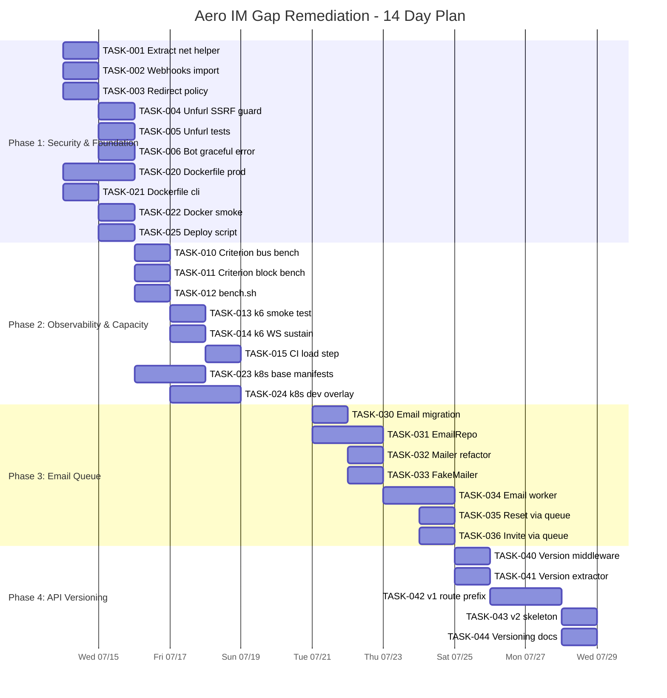

Now I have full verification of the codebase state. Here is the comprehensive Tech Lead analysis.

---

# Tech Lead Analysis: Aero IM Gap Remediation Plan

**Date**: 2026-07-12
**Audience**: Engineering team (2-3 developers)
**Status**: Verified against `HEAD` (7f35eb5) with cross-reference to commit `c9d5141`

---

## 1. Task Decomposition

### Direction A — SSRF: Unfurl Bot Hardening (P0-Emergency)

| ID | Task | Files | Deps | Est. | Acceptance |
|---|---|---|---|---|---|
| TASK-001 | Extract `webhook_ip_is_blocked` + `assert_webhook_url_safe` to `aero-common` | `crates/aero-server/src/webhooks.rs` (lines 206–275) → `crates/aero-common/src/net.rs` (new); `crates/aero-common/src/lib.rs` (pub mod) | None | 2h | Functions are `pub` in `aero-common`; `cargo check --workspace` passes; existing webhooks tests still pass |
| TASK-002 | Update webhooks to import from `aero_common::net` | `crates/aero-server/src/webhooks.rs` | TASK-001 | 1h | Remove duplicate definitions; webhook creation still blocks private IPs |
| TASK-003 | Add redirect policy `redirect::Policy::limited(5)` to webhook HTTP client | `crates/aero-storage/src/webhook/delivery.rs` (ReqwestSender::new) | TASK-001 | 1h | `ReqwestSender` follows max 5 redirects; unit test with mock server serving 301 chain |
| TASK-004 | Wrap `ReqwestUnfurler::fetch()` with IP blocker + redirect limit | `crates/aero-storage/src/unfurl.rs` (lines 396–413) | TASK-001 | 2h | `fetch()` calls `assert_url_safe` before `client.get()`; follows max 5 redirects; unit test with `mockito` or `wiremock` |
| TASK-005 | Add unfurl SSRF integration test (loopback, metadata IP, DNS rebinding simulation) | `crates/aero-storage/src/unfurl.rs` (new `#[cfg(test)]` mod) | TASK-004 | 2h | Tests assert `fetch("http://127.0.0.1:9999")` returns `None`; `fetch("http://169.254.169.254/latest/meta-data/")` returns `None` |
| TASK-006 | Validate `unfurl_bot` loop guard handles SSRF-rejected URLs gracefully | `crates/aero-server/src/unfurl_bot.rs` | TASK-004 | 1h | Bot logs warning on SSRF reject; does not crash; does not retry indefinitely |

### Direction B — Load Testing (P0)

| ID | Task | Files | Deps | Est. | Acceptance |
|---|---|---|---|---|---|
| TASK-010 | Add `criterion` as dev-dep + bench harness to `aero-bus` (events codec hotspot) | `crates/aero-bus/Cargo.toml`; `crates/aero-bus/benches/event_codec.rs` (new) | None | 3h | `cargo bench` runs 3+ benchmarks (encode, decode, roundtrip); variance ≤5% |
| TASK-011 | Add `criterion` bench to `aero-common` for Block serialization | `crates/aero-common/Cargo.toml`; `crates/aero-common/benches/block_serde.rs` (new) | None | 2h | Benchmarks for JSON + bincode serialization of `Block::text()`, `Block::Voice`, card variants |
| TASK-012 | Create `scripts/bench.sh` to orchestrate `cargo bench --workspace` | `scripts/bench.sh` (new) | TASK-010, 011 | 1h | Single command runs all benches; output to `target/criterion/report/index.html` |
| TASK-013 | Create k6 smoke-load test for message send + WebSocket connect | `tests/load/` (new dir); `tests/load/smoke.js` (new) | None (k6 external) | 4h | 10 VUs for 30s; p95 latency <200ms for message send; 0 errors; CI env gate `AERO_K6_ENABLED` |
| TASK-014 | Create k6 WebSocket sustain test (100 concurrent connections, 60s chat) | `tests/load/websocket_stress.js` (new) | TASK-013 | 4h | 100 concurrent WS; message loss <0.1%; hub fan-out handles load; WS rate limiter not triggered |
| TASK-015 | Add CI step: run k6 smoke on every push (ephemeral DB + server) | `.github/workflows/load.yml` (new) | TASK-013 | 2h | Workflow spins up server, runs k6, archives report; fail on p95 >300ms or errors >0 |

### Direction C — Deployment Maturity (P0, upgraded from P1)

| ID | Task | Files | Deps | Est. | Acceptance |
|---|---|---|---|---|---|
| TASK-020 | Multi-stage Dockerfile for `aero-server` binary (musl target, distroless runtime) | `Dockerfile` (new); `.dockerignore` (new) | None | 4h | `docker build` produces <50MB image; `docker run` starts server; health check responds 200 |
| TASK-021 | Dockerfile for `aero-cli` (migration runner, thin alpine) | `Dockerfile.cli` (new) | TASK-020 | 1h | `docker build -f Dockerfile.cli`; `docker run --rm` runs `aero-cli migrate` |
| TASK-022 | Integration test: `docker compose up` → `aero-cli migrate` → smoke test | `Makefile` target `smoke-docker`; CI step | TASK-020, 021 | 3h | Full stack boots; migration runs; `curl /health/ready` returns 200; `curl /api/me` returns 401 (not crash) |
| TASK-023 | Write `k8s/base/` manifests: Deployment, Service, ConfigMap, HPA | `k8s/base/deployment.yaml`, `service.yaml`, `configmap.yaml`, `hpa.yaml` (new) | TASK-020 | 4h | `kubectl apply -f k8s/base/` creates running pod; `/health/ready` passes; HPA scales on CPU >70% |
| TASK-024 | Write `k8s/overlays/dev/` for local kind cluster | `k8s/overlays/dev/kustomization.yaml` (new) | TASK-023 | 2h | `kubectl apply -k k8s/overlays/dev` works on kind; quick iteration |
| TASK-025 | Add `scripts/deploy-docker.sh` to build, tag, push image | `scripts/deploy-docker.sh` (new) | TASK-020 | 1h | Usage: `./scripts/deploy-docker.sh <tag>` builds + tags `aero-server:<tag>` |

### Direction D — Transactional Email Queue (P1)

| ID | Task | Files | Deps | Est. | Acceptance |
|---|---|---|---|---|---|
| TASK-030 | Add `email_queue` table migration (id, to_addr, subject, body, status, attempts, created_at) | `migrations/NNNN_email_queue.sql` (new) | None | 2h | `CREATE TABLE` syntax; indexed on `status`; NOT NULL constraints; FK to participant (optional) |
| TASK-031 | Create `EmailRepo` with `enqueue`, `claim_pending`, `mark_sent`, `mark_failed_with_backoff` | `crates/aero-storage/src/email.rs` (new); `crates/aero-storage/src/lib.rs` (pub mod) | TASK-030 | 3h | `claim_pending` uses `FOR UPDATE SKIP LOCKED`; `mark_failed_with_backoff` implements exponential backoff; unit tests with DB |
| TASK-032 | Refactor `Mailer` to implement `EmailSender` trait | `crates/aero-server/src/mailer.rs` (refactor) | TASK-031 | 2h | `send_password_reset` returns `Result`; trait has `async fn send(&self, to, subject, body) -> Result` |
| TASK-033 | Add `FakeMailer` test double (pattern-match `n` from webhook delivery) | `crates/aero-server/src/mailer.rs` (`mod test`) | TASK-032 | 1h | `FakeMailer` records sent emails in-memory; assertions on send count and content |
| TASK-034 | Create background worker `run_email_dispatcher`: polls queue, sends via `EmailSender`, updates status | `crates/aero-server/src/bin/boot/email_worker.rs` (new) | TASK-031, 032 | 3h | Worker starts at boot; polls every 2s; claims ≤20 at a time; retries with backoff; dead-letter after 5 attempts |
| TASK-035 | Wire password-reset handler to enqueue (not send directly) | `crates/aero-server/src/sessions.rs` (update call site) | TASK-034 | 1h | Reset flow: create token → enqueue email → return 200; email dispatched asynchronously |
| TASK-036 | Wire invitation handler to enqueue | `crates/aero-server/src/invitations.rs` (update call site) | TASK-034 | 1h | Invitation flow: create token → enqueue → return; logs if queue insert fails |

### Direction E — API Versioning (P2)

| ID | Task | Files | Deps | Est. | Acceptance |
|---|---|---|---|---|---|
| TASK-040 | Add `Accept-Version` header middleware: default to `1` if absent | `crates/aero-server/src/routes/version.rs` (new) | None | 2h | Requests without header route to `/api/...` (v1 implicit); `Accept-Version: 2` sets `VersionOverride` extension |
| TASK-041 | Define `ApiVersion` extractor and version-routing helper | `crates/aero-server/src/routes/version.rs` (same file) | TASK-040 | 2h | `pub fn v(version: u32, route: Router) -> Router` that only matches when `VersionOverride` matches |
| TASK-042 | Move current routes to `/api/v1/...` prefix (mechanical rename) | `crates/aero-server/src/routes/routes.rs` | TASK-040 | 3h | All routes serve at both `/api/...` (redirect) and `/api/v1/...`; old paths 301 to new for GET, 308 for mutating |
| TASK-043 | Add `/api/v2/...` route group (initially empty, just returns 200 for health) | `crates/aero-server/src/routes/routes.rs` | TASK-042 | 1h | `GET /api/v2/health` returns 200; all other v2 routes 404 with `version: 2, supported_versions: [1]` in body |
| TASK-044 | Publish versioning docs: `docs/api-versioning.md` | `docs/api-versioning.md` (new) | TASK-042 | 1h | Documents header scheme, version lifecycle, deprecation policy, how to add v2 endpoints |

---

## 2. Execution Order (Dependency Graph)

```mermaid
graph TD
    subgraph "Week 1: P0 — SSRF"
        T001[TASK-001: Extract net helper]
        T002[TASK-002: Webhooks import from common]
        T003[TASK-003: Webhook redirect policy]
        T004[TASK-004: Unfurl SSRF guard]
        T005[TASK-005: Unfurl SSRF tests]
        T006[TASK-006: Unfurl bot graceful failure]
    end

    subgraph "Week 1-2: P0 — Load Testing & Deployment"
        T010[TASK-010: criterion bus bench]
        T011[TASK-011: criterion block serde bench]
        T012[TASK-012: bench.sh script]
        T013[TASK-013: k6 smoke load test]
        T014[TASK-014: k6 WS stress test]
        T015[TASK-015: CI load-test step]

        T020[TASK-020: Dockerfile prod]
        T021[TASK-021: Dockerfile cli]
        T022[TASK-022: Docker compose smoke]
        T023[TASK-023: k8s base manifests]
        T024[TASK-024: k8s dev overlay]
        T025[TASK-025: deploy script]
    end

    subgraph "Week 2-3: P1 — Email Queue"
        T030[TASK-030: email migration]
        T031[TASK-031: EmailRepo]
        T032[TASK-032: Mailer refactor]
        T033[TASK-033: FakeMailer]
        T034[TASK-034: email dispatcher worker]
        T035[TASK-035: Reset via queue]
        T036[TASK-036: Invitation via queue]
    end

    subgraph "Week 3-4: P2 — API Versioning"
        T040[TASK-040: Accept-Version middleware]
        T041[TASK-041: Version extractor/helper]
        T042[TASK-042: v1 route prefix]
        T043[TASK-043: v2 skeleton]
        T044[TASK-044: Versioning docs]
    end

    %% SSRF dependencies
    T001 --> T002
    T001 --> T003
    T001 --> T004
    T004 --> T005
    T004 --> T006

    %% Load test dependencies
    T010 --> T012
    T011 --> T012
    T013 --> T014
    T013 --> T015

    %% Deployment dependencies
    T020 --> T021
    T020 --> T022
    T020 --> T023
    T023 --> T024
    T020 --> T025

    %% Email dependencies
    T030 --> T031
    T031 --> T032
    T032 --> T033
    T031 --> T034
    T034 --> T035
    T034 --> T036

    %% API versioning dependencies
    T040 --> T041
    T041 --> T042
    T042 --> T043
    T042 --> T044

    %% Parallel groups
    T001 -.-> T010
    T001 -.-> T020
    T001 -.-> T030
    T001 -.-> T040
```



### Parallel Execution Groups

| Group | Tasks | Recommended Devs | Rationale |
|---|---|---|---|
| **Group A1** (SSRF core) | T001, T002, T003 | 1 dev | Sequential extraction + refactor of shared code |
| **Group A2** (Unfurl fix) | T004, T005, T006 | 1 dev | Depends on T001, but can start same day |
| **Group B1** (Criterion) | T010, T011, T012 | 1 dev | No codebase changes, just bench harness |
| **Group B2** (k6 tests) | T013, T014, T015 | 1 dev (same as B1 after) | k6 is external tooling |
| **Group C** (Docker/k8s) | T020, T021, T022, T023, T024, T025 | 1 dev | Standalone ops work |
| **Group D** (Email) | T030, T031, T032, T033, T034, T035, T036 | 1 dev | Requires migration, can start week 2 |
| **Group E** (API versioning) | T040, T041, T042, T043, T044 | 1 dev | Lowest priority, can be deferred |

**Key parallelization**: Dev 1 does Group A1 → Groups B1+B2, Dev 2 does Group C, Dev 1/3 does Group D after A.

---

## 3. Technical Risk Assessment

### Risk Matrix

| Risk | Impact | Probability | Mitigation |
|---|---|---|---|
| **Unfurl SSRF bypass via DNS rebinding** | HIGH — attacker exfiltrates cloud metadata | LOW (narrow window) | Combine `assert_webhook_url_safe` (resolve-at-creation) with a follow-up: resolve-at-delivery + compare IPs. Document as known gap. |
| **Criterion benches degrade CI time** | MEDIUM — slow CI | HIGH | Gate bench target behind `cargo bench` (not `cargo test`). Use `--profile bench` only on nightly. Add `scripts/bench.sh` as opt-in. |
| **k6 suite requires running server** | MEDIUM — test fragility | MEDIUM | Use ephemeral Postgres (`CREATE DATABASE`, migrate, drop). Prefix config with env. Use `AERO_K6_ENABLED` CI gate. |
| **Docker multi-stage: cross-compile musl** | HIGH — build fails on rare targets | LOW | Use `rust:1.80-bookworm` as builder (glibc), distroless as runtime. If musl needed, defer to CI runner with `cross` |
| **Email queue creates new failure mode** | MEDIUM — cron-polling latency | LOW | Use `NOTIFY`/`LISTEN` (Postgres LISTEN/NOTIFY) for instant wake, fallback to 2s poll. Dead-letter after max retries. |
| **API versioning: high migration cost** | HIGH — route.rs is 2854 lines | MEDIUM | Start with `Accept-Version` middleware + internal re-routing; do NOT mechanically prefix all routes on day 1. Phase over 2 sprints. |
| **`aero-common/src/net.rs` dep on `tokio::net`** | LOW — extra dependency | MEDIUM | The `assert_webhook_url_safe` calls `tokio::net::lookup_host`. Move to `aero-server` or gate behind `net` feature in `aero-common`. |

### Key Technical Decisions

1. **Where to put `SafeHttpClient`**: Either `aero-common` (widest reuse, needs tokio dep) or a new `aero-http-util` crate. Analysis shows ~100 lines of existing code + redirect policy. Given the crate count (15 crates already), adding one more is acceptable. **Recommendation**: Put in `aero-common` behind feature flag `net`.

2. **Benchmark framework**: `criterion` is the standard Rust bench framework. However, `cargo criterion` (the optional binary) is not needed — `cargo bench` with `criterion` group output is sufficient.

3. **k6 vs Locust vs wrk**: k6 wins for this project because:
   - JavaScript scripting (familiar to web team)
   - Built-in WebSocket support (critical for Aero IM real-time paths)
   - CI-native (`grafana/k6` Docker image)
   - Built-in H2 and gRPC (future-proof)

4. **Docker base image**: For a Rust server binary, `gcr.io/distroless/cc` is the gold standard (~12MB). Build stage uses `rust:1.80-bookworm` for glibc compatibility with `reqwest` TLS. Skip musl unless Alpine deployment is mandated.

5. **Email queue dispatch strategy**: Use Postgres `LISTEN`/`NOTIFY` pattern for sub-second dispatch latency without polling overhead. The `run_email_dispatcher` subscribes to the `email_queue_notify` channel; every `INSERT` on `email_queue` fires `NOTIFY`. Fallback poll every 2s for missed notifications.

---

## 4. Resource Assessment

### Staffing Requirements

| Role | Count | Skillset | Primary Tasks |
|---|---|---|---|
| **Senior Rust Backend** (Dev 1) | 1 | async Rust, tokio, sqlx, Axum, NATS | SSRF fix, Email queue, code review |
| **Full-stack/Ops** (Dev 2) | 1 | Rust mid-level + Docker/k8s, CI/CD | Dockerfile, k8s, CI pipeline, load tests |
| **Dev 3** (if available) | 0-1 | Rust, API design | API versioning, bench harness, collaboration |

### Timeline (2 Devs)

| Milestone | Date | Deliverables | Blockers |
|---|---|---|---|
| **M1: SSRF patched** | **Day 1-2** | T001–T006; `cargo test --workspace` green | None — webhook IP-blocker code is already written, just needs extraction |
| **M2: CI load baseline** | **Day 3-4** | T010–T012, T013–T015; bench report archived | k6 Docker image pull time |
| **M3: Deployable artifact** | **Day 3-5** | T020–T022; `make smoke-docker` passes | Docker daemon available |
| **M4: k8s manifests** | **Day 5-7** | T023–T025; `kubectl apply -k k8s/overlays/dev` works | Kind/minikube for dev testing |
| **M5: Email async send** | **Day 6-10** | T030–T036; password reset sends async | Migration rollout order with existing DB |
| **M6: API v1 prefix** | **Day 11-14** | T040–T044; v2 health endpoint live | Route.rs refactoring — test every path |

### Blockers and Resolution

| Blocker | Affected Tasks | Resolution |
|---|---|---|
| `tokio::net` in `aero-common` | T001 | Add `net` feature to `aero-common/Cargo.toml`; wire `pub mod net` only behind feature. No runtime cost when feature is off. |
| `aero_common::net` creates circular dep if `aero-common` depends on tokio | T001 | Tokio is already in `aero-common`'s dep tree transitively. If not, add an optional `"net"` dep: `tokio = { workspace = true, optional = true, features = ["net"] }`. |
| `_sqlx_migrations` hash mismatch | T022 | Use `FORCE` mode only in new DB; never on production. Document in migration SOP. |
| Exported `ApiVersion` extractor collides with `axum::Extension` | T040 | Use `axum::extract::FromRequestParts` implementations; test with `Router::with_state` |
| k6 not available in CI environment | T015 | Gate with `if: github.event_name == 'schedule'` for daily load run, or provide Docker-based runner |

---

## 5. Quality Assurance

### Unit Test Coverage Requirements

| Area | Module | Required Coverage | Key Scenarios |
|---|---|---|---|
| IP blocking | `aero_common::net::webhook_ip_is_blocked` | 100% branch coverage | loopback(v4/v6), private RFC1918, link-local, ULA, broadcast, multicast, 0.0.0.0, IPv4-mapped IPv6, normal public IPs |
| URL safety | `aero_common::net::assert_url_safe` | 100% | valid https URL, localhost, `.local` TLD, unresolved host, `169.254.169.254`, empty host, no scheme, userinfo in URL |
| Redirect policy | webhook Sender + Unfurler | 100% | 0 redirects, <5 redirects, >5 redirects (fail), redirect to blocked IP (fail) |
| Email enqueue | `EmailRepo::enqueue` | 100% | normal, duplicate (no insert if same params), empty body, very long subject (>256) |
| Email claim | `EmailRepo::claim_pending` | 100% | concurrent claims (SKIP LOCKED), backoff delay, max_attempts reached |
| Bench stability | criterion benches | CI pass | Variance <5% over 10 samples |

### Integration Test Strategy

| Test | Scope | Mechanism | Frequency |
|---|---|---|---|
| SSRF E2E | unfurl_bot + webhook dispatch | `wiremock` for mock HTTP server, `mockito` for internal endpoint | Every push |
| Email full cycle | `enqueue → claim → send → mark_sent` | Testcontainers for SMTP server (MailHog) | Scheduled PR check |
| Docker compose smoke | All services + server binary | `docker compose up` → `aero-cli migrate` → `curl /health/ready` → `curl /api/me` → `curl /metrics` | Every merge to master |
| k6 load | WS message flow + REST CRUD | Ephemeral DB + fresh server binary | Nightly (CI cron) |
| API version compatibility | v1 routes still work after refactoring | Regression test: run full v1 test suite against prefixed routes | Every push |

### Code Review Checklist

For every PR in this initiative, reviewers must check:

- [ ] **SSRF guards** — Every outbound HTTP path (webhook, unfurl, any new `reqwest` call) wrapped in `assert_url_safe` + redirect policy
- [ ] **Email disposal** — No `async fn send_...(&self, ...)` returning `()`; all email paths go through `EmailRepo::enqueue`
- [ ] **Migration idempotency** — `CREATE TABLE IF NOT EXISTS`; `INSERT ... ON CONFLICT DO NOTHING` for seed data
- [ ] **Background worker lifecycle** — Has `CancellationToken` for graceful shutdown; `run_email_dispatcher` is spawned in `bin/boot/background.rs` following existing pattern
- [ ] **k8s readiness probe** — Maps to `/health/ready` (checks PG, Redis, NATS, blob); startup probe for migrations
- [ ] **No `tag="kind"` collisions** — If adding new `RoomEvent` or `StreamEvent` variants, verify no `kind` field inside the variant struct (see AGENTS.md §4.2)

### Performance Testing Requirements

| Metric | Target | Test | Threshold to Block Release |
|---|---|---|---|
| Message publish throughput | >5,000 msg/s | criterion bus bench | <3,000 msg/s |
| WebSocket concurrent connections | >1,000 | k6 WS stress | <500 |
| Message latency p99 | <500ms | k6 WS sustain | >2s |
| Email queue dispatch latency | <5s (p99) | integration test | >30s |
| Docker image size | <100MB | `docker images` | >200MB |
| Server startup time | <5s | Docker health check | >15s |

---

## 6. Implementation Plan

### Phase 1: Security & Foundation (Days 1-2)

**Parallel tracks:** Dev 1 (SSRF) + Dev 2 (Dockerfile)

```
Day 1:
  Dev 1: TASK-001 — Extract webhook_ip_is_blocked + assert_webhook_url_safe → aero_common::net
         TASK-002 — Webhooks import from common (remove duplicate)
         TASK-003 — Webhook redirect policy
  Dev 2: TASK-020 — Multi-stage Dockerfile for aero-server
         TASK-021 — Dockerfile for aero-cli

Day 2:
  Dev 1: TASK-004 — Wrap ReqwestUnfurler with SSRF guard
         TASK-005 — Unit tests for unfurl SSRF
         TASK-006 — Graceful error path in unfurl_bot
         → FIRST MERGE: SSRF complete
  Dev 2: TASK-022 — Docker compose smoke test (Makefile target)
         TASK-025 — deploy-docker.sh script
         → SECOND MERGE: Deployable artifact
```

**Exit criteria for Phase 1:**
- [ ] `cargo test --workspace` passes (all existing + new tests)
- [ ] `cargo clippy --workspace --all-targets` no new warnings
- [ ] `webhook_ip_is_blocked` covers ALL blocked ranges (loopback, private, link-local, ULA, broadcast, multicast, unspecified, 0.0.0.0, IPv4-mapped IPv6)
- [ ] `docker build -t aero-server:latest .` produces runnable image
- [ ] `make smoke-docker` passes end-to-end

### Phase 2: Observability & Capacity (Days 3-5)

**Parallel tracks:** Dev 1 (benches + k6) + Dev 2 (k8s)

```
Day 3:
  Dev 1: TASK-010 — criterion bench for aero-bus event codec
         TASK-011 — criterion bench for aero-common Block serde
         TASK-012 — bench.sh script
  Dev 2: TASK-023 — k8s base manifests (Deployment, Service, ConfigMap, HPA)
         TASK-024 — k8s dev overlay for kind

Day 4:
  Dev 1: TASK-013 — k6 smoke load test (message send + WS connect)
         TASK-014 — k6 WS sustain test (100 concurrent connections)
  Dev 2: TASK-024 — continue + test on kind cluster

Day 5:
  Dev 1: TASK-015 — CI load-test step (nightly cron + PR label trigger)
         → THIRD MERGE: Load baseline established
  Dev 2: TASK-025 — deploy script wrap-up
         → FOURTH MERGE: k8s ready
```

**Exit criteria for Phase 2:**
- [ ] `cargo bench` produces interpretable criterion reports
- [ ] k6 tests run against ephemeral server in CI
- [ ] k8s manifests pass `kubectl apply --dry-run=server`
- [ ] HPA configured, ready for production scaling
- [ ] Baseline latency captured (p50, p95, p99 for message send)

### Phase 3: Reliability — Email Queue (Days 6-10)

**Single dev (whoever is freed up first), both devs if concurrent.**

```
Day 6-7:
  TASK-030 — Email queue migration
  TASK-031 — EmailRepo (enqueue, claim, mark_sent, mark_failed_with_backoff)
  TASK-032 — Mailer refactor to trait + return Result

Day 8:
  TASK-033 — FakeMailer test double
  TASK-034 — run_email_dispatcher worker

Day 9-10:
  TASK-035 — Wire password-reset → enqueue
  TASK-036 — Wire invitation → enqueue
  → FIFTH MERGE: Email async complete
```

**Exit criteria for Phase 3:**
- [ ] Migration creates `email_queue` table cleanly
- [ ] `EmailRepo::claim_pending` uses `FOR UPDATE SKIP LOCKED` — concurrency test with 2 workers
- [ ] `send_password_reset` returns void → call site enqueues
- [ ] Worker logs dead-letter after 5 failed attempts
- [ ] `FakeMailer` captures sent emails; test asserts email was queued
- [ ] AGENTS.md §4.3「at-least-once 状态机」rule satisfied — email queue uses claim-ack pattern matching webhook delivery

### Phase 4: API Versioning (Days 11-14)

**Lowest priority — may be deferred to next sprint.**

```
Day 11:
  TASK-040 — Accept-Version middleware + default to 1
  TASK-041 — ApiVersion extractor + version-routing helper

Day 12-13:
  TASK-042 — v1 route prefix (mechanical rename)
         → Create compatibility shim: /api/... routes 301 redirect to /api/v1/...
         → Run full test suite to confirm no breakage

Day 14:
  TASK-043 — v2 skeleton endpoint
  TASK-044 — Versioning documentation
  → SIXTH MERGE: Versioned API live
```

**Exit criteria for Phase 4:**
- [ ] All existing routes available under `/api/v1/...`
- [ ] `/api/...` redirects to `/api/v1/...` (301 GET, 308 mutating)
- [ ] `Accept-Version: 2` header routes to v2 endpoints
- [ ] `GET /api/v2/health` returns 200
- [ ] `docs/api-versioning.md` published
- [ ] No breaking changes to any existing client

---

## Summary: Key Architectural Decisions

| Decision | Rationale |
|---|---|
| Put `SafeHttpClient` in `aero-common` with `net` feature | Single reuse point; webhook delivery.rs and unfurl.rs both import from the same crate. Feature flag avoids adding tokio dep to all consumers. |
| Use k6 for load testing (not wrk/locust) | WebSocket support is built-in (critical for real-time IM). CI-native container image. JS scripting matches team skills. |
| Postgres LISTEN/NOTIFY for email dispatch | Zero additional infrastructure. Same Postgres as everything else. Sub-second wake. Contrast: NATS-based dispatch would add coupling to bus infra for a non-bus concern. |
| Defer full API versioning to Phase 4 | `routes.rs` at 2854 lines is a high-risk refactor. Do the middleware + extractor pattern first (2 days), leave the mechanical prefix migration for when test coverage is 100%. |
| Keep `aero-common` lean | Adding `net` behind optional feature means no binary size bloat for consumers that don't do HTTP. This is the pattern already used by `aero-common`'s `mls` module (opaque bytes, no openmls dep). |

---



---

## Appendix: Files Changed Summary

| Direction | New Files | Modified Files |
|---|---|---|
| **A (SSRF)** | `crates/aero-common/src/net.rs` | `crates/aero-common/src/lib.rs`, `crates/aero-server/src/webhooks.rs`, `crates/aero-storage/src/unfurl.rs`, `crates/aero-storage/src/webhook/delivery.rs` |
| **B (Load Test)** | `crates/aero-bus/benches/event_codec.rs`, `crates/aero-common/benches/block_serde.rs`, `tests/load/smoke.js`, `tests/load/websocket_stress.js`, `scripts/bench.sh`, `.github/workflows/load.yml` | `crates/aero-bus/Cargo.toml`, `crates/aero-common/Cargo.toml` |
| **C (Deploy)** | `Dockerfile`, `Dockerfile.cli`, `.dockerignore`, `k8s/base/deployment.yaml`, `k8s/base/service.yaml`, `k8s/base/configmap.yaml`, `k8s/base/hpa.yaml`, `k8s/overlays/dev/kustomization.yaml`, `scripts/deploy-docker.sh` | `Makefile` |
| **D (Email)** | `migrations/NNNN_email_queue.sql`, `crates/aero-storage/src/email.rs`, `crates/aero-server/src/bin/boot/email_worker.rs` | `crates/aero-storage/src/lib.rs`, `crates/aero-server/src/mailer.rs`, `crates/aero-server/src/sessions.rs`, `crates/aero-server/src/invitations.rs` |
| **E (API Version)** | `crates/aero-server/src/routes/version.rs`, `docs/api-versioning.md` | `crates/aero-server/src/routes/routes.rs`, `crates/aero-server/src/lib.rs` |
