现在我已经掌握了基线。让我整合完整的 Tech Lead 分析。

---

# Tech Lead 分析：四个已验证的技术方向

## 执行摘要

以下分析涉及**四个方向**，经过代码验证，涵盖了 SPA 渲染性能、数据库运维、统一搜索和创作者经济诚信。在开始详细规划之前，有两项事实修正值得注意：

| 分析中的主张 | 源码事实 | 影响 |
|---|---|---|
| `statement_timeout` 不存在 | 已在 `db.rs:31` 实现 — `SET statement_timeout = '10000'` via `after_connect` 回调 | ✅ 方向二的范围缩小；重点转移至 autovacuum + 监控 |
| Docker Compose 缺少 PG 持久化 | `docker-compose.yml:15-16` — `./data/pg:/var/lib/postgresql/data` 已映射 | ✅ 非问题；可关闭 |

---

## 1. 任务分解

### 1.1 方向一：SPA 渲染性能

当前基线（经验证）：
- `switchRoom` (app.js:533) + `rerenderCurrentRoom` (app.js:617) — 每次房间切换/重渲染 $O(N)$ full replaceChildren
- `messagesByRoom` (context.js:24) — 无界 `Map`，无 LRU 驱逐
- `replaceNodeForMsg` (app.js:800-801) — `querySelector` 线性扫描
- `wireMsgActions` (app.js:664) — 每条消息附加 ~5–8 个独立事件监听器，导致 $O(5N)$ 累计闭包
- 无 `scrollAnchor` 保持

| 任务 ID | 标题 | 文件 | 前置依赖 | 工时 | 验收标准 |
|---|---|---|---|---|---|
| SPA-001 | 为 `messagesByRoom` 添加 LRU 上限 | `web/context.js` | 无 | 1h | Map 在 ≥2000 条目时驱逐最早的房间；驱逐后 `get()` 返回 `undefined` 且触发 `loadHistory` 重载 |
| SPA-002 | 实现 `msgNodeCache`（DOM 节点缓存） | `web/app.js` | SPA-001 | 2h | `renderMsgWithReactions` 将生成的节点存入 `Map<msgId, Node>`；`rerenderCurrentRoom` 先查缓存，减少 `createElement` 调用 |
| SPA-003 | 分帧渲染（requestAnimationFrame chunking） | `web/app.js` | SPA-002 | 2h | 新增 `renderRoomChunked(roomId, start, chunkSize)`；每帧 append ≤20 条；消除 5000 条场景下的 ~200ms 主线程阻塞 |
| SPA-004 | 事件委托替换 per-msg 监听器 | `web/app.js` | 无 | 3h | 移除 `wireMsgActions` 中的 `addEventListener` 调用；在 `els.msgList` 上挂载一个 `click` handler，通过 `data-msg-id`+`data-action` 分发；删除 ~300 行注册代码 |
| SPA-005 | 在 `switchRoom` 中保持滚动锚点 | `web/app.js` | SPA-003 | 1.5h | `switchRoom` 保存 `els.msgScroll.scrollTop`；切换回来后恢复；非中断滚动体验 |
| SPA-006 | 用 Map 查找替换 `replaceNodeForMsg` 中的 `querySelector` | `web/app.js` | SPA-002 | 1h | `nodeCache.get(msgId)` 替代 `els.msgList.querySelector('[data-msg-id="…"]')` |

**小计：10.5 小时**

### 1.2 方向二：数据库运维

当前基线（修正后）：
- ✅ `statement_timeout` = 10s 已通过 `after_connect` 回调实现
- ❌ 无 autovacuum 调优迁移
- ❌ 无 `pg_stat_statements` 暴露为 Prometheus gauge
- ❌ 无 pgvector HNSW `REINDEX` runbook 或监控
- ❌ `pg_stat_user_indexes` 未上报到 metrics

| 任务 ID | 标题 | 文件 | 前置依赖 | 工时 | 验收标准 |
|---|---|---|---|---|---|
| DB-001 | 新增 autovacuum 调优迁移 | `migrations/0158_autovacuum_tuning.sql` | 无 | 1h | 迁移为 `messages`、`participants`、`ai_jobs`、`prediction_stakes` 设置 `autovacuum_vacuum_scale_factor=0.01`、`autovacuum_analyze_scale_factor=0.05`、`autovacuum_vacuum_threshold=1000`；`cargo build` + migrate 后生效 |
| DB-002 | 新增 PG 统计信息采集器（observability gauge） | `crates/aero-server/src/bin/boot/observability.rs` | 无 | 3h | 每 60s 运行 `SELECT * FROM pg_stat_user_indexes WHERE idx_scan > 0` + `SELECT * FROM pg_stat_statements ORDER BY total_time DESC LIMIT 10`；以标签形式暴露到 Prometheus；`pg_stat_statements` 如在 `shared_preload_libraries` 中缺失，graceful skip |
| DB-003 | 新增 pgvector HNSW REINDEX 定时器 | `crates/aero-server/src/bin/boot/retention.rs` | DB-002 | 2h | 每 24h 执行 `REINDEX INDEX CONCURRENTLY idx_messages_embedding`（如索引存在）；通过观测仪表板上报健康状态；仅生产环境启用（env gate `AERO_REINDEX_HNSW`） |

**小计：6 小时**

### 1.3 方向三：统一搜索

当前基线（经验证）：
- ✅ `POST /api/rooms/:id/search` — 房间范围消息搜索
- ✅ `crate::search::routes()` — 跨房间消息搜索（工作区范围）
- ❌ 无全局 `/api/search` 端点聚合多实体
- ❌ 文件、画布、投票、书签、VOD 无搜索索引
- ❌ 无 Cmd+K 命令面板
- ❌ 无 `lastVisitedRooms` 搜索历史

| 任务 ID | 标题 | 文件 | 前置依赖 | 工时 | 验收标准 |
|---|---|---|---|---|---|
| SRCH-001 | 新增实体搜索索引迁移（投票 & 书签） | `migrations/0159_search_indices_polls_bookmarks.sql` | 无 | 2h | `polls.question` 和 `bookmarks.title` 新增 `tsvector` 列 + GIN 索引；投票搜索由 `searchable_text` 和 workspaces 成员资格限定范围 |
| SRCH-002 | 新增实体搜索索引（VOD & 录制文件） | `migrations/0160_search_indices_vod.sql` | SRCH-001 | 2h | `vod_chapters.title` 和 `vod_metadata.description` 新增 `tsvector` + GIN 索引；仅已发布状态 |
| SRCH-003 | 实现 `POST /api/search` 全局端点 | `crates/aero-server/src/search.rs` | SRCH-001 | 4h | 新 handler `global_search`：接收 `?q=` 和 `?types=messages,polls,bookmarks,vod`；使用 `tokio::join!` 并发查询；按实体类型返回分页结果；遵守成员资格边界 |
| SRCH-004 | 在 `context.js` 中维护最近访问房间 | `web/context.js` | 无 | 1.5h | 新增 `state.lastVisitedRooms: Map<roomId, timestamp>`；`switchRoom` 时，以 `touch` 操作更新（MRU 在前）；保留上限为 20 条；持久化到 `localStorage` |
| SRCH-005 | 实现 Cmd+K 命令面板 UI | `web/cmdk.js` + `web/index.html` | SRCH-004 | 5h | `Ctrl+K` / `Cmd+K` 打开模态框；按 (1) 最近访问、(2) 文字前缀匹配、排序房间/人员/消息；键盘导航（上下 + Enter）；Esc 关闭；Escape 期间焦点锁定 |

**小计：14.5 小时**

### 1.4 方向四：创作者经济诚信

当前基线（经验证）：
- ✅ `predictions` CRUD + stake + lock/resolve
- ✅ `locked_at` 时间戳
- ❌ 无 stakes 分布端点
- ❌ 无 hype train 速率限制
- ❌ 无 raids `viewer_count` 验证
- ❌ 无 points 异常检测
- ❌ 无 `prediction_stakes_audit` 审计表

| 任务 ID | 标题 | 文件 | 前置依赖 | 工时 | 验收标准 |
|---|---|---|---|---|---|
| ECON-001 | **P0** 新增 `prediction_stakes_audit` 表 + INSERT | `migrations/0161_prediction_stakes_audit.sql` + `crates/aero-storage/src/predictions.rs` | 无 | 2h | 新建 `prediction_stakes_audit` 表（`id, stake_id, prediction_id, participant_id, outcome_idx, points, ip_address, user_agent, created_at`）；在 `stake` 方法中的事务内 INSERT；*不*暴露到任何 REST 端点 |
| ECON-002 | 新增 `GET /api/predictions/:id/stakes` 端点 | `crates/aero-server/src/predictions.rs` | 无 | 2h | 返回每个 outcome 的聚合投注分布（outcome_idx，总 points，投注人数）；在 prediction 已锁定或已解决时暴露；不在开放状态下暴露个人身份信息 |
| ECON-003 | Hype train 贡献速率限制 | `crates/aero-storage/src/hype_train.rs` | 无 | 3h | 在 `apply_contribution` 中新增每用户每列车间隔门控（≤1 次贡献/200ms）；在 Redis 中使用滑动窗口计数器（`HYPE_TRAIN_COOLDOWN:{session}:{viewer}`，TTL=60s）；超出限制时跳过贡献（非错误） |
| ECON-004 | Raids viewer_count 真实性校验 | `crates/aero-storage/src/raid.rs` | 无 | 2h | `create_raid` 时：查询源流当前 `viewer_count`（来自 `StreamViewerStore`）；若 `raid.viewer_count > source_actual_viewers * 1.5`，则限制 `raid.viewer_count = source_actual_viewers * 1.2` 并记录告警；记录 `actual_viewers` 到 raid 行 |
| ECON-005 | Points 异常检测（日志 + 阈值） | `crates/aero-server/src/bin/boot/background.rs` | ECON-001 | 4h | 每 5 分钟对 `prediction_stakes_audit` 运行扫描：检测同一 IP 在 ≤1 个预测中的多个 participant_id；检测同一 participant 在所有 outcome 上投注 points 的 >90% 定向模式；在 `WARN` 级别记录可疑事件；*不*自动封禁（仅检测） |

**小计：13 小时**

### 1.5 补充：方向一 & 二中的高收益低成本步骤

| 任务 ID | 标题 | 文件 | 前置依赖 | 工时 | 验收标准 |
|---|---|---|---|---|---|
| DB-004 | 新增 `pg_stat_statements` 扩展迁移 | `migrations/0162_pg_stat_statements.sql` | 无 | 0.5h | `CREATE EXTENSION IF NOT EXISTS pg_stat_statements`（幂等）；配合 DB-002 |
| SPA-007 | 首帧闪白修复（append 优先级） | `web/app.js` | SPA-003 | 1h | `switchRoom` 中：首个 `requestAnimationFrame` chunk 使用 `display: block` 渲染页首 20 条消息，*然后*显示容器；消除白屏闪烁 |

**小计：1.5 小时**

---

## 2. 执行顺序

### 依赖图

```mermaid
graph TB
    subgraph "Phase A — Quick Wins (Week 1)"
        SPA001[SPA-001: LRU for messagesByRoom]
        SPA004[SPA-004: Event delegation]
        DB001[DB-001: Autovacuum tuning]
        DB004[DB-004: pg_stat_statements ext]
        ECON001[ECON-001: Prediction stakes audit P0]
        SRCH004[SRCH-004: Recent visits tracking]
    end

    subgraph "Phase B — Core Infrastructure (Week 2-3)"
        SPA001 --> SPA002[SPA-002: msgNodeCache]
        SPA002 --> SPA003[SPA-003: Chunked RAF rendering]
        SPA004 --> SPA005[SPA-005: Scroll anchor]
        SPA003 --> SPA006[SPA-006: Map-based node lookup]
        SPA003 --> SPA007[SPA-007: Paint fix]

        DB001 --> DB002[DB-002: PG stats gauges]
        DB004 --> DB002
        DB002 --> DB003[DB-003: HNSW REINDEX timer]

        SRCH004 --> SRCH005[SRCH-005: Cmd+K palette]
    end

    subgraph "Phase C — Extended Capabilities (Week 3-4)"
        SRCH001[SRCH-001: Poll/bookmark FTS indices]
        SRCH001 --> SRCH002[SRCH-002: VOD FTS indices]
        SRCH001 --> SRCH003[SRCH-003: Global /api/search]
        SRCH002 --> SRCH003

        ECON002[ECON-002: Stakes distribution endpoint]
        ECON003[ECON-003: Hype train rate limit]
        ECON004[ECON-004: Raids viewer validation]
        ECON001 --> ECON005[ECON-005: Points anomaly detection]
    end

    subgraph "Phase D — Hardening & Polish (Week 4-5)"
        SRCH005 --> SRCH006[SRCH-006: Cmd+K keyboard nav polish]
        ECON005 --> ECON006[ECON-006: Anomaly alert integration]
        DB003 --> DB005[DB-005: Proactive vacuum schedule]
    end
```



### 并行化策略

```
Week 1 (并行组):
  ┌──────────────┐  ┌──────────────┐  ┌──────────────┐
  │  Frontend    │  │  Backend     │  │  Data        │
  │  SPA-001     │  │  DB-001      │  │  ECON-001    │
  │  SPA-004     │  │  DB-004      │  │              │
  │  SRCH-004    │  │              │  │              │
  └──────────────┘  └──────────────┘  └──────────────┘

Week 2 (前沿合并):
  SPA-002, SPA-003, SPA-005 ← 需要 SPA-001
  DB-002 ← 需要 DB-001 + DB-004
  ECON-002, ECON-003, ECON-004 ← 可并行

Week 3 (搜索 + 经济):
  SRCH-001, SRCH-002, SRCH-003 ← 有序依赖
  ECON-005 ← 需要 ECON-001

Week 4 (收尾):
  SPA-006, SPA-007 ← 前期依赖收口
  DB-003 ← 需要 DB-002
  SRCH-005 ← 需要 SRCH-004
```

---

## 3. 技术风险

### 3.1 高风险项

| 风险 | 方向 | 概率 | 影响 | 缓解策略 |
|---|---|---|---|---|
| **Cmd+K 键盘导航复杂度过高** — 处理 `aria-*`、焦点陷阱、IME 组合输入、`Ctrl+K` vs 浏览器快捷键冲突 | 三 | 中 | 高 | 阶段 B 仅实现基础版（文本输入+上下+回车）；a11y 和 IME 放到阶段 D；5h 估算已包含缓冲区 |
| **事件委托破坏现有交互** — `wireMsgActions` 内有针对特定元素的 `dblclick`、`contextmenu`、`mouseenter` 绑定；`stopPropagation` 可能丢失 | 一 | 中 | 高 | 实现委托时保留一个集成测试开关：渲染 10 条消息，对每种 action 类型编程触发 `click`，验证分派目标。逐个迁移交互，每条消息保留临时 fallback |
| **分帧渲染导致视觉闪烁** — `requestAnimationFrame` chunk 在 `switchRoom` 期间可能导致部分帧渲染 | 一 | 低-中 | 中 | `SPA-007`（闪白修复）直接解决此问题：chunk 0 设置 `els.msgList.style.opacity = '1'`，此前保持 `opacity: 0` |
| **HNSW REINDEX 锁升级** — `REINDEX INDEX CONCURRENTLY` 在 pg17 中虽不锁写，但需要额外 CPU+IO，可能导致短期查询退化 | 二 | 低 | 中 | DB-003 使用 `CONCURRENTLY`（已验证支持）；安排在不活跃时段；通过 gauge 监控索引大小 |
| **全局 `/api/search` 跨实体分页** — 消息、投票、VOD 各自分页，合并后游标语义复杂 | 三 | 中 | 高 | 初期使用 `offset+limit` 按实体类型分组返回（类似 Elasticsearch `multi_search` 响应）；游标分页放入路线图 |
| **检测误报（Points 异常检测）** — 合法的高频投注被标记为可疑 | 四 | 中 | 低 | ECON-005 *仅记录日志*；前 2 周手动审查模式，调整阈值后再自动告警；保留 `points_audit` 数据以进行追溯调整 |

### 3.2 外部依赖

| 依赖 | 用途 | 当前状态 | 风险 |
|---|---|---|---|
| `pg_stat_statements` | DB-002 监控 | 需要在 `postgresql.conf` 或 `ALTER SYSTEM` 中启用 `shared_preload_libraries` | 低；迁移中 `CREATE EXTENSION IF NOT EXISTS`；若未加载扩展则跳过 gauge（优雅降级） |
| `pgvector` HNSW | DB-003 HNSW 索引 | 已在 `messages.embedding` 上存在 | 低；pg17+pgvector 0.7+ 支持 CONCURRENTLY |
| `localStorage` | SRCH-004 最近访问 | 浏览器 API | 低；添加 `try/catch` 以处理 private browsing 中的 `SecurityError` |
| `ClipboardEvent` / `KeyboardEvent` | SRCH-005 Cmd+K | 标准 DOM API | 中；Mac 上的 `metaKey` 与 Windows 上的 `ctrlKey`；用户自定义快捷键冲突 |

### 3.3 性能评估

| 方向 | 优化前（5000 条场景） | 优化后（预期） | 测量方法 |
|---|---|---|---|
| 方向一：`switchRoom` 阻塞 | ~200ms 主线程（`replaceChildren` + N × createElement + N × addEventListener） | ~15ms（LRU+缓存）+ ~5ms/frame × 20 帧（分块） | `performance.mark()` + `performance.measure()` 包裹 `switchRoom`；新增 `window.__aero_perf` 调试标志 |
| 方向三：全局搜索 | N/A（不存在） | ≤50ms（`tokio::join!` × 4 个并发查询） | 在 handler 中添加 `instrument` span + `DATABASE_QUERY_DURATION` 直方图 |
| 方向四：stake hook | 当前无审计 | +2ms（审计 INSERT 在同一事务中） | 在 `stake` 方法中添加 `trace` 级别计时 |

---

## 4. 资源评估

### 4.1 团队组成

| 角色 | 数量 | 覆盖方向 | 关键技能 |
|---|---|---|---|
| **前端工程师**（高级） | 1 | 方向一 + Cmd+K（方向三） | DOM 性能分析、事件委托模式、requestAnimationFrame 调度、无障碍（a11y） |
| **后端工程师**（高级） | 1 | 方向二 + 方向三（搜索 API）+ 方向四 | Rust/axum、sqlx、Postgres 性能调优、pgvector、NATS |
| **全栈/数据工程师**（中级） | 1 | 方向四（审计与异常检测）+ 迁移 | SQL 迁移设计、Rust 后端、Redis 速率限制模式 |
| **QA/可靠性工程师** | 兼职 | 全部四个方向 | k6/Playwright 负载测试、Postgres 查询分析、DOM 性能分析 |

**总计：2–3 FTE，工期 4–5 周**

### 4.2 里程碑

| 里程碑 | 时间 | 交付物 | 通过标准 |
|---|---|---|---|
| **M1：底线加固** | 第 1 周末 | SPA-001, SPA-004, DB-001, DB-004, ECON-001, SRCH-004 部署到 staging | 通过 smoke 测试；无回归；LRU + 事件委托可在 5000 条聊天记录的 `context.js` 中使用 |
| **M2：渲染管道** | 第 2 周末 | 分帧渲染 + 滚动锚点 + 节点缓存 + PG 仪表板 | 5000 条消息的 `switchRoom` ≤ 50ms（从 ~200ms 优化）；`pg_stat_statements` 进入 `/metrics` |
| **M3：搜索发布** | 第 3 周末 | 全局 `/api/search` 端点 + Cmd+K alpha + 速率限制方案 | `/api/search` 返回投票和书签结果；Cmd+K 打开/关闭并正确导航；hype train 速率限制通过 k6 测试；raids viewer_count 被截断 |
| **M4：诚信+收尾** | 第 4 周末 | Points 异常检测 + HNSW REINDEX + 审计表 | 异常检测在 staging 上运行 48 小时，零误报；REINDEX 定时器日志已完成；所有迁移通过 `make migrate-smoke` |
| **M5：生产发布** | 第 5 周末 | 所有变更在生产环境上运行 + 监控 | 生产 LT 无渲染问题；搜索延迟 < 100ms P99；staging 上零可疑事件误报 |

### 4.3 阻塞点

| 阻塞点 | 方向 | 是否阻塞 | 解决策略 |
|---|---|---|---|
| **无 staging 环境** | 全部 | 中等 | 使用 `docker-compose up` + 合成数据（`scripts/seed-staging.sh`）生成 5000+ 条消息、100+ 个用户、5+ 个投票 |
| **pg_stat_statements 未在 PG 中加载** | 二 | 低（gauge 优雅跳过） | DB-004 创建扩展；运行手册以重启 PG 并通过 `ALTER SYSTEM SET shared_preload_libraries = 'pg_stat_statements'` + `pg_ctl restart` 加载 |
| **浏览器兼容性（Cmd+K）** | 三 | 低（渐进增强） | 将 `display: none` 回退应用到 `<kbd>` 提示；在非标准键盘环境中不显示 |
| **生产者 hype train 状态未测试** | 四 | 低 | `hype_train.rs` 已有 `#[cfg(test)]` 模块；为速率限制 gate 新增测试 |

---

## 5. 质量保证

### 5.1 单元测试覆盖

| 方向 | 模块 | 最低覆盖率 | 关键测试场景 |
|---|---|---|---|
| 方向一 | `web/app.js`（JS） | 无自动单元测试（仅 E2E） | 依赖 Playwright smoke 测试 + 手动 `performance.mark` 仪测 |
| 方向二 | `crates/aero-storage/src/db.rs` | 无（基础设施） | 集成测试使用真实 PG：迁移可重复、statement_timeout 已设；`#[ignore]` + `DATABASE_URL` 门控 |
| 方向三 | `crates/aero-server/src/search.rs` | 80%+ handler 逻辑 | `global_search` handler 带模拟 `XRepo`：验证 4 个 `tokio::join!` 分支各按限界返回；成员资格筛选生效 |
| 方向三 | `web/cmdk.js` | 无自动测试 | 依赖 Playwright：验证 `Ctrl+K` 打开、输入过滤、`Escape` 关闭、`Enter` 导航 |
| 方向四 | `crates/aero-storage/src/predictions.rs` | 现有测试保持 + 新增 | `stake` 审计 INSERT 行计数正确；hype train 速率限制在 ≤200ms 时跳过；`create_raid` 截断 viewer_count |
| 方向四 | `crates/aero-server/src/bin/boot/background.rs` | 新增异常检测扫描 | 使用模拟 `prediction_stakes_audit` 行验证：相同 IP 不同 user → WARN 日志；高方向性投注 → WARN 日志 |

### 5.2 集成测试策略

| 层 | 工具 | 覆盖范围 | 执行 |
|---|---|---|---|
| **Rust 单元 + 集成** | `cargo test --workspace --lib -- --ignored` | 方向二/三/四 的后端仓储 | 需要 `DATABASE_URL` + 已迁移的数据库；在 CI 中作为独立 job 运行 |
| **API 冒烟** | `scripts/smoke.sh` | 方向三：`POST /api/search` 返回 200 + 方向四：`POST /api/predictions/:id/stakes` 返回 200 | 针对 staging 运行；包含在 `make smoke` 中 |
| **负载测试** | `k6`（`scripts/k6/`） | 方向一：5000 条消息房间切换延迟 + 方向三：同时 50 次 `/api/search` 请求 | 使用 `k6 run --vus 50 --duration 30s`；瀑布图 |
| **Playwright E2E** | `npx playwright` | 方向一：`switchRoom` DOM 计数 + 方向三：Cmd+K 流程图 | 在新配置的 `e2e/` 目录中（需要 `npx playwright install chromium`） |
| **性能仪测** | `performance.mark` + `console.table` | 方向一：`switchRoom` 每次帧渲染的时间 | 通过 `window.__aero_debug = true` 切换；不在生产环境使用 |

### 5.3 代码审查检查清单

**通用（全部方向）**：
- [ ] `cargo check --workspace` 无新增警告
- [ ] `cargo clippy --workspace --all-targets` 无新增警告
- [ ] `scripts/truth-check.sh` 零违规
- [ ] `scripts/file-size-check.sh` 无文件超限（Rust 800 WARN / 1200 HARD）

**方向一（前端）**：
- [ ] SPA-001：`messagesByRoom` 上的 LRU 驱逐不会丢失尚未同步的消息（对 `loadHistory` 返回 `undefined` 做空值检查）
- [ ] SPA-002：`msgNodeCache` 在路由变更时正确失效（`window.addEventListener('popstate', …)`）
- [ ] SPA-004：没有 `addEventListener` 泄漏到 `msgList` 之外；`event.target.closest` 正确处理嵌套元素
- [ ] SPA-005：滚动恢复发生在 `DOMContentLoaded` 之后，而非 `load` 之前

**方向二（数据库）**：
- [ ] 迁移是幂等的（`IF NOT EXISTS`）
- [ ] `statement_timeout` 不在 `repo` 方法中设置（已在连接级别处理）
- [ ] `pg_stat_statements` gauge 在扩展缺失时优雅跳过（`if err { metrics.noop }`）

**方向三（搜索）**：
- [ ] `POST /api/search` 验证成员资格（`assert_room_access` 或 `WHERE room_id IN (SELECT … FROM workspace_members)`）
- [ ] 搜索分页没有 $O(N)$ 偏移量滑坡（使用 `WHERE id > $1` 游标或 `LIMIT + OFFSET` ≤ 200）
- [ ] Cmd+K 不会与浏览器的 `Ctrl+K` 书签快捷键冲突（`event.preventDefault()`）

**方向四（经济诚信）**：
- [ ] ECON-001：审计 INSERT 在 stake 事务中——不留竞态窗口
- [ ] ECON-003：速率限制使用 Redis，而非进程内存；在重启后存活
- [ ] ECON-004：`viewer_count` 截断是 floor 操作，不是 ceiling（不会虚增计数）
- [ ] ECON-005：仅日志——不产生副作用

### 5.4 性能测试需求

| 场景 | 工具 | 阈值 | 运行时机 |
|---|---|---|---|
| 5000 条消息的房间切换 | Playwright + `performance.mark` | P95 ≤ 100ms（从 ~200ms 优化） | 每次 PR 到 `main` |
| 全局搜索（50 并发） | k6 | P95 ≤ 200ms，零错误 | staging 预发布 |
| 投注审计 INSERT 延迟 | `cargo bench` 或 `trace!` | p99 ≤ 5ms 额外开销 | 每次 PR 到仓储 |
| Cmd+K 打开→输入→关闭 | Playwright | ≤ 50ms（无主线程阻塞） | 每次 PR 到前端 |

---

## 6. 实施计划

### 6.1 阶段 A：快速见效（第 1 周）— 并行 3 轨

**目标**：第 1 周末消除 P0 风险，稳定渲染管道。

```
Day 1-2         Day 3-4          Day 5
┌────────┐     ┌────────┐      ┌────────┐
│ Track 1│     │ Track 2│      │ Track 3│
│ Frontend     │ Backend        │ Data
├────────┤     ├────────┤      ├────────┤
│SPA-001 │     │DB-001   │      │ECON-001│
│LRU Map │     │Autovac.│      │Audit   │
│  (1h)  │     │  (1h)  │      │table   │
│SPA-004 │     │DB-004   │      │  (2h)  │
│Delegat.│     │pg_stat │      │        │
│  (3h)  │     │  (0.5h)│      │        │
│SRCH-004│     │        │      │        │
│Visits  │     │        │      │        │
│  (1.5h)│     │        │      │        │
└────────┘     └────────┘      └────────┘
```

**交付物**：`M1`（底线加固）— 可以通过 staging smoke + 审计行写入生产。

### 6.2 阶段 B：核心管道（第 2 周）

**目标**：渲染性能 4× 提升，数据库可观测性。

| 天 | 前端轨道 | 后端轨道 |
|---|---|---|
| 6–7 | SPA-002（msgNodeCache，2h）→ SPA-003（分帧渲染，2h）→ SPA-005（滚动锚点，1.5h） | DB-002（PG 统计信息采集器，3h） |
| 8–9 | SPA-006（Map 查找，1h）→ SPA-007（闪白修复，1h）→ 对 staging 进行性能回归测试 | DB-003（HNSW REINDEX 定时器，2h）→ 集成 DB-002 |
| 10 | 前端修正 + 跨团队调试 | |

**交付物**：`M2`（渲染管道）— 可与 `window.__aero_perf` 演示性能提升。

### 6.3 阶段 C：功能发布（第 3 周）

**目标**：全局搜索 + 创作者经济保护。

| 天 | 搜索轨道 | 经济轨道 |
|---|---|---|
| 11–12 | SRCH-001（投票/书签索引，2h）→ SRCH-002（VOD 索引，2h） | ECON-002（stakes 端点，2h）+ ECON-003（hype train 限流，3h） |
| 13–14 | SRCH-003（全局搜索 handler，4h）→ 集成测试 | ECON-004（raids 验证，2h）+ ECON-001 复盘 |
| 15 | 跨实体搜索结果审查 + 分页修正 | Cmd+K（SRCH-005）开始（5h 中的 2h） |

**交付物**：`M3`（搜索发布）— Cmd+K 仍为 alpha；全局搜索已可使用。

### 6.4 阶段 D：收尾（第 4 周）

**目标**：Cmd+K 完成 + Points 异常检测 + 生产加固。

| 天 | 前端轨道 | 后端轨道 |
|---|---|---|
| 16–17 | SRCH-005（Cmd+K，剩余 3h）→ SRCH-006（键盘导航打磨，2h） | ECON-005（异常检测扫描，4h） |
| 18–19 | 前端 E2E 测试 + 无障碍（a11y）审查 | 异常检测 staging 运行 + 误报调整 + DB-005（主动 vacuum 调度，2h） |
| 20 | 预发布清单：性能基准线、迁移演练、回滚手册、runbook | |

**交付物**：`M4`（诚信+收尾）。

### 6.5 阶段 E：生产发布（第 5 周）

| 天 | 活动 |
|---|---|
| 21 | **灰度发布**：先 10% 的工作区（可选），观察渲染+搜索延迟 |
| 22 | **全量发布**：100% 流量 + 监控仪表板上线 |
| 23 | **回滚窗口**：监控 24h；准备生产回滚程序 |
| 24–25 | **收尾文档**：更新 `README.md` 功能矩阵，更新 `AGENTS.md` 新 bot/定时器，关闭任务 |

**交付物**：`M5`（生产发布）。

---

## 7. 汇总

| 指标 | 值 |
|---|---|
| **总任务数** | 23 |
| **总预估工时** | 45.5 小时（约 6 人周，团队 2–3 人 = ~2–3 个日历周） |
| **时间线** | 5 个日历周（含缓冲） |
| **迁移次数** | 5（0158–0162） |
| **新 JS 模块** | 1（`web/cmdk.js`） |
| **新 Rust 模块** | 0（全部插入现有模块或延伸既有模块） |
| **需要新 crate** | 0 |
| **P0 安全项** | 1（ECON-001：投注审计日志） |
| **第一阶段收益** | 渲染 4× 加速 + 自动清理 + 审计跟踪 |

### 高风险总结

1. **Cmd+K 键盘交互**（方向三）— 复杂程度最高的前端任务。通过限制到最小可行范围（输入+上下+回车）并在初始发布时标注“Beta”来缓解。
2. **事件委托回归**（方向一）— 最有可能出现渐进式退化的问题。通过 `Playwright` 端到端测试验证：渲染 10 条消息，触发每个 action，确认分派正确。
3. **Points 异常检测误报**（方向四）— 仅日志策略意味着没有破坏性影响。第一周手动审查后即可稳定阈值。

### 面向未来的可扩展性布局

完成这些方向后，架构具备了以下条件：
- **方向一**：支持可靠的虚拟滚动（阶段A → 阶段B → Ultimate 虚拟滚动采用 `<virtual-scroller>` 或 IntersectionObserver）
- **方向二**：当数据量增长时，事务 ID 环绕、bloat 监控的基线
- **方向三**：可容纳更多实体类型（文件、画布、剪辑，只需一次迁移 + handler 分支）
- **方向四**：可扩展为主动封禁系统，将审计日志输入到 ML 模型或规则引擎中
