现在我已掌握全部代码库现状。以下是我的 Tech Lead 分析。

---

# Tech Lead 分析：5 个系统性未被覆盖的生产级扩展方向

> **分析基准**: `git rev-parse HEAD` (当前 master) · 后端 100+ 路由模块 · 19 个 web JS/HTML/CSS 文件 · 157 个 migration · 372 份 docs/requirements + 22 份 docs/analysis
> **关键纠正**: 方向四（Webhook 签名）的文档现状评估**存在事实错误**——HMAC-SHA256 签名已在 `aero-storage/src/webhook/crypto.rs` + `delivery.rs` 中完整实现，`X-Aero-Signature` + `X-Aero-Timestamp` 已在出站 webhook 中发送，且有单元测试覆盖。实际缺口远小于文档所描述。

---

## 1. 任务分解

### 方向一：邮件产品化 (P1)

| 任务 ID | 标题 | 涉及文件 | 前置依赖 | 估时 |
|---------|------|---------|---------|------|
| TASK-001 | **minijinja 模板引擎引入 + 迁移** | `crates/aero-server/Cargo.toml` (+`minijinja`) · `crates/aero-server/src/mailer.rs` (重构) | 无 | 3h |
| TASK-002 | **密码重置 HTML 模板** | `crates/aero-server/templates/email/password-reset.html` · `crates/aero-server/templates/email/password-reset.txt` | TASK-001 | 2h |
| TASK-003 | **邀请邮件 HTML 模板** | `crates/aero-server/templates/email/invitation.html` · `crates/aero-server/templates/email/invitation.txt` | TASK-001 | 2h |
| TASK-004 | **email_queue 表迁移 + 仓储** | `migrations/NNNN_email_queue.sql` · `crates/aero-storage/src/email_queue.rs` · `crates/aero-storage/src/lib.rs` | 无 | 3h |
| TASK-005 | **`NotificationChannel::Email` 枚举扩** | `crates/aero-server/src/notif_prefs.rs` · `aero-storage/src/notification_prefs.rs` (DB schema) · 迁移 | TASK-004 | 3h |
| TASK-006 | **`run_email_dispatcher` 后台循环** | `crates/aero-server/src/email_dispatcher.rs` (新) · `crates/aero-server/src/bin/boot/background.rs` | TASK-004 + TASK-005 | 4h |
| TASK-007 | **通知邮件 HTML 模板集**（@提及/新消息/开播） | `crates/aero-server/templates/email/mention.html` · `templates/email/new-message.html` · `templates/email/stream-live.html` | TASK-001 | 4h |
| TASK-008 | **`List-Unsubscribe` 头 + 一键退订** | `crates/aero-server/src/email_dispatcher.rs` (添加头) · 迁移 `unsubscribe_tokens` | TASK-006 | 2h |
| TASK-009 | **邮件打开/点击跟踪**（透明像素 + redirect） | `crates/aero-server/src/email_tracking.rs` (新) · 迁移 `email_events` | TASK-006 | 3h |
| TASK-010 | **每工作区 SMTP 配置** | 迁移 `workspaces.smtp_*` · `crates/aero-storage/src/workspace_repo.rs` · `crates/aero-server/src/mailer.rs` (per-ws 工厂) | TASK-006 | 4h |
| TASK-011 | **每日/每周邮件摘要** | `crates/aero-server/src/email_digest.rs` (新) · `crates/aero-server/src/bin/boot/background.rs` (定时器) · 模板 | TASK-006 | 5h |
| TASK-012 | **入站邮件网关**（Reply-by-Email） | `crates/aero-server/src/email_inbound.rs` (新) · `crates/aero-server/src/routes/routes.rs` (挂载) · `crates/aero-server/Cargo.toml` (+DKIM lib) | TASK-010 | 6h |

### 方向二：前端工程化 (P1)

| 任务 ID | 标题 | 涉及文件 | 前置依赖 | 估时 |
|---------|------|---------|---------|------|
| TASK-013 | **Vite 构建工具引入 + package.json** | `web/package.json` (新) · `web/vite.config.js` (新) · `web/index.html` (调整) | 无 | 3h |
| TASK-014 | **CSS 变量系统 + 浅色主题重构** | `web/style.css` (重构添加 `:root` 变量) | 无 | 3h |
| TASK-015 | **i18n 框架 + locales/zh.json/en.json** | `web/locales/zh.json` (新) · `web/locales/en.json` (新) · `web/i18n.js` (新) · `web/app.js` (抽字符串) | 无 | 4h |
| TASK-016 | **manifest.json + Service Worker 注册** | `web/manifest.json` (新) · `web/sw.js` (新) · `web/index.html` (link) | TASK-013 | 3h |
| TASK-017 | **Hash-based 路由** | `web/router.js` (新) · `web/app.js` (重构) | TASK-013 | 4h |
| TASK-018 | **ESLint + Prettier CI 集成** | `web/.eslintrc.json` (新) · CI 配置 · `web/eslint.config.js` (已有扩展) | TASK-013 | 2h |
| TASK-019 | **暗色模式 CSS 变量 + 切换按钮** | `web/style.css` (暗色变量) · `web/app.js` (切换逻辑) | TASK-014 | 3h |
| TASK-020 | **组件化基类 + renderMessage 重构** | `web/components/` (新建目录) · `web/render.js` (模块拆分) | TASK-013 | 5h |
| TASK-021 | **aria-* 可访问性** | 全 `web/*.js` · `web/style.css` (focus visible) | TASK-020 | 4h |
| TASK-022 | **响应式布局（两断点）** | `web/style.css` (media queries) · `web/app.js` (侧栏行为) | TASK-014 + TASK-020 | 4h |
| TASK-023 | **虚拟滚动消息列表** | `web/virtual-list.js` (新) · `web/render.js` (接入) | TASK-020 | 5h |
| TASK-024 | **JS 测试框架 + 核心逻辑测试** | `web/package.json` (+vitest) · `web/__tests__/` · `web/vite.config.js` (test) | TASK-013 | 4h |

### 方向三：生产运维 (P2)

| 任务 ID | 标题 | 涉及文件 | 前置依赖 | 估时 |
|---------|------|---------|---------|------|
| TASK-025 | **`make backup` / `make restore` 脚本** | `scripts/backup.sh` (新) · `scripts/restore.sh` (新) · `Makefile` (目标) | 无 | 3h |
| TASK-026 | **docker-compose PG backup sidecar** | `docker-compose.yml` (扩展) · `scripts/docker-backup.sh` (新) | TASK-025 | 2h |
| TASK-027 | **SQL 健康检查定时器** | `crates/aero-server/src/bin/boot/db_health.rs` (新) · `crates/aero-server/src/bin/boot/background.rs` (注册) · `crates/aero-server/src/metrics.rs` (指标) | 无 | 4h |
| TASK-028 | **灾难恢复 runbook** | `docs/runbooks/disaster-recovery.md` (新) | 无 | 2h |
| TASK-029 | **事故严重性定义 + 响应流程文档** | `docs/runbooks/incident-severity.md` (新) | 无 | 1h |
| TASK-030 | **备份恢复验证 CI job** | `.github/workflows/backup-verify.yml` (新) · `scripts/verify-backup.sh` (新) | TASK-025 | 3h |
| TASK-031 | **容量规划模型脚本** | `scripts/capacity-model.sh` (新) · `scripts/capacity-model.md` (新) | 无 | 2h |
| TASK-032 | **变更管理清单** | `docs/runbooks/change-management.md` (新) | 无 | 1h |
| TASK-033 | **长查询检测 + 慢 SQL 告警规则** | `monitoring/prometheus/alert_rules.yml` (扩展) · TASK-027 (指标) | TASK-027 | 2h |

### 方向四：Webhook 出站签名 — 实际剩余缺口 (P2)

> **注意**：HMAC-SHA256 签名（`sign_payload`）、`X-Aero-Signature` 头、`X-Aero-Timestamp` 头、`ReqwestSender`、`FakeSender`、单元测试均已存在。无需重造。以下是实际缺失项。

| 任务 ID | 标题 | 涉及文件 | 前置依赖 | 估时 |
|---------|------|---------|---------|------|
| TASK-034 | **`X-Aero-Delivery-Idempotency-Key` 头暴露** | `crates/aero-storage/src/webhook/delivery.rs` (build_delivery) | 无 | 1h |
| TASK-035 | **`GET /api/webhooks/ip-ranges` 端点** | `crates/aero-server/src/webhooks.rs` (新路由) · IP 列表配置项 | 无 | 1h |
| TASK-036 | **signing_secret rotation 端点** | `crates/aero-server/src/webhooks.rs` (POST route) · `crates/aero-storage/src/webhook/repo.rs` (rotate) | 无 | 2h |
| TASK-037 | **消费者验证文档 + 代码示例**（Node/Python/Go/curl） | `docs/webhook-verification.md` (新) · `docs/examples/webhook-verify/` | 无 | 3h |

### 方向五：多区域部署 (P3)

| 任务 ID | 标题 | 涉及文件 | 前置依赖 | 估时 |
|---------|------|---------|---------|------|
| TASK-038 | **区域架构拓扑文档** | `docs/architecture/multi-region.md` (新) · `docs/architecture/` (目录) | 无 | 4h |
| TASK-039 | **数据主权分类设计文档** | `docs/architecture/data-residency.md` (新) | TASK-038 | 2h |
| TASK-040 | **PG 逻辑复制 + 读副本 PoC 文档** | `docs/runbooks/logical-replication-setup.md` (新) | TASK-038 | 3h |
| TASK-041 | **区域故障转移 runbook** | `docs/runbooks/failover-to-region.md` (新) · `scripts/failover-to-region.sh` (新) | TASK-038 | 3h |

> **方向五当前阶段仅做文档 + 架构决策，不实现代码**。三个文档产出后即可锁定为 "deferred"。

---

## 2. 执行顺序

```mermaid
graph TD
    %% === 方向一：邮件 ===
    T1[TASK-001: minijinja 引入]
    T2[TASK-002: 密码重置 HTML]
    T3[TASK-003: 邀请 HTML]
    T4[TASK-004: email_queue 迁移+仓储]
    T5[TASK-005: NotificationChannel::Email]
    T6[TASK-006: run_email_dispatcher]
    T7[TASK-007: 通知邮件模板集]
    T8[TASK-008: List-Unsubscribe]
    T9[TASK-009: 打开/点击跟踪]
    T10[TASK-010: 每工作区 SMTP]
    T11[TASK-011: 邮件摘要]
    T12[TASK-012: 入站邮件网关]

    T1 --> T2
    T1 --> T3
    T4 --> T6
    T5 --> T6
    T6 --> T7
    T6 --> T8
    T6 --> T9
    T6 --> T10
    T6 --> T11
    T10 --> T12

    %% === 方向二：前端 ===
    T13[TASK-013: Vite + package.json]
    T14[TASK-014: CSS 变量系统]
    T15[TASK-015: i18n 框架]
    T16[TASK-016: manifest + SW]
    T17[TASK-017: hash 路由]
    T18[TASK-018: ESLint CI]
    T19[TASK-019: 暗色模式]
    T20[TASK-020: 组件化基类]
    T21[TASK-021: a11y]
    T22[TASK-022: 响应式]
    T23[TASK-023: 虚拟滚动]
    T24[TASK-024: JS 测试框架]

    T13 --> T16
    T13 --> T17
    T13 --> T18
    T13 --> T20
    T13 --> T24
    T14 --> T19
    T14 --> T22
    T20 --> T21
    T20 --> T22
    T20 --> T23

    %% === 方向三：运维 ===
    T25[TASK-025: backup/restore 脚本]
    T26[TASK-026: PG backup sidecar]
    T27[TASK-027: SQL 健康检查]
    T28[TASK-028: DR runbook]
    T29[TASK-029: 事故严重性定义]
    T30[TASK-030: 备份验证 CI]
    T31[TASK-031: 容量规划]
    T32[TASK-032: 变更管理清单]
    T33[TASK-033: 慢 SQL 告警]

    T25 --> T26
    T25 --> T30
    T27 --> T33

    %% === 方向四：Webhook 签名 ===
    T34[TASK-034: Idempotency-Key 头]
    T35[TASK-035: IP ranges 端点]
    T36[TASK-036: secret rotation]
    T37[TASK-037: 验证文档+示例]

    %% === 方向五：多区域 ===
    T38[TASK-038: 区域架构文档]
    T39[TASK-039: 数据主权分类]
    T40[TASK-040: 逻辑复制 PoC]
    T41[TASK-041: 故障转移 runbook]

    T38 --> T39
    T38 --> T40
    T38 --> T41

    %% === 跨方向依赖 ===
    T6 -.->|"邮件是 SPA 的上游依赖"| T20

    %% === 并行任务组 ===
    subgraph Group_A["Sprint 1 并行组 (4人)"]
        T1; T2; T3; T4; T5
        T13; T14; T15; T18
        T25; T27; T28; T29; T32
        T34; T35; T36; T37
        T38
    end

    subgraph Group_B["Sprint 2 并行组 (4人)"]
        T6; T7; T8; T9
        T16; T17; T19; T20; T24
        T26; T30; T31; T33
        T39; T40; T41
    end

    subgraph Group_C["Sprint 3 (3人)"]
        T10; T11; T12
        T21; T22; T23
    end
```

---

## 3. 技术风险

### 3.1 关键纠正：方向四（Webhook 签名）现状评估有误

**文档声称**「零 sign/hmac/sha256/X-Hub-Signature」——**这是错误的**。实际代码库已有完整实现：

| 已有组件 | 位置 | 状态 |
|---------|------|------|
| `sign_payload(secret, timestamp, body_bytes)` → `"v0={hex}"` | `crates/aero-storage/src/webhook/crypto.rs:35` | ✅ 已实现 + 已单元测试 |
| `build_delivery(url, secret, event_json, now)` → `Delivery` 含 `X-Aero-Signature` + `X-Aero-Timestamp` 头 | `crates/aero-storage/src/webhook/delivery.rs:68` | ✅ 已实现 |
| `ReqwestSender` — 实际发送签名请求 | `crates/aero-storage/src/webhook/delivery.rs:131` | ✅ 已实现 |
| `FakeSender` — 测试替身 | `crates/aero-storage/src/webhook/delivery.rs:178` | ✅ 已实现 |
| `generate_secret()` — 生成每 webhook 签名密钥 | `crates/aero-storage/src/webhook/crypto.rs:41` | ✅ 已实现 |
| `sign_payload_is_stable_and_known_vector` 等单元测试 | `crates/aero-storage/src/webhook/repo.rs` | ✅ 已通过 |

**实际缺口远小于文档描述**，仅缺 4 项（TASK-034 至 TASK-037），估时约 **7 小时总工时**，可在 1-2 天内完成。不影响优先级排序（仍为 P2），但投入估算应从「3-5 天」修正为「≤1 天」。

### 3.2 各方向技术风险

| 风险 | 方向 | 等级 | 缓解策略 |
|------|------|------|---------|
| **minijinja 模板语法与 Rust 集成**——模板编译期 vs 运行时 | ① | 🟡 中 | 先总用 `minijinja::Environment::from_reader` 运行时加载；性能瓶颈出现时切 `compile!` 宏 |
| **邮件队列积压 + SMTP 背压** | ① | 🟡 中 | `FOR UPDATE SKIP LOCKED` 轮询 + 每 tick 限 50 封 + exponential backoff（文档已识别）；额外注意：SMTP 超时应在连接层设置（`timeout` on `AsyncSmtpTransport`），而非仅在应用层 |
| **入站邮件 DKIM 验证库选型**——Rust DKIM 生态不成熟 | ① | 🔴 高 | `dkim-rs` crate 已 4 年未活跃维护；备选方案：将 DKIM 验证外置到 `OpenDKIM` sidecar（通过 Unix socket 或 HTTP 调用），或先跳过 DKIM 仅做 SPF 检查（SPF 检查可简单通过 `lookup TXT` DNS 记录实现） |
| **Vite 引入后对现有 `web/` 裸 ESM 的破坏** | ② | 🟡 中 | Vite 开发模式原生支持裸 ESM `import` 语法；生产构建 `build.rollupOptions` 保留 ES module 输出。第一阶段**不做任何 import 路径重写**，仅加 Vite 作为 dev server + 构建打包 |
| **i18n 字符串漏翻译** | ② | 🟡 中 | CI eslint plugin + 运行时 fallback（缺失 key 显示 key 名 + `console.warn`）；首次迁移用 grep 找所有中文引号字符串，但手工检查难免遗漏 |
| **虚拟滚动与消息高度动态变化**（图片/视频加载后高度变） | ② | 🔴 高 | 离线渲染 `<template>` 测实际高度 + `ResizeObserver` 更新缓存高度；图片加载前设 placeholder 高度（`aspect-ratio` CSS）；万条消息下 60fps 需 profile |
| **备份恢复验证时间成本**——大规模 PG 恢复耗时 > CI timeout | ③ | 🟡 中 | 只恢复业务关键表（`messages/rooms/workspaces/participants`）而非全库；使用 `pg_restore -L` 指定对象列表；超过 10 分钟视为 CI 失败 |
| **SQL 健康检查对主库的影响** | ③ | 🟢 低 | 只查 replica（如无可跳过）；`pg_stat_activity` 等系统视图查询开销极低（快照一致性），60s 间隔可接受 |
| **PG 逻辑复制 DDL 限制**（用户验证报告提及） | ⑤ | 🔴 高 | 逻辑复制期间不能执行 `ALTER TABLE ... ADD PARTITION` 等 DDL（将损坏复制 slot）。**建议在 multi-region.md 中明确标注**：分区维护操作（如 `messages-partitioning.md` 描述）必须在逻辑复制暂停或仅单区域模式下执行。备选：使用 `pglogical` 代替原生逻辑复制以获得 DDL 复制支持 |

### 3.3 外部依赖

| 依赖 | 方向 | 状态 | 风险等级 |
|------|------|------|---------|
| SMTP 服务（SendGrid / Postmark / AWS SES） | ① | 外部 | 🟢 — 任意 SMTP 可用，无 vendor lock-in |
| DKIM verification lib（`dkim-rs`） | ① | 外部 | 🔴 — Rust 生态不成熟，备选外置 sidecar |
| Vite / vitest | ② | 工具 | 🟢 — 成熟，零运行时依赖（仅 devDependencies） |
| MinIO / S3 | ①③ | 已有 | 🟢 — 已有 `S3BlobStore`，备份可直接复用 |
| PG 逻辑复制 | ⑤ | 外部 | 🟡 — 需 PG 17 原生支持（已有），需配置 wal_level=logical |

---

## 4. 资源评估

### 4.1 团队规模与技能要求

| 角色 | 技能 | 负责方向 | 人数 |
|------|------|---------|------|
| **后端 Rust 工程师**（Senior） | Rust, sqlx, NATS, lettre, 异步 rust | ① (邮件)、③ (SQL 健康检查)、④ (Webhook 缺口补全) | 1 人 |
| **前端工程师** / **全栈** | JS/ES2020, Vite, CSS 变量, a11y, i18n, 虚拟滚动 | ② (前端工程化全部) | 1-2 人 |
| **SRE / DevOps 工程师** | shell, Docker, PG, Prometheus/Grafana, CI | ③ (备份/DR/runbook/容量) | 1 人 |
| **架构师** / **Tech Lead** | 架构设计, 文档化, PG 逻辑复制 | ⑤ (多区域设计文档)、跨方向协调 | 1 人兼职 |

> **最小可行团队**: 3 人（1 后端 + 1 前端 + 1 兼职 SRE/架构）可在 3 个 sprint 内覆盖全部方向。

### 4.2 关键里程碑

| 里程碑 | 时间点 | 交付物 | 涉及任务 |
|--------|-------|--------|---------|
| M1: 邮件基础设施就绪 | 第 1 周末 | HTML 模板密码重置/邀请 + email_queue + dispatcher | TASK-001~006 |
| M2: 前端工程基础就绪 | 第 1 周末 | Vite + i18n + CSS 变量 + ESLint CI, `cargo check --workspace` 仍通过 | TASK-013~015, TASK-018 |
| M3: Webhook 签名完整 | 第 2 天 | idempotency-key + IP ranges + rotation + 文档 | TASK-034~037 |
| M4: 运维基础就绪 | 第 2 周末 | backup/restore 脚本 + SQL 健康检查 + DR runbook | TASK-025~029, TASK-032 |
| M5: 通知邮件上线 | 第 3 周末 | 通知邮件 + List-Unsubscribe + 打开跟踪 | TASK-007~009 |
| M6: 前端 L1 完成 | 第 3 周末 | 路由 + 暗色模式 + SW + 组件化基类 | TASK-016~020 |
| M7: 多区域架构文档 | 第 3 周末 | multi-region.md + data-residency.md + 逻辑复制 runbook | TASK-038~041 |
| M8: 企业级邮件完整 | 第 5 周末 | 每工作区 SMTP + 摘要 + 入站网关 | TASK-010~012 |
| M9: 前端 L2 完成 | 第 5 周末 | a11y + 响应式 + 虚拟滚动 + JS 测试覆盖 | TASK-021~024 |
| M10: 运维完整 | 第 5 周末 | 备份验证 CI + 容量模型 + 慢 SQL 告警 | TASK-030~033 |

### 4.3 阻塞点 (Blockers) 与解决策略

| Blocker | 方向 | 阻塞原因 | 解决策略 |
|---------|------|---------|---------|
| DKIM Rust 生态不成熟 | ① | `dkim-rs` 无人维护 | 方案 A：外置 `OpenDKIM` sidecar（推荐）；方案 B：先跳过 DKIM 仅做 SPF + `Received` 头校验；**建议方向① P0-P1 阶段不依赖 DKIM**，入站网关（TASK-012）是 P2 项目 |
| 虚拟滚动性能达标需 profile | ② | 万条消息 60fps 滚动不确定 | 第一阶段先实现基本虚拟滚动（DOM 回收 + `IntersectionObserver`），第二阶段做 `ResizeObserver` 精确高度测量；性能压测在 CI 中用 Puppeteer + `performance.now()` |
| CSS 变量覆盖不足导致视觉缺陷 | ② | 动态生成元素可能用到未定义变量 | 定义 CSS 变量清单文档 + eslint-plugin `no-hardcoded-colors` | 
| PG 逻辑复制 + 分区冲突 | ⑤ | 逻辑复制期间不能加分区 | **在 multi-region.md 中明确文档化**：分区维护是排他操作，需暂停逻辑复制 |

---

## 5. 质量保证

### 5.1 单元测试覆盖要求

| 方向 | 必须覆盖的模块 | 测试策略 | 最低覆盖率 |
|------|---------------|---------|-----------|
| ① | `mailer.rs` (HTML 渲染)、`email_dispatcher.rs`、`email_inbound.rs` | minijinja 模板渲染快照测试 + 模拟 SMTP transport (`tokio::test` with `lettre::transport::stub`) | 核心逻辑 90%+ |
| ① | `email_queue` 仓储 | DB 测试（`#[ignore]`, `DATABASE_URL` 门控） | 仓储 100% |
| ② | `router.js`、`virtual-list.js`、`i18n.js` | vitest 单元测试 | 核心模块 80%+ |
| ② | 现有 `api.js`、`ws.js`、`SeqGate` | 已有 JS 逻辑的迁移测试 | 已存代码 70%+ |
| ③ | `db_health.rs` | 纯函数（阈值计算、Prometheus 指标更新） | 90%+ |
| ③ | `backup.sh` / `restore.sh` | 在 throwaway DB 上验证（CI job） | 端到端通过 |
| ④ | 已有 `sign_payload` / `build_delivery` / `FakeSender` | **已有测试**——确认 CI 中保持通过 | ✅ 已有 |
| ④ | `ip-ranges` 端点 | HTTP 集成测试（`axum::test`） | 100% |
| ⑤ | 不涉及代码实现 | 文档审阅 checklist | 无 |

### 5.2 集成测试策略

| 测试类型 | 覆盖场景 | 执行频率 | 所需基础设施 |
|---------|---------|---------|-------------|
| **邮件端到端** | Mock SMTP 服务器接收 → 验证 HTML 渲染 + `List-Unsubscribe` 头 | CI (每次 PR) | `mailcatcher` / Python `aiosmtpd` test helper |
| **前端构建验证** | `vite build` 成功 + 产物体积检查 | CI (每次 PR) | Node.js 20+ |
| **备份恢复验证** | throwaway DB 上 `pg_restore` → `make smoke` | 每周日凌晨 | PG 17 + 备份文件 |
| **Webhook signing 回归** | 已有 `FakeSender` 测试 + 新 `verify_signature` 校验例程 | CI (每次 PR) | 无 |
| **多区域设计评审** | 架构文档 cross-review（至少 2 名工程师） | 每季度 | 无 |

### 5.3 代码审查要点

| 方向 | Code Review 必查项 |
|------|------------------|
| ① | HTML 模板是否有 XSS 向量（用户名/消息内容在邮件中渲染）？→ **所有用户内容必须 `escape`** |
| ① | `email_dispatcher` 的 `SELECT … FOR UPDATE SKIP LOCKED` 事务超时设置？→ 建议 `StatementTimeout(10s)` |
| ① | 入站邮件网关的 `parse_address` 是否安全（`mailparse` 解析 RFC 5322 头，防畸形输入 panic）？ |
| ② | `vite.config.js` 是否保留 sourcemap（生产调试）？→ 建议 `sourcemap: 'hidden'` |
| ② | 新引入的 `package.json` devDependencies 列表是否包含 `eslint-plugin-*`（CI 一致性检查）？ |
| ② | CSS 变量名是否遵循命名规范（`--color-*` / `--spacing-*` / `--font-*`）？→ 禁止 `--c-*` 缩写 |
| ③ | `backup.sh` 的加密密钥硬编码风险？→ 必须从环境变量 `BACKUP_ENCRYPTION_KEY` 读取 |
| ③ | SQL 健康检查指标是否已注册到 `metrics.rs`（Prometheus 注册表）？→ 确认 `describe()` + `register()` |
| ④ | `X-Aero-Delivery-Idempotency-Key` 是否暴露了敏感的内部 UUID？→ 确认不包含 participant 敏感信息 |
| ⑤ | multi-region.md 的 DDL 限制是否已标注？ | 

### 5.4 性能测试需求

| 方向 | 性能场景 | 基准 | 工具 |
|------|---------|------|------|
| ① | 邮件队列高峰期吞吐（1000 封/分钟 SMTP 发送） | 每封 <2s 完成 | `tokio::task::spawn` + 计时 metrics |
| ① | HTML 模板渲染延迟（minijinja vs maud） | 渲染 1000 次 < 50ms | `criterion` benchmark |
| ② | 虚拟滚动首屏渲染 + 滚动性能（10000 条消息房间） | 首次渲染 <200ms, 滚动 60fps | Chrome DevTools Performance + Puppeteer |
| ② | 构建产物体积（Vite treeshake 后） | 初始 JS <300KB gzip | `vite build --report` |
| ③ | 备份恢复时间（1GB DB） | 备份 <2min, 恢复 <5min | `time` command |

---

## 6. 实施计划

### 阶段 1：基础设施搭建（第 1 周 · 5 天）

**目标**：邮件队列 + 前端构建 + 备份基础 + Webhook 补齐 + 多区域设计启动

| 天 | 后端工程师 | 前端工程师 | SRE/架构师 |
|---|-----------|-----------|-----------|
| 1 | TASK-001 (minijinja) + TASK-004 (email_queue) | TASK-013 (Vite 引入) | TASK-025 (backup/restore 脚本) |
| 2 | TASK-002 (密码重置 HTML) + TASK-003 (邀请 HTML) | TASK-014 (CSS 变量) + TASK-015 (i18n 框架) | TASK-027 (SQL 健康检查) |
| 3 | TASK-005 (NotificationChannel::Email) | TASK-015 (完成) + TASK-018 (ESLint CI) | TASK-028 (DR runbook) + TASK-029 (事故严重性) |
| 4 | TASK-006 (run_email_dispatcher) | TASK-016 (manifest + SW) | TASK-034~036 (Webhook 补齐) |
| 5 | TASK-006 (完成) + 集成测试 | TASK-017 (hash 路由) | TASK-037 (Webhook docs) + TASK-038 (多区域文档初稿) |

**验收标准**：
- [x] `cargo build --workspace` + `cargo test --workspace --lib` 通过
- [x] `vite build` 成功产出 `web/dist/`
- [x] `make backup` 可创建加密 PG dump
- [x] `X-Aero-Signature` + `X-Aero-Timestamp` + `X-Aero-Delivery-Idempotency-Key` 三头在 webhook 出站请求中
- [x] `docs/architecture/multi-region.md` 初稿完成

### 阶段 2：核心功能实现（第 2-3 周 · 10 天）

**目标**：通知邮件上线 + 前端 L1 + 运维基础完整 + 多区域文档完整

| 天 | 后端工程师 | 前端工程师 | SRE/架构师 |
|---|-----------|-----------|-----------|
| 6-7 | TASK-007 (通知邮件模板集) + TASK-008 (List-Unsubscribe) | TASK-019 (暗色模式) | TASK-026 (docker PG backup) + TASK-030 (验证 CI) |
| 8-9 | TASK-009 (打开跟踪) + `mailer.rs` 重构集成 | TASK-020 (组件化基类 + render 拆分) | TASK-031 (容量模型) + TASK-032 (变更清单) |
| 10-11 | 集成测试 + bug bash | TASK-020 (完成) + TASK-024 (JS 测试框架) | TASK-033 (慢 SQL 告警) + TASK-039 (数据主权文档) |
| 12-13 | **Sprint Review + 方向① P0-P1 验收** | TASK-024 (测试编写) | TASK-040 (逻辑复制 PoC) + TASK-041 (故障转移 runbook) |
| 14-15 | 方向① 性能调优 + 邮件摘要原型 | 路由 + 暗色模式 + 测试 CI 集成 | **多区域文档完成 + 架构评审** |

**验收标准**：
- [x] 密码重置 + 邀请 + 3 种通知邮件均为 HTML 品牌化卡片
- [x] 每封通知邮件带 `List-Unsubscribe` 头 + 打开跟踪像素
- [x] `X-RateLimit-*` 头之外的邮件退订合规通过审查
- [x] 前端支持 hash 路由 + 暗色模式切换 + `manifest.json` 可安装
- [x] Web 核心函数（`api.js` 客户端、`ws.js` 重连逻辑）有 vitest 测试
- [x] `pg_dump` + GPG 加密备份每天自动运行
- [x] `docs/architecture/multi-region.md` + `data-residency.md` 通过架构评审
- [x] `cargo test --workspace --lib` + `cargo clippy --workspace --all-targets` 零新警告

### 阶段 3：集成测试和优化（第 4 周 · 5 天）

**目标**：企业级邮件完整 + 前端 L2 + 运维验证

| 天 | 后端工程师 | 前端工程师 | SRE/架构师 |
|---|-----------|-----------|-----------|
| 16-17 | TASK-010 (每工作区 SMTP) | TASK-021 (a11y 全覆盖) | 备份恢复验证 CI 调试 |
| 18-19 | TASK-011 (邮件摘要) | TASK-022 (响应式两断点) | 负载测试 + 容量基线 |
| 20 | TASK-012 (入站邮件网关) | TASK-023 (虚拟滚动) | 全栈集成测试 + smoke |

**验收标准**：
- [x] 邮件摘要定时器在 60s 间隔内正确聚合未读消息
- [x] 入站邮件网关可解析 `References`/`In-Reply-To` + 路由到正确房间
- [x] ARIA 角色 + 键盘导航 + 焦点管理覆盖全部主要视图
- [x] 移动端 375px 断点可读、可点、可发消息
- [x] 虚拟滚动在 10000 条消息房间 60fps 流畅滚动
- [x] 备份恢复 CI job 每周成功执行

### 阶段 4：发布准备（第 5 周 · 3 天）

**目标**：文档完成 + 性能压测 + 上线检查清单

| 天 | 工作内容 |
|---|---------|
| 21 | 性能压测：邮件队列 1000 msg/min + 虚拟滚动 10000 条 + 备份恢复计时 |
| 22 | 文档审查 + 代码审查全覆盖 |
| 23 | 上线检查清单 + 回滚计划 + 灰度发布策略 |

**验收标准**：
- [x] 所有 TASK 代码合入 master
- [x] `cargo check --workspace` + `cargo clippy --workspace --all-targets` 零新警告
- [x] `scripts/truth-check.sh` + `scripts/file-size-check.sh` + `scripts/web-check.sh` 全部通过
- [x] 性能基线记录在 `docs/performance-baseline.md`
- [x] 多区域设计文档已存档至 `docs/architecture/`，标记为 "deferred — design only"

---

## 附：交叉验证报告采纳的修正建议

| 来源 | 修正内容 | 状态 |
|------|---------|------|
| 用户验证报告 | 复用 `lettre` transport（方向①）——已在 TASK-001 中标注「保持现有 `AsyncSmtpTransport` 初始化逻辑，在此基础上包装模板层」 | ✅ 已采纳 |
| 用户验证报告 | Vite 渐进迁移（方向②）——TASK-013 说明「第一阶段保留现有 ESM import，不做 import 路径重写」 | ✅ 已采纳 |
| 用户验证报告 | `X-Aero-Delivery-Idempotency-Key` 是暴露已有幂等键（方向④）——TASK-034 名称改为「暴露」而非「新实现」 | ✅ 已采纳 |
| 用户验证报告 | PG 逻辑复制 DDL 限制（方向⑤）——已加入技术风险表 + TASK-038 要求明确标注 | ✅ 已采纳 |
| **本文发现** | 方向④ HMAC-SHA256 已存在——整个方向 4 从「重做」降级为「补 4 个小缺口」 | ✅ 已验证 |

---

**总结**：这 5 个方向的总实施体量约 **30 人天**（含测试 + 文档），按 3 人团队并行可在 **5 周** 内完成。方向④的实际工作量已从文档估算的 3 天降至 ≤1 天。方向⑤当前阶段只产出设计文档不实现（4 人天），是明智的投入决策。方向①和②可完全并行，但方向①（邮件通知通道）确实应在方向②（前端重构）之前或同时推进——邮件是用户触达的兜底渠道，在 SPA 仍是 "Debug Client" 阶段其价值尤为突出。
