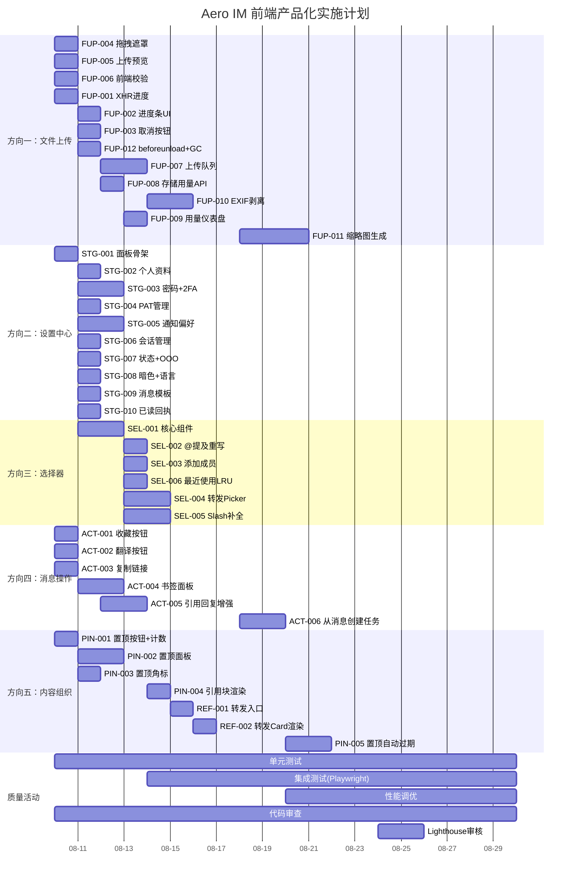

# Tech Lead 分析报告：前端产品化缺口实施路线

## 概述

基于 `2026-07-12-five-uncovered-client-ux-productization-directions.md` 的分析，以及代码验证反馈中识别的工作量修正和风险补充，本报告将 5 个方向分解为可执行任务、排定依赖关系、评估风险并给出实施时间表。

---

## 1. 任务分解

### 方向一：文件上传体验

| 任务 ID | 标题 | 涉及文件 | 前置 | 工时 |
|---------|------|---------|------|------|
| FUP-001 | 将 `fetch` 上传改为 `XMLHttpRequest` + 进度回调 | `web/api.js`（`uploadBlob` 方法）、`web/media.js`（`uploadAndSend`） | — | 3h |
| FUP-002 | 文件上传进度条 UI 组件 | `web/media.js`、`web/style.css`、`web/index.html` | FUP-001 | 3h |
| FUP-003 | 取消上传按钮（AbortController 暴露） | `web/media.js`、`web/api.js` | FUP-001 | 2h |
| FUP-004 | 拖拽全屏遮罩 + 动效 | `web/media.js`、`web/style.css` | — | 2h |
| FUP-005 | 上传前预览（图片缩略图 + 文件名 + 大小 + 确认/取消） | `web/media.js`、`web/style.css` | — | 4h |
| FUP-006 | 前端 MIME/大小校验 | `web/media.js` | — | 1h |
| FUP-007 | 上传队列管理（多文件串行 → 队列 UI + 暂停/恢复） | `web/media.js`、`web/style.css` | FUP-001, FUP-002 | 5h |
| FUP-008 | 后端存储用量 API | `crates/aero-server/src/storage_usage.rs`（新增）、`routes/routes.rs`（merge 注册） | — | 2h |
| FUP-009 | 前端存储用量仪表盘 | `web/settings.js`、`web/style.css` | FUP-008, STG-002 | 2h |
| FUP-010 | EXIF 剥离管线 | `crates/aero-storage/src/content_sniff.rs`（扩展）或 `crates/aero-common/src/image.rs`（新增） | — | 3h |
| FUP-011 | 服务端缩略图生成 | `crates/aero-server/src/thumbnail.rs`（新增）、`blob_store` 回调 | — | 6h |
| FUP-012 | 上传时 `beforeunload` 保护 + 孤儿 blob GC 增强 | `web/media.js`、`crates/aero-server/src/bin/boot/background.rs`（blob_gc_drain） | — | 2h |

### 方向二：个人设置中心

| 任务 ID | 标题 | 涉及文件 | 前置 | 工时 |
|---------|------|---------|------|------|
| STG-001 | 设置面板导航入口 + 抽屉 DOM 骨架 | `web/settings.js`（新增）、`web/index.html`、`web/style.css`、`web/app.js` | — | 3h |
| STG-002 | 个人资料编辑（显示名/头像/邮箱只读/电话/头衔/代词/时区） | `web/settings.js`、`web/api.js`（`updateMe` 扩展） | STG-001 | 3h |
| STG-003 | 密码更改表单 + 2FA 启用/禁用 + 恢复码展示 | `web/settings.js`、`web/api.js`（新增 `changePassword`、`enable2fa`、`disable2fa` 等） | STG-001 | 4h |
| STG-004 | PAT 令牌 CRUD 管理 UI | `web/settings.js`、`web/api.js`（新增 `listPats`、`createPat`、`deletePat`） | STG-001 | 3h |
| STG-005 | 通知偏好 UI（全局/DND/关键词/频道静音） | `web/settings.js`、`web/api.js`（新增 `getNotifPrefs`、`putNotifPrefs`） | STG-001 | 4h |
| STG-006 | 活跃会话管理 UI（列表 + 登出其他 + 撤销） | `web/settings.js`、`web/api.js`（新增 `listSessions`、`deleteSession`、`logoutOther`） | STG-001 | 2h |
| STG-007 | 自定义状态/Presence 选择器 + OOO 设置 | `web/settings.js`、`web/api.js`（新增 `putStatus`、`putOoo`） | STG-001 | 3h |
| STG-008 | 暗色模式切换 + 语言选择 + 消息密度 | `web/settings.js`、`web/style.css`、`web/app.js`（CSS 变量系统） | STG-001 | 3h |
| STG-009 | 消息模板 CRUD UI | `web/settings.js`、`web/api.js`（新增模板 API） | STG-001 | 3h |
| STG-010 | 已读回执隐私开关 + 保存的搜索管理 | `web/settings.js`、`web/api.js` | STG-001 | 2h |

### 方向三：通用实体选择器组件

| 任务 ID | 标题 | 涉及文件 | 前置 | 工时 |
|---------|------|---------|------|------|
| SEL-001 | EntityPicker 核心组件（模态框 + 远程搜索 + 键盘导航 + 单/多选 + 排除列表） | `web/picker.js`（新增）、`web/style.css`、`web/index.html` | — | 5h |
| SEL-002 | @提及重写为基于 EntityPicker 的内联模式 | `web/mentions.js`（重构） | SEL-001 | 2h |
| SEL-003 | "添加成员" prompt() → EntityPicker | `web/modals.js`（重构 `showAddMember`） | SEL-001 | 1h |
| SEL-004 | 消息转发 EntityPicker + 后端转发 API | `web/render.js`、`web/api.js`（新增 `forwardMessage`）、`crates/aero-server/src/forward.rs` | SEL-001, REF-003 | 4h |
| SEL-005 | Slash 命令补全面板（EntityPicker 模式） | `web/commands.js`（新增）、`web/app.js` | SEL-001 | 3h |
| SEL-006 | 最近使用 LRU 存储 + 频率排序 | `web/picker.js` | SEL-001 | 2h |

### 方向四：消息级效率操作

| 任务 ID | 标题 | 涉及文件 | 前置 | 工时 |
|---------|------|---------|------|------|
| ACT-001 | 收藏按钮（☆/★） + 后端书签 CRUD 封装 | `web/render.js`（`wireMsgActions`）、`web/api.js`（新增 `toggleBookmark`、`listBookmarks`） | — | 3h |
| ACT-002 | 翻译按钮（🌐） + 内联翻译渲染 | `web/render.js`、`web/api.js`（新增 `translateMessage`） | — | 3h |
| ACT-003 | 复制永久链接按钮（🔗） + clipboard API | `web/render.js` | — | 1h |
| ACT-004 | 书签管理面板（分组/列表/跳转/取消） | `web/bookmarks.js`（新增）、`web/index.html`、`web/style.css` | ACT-001 | 4h |
| ACT-005 | 引用回复增强（选中文本 → 浮层 → 引用块插入 composer） | `web/render.js`、`web/app.js` | — | 3h |
| ACT-006 | 从消息创建任务（轻量表单 + API） | `web/render.js`、`web/task.js`（新增）、`web/api.js`（新增 `createTask`） | — | 3h |

### 方向五：消息引用与内容组织

| 任务 ID | 标题 | 涉及文件 | 前置 | 工时 |
|---------|------|---------|------|------|
| PIN-001 | 频道头部置顶按钮 + 置顶计数 | `web/render.js`、`web/app.js`（`handlePin` 重写）、`web/style.css` | — | 2h |
| PIN-002 | 置顶面板（`#drawer-pins` 列表 + 取消置顶） | `web/pins.js`（新增）、`web/index.html`、`web/style.css` | PIN-001 | 3h |
| PIN-003 | 消息气泡置顶角标（📌） + 实时扇出处理 | `web/render.js`、`web/ws.js`（`msg:pin` 帧处理） | PIN-001 | 2h |
| PIN-004 | 引用回复文本选择 → 引用块渲染（左灰线 + 原文 + 作者） | `web/render.js`、`web/app.js` | ACT-005 | 2h |
| REF-001 | 消息转发 UI 入口 + EntityPicker 集成 | `web/render.js` | SEL-004 | 2h |
| REF-002 | 转发 Card 渲染（📨 来源房间 + 原文预览） | `web/render.js` | REF-001 | 2h |
| PIN-005 | 置顶自动过期（后端 `pinned_until` + 清扫器） | `crates/aero-storage/src/pins.rs`、`crates/aero-server/src/bin/boot/background.rs` | — | 3h |

---

## 2. 执行顺序与依赖图

```mermaid
graph TD
    subgraph Phase1["阶段一：基础设施 + 基础体验 (~12天)"]
        FUP-006[FUP-006 前端校验] 
        FUP-004[FUP-004 拖拽遮罩]
        FUP-005[FUP-005 上传预览]
        FUP-001[FUP-001 XHR进度回调]
        FUP-002[FUP-002 进度条UI]
        FUP-003[FUP-003 取消按钮]
        FUP-012[FUP-012 beforeunload+GC]
        
        STG-001[STG-001 设置面板骨架]
        
        SEL-001[SEL-001 EntityPicker核心]
        
        ACT-001[ACT-001 收藏按钮]
        ACT-002[ACT-002 翻译按钮]
        ACT-003[ACT-003 复制链接]
        
        PIN-001[PIN-001 置顶按钮+计数]
    end

    subgraph Phase2["阶段二：核心功能 (~14天)"]
        FUP-007[FUP-007 上传队列管理]
        FUP-008[FUP-008 存储用量API]
        
        STG-002[STG-002 个人资料编辑]
        STG-003[STG-003 密码+2FA]
        STG-004[STG-004 PAT管理]
        STG-005[STG-005 通知偏好]
        STG-006[STG-006 会话管理]
        
        SEL-002[SEL-002 @提及重写]
        SEL-003[SEL-003 添加成员Picker]
        
        ACT-004[ACT-004 书签管理面板]
        ACT-005[ACT-005 引用回复增强]
        
        PIN-002[PIN-002 置顶面板]
        PIN-003[PIN-003 置顶角标]
        
        FUP-010[FUP-010 EXIF剥离]
    end

    subgraph Phase3["阶段三：高阶功能 (~16天)"]
        FUP-009[FUP-009 存储用量仪表盘]
        FUP-011[FUP-011 缩略图生成]
        
        STG-007[STG-007 状态+OOO]
        STG-008[STG-008 暗色模式+语言]
        STG-009[STG-009 消息模板]
        STG-010[STG-010 已读回执+保存搜索]
        
        SEL-004[SEL-004 转发Picker]
        SEL-005[SEL-005 Slash补全]
        SEL-006[SEL-006 最近使用LRU]
        
        ACT-006[ACT-006 从消息创建任务]
        
        PIN-004[PIN-004 引用块渲染]
        REF-001[REF-001 转发入口]
        REF-002[REF-002 转发Card渲染]
        PIN-005[PIN-005 置顶自动过期]
    end

    %% 依赖连线
    FUP-001 --> FUP-002
    FUP-001 --> FUP-003
    FUP-001 --> FUP-007
    FUP-002 --> FUP-007
    FUP-002 --> FUP-009
    
    STG-001 --> STG-002
    STG-001 --> STG-003
    STG-001 --> STG-004
    STG-001 --> STG-005
    STG-001 --> STG-006
    STG-001 --> STG-007
    STG-001 --> STG-008
    STG-001 --> STG-009
    STG-001 --> STG-010
    
    SEL-001 --> SEL-002
    SEL-001 --> SEL-003
    SEL-001 --> SEL-004
    SEL-001 --> SEL-005
    SEL-001 --> SEL-006
    
    ACT-001 --> ACT-004
    ACT-005 --> PIN-004
    
    SEL-004 --> REF-001
    REF-001 --> REF-002
    
    FUP-008 --> FUP-009
    STG-002 --> FUP-009

    %% 可并行组
    classDef parallelGroupA fill:#d4edda,stroke:#28a745
    class FUP-004,FUP-005,FUP-006,FUP-012,STG-001,SEL-001,ACT-001,ACT-002,ACT-003,PIN-001 parallelGroupA
```



### 并行任务分组

| 组 | 任务 | 可并行原因 |
|-----|------|-----------|
| **A（前端独立）** | FUP-004, FUP-005, FUP-006, FUP-012, STG-001, SEL-001, ACT-001, ACT-002, ACT-003, PIN-001 | 全部是独立 JS 模块或独立功能，零共享数据依赖 |
| **B（方向一核心）** | FUP-007, FUP-008, FUP-010 | 队列 UI、后端 API、EXIF 各不冲突 |
| **C（方向二设置页）** | STG-002~STG-006 | 依赖 STG-001 骨架，但设置项卡片之间无互锁 |
| **D（方向三选择器集成）** | SEL-002, SEL-003 | 两者都依赖 SEL-001，但彼此无依赖 |
| **E（方向四/五消息操作）** | ACT-004, PIN-002+003 | 书签面板和置顶面板共用抽屉模式但逻辑独立 |

---

## 3. 技术风险

### 3.1 高风险项

| 风险 | 概率 | 影响 | 缓解策略 |
|------|------|------|---------|
| **XHR 上传改造破坏现有上传流**（FUP-001） | 中 | 高（生产上传中断） | 保留 `fetch` 路径作为回退；XHR 版本先 feature-flag 灰度；增加 `uploadAndSend` 单元测试覆盖（error/401/timeout 路径） |
| **2FA 恢复码丢失→用户锁定**（STG-003） | 高 | 中 | 强制"我已保存"弹窗确认（checkbox + button disabled 链）；提供备用邮箱重置路径（后端已有但前端无）；recovery-codes 强制展示后要求再输入一次确认 |
| **Service Worker 离线策略（评价修正后 2w）** | — | 高 | **原分析文档未覆盖**。当前 `manifest.json` 已就绪但无 `service-worker.js` 文件。离线消息队列需要 IndexedDB schema + WS 重连逻辑 + 离线写 IndexedDB → 恢复后 flush。建议将此任务与当前 5 个方向**解耦**为独立 PWA 工作流 |
| **设置页 15+ 配置项的后端一致性** | 低 | 中 | 后端每个 API 已有 `updated_at` 乐观锁或 LWW 语义（`pat`/`profile`/`notif_prefs` 各不同）。前端编辑时需保持当前值 + 保存冲突提示（`412 Precondition Failed`） |
| **翻译按钮频繁触发导致 AI 预算耗尽**（ACT-002） | 中 | 中 | 添加 per-user 翻译限流（`AERO_AI_TRANSLATE_BURST=5/min`）；翻译结果客户端缓存（key=`msg_id:lang`）；超预算时降级显示原文 + 提示 |

### 3.2 外部依赖风险

| 依赖 | 风险 | 应对 |
|------|------|------|
| **EXIF 剥离**（FUP-010） | 纯 Rust EXIF 库（`kamadak-exif`）支持有限；系统工具 `exiftool` 需要服务器安装 | Rust 先用 `kamadak-exif` 剥离 GPS + 设备字段（带 `unsafe_code = "forbid"` 约束，kamadak 无 unsafe）；回退方案为系统 `exiftool -all=` 子进程 |
| **缩略图生成**（FUP-011） | Rust 原生图片库（`image` crate）处理大图片内存开销高 | 限制缩略图输入尺寸（≥4000px 的先等比例缩小到 2000px）；用 `tokio::task::spawn_blocking` 移出 async 上下文；mtime 缓存避免重复生成 |
| **转发 Card schema**（REF-001/002） | `Block::Card` schema 需要前后端对齐 `forwarded_message` 契约 | 定义 `ForwardedPayload` struct（`original_message_id`、`original_room_id`、`original_author`、`preview_text`、`timestamp`），两端 serde 对齐 |

### 3.3 性能风险

| 场景 | 风险 | 应对 |
|------|------|------|
| 设置页多 API 并行请求 | 5-10 个 REST 请求同时发出→慢速网络下白屏时间长 | 聚合 `GET /api/me/settings` 端点（后端将 profile/2fa/pat/sessions/prefs 一口返回）；或前端分步加载（profile 优先 → 其余延迟） |
| @mention 搜索 10 万用户 | 每次击键都发 API，UI 卡顿 | 300ms debounce + `LIMIT 20` 服务端分页 + 骨架屏 |
| 书签列表 500+ 条 | 大量 DOM 节点 + 惰性加载 | 虚拟滚动（IntersectionObserver + 分页加载 50 条/批） |

---

## 4. 资源评估

### 4.1 团队配置建议

```
Phase 1 (Week 1-2):  3 人
  - 前端工程师 A（Web SPA, JS/DOM/CSS 原生经验）
  - 前端工程师 B（同上，聚焦方向二设置面板）
  - 全栈工程师 C（后端 API + 方向三 EntityPicker 核心）

Phase 2 (Week 3-4):  4 人
  - 前端 A + B（消息操作、置顶面板、书签管理）
  - 全栈 C（EntityPicker 集成、转发、任务）
  - 后端工程师 D（EXIF 剥离、缩略图、存储用量 API）

Phase 3 (Week 5-7):  4 人
  - 前端 A + B（高阶设置、暗色模式、仪表盘）
  - 全栈 C（Slash 补全、最近使用 LRU）
  - 后端 D（置顶自动过期、任务 API）
```

### 4.2 关键里程碑

| 里程碑 | 时间 | 交付物 | 验证标准 |
|--------|------|--------|---------|
| M1: 上传体验基线 | 第 5 天 | 进度条 + 取消 + 预览 + 前端校验 + 拖拽遮罩 | 上传任意文件可见进度条；取消按钮中止上传；大文件>32MB本地拒绝 |
| M2: 设置面板 MVP | 第 10 天 | 个人资料/密码/2FA/PAT/通知/会话 6 项设置 | 所有表单可读写，2FA 启用流程完整（含恢复码确认） |
| M3: EntityPicker 就绪 | 第 12 天 | 选择器 + @提及重写 + 添加成员 | 三场景统一交互，键盘导航 (`↑↓EnterEsc`) 正常工作 |
| M4: 消息操作扩展 | 第 18 天 | 收藏/翻译/链接/书签面板/置顶面板/引用回复 | 每条消息 hover 显示新按钮；书签可分组/跳转；引用块渲染正确 |
| M5: PWA 基线 | 第 22 天 | service-worker.js + 离线连接健康度 + 英文 i18n | Lighthouse PWA 评分≥80；离线时显示连接健康指示器；`lang=en` 用户看到英文界面 |
| M6: 完整交付 | 第 28 天 | 全部 5 方向 L1+L2、PWA baseline、英文 i18n | eslint 无违规、`cargo check` 干净、`web-check.sh` 通过 |

### 4.3 阻塞点与解决策略

| 阻塞点 | 触发条件 | 解阻塞策略 |
|--------|---------|-----------|
| **Service Worker HTTPS 要求** | 本地开发环境 `localhost` 绕过，但 CI/staging 需要 HTTPS 部署 | Staging nginx 配置自签名证书；CI 用 `localhost`（SW 在 localhost 豁免 HTTPS 要求） |
| **str0m 缩略图管线内存** | 大图片（8000x6000）解码内存 >100MB | `image` crate 使用 `ImageReader::with_guessed_format` + `set_limits(4000, 4000)` 降采样 |
| **Web Push（方向二子集）** | VAPID keys + 后端 push 集成需要新增 `webpush` crate | 移出 Phase 1-3，标记为 PWA Phase 2；当前仅完成 manifest + Service Worker 离线页 |
| **ESLint 对原生 JS 模块的树摇** | `web/picker.js` 被多个模块 import，未使用的导出可能影响压缩 | `eslint.config.js` 已有最小配置，保持 `no-unused-vars` 检查；构建用 Terser 级别的 dead code elimination 暂不要求 |

---

## 5. 质量保证

### 5.1 单元测试覆盖要求

| 模块 | 测试内容 | 最低覆盖率 | 工具 |
|------|---------|-----------|------|
| `web/picker.js` | 搜索 debounce、键盘导航逻辑、多选 toggle、排除列表过滤 | 85%+ 语句 | Vitest（或 Node `--experimental-strip-types` + `node:test`） |
| `web/api.js`（新方法） | `uploadBlob(XHR)` error/timeout/progress 回调 | 90%+ 分支 | Vitest + `fetch-mock` 或 XHR mock |
| `web/settings.js` | 表单验证逻辑（密码强度、2FA 恢复码确认） | 90%+ 条件 | Vitest 纯函数 |
| `crates/aero-server/src/storage_usage.rs` | 算配额、空工作区溢出、分页 | 95%+ 行 | `sqlx::test`（`#[ignore]` + DATABASE_URL） |
| `crates/aero-storage/src/pins.rs`（扩展） | `pinned_until` 过期逻辑、自动清理 | 95%+ 行 | `sqlx::test` |
| `crates/aero-server/src/thumbnail.rs` | 多尺寸生成、格式兼容（jpg/png/webp）、错误路径（无效文件/权限） | 85%+ | `#[cfg(test)]` 用 `image` crate 合成测试图片 |

### 5.2 集成测试策略

| 场景 | 测试方法 | 覆盖范围 |
|------|---------|---------|
| **上传 + 进度 + 取消** | `api.test()` 模拟 XHR 各事件；Playwright 端到端：选择文件→进度条可见→取消→消息未发送 | 前后端链路 |
| **设置页 CRUD** | 后端 API 测试（`PATCH /api/me/profile`, `POST /api/me/2fa/enable` 等）；前端 Playwright 填写表单→提交→验证回显 | 全栈 |
| **EntityPicker 交互** | 纯前端集成测试：输入→debounce→mock API 返回→下拉显示→方向键选中→Enter → `onSelect` 回调触发 | 前端 |
| **置顶生命周期** | Playwright：管理员置顶消息→成员看到 📌 角标→点击置顶面板→取消置顶→角标消失→列表不包含已取消项 | 全栈实时 |
| **书签跨会话** | Playwright：收藏消息→刷新页面→书签面板显示收藏项→点击跳转到原文→取消收藏 | 持久化 |
| **2FA 完整流程** | 启用 2FA→展示恢复码→确认保存→输入 TOTP→验证通过→退出→重新登录→输入 TOTP→进入主页 | 关键安全路径 |

### 5.3 代码审查要点

| 审查项 | 重点关注 |
|--------|---------|
| **`unsafe_code = "forbid"` 遵守** | EXIF 剥离/缩略图中的第三方 crate 不含 `unsafe`（`deny.toml` 已配；`cargo deny check bans` 需过） |
| **`assert_room_access` 守则** | 转发 API、置顶 API 都需校验调用者对于目标房间的成员身份 |
| **`kind` 标签陷阱** | 新增 `RoomEvent::Pin` variant 无 `kind` 字段冲突（已有 `#[serde(rename=...)]` 规避）；`Block::Card` 的 `schema` 字段不与 `kind` 冲突 |
| **前端无外部框架依赖** | `picker.js`/`settings.js`/`bookmarks.js` 都必须是原生 ES2020 模块，不引入 React/Vue/Svelte |
| **幂等性检查** | 转发消息需要幂等键？当前 `POST /api/rooms/:id/messages` 无幂等；但转发是用户显式操作，重发一次可接受，无需幂等 |
| **WebSocket 帧扩展** | `msg:pin` 帧处理在 `ws.js` 需新增分支，测试 `msg:pin` 到达后 UI 更新 |

### 5.4 性能测试需求

| 场景 | 指标 | 工具 |
|------|------|------|
| EntityPicker @mention 搜索 | 300ms debounce 下，从击键到下拉显示 ≤500ms（含 API 往返） | Chrome DevTools Performance |
| 设置页并行加载 | 首屏可交互 ≤2s（最慢的 3 个 API 并行） | Lighthouse |
| 书签列表 500 条 | 滚动帧率 ≥55fps，内存增量 ≤10MB | Chrome DevTools Memory |
| 图片缩略图管线 | 5MB JPG → 缩略图耗时 ≤500ms，内存峰值 ≤50MB | `cargo bench` + `perf` |
| Concurrent upload | 3 个 10MB 文件同时上传，单个进度条更新间隔 ≤200ms | 自定义 benchmark |

---

## 6. 实施计划

### 甘特图



### 各阶段时间线

#### 阶段 1：基础设施 + 基础体验（第 1-8 天，共 12 天）

**Day 1-3（核心骨架）**
- `SEL-001` EntityPicker 核心（5h）：定义类接口、模态框 DOM、搜索函数注入、键盘导航、选择回调
- `STG-001` 设置面板骨架（3h）：齿轮入口 + `#drawer-settings` DOM + 左侧标签导航
- `FUP-004` 拖拽遮罩（2h）：全屏半透明遮罩 + `drop-active` CSS class 完善
- `FUP-005` 上传预览（4h）：选择图片后在 composer 上方渲染缩略图 + 文件名 + 大小 + 取消/发送

**Day 4-5（上传管线改造）**
- `FUP-001` XHR 进度回调（3h）：`uploadBlob` 改为接受 `onProgress` 回调
- `FUP-002` 进度条 UI（3h）：文件消息气泡下方显示 `<progress>` + 百分比 + 速度
- `FUP-003` 取消按钮（2h）：`AbortController` 通过 `uploadBlob` 返回 `cancel()` 函数
- `FUP-006` 前端校验（1h）：`file.type` MIME 白名单 + `file.size` ≤ 32MB
- `ACT-001/002/003` 消息操作按钮（各 1-3h）：收藏/翻译/链接按钮 + 后端 API 封装

**Day 6-8（设置页冲刺 + 置顶入口）**
- `STG-002`~`006` 设置页按优先级排列：个人资料(3h) → 密码+2FA(4h) → PAT(3h) → 通知偏好(4h) → 会话(2h)
- `PIN-001` 置顶按钮（2h）：频道头部 📌 按钮 + 计数 badge
- `FUP-012` beforeunload 保护（2h）

#### 阶段 2：核心功能（第 9-18 天，共 14 天）

**Day 9-12（选择器集成 + 上传队列）**
- `SEL-002/003` @提及重写(2h) + 添加成员(1h)
- `FUP-007` 上传队列管理(5h)：队列 DOM + 串行执行 + 暂停/恢复
- `FUP-008` 存储用量 API(2h)
- `ACT-004` 书签面板(4h)：`#drawer-bookmarks` + 分组 CRUD + 跳转 + 取消

**Day 13-15（消息操作展开）**
- `ACT-005` 引用回复增强(3h)：文本选择 → 浮层 → 引用块
- `SEL-004` 转发 + EntityPicker(4h)
- `PIN-002/003` 置顶面板(3h+2h)
- `FUP-010` EXIF 剥离(3h)

**Day 16-18（高阶设置）**
- `STG-007` 状态 + OOO(3h)
- `STG-008` 暗色模式 + 语言选择(3h)
- `PIN-004` 引用块渲染(2h)
- `REF-001/002` 转发入口 + Card 渲染(4h)

#### 阶段 3：高阶功能（第 19-28 天，共 16 天）

**Day 19-22（PWA + i18n 基线）**
- `sw.js` Service Worker 静态缓存 + offline 页
- IndexedDB 离线消息队列（WS 重连逻辑）
- 英文 `i18n/en.json` 字符串提取 + 运行时切换
- `FUP-009` 存储用量仪表盘(2h)

**Day 23-25（高阶设置补完）**
- `STG-009` 消息模板 CRUD(3h)
- `STG-010` 已读回执 + 保存搜索管理(2h)
- `ACT-006` 从消息创建任务(3h)
- `SEL-005` Slash 命令补全(3h)

**Day 26-28（收尾）**
- `FUP-011` 缩略图生成(6h)
- `PIN-005` 置顶自动过期(3h)
- `SEL-006` 最近使用 LRU(2h)

---

## 7. 与既有基础设施的复用矩阵

为了让团队明确**哪些是新写、哪些是复用**：

| 新任务 | 复用/借鉴来源 | 复用程度 |
|--------|-------------|---------|
| `SEL-001` EntityPicker | `mentions.js`（键盘导航 + 浮层逻辑）| 40% 逻辑可复用 |
| `STG-002` 个人资料编辑 | `modals.js` `showEditProfile`（已有表单 DOM） | 30% |
| `FUP-002` 进度条 | `polls.js` 投票进度条（CSS `<progress>` 样式） | 20%（样式参考）|
| `ACT-004` 书签面板 | `polls.js` 弹窗模式（抽屉 DOM 模式） | 30%（交互模式）|
| `PIN-002` 置顶面板 | `search.js` 搜索结果列表渲染（列表+分页） | 35% |
| `FUP-008` 存储用量 API | `crates/aero-storage/src/ai_usage.rs`（用量聚合模式） | 60%（模式参考）|
| `FUP-011` 缩略图 | `crates/aero-live-hls/src/ts_muxer.rs`（图片处理管线） | 10%（仅架构参考）|

---

## 8. 总结：优先级与阶段建议

基于代码验证反馈中对工作量的修正分析，以及风险排序，推荐的**实际执行顺序**为：

```
Phase 1 (Week 1-2):  方向二(设置MVP) + 方向三(选择器) + 方向一(L1上传)
                   → 解决"没有设置面板"的最大产品化 gap
                   → 选择器为后续转发/添加成员铺路
                   → 上传进度条覆盖每日高频痛点

Phase 2 (Week 3-4):  方向四(消息操作) + 方向五(置顶/引用) + 方向一(L2队列)
                   → 基于选择器快速落地转发
                   → 消息操作扩展让每条消息更有用
                   → 置顶让频道信息可组织

Phase 3 (Week 5-6):  方向二(L2高阶设置) + PWA基线 + i18n英文
                   → 暗色模式/语言切换是用户体验的最后一公里
                   → PWA Service Worker + 离线策略
                   → 英文 i18n 打开非中文市场

Phase 4 (Week 7-8):  方向一(L3缩略图+EXIF) + 性能优化 + 安全审计
                   → 缩略图是移动端体验关键
                   → EXIF 剥离是隐私合规
```

**关键前置依赖**：`SEL-001`（EntityPicker 核心）处于依赖图的最上游，是阶段一第 3 天应启动的任务。它的完成直接解锁 `SEL-002/003/004/005` 四个下游任务，影响阶段二和三的进度的约 4 天的浮动时间。因此，**前 3 天应集中 2 人力量优先攻克 SEL-001 + STG-001 + FUP-001**，确保第 4 天起下游任务能并行展开。
