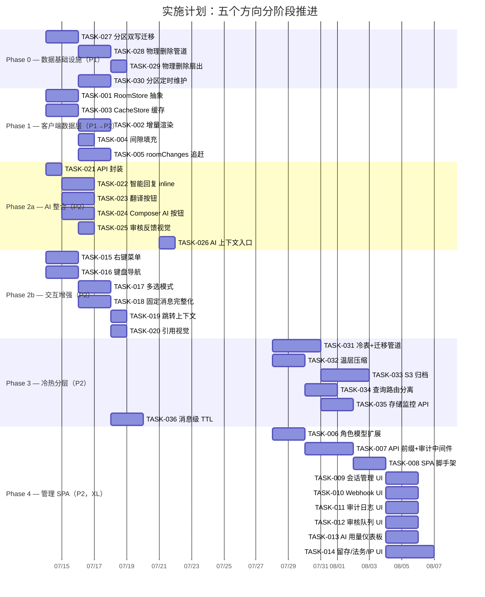

Now I have a thorough understanding of the codebase. Let me produce the full Tech Lead analysis.

---

# Tech Lead 分析报告：五个高价值扩展方向

> **分析基准**: `docs/requirements/2026-07-11-five-unanalyzed-expansion-directions.md` + 代码证据审查
> **日期**: 2026-07-12
> **前置校正**: 已采纳审阅意见的修正（方向一降级、方向三重估、方向五分阶段）

---

## 1. 任务分解

### 方向一：REST/WS 双源一致性（P1→P2 修正版）

| 任务 ID | 任务标题 | 涉及文件 | 前置依赖 | 预估工时 | 验收标准 |
|---------|---------|---------|----------|---------|---------|
| TASK-001 | 实现 `RoomStore` 数据层抽象 | `web/app.js`, `web/room_store.js`（新建） | 无 | 4h | `state.messagesByRoom` 全部操作经 `RoomStore.ingest()` 入口；id 级别去重 + ULID 排序 + 间隙检测 |
| TASK-002 | `switchRoom` 增量渲染 | `web/app.js` | TASK-001 | 3h | 切回已有数据的房间：不调用 `rerenderCurrentRoom()` 的 `replaceChildren()`，只 append 新 DOM 节点；`rerenderCurrentRoom` 改为 diff 模式 |
| TASK-003 | REST 响应缓存层 `CacheStore` | `web/api.js`, `web/cache_store.js`（新建） | 无 | 3h | LRU 缓存（50 条目上限）；GET 响应按 URL 缓存；`stale-while-revalidate`；WS 推送自动 invalidate 相关键 |
| TASK-004 | 房间切换间隙填充 | `web/app.js`, `web/room_store.js` | TASK-001 | 2h | `loadHistory` 检测 ULID 间隙并自动发起填充请求；间隙标记在 `roomStore.gaps` 可查询 |
| TASK-005 | `roomChanges` 追赶集成 | `web/ws.js`, `web/app.js` | TASK-001 | 3h | WS 重连后调用 `GET /api/rooms/:id/changes?since=` 追赶编辑/删除帧；`_lastSeen` 游标经 `roomChanges` 而非仅 `listMessages` 恢复 |

**方向一小计**: 15h（约 2 人/天）

### 方向二：管理 SPA（P2，XL 体量）

| 任务 ID | 任务标题 | 涉及文件 | 前置依赖 | 预估工时 | 验收标准 |
|---------|---------|---------|----------|---------|---------|
| TASK-006 | 角色模型扩展（`SuperAdmin`/`Auditor`/`Moderator`） | `storage/src/member_role.rs`, `migrations/NNNN_role_enum.sql` | 无 | 4h | PG enum 新增角色值；`WorkspaceRepo::member_role` 返回扩展角色；`assert_admin` 兼容旧值；迁移幂等 |
| TASK-007 | 统一管理 API 前缀 + `AdminAuditLayer` 中间件 | `server/src/admin_middleware.rs`（新建）, 管理路由迁移 | TASK-006 | 6h | 所有管理端点迁移至 `/api/admin/*`；`AdminAuditLayer` 自动记录 `(admin_id, action, target, before, after)`；迁移向后兼容旧路径（`Deprecation` 头） |
| TASK-008 | 管理 SPA 脚手架 + 基础布局 | `web/admin/index.html`, `web/admin/app.js`, `server/src/serve.rs` | TASK-007 | 4h | `GET /admin/` 返回独立 SPA；登录鉴权复用 IM SPA 的 token；左侧导航：会话 / Webhook / 审计 / 法务保全 / 留存策略 / AI 用量 |
| TASK-009 | 管理端——用户会话管理 UI | `web/admin/sessions.js` | TASK-008 | 3h | 活动会话列表（IP/设备/时间）+ 远程吊销按钮；`GET /api/admin/sessions` + `POST .../revoke` 联调 |
| TASK-010 | 管理端——Webhook 管理 UI | `web/admin/webhooks.js` | TASK-008 | 4h | CRUD webhook 端点；投递日志列表（状态/重试/响应体预览）；DLQ 重新投递按钮 |
| TASK-011 | 管理端——审计日志 UI | `web/admin/audit.js` | TASK-008 | 3h | 分页审计事件表（操作者/动作/目标/时间戳）；`?actor=` / `?action=` 过滤；支持 CSV 导出 |
| TASK-012 | 管理端——审核队列 UI | `web/admin/moderation.js` | TASK-008 | 4h | 举报消息列表（状态/处理人/时间）；审批/驳回工作流；AI 审核置信度展示 |
| TASK-013 | 管理端——AI 用量仪表板 | `web/admin/ai_usage.js` | TASK-008 | 3h | `GET /api/admin/ai/usage` 可视化：每日花费/请求量/各模型分布；月环比趋势 |
| TASK-014 | 管理端——频道留存/法务保全/IP 白名单 UI | `web/admin/retention.js`, `web/admin/legal_holds.js`, `web/admin/ip_allowlist.js` | TASK-008 | 5h | 三个独立面板：留存策略 CRUD + 预览清理行；法务保全创建/释放工作流；IP 白名单编辑（+ 自我锁死警告） |

**方向二小计**: 36h（约 4.5 人/天，适合 2 人并行 2.5 天）

### 方向三：消息行交互增强（P2，M-L 体量修正版）

| 任务 ID | 任务标题 | 涉及文件 | 前置依赖 | 预估工时 | 验收标准 |
|---------|---------|---------|----------|---------|---------|
| TASK-015 | 右键上下文菜单 | `web/app.js`, `web/render.js`, `web/context_menu.js`（新建） | 无 | 3h | 消息上 `contextmenu` 事件显示自定义菜单：复制文本/复制引用链接/回复/固定/举报/转发；移动端长按等效；点击外部关闭 |
| TASK-016 | 键盘导航快捷键 | `web/app.js`, `web/render.js` | 无 | 4h | `↑`/`↓` 消息间移动焦点（高亮行）；`Enter` 回复高亮消息；`Ctrl+E` 编辑最后自己的消息；`Delete` 删除选中的；`Escape` 关闭当前浮动 UI；composer 焦点时全局键不触发 |
| TASK-017 | 多选模式（`Shift+click`） | `web/app.js`, `web/render.js`, `web/context.js` | 无 | 4h | `Shift+click` 切换消息选中状态；顶部批量操作栏（删除/固定/导出）；选中状态持久化到 `state.selectedMessages`；`Escape` 退出多选模式；多选时隐藏 hover 操作栏 |
| TASK-018 | 固定消息交互完整化 | `web/app.js`, `web/render.js`, `web/api.js` | 无 | 3h | 固定消息增加 pin icon 视觉标识；`msg-pin` CSS 类；Pinned 置顶栏（房间顶部显示最近固定）；`scrollToMessage` 集成；固定列表面板 |
| TASK-019 | 跳转上下文增强 | `web/context.js`, `web/app.js` | 无 | 2h | `scrollToMessage` 跳转后自动加载前后 5 条消息；显示面包屑导航；复制永久链接按钮 |
| TASK-020 | 引用回复视觉完整 | `web/render.js`, `web/style.css` | 无 | 2h | 被回复消息添加左侧竖线 + "N 条回复"计数指示器；被删除的引用显示"此消息已被删除"占位 |

**方向三小计**: 18h（约 2.25 人/天）

### 方向四：AI 客户端整合（P2，高性价比）

| 任务 ID | 任务标题 | 涉及文件 | 前置依赖 | 预估工时 | 验收标准 |
|---------|---------|---------|----------|---------|---------|
| TASK-021 | API 封装：`smartReply`/`translate`/`rewrite` | `web/api.js` | 无 | 1h | 新增 `api.smartReply(roomId, msgId)`, `api.translate(msgId, targetLang)`, `api.rewrite(text, style)` 方法；联调已存在的后端路由 |
| TASK-022 | 智能回复 inline 建议 | `web/app.js`, `web/render.js`, `web/api.js` | TASK-021 | 3h | 消息底部（reactions 上方）显示 3 个建议回复；hover 触发（限 10 秒消失）；点击填入 composer；速率控制：同房间 30s 冷却 |
| TASK-023 | 消息内联翻译按钮 | `web/app.js`, `web/render.js`, `web/api.js` | TASK-021 | 3h | `msg-actions` 增加 🌐 按钮（仅非用户首选语言消息显示）；点击替换消息正文为译文+"原文"切换按钮；翻译缓存于 `state.translationsByMsg` |
| TASK-024 | Composer AI 辅助按钮 | `web/app.js`, `web/composer.js`（composer 逻辑拆分） | TASK-021 | 3h | `els.composerSend` 旁增加 ✨ 按钮；弹出菜单：更正式/更简洁/修正语法/扩写；选中后替换 composer 内容（可预览取消） |
| TASK-025 | 审核反馈视觉差异化 | `web/render.js`, `web/app.js` | 无 | 2h | 被 moderation_bot 软删的消息显示"因违反规范被删除"+ 申诉按钮（`POST /api/ban-appeals`）替代通用"消息已删除" |
| TASK-026 | 消息上下文 AI 入口 | `web/app.js`, `web/search.js` | TASK-015（右键菜单） | 2h | 右键菜单增加"对此提问""总结此线程"；点击自动填充 AI 面板上下文 |

**方向四小计**: 14h（约 1.75 人/天）

### 方向五 Phase 1：分区启用 + 物理删除（P1）

| 任务 ID | 任务标题 | 涉及文件 | 前置依赖 | 预估工时 | 验收标准 |
|---------|---------|---------|----------|---------|---------|
| TASK-027 | 迁移：启用 `messages_partitioned` 双写 | `migrations/NNNN_enable_partition_dual_write.sql`, `storage/src/message.rs` | 无 | 4h | 新消息 INSERT 同时写入 `messages`（原表）和 `messages_partitioned`（影子分区表）；双写失败不回滚原插入（baggage）；幂等迁移 |
| TASK-028 | 物理删除管道——冷却周期 + 批量 DELETE | `crates/aero-server/src/bin/boot/retention.rs`, `storage/src/message.rs` | TASK-027 | 4h | retention sweep 中新增物理删除阶段：软删 7 天后批量 DELETE（每批次 1000 行 + 100ms sleep）；跳被法务保全的行；`info!` 日志记录每次删除量 |
| TASK-029 | 物理删除管道——RoomEvent 扇出 | `crates/aero-server/src/bin/boot/retention.rs`, `im-core/service/events.rs` | TASK-028 | 2h | 物理删除行广播 `Deleted` RoomEvent（与软删复用同一扇出路径）；`deleted_at` 时间戳传入保证下游可区分软/硬删 |
| TASK-030 | `ensure_messages_partitions` 定时维护 | `crates/aero-server/src/bin/boot/retention.rs`, `storage/src/message.rs` | TASK-027 | 3h | 周期性调用 `ensure_messages_partitions(now, +3months)` 预创建未来 3 个月的分区；首次启用后运行 backfill 将历史消息补入分区表（基于 migration 0148 已有函数） |

**方向五 Phase 1 小计**: 13h（约 1.6 人/天）

### 方向五 Phase 2：冷热分层 + S3 归档（P2，XL）

| 任务 ID | 任务标题 | 涉及文件 | 前置依赖 | 预估工时 | 验收标准 |
|---------|---------|---------|----------|---------|---------|
| TASK-031 | 消息冷表创建 + 迁移管道 | `migrations/NNNN_cold_storage.sql`, `storage/src/message_cold.rs`（新建） | TASK-027 | 6h | 新建 `messages_cold` 表（schema 匹配 `messages` 但去除高频查询索引）；`cold_storage` 模块含 `archive_batch(threshold, limit)` 方法 |
| TASK-032 | 温层压缩：PG 页级压缩 + 独立表空间 | `migrations/NNNN_warm_compression.sql` | TASK-027 | 3h | 30 天至 1 年消息所在分区启用 `pgstattuple` 监控 + `COMPRESSION pglz`；迁移脚本执行 `ALTER TABLE ... SET (compress = true)` |
| TASK-033 | S3 冷层归档任务 | `storage/src/s3_cold.rs`（新建）, `Cargo.toml` | TASK-031 | 6h | 基于现有 `S3BlobStore` 模式：消息以 `(room_id, year_month)` JSON Lines 格式归档到 S3；归档线程每 24h 运行一次，迁移一年前的分区数据 |
| TASK-034 | 查询路由：实时路径vs历史路径分离 | `server/src/search.rs` | TASK-032 | 4h | 实时消息查询只走 PG 热层（`created_at > 30 days`）；历史搜索先查热层再查冷层（应用层合并+排序）；冷层查询走 `parquet_fdw` 或 HTTP 请求 |
| TASK-035 | 存储监控仪表板 API | `server/src/admin_storage.rs`（新建） | TASK-031 | 3h | `GET /api/admin/storage` 返回：每表行数/大小（`pg_total_relation_size`）/ 软删占比 / 冷层文件数/总大小 / 月增量预测 |
| TASK-036 | 消息级 TTL 扩展 | `storage/src/message.rs`, `server/src/messages.rs` | TASK-028 | 4h | 允许 `sendMessage`/`sendMarkdown` 帧设置 `expires_after_secs`；独立 `ttl_sweep` 定时器硬删过期消息 |

**方向五 Phase 2 小计**: 26h（约 3.25 人/天）

---

### 总任务汇总

| 方向 | 任务数 | 总工时 | 并行度 |
|------|-------|-------|--------|
| 方向一（双源一致性） | 5 | 15h | 2 人可部分并行 |
| 方向二（管理 SPA） | 9 | 36h | 2 人强并行 |
| 方向三（交互增强） | 6 | 18h | 2 人部分并行 |
| 方向四（AI 整合） | 6 | 14h | 2 人强并行 |
| 方向五 P1（分区+物理删） | 4 | 13h | 2 人部分并行 |
| 方向五 P2（冷热分层） | 6 | 26h | 2 人部分并行 |
| **总计** | **36** | **122h** | **2 人约 8 周** |

---

## 2. 执行顺序与依赖图

```mermaid
graph TD
    subgraph "Phase 0 — 基础设施（P1）"
        T027[TASK-027: 分区双写迁移] 
        T028[TASK-028: 物理删除管道]
        T029[TASK-029: 物理删除扇出]
        T030[TASK-030: 分区定时维护]
    end

    subgraph "Phase 1 — 客户端数据层（P1→P2）"
        T001[TASK-001: RoomStore 抽象]
        T003[TASK-003: CacheStore 缓存]
        T002[TASK-002: 增量渲染]
        T004[TASK-004: 间隙填充]
        T005[TASK-005: roomChanges 追赶集成]
    end

    subgraph "Phase 2 — AI 整合（P2，高性价比先行）"
        T021[TASK-021: API 封装]
        T022[TASK-022: 智能回复 inline]
        T023[TASK-023: 翻译按钮]
        T024[TASK-024: Composer AI 按钮]
        T025[TASK-025: 审核反馈视觉]
    end

    subgraph "Phase 3 — 交互增强（P2，与 Phase 2 同批次）"
        T015[TASK-015: 右键菜单]
        T016[TASK-016: 键盘导航]
        T017[TASK-017: 多选模式]
        T018[TASK-018: 固定消息完整]
        T019[TASK-019: 跳转上下文]
        T020[TASK-020: 引用视觉]
    end

    subgraph "Phase 4 — 冷热分层（P2）"
        T031[TASK-031: 冷表+迁移管道]
        T032[TASK-032: 温层压缩]
        T033[TASK-033: S3 归档]
        T034[TASK-034: 查询路由分离]
        T035[TASK-035: 存储监控 API]
        T036[TASK-036: 消息级 TTL]
    end

    subgraph "Phase 5 — 管理 SPA（P2，XL，独立时间线）"
        T006[TASK-006: 角色模型扩展]
        T007[TASK-007: API 前缀+审计中间件]
        T008[TASK-008: SPA 脚手架]
        T009[TASK-009: 会话管理 UI]
        T010[TASK-010: Webhook UI]
        T011[TASK-011: 审计日志 UI]
        T012[TASK-012: 审核队列 UI]
        T013[TASK-013: AI 用量仪表板]
        T014[TASK-014: 留存/法务/IP 白名单]
    end

    %% 依赖关系
    T001 --> T002
    T001 --> T004
    T001 --> T005
    T003 --> T005
    
    T027 --> T028
    T028 --> T029
    T027 --> T030
    T027 --> T031
    T031 --> T033
    T031 --> T035
    
    T015 --> T026
    T021 --> T022
    T021 --> T023
    T021 --> T024
    
    T006 --> T007
    T007 --> T008
    T008 --> T009
    T008 --> T010
    T008 --> T011
    T008 --> T012
    T008 --> T013
    T008 --> T014

    T032 --> T034
    T033 --> T034
    T030 --> T036

    %% 跨阶段依赖（弱）
    T001 -.->|RoomStore 缓存冲突| T034
    T015 -.->|右键菜单入口| T026
    T028 -.->|物理删除先决| T033

    %% 并行组标记
    classDef phase0 fill:#4CAF50,color:#fff
    classDef phase1 fill:#2196F3,color:#fff
    classDef phase2 fill:#FF9800,color:#fff
    classDef phase3 fill:#9C27B0,color:#fff
    classDef phase4 fill:#607D8B,color:#fff
    classDef phase5 fill:#795548,color:#fff
    
    class T027,T028,T029,T030 phase0
    class T001,T002,T003,T004,T005 phase1
    class T021,T022,T023,T024,T025 phase2
    class T015,T016,T017,T018,T019,T020 phase3
    class T031,T032,T033,T034,T035,T036 phase4
    class T006,T007,T008,T009,T010,T011,T012,T013,T014 phase5
```



### 可并行执行的任务组

| 并行组 | 任务 | 说明 | 推荐人力 |
|-------|------|------|---------|
| **组 A** | TASK-027 + TASK-001 + TASK-003 + TASK-021 + TASK-015 + TASK-016 | 后端分区双写 + 客户端 RoomStore + CacheStore + API 封装 + 右键菜单 + 键盘导航 | 3 人 |
| **组 B** | TASK-028 + TASK-002 + TASK-022 + TASK-017 + TASK-018 | 物理删除管道 + 增量渲染 + 智能回复 + 多选模式 + 固定消息 | 2 人 |
| **组 C** | TASK-030 + TASK-029 + TASK-004 + TASK-023 + TASK-019 + TASK-020 | 分区维护 + 物理删除扇出 + 间隙填充 + 翻译按钮 + 跳转上下文 + 引用视觉 | 2 人 |
| **组 D** | TASK-024 + TASK-025 + TASK-005 + TASK-026 | Composer AI + 审核视觉 + roomChanges + AI 上下文入口 | 2 人 |
| **组 E** | TASK-006 + TASK-031 + TASK-032 | 角色模型 + 冷表 + 温层压缩（可并行启动） | 2 人 |
| **组 F** | TASK-007 + TASK-033 + TASK-035 | 管理 API 前缀 + S3 归档 + 存储监控 API | 2 人 |
| **组 G** | TASK-008 → TASK-009/010/011 | 管理 SPA 串行（脚手架后才可开发各面板） | 1-2 人 |

---

## 3. 技术风险

### 3.1 方向一：REST/WS 双源一致性

| 风险 | 等级 | 说明 | 缓解策略 |
|------|------|------|---------|
| **RoomStore 与既有数据流的兼容性** | B | 当前 `state.messagesByRoom` 被 15+ 处直接读写（`app.js:193-415`）。封装进 RoomStore 需确保无处遗漏 | 增量替换：先在 RoomStore 中包装读写方法，逐步迁移消费方。`git grep '\.messagesByRoom'` 锚定所有引用点 |
| **LRU 缓存在大房间下的抖动** | C | 用户加入 ≥100 房间时，50 条目 LRU 会导致活跃房间的 REST 缓存被频繁驱逐 | 优先保留 `unreadByRoom > 0` 的房间；考虑按房间活动度分级（hot/warm/cold），hot 永不过期 |
| **增量 diff 与虚拟滚动冲突** | C | 当前 `rerenderCurrentRoom` 使用 `replaceChildren()` 全量重建。改为 diff 模式后需保持滚动位置不变 | 使用 `DOM diff` 而非 `innerHTML` 比对；先验证 scroll 位置恢复逻辑（当前 `loadHistory` 已有 scroll 保持模式可复用） |
| **`roomChanges` API 存在但未经客户端测试** | B | `GET /api/rooms/:id/changes?since=` 端点在文档中标注为方向一预留，但 `web/` 无消费方 | TASK-005 前先手动 curl 验证 API 正确性；确认变更包含编辑/删除/反应的 `deleted_at` 戳 |

### 3.2 方向二：管理 SPA

| 风险 | 等级 | 说明 | 缓解策略 |
|------|------|------|---------|
| **角色模型向后兼容** | B | 既有 `member_role` 枚举值（Owner/Admin）扩展后现有 API 行为不应改变 | 新角色值用 PG `ALTER TYPE ... ADD VALUE`（非事务性但幂等）；Owner/Admin 的 `assert_admin` 门不变；新角色只影响管理 API |
| **管理 SPA 的 WS 连接策略** | B | 文档指出管理 SPA 与 IM SPA 共用 WS 连接的问题。管理操作产生的 `RoomEvent` 需要被管理 SPA 感知，但管理员可能不在房间上下文中 | 管理 SPA 使用独立 WS 连接 + `admin.*` subject（非 `im.room.*`）；或使用轮询 `GET /api/admin/events`（低频，5s） |
| **ServeDir 多 SPA 共存** | C | 当前 `serve.rs` 的 fallback 假设单 SPA。`/admin/*` 路径需要独立 fallback | 使用 `nest_service("/admin", ServeDir::new("web/admin").fallback("index.html"))` |
| **管理操作审计的漏记** | C | 部分管理路由分散在非 `admin_*` 模块中（如 `webhook_admin.rs`），可能漏过 `AdminAuditLayer` | 审计中间件使用路径前缀匹配（`/api/admin/*`）；剩余的独立路由通过 `#[audit]` 宏或手动注入 |

### 3.3 方向三：交互增强

| 风险 | 等级 | 说明 | 缓解策略 |
|------|------|------|---------|
| **右键菜单与移动端长按的交互冲突** | C | 移动端 `contextmenu` 事件行为与桌面不同；自定义菜单会覆盖浏览器默认菜单 | 检测触摸设备（`'ontouchstart' in window`）：触摸设备长按触发等效菜单；保持 `contextmenu` 只对桌面生效 |
| **多选模式下 hover 操作栏的可见性** | C | 多选模式和 `wireMsgActions` 的 hover 栏同时可见时 UI 冲突 | 多选模式激活时隐藏 `msg-actions` 区域（CSS class `.multi-select .msg-actions { display: none }`） |
| **键盘快捷键与 composer 焦点冲突** | C | 全局快捷键（`↑`/`↓`）在 composer 聚焦时应失效，以免干扰文字输入 | 所有键盘事件 handler 首行检查 `document.activeElement === els.composerInput`（或 `composerInput.contains(document.activeElement)`） |
| **固定消息的实时同步** | B | `handlePin` 仅 toast，无 DOM 更新。固定/取消固定后其他客户端不感知 | 监听 `ws.on('msg:pin')` 帧 → 实时添加/移除固定标记和置顶栏 DOM |

### 3.4 方向四：AI 整合

| 风险 | 等级 | 说明 | 缓解策略 |
|------|------|------|---------|
| **智能回复 API 实际存在但未验证** | B | `smart_replies.rs` 在 grep 中未命中（可能是模块名不同或尚未 merge）。需确认 `POST /api/ai/smart-replies` 端点存在 | TASK-021 前先遍历 `server/src/routes/routes.rs` 确认 AI 路由挂载状态；如不存在则需后端追加 |
| **翻译按钮的语言检测准确性** | C | 何时显示翻译按钮取决于语言检测。空字符串/短消息的语言检测不可靠 | 翻译按钮仅在消息正文长度 > 20 字符时显示；语言检测用后端 `Accept-Language` 头或浏览器 `navigator.language` |
| **智能回复速率控制——客户端+服务端双层防护** | B | 每 hover 都触发 API 调用 = DoS 放大器。需客户端+服务端双重限流 | 客户端：同消息 30s 冷却（`cooldownsByMsg` Map）；服务端：`smart_replies.rs` 已有 `KeyedCostBudget` 可用 |
| **审核反馈与法务保全交叉** | B | 被法务保全的消息即使被 AI 审核删除，也不应显示"申诉"按钮 | `renderMessage` 检查 `m.legal_hold === true` → 显示"因法务保全不可见"而非"因违规被删" |

### 3.5 方向五：数据生命周期

| 风险 | 等级 | 说明 | 缓解策略 |
|------|------|------|---------|
| **分区双写性能影响** | B | 每条消息 INSERT 同时写 `messages` + `messages_partitioned` → 写路径延迟翻倍 | 双写走异步（`tokio::spawn` 或 buffer channel）；双写失败不回滚原表插入；监控双写失败率（`messages_partitioned_write_failures` metric） |
| **物理删除的 replication lag** | B | 批量 DELETE 1000 行产生大量 WAL，可能导致 PG 流复制延迟 | 每批次后 `pg_sleep(0.1)`；监控 `replay_lag`；超过阈值时自动调低 batch size |
| **冷层查询延迟** | C | S3 冷层查询 ~500ms，实时路径被拖慢 | 冷层*仅*服务历史搜索和数据导出；实时路径始终走 PG 热层（`WHERE created_at > now() - interval '30 days'`）；
| **迁移中的数据一致性** | B | 消息从热层迁移到冷层时，新消息不断写入 | 使用 `WHERE created_at < ? AND created_at > ?` 快照查询 + `ORDER BY id` 游标分页 + `FOR UPDATE SKIP LOCKED` 标记迁移中行 |
| **法务保全释放工作流** | C | 保全到期后立即清理存在恢复窗口不足的风险 | 加入 30 天冷却周期：保全到期 → 释放标记 → 冷却期 → 可清理 |

---

## 4. 资源评估

### 4.1 人员技能要求

| 角色 | 所需技能 | 负责方向 | 数量 |
|------|---------|---------|------|
| **前端工程师（JS SPA）** | 原生 ESM、DOM API、WebSocket、CSS、无框架前端架构 | 方向一/三/四（全部 SPA 工作） | 1-2 人 |
| **Rust 后端工程师** | sqlx、axum、migration 管理、NATS、Redis、Postgres 分区 | 方向五（全部 Rust）+ 方向二 API 层 | 1-2 人 |
| **全栈工程师（偏前端）** | SPA + API 联调 | 方向二（管理 SPA） | 1 人 |

**推荐最小团队**: 3 人（1 前端 + 1 后端 + 1 全栈）；**理想团队**: 4 人（2 前端 + 2 后端，加速并行组）

### 4.2 关键里程碑

| 里程碑 | 时间点（3 人团队） | 交付物 |
|-------|------------------|--------|
| **M1** | 第 1 周末 | TASK-027（分区双写）+ TASK-001（RoomStore）+ TASK-021（AI API 封装）+ TASK-015（右键菜单）完成 |
| **M2** | 第 2 周末 | Phase 0 全部完成（分区+物理删除全链路）；方向一 RoomStore + CacheStore 完整；方向四智能回复+翻译按钮可用 |
| **M3** | 第 3 周末 | 方向三全部完成（右键菜单+键盘导航+多选+固定+跳转）；方向四全部完成 |
| **M4** | 第 5 周末 | 方向五 Phase 1 稳定运行（连续 1 周无告警）；方向二管理 SPA 可交互原型（会话+webhook+审计面板） |
| **M5** | 第 8 周末 | 方向五 Phase 2 冷热分层验收；方向二管理 SPA 全部面板上线 |

### 4.3 阻塞点与解决策略

| 阻塞点 | 影响方向 | 解决策略 |
|--------|---------|---------|
| **`smart_replies.rs` 路由未挂载** | 方向四 | TASK-021 前验证；如缺失，增加 2h 后端工作量（`routes.rs` 加 `.merge(smart_replies::routes())`） |
| **`/api/rooms/:id/changes` 端点行为不合预期** | 方向一 | 增加端到端测试覆盖（`tests/` 或 curl Smoke）；预留 1 天修复窗口 |
| **分区双写导致写路径 P99 上升 >20%** | 方向五 | 双写切为异步 buffer（mpsc channel 128 → batch write）；降级开关（env `AERO_MESSAGE_DUAL_WRITE=false`） |
| **管理 SPA 需要新的 WS subject** | 方向二 | 后端新加 `admin.events.{ws_id}` subject，`Hub` 注册 `admin_watchers` 新链表（2h 工作量） |
| **Postgres 分区数量过多（>1000）** | 方向五 | 改为月分区（不是日分区）；当前 migration 0148 已预设月分区模式，无需改动 |

---

## 5. 质量保证

### 5.1 单元测试覆盖要求

| 模块 | 最低覆盖率 | 关键测试点 |
|------|-----------|-----------|
| `RoomStore`（新文件） | 90% | id 去重（REST+WS 同 id）、ULID 排序、间隙检测、部分更新（编辑帧无完整 id） |
| `CacheStore`（新文件） | 85% | LRU 驱逐、`stale-while-revalidate` 行为、WS invalidate 键映射 |
| `SeqGate`（已有） | 95%（已有） | 重投去重、scope 隔离、高水位线、legacy 无 seq 帧通过 |
| `message.rs` 物理删除 | 90% | 冷却期检测、法务保全跳过、批量 LIMIT+OFFSET 游标、`deleted_at` 设置 |
| 分区双写 | 85% | `messages` 写入成功+`messages_partitioned` 异步写入；`messages_partitioned` 失败不阻塞原路径 |
| 冷层归档 | 80% | `archive_batch` 游标正确性、S3 路径格式、归档后源行标记 |
| `AdminAuditLayer` | 90% | 审计事件字段完整性、批量操作的行级审计、`before`/`after` 快照 |

### 5.2 集成测试策略

| 测试场景 | 类型 | 方法 |
|---------|------|------|
| **方向一**：REST+WS 双源合并 | e2e | 启动 server + WS 连接；先发 WS 消息再调 `listMessages`，确认 `RoomStore` 中去重+排序正确 |
| **方向一**：房间切换增量渲染 | 浏览器 | Playwright 或手动：切回已加载房间，确认无 `replaceChildren` 调用（console log guard） |
| **方向二**：管理 API 前缀迁移 | API | 旧路径 `GET /api/webhooks` → 301 + `Location` 头；新路径 `GET /api/admin/webhooks` → 200 |
| **方向二**：角色隔离 | API | `Auditor` 角色：可 GET 审计日志，不可 POST webhook |
| **方向三**：多选+编辑互斥 | 浏览器 | 多选模式下点击编辑按钮 → 不进入编辑态；编辑态中 `Shift+click` → 不触发多选 |
| **方向四**：智能回复速率 | API | 同一消息 30s 内两次请求 → 第二次 429 |
| **方向五**：分区双写 | e2e | 写 100 条消息 → 验证 `messages` 和 `messages_partitioned` 行数一致 |
| **方向五**：物理删除 | e2e | 软删消息 → 等待冷却（可 mock 跳过）→ 物理删除 → 验证行不存在 + `Deleted` 扇出 |
| **方向五**：冷层查询 | e2e | 归档 30+ 天前的消息 → 搜索包含归档消息 → 确认结果含冷层数据 |

### 5.3 代码审查要点

| 审查点 | 重点关注 |
|-------|---------|
| **RoomStore.ingest()** | 是否所有 `state.messagesByRoom` 写入路径都通过 `ingest` 而非直接操作 Map？检查 `git grep` 结果 |
| **分区双写错误处理** | `messages_partitioned` 失败是否 log + metric + 不阻塞主路径？确认 `tokio::spawn` 的 `JoinHandle` 不 `await` 在请求热路径 |
| **物理删除扇出** | `deleted_at` 时间戳是否传入 `Deleted` RoomEvent？接收端能否区分软删/物理删？ |
| **管理 API 鉴权** | 所有 `POST/PATCH/DELETE /api/admin/*` 路由是否都经过 `AdminAuditLayer` 和角色鉴权？对遗留路由（`webhook_admin.rs`）的反向检查 |
| **右键菜单的触摸适配** | `contextmenu` handler 是否添加 `touchstart` 检测？长按延迟时间是否按平台惯例（~500ms）？ |
| **智能回复的冷却窗口** | 客户端冷却 Map 是否有上限（防内存泄漏）？使用 `Map` 而非对象（自动 GC 不释放字符串键） |

### 5.4 性能测试需求

| 测试场景 | 指标 | 目标 | 工具 |
|---------|------|------|------|
| 分区双写 P99 延迟 | 写消息 API 延迟增量 | < 10% 增长（基准 ~5ms → 双写后 < 5.5ms） | 业务测压 + `SELECT * FROM pg_stat_statements` |
| 物理删除对复制的影响 | pg_stat_replication `replay_lag` | < 100ms | 连续 DELETE + 监控 |
| RoomStore 1000 消息渲染 | DOM append 时间 | < 50ms（增量模式）vs 当前全量 ~200ms | `performance.mark` 计时 |
| 冷层查询延迟 | 历史搜索 P95 | < 2000ms（含 S3 读取+解压） | `tracing` span + `histogram` |
| 管理 SPA 并发管理员数 | WS 连接数 | 同一实例支持 50 活跃管理员（不显著增加 Hub 扇出压力） | k6 WS 连接测试 |

---

## 6. 实施计划

### 甘特图（三周冲刺 × 3 人团队）



### 人力资源分配表

| 周次 | 工程师 A（前端） | 工程师 B（后端） | 工程师 C（全栈） |
|------|-----------------|-----------------|-----------------|
| **W1** (7/14-7/18) | TASK-001 RoomStore + TASK-015 右键菜单 | TASK-027 分区双写 + TASK-021 API 封装 | TASK-003 CacheStore + TASK-016 键盘导航 |
| **W2** (7/21-7/25) | TASK-002 增量渲染 + TASK-022 智能回复 | TASK-028 物理删除 + TASK-029 扇出 | TASK-017 多选 + TASK-023 翻译按钮 |
| **W3** (7/28-8/1) | TASK-004 间隙 + TASK-024 Composer AI | TASK-030 分区维护 + TASK-031 冷表 | TASK-018 固定 + TASK-019 跳转 + TASK-025 审核视觉 |
| **W4** (8/4-8/8) | TASK-005 roomChanges + TASK-026 AI 上下文 | TASK-032 温层压缩 + TASK-033 S3 | TASK-020 引用 + TASK-006 角色模型 |
| **W5** (8/11-8/15) | TASK-008 管理 SPA 脚手架 | TASK-034 查询路由 + TASK-035 存储监控 | TASK-007 API 前缀 + TASK-036 消息 TTL |
| **W6** (8/18-8/22) | TASK-009 会话 + TASK-010 Webhook | 性能测试 + 稳定性修复 | TASK-011 审计日志 UI |
| **W7** (8/25-8/29) | TASK-012 审核队列 + TASK-013 AI 用量 | 冷层 e2e 验收 + 备份策略 | TASK-014 留存/法务/IP 面板 |
| **W8** (9/1-9/5) | 集成测试 + bug bash + 部署准备 | 集成测试 + bug bash | 集成测试 + bug bash |

### Phase 合并验收清单

| 阶段 | 验收时间 | 检查点 |
|------|---------|--------|
| **Phase 0 Gate** | 第 1 周末 | 分区双写在 `staging` 环境运行 48h；物理删除管道触发一次并确认行减少 + 扇出正常 |
| **Phase 1 Gate** | 第 1 周末 | `RoomStore.ingest()` 全部替换；REST 响应第一级缓存生效；增量渲染在 500 条消息房间可观测 |
| **Phase 2 Gate** | 第 3 周末 | 智能回复按钮在消息行可见且响应 < 2s；翻译按钮可见且切换正常；Composer AI 辅助全流程可用 |
| **Phase 3 Gate** | 第 2 周+3 周 | 右键菜单不可覆盖浏览器默认行为；多选模式 exit 后隐藏 UI 元素；固定消息跨刷新持久 |
| **Phase 4 Gate** | 第 6 周末 | 冷层归档 1000 消息 → 搜索包含归档数据的消息可返回（~1.5s 内）；`GET /api/admin/storage` 返回可消费的 JSON |
| **Phase 5 Gate** | 第 8 周末 | 管理 SPA 全面板在本地可浏览；角色隔离已验证（Auditor 不可 POST）；审计中间件在管理 API 全部生效 |

---

## 最终风险汇总与决策建议

### 需要立即处理的高优先级风险

1. **方向四的前提验证**：最快明天（7/13）执行 `curl localhost:3030/api/ai/smart-replies -X POST -d '{"room_id":"...","message_id":"..."}' -H "Authorization: Bearer ..."` 确认后端路由已注册。如缺失，增加方向四 2h 的后端任务。

2. **方向五 Phase 0 的写路径性能基准**：分区双写前（本周），用 `k6` 或 `wrk` 测量 `POST /api/rooms/:id/messages` 的 P50/P99/P999 延迟。双写上线后对比同一环境，确保增量 < 10%。

3. **方向一的 RoomStore 封装风险**：`git grep '\.messagesByRoom' | wc -l` 确认受影响的消费点。预估 ~15 处，3 小时可全部迁移（TASK-001 的 4h 含 1h buffer）。

### 最终优先级与切入路径

```
第一优先（本周一启动）：
  ┌─────────────────────────────────────────────┐
  │  Phase 0 × 2 人：TASK-027 + TASK-028        │
  │  Phase 1 × 1 人：TASK-001 + TASK-003        │
  │  Phase 2a × 1 人：TASK-021 + TASK-015        │
  └─────────────────────────────────────────────┘
  
第二优先（第二周启动）：
  ┌─────────────────────────────────────────────┐
  │  Phase 0 尾：TASK-029 + TASK-030            │
  │  Phase 1 尾：TASK-002 + TASK-004 + TASK-005 │
  │  Phase 2a/b 全量                            │
  └─────────────────────────────────────────────┘
  
第三优先（第四周启动）：
  ┌─────────────────────────────────────────────┐
  │  Phase 3 冷热分层（依赖 Phase 0 稳定运行1周）  │
  │  Phase 4 管理 SPA 脚手架（依赖角色模型就绪）   │
  └─────────────────────────────────────────────┘
```

**核心原则**：
- Phase 0（分区+物理删除）和 Phase 1（客户端数据层）同时开工：前端和后端团队不互相阻塞
- Phase 2a（AI 整合）覆盖 75% 用户可见价值在 3 周内交付
- Phase 4（管理 SPA）作为最大投入方向排在最后，但 TASK-006（角色模型）仍应 W1 启动以为其铺路
