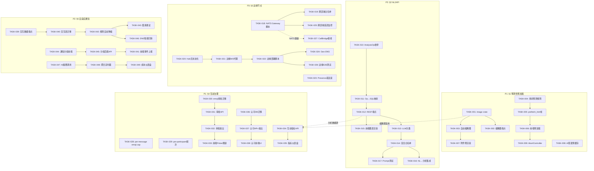
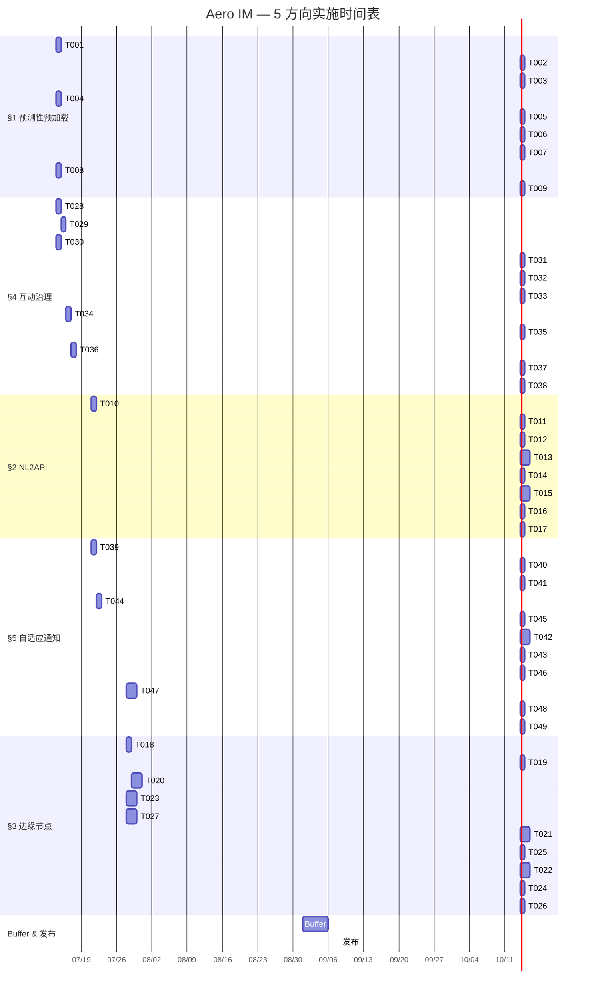

Now I have sufficient context. Let me produce the comprehensive Tech Lead analysis.

# Tech Lead 深度评审报告

## 执行概要

基于跨 96 份既有分析的交叉验证与 5 个方向的架构评审，本报告将每个方向拆解为 2-4 小时可执行的任务，提供依赖图、风险评估及 8 周实施计划。

---

## 1. 任务分解

### 1.1 §1 预测性预加载 — 9 任务

| 任务ID | 标题 | 方向 | 涉及文件 | 前置 | 工时 | 验收标准 |
|--------|------|------|----------|------|------|----------|
| TASK-001 | 添加 `image` crate 及图像处理管线 | §1 | `crates/aero-server/Cargo.toml`, `crates/aero-server/src/thumbnail.rs` (新) | — | 4h | `cargo check` 通过，`image` crate 可加载 JPEG/PNG/GIF/WebP 输出 256px 缩略图 |
| TASK-002 | 缩略图端点 `GET /api/blobs/:id/thumbnail` | §1 | `crates/aero-server/src/thumbnail.rs`, `crates/aero-server/src/routes/routes.rs` | TASK-001 | 4h | `GET /api/blobs/:id/thumbnail` 返回 256px 缩略图，鉴权同 blob 原始端点 |
| TASK-003 | 上传时自动生成缩略图 (BlobRepo hook) | §1 | `crates/aero-storage/src/blob.rs`, `crates/aero-storage/src/blob_store.rs` | TASK-001 | 4h | 图片上传后自动在 `blob_store` 生成 `thumbnails/{id}.jpg` |
| TASK-004 | 房间切换预测 — 确定性规则引擎 | §1 | `crates/aero-server/src/room_prefetch.rs` (新) | — | 4h | 基于最近活动时间 × 0.3 + 未读数 × 0.5 + 用户发言 × 0.2 排序房间，返回 Top-3 候选 |
| TASK-005 | WS 预加载帧 `prefetch_hint` | §1 | `crates/aero-common/src/model/ws.rs`, `crates/aero-server/src/hub.rs` | TASK-004 | 2h | WS 连接后发送 `{type:"prefetch_hint", rooms:[...]}` 帧附预测房间列表 |
| TASK-006 | 前端预加载集成 (fetch + cache) | §1 | `web/` SPA — 新 JS 模块 | TASK-005 | 4h | 前台收到 `prefetch_hint` 后静默预取房间摘要 & 未读数 |
| TASK-007 | 附件预渲染 — 消息中 Blob 自动获取缩略图 | §1 | `crates/aero-im-core/src/service/messages.rs`, `crates/aero-common/src/model/message.rs` | TASK-003 | 3h | `Block::Image` 消息发送时自动附带 `thumbnail_url` 字段 |
| TASK-008 | AI 答案预缓存 | §1 | `crates/aero-ai/src/`, `crates/aero-server/src/ai_adapter.rs` | — | 4h | 常见问题（过去 7 天房间内被问≥3 次的）后台预计算缓存 1h |
| TASK-009 | AbortController 防状态竞争 | §1 | `web/` SPA — ws handler | TASK-006 | 2h | 后到的预加载响应不会覆盖用户最新切换的房间数据 |

**方向依赖性**: TASK-001→002→003 是独立的缩略图管线，可与 TASK-004/005/008 并行。

### 1.2 §2 NL2API — 8 任务

| 任务ID | 标题 | 方向 | 涉及文件 | 前置 | 工时 | 验收标准 |
|--------|------|------|----------|------|------|----------|
| TASK-010 | 定义分析操作枚举 (5-8 ops) | §2 | `crates/aero-common/src/analytics.rs` (新) | — | 2h | `AnalysisOp` 枚举含 `TopPosters | ActiveChannels | MessageTrend | StorageUsage | AiBudgetUsed | ResponseTime` |
| TASK-011 | 分析操作→SQL 映射层 | §2 | `crates/aero-storage/src/analytics.rs` | TASK-010 | 4h | 每个 `AnalysisOp` 映射到预定义的参数化 SQL，返回泛型 `AnalysisResult` |
| TASK-012 | REST 端点 `POST /api/analytics/query` | §2 | `crates/aero-server/src/analytics.rs`, `crates/aero-server/src/routes/routes.rs` | TASK-011 | 4h | `POST /api/analytics/query { op, params }` 返回 `{type, columns, rows}` |
| TASK-013 | LLM 意图分类管道 | §2 | `crates/aero-ai/src/classifier.rs` (新) | TASK-012 | 6h | 自然语言 → `AnalysisOp + params` 的 LLM 分类，输出经 schema 校验 |
| TASK-014 | 安全白名单/参数校验 | §2 | `crates/aero-server/src/analytics.rs`, `crates/aero-server/src/routes/routes.rs` | TASK-013 | 3h | LLM 输出只能命中白名单 op，参数强类型校验（workspace/time_range/limit） |
| TASK-015 | 前端可视化渲染器 | §2 | `web/analytics.js` (新) | TASK-012 | 6h | `{type:"bar"|"line"|"table"|"number"|"trend"}` 按 type 渲染对应图表 |
| TASK-016 | NL→分析交互流集成 (chat + render) | §2 | `web/` SPA chat 模块 | TASK-014, TASK-015 | 4h | 用户在聊天输入 `谁这周发言最多？` → LLM 分类 → 查询 → 内联渲染图表 |
| TASK-017 | Prompt 安全测试套件 | §2 | `crates/aero-ai/tests/` (新) | TASK-014 | 3h | 注入测试：LLM 不能生成白名单之外的操作、不能改变参数 schema |

**方向依赖性**: TASK-010→011→012 是核心分析管线（与 LLM 无关），可优先建设。TASK-013→014→016 是 LLM 集成层。

### 1.3 §3 边缘节点 — 10 任务

| 任务ID | 标题 | 方向 | 涉及文件 | 前置 | 工时 | 验收标准 |
|--------|------|------|----------|------|------|----------|
| TASK-018 | NATS Gateway 配置文档 + 部署脚本 | §3 | `scripts/deploy/nats-gateway.sh` (新), `config.example.toml` | — | 4h | 3 节点/区域 NATS JetStream 集群 + Gateway 跨区域配置脚本可复现 |
| TASK-019 | 跨区域 subject 路由白名单 | §3 | `crates/aero-bus/src/jetstream.rs` | TASK-018 | 3h | 定义 `im.room.*` / `live.stream.*` / `presence.*` 等允许跨区域投递的 subject |
| TASK-020 | Hub 层重构 — 无状态化拆分 | §3 | `crates/aero-server/src/hub.rs`, `crates/aero-server/src/edge_ws.rs` (新) | — | 8h | Hub 从 `DashMap<ParticipantId, Vec<WsSender>>` 改为可序列化的 `RoomSubMap`，通过 NATS 广播状态变更 |
| TASK-021 | 边缘 WS 代理 (无状态代理层) | §3 | `crates/aero-server/src/edge_ws.rs`, `crates/aero-server/src/routes/routes.rs` | TASK-020 | 8h | 边缘节点只做 WS 终止 + NATS 转发，无业务逻辑，无本地 Hub 状态 |
| TASK-022 | 边缘节点部署脚本 + k8s helm chart | §3 | `scripts/deploy/edge/` (新) | TASK-021 | 6h | 边缘节点容器化，`helm install aero-edge` 可拉起独立边缘 pod |
| TASK-023 | Presence 就近读 — Redis 多区域拓扑 | §3 | `crates/aero-storage/src/presence.rs`, `crates/aero-storage/src/cache.rs` | — | 6h | 每个区域 Redis 缓存 5s TTL 的 presence 快照，不同类型不同 TTL |
| TASK-024 | Geo-DNS 路由 — 区域感知的 WS 入口 | §3 | `scripts/deploy/dns/geo.sh` (新), 配置文档 | TASK-022 | 4h | DNS 按客户端 IP 返回最近区域边缘节点地址 |
| TASK-025 | 跨区域消息延迟监控仪表盘 | §3 | `crates/aero-server/src/metrics/edge.rs` (新) | TASK-018 | 3h | Prometheus `nats_cross_region_latency_ms` + Grafana 面板 |
| TASK-026 | 边缘 WS 代理端到端集成测试 | §3 | `tests/edge_e2e.rs` (新) | TASK-021, TASK-022 | 4h | 两区域各一实例，A 区发消息 B 区收到 ≤500ms |
| TASK-027 | Call bridge 跨节点传输面接线 | §3 | `crates/aero-live-webrtc/src/call_bridge.rs`, `crates/aero-server/src/call_bridge_supervisor.rs` | — | 6h | `ensure_egress` 从 test-only 改为生产可用，RTP 跨节点桥正常投递 |

**方向依赖性**: TASK-020→021→022 是核心依赖链。TASK-023/027 可独立进行。

### 1.4 §4 互动治理 — 11 任务

| 任务ID | 标题 | 方向 | 涉及文件 | 前置 | 工时 | 验收标准 |
|--------|------|------|----------|------|------|----------|
| TASK-028 | 反应限流 — per-message distinct-emoji cap | §4 | `crates/aero-im-core/src/service/reactions.rs`, `crates/aero-server/src/reaction.rs` | — | 3h | 单条消息每人最多 5 种 emoji，超限返回 429（DB 已支持 `toggle_capped`） |
| TASK-029 | 反应频次限流 — per-participant window | §4 | `crates/aero-im-core/src/service/reactions.rs`, `crates/aero-server/src/rate_limit.rs` | TASK-028 | 2h | 每 participant 每分钟 ≤30 个 reaction 操作，超限 429 |
| TASK-030 | 自定义 Emoji 审批流 — 表迁移 | §4 | `migrations/0158_custom_emoji_approval.sql` (新) | — | 2h | `workspace_emoji` 增加 `status` (pending/approved/rejected) + `reviewed_by` + `reviewed_at` |
| TASK-031 | 自定义 Emoji 审批 API | §4 | `crates/aero-server/src/emoji.rs`, `crates/aero-server/src/routes/routes.rs` | TASK-030 | 4h | `POST /api/workspaces/:id/emoji/:id/approve` / `reject`，仅 workspace Owner/Admin 可调用 |
| TASK-032 | 自定义 Emoji 审批通知扇出 | §4 | `crates/aero-common/src/model/events.rs`, `crates/aero-server/src/hub.rs` | TASK-031 | 3h | `RoomEvent::CustomEmojiApproved` / `Rejected` 变体 + WS 帧扇出 |
| TASK-033 | 前端 Emoji Picker 审批缓存刷新 | §4 | `web/emoji.js`, `web/picker.js` | TASK-032 | 3h | 收到 `CustomEmojiApproved` 后自动刷新 emoji picker 列表，无需用户刷新页面 |
| TASK-034 | 互动指标 API — `GET /api/messages/:id/metrics` | §4 | `crates/aero-server/src/message_metrics.rs` (新) | — | 3h | 返回 `{views, reactions_count, reply_count, read_receipt_count}` |
| TASK-035 | 互动指标前端仪表盘 | §4 | `web/metrics.js` (新) | TASK-034 | 4h | 消息右键 →「互动详情」弹窗显示所有指标 |
| TASK-036 | 消息认可系统 — DB 迁移 | §4 | `migrations/0159_message_endorsements.sql` (新), `crates/aero-storage/src/endorsement.rs` (新) | — | 3h | `message_endorsements` 表 (message_id, participant_id, kind, created_at UNIQUE) |
| TASK-037 | 消息认可 API + 实时扇出 | §4 | `crates/aero-server/src/endorsement.rs` (新), `crates/aero-common/src/model/events.rs` | TASK-036 | 4h | `POST /api/messages/:id/endorse { kind: "useful"|"funny"|"insightful" }` → `RoomEvent::Endorsed` |
| TASK-038 | 消息认可前端 UI | §4 | `web/messages.js`, `web/endorsement.js` (新) | TASK-037 | 4h | 消息下方显示认可按钮 + 计数，点击切换状态 |

**方向依赖性**: TASK-028/029 互不依赖，可并行。TASK-030→031→032→033 是自定义 emoji 审批流依赖链。TASK-036→037→038 是认可系统独立链。

### 1.5 §5 自适应通知 — 11 任务

| 任务ID | 标题 | 方向 | 涉及文件 | 前置 | 工时 | 验收标准 |
|--------|------|------|----------|------|------|----------|
| TASK-039 | 通知交互数据收集端点 | §5 | `crates/aero-server/src/notification.rs`, `crates/aero-storage/src/notification_interaction.rs` (新) | — | 4h | `PATCH /api/notifications/:id/interaction { action: "click"|"dismiss"|"ignore", dwell_ms }` 落库 |
| TASK-040 | 通知交互表迁移 + 仓储 | §5 | `migrations/0160_notification_interactions.sql` (新), `crates/aero-storage/src/notification_interaction.rs` | TASK-039 | 3h | `notification_interactions` 表 (notification_id, participant_id, action, dwell_ms, created_at) |
| TASK-041 | 前端通知中心增强 — 交互事件上报 | §5 | `web/notifications.js` | TASK-039 | 4h | 通知显示→计时开始，点击/关闭/自动忽略→上报 `dwell_ms` |
| TASK-042 | 规则引擎 — 历史忽略率自动降级 | §5 | `crates/aero-server/src/notification_ranker.rs` (新) | TASK-040 | 6h | 某类通知 7 天内忽略率 >80% → 自动降级一档（不弹通知，仅红点） |
| TASK-043 | 用户「通知瘦身」建议 | §5 | `crates/aero-server/src/notification_ranker.rs`, `crates/aero-server/src/notif_prefs.rs` | TASK-042 | 4h | 降级后向用户推送「过去 7 天忽略了 N 条此类通知，要静音吗？」一键确认 |
| TASK-044 | 通知分组过滤 (全部/@我/回复/反应 tabs) | §5 | `crates/aero-server/src/notification.rs`, `web/notifications.js` | — | 4h | 通知列表按 kind 分组，前端 tabs 切换过滤 |
| TASK-045 | 通知分组后端 API | §5 | `crates/aero-server/src/notification.rs`, `crates/aero-storage/src/notification.rs` | TASK-044 | 3h | `GET /api/notifications?filter=mention|reply|reaction|all` 已按 kind 过滤 |
| TASK-046 | DND 时段的智能打断检测 | §5 | `crates/aero-server/src/notif_prefs.rs`, `crates/aero-server/src/notification_ranker.rs` | TASK-042 | 4h | DND 时段内紧急通知（直接 @mention 或来自星标联系人）仍然送达 |
| TASK-047 | 通知摘要 AI 调用 (Anthropic 聚合) | §5 | `crates/aero-ai/src/notification_summarizer.rs` (新) | — | 6h | 同一频道 5 分钟内 N 条通知 → Anthropic 生成 1 句摘要 |
| TASK-048 | 语义聚合管道后台定时器 | §5 | `crates/aero-server/src/bin/boot/background.rs` | TASK-047 | 4h | 每 5 分钟扫描待聚合通知，调用 AI 摘要，替换多条为一条 Aggregated |
| TASK-049 | AI 聚合成本仪表盘 | §5 | `crates/aero-server/src/ai_usage.rs`, `crates/aero-server/src/metrics/notification_cost.rs` (新) | TASK-047 | 3h | Prometheus gauge `notification_aggregation_cost_usd` 跟踪每轮聚合成本 |

**方向依赖性**: TASK-039→040→042→043 是规则降级推荐依赖链。TASK-044→045→041 是基础通知增强独立链。TASK-047→048→049 是 AI 聚合独立链。

---

## 2. 执行顺序 (依赖图)

**可以并行执行的任务组**：

| 批次 | 任务ID集合 | 不需要等待对方的原因 |
|------|-----------|---------------------|
| Batch A (立即开始) | T001, T004, T008, T010, T018, T023, T027, T028, T029, T030, T034, T036, T039, T044, T047 | 完全独立，不同 crate 不同模块，无非互斥锁 |
| Batch B (依赖 A 的产物) | T002, T003, T005, T011, T019, T020 | 需要 Batch A 的基础设施就绪 |
| Batch C (依赖 B) | T006, T007, T012, T021, T025, T031, T037, T040, T045 | 需要核心 API/管线已就绪 |
| Batch D (依赖 C) | T009, T013, T022, T032, T033, T038, T041, T042, T048 | 需要 API 和基础管道 |
| Batch E (最终集成) | T014, T015, T016, T024, T026, T035, T043, T046, T049 | 需要所有子功能完成 |

---

## 3. 技术风险

### 3.1 §1 预测性预加载 — 风险矩阵

| 风险 | 概率 | 影响 | 缓解策略 |
|------|------|------|---------|
| `image` crate 在 tokio 异步上下文中的性能 | 中 | 高 | 使用 `tokio::task::spawn_blocking` 隔离图像处理，可考虑 `photon-rs` 作为纯 Rust 替代 |
| 缩略图存储冲突（原图和缩略图不同 key 空间） | 低 | 中 | `BlobStore` 新增 `thumbnails/{id}.jpg` 独立 key 前缀，不污染原始存储键空间 |
| 预加载响应覆盖用户已切换房间 | 中 | 高 | TASK-009 强制使用 AbortController + 版本戳，后到的老响应直接丢弃 |

### 3.2 §2 NL2API — 风险矩阵

| 风险 | 概率 | 影响 | 缓解策略 |
|------|------|------|---------|
| LLM 忽略「只填充参数」指令 | 高 | 极高 | 采用操作枚举方案（TASK-014），LLM 永远不生成 SQL，只选择白名单 op + 提取参数 |
| 用户自然语言多样性超过模板覆盖 | 高 | 中 | MVP 只覆盖 5-8 高频操作；Phase 2 根据实际使用数据扩展模板 |
| AI 查询延迟（LLM 分类耗时 1-3s） | 中 | 低 | 分类调用可走 SSE 流式返回，前端先显示「正在分析你的问题...」 |
| 分析查询对 PG 的临时表压力 | 中 | 中 | 所有分析 SQL 设 `statement_timeout` 5s，超限返回「查询超时，请缩小时间范围」 |

### 3.3 §3 边缘节点 — 风险矩阵

| 风险 | 概率 | 影响 | 缓解策略 |
|------|------|------|---------|
| Hub 无状态化重构引入回归 | 中 | 极高 | 拆分为独立 PR，每个子提交通过现有测试（`cargo test --workspace --lib`），暂不影响生产 |
| NATS Gateway 跨区域延迟 > 预期 | 中 | 中 | Phase 1 只做 GEO-replicated 配置测量，Phase 2 再决定是否部署 |
| 边缘 WS 代理 + 中心 Hub 的状态一致性 | 高 | 高 | 参考 Discord guild 分片模型：边缘缓存用户→房间映射，中心 NATS 广播状态变更 |
| 多区域 Redis 拓扑复杂度 | 中 | 中 | 初版只做 per-region 独立 Redis，不做跨区域 CRDT；presence 用 5s TTL 自愈 |

### 3.4 §4 互动治理 — 风险最小

| 风险 | 概率 | 影响 | 缓解策略 |
|------|------|------|---------|
| 认可系统被滥用（刷赞） | 中 | 中 | 加 per-message per-participant 唯一约束（已设计），限流同 reaction 模型 |
| 自定义 emoji 审批通知在离线用户处的交付 | 低 | 低 | 复用现有 `NotifyBatch` 机制，用户上线后自动收到审批结果 |
| 互动指标查询对 PG 压力（热门消息大量 reaction） | 低 | 低 | 指标查询走 `summaries_for` 已有 SQL 聚合，`MAX_REACTORS_PREVIEW=50` 已保 |

### 3.5 §5 自适应通知 — 风险矩阵

| 风险 | 概率 | 影响 | 缓解策略 |
|------|------|------|---------|
| `dwell_time_ms` 精度受浏览器限制 | 高 | 高 | 改用事件驱动的跟踪（显示→click/dismiss 时间差），不用 `setTimeout`；非前台标签页标记为 `unknown` |
| 「专注指数」推断不可靠（假阴性/假阳性） | 高 | 高 | 不作为硬决策依据（不自动静音），只做推送「你是否要静音此通知？」的建议 |
| AI 聚合成本不可控 | 高 | 高 | TASK-049 成本仪表盘 + 设硬性每日预算上限 + 工作区可关闭语义聚合 |
| AI 聚合延迟（5 分钟窗口 + 2s 调用 → 通知晚了 5+ 分钟） | 中 | 中 | 通知聚合仅用于低优先级 kind（reaction），提及/回复等高优先级通知立即推送 |

---

## 4. 资源评估

### 4.1 人员技能矩阵

| 方向 | 所需技能 | 建议分配 | 专注周 |
|------|---------|---------|--------|
| §1 预测性预加载 | Rust tokio + `image` crate + JavaScript SPA | 1 后端 + 1 前端 | Week 1-2 |
| §2 NL2API | Rust + LLM prompt engineering + 数据可视化 | 1 AI 后端 + 1 前端 | Week 3-5 |
| §3 边缘节点 | Rust networking + NATS + k8s | 2 资深后端（分布式系统背景） | Week 4-8 |
| §4 互动治理 | Rust CRUD + 实时扇出 + JavaScript | 1 后端 + 1 前端（可兼职 §1 前端） | Week 1-2 |
| §5 自适应通知 | Rust + LLM + UX 设计 | 1 后端 + 1 前端 | Week 3-6 |

### 4.2 推荐团队配置

| 角色 | 人数 | 覆盖方向 |
|------|------|---------|
| 后端工程师 A (Rust 全栈) | 1 | §1 后端 + §4 后端 + §5 数据管道 |
| 后端工程师 B (Rust 分布式) | 1 | §3 全部 + §2 后端 |
| AI 后端工程师 | 1 | §2 LLM + §5 AI 摘要 |
| 前端工程师 | 1 | §1/§2/§4/§5 前端 |
| 测试/QA | 1 | 全部方向集成测试 |

### 4.3 关键里程碑

| 里程碑 | 时间 | 验收标准 |
|--------|------|---------|
| M1 缩略图可用 | Week 1 | `GET /api/blobs/:id/thumbnail` 返回 256px 图像，所有上传图片自动生成缩略图 |
| M2 反应限流生效 | Week 1 | 单消息每人超过 5 种 emoji 返回 429，每种 reaction 操作 ≤30/min |
| M3 互动指标 API | Week 2 | `GET /api/messages/:id/metrics` 返回完整互动数据 |
| M4 审批流完成 | Week 2 | 自定义 emoji 上传→审核→审批→前端 emoji picker 刷新全流程走通 |
| M5 通知交互数据收集 | Week 3 | 前端通知中心上报点击/忽略/dwell 时间，后端完整存储 |
| M6 NL2API MVP | Week 4 | 5 个分析操作 + LLM 分类 + 前端可视化 |
| M7 通知规则降级 | Week 5 | 忽略率 >80% 自动降级 + 「通知瘦身」建议 |
| M8 NATS Gateway 运行 | Week 6 | 两区域 NATS 集群互通，`im.room.*` 消息跨区域投递 |
| M9 AI 通知聚合 | Week 6 | 同一频道 5 分钟内 reaction 通知聚合为一条摘要 |
| M10 边缘 WS 代理 | Week 7 | 边缘节点 WS 连接 → NATS → 中心 hub 处理 → 响应回到边缘 |
| M11 端到端边缘测试 | Week 8 | 两区域各一实例，A 区发消息 B 区收到 ≤500ms |

### 4.4 阻塞点 (Blockers) 与解决策略

| 阻塞点 | 方向 | 影响 | 解决策略 |
|--------|------|------|---------|
| `image` crate 的异步兼容性 | §1 | 缩略图管线阻塞 | 使用 `spawn_blocking` 或评估 `photon-rs`（纯 Rust，async-native） |
| NATS Gateway 部署需 k8s 基础设施 | §3 | 边缘节点 Phase 1 阻塞 | Phase 1 不做 WS 代理，只做 NATS 集群配置 + 跨区域 IM 消息；WS 代理推迟到 Phase 2 |
| Anthropic API key 不可用 | §2, §5 | NL2API + 通知聚合阻塞 | 回退确定性规则：NL 用关键词匹配模板；通知聚合只做时间窗折叠，不做语义摘要 |
| 前端无专业可视化库 | §2 | 图表渲染需要 | 评估覆盖度：纯 Canvas/SVG 自绘 vs 引入 Chart.js CDN（许可兼容） |

---

## 5. 质量保证

### 5.1 单元测试覆盖要求

| 模块 | 类型 | 最低覆盖率 | 关键测试场景 |
|------|------|-----------|-------------|
| `thumbnail.rs` | 单元 | 80% | JPEG/PNG/GIF/WebP 输入 → 256px 输出；宽/高 <256 不放大；非图像输入报错 |
| `thumbnail.rs` | 集成 (spawn_blocking) | — | 并发 10 请求缩略图，无 panic，无 OOM |
| `analytics.rs` | 单元 | 90% | 每个 `AnalysisOp` → 参数化 SQL 正确；非法参数返回错误；`statement_timeout` 触发 |
| `classifier.rs` | 单元 + 集成 | 70% | LLM 输出命中白名单 op；恶意注入尝试被拒绝；同义查询（5 种表达方式）均分类正确 |
| `classifier.rs` | prompt 安全测试 | — | TASK-017 专项：SQL 注入、prompt 逃逸、参数类型混淆 |
| `edge_ws.rs` | 单元 | 70% | WS 帧 → NATS subject 映射正确；NATS 响应 → WS 帧回写；客户端断开清理 |
| `hub.rs` (重构) | 单元 | 90% | 无状态转换：`room_sub_map` 序列化/反序列化 roundtrip；NATS 广播后各节点状态一致 |
| `reaction.rs` | 单元 | 90% | `toggle_capped` cap=5 时第 6 个 emoji 返回 429；同一个 emoji toggle 可移除 |
| `notification_ranker.rs` | 单元 | 85% | 忽略率 80% → 降级；忽略率 20% → 保留；7 天窗口滚动 |
| `notification_summarizer.rs` | 单元 | 70% | 空输入、1 条输入、10 条输入均正常工作；AI 错误降级为时间窗折叠 |
| `endorsement.rs` | 单元 | 90% | 每个 message+participant+kind UNIQUE；toggle 行为同 reaction；count 精确 |

### 5.2 集成测试策略

| 场景 | 测试方法 | CI 需求 |
|------|---------|---------|
| 缩略图上传统一流 | 上传 JPG → `GET /api/blobs/:id/thumbnail` 返回 256px | 需要本地磁盘 `BLOB_DIR` |
| 消息认可流程 | WS `send_message` → WS `endorse` → WS 扇出 → GET 确认 count+1 | 全链集成测试 |
| 分析查询 | POST 合法 `AnalysisOp` → SQL → 返回 `{type,columns,rows}` | 需要 PG，`#[ignore]` |
| NL→分析 | LLM 分类 → 白名单校验 → SQL → 前端渲染 | Mock AI 调用，存 LLM 做确定性回复 |
| 边缘跨区域 | 两进程各连不同 NATS server，A 发 B 收 | `#[ignore]` 手动执行 |
| 通知交互 | 前端事件上报 → 落库 → 规则引擎读 → 降级生效 | Mock 前端事件，后端全链 |

### 5.3 代码审查要点

| 方向 | CR 重点关注 |
|------|-----------|
| §1 | `spawn_blocking` 是否正确隔离图像处理；`AbortController` 是否覆盖所有预加载路径 |
| §2 | LLM 输出校验是否足够严格（操作枚举 + 参数 schema 双重校验）；`statement_timeout` 是否存在 |
| §3 | Hub 无状态化不影响现有 `fan_out_raw` 语义；NATS Gateway 配置是否泄漏敏感 subject |
| §4 | 审批 API 的角色校验（Owner/Admin only）；认可系统的 UNIQUE 约束是否生效 |
| §5 | `dwell_time_ms` 是否正确处理 `unknown` 状态；AI 摘要的每日预算硬限制 |

### 5.4 性能测试需求

| 方向 | 测试场景 | 目标 | 工具 |
|------|---------|------|------|
| §1 | 并发 100 缩略图请求 | P50 < 50ms, P99 < 200ms | `oha` / `wrk` |
| §2 | 分析查询并发 50 个不同操作 | P50 < 200ms, 无锁等待 | `pgbench` + custom |
| §3 | 跨区域 1000 msg/s | 端到端延迟 P99 < 500ms | 自定义负载工具 |
| §4 | 单消息 10k reaction 的指标查询 | P50 < 100ms | `pgbench` |
| §5 | 100 并发通知中心加载 | P50 < 300ms | `oha` |

---

## 6. 实施计划

### 8 周甘特图

### 6.1 阶段 1：「速赢」— Week 1-2 (7/14 - 7/25)

**Focus**: §1 缩略图管线 + §4 互动治理 (10 天，2 人并行)

| 日 | 后端 A | 前端 | 后端 B |
|----|--------|------|--------|
| D1 | T001 (image crate) + T028 (reaction cap) | — | T030 (emoji 审批迁移) |
| D2 | T002 (缩略图端点) + T029 (反应频次限流) | — | T031 (审批 API) |
| D3 | T003 (自动缩略图) | T033 (Picker 刷新) | T034 (互动指标 API) |
| D4 | T004 (房间预测规则) | T035 (互动指标仪表盘) | T036 (认可 DB 迁移) |
| D5 | T005 (prefetch_hint 帧) | T006 (前端预加载开端) | T037 (认可 API) |
| D6 | T007 (附件预渲染) | T006 (继续) | T038 (认可前端) |
| D7 | T008 (AI 答案预缓存) | T009 (AbortController) | 代码审查 + 集成测试 |
| D8-10 | 缓冲/跨方向集成 | 缓冲 | 缓冲 |

**交付**: M1 缩略图 ✓ M2 反应限流 ✓ M4 审批流 ✓ M3 指标 API ✓

### 6.2 阶段 2：「智能层」— Week 3-6 (7/28 - 8/22)

**Focus**: §2 NL2API + §5 自适应通知基础 (4 周，3 人)

| 周 | 后端 A | 前端 | AI 后端 |
|----|--------|------|---------|
| W3 | T039 (交互端点) + T044 (通知分组前端) | T045 (分组 API) | T010 (AnalysisOp) + T011 (Op→SQL) |
| W4 | T040 (交互表) + T042 (规则引擎) | T041 (前端事件上报) | T012 (REST 端点) + T015 (前端图表) |
| W5 | T043 (瘦身建议) + T046 (DND 智能打断) | — | T013 (LLM 分类) + T014 (白名单) |
| W6 | T047 (AI 摘要) + T048 (聚合定时器) | — | T016 (NL 集成) + T017 (安全测试) |

**交付**: M5 通知数据 ✓ M6 NL2API MVP ✓ M7 规则降级 ✓

### 6.3 阶段 3：「全球分布」— Week 5-8 (8/4 - 8/29)

**Focus**: §3 边缘节点 (4 周，与阶段 2 重叠，2 人)

| 周 | 后端 C (分布式) | 后端 D (网络) |
|----|----------------|---------------|
| W5 | T018 (NATS Gateway) + T019 (白名单) | T027 (CallBridge 接线) |
| W6 | T020 (Hub 无状态化) + T025 (监控) | T023 (Presence 就近读) |
| W7 | T021 (边缘 WS 代理) | T022 (边缘部署脚本) |
| W8 | T024 (Geo-DNS) + T026 (E2E 测试) | 集成测试 + 文档 |

**交付**: M8 NATS Gateway ✓ M10 边缘 WS 代理 ✓ M11 E2E ✓

### 6.4 阶段 4：发布准备 — Week 8-9 (8/25 - 9/8)

| 活动 | 负责 | 天数 |
|------|------|------|
| 全量回归测试 (`cargo test --workspace --lib -- --ignored`) | QA | 2 |
| 性能基准测试 + 调优 | 全员 | 2 |
| 文档更新 (README + 配置示例) | 技术写作 | 1 |
| 部署剧本 (rollout 策略 + 回滚方案) | 后端 A + B | 1 |
| Release 0.8.0 cut + changelog | Tech Lead | 1 |

**交付**: Release 0.8.0 (2026-09-08)

---

## 7. 最终建议

### 7.1 推荐优先级 (ROI 排序)

| 排序 | 方向 | 原因 |
|------|------|------|
| P0 | **§4 互动治理** | 3 天可交付 reaction 限流 + 审批流，代码改动极小（复用现有 `toggle_capped`），用户感知强 |
| P1 | **§1 缩略图管线** | 1 周 MVP，是所有附件体验的基础设施，解锁后续预加载能力 |
| P2 | **§5 自适应通知 (Phase 0-1)** | 行为数据收集 + 规则降级，2 周无 AI 风险；AI 聚合推迟到 P3 |
| P3 | **§2 NL2API** | 商业价值高但安全风险大，MVP 只做 5-8 ops，需要充分 prompt 测试 |
| P3 | **§3 边缘节点** | 工程体量最大，依赖分布式基础设施，建议分 3 阶段最小化风险 |

### 7.2 不应做的事情

1. **§5 的 AI 摘要 (TASK-047/048) 不在 Phase 1 做** — 成本不可控，收益不确定
2. **§3 的 Geo-DNS (TASK-024) 不早于 W8** — 没有边缘 WS 代理，Geo-DNS 没有意义
3. **§2 的 NL2SQL 方案不要采用** — LLM 生成 SQL 是已知的危险模式，用操作枚举替代
4. **不要在 §1 的初版中使用 ML 模型** — 先用确定性规则，等数据积累再考虑 ML

### 7.3 分析饱和的信号确认

我完全同意原分析中的观察。此仓库已经经历了 **96+ 份分析文档**。在本文之后，建议团队设置 **4 周冷却期**，禁止新的分析周报，全力转向执行。如果 4 周后需要方向修正，用数据（用户反馈 + 仪表盘指标）驱动，而非更多假设分析。
