我已详细阅读该分析文档（19,653 字节，5 个扩展方向）。以下从 Tech Lead 视角进行完整的技术实现和项目管理分析。

---

# Tech Lead 分析报告：5 个高价值扩展方向

> **分析基准**：`docs/requirements/round9-scan-5-extensions-2026-07-10.md`
> **代码库**：Aero IM（16 crate / 157 migrations / ~143K Rust + ~9K JS SPA）
> **角色**：Tech Lead — 关注可交付性、工程实践、风险管控

---

## 1. 任务分解

### 1.1 方向一：AI Prompt 自定义与管理系统（P1）

| 任务 ID | 标题 | 涉及文件 | 前置 | 工时(h) | 验收标准 |
|---------|------|---------|------|---------|---------|
| TASK-101 | 设计 `prompt_templates` 表 + 迁移 | `migrations/NNNN_prompt_templates.sql` | — | 2 | `CREATE TABLE prompt_templates` 含 `(id, workspace_id, scope, task_kind, template_text, variables JSONB, version, is_active, created_by, created_at)`，有合适索引和 FK |
| TASK-102 | 实现 `PromptTemplateRepo` CRUD | `crates/aero-storage/src/prompt_template.rs`；`lib.rs` 注册 | TASK-101 | 3 | `find_active(workspace_id, scope, task_kind)`、`upsert`（版本递增）、`rollback(workspace_id, kind, version)`、`list_versions` 均通过 db_test |
| TASK-103 | 从硬编码迁移到模板加载——AI Service 改造 | `crates/aero-ai/service/service_impl.rs`；所有含 `const SYSTEM_PROMPT` 的模块 | TASK-102 | 4 | 每个 AI 能力（answer/summarize/moderate/rewrite/translate/smart_reply/agent_bot/call_recap/catchup/workspace_ask）均从 `PromptTemplateRepo::find_active` 加载，无 template 时回落硬编码默认值 |
| TASK-104 | Prompt 管理 REST API——CRUD + 回滚 | `crates/aero-server/src/ai_prompts.rs`；`routes.rs` merge；workspace admin 鉴权 | TASK-103 | 3 | `GET/PUT /api/workspaces/:id/ai/prompts`、`POST .../rollback`；仅 workspace Owner/Admin 可操作；CI authz_lint 通过 |
| TASK-105 | Prompt 管理 UI——工作区设置页 | `web/ai-prompts.html`（或整合进 settings）、`web/app.js` 路由、`web/styles.css` | TASK-104 | 4 | 工作区设置页面可见 prompt 列表，可编辑/保存/回滚；UI 对非 admin 不可见；eslint + web-check 通过 |
| TASK-106 | 模板变量注入系统 | `crates/aero-ai/service/prompt_vars.rs`；`service_impl.rs` 调用点 | TASK-103 | 3 | `PromptVars::new(workspace, user, room, date)`；`template.render(&vars)` 替换 `{{workspace_name}}`、`{{user_display_name}}`、`{{current_date}}`、`{{last_n_messages}}`；日志对 PII 脱敏 |
| TASK-107 | Prompt A/B 测试框架 | `migrations/NNNN_prompt_feedback.sql`；`crates/aero-storage/src/prompt_feedback.rs`；路由 + 评分采集 | TASK-104 | 4 | 同一 `task_kind` 支持多个 `is_active` 变体按 `(workspace_id, percent)` 分配流量；`prompt_feedback` 表采评分；`AiService` 在路由层分配变体 |
| TASK-108 | Prompt 工具定义安全锁 | `crates/aero-ai/service/service_impl.rs` 注入点 | TASK-106 | 2 | 工具定义段（tools JSON）从用户可编辑模板中剥离——标记为只读前缀；注入测试验证用户无法覆盖工具定义 |

**方向一小计**：25 工时（约 3 人·周）

---

### 1.2 方向二：数据灾备与业务连续性（P1）

| 任务 ID | 标题 | 涉及文件 | 前置 | 工时(h) | 验收标准 |
|---------|------|---------|------|---------|---------|
| TASK-201 | `docker-compose` 增加 pg_backup sidecar | `docker-compose.yml`（新增 `pg_backup` 服务基于 `postgres:17` + cron） | — | 2 | `docker-compose up` 后 pg_backup 容器运行 cron，每日执行 `pg_dump`；backup 文件出现在 `./backups/` 目录 |
| TASK-202 | 实现 `backup.sh` + `restore.sh` + S3 上传 | `scripts/backup.sh`、`scripts/restore.sh` | TASK-201 | 3 | `backup.sh` 执行 `pg_dump --format=custom` → `openssl enc -aes-256-cbc` 加密 → `aws s3 cp`（如有 S3）→ 本地副本；`restore.sh` 接受 `--backup-file` 参数恢复；保留策略（7d+4w+12m）通过 `find -mtime` 实现 |
| TASK-203 | `aero-cli backup / restore` 子命令 | `crates/aero-cli/src/commands/backup.rs`；`main.rs` 注册 | TASK-202 | 3 | `aero-cli backup` 调用脚本并展示进度；`aero-cli restore --latest` / `--file path` 执行恢复；`aero-cli pitr --timestamp "..."` 占位（Phase B 实现） |
| TASK-204 | 配置 PG WAL 连续归档 + PITR | `docker-compose.yml` PG 配置段（`archive_mode=on`、`archive_command`）；`scripts/setup-pitr.sh` | TASK-201 | 4 | WAL 段每 ~5min 归档到 `./backups/wals/`（或 S3）；`aero-cli pitr --timestamp "2026-07-09 14:30:00"` 能恢复到指定时间点；测试用 throwaway PG 实例验证 PITR 准确性 |
| TASK-205 | 恢复演练自动化 | `scripts/dr-drill.sh`；CI cron job 配置 | TASK-202 | 3 | `dr-drill.sh` 在隔离 PG 实例全量恢复最新备份，运行 `cargo test -- --ignored`；`scripts/verify-backup.sh` 对备份运行 `pg_restore --list`；CI 每周触发 |
| TASK-206 | 跨区域 PG 流复制布局（设计+部署脚本） | `scripts/setup-replication.sh`；`docker-compose.dr.yml` | TASK-204 | 4 | async replica 在备区域启动 + WAL 流复制；`repmgr` 或 `patroni` 集群管理配置；故障切换脚本（`switchover.sh`）演练通过 |

**方向二小计**：19 工时（约 2.5 人·周）

---

### 1.3 方向三：消息草稿持久化 UX（P2）

| 任务 ID | 标题 | 涉及文件 | 前置 | 工时(h) | 验收标准 |
|---------|------|---------|------|---------|---------|
| TASK-301 | 实现 `saveDraft()`/`loadDraft()`/`deleteDraft()` 前端函数 | `web/app.js`（新增 3 个函数） | — | 2 | `saveDraft(roomId, blocks, replyTo)` 调用 `PUT /api/rooms/:id/draft`；`loadDraft(roomId)` 调用 `GET`；`deleteDraft(roomId)` 调用 `DELETE`；200/404 正确处理 |
| TASK-302 | composer input 绑去抖保存 + switchRoom 集成 | `web/app.js`（`switchRoom()`、`sendMessage()`、`composerInput` listener） | TASK-301 | 3 | 输入事件 300ms 去抖触发 `saveDraft`；`switchRoom()` 切前保存旧房间，切后加载新房间草稿；`composer submit` 成功后 `deleteDraft`；恢复 `replyTo` 目标 |
| TASK-303 | 草稿列表 UI——room list 中的草稿标记 | `web/app.js`（room list 渲染）、`web/styles.css`（草稿标记样式）、`web/drafts.js`（提取草稿逻辑） | TASK-302 | 3 | 有草稿的房间在侧边栏显示铅笔/草稿标记；点击带标记房间自动恢复；`GET /api/drafts`（`DraftRepo::list`）初始化时批量加载草稿状态 |
| TASK-304 | 离线感知草稿同步 | `web/app.js`（`navigator.onLine` 监听 + ws.js 连接状态联动） | TASK-301 | 2 | 网络断开时草稿暂存 `localStorage`；恢复连接后自动同步到服务端；发送失败时草稿不删除 |

**方向三小计**：10 工时（约 1.25 人·周）

---

### 1.4 方向四：冷热数据分层与归档（P2）

| 任务 ID | 标题 | 涉及文件 | 前置 | 工时(h) | 验收标准 |
|---------|------|---------|------|---------|---------|
| TASK-401 | 加 `messages.archived` 列 + `retention_sweep` 改造 | `migrations/NNNN_add_archived.sql`；`crates/aero-storage/src/sweep.rs`（`sweep_retention` → 设 `archived=TRUE` 而非 DELETE） | — | 3 | 迁移幂等；`retention_sweep` 对超 `retention_days + grace_period` 的消息设 `archived=TRUE`；默认查询 `WHERE archived=FALSE`；法务保全消息跳过 |
| TASK-402 | 归档 worker——PG→S3 管道 | `crates/aero-storage/src/archive_worker.rs`；`crates/aero-server/src/archive_worker.rs`（boot 启动）；`lib.rs` 注册 | TASK-401 | 4 | worker 轮询 `archived=TRUE AND stored_in_backend IS NULL`（`FOR UPDATE SKIP LOCKED`）；序列化消息+版本链+reactions 为 JSON Lines → `S3BlobStore::put`；成功后设 `stored_in_backend='s3://bucket/path'` 并从主表 DELETE；legal_hold 跳过 |
| TASK-403 | 归档查询端点 + 用户提示 | `crates/aero-server/src/archive_query.rs`；`routes.rs` merge；`web/search.js` UI 提示 | TASK-402 | 3 | `GET /api/rooms/:id/search?include_archived=true` 并行查 PG + S3；搜索 UI 显示「搜索当前数据（N 条）·也搜索归档数据（M 条）」；归档查询 RT 稍高但仍有界 |
| TASK-404 | 归档数据回滚保镖（30天延迟删除） | `crates/aero-storage/src/archive_worker.rs`（clean worker 分支） | TASK-402 | 2 | 标记 `archived=TRUE` 后 30 日内不物理删除；30 天后 clean worker 执行 DELETE（仍需检查 `is_held=FALSE`） |

**方向四小计**：12 工时（约 1.5 人·周）

---

### 1.5 方向五：本地开发体验（P2）

| 任务 ID | 标题 | 涉及文件 | 前置 | 工时(h) | 验收标准 |
|---------|------|---------|------|---------|---------|
| TASK-501 | 实现 `aero-cli dev setup/reset/seed` | `crates/aero-cli/src/commands/dev.rs`；`main.rs` 注册 | — | 4 | `aero-cli dev setup` = `docker-compose up -d` + `CREATE DATABASE IF NOT EXISTS` + `migrate` + `seed`；`dev reset` = `DROP DATABASE` + recreate + migrate + seed；`dev seed` 单独可跑 |
| TASK-502 | 种子数据生成器 | `crates/aero-cli/src/commands/dev/seed.rs`；`scripts/seed-data.sql`（后备） | TASK-501 | 3 | 创建 `admin@test.dev / password`、工作区「Demo」、频道 #general/#random/#dev、示例消息覆盖 text/code/file/mention/voice/card 类型、2 个测试用户、mock 直播流；数据非空检测跳过 |
| TASK-503 | 集成 `cargo-watch` 热重载 | `Makefile`（`dev-watch` target）；`.cargo/config.toml`（增量编译优化） | — | 2 | `make dev-watch` 启动 `cargo watch -w crates/aero-server/src -x "run --bin aero-server"`；排除 `web/` `target/`；首次编译后变更触发增量编译 ≤30 秒 |
| TASK-504 | OpenAPI 标注——核心路由 | `crates/aero-server/src/routes/`（各模块添加 `#[utoipa::path]`）；`crates/aero-server/src/openapi.rs` 增强 | — | 4 | 覆盖 10+ 核心路由（消息 CRUD、房间管理、搜索、AI）；utopath 标注通过编译；`openapi.json` 生成正确 |
| TASK-505 | 挂载 Swagger UI + 认证注入 | `crates/aero-server/src/api_docs.rs`；`routes.rs` merge；`web/swagger-inject.js`（CDN swagger-ui-bundle） | TASK-504 | 2 | `/api/docs` 展示 Swagger UI；Dev 模式下自动从 `localStorage` 读取 JWT 注入 `Authorization` 头；Try-it-out 功能可用 |
| TASK-506 | 开发仪表盘——运行时状态可视化 | `crates/aero-server/src/dev_dashboard.rs`；`web/dev-dashboard.js`；`web/dev-dashboard.html` | — | 4 | `/dev/dashboard` 仅 `AERO_DEV_MODE=1` 可用，绑定 `127.0.0.1`；显示 WS 连接数、NATS pending、缓存命中率、AI 预算、PG 连接池；SSE 实时日志流 |
| TASK-507 | Pre-commit 钩子自动化 | `scripts/install-hooks.sh`；`Makefile pre-commit`；`.githooks/pre-commit` | — | 2 | `scripts/install-hooks.sh` 安装 git hook 运行 `cargo check` + `clippy -D warnings` + `file-size-check.sh` + `web-check.sh`；`make pre-commit` 单命令跑全部本地检查 |

**方向五小计**：21 工时（约 2.6 人·周）

---

### 总计

| 方向 | 工时 | 建议开发周期 |
|------|------|-------------|
| 方向一 | 25h | 3 人·周 |
| 方向二 | 19h | 2.5 人·周 |
| 方向三 | 10h | 1.25 人·周 |
| 方向四 | 12h | 1.5 人·周 |
| 方向五 | 21h | 2.6 人·周 |
| **Σ** | **87h** | **约 11 人·周** |

---

## 2. 执行顺序与依赖图

```mermaid
graph TD
    %% ============ 方向三：草稿持久化（P2，立即执行） ============
    subgraph "Track A — 消息草稿持久化 [立即 1-2周]"
        T301[TASK-301: saveDraft/loadDraft/deleteDraft 前端函数]
        T302[TASK-302: composer 去抖保存 + switchRoom 集成]
        T304[TASK-304: 离线感知草稿]
        T303[TASK-303: 草稿列表 UI + room list 标记]
        
        T301 --> T302
        T302 --> T303
        T302 --> T304
    end

    %% ============ 方向五：开发体验（P2，立即执行） ============
    subgraph "Track B — 本地开发体验 Phase A [立即 1-2周]"
        T501[TASK-501: aero-cli dev setup/reset/seed]
        T502[TASK-502: 种子数据生成器]
        T507[TASK-507: Pre-commit 钩子]
        
        T501 --> T502
    end

    subgraph "Track B — 本地开发体验 Phase B-C [短期 2-4周]"
        T503[TASK-503: cargo-watch 热重载]
        T504[TASK-504: OpenAPI 标注-核心路由]
        T505[TASK-505: Swagger UI 挂载]
        T506[TASK-506: 开发仪表盘]
        
        T504 --> T505
    end

    %% ============ 方向二：灾备（P1，短期） ============
    subgraph "Track C — 数据灾备 Phase A [短期 2-4周]"
        T201[TASK-201: docker-compose pg_backup sidecar]
        T202[TASK-202: backup.sh + restore.sh + S3]
        T203[TASK-203: aero-cli backup/restore 子命令]
        
        T201 --> T202 --> T203
    end

    subgraph "Track C — 数据灾备 Phase B-D [中期 4-8周]"
        T204[TASK-204: WAL 归档 + PITR 配置]
        T205[TASK-205: 恢复演练自动化]
        T206[TASK-206: 跨区域流复制布局]
        
        T204 --> T205
        T204 --> T206
    end

    %% ============ 方向一：AI Prompt（P1，短期-中期） ============
    subgraph "Track D — AI Prompt 管理 Phase A [短期 2-4周]"
        T101[TASK-101: prompt_templates 表迁移]
        T102[TASK-102: PromptTemplateRepo CRUD]
        T103[TASK-103: AI Service 硬编码→模板迁移]
        
        T101 --> T102 --> T103
    end

    subgraph "Track D — AI Prompt 管理 Phase B-D [中期-长期 4-16周]"
        T104[TASK-104: Prompt REST API + 鉴权]
        T105[TASK-105: Prompt 管理 Web UI]
        T106[TASK-106: 模板变量注入系统]
        T108[TASK-108: 工具定义安全锁]
        
        T104 --> T105
        T103 --> T106
        T106 --> T108
        
        T107[TASK-107: Prompt A/B 测试框架]
        T103 -.-> T107
    end

    %% ============ 方向四：冷热分层（P2，中期） ============
    subgraph "Track E — 冷热数据分层 [中期 4-8周]"
        T401[TASK-401: archived 列 + retention_sweep 改造]
        T402[TASK-402: 归档 worker PG→S3]
        T403[TASK-403: 归档查询端点 + UI]
        T404[TASK-404: 30天回滚保镖]
        
        T401 --> T402 --> T403
        T402 --> T404
    end

    %% === 跨 Track 依赖 ===
    T103 -.->|需先迁移硬编码| T106
    T102 -.->|模板 repo 复用模式| T204
    T402 -.->|复用 S3BlobStore| T202
    
    %% === 可并行组标记 ===
    classDef immediate fill:#a8e6cf,stroke:#333,stroke-width:1px;
    classDef short fill:#ffd3b6,stroke:#333,stroke-width:1px;
    classDef medium fill:#ffaaa5,stroke:#333,stroke-width:1px;
    classDef long fill:#d5aaef,stroke:#333,stroke-width:1px;
    
    class T301,T302,T303,T304,T501,T502,T507 immediate;
    class T201,T202,T203,T101,T102,T103 short;
    class T204,T205,T206,T106,T108,T401,T402,T403,T404,T503,T504,T505,T506 medium;
    class T104,T105,T107 long;
```



### 并行组概览

| 并行组 | 包含任务 | 建议执行窗口 |
|--------|---------|-------------|
| **组1（立即）** | T301, T302, T303, T304, T501, T502, T507 | Week 1–2 |
| **组2（短期）** | T201, T202, T203, T101, T102, T103, T503, T504, T505, T506 | Week 2–4 |
| **组3（中期）** | T204, T205, T206, T401, T402, T403, T404, T106, T108 | Week 4–8 |
| **组4（长期）** | T104, T105, T107 | Week 8–16 |

**关键发现**：T103（AI Service 迁移）是方向一的**关键路径节点**——它阻塞 T104/T106/T107/T108。T104/T105（REST API + UI）虽在依赖图上接在 T103 后，但其实现可以与 T106/T108 并行，前提是 T103 完成了模板加载抽象层。

---

## 3. 技术风险

### 3.1 风险矩阵

| # | 风险描述 | 概率 | 影响 | 等级 | 缓解策略 |
|---|---------|------|------|------|---------|
| R1 | **T103（AI Service 迁移）重构范围蔓延**——10+ 模块的 prompt 硬编码需要逐个替换，每个都有不同的变量注入模式 | H | H | **严重** | 分 3 批替换：批1（answer/summarize/moderate）→ 批2（translate/rewrite/smart_reply/agent_bot）→ 批3（call_recap/catchup/workspace_ask）；每批独立 PR + 测试；T103 单独估计 4h 但可能需要 8h+ |
| R2 | **Rust 热重载与 `unsafe_code = "forbid"` 冲突**——部分 Rust live-reload 方案依赖 unsafe | M | M | **中等** | 方案 A：降级为 `cargo-watch`（安全，无 unsafe，推荐）；方案 B：局部 `#[allow(unsafe_code)]` 仅 dev profile；不追求真正热替换，15s 增量编译已可接受 |
| R3 | **归档 worker 与正在进行的消息写入竞态**——worker 读到的行在序列化过程中被编辑/删除 | M | H | **高** | 在事务内读取消息 + 全部版本链；归档后在 PG 端 CAS 检查 `updated_at` 是否变化；变化则放弃本次归档（下周期重试） |
| R4 | **S3 归档数据的 schema 演进**——6 个月后 `messages` 表加列，旧的 Parquet/JSONL 归档文件不兼容 | M | M | **中等** | 归档文件头部写入 schema 版本号（`archive_version: 1`）；查询时按版本决定字段映射；每年发布归档格式升级 |
| R5 | **备份加密密钥丢失**——加密的备份无法恢复 = 无备份 | L | H | **高** | 密钥保存在独立位置（非备份设备）；`aero-cli backup --init-key` 生成并打印恢复说明；文档强制要求密钥备份到密码管理器 |
| R6 | **Prompt A/B 测试带来的 AI 成本不可控**——多变体并行可能加倍 API 调用量 | M | M | **中等** | A/B 测试仅在 `is_active` 变体间路由，不增加总调用量；每个变体仍然是同一请求的单一调用；反馈采集是 out-of-band 异步上报 |
| R7 | **草稿内容过大——JSONB 存储和网络传输膨胀** | L | L | **低** | `composerInput.maxlength=8000` 已是硬限制；文件附件引用需额外限制（草稿最多含 5 个引用）；后端 `draft_repo.upsert` 验证 `content_json` 大小 <64KB |
| R8 | **API Playground（Swagger）暴露内部端点风险** | L | H | **高** | `api/docs` 仅在 `AERO_DEV_MODE=1` 时挂载；生产环境编译时 `#[cfg(debug_assertions)]` 守卫；Nginx 反向代理层额外过滤 |

### 3.2 依赖外部系统

| 方向 | 外部依赖 | 当前状态 | 风险等级 |
|------|---------|---------|---------|
| 灾备 | S3/MinIO（备份存储） | 已有 `S3BlobStore` 实现 | ✅ 低 |
| 灾备 | `pgBackRest` / `barman`（PITR） | 未集成 | ⚠️ 中——需评估与现有 docker-compose 的兼容性 |
| AI Prompt | Anthropic Messages API | 已集成 | ✅ 低 |
| 热重载 | `cargo-watch`（crate） | 未在 CI 使用，但广泛兼容 | ✅ 低 |
| API 文档 | `utoipa`（crate）+ Swagger UI（CDN） | 已有 `openapi.rs` 骨架 | ✅ 低——渐进添加标注 |
| 归档存储 | S3/MinIO | 已有实现 | ✅ 低 |
| 种子数据 | 无 | 纯本地脚本 | ✅ 无风险 |

### 3.3 性能瓶颈与优化策略

| 方向 | 瓶颈点 | 策略 |
|------|-------|------|
| 方向一·A/B 测试 | 每请求路由分配 overhead | 仅内存哈希表查找（`HashMap<(ws_id, kind), Vec<PromptVariant>>`），预热加载，O(1) |
| 方向二·备份 | 大数据库 `pg_dump` 窗口过长 | WAL 归档 + 每周全量 + 每日增量；`--jobs=4` 并行 |
| 方向三·草稿 | 每次输入 300ms 一次 PUT 请求 | 去抖已设计；开启 HTTP Keep-Alive；草稿小体量 JSONB ≤1KB |
| 方向四·归档查询 | S3 冷查询延迟 | `HEAD` 请求预检 + 本地 LRU 缓存热归档结果；法务保全数据留在 PG |
| 方向四·归档写入 | 序列化 + S3 上传阻塞 | worker 异步 `tokio::spawn` + 有界 semaphore（并行度 ≤4）；状态机分 3 步（读→写→删）每步单独事务 |
| 方向五·Swagger | 所有路由标注膨胀编译产物 | utoipa 宏编译期展开，无运行期开销；`#[cfg(debug_assertions)]` 条件编译 |

### 3.4 测试覆盖难点

| 难点 | 涉及方向 | 说明 | 对策 |
|------|---------|------|------|
| AI Prompt 回退行为 | 方向一 | 无模板时回退硬编码——需要两个关键路径的覆盖 | 集成测试：空 DB → 调用 AI（应 fallback）；有模板 → 调用 AI（应用模板） |
| PITR 恢复验证 | 方向二 | 真正的 PITR 恢复需要全量 PG 实例重建 | `dr-drill.sh` 使用隔离 Docker PG 实例，非 CI 内嵌 |
| 归档一致性 | 方向四 | 需要验证归档后的数据在 S3 中的完整性和可读性 | `archive_worker` 写后立即 `S3BlobStore::get` 验证 checksum |
| 前端草稿竞态 | 方向三 | 多 tab/多设备同时编辑的草稿覆盖 | `updated_at` 时间戳比较——后端已实现的 DraftRepo 支持乐观锁；前端读取草稿时忽略超过 30 秒的陈旧缓存 |
| 热重载 CI 兼容 | 方向五 | `cargo-watch` 在 CI 中无意义 | 仅 `Makefile` 提供，非 CI 检查；CI 继续使用 `cargo check` |

---

## 4. 资源评估

### 4.1 开发人员技能矩阵

| 角色 | 所需技能 | 负责方向 | 人数 |
|------|---------|---------|------|
| **Rust 后端工程师（中级）** | Rust + sqlx + Axum + NATS 基础理解 | 方向一（T101-T104, T106-T108）、方向四（全部） | 2 |
| **Rust 后端工程师（高级）** | Postgres 运维 + PITR + 流复制 + S3 集成 | 方向二（全部） | 1 |
| **前端工程师** | 原生 JS（ES2020）+ 无框架 SPA + Fetch API | 方向三（全部）、方向一（T105）、方向五（T505-T506） | 1-2 |
| **DevOps / CLI 工程师** | Rust CLI + Docker Compose + bash 脚本 | 方向五（T501-T503, T507）、方向二（T201-T203） | 1 |
| **Tech Lead（我）** | 架构决策 + 代码审查 + 跨团队协调 | 全部——保证主线不偏移 | 1 |

**总计**：4–6 名工程师（含 Tech Lead）

### 4.2 关键里程碑

```mermaid
gantt
    title Aero IM — 5 方向扩展实施路线图
    dateFormat  YYYY-MM-DD
    axisFormat  %m/%d
    
    section Track A — 草稿持久化
    T301-T304 (最小可行草稿)       :done, a1, 2026-07-14, 5d
    
    section Track B — 开发体验
    T501-T502 (Dev CLI + 种子数据) :done, b1, 2026-07-14, 4d
    T507 (pre-commit 钩子)         :done, b1a, 2026-07-14, 2d
    T503 (cargo-watch 热重载)      :b2, 2026-07-21, 3d
    T504-T505 (API Playground)     :b3, 2026-07-21, 5d
    T506 (开发仪表盘)              :b4, 2026-07-28, 4d
    
    section Track C — 数据灾备
    T201-T203 (备份基线)           :c1, 2026-07-21, 5d
    T204 (PITR 配置)              :c2, 2026-08-04, 4d
    T205 (恢复演练自动化)          :c3, 2026-08-11, 3d
    T206 (跨区域 DR 布局)          :c4, 2026-09-01, 4d
    
    section Track D — AI Prompt 管理
    T101-T103 (模板注册表 + AI 改造) :d1, 2026-07-28, 8d
    T106-T108 (变量注入 + 安全锁)   :d2, 2026-08-11, 5d
    T104-T105 (REST API + Web UI)  :d3, 2026-08-25, 7d
    T107 (A/B 测试框架)            :d4, 2026-09-15, 4d
    
    section Track E — 冷热数据分层
    T401 (archived 列 + sweep 改造) :e1, 2026-08-11, 3d
    T402 (归档 worker)             :e2, 2026-08-18, 4d
    T403-T404 (查询 + 回滚保镖)     :e3, 2026-08-25, 5d
    
    section 里程碑
    M1: MVP 草稿上线               :milestone, m1, 2026-07-18, 0d
    M2: 备份基线就绪               :milestone, m2, 2026-07-25, 0d
    M3: AI Prompt Phase A 可交付   :milestone, m3, 2026-08-07, 0d
    M4: Dev CLI + API Playground   :milestone, m4, 2026-08-14, 0d
    M5: 归档管道运行               :milestone, m5, 2026-08-28, 0d
    M6: PITR + DR 演练自动化       :milestone, m6, 2026-09-04, 0d
    M7: Prompt 管理 UI + A/B 测试   :milestone, m7, 2026-09-22, 0d
```

### 4.3 阻塞点（Blockers）与解决策略

| Blocker | 影响方向 | 描述 | 解决策略 |
|---------|---------|------|---------|
| B1 | 方向一·T103 | **10+ 模块的硬编码 prompt 迁移需要逐一测试**，当前 AI 模块单测覆盖不足 | 先为每个 AI 能力写集成测试（空模板 → fallback；有模板 → 应用模板），再改实现。TDD 模式 |
| B2 | 方向二·T204 | **PG `archive_mode` 需要 PG 重启**，影响 docker-compose 的现有 PG 实例 | 使用单独的 `docker-compose.dr.yml` 包含已配置 PITR 的 PG 实例；不破坏现有配置 |
| B3 | 方向四·T402 | **S3 归档写入和 PG 删除之间的事务一致性**：归档 worker 在非 PG 事务中操作 S3 | 两阶段：① PG 内标记 `archiving=TRUE` → ② S3 写入 → ③ PG 事务删除行 + 设 `stored_in_backend`；步骤 ① 和 ③ 在 PG 事务中；步骤 ② 失败则下周期重试 |
| B4 | 方向五·T506 | **开发仪表盘需要实时从多个子系统拉数据**，现有架构无统一的运行时状态收集点 | 仪表盘从既有 Prometheus 指标 `registry` 直接读（`prometheus::gather()`）+ NATS `consumer_info()` API + PG `pg_stat_activity`——零新状态基础设施 |
| B5 | 跨方向 | **并行开发的分支集成冲突**——5 个方向同时开发，`routes.rs` / `lib.rs` / `Cargo.toml` 等共享文件易冲突 | 每个方向独立 feature branch，共享文件 `mod.rs` 等以行级 marker comment `// === Track X ===` 标记新增行；合入顺序：Track A → C → B → E → D（按风险升序） |

---

## 5. 质量保证

### 5.1 单元测试覆盖要求

| 模块 | 方向 | 最低覆盖率 | 关键测试用例 |
|------|------|-----------|-------------|
| `PromptTemplateRepo` | 一 | 90% | `find_active` 无模板回落、版本递增、rollback 精确性、scope 覆盖链（message > room > workspace > default） |
| `AiService` prompt 加载 | 一 | 80% | 10 个 AI 能力各一个「模板存在→使用模板」和「模板不存在→硬编码默认值」；变量注入转义（`{{` 作为字面量的处理） |
| `backup.sh` / `restore.sh` | 二 | N/A（bash） | 在 throwaway PG 实例全量测试：backup → DROP TABLE → restore → 行计数匹配 |
| `draft_repo` | 三 | 已存在 | 验证 `PUT/GET/DELETE` 工作流；owner-scoped 隔离 |
| `archive_worker` | 四 | 85% | 归档完整流程（读→写→删）；归档期间消息被编辑的 CAS 检测；legal_hold 跳过；30 天回滚保镖 |
| `archive_query` | 四 | 80% | `include_archived=true` 返回冷+热结果；`archived=false` 仅返回热数据 |
| `dev.rs` CLI | 五 | 70% | `setup` 在空 docker-compose 环境执行完整流程；`seed` 幂等（非空 DB 跳过） |
| utoipa 标注 | 五 | 编译验 | `openapi.json` 生成不 panic；端点路径与 Axum router 注册一致 |

### 5.2 集成测试策略

| 测试场景 | 方向 | 基础设施 | 频率 |
|---------|------|---------|------|
| AI Prompt 端到端：创建模板 → 调用 AI → 检查使用模板 | 一 | 需要 PG + Anthropic key（或 mock Voyage/Anthropic） | 每 PR |
| 备份恢复全过程：docker-compose pg_backup → pg_dump → DROP → restore → row count check | 二 | throwaway Docker PG 实例 | nightly CI |
| 草稿持久化：多步骤 JS 模拟（输入 → 切房 → 回切 → 恢复草稿 → 发送 → 草稿删除） | 三 | `Cypress` 或 `Playwright`（未来引入） | 每 PR |
| 归档 worker 集成：插入消息 → 跑 worker → 验证 S3 存在 + PG 删除 → 查询冷数据返回 | 四 | PG + MinIO（`docker-compose` 中已有） | nightly CI |
| Dev CLI 一键启动：空环境 → `aero-cli dev setup` → 服务健康检查 | 五 | 隔离 Docker 环境 | nightly CI |

> **关键决策**：当前项目无浏览器自动测试框架（`web/` 是纯 ES2020 SPA，无测试基础设施）。**方向三建议先不引入 E2E 框架**，用 manual test checklist（见 §5.4）代替。待方向五 Phase C 引入 API Playground 后再评估 Cypress/Playwright。

### 5.3 代码审查要点

| 审查焦点 | 方向 | 具体检查项 |
|---------|------|-----------|
| **安全** | 一 | Prompt 变量注入是否有 SQL 注入？（使用参数化查询，无拼接）；用户编辑的 prompt 是否能注入工具定义？ |
| **安全** | 二 | 备份加密密钥是否硬编码？（应仅环境变量）；备份文件权限？(`chmod 600`) |
| **安全** | 三 | Draft API 是否 owner-scoped？（验证：用户 A 不能 GET 用户 B 的草稿） |
| **幂等** | 二 | `backup.sh` 同名备份文件是否覆盖？（是——加时间戳后缀） |
| **幂等** | 四 | 归档 worker 同一行不会重复归档 S3？（检查 `archived=TRUE AND stored_in_backend IS NULL` 的 WHERE 条件） |
| **错误处理** | 四 | S3 写入失败时 PG 行不回删（日志 + 下周期重试） |
| **鉴权** | 一·T104 | workspace admin CRUD 是否正确使用 `member_role` + `can_administer`？CI `authz_lint` 通过 |
| **配置** | 五 | `/dev/*` 是否有 `AERO_DEV_MODE=1` 守卫 + `127.0.0.1` binding？ |
| **编译** | 全部 | `cargo clippy --workspace --all-targets` 无新增 warning；`truth-check.sh` 无 UNWIRED 新增 |
| **迁移** | 一·T101 | `CREATE TABLE IF NOT EXISTS` + `DROP TABLE IF EXISTS`（down.sql）幂等；uuid PK |

### 5.4 性能测试需求

| 测试 | 方向 | 场景 | 指标 |
|------|------|------|------|
| AI prompt 注册表加载延迟 | 一 | 1000 个工作区各有 10 个活跃模板 | `PromptTemplateRepo::find_active` 的 99 分位 ≤5ms（预热后） |
| PG 备份 I/O 影响 | 二 | 100GB 数据库全量备份期间 | 备份期间业务查询的 99 分位延迟增加 ≤20% |
| 归档 worker 吞吐 | 四 | 100 万行归档 | ~1,000 行/秒；单批次 ≤50 行；归档 100 万行总耗时 ≤20 分钟 |
| S3 归档查询延迟 | 四 | 从 S3 查询 100 条归档消息 | 95 分位 ≤500ms（含网络延迟）；配置 `S3BlobStore` 的 region 就近 |
| Swagger UI 加载 | 五 | 首次加载 `openapi.json`（~200KB） | 首屏 ≤2s（CDN swagger-ui-bundle.js 已缓存） |

---

## 6. 实施计划

### 6.1 阶段 1：基础设施搭建（Week 1-2 · 2026-07-14 → 2026-07-25）

**目标**：零摩擦的草稿体验 + 开发工具链初始化 + 备份基线

| Day | Track A（草稿） | Track B（开发体验 Phase A） | Track C（灾备 Phase A） | 其他 |
|-----|----------------|---------------------------|----------------------|------|
| **D1** | T301: saveDraft/loadDraft/deleteDraft | T501: `aero-cli dev setup` skeleton | — | 所有成员阅读分析文档 + kick-off |
| **D2** | T301 完成 + PR review | T501 实现 `setup` 子命令 | — | — |
| **D3** | T302: composer 去抖 + switchRoom 集成 | T502: 种子数据 generator（用户+工作区） | — | — |
| **D4** | T302 完成 + T304: 离线感知草稿 | T502 完成 | T201: docker-compose pg_backup | — |
| **D5** | T304 完成 | T507: pre-commit 钩子 | T202: backup.sh + restore.sh | — |
| **D6** | T303: 草稿列表 UI（开始） | — | T202 完成 + review | — |
| **D7** | T303 完成 | — | T203: aero-cli backup 子命令 | — |
| **D8** | **✅ M1: 草稿 MVP 上线** | T501-T507 全部完成 | T203 完成 + **✅ M2: 备份基线就绪** | 合 master + release v0.10.0 |

**阶段 1 交付物**：
1. 用户切换房间不再丢草稿（已输入内容自动保存/恢复）
2. `aero-cli dev setup` 一键启动开发环境
3. `aero-cli dev seed` 填充测试数据
4. `pg_backup` 每日自动全量备份 + S3 上传
5. `backup.sh` / `restore.sh` 脚本可用
6. git pre-commit 钩子自动运行 `cargo check` + `clippy`

### 6.2 阶段 2：核心功能实现（Week 3-6 · 2026-07-28 → 2026-08-22）

**目标**：AI Prompt 注册表 + PITR + Dev Playground + 归档标记

| Week | Track C（灾备 Phase B） | Track D（AI Prompt Phase A） | Track B（Dev Phase B-C） | Track E（冷热 Phase A） |
|------|------------------------|-----------------------------|------------------------|------------------------|
| **W3** | T204: WAL 归档 + PITR 配置 | T101: prompt_templates 迁移 | T503: cargo-watch 热重载 | — |
| **W4** | T204 完成 + T205: 恢复演练脚本 | T102: PromptTemplateRepo CRUD | T504: OpenAPI 标注（核心路由） | T401: archived 列 + sweep 改造 |
| **W5** | T205 完成（**✅ M3**） | T103: AI Service 硬编码→模板 | T504 完成 + T505: Swagger UI | T402: 归档 worker（开始） |
| **W6** | T206: 跨区域 DR 布局（开始） | T103 完成 + **✅ M3: AI Prompt Phase A** | **✅ M4: Dev CLI + API Playground** | T402 完成 + T404: 30 天回滚保镖 |

**阶段 2 交付物**：
1. AI 服务从 `prompt_templates` 表加载 prompt，10+ 模块全部迁移
2. PITR 可在过去 7 天内恢复到任意时间点（`aero-cli pitr --timestamp "..."`）
3. `cargo-watch` 热重载——代码变更后 ≤30s 增量编译 + 自动重启
4. `/api/docs` Swagger UI 在线 API 调试
5. `messages.archived` 列 + `retention_sweep` 自动设 archived
6. 归档 worker 在后台将 30 天前的消息迁到 S3

### 6.3 阶段 3：集成测试和优化（Week 7-10 · 2026-08-25 → 2026-09-18）

**目标**：AI Prompt UI + A/B 测试 + 归档查询 + 开发仪表盘 + DR 演练

| Week | Track D（AI Prompt Phase B-D） | Track E（冷热 Phase B-C） | Track B（Dev Phase D） | Track C（灾备 Phase D） |
|------|------------------------------|-------------------------|------------------------|------------------------|
| **W7** | T106: 模板变量注入 + T108: 安全锁 | T403: 归档查询端点 + UI | T506: 开发仪表盘（开始） | — |
| **W8** | T104: Prompt REST API + 鉴权 | T403 完成 + search UI | T506 完成 + **✅ M5** | T206 跨区域 DR 完成 |
| **W9** | T105: Prompt 管理 Web UI | — | — | — |
| **W10** | T107: A/B 测试框架 | — | — | **✅ M6: PITR + DR 演练自动化** |

**阶段 3 交付物**：
1. Prompt 管理 UI——工作区管理员可视化编辑 AI prompt
2. 模板变量注入——`{{workspace_name}}`、`{{user_display_name}}` 等动态替换
3. Prompt A/B 测试框架——多变体按百分比分流
4. 归档查询——`?include_archived=true` 并行查 PG + S3
5. 开发仪表盘——实时 WS/NATS/缓存/AI 预算状态
6. 每月自动 DR 演练 + 恢复时间告警
7. 跨区域 async replica 运行

### 6.4 阶段 4：发布准备（Week 11-12 · 2026-09-22 → 2026-10-02）

**目标**：稳定性验证 + 文档 + 性能基准 + 发布

| Day | 活动 | 验收标准 |
|-----|------|---------|
| D1-2 | 全功能集成测试（AI Prompt 端到端 + PITR + 归档 + 草稿全流程） | 所有集成测试通过 |
| D3-4 | 性能基准测试 + 调优 | AI prompt 加载 ≤5ms；归档 worker 1K rows/s；备份 I/O 影响 ≤20% |
| D5-6 | 文档编写：每个方向的使用指南 + 运维 runbook | README.md 更新 + `docs/operations/` 新增灾备/AI Prompt/归档各一页 |
| D7 | 安全审计：检查所有新端点的鉴权、注入、暴露 | CI authz_lint 通过 + 手动渗透测试（prompt 注入、未授权访问） |
| D8 | Release candidate + 灰度发布（内部团队先验证） | 内部团队使用 3 天无 blocking bug |
| D9-10 | 正式发布 `v0.11.0` | 5 个方向全部标记完成 |

**阶段 4 交付物**：
1. 完整 `docs/operations/` 灾备 runbook（含恢复步骤 + PITR 操作）
2. 更新 AGENTS.md §2（新增 `prompt_management_sweep` 定时器条目，非必须——prompt_templates 无定时器）
3. 更新 AGENTS.md §3（功能矩阵新增行：AI Prompt 管理、数据备份、草稿持久化、归档）

---

## 附录 A：各方向 F.A.Q. — Tech Lead 补充判断

### A.1 方向一：AI Prompt 管理——Phase A 能否在不改 AI Service 代码的情况下做？

**不能**。虽然可以把 `prompt_templates` 表和 repo 先独立开发（T101 + T102），但 AI Service 读取 prompt 的逻辑（T103）必须改 `service_impl.rs` 中每个 AI 方法。最小可行方案：**改 `AiService::new()` 传一个 `PromptLoader` trait object**——每个 AI 方法调用 `self.prompt_loader.load(task_kind, workspace_id)` 而非读 `const`。

### A.2 方向二：备份——`pg_dump` 还是 `pgBackRest`？

| 方案 | 优势 | 劣势 | 推荐场景 |
|------|------|------|---------|
| `pg_dump` | PG 自带、零配置、可单文件输出 | 慢（大 DB 窗口长）、无增量 | Phase A（每日全量 ≤50GB 够用） |
| `pgBackRest` | 并行备份/恢复、增量、PITR、校验和 | 额外安装配置 | Phase B-C（持续使用） |

**推荐**：Phase A 用 `pg_dump`（2 天内可交付）；Phase B 升级 `pgBackRest` 或 `barman`。

### A.3 方向三：草稿——为什么不用 `localStorage` 而非 API？

| 维度 | localStorage | API（当前方案） |
|------|-------------|----------------|
| 跨设备同步 | ❌ | ✅ |
| 跨 tab 同步 | ❌（需 StorageEvent） | ✅ |
| 服务端落地 | ❌ | ✅ |
| 离线可用 | ✅ | ✅（fallback localStorage） |
| 后端改造成本 | 0 | 0（已实现） |

**结论**：API 方案好。后端已实现（`0028_drafts`），前端只需要 3 个 fetch 调用。离线 fallback 到 `localStorage` 是 T304 的锦上添花。

### A.4 方向四：归档——Parquet 还是 JSON Lines？

| 格式 | 压缩比 | 查询能力 | 工具链复杂度 |
|------|--------|---------|------------|
| Parquet | 高（5-10x） | 谓词下推、列裁剪 | 需要 `arrow`/`parquet` crate（~50 deps） |
| JSON Lines | 中（gzip 3-5x） | 全行扫描 | 任何语言都可读，零依赖 |

**推荐**：Phase A/B 用 **JSON Lines + gzip**（零新依赖，`S3BlobStore` 已有 `compress` 选项）。将来如果需要分析查询性能再升级到 Parquet。

### A.5 方向五：热重载——`cargo-watch` 还是 `cargo-hotpatch`？

| 方案 | 机制 | 重新编译 | 安全性 |
|------|------|---------|--------|
| `cargo-watch` | 文件变更 → kill + rebuild + restart | 全量/增量编译 | ✅ 安全 |
| `cargo-hotpatch` | `dynlib` 热替换函数 | 仅变更函数 | ❌ 需 `unsafe` + `fork()` |

**结论**：使用 `cargo-watch` + 增量编译。当前 Rust 1.80 的增量编译已经很快（crate 级变更 30s->15s）。`cargo-hotpatch` 与 `unsafe_code = "forbid"` 不兼容，不推荐。

---

*本分析基于 `docs/requirements/round9-scan-5-extensions-2026-07-10.md`，结合 AGENTS.md §4 的工程约束、项目 crate 地图和既有实现模式。所有工时估算在 2-4h/task 粒度，考虑了 Rust 编译时间和集成测试开销。*
