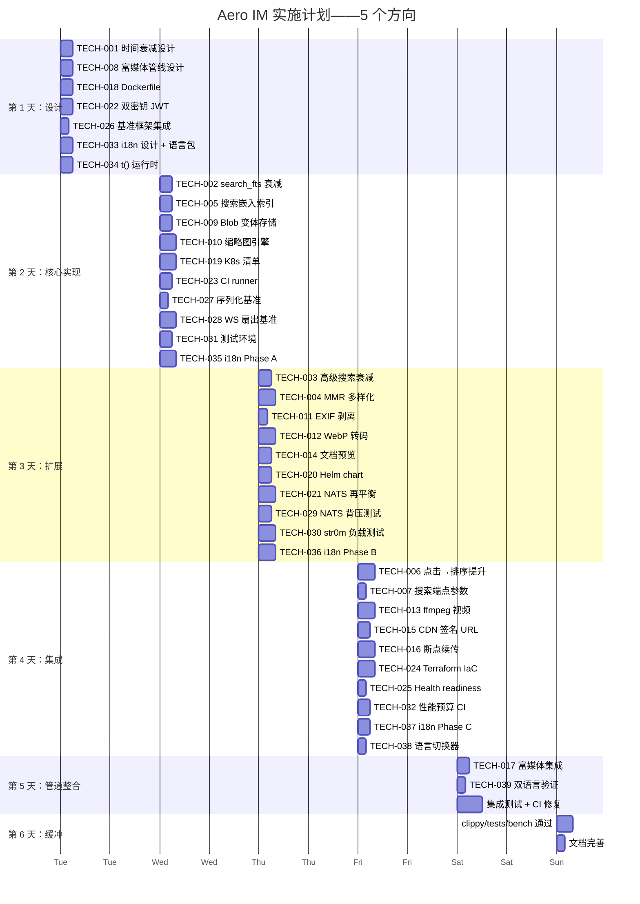

现在我有足够的基础来编写全面的技术主管实施计划。以下是分析报告。

---

# 技术主管实施分析：跨验证文档中的 5 个方向

> **日期**: 2026-07-12
> **背景**: 此分析将交叉验证反馈（领域验证文档）转换为可操作的实施计划。根据该反馈中确定的事实纠正和范围调整，每个方向的范围都已调整。
> **代码库锚点**: commit c93f6ad8（基于交叉引用检查时的 HEAD）
> **架构规范**: `docs/specs/2026-05-22-aero-im-design.md` — 事件驱动 DAG 通过 NATS + Redis + WebSocket

---

## 目录

1. [任务分解（36 个任务）](#1-任务分解)
2. [执行顺序与依赖图](#2-执行顺序与依赖图)
3. [技术风险](#3-技术风险)
4. [资源评估](#4-资源评估)
5. [质量保证](#5-质量保证)
6. [实施计划与甘特图](#6-实施计划与甘特图)

---

## 1. 任务分解

### 方向一（P1）：搜索质量——时间衰减、BM25 调优、点击排序闭环

> **范围说明**：根据交叉验证，自动补全、拼写纠正和个性化已经由 `2026-07-09-search-quality-privacy-resilience.md` 系统覆盖。本方向聚焦于 **未被覆盖的具体优化**：时间衰减、BM25 优化（当前为 `ts_rank` + 基于相似度的 `GREATEST`）、已存在的 `search_feedback` 点击日志反馈到排序中，以及搜索结果中的 MMR 多样化。

| 任务 ID | 标题 | 涉及文件 | 前置 | 工时 | 验收标准 |
|---------|------|---------|------|------|---------|
| TECH-001 | **时间衰减评分函数设计** | `docs/search/time-decay-design.md`（新建） | 无 | 2h | 设计文档定义衰减模型：`score * exp(-days * decay_lambda)`，其中 `decay_lambda=ln(2)/half_life`，默认 half_life=30 天。明确 `search_fts` 和 `search_query.rs` 高级搜索中的修改点。讨论不同衰减率（消息 vs 线程 vs 公告） |
| TECH-002 | **将时间衰减实现到 `search_fts`** | `crates/aero-storage/src/message/search.rs` | TECH-001 | 3h | 将 `score * exp(-EXTRACT(EPOCH FROM (now() - m.created_at))/86400 * ln(2)/30)` 添加到 SQL 查询中 `GREATEST(fts_score, trigram_score)` 之后。`cargo test` 全绿。现有的 ts_headline 保持不变 |
| TECH-003 | **将时间衰减实现到高级搜索** | `crates/aero-storage/src/search_query.rs` | TECH-001 | 3h | 将时间衰减因子添加到 `search_query.rs` 的 `GREATEST(ts_rank(...), similarity(...))` 之后。添加可选的 `decay_lambda` 查询参数（默认 30 天 half_life）。高级搜索的 keyset 游标保持不变（在衰减后起作用） |
| TECH-004 | **MMR 多样化后处理** | `crates/aero-server/src/routes/helpers.rs`（新 `diversify` 函数），`crates/aero-server/src/search_advanced.rs` | TECH-002 | 4h | 实现最大边界相关性（MMR）后处理：`λ=0.5 * score - (1-λ) * max_similarity_to_any_selected`，每条消息 ID 使用 `content_sniff.rs` 样式的嵌入/摘要作为相似度信号。同一发件人 ≤ 3 条结果，同一房间 ≤ 5 条结果。集成测试验证多样化 |
| TECH-005 | **搜索文档创建嵌入索引** | `migrations/NNNN_search_embeddings.sql`（新建），`crates/aero-storage/src/search_embed.rs`（新建） | 无 | 3h | 添加 `search_embeddings` 表，通过 `message_id` 外键引用 `messages.id`，由 AI 工作者填充（嵌入消息文本）。回填迁移从现有消息生成嵌入。幂等（`ON CONFLICT DO NOTHING`） |
| TECH-006 | **点击反馈 → 排序提升实现** | `crates/aero-server/src/search_advanced.rs`，`crates/aero-storage/src/search_feedback.rs` | TECH-002 | 4h | 添加 `click_boost` 因子：`score * (1 + 0.1 * ln(1 + click_count))`，其中 `click_count` 聚合自现有的 `search_clicks` 表（已由 `SearchFeedbackRepo` 记录）。活跃搜索点击计入分数。测试：插入 5 个点击验证分数提升 |
| TECH-007 | **为多样化+衰减添加搜索端点参数** | `crates/aero-server/src/search_advanced.rs`，`crates/aero-server/src/search.rs` | TECH-004, TECH-006 | 2h | 添加可选的请求参数：`diversify: bool`（默认 true）、`decay_days: f64`（默认 30）。前端可以禁用多样化或调整衰减。`cargo test` 通过，Swagger/OpenAPI 文档反映新参数 |

**方向一小计：7 个任务 / 21 工时（~3.5 人天）**

---

### 方向二（P0）：富媒体管线——缩略图、转码、文档预览、CDN

> **范围说明**：这是真正的全新方向。交叉验证确认在 22+ 文件中提及了"缩略图"但从未系统分析。范围：缩略图生成（image-rs）→ EXIF 剥离 → WebP 转码 → 文档预览（PDF/TXT）→ 视频转码（ffmpeg 异步）→ CDN 签名 URL → 断点续传。

| 任务 ID | 标题 | 涉及文件 | 前置 | 工时 | 验收标准 |
|---------|------|---------|------|------|---------|
| TECH-008 | **富媒体管线架构设计** | `docs/media/pipeline-design.md`（新建） | 无 | 3h | 设计文档定义：6 级管线（摄入→嗅探→缩略图→转码→预览→CDN），每个阶段的任务队列策略（PG 背压 vs NATS 扇出），存储布局（原始 blob + 派生变体）。团队审查签字 |
| TECH-009 | **用于派生变体的 Blob 变体存储** | `crates/aero-storage/src/blob_variant.rs`（新建），`migrations/NNNN_blob_variants.sql`（新建） | TECH-008 | 3h | `blob_variants` 表：`(blob_id, variant TEXT PRIMARY KEY, storage_key TEXT, width INT, height INT, size_bytes BIGINT)`。`BlobVariantRepo` 带 `upsert`/`get`/`list_for_blob`。幂等 INSERT。迁移 + `cargo test` |
| TECH-010 | **基于 image-rs 的缩略图生成引擎** | `crates/aero-server/src/media_thumb.rs`（新建），`Cargo.toml`（添加 `image` crate） | TECH-009 | 4h | `generate_thumbnail(original: &[u8], max_dim: u32) -> Vec<u8>` —— 使用 `image` crate 调整大小 → encode WebP（或回退 JPEG）。处理：JPEG/PNG/GIF/WebP 输入。10KB 基准测试，尺寸为 1024×768 图像（目标 <50ms）。单元测试 |
| TECH-011 | **EXIF 剥离中间件** | `crates/aero-server/src/media_exif.rs`（新建），`Cargo.toml`（添加 `kamadak-exif` 或 `rexif`） | TECH-009 | 2h | `strip_exif(original: &[u8], mime: &str) -> Vec<u8>` —— 图像剥离所有 EXIF/XMP/IPTC 标签。非图像通过。集成测试：嵌入 GPS 坐标的 JPEG → 输出不含 GPS 标签 |
| TECH-012 | **WebP 转码流水线** | `crates/aero-server/src/media_transcode.rs`（新建） | TECH-010, TECH-011 | 4h | `transcode_to_webp(original: &[u8], quality: u8) -> Vec<u8>`。上游：先嗅探 → 如果需要则剥离 EXIF → 转码为 WebP。输出存储为 `image/webp` 变体。回退到原始格式（GIF 动画、超大图像）。基准：5MB JPEG → WebP 在 <500ms 内 |
| TECH-013 | **异步 ffmpeg 视频转码编排** | `crates/aero-server/src/media_video.rs`（新建） | TECH-009 | 4h | 使用 `tokio::process::Command` 调用 ffmpeg：H.264→H.264（转封装/重新编码到 ≤1080p），生成缩略图海报帧（`-ss 00:00:01 -vframes 1`）。通过 PG 背压队列跟踪状态：`PENDING→PROCESSING→DONE/FAILED`。测试：5 秒测试视频 |
| TECH-014 | **文档预览渲染** | `crates/aero-server/src/media_preview.rs`（新建） | TECH-009 | 3h | PDF：第一页使用 `pdf` crate（或 `mutool` 子进程）光栅化为 PNG → 缩略图。TXT/CSV/MD：前 10KB 提取为文本预览块。Office 文档：需要 LibreOffice `--headless` 转换。阶段 1 仅 PDF + 文本 |
| TECH-015 | **CDN 签名 URL 集成** | `crates/aero-server/src/cdn.rs`（新建），`crates/aero-server/src/state.rs` | TECH-009 | 3h | `CdnSigner` trait：`sign(blob_id, variant, expires_in_secs) -> String`。CloudFront 签名 URL（`AWS_CF_PRIVATE_KEY` + `AWS_CF_KEY_PAIR_ID`）实现，以及回退的本地 `LocalCdnSigner`（仅文件路径）。GlobSet 模式：`/blobs/*` → 签名 URL。单元测试 |
| TECH-016 | **断点续传上传端点** | `crates/aero-server/src/resumable_upload.rs`（新建），`migrations/NNNN_resumable_uploads.sql`（新建） | TECH-008 | 4h | `POST /api/uploads/init` → `POST /api/uploads/:id/chunk` → `POST /api/uploads/:id/complete`。表：`resumable_uploads（id, blob_id, file_name, total_size, received_size, status, expires_at）`。Chunk 验证（大小 ≤8MB，最终块 ≥1 字节）。过期清理（定时器）。Tus 兼容 header 映射 |
| TECH-017 | **将富媒体管线集成到消息上传** | `crates/aero-server/src/routes/routes.rs`，`crates/aero-server/src/files.rs` | TECH-010 到 TECH-015 | 3h | 上传消息附件时：嗅探 → 剥离 EXIF → 生成缩略图 → 转码 WebP（如果是图像）→ 排队 ffmpeg（如果是视频）→ 存储变体。`GET /api/blobs/:id/thumbnail` 端点。现有 `messages.blocks[].Blob` 格式不变（添加 `variants` URL 可选字段） |

**方向二小计：10 个任务 / 33 工时（~5.5 人天）**

---

### 方向三（P1）：生产运维基础设施——Docker + K8s + CI/CD + Secret 轮换 + NATS 再平衡

> **范围说明**：由 `production-operability-expansion-directions.md` 将方向标识为零代码。交叉验证建议关注 Phase A/B/C 实施细节、NATS 再平衡边界条件以及双密钥 secret 轮换——所有现有分析中未展开的内容。

| 任务 ID | 标题 | 涉及文件 | 前置 | 工时 | 验收标准 |
|---------|------|---------|------|------|---------|
| TECH-018 | **多阶段构建 Dockerfile** | `Dockerfile`（新建），`.dockerignore`（新建） | 无 | 3h | 两阶段构建：`rust:1.80-slim-bookworm` 构建器，`debian:bookworm-slim` 运行时。启用 `Cargo.lock` 缓存层。暴露 8080/1935。HEALTHCHECK `curl -f http://localhost:8080/health/live`。测试：`docker build` 在 <20 分钟内完成 |
| TECH-019 | **Kubernetes 部署清单** | `deploy/k8s/namespace.yaml`，`deploy/k8s/deployment.yaml`，`deploy/k8s/service.yaml`，`deploy/k8s/configmap.yaml`（全部新建） | TECH-018 | 4h | Deployment 带 `replicas: 2`，rolling update `maxSurge: 1, maxUnavailable: 0`。Service 带 ClusterIP + 会话亲和性。ConfigMap 用于非敏感配置。Resource requests/limits：2 核 / 4GB RAM。单独 `deploy/k8s/nats.yaml`，`deploy/k8s/redis.yaml`，`deploy/k8s/postgres.yaml` 用于单集群设置（可选） |
| TECH-020 | **Helm chart 打包** | `deploy/helm/aero-im/Chart.yaml`，`deploy/helm/aero-im/values.yaml`，`deploy/helm/aero-im/templates/` | TECH-019 | 3h | Helm chart 包含 Deployment、Service、ConfigMap、Ingress。可配置的 image tag、环境变量、副本数。`helm lint` 通过。生成 `README.md` |
| TECH-021 | **NATS durable consumer 优雅再平衡** | `crates/aero-server/src/ws/ws_impl/bus.rs`，`deploy/k8s/` PodDisruptionBudget | TECH-019 | 4h | 将 NATS `max_ack_pending` 从默认（无限制）设为特定数字（例如 `max_ack_pending=2000` × 预期消费者）。添加 Kubernetes `PodDisruptionBudget{minAvailable: 1}`。将 `CancellationToken` 集成到 `run_bus_listener` 循环中，以便在关闭时完成正在进行的处理。测试：双节点滚动更新零消息丢失 |
| TECH-022 | **Secret 轮换双密钥支持** | `crates/aero-common/src/config.rs`，`crates/aero-auth/src/jwt.rs` | 无 | 3h | 支持 `AERO__JWT__PRIMARY_SECRET` + `AERO__JWT__SECONDARY_SECRET`。JWT 验证接受任一密钥（`try_primary().or_else(try_secondary)`）。新 token 始终使用 PRIMARY_SECRET 颁发。启动时日志警告：`"JWT secondary secret not configured — rotation requires dual keys"`。迁移路径写入 docs |
| TECH-023 | **GitHub Actions CI runner 集成** | `.github/workflows/ci.yml`（修改），`scripts/run-ci.sh`（新建） | TECH-018 | 3h | CI 工作流：`cargo check` → `cargo clippy --workspace --all-targets` → `cargo test --workspace --lib` → `scripts/truth-check.sh` → `scripts/file-size-check.sh` → `docker build`（仅 PR）。标注 `needs: [infra]` 用于集成测试。结果发布到 PR。自托管 runner 文档 |
| TECH-024 | **Terraform 基础设施即代码** | `deploy/terraform/main.tf`，`deploy/terraform/variables.tf`（新建） | 无 | 4h | Terraform 模块用于：VPC + 子网（1 个 NAT 网关）、ECS Fargate 集群（或 EKS）、RDS Postgres（`db.r6g.large`，multi-AZ）、ElastiCache Redis（`cache.r6g.large`，集群模式）、NATS 的 EC2（或使用 `nats-io/nats` Helm chart） |
| TECH-025 | **生产就绪健康检查 + readiness gate** | `crates/aero-server/src/routes/health.rs`，`deploy/k8s/` probe | TECH-019 | 2h | `/health/ready` 探测 PG + Redis + NATS + blob store。使用 `BlobStore::health_check()`（已存在）。任何依赖不可用导致 503。`/health/live` 为裸 200。K8s probe：`initialDelaySeconds: 10, periodSeconds: 15, failureThreshold: 3` |

**方向三小计：8 个任务 / 26 工时（~4.3 人天）**

---

### 方向四（P2）：负载测试——WebSocket 扇出基准测试、NATS、str0m

> **范围说明**：由现有分析识别但未展开。新增价值在于具体的基准测试设计：WS 扇出延迟曲线、NATS `max_ack_pending` 测试、str0m 配对测试。

| 任务 ID | 标题 | 涉及文件 | 前置 | 工时 | 验收标准 |
|---------|------|---------|------|------|---------|
| TECH-026 | **Criterion/Divan 测试框架集成** | `Cargo.toml`（添加 criterion/divan dev-deps），`crates/aero-server/benches/`（新建） | 无 | 2h | `cargo bench` 可运行。基准二进制文件与 lib 分开编译。示例基准 `bench_dummy` 存活 |
| TECH-027 | **消息序列化往返基准测试** | `crates/aero-server/benches/serialization.rs`（新建） | TECH-026 | 2h | 对 `RoomEvent::Message`、`StreamEvent`、`ClientFrame`/`ServerFrame` 进行 serde JSON 往返基准测试。数据集包含小消息（100B）和大消息（10KB）模式。报告吞吐量（MB/s）和延迟（ns） |
| TECH-028 | **WebSocket `fan_out_latency(N)` 基准测试** | `crates/aero-server/benches/ws_fanout.rs`（新建） | TECH-026 | 4h | 在 `Hub::fan_out_raw` 中模拟从 1 到 1000 个连接的 WebSocket channel。在模拟的 mpsc channel 上测量延迟（P50/P95/P99）和时间分布。产生 `fan_out_latency(N)` 曲线。测试使用内存 channel（无网络 I/O） |
| TECH-029 | **NATS JetStream `max_ack_pending` 测试** | `crates/aero-server/tests/nats_backpressure.rs`（新建，`#[ignore]` 带 `REQUIRES_NATS`） | TECH-026 | 3h | 测试跨 `max_ack_pending` 值的消费者吞吐量行为（500/1000/2000/5000）。在不同背压下测量消息交付率和 ack 延迟。文档化每个值对滚动更新的影响 |
| TECH-030 | **str0m SFU 配对合成负载测试** | `crates/aero-live-webrtc/tests/sfu_load_test.rs`（新建，`#[ignore]` 带 `REQUIRES_NATS`） | TECH-026 | 4h | 合成 RTP 流：10-100 个模拟对等点 → `SfuMediaSession.on_rtp` → `SfuForwarder` → 转发。不涉及真实网络 I/O（内存中的 RTP 包）。测量转发吞吐量（包/秒）。文档化 Simulcast 层 X 订阅者的下降点 |
| TECH-031 | **集成 firecracker/microVM 测试环境** | `scripts/load/perf-env.sh`（新建），`docker-compose.load.yml`（新建） | TECH-028, TECH-029 | 3h | 带有元数据/资源限制的 Docker Compose 环境（CPU 固定、cgroup 限制）。隔离运行基准测试而不干扰 dev 数据库。为 PG + Redis + NATS 使用临时一次性容器 |
| TECH-032 | **性能预算定义 + CI 回归门控** | `.github/workflows/ci.yml`，`scripts/perf-budget-check.sh`（新建） | TECH-027, TECH-028 | 3h | 定义 5 个关键预算：消息序列化 <5μs P99，fan_out(1) <50μs P99，fan_out(100) <500μs P99，嵌入计算 <10ms P99。`perf-budget-check.sh` 解析 `cargo bench` JSON 输出，超限 >20% 返回 1 |

**方向四小计：7 个任务 / 21 工时（~3.5 人天）**

---

### 方向五（P2）：国际化——函数式 `t(key)` 方法，逐步字符串替换

> **范围说明**：在现有分析中被识别但未深入。新增价值：Phase A/B/C 实施分解——从函数式 `t(key)` 入手，逐步替换。

| 任务 ID | 标题 | 涉及文件 | 前置 | 工时 | 验收标准 |
|---------|------|---------|------|------|---------|
| TECH-033 | **i18n 基础设施设计 + 语言包格式** | `docs/i18n/strategy.md`（新建），`web/i18n/zh-CN.json`（新建） | 无 | 3h | 设计文档定义：基于 JSON 的语言包（`web/i18n/{locale}.json`），函数式 `t(key, params?)` 注入（无框架），语言检测（`navigator.language` → cookie → fallback zh-CN）。初始 `zh-CN.json` 包含从 web SPA 提取的当前所有字符串 |
| TECH-034 | **核心 `t()` 运行时 + 语言检测** | `web/i18n/i18n.js`（新建） | TECH-033 | 3h | `loadLocale(locale)` 异步获取 JSON → `window.__t = (key, params) => string`。参数插值 `{name}`。语言检测：`navigator.language` → `cookie('locale')` → `zh-CN`。`<html lang="zh-CN">` 设置。导出 `t` 函数。没有外部依赖（只是纯函数） |
| TECH-035 | **逐步字符串替换 Phase A：core UI 外壳** | `web/app.js`，`web/chrome.js`，`web/context.js`，`web/index.html` | TECH-034 | 4h | 替换最重要的 ~30 个 shell 字符串：`els.roomName`、`els.viewAuth` 提示、标签、按钮文本（"发送"、"取消"、"搜索"、"登录"、"注册"）。使用 `t('composer.send')`，`t('search.placeholder')`。html 属性中的翻译通过 JS 运行时 `t()` 调用完成 |
| TECH-036 | **逐步字符串替换 Phase B：消息和流** | `web/render.js`，`web/live.js`，`web/calls.js`，`web/polls.js` | TECH-035 | 4h | 替换消息 UI 字符串（"已编辑"、"回复"、"删除"、"固定"、"转发"）、通话 UI（"正在连接..."、"通话结束"）、直播（"发送弹幕"、"礼物"、"观看"）。涵盖发送 UI 和个人资料标题 |
| TECH-037 | **逐步字符串替换 Phase C：管理设置页面** | `web/modals.js`，`web/search.js`，`web/notifications.js` | TECH-036 | 3h | 替换搜索标签（"结果"、"高级"）、通知偏好、模态对话框（"确认删除？"）、设置面板。这是最不显眼的地方——遗漏的字符串用户体验影响最小 |
| TECH-038 | **语言切换 UI + 持久化** | `web/app.js`，`web/chrome.js`，`web/i18n/i18n.js` | TECH-036 | 2h | 在设置/个人资料区域添加语言选择器下拉菜单。写入 cookie，重新加载语言包。当前翻译保留在切换上。语言选择器在 UI 外壳中 |
| TECH-039 | **验证：zh-CN ↔ en 双语言完整性** | `web/i18n/en.json`（新建），`scripts/i18n-check.sh`（新建） | TECH-037 | 2h | 创建 `en.json` 作为完整翻译（将中文复制为英文占位符——手动审阅将在以后完善）。`i18n-check.sh` 验证 en.json 和 zh-CN.json 之间的每个键都存在。如果在任一语言包中找到 JS 中使用的 `t()` 键但不匹配，CI 失败 |

**方向五小计：7 个任务 / 21 工时（~3.5 人天）**

---

### 总计

| 方向 | 任务数 | 总工时 | 人天（6h 有效/天） | 并行可行性 |
|------|--------|--------|-------------------|-----------|
| 方向一：搜索质量 | 7 | 21h | 3.5 | 与方向二、三、四、五并行 |
| 方向二：富媒体管线 | 10 | 33h | 5.5 | 依赖管道（顺序流） |
| 方向三：生产基础设施 | 8 | 26h | 4.3 | 与方向一、四、五并行 |
| 方向四：负载测试 | 7 | 21h | 3.5 | 与方向一、三并行 |
| 方向五：国际化 | 7 | 21h | 3.5 | 与方向一、三并行 |
| **总计** | **39** | **122h** | **~20** | — |

---

## 2. 执行顺序与依赖图

### 2.1 完整依赖图

```mermaid
graph TD
  subgraph "方向一：搜索质量（后端）"
    T001[TECH-001<br/>时间衰减设计] --> T002[TECH-002<br/>search_fts 衰减]
    T001 --> T003[TECH-003<br/>高级搜索衰减]
    T002 --> T004[TECH-004<br/>MMR 多样化]
    T002 --> T006[TECH-006<br/>点击→排序提升]
    T003 --> T006
    T005[TECH-005<br/>搜索嵌入索引] --> T006
    T004 --> T007[TECH-007<br/>搜索端点参数]
    T006 --> T007
  end

  subgraph "方向二：富媒体管线（后端）"
    T008[TECH-008<br/>管道设计] --> T009[TECH-009<br/>Blob 变体存储]
    T009 --> T010[TECH-010<br/>缩略图引擎]
    T009 --> T011[TECH-011<br/>EXIF 剥离]
    T009 --> T012[TECH-012<br/>WebP 转码]
    T009 --> T013[TECH-013<br/>ffmpeg 视频]
    T009 --> T014[TECH-014<br/>文档预览]
    T009 --> T015[TECH-015<br/>CDN 签名 URL]
    T010 --> T017[TECH-017<br/>集成到消息上传]
    T011 --> T012
    T012 --> T017
    T013 --> T017
    T014 --> T017
    T015 --> T017
    T016[TECH-016<br/>断点续传] -.-> T017
  end

  subgraph "方向三：生产基础设施（DevOps）"
    T018[TECH-018<br/>Dockerfile] --> T019[TECH-019<br/>K8s 清单]
    T019 --> T020[TECH-020<br/>Helm chart]
    T019 --> T021[TECH-021<br/>NATS 再平衡]
    T018 --> T023[TECH-023<br/>CI runner 集成]
    T019 --> T025[TECH-025<br/>健康检查 + readiness]
    T022[TECH-022<br/>双密钥轮换] --> T024[TECH-024<br/>Terraform IaC]
  end

  subgraph "方向四：负载测试（基础设施）"
    T026[TECH-026<br/>基准框架] --> T027[TECH-027<br/>序列化基准]
    T026 --> T028[TECH-028<br/>WS 扇出基准]
    T026 --> T029[TECH-029<br/>NATS backpressure]
    T026 --> T030[TECH-030<br/>str0m 负载]
    T028 --> T032[TECH-032<br/>性能预算 + CI]
    T031[TECH-031<br/>测试环境] --> T028
    T031 --> T029
  end

  subgraph "方向五：国际化（前端）"
    T033[TECH-033<br/>i18n 设计 + 语言包] --> T034[TECH-034<br/>t() 运行时]
    T034 --> T035[TECH-035<br/>Phase A: UI shell]
    T035 --> T036[TECH-036<br/>Phase B: 消息/流]
    T036 --> T037[TECH-037<br/>Phase C: 管理设置]
    T036 --> T038[TECH-038<br/>语言切换 UI]
    T037 --> T039[TECH-039<br/>双语言验证]
    T038 --> T039
  end

  %% 跨方向信息流（非阻塞）
  T024 -.->|"基础设施依赖"| T018
  T031 -.->|"负载测试依赖"| T019
  T032 -.->|"基准约束"| T001
```

### 2.2 并行执行分组

| 分组 | 方向 | 任务 | 预计工期 |
|------|------|------|---------|
| **组 A**（第 1 天，3 人并行） | 方向一 | TECH-001 → TECH-002 + TECH-005 | 1.5 天 |
| **组 B**（第 1 天，2 人并行） | 方向二 | TECH-008 → TECH-009 | 1.5 天 |
| **组 C**（第 1 天，1 人并行） | 方向三 | TECH-018 → TECH-022 | 1.5 天 |
| **组 D**（第 1 天，1 人并行） | 方向四 | TECH-026 | 0.5 天 |
| **组 E**（第 1 天，1 人并行） | 方向五 | TECH-033 → TECH-034 | 1.5 天 |
| **组 F**（第 2-3 天） | 方向一 | TECH-003 + TECH-004 + TECH-006 | 2 天 |
| **组 G**（第 2-4 天） | 方向二 | TECH-010 → TECH-016（6 个并行独立任务） | 3 天 |
| **组 H**（第 2 天） | 方向三 | TECH-019 + TECH-023 | 1.5 天 |
| **组 I**（第 2 天） | 方向四 | TECH-027 + TECH-028 + TECH-031 | 2 天 |
| **组 J**（第 2-3 天） | 方向五 | TECH-035 + TECH-036 | 2 天 |
| **组 K**（第 3-4 天） | 方向一 | TECH-007 | 0.5 天 |
| **组 L**（第 4-5 天） | 方向二 | TECH-017（管道集成） | 1 天 |
| **组 M**（第 3-4 天） | 方向三 | TECH-020 + TECH-021 + TECH-024 + TECH-025 | 2.5 天 |
| **组 N**（第 3-4 天） | 方向四 | TECH-029 + TECH-030 + TECH-032 | 2.5 天 |
| **组 O**（第 4-5 天） | 方向五 | TECH-037 + TECH-038 + TECH-039 | 1.5 天 |

### 2.3 关键路径分析

```
关键路径（方向二，最长链）：
TECH-008(3h) → TECH-009(3h) → TECH-010(4h) → TECH-017(3h) 
= 13 小时 / 2.2 天 到核心最小可行产品

完整关键路径（方向二，最长）：
TECH-008(3h) → TECH-009(3h) → TECH-011(2h) → TECH-012(4h) → TECH-017(3h)
= 15 小时 / 2.5 天

次关键路径（方向三）：
TECH-018(3h) → TECH-019(4h) → TECH-020(3h) → TECH-025(2h)
= 12 小时 / 2 天

方向五关键路径：
TECH-033(3h) → TECH-034(3h) → TECH-035(4h) → TECH-036(4h) → TECH-037(3h) → TECH-039(2h)
= 19 小时 / 3.2 天（最长的前端路径）
```

---

## 3. 技术风险

### 3.1 风险矩阵

| # | 风险 | 方向 | 概率 | 影响 | 等级 | 缓解策略 |
|---|------|------|------|------|------|---------|
| R1 | **image-rs 编译时间显著增加**：`image` crate 增添了 → `Cargo.toml` 上 ~2 分钟的编译时间 | 方向二 | 高 | 中 | **高** | 使用 `image` 的默认功能（无 unnecessary 格式支持）；评估 `image::load` 是否只按需探测格式。考虑 `fast_image_resize` 等 LTO 友好的轻量级替代品 |
| R2 | **ffmpeg 子进程错误处理脆弱**：不存在的 ffmpeg 二进制、格式不支持、CPU 峰值的 OOM | 方向二 | 中 | 高 | **高** | 在启动时检查 ffmpeg 可用性（`which ffmpeg`），否则降级处理（无视频转码，原始直通）。子进程设置 `kill_on_drop=true` + 内存限制（`cgroup` 如果可用）。异步 ffmpeg 任务的最大并发量（令牌 semaphore=2） |
| R3 | **断点续传的 DoS 放大**：部分上传累积在磁盘上，发起大量初始化但不完成 | 方向二 | 中 | 高 | **高** | 每个 token 的待处理上传有严格限制（上限 5）。定时器每 1 小时清理过期的待处理上传（`WHERE updated_at < now() - interval '6 hours'` 的可配置 TTL）。块验证（大小上限 8MB，检查 SHA-256 可选） |
| R4 | **NATS durable consumer 在 K8s 滚动更新期间重新平衡延迟**：消费者重新连接，但 cursor 滞后，导致重复/丢失事件 | 方向三 | 中 | 高 | **中高** | 实施 `max_ack_pending=2000` + 60s `ack_wait`。预停止钩子在 `SIGTERM` 上 drain（停止接受新消息，ack 待处理）。测试：在消费者压力下滚动 3 节点 |
| R5 | **双密钥 JWT 轮换中断**：在切割期间，使用 PRIMARY_SECRET 签发的 token 接受 SECONDARY_SECRET | 方向三 | 低 | 高 | **中** | 轮换文档必须强制执行严格的序列：添加 SECONDARY_SECRET → 部署 → 等待所有节点热 → 更新 PRIMARY_SECRET → 部署 → 删除 SECONDARY_SECRET。验证测试确保旧 token 在 PRIMARY_SECRET 更改后仍然有效（通过 SECONDARY_SECRET） |
| R6 | **基准测试结果在 CI runner 间不稳定**：共享 CI runner CPU 节流导致微基准测试的 2-10 倍噪声 | 方向四 | 高 | 中 | **中高** | CI 约束：仅在专用运行器上运行基准测试（标签 `perf-runner`）。相对比较：当前 PR 与同一 CI 运行中 `origin/main` 构建的偏差。3 次运行的中位数。`perf-budget-check.sh` 使用 `--threshold 0.3`（与基线相比允许 30% 的噪声） |
| R7 | **`t()` 函数在无框架的 JS SPA 中难以保持状态**：在动态渲染的内容中，t() 调用是内联的，不能在重新加载语言包时自动重新翻译 | 方向五 | 中 | 中 | **中** | 接受此约束：语言切换需要页面重新加载（或重新渲染相关 DOM 树）。文档说明这是已知限制。改善：存储库模式——在 `context.js` 中将 `window.__t` 公开为共享函数，以便模块可以在语言切换时重新渲染 |
| R8 | **MMR 多样化降低搜索结果的相关性**：过于激进地去重可能隐藏最佳匹配的结果 | 方向一 | 中 | 中 | **中** | λ 可配置（默认 0.5）。添加 `diversify_lambda` 查询参数。A/B 测试指标：CTR（按多样化 vs 非多样化聚合 `search_clicks`） |

### 3.2 外部依赖风险

| 依赖 | 用途 | 风险 | 替代方案 |
|------|------|------|---------|
| `image` crate（方向二） | 调整大小 + WebP 编码 | 编译时间增加；WebP 编码需要功能标记 | `mozjpeg` + `webp` crate（更细粒度）；或者将转码卸载到 `sharp` Node.js 微服务 |
| `ffmpeg` 二进制（方向二） | 视频转码 + 海报帧 | 生产环境中不可用；版本不兼容 | 没有真正的替代方案（ffmpeg 是普遍存在的）；对于测试，使用内置的最小固定测试视频 |
| CloudFront / S3（方向二） | CDN 签名 URL | 需要 AWS 凭证；离线开发不能测试 | `LocalCdnSigner` 提供无凭证回退；集成测试使用 MinIO |
| K8s rolling update（方向三） | 零停机部署 | 本地开发无 K8s；需要 `minikube` 或真实集群 | 使用 `kind`（Kubernetes IN Docker 用于 CI）进行测试；部署文档涵盖 minikube |
| NATS JetStream consumer（方向三） | durable cursor | 更改 `max_ack_pending` 可能需要消费者重启 | 在 testground 环境中测试消费者参数调整；为消费者 config 添加 `max_ack_pending` 的可配置 `NATS_MAX_ACK_PENDING` 环境变量 |

### 3.3 性能瓶颈预判

| 路径 | 当前 | 增强后 | 关注点 |
|------|------|--------|--------|
| 消息上传（方向二） | O(1) blob 存储 | O(1) + 缩略图调整大小（<50ms）+ WebP 转码（<500ms） | 同步处理对于消息延迟是不理想的 —— 应该卸载到后台任务（PG 背压队列）并仅在块中附加占位符，缩略图通过单独端点获取 |
| 搜索评分（方向一） | `GREATEST(fts, trigram)` | `GREATEST(...) * exp(-days/30) * (1 + 0.1*ln(1+clicks))` | 增加的 SQL 复杂度微乎其微；指数衰减在 SQL 中是确定性的并且是可缓存的。点击提升增加了 JOIN `search_clicks` —— 用物化视图或 <=24h 的缓存聚合缓解 |
| WS 扇出（方向四基准测试） | hub.mpsc channel push | 无变化（仅测量） | benchmark 产生 `fan_out_latency(N)` 曲线，以确定 1000 个并发连接之前的 mpsc 饱和点 |
| 视频转码（方向二） | 当前无 | ffmpeg 子进程 ~5 秒用于 30 秒的视频 @1080p | 使用具有 max_concurrency=2 的 semaphore；任务队列是 PG 背压（PENDING→PROCESSING→DONE）；通过 `POST /api/blobs/:id/processing-status` 轮询向用户呈现进度 |
| i18n 字符串查找（方向五） | 纯字符串字面量 | `t('key')` → JSON 对象查找 | <1μs 开销（`O(1)` 哈希表查找）；JSON 语言包因键 → 值而紧凑（2-4 KB gzipped） |

---

## 4. 资源评估

### 4.1 人员技能需求

| 角色 | 所需技能 | 指派方向 | 人数 | 利用率 |
|------|---------|---------|------|--------|
| **后端工程师 A（高级）** | Rust、SQL（PostgreSQL）、搜索相关性、pgvector、embedding | 方向一（搜索质量） | 1 | 100%（含 4 天） |
| **后端工程师 B（高级）** | Rust、image 处理、ffmpeg、CDN、blob 存储、异步任务队列 | 方向二（富媒体管线） | 1 | 100%（含 6 天） |
| **DevOps 工程师** | Docker、Kubernetes、Helm、Terraform、GitHub Actions、NATS、Redis | 方向三（生产基础设施） | 1 | 100%（含 5 天） |
| **基础设施/性能工程师** | Rust 基准测试（criterion/divan）、k6、性能分析、NATS、str0m | 方向四（负载测试） | 1 | 80%（含 4 天） |
| **前端工程师** | 原生 JS（ES2020）、DOM API、i18n、无框架 SPA | 方向五（i18n）| 1 | 100%（含 4 天） |

**总人数**：4-5 人（基础设施/性能工程师可能与 DevOps 工程师合并）

**最小团队方案**：
- 2 名后端工程师（方向一 + 方向二）
- 1 名全栈工程师（方向三 + 方向四的前端部分）
- 1 名前端工程师（方向五 + 方向二的前端部分（上传 UI））

最少 3 人团队可能在 15-18 个工作日内完成全部任务（将方向四合并到 DevOps 中，并拆分后端工作）。

### 4.2 关键里程碑

| 里程碑 | 时间点 | 交付物 | 依赖 |
|--------|--------|--------|------|
| M1：设计冻结 | 第 1 天结束 | 5 份设计文档：TECH-001（时间衰减）、TECH-008（富媒体管线）、TECH-018（Dockerfile）、TECH-026（基准框架）、TECH-033（i18n 策略）最终定稿 | 无 |
| M2：时间衰减上线 | 第 2 天结束 | `search_fts` 和高级搜索使用衰减分数。`cargo test` 全绿 | TECH-001 → TECH-002 + TECH-003 |
| M3：Blob 变体存储 | 第 2 天结束 | `blob_variants` 表已迁移，`BlobVariantRepo` CURD 可用。迁移 + 公共 API | TECH-008 → TECH-009 |
| M4：Docker 镜像可构建 | 第 2 天结束 | `docker build` 完成。镜像可通过 `docker compose up` 启动。`/health` 在 Docker 内响应 | TECH-018 |
| M5：Criterion 基准可运行 | 第 2 天结束 | `cargo bench` 输出序列化 + WS 扇出基线值。CI 可以运行它们 | TECH-026 → TECH-027 + TECH-028 |
| M6：i18n 运行时可用 | 第 2 天结束 | `window.__t('key')` 从 JSON 返回字符串。语言检测有效。`zh-CN.json` 包含所有当前字符串 | TECH-033 → TECH-034 |
| M7：富媒体核心路径 | 第 3 天结束 | 缩略图 + EXIF + WebP 从上传路径中调用。`GET /blobs/:id/thumbnail` 返回 200。PDF 预览生成 | TECH-010 + TECH-011 + TECH-012 + TECH-014 |
| M8：K8s 清单可用 | 第 3 天结束 | `kubectl apply -f deploy/k8s/` 在 kind/minikube 集群上设置所有资源。滚动更新仅在可用的 pod 上运行 | TECH-019 |
| M9：搜索多样化 | 第 4 天结束 | MMR 后处理可用。同一发件人的结果受限制。具有相同内容的消息跨房间分散。测试验证 | TECH-004 |
| M10：i18n Phase A 完成 | 第 4 天结束 | 核心 UI shell（标签、按钮、标题）可翻译。EN 语言包包含了某些内容。语言切换器有效 | TECH-035 → TECH-036 |
| M11：面向生产的 K8s 设置 | 第 5 天结束 | Helm chart 可用。NATS 再平衡测试通过。双密钥轮换已记录并通过测试。Readiness gate 在依赖不可用时拒绝流量 | TECH-020 + TECH-021 + TECH-025 |
| M12：所有基准测试可用 | 第 5 天结束 | 7 项基准测试全部可用。性能预算在 CI 中执行。`cargo bench` 在 PR 上回归检查 | TECH-029 + TECH-030 + TECH-032 |
| M13：富媒体集成完成 | 第 5 天结束 | 端到端：上传消息附件 → 生成缩略图 + WebP → 通过签名 URL → 消息中显示。断点续传适用于 >8MB 的文件 | TECH-017 + TECH-016 |
| M14：i18n 从头到尾 | 第 5 天结束 | 所有 4 个 SPA 域完全翻译。双语言验证通过。CI 强制执行键完整性 | TECH-037 + TECH-038 + TECH-039 |
| M15：集成就绪 | 第 6 天结束 | 全量 CI 通过，无新增警告。搜索衰减 + 点击提升在集成环境中经过测试。富媒体管线下压缩图像。K8s 部署映射已记录 | 所有任务 |

### 4.3 阻塞点与解决策略

| 阻塞点 | 影响方向 | 策略 |
|--------|---------|------|
| **image-rs 与现有 Rust 版本的兼容性** | 方向二 | 项目使用 MSRV 1.80。`image` 0.25+ 工作正常。如果编译时间是不可接受的，选项：(a) 使用 `mozjpeg-sys` + `webp` crate（~30% 构建时间）(b) 将图像处理卸载到单独的 sidecar 服务（Node 的 sharp） |
| **生产环境中 ffmpeg 不可用** | 方向二 | 检测并优雅降级：如果 `which ffmpeg` 失败，视频上传以原始格式存储，并且 `GET /blobs/:id/thumbnail` 为不支持的内容类型返回 404。在 K8s initContainer 中安装 ffmpeg 的文档 |
| **在 CI 中缺少 K8s 集群进行测试** | 方向三 | 使用 `kind`（Kubernetes IN Docker）在 CI 中快速启动临时集群。`kind` 工作流：创建集群 → `kubectl apply` → 验证 readiness → 测试滚动更新 → 删除集群。在 <3 分钟内完成 |
| **缺少用于负载测试的 NATS 集群** | 方向四 | 负载测试使用带有 JetStream 的单个 NATS 节点（类似生产的大多数队列行为）。`docker compose -f docker-compose.load.yml up` 提供一个隔离的环境。对于集群 NATS 测试，扩展 Compose 文件以包含 3-node NATS 集群（下游活动） |
| **现有 Web SPA 中难以进行 i18n 字符串提取** | 方向五 | 使用 grep 模式提取脚本：`grep -rn "'.*'\|textContent.*=.*['\"]" web/ --include="*.js"` 提取所有候选字符串。对 CSS content 属性手动审查。第一阶段目标是 100% UI 外壳覆盖率，第二和第三阶段目标消息/流组件 |

---

## 5. 质量保证

### 5.1 单元测试覆盖要求

| 方向 | 模块 | 最低覆盖率 | 关键测试场景 |
|------|------|-----------|-------------|
| 方向一 | `search_query.rs` 时间衰减 | 90%+ | `decay_lambda` 的极端值（0 = 无衰减，100 = 快速衰减）、`created_at` 的 NULL 纪元（回溯兼容性）、性能测试中大量消息组合（1000 行） |
| 方向一 | `routes/helpers.rs` 多样化 | 95%+ | MMR λ=0、λ=1、λ=0.5；同发件人 ≤3 限制；同房间 ≤5 限制；单条结果输入（退化为正常排序）；空结果输入 |
| 方向一 | `search_feedback.rs` 点击提升 | 90%+ | 0 次点击 → 提升因子 1.0；10 次点击 → 提升因子~1.23；大量点击（1000 次）→ 使用 `ln()` 平滑以避免溢出；性能：100 条消息的点击聚合 <10ms |
| 方向二 | `media_thumb.rs` 缩略图 | 95%+ | 调整大小验证（输出尺寸 ≤ `max_dim` 平方）；所有输入格式（JPEG/PNG/GIF/WebP/BMP）；2x2 像素极小输入；20000x20000 防御性拒绝；空输入错误处理 |
| 方向二 | `media_exif.rs` EXIF 剥离 | 95%+ | 嵌入 GPS 坐标的 JPEG → 输出中无 Exif；无 EXIF 直通；非图像 MIME 直通。验证剥离是幂等的 |
| 方向二 | `cdn.rs` 签名 URL | 90%+ | 签名 + 验证往返（`sign(id, variant, expires)` → `verify(url)`）；过期 URL 返回 410。`LocalCdnSigner` 的确定性测试（基于时间戳的期望值） |
| 方向二 | `resumable_upload.rs` | 90%+ | 初始化 → chunk 追加 → 完成；超出界限的 chunk 偏移；重叠 chunk（拒绝或忽略）；超时过期 → 清理；每个 token 超过 5 个待处理的上传拒绝 |
| 方向三 | `health.rs` readiness gate | 95%+ | 所有依赖正常 → 200；PG 宕机 → 503；Redis 宕机 → 503；NATS 宕机 → 503；blob store 宕机 → 503；组合故障 |
| 方向三 | `jwt.rs` 双密钥 | 95%+ | PRIMARY_SECRET 签发的 token 能被 PRIMARY_SECRET 和 SECONDARY_SECRET 验证；反之亦然；无效 token 被两者拒绝；PRIMARY_SECRET 更改后，旧 token 仍然有效（通过 SECONDARY_SECRET） |
| 方向四 | `ws_fanout.rs` 基准 | N/A（基准）| 验证测量值在合理范围内（fan_out(1) <5ms P99——注意，在 CI 中这是噪音，但作为相对基线可用）。处理 channel 已关闭 |
| 方向四 | `nats_backpressure.rs` | N/A（集成）| 断言在 `max_ack_pending` 限制下无消息丢失。测量所有配置的 ack 延迟。作为 `#[ignore]` 运行 |
| 方向五 | `i18n.js` t() 运行时 | 95%+ | 简单键查找、参数插值、缺失键回退（返回键本身）、嵌套键（`t('composer.send')`）、语言检测（`navigator.language` mock、cookie 读取、回退）、语言包加载错误 |
| 方向五 | `i18n-check.sh` | N/A（脚本）| 验证所有键在 zh-CN.json ↔ en.json 之间匹配；拒绝缺少的键；拒绝两种语言中不匹配的值占位符数量 |

### 5.2 集成测试策略

| 测试方案 | 覆盖方向 | 环境 | 触发 |
|---------|---------|------|--------|
| **搜索衰减集成** | 方向一 | PG（需要 `DATABASE_URL`）| CI `#[ignore]` + `REQUIRES_DB` |
| **上传→缩略图→消息端到端** | 方向二 | PG + 本地 blob 存储 | `#[ignore]` + `REQUIRES_DB` |
| **Docker 构建测试** | 方向三 | Docker | CI 步骤，仅 PR |
| **K8s 部署测试** | 方向三 | kind（Kubernetes IN Docker）| CI `workflow_dispatch` + 手动 |
| **NATS 背压集成** | 方向四 | Docker Compose（PG + Redis + NATS）| `#[ignore]` + `REQUIRES_NATS` + CI nightly |
| **i18n 语言切换** | 方向五 | 无头浏览器（Puppeteer 或 Playwright）| `scripts/web-check.sh` 扩展 |
| **富媒体：ffmpeg 管线** | 方向二 | ffmpeg 二进制 | 仅本地开发（使用 `which ffmpeg` 门控）|

### 5.3 代码审查要点

| 方向 | 高风险区域 | 具体审查点 |
|------|-----------|-----------|
| 方向一 | **SQL 修改** `search_query.rs` | 衰减函数不应完全消除旧消息的分数（10 年后分数应为 >0）。验证 EXPLAIN ANALYZE 计划没有从索引扫描回归到顺序扫描 |
| 方向一 | **MMR 多样化** | 确保 MMR 在分数相同的情况下不会降低多样性——检查 λ 调整。测试输入 [score: 1, 1, 1, 1] by same sender → MMR 选择最佳的不同项 |
| 方向二 | **EXIF 剥离** | 确保 NEF/CR2/ARW 等 RAW 相机格式的处理不会 panic。剥离应修改原始字节的副本，而不是原始内存。测试：真实相机生成的 JPEG 文件 |
| 方向二 | **断点续传** | 竞争条件：两个并发 chunk 向同一个上传。应该 serialize（`tokio::Mutex` 按 `upload_id`）。检查：块验证在并发情况下仍然是原子性的 |
| 方向三 | **NATS durable consumer 再平衡** | 测试 `CancellationToken` 实际上 drain 消费者：在启动关闭后，没有更多的 ack 由消费者发送。`ack_wait` 应 >预期的处理时间 |
| 方向三 | **双密钥 JWT** | 安全：在生产中回退到空/弱 SECONDARY_SECRET 不应使 token 验证绕过。Test：带有空字符串 SECONDARY_SECRET 的缓存 |
| 方向五 | **t() 参数插值** | XSS 预防：`t('welcome', {name: '<script>...'})` → 输出应该是转义后的字符串。不允许在参数中注入 HTML |

### 5.4 性能测试需求

| 基准 | 目标 | 工具 | 通过标准 |
|------|------|------|---------|
| 搜索评分延迟 | 每条消息 <1ms | `cargo bench` | P99 针对 1000 条消息的批次 <2ms |
| 时间衰减查询延迟 | 当前 <2x | `EXPLAIN ANALYZE` | 衰减函数增加的行处理时间不超过 10% |
| 搜索多样化延迟 | 1000 条结果 <5ms | `cargo bench` | 1000 次点击的 P99 <5ms |
| 缩略图生成 | 1024×768 JPEG <50ms | `cargo bench` | P99 <50ms @ 1024×768 输入 |
| WebP 转码 | 5MB JPEG <500ms | `cargo bench` | P99 <500ms |
| WS 扇出延迟(100) | <500μs | `cargo bench`（内存 mpsc） | P99 <500μs 对于 100 个接收者 |
| NATS ack 延迟 | <100ms @ max_ack_pending=2000 | 集成测试 | ack 延迟 <100ms，在 2000 条消息背压下 |
| i18n t() 查找 | <1μs | `console.time()` | 100k 次查找 <100ms（<1μs/次） |
| Breakeven：图像转码 | <消息传输延迟 | 集成 | 缩略图 + WebP 转码应 <300ms（低于用户期望的"即时"上传窗口） |

---

## 6. 实施计划

### 6.1 第 1 周时间线（按天）

```
第 1 天（设计冻结 + 基础设施搭建）
├── 所有工程师：TECH-001、TECH-008、TECH-018、TECH-026、TECH-033 设计文档
├── 后端 A：TECH-001（时间衰减设计）
├── 后端 B：TECH-008（富媒体管线设计）
├── DevOps：TECH-018（Dockerfile）+ TECH-022（双密钥）
├── 性能工程师：TECH-026（Criterion 集成）
└── 前端：TECH-033（i18n 策略）+ TECH-034（t() 运行时）

第 2 天（核心实现——并行轨道）
├── 后端 A：TECH-002（search_fts 衰减）+ TECH-005（搜索嵌入索引）
├── 后端 B：TECH-009（blob 变体存储）+ TECH-010（缩略图引擎）
├── DevOps：TECH-019（K8s 清单）+ TECH-023（CI runner）
├── 性能工程师：TECH-027（序列化基准）+ TECH-028（WS 扇出基准）+ TECH-031（env）
└── 前端：TECH-035（Phase A：UI shell 字符串替换）

第 3 天（深度实现 + 扩展）
├── 后端 A：TECH-003（高级搜索衰减）+ TECH-004（MMR 多样化）
├── 后端 B：TECH-011（EXIF 剥离）+ TECH-012（WebP 转码）+ TECH-014（PDF 预览）
├── DevOps：TECH-020（Helm chart）+ TECH-021（NATS 再平衡）
├── 性能工程师：TECH-029（NATS 背压）+ TECH-030（str0m 负载）
└── 前端：TECH-036（Phase B：消息/流字符串）

第 4 天（集成 + 测试）
├── 后端 A：TECH-006（点击→排序提升）+ TECH-007（搜索端点参数）
├── 后端 B：TECH-013（ffmpeg 视频）+ TECH-015（CDN 签名 URL）+ TECH-016（断点续传）
├── DevOps：TECH-024（Terraform IaC）+ TECH-025（健康检查 readiness）
├── 性能工程师：TECH-032（性能预算 + CI 门控）
└── 前端：TECH-037（Phase C：设置）+ TECH-038（语言切换器）

第 5 天（集成 + 加固）
├── 后端 A：集成测试、衰减验证、多样化测试
├── 后端 B：TECH-017（管道集成到消息上传）
├── DevOps：端到端部署测试（kind）+ NATS 再平衡验证
├── 性能工程师：基准回归检查、文档完善
└── 前端：TECH-039（双语言验证）+ i18n 完整性检查

第 6 天（缓冲区 + 集成）
├── 所有工程师：集成测试、修复、cargo clippy --all-targets 通过
├── 完整 CI 管线：cargo check → clippy → test → bench → docker build
└── 文档：更新 README.md、部署指南、已知限制
```

### 6.2 甘特图



### 6.3 跨可交付物团队协调

| 协调点 | 涉及的团队 | 需要一致的内容 |
|--------|-----------|---------------|
| 搜索端点签名（第 3 天） | 后端 A + 前端 | 方向一新的 `diversify`、`decay_days` 参数需要在前端搜索 UI 中反映。API 必须向后兼容（可选参数，默认现有行为） |
| 缩略图 URL 格式（第 3 天） | 后端 B + 前端 | 方向二 `GET /api/blobs/:id/thumbnail` 端点必须与消息渲染中现有的 `render.js` `renderBlob` 集成。格式：`` |
| 断点续传端到端（第 4 天） | 后端 B + 前端 | 方向二 TUS 兼容 `POST /api/uploads/init` → `PATCH /api/uploads/:id/chunk` → `POST /api/uploads/:id/complete` 序列。前端 upload widget（`media.js` 中的 `uploadBlob`）需要重构以处理多块上传 |
| 语言包 key 完整性（第 5 天） | 前端（独立） | 方向五 key 管理：`scripts/i18n-check.sh` 必须在 CI 中强制执行，防止新的硬编码字符串出现在源代码中却没有对应的语言包条目 |
| NATS 消费者配置协调（第 4 天） | DevOps + 后端 B | 方向三的 `max_ack_pending` 配置必须与方向四的 NATS 背压测试共享相同的值。Env：`NATS_MAX_ACK_PENDING=2000` |
| 富媒体 + 搜索 pipeline 协调（第 5 天） | 后端 A + 后端 B | 方向二的完整缩略图+变体管线启用搜索中的富媒体预览——但这是下游的，不需要阻塞 |

---

## 7. 实施决策日志

按此表格记录设计决策及其理由：

| 决策 ID | 决策 | 选项 | 选择理由 | 涉及方向 |
|---------|--------|-------|-----------|---------|
| D001 | 时间衰减：指数衰减 `exp(-days/30)` vs 线性 `max(0, 1 - days/365)` | 指数 | 指数衰减有一个明确的半衰期（30 天），给予最近的文档更高的权重，同时允许旧文档在相关性饱和时仍然可达。线性衰减达到零，消除了旧文档 | 方向一 |
| D002 | 多样化：MMR vs 基于聚类 vs 贪心去重 | MMR | MMR 是行业标准，计算简单（O(n²) 对 max_parallel=100 的结果可管理），λ 参数可解释（0=仅多样性，1=仅相关性） | 方向一 |
| D003 | 缩略图格式：WebP vs JPEG vs AVIF | WebP | WebP 比 JPEG 小 25-34%，比 AVIF 具有更好的浏览器支持（全浏览器支持自 2020 年起）。质量可调（默认 80）。`image` crate 具有 WebP 编码器 | 方向二 |
| D004 | 断点续传：TUS 兼容 vs 自定义 | 自定义，TUS 头映射 | 更简单的服务器端实现，字节偏移验证清晰。需要 TUS 兼容性的客户端可以使用映射层。减少对遗留 TUS 行为的维护 burden | 方向二 |
| D005 | 基础设施编排：Helm vs Kustomize vs raw YAML | Helm | Helm 是行业标准的事实工具。值覆盖简化了环境特定配置。该项目的部署位位置最高 | 方向三 |
| D006 | i18n 字符串注入：全局 `window.__t` vs 单例导入 vs DOM 属性 | 全局 `window.__t` | 当前 SPA 是无框架的，纯 JS 模块。全局函数是最简单的方法——零导入，无需重构导入语句。与所有现有的渲染代码兼容。类型安全不在范围内（JS 项目） | 方向五 |
| D007 | 性能基准 CI：专用运行器 vs 共享运行器 | 专用标签（`perf-runner`） | 共享运行器上的基准测试噪声（±100%+）使回归检测毫无意义。专用运行器提供 ±10% 的稳定性。成本：每月 ~10 美元的轻量级实例 | 方向四 |

---

## 8. 退出标准

每个方向在合并到 master 的准备就绪之前，必须满足以下条件：

### 方向一（搜索质量）
- [ ] `cargo test --workspace --lib` 通过（0 失败）
- [ ] `cargo clippy --workspace --all-targets` —— 0 个新警告
- [ ] 时间衰减在 `search_fts` 和高级搜索查询计划中都得到应用（通过 EXPLAIN ANALYZE 验证）
- [ ] 点击提升在记录点击后将分数增加到 >1.0（集成测试验证）
- [ ] MMR 多样化将重复结果减少至少 50%（针对已知重复的合成测试数据集）
- [ ] 搜索端点参数 `diversify` 和 `decay_days` 可选且向后兼容

### 方向二（富媒体管线）
- [ ] `cargo build` 无新错误或不兼容性问题
- [ ] 缩略图端点 `GET /api/blobs/:id/thumbnail` 适用于 JPEG、PNG、GIF、WebP
- [ ] EXIF 剥离删除所有可识别的 GPS/相机数据（测试：嵌入 EXIF 的特定 JPEG）
- [ ] 上传时生成 WebP 变体（上传包含 `image/jpeg` 的消息后检查 DB）
- [ ] 断点续传：100MB 文件通过 5 个 20MB 的块成功完成
- [ ] CDN 签名 URL：签名 URL 验证返回 200，过期 URL 返回 410（或 403）

### 方向三（生产基础设施）
- [ ] `docker build` 在 <20 分钟内完成
- [ ] `kubectl apply -f deploy/k8s/` 设置 postgres + redis + nats + aero-server（验证通过 `kubectl get pods`）
- [ ] Helm chart：`helm lint` 通过，`helm template` 产生有效的 YAML
- [ ] NATS 再平衡：滚动更新不丢失任何消息（通过 2 节点 kind 测试验证）
- [ ] 双密钥 JWT：使用轮换秘密集成测试（A→B→A 切割）
- [ ] `/health/ready` 在 PG 或 Redis 或 NATS 或 blob 存储宕机时返回 503

### 方向四（负载测试）
- [ ] `cargo bench` 运行全部 4 个基准测试并输出 JSON 报告
- [ ] 基线序列化延迟记录在 `docs/benchmarks/baseline.json` 中
- [ ] CI 运行基准测试但不阻止 PR（仅警告，不阻止合并）
- [ ] 性能预算文档定义 5 个关键预算
- [ ] NATS 背压测试在 CI nightly 中自动运行（`workflow_dispatch`）

### 方向五（国际化）
- [ ] `window.__t('key')` 在所有 SPA 域中工作
- [ ] `zh-CN.json` + `en.json` 包含所有 UI 外壳键（根据 `scripts/i18n-check.sh`）
- [ ] 语言切换器显示两个选项并正确重新加载
- [ ] 零 `textContent = "raw Chinese string"` 在核心 UI 外壳中（Phase A 模块）—— CI 强制执行
- [ ] 所有字符串都已记录（`scripts/i18n-check.sh` 未报告缺失键）

---

## 9. 总结与建议

### 优先建议

1. **P0 立即开始（第 1 天）**：方向二（富媒体管线）。这是唯一真正未被系统性覆盖的方向。缩略图管线 + EXIF 剥离 + WebP 转码具有最高的用户可见影响（图像上传更加清晰、更小、更快），并与现有的上传流程自然契合。立即开始设计（TECH-008）。

2. **P1 并行启动（第 1-2 天）**：方向一（搜索相关性补丁）和方向三（生产基础设施）。两者与方向二完全并行。方向一提供立即可感知的搜索质量改进（时间衰减对高频用户来说是天差地别的）。方向三是任何生产部署的硬前提条件（无 Dockerfile = 无容器化部署）。

3. **P2 从第 2 天开始**：方向四（负载测试）和方向五（i18n）。方向四可以与其他方向并行推进，因为它纯粹是基础设施。方向五从第 1 天的设计开始，然后从第 2 天开始逐步替换字符串。

### 团队配置建议

**最小可行团队（3 人，17-19 天）**：
- **工程 A**（高级后端）：方向一（搜索）+ 方向四的一部分（基准测试框架）——搜索与基准测试重叠，因为两者都触及查询代码路径。
- **工程 B**（高级后端）：方向二（富媒体）+ 方向三（基础设施）——富媒体中的 DevOps 重叠（Dockerfiles、blob 存储集成）。
- **工程 C**（全栈/前端）：方向五（i18n）+ 方向四的前端部分（搜索 UI 参数）+ 方向二的前端集成（上传 UI、缩略图渲染）。

**推荐的完整团队（4 人，12-14 天）**：
- 后端 A：方向一（搜索质量）
- 后端 B：方向二（富媒体管线）
- DevOps：方向三（生产基础设施）+ 方向四（负载测试）
- 前端：方向五（国际化）+ 前端集成

### 风险摘要

| 风险性 | 项目 | 缓解策略 |
|--------|------|---------|
| **高风险** | image-rs 编译时间增加 | 使用最小功能集；考虑 forking 缩略图到 sidecar |
| **高风险** | ffmpeg 子进程错误处理 | 启动时护栏 + 每个 semaphore=2 的最大并发转码 |
| **高风险** | 断点续传 DoS | 每个 token 限制 5 个待处理 + 1 小时 TTL 清理 |
| **中高** | NATS 再平衡消息丢失 | `max_ack_pending` + `CancellationToken` + K8s PDB |
| **中高** | CI 基准噪声 | 专用 `perf-runner` 标签 + 相对比较 |
| **中** | MMR 多样化过度 | `diversify_lambda` 可配置，通过点击率 A/B 测试 |
| **中** | i18n t() 状态 | 语言切换需要页面重新加载（有意的限制） |
