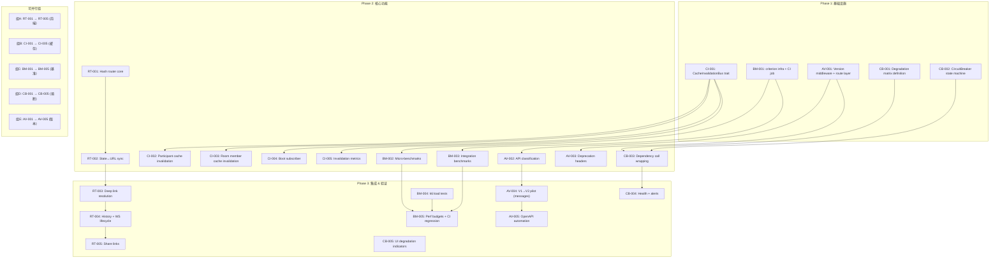

# Tech Lead 分析：Aero IM 架构缺口实施计划

> **文档日期**: 2026-07-12
> **来源**: `docs/requirements/2026-07-10-architecture-gaps-analysis.md`（5 个方向）
> **分析人**: Tech Lead
> **适用范围**: 16 crate / ~25K Rust / ~5.9K Web SPA / 126 路由模块

---

## 1. 任务分解

共 **25 个任务**，拆解为单次 2-8h 可独立完成的粒度。每个方向冠以领域前缀：`RT`（路由）、`AV`（API 版本）、`CI`（缓存失效）、`BM`（基准测试）、`CB`（熔断降级）。

### 方向一（P1）：SPA 路由与深度链接

| 任务 ID | 任务标题 | 涉及文件 | 前置依赖 | 工时 |
|---------|---------|---------|---------|------|
| **RT-001** | Hash 路由核心引擎 | `web/{router.js, app.js}`（新增 `router.js`，修改 `app.js`） | 无 | 4h |
| **RT-002** | 状态 ↔ URL 双向同步 | `web/{router.js, context.js}` | RT-001 | 3h |
| **RT-003** | 深度链接解析 & 导航恢复 | `web/{router.js, auth.js}` | RT-001, RT-002 | 3h |
| **RT-004** | 浏览器历史栈集成 & WS 生命周期适配 | `web/{router.js, app.js, ws.js}` | RT-001, RT-002 | 4h |
| **RT-005** | 共享链接生成 & 通知深度链接 | `web/{app.js, notifications.js}` | RT-003 | 2h |

**合计**: 16h（4 人·日）

### 方向二（P2）：API 版本治理

| 任务 ID | 任务标题 | 涉及文件 | 前置依赖 | 工时 |
|---------|---------|---------|---------|------|
| **AV-001** | 版本解析中间件 + 路由分层抽象 | `server/src/routes/{version.rs, routes.rs}`、`common/src/api.rs` | 无 | 6h |
| **AV-002** | 126 模块「公共 API vs 内部 API」分类清单 | `server/src/routes/routes.rs`（注释标注），新增 `docs/api/version-strategy.md` | AV-001 | 3h |
| **AV-003** | Deprecation header 工具链 | `server/src/routes/deprecation.rs`、`common/src/api.rs` | AV-001 | 4h |
| **AV-004** | 首个版本适配层试点（消息 API `/v1/messages` ↔ `/v2/messages`） | `server/src/routes/v1/messages.rs`、`server/src/routes/v2/messages.rs` | AV-001, AV-002 | 8h |
| **AV-005** | OpenAPI 规范自动生成（从版本化路由推导） | `server/src/openapi.rs`（重写）、`server/Cargo.toml` | AV-001, AV-004 | 6h |

**合计**: 27h（~7 人·日）

### 方向三（P2）：多实例缓存一致性

| 任务 ID | 任务标题 | 涉及文件 | 前置依赖 | 工时 |
|---------|---------|---------|---------|------|
| **CI-001** | `CacheInvalidationBus` trait + `RedisPubSubInvalidator` 实现 | `server/src/cache_invalidation.rs`（新增）、`server/src/lib.rs` | 无 | 4h |
| **CI-002** | Participant 缓存跨实例失效 | `server/src/participant_cache.rs` | CI-001 | 3h |
| **CI-003** | Room member 缓存跨实例失效 | `server/src/room_member_cache.rs` | CI-001 | 3h |
| **CI-004** | Boot 时订阅失效 channel + 后台监听任务 | `server/src/bin/boot/background.rs` | CI-001 | 3h |
| **CI-005** | 失效事件计数 & 延迟监控（Prometheus gauge + histogram） | `server/src/cache_invalidation.rs`、`server/src/observability.rs` | CI-001 | 2h |

**合计**: 15h（~4 人·日）

### 方向四（P2）：性能基准体系

| 任务 ID | 任务标题 | 涉及文件 | 前置依赖 | 工时 |
|---------|---------|---------|---------|------|
| **BM-001** | `criterion` 基准基础设施 + CI job | `Cargo.toml`（root + selected crates）、`benches/` 目录结构、`.github/workflows/ci.yml` | 无 | 3h |
| **BM-002** | 关键路径微基准（序列化/嵌入/关键词匹配/消息反序列化） | `benches/serialization.rs`、`benches/ai_embed.rs`、`benches/moderation.rs` | BM-001 | 4h |
| **BM-003** | 全链路集成基准（WS 消息发送→PG→NATS→扇出） | `benches/message_workflow.rs`（新增，需 mock PG/NATS 或专用 bench 数据库） | BM-001 | 6h |
| **BM-004** | k6 端到端场景负载测试 | `scripts/k6/scenarios/typical_session.js`（新增）、`scripts/k6/run.sh` | 无 | 6h |
| **BM-005** | 性能预算 YAML + CI 回归告警 | `perf-budgets.yaml`（新增）、`.github/workflows/perf.yml` | BM-001, BM-002, BM-003 | 4h |

**合计**: 23h（~6 人·日）

### 方向五（P2）：降级与熔断

| 任务 ID | 任务标题 | 涉及文件 | 前置依赖 | 工时 |
|---------|---------|---------|---------|------|
| **CB-001** | 降级层级矩阵定义（L1/L2/L3 + per-dependency fallback） | `common/src/degradation.rs`（新增）、`docs/architecture/degradation-matrix.md` | 无 | 3h |
| **CB-002** | `CircuitBreaker` 状态机（closed/open/half-open + 滑动窗口） | `common/src/circuit_breaker.rs`（新增） | CB-001 | 6h |
| **CB-003** | 依赖调用包装（PG pool、Redis、NATS、AI API、BlobStore） | `server/src/middleware/circuit_breaker.rs`（新增）、各依赖初始化点 | CB-001, CB-002 | 5h |
| **CB-004** | 降级状态接入 `/health/ready` + Prometheus alert | `server/src/routes/health.rs`、`deploy/prometheus/alert_rules.yml` | CB-003 | 4h |
| **CB-005** | 用户面降级指示器（toast/banner/footer） | `web/{ui.js, app.js}`、`web/components/toast.js` | 无（可并行） | 4h |

**合计**: 22h（~5.5 人·日）

### 总工作量汇总

| 方向 | P | 任务数 | 总工时 | 人·日（按 4h/日） |
|------|---|-------|-------|-----------------|
| SPA 路由 | P1 | 5 | 16h | 4 |
| API 版本治理 | P2 | 5 | 27h | 6.75 |
| 缓存一致性 | P2 | 5 | 15h | 3.75 |
| 性能基准 | P2 | 5 | 23h | 5.75 |
| 降级熔断 | P2 | 5 | 22h | 5.5 |
| **合计** | | **25** | **103h** | **~26 人·日** |

---

## 2. 执行顺序与依赖图



### 并行执行组说明

| 并行组 | 方向 | 依赖关系 | 建议人力配置 |
|--------|------|---------|-------------|
| **组 A** | 前端路由 | 组内串行，无外部依赖 | 1 前端工程师 |
| **组 B** | 缓存一致性 | CI-001 是唯一前置，之后 CI-002~005 可并行 | 1 后端工程师 |
| **组 C** | 基准测试 | BM-001 是唯一前置，之后 BM-002/003/004 可并行；BM-005 在末端 | 1 后端工程师（兼 SRE） |
| **组 D** | 熔断降级 | CB-001+CB-002 前置，CB-003+CB-005 可并行，CB-004 在末端 | 1 后端工程师 |
| **组 E** | API 版本 | AV-001 前置，AV-002+AV-003 可并行，AV-004+AV-005 在末端 | 1 后端工程师（稍 senior） |

**关键路径**：AV-001 → AV-004 → AV-005（14h，最长串行链）。如果人员充裕，**5 个并行组可以同时开工**，理论最短工期 ≈ 最长串行链的工时 = **14h（AV 方向）** ≈ 2 个工作日。

---

## 3. 技术风险

### 3.1 高风险项

| 风险 | 方向 | 级别 | 具体描述 | 应对策略 |
|------|------|------|---------|---------|
| **Hash 路由与 WS 连接状态竞态** | RT | 🟠 | 用户通过深度链接导航到房间时，WS 可能尚未就绪。`join_room` 过早触发导致时序竞态（auth 完成前发消息被拒） | 在 `router.js` 添加 `wsReady` promise gate；所有路由跳转等待 WS 状态为 `connected` 再发 join |
| **`Accept-Version` 头与现有客户端不兼容** | AV | 🟠 | 现有 Web SPA 无版本协商逻辑；加版本 header 默认无版本=最近版本（breaking change for new clients），默认无版本=最新稳定（breaking change for old clients） | 双轨策略：无版本请求→路由到最新稳定版；版本化客户端→指定版本。第一阶段不对现有客户端做任何强制 |
| **Redis pub/sub at-most-once 语义** | CI | 🟡 | Redis pub/sub 不保证送达；实例网络抖动导致失效消息丢失，缓存过期前仍不一致 | 接受最终一致性窗口（失效丢失 = 退回到 TTL 窗口）；新增可选 NATS 信道提高可靠性 |
| **基准不稳定（CI 环境抖动）** | BM | 🟡 | GitHub Actions runner CPU/内存不固定，微基准噪音大；直觉门槛：标准差 > 5% 则不可靠 | CI 只跑「相对基准」：同一 PR 的 branch vs base 对比；绝对值基准跑 nightly dedi env |
| **熔断误触发** | CB | 🟠 | 生产突发延迟尖峰（GC pause、网络抖）导致熔断跳闸，即使服务已恢复，半开窗口迫使用户继续经历降级 | 滑动窗口 + 最小请求样本量（min_sample=10）避免过早熔断；熔断恢复使用 exponential backoff |
| **CB-003 影响面广** | CB | 🟠 | 包装 PG pool、Redis、NATS 等核心依赖的连接点分散在 16 个 crate 中；需要改数十个 `Pool::acquire` 调用才能全局生效 | 不在所有调用点手加包装——在 `AppState` 注入层包装：`pool.get()` 返回包裹后的 conn、`redis.cmd()` 走中间层。降低侵入性 |
| **AV-004 与现有测试冲突** | AV | 🟡 | 已有 35 个 PG 门控集成测试硬编码了 `/api/*` 路径。加版本前缀后这些测试需要双路径验证 | 集成测试中使用 `Router` 的 `TestRequest` 不依赖实际 URL 前缀；或者测试全部使用 `ApiVersion::Latest` 上下文 |

### 3.2 减轻措施汇总

1. **RT-001**: 在 `router.js` 中设计明确的 **FSM 状态时序列**：`{ disconnected → connecting → connected → ready }`，路由只允许 `ready` 状态自动导航
2. **AV-001**: 版本解析中间件默认 `None → latest stable`；旧实例的 `/api/*` 裸路径继续工作不受影响
3. **CI-001**: `CacheInvalidationBus` 提供双实现 + 可开关 env（`AERO_CACHE_INVAL=nats|redis|off`）
4. **BM-001**: CI bench job 使用 `turquoise` 或较大 runner（`ubuntu-latest-8core`），并用 `hyperfine` 做预热
5. **CB-002**: 熔断配置可调（`failure_threshold`, `success_threshold`, `half_open_interval_ms`），不允许 hardcode 常量；提供 `#[cfg(test)]` mock breaker

---

## 4. 资源评估

### 4.1 人力需求

| 角色 | 技能要求 | 数量 | 负责方向 | 备注 |
|------|---------|------|---------|------|
| **前端工程师** | 原生 JS / DOM API / WebSocket 无框架 SPA 经验 | 1 人 | 方向一（RT）全部 | 需要有纯 `hashchange`/`popstate` 实现经验（非 React Router） |
| **后端工程师 A** | Rust / axum / Redis（fred）/ 并发设计 | 1 人 | 方向三（CI）+ 方向五（CB） | CB 需要系统设计能力（状态机、降级层级） |
| **后端工程师 B** | Rust / axum / OpenAPI / 契约驱动 | 1 人（senior） | 方向二（AV）全部 | 126 个模块分类决策需要架构判断力 |
| **后端/SRE** | Rust / criterion / k6 / CI（GitHub Actions） | 0.5 人（可兼职） | 方向四（BM）全部 | 初始搭建后维护成本低 |
| **Tech Lead** | 架构决策 / code review / 跨组协调 | 1 人（兼职） | 全部方向（交叉审查） | 重点审 AV-002（分类决策）和 CB-002（状态机正确性） |

**建议配置**: 3 名全职开发 + 1 名兼职 SRE + 1 名兼职 Tech Lead。

### 4.2 关键里程碑

| 里程碑 | 交付物 | 预计工期 | 依赖 |
|-------|--------|---------|------|
| **M1: P1 上线** | 完整的 SPA 路由 + 深度链接（RT 全任务） | 4 天 | 无 |
| **M2: 缓存一致性就绪** | CI-001~CI-005 全部完成 + 监控上线 | 3 天 | 无 |
| **M3: 基准基础设施就绪** | BM-001~BM-004 完成，k6 场景跑通 | 4 天 | 无 |
| **M4: API 版本处理就绪** | AV-001~AV-003 完成，消息 API 版本化试点跑通 | 7 天 | 无 |
| **M5: 熔断降级就绪** | CB-001~CB-005 完成，降级矩阵已验证 | 5 天 | 无 |
| **M6: 全部就绪** | 所有 25 个任务完成 + CI 管线全绿 + 集成测试通过 | 10-12 天 | M1~M5 |

### 4.3 阻塞点与解决策略

| 阻塞点 | 影响方向 | 性质 | 解决策略 |
|--------|---------|------|---------|
| 前端无测试基础设施 | RT | 风险 | 方向一全部手动测试 + 在 web-check.sh 中添加路由逻辑的 smoke test。下阶段规划前端测试框架 |
| 126 个模块的全量 API 分类决策 | AV | 决策阻塞 | Tech Lead 决策：第一轮仅分类 Top 20 高频端点（消息/房间/成员/认证/搜索/通知），其余保持无版本化。迭代式推进 |
| `circuit-breaker` Rust crate 选择 | CB | 设计决策 | 推荐手写状态机（~200 行）而非引入外部依赖——已有 AGENTS.md 的 `unsafe_code = "forbid"` 约束；手写更可控且无依赖冲突风险 |
| CI runner 性能基准噪音 | BM | 环境限制 | 方案：每周一次非阻塞的 nightly bench（非 PR CI）；PR CI 只跑「change detection」模式（对比 base branch + 同一个 runner） |

---

## 5. 质量保证

### 5.1 单元测试覆盖要求

| 模块 | 最低覆盖率目标 | 关键测试场景 | 测试框架 |
|------|--------------|-------------|---------|
| `router.js`（hash 解析 + URL generation） | 暂缺（无 JS 测试框架） | 手动验证 + smoke test | 手动 + `web-check.sh` |
| `CacheInvalidationBus` trait + impl | 90%+ lines | 发布/订阅、网络断开后重连、去重、顺序性 | `#[cfg(test)]` + tokio::test |
| `CircuitBreaker` 状态机 | 95%+ lines | closed→open→half-open→closed；closed→open→half-open→open；并发安全性 | `#[cfg(test)]` + `loom`（可选） |
| Version middleware | 85%+ lines | `Accept-Version: v1`、无 header、无效版本、版本回退 | `axum::test` + `TestRequest` |
| Deprecation header 工具 | 100% lines | header 格式校验、日期解析、Sunset 格式 | unit test |
| 微基准 | N/A（不测正确性） | 每次 CI bench 需通过编译 + 无 panic | `cargo bench --check` |

### 5.2 集成测试策略

| 测试场景 | 涉及方向 | 验证方法 | 环境要求 |
|---------|---------|---------|---------|
| 深度链接→登录→导航到房间的全流程 | RT | 在双实例部署下的端到端测试（2 个独立浏览器窗口模拟） | 两实例 + PG + NATS |
| API v1 ↔ v2 共存：相同业务逻辑不同序列化 | AV | 同时请求 `/v1/api/rooms/:id/messages` 和 `/v2/api/rooms/:id/messages`，验证响应结构差异 | PG + 已迁移 |
| 缓存失效传播：实例 A 改头像，实例 B 收到失效后 get_or_fetch 返回新数据 | CI | 双实例：A 写 + 等待 2s + B 读 → 新数据 | 双实例 + PG + Redis |
| 熔断恢复流程：PG 断开后恢复，系统自动从 L3→L2→L1 | CB | 用 `toxiproxy` 或网络命名空间注入 PG 连接故障 → 观察熔断状态变化 → 恢复 → 观察自动解除 | 单实例 + PG + toxiproxy |
| 性能基准回归：引入故意慢查询 → CI perf 告警 | BM | 在 PR 分支故意引入 `SELECT * FROM messages` 不带 LIMIT → bench 应标记 regression | CI 专用 runner |

### 5.3 代码审查要点

| 审查焦点 | 方向 | 具体检查项 |
|---------|------|-----------|
| 路由解析不依赖外部框架 | RT | `router.js` 不应引入 npm 依赖；hashchange 监听需 `{ passive: true }` |
| 状态同步无误 | RT | `popstate` 和 `hashchange` 不产生循环更新；刷新后恢复的房间不变 |
| 缓存失效不丢失 | CI | `RedisPubSubInvalidator::invalidate` 先 publish 再本地 remove；connection 断线重连后重新 subscribe |
| 版本适配层不复制业务逻辑 | AV | 版本 handler 应调用同一 `ImService` 方法，仅序列化契约不同。严禁在版本层复制业务代码 |
| 熔断状态线程安全 | CB | 所有状态机状态变更需在 `tokio::sync::RwLock` 或 `std::sync::Mutex` 保护下；测试需要 `Send + Sync` |
| 降级矩阵的正确性 | CB | L2 降级不会意外关停消息收发核心路径；L3 降级不会放行非关键流量 |
| 基准测试不污染代码 | BM | `#[cfg(test)]` 或独立 `benches/` 目录；不引入 `criterion` 依赖到生产 crate |

### 5.4 性能测试需求

| 测试 | 目标 | 指标 | 工具 |
|------|------|------|------|
| 序列化吞吐 | 消息 `RoomEvent` 序列化 ≥ 100K msg/s | ops/s | criterion |
| 嵌入计算 | `HashEmbedder::embed` ≥ 50K embeddings/s | ops/s | criterion |
| 消息发送全链路 | P99 ≤ 100ms（PG 写入 + NATS 发布 + WS 扇出） | P99 / P50 | k6 + 自定义场景 |
| 缓存失效延迟 | 从 A 实例 invalidate 到 B 实例收到失效的 P99 ≤ 50ms | P99 | Prometheus histogram |
| 熔断恢复时间 | 从 PG 恢复到熔断自动关闭的时间 ≤ 30s | 恢复时间 | k6 + toxiproxy |
| 路由切换 | `hashchange` → 房间切换 → UI 响应 ≤ 200ms（不含 WS） | FCP | Lighthouse / 手动 |

---

## 6. 实施计划

### 6.1 甘特图（Gantt 式时间线）

```
天      | 1 | 2 | 3 | 4 | 5 | 6 | 7 | 8 | 9 | 10 | 11 | 12 |
--------|---|---|---|---|---|---|---|---|---|----|----|----|
Phase 1: 基础设施 (1-2天)
  BM-001  |██|██
  CI-001  |██|██
  CB-001  |██|
  CB-002  |  |██|██
  AV-001  |██|██|██

Phase 2: 核心功能 (2-7天)
  组A: RT |   |██|██|██|██
  组B: CI |   |██|██|██
  组C: BM |   |██|██|██|██
  组D: CB |   |  |██|██|██|██
  组E: AV |   |  |██|██|██|██|██

Phase 3: 集成与验证 (7-12天)
  RT-003/4/5 |   |  |  |  |██|██|██
  AV-004/5   |   |  |  |  |  |  |██|██|██|██
  BM-005     |   |  |  |  |  |  |  |██|██
  CB-004/5   |   |  |  |  |  |  |██|██|██

Phase 4: 回归验证 (11-12天)
  CI all green |  |  |  |  |  |  |  |  |  |  |██|██
  + k6 smoke   |  |  |  |  |  |  |  |  |  |  |██|██
  + perf reg   |  |  |  |  |  |  |  |  |  |  |██|██
```

### 6.2 详细阶段计划

#### 阶段 1：基础设施搭建（第 1-2 天）

**目标**: 所有方向的基础抽象就位，让后续任务可以并行开发。

| 日期 | 任务 | 责任人 | 交付物 |
|------|------|-------|--------|
| D1 | CI-001: CacheInvalidationBus trait 设计 + Redis impl | 后端 A | `cache_invalidation.rs` + 单元测试 |
| D1 | BM-001: `criterion` 集成 + CI bench job yml | SRE | `benches/` 目录、Cargo.toml 变更、CI yml |
| D1 | CB-001: 降级矩阵 md + DegradationLevel enum | Tech Lead + 后端 A | `degradation.rs` + `docs/architecture/degradation-matrix.md` |
| D2 | CB-002: CircuitBreaker 状态机实现 + 单元测试 | 后端 A | `circuit_breaker.rs`（含 95%+ 覆盖率测试） |
| D1-D2 | AV-001: 版本解析中间件 + route 分层 | 后端 B（senior） | `version.rs` + `routes.rs` 改造 |

**潜在阻塞点**: AV-001 需要与现有 126 个 `.merge()` 调用兼容——不能破坏现有路由注册模式。建议路由注册 API 保持 `routes::build()` 不变，版本前缀由 warp 包裹层决定。

#### 阶段 2：核心功能实现（第 2-7 天）

**目标**: 所有 25 个任务并行开发，6 天内完成。

**组 A（前端·RT-001→RT-005）— 第 2-5 天**

- **D2-D3**: `router.js` 核心引擎（RT-001）— 定义路由表、hashchange 监听器、`navigateTo()` 方法
- **D3-D4**: `context.js` + `router.js` 状态同步（RT-002）— `state.currentRoomId` 变化时更新 URL；URL 变化时更新 state
- **D4-D5**: 深度链接解析 + auth 恢复（RT-003）— store `pendingNavigate` 在 `localStorage`，auth 成功后恢复
- **D5**: 历史栈 + WS 生命周期（RT-004）— `popstate` → 重连 WS（不重连全局连接，只发 `leave_room`/`join_room`）
- **D5**: 共享链接生成（RT-005）— 消息上下文菜单「复制链接」、room 标题栏 URL 复制按钮

**组 B（缓存·CI-002→CI-005）— 第 2-4 天**

- **D2-D3**: CI-002—`participant_cache.invalidate()` 先 Redis pub 再本地 remove
- **D2-D3**: CI-003—`room_member_cache.invalidate()` 同理
- **D3-D4**: CI-004—`background.rs` 添加 Redis `SUBSCRIBE` 后台任务（tokio::spawn）
- **D4**: CI-005—失效 Latency Histogram + invalidate/sec Counter

**组 C（基准·BM-002→BM-005）— 第 2-6 天**

- **D2-D3**: BM-002—消息序列化、`HashEmbedder::embed`、`KeywordModerator::check` 三个微基准
- **D3-D5**: BM-003—全链路集成基准（需 mock PG + NATS 或专用 bench 数据库 fixture）
- **D3-D5**: BM-004—k6 典型用户会话场景：50 并发连接 / 每连接 10 条消息 / 1 次搜索
- **D5-D6**: BM-005—性能预算 YAML 定义 + CI regression step

**组 D（熔断·CB-003→CB-005）— 第 2-6 天**

- **D3-D5**: CB-003—在各依赖初始化点包裹 CircuitBreaker（PG pool get、Redis cmd、NATS publish、AI API call）
- **D5-D6**: CB-004—`/health/ready` 返回当前降级层级；Prometheus alert 规则：`deg_level > 1 for 5m`
- **D5-D6**: CB-005—`web/ui.js` 降级 toast 组件（可并行或后续迭代）

**组 E（版本·AV-002→AV-005）— 第 3-7 天**

- **D3-D4**: AV-002—遍历 126 个 `merge()` 调用，按 domain 分类 + 标记「public/internal」。Tech Lead 复查
- **D3-D4**: AV-003—`deprecation::header()` 工具函数 + `add_deprecation_header` 中间件
- **D5-D7**: AV-004—消息 API 版本化试点（`/v1/api/messages/:id` ↔ `/v2/api/messages/:id`，新增 `v1::messages` + `v2::messages` route 模块）
- **D6-D7**: AV-005—改造 `openapi.rs` 从版本化路由自动生成 spec（可基于 utoipa 或手写 version-aware macro）

#### 阶段 3：集成验证（第 7-10 天）

**目标**: 各方向独立验证 + 交叉集成测试。

| 日期 | 方向 | 活动 |
|------|------|------|
| D7-D8 | RT | 手动验证全部路由场景：hash 导航、刷新恢复、深度链接、浏览器前进后退、WebSocket 重连 |
| D7-D8 | CI | 双实例集成环境：A 实例改资料 → B 实例 2s 内读到新数据。验证 100 轮循环不丢失效 |
| D7-D8 | BM | CI bench 跑基线 + 打标；k6 跑 5 分钟 load 验证无异常 |
| D8-D9 | CB | toxiproxy 注入 PG 故障 → 验证 L2→L3 降级 → 恢复 → 自动回升 |
| D8-D9 | AV | 同时请求 v1 和 v2 消息端点，验证响应结构差异；旧客户端 `/api/messages/*` 仍正常工作 |
| D9-D10 | 全部 | 修复集成问题；回归全量测试套件 |

**关键质量门**: 阶段 3 结束时，所有 25 个任务必须满足各自的验收标准（§1 中定义）。

#### 阶段 4：发布准备（第 10-12 天）

| 日期 | 活动 | 交付物 |
|------|------|--------|
| D10 | 代码审查会议（全员） | 审查 CB-002 状态机、AV-004 版本适配层、RT-001 路由引擎 |
| D10-D11 | 文档更新 | AGENTS.md 添加 RT/CI/CB/AV/BM 方向说明；`docs/requirements/` 更新为已分析 |
| D11 | CI 全管线验证 | `cargo check --workspace`、`cargo test --workspace --lib`、`cargo clippy --workspace --all-targets`、bench regression check、k6 smoke |
| D11-D12 | Staging 部署验证 | 双实例 staging 环境运行 24h，验证缓存一致性 + 熔断 + 深度链接 + 版本兼容性 |
| D12 | 发布 | Merge 到 master；标记 release v0.8.0；更新 changelog |

### 6.3 风险应对里程碑

| 检查点 | 时间 | 检查内容 | 失败应对措施 |
|--------|------|---------|-------------|
| **CP1** | D3 | AV-001 版本中间件是否与现有路由兼容？BM-001 CI bench 是否跑通？ | 如果 AV-001 不兼容：回退为纯 header 解析 + 空路由（不做路由分发），移至 v2 |
| **CP2** | D5 | RT-001+RT-002 前端路由是否可用？CB-002 状态机全部测试通过？ | 如果未就绪：方向一推迟到下 Sprint；CB 状态机先合并满测试的版本，不阻塞其他组 |
| **CP3** | D7 | 所有 25 个任务是否 `cargo check` 通过？集成测试是否在双实例环境跑通？ | 未通过者打 `skip-ci` 标记，改下一轮。严禁压日期导致质量妥协 |

---

## 7. 总结与优先级建议

### 推荐执行策略

```
短期（当前 Sprint · 2 周）
┌─────────────────────────────────────────────┐
│ P1  SPA 路由 (RT-001→RT-005)   ← 立即开工   │
│ P2  缓存一致性 (CI-001→CI-005)  ← 立即开工   │
│ P2  基准基础设施 (BM-001→BM-005) ← 立即开工  │
└─────────────────────────────────────────────┘

中期（下个 Sprint · 2 周）
┌─────────────────────────────────────────────┐
│ P2  熔断降级 (CB-001→CB-005)   ← 依赖稳定后 │
└─────────────────────────────────────────────┘

长期（下下 Sprint · 2 周）
┌─────────────────────────────────────────────┐
│ P2  API 版本治理 (AV-001→AV-005) ← 依赖 AV-001 │
│     (其中 AV-001 即版本中间件可提前实施)     │
└─────────────────────────────────────────────┘
```

**核心理由**:

1. **SPA 路由（P1）** 是用户侧最大 ROI——直接影响推送点击率、用户留存、日常使用体验。零后端改动，纯前端 4 天即可上线。
2. **缓存一致性（P2）** 低技术风险、低代码侵入、高修复价值——现有 2 个 `DashMap::remove` 调用点加 Redis pub 即可。消除最难 debug 的「多实例间数据不一致」bug 类。
3. **基准体系（P2）** 建立后持续产生价值。初始 3 天搭建基础设施 + 3 微基准即可形成「有比没有好」的基线。
4. **熔断降级（P2）** 和 **API 版本（P2）** 投入更大、影响面广（熔断包装 5 个依赖、版本化影响路由体系），更适合安排在基础设施稳定后的后续 Sprint。

### 关键成功指标

| 指标 | 目标值 | 测量方式 |
|------|-------|---------|
| 深度链接点击到达率 | ≥ 90%（通知点击→正确房间） | 手动验证 + smoke 测试 |
| 缓存不一致窗口（多实例） | ≤ 2s（从写操作到跨实例可见） | CI-005 Prometheus histogram |
| API 版本切换 | 新增 `/v2/` 端点后 `/v1/` 端点在 6 个月内无回归 | CI 集成测试 |
| 性能回归检测 | 每 PR 自动检测 P99 > 20% 退化即告警 | BM-005 CI step |
| 依赖故障降级 | AI 后端故障时用户看到 toast + 功能降级（非 500） | CB-004 health check + CB-005 toast |
| 平均恢复时间（MTTR） | 依赖恢复后 ≤ 30s 自动解除熔断 | toxiproxy 模拟 + CB-004 指标 |
