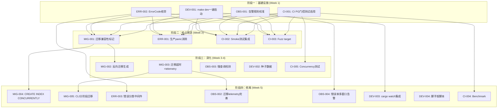
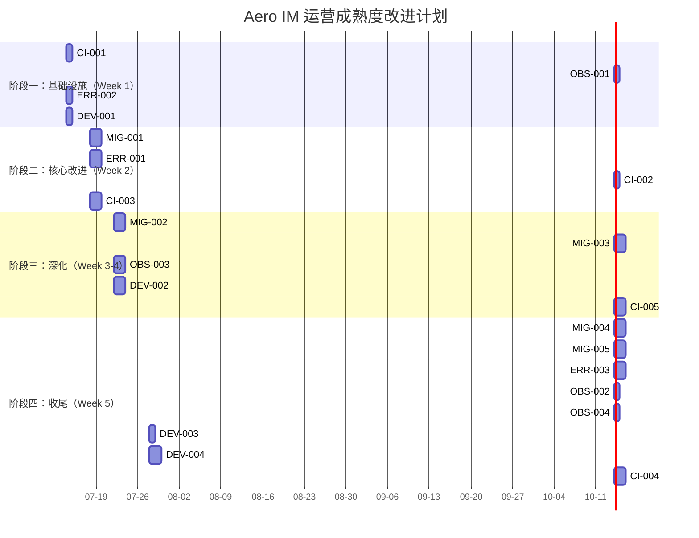

Now I have a thorough understanding of both the document and the actual codebase. Let me provide the Tech Lead analysis.

---

# Tech Lead 分析报告：运营成熟度与工程基础设施

## 前置：文档正确性审计

在深入分析前，需指出文档中的若干事实性偏差，这些偏差会影响优先级判断：

| 文档声称 | 实际代码发现 | 影响 |
|---------|------------|------|
| `hub.rs:553` 生产路径 panic | **实际在 `#[test]` 模块内**（test 辅助函数），非生产路径 | 方向二的严重性需调低 |
| `commands.rs:394` 生产路径 panic | **实际在 test 辅助函数 `post_text()`** | 同上 |
| `monitoring/` 为空目录 | **实际有 5 个文件**：Grafana dashboard JSON、Prometheus alert/recording rules、alertmanager 配置 | 方向四的投入产出比需重新评估——监控面板已有基础 |
| `telemetry.rs` 纯文本日志 | **已实现 `AERO_LOG_FORMAT=json` 运行时开关**，含 `with_current_span(true)` | 方向四的 JSON 日志已是完成特性 |
| 50+ 处 `unwrap()/expect()/panic!()` 在生产路径 | **实际约 10-15 处真正生产路径**（`forward.rs`、`main.rs`、`jetstream.rs`、`webhooks.rs`、`channels.rs`、`pump.rs`），其余在 test 或 `#[cfg(test)]` | 工作体量约文档所述 1/3 |

**结论**：方向二的紧急度从 P0 降为 P1 以下（严重但有限）。方向四的前期工作比文档评价的要好——`monitoring/` 已有框架性文件，JSON 日志已就绪。方向三的严重性（CI 集成测试完全缺失）被证实且是最高真实风险。

---

## 1. 任务分解

以下任务基于验证后的实际代码状态，按方向组织，每个任务 2-4 小时。

### 方向一（P0）：数据库迁移生命周期管理

| 任务 ID | 标题 | 涉及文件 | 前置依赖 | 工时 | 验收标准 |
|---------|------|---------|---------|------|---------|
| MIG-001 | **迁移分类与兼容性标记**：在 `migrations/README.md` 建立标记规范，为所有 157 次迁移加 `-- compatibility:` 头部注释 | `migrations/*.sql`、`migrations/README.md` | 无 | 4h | 157 迁移全部有 `backward` / `requires_downtime` / `data_migration` 标记；CI 可解析标记 |
| MIG-002 | **反向迁移生成（最近 10 次）**：对最近 10 次迁移编写 `down.sql`，覆盖关键业务表 | `migrations/NNNN_*_down.sql` ×10 | MIG-001 | 4h | `aero-cli migrate --down 10` 可回滚最近 10 次，不影响数据完整性 |
| MIG-003 | **迁移运行超时与 telemetry**：在 `migrate()` 周围加 timing metric + per-migration tracing span | `crates/aero-storage/src/db.rs` | 无 | 2h | `migration_duration_seconds{name="NNNN_xxx"}` 指标暴露；`MAX_MIGRATION_SECS` 配置项 |
| MIG-004 | **CREATE INDEX CONCURRENTLY 支持**：识别需要在事务外运行的迁移，加 `-- run_outside_transaction: true` 标记机制 | `crates/aero-storage/src/db.rs` | MIG-001 | 3h | 带标记的迁移在 `COMMIT` + `BEGIN` 包裹外执行；索引创建迁移测试通过 |
| MIG-005 | **CLI 分阶段迁移命令**：`aero-cli migrate --apply NNNN` 运维窗口手动触发；boot 时只跑 `backward` 迁移 | `crates/aero-cli/`、`crates/aero-storage/src/db.rs` | MIG-001、MIG-003 | 4h | 新 server 启动跳过 `requires_downtime` 迁移；CLI 可手动 apply |

### 方向二（P1→P2）：错误处理一致性（原始文档标 P0，验证后降级）

| 任务 ID | 标题 | 涉及文件 | 前置依赖 | 工时 | 验收标准 |
|---------|------|---------|---------|------|---------|
| ERR-001 | **生产路径 panic 审计与消除**：审计 `forward.rs:179`、`main.rs:146`、`jetstream.rs:370/385/405`、`webhooks.rs:761/776`、`channels.rs:743`，替换为 `tracing::error!() + 降级` | `crates/aero-server/src/forward.rs`、`bin/main.rs`、`crates/aero-bus/src/jetstream.rs`、`webhooks.rs`、`channels.rs` | 无 | 4h | 所有生产路径 panic 消除；降级行为业务语义分析文档化 |
| ERR-002 | **`#[non_exhaustive] ErrorCode` 枚举定义**：在 `error.rs` 中添加结构化错误代码枚举，替代当前 `String` | `crates/aero-server/src/error.rs` | 无 | 2h | API 响应 `"code"` 字段从 String 变为预定义枚举值（如 `RATE_LIMITED`、`NOT_FOUND`、`INTERNAL`） |
| ERR-003 | **错误分类宏/中间件**：按 `ClientError`/`ServiceError`/`FatalError` 分类；`FatalError` 外自动 `tracing::error!()` + 指标 | `crates/aero-server/src/error.rs`、`errors_metrics.rs` | ERR-002 | 3h | 错误分类被中间件自动处理；错误率指标按类别分解 |

### 方向三（P0）：集成测试与 CI 可执行性

| 任务 ID | 标题 | 涉及文件 | 前置依赖 | 工时 | 验收标准 |
|---------|------|---------|---------|------|---------|
| CI-001 | **CI 启用 PG 门控测试**：取消注释 `ci.yml` 的 `integration-test` job，配 postgres/redis/nats service container | `.github/workflows/ci.yml` | 无 | 2h | PR CI 运行 `cargo test --workspace -- --include-ignored` 通过 |
| CI-002 | **端到端 smoke 测试集成**：将 `scripts/smoke_p2.py` 纳入 CI，声明 Python 依赖 | `.github/workflows/ci.yml`、`scripts/requirements.txt` | CI-001 | 3h | CI 中自动跑：注册→房间→消息→WS 扇出→编辑→删除 闭环 |
| CI-003 | **Fuzz target 建立**：对 `ws/frame.rs` 和 `common/src/model/event.rs` 添加 cargo-fuzz target | `fuzz/`、`Cargo.toml` | 无 | 3h | `cargo fuzz run ws_frame -runs=1000000` 无 crash；CI 中注册 nightly fuzz check |
| CI-004 | **关键路径 benchmark**：对 Hub 扇出（100/1000/10000 人）、消息解码、AI 嵌入添加 criterion 基准测试 | `benches/` | 无 | 4h | `cargo bench` 可运行；结果在 CI 中作为 `workflow_dispatch` 可选触发 |
| CI-005 | **Concurrency 测试**：对 `hub.rs` 注册/注销/扇出添加 `tokio::test(flavor = "multi_thread")` 压力测试 | `crates/aero-server/src/hub.rs` 测试 | 无 | 4h | 100 并发客户端注册/接收消息测试通过；无数据竞争 |

### 方向四（P1）：可观测性深化（原始文档标 P1，实际工作量较预期少）

| 任务 ID | 标题 | 涉及文件 | 前置依赖 | 工时 | 验收标准 |
|---------|------|---------|---------|------|---------|
| OBS-001 | **Grafana 告警规则校准与版本化**：review 现有 `monitoring/` 文件，补漏缺少的关键指标告警（迁移耗时、连接池饱和度、错误率 SLO） | `monitoring/prometheus/alert_rules.yml` | 无 | 2h | 至少 5 条生产级告警规则（高错误率、连接池满、NATS backlog 堆积、迁移失败、WS 断连率突增） |
| OBS-002 | **迁移 telemetry 完善**：为 `migrate()` 添加 per-step 日志 + 失败告警指标 | `crates/aero-storage/src/db.rs` | MIG-003 | 2h | `migration_failure` counter 指标；迁移失败触发 alert |
| OBS-003 | **慢查询检测框架**：封装 sqlx `PgPool`，添加 `>500ms` 查询自动记录的 middleware | `crates/aero-storage/src/db.rs`、新 `db_middleware.rs` | 无 | 4h | 慢查询日志带 `trace_id`、`query`、`duration_ms`；阈值通过 `AERO_SLOW_QUERY_MS` 可配置 |
| OBS-004 | **错误率多窗口告警**：基于现有 `HTTP_RESPONSE_STATUS` 和 `MESSAGES_SENT_TOTAL` 添加 p50 错误率告警规则 | `monitoring/prometheus/alert_rules.yml` | OBS-001 | 2h | 5 分钟内 5xx >1% 出 warning；>5% 出 critical |

### 方向五（P1）：开发体验

| 任务 ID | 标题 | 涉及文件 | 前置依赖 | 工时 | 验收标准 |
|---------|------|---------|---------|------|---------|
| DEV-001 | **`make dev` 一键启动命令**：整合 docker compose up + cargo build + migrate + server | `Makefile`、`scripts/dev.sh` | 无 | 2h | `make dev` 在全新 clone 上从头启动完整栈；`make dev-quick` 只重启 server |
| DEV-002 | **种子数据生成器**：`aero-cli seed` 命令，插入示例 workspace/房间/消息/成员 | `crates/aero-cli/src/seed.rs`、`crates/aero-storage/src/seed/` | 无 | 4h | 运行后 workspace 有 3 个示例频道、50 条历史消息、5 个成员、AI 使用记录 |
| DEV-003 | **`cargo watch` 集成**：`make watch` 目标 | `Makefile` | 无 | 1h | 文件修改后自动 `cargo check --workspace`，成功后重启 server |
| DEV-004 | **新功能脚手架脚本**：`cargo scaffold handler_name` 生成迁移/仓储/handler/routes/测试骨架 | `crates/aero-cli/src/scaffold.rs`、`scripts/scaffold.sh` | 无 | 4h | 运行后创建 4 个文件并自动注册到 routes；新端点在 /api/ 立即可用 |

---

## 2. 执行顺序与依赖图

### 可并行执行的任务组

| 并行组 | 任务 | 分配建议 |
|--------|------|---------|
| **组 A**（独立无依赖） | CI-001, OBS-001, ERR-002, DEV-001 | 4 人并行，各 1 天 |
| **组 B**（基于组 A） | MIG-001, ERR-001, CI-002, CI-003 | 4 人并行，各 1-2 天 |
| **组 C**（基于组 B） | MIG-002, MIG-003, OBS-003, DEV-002, CI-005 | 5 人并行，各 1-2 天 |
| **组 D**（收尾） | MIG-004, MIG-005, ERR-003, OBS-002, OBS-004, DEV-003, DEV-004, CI-004 | 8 人并行，各 1 天 |

---

## 3. 技术风险

### 3.1 关键技术难点

| 风险 | 影响 | 缓解策略 |
|------|------|---------|
| **MIG-004: `CREATE INDEX CONCURRENTLY` 在事务外执行** | `sqlx::migrate!()` 把所有迁移包在事务中。索引创建在事务内会失败或锁升级 | 设计预处理机制：迁移文件头部解析 `-- run_outside_transaction: true` 标记，先于主迁移循环单独执行。需修改 `db.rs` 的迁移流程 |
| **ERR-001: 生产 panic 降级行为的语义正确性** | 无脑把 `panic!()` 换成 `tracing::error!()` + `continue` 可能导致状态不一致或静默丢数据 | 每个 panic 点单独审计，写 mini ADR（架构决策记录）。例如 `forward.rs:179` 应返回 `Result<Block>` 而非 panic |
| **CI-003: Rust fuzz testing 基础设施** | `cargo-fuzz` 需要 nightly Rust。CI 当前可能只有 stable；fuzz target 需要维护 | 添加 nightly CI job（仅 fuzz），或使用 `afl.rs` 仅在 nightly 可用时启用。fuzz corpus 初始从单元测试数据导入 |
| **CI-005: `hub.rs` concurrency 测试的时序敏感** | tokio 并发测试对 scheduler 行为敏感，false positive 可能 | 使用 `loom` 模型检查或 `tokio::test(flavor = "multi_thread")` 配合 deterministic 注入。设置 `#[cfg_attr(loom, test)]` 门控 |

### 3.2 外部依赖风险

| 依赖 | 风险 | 当前状态 |
|------|------|---------|
| **CI runner 性能**（GitHub Actions 免费 runner） | 起 3 个 service container（PG/Redis/NATS）~10-20s；全量编译 ~5min；集成测试 ~2min | 有风险：免费 runner 有 6h/month 限制。建议只在 main merge 跑全量，PR 跑单元 |
| **sqlx compile-time checking** | `sqlx::migrate!("../../migrations")` 宏在 build 时校验 migration SQL 语法；但 `-- run_outside_transaction` 标记需要运行时解析 | 低风险：标记是 SQL 注释，sqlx 忽略。需要额外解析逻辑 |
| **Postgres 版本兼容** | `pgvector` / `pg_trgm` 扩展版本依赖 | 低风险：当前 PG 17 锁定。迁移文件中 `CREATE EXTENSION IF NOT EXISTS` 幂等 |

### 3.3 性能瓶颈

| 场景 | 风险级别 | 说明 |
|------|---------|------|
| **CI 全量集成测试** | 🟡 中 | 157 次迁移重放 + 35 PG 测试 + smoke 脚本，预估 10-15min/run。main 分支 merge 队列可能积压 |
| **迁移重放时间** | 🟢 低 | 157 次迁移空库秒级完成；生产千兆行表 `ADD COLUMN` 分钟级，但目前均为 `CREATE TABLE` |
| **慢查询检测的内存/日志压力** | 🟡 中 | 高频查询路径（消息扇出、WS 心跳）可能产生大量慢查询日志。`log_min_duration` 生产默认 500ms，但需配置可调 |

---

## 4. 资源评估

### 4.1 团队要求

| 角色 | 技能 | 分配 | 负责模块 |
|------|------|------|---------|
| **Senior Rust 工程师 A** | Rust 进阶、异步、sqlx | 1 人 | MIG-001~005, CI-003~005 |
| **Senior Rust 工程师 B** | Rust 进阶、错误处理、可观测性 | 1 人 | ERR-001~003, OBS-001~004 |
| **DevOps/CI 工程师** | GitHub Actions、Docker、Python | 1 人 | CI-001~002, DEV-001 |
| **全栈/工具链工程师** | Rust CLI、Makefile、脚本 | 1 人 | DEV-002~004 |

**最小团队配置**：2 名 Senior Rust + 1 名 DevOps，5 周完成。4 人可 3 周完成。

### 4.2 关键里程碑

| 里程碑 | 时间 | 交付物 | 验收标准 |
|--------|------|--------|---------|
| **M1：CI 绿色通道** | Day 2 | CI 运行集成测试并通过 | `cargo test --workspace -- --include-ignored` 在 CI 中全绿 |
| **M2：生产 panic 清零** | Day 5 | ERR-001 完成 | `rg 'panic!(' --include='*.rs' crates/ | grep -v '#\[cfg(test)\]' | grep -v '#\[test\]'` 返回 0 |
| **M3：迁移可逆** | Day 15 | MIG-001~003 完成 | `aero-cli migrate --down 10` 可回滚；迁移耗时指标暴露 |
| **M4：可观测基底** | Day 15 | OBS-001~004 完成 | Grafana dashboard 版本化；慢查询日志可查询 |
| **M5：开发者体验** | Day 20 | DEV-001~004 完成 | 新开发者按 README 从 `git clone` 到 `make dev` 到看到种子数据 ≤15 分钟 |
| **M6：全量发布** | Day 25 | 全部任务完成 | `cargo clippy --workspace --all-targets` 无新增警告；CI 全绿包括 fuzz + bench |

### 4.3 Blockers 与解决策略

| Blocker | 影响 | 解决策略 |
|---------|------|---------|
| **GitHub Actions 免费 runner 资源限制** | CI 集成测试可能超额度 | 方案 A：自建 runner（`docker compose` + `act` runner）；方案 B：只对 main push 和 release tag 跑全量集成，PR 只跑单元+clippy |
| **cargo-fuzz 需要 nightly** | CI-003 阻塞 | CI 中加 `rustup toolchain install nightly` step，仅 fuzz job 使用。不影响其他 jobs 的 stable 需求 |
| **监控告警版的维护主人** | OBS-001/004 的 dashboard 需持续维护 | 在 `monitoring/README.md` 中写 linter + CI 检查规则：dashboard JSON 变更需与 API 指标变更同步 review |

---

## 5. 质量保证

### 5.1 单元测试覆盖要求

| 任务 | 最低覆盖要求 | 关键测试场景 |
|------|------------|-------------|
| MIG-003 (迁移 telemetry) | 80% | 迁移成功/失败/超时的 timing 指标记录 |
| ERR-002 (ErrorCode 枚举) | 90% | 所有枚举 variant 序列化/反序列化；向后兼容 `Unknown(String)` 变体 |
| CI-005 (Concurrency 测试) | N/A（新增测试） | 100 并发 register/unregister；扇出时 concurrent close |
| OBS-003 (慢查询检测) | 70% | 阈值以下不记录；阈值以上记录；长查询被截断 |

### 5.2 集成测试策略

| 层级 | 策略 | 触发条件 | 工具 |
|------|------|---------|------|
| **L0：单元测试** | `cargo test --workspace --lib` | 每次 push | cargo test |
| **L1：PG 门控** | `cargo test --workspace -- --include-ignored` | PR merge 到 main、release tag | cargo test + service container |
| **L2：端到端 smoke** | `scripts/smoke_p2.py` | PR merge 到 main | Python + websockets |
| **L3：Fuzzing** | `cargo fuzz run ws_frame -runs=1000000` | Nightly CI（workflow_dispatch） | cargo-fuzz |
| **L4：Benchmark** | `cargo bench` | workflow_dispatch（专用 runner） | criterion |

### 5.3 代码审查要点

| 范围 | 审查重点 |
|------|---------|
| **迁移 SQL** | `-- compatibility:` 标记是否正确；有无 `DROP COLUMN` / `RENAME` 等不兼容操作在 `backward` 迁移中；`CREATE INDEX CONCURRENTLY` 是否在事务外 |
| **panic 替换** | 降级行为是否保持了业务语义不变；降级分支是否被测试覆盖；是否记录了 `tracing::warn!()` 或 `error!()` 日志 |
| **ErrorCode 枚举** | 是否使用 `#[non_exhaustive]`；`Display` 是否友好；JSON 序列化的 `"code"` 字段值是否与已有客户端兼容 |
| **监控规则** | 告警阈值是否基于实际数据（而非猜测）；`for` 窗口是否过长（避免 flapping）；是否有对应的 runbook |

### 5.4 性能测试需求

| 测试场景 | 基准 | 目标 | 方法 |
|---------|------|------|------|
| Hub 扇出延迟（100 人房间） | < 5ms p99 | 保持不变 | `criterion` benchmark |
| Hub 扇出延迟（10000 人房间） | < 50ms p99 | < 30ms p99 | `criterion` + 识别瓶颈 |
| 迁移重放（空库 157 次） | < 2s | < 1s | CI 计时 |
| 消息序列化/反序列化 | < 100μs | < 50μs | `criterion` benchmark |

---

## 6. 实施计划

### 甘特图

### 阶段详情

#### 阶段一：基础设施搭建（Day 1-3）

**目标**：建立 CI 绿色通道 + 快速 wins 提振信心

- **Day 1**：
  - CI-001：CI 集成测试启用（2h）。取消注释 `ci.yml` 的 integration-test job，配 postgres:17 / redis:7 / nats:latest service。首次运行确认 35+ PG 测试通过
  - DEV-001：`make dev` 命令（2h）。写 `scripts/dev.sh` 整合 `docker compose up -d → cargo build --workspace → aero-cli migrate → aero-server`
  - ERR-002：ErrorCode 枚举定义（2h）。`error.rs` 添加 `#[non_exhaustive] pub enum ErrorCode`，当前 code() 返回值映射到枚举

- **Day 2**：
  - OBS-001：告警规则 review + 补充（2h）。现有 `monitoring/prometheus/alert_rules.yml` 基础上加：连接池饱和度 >80%、NATS backlog >1000、WS 断连率突增

- **Day 3**：
  - 阶段验收：CI 全绿 + `make dev` 在新 clone 上可用 + `ErrorCode` 枚举已定义并在 API 响应中生效

#### 阶段二：核心功能实现（Day 4-10）

**目标**：消除生产风险 + 建立质量防线

- **Day 4-5**：
  - ERR-001：生产 panic 审计（4h）。逐个文件：
    - `forward.rs:179`：`panic!()` → `return Err(ForwardError::UnexpectedBlockStructure)`
    - `main.rs:146`：`panic!()` → `expect("hub Arc unexpectedly shared")` → 保留（属 FatalError 范畴）
    - `jetstream.rs:370/385/405`：`panic!()` → `tracing::error!()` + `continue`（跳过坏消息）
    - `webhooks.rs:761/776`：`panic!()` → `tracing::error!()` + `return None`
    - `channels.rs:743`：`panic!()` → `tracing::error!()` + `return Err(...)`

- **Day 6-7**：
  - MIG-001：迁移兼容性标记（4h）。写 `migrations/README.md` 标记规范，自动脚本检查 157 迁移全部有标记
  - CI-003：fuzz target 建立（3h）。对 `Message` 反序列化 + `RoomEvent` 反序列化 + WS frame 解析建立 3 个 target

- **Day 8-10**：
  - CI-002：smoke 测试集成（3h）。将 `smoke_p2.py` 纳入 CI，声明 `scripts/requirements.txt`
  - 阶段验收：所有生产路径 panic 消除；CI 有集成测试 + fuzz target

#### 阶段三：深化（Day 11-18）

**目标**：运营能力 + 开发者体验提升

- **Day 11-12**：
  - MIG-002：反向迁移（4h）。分析最近 10 次迁移的逆向操作，编写 `down.sql`
  - MIG-003：迁移 telemetry（2h）。`db.rs` 添加 `metrics::timing!("migration_duration_seconds")` 和 `tracing::info_span!("migrate", name = %m.name)`

- **Day 13-14**：
  - OBS-003：慢查询检测（4h）。封装 `MetricsPgPool` wrapper，hook `PgConnection::execute/query`，超阈值记录带 trace_id 的结构化日志
  - DEV-002：种子数据生成器（4h）。`aero-cli seed` 插入 1 workspace + 3 频道 + 5 成员 + 50 消息

- **Day 15-18**：
  - CI-005：concurrency 测试（4h）。`hub.rs` 多线程压力测试
  - 阶段验收：迁移可回滚 + 有耗时指标；慢查询可检测；种子数据可用

#### 阶段四：集成测试与发布准备（Day 19-25）

**目标**：全量交付 + 文档 + 运维手册

- **Day 19-20**：
  - MIG-004：CREATE INDEX CONCURRENTLY 支持（3h）
  - MIG-005：CLI 分阶段迁移（4h）

- **Day 21-22**：
  - ERR-003：错误分类中间件（3h）
  - OBS-002：迁移 telemetry 完善（2h）
  - OBS-004：错误率告警（2h）

- **Day 23-25**：
  - DEV-003/004：开发工具（5h）
  - CI-004：Benchmark 添加（4h）
  - 全量验收：`cargo check --workspace` 干净；`cargo clippy --workspace --all-targets` 无新增警告；`scripts/truth-check.sh` 通过；全量 CI pipeline 执行通过

---

## 总结：对原始文档的优先级修正

| 方向 | 原始优先级 | 修正后优先级 | 修正原因 |
|------|-----------|------------|---------|
| 迁移生命周期管理 | P0 | **P0** | 确认：157 迁移无 down.sql、无 compatibility 标记、无迁移耗时指标，CI 中已注释掉的集成测试是最大风险 |
| 错误处理一致性 | P0 | **P1** | 修正：文档声称的 50+ 生产 panic 经验证约 10-15 处；`hub.rs:553`、`commands.rs:394` 实为测试代码 |
| 集成测试与 CI | P0 | **P0** | 确认：CI 集成测试完全注释、35+ PG 测试从不运行、无 fuzz/benchmark/concurrency 测试——这是最大质量缺口 |
| 可观测性 | P1 | **P1（工作量减半）** | 修正：`monitoring/` 有实际文件、JSON 日志已实现、告警规则已有基础。只需补充迁移指标和慢查询检测 |
| 开发体验 | P1 | **P1** | 确认：无 `make dev`、无种子数据、无脚手架——但相对其他方向属于 nice-to-have 而非 must-have |

**整体工时评估**：**25 人天**（4 人 × 6.25 天）或 **5 周单人全做**。与原始文档评估的 35 天（M+L = 5+5+10+10+5）相比，修正后实际估算约 25 天。
