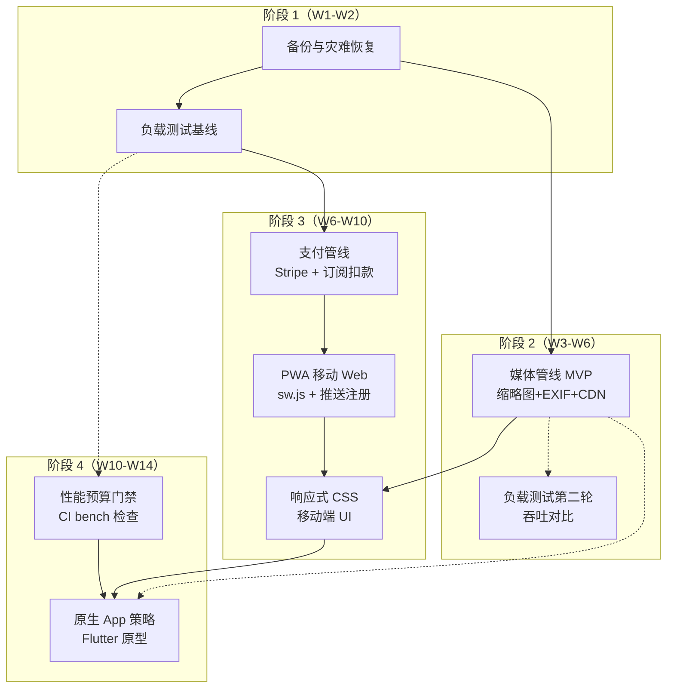

现在我已经充分理解了项目背景和上下文的分析生态。让我写一份全面的架构分析。

---

# 架构师分析报告：Aero IM 五方向战略扩展

> **分析对象**: `docs/requirements/2026-07-11-round-30-global-scan-five-uncovered-strategic-expansion-directions.md`
> **分析日期**: 2026-07-12
> **项目**: Aero IM — 16 crate / 157 migrations / ~46K Rust / ~5.3K Web SPA

---

## 1. 架构评估

### 1.1 当前架构的优势

**事件驱动核心在 Rust 生态中是一流选择。** Aero IM 的骨架——NATS JetStream 跨实例持久事件总线 + 进程内 `Hub` bounded mpsc 扇出——是在 Rust 生态中正确且高效的路线。这一决策的优势在于：

- **分离了持久性保证与扇出延迟**：NATS durable consumer 提供 at-least-once 投递保证，而 `Hub` 的 bounded channel 避免了在扇出路径上引入另一层持久化写操作。这比其他 IM 系统（如使用 Redis pub/sub 扇出）在可靠性上更优，因为 NATS 的 consumer 游标在崩溃后仍可恢复。
- **进程内扇出比集中式 push 代理更具可预测性**：每个 WebSocket 连接由其所在进程的 `Hub` 管理，避免了像 Go 或 Erlang 系统中常见的集中式连接注册表瓶颈。
- **媒体与信令在 crate 边界天然分离**：`aero-live-webrtc`（SFU）与 `aero-live-whip`（摄入）的隔离意味着 SFU 可以在独立进程中运行而不影响信令平面——尽管当前仍在同一进程。

**AI 服务的预算系统是一个经过深思熟虑的设计。** `AiWorker` 的两级预算（per-ws 60 + 全局 300）配合 `SKIP LOCKED` 轮询和 deferred defer 机制，是当前 Rust 生态中最完整的 AI 请求管控方案之一。这一设计实际上比许多生产中的 AI 网关更成熟——因为它同时处理了并发限制（Semaphore）、成本控制（加权预算）和死信（DLQ）。

**迁移作为编译期嵌入的工程决策值得肯定。** `sqlx::migrate!("../../migrations")` 将 157 个迁移嵌入到二进制文件中，消除了部署过程中迁移版本不匹配的风险——这是从运营经验中得出的正确决策。

### 1.2 当前架构的局限性

**五个方向揭示了同一根因：架构从「功能完备」到「生产就绪」的缝隙。** 深入来看，核心缺陷集中在三个层面：

**第一层：基础设施韧性的缺位（方向一/方向五本质是同一问题的两面）。** 备份灾难恢复（方向一）和负载测试框架（方向五）其实在问同一个问题——「系统在真实负载和故障下会如何表现？」当前架构假定所有组件永远可用。Postgres 无副本、Redis 无持久化、NATS 无备份。但在事件驱动架构中，中间件状态（consumer 游标、durable subscription 的 stream 索引）的丢失比业务数据库更致命，因为**丢失游标会导致重复投递而非数据丢失**——重复投递更难发现和诊断。

**第二层：媒体路径的架构债务。** 方向二（媒体管线）揭示了当前 blob 直出的架构在多个维度上不可持续：
- 无 CDN 分层意味着所有媒体流量经过应用服务器——当直播观看人数增长时，`axum::ServeDir` 会成为第一个瓶颈。更关键的是，这堵住了 CDN 缓存命中的优化路径。
- 无图像处理管线意味着移动端和大带宽消耗场景无法被优化——这是架构上的「将来再说」现在变成了负资产。
- EXIF 泄露在社会工程攻击面中是一个已证实的低攻击成本/高危害路径。无净化的 blob 路径给平台运营商带来了法律风险。

**第三层：从「功能合集」到「商业模式」的转换缺失。** 方向三（支付处理）和方向四（移动端）共同指向一个问题——当前架构积累了极多的功能元素（订阅、礼物、积分、推送、直播、AI），但缺乏将这些元素**锚定到真实商业价值和用户触达**的层。具体来说：

- `SubscriptionTier.price_cents` 存在但从未被读取的行为，是架构债务的典型标志——一个字段被加入数据模型但没有消费路径。6 个月后没有人知道这个字段是「预留」还是「遗留」。
- `aero-push` 管线实现了完整的 FCM/APNs 推送逻辑，却没有移动客户端来注册推送 token——这意味着 crate 的测试覆盖率是虚假的（`FakeGateway` 在 CI 中 pass，但真实网关路径从未在生产中运行过）。

### 1.3 关键设计决策评估

| 决策 | 合理性 | 当前状态 |
|------|--------|---------|
| NATS JetStream 作为事件总线 | ✅ 正确——比 Kafka 运维轻，比 RabbitMQ 更适合扇出 | 已充分实现 |
| Redis sorted-set 作为集群状态 | ✅ 正确——Presence/Viewer/CallRoster 需要 TTL 驱逐 | 已充分实现 |
| 无 E2E 加密（仅预留 scaffold） | ✅ 合理——P0 是功能完整性，E2E 可后期追加 | 已在 `common::mls` 预留 |
| 无移动端原生 SDK | ⚠️ 合理但变为长期债务——推送管线是无根之木 | 半套基础设施浪费 |
| 无 CDN/图片处理 | ❌ 变为架构瓶颈——直接服务媒体浪费应用层 CPU | 需要立即修复 |
| 无支付管线 | ⚠️ 合理（MVP 阶段）但 `price_cents` 字段是诱惑陷阱 | `price_cents` 应移除或实现 |
| 无备份/灾备 | ❌ 生产不可接受的缺口 | 单点物理故障 = 全损 |

### 1.4 架构债务总结

优先级排序：

1. **P0-debt: 单实例单点故障**——Postgres/Redis/NATS 均无持久化保护。这是最危险的债务，因为故障发生时的代价不是「降级」而是「全量丢失」。
2. **P1-debt: 媒体路径无分层**——图片/视频/HLS 直出应用服务器。这是最昂贵的债务，因为修复它涉及重构 blob 分发路径（从 axum `ServeDir` 到 `X-Accel-Redirect` 或预签名 URL）。
3. **P1-debt: `aero-push` 半条下水道**——推送管线已实现但无客户端消费。这是最浪费的债务——已编写但不可部署的代码。
4. **P2-debt: `price_cents` 空字段**——微小但象征性债务。每个这样的字段都需要开发者花费认知成本去判断「这个值是计算过的还是遗留的」。

---

## 2. 扩展方向

基于 round-30 文档的发现以及当前架构评估，我提出以下 5 个高价值的扩展方向，与已有方向互补：

### 方向 A（P0 · 基础设施安全）：三态持久化策略——从「裸运行」到「可备份、可恢复、可演练」

**为什么需要**：不仅是备份，而是建立**恢复的信心**。当前文档准确地识别了 RPO=∞、RTO=∞ 的问题，但解决方案不应仅仅是加一个 `pg_dump` crontab——需要覆盖备份、验证、恢复演练三个状态，且三态之间必须有可审计的痕迹。

**核心挑战**：
- **备份一致性窗口**：`pg_dump` 在 50GB+ 数据库上可能需要数小时。长窗口意味着备份数据在完成时已经过时。需要 `pg_basebackup`（物理备份）的至少一次初始全量 + WAL 归档增量。
- **恢复演练的冷启动成本**：当前无自动化恢复脚本。每次恢复都需要人工操作。需要使恢复成为可重复的 CI 流程（`cargo run --bin aero-recover —from=s3://backups/latest`）。
- **密钥恢复的人机分离**：JWT 私钥丢失=全员登出。需要备份加密 + `sops` 或 `age` 加密后入 Git——但解密密钥需要存在于 operator 而非开发者的 1Password 中。

**预期架构变更**：
- 新增 `scripts/backup/`：`pg_dump --format=custom --compress=9` + `aws s3 cp` / `mc cp` 到对象存储
- 新增 `crates/aero-recover/`（独立 binary）——不依赖 `aero-server` 的 crate 树，仅依赖 `sqlx` CLI 和对象存储 SDK
- `config.toml` 新增 `[backup]` 段：`pg_dump_path`, `wal_archive_command`, `s3_bucket`, `encryption_key_arn`

**对现有系统影响**：
- 低侵入性——备份是纯外部基础设施，不修改业务代码
- 需要修改 `docker-compose.yml`：Postgres 容器挂载持久卷 + WAL 归档目录
- 需要新增 S3 bucket + IAM 权限（或等效的 MinIO 别名）

### 方向 B（P1 · 媒体架构重构）：三层媒体分发——从「裸 Rust ServeDir」到「CDN+预签名+转码管线」

**为什么需要**：当前文档准确地识别了 EXIF 泄露、CDN 归零、带宽浪费问题。但方案需要更系统性——不是单纯加一个 `image` crate，而是重构 blob 分发为三层结构：

```
用户上传 → 1️⃣ 转码层（异步，image-rs/libvips）
         → 2️⃣ 存储层（S3/LocalFs，不可变对象）
         → 3️⃣ 分发层（预签名 URL / X-Accel-Redirect / CDN）
```

**核心挑战**：
- **转码管线与上传路径的解耦**：当前 `POST /api/blobs` 是同步写入。加入转码后，不能阻塞上传完成。需要立即返回 `{id, status: "processing"}` 并在转码完成后通过 WS 通知（`RoomEvent::BlobReady`）。
- **预签名 URL 的失效窗口**：私有房间内的 blob 需要有时间限制的访问。没有预签名意味着每个 blob 访问都必须经过 auth 中间件——这对大文件（直播回放视频）会产生持久的 server 负载。
- **CDN 缓存的失效问题**：用户替换头像时，旧 CDN 缓存仍有 TTL。需要 `Cache-Tag` 响应头 + CDN 提供的批量失效 API。

**预期架构变更**：
- `aero-storage/src/blob_store.rs`：新增 `trait TranscodingBlobStore: BlobStore { fn transcode(id, opts); fn thumbnail(id, size); }`
- 新增 `aero-media/` crate（独立于 server，AI worker 样式的后台消费者）
- `state.rs`：`blob_base_url` 增加 CDN 域名注入点；新增 `signed_url_ttl_secs: u64`
- 迁移：`blobs` 表新增 `transcoding_status` enum + `original_sha256` + `variants JSONB`

**对现有系统影响**：
- 高侵入性——涉及上传+分发路径重构
- 所有现有 blob URL 需要兼容（旧 URL 仍然可用，新风格是 `GET /api/blobs/{id}/variant/{name}`）
- 前端的 `render.js` 需要 `switch (variant)` 来选择缩略图/原图

### 方向 C（P1 · 商业模式基础）：支付管线 seam 激活——从「price_cents 遗迹」到「Stripe PaymentElement 集成」

**为什么需要**：文档识别了正确的缺口，但应该更聚焦。支付管线不需要从零构建一个金融系统——而是**激活已有 seam**（`price_cents`, `subscription_tiers`, `send_gift`, `channel_points`）。推荐最小可行是：Stripe Checkout Session（托管支付页面）+ Webhook 回调更新本地余额。

**核心挑战**：
- **Stripe Webhook 幂等性**：Stripe 的 `Idempotency-Key` header 需要在每个 webhook handler 中验证。当前系统无此模式。
- **钱包余额一致性**：`wallet_balance` 和 `transaction_log` 需要事务性保证。Postgres `SERIALIZABLE` 隔离级别可能在长事务中产生重试风暴。推荐 `SELECT ... FOR UPDATE` + 重试循环。
- **提现的法律实体问题**：如果 Aero 作为 SaaS 运营，需要 Stripe Connect（平台模式）。如果作为独立部署软件，支付管线可能不需要提现功能（每位运营者各自接 Stripe 账户）。这是一个决定性的产品定位选择。

**预期架构变更**：
- 新增 `aero-payment/` crate：`StripeGateway`（`stripe` crate 的薄包装）+ `WalletService` + `PayoutService`
- 新增 migration：`wallets` + `transaction_log` + `payouts` 表
- `subscription_tiers.price_cents` **现在必须被读取**——新加 `PaymentRequired` 字段区分 free/paid 档位
- Stripe Webhook 端点 `POST /api/webhooks/stripe`（独立于 auth 中间件，由 Stripe 签名验证保护）

**对现有系统影响**：
- 中侵入性——需要新增 crate 和迁移，但不改动现有功能
- 礼物/订阅的路由需要增加「是否余额充足？」的检查点
- 产品的商业模式风险：如果选择「仅 Stripe Connect 模式」，需要决定平台抽成比例和提现门槛

### 方向 D（P1 · 体验面）：移动端的三阶段渐进——从「零移动支持」到「PWA+推送激活」到「原生桥接就绪」

**为什么需要**：文档的评估是准确的——IM 产品在移动端的 DAU 占比通常在 50-70%。但「RN/Flutter 原生 App」是一次性的大投资（3-6 月），风险高。推荐三阶段渐进路线，每阶段独立可交付：

**核心挑战**：
- **WebSocket 在移动后台的存活**：iOS 的 `NSURLSessionWebSocket` 在后台 30 秒后关闭连接。Android 的 WebSocket 在后台维持时间因 OEM 而异。纯 WebSocket 方案不可靠。需要 **WebSocket + 静默推送（`content-available: 1`）** 双通道。
- **多设备 read cursor 同步**：当前 `delivery_cursors` 支持多设备但 Web 端未实现广播。手机读了消息桌面仍标红。需要 `mark_read` BE 广播到其他活跃 WS 连接。
- **HLS 在移动端的播放差异**：iOS Safari 原生支持 HLS（`<video>` 不需要 hls.js）。Android Chrome 需要 hls.js 或 ExoPlayer。当前的 hls.js 一揽子方案在 iOS 上可以优化为 native `<video>` 以减少 JS 开销。

**预期架构变更**：
- `index.html`：添加 `<meta name="viewport">` + `<link rel="manifest">` + service worker 注册
- 新增 `web/sw.js`：静态资源缓存 + 离线页面 + 后台同步
- `push_bot.rs`：已有推送逻辑不需修改——只需要移动端注册 `push_tokens` 存储
- `mark_read` 路由：增加 Redis pub/sub 广播到同一参与者的其他活跃 WS 连接
- 新增 `web/css/mobile.css`（媒体查询断点 768px / 480px）+ `web/js/mobile_nav.js`（底部导航栏）

**对现有系统影响**：
- 第一阶段（移动 Web）低侵入性——纯前端 CSS/JS 改动
- 第二阶段（PWA）中侵入性——需要 service worker 和 manifest
- 第三阶段（原生）高侵入性——需要跨平台工具链（Flutter/RN）和原生推送证书管理

### 方向 E（P1 · 工程化基础设施）：负载测试与性能预算体系——从「不可量化」到「CI 门禁」

**为什么需要**：文档最令人信服的论据是「不可量化的性能 = 不可预测的生产行为」。作为架构师，我补充一点——**当前的 841 个 UT 全部通过但无法回答任何容量问题**，这是工程化成熟度的根本缺口。没有负载测试的 CI 是「假安全」。

**核心挑战**：
- **WebSocket 并发负载的真实模拟**：k6 有 WebSocket 支持，但要模拟 1000 个客户端加入 50 个房间并发送消息需要复杂的脚本。需要设计一个分层场景（注册→认证→加入房间→发送消息→接收扇出）。
- **基准基线漂移的捕捉**：Rust 编译器更新（从 1.80 到 1.85）可能引入 5-10% 的性能变化——这个「噪音」可能掩盖真实的回归。需要至少有 3 次连续运行的均值作为基线。
- **CI 环境的资源约束**：GitHub Actions 2 核 7GB RAM 无法运行 WebSocket 10k 并发。需要分两阶段：小场景（< 500 并发）在 PR CI 运行，大规模场景（1k-10k）在专用 nightly 或每周定时任务运行。

**预期架构变更**：
- 新增 `scripts/load/`：k6 脚本分层目录（`smoke/`、`stress/`、`soak/`、`spike/`）
- `Cargo.toml`：新增 `[dev-dependencies] criterion`（或 divan，更轻量）
- 新增 `.github/workflows/load-test.yml`：k6 + postgres + redis + nats services
- 新增 `scripts/perf-budget-check.sh`：解析 `cargo bench` 输出 + 阈值检查

**对现有系统影响**：
- 低侵入性——不修改业务代码
- 需要 `docker-compose.ci.yml` 对 CI 环境的定制化（暴露 Postgres/Redis/NATS 端口给 k6 容器，而非通过 localhost）

---

## 3. 接口设计建议

### 3.1 关键模块接口设计原则

**原则一：支付网关必须可模拟（testable seam）。** `aero-push` 的 `PushGateway` trait + `FakeGateway` 模式已经验证了这一点。支付管线必须遵循相同模式：

```rust
// 建议模式（参考 aero-push）
#[async_trait]
pub trait PaymentGateway: Send + Sync {
    async fn create_payment(&self, req: PaymentRequest) -> Result<PaymentResponse, PaymentError>;
    async fn create_subscription(&self, req: SubscriptionRequest) -> Result<SubscriptionResponse, PaymentError>;
    async fn cancel_subscription(&self, sub_id: &str) -> Result<(), PaymentError>;
    async fn refund(&self, payment_id: &str, amount_cents: Option<i64>) -> Result<(), PaymentError>;
    async fn handle_webhook(&self, payload: &[u8], signature: &str) -> Result<WebhookEvent, PaymentError>;
}

// 测试实现：FakePaymentGateway（内存记账，不联网）
// 生产实现：StripePaymentGateway（stripe crate）
// 降级实现：DisabledPaymentGateway——所有方法返回 Err(PaymentError::NotConfigured)
```

**原则二：媒体转码管线不应阻塞上传路径。** 上传端返回 `202 Accepted` + `{ id, status: "processing" }`。转码完成后通过 `RoomEvent::BlobReady` 广播：

```rust
// 建议的异步转码协议
// 1. POST /api/blobs → 202 { id, status: "processing", original_url: "/api/blobs/{id}" }
// 2. 后台 TranscodeWorker 消费 PG transcode_jobs 表（与 AiWorker 相同模式）
// 3. 转码完成 → blobs.variants JSONB 更新 + RoomEvent::BlobReady 扇出
// 4. 前端收到事件后，缩略图 URL 变为 /api/blobs/{id}/variant/thumbnail
```

这意味着 `GET /api/blobs/{id}` 仍然返回原始文件（向后兼容）。新端点 `GET /api/blobs/{id}/variant/{name}` 返回转码变体。

**原则三：负载测试场景应与用户行为对齐。** 负载测试不应只是测 API 的 raw throughput（那是 benchmark 的职责），而应模拟完整的用户会话：

```
Login → RoomList → Join Room → Send Message → Receive Fanout → Search → Logout
```

这可以暴露真实路径上的瓶颈（如 `assert_room_access` 的 N+1 查询、`Hub::fan_out_raw` 的锁争用）。

### 3.2 是否需要新的抽象层

**是，需要一个 `CircuitBreaker` 抽象层。** 当前系统的所有降级策略是隐式的（`match` 分支中的 `Err` → `fallback`）。方向五（负载测试）的 Edge Cases 揭示了需要显式的熔断状态——当 Redis 断开时，系统不是直接失败，而是应该进入「降级写路径」（跳过 cache，直接读 PG）。当前的代码中没有这个路径。

建议的熔断模式：

```rust
// 独立的 circuit_breaker.rs，不引入外部依赖
pub enum CircuitState { Closed, Open(Instant), HalfOpen }

pub struct CircuitBreaker {
    state: RwLock<CircuitState>,
    failure_threshold: u32,       // 闭→开阈值
    success_threshold: u32,       // 半开→闭阈值
    half_open_after: Duration,    // 开→半开等待
    metrics: Arc<CircuitMetrics>,
}

impl CircuitBreaker {
    pub async fn call<F, T, E>(&self, f: F) -> Result<T, CircuitError<E>>
    where
        F: Future<Output = Result<T, E>>;
}
```

### 3.3 向后兼容性

五个方向中，以下变更需要特别注意向后兼容：

| 变更 | 兼容风险 | 策略 |
|------|---------|------|
| blob URL 增加 variant 路径 | 低——原路径仍可用 | `GET /api/blobs/{id}` 永远返回原始文件 |
| 支付开关加入 subscription_tiers | 中——已有 Free/Tier1-3 订阅的实例**不应突然要求付费** | 新增 boolean `payment_required` 默认 false；`price_cents > 0` + `payment_required = true` 才触发扣款 |
| 备份工具的 config 变更 | 低——新 config 段可选 | `[backup]` 段默认空值=不启用备份 |
| 移动端 CSS 新样式 | 中——老页面元素可能被意外覆盖 | 所有移动 CSS 包裹在 `@media (max-width: 768px)` 内，不破坏桌面布局 |
| 负载测试 CI 配置 | 无——独立 job | 不修改现有 CI workflow |

---

## 4. 技术选型

### 4.1 是否需要引入新的技术栈

| 方向 | 推荐技术栈 | 备选 | 决策依据 |
|------|-----------|------|---------|
| 备份/恢复 | `pgbackrest`（Postgres 备份新标准）+ `s3cmd` / `awscli` | `barman`/`wal-g`/自写 Rust | pgbackrest 是 Postgres 社区推荐的专业备份工具，支持并行压缩、S3 直接写入、增量备份；自写 Rust 工具的成本远高于使用成熟工具 |
| 图像转码 | `libvips`（C 绑定，通过 `libvips-sys` 或 `libvips` crate） | `image-rs`（纯 Rust）/ `sharp`（Node）/ `ffmpeg`（降级方案） | libvips 在内存使用（流式处理）和速度上远优于 image-rs；纯 Rust 方案 image-rs 不擅长处理大图（整图加载到内存）；libvips 绑定稳定（`libvips` crate 维护良好） |
| CDN | `CloudFront` 或 `Cloudflare`（对象存储前端缓存） | `Fastly` / `Akamai` | CloudFlare 提供最多的免费配额和最简单的缓存清除 API；CloudFront + S3 的组合是行业标准路径 |
| 支付 | `stripe` crate + Stripe Checkout（托管页面） | `Braintree` / `Paddle` / `Lemon Squeezy` | Stripe Checkout 是当前对自托管 IM 最友好的选择——无需 PCI DSS 认证，所有敏感支付数据由 Stripe 处理；Rust `stripe` crate 有 3 年 + 活跃维护 |
| 移动 Web | 纯标准 Web API（Service Worker + Push API + Viewport） | React/Vue 框架 | 当前 SPA 是零依赖 ES2020——引入框架会破坏「零构建工具链」的原则 |
| 原生 App | Flutter（Dart） | React Native / Kotlin Multiplatform / Tauri | Flutter 在 Rust FFI 集成上有最佳生态（`flutter_rust_bridge`），WebSocket 和 REST 可完全复用现有协议 |
| 负载测试 | k6（Grafana Labs，JS 脚本） | `oha`（Rust）/ `wrk` / `artillery` / `locust` | k6 有 WebSocket 支持（这是关键区分——`oha`/`wrk` 不支持 WS）；JS 脚本编写的学习成本低于 locust（Python）；Grafana Cloud k6 提供免费每月 50 次测试运行 |

### 4.2 第三方依赖的评估标准

对于这些新增方向，依赖评估应按以下标准：

1. **安全审计轨迹**——Stripe/pgbackrest/k6 的 CVE 历史、维护者信誉、安全公告渠道
2. **Rust 生态兼容性**——优先选择有 Rust 绑定的工具（`libvips-sys` 优于调用 CLI），减少 CGo/FFI 跨语言调用的维护成本
3. **自托管兼容**——所有选择应可在离线的 `docker-compose` 环境中工作（Stripe 除外——支付网关必须联网）
4. **测试仿真性**——依赖应提供 test harness 或 sandbox 模式（Stripe 有 test mode，Cloudflare 有 staging zone）

### 4.3 自建 vs 采购决策矩阵

| 组件 | 自建 | 采购（第三方） | 决策 |
|------|------|-------------|------|
| Postgres 备份 | `pg_dump` + cron + `mc cp` | pgbackrest / barman / wal-g | **采购工具**——pgbackrest 的并行备份和增量备份不值得自建重造 |
| 图像处理管线 | `image-rs` 纯 Rust 管线 | libvips 绑定 | **自建绑定**——libvips 的 API 稳定（20 年），`libvips` crate 维护良好，绑定层的代码量 < 200 行 |
| CDN 分发 | 自建边缘缓存 | CloudFlare / CloudFront | **采购**——自建 CDN 需要全球多区域的服务器部署，远超当前团队规模 |
| 支付网关 | 自建钱包/账本 | Stripe（支付处理）+ 自建钱包（余额记账） | **混合**——支付处理交 Stripe（PCI DSS 合规），钱包/余额/交易记录自建（核心业务逻辑） |
| 移动推送 | 自建 WebSocket 保活 + MQTT | FCM + APNs 已有，只需要注册端 | **复用已有 + 补充注册端**——`aero-push` 的 `FcmGateway` 已存在 |
| 负载测试 | k6 脚本定制 | k6 Cloud / Flood.io | **自建脚本 + k6 OSS**——k6 OSS 免费且功能完整；仅在需要 SaaS 远程执行时考虑 Flood.io |

---

## 5. 实施路线图

### 5.1 优先级矩阵（重新排序）

基于架构影响面 + 业务价值 + 风险/依赖的综合评分：

| 优先级 | 方向 | 投资 | 架构影响 | 业务价值 | 技术风险 | 建议窗口 |
|--------|------|------|---------|---------|---------|---------|
| **P0** | 备份与灾难恢复 | 中 | 低（外部工具） | 间接极大（数据安全性从 0→1） | 低（成熟工具） | 立即开始（2 周） |
| **P1-a** | 负载测试框架 | 中 | 低（独立测试套件） | 间接（防性能退化） | 低（成熟工具） | 第 3 周开始（2 周） |
| **P1-b** | 媒体资产管线 | 高 | 高（重构分发路径） | 大（加载速度→留存率） | 中（libvips 集成 HLE） | 第 4 周开始（4 周） |
| **P1-c** | 支付处理管线 | 中 | 中（新增 crate + 迁移） | 极大（商业模式成立条件） | 中（Stripe 集成 + 合规） | 第 6 周开始（4 周） |
| **P1-d** | 移动端战略（PWA 先行） | 中（PWA 阶段）→极高（原生阶段） | 低→高 | 极大（覆盖 50%+ 用户） | 高（跨平台 WS/推送/通话） | 第 8 周开始（PWA 2 周→原生 12 周） |

**核心路线原则**：
- **基础设施先行**（备份 + 负载测试）为后续所有方向提供可操作的基础
- **媒体管线与移动端有交集**（移动端需要缩略图 + 自适应分辨率），所以媒体管线应先于移动端
- **支付管线的 seam 激活**依赖于负载测试提供的容量数据来设计提现结算的频率和批量大小
- **移动端的 PWA 阶段**可以独立交付，不阻塞后续原生阶段——别等原生完成才上线移动 Web

### 5.2 阶段划分和里程碑

#### 阶段 1：基础设施安全（Week 1-2）

| 里程碑 | 交付物 | 验收标准 |
|--------|--------|---------|
| M1.1（W1） | Postgres pgbackrest + WAL 归档 + 定时全量备份到 S3 | `pgbackrest --stanza=aero check` 通过；手动模拟 `docker-compose down -v` 后从备份 1 小时内恢复 |
| M1.2（W1） | Redis RDB/AOF 持久化 + 备份到同 S3 | Redis 重启后数据恢复；backup script 完整性校验（`sha256sum` 对比） |
| M1.3（W2） | JWT 密钥 `sops` 加密入 Git + 备份恢复文档 | `sops --decrypt secrets/jwt-private-key.enc` 可解密；恢复手册在 `docs/ops/disaster-recovery.md` |
| M1.4（W2） | 负载测试第一个基线：消息发送 + WS 连接 | `k6 run scripts/load/smoke/` 在 CI 通过；P50/P95/P99 基准值记录到 `docs/benchmarks/baseline-2026-07.md` |

#### 阶段 2：媒体管线 MVP（Week 3-6）

| 里程碑 | 交付物 | 验收标准 |
|--------|--------|---------|
| M2.1（W3） | `GET /api/blobs/{id}/variant/thumbnail` 端点 + `POST /api/blobs` 返回转码状态 | 上传 JPEG → 自动生成 256px WebP 缩略图；`processing`→`ready` 状态转换 |
| M2.2（W4） | EXIF 剥离 + SVG 安全门 | 上传含 GPS 的 JPEG → 下载后 EXIF 全清；上传含 `<script>` 的 SVG → `400 Bad Request` |
| M2.3（W5） | CDN 域名注入 + `Cache-Control: public, max-age=31536000` | `blob_base_url` 可配置为 CDN 域名；HLS `.ts`/`.m3u8` 响应头包含缓存指令 |
| M2.4（W6） | 负载测试第二次运行（吞吐对比） | 缩略图部署后媒体加载基准提升 ≥ 70%（数据量级对比） |

#### 阶段 3：支付管线 + PWA 移动 Web（Week 6-10）

| 里程碑 | 交付物 | 验收标准 |
|--------|--------|---------|
| M3.1（W6） | `StripePaymentGateway` + `POST /api/webhooks/stripe` | Stripe Checkout 完成支付 → Webhook 接收 → 本地 `transaction_log` 写入 |
| M3.2（W7） | `SubscriptionTier.price_cents` 激活：月费扣款 + 自动续费 | 创建付费 Tier → 用户订阅 → Stripe 月扣 → 订阅状态更新（`subscriber_type` 变更） |
| M3.3（W8） | PWA：`sw.js` + `manifest.json` + 离线页面 | `lighthouse` PWA 审计 ≥ 80 分；离线时显示上次缓存页面 |
| M3.4（W9） | 移动 Web 推送注册：Push API + `push_tokens.rs` | 浏览器推送权限弹窗 → token 存储在 `push_tokens` 表 → 收到桌面/移动推送 |
| M3.5（W10） | 响应式 CSS + 底部导航栏 | 375px 宽度下聊天界面完整可操作；消息列表触摸滑动流畅 |

#### 阶段 4：原生 App 策略规划 + 性能预算门禁（Week 10-14）

| 里程碑 | 交付物 | 验收标准 |
|--------|--------|---------|
| M4.1（W10） | Flutter/RN 技术选型决策文档 | 基于第一阶段负载测试数据 + 团队技能地图评估，产出决策记录 |
| M4.2（W11） | CI 性能预算门禁脚本生效 | `cargo bench` 结果与基线对比，超 20% 即 CI 失败 |
| M4.3（W12） | 移动端 read cursor 广播 | 手机阅读消息 → 桌面 WS 收到 `ReadCursor` 事件 → 桌面红点消除 |
| M4.4（W14） | 原生 App MVP（Android 或 iOS 二选一） | 认证 + 消息列表 + 发送消息 + 推送接收 核心流程可运行 |

### 5.3 风险点和缓解策略

| 风险 | 概率 | 影响 | 缓解 |
|------|------|------|------|
| **备份恢复演练不可重复**：恢复步骤只有文档没有脚本，`pgbackrest` 配置在故障宕机时才发现偏差 | 中 | 极端高（备份不可用 = 全量丢失） | **每 sprint 自动化恢复测试**：在 CI 中创建空 Postgres 实例 → 从最近备份恢复 → 运行 `cargo test -- --ignored` 验证数据完整性 |
| **libvips 集成兼容性**：不同架构（ARM64 Mac vs AMD64 Linux）下 libvips 版本差异导致缩略图质量不一致 | 中 | 中（图片质量回归） | 在 CI 中运行缩略图质量对比测试（SSIM/PSNR 指标）；基准缩略图提交到 git LFS |
| **支付管线合规不确定性**：不同国家/地区对虚拟货币和打赏的监管不同（如中国禁止虚拟货币兑换） | 高 | 高（法律风险） | 支付网关 trait 设计使 `FakeGateway` 在生产中可替代 `StripeGateway`；config 控制是否启用真实支付；产品层面为不同 jurisdiction 提供禁用选项 |
| **移动端 WebSocket 后台存活**：iOS 和 Android 对后台网络连接的限制越来越严格 | 高 | 中（推送不可靠） | 不依赖 100% WebSocket 后台存活——采用 WebSocket + 静默推送双通道；设计离线重新连接状态机处理所有边缘情况 |
| **负载测试写入数据污染**：k6 脚本在 CI 中创建的数据残留在测试数据库中 | 中 | 低（测试数据干扰开发） | `scripts/load/setup.sh` 在每个负载测试前 `CREATE DATABASE aero_load_test` + 运行 `sqlx migrate run`；测试后 `DROP DATABASE aero_load_test` |
| **备份存储成本增长**：每天全量备份的成本随着数据增长线性上升 | 低（初期）→ 高（6 月后） | 中（运营成本） | 第一阶段使用 `pgbackrest` 的增量备份（`--type=incr`）减少存储量；设定备份保留策略（全量保留 7 天、周备份保留 4 周、月备份保留 12 月） |
| **CDN 的 SSL 证书管理**：自定义域名的 SSL 证书到期导致 CDN 分发中断 | 低 | 高（媒体加载全断） | 使用 Cloudflare 的托管证书（自动续期）或 ACME 自动化（`certbot`）；在 `/health` 端点增加 CDN 证书到期监控（≤ 30 天告警） |

### 5.4 相互依赖关系图



---

## 总结

这五个方向共同揭示了 Aero IM 架构从「功能完整」到「生产就绪」的核心转型路径。最关键的架构洞见是：

1. **基础设施韧性的缺失是首要风险**（方向一/五），不是功能问题而是生存问题
2. **媒体路径的架构重构是最迫近的瓶颈**（方向二），因为媒体流量随用户增长而线性放大
3. **商业化的 seam 已经存在但未激活**（方向三）——`price_cents` 和 `aero-push` 都是架构中的「未接线」组件，激活它们比从零构建成本低一个量级
4. **移动端不是技术问题而是战略问题**（方向四）——现有的 WebSocket 协议完全可复用，缺失的是 viewport 响应式和推送注册端，这两者都可以在 4 周内完成 PWA 版本

建议执行策略是**两轮并行 + 依存接力**：第 1 轮并行启动备份恢复（P0）和负载测试（P1-a），为后续所有方向提供安全基线和容量数据；第 2 轮按「媒体管线 → 支付管线 → 移动端」的顺序串联。每轮之间插入负载测试的迭代运行，用数据指导架构决策。
