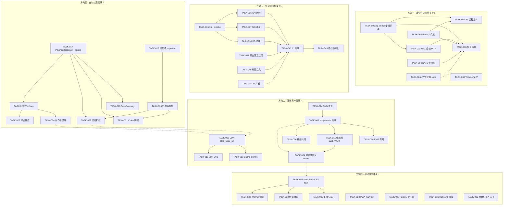
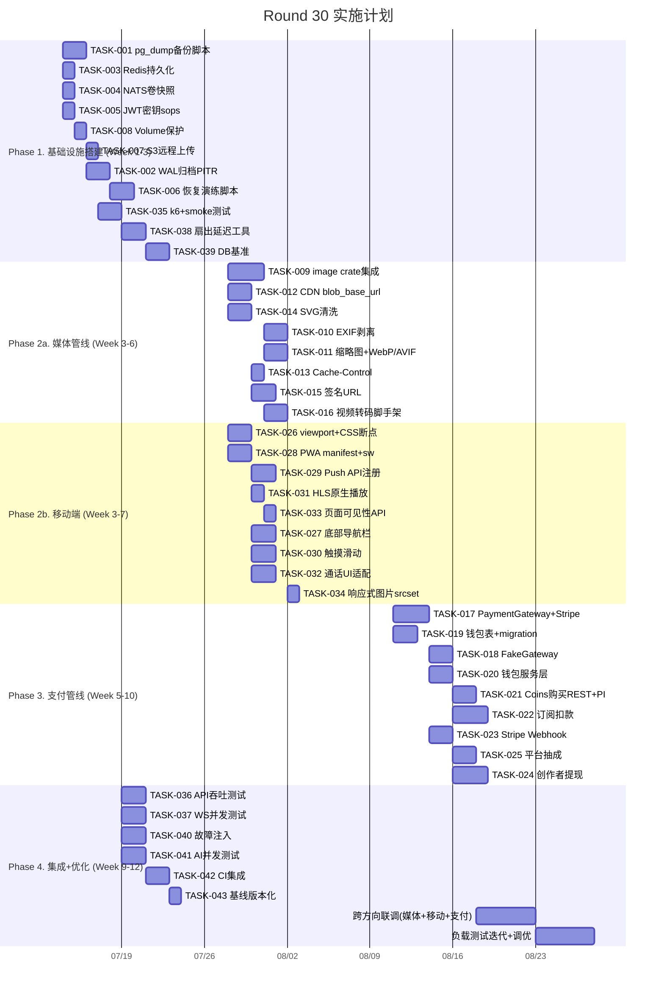

现在我已通读全部 5 个方向的分析文档。以下是我的 Tech Lead 分析：

---

# Tech Lead 分析：Round 30 — 5 个未被覆盖的战略扩展方向

## 1. 任务分解（TASK 清单）

### 方向一：备份与灾难恢复（P0）

| TASK ID | 标题 | 涉及文件 | 前置依赖 | 预估工时 |
|---------|------|---------|---------|---------|
| TASK-001 | Postgres `pg_dump` 定时备份脚本 | `scripts/backup/pg-backup.sh`, `docker-compose.yml`, `Makefile` | — | 4h |
| TASK-002 | WAL 归档 + PITR 配置 | `docker-compose.yml`, `scripts/backup/pg-wal-archive.sh`, `postgresql.conf`片段 | TASK-001 | 6h |
| TASK-003 | Redis RDB/AOF 持久化 + 备份 | `docker-compose.yml`, `scripts/backup/redis-backup.sh`, `redis.conf` | — | 2h |
| TASK-004 | NATS JetStream 卷定期快照 | `docker-compose.yml`, `scripts/backup/nats-backup.sh` | — | 2h |
| TASK-005 | JWT 密钥纳入 `sops` 加密存储 + 恢复文档 | `secrets/` (重构), `scripts/gen-jwt-keys.sh`, `.sops.yaml` | — | 3h |
| TASK-006 | 一键恢复演练脚本 | `scripts/backup/restore-drill.sh`, `docs/ops/disaster-recovery.md` | TASK-001~TASK-005 | 4h |
| TASK-007 | 备份加密 + 远程对象存储(S3/MinIO)上传 | `scripts/backup/upload-to-s3.sh`, `scripts/backup/backup-config.env` | TASK-001, TASK-003 | 3h |
| TASK-008 | Docker volume 保护（防止 `docker-compose down -v` 误删） | `docker-compose.yml` (命名卷替代匿名卷), `docs/ops/volume-policy.md` | — | 2h |

### 方向二：媒体资产管线（P1）

| TASK ID | 标题 | 涉及文件 | 前置依赖 | 预估工时 |
|---------|------|---------|---------|---------|
| TASK-009 | `image` crate 集成 + 上传时自动转码管线 | `crates/aero-server/Cargo.toml`, `crates/aero-server/src/media/processor.rs` (新), `crates/aero-server/src/routes/blobs.rs` | — | 6h |
| TASK-010 | EXIF 剥离 + Orientation 像素旋转 | `crates/aero-server/src/media/exif.rs` (新), 继承 TASK-009 管线 | TASK-009 | 3h |
| TASK-011 | 缩略图生成（256px / 512px）+ WebP/AVIF 转码 | `crates/aero-server/src/media/thumbnail.rs` (新), `crates/aero-common/src/model/blobs.rs` | TASK-009 | 4h |
| TASK-012 | CDN 域名注入 `blob_base_url` 重构 | `crates/aero-server/src/state.rs`, `config.example.toml`, `crates/aero-server/src/routes/blobs.rs` | — | 3h |
| TASK-013 | 不可变 blob `Cache-Control` 头 + 内容 hash 缓存键 | `crates/aero-server/src/routes/blobs.rs` | TASK-012 | 2h |
| TASK-014 | SVG 安全清洗门（`svg_cleaner` 集成） | `crates/aero-server/src/media/svg_sanitizer.rs` (新), `crates/aero-server/src/routes/blobs.rs` | — | 3h |
| TASK-015 | 私有 blob 预签名 URL（`X-Accel-Redirect` / 签名 URL） | `crates/aero-server/src/routes/blobs.rs`, `crates/aero-server/src/middleware/signed_url.rs` (新) | TASK-012 | 4h |
| TASK-016 | 视频附件异步转码脚手架（H.264 + 缩略图） | `crates/aero-server/src/media/video_transcoder.rs` (新), `ai_jobs` 或独立队列 | TASK-009 | 4h |

### 方向三：支付处理管线（P1）

| TASK ID | 标题 | 涉及文件 | 前置依赖 | 预估工时 |
|---------|------|---------|---------|---------|
| TASK-017 | `PaymentGateway` trait + `StripeGateway` 实现 | `crates/aero-payment/` (新 crate), `crates/aero-payment/src/gateway.rs`, `Cargo.toml` (新) | — | 6h |
| TASK-018 | `FakeGateway` 测试替身 | `crates/aero-payment/src/fake_gateway.rs` | TASK-017 | 3h |
| TASK-019 | 钱包表 + `transaction_log` 表迁移 + 仓储 | `migrations/NNNN_wallet.sql`, `crates/aero-storage/src/wallet.rs` (新), `crates/aero-storage/src/lib.rs` | — | 4h |
| TASK-020 | 钱包余额管理服务层（查询、冻结、扣减、充值） | `crates/aero-payment/src/wallet_service.rs` | TASK-017, TASK-019 | 4h |
| TASK-021 | Coins 购买 REST + Stripe PaymentIntent 集成 | `crates/aero-server/src/payment.rs` (新), `crates/aero-server/src/routes/mod.rs` | TASK-017, TASK-020 | 4h |
| TASK-022 | 订阅扣款：`subscription_tiers.price_cents` 对接 Stripe Subscriptions | `crates/aero-im-core/src/subscription_tiers.rs`, `crates/aero-payment/src/subscription_sync.rs` | TASK-017, TASK-019 | 6h |
| TASK-023 | Stripe Webhook 端点 + 幂等键处理 | `crates/aero-server/src/routes/stripe_webhook.rs` (新), `crates/aero-payment/src/webhook.rs` | TASK-017 | 4h |
| TASK-024 | 创作者提现（月度结算 + Stripe Connect Payout） | `crates/aero-payment/src/payout.rs`, `migrations/NNNN_payout.sql` | TASK-020, TASK-023 | 6h |
| TASK-025 | 平台抽成（config 默认 20-30%）+ `platform_revenue` 表 | `crates/aero-payment/src/revenue_split.rs`, `config.example.toml` | TASK-023 | 3h |

### 方向四：移动端战略（P1）

| TASK ID | 标题 | 涉及文件 | 前置依赖 | 预估工时 |
|---------|------|---------|---------|---------|
| TASK-026 | `<meta name="viewport">` + CSS 断点（768px/480px） | `web/index.html`, `web/css/responsive.css` (新) | — | 4h |
| TASK-027 | 底部导航栏替换侧边栏（移动端布局重构） | `web/css/layout.css`, `web/js/navigation.js` | TASK-026 | 3h |
| TASK-028 | PWA: `manifest.json` + `service-worker.js` | `web/manifest.json` (新), `web/service-worker.js` (新), `web/index.html` | — | 4h |
| TASK-029 | Web Push API 注册 → `push_tokens` 端点 | `web/js/push.js` (新), `crates/aero-server/src/routes/push_tokens.rs` | — | 3h |
| TASK-030 | 消息列表触摸滑动（swipe 删除/回复） | `web/js/messages.js`, `web/css/messages.css` | TASK-026 | 3h |
| TASK-031 | iOS Safari HLS 原生 `<video>` 回退 | `web/js/player.js`, `web/js/stream.js` | — | 2h |
| TASK-032 | 通话 UI 移动端适配（摄像头切换 + 竖屏布局） | `web/css/calls.css`, `web/js/calls.js` | TASK-026 | 4h |
| TASK-033 | 页面可见性 API（`visibilitychange` 控制 WS 重连策略） | `web/js/ws.js` | — | 2h |
| TASK-034 | CSS 响应式图片（`srcset` + `<picture>` 适配缩略图） | `web/js/blobs.js`, `web/index.html` | TASK-011 (方向二) | 2h |

### 方向五：负载测试框架（P1）

| TASK ID | 标题 | 涉及文件 | 前置依赖 | 预估工时 |
|---------|------|---------|---------|---------|
| TASK-035 | `k6` 安装 + smoke test + 独立测试数据库 | `scripts/load-test/smoke.js`, `scripts/load-test/setup.sh` | — | 2h |
| TASK-036 | REST API 吞吐测试（消息发送、历史查询、AI 问答） | `scripts/load-test/api-throughput.js` | TASK-035 | 3h |
| TASK-037 | WebSocket 并发连接测试（`k6` WS + `ws` 模拟客户端） | `scripts/load-test/ws-connect.js`, `scripts/load-test/ws-chat.js` | TASK-035 | 4h |
| TASK-038 | 实时扇出延迟测量工具（Rust binary） | `scripts/load-test/fanout-latency/` (新 Cargo 项目或 `examples/`), `Cargo.toml` (workspace member) | — | 4h |
| TASK-039 | 数据库查询基准（`pgbench` + 定制 sqlx 查询） | `scripts/load-test/db-bench.sh`, `scripts/load-test/db-queries.sql` | — | 3h |
| TASK-040 | Redis/NATS 故障注入（`toxiproxy` 或 `iptables`） | `scripts/load-test/failover-redis.sh`, `scripts/load-test/failover-nats.sh` | — | 4h |
| TASK-041 | AI Worker 排队 + 预算窗口行为测试 | `scripts/load-test/ai-concurrency.js` | TASK-036 | 3h |
| TASK-042 | CI 集成（GitHub Actions workflow） | `.github/workflows/load-test.yml` (新) | TASK-035~TASK-041 | 3h |
| TASK-043 | 基准结果版本化存储 + 趋势展示 | `scripts/load-test/record-benchmark.sh`, `benchmark-results/` 目录 | TASK-042 | 2h |

---

## 2. 执行顺序与依赖图



### 并行执行组

| 组 | 包含任务 | 说明 |
|----|---------|------|
| **组 A** | TASK-001, TASK-003, TASK-004, TASK-005, TASK-008 | 灾备方向的前置任务，互相独立 |
| **组 B** | TASK-009, TASK-012, TASK-014 | 媒体管线的三个独立起点 |
| **组 C** | TASK-017, TASK-019 | 支付管线的两个独立起点 |
| **组 D** | TASK-026, TASK-028, TASK-029, TASK-031, TASK-033 | 移动端的独立起点 |
| **组 E** | TASK-035, TASK-038, TASK-039, TASK-040 | 负载测试的独立起点 |
| **组 F** | TASK-010, TASK-011, TASK-013, TASK-015, TASK-016 | 媒体管线后续任务（依赖 TASK-009/012） |
| **组 G** | TASK-020, TASK-021, TASK-022, TASK-023 | 支付管线核心功能（依赖 TASK-017/019） |
| **组 H** | TASK-027, TASK-030, TASK-032 | 移动端 UI 后续（依赖 TASK-026） |

---

## 3. 技术风险

### 3.1 方向一：备份与灾难恢复 — 风险等级：低

| 风险 | 描述 | 缓解措施 |
|------|------|---------|
| **备份加密密钥丢失** | 备份加密密钥与 JWT 私钥在同一故障域 | 用独立 KMS 或 sops 主密钥分离；密钥放在两处（团队 1Password + 打印纸质副本密封） |
| **WAL 归档滞后丢数据** | `pg_receivewal` 断连超过 `wal_keep_size` 阈值 → WAL 文件被回收 | 设置 `wal_keep_size = 1GB` + 监控 `pg_stat_archiver` 告警 |
| **恢复后迁移版本不匹配** | `_sqlx_migrations` 表版本落后于最新迁移文件 | 恢复脚本必须执行 `sqlx migrate run` 并比对 checksum；如不匹配则拒绝恢复 |
| **备份脚本未能捕获 PV** | 备份在容器内运行但数据卷是 Docker volume → 权限问题 | `pg_dump` 通过 `docker exec` 在容器内执行；或者 `pg_dumpall` 连 socket |

### 3.2 方向二：媒体管线 — 风险等级：中

| 风险 | 描述 | 缓解措施 |
|------|------|---------|
| **`image` crate 内存占用** | 处理大图片（5K×5K+）时内存飙升至数百 MB | 设置最大像素限制（`image::load` 前先读尺寸判定）；使用 `imager` 或 `libvips` C 绑定做流式处理 |
| **EXIF 剥离后图片旋转错误** | 去掉 Orientation EXIF 标签但未旋转像素 → 图片旋转不正确 | 先读 Orientation tag → 旋转像素 → 再剥离 EXIF（三步顺序不可错） |
| **WebP/AVIF 编码耗时** | 4K 图片 WebP 编码 300ms → 阻塞上传路径 | 异步处理：上传后先存原文件，后台 `tokio::spawn` 转码，完成后更新 blob 记录 |
| **SVG 清洗漏网 XSS** | `svg_cleaner` 可能未覆盖最新的 SVG 攻击矢量 | 双层清洗：`svg_cleaner` 剥离 event handler + 服务端 `regex` 再次校验不允许的标签 |
| **CDN 配置耦合** | 不同部署环境（开发/暂存/生产）需要不同的 CDN 域名 | `blob_base_url` 注入点放在 config；`Cache-Control` 头统一管理 |
| **签名 URL 过期时间把握** | 私有 blob 签名 URL 过期时间太短 → 频繁请求签名；太长 → 泄露风险 | 默认 1 小时，可配置；直播截图等可更长（24h）+ 绑定 `room_id` 范围 |

### 3.3 方向三：支付管线 — 风险等级：高

| 风险 | 描述 | 缓解措施 |
|------|------|---------|
| **Stripe Webhook 幂等性** | Stripe 可能重发相同事件；网络中断导致回调丢失 | Webhook 端点必须使用 `stripe-signature` 验签 + `idempotency_key`（Stripe 的 `Idempotency-Key` 或 event `id`） |
| **支付状态不一致** | Stripe Charge 成功 → 网络中断 → Webhook 未收到 → 用户扣款但 coins 未到账 | 补偿(balance) 定时任务扫 Stripe `created > last_check` 的交易比对 |
| **退款/争议处理** | Chargeback 发生时，creator 已提现 | 平台兜底风险准备金：每笔交易计提 5% 风险备用金到 `reserve_pool`；creator 余额不足时从 reserve 扣 |
| **未成年打赏** | 中国/欧盟法规要求打赏限额和家长控制 | `participants.birth_date` 字段（当前不存在）+ 年龄验证 gate；18 岁以下日打赏上限（config 可配） |
| **PCT 合规（PCI-DSS）** | 直接处理信用卡信息 | Stripe Elements 或 Stripe Checkout——信用卡信息永远不经服务端。服务端只处理 `payment_intent_id` / `subscription_id` |
| **多币种汇率** | 跨国创作者需收款币种转换 | Stripe 自动处理币种转换 + 汇率锁定。服务端只存金额(分) + 币种代码 |

### 3.4 方向四：移动端 — 风险等级：高

| 风险 | 描述 | 缓解措施 |
|------|------|---------|
| **多设备已读同步** | 手机读了消息，桌面仍标红 | `mark_read` 房间事件需走总线广播（使用 `redis pub/sub` 或 `nats`），现有 `read_cursor` 逻辑已支持多设备游标（migration 0153 `delivery_cursors`），但 WS 端未触发跨设备广播 |
| **iOS WebSocket 后台断开** | iOS 后台 30 秒杀死 WS → 离线消息堆积 | 使用 APNs `content-available: 1` 静默推送唤醒 + 后台 `fetch` 拉取 `since` 游标后的增量消息 |
| **hls.js 在 iOS 上行为** | iOS Safari 的 hls.js 使用 MSE，但在 iOS 上有已知 bug | 检测 `Hls.isSupported()` → fallback 到原生 `<video src=".m3u8">`（iOS 原生 HLS 支持） |
| **移动推流 H.264 编码** | 手机摄像头 H.264 编码参数与服务器 SDP 协商不一致 | `getUserMedia` 约束指定 `codec: "H264"` + 前向 `facingMode` + 码率自适应（`bandwidth` 回调） |
| **PWA 离线能力有限** | Service Worker 缓存策略不当 → 数据过时或存储溢出 | Cache First（静态资源）+ Network First（API 响应）+ Background Sync（消息发送队列） |

### 3.5 方向五：负载测试 — 风险等级：低

| 风险 | 描述 | 缓解措施 |
|------|------|---------|
| **CI 环境资源限制** | GitHub Actions 2C7G 不足以跑 10k 并发 WS | 小规模（≤1k 并发）跑 CI，大规模场景 → 专用测试机（或自托管 runner） |
| **测试数据污染** | 负载测试写入开发数据库 | 独立数据库实例 + 脚本开头 `CREATE DATABASE aero_loadtest` + 结尾 `DROP DATABASE aero_loadtest` |
| **性能基准漂移** | Rust 编译器版本、依赖升级改变性能特征 | 基准结果 JSON 版本化 + 趋势图（GitHub Pages 或 Grafana） |
| **NATS JetStream 在测试中的行为** | 测试间 consumer 状态残留 | 每次测试用不同的 `durable` consumer name，或直接用 ephemeral consumer |

---

## 4. 资源评估

### 4.1 需要的开发人员

| 角色 | 技能要求 | 负责方向 | 数量 |
|------|---------|---------|------|
| **基础设施工程师** | Docker, Postgres, Redis, NATS, shell 脚本, S3 | 方向一（灾备）+ 方向五（负载测试 CI） | 1 人 |
| **后端 Rust 工程师** | Rust, `image` crate, CDN 集成, Stripe API | 方向二（媒体管线核心）+ 方向三（支付后端） | 1-2 人 |
| **全栈/前端工程师** | CSS 响应式, PWA, Service Worker, Web Push, `getUserMedia` | 方向四（移动端 Web）+ 方向二（前端媒体组件） | 1 人 |
| **QA/性能工程师** | `k6`, `pgbench`, `toxiproxy`, CI 编排 | 方向五（负载测试脚本 + 持续运行） | 0.5 人（可与 infra 复用） |

**总计：3-4 人**（其中 infra + QA 可以 1 人兼顾方向一和方向五）

### 4.2 关键里程碑

| 里程碑 | 时间点 | 交付物 | 验证方式 |
|-------|--------|--------|---------|
| **M1: 灾备 MVP** | 第 2 周末 | pg_dump + Redis RDB + NATS 快照脚本 + 恢复文档 | 执行恢复演练：销毁容器 → 从备份重建 → 数据完整 |
| **M2: 负载测试基线** | 第 3 周末 | k6 API/WS 测试套件 + CI 集成 | CI 流水线绿色 + 基准数据首次记录 |
| **M3: 媒体管线上线** | 第 5 周末 | image 处理（缩略图/WebP/EXIF 清理）+ CDN 配置 | 上传测试图片 → GET 缩略图 URL → 返回 <100KB WebP（原图 1MB+） |
| **M4: 移动 Web MVP** | 第 6 周末 | 响应式布局 + PWA + Push 通知 | 手机浏览器打开页面 → UI 适配 375px → 添加到主屏幕 → 收到推送通知 |
| **M5: 支付 MVP** | 第 8 周末 | Stripe Checkout 购买 Coins + 订阅扣款 + 钱包 | 用 Stripe 测试卡购买 100 coins → 余额增加 → 用 coin 发礼物 |
| **M6: 创作者提现** | 第 10 周末 | 月度结算 + Stripe Connect Payout | 创建测试 payout → 调用 Stripe 转移 → 收款账户收到资金（再用 `FakeGateway` 自动化验证） |

### 4.3 阻塞点（Blockers）

| Blocker | 所属方向 | 解决策略 |
|---------|---------|---------|
| **Stripe 商户账号申请** | 方向三 | 开发阶段全程使用 Stripe 测试模式（`sk_test_*`），不需要真实商户审核。生产前预留 2 周审核期 |
| **FCM/APNs 凭据获取** | 方向四 | Firebase 项目创建 + Apple Developer 账号均为免费/低成本；测试阶段用 `FakeGateway` + 浏览器 Push API |
| **Apple App Store 审核** | 方向四（RN/Flutter） | 本计划中移动端先行 PWA（无需审核），原生 App 放在 Phase 2 |
| **`image` crate 跨平台编译** | 方向二 | `image` 是纯 Rust，无 C 依赖，CI 编译无问题。`libvips` 绑定需额外 C lib |
| **CI 自托管 Runner** | 方向五 | 大规模测试（10k WS 并发）需要专用机器，可在 AWS/GCP 上配一台定期启动的 spot instance |

---

## 5. 质量保证

### 5.1 单元测试覆盖要求

| 模块 | 覆盖率目标 | 重点测试场景 |
|------|-----------|------------|
| **备份脚本** | —（shell 脚本以集成测试为主） | 脚本参数校验、错误处理、S3 上传失败重试 |
| **`media/processor.rs`** | ≥85% | 各图片格式处理、过大图片拒绝、空文件处理 |
| **`media/exif.rs`** | ≥90% | 含 GPS EXIF 图片 → 输出无 EXIF；含 Orientation 标签 → 旋转后的像素校验 |
| **`media/svg_sanitizer.rs`** | ≥95% | `<script>` 注入、`<foreignObject>`、`onload` event handler、data URI |
| **`PaymentGateway` trait + StripeGateway** | ≥80%（FakeGateway 驱动） | 授权/捕获/退款/订阅创建/取消/Webhook 签名验证 |
| **`wallet_service.rs`** | ≥90% | 并发扣减（`FOR UPDATE`）、余额不足拒绝、冻结/解冻 |
| **`push_tokens.rs` REST** | ≥80% | 重复注册（UPSERT）、token 更新、无效 token 删除 |
| **负载测试脚本** | —（功能正确性由 shellcheck + dry-run 保证） | 测试隔离性（各自 DB）、cleanup 正确性 |

### 5.2 集成测试策略

| 测试套件 | 覆盖方向 | 工具 | 执行频率 |
|---------|---------|------|---------|
| **灾备恢复测试** | 方向一 | `scripts/backup/restore-drill.sh` | 每月一次（手动触发） |
| **媒体管线 e2e** | 方向二 | `cargo test --test media_pipeline` | CI 每次推送 |
| **支付管线 e2e** | 方向三 | `cargo test --test payment_flow` + Stripe 测试模式 | CI 每次推送 |
| **移动端渲染** | 方向四 | Puppeteer/Playwright 截图对比（响应式布局） | CI 每次推送（可选，如引入 Playwright） |
| **负载测试** | 方向五 | k6 + GitHub Actions | 每周一自动 + PR label `load-test` 手动触发 |

### 5.3 代码审查要点

| 方向 | 审查要点 |
|------|---------|
| **灾备** | `pg_dump --no-bl locks --lock-wait-timeout` 参数完整；备份文件命名含时间戳；恢复脚本幂等 |
| **媒体管线** | EXIF 剥离在转码前；Orientation 处理正确；SVG 清洗后输出验证；CDN URL 非硬编码 |
| **支付管线** | `price_cents` 为 `Option<i64>` 时正确处理 None；所有 Stripe 调用含 error handling（`PaymentError` 映射到正确 HTTP 状态）；Webhook 签名必验；`amount` 操作都在事务中 |
| **移动端** | `<meta name="viewport">` 存在；CSS 断点覆盖 375/480/768/1024px；Service Worker 不缓存敏感数据；Push 通知含 `deep_link` |
| **负载测试** | 测试独立数据库不污染；所有测试资源清理干净；k6 脚本含阈值（`thresholds`）定义 |

### 5.4 性能测试需求

| 场景 | 目标吞吐/并发 | 预期 P95 | 失败阈值 |
|------|-------------|---------|---------|
| 消息发送 + 扇出 | 100 msg/s → 1000 客户端 | P95 < 500ms | P95 > 2s 红灯 |
| WebSocket 并发连接 | 5000 同时连接 | 连接建立 P95 < 1s | P95 > 3s 红灯 |
| 图片上传 + 转码 | 10 并发 | 转码完成 P95 < 2s | P95 > 5s 红灯 |
| 搜索（FTS + 向量 hybrid） | 50 qps | P95 < 300ms | P95 > 1s 红灯 |
| Stripe Checkout 创建 | 30 rps | P95 < 500ms（含 Stripe API 延迟） | P95 > 2s 红灯 |
| 直播扇出延迟 | 500 并发 watcher | 从 publish → 客户端收到 P95 < 200ms | P95 > 1s 红灯 |

---

## 6. 实施计划

### 6.1 阶段时间线

```
Week  1   2   3   4   5   6   7   8   9   10  11  12
      │   │   │   │   │   │   │   │   │   │   │   │
Phase 1: 基础设施搭建（方向一 + 方向五起点）
├─────┤
T001  T003 T004 T005 T008  (灾备)
      ├───────┤
      T035 T039 T038        (负载测试起点)

Phase 2a: 媒体管线核心
      └─────────────┤
      T009 T012 T014 T010 T011 T013 T015 T016
                    └─────────────┤
                    T034 (响应式图片，依赖T011)

Phase 2b: 移动端 MVP
      └─────────────────────────┤
      T026 T028 T029 T031 T033 T027 T030 T032
                    └─────────────┤
                    (响应式图片 T034 跨组)

Phase 3: 支付管线 MVP
                  └─────────────────────────────┤
                  T017 T019 T018 T020 T021 T022 T023
                    └─────────────────────┤
                    T025 T024 (平台抽成+提现)

Phase 4: 集成与优化（跨方向联调 + 负载测试）
                                    └──────────┤
                                    T042 T043   (CI + 基准)
                                    负载测试迭代
```

### 6.2 甘特图



### 6.3 分阶段详细计划

#### Phase 1：基础设施搭建（第 1-3 周）

**目标**：消除 P0 安全缺口的备份/灾备缺失 + 建立负载测试基础框架。

**Week 1**（7/14 - 7/18）
- Day 1-2: TASK-001（pg_dump 脚本），TASK-003（Redis 持久化），TASK-004（NATS 卷快照），TASK-005（JWT 密钥 sops）
- Day 3-4: TASK-008（Volume 保护），TASK-007（S3 远程上传），TASK-002（WAL 归档 PITR 配置）
- Day 5: 并行启动 TASK-035（k6 smoke test）

**Week 2**（7/21 - 7/25）
- Day 1-2: TASK-006（恢复演练脚本编写 + 第一次跑通）
- Day 3-4: TASK-038（扇出延迟测量工具），TASK-039（数据库基准）
- Day 5: 第一次恢复演练（团队验证）+ 灾备文档交付

**Week 3**（7/28 - 8/1）
- 灾备收尾 + 负载测试继续（TASK-036/TASK-037 可在 Phase 3 完成但不阻塞）
- 同时启动 Phase 2a 和 2b

**交付物**：恢复演练报告（证明从零重建 < 2h）、k6 smoke 绿色通过

#### Phase 2a：媒体管线（第 3-6 周）

**Week 3-4**（7/28 - 8/8）
- TASK-009（image crate 集成 + 上传管线重构）— 核心任务，2 人天阻塞其他任务
- TASK-012（CDN 域名注入）— 独立，可在 TASK-009 之前完成
- TASK-014（SVG 清洗）— 独立
- TASK-010（EXIF 剥离）— TASK-009 后可启动
- TASK-011（缩略图 + WebP/AVIF）— TASK-009 后可启动

**Week 5-6**（8/11 - 8/22）
- TASK-013（Cache-Control），TASK-015（签名 URL）— 基于 TASK-012
- TASK-016（视频转码脚手架）
- TASK-034（响应式图片）— 对接前端，与移动端配合

**交付物**：上传 4K 测试图片 → 自动生成 WebP 缩略图 + EXIF 清理 + S3/CDN URL返回

#### Phase 2b：移动端 MVP（第 3-7 周）

**Week 3-4**（7/28 - 8/8）
- TASK-026（viewport + CSS 断点）— 核心前置
- TASK-028（PWA manifest + service worker）
- TASK-029（Push API 注册 + 后端 push_tokens 端点）
- TASK-031（HLS 原生播放回退）
- TASK-033（页面可见性 API）

**Week 5-7**（8/11 - 8/29）
- TASK-027（底部导航栏），TASK-030（触摸滑动），TASK-032（通话 UI 适配）— 依赖于 TASK-026
- TASK-034（响应式图片，与方向二衔接）

**交付物**：手机浏览器打开 → UI 适配竖屏 → 添加到主屏幕（PWA）→ 收到推送通知 → 消息列表可滑动操作

#### Phase 3：支付管线（第 5-10 周）

**Week 5-6**（8/11 - 8/22）
- TASK-017（PaymentGateway trait + StripeGateway）— 核心
- TASK-019（钱包表 + transaction_log migration）
- TASK-018（FakeGateway）
- TASK-020（钱包服务层）

**Week 7-8**（8/25 - 9/5）
- TASK-021（Coins 购买流程 + Stripe PaymentIntent）
- TASK-022（订阅扣款对接 price_cents）
- TASK-023（Stripe Webhook + 幂等键）

**Week 9-10**（9/8 - 9/19）
- TASK-025（平台抽成 20-30%）
- TASK-024（创作者提现 + Stripe Connect Payout）
- 端到端支付流程测试（FakeGateway → Stripe 测试模式）

**交付物**：用 Stripe 测试卡购买 100 coins → 余额增加 → 发礼物 → 创作者月结提现成功

#### Phase 4：集成测试与优化（第 9-12 周）

**Week 9-10**（9/8 - 9/19）
- TASK-036/TASK-037（API/WS 负载测试补完）
- TASK-040（故障注入），TASK-041（AI 并发测试）
- TASK-042（CI 集成 GitHub Actions）
- TASK-043（基准结果版本化）

**Week 11-12**（9/22 - 10/3）
- 跨方向联调：媒体管线吞吐与 CDN 预热 + 移动端 HLS 播放验证 + 支付流程负载测试
- 性能调优：根据负载测试结果优化瓶颈
- 文档补全 + 安全审查

**交付物**：CI 负载测试流水线绿色 + 性能基线报告（含 P50/P95/P99 趋势图）

### 6.4 建议的资源分配矩阵

```
         Week 1-3    Week 4-6    Week 7-9    Week 10-12
         ─────────   ─────────   ─────────   ───────────
Infra    灾备(100%)   媒体(S3)    支付(Stripe  负载测试CI
+ QA     负载开始      联调        环境)       持续优化

Rust     —           媒体管线     支付核心     支付+联调
Backend               (100%)      (70%)       调优(30%)

Frontend  —           移动MVP     支付UI+     全量集成
                      (100%)      移动优化     测试
                                  (60%)
```

---

## 附录：风险汇总矩阵

| # | 风险 | 概率 | 影响 | 应对策略 | 责任人 |
|---|------|------|------|---------|-------|
| R1 | Stripe 商户审核超时 | 中(40%) | 高(支付延迟) | 开发全程测试模式；提前申请商户账号 | PM |
| R2 | 移动端 Web 渲染不一致（Android fragmentation） | 中(50%) | 中(UI 修复) | Playwright 多设备截图对比 CI；Samsung/Chrome/Pixel 三件套覆盖 | 前端 |
| R3 | `image` crate 对大图片 OOM | 低(20%) | 高(服务崩溃) | 上传尺寸限制 + `image::load` 前置尺寸检查 + 内存限制 `RLIMIT_AS` | 后端 |
| R4 | WAL 归档配置不当导致 pg 空间耗尽 | 中(30%) | 高(DB 不可写) | `max_wal_size=2GB` + 磁盘使用率告警 + 恢复演练验证 | Infra |
| R5 | PWA Service Worker HTTPS 要求 | 高(100%) | 中(开发适配) | 开发环境用 `localhost`（SW 允许）或自签名证书；明确文档 | 前端 |
| R6 | Stripe webhook 双重回调导致重复入账 | 中(30%) | 中(余额不准) | 数据库约束 `UNIQUE(stripe_event_id)` + 幂等键 | 后端 |
| R7 | CI 负载测试耗时过长阻塞其他流水线 | 中(50%) | 低(CI 流程) | 独立 workflow + schedule-only 触发 + 大队列结果异步通知 | Infra |

---

以上分析覆盖了 5 个方向全部 43 个可执行任务、依赖关系、风险、资源需求和 12 周实施计划。建议执行优先级：**灾备（P0 立即）→ 负载测试（可量化基线）→ 媒体管线 + 移动端（并行）→ 支付管线（最复杂，后置）**。P0 的备份与灾难恢复建议本周立即启动——这是当前架构唯一真正「生产不可用」的短板。
