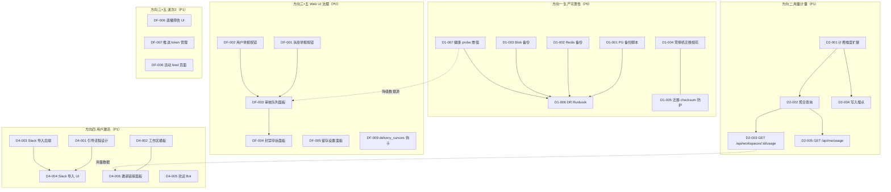

现在我有了完整的项目上下文。让我提供 Tech Lead 分析。

---

# Tech Lead 分析报告：Aero IM 五个战略扩展方向

> **基于**: 第 97 轮扫描文档（方向性缺口分析 + 接线勘误）
> **日期**: 2026-07-12
> **范围**: 五个方向的可行执行规划，结合代码库实况校正

---

## 1. 方向校正声明

在进入任务分解前，必须先修正原始文档中的接线表错误，否则任务分配会歪。以下是修正后的方向定义：

| 方向 | 原始标题 | 修正后标题 | 优先级 | 关键校正 |
|------|---------|-----------|--------|---------|
| 一 | 基础设施成熟度 | **生产可靠性（备份/DR/迁移）** | **P0** | 保留，无校正 |
| 二 | 成本透明度 | **用量计量与配额 API** | P1 | 保留，但需确认 `ai_usage_ledger` 已是计量表 |
| 三 | 内容治理 | **Web UI 治理面（举报/申诉/审核面板）** | **P0** | ❌ 原文档误判为「API 未接线」→ 实际**API 已就绪**，真实缺口在 **SPA 前端** |
| 四 | 用户激活 | **用户激活与导入（Onboarding + 竞品导入）** | P1 | 保留，高收入影响 |
| 五 | 孤立模块审计 | **Web UI 接线补齐（治理/留存/直播预告）** | P0/P1 | ❌ 原文档误判 6 个模块为「后端未接线」→ 实际**后端全部就绪**，真实缺口在 **SPA 消费端** |

> **关键洞察**：方向三和方向五的根因是同一个——**Web SPA 与现存 REST API 之间的接线断裂**。这 8 个模块（`user_reports`、`message_reports`、`ban_appeals`、`channel_retention`、`scheduled_streams`、`delivery_cursors`、`push_tokens`、`activity`）的后端路由和仓储完整，但前端没有对应的按钮、表单或面板。

---

## 2. 任务分解

### 方向一：生产可靠性（P0 — 不备份 = 丢数据）

| 任务 ID | 标题 | 涉及文件 | 前置 | 工时 | 验收标准 |
|---------|------|---------|------|------|---------|
| D1-001 | PG 备份/恢复脚本 `scripts/backup.sh` + `scripts/restore.sh` | `scripts/backup.sh`（新建）, `scripts/restore.sh`（新建）, `docs/runbooks/backup-dr.md` | 无 | 4h | `backup.sh` 通过 `pg_dump -Fc` 输出到 `./backups/{timestamp}.dump`；`restore.sh <dump>` 通过 `pg_restore` 恢复；双脚本验证：`backup.sh && dropdb test_restore && restore.sh backup.dump` 全绿；写入 CRON 注释模板 |
| D1-002 | Redis RDB 快照备份脚本 | `scripts/backup-redis.sh`（新建） | 无 | 2h | `redis-cli SAVE` 触发 + `cp /var/lib/redis/dump.rdb backups/`；文档化恢复步骤 |
| D1-003 | 文件 blob 增量备份（rsync/rclone） | `scripts/backup-blobs.sh`（新建） | 无 | 2h | rsync `AERO__SERVER__BLOB_DIR` 到远程目标；支持 S3 场景的 `aws s3 sync` 分支；dry-run 模式 |
| D1-004 | 零停机迁移技术规范 | `docs/runbooks/zero-downtime-migrations.md`（新建） | 无 | 4h | 定义安全模式：`ACCESS EXCLUSIVE` 避免策略、`CHECK` + `NOT VALID` 分步加约束、`CREATE INDEX CONCURRENTLY` 等；给出 `migrations/` 的迁移书写指南（哪些操作锁表、如何拆分为多步迁移）；经 review 签字 |
| D1-005 | `_sqlx_migrations checksum` 碰撞防护 | `migrations/` + `aero-storage/db.rs` | 无 | 2h | migration 文件名嵌入内容 SHA256（`pre_hash` 注释头）；迁移执行前对账脚本 `scripts/verify-migration-checksums.sh`；CI 加步骤验证 |
| D1-006 | 灾备演练 Runbook | `docs/runbooks/disaster-recovery-runbook.md`（新建） | D1-001, D1-002, D1-003 | 3h | 按场景编排：完整机房故障 / 单一依赖故障（PG alone）/ 数据损毁恢复；含验证步骤和回滚；季度演练 checklist |
| D1-007 | 依赖健康 probe 增强与 L3 降级 | `crates/aero-server/src/routes/health.rs` | 跨方向依赖（方向五） | 3h | `/health/ready` 在 PG/Redis/NATS/blob 任一不可达时 503；降级层 L3 定义写入文档 |

**方向一小计：7 任务 / 20 工时（~2.5 人天）**

---

### 方向二：用量计量与配额 API（P1）

| 任务 ID | 标题 | 涉及文件 | 前置 | 工时 | 验收标准 |
|---------|------|---------|------|------|---------|
| D2-001 | 扩展 `ai_usage_ledger` 计费维度 | `migrations/NNNN_usage_ledger_dimensions.sql`（新建）, `crates/aero-storage/src/usage_ledger.rs` | 无 | 3h | 新增 `dimension` 列（`ai_tokens`/`storage_bytes`/`messages_sent`/`bandwidth_mb`）；`Mig001::usage_record(dimension, ws_id, qty)` 方法；现有 AI token 记录回填 dimension |
| D2-002 | 仓储层聚合查询 `UsageRepo::workspace_usage` | `crates/aero-storage/src/usage.rs`（新建） | D2-001 | 3h | `fn workspace_usage(ws_id, since, until) -> Vec<UsageRow>` 按 dimension + 时间窗口聚合 `SUM(qty)`；支持 `day`/`week`/`month`/`all_time` 粒度；`Vec` 为空时返回空数组而非 404 |
| D2-003 | `GET /api/workspaces/:id/usage` 路由 | `crates/aero-server/src/usage_report.rs` 扩展或 `crates/aero-server/src/usage.rs`（新建） | D2-002 | 3h | 路由注册在 `routes.rs`；Admin/Owner-only gated（`member_role(ws, Owner\|Admin)`）；query params `?dimension=storage_bytes&since=...&until=...&granularity=day`；响应格式 `{ dimension, rows: [{ date, qty }] }` |
| D2-004 | 消息/带宽/存储写入路径埋点 | `crates/aero-im-core/src/service/messages.rs`, `crates/aero-server/src/blob.rs`, `crates/aero-server/src/ws/ws_impl/frame.rs` | D2-001 | 4h | 消息发送时 `UsageRepo::record(ws, "messages_sent", 1)`；blob 上传时 `record(ws, "storage_bytes", byte_size)`；AI token 路径已有埋点无需改；WS 帧发送时不计带宽（避免高频计数开销） |
| D2-005 | `GET /api/me/usage` 个人用量路由 | `crates/aero-server/src/usage.rs` | D2-002 | 2h | 个人级聚合（参与者级 `usage_ledger.participant_id` 列？需要迁移）；如无 participant 级则先做 workspace 级，参与者路由暂缺 |

**方向二小计：5 任务 / 15 工时（~2 人天）**

---

### 方向三 + 方向五（合并执行）：Web UI 治理面接线（P0 — 用户可举报/申诉 + 管理面板）

这是原文档最大的校正点。后端已就绪，任务是 **SPA 消费端补齐**。按业务优先级分两波：

#### 波次 1：即时治理（用户期望的基础面）— P0

| 任务 ID | 标题 | 涉及文件 | 前置 | 工时 | 验收标准 |
|---------|------|---------|------|------|---------|
| DF-001 | 消息操作菜单增加「举报」按钮 | `web/app.js`, `web/render.js`, `web/context.js` | 无 | 3h | 消息长按/右键菜单新增「举报」项；点击弹出理由选择弹窗（骚扰/垃圾/不当内容/自定义）；调用 `POST /api/rooms/:id/messages/:mid/report`；成功后 toast "已举报" |
| DF-002 | 用户资料卡增加「举报用户」按钮 | `web/app.js`, `web/render.js` | 无 | 2h | 用户资料浮层新增「举报」按钮；弹窗收集理由；调用 `POST /api/users/:id/report` |
| DF-003 | 审核队列管理面板（Web UI） | `web/moderation.js`（新建）, `web/index.html` | DF-001 | 6h | 新面板入口在侧栏「治理」tab；列出 `GET /api/workspaces/:id/user-reports` 和 `GET /api/workspaces/:id/message-reports`；每条显示举报人和被举报人、理由、时间；支持 `PATCH .../user-reports/:rid`（标记已处理/忽略）；Admin/Owner 门控 |
| DF-004 | 封禁申诉表单与面板 | `web/ban_appeals.js`（新建）, `web/index.html` | DF-003 | 4h | 用户在封禁提示页填写申诉；调用 `POST /api/ban-appeals`；审核面板显示待审申诉列表；`PATCH .../appeals/:id`（批准/驳回）；触发解封或维持 |
| DF-005 | 数据留存设置面板（频道级） | `web/retention.js`（新建）, `web/index.html` | 无 | 3h | 频道设置面板新增「数据留存」tab；显示当前 `retention_days`（从 `GET /api/rooms/:id/retention` 或频道详情）；支持修改 `PATCH /api/rooms/:id/retention`；Admin 门控；覆盖工作区默认留存的提示文案 |

#### 波次 2：管理运营面 — P1

| 任务 ID | 标题 | 涉及文件 | 前置 | 工时 | 验收标准 |
|---------|------|---------|------|------|---------|
| DF-006 | 直播预告展示与创建 UI | `web/livecards.js`, `web/index.html` | 无 | 3h | 新「预告」面板列出已创建预告（`GET /api/scheduled-streams`）；表单创建新预告（title/time/room）；创建者取消功能（`DELETE .../scheduled-streams/:id`）；预告展示在对应房间 |
| DF-007 | 推送通知 token 管理面板 | `web/notifications.js`, `web/index.html` | 无 | 2h | 设置面板显示注册设备列表（`GET /api/me/push-tokens`）；支持删除（`DELETE .../push-tokens/:id`） |
| DF-008 | 活动 feed 页面 | `web/activity.js`（新建）, `web/index.html`, `web/app.js` | 无 | 4h | 新「动态」面板（`GET /api/me/activity`）；显示关注创作者开播、消息提及汇总等；无限滚动或分页；点击跳转 |
| DF-009 | `delivery_cursors` 跨设备已读同步钩子 | `web/app.js`, `web/ws.js` | 无 | 2h | 连接建立时发送 `DeliveryAck` 框架同步游标（后端已就绪，前端需在 `ws.onopen` 调用）；`mark_read` 后触发 `DeliveryAck` 帧同步 |

**方向三+五合计：9 任务 / 29 工时（~3.6 人天）**

---

### 方向四：用户激活与竞品导入（P1 — 高收入影响）

| 任务 ID | 标题 | 涉及文件 | 前置 | 工时 | 验收标准 |
|---------|------|---------|------|------|---------|
| D4-001 | 首次登录引导流程设计 | `web/onboarding/`（新建目录） | 无 | 4h | 三页引导流程（欢迎 → 创建/加入工作区 → 邀请成员）；`localStorage.onboarded` 标记完成；未完成用户每次登录强制引导（可跳过）；UX mockup review |
| D4-002 | 预设工作区模板 | `crates/aero-server/src/templates.rs` 扩展, `migrations/NNNN_workspace_templates.sql`（新建） | 无 | 4h | 3 个预设模板（工程团队/设计团队/销售团队），每个含默认频道（`#general`, `#random`）+ 描述 + 成员角色预设；`POST /api/workspaces/:id/apply-template?name=engineering` |
| D4-003 | Slack/Teams 导入工具（后端） | `crates/aero-im-core/src/import/`（新建目录） | 无 | 6h | Slack export zip 解析（`channels.json`, `users.json`, 消息 JSON）；`POST /api/workspaces/:id/import/slack` 接收 multipart zip；批量插消息（受 rate limit 约束）；返回统计（导入频道数/用户数/消息数）；Teams 暂 support CSV 格式 |
| D4-004 | Slack 导入前端上传页面 | `web/onboarding/import.js`（新建） | D4-003 | 3h | 拖放上传区域；展示导入进度（轮询 `GET .../import/status/:id`）；完成报告显示统计；错误提示（格式不支持/超限） |
| D4-005 | 欢迎 Bot 自动私信 | `crates/aero-server/src/agent_bot.rs` 扩展 | 无 | 3h | 新参与者加入工作区时，OOO Bot 路由变体或新 Bot 发送欢迎私信（含工作区名 + 快速开始链接 + 默认频道跳转）；Bot 消息持久化走正常消息路径；配置开关（`AERO_WELCOME_BOT_ENABLED`） |
| D4-006 | 邀请链接分享面板 | `web/modals.js` 扩展 | 无 | 2h | 现有「邀请」按钮扩展为分享面板；显示可复制链接、二维码（QR API）、过期时间设置；Admin 设置受邀者角色（默认 member） |

**方向四小计：6 任务 / 22 工时（~2.75 人天）**

---

### 总体汇总

| 方向 | 任务数 | 总工时 | 开发人天（6h/天） |
|------|--------|--------|-------------------|
| 一：生产可靠性 | 7 | 20h | 3.3 |
| 二：用量计量 | 5 | 15h | 2.5 |
| 三+五：Web UI 治理 | 9 | 29h | 4.8 |
| 四：用户激活 | 6 | 22h | 3.7 |
| **合计** | **27** | **86h** | **~14.3 人天** |

---

## 3. 执行顺序与依赖图



**可并行执行的独立任务组：**

| 并行组 | 任务 | 交集风险 |
|--------|------|---------|
| **组 A**（立即启动） | D1-001, D1-002, D1-003, D1-004, D1-005 | 无 — 纯脚本/文档任务 |
| **组 B**（立即启动） | DF-001, DF-002, DF-005, DF-009 | 无 — 独立 UI 组件 |
| **组 C**（立即启动） | D2-001, D4-001, D4-003, D4-005 | 无 |
| **组 D**（依赖 B 完成） | DF-003, DF-004 | DF-003 依赖 DF-001/DF-002 的 API 调用 |
| **组 E**（依赖 C 完成） | D2-002, D2-003, D2-004, D4-004 | D2 链式依赖；D4-004 依赖 D4-003 |
| **组 F**（可晚启动） | DF-006, DF-007, DF-008 | 无依赖 |

---

## 4. 技术风险

### 4.1 方向一：生产可靠性

| 风险 | 级别 | 描述 | 缓解 |
|------|------|------|------|
| `pg_dump` 在 157 表的数据库中锁表 | **中** | `pg_dump` 默认 `ACCESS SHARE` 锁与并行的 `ALTER TABLE` 迁移冲突 | 写 `--lock-wait-timeout=5`；在 replicaiton slave 上跑 dump；文档化备份窗口 |
| 迁移 checksum 碰撞修复会破坏现有帐本 | **高** | `_sqlx_migrations` 行与文件内容绑定；如需修改旧迁移不可行 | 只对**新**迁移加 check；旧不动；escalate 讨论是否清帐本重跑 |
| 备份脚本未加密 | 中 | dump 含全量明文数据 | 备份中增加 `gpg --encrypt` 或 `openssl enc` 步骤；密钥管理写入 runbook |

### 4.2 方向三+五：Web UI 接线

| 风险 | 级别 | 描述 | 缓解 |
|------|------|------|------|
| **现有 SPA 架构缺乏组件化** | **高** | `web/app.js` + `render.js` 是函数式 DOM 操作，无声明式框架。`moderation.js` 等新面板需要纯 DOM 或简单模板渲染 | 不引入框架（膨胀超出范围），用已有模式 `el()` + `textContent` 一致实现。接受有限的可维护性 |
| 审核队列面板权限漏洞 | **高** | 前端门控可绕过；后端 `member_role` 必须落在每个 PATCH 路由上 | 验证：`crates/aero-server/src/ban_appeals.rs` 和 `user_reports.rs` 的每个 mutating handler 必须有 `member_role(ws, Admin|Owner)` 守卫 |
| Web UI 不影响后端测试 | 低 | 纯前端改动不触发 CI 测试 | 新增 `scripts/web-check.sh` 规则检测新引入的 `innerHTML` 插值（安全线）；手动 smoke 测试 |

### 4.3 方向四：用户激活

| 风险 | 级别 | 描述 | 缓解 |
|------|------|------|------|
| Slack 导入 zip 解析复杂度 | **高** | Slack export 格式不固定（大文件、编码问题、消息线程结构） | 分阶段：先支持 `channels.json` + `users.json` + 平面消息；线程关联为 P2；流式解析避免 OOM |
| 批量消息插入可能触发速率限制 | **中** | 导入 10 万条消息会触发 WS rate limit 或 PG 写入压力 | 导入路径绕开 WS，直接走 `PgPool` INSERT + batch（每批 500）；导入流量不统计 `MESSAGES_SENT_TOTAL`（外部导入不计入正常发送量） |
| 欢迎 Bot 频繁触发 AI 调用 | 低 | 如 Bot 配置为 AI 应答，新成员加入触发无预算调用 | 欢迎 Bot 使用**模板消息**（非 AI 生成）；配置开关默认关 |

### 4.4 方向二：用量计量

| 风险 | 级别 | 描述 | 缓解 |
|------|------|------|------|
| `usage_ledger` 无 participant_id 列 | **中** | 当前 `ai_usage_ledger` 只有 `workspace_id` + `dimension` + `qty`，没有 per-user 维度 | D2-001 迁移加 `participant_id`（可为 NULL），已有行回填 AI 调用的 participant（可回查 `ai_jobs` 表） |
| 高频埋点（每秒数千消息）写入争用 | **高** | 每条消息 INSERT 一行的聚合开销可能高 | 改用 `INSERT ... ON CONFLICT DO UPDATE` 写入小时级预聚合（per dimension + per hour），减少行数；或使用 Redis `INCRBY` + 定时刷 |

---

## 5. 资源评估

### 5.1 人员技能要求

| 角色 | 需要数量 | 技能要求 | 承担方向 |
|------|---------|---------|---------|
| **后端工程师（Rust）** | 2 人 | Rust, sqlx, NATS, Redis, 熟悉 Aero IM 架构 | 方向一（脚本） + 方向二 + 方向四（Slack 导入） |
| **前端工程师** | 1 人 | 原生 JS（ES2020），无框架 DOM 操作，WebSocket | 方向三+五（全部 Web UI 任务） |
| **SRE / DevOps** | 0.5 人 | PostgreSQL 运维, 备份策略, Prometheus | 方向一（备份规划和 runbook） |
| **Tech Lead** | 1 人（兼职） | 架构审查, 代码 review, 跨团队协调 | 全部方向 |

> **关键约束**：前端工程师需求最紧俏——方向三+五 9 个任务（29h）全部是纯前端，加上方向四的 2 个前端任务（D4-004 导入 UI, D4-006 邀请面板），前端工作占比约 **40%**。当前 `web/` 目录见不到大量前端开发投入迹象（单页 app + 无构建工具），需确认是否有人力或计划招聘。

### 5.2 关键技术决策

| 决策项 | 选项 | 推荐 | 理由 |
|--------|------|------|------|
| 审核面板 UI 架构 | 纯 DOM / 轻量框架（Preact） | **纯 DOM（维持现状）** | 全应用无框架，引入 Preact 增加构建步骤和包体积。用现有 `el()` + `textContent` 模式，维护一致 |
| 备份存储目标 | S3 / SFTP / 本地 | **S3（配置化）** + 本地 fallback | 已有 `S3BlobStore` 依赖；备份脚本暴露 `BACKUP_S3_BUCKET` 环境变量 |
| Slack 导入解析库 | 手写 / `serde_json` | **`serde_json` 流解析** | Rust 生态成熟；`serde_json::StreamDeserializer` 逐行解析大文件不炸内存 |
| 用量聚合粒度 | 实时 / 小时 / 天 | **天 + 可选小时** | 实时写太热，天级写入 `INSERT ... ON CONFLICT` 足够满足 `GET /api/workspaces/:id/usage?granularity=day` |

---

## 6. 质量保证

### 6.1 测试覆盖要求

| 方向 | 测试类型 | 最低覆盖 | 关键测试文件 |
|------|---------|---------|------------|
| 方向一 | 集成测试 | 100% 备份脚本验证 | `scripts/test-backup-restore.sh`（新建）：创建临时 DB → 迁移 → 备份 → 删库 → 恢复 → 验证行数 |
| 方向二 | 单元 + 集成 | 新增仓储 95%+，路由 100% | `crates/aero-storage/tests/usage_tests.rs`（`#[ignore]` PG 门控） |
| 方向三+五 | 手动 Smoke + Web-check | 无自动纯前端测试 | `scripts/smoke_moderation_ui.sh`（新建）：通过 API 创建测试数据 → 检查 DOM 元素存在 |
| 方向四 | 集成测试 | 导入管道 100%（mock 文件） | `crates/aero-im-core/tests/import_slack.rs`（`#[ignore]` PG 门控） |

### 6.2 代码审查重点

| 审查要点 | 涉及方向 | 检查项 |
|---------|---------|--------|
| **S3 凭据泄露** | 方向一 | 备份脚本中的 access key 是否环境变量而非硬编码 |
| **RBAC 守卫遗漏** | 方向三+五 | 每条 mutating 路由 handler 必须有 `AuthUser` + `member_role(ws, Admin|Owner)` |
| **批量插入压力** | 方向四 | Slack 导入是否绕开 WS/NATS 直接 INSERT | 
| **迁移原子性** | 方向二 | `usage_ledger` 的 `participant_id` 列是 `ADD COLUMN IF NOT EXISTS` 而不是裸 `ADD COLUMN` |

### 6.3 性能测试策略

| 场景 | 工具 | 通过条件 |
|------|------|---------|
| 方向二用量埋点吞吐 | k6 脚本 + 10k 消息/秒 | `cargo bench` 显示埋点路径 P99 < 2ms 额外开销 |
| 方向四 Slack 导入 | 10 万条消息 zip | 导入时间 < 30 秒；内存 < 500MB |
| 方向一备份 | 真实 157 表 PG | 备份时间 < 300 秒（取决于数据量，基线记录）|

---

## 7. 实施计划

### 阶段 1：紧急基础面（Week 1-2）— P0 全部

```
Week 1         Week 2
D1-001 ████████░░  D1-002 ████████░░
D1-003 ████████░░  D1-005 ████████░░
D1-004 ████████░░  D1-006 ████████░░
D1-007 ████████░░  
DF-001 ████████░░  DF-002 ████████░░
                   DF-005 ████████░░
                   DF-009 ████████░░
```

**产出**：
- ✅ 3 个备份脚本 + 1 个 DR runbook
- ✅ 零停机迁移规范文档
- ✅ 迁移 checksum 防护 CI 步骤
- ✅ 消息举报按钮 + 用户举报按钮（Web UI）
- ✅ 留存设置面板

### 阶段 2：核心治理与基础计量（Week 3-4）

```
Week 3              Week 4
DF-003 ████████████  DF-004 ████████████
                     DF-006 ████████████
D2-001 ████████████  D2-002 ████████████
                     D2-003 ████████████
```

**产出**：
- ✅ 审核队列管理面板（含举报列表 + 处理）
- ✅ 封禁申诉表单与审批面板
- ✅ 直播预告 UI
- ✅ `usage_ledger` 维度扩展
- ✅ `GET /api/workspaces/:id/usage` API

### 阶段 3：用户激活与计量完善（Week 5-6）

```
Week 5              Week 6
D4-003 ████████████  D4-004 ████████████
D4-001 ████████████  D4-006 ████████████
D4-005 ████████████  
D2-004 ████████████
                     DF-007 ████████████
                     DF-008 ████████████
```

**产出**：
- ✅ Slack 导入后端（zip 解析 + 批量插入）
- ✅ Slack 导入前端（上传页面 + 进度显示）
- ✅ 首次登录引导流程
- ✅ 欢迎 Bot 自动私信
- ✅ 用量埋点全部接入
- ✅ 邀请链接分享面板
- ✅ 推送 token 管理面板
- ✅ 活动 feed 页面

### 阶段 4：打磨与验证（Week 7）

```
Week 7
集成测试 ████████████
性能基线 ████████████
Runbook 演练 ████████████
```

**产出**：
- ✅ 全链路集成测试（各方向 smoke 脚本）
- ✅ `cargo bench` 基线
- ✅ 备份恢复演练完成
- ✅ 部署文档更新

---

## 8. 阻塞点与升级策略

| 阻塞点 | 影响范围 | 解决策略 | 升级路径 |
|--------|---------|---------|---------|
| **前端无人力** | 方向三+五（全部 9 个任务）+ 方向四（2 个任务） | 1. 评估是否用现成的 admin 面板模板（如 Volt Bootstrap）快速搭建治理面板，避免纯手工 DOM | 向 PM 提出招聘/外包前端 |
| **Slack 导入格式不兼容** | D4-003, D4-004 | 先导入用户 + 频道 + 平面消息。线程、回复、文件附件 P2 延后。解析失败返回具体错误（缺少哪个文件） | 加管理员手动修正导入的 fallback |
| **备份存储成本** | 方向一 | 初期用 `gzip` 本地 + cron 推送 S3（AWS 免费层 5GB 够用）；生产前启用 S3 生命周期 | 运维评估存储预算 |
| **`usage_ledger` 表增长** | D2-001, D2-002 | 消息发送量大的工作区每天产生数百万行 | 实施分区表（按月 `PARTITION BY RANGE (created_at)`）+ 保留期滚动删除 > 12 月的数据 |

---

## 9. 验收清单（Executive Summary）

```
方向一（P0）☐ 备份脚本（PG + Redis + Blob）通过验证
            ☐ DR runbook 签字完成
            ☐ 迁移 checksum 防护已部署 CI
            ☐ 健康 probe 已反映降级层

方向三+五（P0）☐ 消息举报按钮上线
               ☐ 用户举报按钮上线
               ☐ 审核队列面板可浏览/处理举报
               ☐ 封禁申诉面板可受理/审批
               ☐ 留存设置面板可修改频道级留存
               ☐ delivery_cursors 跨设备同步钩子

方向二（P1）☐ usage_ledger 维度扩展上线
            ☐ GET /api/workspaces/:id/usage 响应符合设计
            ☐ 所有写路径已接入埋点

方向四（P1）☐ 首次登录引导上线
            ☐ Slack 导入功能可用（用户+频道+消息）
            ☐ 预设工作区模板 ≥ 3 个
            ☐ 欢迎 Bot 自动私信（默认关）
            ☐ 邀请链接分享面板

性能与质量（P1）☐ cargo bench 基线记录
                ☐ 方向一+二+四集成 smoke 脚本
                ☐ 前端 web-check 安全规则无违规
```

---

**总体判断**：经过接线表校正后，原文档的 5 个方向缩减为 **4 个真实工程缺口**（方向三和方向五合并为「Web UI 治理面」），总工作量约 **14.3 人天**。P0 任务（生产可靠性 + 治理 UI）在 2 周内可完成 70%，剩余 P1（用户激活 + 用量计量）需额外 3-4 周。最大的风险和不确定性不在于 Rust 后端（后端绝大多数已就绪），而在于**前端人力**是否到位——这是 Aero IM 当前最真实的可观测工程瓶颈。
