现在我已经掌握了所有上下文。以下是基于修正后的文档和实际代码库的全面技术主管分析。

---

# Tech Lead 分析：4 个高价值架构扩展方向

## 勘误预处理：真实性报告中的错误

在开始任务分解前，我必须纠正**真实性报告本身**中的几项事实性错误，这些错误会增加不必要的焦虑：

| 错误 | 报告声称 | 实际代码 |
|------|---------|---------|
| `content_sniff.rs` | ❌ 不存在 | ✅ **存在**于 `crates/aero-server/src/`，包含完整的 magic-byte 检测实现（可执行文件/HTML/SVG 拒绝 + 跨族 MIME 校验 + 完整单元测试） |
| `av_scan.rs` | ❌ 不存在 | ✅ **存在**且包含完全实现的 ClamAV INSTREAM 协议客户端（TCP 连接、长度前缀分块、响应解析、可配置 `fail_open`/`fail_closed`、Prometheus 指标、多块压测 mock 测试） |
| `mailer.rs` | ❌ 不存在 | ✅ **存在**，包含 `lettre` SMTP 传输，内置 `send_password_reset` 和 `send_invitation` 函数（事务性邮件已投入生产使用） |

**结论**：`av_scan.rs` + `content_sniff.rs` + `mailer.rs` 均已存在且处于在线状态。方向四现状表正确地将它们标记为 ❌，因为**缺少的功能是缩略图/EXIF 剥离/CDN/存储分层**，而不是 AV 扫描或 MIME 嗅探。方向三中关于 `mailer.rs` 的提及有效——它是邮件网关的锚点，非幻觉。文档的事实基础比真实性报告描述的要**稳固得多**。

现在来看 Tech Lead 分析。

---

## 1. 任务分解

### 方向一：消息生命周期事件溯源（P1，L 体量）

| 任务 ID | 任务标题 | 涉及文件 | 前置依赖 | 工时 | 验收标准 |
|---------|---------|---------|---------|------|---------|
| D1-T1 | 创建迁移 + `MessageEventRepo` | `migrations/NNNN_message_events.sql`；`storage/src/message_event.rs`；`storage/src/lib.rs` | 无 | 3h | 迁移幂等创建 `message_events` 表（`id` PK，`message_id` FK，`event_type` ENUM，`seq` BIGINT，`actor_id`，`payload` JSONB，`created_at`）+ `INSERT`/`list_by_message`/`preserve` 方法；所有 CI 测试通过 |
| D1-T2 | 写路径埋点：发送/编辑/删除 | `im-core/service/events.rs`（`send_message`、`edit_message`、`delete_message`） | D1-T1 | 4h | 每条写路径在该消息的事务中插入 `message_events` 行；重复事件遇 `(message_id, event_type, seq)` 唯一约束不会 panic；`message_events` 表包含 create/edit/delete 条目 |
| D1-T3 | 写路径埋点：反应/Pin/审核 | `im-core/service/reactions.rs`；`im-core/service/pins.rs`；`server/agent_bot.rs`（`moderation_bot` 的 `soft_delete`） | D1-T1 | 4h | toggle_reaction / pin、unpin、moderation_bot 的 soft-delete 全部写 `message_events`；audit_events 和 message_events 各行独立，不冲突 |
| D1-T4 | 读路径：`GET /api/messages/:id/events` | `server/src/message_events.rs`；`routes/routes.rs`（`.merge`） | D1-T2, D1-T3 | 3h | 房间成员可获取消息事件的顺序列表（`seq` ASC）；非成员 403；404（消息不存在） |
| D1-T5 | 管理员视图：`GET /api/admin/messages/:id/events` | `server/src/message_events.rs`（新增 `admin_events` 句柄） | D1-T4 | 2h | 工作区管理员可查看含完整 `actor_id` + `payload` JSONB 的事件；非管理员 403 |
| D1-T6 | 与 legal_holds 集成 | `server/src/legal_holds.rs`（创建保全时设置 `preserved = TRUE` 标志）；`storage/src/legal_hold.rs` | D1-T1 | 3h | legal_hold 创建后会标记该消息所有 `message_events` 行保留；TTL 截止后保留的行不会被删除 |
| D1-T7 | AI 事件感知上下文构建 | `aero-ai/src/context.rs`（事件注入开关） | D1-T2 | 4h | `AiBackend::answer_question` 在上下文构建中可选包含 `message_events` diff；环境变量 `AERO_AI_EVENTS_IN_CONTEXT` 控制启停 |
| D1-T8 | 保留 + 清理 | `storage/src/message_event.rs`（`sweep_expired` 方法）；`server/bin/boot/retention.rs`（新定时器） | D1-T1 | 3h | 因保留TTL而过期的已删除消息的事件行被安全清理；符合 legal_hold `preserved = TRUE` 的行被忽略 |

### 方向二：Web 安全纵深（P1，L 体量，6 阶段）

| 任务 ID | 任务标题 | 涉及文件 | 前置依赖 | 工时 | 验收标准 |
|---------|---------|---------|---------|------|---------|
| D2-T1 | CSP 默认配置 + Report-Only 模式 | `server/bin/boot/serve.rs`（`AERO_CSP_POLICY` 回退逻辑）；`/api/csp-violation` 端点 | 无 | 4h | 当 `AERO_CSP_POLICY` 未设置时应用内置 `default-src 'self'` 策略；CSP 报告端点记录报告并返回 204；`AERO_CSP_REPORT_ONLY=true` 启用 `Content-Security-Policy-Report-Only` |
| D2-T2 | CSP nonce 注入 + SPA 适配 | `server/src/routes/mod.rs`（index.html 模板渲染）；`web/index.html`（nonce 占位符 → ES module）；`web/app.js`（nonce 感知） | D2-T1 | 4h | index.html 携带 `nonce-{random}` 渲染；ES 模块通过 `<script type="module" nonce="...">` 加载；`wss:` 在 `connect-src` 中 |
| D2-T3 | CSRF 保护（双重提交 Cookie 模式） | `server/src/csrf.rs`（新模块）；`server/bin/boot/serve.rs`（中间件层）；`web/auth.js`（`X-CSRF-Token` 头） | 无 | 4h | 所有 mutating 请求（POST/PUT/PATCH/DELETE）需携带匹配 cookie 的 `X-CSRF-Token` 头；`AERO_CSRF_ENFORCE=false` 切换为 log-only 模式；PAT 请求免检 |
| D2-T4 | API 枚举保护 | `server/src/auth_login.rs`（统一错误消息）；`server/src/rate_limit.rs`（登录限流） | D2-T3 | 2h | 登录端点返回统一 `InvalidCredentials` 消息（不区分「用户不存在」vs「密码错误」）；`assert_room_access` 对所有不存在 room 统一 404 |
| D2-T5 | 注册/密码重置限流 | `server/src/rate_limit.rs`（新增 per-IP 注册/重置桶）；`config.example.toml`（`AERO_REGISTER_RATE_PER_MIN` 等） | 无 | 3h | `POST /api/auth/register` 每 IP 30s 内最多 5 次，超过返回 429；`POST /api/auth/reset-password` 每 IP 60s 内最多 3 次；Redis `INCR` + TTL 与现有模式一致 |
| D2-T6 | PAT 作用域强制执行 | `server/src/pat.rs`（scope 定义 + `require_scope` 辅助函数）；`aero-auth/src/auth_user.rs`（可选 `AuthUser.require_scope()`）；`server/src/assert_room_access.rs` | 无 | 4h | 定义标准作用域（`messages:read`、`messages:write`、`admin:read` 等）；`AuthUser` 提取器可校验 `require_scope("messages:read")`；现有无作用域 PAT 保持向后兼容（视为全权限）；新 PAT 必须指定作用域 |

### 方向三：平台互操作性（P2，XL 体量，4 阶段）

| 任务 ID | 任务标题 | 涉及文件 | 前置依赖 | 工时 | 验收标准 |
|---------|---------|---------|---------|------|---------|
| D3-T1 | 邮件入站网关 - SMTP 服务器 | `server/src/email_inbound.rs`（新模块，包装 `mailin`/`tokio`）；`Cargo.toml`（添加 `mailin` 依赖） | 存在 `mailer.rs` | 4h | 进程在 `:2525`（配置化）监听 SMTP 连接；接受 `RCPT TO: channel-{slug}@inbound.aero.im`；SPF/DKIM/DMARC 验证 `From` 地址；通过 `ImService::send_message` 将正文发布 |
| D3-T2 | 邮件入站 - 频道映射 + 认证 | `server/src/email_inbound.rs`（`channel-{slug}` → `RoomId` 映射）；`storage/src/email_inbound.rs`（channel_email 映射表 + 迁移） | D3-T1 | 3h | 入站邮件地址映射保存在 `channel_inbound_emails` 表；已知 `From` 地址锁定发送者参与者；未知发送者被拒绝；伪造邮件被 `ImService::send_message` 审核 |
| D3-T3 | 日历 - `/meeting` 斜杠命令 | `server/src/commands.rs`（新命令）；`storage/src/calendar_event.rs`（新迁移 + repo） | 无 | 4h | `POST /api/rooms/:id/commands` 传入 `/meeting 明早10点评审@Alice` → 解析 → iCal 生成 → 通知 → 在频道中响应 `Block::Card`（事件卡） |
| D3-T4 | 日历 - 忙/闲查询 + 日历视图 | `server/src/calendar.rs`（GET 端点）；`web/calendar.js`（UI） | D3-T3 | 4h | `GET /api/calendars/:id/events?range=week` 返回工作区内公开事件；根据 `participant_profiles.timezone` 进行时区转换（现有迁移 0035） |
| D3-T5 | SIEM 输出流 | `server/src/audit.rs`（将 `process_event` 发布至 NATS subject `im.events.siem.*`）；`server/src/siem_adapter.rs`（Splunk HEC/Datadog/syslog 适配器） | 存在 `audit.rs` | 3h | 所有审计事件通过 NATS 发布标准 JSON；SIEM 适配器订阅该 subject 并转发至 Splunk HEC；`payload` 中敏感内容在输出前被剥离 |
| D3-T6 | 跨平台桥 - `PlatformBridge` Trait + Slack 实现 | `server/src/bridge/mod.rs`（trait 定义）；`server/src/bridge/slack.rs` | 无 | 4h | `PlatformBridge { send_message, edit_message, delete_message, add_reaction, list_channels }`；`SlackBridge` 实现通过 Slack Web API + Event Subscriptions 同步 |
| D3-T7 | 跨平台桥 - 双向同步 + 去重 | `server/src/bridge/engine.rs`（Aero→桥 + 桥→Aero 事件循环）；`storage/src/bridge_channel_map.rs`（映射表） | D3-T6 | 4h | `x-aero-bridge-id` header 防止消息回环；自动同步 Aero 消息到 Slack；从 Slack webhook 接收的消息发布到 Aero 房间；`bridge_channel_map` 持久映射 |

### 方向四：媒体管线（P2，M-L 体量，5 阶段）

| 任务 ID | 任务标题 | 涉及文件 | 前置依赖 | 工时 | 验收标准 |
|---------|---------|---------|---------|------|---------|
| D4-T1 | 缩略图生成（后台异步） | `storage/src/blob_thumbnail.rs`（新迁移 + repo）；`server/src/blob.rs`（上传后入队处理）；`server/bin/boot/blob_process.rs`（新 drain 定时器，60s） | 存在 `blob.rs`、`av_scan.rs`、`content_sniff.rs` | 4h | 上传后立即返回原 blob_id；后台在 60s 内生成 320px/640px WebP 缩略图；缩略图完成后通过 WS 通知客户端；`blob_thumbnails` 表存储变体 |
| D4-T2 | 缩略图服务 + `render.js` 集成 | `server/src/blob.rs`（`GET /api/blobs/:id/thumb?variant=thumb_320`）；`web/render.js`（`` 按上下文选择变体） | D4-T1 | 3h | 新端点返回 304（原 blob 无缩略图）或缩略图二进制；`render.js` 在消息列表中使用 `thumb_320`，在单图查看中使用 `thumb_1280` |
| D4-T3 | EXIF 剥离 | `server/src/blob.rs`（上传管线中剥离 `image/jpeg`/`image/tiff` 的 EXIF）；`Cargo.toml`（添加 `kamadak-exif`） | 存在 `blob.rs` | 3h | JPEG/TIFF 上传后会剥离所有 EXIF 标签；可配置 `AERO_BLOB_STRIP_EXIF=true`（默认 false）；`POST /api/blobs?preserve_exif=true` 覆盖绕行 |
| D4-T4 | CDN 签名 URL（S3 Presigned URL + X-Accel-Redirect） | `storage/s3_blob_store.rs`（`presigned_get_url` 方法）；`server/src/blob.rs`（`GET /api/blobs/:id/download` → 302 重定向） | 存在 S3 blob store | 4h | S3 后端：`GET /api/blobs/:id/download` → 302 至 1h TTL presigned URL；本地 FS 后端：`X-Accel-Redirect`（nginx 旁路）；保留旧 `GET /api/blobs/:id` 路径向后的兼容性；支持 `Range` header |
| D4-T5 | 断点续传 | `server/src/blob.rs`（`POST /api/blobs/upload/init`、`PUT /api/blobs/upload/{id}/part/{n}`、`POST /api/blobs/upload/{id}/complete`）；`web/uploader.js`（前端分块上传） | D4-T4 | 4h | 大文件（>10MB）自动分块上传；S3 后端利用 S3 Multipart Upload API；本地 FS 后端使用临时文件 + 重命名；失败后可从中断点恢复 |
| D4-T6 | 存储分层（热/温/冷） | `storage/src/blob.rs`（`storage_tier` ENUM + `last_accessed_at` 列 + 迁移）；`server/src/blob.rs`（按需冷→热恢复）；`server/bin/boot/blob_tiering.rs`（新定时器） | D4-T4 | 4h | blob 新增 `storage_tier` 列；后台定时器扫描 `last_accessed_at`，迁移 >30 天的 blob 至温/冷层；冷层 blob 在提供前自动迁移回热层 |

---

## 2. 执行顺序

### 依赖图

```mermaid
graph TD
    subgraph "Phase 0: 基准"
        BASE["建立代码库基线<br/>（擦除未提交更改）"]
    end

    subgraph "方向二：Web 安全（P1）"
        D2T1["D2-T1: CSP 默认配置 + Report-Only"]
        D2T2["D2-T2: CSP nonce 注入 + SPA"]
        D2T3["D2-T3: CSRF 保护中间件"]
        D2T4["D2-T4: API 枚举保护"]
        D2T5["D2-T5: 注册/密码重置限流"]
        D2T6["D2-T6: PAT 作用域强制执行"]
        D2T1 --> D2T2
        D2T3 --> D2T4
    end

    subgraph "方向一：事件溯源（P1）"
        D1T1["D1-T1: 迁移 + MessageEventRepo"]
        D1T2["D1-T2: 写路径埋点（发送/编辑/删除）"]
        D1T3["D1-T3: 写路径埋点（反应/pin/审核）"]
        D1T4["D1-T4: 读路径（房间成员）"]
        D1T5["D1-T5: 读路径（管理员视图）"]
        D1T6["D1-T6: legal_holds 集成"]
        D1T7["D1-T7: AI 上下文中事件注入"]
        D1T8["D1-T8: 保留 + 清理定时器"]
        D1T1 --> D1T2
        D1T1 --> D1T3
        D1T2 --> D1T4
        D1T3 --> D1T4
        D1T4 --> D1T5
        D1T4 --> D1T6
        D1T4 --> D1T7
        D1T4 --> D1T8
    end

    subgraph "方向四：媒体管线（P2）"
        D4T1["D4-T1: 异步缩略图管线"]
        D4T2["D4-T2: 缩略图端点 + render.js"]
        D4T3["D4-T3: EXIF 剥离"]
        D4T4["D4-T4: CDN 签名 URL"]
        D4T5["D4-T5: 断点续传"]
        D4T6["D4-T6: 存储分层"]
        D4T1 --> D4T2
        D4T4 --> D4T6
    end

    subgraph "方向三：平台互操作（P2）"
        D3T1["D3-T1: 邮件入站 SMTP 服务器"]
        D3T2["D3-T2: 邮件入站频道映射"]
        D3T3["D3-T3: 日历 /meeting 命令"]
        D3T4["D3-T4: 日历忙/闲 + UI"]
        D3T5["D3-T5: SIEM 输出流"]
        D3T6["D3-T6: PlatformBridge trait + Slack"]
        D3T7["D3-T7: 跨平台桥双向同步"]
        D3T1 --> D3T2
        D3T3 --> D3T4
        D3T6 --> D3T7
    end

    BASE --> D1T1
    BASE --> D2T1
    BASE --> D2T3
    BASE --> D2T5
    BASE --> D2T6
    BASE --> D3T1
    BASE --> D3T3
    BASE --> D3T5
    BASE --> D3T6
    BASE --> D4T1
    BASE --> D4T3
    BASE --> D4T4
    BASE --> D4T5
```



### 并行执行组

| 组 | 任务 | 说明 |
|----|------|------|
| **组 A** | D2-T1, D2-T3, D2-T5, D2-T6 | 安全方向 4 个不依赖基础的任务，可同时处理 |
| **组 B** | D1-T1（先完成），然后 D1-T2 + D1-T3 并行 | 仓储先行，然后两个写路径并行 |
| **组 C** | D3-T1 + D3-T3 + D3-T5 + D3-T6 | 方向三全部 4 个无依赖起点可并行 |
| **组 D** | D4-T1 + D4-T3 + D4-T4 + D4-T5 | 缩略图、EXIF、CDN、断点续传均可并行 |

### 推荐执行批次

| 批次 | 任务 | 预估工时 | 说明 |
|------|------|---------|------|
| **批次 1**（安全冲刺） | D2-T1, D2-T3, D2-T5, D2-T6 | 4+4+3+4 = **15h** | CSP 默认策略、CSRF、PAT 作用域、注册限流——快速填补安全问卷空白 |
| **批次 2**（事件溯源核心） | D1-T1, D1-T2, D1-T3, D1-T4 | 3+4+4+3 = **14h** | 不可变事件日志——审计完整性 |
| **批次 3**（事件溯源延续 + 缩略图） | D1-T5, D1-T6, D1-T8, D4-T1 | 2+3+3+4 = **12h** | 管理视图、legal_hold、保留清理；异步缩略图管线 |
| **批次 4**（邮件 + 日历 + SIEM） | D3-T1, D3-T2, D3-T3, D3-T5 | 4+3+4+3 = **14h** | 第一批集成 |
| **批次 5**（缩略图延续 + CDN） | D4-T2, D4-T3, D4-T4, D1-T7 | 3+3+4+4 = **14h** | 缩略图前端；EXIF；CDN 签名；AI 事件感知 |
| **批次 6**（跨平台桥 + 日历 UI） | D3-T4, D3-T6, D3-T7, D4-T5, D4-T6 | 4+4+4+4+4 = **20h** | 交付方向三和方向四 |

**总预估工时**：6 批 × ~15h/批 = **~90h 工程时间**，约 3 个 2 周冲刺，4 名工程师并行。

---

## 3. 技术风险

### 🔴 高风险

| 风险 | 方向 | 描述 | 缓解 |
|------|------|------|------|
| **CSP nonce 破坏现有 SPA 功能** | D2 | SPA 当前作为单 HTML 文件提供服务；ES 模块在不允许 `'unsafe-inline'` 的情况下需要 nonce；任何被遗漏的内联脚本都会静默失败 | 使用 `Content-Security-Policy-Report-Only` 阶段启用 → 收集所有违规报告 → 解决后再强制执行；允许 `'strict-dynamic'` 以保持 ES 模块正常工作 |
| **`message_events` 的写放大** | D1 | 每条附加消息事件写入一个独立的 PG 行；对于大量编辑+反应的热门房间，这会在消息表中原本一次写入的基础上额外增加 5-10 倍写入 | 采用过渡策略：`message_events` 存储时间戳 + 事件类型 + actor_id（不带完整 payload）；完整负载保留在 `message_edits` 中；通过 `AERO_MESSAGE_EVENTS=false` 允许禁用 |
| **跨平台桥消息循环** | D3 | Aero 发送消息 → 桥传至 Slack → Slack webhook 通知 Aero → Aero 将其作为新消息处理 → 再次桥传至 Slack | `x-aero-bridge-id` header + `bridge_channel_map` 中的 `origin_message_id` 追踪；已知桥发消息在入站时不桥回 |
| **邮件入站 SPF/DKIM/DMARC 复杂性** | D3 | 正确的邮件身份验证需要 DNS 查询 + 规则评估；宽松的政策会允许邮件伪造；严格的策略会在用户配置不当的情况下丢失合法邮件 | 使用已知地址白名单（仅在注册邮箱内匹配）+ 可选的 SPF 检查；日志 SPF 结果但不充当拦截 gate；记录但允许最坏情况下的发送 |
| **缩略图生成的 CPU/内存峰值** | D4 | libvips 将 12MP 图像转码为 320px WebP 需要 ~200ms CPU + 显著内存；在高上传并发下，这会耗尽应用 CPU | 使用专用 `tokio::task::spawn_blocking` 线程池（非异步）；通过 `AERO_BLOB_PROCESSING_MAX_CONCURRENT`（默认 4）限制并发转换；考虑使用专用的 `sidekiq`-style worker 进程（后续迭代） |

### 🟡 中等风险

| 风险 | 方向 | 描述 | 缓解 |
|------|------|------|------|
| **CSRF 与现有 SPA 的兼容性** | D2 | SPA 当前从 localStorage 发送 JWT；添加 SameSite cookie 同时保留 JWT 认证需要仔细的中间件排序 | 使用 `Double Submit Cookie` 模式（`X-CSRF-Token` = SHA256(`csrf_cookie`)）；login 响应设置 `Set-Cookie: csrf_token=...; SameSite=Strict; HttpOnly` + 返回 `X-CSRF-Token` 头 |
| **PAT 作用域后向兼容性** | D2 | 现有 PAT 的 `scopes` 为 `NULL` → 当前视为全权限；如果新代码严格拒绝 `scopes IS NULL`，所有现有令牌都将失效 | `scopes IS NULL` 的 PAT 视为全权限（`AllScopes`）；只有新的 PAT 才需要显式作用域；用日志警告记录全权限 PAT 的使用情况，方便管理审计 |
| **迁移冲突** | 全部 | 迁移编号是按顺序生成的；如果两个方向的迁移同时创建，则编号会冲突 | 使用独立的功能分支 + 在合并前协调迁移编号；设置 `scripts/migration-number-coordinator.sh` 以锁定锁定下一个编号（简单：使用 `date +%s` 作为 NNNN） |
| **EXIF 剥离后恢复不能** | D4 | EXIF 剥离是破坏性的；一旦剥离，版权归属和照片元数据被永久丢失 | 保留原始文件 + 生成独立的剥离版本（类似缩略图的逻辑）；`GET /api/blobs/:id/original` 用于需要 EXIF 的工作区；默认行为返回剥离版本 |

### 🟢 低风险（值得了解）

| 风险 | 方向 | 描述 |
|------|------|------|
| **日历时区** | D3 | `participant_profiles.timezone` 存在，但 SPA 的 `render.js` 不使用时区转换。需要客户端逻辑来根据用户配置转换 |
| **SIEM PII 泄露** | D3 | 审计事件中的敏感 `payload`（消息体、文件名）不应流入 SIEM；需要在发往 NATS subject 之前添加专门的字段剥离层 |
| **断点续传与 S3 互操作性** | D4 | 本地 FS 后端的分块上传并不自然匹配 S3 的多部分上传 API；抽象层必须在两种存储后端下正确工作 |

---

## 4. 资源评估

### 团队组成

| 角色 | 数量 | 技能要求 |
|------|------|---------|
| **高级 Rust 后端工程师（安全方向）** | 1 | CSP/CORS/CSRF、Axum 中间件、认证流程、PG 查询 |
| **高级 Rust 后端工程师（存储 + 媒体方向）** | 1 | libvips 绑定（或移植到 `image` crate）、S3 SDK、CDN 模式、队列工作器 |
| **高级 Rust 后端工程师（集成方向）** | 1 | SMTP 协议、Slack/Teams API、事件驱动架构、NATS JetStream |
| **全栈工程师（SPA 方向）** | 0.5 | ES module SPA、CSP nonce 集成、缩略图 UI 选择、获取上传 |
| **QA/测试工程师** | 1 | 集成测试编排、mock 服务器（SMTP/Slack/clamd）、迁移验证 |

### 里程碑

| 里程碑 | 估算日期 | 交付物 |
|--------|---------|---------|
| **M1**：安全通道开启 | 3 个工作日 | CSP 默认策略活跃（带 report-only 模式）；CSRF 中间件运行且 SPA 正常工作；PAT 作用域定义并开始记录废弃情况 |
| **M2**：事件溯源核心 | 5 个工作日 | `message_events` 表启动并运行；所有写路径发出事件；`GET /api/messages/:id/events` 返回时间线 |
| **M3**：媒体管线启动 | 8 个工作日 | 缩略图管线为 >50% 的上传生成 WebP 缩略图；EXIF 剥离 opt-in；S3 presigned URLs 工作 |
| **M4**：首次集成 | 10 个工作日 | 邮件入站接受 SMTP 消息；日历 `/meeting` 命令创建事件；SIEM 流发布审计事件 |
| **M5**：跨平台桥梁 | 13 个工作日 | Slack bridge 同步消息；双向去重有效；映射表持久化 |
| **M6**：完整实现 | 15 个工作日 | 所有 4 个方向均在生产环境中就绪；安全：CSP 强制执行 & CSRF 默认开启；事件：AI 上下文支持；媒体：完整管线运行；集成：邮件+日历+SIEM+Slack 在线 |

### 阻塞点

| 阻塞点 | 影响的方向 | 解决方法 |
|--------|-----------|---------|
| CSP nonce 注入需要模板化 index.html | D2-T2 | 备选方案：在 `web/Makefile` 中将 nonce 注入作为构建时步骤（sed 占位符），回避运行时模板 |
| 邮件入站需要 DNS MX + SPF/DKIM/DMARC 记录 | D3-T1 | 备选方案：使用 SendGrid Inbound Parse webhook（推荐的 SaaS 路径）替代 SMTP 服务器；无 DNS 更改 |
| Slack 桥需要 Slack App 审批 + 范围 | D3-T6 | 阻塞点：Slack 应用审核可能需要 1-2 周；备选方案：使用 Slack's Socket Mode（无公共 HTTP 端点）进行开发 + 预发布；在等待应用审核时，使用自定义集成 token 进行测试 |
| 缩略图库依赖（libvips C 绑定 vs `image` crate 纯 Rust） | D4-T1 | 决策点：`libvips` C 绑定需要运行时系统库 + FFI；`image` crate 是纯 Rust 但速度慢 5-10 倍；建议选择 `image` crate（无原生依赖，避免 WASM/交叉编译问题），接受速度成本 |

---

## 5. 质量保证

### 单元测试覆盖

| 任务 | 所需覆盖 | 关键测试 |
|------|---------|---------|
| D1-T1（`MessageEventRepo`） | ≥90% | `insert_event` 幂等性（重复 UQ）；`list_by_message` 排序；`sweep_expired` 按 TTL 正确清理；`preserve` 标志保护 |
| D2-T1（CSP 配置） | ≥80% | 未设置 env 时的默认策略；报告端点 204；`AERO_CSP_REPORT_ONLY` 切换 header |
| D2-T3（CSRF 中间件） | ≥90% | 缺失 token 拒绝 403；匹配 token 通过；PAT 请求绕过；`AERO_CSRF_ENFORCE=false` 仅记录 |
| D2-T5（速率限制） | ≥90% | 时间敏感 token 桶（模拟时钟）；IP 粒度隔离；TTL 过期后重置 |
| D2-T6（PAT 作用域） | ≥85% | `require_scope("messages:read")` 允许/拒绝；作用域 IS NULL 的全权限兼容性；多个作用域的 AND/OR 逻辑 |
| D3-T6（PlatformBridge trait） | ≥90% | 模拟 bridge 的 `send_message` 返回预期的平台 ID；`edit_message` 和 `delete_message` 幂等 |
| D4-T3（EXIF 剥离） | ≥95% | `image/jpeg` 剥离所有 20+ EXIF 标签（GPS、制造商、时间戳）；`image/tiff` 同样剥离；`preserve_exif=true` 绕过；非图像类型不变 |

### 集成测试策略

| 测试类型 | 范围 | 方法 |
|---------|------|------|
| **迁移测试** | 所有迁移（D1-T1, D3-T2, D4-T1, D4-T6） | `make migrate-smoke` 在新的 throwaway PG 数据库中重放整个迁移链；验证所有 `CREATE TABLE` 幂等 |
| **API 集成测试** | 方向一/二路由 | 针对真实 Axum 测试服务器的 `POST /api/messages/:id/events` + `GET /api/messages/:id/events`；通过 `AuthUser` 提取器验证认证 |
| **Mock 外部服务** | D3-T1（邮件）、D3-T6（Slack）、`av_scan.rs`（ClamAV） | 基于 TCP 的 mock 服务器侦听本地端口；验证 wire 协议格式；发送预定义响应 |
| **SPA 烟雾测试** | D2-T2、D4-T2 | 加载页面后检查 CSP nonce DOM 属性；检查 `` 元素的 `src` 属性是否使用 `/api/blobs/:id/thumb` |

### 代码审查要点

| 方向 | 审查要点 |
|------|---------|
| **方向一** | `message_events` 行是否确实在包含写入操作的**同一个 PG 事务**中插入？（如果在事务之外插入 → 在回滚的情况下出现僵尸事件行）；ENUM 类型 `event_type` 是否与 `RoomEvent` 的 variant 标签一致；`seq` 生成是否对 per-message 单调递增（不是 per-room） |
| **方向二** | CSP `nonce` 是否每请求生成且永不重复；CSRF token 是否与邮箱/用户绑定（即 B 不能重放 A 的 CSRF token）；PAT `scopes` 降级（`IS NULL` → 全权限）在 `require_scope` 中是否被明确处理，不存在被遗忘的 panic |
| **方向三** | 邮件 `From` 地址伪造防护是否在实际消息之前；Slack `x-aero-bridge-id` header 是否在所有请求中设置 + 在入站时被过滤；桥接错误是否被吞掉或记录（不应阻止本地消息传递） |
| **方向四** | 缩略图生成是否在 `spawn_blocking` 中（而非阻塞 async 运行时）；CDN 签名 URL 的 TTL 是否可配置且默认为合理值（1h）；存储分层是否在文件提供之前正确处理冷→热迁移 |

### 性能测试

| 场景 | 度量 | 目标 | 方法 |
|------|------|------|------|
| `message_events` 写放大 | 每秒写入 | 无事件日志时性能下降 <10% | 使用 `pgbench` 或带有批量消息循环的 `cargo bench` |
| CSP header 注入 | 延迟开销 | <0.5ms p50 | `oha` 对 `/health` 的预热请求 + header 检查 |
| 缩略图转换吞吐量 | 每分钟图像数 | ≥60 图像/分钟（4 并发 worker） | 加载测试 10MB 文件池，测量 p95 完成时间 |
| SMTP 入站解析 | 消息延迟 | 入站邮件到房间事件的 p99 <5s | SMTP 注入计时器 → 观察 WS 事件交付 |
| +CSRF 的登录延迟 | p99 延迟变化 | 无头添加时 <50ms 差异 | 对照 baselines `oha -m POST /api/auth/login` |

---

## 6. 实施计划

### 阶段 0：基础设施搭建（0.5 天）

```
Day 0.5
├── 创建功能分支：feat/sprint-event-sourcing、feat/sprint-security、feat/sprint-integration、feat/sprint-media
├── 迁移编号协调：为方向一的迁移预留 NNNN，方向四预留 NNNN+1
├── 环境变量文档 # 新变量在 config.example.toml 中
│   ├── AERO_CSP_REPORT_ONLY, AERO_CSRF_ENFORCE
│   ├── AERO_REGISTER_RATE_PER_MIN, AERO_PASSWORD_RESET_RATE_PER_MIN
│   ├── AERO_BLOB_PROCESSING, AERO_BLOB_STRIP_EXIF, AERO_BLOB_PROCESSING_MAX_CONCURRENT
│   ├── AERO_MESSAGE_EVENTS, AERO_AI_EVENTS_IN_CONTEXT
│   └── AERO_INBOUND_SMTP_HOST, AERO_INBOUND_SMTP_PORT
└── 安全基线：`cargo check --workspace` OK，`cargo test --workspace --lib` 全绿，`cargo clippy` 无新增警告
```

### 阶段 1：安全冲刺（批次 1，~2 天）

```
Day 0-2 [4 名工程师并行]
├── 工程师 A: D2-T1（CSP 默认 + Report-Only）  → 4h
├── 工程师 B: D2-T3（CSRF 保护中间件）          → 4h
├── 工程师 C: D2-T5（注册/重置限流）            → 3h
└── 工程师 D: D2-T6（PAT 作用域强制执行）        → 4h
                + D2-T4（API 枚举保护）           → 2h（低工作量，可打包）
验收日：
├── 安全问卷更新：CSP（report-only）、CSRF（log-only）、限流、PAT 作用域均可回答 "Yes/In Progress"
├── CORS preflight + CSRF 不冲突（中间件排序验证）
└── cargo test --workspace 全绿
```

### 阶段 2：事件溯源核心 + 缩略图（批次 2+3，~3 天）

```
Day 2-5 [4 名工程师并行]
├── 工程师 A: D1-T1（迁移 + MessageEventRepo→
│               D1-T2（写路径：发送/编辑/删除）
│               D1-T3（写路径：反应/pin/审核）
│               D1-T4（房间成员读路径）
├── 工程师 B: D1-T1（共享同一个任务，代码审查配对）
│               D1-T5（管理员读路径）
│               D1-T6（legal_holds 集成）
│               D1-T8（保留清理定时器）
├── 工程师 C: D4-T1（异步缩略图管线）
│               D4-T2（缩略图端点 + render.js）
│               D4-T3（EXIF 剥离）
└── 工程师 D: D4-T4（CDN 签名 URL）
验收日：
├── /api/messages/:id/events 返回房间成员的正确事件时间线
├── legal_hold 创建保留 message_events 行不被清理
├── 上传 JPEG → 90s 内通过 WS 收到带 thumb_320 的通知
├── EXIF：上传包含 GPS 的 JPEG → 剥离版本无 GPS
├── S3 GET /api/blobs/:id/download → 302 到 presigned URL
└── cargo clippy --workspace --all-targets 无新警告
```

### 阶段 3：集成冲刺（批次 4+5，~3 天）

```
Day 5-8 [4 名工程师并行]
├── 工程师 A: D3-T1（SMTP 入站服务器）
│               D3-T2（频道映射 + 认证）
├── 工程师 B: D3-T3（日历 /meeting 命令）
│               D3-T4（日历忙/闲 + UI 集成）
├── 工程师 C: D3-T5（SIEM 输出流）
│               D4-T5（断点续传）
└── 工程师 D: D1-T7（AI 事件感知上下文）
验收日：
├── mail co@example.com → 消息出现在 #general 中（通过 mock SMTP + real PG）
├── /meeting 明早10点评审 → Event card 出现在房间中
├── SIEM：创建房间 → 在 NATS subject im.events.siem.room_created 上发布 JSON
├── 断点续传：上传 50MB 文件 → 3 个分块 → 合并成功
├── AI：`ask "这条消息之前写了什么？"` 包含编辑前的版本差异
└── 所有模拟集成测试通过
```

### 阶段 4：跨平台桥 + 硬化（批次 6，~3 天）

```
Day 8-11 [3-4 名工程师]
├── 工程师 A: D3-T6（PlatformBridge trait + Slack 实现）
│               D3-T7（双向同步 + 去重）
├── 工程师 B: D4-T6（存储分层定时器）
│               性能测试（方向二的 CSP/CSRF 开销、方向四的缩略图吞吐量）
└── 工程师 C: 整合 + 安全硬化
               - CSP 从 report-only 切换到 enforce（控制变量组：先启用 1 个工作区测试→全量）
               - CSRF 从 log-only 切换到 block（AERO_CSRF_ENFORCE=true）
               - 跨工作区启用 AERO_MESSAGE_EVENTS（默认为 AERO_MESSAGE_EVENTS=true）
验收日：
├── Slack → Aero 消息反射有效，Aero → Slack 桥有效，无限循环不存在
├── 存储分层：上传文件 → 30 天后自动迁移至温暖存储桶
├── CSP 强制执行：注入内联 `<script>alert(1)</script>` → 被 CSP 阻止
├── CSRF 强制执行：从 `curl`（无 cookie）发送 POST → 返回 403
├── 性能基准：p95 延迟增加低于安全头 + CSP 阈值 + CSRF 检查的 5%
└── 所有阶段 1-4 以代码审查 PR 完成，无阻塞
```

### 阶段 5：发布准备（1 天）

```
Day 11-12
├── 端到端烟雾测试（全新一次性 PG 数据库）
│   ├── make migrate-smoke → 干净
│   ├── 注册用户 → 登录 → 发送消息 → 编辑 → 删除 → 检查 /api/messages/:id/events
│   ├── 上传图像 → 检查缩略图 → 检查 CDN presigned URL
│   ├── 配置邮件入站 → 发送邮件 → 检查房间
│   ├── 配置 Slack 桥 → 发送 Slack 消息 → 检查双向同步
│   └── 验证 CSP 强制 + CSRF 阻止
├── 监控仪表板更新
│   ├── aero_av_scan_total（已有）
│   ├── aero_csp_violations_total（新计数器）
│   ├── aero_message_events_written_total（新计数器）
│   ├── aero_thumbnail_generated_total（新计数器）
│   └── aero_bridge_message_loop_detected_total（新计数器）
├── README.md 更新（方向一/二/三/四的功能矩阵）
└── 文档：为新环境变量和端点更新 config.example.toml
```

---

## 实施摘要

| 指标 | 值 |
|------|-----|
| **总方向** | 4（P1×2，P2×2） |
| **总任务** | 28 个（每个 2-4h） |
| **预估工程时间** | ~90 小时 |
| **团队规模** | 4 名工程师（3 名后端 + 1 名兼职全栈） |
| **冲刺数** | 3 次 × 2 周冲刺 |
| **新迁移** | 4-5 条（方向一 1 条，方向三 1-2 条，方向四 2 条） |
| **新 env 变量** | ~12 条 |
| **阻塞的外部依赖性** | Slack 应用审核（~1-2 周）← 可与本地 Socket Mode 并行进行 |
| **安全问卷影响** | CSP、CSRF、PAT 作用域、限流 → 将主要安全问卷项从 ❌ 转为 ✅ |
| **合规影响** | `message_events` 通过 single-query 审计追踪完成消息合规拼图 |

### 执行建议

1. **从批次 1 开始（安全冲刺）**：4 名工程师并行处理无依赖的安全任务。这是实现安全问卷影响最快的路径，且风险最低。
2. **批次 1 完成后进入批次 2（事件溯源 + 缩略图）**：D1-T1（迁移 + repo）是批次 2 的唯一阻塞点；一旦就绪，其余任务可并行处理。
3. **跨平台桥（D3-T6）从第 1 天开始规划，但最后实施**：Slack 应用注册是外在阻塞点，但实现工作本身是独立的；可在本地使用 Socket Mode 完成，而无需等待 Slack 审核。
4. **保持 CSP report-only 至少 1 个冲刺**：在强制执行之前收集真实世界的违规报告。CSP 违规总是来自浏览器扩展、公司代理和合法用例——匆忙强制执行会在 SPA 中造成静默破损。
5. **不要同时处理方向三的 Phase D（跨平台桥）和方向二的 CSP 实施**：两者都修改 HTTP 请求/响应处理（桥接是 webhook 入站，CSP 是响应头注入）。独立分支，最后合并。
