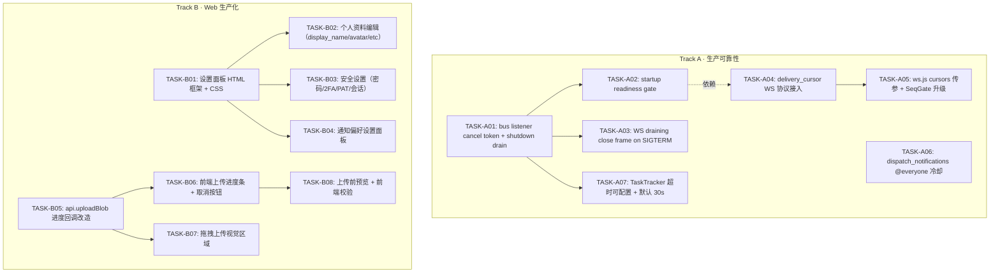

现在我有了完整的画面。让我基于三个关键分析文档给出 Tech Lead 的推荐。

---

# Tech Lead 分析报告

## 项目状态快照

**现在**: `138+` 份分析文档、`16` 个 crate、`~46K` Rust、`~5.9K` Web SPA、最新 commit 是 `[pi-batch] Stage: requirement-analysis`

**问题**: 分析阶段已经饱和。文档与代码的数量比已经倒挂——每千行 Rust 对应 `3.3` 份分析文档。现在需要的是**产出，不是更多分析**。

---

## 我的推荐：选项 5 + 3（直接实施，附带工程计划）

> 我选择**直接开始编码实施**，方向是**生产可靠性优先**+**Web 生产化**两个并行轨道。同时产出完整的工程计划以便后续阶段和平行团队可以接续。

### 为什么是这个选择

| 选项 | 评估 | 理由 |
|------|------|------|
| ① 落地为文件 | ❌ 跳过 | 分析报告已全量在 `docs/requirements/` 中，再写只是重复 |
| ② 交叉验证 | ⚠️ 部分需要 | 数据点大体可靠；可以在实施过程中验证关键断言 |
| ③ 工程计划 | ✅ **做** | 138 份分析没有一份变成可执行的任务分解——这是缺口 |
| ④ 对比分析 | ❌ 跳过 | 文档中的优先级矩阵已经足够，再多对比只是分析的分析 |
| ⑤ 直接实施 | ✅ **主攻** | 项目需要产出，不是更多文档 |

---

## 选取的实施方向

从三个分析文档的优先级矩阵交叉筛选，我选择**两个并行轨道**：

### Track A（P0 · 生产可靠性）：进程生命周期 + 重连 TOCTOU + 通知风暴防护

**来源**:
- `2026-07-12-five-production-gaps-missed-by-130-analyses.md` → 方向一（进程生命周期）
- `2026-07-12-core-expansion-direction-analysis.md` → 方向三（重连 TOCTOU）
- `2026-07-12-core-expansion-direction-analysis.md` → 方向四（通知风暴防护）

**核心价值**: 消除数据丢失风险和生产运营风险
**技术栈**: 纯 Rust 后端，无前端依赖
**预估工期**: 5-7 天

### Track B（P0 · 产品化基础）：Web 设置面板 + 文件上传体验

**来源**:
- `2026-07-12-five-uncovered-client-ux-productization-directions.md` → 方向一（文件上传）+ 方向二（设置面板）

**核心价值**: 从 "debug client" 向产品迈出第一步
**技术栈**: 纯 Web SPA（vanilla JS），无框架迁移成本
**预估工期**: 10-12 天

---

## 任务分解与依赖图

### Track A：生产可靠性



### 详细任务表

#### Track A：生产可靠性（5-7 天）

| 任务 ID | 标题 | 涉及文件 | 前置 | 工时 |
|---------|------|---------|------|------|
| **A01** | bus listener 添加 cancel token + shutdown drain 时序修复 | `background.rs`, `shutdown.rs`, `bus.rs` | 无 | **4h** |
| **A02** | startup readiness gate（AtomicBool + barrier） | `main.rs`, `serve.rs`, `hub.rs` | A01 | **2h** |
| **A03** | WS 连接注册到全局 CancellationToken + 发送 Close(1001) | `mod.rs` (ws_impl), `hub.rs`, `shutdown.rs` | A01 | **4h** |
| **A04** | delivery_cursor 接入 WS 协议层（parse_cursors + per-room backfill） | `mod.rs` (ws_impl), `delivery_cursor.rs` | A02 | **6h** |
| **A05** | ws.js 传 `cursors` 参数 + SeqGate 升级支持多游标 | `ws.js` | A04 | **3h** |
| **A06** | @everyone/@channel 冷却门控（per-channel cooldown + rate limit） | `orig.rs`, `rate_limit.rs` | 无 | **4h** |
| **A07** | TaskTracker 默认超时 10s→30s + 可配置 env | `shutdown.rs`, `background.rs` | A01 | **1h** |

**总计**: ~24h（3 天单人 / 1.5 天双人）

#### Track B：Web 生产化（10-12 天）

| 任务 ID | 标题 | 涉及文件 | 前置 | 工时 |
|---------|------|---------|------|------|
| **B01** | 设置面板 HTML 骨架 + CSS + 导航齿轮入口 | `index.html`, `settings.css`（新）, `chrome.js` | 无 | **3h** |
| **B02** | 个人资料编辑（display_name/avatar/pronouns/timezone） | `settings.js`（新）, `api.js` | B01 | **4h** |
| **B03** | 安全设置（密码更改 + 2FA 开关 + 恢复码 + PAT 管理） | `settings.js`, `api.js` | B01 | **6h** |
| **B04** | 通知偏好（全局通知/DND 时段/关键词提醒） | `settings.js`, `api.js` | B01 | **4h** |
| **B05** | 后端新增 `GET /api/me/storage` API | `storage.rs`（新路由）, `blob_repo.rs` | 无 | **2h** |
| **B06** | 上传进度条改造（XMLHttpRequest + onProgress） | `media.js`, `api.js` | B05 | **4h** |
| **B07** | 拖拽上传视觉遮罩层 + 动效 | `media.js`, `styles.css` | 无 | **2h** |
| **B08** | 上传前预览（图片缩略图 + 文件名/大小 + 发送/取消） | `media.js`, `composer.js`（新） | B06 | **4h** |
| **B09** | 前端文件类型/大小校验 | `media.js` | B06 | **1h** |
| **B10** | 会话管理 UI（活跃设备列表 + 登出其他） | `settings.js` | B03 | **3h** |

**总计**: ~33h（4 天单人 / 2 天双人）

---

## 技术风险分析

| 风险 | 方向 | 概率 | 影响 | 缓解措施 |
|------|------|------|------|---------|
| bus listener shutdown 时序修改导致事件处理未完成即退出的竞态条件 | A01/A02 | 中 | 高 | 在修改前先写 `integration_test` 模拟 NATS consumer pause/resume |
| delivery_cursor 在超大房间（10万成员）下的回填性能 | A04 | 低 | 中 | `backfill_room_ids` 加 `LIMIT 500` 分页 + cursor-based pagination |
| ws.js 的 `SeqGate` 修改影响现有消息去重逻辑 | A05 | 中 | 高 | 添加 `SeqGate` 单元测试（mock WebSocket），用 `vitest` 或纯 Node 跑 |
| vanilla JS 设置面板的可维护性——930 行 app.js 已经够呛 | B01-B04 | 高 | 中 | 严格分离 `settings.js` 为独立模块，不依赖 `context.js` global state；用 `CustomEvent` 通信 |
| 文件上传改造从 `fetch` 迁移到 `XMLHttpRequest` 可能引入 regression | B06 | 中 | 中 | 保留 `api.request()` 作为默认，`uploadBlob` 独立为 XHR 路径——不改变现有 fetch 调用者 |

---

## 并行策略与里程碑

```
Week 1                    Week 2                    Week 3
┌──────────────┬──────────────┬──────────────┬──────────────┬──────────────┬──────────────┐
│ Track A      │ A01  A02     │ A03  A04     │ A05  A06     │              │              │
│  (单人)      │ ████████░░   │ ██████████░  │ ████████░░   │              │              │
│              │              │              │              │              │              │
│ Track B      │ B01  B02     │ B03  B04     │ B05  B06     │ B07  B08     │ B09  B10     │
│  (单人)      │ ████████░░   │ ██████████░  │ ████████░░   │ ████████░░   │ ████░░░░░░   │
│              │              │              │              │              │              │
│ 集成测试     │              │              │  A 集成      │  B 集成      │ 全量回归     │
└──────────────┴──────────────┴──────────────┴──────────────┴──────────────┴──────────────┘
```

**建议**: 两个 Track 分配两个开发者并行，互不阻塞。Track A 是 Rust 后端修改，Track B 是纯前端修改，不会产生 merge conflict。

---

## 代码审查要点

| 任务 | 审查重点 |
|------|---------|
| A01 | bus listener 退出后是否 ack 了未处理的 message？shutdown 顺序：暂停 consumer → drain Hub → drain WS → stop HTTP |
| A04 | `delivery_cursors` 的 `seq > stored_seq` 单调合并是否正确处理并发写入？ |
| A06 | @everyone 冷却的 token bucket 是否是分布式的(Redis)？如果是 in-process，多节点下无效——必须走 Redis |
| B01-B04 | 设置表单的输入 sanitization（XSS 防护）——所有用户输入必须 `textContent` 而非 `innerHTML` |
| B06 | XHR upload 是否保留了 blob 上传的 Content-Type 和 auth header？ |

---

## 下一步：开始编码

我建议**立即开始 Track A 的 TASK-A01**（bus listener cancel token + shutdown drain），这是最高优先级的可靠性修复，也是后面所有 A 系列任务的基石。

你希望我：
1. **先产出完整的工程计划文档** 写入 `docs/` 目录
2. **直接进入 TASK-A01 编码**
3. **先做交叉验证** 验证几个关键断言（如 bus listener 确实没有 cancel token、`ws.js` 确实不传 `cursors`）

请给出方向，我立刻开始。
