现在我已经完全理解了代码库。以下是全面的技术负责人分析。

---

# 技术负责人分析：5 个未覆盖的架构扩展方向

## 1. 任务分解

### 方向四：数据库迁移回滚与 Schema 生命周期管理（P1 — 生产安全）

| 任务 ID | 标题 | 涉及文件 | 前置依赖 | 工时 | 验收标准 |
|---------|------|---------|---------|------|---------|
| TASK-001 | MIN_MIGRATION Schema 版本声明常量 | `crates/aero-storage/src/db.rs`（新增 `MIN_MIGRATION` const），`crates/aero-server/src/bin/aero-cli.rs`（`--check` 子命令） | 无 | 2h | `aero-cli migrate --check` 在 schema 过时时以非零退出；在满足要求时以零退出 |
| TASK-002 | 拆分迁移目录：`forward/` + `rollback/` | `migrations/forward/`（移动全部 157 个 `.sql` 文件），`migrations/rollback/`（新建，初始为空） | TASK-001 | 3h | `sqlx::migrate!("../../migrations/forward")` 能正确运行；尝试 `glob("*.sql")` 仅匹配 `forward/` |
| TASK-003 | 迁移回滚 CLI：`aero-cli migrate --down N` | `crates/aero-server/src/bin/aero-cli.rs`（+ `do_down_migration` 函数），`crates/aero-storage/src/db.rs`（+ `migrate_down` 公共函数） | TASK-002 | 8h | `migrate --down 1` 回滚最后 N 个迁移，以相反顺序执行 `rollback/*.down.sql` 脚本 |
| TASK-004 | 构建前 5 个迁移的 `down.sql` 脚本 | `migrations/rollback/0157_message_version.down.sql` 至 `migrations/rollback/0153_*.down.sql` | TASK-003 | 4h | 每个 `down.sql` 都能干净地回滚由其 `forward/` 对应文件应用的所有更改（DROP TABLE / DROP COLUMN / 反向修改） |
| TASK-005 | CI 破坏性变更门禁检查 | `scripts/check-migration-breaking.sh`，`.github/workflows/ci.yml`（+ 步骤） | TASK-002 | 4h | 包含 `DROP COLUMN` / `DROP TABLE` / `ALTER COLUMN TYPE` 的迁移在 CI 中失败，除非被明确标记 |
| TASK-006 | 慢迁移超时 + EXPLAIN 预估强制执行 | `crates/aero-storage/src/db.rs`（`migrate_with_timeout`），`aero-cli`（`--timeout` 标志） | TASK-002 | 4h | `aero-cli migrate --timeout 120` 在 120 秒后超时；日志打印 `EXPLAIN` 预迁移计划 |
| TASK-007 | 零停机迁移指南 + 断言 | `docs/migration-zero-downtime.md`，`scripts/check-migration-nonblocking.sh` | TASK-005 | 3h | 文档详细描述三阶段（ADD → backfill → DROP NOT NULL）模式；脚本在 CI 中检测潜在的排他锁 |
| TASK-008 | 全面的回滚集成测试 | `crates/aero-storage/tests/migration_rollback.rs`（新建测试文件） | TASK-003, TASK-004 | 6h | 测试应用第 N 个迁移，插入样本数据，回滚，验证 schema 恢复且迁移可重放 |

### 方向五：管理操作审计日志（P1 — 合规/运营）

| 任务 ID | 标题 | 涉及文件 | 前置依赖 | 工时 | 验收标准 |
|---------|------|---------|---------|------|---------|
| TASK-010 | `audit_admin_actions` 迁移 + SQL DDL | `migrations/forward/0158_audit_admin_actions.sql` | TASK-002 | 3h | 表创建包含正确的索引、`REVOKE UPDATE/DELETE` 权限声明、JSONB 列、UUID 主键 |
| TASK-011 | `AuditAdminRepo` + `emit_admin_audit` 函数 | `crates/aero-storage/src/audit_admin.rs`（新文件），`crates/aero-storage/src/lib.rs`（+ `pub mod audit_admin`） | TASK-010 | 4h | 函数在提交事务中插入一行：`workspace_id, actor_id, action, target_type, target_id, old_value, new_value, metadata` |
| TASK-012 | 管理审计 API 端点 | `crates/aero-server/src/audit_admin.rs`（新文件），`crates/aero-server/src/routes/routes.rs`（+ `.merge(crate::audit_admin::routes())`） | TASK-011 | 4h | `GET /api/workspaces/:id/audit` 返回分页的审计行，支持 `?action=`、`?actor=`、`?since=`、`?limit=` 过滤；仅 Owner/Admin 可访问 |
| TASK-013 | 在工作区设置变更注入审计 emit | `crates/aero-server/src/workspaces.rs`（在 `update_workspace`、`update_retention` 等位置调用 `emit_admin_audit`） | TASK-011 | 3h | 更新名称、图标、retention_days、SSO 配置均记录前后值 |
| TASK-014 | 在成员角色/停用变更注入审计 emit | `crates/aero-server/src/channel_roles.rs`、`crates/aero-server/src/deactivation.rs` | TASK-011 | 3h | 角色变更（Owner→Admin、Admin→Member）和成员停用/激活记录 |
| TASK-015 | 在合规操作注入审计 emit | `crates/aero-server/src/info_barriers.rs`、`crates/aero-server/src/legal_holds.rs`、`crates/aero-server/src/ip_allowlist.rs` | TASK-011 | 4h | 信息隔离墙规则、法务保全令、IP 白名单变更全部记录 |
| TASK-016 | SCIM 批量操作审计 + 去重批处理 | `crates/aero-storage/src/scim.rs`（在批量 `sync` 中调用 `emit_batch_admin_audit`） | TASK-011 | 4h | 1000 用户同步生成 1 条审计记录（非 1000 条）；`details` JSONB 包含 `user_count`、`affected_user_ids[]` |
| TASK-017 | 审计事件异步写：`mpsc` channel + consumer | `crates/aero-server/src/audit_admin.rs`（+ `run_audit_consumer`），`crates/aero-server/src/bin/boot/background.rs`（spawn consumer） | TASK-011 | 5h | 所有 `emit_admin_audit` 通过 bounded `mpsc` channel 异步发送；consumer panic 时重启；channel 满时不阻塞写入者 |
| TASK-018 | PII 脱敏序列化 + 审计事件保留 3 年清理 | `crates/aero-storage/src/audit_admin.rs`（+ `sanitize_audit_pii`），`crates/aero-server/src/bin/boot/retention.rs`（+ audit purge sweep） | TASK-017 | 4h | 邮箱/IP 在写入前被脱敏；>3 年的审计记录被定期清理 |

### 方向二：消息发送撤回与发送确认（P2 — UX/合规）

| 任务 ID | 标题 | 涉及文件 | 前置依赖 | 工时 | 验收标准 |
|---------|------|---------|---------|------|---------|
| TASK-020 | Redis 延迟消息队列：`DelayedMessageStore` | `crates/aero-storage/src/delayed_message.rs`（新文件，Redis sorted-set），`crates/aero-storage/src/lib.rs`（+ `pub mod delayed_message`） | 无 | 6h | `store_pending(id, expire_at)` 写入 sorted-set；`pop_expired(now)` 返回所有过期消息 ID；`cancel(id)` 删除 |
| TASK-021 | `bus::SeqMinter` 两阶段 seq：`reserve` + `commit` | `crates/aero-bus/src/seq.rs`（+ `reserve_seq`、`commit_seq`、`rollback_seq`） | 无 | 6h | `reserve_seq(subject)` 返回预占序列号但未提交；`commit_seq(subject, seq)` 推进 minter；`rollback_seq(subject, seq)` 释放 |
| TASK-022 | Undo Send 服务器端：取消 + 延迟发布 | `crates/aero-server/src/delayed_message.rs`（新文件），`crates/aero-im-core/src/service/events.rs`（修改 `publish_room_event`） | TASK-020, TASK-021 | 8h | 发送消息时可选 `undo_until` → 先 `reserve_seq` 再写入 sorted-set → `commit_seq` + 在过期时扇出 → `cancel_undelivered` 从 sorted-set 删除并广播 `Deleted` |
| TASK-023 | Undo Send WS 帧：`send_optimistic` + `confirm_delivery` + `cancel_undelivered` | `crates/aero-server/src/ws/ws_impl/`（+ 帧类型），`crates/aero-common/src/model/event.rs`（+ `RoomEvent::UndoMetadata`） | TASK-022 | 5h | 客户端发送 `{"type":"send_message", "undo_until": 1234567890}` → 接收端看到占位 → 确认后转为完整消息 → 撤回时消失 |
| TASK-024 | 崩溃恢复：启动时重新加载活跃 undo 窗口 | `crates/aero-server/src/bin/boot/persistence.rs`（+ `restore_undo_windows`） | TASK-022 | 4h | 服务器启动时扫 Redis 所有未过期 undo 窗口，追回崩溃期间过期的窗口 |
| TASK-025 | Send Review 表 + API | `migrations/forward/0159_message_pending_review.sql`，`crates/aero-storage/src/pending_review.rs`，`crates/aero-server/src/send_review.rs` | TASK-002 | 8h | `POST /api/rooms/:id/messages` 在频道 `requires_review=true` 时进入 `pending_review` 表；`POST /api/messages/:id/approve` / `reject` 触发扇出；24h 自动拒绝 |
| TASK-026 | Send Review WS 帧 | `crates/aero-server/src/ws/ws_impl/bus.rs`（+ `msg:pending_review`、`msg:approved`、`msg:rejected` 帧） | TASK-025 | 3h | WebSocket 客户端在审批状态变更时收到正确帧 |
| TASK-027 | Defer Read Receipt：延迟版 `mark_read` | `crates/aero-server/src/ws/ws_impl/`（修改 `mark_read` 处理），`crates/aero-server/src/hub.rs`（延迟广播 + 5s 窗口） | 无 | 4h | `mark_read` 带 `delay_ms=5000` 参数 → 服务器缓冲 5s → 如果用户在此期间发送另一条 `mark_read`（无延迟）则取消 |

### 方向三：品牌定制化 — Phase A/B/C（P2 — 销售就绪度）

| 任务 ID | 标题 | 涉及文件 | 前置依赖 | 工时 | 验收标准 |
|---------|------|---------|---------|------|---------|
| TASK-030 | `workspace_branding` 表 + 仓储层 | `migrations/forward/0160_workspace_branding.sql`，`crates/aero-storage/src/workspace_branding.rs`（新文件） | TASK-002 | 3h | 表包含 `workspace_id`（唯一 FK）、`logo_url`、`primary_color`、`favicon_url`、`login_page_tagline`、`email_signature`、`custom_css` |
| TASK-031 | 品牌配置 CRUD API | `crates/aero-server/src/workspace_branding.rs`（新文件），`routes.rs`（+ `.merge(...)`） | TASK-030 | 4h | `PUT /api/workspaces/:id/branding`（需 `can_administer`），`GET /api/workspaces/:id/branding`，验证颜色格式、URL 格式 |
| TASK-032 | 品牌中间件 + 租户解析 | `crates/aero-server/src/middleware/tenant_context.rs`（新文件，`Host` → `workspace_id` 映射缓存），`routes.rs`（添加 `layer(middleware)`） | TASK-030 | 5h | 每个请求根据 `Host` 头解析 `workspace_id`；缓存结果 30s TTL；未找到回退默认值 |
| TASK-033 | 动态 CSS 变量注入 `<head>` | `web/index.html`（+ `<style id="brand-vars">` 占位），`crates/aero-server/src/routes/`（+ 在获取 index.html 之前注入 `:root { --brand-1: ... }` 的中间件层） | TASK-032 | 4h | 当品牌已配置时，浏览器渲染使用品牌色；未配置时使用默认 Aero IM 色 |
| TASK-034 | 邮件模板变量化 | `crates/aero-server/src/mailer.rs`（替换硬编码字符串为 `{{brand.name}}`、`{{brand.logo_url}}` 等模板变量），`crates/aero-server/src/templates/`（+ Handlebars 模板文件，可选） | TASK-031 | 6h | 邮件在 workspace 品牌已配置时显示品牌色/logo/名称；未配置时显示默认品牌 |

### 方向一：嵌入式客服对话部件（P3 — 产品线）

| 任务 ID | 标题 | 涉及文件 | 前置依赖 | 工时 | 验收标准 |
|---------|------|---------|---------|------|---------|
| TASK-040 | 访客会话 token 中间件 | `crates/aero-server/src/chat_embed/auth.rs`（新文件，短期 JWT + IP 绑定验证），`crates/aero-server/src/routes/routes.rs`（+ 跳过 `AuthUser` 的独立路由组） | 无 | 6h | `POST /api/chat/token` 返回 5 分钟 TTL JWT；中间件绕过现有 `AuthUser` extractor，使用 chat token |
| TASK-041 | `conversation` + `visitor` 模型 + 迁移 | `migrations/forward/0161_chat_conversations.sql`，`crates/aero-storage/src/chat_conversation.rs`（新文件） | TASK-002 | 6h | 表：`visitors`（id、external_id、name、email、metadata JSONB）、`conversations`（id、visitor_id、workspace_id、status、assigned_agent_id、created_at） |
| TASK-042 | Embed SDK shell：`<script>` iframe + postMessage | `crates/aero-chat-sdk/`（新 crate + Cargo.toml），`web/embed.js`（ES2020 零依赖 iframe 控制器） | TASK-040 | 8h | 第三方网站嵌入 `<script src="https://chat.aero.im/sdk.js" data-workspace="abc">` 后渲染 iframe，通过 `postMessage` 与父窗口通信 |
| TASK-043 | `chat:{conversation_id}` NATS subject + Hub `FanOutStrategy::Chat` | `crates/aero-server/src/hub.rs`（+ `fan_out_chat`），`crates/aero-bus/src/`（+ 独立 stream/consumer 声明） | TASK-041 | 5h | 访客→客服消息使用隔离的 NATS stream；hub 扇出不接触 `im.room.*` |
| TASK-044 | 客服分配引擎（RR / skill / least-busy） | `crates/aero-server/src/chat_embed/routing.rs`（新文件），`crates/aero-storage/src/chat_conversation.rs`（+ `assign_agent`） | TASK-041 | 8h | 新会话自动分配给在线客服中当前会话数最少的；无可用客服时进入排队/离线留言 |
| TASK-045 | 同步访客消息过滤器 | `crates/aero-server/src/chat_embed/filter.rs`（新文件，基于 regex 的 XSS/SQLi/spam 模式匹配） | TASK-043 | 4h | 包含 `<script>` 或常见 SQL 注入模式的消息在投递前被拒绝；访客收到错误提示 |
| TASK-046 | 离线留言 + 客服上线通知 | `crates/aero-storage/src/chat_conversation.rs`（+ `offline_message`），`crates/aero-push/src/`（+ 客服离线推送） | TASK-044 | 5h | 当无客服在线时，访客看到「留言」表单；客服上线时收到 pending 通知 |
| TASK-047 | 客服 AI 辅助（自动回复 + 建议） | `crates/aero-server/src/chat_embed/ai_assist.rs`（新文件，复用 `agent_bot` 的 AI 调用模式） | TASK-041 | 6h | 访客首条消息自动触发 AI 生成草稿回复（或自动回复，如已配置）；客服可在发送前编辑 |

### 跨方向支持任务

| 任务 ID | 标题 | 涉及文件 | 前置依赖 | 工时 | 验收标准 |
|---------|------|---------|---------|------|---------|
| TASK-050 | 环境门控基础设施（所有新方向使用 `env gate`） | `crates/aero-common/src/config.rs`（+ `AERO_CHAT_ENABLED`、`AERO_BRANDING_ENABLED` 等），`crates/aero-server/src/bin/boot/`（+ 门控 spawn） | 无 | 3h | 未设置 env var 时，新功能路由返回 404；设置时功能正常 |
| TASK-051 | 新表 UUID 主键一致性（全部使用 `gen_random_uuid()`） | 所有新迁移文件 | TASK-002 | 1h | 所有新表使用 `UUID PRIMARY KEY DEFAULT gen_random_uuid()` |

---

## 2. 执行顺序

```mermaid
graph TD
    subgraph "Phase 0 — 基础设施"
        T050[TASK-050: 环境门控基础设施]
        T051[TASK-051: UUID 主键一致性]
        T001[TASK-001: MIN_MIGRATION 声明]
    end

    subgraph "Phase 1a — 迁移回滚（P1 生产安全）"
        T002[TASK-002: 拆分 forward/rollback 目录]
        T005[TASK-005: CI 破坏性变更门禁]
        T002 --> T003[TASK-003: 回滚 CLI]
        T003 --> T004[TASK-004: 前 5 个 down.sql]
        T003 --> T006[TASK-006: 慢迁移超时]
        T003 --> T008[TASK-008: 回滚集成测试]
        T005 --> T007[TASK-007: 零停机迁移指南]
    end

    subgraph "Phase 1b — 管理审计日志（P1 生产安全）"
        T010[TASK-010: audit_admin_actions 迁移]
        T010 --> T011[TASK-011: AuditAdminRepo + emit 函数]
        T011 --> T012[TASK-012: 管理审计 API]
        T011 --> T013[TASK-013: 工作区设置审计]
        T011 --> T014[TASK-014: 成员角色审计]
        T011 --> T015[TASK-015: 合规操作审计]
        T011 --> T016[TASK-016: SCIM 批量审计]
        T011 --> T017[TASK-017: mpsc channel consumer]
        T017 --> T018[TASK-018: PII 脱敏 + 3 年清理]
    end

    subgraph "Phase 2a — 品牌定制化 Phase A-C（P2 销售就绪）"
        T030[TASK-030: workspace_branding 表]
        T030 --> T031[TASK-031: 品牌 CRUD API]
        T030 --> T032[TASK-032: 品牌中间件]
        T032 --> T033[TASK-033: 动态 CSS 变量]
        T031 --> T034[TASK-034: 邮件模板变量]
    end

    subgraph "Phase 2b — Undo Send（P2 UX 改进）"
        T020[TASK-020: Redis 延迟消息队列]
        T021[TASK-021: 两阶段 seq minter]
        T020 --> T022[TASK-022: Undo Send server]
        T021 --> T022
        T022 --> T023[TASK-023: Undo Send WS 帧]
        T022 --> T024[TASK-024: 崩溃恢复]
        T025[TASK-025: Send Review 表+API]
        T025 --> T026[TASK-026: Send Review WS 帧]
        T027[TASK-027: Defer Read Receipt]
    end

    subgraph "Phase 3 — 嵌入式客服（P3 产品扩展）"
        T040[TASK-040: 访客 token 中间件]
        T041[TASK-041: conversation 模型]
        T040 --> T042[TASK-042: Embed SDK]
        T041 --> T043[TASK-043: chat subject + FanOutStrategy]
        T041 --> T044[TASK-044: 客服分配引擎]
        T043 --> T045[TASK-045: 同步访客过滤器]
        T044 --> T046[TASK-046: 离线留言]
        T041 --> T047[TASK-047: 客服 AI 辅助]
    end

    %% 跨阶段依赖
    T002 --> T010
    T002 --> T030
    T002 --> T041
    T050 --> T040
    T050 --> T030
    T050 --> T025

    %% 可并行组
    classDef parallel fill:#e1f5fe
    class T001,T005,T010,T050,T051 parallel
    class T013,T014,T015,T016 parallel
    class T023,T024,T026,T027 parallel
    class T045,T046,T047 parallel
```



### 并行执行组

| 组 | 任务 | 所需开发者 |
|----|------|-----------|
| **G1（独立基础设施）** | T001, T005, T010, T050, T051 | 1 人（基础） |
| **G2（品牌初期 + 审计初期）** | T030→T031 + T011→T012 | 2 人（后端 API） |
| **G3（审计注入点——可并行）** | T013, T014, T015, T016 | 1 人，顺序完成（模式相同） |
| **G4（Undo Send 引擎）** | T020, T021 → T022 | 1 人（核心算法） |
| **G5（客服初期）** | T040, T041 | 1 人（建模） |
| **G6（WS 帧——所有方向）** | T023, T024, T026, T027 | 1 人（WebSocket 协议） |

---

## 3. 技术风险

### 风险矩阵

| # | 风险 | 方向 | 可能性 | 影响 | 缓解措施 |
|---|------|------|--------|------|---------|
| R1 | **sqlx 编译时嵌入限制**：`sqlx::migrate!` 不支持的 `glob("*.sql")` 模式过滤，无法干净分离 forward/rollback | D4 | 高 | 高 | 采用选项 A（`migrations/forward/` + `migrations/rollback/` 独立目录），在 `aero-cli` 中使用 `include_str!` 手动进行 rollback。需要在 `db.rs` 中更新 `sqlx::migrate!("../../migrations/forward")`，不要尝试修改 sqlx 行为 |
| R2 | **NATS subject 隔离违规**：访客聊天 (`chat:*`) 错误投递至 `im.room.*` durable consumer | D1 | 中 | 高 | 为 `chat.*` 使用**完全独立的 NATS stream + consumer**。在 Hub 中添加 `FanOutStrategy::Chat` 枚举，防止扇出路径交叉。在 staging 中通过网络分区测试验证 |
| R3 | **Redis undo 窗口按 seq 缩放**：如果大规模实例中每秒有数百条 undo 消息，Redis sorted-set 操作成为瓶颈 | D2 | 低 | 中 | `ZADD` / `ZREMRANGEBYSCORE` 是 O(log N)。将窗口 TTL 设为 15s 最大值，保持集合大小 < 10k。如果成为瓶颈，添加 per-shard 分片 |
| R4 | **崩溃恢复竞态**：服务器在 undo 窗口提交 + 消息投递的窗口期内崩溃，seq 在此过程中丢失 | D2 | 中 | 高 | seq 两阶段协议：`reserve` 在 Redis 中存储已预占 seq，`commit` 将其标记为已确认。恢复时所有未提交 seq 分配 `rollback`，消息保持未投递状态 |
| R5 | **ACME 证书 + `unsafe_code = forbid`**：在 root `Cargo.toml` 中约束下，`acme-lib` / `rustls-acme` 可能依赖不安全代码 | D3 Phase D | 中 | 高 | Phase D 单独推迟；在沙箱中评估 `acme-lib` 依赖的 `unsafe` 使用情况。若不相容，在评估 crate 中使用 `#[allow(unsafe_code)]` 或考虑通过 sidecar nginx 代理进行 TLS |
| R6 | **审计写入背压**：SCIM 同步产生 1000 条审计事件 → `tokio::spawn` 一次性产生 1000 个任务 → 压垮执行器 | D5 | 中 | 中 | 使用 bounded `mpsc` channel（容量 4096）+ 专用 consumer 任务。批量审计事件（`audit_batch`）将 1000 个写入合并为 1 条记录 |
| R7 | **跨域安全：`postMessage` origin 校验**：`postMessage` 欺骗可导致客服对话被劫持 | D1 | 低 | 高 | 严格的 origin 白名单（存储在 `workspace_branding.allowed_origins[]`）。拒绝非白名单来源。使用 `event.origin` 验证，不信任 `event.source` |
| R8 | **自定义域名 DNS 传播延迟 + TLS 竞争**：租户配置自定义域名后，Let's Encrypt 验证 + DNS 更新可能需要数分钟 → 期间停机 | D3 Phase D | 中 | 中 | 显示「配置中」状态的中间页面；预验证 DNS 记录存在后再尝试 ACME。在 TLS 准备好之前提供 HTTP→HTTPS 重定向 |

### 外部依赖

| 依赖 | 方向 | 当前状态 | 行动 |
|------|------|---------|------|
| `acme-lib` / `rustls-acme` crate | D3 Phase D | 不在 workspace 中 | 评估是否与 `unsafe_code = forbid` 兼容；若是则添加；否则侧载 |
| Anthropic API 配额 | D1（AI 客服） | 现有依赖 | 客服 AI 回答计入现有预算系统；需要在客服 `AiService` 中有单独的预算池 |
| Redis 7 | D2（Undo Send） | fred 9 现有 | Undo Send 使用 Redis sorted-set，无新依赖 |
| NATS JetStream | D1（chat subject） | async-nats 0.36 现有 | 仅新 stream/consumer 定义；无新依赖 |
| str0m（WebRTC） | D1（访客视频聊天——超出 MVP） | 现有在 whip/webrtc 中 | MVP 仅文本消息；视频作为后期阶段 |
| ImageMagick / `image` crate | D3 Phase E（favicon 生成） | 不在 workspace 中 | 评估 `image` crate 是否满足 PNG 图标生成需求；ImageMagick 用于缩放 |

### 测试覆盖难点

| 难点 | 方向 | 策略 |
|------|------|------|
| Undo Send 崩溃恢复 | D2 | 注入式测试：注入 Redis 状态 → 模拟重启 → 验证窗口恢复。在 CI 中使用 `#[ignore]` + `REDIS_URL` 门控 |
| 回滚迁移 | D4 | 在可抛弃 PG 数据库中的集成测试：应用迁移 → 插入数据 → 回滚 → 验证 schema + 数据丢失（期望） |
| Embed SDK 跨域行为 | D1 | 仅浏览器端：使用 ` playwright` 或 `puppeteer` 进行 E2E 测试，验证 `postMessage` 流 |
| 审计不可变性 | D5 | SQL 断言：`REVOKE UPDATE/DELETE` 在迁移中；测试验证 `UPDATE/ DELETE` 从应用用户处被拒绝 |

---

## 4. 资源评估

### 团队组成

| 角色 | 所需技能 | 数量 | 分配方向 |
|------|---------|------|---------|
| **后端 Rust 工程师（资深）** | Rust, sqlx, async, Redis, NATS | 1 | D4（回滚）+ D5（审计）+ D2（Undo Send seq 设计） |
| **后端 Rust 工程师（中级）** | Rust, Axum, PostgreSQL, WebSocket | 1 | D2（Send Review + WS 帧）+ D3（品牌 API）+ D1（客服模型层） |
| **全栈 Web 工程师** | ES2020, CSS 变量, iframe postMessage, WebSocket | 1 | D3（动态 CSS 变量）+ D1（Embed SDK JS）+ D2（WS 客户端帧） |
| **DevOps / 基础设施工程师** | NATS, Redis, CI/CD, ACME/TLS, PG | 0.5 | D4（CI 门禁 + 迁移工具）+ D3 Phase D（如进行，超出初始范围） |

**总计**：2.5–3 FTE × 3 个月

### 里程碑时间线

| 里程碑 | 交付物 | 预计日期 | 关键依赖 |
|--------|--------|---------|---------|
| M1：Schema 安全 | TASK-001 → TASK-008（D4 完成）+ TASK-010 → TASK-018（D5 完成） | 第 3 周结束 | 无（最高优先级） |
| M2：品牌基础 + 发送安全 | TASK-030 → TASK-034（D3 Phases A-C）+ TASK-020 → TASK-027（D2 Undo Send 完成） | 第 6 周结束 | M1（D4 完成 → 为所有方向解锁迁移） |
| M3：客服 MVP | TASK-040 → TASK-047（D1，基本文本客服 + 分配 + 离线留言） | 第 10 周结束 | M1 + M2 |
| M4：安全审计 + 生产就绪 | 所有方向的渗透测试、崩溃恢复测试、负载测试 | 第 12 周结束 | M3 |
| M5：自定义域名（D3 Phase D — 可选） | ACME 集成 + 租户 TLS + Host 头解析 | 第 16 周结束（推迟后） | 仅当 `unsafe_code` 约束评估通过 |

### 阻塞点与解决策略

| 阻塞点 | 影响 | 解决策略 |
|--------|------|---------|
| `sqlx::migrate!` 的编译时嵌入阻止 down.sql 分离 | D4 和任何需要迁移的新工作 | **立即**拆分为 `migrations/forward/` + `migrations/rollback/` 目录。这是所有后续工作的前提 |
| `unsafe_code = forbid` 与 ACME crate 冲突 | D3 Phase D（自定义域名） | 将 Phase D 从初始范围中移除。Phase A/B/C 不需要外部 crate |
| 客服认证模型与现有中间件栈的解耦 | D1 难度从 L → XXL | 不扩展现有 `AuthUser` extractor。新建完全独立的中间件路径 `ChatAuth`。在现有中间件之前进行路由匹配 |

---

## 5. 质量保证

### 单元测试覆盖要求

| 模块 | 最低覆盖 | 关键测试用例 |
|------|---------|-------------|
| `aero-storage::db`（迁移） | 90% | 应用→回滚→重放循环、超时行为、空迁移列表 |
| `aero-storage::audit_admin` | 95% | emit 插入、PII 脱敏、批量合并、异步 channel 行为 |
| `aero-storage::delayed_message` | 95% | 过期弹出、取消、崩溃后重启恢复、TTL 过期 |
| `aero-bus::seq`（两阶段） | 95% | reserve→commit、reserve→rollback、崩溃后恢复、竞争条件 |
| `aero-server::chat_embed::filter` | 95% | XSS 模式、SQLi 模式、合法消息通过、边界长度 |
| `aero-server::chat_embed::routing` | 90% | Round-robin 分配、skill 匹配、least-busy、无可用客服处理 |
| `aero-server::workspace_branding` | 90% | CRUD 操作、ACL（仅 admin）、颜色格式验证、缓存失效 |
| `aero-server::send_review` | 90% | 提交→审批→扇出、提交→拒绝→扇出、24h 超时、房间级标志 |

### 集成测试策略

| 测试套件 | 环境要求 | 策略 |
|---------|---------|------|
| **迁移回滚集成** | 可抛弃 PG 数据库 | 每个候选迁移：应用 → 插入样本数据 → `migrate --down 1` → 验证 schema → 向前重放 → 验证第 2 次运行为 no-op |
| **管理审计集成** | PG | 执行工作区设置更新 → 验证审计表中出现行 → 验证 API 返回它 → 验证 `REVOKE UPDATE` 阻止直接修改 |
| **Undo Send 集成** | PG + Redis + NATS | 发送带 undo 的消息 → 在过期前验证已撤销 → 发送带 undo 的消息 → 等待过期 → 验证已投递。通过停止/重启 NATS 消费者注入崩溃 |
| **品牌渲染集成** | PG + HTTP | 配置品牌 → 获取 index.html → 验证 `<style id="brand-vars">` 包含正确颜色 → 清除品牌 → 验证回退为默认 |
| **Embed SDK E2E** | 浏览器（Playwright） | 加载 embed script → 验证 iframe 渲染 → 通过 `postMessage` 发送消息 → 验证消息出现在客服界面 |

### 代码审查要点

| 审查重点 | 理由 | 应用于 |
|---------|------|---------|
| 迁移回滚：down.sql 是否反转对应的 up.sql？ | 防止由于 schema 不匹配导致的数据损坏或部署失败 | 所有 PR 添加迁移 |
| 审计注入：每个写路径是否都在事务内调用 `emit_admin_audit`？ | 防止"盲操作"；如果 emit 失败，变更应回滚 | D5 PR |
| `bus::SeqMinter`：两阶段 seq 在崩溃场景下是否安全？ | seq gap 会破坏客户端排序；seq 重复会破坏去重 | D2 PR |
| 访客消息过滤：是否在**投递前**进行同步过滤？ | 异步 moderation 对于客服场景太慢 | D1 PR |
| iframe `postMessage`：origin 是否经过验证？ | 防止 CSRF/点击劫持 | D1 PR |
| 新路由组：是否使用独立中间件（非 `AuthUser`）？ | 防止 IDOR 访客冒充认证用户 | D1 PR |
| 环境门控：未启用时是否返回 404？ | 生产部署中无意外暴露 | 所有方向 |

### 性能测试需求

| 场景 | 目标 | 工具 | 通过标准 |
|------|------|------|---------|
| Undo Send：每秒 500 条 undo 消息 | Redis sorted-set 延迟 < 5ms | `redis-benchmark` / 自建脚本 | P99 `ZADD` 延迟 < 10ms |
| 审计写入：100 个并发 admin 操作 | 审计 channel 不成为瓶颈 | `oha` / `wrk` | P99 API 延迟增加 < 2ms（对比基线） |
| 品牌中间件：每秒 1000 个请求 | 品牌缓存命中率 > 99% | `oha` | P99 响应时间 < 50ms；缓存命中 > 99% |
| 崩溃恢复：2 秒窗口内 50 个活跃 undo | 恢复后零消息丢失 | 混沌测试（`kill -9` + 重启） | 所有窗口正确提交或回滚 |
| Embed SDK：500 个并发访客 | 聊天吞吐量符合预期 | `oha`（WebSocket）+ 自建 JS 客户端 | 95% 消息扇出延迟 < 200ms |

---

## 6. 实施计划

### Phase 1：迁移回滚 + 管理审计（第 1-3 周）— P1 生产安全

```
Week 1:  初始化拆分 + Schema 版本
  Mon-Wed: TASK-050（环境门控）+ TASK-051（UUID 约定）+ TASK-001（MIN_MIGRATION）
  Thu-Fri: TASK-002（拆分 forward/rollback 目录）+ 更新迁移后 `cargo build` 验证 + TASK-005（CI 门禁）

Week 2:  回滚引擎 + 审计基础设施
  Mon-Wed: TASK-003（回滚 CLI）+ TASK-006（慢迁移超时）
  Thu-Fri: TASK-010（audit_admin_actions 迁移）+ TASK-011（AuditAdminRepo + emit 函数）

Week 3:  审计注入 + 回滚测试
  Mon-Wed: TASK-013 → TASK-016（审计注入所有 4 个写路径）
  Thu-Fri: TASK-004（前 5 个 down.sql）+ TASK-008（回滚集成测试）+ TASK-007（零停机指南）

交付物：M1 Schema 安全。所有新迁移可回滚，所有 admin 操作可审计。
```

### Phase 2：品牌定制化 + Undo Send（第 4-7 周）— P2 销售就绪度 + UX

```
Week 4:  品牌基础
  Mon-Wed: TASK-030（workspace_branding 表）+ TASK-031（品牌 CRUD API）
  Thu-Fri: TASK-032（品牌中间件 + 租户解析）

Week 5:  品牌渲染 + Undo Send 引擎
  Mon-Wed: TASK-033（动态 CSS 变量）+ TASK-034（邮件模板变量化）
  Thu-Fri: TASK-020（Redis 延迟消息队列）+ TASK-021（两阶段 seq minter）

Week 6:  Undo Send 核心 + WS 帧
  Mon-Wed: TASK-022（Undo Send server 端）
  Thu-Fri: TASK-023（WS 帧——send_optimistic / confirm_delivery / cancel_undelivered）
  + TASK-024（崩溃恢复）

Week 7:  Send Review + Defer Read Receipt
  Mon-Wed: TASK-025（Send Review 表 + API）
  Thu-Fri: TASK-026（Send Review WS 帧）+ TASK-027（Defer Read Receipt）

交付物：M2 品牌 + 发送安全。工作区可白标；消息可撤回。
```

### Phase 3：嵌入式客服 MVP（第 8-11 周）— P3 产品扩展

```
Week 8:  访客认证 + 客服建模
  Mon-Wed: TASK-040（访客 token 中间件）+ ChatAuth 独立中间件路径
  Thu-Fri: TASK-041（conversation + visitor 迁移 + 仓储）

Week 9:  Embed SDK + 实时通道
  Mon-Wed: TASK-042（Embed SDK：iframe + postMessage shell）
  Thu-Fri: TASK-043（chat:{conversation_id} NATS subject + Hub::fan_out_chat）

Week 10: 客服逻辑
  Mon-Wed: TASK-044（路由引擎：RR / skill / least-busy）
  Thu-Fri: TASK-045（同步访客消息过滤器）+ TASK-046（离线留言）

Week 11: AI 辅助 + 收尾
  Mon-Wed: TASK-047（客服 AI 辅助——自动回答 + 建议）
  Thu-Fri: 集成测试 + E2E 浏览器测试（Playwright）+ 安全审计

交付物：M3 客服 MVP 完成。第三方网站可嵌入客服对话部件。
```

### Phase 4：生产加固（第 12 周）

```
Week 12: 负载测试 + 安全审计 + 文档
  Mon-Tue: 渗透测试（CSRF、XSS、访客 token 泄露、NATS subject 隔离）
  Wed-Thu: 混沌测试（崩溃恢复、NATS 降级、Redis 故障转移）
  Fri:      跨方向文档（AGENTS.md 更新、方向配置参考、回滚操作手册）

交付物：M4 生产就绪。
```

### Phase D（自定义域名 — 推迟至第 16+ 周 或 独立项目）

```
推迟条件：Phase A/B/C 品牌上线 + `unsafe_code` 评估完成
Week 16+: ACME 集成 → 租户 TLS → Host→workspace 解析 → 证书监控
```

---

## 最终建议总结

1. **立即启动**（本周）：TASK-001 + TASK-002（迁移目录拆分）。这是所有其他方向的障碍——没有 rolling forward 实验，就不能进行迁移。

2. **最高 ROI，最少依赖**：**方向四 L5**（Schema 版本声明 — 2 小时）+ **方向五**（管理审计 — 1-2 周）。这些是独立的，可直接提升生产安全性，且不与其他方向冲突。

3. **最被低估的工程工作**：**方向二的两阶段 seq**（TASK-021）。小而关键的架构变更，影响 `aero-bus` crate 的 `SeqMinter` trait。如果不能正确设计，整个 Undo Send 功能在崩溃时可能丢失消息。

4. **除非有全职产品经理驱动，否则不要将方向一提升到 P1 以上**。该分析中方向的体量评估**已被审阅者正确升级为 XXL**——这不是"再加 2 周的 sprint"。它是一个新产品线，有自己的认证模型、安全审计和 JS SDK。

5. **方向三 Phase D（自定义域名）应完全从该路线图中移除**，并作为自己的项目进行规划。ACME 证书生命周期管理是一个成熟的运营挑战——在 Phase A/B/C 品牌已交付价值并解决客户问题 *之后*，再予以解决。
