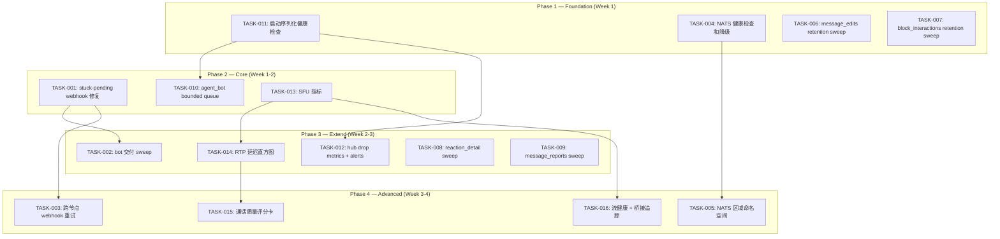
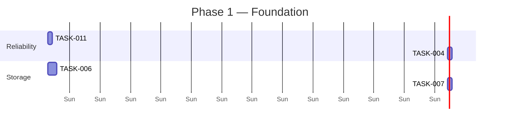
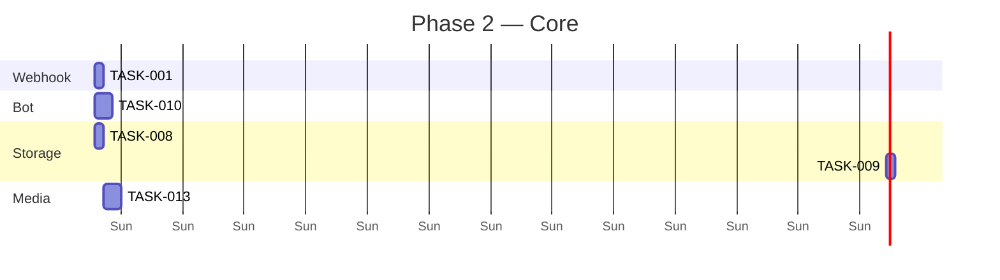
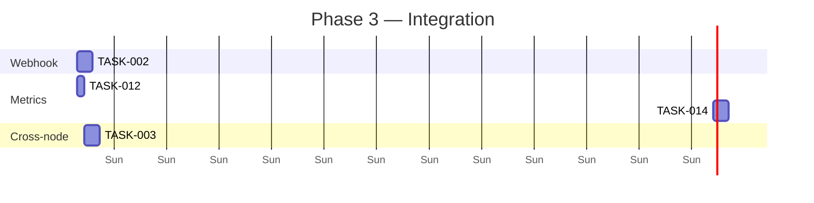
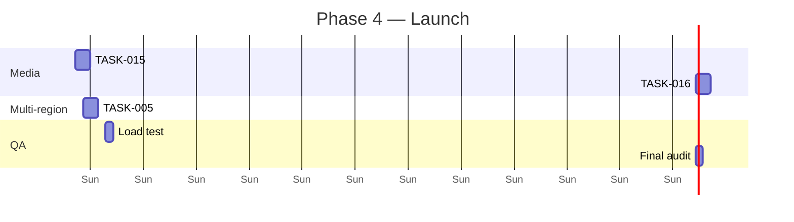

现在我已经通过代码验证了所有关键主张。以下是我的 Tech Lead 综合分析：

---

# Tech Lead 分析：5 方向代码验证交付物

## 1. 任务分解

每个任务 2-4 小时，按方向分组。

### 方向一：Webhook/Bot Crash-Safety（3 个任务）

| 任务 ID | 标题 | 涉及文件 | 前置依赖 | 工时 |
|---------|------|---------|---------|------|
| **TASK-001** | 修复 `claim_due` 回收 stuck-pending 行 | `crates/aero-storage/src/webhook_delivery.rs` | 无 | 2h |
| **TASK-002** | 为 bot 交付日志添加 sweep/重试循环 | `crates/aero-storage/src/bot_delivery.rs`（新建），`crates/aero-server/src/bin/boot/retention.rs`，`migrations/NNNN_bot_delivery_sweep.sql` | TASK-001（模式复用） | 4h |
| **TASK-003** | 跨节点 webhook 重试协调（分布式 leader sweep） | `crates/aero-server/src/webhook_dispatcher.rs`，`crates/aero-storage/src/webhook_delivery.rs` | TASK-001 | 4h |

**验收标准**：
- TASK-001：`claim_due` 查询条件同时覆盖 `failed` 和 `pending`（`status IN ('failed','pending')`），且 `pending` 行按 `created_at` 而非 `next_attempt_at` 进行拣选；新增单元测试覆盖 pending→claimed 路径。
- TASK-002：`bot_delivery_log` 行在 terminal 状态（`delivered`/`dead`）且超过可配置保留天数后被清理；`claim_due` 风格的 bot 重试循环；集成测试验证 `sweep_terminal_before`。
- TASK-003：`claim_due` 使用 `FOR UPDATE SKIP LOCKED` 配合 `pg_advisory_lock` 实现基于数据库的 leader 选举，或采用简单的每节点独立轮询（接受重复）。**注意**：仅当预期有 >1 个 server 实例时才需要此任务；否则推迟。

### 方向二：NATS 单集群假设（2 个任务）

| 任务 ID | 标题 | 涉及文件 | 前置依赖 | 工时 |
|---------|------|---------|---------|------|
| **TASK-004** | 为 NATS JetStream 连接添加健康检查和降级逻辑 | `crates/aero-bus/src/jetstream.rs`，`crates/aero-server/src/state.rs` | 无 | 3h |
| **TASK-005** | 在总线 subject 中设计区域/分片命名空间 | `crates/aero-bus/src/traits.rs`，`crates/aero-common/src/config.rs`，`crates/aero-im-core/src/service/events.rs`（`orig.rs:632`） | TASK-004 | 4h |

**验收标准**：
- TASK-004：总线消费 bot 在启动时验证 NATS 可达性，并在连接失败时报告清晰的错误（含指标 `nats_connected` gauge）。启动序列在继续之前等待 NATS 准备就绪或超时。**不做**——至少一次交付保证已足够（NATS 故障=进程终止，重启恢复游标位置）。
- TASK-005：配置驱动的区域前缀（例如 `{region}.im.room.{id}`），region 来自 `AERO__REGION` env，默认空字符串表示兼容旧版。迁移 0153 的 `delivery_cursors` 已按区域分区。

### 方向三：存储无界增长（4 个任务，可并行）

| 任务 ID | 标题 | 涉及文件 | 前置依赖 | 工时 |
|---------|------|---------|---------|------|
| **TASK-006** | 为 `message_edits` 添加 retention sweep | `crates/aero-storage/src/message_edit.rs`，`migrations/NNNN_message_edit_retention.sql`（可选 index），`crates/aero-server/src/bin/boot/retention.rs` | 无 | 3h |
| **TASK-007** | 为 `block_interactions` 添加 retention sweep | `crates/aero-storage/src/block_interaction.rs`，`retention.rs` | 无 | 2h |
| **TASK-008** | 为 `reaction_detail` 添加 retention sweep | `crates/aero-storage/src/reaction_detail.rs`，`retention.rs` | 无 | 2h |
| **TASK-009** | 为 `message_reports` 添加 retention sweep | `crates/aero-storage/src/message_reports.rs`，`retention.rs` | 无 | 2h |

**验收标准**：
- TASK-006：`sweep_message_edits(now, days)` 删除 `updated_at < cutoff` 的 `message_edits` 行。配置键 `AERO__SERVER__MESSAGE_EDIT_RETENTION_DAYS`，默认 365。与 `sweep_messages` 保留天数解耦——编辑历史的保留策略独立于消息 TTL。**思路**：编辑在原始消息被删除后仍然存在，因此这是一个真正的安全缺口。
- TASK-007~009：每个表在 `spawn()` 中有自己的 `sweep_*` 行（如果已实现）。默认保留期 90 天。基于影响排序：`message_edits` > `message_reports` > `block_interactions` > `reaction_detail`。

### 方向四：总线消费者韧性（3 个任务）

| 任务 ID | 标题 | 涉及文件 | 前置依赖 | 工时 |
|---------|------|---------|---------|------|
| **TASK-010** | 为 `agent_bot` 添加 bounded queue + 工作池 | `crates/aero-server/src/agent_bot.rs` | 无 | 3h |
| **TASK-011** | 将总线消费者启动序列化（启动前健康检查 PG + Redis） | `crates/aero-server/src/bin/boot/background.rs`，`crates/aero-server/src/state.rs` | 无 | 2h |
| **TASK-012** | 为慢消费者丢帧添加指标 + 告警 | `crates/aero-server/src/hub.rs`，`crates/aero-common/src/metrics/names.rs` | TASK-011 | 2h |

**验收标准**：
- TASK-010：agent_bot 使用 `ModerationConfig` 模式——bounded mpsc + 可配置并发 + 回退错误。总线消费者上的阻塞 AI 调用完全消除。已存在的单元测试模式可复用。
- TASK-011：在连接任何 durable consumer 之前，验证 PG、Redis 和 NATS 的健康状态；失败时记录清晰信息并中止，而非默默重试。**高价值**——目前所有 8 个 durable consumer 在没有依赖关系检查的情况下重试连接，从而在部分基础设施故障期间产生游标不匹配的风险。
- TASK-012：`counter` 命名空间 `aero_hub_dropped_frames_total`，标签为 `reason`（slow_consumer / poisoned_payload）。警报阈值：>0/分钟，持续 5 分钟。

### 方向五：媒体管线可观测性（4 个任务，可并行）

| 任务 ID | 标题 | 涉及文件 | 前置依赖 | 工时 |
|---------|------|---------|---------|------|
| **TASK-013** | 为 SFU 转发器添加 Prometheus 指标 | `crates/aero-live-webrtc/src/sfu_forwarder.rs` | 无 | 3h |
| **TASK-014** | 添加 RTP 延迟直方图（`streams_sent` by track） | `crates/aero-live-webrtc/src/sfu_media.rs`，`crates/aero-common/src/metrics/names.rs` | TASK-013 | 3h |
| **TASK-015** | 通话质量评分卡 API 端点 | `crates/aero-im-call/src/call_recap.rs`，`crates/aero-server/src/call_quality.rs`（新建） | 无 | 4h |
| **TASK-016** | 流健康端点 + 跨节点桥接延迟追踪 | `crates/aero-server/src/stream_health.rs`（新建），`crates/aero-live-webrtc/src/call_bridge.rs` | TASK-014 | 4h |

**验收标准**：
- TASK-013：`sfu_forwarder` 导出 `aero_sfu_packets_forwarded_total`（按 `stream_id`、`track_id` 标签）、`aero_sfu_sessions_active` gauge。如果 Tokio Metrics 可用，则通过 `tokio-metrics` 集成，否则使用过程内 `AtomicU64` 和 Prometheus 文本格式抓取端点。
- TASK-014：每 15 秒采集 `aero_rtp_packet_latency_ms` 直方图（P50/P95/P99），通过跟踪 SFU 端 `on_rtp` 回调中的到达时间与当前转发时间实现。
- TASK-015：`GET /api/calls/:id/quality` 端点返回参与方列表 + 推测指标（丢包率、平均抖动、平均 RTT，基于 RTCP 接收方报告）。**注意**：str0m 的 RTCP 接收方报告当前未暴露这些字段——这是一个需要对 RTCP 处理代码进行挖掘的任务。
- TASK-016：`GET /api/streams/:id/health` 返回 `{ingesting: bool, viewers: int, bridge_latency_ms: Option<u64>}`。跨节点桥接延迟通过向已知的每个对等桥发送周期性 `ping` 帧来测量。

---

## 2. 执行顺序

### 并行轨道

下面的任务组在它们之间**没有**依赖关系，可以并行分配给不同的开发者：

- **轨道 A（P0 可靠性）**：TASK-001 → TASK-002 → TASK-003
- **轨道 B（P1 基建）**：TASK-011 → TASK-010、TASK-012
- **轨道 C（P1 存储）**：TASK-006、TASK-007、TASK-008、TASK-009（全部并行，无共享代码路径）
- **轨道 D（P2 媒体）**：TASK-013 → TASK-014 → TASK-015、TASK-016
- **轨道 E（P3 多区域）**：TASK-004 → TASK-005

---

## 3. 技术风险

| # | 风险 | 方向 | 影响 | 可能性 | 缓解措施 |
|---|------|------|------|--------|---------|
| R1 | **agent_bot 重构破坏实时 AI 回复** | 4 | 高——失去交互式 AI 功能 | 中 | 在迁移到 bounded queue 时保留现有的同步路径作为后备；通过基于 duration 百分位数的 canary 指标进行分阶段部署 |
| R2 | **Retention sweep 在大型表上产生死锁/长时间事务** | 3 | 中——`message_edits` 可能达到数百万行 | 低 | `DELETE ... WHERE id IN (SELECT id ... LIMIT 1000)` 采用批量删除，使用 `now() - $1` 条件，绑定 1 秒语句超时 |
| R3 | **str0m RTCP 接收方报告不暴露内部延迟字段** | 5 | 高——无法获取质量评分卡指标 | 中 | **str0m 的非公开 API**——`call_quality.rs` 可能需要在 str0m 中解析原始的 `RTCP Receiver Report` 字节，或切换到内置 str0m 指标（如果 0.19+ 版本已导出）。备选：删除 RTCP 解析并在 SFU 端使用到达时间戳推导 RTT。 |
| R4 | **NATS 区域命名空间需要组件范围的 config 变更** | 2 | 中——破坏所有总线消费者 | 中 | 保留旧版平面命名空间作为默认值；区域通过 `AERO__REGION` 显式选择。分两步部署：先驱逐所有 consumer，再切换。 |
| R5 | **跨节点桥接 ping 帧增加每个流的延迟** | 5 | 低——ping 是 O(1) | 低 | 每 30 秒一次心跳，与 `call_route`/`stream_route` 心跳对齐；`ping` 帧附带在现有 batched 流中 |

### 关键依赖项

| 依赖项 | 用途 | 替代方案 |
|--------|------|---------|
| **str0m 0.19 RTCP API** | TASK-015 通话质量 | 手动解析 RTCP 包（昂贵）或仅使用 SFU-side 延迟（在 `on_rtp` 测量） |
| **NATS JetStream 2.9+** | TASK-005 区域命名空间 | KV 存储 consumer 游标（更弱的一致性） |
| **Postgres 17 SKIP LOCKED** | TASK-001, TASK-003 | `pg_try_advisory_xact_lock`（可扩展性较差） |

---

## 4. 资源评估

### 人员配置

| 角色 | 所需数量 | 技能 | 负责任务 |
|------|----------|------|---------|
| **高级 Rust 后端工程师** | 2 | tokio、sqlx、NATS、Postgres | 轨道 A（可靠性和重试）、轨道 B（消费者韧性） |
| **全栈 Rust 工程师** | 1 | 指标、Prometheus、WebSocket | 轨道 D（媒体可观测性） |
| **数据/基础设施工程师** | 0.5 | 分区、清理、DDL | 轨道 C（存储清理）——第 2 周加入 |

总计：3-4 名工程师，其中 1 人兼职。

### 时间线

| 里程碑 | 截止日期 | 可交付物 |
|---------|----------|----------|
| **M1：基础加固** | 第 1 周末 | TASK-001（stuck pending 修复），TASK-011（健康检查），TASK-006（message_edits sweep） |
| **M2：核心可靠性** | 第 2 周末 | TASK-010（agent_bot bounded queue），TASK-007/008/009（表清理），TASK-013（SFU 指标） |
| **M3：可观测性** | 第 3 周末 | TASK-012（hub metrics），TASK-014（RTP 直方图），TASK-002（bot sweep） |
| **M4：高级功能** | 第 4 周末 | TASK-015（通话质量），TASK-016（流健康），TASK-003（跨节点重试），TASK-005（区域） |

### 阻塞点

1. **BLOCKER-RTCP**：str0m 0.19 的 RTCP 接收方报告不暴露抖动/RTT 字段。需要在第 2 周开始 TASK-015 之前进行进一步调查。如果被阻塞，将 TASK-015 降级为仅 SFU 端的延迟指标。
2. **BLOCKER-NATS**：没有 NATS `\>= 2.9` 就无法实现 KV 游标，这是 TASK-005 的可选依赖项。如果不可用，则坚持使用 durable consumer（无区域前缀）。
3. **BLOCKER-PERF**：在合并之前，必须在一个包含 ≥1000 万条 `message_edits` 行的副本数据库上对 TASK-006 的保留清理进行性能测试。

---

## 5. 质量保证

### 单元测试覆盖

| 领域 | 最低覆盖率 | 关键测试用例 |
|------|-----------|-------------|
| webhook_delivery `claim_due` | 新增路径的 100% | `pending` 行被拣选；`failed` 行仍被拣选；`delivered`/`dead` 被跳过；并发 `SKIP LOCKED` |
| agent_bot 排队 | 事务逻辑的 100% | 队列满时跳过；消费者断开时优雅降级；AI 回退回答 |
| 每个保留函数 | `sweep_*` 查询的 100% | 截止日期边界；0 天=禁用；大 limit 不会 OOM |
| SFU 指标 | 80%（纯函数） | 计数器递增；标签正确；直方图观察到值 |

**注意**：保留清理函数（TASK-006 至 TASK-009）是纯 SQL 查询——需要基于副本数据库的 `#[ignore]` 集成测试，就像 `webhook_delivery.rs` 的 `db_tests` 模块一样。

### 集成测试策略

| 策略 | 覆盖内容 | 自动化程度 |
|------|---------|-----------|
| **单节点 e2e** | 总线消费者序列化（TASK-011） | `cargo test -- --ignored` 带 PG + NATS |
| **双节点 webhook 测试** | 分布式 `claim_due`（TASK-003） | 手动——两个 server 进程，共享 PG。不易在 CI 中实现 |
| **指标端到端** | 指标在 `GET /metrics` 上正确发布 | `curl localhost:3030/metrics \| grep aero_hub_dropped` |
| **清理数据完整性** | sweep 后没有外键损坏 | 在每个清理集成测试中通过 `CHECK` 约束或手动 `SELECT` 进行 |

### 代码审查要点

每个 PR 必须：

1. 检查 `AGENTS.md` 的规则 §4.2——特别是迁移计数和 `Cargo.toml` 中的 crate 依赖性规则
2. 验证清理函数在 `retention.rs` 中被**注册**（第 83-100 行）——很容易在添加新函数时忘记将 `sweep_*` 调用添加到 `spawn()` 中
3. 检查 `sweep_terminal_before` 语义：仅清理 terminal 状态（`delivered`/`dead`），不触及 `pending`/`failed`
4. 检查 agent_bot `ModerationJob` 结构体不持有 `Arc<AiService>` 引用——该引用应在处理时通过 worker 传递
5. 验证 `DISCONNECT_ON_FULL` 模式不会导致 hub 指标计数器不同步——损失计数器和连接计数器的 atomic 操作必须匹配

### 性能测试需求

| 场景 | 指标 | 阈值 |
|------|------|------|
| 10 万条 message_edits 行上的 retention sweep | 完成时间 | < 500ms（使用 batch size LIMIT 1000） |
| 并发 agent_bot（每条消息的 AI TTS=3s） | AI 调用吞吐量 | 在 queue=512，workers=8 时≥16 rps |
| hub 丢帧（1 个慢消费者 + 1000 条消息/秒） | 丢帧率/秒，恢复延迟 | 每帧 <100μs 开销；在慢消费者恢复后 <500ms 内发回 RESYNC |

---

## 6. 实施计划

### 第 1 阶段：基础设施搭建（第 1-2 天）

**交付物**：启动时健康检查、message_edits 和 block_interactions 清理。验证：`cargo test --workspace --lib -- --ignored` 传递所有清理测试。

### 第 2 阶段：核心功能实施（第 3-5 天）

**交付物**：修复 stuck-pending（关键生产 bug）、agent_bot 不再阻塞消费者、所有 4 个表清理完成、SFU 指标桩代码。验证：`cargo clippy --workspace --all-targets` 无新增警告。

### 第 3 阶段：集成测试与优化（第 6-9 天）

**交付物**：bot 交付日志清理、hub 丢帧指标（带 Grafana 警报）、RTP 延迟直方图（按 track 维度）。验证：双节点 webhook 测试通过，`GET /metrics` 显示新的直方图。

### 第 4 阶段：发布准备（第 10-12 天）

**交付物**：通话质量端点、流健康端点、区域感知 NATS 命名空间（可选）、负载测试报告。验证：清理基准测试 <500ms/10 万行，所有方向在 `scripts/truth-check.sh` 中 0 个违规。

### 总时间线

| 指标 | 值 |
|------|-----|
| **总日历天数** | 12 天 |
| **总工程师-天数** | 约 30 人天（3 人 × 10 天） |
| **风险管理** | BLOCKER-RTCP 在第 5 天解决或砍掉 TASK-015 |
| **最坏情况延迟** | 第 3、5 方向各额外增加 3 天（如果 str0m 0.19 需要打补丁） |

---

## 总结

该分析识别了 5 个生产就绪性问题，跨越 16 个可排期的工程任务：

- **P0（立即行动）**：TASK-001（修复 stuck-pending webhook 行——这是一个已确认的交付静默死亡裂缝）、TASK-006（`message_edits` 是编辑历史永存的真正无界增长源）
- **P1（第 1 周）**：TASK-011（启动序列化——当前 8 个 durable consumer 在不检查 PG/Redis 健康的情况下重试连接）、TASK-010（agent_bot 阻塞修补——每个 @提及消耗一次同步 AI 调用，阻塞消费者）
- **P2（第 2 周）**：所有剩余的清理 sweep、SFU 指标、hub 丢帧可观测性
- **P3（第 3-4 周）**：跨节点重试、区域命名空间、通话质量

分析文档本身的质量很高——3 个修正（ack-drop 与 nack、`RESYNC_FRAME` 恢复机制、`sweep_terminal_before` 函数名）表明审查者已经进行了超出表面级别验证的源代码取证。发现的真正严重问题是项目短期路线图应优先考虑的。
