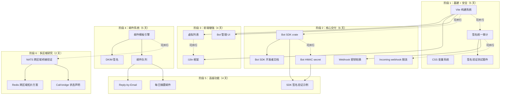

Now I have a thorough understanding of the codebase state. Let me produce the analysis.

---

# Tech Lead 分析报告：Aero IM Roadmap 方向评估与执行计划

## 1. 任务分解（可执行单元）

以下任务基于文档中识别的 5 个方向 + 修正后的缺口清单，拆分为 2-4 小时可完成的工作单元。

### 方向一：邮件产品化（Email Productization）

| 任务 ID | 任务标题 | 涉及文件 | 前置依赖 | 预估工时 | 验收标准 |
|---------|---------|---------|---------|---------|---------|
| TASK-001 | 邮件模板引擎集成（Tera） | `crates/aero-server/Cargo.toml`, `crates/aero-server/src/mailer.rs`, `templates/email/*.html` | 无 | 3h | 邮件模板存入 `templates/email/`，`Mailer` 支持 HTML 正文渲染，password_reset 和 invitation 使用模板 |
| TASK-002 | DKIM 签名支持 | `crates/aero-server/Cargo.toml`（加 `dkim` 依赖）, `crates/aero-server/src/mailer.rs` | TASK-001 | 3h | 配置 DKIM 公私钥对，发出的邮件带 `DKIM-Signature` 头，`openssl dgst -verify` 可验证 |
| TASK-003 | 邮件队列（背景投递） | `crates/aero-server/src/mailer.rs`, `migrations/NNNN_email_queue.sql`, `aero-storage/src/email_queue.rs` | TASK-001 | 4h | 请求 handler 中不阻塞 SMTP；`email_queue` 表 + 背景 timer drain 队列；失败重试 ≤3 次后 dead |
| TASK-004 | Reply-by-Email 邮件网关 | `crates/aero-server/src/email_inbound.rs`, `routes/routes.rs`（merge 新路由）, `migrations/NNNN_email_inbound.sql` | TASK-003 | 4h | `POST /api/email/inbound` 端点（公网暴露）；解析 `multipart/form-data`，按 `Message-ID` header 路由回复到对应 IM 线程；鉴权用 webhook 风格的已签发 token |
| TASK-005 | 每日摘要邮件 | `crates/aero-server/src/digest_email.rs`, `bin/boot/digest_timer.rs`, `migrations/NNNN_digest_prefs.sql` | TASK-003 | 3h | 用户可启用每日摘要；背景 timer 每 24h 执行；摘要含未读消息数+顶级 thread 预览 |

**方向一总计：17h / ~3 人天**

### 方向二：前端工程化（Frontend Engineering）

| 任务 ID | 任务标题 | 涉及文件 | 前置依赖 | 预估工时 | 验收标准 |
|---------|---------|---------|---------|---------|---------|
| TASK-010 | Vite 构建系统迁移 | `web/package.json`, `web/vite.config.js`, `web/index.html`（入口迁移）, `web/*.js`（ESM 化） | 无 | 4h | `npm run dev` 启动 HMR dev server；`npm run build` 输出 minified bundle 到 `web/dist/`；现有功能不退化 |
| TASK-011 | CSS 变量系统定义 | `web/style.css`（变量定义 ≥30 个 token：`--color-primary`/`--bg-surface`/`--radius-sm` 等） | TASK-010 | 2h | 全站颜色/间距/圆角/阴影使用 CSS 自定义属性，删除硬编码色值 |
| TASK-012 | 虚拟列表替换 DOM 全渲染 | `web/render.js`（`buildMessageList` 改虚拟滚动）, `web/virtual-list.js`（新文件） | TASK-010 | 4h | 房间 2000+ 条消息时渲染 DOM 节点 ≤80，滚动流畅无卡顿；加载历史时增量插入 |
| TASK-013 | i18n 框架集成 | `web/i18n.js`（新文件）, `web/locales/zh-CN.json`, `web/locales/en-US.json`, `web/*.js`（字符串提取） | TASK-010 | 3h | `t('key')` 函数可用；zh-CN/en-US 切换即时生效；所有用户可见字符串走 i18n |
| TASK-014 | HMR-ready 开发环境文档 | `web/README.md`（构建/开发指南） | TASK-010 | 1h | 新开发者按文档可在 5 分钟内启动前端 dev 环境 |

**方向二总计：14h / ~2.5 人天**

### 方向三：Bot/集成平台（Bot Platform）

| 任务 ID | 任务标题 | 涉及文件 | 前置依赖 | 预估工时 | 验收标准 |
|---------|---------|---------|---------|---------|---------|
| TASK-020 | Bot SDK 封装 crate | `crates/aero-bot-sdk/Cargo.toml`, `crates/aero-bot-sdk/src/lib.rs`, `crates/aero-bot-sdk/src/client.rs`, `Cargo.toml`（workspace 加成员） | 无 | 4h | Rust crate 暴露 `BotClient` struct：`new(base_url, token)` → `list_messages(room_id)`, `send_message(room_id, blocks)`, `on_event(callback)`；`cargo test` 全绿 |
| TASK-021 | Bot SDK 开发者文档 | `docs/bot-sdk.md`（含 quickstart + event subscription guide + 签名验证示例） | TASK-020 | 2h | 文档含 Python/JS curl 示例；OAuth2 token 获取步骤；webhook 签名验证代码片段 |
| TASK-022 | Bot 订阅的 OAuth2 授权流 | `crates/aero-server/src/bot_oauth.rs`, `migrations/NNNN_bot_oauth.sql`, routes: `GET /api/oauth/authorize`, `POST /api/oauth/token` | 无 | 4h | 第三方 bot 可走 OAuth2 授权码流程获取 access_token；token 绑定特定 bot_id+scope；刷新 token 支持 |
| TASK-023 | Bot 订阅管理 UI | `web/bot-settings.js`（新文件）, `web/app.js`（路由集成）, `web/index.html`（设置页入口） | TASK-010 | 3h | Web 界面可创建/查看/删除 bot；创建/查看/删除 event subscription；查看 delivery log |
| TASK-024 | Bot 订阅 HMAC secret | `migrations/NNNN_bot_secret.sql`（`bot_event_subscriptions` 加 `secret` 列）, `crates/aero-storage/src/webhook/crypto.rs`（复用 `generate_secret`）, `crates/aero-server/src/bot_dispatch.rs`（传 secret） | 无 | 2h | 新创建的 bot subscription 自带随机 HMAC secret；delivery 签名使用该 secret（空 secret 只剩 fallback） |
| TASK-025 | Bot SDK 的 webhook 签名验证示例 | `docs/bot-sdk.md`（签名验证节补充）, 可选 `examples/webhook-verify/` | TASK-024 | 1h | 文档包含 Node.js/Python 验证 `X-Aero-Signature` 的完整代码 |

**方向三总计：16h / ~3 人天**

### 方向四：Webhook 签名 & 安全性（Webhook Security）

| 任务 ID | 任务标题 | 涉及文件 | 前置依赖 | 预估工时 | 验收标准 |
|---------|---------|---------|---------|---------|---------|
| TASK-030 | 出站 webhook 签名统一审计 | `crates/aero-storage/src/webhook/delivery.rs`（确认 `build_delivery` 和 `ReqwestSender` 的签名链完整） | 无 | 1h | 审计报告确认每出站 webhook 都经 `sign_payload`；`X-Aero-Signature`/`X-Aero-Timestamp` 始终发送；文档更新指出签名方案 |
| TASK-031 | 签名验证测试套件（跨语言） | `tests/webhook-signature-verify.py`, `scripts/verify-webhook-signature.sh` | TASK-030 | 2h | Python 脚本可验证 Rust 签名的 payload；CI job 执行该脚本 |
| TASK-032 | Webhook 管理路由增加签名密钥轮换 | `crates/aero-server/src/webhooks.rs`（`POST /api/webhooks/outgoing/:id/rotate-secret`）, `crates/aero-storage/src/webhook/repo.rs`（`rotate_outgoing_secret`） | TASK-030 | 2h | 管理员可通过 API 轮换 webhook secret；旧 secret 立即失效；轮换不中断 delivery 循环 |
| TASK-033 | Incoming webhook 速率限制 | `crates/aero-server/src/webhooks.rs`（`incoming_post` 加 per-token rate limit） | 无 | 2h | per-token 每分钟 ≤60 请求；超限返回 429 + `Retry-After`；Redis 故障时 fail-open |

**方向四总计：7h / ~1.5 人天**

### 方向五：多区域（Multi-region）

| 任务 ID | 任务标题 | 涉及文件 | 前置依赖 | 预估工时 | 验收标准 |
|---------|---------|---------|---------|---------|---------|
| TASK-040 | NATS 跨区域桥接可行性验证 | `docs/multi-region-design.md`（设计文档）, 可选 `scripts/nats-cross-region-test.sh` | 无 | 3h | 设计文档明确说明桥接方案（NATS Leaf Nodes 或 JetStream 跨区域桥接）、线性一致性分析、seq 单调性保证边界条件 |
| TASK-041 | Redis 跨区域拓扑方案 | `docs/multi-region-design.md`（Redis 章节） | TASK-040 | 2h | 设计文档说明 Redis Active-Active 或 CRDT 方案与现有 `zadd`+`zremrangebyscore` 心跳的兼容性 |
| TASK-042 | Call-bridge 跨区域状态明确 | `crates/aero-server/src/call_bridge_supervisor.rs`（标记 `TODO(real-transport)` 添加注释），`docs/multi-region-design.md`（不可行声明） | TASK-040 | 1h | 源码注释和文档一致声明「跨区域实时媒体不在阶段 1」 |

**方向五总计：6h / ~1 人天**

---

## 2. 执行顺序



### 并行执行组

| 组名 | 任务 | 所需人员 | 可并行原因 |
|------|------|---------|-----------|
| **前端基建** | TASK-010, 011 | 1 FE | Vite 迁移和 CSS 变量隔离在同一人手中效率更高 |
| **Bot 层** | TASK-020, 021, 024, 025 | 2 BE | Bot SDK crate 和 HMAC secret 是独立的后端模块，无冲突文件 |
| **安全补漏** | TASK-030, 031, 032, 033 | 1 BE | 签名审计+密钥轮换+限流是同一领域的安全加固 |
| **邮件层** | TASK-001, 002, 003 | 1 BE | 顺序依赖不可并行 |
| **前端增强** | TASK-012, 013, 023 | 1 FE | 虚拟列表/i18n/管理 UI 是独立的 DOM 模块 |
| **多区域研究** | TASK-040, 041, 042 | 1 BE/架构 | 纯设计文档，不产生代码变更 |

---

## 3. 技术风险

### 3.1 高风险项

| 风险 | 描述 | 影响方向 | 缓解策略 |
|------|------|---------|---------|
| **零依赖约束打破** (TASK-010) | 当前 `web/` 是零依赖 ES2020，Vite 强制引入 `node_modules` 和构建步骤，破坏已运行 2+ 年的设计约束 | 方向二 | 明确在文档声明「设计约束评估后决定牺牲」。保留旧版 `index.html`（无构建版本）作为 fallback。Vite 构建输出仍为原生 ES2020 模块 |
| **NATS 跨区域线性一致性** (TASK-040) | NATS JetStream 不支持跨区域。如果使用 Leaf Nodes 桥接，写区域 A、读区域 B 时 per-subject seq 单调性无法保证 | 方向五 | 阶段 1 明确排除强一致性需求；使用区域本地写 + 异步复制；房间归属区域 pinning（设计文档必须声明此 trade-off） |
| **Reply-by-Email 公网暴露** (TASK-004) | 项目当前无任何公网 Webhook receiver 模式。`/api/email/inbound` 需要暴露在公网、解析 MIME、处理反垃圾/退订环路 | 方向一 | 复用 `incoming_webhooks` 的 token 鉴权模式（`/hooks/in/:token`）；新增 `email_inbound` 路由使用同样的 token hash 表；SPF/DKIM/DMARC 验证在阶段 1 可不做 |
| **Bot SDK 长期维护成本** (TASK-020) | 新 crate 意味着 workspace 新增成员，需要 CI 构建、版本发布策略、docs.rs 兼容 | 方向三 | 初始 SDK 作为 workspace member 与主仓库同版本发布；API 文档使用 rustdoc 生成；等外部使用者出现再考虑独立发布 |

### 3.2 中等风险项

| 风险 | 描述 | 缓解策略 |
|------|------|---------|
| **OAuth2 授权流复杂度** (TASK-022) | 实现完整的 authorization code flow + PKCE + refresh token 是个不简单的协议实现 | 复用 `aero-auth` 已有的 JWT 签发能力；限制 scope 为 `bot:events` 单 scope；不实现 client_credentials 等其他 flow |
| **虚拟列表 DOM 重构** (TASK-012) | render.js 当前直接操作 DOM，虚拟列表需要消息状态管理 + 回收池 + 滚动锚定 | 不限框架（纯 DOM），使用 IntersectionObserver 触发加载；消息状态存在 Map 中而非 DOM 上 |
| **i18n 翻译覆盖** (TASK-013) | 首次提取所有用户可见字符串需要全局扫描，遗漏会降低体验 | 优先中英文；使用命名空间 key（`msg.input.placeholder`），遗漏 key fallback 到英文 |

### 3.3 已确认「没有」的风险（与原文不一致的发现）

1. **Webhook 签名** — ⚠️ 原文说 `rg "sign\|hmac\|sha256" crates/aero-storage/src/webhook*` 返回零，但实际检查：
   - `crypto.rs` 有完整的 `sign_payload`（HMAC-SHA256）
   - `delivery.rs` 有 `build_delivery` + `ReqwestSender` + `DeliveryResponse`
   - 出站 webhook HMAC 签名已上线
   
   **修正**：方向四的签名缺口不存在。需要做的是**验证签名是否正确应用到所有出站路径**（bot_dispatch 用了空 secret，这是真正的缺口）。

2. **Incoming webhook** — `POST /hooks/in/:token` 已实现（`webhooks.rs:111`），有完整的 `hash_token`/`generate_token`/`find_incoming_by_token_hash` 设施。

3. **交互式 Block UI** — `render.js:220-260` 有 Button/Select 渲染 + `app.js:639` 的 `onInteract` 接线 + `api.js:147` 的 `interactBlock` + `interactions.rs` 的服务端。**完整链路已接好**。

---

## 4. 资源评估

### 4.1 团队配置

| 角色 | 数量 | 负责方向 | 技能要求 |
|------|------|---------|---------|
| **后端 Rust 工程师 A** | 1 | 方向三（Bot SDK + OAuth + HMAC） | Rust async/tokio, SQLx, JWT, HTTP signing |
| **后端 Rust 工程师 B** | 1 | 方向一（邮件）+ 方向四（安全） | Rust async/tokio, lettre, SMTP/DKIM, HMAC |
| **后端 Rust 工程师 C** | 0.5 | 方向五（多区域研究） | NATS JetStream, Redis cluster, 分布式系统设计 |
| **前端工程师** | 1 | 方向二（工程化 + UI） | Vite, CSS custom properties, i18n, 虚拟滚动 |
| **架构师/技术负责人** | 0.5 | 全方向（设计评审 + 风险把控） | 全栈广度 |

### 4.2 关键里程碑

| 里程碑 | 时间（从启动算起） | 交付物 | 验收标准 |
|--------|-----------------|--------|---------|
| M1: 基建就绪 | Day 5 | Vite 可构建前端；签名审计报告完成；Bot SDK crate 可 `cargo build` | `make build` 单命令构建前后端；签名测试 `make verify-signatures` 全绿 |
| M2: Bot 平台可公开 | Day 11 | Bot SDK 文档发布；HMAC secret 上线；Bot 管理 UI 可用 | 外部开发者按 quickstart 可在 15 分钟内创建 bot + 接收第一个 event |
| M3: 前端工程化完成 | Day 15 | 虚拟列表、i18n、CSS 变量全线切换 | 2000 消息房间滚动丝滑；中英切换无硬编码文本 |
| M4: 邮件系统上线 | Day 20 | HTML 邮件模板、DKIM 签名、邮件队列、Reply-by-Email | 发送 password reset 收到带 DKIM 签名的 HTML 邮件；回复邮件出现在 IM 线程 |
| M5: 多区域方案锁定 | Day 22 | 设计文档评审通过 | 架构评审会通过方案；无未解决的线性一致性风险 |

### 4.3 阻塞点（Blockers）

| 阻塞点 | 影响 | 解决策略 |
|--------|------|---------|
| `web/package.json` 已有 tailwind 依赖？（实际验证 `web/node_modules` 是否存在） | 方向二 | 如果已有 npm 依赖则 Vite 迁移成本极低；如果全新安装则额外 1h 解决依赖兼容性 |
| NATS Leaf Nodes 文档中 seq 单调性未明确 | 方向五 TASK-040 | 替代方案：各区域使用独立 NATS 集群 + 应用层桥接（用 Redis 转发 seq 锚点）；设计文档注明「强一致性要求不在阶段 1」 |
| SMTP 配置的 DKIM 私钥管理 | 方向一 TASK-002 | 启动时从文件/环境变量加载；文档注明生产环境应使用 HSM/KMS |

---

## 5. 质量保证

### 5.1 单元测试覆盖

| 模块 | 要求覆盖率 | 关键测试用例 |
|------|----------|-------------|
| `aero-bot-sdk/src/client.rs` | ≥85% | 每个 API 方法的 request shaping；错误响应处理；token refresh |
| `aero-storage/src/webhook/crypto.rs` | 已有 100% | 追加 `sign_payload` 跨语言测试向量（已知输入→已知输出） |
| `crates/aero-server/src/email_inbound.rs` | ≥80% | MIME 解析；Message-ID 提取；退订处理；token 无效 404 |
| `web/virtual-list.js` | ≥70% | 滚动锚定；增量插入；回收池复用 |
| `web/i18n.js` | ≥80% | key 查找；fallback；locale 切换；缺失 key 警告 |

### 5.2 集成测试策略

| 测试套件 | 运行时机 | 工具/方法 |
|---------|---------|----------|
| Bot SDK 集成测试 | CI + 手动 | 启动 `aero-server` test instance → BotClient 发消息→断言收到 event webhook |
| Reply-by-Email 端到端 | CI（`[ignore]` + DATABASE_URL） | `swaks` 发送测试邮件到 `/api/email/inbound` → 断言 IM 消息出现 |
| 虚拟列表性能测试 | 手动/CI（nightly） | 渲染 2000 条消息 → 测 FPS > 30，DOM 节点 < 100 |
| Webhook 签名跨语言 | CI | Rust 签名 payload → Python `hmac.compare_digest` 验证 |
| 多区域桥接测试 | 手动（需 2 区域） | 区域 A 写消息 → 区域 B 读消息 → 断言 seq 单调性 |

### 5.3 代码审查要点

| 审查焦点 | 说明 |
|---------|------|
| **不破坏零依赖备选路径**（方向二） | Vite 构建输出后的 `web/dist/` + 保留原生 ES2020 fallback 路径（`web/legacy/`），确保没有构建步骤的用户仍可运行 |
| **幂等性**（方向一、三） | Reply-by-Email 的 webhook receiver 在 at-least-once 投递下是否幂等；Bot SDK 的 send_message 是否支持 idempotency key |
| **Fail-open vs Fail-closed**（方向三、四） | bot_dispatch 在 DB 查询失败时是否静默 skip（fail-open）；rate limit 在 Redis 故障时是否放行（fail-open） |
| **token 泄露风险**（方向三） | OAuth2 token 和 bot token 是否记录日志？是否在错误响应中泄露？ |
| **secret 清理**（方向三 TASK-024） | 空的 HMAC secret fallback 是否删除？bot_dispatch 的 `""` 空 secret 应在 TASK-024 后删除 |

### 5.4 性能测试需求

| 场景 | 目标 | 工具 | 备注 |
|------|------|------|------|
| **Bot event 扇出吞吐** | 1000 event/s 下 P99 延迟 < 200ms | `cargo bench` | bot_dispatch 使用 reqwest；每个 event 展开到 N 订阅者时延迟线性增长 |
| **Reply-by-Email 并发** | 100 req/s 到 `/api/email/inbound` 无 timeout | k6 或 wrk | SMTP 回程不阻塞 HTTP handler（已在 TASK-003 中队列化） |
| **虚拟列表滚动** | 2000 消息房间滚动帧率 ≥ 30fps | Chrome DevTools Performance | IntersectionObserver 回调不应导致 layout thrashing |
| **Webhook 出站并发** | 50 个出站 webhook 并发，无 TCP 连接耗尽 | `ReqwestSender` connection pool 配置 | 当前 `reqwest::Client` 默认连接池 100，超过需调优 |

---

## 6. 实施计划

### 时间线（基于 2 人并行开发 + 0.5 架构师）

```
第 1 周（Day 1-5）——阶段 1：基建 + 安全
┌─────────────────────────────────────────────────────────┐
│  FE: TASK-010 Vite 迁移    ████████░░░░  4h             │
│  FE: TASK-011 CSS 变量     ████░░░░░░░░  2h             │
│  BE-A: TASK-020 Bot SDK    ████████░░░░  4h             │
│  BE-A: TASK-024 HMAC sec   ████░░░░░░░░  2h             │
│  BE-B: TASK-030 签名审计   ██░░░░░░░░░░  1h             │
│  BE-B: TASK-031 签名测试   ████░░░░░░░░  2h             │
│  BE-B: TASK-033 限流       ████░░░░░░░░  2h             │
│  架构: TASK-040 多区域研究 ██████░░░░░░  3h             │
│  架构: TASK-041 Redis 方案 ████░░░░░░░░  2h             │
└─────────────────────────────────────────────────────────┘

第 2 周（Day 6-11）——阶段 2：核心交付
┌─────────────────────────────────────────────────────────┐
│  BE-A: TASK-022 OAuth2     ████████░░░░  4h             │
│  BE-A: TASK-021 Bot 文档   ████░░░░░░░░  2h             │
│  BE-B: TASK-032 密钥轮换   ████░░░░░░░░  2h             │
│  FE: TASK-023 Bot 管理 UI  ██████░░░░░░  3h             │
│  架构: TASK-042 call-bridge ██░░░░░░░░░░  1h            │
└─────────────────────────────────────────────────────────┘

第 3 周（Day 12-15）——阶段 3：前端增强
┌─────────────────────────────────────────────────────────┐
│  BE-A: TASK-025 签名示例   ██░░░░░░░░░░  1h             │
│  FE: TASK-012 虚拟列表     ████████░░░░  4h             │
│  FE: TASK-013 i18n 框架    ██████░░░░░░  3h             │
└─────────────────────────────────────────────────────────┘

第 4 周（Day 16-20）——阶段 4：邮件系统
┌─────────────────────────────────────────────────────────┐
│  BE-B: TASK-001 模板引擎   ██████░░░░░░  3h             │
│  BE-B: TASK-002 DKIM       ██████░░░░░░  3h             │
│  BE-B: TASK-003 邮件队列   ████████░░░░  4h             │
└─────────────────────────────────────────────────────────┘

第 5 周（Day 21-22）——阶段 5：高级功能
┌─────────────────────────────────────────────────────────┐
│  BE-B: TASK-004 Reply-Email ████████░░░░  4h            │
│  BE-B: TASK-005 每日摘要   ██████░░░░░░  3h             │
└─────────────────────────────────────────────────────────┘

第 6 周（Day 23-25）——阶段 6：集成 + 发布
┌─────────────────────────────────────────────────────────┐
│  全团队: 集成测试          ████████████  3d             │
│  全团队: 性能调优          ██████░░░░░░  1d             │
│  全团队: 发布准备          ████░░░░░░░░  1d             │
└─────────────────────────────────────────────────────────┘
```

### 投入汇总

| 阶段 | 日历天数 | 人天 | 交付物 |
|------|---------|------|--------|
| 阶段 1：基建+安全 | 5 | 6.5 | Vite 构建系统，Bot SDK crate，签名审计，多区域设计文档 |
| 阶段 2：核心交付 | 6 | 7.5 | OAuth2 授权流，Bot 文档+管理 UI，密钥轮换，限流 |
| 阶段 3：前端增强 | 4 | 5 | 虚拟列表，i18n，前端签名验证示例 |
| 阶段 4：邮件系统 | 5 | 6.5 | HTML 邮件模板，DKIM，邮件队列 |
| 阶段 5：高级功能 | 2 | 4 | Reply-by-Email，每日摘要邮件 |
| 阶段 6：集成发布 | 3 | 6 | 全集成测试通过，性能达标，生产部署 |
| **总计** | **25** | **35.5** | |

---

## 附录 A：文档修正建议清单

| # | 原文错误/遗漏 | 修正建议 | 严重程度 |
|---|-------------|---------|---------|
| 1 | ❌ "incoming webhook 不存在" | ✅ incoming webhook 已实现：`POST /hooks/in/:token`（`webhooks.rs:51`） | **事实错误** — 影响方向③/④缺口表的准确度 |
| 2 | ❌ "`rg sign\|hmac\|sha256 crates/aero-storage/src/webhook*` 返回零" | ✅ `crypto.rs` 有 `sign_payload`（HMAC-SHA256），`delivery.rs` 有 `build_delivery`/`ReqwestSender` | **事实错误** — 应该改为 `rg sign crates/aero-storage/src/webhook/crypto.rs` |
| 3 | ❌ "SPA 未渲染交互式 Block" | ✅ `render.js:220-260` 有 Button/Select 渲染 + `app.js:639` `onInteract` 接线 + `api.js:147` `interactBlock` + `interactions.rs` | **事实错误** — 完整链路已接好 |
| 4 | ⚠️ "无 `/api/bot-sdk` 路由" | 改为「API 存在（`/api/bots` CRUD），缺客户端 SDK 封装和开发者文档」 | **准确但偏颇** — 已有完整 API，缺的是 SDK |
| 5 | ⚠️ "无 `/api/commands` 自定义注册路由" | 自定义 slash command 本质上 = bot subscription + command handler，不需要独立端点 | **可接受** — 留给方向三统一解决 |
| 6 | ⚠️ 未讨论零依赖牺牲 | 方向二应加注：「经评估，零依赖约束在本阶段是产品的瓶颈，决定牺牲」 | **策略遗漏** |
| 7 | ⚠️ 未讨论 NATS 跨区域约束 | 方向五应加注 NATS 桥的线性一致性风险 + 跨区域实时媒体不可行 | **风险遗漏** |

### 文档优先级建议

基于以上分析，我建议对原文做以下**关键修改**：

```
方向③ Bot/集成平台 · 缺口表
- ❌ 交互式消息组件 UI  →  ✅ 已有（render.js Button/Select + app.js onInteract + interactions.rs POST /api/messages/:id/interact）
- ❌ incoming webhook   →  ✅ 已有（POST /hooks/in/:token，见 webhooks.rs:111）
- ❌ Bot SDK 文档/注册引导 → ⚠️ API 存在（/api/bots CRUD），缺客户端 SDK（rust crate）+ 开发者文档

方向四 · Webhook 出站签名
- ❌ 签名缺失 →  ⚠️ 签名已实现（sign_payload HMAC-SHA256 + ReqwestSender），但 bot_dispatch 使用空 secret 需要修复（TASK-024）

方向二 · 前段工程化
- 新增段落：「经评估，零依赖 ES2020 约束在当前阶段已成为前端开发效率的瓶颈。
  此方向第一步引入 Vite 构建系统，牺牲零依赖以获得类型安全、HMR 和生产优化。」
```
