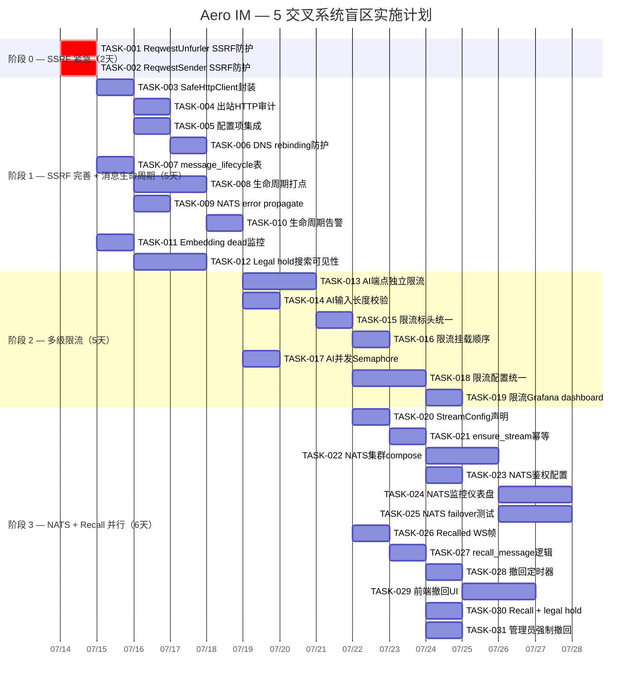

# Tech Lead 分析：5 个交叉系统盲区

## 执行摘要

经代码验证确认的 5 个方向中，**方向二（SSRF）是 P0 漏洞，需立即修复**。方向一（消息生命周期）和方向四（多级限流）有真实缺口但现有基础设施已部分覆盖。方向三（消息撤回）已作为核心方向被既有文档覆盖，本分析将其降级为「增量扩展」。方向五（NATS 生产化）是值得投资的技术债但非紧急。

**核心建议**：方向二 A 期（unfurl_bot SSRF 防护）应作为 **#1 优先级在 2 天内完成**，随后按方向一 → 方向四 → 方向五 → 方向三增量的顺序推进。

---

## 1. 任务分解

### 方向二：出站 HTTP 信任边界（P0 · SSRF 漏洞）

| 任务 ID | 任务标题 | 涉及文件 | 前置依赖 | 预估工时 |
|---------|---------|---------|---------|---------|
| TASK-001 | **ReqwestUnfurler SSRF 防护**：在 `fetch()` 前插入 `validate_url()` 私有 IP 检查 + redirect 后重新校验 + 拒绝云元数据端点 | `crates/aero-storage/src/unfurl.rs` | 无 | 3h |
| TASK-002 | **ReqwestSender SSRF 防护**：webhook 投递前做 SSRF 校验 + URL 创建时校验 + DNS 重解析保护 | `crates/aero-storage/src/webhook/delivery.rs` | 无（与 TASK-001 并行） | 2h |
| TASK-003 | **SafeHttpClient 统一封装**：抽取公共 `reqwest::Client` 配置（超时 10s、重定向限制 5 跳、私有 IP 拦截、可配置 allowlist） | 新建 `crates/aero-common/src/http.rs` + `crates/aero-common/lib.rs` | TASK-001, TASK-002 | 4h |
| TASK-004 | **出站 HTTP 审计**：`audit_events` 记录 `outbound_http` 事件 + `AERO_HTTP_OUTBOUND_AUDIT` env gate | `crates/aero-storage/src/audit.rs` + `crates/aero-common/src/model/` | TASK-003 | 3h |
| TASK-005 | **配置项集成**：`AERO_UNFURL_DENY_PRIVATE` + `AERO_WEBHOOK_ALLOW_PRIVATE` per-hook bypass 字段 | `config.example.toml` + `crates/aero-server/src/config.rs` + schema 迁移 | TASK-003 | 2h |
| TASK-006 | **DNS rebinding 防护（B 期）**：`hickory-resolver` 注入 DNS-over-HTTPS + TTL=0 强制 | `Cargo.toml`（`aero-common`）+ `http.rs` | TASK-003 | 4h |

### 方向一：消息全生命周期一致性（P0）

| 任务 ID | 任务标题 | 涉及文件 | 前置依赖 | 预估工时 |
|---------|---------|---------|---------|---------|
| TASK-007 | **`message_lifecycle` 日志表 + 迁移**：INSERT ONLY 表（message_id, event_type, created_at, metadata JSONB），按 `created_at` 分区 + 7 天 TTL | `migrations/NNNN_message_lifecycle.sql` | 无 | 3h |
| TASK-008 | **生命周期里程碑打点**：`post_message` 记录 `created`、`publish` 后补 `published`、`fan_out` 补 `fanned_out`、moderation 补 `moderated_*`、embed 补 `embedded` | `crates/aero-im-core/src/service/messages.rs` + `crates/aero-server/src/ws/ws_impl/bus.rs` + `moderation_bot.rs` | TASK-007 | 4h |
| TASK-009 | **NATS publish error 传播**：`publish_room_event` 的 `if let Err` → `return Err`，WS handler 收到错误后通知发送者「消息存储成功但分发失败」 | `crates/aero-im-core/src/service/events.rs:88-92` | 无 | 2h |
| TASK-010 | **生命周期延迟告警**：`message_lifecycle` 表中 `created` 后 N 秒无 `fanned_out` → metrics counter + PrometheusRule | `crates/aero-server/src/metrics.rs` + `monitoring/` | TASK-008 | 3h |
| TASK-011 | **Embedding dead 监控 + workspace 通知**：`ai_jobs.status='dead'` 行数超阈值告警 + workspace admin 摘要 | `crates/aero-ai/src/worker.rs` + `crates/aero-server/src/routes/` | 无 | 3h |
| TASK-012 | **Legal hold 消息搜索可见性**：legal hold 消息标记 `searchable = true`，sweep 跳过但 embedding 仍处理 | `crates/aero-storage/src/message/crud.rs` + `retention_sweep.rs` + `embedding_backfill.rs` | TASK-007 | 4h |

### 方向四：多级限流（P1）

| 任务 ID | 任务标题 | 涉及文件 | 前置依赖 | 预估工时 |
|---------|---------|---------|---------|---------|
| TASK-013 | **AI REST 端点独立限流**：`/api/ai/summarize`、`/api/ai/ask`、`/api/ai/ask/stream`、`/api/translate`、`/api/ai/rewrite` 添加 per-user `RateLimiter`（5 req/min） | `crates/aero-server/src/routes/routes.rs` + `crates/aero-server/src/rate_limit.rs` | 无 | 4h |
| TASK-014 | **AI 输入长度校验**：`question`、`text` 字段加最大长度 4000 字符（复用 `validate_blocks` 机制） | `crates/aero-im-core/src/service/` + `crates/aero-server/src/routes/ai_*.rs` | 无（与 TASK-013 并行） | 2h |
| TASK-015 | **AI 限流标头统一**：所有限流层输出 `X-RateLimit-Layer` + `X-RateLimit-Remaining` + `Retry-After` | `crates/aero-server/src/rate_limit.rs` + `crates/aero-server/src/ws_rate.rs` + `crates/aero-ai/src/budget.rs` | TASK-013 | 4h |
| TASK-016 | **限流挂载顺序文档化 + 代码注释**：按层 5 > 层 4 > 层 3 > 层 1 > 层 2 顺序过中间件，在 `build()` 或 `routes()` 体现 | `crates/aero-server/src/routes/routes.rs` | TASK-015 | 2h |
| TASK-017 | **AI 并发 Semaphore**：AI 端点复用 `AiWorker` 的 `Semaphore` 模式限制并发请求 | `crates/aero-server/src/routes/ai_*.rs` | 无 | 3h |
| TASK-018 | **限流配置统一到 `RateLimitConfig`**：所有 env var 收归 `aero-common` 一个结构体 | `crates/aero-common/src/config.rs`（可能没有，用 `crates/aero-server/src/config.rs`）+ TOML deser | TASK-015 | 4h |
| TASK-019 | **Grafana dashboard 限流视图**：各层命中率、fail-open 次数、剩余预算图 | `monitoring/grafana-dashboard.json` | TASK-018 | 3h |

### 方向五：NATS 生产化（P2）

| 任务 ID | 任务标题 | 涉及文件 | 前置依赖 | 预估工时 |
|---------|---------|---------|---------|---------|
| TASK-020 | **声明式流配置 `StreamConfig`**：在 `JetStreamConfig` 中声明全部流参数（name, subjects, retention, max_age, max_bytes, replicas） | `crates/aero-bus/src/jetstream.rs` + `crates/aero-bus/src/config.rs` | 无 | 3h |
| TASK-021 | **`ensure_stream` 幂等创建/更新**：启动时用 `create_or_update` 确保声明式配置与当前流一致 | `crates/aero-bus/src/jetstream.rs` | TASK-020 | 3h |
| TASK-022 | **NATS 集群 docker-compose.prod.yml**：3 节点 + `-js` + 持久化卷 + `AUTH_TOKEN` | `docker-compose.prod.yml`（新建） | TASK-021 | 3h |
| TASK-023 | **NATS 鉴权配置连线**：`AERO_NATS_TOKEN` → `async_nats::ConnectOptions::token()` | `crates/aero-bus/src/jetstream.rs` + `config.example.toml` | 无（与 TASK-022 并行） | 2h |
| TASK-024 | **Consumer lag 监控仪表盘 + 告警规则**：Grafana dashboard + PrometheusRule | `monitoring/` | TASK-023 | 4h |
| TASK-025 | **故障转移集成测试**：chaos 脚本 kill NATS 节点 → consumer 重连 → 消息最终送达 | `tests/nats_failover.rs`（新建，`#[ignore]`） | TASK-022 | 4h |

### 方向三：消息撤回（P1 · 增量扩展）

| 任务 ID | 任务标题 | 涉及文件 | 前置依赖 | 预估工时 |
|---------|---------|---------|---------|---------|
| TASK-026 | **`Recalled` RoomEvent + WS 帧**：`RoomEvent::Recalled`（`#[serde(rename="recalled")]` 避 `kind` 撞名）+ `ClientFrame::RecallMessage` + `ServerFrame::Recalled` | `crates/aero-common/src/model/event.rs` + `crates/aero-common/src/model/frame.rs` | 无 | 2h |
| TASK-027 | **`ImService::recall_message` 服务端逻辑**：检查发送者匹配、`created_at` 在窗口内 → `soft_delete_audited` + 广播 `Recalled` | `crates/aero-im-core/src/service/messages.rs` | TASK-026 | 3h |
| TASK-028 | **撤回定时器（进程内）**：`send_message` 后启动 `AERO_RECALL_WINDOW_SECS`（默认 5s）定时器，期内 `RecallMessage` 可撤回 | `crates/aero-server/src/ws/ws_impl/` + `crates/aero-server/src/unfurl_bot.rs` 同层 | TASK-027 | 3h |
| TASK-029 | **前端撤回按钮 + 倒计时 UI**：消息气泡右下角「撤回」按钮，5s 倒计时；超时消失 | `web/app.js` + `web/render.js` | TASK-028 | 4h |
| TASK-030 | **撤回 + legal hold 边界**：legal hold 消息可撤回但原始内容在 eDiscovery 导出中可见 | `crates/aero-storage/src/message/crud.rs` + `legal_holds.rs` | TASK-027 + TASK-012 | 3h |
| TASK-031 | **管理员强制撤回**：管理员可撤回任意消息（即使超出窗口） | `crates/aero-server/src/routes/messages.rs` + `routes.rs` | TASK-027 | 2h |

---

## 2. 执行顺序与依赖图

```mermaid
graph TD
    %% Phase 0 — SSRF Emergency
    subgraph Phase0["阶段 0：SSRF 紧急修复（2 天）"]
        T001["TASK-001: ReqwestUnfurler SSRF"]
        T002["TASK-002: ReqwestSender SSRF"]
    end
    T001 --> T003
    T002 --> T003

    %% Phase 1 — SSRF 完善 + 消息生命周期
    subgraph Phase1["阶段 1：SSRF 完善 + 消息生命周期（5 天）"]
        T003["TASK-003: SafeHttpClient 封装"]
        T004["TASK-004: 出站 HTTP 审计"]
        T005["TASK-005: 配置项集成"]
        T007["TASK-007: message_lifecycle 表"]
        T008["TASK-008: 生命周期打点"]
        T009["TASK-009: NATS error propagate"]
        T011["TASK-011: Embedding dead 监控"]
    end
    T003 --> T004
    T003 --> T005
    T007 --> T008
    T007 --> T012
    T008 --> T010
    T008 --> T009

    %% Phase 1.5 — 可并行
    T005 --> T006
    T012["TASK-012: Legal hold 搜索可见性"]

    %% Phase 2 — 限流
    subgraph Phase2["阶段 2：多级限流（5 天）"]
        T013["TASK-013: AI 端点独立限流"]
        T014["TASK-014: AI 输入长度校验"]
        T015["TASK-015: 限流标头统一"]
        T016["TASK-016: 限流挂载顺序"]
        T017["TASK-017: AI 并发 Semaphore"]
        T018["TASK-018: 限流配置统一"]
    end
    T013 --> T015
    T014 --> T015
    T015 --> T016
    T015 --> T018
    T013 --> T017

    %% Phase 3 — NATS + Recall
    subgraph Phase3["阶段 3：NATS 生产化 + Recall 增量（6 天）"]
        T020["TASK-020: StreamConfig 声明"]
        T021["TASK-021: ensure_stream 幂等"]
        T022["TASK-022: NATS 集群 compose"]
        T023["TASK-023: NATS 鉴权"]
        T024["TASK-024: NATS 监控"]
        T026["TASK-026: Recalled WS 帧"]
        T027["TASK-027: recall_message 逻辑"]
        T028["TASK-028: 撤回定时器"]
    end
    T020 --> T021
    T021 --> T022
    T021 --> T023
    T022 --> T024
    T022 --> T025
    T026 --> T027
    T027 --> T028
    T027 --> T030
    T027 --> T031
    T028 --> T029

    %% Phase 4 — 收尾
    subgraph Phase4["阶段 4：集成 + dashboard（可并行）"]
        T010["TASK-010: 生命周期告警"]
        T019["TASK-019: 限流 Grafana"]
        T024["TASK-024: NATS 监控"]
        T025["TASK-025: NATS failover 测试"]
        T029["TASK-029: 前端撤回 UI"]
        T030["TASK-030: Recall + legal hold"]
        T031["TASK-031: 管理员强制撤回"]
        T006["TASK-006: DNS rebinding 防护"]
    end
```



**并行任务组**（可同时分配给不同开发者）：

| 并行组 | 包含任务 | 开发者技能需求 |
|--------|---------|--------------|
| **G1** | TASK-001, TASK-002 | Rust 后端 + 网络安全 |
| **G2** | TASK-003, TASK-004, TASK-005 | Rust 后端 + 架构设计 |
| **G3** | TASK-007, TASK-009, TASK-011 | Rust 后端 + 数据库 |
| **G4** | TASK-013, TASK-014, TASK-017 | Rust 后端 + 中间件 |
| **G5** | TASK-020, TASK-023 | Rust 后端 + NATS |
| **G6** | TASK-026, TASK-027 | Rust 后端 + 协议设计 |
| **G7** | TASK-029 | 前端 JS |
| **G8** | TASK-022, TASK-024, TASK-025 | DevOps + NATS |

---

## 3. 技术风险

### 3.1 高风险项

| 风险 | 影响方向 | 严重度 | 缓解策略 |
|------|---------|-------|---------|
| **DNS rebinding 绕过 SSRF 防护**（TASK-001 → TASK-006） | 方向二 | 🔴 | 短期（TASK-001）：请求前 + 重定向后各校验一次 IP。长期（TASK-006）：`hickory-resolver` + DNS-over-HTTPS + TTL=0。**注意：完全的 DNS rebinding 防护需 TOCTOU 封锁——应用层不可能完美防御，需网络层补充（`iptables` 禁止出站到私有 IP）** |
| **NATS publish timeout 的回滚正确性**（TASK-009） | 方向一 | 🟠 | NATS Client 超时但消息可能已被持久化 → 简单回滚软删可能删不掉实际已持久化的消息。方案：publish 成功则无事；超时则查 JetStream 流中是否有该 seq 的消息再做决策。需要 `Consumer::get_msg(seq)` 方法 |
| **Redis fail-open + 限流失效的组合放大**（TASK-013） | 方向四 | 🟠 | 层 1（per-connection token bucket 进程内存）和层 2（workspace Redis window）的失效模式不同。如果 Redis 故障且层 2 fail-open，层 1 仍在但阈值高 → 用户实际不受限。缓解：层 1 默认阈值降低到 10 req/s 作为保险丝 |
| **NATS cluster 滚动升级 + async-nats 兼容性**（TASK-022） | 方向五 | 🟠 | `async-nats` 0.36 最低支持 NATS Server 2.9.x，但 cluster 行为在不同版本有差异。需在测试环境做 2.10 → 2.11 滚动升级验证 |
| **Recall 与既有编辑/删除的 UX 冲突**（TASK-026 → TASK-029） | 方向三 | 🟠 | 用户在撤回窗口内编辑消息后，撤回按钮是否消失？建议方案：编辑不重置撤回窗口，但撤回按钮在编辑后消失（编辑本身就是修正，撤回不再有意义） |

### 3.2 依赖外部系统

| 依赖 | 方向 | 说明 | 后备方案 |
|------|------|------|---------|
| **NATS Server 集群能力** | 五 | 需 `nats-server` 2.10+ 的 JetStream cluster。当前 `docker-compose.yml` 是 2.10 但无 cluster 配置 | 单节点 `--cluster` 模式（非 HA 但具备横向扩展） |
| **hickory-resolver crate** | 二 | B 期 DNS-over-HTTPS 依赖，需评估二进制体积增量(~1MB) 和 tokio 兼容性 | 不用 DoH，只用系统 DNS + TTL=0 强制重解析 |
| **Prometheus + Grafana** | 一、四、五 | 生命周期告警、限流监控、NATS 仪表盘均需要 | `metrics.rs` 已暴露 Prometheus 端点，只需配置 |

### 3.3 性能瓶颈

| 瓶颈 | 方向 | 说明 | 优化策略 |
|------|------|------|---------|
| **`message_lifecycle` 写入吞吐** | 一 | 百万消息/天 × 5-8 条事件 = 5-8M 行/天 | 按天分区 + 7 天 TTL + `INSERT ONLY`（无 `UPDATE`/`DELETE`）。评估 PG 写入 500 rows/s，瓶颈应在分区分片 |
| **SSRF validate_url DNS 查询** | 二 | 每条 unfurl 调用可能触发 2+ 次 DNS 查询（请求前 + 重定向后） | 用 `tokio::spawn_blocking` + 短缓存（30s） |
| **限流标头添加的路径延迟** | 四 | 每个请求经过 5 层限流检查 + 标头注入 | 每层只做一次增长式标头设置（`HeaderMap::append`），不做克隆 |

### 3.4 测试难点

| 测试 | 方向 | 难点 | 策略 |
|------|------|------|------|
| **SSRF 防护测试** | 二 | 无法连接真实 `169.254.169.254`；私有 IP 范围大 | 用 `mock`（`httpmock` crate）监听 127.0.0.1 端口，验证 `validate_url` 拒绝。DNS rebinding 用 `faked` resolver |
| **NATS failover** | 五 | 需 3 节点 NATS cluster | 走 docker-compose 启动 3 节点，然后 `docker kill` 一个节点。写为 `#[ignore]` integration test |
| **消息生命周期跨组件** | 一 | 涉及 bus/NATS/PG/WS 4 个组件 | 组件级 + 集成测试分离：单组件用 mock bus，集成测试用真实 NATS（CI 门控 `AERO_TEST_NATS=1`） |
| **Recall 时间窗口** | 三 | 时间依赖 | 服务端 `created_at` 计时 + 测试中注入 mock clock（`tokio::time::pause()`） |
| **限流 429 返回一致性** | 四 | 5 层限流谁先命中 | 每一层的 `X-RateLimit-Layer` 必须正确标识来源。写端到端测试：先打爆连接限流，验证标头是 `connection` |

---

## 4. 资源评估

### 4.1 人员需求

| 角色 | 人数 | 技能要求 | 负责方向 |
|------|------|---------|---------|
| **Senior Rust 后端** | 2 | Rust 异步、NATS JetStream、中间件、安全 | 方向一、方向二（A 期）、方向四、方向五 |
| **Mid-Level Rust 后端** | 2 | Rust、sqlx、Axum、API 设计 | 方向三、方向二（B 期）、方向一部分 |
| **前端开发者** | 1 | ES2020、原生 JS（无框架）、WebSocket | 方向三（Recall UI）、方向四（限流标头消费） |
| **DevOps/SRE** | 0.5 | Docker Compose、NATS cluster、Grafana | 方向五（NATS 集群配置 + 仪表盘） |

**最优团队配置**：3 名 Rust 后端 + 1 名前端 + 0.5 名 DevOps = **4.5 人**。如果资源受限，**最少 2 人**（1 Senior + 1 Mid Rust）可并行做方向二 + 方向一 A 期。

### 4.2 里程碑

| 里程碑 | 时间点 | 交付物 | 关键验收 |
|--------|-------|--------|---------|
| **M0 — SSRF 安全** | D+2 | TASK-001, TASK-002 合入 master | 任意用户消息中的 `http://169.254.169.254/` 被 unfurl_bot 拒绝；webhook URL 不能指向私有地址 |
| **M1 — 消息可观测** | D+5 | TASK-007, TASK-008, TASK-009 合入 | `message_lifecycle` 表记录每条消息的 created/published/fanned_out；NATS publish error 传播到 WS |
| **M2 — AI 限流门** | D+8 | TASK-013, TASK-014, TASK-015 合入 | AI 端点 5 req/min 限流生效；统一标头 `X-RateLimit-Layer` |
| **M3 — SSRF 完整** | D+10 | TASK-003, TASK-004, TASK-005, TASK-006 合入 | `SafeHttpClient` 供 unfurl + webhook 共用；出站 HTTP 审计 |
| **M4 — NATS 生产化** | D+15 | TASK-020, TASK-021, TASK-022, TASK-023 合入 | 3 节点 NATS cluster 配置；声明式流管理 |
| **M5 — Recall MVP** | D+18 | TASK-026, TASK-027, TASK-028, TASK-029 合入 | 5s 撤回窗口 + 前端按钮 + `Recalled` 帧 |
| **M6 — 全量集成** | D+22 | TASK-010, TASK-018, TASK-019, TASK-024, TASK-025, TASK-030, TASK-031 合入 | 生命周期告警规则、限流/NATS Grafana dashboard、NATS failover 测试 |

### 4.3 阻塞点与解决策略

| 阻塞点 | 方向 | 描述 | 解决策略 |
|--------|------|------|---------|
| **`message_lifecycle` 分区表迁移写法** | 一 | PG 分区表需要主键包含分区键，现有 `message_id` UUID + `created_at` 复合主键影响 ORM | 用 `message_lifecycle` 非分区表起始（7 天 TTL 用 `DELETE`），30 天后评估是否需要分区。避免过度设计 |
| **`reqwest::Client` 在 `aero-common` 的依赖体重** | 二 | `reqwest` 是重型依赖，`aero-common` 是叶子 crate，引入后所有下游都编译 `reqwest` | 评估 `aero-common` 是否保持叶子。替代：在 `aero-storage` 或新建 `aero-http` crate 中实现 |
| **NATS cluster 网络分区** | 五 | NATS 集群在网络分区时 JetStream 变成只读 | 文档化 + 客户端设置 `ReconnectDelay` + 健康检查。集群恢复后 durable consumer 自动重连 |
| **Recall 与合规审计的冲突** | 三 | 法律要求「不可删除」但撤回本质是软删 | 撤回只改 `deleted_by_sender`，不改 `deleted_at`。`audit_events` 记录撤回事件。Legal hold 下的消息在 eDiscovery 导出中原始内容可见 |

---

## 5. 质量保证

### 5.1 单元测试覆盖

| 任务 | 测试内容 | 最低覆盖率指标 | 关键测试场景 |
|------|---------|-------------|------------|
| TASK-001/003 | `validate_url` 函数 | 100% | RFC 1918/4193/3927 拒绝、127.0.0.1/localhost 拒绝、裸 IPv4/IPv6 拒绝、`169.254.169.254` 拒绝、redirect 后重新校验、合法 URL 通过、allowlist bypass |
| TASK-007/008 | `message_lifecycle` 写入 + TTL | 90% | INSERT ONLY 验证、`created`→`published`→`fanned_out` 序列完整性、缺失阶段时告警触发 |
| TASK-009 | `publish_room_event` error 传播 | 100% | NATS publish 成功→Ok；失败→Err；超时→Err |
| TASK-013/015 | AI 限流逻辑 | 100% | 5 req/min 阈值测试（`Instant::advance`）、限流层标头验证、多端点独立计数 |
| TASK-020/021 | `ensure_stream` 幂等 | 100% | 同配置重复调用、参数变更时更新、不存在的流创建 |
| TASK-027 | `recall_message` | 100% | 发送者匹配、超时窗口拒绝（`tokio::time::pause`）、非发送者拒绝、已撤回消息二次撤回拒绝、广播 `Recalled` |

### 5.2 集成测试策略

| 测试编号 | 测试名称 | 对应方向 | 环境要求 | CI 门控 |
|---------|---------|---------|---------|---------|
| IT-001 | **SSRF_end_to_end** | 方向二 | `httpmock` 监听私有 IP 段 | ✅ 常驻 |
| IT-002 | **Message_lifecycle_integration** | 方向一 | NATS + PG | `AERO_TEST_NATS=1` |
| IT-003 | **Rate_limit_layer_conflict** | 方向四 | 无外部依赖 | ✅ 常驻 |
| IT-004 | **NATS_cluster_failover** | 方向五 | Docker Compose 3 节点 NATS | `#[ignore]` |
| IT-005 | **Recall_window_integration** | 方向三 | PG | ✅ 常驻（mock clock） |
| IT-006 | **Sweep_skips_legal_hold** | 方向一 | PG | ✅ 常驻 |

**CI 集成最佳实践**：
- 所有集成测试使用 `#[ignore]` + `DATABASE_URL` 门控
- NATS 集成测试增加 `AERO_TEST_NATS=nats://localhost:4222` 门控
- 新增 `make test-ssrf`、`make test-lifecycle` 等 makefile target

### 5.3 代码审查要点

| 审查点 | 方向 | 必须检查内容 |
|--------|------|-------------|
| **私有 IP 校验逻辑** | 二 | 覆盖所有 RFC 1918 段 + 云元数据端点 + IPv6 私有地址；URL parser 的边界（`http://[::1]:8080`、`http://0.0.0.0/`） |
| **NATS error 传播路径** | 一 | `publish_room_event` 的 `Result` 是否沿 `send_message` → WS handler → 客户端正确传播；WS handler 收到 error 后的响应消息是否明确告知用户「消息已存储但扇出失败」 |
| **限流标头不冲突** | 四 | 5 层中间件的 `HeaderMap` 操作使用 `append` 而非 `insert`；每层在响应后添加（非请求前）；中间件顺序正确 |
| **迁移幂等性** | 一、三 | `CREATE TABLE IF NOT EXISTS`；`DO $$ BEGIN … EXCEPTION WHEN unique_violation …` 或 `ON CONFLICT DO NOTHING`；回滚迁移 `DROP … IF EXISTS` |
| **`kind` 字段避免撞名** | 三 | `RoomEvent::Recalled` 的 serde rename；web 端 `event.call_kind \|\| event.kind` 兜底 |
| **NATS 鉴权不硬编码** | 五 | `AERO_NATS_TOKEN` 从 config/env 读取，不 liter 在代码中；非 token 为空时回退到无鉴权（向前兼容） |

### 5.4 性能测试需求

| 场景 | 方向 | 指标 | 测试方法 |
|------|------|------|---------|
| **SSRF 校验对 unfurl 延迟影响** | 二 | P99 unfurl < 10s（当前已 8s timeout）| `validate_url` + DNS 查询 < 200ms |
| **`message_lifecycle` 写入吞吐** | 一 | 500 条/s 写入无背压 | `pgbench` 或 sqlx batch insert |
| **AI 限流 429 响应时间** | 四 | 429 响应 < 50ms | locust 打 100 QPS AI 端点 |
| **NATS cluster 故障转移时间** | 五 | P99 消费恢复 < 5s | kill NATS 节点 + 测量 consumer 恢复 |

---

## 6. 实施计划

### 甘特图



### 阶段详细计划

#### 阶段 0：SSRF 紧急修复（D0 → D+2，2 天）

**目标**：消除 P0 SSRF 漏洞，阻止任意用户消息通过 unfurl_bot 打到云元数据 API。

**执行要点**：
- **Day 1**（团队并行）：TASK-001（ReqwestUnfurler `validate_url`）+ TASK-002（ReqwestSender 相同校验）
- **Day 2**：代码审查 + 安全 review + 合入 master + 冒烟测试

**验证命令**：
```bash
# 验证 unfurl bot 拒绝私有 IP
cargo test --package aero-storage -- test_validate_url_rejects_private_ip
# 验证 webhook 创建时拒绝私有 URL
cargo test --package aero-server -- test_webhook_create_rejects_private_url
```

**⚠️ 优先级阻断**：TASK-001 和 TASK-002 是最紧急的任务，因为它们修复**正在运行的漏洞**——攻击者可以在生产环境中**立即利用** unfurl_bot 来读取云元数据。这两项任务之间没有依赖关系，可以分配给两个开发者并行。

#### 阶段 1：SSRF 完善 + 消息可观测（D+2 → D+7，5 天）

**目标**：
- SafeHttpClient 统一出站 HTTP 安全策略 + DNS rebinding 防护
- `message_lifecycle` 表上线 + NATS error 传播
- Embedding dead 监控 + Legal hold 搜索可见性

**关键决策**：
1. `SafeHttpClient` 放在哪个 crate？→ **推荐 `aero-storage`**（与 unfurl + webhook 同 crate），而非 `aero-common`。避免引入 `reqwest` 到叶子 crate。后续如需跨 crate 共享，再抽取到 `aero-http`。
2. `message_lifecycle` 是否分区？→ **初始非分区**，用 `DELETE FROM message_lifecycle WHERE created_at < now() - interval '7 days'` 做 TTL。分区表在 3 个月后评估。
3. NATS error propagate 的 WS handler 消息格式：→ 新增 `ServerFrame::DeliveryFailed { message_id, reason }`，而非复用 `ServerFrame::Error`（后者在 WS 协议中已用于鉴权/格式错误）。

#### 阶段 2：多级限流（D+7 → D+12，5 天）

**目标**：
- AI 端点 5 req/min per-user 限流上线
- 统一 `X-RateLimit-Layer` 标头使运维可诊断
- 统一 `RateLimitConfig` 收口

**注意**：
- TASK-016（限流挂载顺序文档化）**必须查阅 AGENTS.md §4 确认中间件加载顺序**——当前 `rate_limit.rs` 是 `axum::middleware`，先于路由注册。需确认多层限流中间件的执行顺序。
- TASK-017（AI 并发 Semaphore）不应 `tokio::spawn_blocking` 但需 `Semaphore::acquire`。建议复用 `aero-ai/src/budget.rs` 中的已有模式。
- TASK-018（配置统一）涉及 `aero-common` 或 `aero-server/src/config.rs`，需检查当前 `config.rs` 中 `RateLimitConfig` 是否已存在。

#### 阶段 3：NATS 生产化 + Recall 增量（D+12 → D+18，6 天）

**目标**：
- 3 节点 NATS cluster + 声明式流配置
- NATS 鉴权 + 监控仪表盘 + failover 测试
- Recall 撤回逻辑 MVP + 前端 UI

**NATS 关键架构决策**：
1. **`Replicas` 策略**：`im.room.*` 流用 `Replicas: 3`（高可靠——丢失消息影响通信完整性）；`live.stream.*` 用 `Replicas: 1`（可容忍丢几条弹幕）；`AI_QUEUE` 用 `Replicas: 2`（成本与可靠折中）。
2. **`MaxAge` 策略**：`im.room.*` 保留 7 天（够晚加入的游荡 consumer 追齐）；`live.stream.*` 保留 6 小时；`AI_QUEUE` 保留 24 小时（AiWorker 如果挂了要能补）。
3. **声明式流配置不包含 `MaxBytes`** 当前——需在 `StreamConfig` 中添加对应字段。

**Recall 关键设计点**：
- 定时器是进程内 `tokio::spawn` + `tokio::time::sleep`。如果节点在定时器到期前崩溃，已持久化的消息仍然正常——只是撤回窗口丢失。这是可接受的（重启后无法再撤回）。
- **跨设备撤回**天然支持——撤回是 API 调用，服务器校验。用户从手机发送 → 从桌面撤回，正常。
- 撤回后编辑：用户不能编辑一条已撤回的消息。前端撤回按钮消失 + `edit_message` 检查 `deleted_by_sender`。

#### 阶段 4：集成 + 收尾（D+18 → D+22，4 天）

**目标**：
- 所有告警规则上线
- Grafana dashboard 集成
- NATS failover 混沌测试通过
- 全部 `cargo clippy --workspace --all-targets` 干净 + `make truth-check` 通过

**可并行任务**：TASK-010（生命周期告警）、TASK-019（限流 Grafana dashboard）、TASK-024（NATS 监控）、TASK-025（NATS failover 测试）、TASK-029（前端撤回 UI）、TASK-030（Recall + legal hold）、TASK-031（管理员强制撤回）**全部可并行执行**。

---

## 7. 实施建议汇总

### 立即行动（20 分钟内）

1. **分配 2 人**并行执行 TASK-001 + TASK-002（SSRF 紧急修复）
2. **创建分支** `fix/ssrf-unfurl-webhook`，基于最新 master
3. **开启 PR review**，优先级最高

### 本周内（D+7）

1. 完成 **SafeHttpClient** 重构（TASK-003 → 出站 HTTP 安全统一）
2. 完成 **message_lifecycle** 表 + 打点（TASK-007/008 → 消息可观测）
3. **NATS error propagate**（TASK-009 → 消除消息黑洞）
4. 代码审查重点：私有 IP 校验的覆盖率、`message_lifecycle` 写入路径的 panic 安全性

### 本迭代（Sprint，~3 周）

1. 完成全部 5 个方向的 A 期任务（核心缺口补全）
2. 完成 B 期任务的部分（DNS rebinding、限流统一配置、NATS 集群）
3. 交付：安全 → 可观测 → 限流 → 基础设施 → 产品体验的完整改进链路

### 不建议做的事

1. ❌ 方向三（Recall）花费超过 5 天——它已有 2 份覆盖分析，效果增量有限
2. ❌ `message_lifecycle` 表前期就做分区表——过度设计。7 天 TTL + 非分区表起始
3. ❌ SafeHttpClient 放入 `aero-common`——会引入 `reqwest` 到叶子 crate，增加编译时间
4. ❌ NATS cluster 的 `Replicas:3` 用于 `live.stream.*` 流——弹幕可丢失，不需要 3 副本
5. ❌ 在方向一 B 期之前实现「publish timeout → 回滚软删」的复杂逻辑——A 期先可观测，B 期再看韧性
6. ❌ 跨区域 NATS leaf node ——当前是 P2 方向，且跨区域是多团队多 Sprint 的项目，不建议和 NATS 本地集群化一起做
