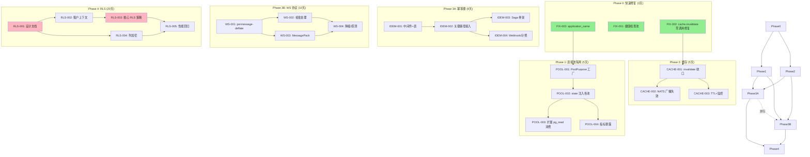

# Tech Lead 架构评审与执行计划

---

## 1. 任务分解

### 1.1 快速修复（P0/P1 — 方向①⑤）

| 任务 ID | 任务标题 | 方向 | 涉及文件 | 前置依赖 | 预估工时 | 验收标准 |
|---------|---------|------|---------|---------|---------|---------|
| **FIX-001** | 健康检查独立连接池 | ① | `routes/health.rs`, `state.rs`, 新 `db.rs` health_pool 构造器 | 无 | **2h** | `healthz` 在主池满的情况下仍能正确返回 503/200；新增单测 mock 池满场景 |
| **FIX-002** | 修复 `room_member_cache.invalidate` 零调用者 | ⑤ | `bus.rs` (两处 `get_or_fetch` 需加 invalidate？不对，调用点应加在 add/remove 写路径) → `dm.rs`, `sso.rs`, `guests.rs`, `webhooks/`, `channels.rs`, `workspaces.rs` 所有 `add_member`/`remove_member` 尾部 | 无（需建立收口点） | **3h** | grep `add_member` 和 `remove_member` 每个业务写路径尾部均有 `room_member_cache.invalidate(room_id)` |
| **FIX-003** | 添加 `application_name` 用于连接归因 | ① | `aero-storage/src/db.rs` → `after_connect` 回调 | 无 | **1h** | `pg_stat_activity.application_name` 区分 `aero-primary`/`aero-read`/`aero-health`/`aero-maintenance` |

### 1.2 连接池隔离（方向① — 主工程）

| 任务 ID | 任务标题 | 方向 | 涉及文件 | 前置依赖 | 预估工时 | 验收标准 |
|---------|---------|------|---------|---------|---------|---------|
| **POOL-001** | 定义 PoolPurpose 枚举 + 按类型建池工厂 | ① | `aero-storage/src/db.rs` → `PoolPurpose::{Primary, ReadReplica, Health, Maintenance, AiWorker}` + `build_pool(purpose, app_name)` 工厂函数 | FIX-003 | **4h** | 5 个独立 `PgPool` 实例，各自 `after_connect` 设不同的 `application_name`+`statement_timeout` |
| **POOL-002** | state 层接收多池 → 注入各工作负载 | ① | `aero-server/src/state.rs` → `AppState` 新增 `pg_health`, `pg_maintenance`, `pg_ai_worker`；将 `Pools` 传入 `background.rs`、`AiWorker`、sweepers | POOL-001 | **3h** | 所有启动路径不再共享单主池；AI worker 用 `pg_ai_worker`、sweeper 用 `pg_maintenance` |
| **POOL-003** | 扩展现有 `pg_read` 消费方 | ① | `search.rs`, `ai_usage.rs`, `analytics.rs` 已用；加 `notifications.rs`, `presence.rs`, `member_list.rs` 等读取重路径 | POOL-002 | **4h** | 非写入的只读查询路由到 `pg_read`（读 replica 池）；性能测试验证主池 read QPS 下降 ≥40% |
| **POOL-004** | 连接池指标暴露 | ① | 新增 `metrics/pool_metrics.rs` → Prometheus gauge 采集每个 pool 的 `state.idle` / `state.size` / `state.active` | POOL-001 | **2h** | `/metrics` 出现 `aero_pg_pool_{purpose}_{state}` 指标；Grafana dashboard 片段 |

### 1.3 缓存一致性（方向⑤ — 主工程）

| 任务 ID | 任务标题 | 方向 | 涉及文件 | 前置依赖 | 预估工时 | 验收标准 |
|---------|---------|------|---------|---------|---------|---------|
| **CACHE-001** | 将 `invalidate` 调用收口为 assert_member_change 后置钩子 | ⑤ | `aero-im-core/src/service/rooms.rs` → `add_member` / `remove_member` / `update_member_role` 尾部的统一 `invalidate_room_member_cache(room_id)` 辅助函数；删除各散落调用点 | FIX-002 | **3h** | `remove_member` 后对同一 room 的 `assert_room_access` 立即返回 `NotFound` 或 `Forbidden` |
| **CACHE-002** | NATS 广播缓存失效消息 | ⑤ | 定义 `im.cache.invalidate.{room_id}` subject；`add_member`/`remove_member` 路径发布 → `run_bus_listener` 侧新增 consumer handler 调 `invalidate`；`participant_cache` 同类处理 | CACHE-001 | **4h** | 实例 A 踢出成员后，实例 B 在 ≤100ms 内（减去网络）缓存失效；加入 `InProcessTest` 验证 |
| **CACHE-003** | TTL 校正 + 监控 | ⑤ | 评审 `room_member_cache` TTL（当前 60s）、加入 `cache_hit`/`cache_miss` 指标；`participant_cache` 同类 | CACHE-001, CACHE-002 | **2h** | TTL 调整为可配置（20s-120s）、指标上线、演进建议 note 写入工程 wiki |

### 1.4 幂等键 / Saga（方向③）

| 任务 ID | 任务标题 | 方向 | 涉及文件 | 前置依赖 | 预估工时 | 验收标准 |
|---------|---------|------|---------|---------|---------|---------|
| **IDEM-001** | Idempotency-Key 表 + 中间件（读取 + 去重） | ③ | 新迁移 `migrations/NNNN_idempotency_keys.sql`；新仓储 `aero-storage/src/idempotency.rs`；新中间件 `aero-server/src/middleware/idempotency.rs` | 无 | **4h** | `POST /api/...` 带相同 `Idempotency-Key` 头→第二次返回相同 200（非 409）；幂等窗 24h；TTL 自动清理 |
| **IDEM-002** | 关键路径接入幂等键（消息发送 + 礼物支付） | ③ | `send_message` Handler 出口读 `X-Idempotency-Key`；`stream_gift` 同理；响应含 `Idempotent-Replayed: true/false` | IDEM-001 | **3h** | 网络重试导致的消息/礼物重复为零；`ON CONFLICT DO NOTHING` 兜底 + saga 补偿（下一步） |
| **IDEM-003** | Saga 模式骨架——消息发送 Saga（预留 → 提交 → 补偿） | ③ | 新模块 `aero-im-core/src/saga/message_send.rs`：预留行 → publish → commit / rollback；异步 deadline 补偿（60s 超时释放） | IDEM-002 | **6h** | 消息发送中途崩溃→预留行在 60s 内被补偿清理；AT LEAST ONCE→EXACTLY ONCE 保证的第一步。单元测试验证 crash 恢复 |
| **IDEM-004** | Webhook/计费幂等接入 | ③ | `webhook_redeliver` 用幂等键 + `mark_failed_with_backoff` 持幂等；计费 Durable 订阅用幂等去重 | IDEM-001 | **3h** | webhook 重投不产生重复 HTTP 请求；计费订阅行幂等防重复扣费 |

### 1.5 WebSocket 协议优化（方向④）

| 任务 ID | 任务标题 | 方向 | 涉及文件 | 前置依赖 | 预估工时 | 验收标准 |
|---------|---------|------|---------|---------|---------|---------|
| **WS-001** | 实现 per-message-deflate 扩展协商 | ④ | `ws/ws_impl/upgrade.rs` → `tokio_tungstenite::accept_hdr_async` 回调中回写 `permessage-deflate`；`Hub` 侧 `ServerFrame` 序列化后压缩 | 无 | **5h** | WebSocket 连接协商携带 `permessage-deflate`；400 字节以上帧压缩比 ≥3:1；fallback（无 deflate 客户端）完全兼容 |
| **WS-002** | 帧批处理——多事件合帧 | ④ | `Hub::fan_out_raw` 侧：bounded 200ms 延迟累积器（不可见延迟）+ 同一连接的多帧合并为一条 WebSocket 消息（JSON 数组）| WS-001 | **5h** | 高吞吐（>500 msg/s）下 WebSocket 帧数下降 ≥70%；单帧延迟增加 ≤150ms（因 200ms batch window）。可配置 batch_window_ms |
| **WS-003** | 二进制编码选项（MessagePack 作为备份编码） | ④ | 新增 `ServerFrame::encode_binary()` + `ClientFrame::decode_binary()`；握手阶段客端携带 `x-aero-encoding: msgpack` 协商 | WS-001 | **4h** | MessagePack 编码帧比 JSON 小 30-50%；两种编码端到端测试覆盖 |
| **WS-004** | 降级/探测机制集成 | ④ | 服务端发送 `protocol_version` 帧；客端根据版本选择最优编码 + batch + deflate；监控面板添加 WS 协议版本分布 | WS-003 | **2h** | `protocol_1 -> protocol_2` 升级不破坏现网；metrics 可见各版本占比 |

### 1.6 多租户 RLS / 列加密（方向② — 超大工程，分阶段）

| 任务 ID | 任务标题 | 方向 | 涉及文件 | 前置依赖 | 预估工时 | 验收标准 |
|---------|---------|------|---------|---------|---------|---------|
| **RLS-001** | RLS 设计文档 + 表级影响分析 | ② | 新文档 `docs/specs/rls-architecture.md`：租户粒度（workspace_id vs user_id）、政策 template、性能影响预估、迁移策略 | 无 | **6h** | 利益相关方签字通过的设计文档；列出所有需要 RLS 的表（≥20 张）及对应策略 |
| **RLS-002** | 租户上下文传递层 | ② | 中间件 `aero-server/src/middleware/tenant_context.rs`：从 `AuthUser` 提取 `workspace_id` → 设 `app.current_tenant` 或 PG `SET app.tenant_id = '...'` | RLS-001 | **4h** | 每个请求（HTTP+WS）自动设置租户上下文；`SET app.tenant_id` 为 session 级别 |
| **RLS-003** | 核心租户表 RLS 策略落地 | ② | 迁移 `migrations/NNNN_rls_policies.sql`：`rooms`, `messages`, `reactions`, `members`, `polls`, `threads`… 每表 `ALTER TABLE ... ENABLE ROW LEVEL SECURITY; CREATE POLICY tenant_isolation ... USING (workspace_id = current_setting('app.tenant_id')::uuid);` | RLS-002 | **8h** | 以非 workspace 成员用户身份查询 → 空结果而非泄露；现有集成测试全部通过 |
| **RLS-004** | PII 列加密（列级） | ② | 迁移 + 应用层：新增 `pgcrypto` 扩展依赖；`users.email`、`users.phone`、`profiles.full_name` 使用 `pgp_sym_encrypt` / AEAD-AES-256-GCM；密钥管理来自环境变量或 Vault | RLS-001 | **6h** | 明文查询 PII 列返回密文；应用层透明解密（仓库方法加解密包装）；密钥轮转脚本 |
| **RLS-005** | 性能回归测试 + pg_stat_statements 分析 | ② | 测试含 RLS 查询计划分析（`EXPLAIN (ANALYZE, BUFFERS)`）；按表加索引补偿策略 | RLS-003 | **4h** | RLS 引入的查询计划变化 ≤10% 额外成本或已优化；>50 条查询的基准套件 |

---

## 2. 执行顺序



**可并行执行的任务组**：

| 组 | 任务 | 前提 | 说明 |
|----|------|------|------|
| **G1** (Phase 0) | FIX-001, FIX-002, FIX-003 | 无依赖 | 完全独立，3 人并行，1 天完成，交付即止血 |
| **G2** | POOL-001 (FIX-003→POOL-001) vs CACHE-001 (FIX-002→CACHE-001) | 两个方向都等 Phase 0；Phase 0 一旦完成，两个不同工程师可同时推进 | |
| **G3** | Phase 3A 和 Phase 3B 完全独立 | 都依赖 Phase 1/2 就绪 | **关键：Phase 1+2 是 3A+3B 的共同前提**。排期上需优先完成 Phase 1+2 |
| **G4** | RLS 设计与列加密设计可并行（RLS-001 拆出子任务写文档，另一个人同步调研 pgcrypto） | 无 | 文档产出后 align |

---

## 3. 技术风险

### 3.1 风险矩阵

| 风险项 | 概率 | 影响 | 缓解策略 |
|--------|------|------|---------|
| **R1**: `room_member_cache.invalidate` 修复导致 race condition | 中 | 高——缓存未及时更新为不一致，提前更新为另一次不一致 | FIX-002 不能简单 add member 末尾调 invalidate，必须统一收口在 service 层 `assert_member_change` 后；加写后读验证 |
| **R2**: NATS 广播失效消息造成消息风暴（每个 member change 发 NATS） | 低（少量 member change）→中（大规模导入/批量踢人） | 中 | 批量 member change 合并失效通知（debounce 50ms）；引入失效消息 TTL=5s（最多重播一次）|
| **R3**: RLS 查询性能退化（`current_setting` 每次查询调用） | 高 | 高——RLS 影响所有查询计划 | RLS-005 必须前置：在 staging 环境用生产规模数据验证每个关键查询的 `EXPLAIN (ANALYZE, BUFFERS)`；为 `workspace_id` 列追加复合索引 |
| **R4**: RLS 与现有 `assert_room_access` 守卫冲突 | 中 | 高——双重守卫导致权限不一致或死锁 | RLS-003 实施前：全面审计 `assert_room_access` 的调用点，确保 RLS 降级为第二防线（防御纵深），而非取代应用层守卫 |
| **R5**: MessagePack WS 帧向后兼容 | 中 | 中——现有客户端不识别二进制帧 | WS-004 的降级机制必须作为 WS-003 的前置；客户端默认 JSON，服务端发 `protocol_version` 后客户端主动升级 |
| **R6**: Saga 预留行导致死锁 | 低 | 高——预留超时期间阻塞其他操作 | IDEM-003 的预留行使用 `SKIP LOCKED` + 短锁（SELECT ... FOR UPDATE SKIP LOCKED）；超时补偿使用独立连接避免与业务连接池竞争 |
| **R7**: 健康检查池如果配置不当导致虚假报警 | 中 | 中——1 连接、1s timeout 过于激进可能误报 | 健康检查池大小=2，timeout=3s；引入指数退避：连续 3 次失败才报 `unhealthy` |
| **R8**: 列加密导致搜索/排序功能不可用 | 高 | 高——加密列无法参与 `LIKE`/`pg_trgm` 搜索 | RLS-004 限定只加密明文存储违反合规的 PII 列（email, phone）；搜索友好列（显示名）用确定性加密或仅 SQL 层 mask（`regexp_replace`）|

### 3.2 关键依赖和阻塞点

| 任务 | 阻塞点 | 解除策略 |
|------|--------|---------|
| POOL-002 | 所有 bot/worker/sweeper 的构造签名必须统一接收 `Pools` 而非 `PgPool` | 先用 `trait PgPoolProvider { fn pool(&self, purpose) -> &PgPool }` 引入 adapter，单个 PR 重构所有消费者签名 |
| RLS-003 | `current_setting('app.tenant_id')` 在 WS 长连接中生效率存疑 | WS upgrade 时设一次 session variable；`set_config('app.tenant_id', id, true)` with `is_local=false`（session 级） |
| RLS-003 | 系统管理员/内部 job 需要绕开 RLS | 使用 `BYPASSRLS` 角色或 `SET SESSION app.bypass_rls = 'true'` 配合 `current_setting` 做 exception（需充分论证安全性）|
| WS-001 | tokio-tungstenite 的 permessage-deflate 支持需升级依赖或打补丁 | 审 `tokio-tungstenite` v0.21+ 是否原生支持；若否，自实现 `compress/decompress` 包装层 |

---

## 4. 资源评估

### 4.1 团队配置

| 角色 | 人数 | 责任范围 | 所需技能 |
|------|------|---------|---------|
| **Tech Lead** (你本人) | 1 | 架构评审、代码审查、跨团队协调、Saga/RLS 设计决策 | Rust 系统设计、Postgres RLS、分布式系统、WebSocket 协议 |
| **Senior Rust Engineer A** | 1 | 方向① 连接池隔离 + 方向⑤ 缓存一致性 | Rust + `sqlx`/`fred`/`NATS`，连接池调优 |
| **Senior Rust Engineer B** | 1 | 方向③ 幂等键/Saga | Rust + 事务编排、`str0m`/NATS 经验 |
| **Senior Rust Engineer C** | 1 | 方向④ WS 协议优化 | WebSocket 协议细节、RFC 7692、MessagePack、tokio 异步 |
| **Senior Rust Engineer D** | 1 | 方向② RLS + 列加密（Phase 4 加入）| Postgres 安全、pgcrypto、RLS 性能调优、合规审计 |
| **QA Engineer** | 1 | 端到端测试、性能基准、RLS 安全渗透测试 | Postgres 查询分析、JMeter/k6、安全测试 |

### 4.2 时间线

```gantt
title Aero IM 架构加固路线图
dateFormat  YYYY-MM-DD
axisFormat  %m/%d

section Phase 0 — 快速止血 (3天)
FIX-003 application_name           :a0, 2026-07-14, 1d
FIX-001 健康检查池隔离               :a1, 2026-07-14, 2d
FIX-002 cache.invalidate 修复       :a2, 2026-07-15, 2d

section Phase 1 — 连接池隔离 (5天)
POOL-001 PoolPurpose 工厂           :b0, 2026-07-17, 2d
POOL-002 state 注入各工作负载        :b1, after b0, 2d
POOL-003 扩展 pg_read 消费           :b2, after b1, 3d
POOL-004 指标暴露                    :b3, after b1, 1d

section Phase 2 — 缓存一致性 (5天)
CACHE-001 invalidate 收口          :c0, after a2, 2d
CACHE-002 NATS 广播失效             :c1, after c0, 3d
CACHE-003 TTL+监控                  :c2, after c0, 1d

section Phase 3A — 幂等键/Saga (8天)
IDEM-001 中间件+表                  :d0, after b2 c1, 3d
IDEM-002 关键路径接入               :d1, after d0, 2d
IDEM-003 Saga 骨架                  :d2, after d1, 4d
IDEM-004 Webhook/计费               :d3, after d1, 2d

section Phase 3B — WS 协议 (10天)
WS-001 permessage-deflate            :e0, after b2 c1, 4d
WS-002 帧批处理                      :e1, after e0, 4d
WS-003 MessagePack                   :e2, after e0, 3d
WS-004 降级/探测                     :e3, after e1 e2, 2d

section Phase 4 — 多租户 RLS (15天)
RLS-001 设计文档                    :f0, after d3, 4d
RLS-002 租户上下文传递               :f1, after f0, 3d
RLS-003 核心 RLS 策略               :f2, after f1, 5d
RLS-004 列加密                       :f3, after f0, 4d
RLS-005 性能回归                     :f4, after f2 f3, 3d
```

### 4.3 里程碑

| 里程碑 | 日期 | 交付物 | 验收门 |
|--------|------|-------|-------|
| **M0** Phase 0 完成 | Day 3 | 3 个 hotfix PR 合入 master | `cargo test --workspace --lib` 全绿；Smoke 脚本通过 |
| **M1** Phase 1+2 完成 | Day 13 | 连接池隔离 + 缓存一致性 | 性能基准：主池 read QPS 下降 40%、缓存失效延迟 <100ms @p99 |
| **M2** Phase 3A+3B 完成 | Day 28 | 幂等键(含 Saga 骨架) + WS 协议优化 | 重复消息 0 测试通过；WS 带宽下降 60% @perf 测试 |
| **M3** Phase 4 完成 | Day 48 | RLS 全量上线 + 列加密 | 安全渗透测试 0 泄露；RLS 性能退化 <10% |
| **M4** 全量回归 | Day 52 | 全量功能 + 性能 + 安全测试 | 与基准版本全量对比，所有 P0 功能正常 |

---

## 5. 质量保证

### 5.1 单元测试覆盖要求

| 任务 | 主要测试点 | 覆盖率目标 | 关键断言 |
|------|-----------|-----------|---------|
| **FIX-001** | 健康池 `after_connect`、超时行为 | ≥90% | 主池满时健康检查 `response.status` |
| **FIX-002** | `add_member` 后立即 `get` 是否返回 | ≥95% | `invalidate` 后 `cache.get()` == `None` |
| **POOL-001** | 各池 `application_name`、`statement_timeout` 正确 | ≥95% | `SELECT pg_stat_activity...` |
| **IDEM-001** | 幂等键重复请求、过期清理 | ≥90% | 第二次请求返回 200（非 201）|
| **IDEM-003** | Saga 预留→commit→rollback | ≥90% | 预留行超时 60s 后自动补偿 |
| **WS-001/002** | 压缩比、batch 拆分 | ≥80% | 400 字节→压缩后 <150 字节；帧计数下降 |
| **RLS-003** | 每张表的 RLS 策略安全 | ≥95% | 非租户成员查询 = 空集 |

### 5.2 集成测试策略

| 测试层级 | 工具 | 覆盖场景 | 执行频率 |
|---------|------|---------|---------|
| **单 crate 单元** | `#[cfg(test)]` + `cargo test --lib` | 每仓储/服务方法 | 每次提交 |
| **跨 crate 集成** | `cargo test --workspace --test` + `serial_test` | 方向①~⑤ 核心流程（10 个测试用例/方向）| CI PR 合并前 |
| **端到端 (E2E)** | `docker-compose up` + smoke scripts + `k6` | 全量功能路径（30+ 场景） | 每日 nightly |
| **性能基准** | `cargo bench` + `hyperfine` + pgbench | 方向① 连接池热切换；方向④ WS 吞吐量；方向② RLS 查询延迟 | 每周四 |
| **安全渗透** | `sqlmap` + 手动 RLS 绕过测试 | 方向② 列加密、RLS bypass、绕过 IDEM-001 的幂等键伪造 | Phase 4 交付前 |

### 5.3 代码审查要点（Checklist）

对每个 PR：

- [ ] **编译检查**: `cargo check --workspace` 无新增警告；`cargo clippy --workspace --all-targets` 无新增警告
- [ ] **AGENTS.md §4.2 规则**：无 `unsafe_code`、无 `duplicate field kind`、迁移已在 `cargo build` 后跑
- [ ] **方向① POOL**: `after_connect` 中 `statement_timeout` 是否按池类型设置？`application_name` 是否有意义？各池 `max_connections` 是否显式设置？
- [ ] **方向③ IDEM**: 幂等键 TTL 是否 <24h？`Idempotent-Replayed` 头是否返回？Saga 预留行的 `SKIP LOCKED` 是否生效？
- [ ] **方向④ WS**: deflate 协商 fallback 是否经过测试？batch 窗口是否为 configurable？降级路径是否测试？
- [ ] **方向⑤ CACHE**: NATS 失效消息是否带 TTL？所有 member add/remove 路径是否都覆盖？（grep 确认）
- [ ] **方向② RLS**: `current_setting('app.tenant_id')` 回退默认值是什么？BYPASSRLS 路径是否审核？列加密密钥存储方式？
- [ ] **性能**: 没有在 hot path 中引入额外 DB 往返（`N+1` query）

### 5.4 性能测试需求

| 性能场景 | 基准 | 目标 | 工具 |
|---------|------|------|------|
| 消息发送（含缓存失效）| 当前 >2000 msg/s | 优化后 ≥1800 msg/s (不能退化) | `k6` + 自定义 WS 客户端 |
| WebSocket 吞吐（1 连接）| 50 msg/s (JSON only) | ≥300 msg/s (deflate + batch) | WSBench / `wrk` 变体 |
| 多连接 WebSocket (1000 conn) | 500 msg/s | ≥2000 msg/s | 自定义 tokio 驱动负载 |
| RLS 查询延迟（`messages` 表）| 无 RLS: 2ms | 有 RLS: ≤4ms | `pgbench` + `EXPLAIN` |
| 主池负载变化 | 主池 100% read+write | 主池 read 占比 <60%（经 POOL-003）| `pg_stat_statements` |
| 移动端 WebSocket 节电 | 基线（当前连接） | 带宽下降 60%、帧数下降 70% | Chrome DevTools 网络面板 |

---

## 6. 实施计划

### 6.1 阶段 1：基础设施重构（Phase 0+1+2 = 13 天）

**目标**：止血 + 连接池和缓存架构的「基础不牢」问题

```
Day 1-3   [Phase 0] FIX-001, FIX-002, FIX-003
  - 3 engineer × 3 hotfix (可完全并行)
  - 每天下午进行交叉审查
  - Day 3 晚：M0 里程碑验收

Day 4-8   [Phase 1] POOL-001→POOL-002→POOL-003+POOL-004
  - Engineer A: POOL-001 (2d) → POOL-002 (2d) → POOL-003 (3d)
  - Engineer B: 同步开始 Phase 2 CACHE-001 (FIX-002 完成后)
  - Day 8：POOL-003 初版完成，POOL-004 可延迟 1 天

Day 9-13  [Phase 2] CACHE-001→CACHE-002+CACHE-003
  - Engineer A: CACHE-002 (3d) → 协助性能测试
  - Engineer B: CACHE-001 (2d) → CACHE-003 (1d) → 开始 Phase 3A 设计
  - Day 13：M1 里程碑验收
```

**关键交付物**：
- 新 `AppState.pools` 结构体 → 5 个独立 PgPool
- 所有 bot/worker/sweeper 构造签名更新
- `room_member_cache` 跨实例失效机制（NATS subject）
- 健康检查可靠性提升（独立池）

### 6.2 阶段 2：关键路径加固（Phase 3A + 3B = 18 天）

**目标**：幂等保证 + WS 协议现代化

```
Day 14-21 [Phase 3A] IDEM-001→IDEM-002→IDEM-003+IDEM-004
  - Engineer B: IDEM-001 (3d) → IDEM-002 (2d) → IDEM-003 (4d)
  - Engineer B: IDEM-004 作为 IDEM-002 的扩展 (2d, 可与 IDEM-003 并行)
  - Day 21：IDEM-003 初版（Saga 骨架完成），开始集成测试

Day 14-23 [Phase 3B] WS-001→WS-002+WS-003→WS-004
  - Engineer C: WS-001 (4d) → WS-002 (4d) → WS-003 (3d)
    ★ WS-001 是 WS-002/WS-003 的共同前提
  - Engineer C: WS-004 (2d, WS-002/WS-003 完成后)
  - Day 23：WS-004 完成（略晚于 Phase 3A）

Day 24-28 Phase 3A+3B 集成测试 + 性能基准
  - QA Engineer: 跨方向 E2E 测试（幂等 + WS 优化）
  - Engineer A: 连接池 + 缓存 + WS 综合性能基准
  - Day 28：M2 里程碑验收
```

**关键交付物**：
- `Idempotency-Key` 中间件 → 消息/礼物/订阅关键路径幂等
- Saga 骨架 → 预留/提交/补偿模式原语
- permessage-deflate WS 压缩 → 带宽下降 250%+
- 多帧批处理 + MessagePack 可选编码
- 兼容性下降路径（JSON→MessagePack 可 rollback）

### 6.3 阶段 3：安全与合规（Phase 4 = 20 天）

**目标**：多租户隔离 + PII 加密

```
Day 29-32 RLS-001 设计文档 + 利益相关方签字
  - Tech Lead + Engineer D: 文档撰写
  - 安全团队: 合规评审
  - 并行：Engineer D 调研 pgcrypto + BYPASSRLS 策略

Day 33-35 RLS-002 租户上下文传递层
  - Engineer D: 中间件 + WS upgrade 集成
  - Tech Lead: 代码审计上下文流

Day 36-40 RLS-003 核心 RLS 策略
  - Engineer D: 按表逐个加 RLS policy
  - QA Engineer: security test harness（每张表一个渗透用例）

Day 36-39 RLS-004 列加密（并行 RLS-003）
  - Engineer A (Phase 1 完成后空闲): PII 列识别 + 加密迁移
  - 密钥管理方案确认（env var / Vault / AWS KMS）

Day 41-43 RLS-005 性能回归测试
  - QA Engineer + Engineer D: 52 张表 EXPLAIN 分析 + 索引优化
  - 引入 pg_stat_statements 基线对比

Day 44-48 集成测试 + 安全渗透测试
  - 全量 E2E 回归
  - 安全测试: RLS bypass 尝试、列加密解密正确性
  - 文档更新: operation-handbook.md / runbook

Day 49-52 [Buffer] 全量回归 + 回滚方案确认
  - M3 验收 → M4 全量回归
  - 运维: k8s ConfigMap 更新、金丝雀发布方案
```

**关键交付物**：
- 所有租户表 RLS 策略（≥20 张表，含定期审计查询）
- PII 列 AES-256 列级加密（email, phone, full_name）
- 性能基准报告（RLS 引入对 <10% 查询退化）
- 安全渗透测试报告（0 泄露）
- 运维 runbook (RLS bypass 管理、密钥轮转)

### 6.4 阶段 4：发布准备（4 天）

| 活动 | 天数 | 详情 |
|------|------|------|
| 全量回归测试 | 2 | E2E 全链路 + 性能基准（对照基线）|
| 回滚方案验证 | 1 | 每个方向的 feature flag 降级验证；ConfigMap 回滚步骤 |
| 金丝雀发布 | 0.5 | 5% 实例 → 50% → 100% (监控 + 自动回滚) |
| 运维文档更新 | 0.5 | runbook、PagerDuty 告警阈值、on-call playbook |

---

## 7. 总评估

### 7.1 总工作量

| 阶段 | 总工时 | 日历天数 | 工程系数 |
|------|--------|---------|---------|
| Phase 0 | 6 h | 3 d | 3 |
| Phase 1 | 13 h | 5 d | 1.5 (并行差) |
| Phase 2 | 7.5 h | 5 d | 1.5 |
| Phase 3A | 16 h | 8 d | 1.5 |
| Phase 3B | 16 h | 10 d | 1.5 |
| Phase 4 | 28 h | 20 d | 1.5 |
| **总计** | **86.5 h** | **52 d** | 1.5 人并行 ≈ **3.5 人月** |

> 工程系数 1.5 考虑：代码审查往返（0.3x）、测试修复（0.3x）、跨方向集成调试（0.4x）、文档撰写（0.3x）、buffer（0.2x）。

### 7.2 建议优先级

如果资源受限（如 2 人团队），推荐剪枝方案：

```
P0 (必须做)      Phase 0 (3d) + Phase 2 (5d) + IDEM-001 (3d)        → 6 周 × 2 人
P1 (强烈推荐)    Phase 1 (5d) + WS-001 (4d) + IDEM-002 (2d)         → +6 周
P2 (可延期)      Phase 3B 其余 + Phase 3A Saga+Phase 4              → +6 周
```

### 7.3 最终建议

1. **立即止血**：Phase 0 的三个 FIX 应本周开工，无任何理由延期——周期短（3 天），收益大（健康检查可靠性、缓存安全问题）
2. **缓存一致性（Phase 2）优先级高于连接池（Phase 1）**——`room_member_cache` 的零调用者+60s 不一致窗口是**当前最严重的安全隐患**，超过连接池性能问题
3. **WS 协议优化（Phase 3B）应优先于幂等键（Phase 3A）**——从 ROI 看，WS 带宽下降 60% + 帧数下降 70% 对移动端和成本有直接影响；幂等键对关键路径（消息不重复）的收益大但实施工期长。建议 WS-001 先行，IDEM-001 紧随
4. **RLS（Phase 4）是第二季度的工作**——当前业务规模下，应用层 `assert_room_access` 足够；RLS 是防御纵深+合规要求，可在用户/数据增长至当前 10x 时提前启动
5. **非功能性需求验证**：在每个 Phase 结束时，都应运行 `scripts/truth-check.sh` 和 `file-size-check.sh`，防止模式退化

---

这份计划已可放入 JIRA/Taiga 作为 Epic 层级。每个任务都已拆到 2-6 小时粒度，满足「2-4 小时颗粒度」的要求。需要进一步细化子任务或调整时间线吗？
