Now I have a complete understanding. Let me produce the comprehensive Tech Lead analysis.

---

# Tech Lead 分析报告：Aero IM Web 客户端产品化方向

**分析对象**: `docs/requirements/2026-07-12-five-uncovered-client-ux-productization-directions.md`
**交叉验证**: 用户验证 + 我自己的代码核查
**分析日期**: 2026-07-12

---

## 0. 前置：文档准确度校验与修正

在进入任务分解前，需对文档的代码层论断做准确度标定——工程计划必须基于真实代码状态。

### 用户验证 + 我的验证结果

| 文档论断 | 实际代码 | 准确度 | 影响 |
|---------|---------|--------|------|
| `manifest.json` 仅 1 图标、缺 `display: standalone`、缺 `categories` | 2 图标 (192+512)、`display: standalone`、`categories: ["communication","social"]` 均存在 | ❌ 不准确 | 不影响方向优先级，但说明文档某些"缺失"论断需二次验证 |
| 零 Service Worker | 确认零 `navigator.serviceWorker` 引用 | ✅ 准确 | PWA 离线能力缺失的事实不变 |
| 零 `IntersectionObserver` / 虚拟滚动 | 确认零引用 | ✅ 准确 | DOM 膨胀无缓解的事实不变 |
| 每消息 ~15 节点 | 实际 14-40 节点（含 blocks 递归） | ⚠️ 低估 | 问题更严重，方向三/四/五的 DOM 变更需更关注性能 |
| 5000 消息 DOM >10000 节点 | 实际 >75000 节点 | ❌ 低估 7x | 迫切性比文档所述更高 |
| `style.css:focus { outline: none }` | 5 处 `outline: none`，但无 `:focus` 选择器后缀——全局 blanket 应用 | ⚠️ 需修正 | a11y 方向（方向二、四操作面板）必须修复 |
| 零 `aria-*` 属性 | 2 处 (`aria-live="polite"`, `aria-hidden="true"`) | ⚠️ 几乎准确 | 方向三/四/五新 UI 组件必须内建 a11y |
| `media.js` 上传代码片段 | 引用的行号和代码内容与当前 `media.js` 一致 | ✅ 准确 | 方向一分析可信 |
| 设置面板零 UI（仅 `showEditProfile`） | `modals.js` 中仅有显示名+头像编辑 | ✅ 准确 | 方向二分析可信 |

### 关键修正对计划的影响

1. **DOM 低估 7x** → 方向一（上传队列）、方向四（书签面板）、方向五（置顶面板）新增 DOM 时必须使用 `DocumentFragment` + 增量渲染，避免单次 append 大量节点触发重排
2. **`outline: none` blanket 应用** → 方向二/四的交互组件（按钮、输入框、下拉列表）必须显式设置 `:focus-visible` 样式，不能依赖全局 reset
3. **`aria-*` 近乎零** → 方向三 `EntityPicker` 必须实现完整 ARIA 角色（`combobox`, `listbox`, `option`）+ 键盘导航

---

## 1. 任务分解

将 5 个方向拆解为 2-4 小时可完成的任务单元。

### 方向一：文件上传体验（P1）

| 任务 ID | 标题 | 涉及文件 | 前置依赖 | 工时 |
|---------|------|---------|---------|------|
| FILE-01 | 上传 API 改为 XHR 带进度回调 | `web/api.js`（`uploadBlob` 方法），`web/media.js` | 无 | 3h |
| FILE-02 | 拖拽上传视觉区域（全屏遮罩） | `web/media.js`, `web/style.css`, `web/index.html` | 无 | 2h |
| FILE-03 | 上传前预览（composer 上方缩略图） | `web/media.js`, `web/render.js`, `web/style.css` | 无 | 4h |
| FILE-04 | 前端 MIME 类型 + 大小校验 | `web/media.js` | 无 | 1h |
| FILE-05 | 上传进度条 UI 组件 + 取消按钮 | `web/media.js`, `web/style.css` | FILE-01 | 4h |
| FILE-06 | 多文件上传队列（串行 + 状态显示） | `web/media.js` | FILE-05 | 4h |
| FILE-07 | 存储用量后端 API | `server/src/storage_usage.rs`, migration | 无 | 3h |
| FILE-08 | 存储用量前端仪表盘 | `web/settings.js`, `web/style.css` | FILE-07, SETTINGS-01（设置框架） | 3h |
| FILE-09 | 服务端缩略图管线（异步生成） | `server/src/blob_thumbnail.rs`, `Cargo.toml`（image crate） | 无 | 6h |
| FILE-10 | EXIF 剥离管线 | `server/src/blob_exif.rs` | 无 | 3h |

### 方向二：个人设置中心（P1）

| 任务 ID | 标题 | 涉及文件 | 前置依赖 | 工时 |
|---------|------|---------|---------|------|
| SETTINGS-01 | 设置面板框架（路由 + 抽屉 + 导航 tabs） | `web/settings.js`, `web/settings.css`, `web/index.html`, `web/app.js` | 无 | 4h |
| SETTINGS-02 | 个人资料编辑 UI | `web/settings.js` | SETTINGS-01 | 3h |
| SETTINGS-03 | 安全设置（密码 + 2FA + PAT 令牌） | `web/settings.js`, `web/modals.js`（复用 2FA 弹窗） | SETTINGS-01 | 4h |
| SETTINGS-04 | 通知偏好设置 UI | `web/settings.js` | SETTINGS-01 | 3h |
| SETTINGS-05 | 活跃会话管理 UI + 远程登出 | `web/settings.js` | SETTINGS-01 | 2h |
| SETTINGS-06 | 自定义状态 + OOO 设置 UI | `web/settings.js` | SETTINGS-01 | 3h |
| SETTINGS-07 | 暗色模式切换（CSS 变量 + localStorage） | `web/settings.js`, `web/style.css`, `web/app.js` | SETTINGS-01 | 2h |
| SETTINGS-08 | 消息模板 CRUD UI | `web/settings.js` | SETTINGS-01 | 3h |
| SETTINGS-09 | 保存搜索管理 UI | `web/settings.js` | SETTINGS-01 | 2h |

### 方向三：通用实体选择器（P2）

| 任务 ID | 标题 | 涉及文件 | 前置依赖 | 工时 |
|---------|------|---------|---------|------|
| PICKER-01 | `EntityPicker` 核心类（模态框 + 搜索 + 键盘导航 + 单/多选） | `web/picker.js`, `web/picker.css`, `web/index.html` | 无 | 6h |
| PICKER-02 | 远程搜索 debounce + 分页加载 | `web/picker.js` | PICKER-01 | 2h |
| PICKER-03 | @提及重构为 EntityPicker 内联模式 | `web/mentions.js`, `web/picker.js` | PICKER-01 | 2h |
| PICKER-04 | 添加成员从 prompt 改为 EntityPicker | `web/modals.js`, `web/picker.js` | PICKER-01 | 1h |
| PICKER-05 | 最近使用 LRU 缓存 | `web/picker.js` | PICKER-01 | 2h |
| PICKER-06 | 转发消息选择器 | `web/render.js`, `web/picker.js` | PICKER-01 | 3h |
| PICKER-07 | 斜杠命令补全选择器 | `web/picker.js`, `web/render.js` | PICKER-01 | 3h |

### 方向四：消息级效率操作（P2）

| 任务 ID | 标题 | 涉及文件 | 前置依赖 | 工时 |
|---------|------|---------|---------|------|
| ACTION-01 | 书签收藏/取消按钮（msg-actions 扩展） | `web/render.js`（`wireMsgActions`） | 无 | 2h |
| ACTION-02 | 书签管理面板（列表 + 分组 + 跳转） | `web/bookmarks.js`, `web/bookmarks.css`, `web/index.html`, `web/app.js` | ACTION-01 | 4h |
| ACTION-03 | 内联翻译按钮 + 翻译结果渲染 | `web/render.js`（msg-actions + 翻译气泡）, `web/api.js`（translate 调用） | 无 | 3h |
| ACTION-04 | 复制消息链接按钮 | `web/render.js` | 无 | 1h |
| ACTION-05 | 引用回复（选中文本 → 引用块） | `web/render.js`（`mouseup` 事件 + 浮层 + composer 插入） | 无 | 3h |
| ACTION-06 | 从消息创建任务 UI | `web/render.js`, `web/modals.js` | 无 | 3h |
| ACTION-07 | 消息举报按钮 | `web/render.js` | 无 | 1h |

### 方向五：消息引用与组织（P3）

| 任务 ID | 标题 | 涉及文件 | 前置依赖 | 工时 |
|---------|------|---------|---------|------|
| PIN-01 | 置顶面板（频道头部 📌 按钮 + 抽屉列表） | `web/pins.js`, `web/pins.css`, `web/index.html`, `web/app.js`, `web/render.js` | 无 | 4h |
| PIN-02 | 消息气泡 📌 角标 | `web/render.js` | PIN-01 | 1h |
| PIN-03 | `handlePin` 从 toast 升级为全功能 | `web/app.js` | PIN-01 | 1h |
| PIN-04 | 消息转发（复用 PICKER-06） | `web/render.js`（转发动作）, `web/api.js`（转发 API） | PICKER-06 | 2h |
| PIN-05 | 引用回复文本选择浮层 | `web/render.js` | 无 | 3h |
| PIN-06 | 置顶自动过期（后端） | `server/src/pins.rs`, migration | 无 | 3h |

### 基础设施/跨方向任务

| 任务 ID | 标题 | 涉及文件 | 前置依赖 | 工时 |
|---------|------|---------|---------|------|
| A11Y-01 | 修复 `outline: none` blanket → `:focus-visible` + 自定义 focus ring | `web/style.css` | 无 | 2h |
| A11Y-02 | 消息列表 ARIA 角色 + 键盘导航 | `web/render.js` | 无 | 3h |
| PERF-01 | `renderMessage` 改为 DocumentFragment 批量追加 | `web/render.js` | 无 | 2h |
| PERF-02 | 消息列表虚拟滚动 MVP（固定高度 + 可视窗口渲染） | `web/render.js`, `web/app.js`, `web/style.css` | 无 | 8h |

---

## 2. 执行顺序与依赖图

```mermaid
graph TD
    subgraph Phase1["阶段 1 · 基础设施（5 天）"]
        A11Y-01["A11Y-01: 修复 outline:none<br/>2h"] 
        PERF-01["PERF-01: DocumentFragment 批量追加<br/>2h"]
        SETTINGS-01["SETTINGS-01: 设置面板框架<br/>4h"]
    end

    subgraph Phase2a["阶段 2a · 上传体验（6 天）"]
        FILE-01["FILE-01: XHR 进度回调<br/>3h"] 
        FILE-02["FILE-02: 拖拽视觉区域<br/>2h"]
        FILE-03["FILE-03: 上传前预览<br/>4h"]
        FILE-04["FILE-04: 前端校验<br/>1h"]
        FILE-05["FILE-05: 进度条 + 取消<br/>4h"] --> FILE-01
        FILE-06["FILE-06: 上传队列<br/>4h"] --> FILE-05
    end

    subgraph Phase2b["阶段 2b · 设置面板 L1（5 天）"]
        SETTINGS-02["SETTINGS-02: 个人资料<br/>3h"] --> SETTINGS-01
        SETTINGS-03["SETTINGS-03: 安全设置<br/>4h"] --> SETTINGS-01
        SETTINGS-04["SETTINGS-04: 通知偏好<br/>3h"] --> SETTINGS-01
        SETTINGS-05["SETTINGS-05: 会话管理<br/>2h"] --> SETTINGS-01
    end

    subgraph Phase3["阶段 3 · 选择器 + 消息操作（8 天）"]
        PICKER-01["PICKER-01: EntityPicker 核心<br/>6h"]
        PICKER-02["PICKER-02: 远程搜索分页<br/>2h"] --> PICKER-01
        PICKER-03["PICKER-03: @提及重构<br/>2h"] --> PICKER-01
        PICKER-04["PICKER-04: 添加成员<br/>1h"] --> PICKER-01
        
        ACTION-01["ACTION-01: 书签按钮<br/>2h"]
        ACTION-02["ACTION-02: 书签面板<br/>4h"] --> ACTION-01
        ACTION-03["ACTION-03: 内联翻译<br/>3h"]
        ACTION-04["ACTION-04: 复制链接<br/>1h"]
        
        PICKER-06["PICKER-06: 转发选择器<br/>3h"] --> PICKER-01
    end

    subgraph Phase4["阶段 4 · 置顶面板 + 引用（6 天）"]
        PIN-01["PIN-01: 置顶面板<br/>4h"]
        PIN-02["PIN-02: 消息角标<br/>1h"] --> PIN-01
        PIN-03["PIN-03: handlePin 升级<br/>1h"] --> PIN-01
        PIN-05["PIN-05: 引用文本选择<br/>3h"]
        ACTION-05["ACTION-05: 引用回复<br/>3h"]
    end

    subgraph Phase5["阶段 5 · 扩展功能（并行，6 天）"]
        SETTINGS-06["SETTINGS-06: 状态+OOO<br/>3h"] --> SETTINGS-01
        SETTINGS-07["SETTINGS-07: 暗色模式<br/>2h"] --> SETTINGS-01
        SETTINGS-08["SETTINGS-08: 消息模板<br/>3h"] --> SETTINGS-01
        SETTINGS-09["SETTINGS-09: 保存搜索<br/>2h"] --> SETTINGS-01
        PICKER-05["PICKER-05: 最近使用<br/>2h"] --> PICKER-01
        ACTION-06["ACTION-06: 创建任务<br/>3h"]
        ACTION-07["ACTION-07: 举报按钮<br/>1h"]
    end

    subgraph Phase6["阶段 6 · 可选优化"]
        FILE-07["FILE-07: 存储用量 API<br/>3h"]
        FILE-08["FILE-08: 用量仪表盘<br/>3h"] --> FILE-07
        FILE-09["FILE-09: 缩略图管线<br/>6h"]
        FILE-10["FILE-10: EXIF 剥离<br/>3h"]
        PIN-04["PIN-04: 转发（复选器）<br/>2h"] --> PICKER-06
        PIN-06["PIN-06: 置顶自动过期<br/>3h"]
        PERF-02["PERF-02: 虚拟滚动<br/>8h"]
        PICKER-07["PICKER-07: 斜杠命令补全<br/>3h"]
    end

    Phase1 --> Phase2a
    Phase1 --> Phase2b
    Phase2b --> Phase3
    Phase2a --> Phase3
    Phase3 --> Phase4
    Phase3 --> Phase5
    Phase4 --> Phase6
    Phase5 --> Phase6
```



### 并行组

| 并行组 | 任务 | 原因 |
|--------|------|------|
| **组 A** (P1) | FILE-01→02→03→04 + SETTINGS-01→02→03→04→05 | 方向一与方向二无代码冲突，可不同开发者并行 |
| **组 B** (P2) | PICKER-01→02→03 + ACTION-01→03→04 | 选择器与消息操作可在不同文件工作 |
| **组 C** (P3) | PIN-01→02→03 + ACTION-05→06 | 置顶与引用回复无共享依赖 |
| **组 D** (扩展) | SETTINGS-06→07→08→09 + FILE-07→08 | 设置扩展与存储用量可并行 |

---

## 3. 技术风险

### 3.1 方向一（文件上传）：风险评级 ★★★☆☆

| 风险 | 概率 | 影响 | 应对 |
|------|------|------|------|
| XHR 迁移破坏现有 `uploadBlob` 调用方 | 中 | 高 | `api.js` 中保留 `request()`（基于 fetch）不动，`uploadBlob` 独立为基于 XHR 的新方法，输出统一 `UploadTask` 接口 |
| 大文件上传浏览器内存 OOM | 低 | 高 | 前端硬限 32MB（与服务端一致），Streaming upload 而非 `FileReader.readAsArrayBuffer` |
| 弱网导致进度卡死 | 中 | 中 | 添加 60s 无进展检测 → 显示"网络异常"提示 + 重试按钮 |
| 缩略图管线增加服务端负载 | 中 | 低 | 异步生成（后台 task），消息先发送再生成缩略图，生成完成后 `RoomEvent::Edit` 更新消息 |

### 3.2 方向二（设置中心）：风险评级 ★★☆☆☆

| 风险 | 概率 | 影响 | 应对 |
|------|------|------|------|
| PAT 令牌创建后无法再次查看完整 token | 低 | 中 | 文档策略：创建时仅展示一次 + `我已保存` 确认 + 提供重新生成 |
| 2FA 启用后恢复码丢失 → 用户锁死 | 低 | 高 | 强制确认 + 备用邮箱重置路径 |
| 暗色模式切换导致样式冲突 | 中 | 低 | 使用 CSS 变量系统（`--bg`, `--text` 等已有），`data-theme="dark"` 属性切换，无需重写 |

### 3.3 方向三（EntityPicker）：风险评级 ★★★★☆

| 风险 | 概率 | 影响 | 应对 |
|------|------|------|------|
| 10 万成员工作区的搜索性能 | 高 | 高 | 后端搜索已有 `LIMIT 20` + 分页；前端 debounce 300ms + 骨架屏；客户端不做全量加载 |
| DOM 膨胀：选择器浮层 + 已有消息列表 → 额外 1000+ 节点 | 高 | 中 | `DocumentFragment` 构建选择器列表，关闭时 `innerHTML = ''` 彻底清理 |
| 键盘导航与浏览器/AT 快捷键冲突 | 中 | 中 | 只绑定 `↑↓EnterEsc`，不覆盖 `Ctrl+K`；`aria-activedescendant` 模式 |
| 内联模式（@mention）与 render.js 的 composer 集成 | 中 | 高 | 需理解 `render.js` 的 composer 状态管理（`state.typing`, caret 位置）——这是整个 SPA 最复杂的部分之一 |

### 3.4 方向四（消息操作）：风险评级 ★★☆☆☆

| 风险 | 概率 | 影响 | 应对 |
|------|------|------|------|
| 消息动作栏增加按钮 → 布局溢出 | 中 | 低 | 使用 `flex-shrink` + `overflow: hidden` + `title` 属性；窄屏幕将次要按钮收入 `...` 菜单 |
| 翻译调用触发速率限制 | 中 | 中 | 前端 `disabled` 按钮防止重复调用；显示加载状态；后端 `ai_usage` 已有预算追踪 |

### 3.5 方向五（置顶/引用）：风险评级 ★★☆☆☆

| 风险 | 概率 | 影响 | 应对 |
|------|------|------|------|
| 置顶 20+ 条时 UI 溢出 | 低 | 低 | 最多 20 条，滚动容器 |
| 引用消息被删除 → 引用块显示死链接 | 中 | 中 | 渲染时检查消息状态；已删除显示 "[消息已被删除]" |
| 转发到无权访问的房间 | 中 | 中 | `EntityPicker` 的 `filter: 'joined'` 确保只列出已加入房间 |

---

## 4. 资源评估

### 4.1 技能要求与团队组成

| 角色 | 技能要求 | 人数 | 覆盖范围 |
|------|---------|------|---------|
| **前端开发** | 原生 JS (ES2020), DOM API, CSS 变量体系, WebSocket 事件驱动编程 | 2 人 | 方向一~五的 Web 端全部任务 |
| **后端开发** | Rust, Axum, sqlx, 文件存储管线 | 1 人（兼职） | FILE-07 存储 API, FILE-09 缩略图, FILE-10 EXIF 剥离, PIN-06 自动过期 |
| **QA** | 手动 Smoke 测试 + 浏览器 DevTools 性能面板 | 1 人（兼职） | 全部方向 |
| **Tech Lead** | 架构决策 + 代码审查 + 集成协调 | 本文件角色 | 全部方向 |

### 4.2 关键里程碑

| 里程碑 | 时间 | 交付物 | 验证方式 |
|--------|------|--------|---------|
| **M1** | Day 5 | 基础设施完成：a11y 修复 + `DocumentFragment` 渲染 + 设置面板框架 | 键盘 Tab 导航可见发光环；5000 条消息渲染 < 3 秒 |
| **M2** | Day 11 | 文件上传 + 基本设置可用 | 上传 10MB 文件可见进度条 + 可取消；用户可改头像+密码+2FA |
| **M3** | Day 19 | EntityPicker 可用 + 消息操作扩展 | @提建议选器替换完成；书签/翻译/复制链接在右键菜单中 |
| **M4** | Day 25 | 置顶面板 + 引用回复 | 频道头部📌显示置顶列表；选择文本可引用回复 |
| **M5** | Day 31 | 扩展功能完成 + 性能验证 | 设置面板全功能；存储 API+仪表盘；负载测试 DOM < 10000 节点 |

### 4.3 阻塞点（Blockers）

| 阻塞点 | 方向 | 阻碍 | 解决策略 |
|--------|------|------|---------|
| `render.js` composer 内部状态管理复杂 | 方向三（内联 @mention） | 理解 `render.js` 的 `state.typing`, `insertAtCaret`, `replaceRange` 等逻辑需要额外 1-2 天研究 | 先完成模态模式（EntityPicker 独立浮层），内联模式放 P2；安排与其他开发者的知识传递 session |
| 缩略图管线依赖 `image` crate | 方向一 L3 | 编译时间增加 + 内存占用 | 推迟到 M5 之后；MVP 用 `loading="lazy"` + CSS `object-fit: cover` |
| 虚拟滚动（PERF-02）与现有 `renderMessage` append 模式不兼容 | 性能优化 | 虚拟滚动需重写消息列表渲染架构 | 留到 Phase 6 独立评估；先做 DocumentFragment 优化 + 延迟加载历史消息 |

---

## 5. 质量保证

### 5.1 单元测试覆盖要求

| 任务 | 测试内容 | 测试文件 | 最低覆盖要求 |
|------|---------|---------|------------|
| FILE-01 (XHR 上传) | XMLHttpRequest `onprogress` 回调触发、`AbortController` 取消 | `web/media.test.js` | 关键路径 100% |
| FILE-04 (前端校验) | MIME 白名单过滤、32MB 上限拒绝 | `web/media.test.js` | 边界条件 100% |
| PICKER-01 (EntityPicker) | 搜索 debounce、键盘导航、多选状态管理 | `web/picker.test.js` | 核心交互 90% |
| ACTION-01 (书签) | 切换状态（☆→★）、API 调用参数 | `web/render.test.js` | 状态转换 100% |
| SETTINGS-03 (PAT 令牌) | 创建后展示一次、重新生成流程 | `web/settings.test.js` | 安全相关 100% |

**注意**: 当前项目零 JS 测试基础设施。需要先：
1. 在 `web/` 下初始化 `node --test`（Node 20+ 内置，零外部依赖）
2. 为 `api.js` 中的 `request()` 核心方法编写首批测试（建立模式）
3. 使用 `global.fetch` mock 避免网络依赖

### 5.2 集成测试策略

| 测试场景 | 方式 | 覆盖方向 |
|---------|------|---------|
| 上传 → 进度 → 完成 → 消息扇出 | 手动 Smoke：浏览器 DevTools Network 面板观察 XHR 进度 | 方向一 |
| 设置保存 → 刷新 → 值持久化 | 手动：改头像 → F5 → 头像更新 | 方向二 |
| @mention 搜索 → 选择 → 发送 | 手动：键入 `@` → 选用户 → 发送 → 消息渲染含 @ | 方向三 |
| 书签收藏 → 书签面板 → 跳转 | 手动：hover 消息 → 点击 ☆ → 打开书签面板 → 点击跳转 | 方向四 |
| 置顶消息 → 频道头部 📌 更新 → 取消置顶 | 手动：右键消息 → 置顶 → 看面板 → 取消置顶 | 方向五 |

### 5.3 代码审查要点

| 审查项 | 应检查 | 违规红线 |
|--------|-------|---------|
| 新文件 | 是否在 `web/index.html` 注册 `<script>`、是否与既有 `eslint.config.js` 兼容 | 遗漏注册 → 功能不工作 |
| DOM 操作 | 是否使用 `DocumentFragment` 批量追加？非单节点逐次 `appendChild` | 连续 5+ `appendChild` → 需用 fragment |
| a11y | 交互元素是否设 `role` + `aria-*` + 键盘事件？`outline` 是否使用 `:focus-visible` | 新交互元素缺少 `role` → 拒绝 |
| CSS | 是否使用 CSS 变量（已有 `--bg`、`--text` 等）？是否使用 `class` 而非 `style` 属性？ | 硬编码颜色值 → 拒绝 |
| API 调用 | 是否通过 `api.js` 的 `request()` 方法（统一错误处理 + token 刷新）？ | 裸 `fetch()` → 拒绝 |
| 状态管理 | 是否使用 `state.*` 变量（已有 `state.currentRoomId`, `state.user` 等）？ | 用 `document.title` 存状态 → 拒绝 |

### 5.4 性能测试需求

| 测试项 | 方法 | 阈值 |
|--------|------|------|
| 消息列表渲染 5000 条 | `performance.measure()` + Chrome DevTools Performance 面板 | 首次渲染 < 5 秒（优化后 < 2 秒），无长任务 > 50ms |
| 上传进度条平滑度 | 限制网络为 Slow 3G (Chrome DevTools) | 进度更新间隔 < 200ms |
| 设置面板切换延迟 | 从点击到面板显示完成 | < 300ms |
| 书签面板 1000 条目 | 使用 `api.bookmarks.list` mock 返回 1000 条 | 滚动帧率 > 30fps |
| `outline: none` 修复后 Tab 导航 | 连续按下 Tab 键遍历所有交互元素 | 每个元素出现 visible focus ring |

---

## 6. 实施时间表

### 阶段 1：基础设施搭建（5 天）

```
Day 1-2   │ A11Y-01 (2h) + PERF-01 (2h) + 代码审查启动
Day 3-5   │ SETTINGS-01 (4h) + 设置面板框架 DOM/CSS/路由
           │ 建立 JS 测试基础设施 (node --test + api.js mock 测试)
```

**交付**: 修复 `outline:none` + focus ring；消息渲染使用 DocumentFragment；设置面板框架可打开/关闭/切换 tab

### 阶段 2：核心功能并行（11 天）

```
Day 6-11  │ 方向一（上传）: FILE-01→02→03→04→05→06
           │ FILE-01 (XHR 回调) 3h + FILE-02 (拖拽视觉) 2h + FILE-03 (预览) 4h
           │ FILE-04 (校验) 1h + FILE-05 (进度条) 4h + FILE-06 (队列) 4h
           │
Day 6-10  │ 方向二（设置 L1）: SETTINGS-02→03→04→05
           │ 个人资料 3h + 安全 4h + 通知 3h + 会话 2h
           │
Day 10-11 │ Smoke 测试集成：上传完整流程 + 设置保存/读取/持久化
```

**交付**: 文件上传可见进度条 + 可取消 + 拖拽视觉区域；设置面板支持个人资料/密码/2FA/通知/会话管理

### 阶段 3：选择器 + 消息操作扩展（8 天）

```
Day 12-14 │ PICKER-01 (6h) + PICKER-02 (2h)
           │ EntityPicker 核心 + 远程搜索分页
           │
Day 14-16 │ PICKER-03 (2h) + PICKER-04 (1h) + ACTION-01 (2h) + ACTION-03 (3h) + ACTION-04 (1h)
           │ @提及替换 + 添加成员 + 书签按钮 + 翻译 + 复制链接
           │
Day 17-19 │ PICKER-06 (3h) + ACTION-02 (4h) 
           │ 转发选择器 + 书签面板（列表 + 分组 + 跳转）
           │
Day 19    │ 集成测试：@mention 选择器 + 书签收藏全流程 + 翻译显示
```

**交付**: EntityPicker 复用 4 个场景（@提及/添加成员/转发）；书签/翻译/复制链接在消息动作中；书签管理面板

### 阶段 4：置顶面板 + 引用回复（6 天）

```
Day 20-22 │ PIN-01 (4h) + PIN-02 (1h) + PIN-03 (1h)
           │ 置顶面板 + 消息角标 + handlePin 升级
           │
Day 22-25 │ ACTION-05 (3h) + PIN-05 (3h)
           │ 引用回复浮层 + 文本选择插入
           │
Day 25    │ 全功能 Smoke：置顶/取消置顶/角标/引用回复/转发
```

**交付**: 频道置顶面板完整可用；选中消息文本可引用回复；消息 📌 角标

### 阶段 5：扩展功能 + 性能优化（6 天）

```
Day 26-28 │ SETTINGS-06→07→08→09
           │ 状态/OOO/暗色模式/消息模板/保存搜索
           │
Day 28-29 │ ACTION-06 (3h) + ACTION-07 (1h)
           │ 从消息创建任务 + 举报按钮
           │
Day 29-31 │ PERF-02 (8h 虚拟滚动 MVP) + 性能验证
           │ 5000 条消息负载测试 + DOM 节点计数
```

**交付**: 设置面板全功能；消息可创建任务/举报；虚拟滚动 MVP 通过负载测试

### 阶段 6：可选优化（不纳入主计划，按需执行）

```
无时间承诺 │ FILE-07→08 (存储用量), FILE-09 (缩略图), FILE-10 (EXIF)
           │ PIN-06 (置顶自动过期), PICKER-07 (斜杠命令补全), PICKER-05 (最近使用)
           │ PIN-04 (转发接入选择器)
```

---

## 7. 完整工作量总结

| 阶段 | 总工时 | 日历天数（1 人） | 日历天数（2 人分立） |
|------|--------|-------------------|---------------------|
| 阶段 1 · 基础设施 | 8h | 1 天 | 1 天 |
| 阶段 2 · 核心功能 | 54h | 7 天 | 5 天 |
| 阶段 3 · 选择器+消息操作 | 45h | 6 天 | 5 天 |
| 阶段 4 · 置顶+引用 | 24h | 3 天 | 3 天 |
| 阶段 5 · 扩展功能 | 25h | 4 天 | 3 天 |
| **总计（必做）** | **156h** | **~20 天** | **~13 天** |
| 阶段 6 · 可选 | 28h | 4 天 | 3 天 |
| **全量** | **184h** | **~24 天** | **~16 天** |

### 推荐人力分配

- **前端 Dev A**（强 DOM/JS 能力）：阶段 2a 上传 + 阶段 3 选择器 + 阶段 4 置顶（~90h）
- **前端 Dev B**（强 UX/CSS 能力）：阶段 1 基础设施 + 阶段 2b 设置 + 阶段 5 扩展（~66h）
- **后端 Dev**（兼职 20%）：FILE-07/09/10 + PIN-06（~15h）
- **QA**（兼职 30%）：各阶段结束时的 Smoke 测试 + 性能验证

---

## 8. 最终建议

### 必须做的 P0 更正（先于所有方向）

1. **A11Y-01**: 修复 `outline: none` blanket 应用 → `:focus-visible` + 自定义 focus ring（2h）。不修这个就加新交互组件 = 制造 a11y 债。
2. **PERF-01**: `renderMessage` 切到 DocumentFragment（2h）。所有方向新增的 DOM 都会叠加上去。

### P1 优先级（方向一 + 方向二 L1）

文件上传是每日使用的基础功能，设置面板是产品化基线。两个方向并行（阶段 2a + 2b）是最高 ROI 投资。

### P2 警告（方向三的 `render.js` 集成风险）

EntityPicker 的 @mention 内联模式需要深入理解 `render.js` 的 composer 状态管理。**建议先做模态模式**（添加成员、转发），内联模式在掌握代码后再做。

### 对文档生成流程的建议

这份文档的方向选择和问题识别整体质量很高，但我发现的几处代码层不准确（manifest.json、安全头状态、`cargo deny` 状态）提示一个系统性风险：**AI 生成的代码分析文档在「缺失断言」（claiming something is absent/missing）上需要人工二次验证**。建议对每个 `❌ 缺失` 论断做 `rg -c KEYWORD` 验证后再排入计划。

---

**下一步建议**: 你提到了 5 个方向选择，我的建议是：
1. **先做交叉验证修复**（A11Y-01 + PERF-01）— 2 天，所有方向的基础
2. **然后方向一（上传）和方向二 L1（设置）并行** — 这是产品从 demo 到 MVP 的临界点
3. **方向三（EntityPicker）L1 模态模式**在方向一完成后启动，方向四/五依次跟进

需要我输出任何具体方向的详细代码变更清单、或某个任务的实现规格文档吗？
