Now I have a thorough understanding of the project. Here is my Tech Lead analysis:

---

# Tech Lead Analysis: Aero IM — Closing Key Product Gaps (Directions Assessment)

## 1. 任务分解 (Task Breakdown)

Based on the validated findings, I've identified **4 functional directions** that map to discrete, shippable workstreams. Below each is decomposed into 2–4 hour tasks.

---

### 方向一: Admin & Management Console

> **Problem**: ~50+ admin/management route modules exist but have zero UI. The only "client" is `web/index.html` labeled "debug client · 联调专用".

| ID | Title | Files | Deps | Hours | Acceptance |
|-----|-------|-------|------|-------|------------|
| TASK-001 | **Admin Console Scaffold** — Create new `web/admin/` SPA shell with auth-aware router, sidebar nav, and Axum proxy route | `web/admin/index.html`, `web/admin/app.js`, `web/admin/style.css`, `crates/aero-server/src/routes/routes.rs` → add `serve_dir` for `/admin/*` | None | 4 | `GET /admin/` renders SPA; sidebar nav renders 5 placeholder sections |
| TASK-002 | **Workspace Dashboard View** — Show workspace name, member count, active channels, usage stats from existing `/api/workspaces/:id` and `/api/workspaces/:id/admin/usage` | `web/admin/workspace.js`, `web/admin/dashboard.js`, `web/admin/style.css` (additions) | TASK-001 | 3 | Renders workspace overview with real data from REST API |
| TASK-003 | **Member Management Table** — List members, show role, deactivate/reactivate, force logout. Reuses `crate::deactivation`, `crate::admin_sessions` | `web/admin/members.js`, `web/admin/members.html` (fragment) | TASK-001 | 4 | Can list members, deactivate, and force-revoke sessions |
| TASK-004 | **Channel Management Views** — List channels, create/archive, set retention, assign roles. Reuses `crate::channels`, `crate::channel_retention`, `crate::channel_roles` | `web/admin/channels.js` | TASK-001 | 4 | Can CRUD channels, set retention policy, assign member roles |
| TASK-005 | **Webhook & Integration Settings** — List webhooks, view DLQ, requeue failed deliveries. Reuses `crate::webhooks`, `crate::webhook_admin` | `web/admin/integrations.js` | TASK-001 | 3 | Can view webhook list, delivery log, and requeue from DLQ |
| TASK-006 | **Security & Access Panel** — IP allowlist CRUD, 2FA enforcement toggle, SCIM token mgmt, PAT list/revoke for any member | `web/admin/security.js`, `web/admin/scim.js` | TASK-001, TASK-003 | 4 | Can add IP ranges, toggle 2FA, view SCIM config, revoke PATs |
| TASK-007 | **Audit Log / Legal Hold View** — View legal holds, view conversation export UI, basic activity log | `web/admin/audit.js`, `web/admin/legal.js` | TASK-001 | 3 | Can create/release legal holds; can trigger and download conversation export |
| TASK-008 | **De-duplicate Admin Route Wiring** — Verify all admin `.merge()` lines have corresponding UI section; add any missing routes as `web/admin/*.js` entries | `routes/routes.rs`, cross-ref with `web/admin/` | TASK-002..007 | 2 | Every `.merge()` with admin guard has a nav entry and working view |

---

### 方向二: API Lifecycle & Developer Ecosystem

> **Problem**: No API versioning, OpenAPI spec covers ~7% endpoints, PAT scopes are free-text, no OAuth 2.0.

| ID | Title | Files | Deps | Hours | Acceptance |
|-----|-------|-------|------|-------|------------|
| TASK-010 | **OpenAPI 3.0 Full Coverage Generator** — Replace static hand-written `spec()` with code-generated spec by annotating routes or using `utoipa`/`okapi` derive macros | `Cargo.toml` (add `utoipa`), `crates/aero-server/src/openapi.rs` (rewrite), `crates/aero-server/src/*.rs` (add `#[utoipa::path]` per handler) | None | 8 | `GET /api/openapi.json` returns ≥80 documented endpoints with schemas |
| TASK-011 | **API Versioning Layer** — Add `/v1/` prefix middleware: mount existing routes at `/v1/...`, support `Accept-Version` header, default to latest | `crates/aero-server/src/routes/routes.rs` (restructure), `crates/aero-server/src/routes/version.rs` (new) | None | 4 | Both `/api/rooms` and `/v1/rooms` serve identical responses; `Accept-Version: 2` returns 400 |
| TASK-012 | **Standardized PAT Scope Enum** — Replace `Vec<String>` with typed `Scope` enum (`MessagesRead`, `MessagesWrite`, `AdminRead`, `AdminWrite`, ...), add scope enforcement middleware | `crates/aero-storage/src/pat.rs`, `crates/aero-common/src/scope.rs` (new), `crates/aero-server/src/pat.rs`, `crates/aero-auth/src/pat.rs` | None | 4 | PAT mint requires valid scope name; PAT-authed request is scoped-enforced (token without `AdminWrite` can't call admin routes) |
| TASK-013 | **OAuth 2.0 Authorization Server (Minimal)** — Add `authorization_code` + `client_credentials` grant, client registration table + API, token introspection endpoint | `migrations/NNNN_oauth.sql` (new), `crates/aero-storage/src/oauth.rs` (new), `crates/aero-server/src/oauth.rs` (new), `crates/aero-auth/src/oauth.rs` (new) | TASK-012 | 12 | Can register a confidential client, exchange code for token, call `/api/v1/rooms` with OAuth token |
| TASK-014 | **API Client Libraries (TypeScript SDK)** — Publish `@aerocloud/sdk` npm package wrapping key REST + WS endpoints, typed against OpenAPI spec | `sdk/typescript/` (new dir), `sdk/typescript/package.json`, `sdk/typescript/src/` | TASK-010 | 6 | `npm publish --dry-run` produces package; README shows send-message in 3 lines |

---

### 方向三: Media Infrastructure

> **Problem**: No image transformation pipeline, no CDN integration, no backup/restore.

| ID | Title | Files | Deps | Hours | Acceptance |
|-----|-------|-------|------|-------|------------|
| TASK-020 | **Image Transformation Pipeline** — Add `image` crate; add `?w=,h=,fit=cover/contain` query params to blob download; support WebP/AVIF auto-negotiation via `Accept` header | `Cargo.toml` (add `image`, `webp`, `ravif`), `crates/aero-server/src/blobs.rs`, `crates/aero-server/src/image_transform.rs` (new) | None | 6 | `GET /api/blobs/:id?w=200&h=200` returns resized WebP; `Accept: image/avif` returns AVIF |
| TASK-021 | **Object Storage & CDN Integration** — Add `X-Sendfile` / cloudfront-signed-URL mode to blob download; optional `AERO_CDN_URL` prefix for public HLS/blobs | `crates/aero-server/src/blobs.rs`, `crates/aero-common/src/config.rs` (new CDN config fields), `crates/aero-storage/src/blob.rs` | TASK-020 | 4 | Blob download can emit `Location` redirect to CDN URL; HLS playlists reference CDN-prefixed segments |
| TASK-022 | **Automated Backup/Recovery** — Add `aero-cli backup / aero-cli restore` commands: pg_dump to S3, config tarball, blob snapshot | `crates/aero-server/src/bin/aero-cli.rs` (add subcommands), `crates/aero-server/src/backup.rs` (new), `scripts/backup.sh` (new), `Makefile` (backup target) | None | 5 | `aero-cli backup` writes timestamped archive to `AERO_BACKUP_DIR`; `aero-cli restore <path>` reimports into clean DB+tables |
| TASK-023 | **HLS + Blob Cache Layer** — Add `Cache-Control` and `ETag` headers to HLS segment responses; add optional Redis-backed metadata cache for blob metadata lookups | `crates/aero-server/src/routes/routes.rs` (add headers middleware for `/hls/*`), `crates/aero-server/src/hls_cache.rs` (new) | TASK-021 | 3 | HLS `.ts` responses have `Cache-Control: public, max-age=86400`; blob metadata hits bypass PG query |

---

### 方向四: Observability & Operations

> **Problem**: No backup/restore, no structured operational UI, limited admin session management from web.

| ID | Title | Files | Deps | Hours | Acceptance |
|-----|-------|-------|------|-------|------------|
| TASK-030 | **Admin Dashboard Operations Page** — Show server health, migration status, pending DLQ count, active WS connections, NATS consumer lag | `web/admin/operations.js`, `web/admin/health.html` (fragment) | TASK-001 | 4 | Live-updating ops dashboard with real metrics from `/metrics` and `/health` |
| TASK-031 | **Structured Operational Runbook** — Create `docs/ops/` directory: backup procedure, restore drill, capacity planning, zero-downtime deploy steps | `docs/ops/backup-restore.md`, `docs/ops/deploy.md`, `docs/ops/monitoring.md` | TASK-022 | 3 | Runbook covers 3 common failure scenarios with step-by-step commands |
| TASK-032 | **AI Job Dashboard** — Web view showing AI job queue depth, DLQ count, retry counts, per-worker throughput | `web/admin/ai_ops.js`, `crates/aero-server/src/ai_dlq.rs` (add summary endpoint)` | TASK-001 | 3 | Shows backlog, dead-letter queue, per-worker stats |

---

## 2. 执行顺序 (Execution Order)

```mermaid
graph TD
    subgraph "Phase 1: Foundation (Week 1-2)"
        T001[Task-001: Admin Console Scaffold]
        T010[Task-010: OpenAPI Generator]
    end

    subgraph "Phase 2a: Admin UI (Week 2-4)"
        T002[Task-002: Workspace Dashboard]
        T003[Task-003: Member Management]
        T004[Task-004: Channel Management]
        T005[Task-005: Webhook Integration]
        T006[Task-006: Security Panel]
        T007[Task-007: Audit Log]
        T008[Task-008: Route-UI Cross-ref]
    end

    subgraph "Phase 2b: API Ecosystem (Week 2-4)"
        T011[Task-011: API Versioning]
        T012[Task-012: PAT Scope Enum]
        T020[Task-020: Image Pipeline]
    end

    subgraph "Phase 3a: Advanced API (Week 4-6)"
        T013[Task-013: OAuth Server]
        T014[Task-014: TypeScript SDK]
    end

    subgraph "Phase 3b: Media & Ops (Week 4-6)"
        T021[Task-021: CDN Integration]
        T022[Task-022: Backup/Recovery]
        T023[Task-023: HLS Cache Layer]
        T030[Task-030: Ops Dashboard]
    end

    subgraph "Phase 4: Polish (Week 6-7)"
        T031[Task-031: Operational Runbook]
        T032[Task-032: AI Job Dashboard]
    end

    T001 --> T002
    T001 --> T003
    T001 --> T004
    T001 --> T005
    T001 --> T006
    T001 --> T007
    T002 --> T008
    T003 --> T008
    T004 --> T008
    T005 --> T008
    T006 --> T008
    T007 --> T008

    T010 --> T014
    T012 --> T013

    T020 --> T021
    T021 --> T023
    T022 --> T031

    T030 -.-> T008

    style T001 fill:#e1f5fe,stroke:#0288d1
    style T010 fill:#e1f5fe,stroke:#0288d1
    style T013 fill:#fff3e0,stroke:#f57c00
    style T022 fill:#fce4ec,stroke:#c62828
```



**Parallel workstreams identified:**

| Group | Tasks | Rationale |
|-------|-------|-----------|
| **Stream A** — Admin UI | T001 → T002..T008 | All depend on scaffold, then fully parallelizable (each admin view is independent) |
| **Stream B** — API Ecosystem | T010, T011, T012 → T013, T014 | OpenAPI feeds SDK; PAT scope feeds OAuth; versioning is standalone |
| **Stream C** — Media Infrastructure | T020, T021, T022, T023 | Image pipeline and backup are independent of each other and of Stream A/B |
| **Stream D** — Ops Polish | T030, T031, T032 | Can start after T001 and T022 land |

---

## 3. 技术风险 (Technical Risks)

| Risk | Impact | Likelihood | Mitigation |
|------|--------|------------|------------|
| **utoipa derive explosion** — Adding `#[utoipa::path]` to 100+ handlers requires touching every route file, high merge conflict risk | High | Medium | Use separate `openapi.rs` with manual spec builder as fallback; run 2 agents in parallel on route subsets |
| **OAuth 2.0 complexity** — Refresh token rotation, PKCE, client auth, token revocation are non-trivial state machines | High | Medium | Start with **client_credentials** only (machine-to-machine), defer `authorization_code` + PKCE to v2. Ship minimal spec in 12h, not full spec in 40h |
| **Image pipeline performance** — On-the-fly resize on read path adds latency to every blob download with `?w=` param | Medium | Medium | Cache generated thumbnails to disk/S3 with content-addressable key `{blob_id}/{w}x{h}.{fmt}`; 200ms cold, <5ms warm |
| **PAT scope middleware overhead** — Every PAT-authed request needs scope check; adding to existing `AuthUser` extractor risks breaking existing auth flows | Medium | Low | Add scope check as a separate `ScopedUser` extractor that wraps `AuthUser`; leave existing PAT behavior unchanged for backward compat |
| **Admin SPA no backend framework** — Current web/ is vanilla ES2020; admin UI will need state management, routing, forms | Medium | Low | Use `htmx` (simple) or `alpine.js` (interactive); avoid adding build step. The debug client proves vanilla JS works at this scale |
| **Backup/restore un-testable in CI** — Full restore requires Postgres superuser, file system access, S3 credentials | Medium | High | Test backup `--dry-run` in CI (validate SQL file is valid); restore only in dedicated staging environment |

---

## 4. 资源评估 (Resource Assessment)

### Required Skills

| Role | Count | Skills | Allocation |
|------|-------|--------|------------|
| **Senior Rust Backend** | 2 | Axum, sqlx, NATS, auth middleware, Rust async | 6 weeks |
| **Frontend Developer** | 1 | Vanilla JS (or Alpine.js), HTML/CSS, WebSocket, REST | 4 weeks |
| **DevOps / Infra** | 1 | PostgreSQL, Docker, S3/CDN, backup strategies | 2 weeks (interleaved) |
| **Tech Lead (oversight)** | 0.5 | Code review, architecture decisions, cross-workstream coordination | 6 weeks |

### Key Milestones

| Milestone | Date (EOW) | Deliverable |
|-----------|-----------|-------------|
| **M1: Admin Skeleton** | Week 1 | `/admin/` loads SPA with nav sidebar, 4 placeholder sections |
| **M2: OpenAPI Auto-Gen** | Week 1 | `/api/openapi.json` documents 80+ endpoints |
| **M3: Admin V1** | Week 3 | All admin views functional (workspace, members, channels, webhooks, security, audit) |
| **M4: API Ecosystem V1** | Week 4 | API versioning live, PAT scopes enforced, image pipeline working |
| **M5: Backup & Ops** | Week 5 | `aero-cli backup/restore`, ops dashboard, runbook drafted |
| **M6: OAuth + SDK Beta** | Week 6 | `client_credentials` flow works; TS SDK published as beta |
| **M7: Ship** | Week 7 | All tasks code-reviewed, smoke-tested, documented |

### Blockers & Strategies

| Blocker | Strategy |
|---------|----------|
| **OAuth 2.0 certification** (not needed for MVP) | Ship minimal implementation; explicitly mark as "not OAuth certified" in docs |
| **Image crate GPL license conflict** | Use `photon` (Apache-2.0) or `image` (MIT/Apache-2.0) — both are compatible. Re-check `Cargo.toml` license field |
| **No staging environment for backup restore testing** | Use Docker Compose with named volumes; `docker compose -f docker-compose.yml -f docker-compose.staging.yml up` |
| **Admin SPA vs existing debug client** | Keep `web/` as-is; create new `web/admin/` subdirectory. Share `api.js` HTTP client via `../api.js` import |

---

## 5. 质量保证 (Quality Assurance)

### Unit Test Coverage Requirements

| Module | Required Coverage | Key Test Cases |
|--------|-------------------|----------------|
| `pat.rs` (scope enum) | 90%+ | `Scope::from_str("messages:read")`, `Scope::from_str("invalid") → Err`, scope intersection logic |
| `oauth.rs` (authorization) | 85%+ | token mint, token validation, expiration, scope enforcement, `client_credentials` grant |
| `image_transform.rs` | 80%+ | resize dimensions, format conversion, aspect-ratio preservation, error on invalid blob |
| `backup.rs` | 70%+ | backup plan serialization, dry-run validation, restore SQL ordering |

### Integration Test Strategy

| Scope | Tool | What to Test |
|-------|------|--------------|
| **Admin API routes** | `smoke_*.py` (existing pattern) | Every admin route returns 200 with valid auth, 401 without, 403 with non-admin PAT |
| **OAuth token flow** | New `smoke_oauth.py` | Client registration → token mint → authed request → token revocation → request fails |
| **Image pipeline** | New `smoke_images.py` | Upload image → request with `?w=100` → verify dimension → request with `Accept: image/webp` → verify format |
| **Backup/restore** | Manual (staging) | `aero-cli backup` → truncate messages table → `aero-cli restore` → messages restored |
| **Full regression** | `smoke.sh` (existing) | Re-run all existing smoke tests; no regressions |

### Code Review Checklist

1. **Auth enforcement**: Every new admin handler checks `member_role(Owner|Admin)` — grep for `assert_room_access` / `member_role` / `can_administer`
2. **PAT scope gating**: OAuth/PAT-authed requests hit `ScopedUser` extractor; scoped routes cannot be called without required scope
3. **No hardcoded secrets**: OAuth client secrets are hashed like PATs; backup encryption uses env-provided key
4. **Migration idempotency**: All new migrations use `CREATE TABLE IF NOT EXISTS`; no destructive column changes
5. **Error handling**: OAuth token errors return `RFC 6749`-compliant JSON (`{"error":"invalid_grant","error_description":"..."}`)
6. **Rate limiting**: New admin endpoints respect `AERO_RATE_LIMIT_PER_SEC`; OAuth token endpoint has stricter rate limit
7. **Vanilla JS hygiene**: No jQuery; no unescaped innerHTML with user content; all DOM updates via `textContent` or `sanitize()`

### Performance Testing Needs

| Scenario | Target | Load |
|----------|--------|------|
| Image resize cold (first hit) | <300ms for 5MB JPEG → 200x200 WebP | Sequential 100 unique images |
| Image resize warm (cached) | <10ms | Sequential 100 same image |
| OAuth token mint | <100ms P95 | 1000 concurrent requests |
| Admin SPA initial load | <2s (all JS/CSS/API calls) | Lighthouse mobile emulation |

---

## 6. 实施计划 (Implementation Plan)

### Phase 1: Infrastructure & Scaffolding (Days 1–5)

```
Day 1-2:  TASK-001 Admin Console SPA scaffold
          TASK-010 OpenAPI generator (utoipa setup + 20 critical routes)
Day 3-4:  TASK-011 API versioning middleware
          TASK-012 PAT scope enum + enforcement
Day 5:    Integration: verify OpenAPI + versioning + PAT scope together
          CI: add OpenAPI schema validation check
```

### Phase 2: Parallel Workstreams (Days 6–20)

**Stream A — Admin UI (Days 6–16, 1 FE + 1 BE)**

```
Days 6-8:   TASK-002 Workspace dashboard
            TASK-003 Member management (list + deactivate)
Days 9-11:  TASK-004 Channel management
            TASK-005 Webhook integration panel
Days 12-14: TASK-006 Security panel (IP allowlist, 2FA, SCIM, PAT)
            TASK-007 Audit log / legal hold view
Days 15-16: TASK-008 Route-UI cross-reference check
```

**Stream B — API Ecosystem (Days 6–20, 1 BE)**

```
Days 6-10:  TASK-013 OAuth 2.0 minimal (client_credentials grant)
             → client registration, token mint, token verify
Days 11-15: TASK-020 Image transformation pipeline
             → resize, format negotiation, disk cache
Days 16-20: TASK-014 TypeScript SDK (wrap OpenAPI + WS)
```

**Stream C — Media & Ops (Days 6–20, 0.5 BE + DevOps)**

```
Days 6-9:   TASK-021 CDN integration (X-Sendfile, URL prefix)
Days 10-14: TASK-022 Backup/Recovery (aero-cli subcommands)
Days 15-16: TASK-023 HLS cache layer (Cache-Control, ETag)
Days 17-18: TASK-030 Ops dashboard (admin page)
Days 19-20: TASK-031 Operational runbook (docs)
            TASK-032 AI job dashboard page
```

### Phase 3: Integration & Stabilization (Days 21–28)

```
Day 21-22: Cross-workstream integration testing
            → Admin SPA calls all admin endpoints
            → OAuth token used with versioned API
            → Image pipeline + CDN together
Day 23-24: Smoke test pass (run all existing smoke_*.py)
            → No regressions on existing 100+ routes
Day 25-26: Performance testing
            → Image resize P95, OAuth token P95, admin SPA Lighthouse
Day 27-28: Bug fixes, documentation polish, final PR review
```

### Phase 4: Release (Days 29–30)

```
Day 29:  Staging deploy + backup/restore drill
         → Full backup → restore to clean DB → verify data integrity
Day 30:  Release v2.0.0-alpha
         → CHANGELOG, release notes, npm publish @aerocloud/sdk@beta
```

### Gantt Timeline

```mermaid
gantt
    title Aero IM — Product Gap Closing (30 Days)
    dateFormat  YYYY-MM-DD
    axisFormat  %b %d

    section Phase 1: Foundation
    Admin SPA Scaffold        :t001, d1, 2d
    OpenAPI Generator         :t010, after t001, 2d
    API Versioning            :t011, after t010, 2d
    PAT Scope Enum            :t012, after t010, 2d

    section Phase 2a: Admin UI
    Workspace Dashboard       :t002, after t001, 3d
    Member Management         :t003, after t001, 3d
    Channel Management        :t004, after t001, 3d
    Webhook Integration       :t005, after t001, 3d
    Security Panel            :t006, after t001, 3d
    Audit / Legal Holds       :t007, after t001, 3d
    Route-UI Cross-ref        :t008, after t007, 1d

    section Phase 2b: API Ecosystem
    OAuth Minimal             :t013, after t012, 5d
    Image Pipeline            :t020, after t012, 5d
    TypeScript SDK            :t014, after t010, 5d

    section Phase 2c: Media & Ops
    CDN Integration           :t021, after t020, 4d
    Backup/Recovery           :t022, after d1, 5d
    HLS Cache Layer           :t023, after t021, 2d
    Ops Dashboard             :t030, after t001, 3d
    Runbook + AI Dashboard    :t031, after t022, 2d

    section Phase 3: Integration
    Integration Testing       :crit, after t008 t014 t023 t030, 3d
    Smoke Test Regression     :crit, after t020, 2d
    Performance Testing       :after t020, 2d
    Bug Fix & Polish          :after t020, 3d

    section Phase 4: Release
    Staging Deploy + Drill    :crit, after t020, 2d
    Release v2.0.0-alpha      :milestone, after t020, 0d
```

---

## Summary for Executive Decision

| Decision Point | Recommendation | Rationale |
|----------------|---------------|-----------|
| **What to prioritize** | Admin Console (方向一) + OpenAPI (方向二) | Highest user/developer value for least effort (~30 person-days combined) |
| **What to defer** | OAuth 2.0 full spec (方向二) | Complex state machine; ship `client_credentials` only > ship nothing |
| **What to cold-skip** | Full CDN integration (方向三) | Blob source- serving works today; CDN is a `Cache-Control` header + DNS change away, not a code project |
| **Biggest risk** | OAuth 2.0 certification expectation | Explicitly mark as "OAuth-inspired, not certified" until resources permit full spec |
| **Biggest win** | Admin SPA + typed PAT scopes | Unlocks self-serve enterprise adoption (the current product has all backend capability but zero UI to access it) |
| **Recommended team** | 2 BE + 1 FE + 0.5 DevOps + 0.5 TL = 4 headcount | Can deliver in 30 calendar days with this staffing |
