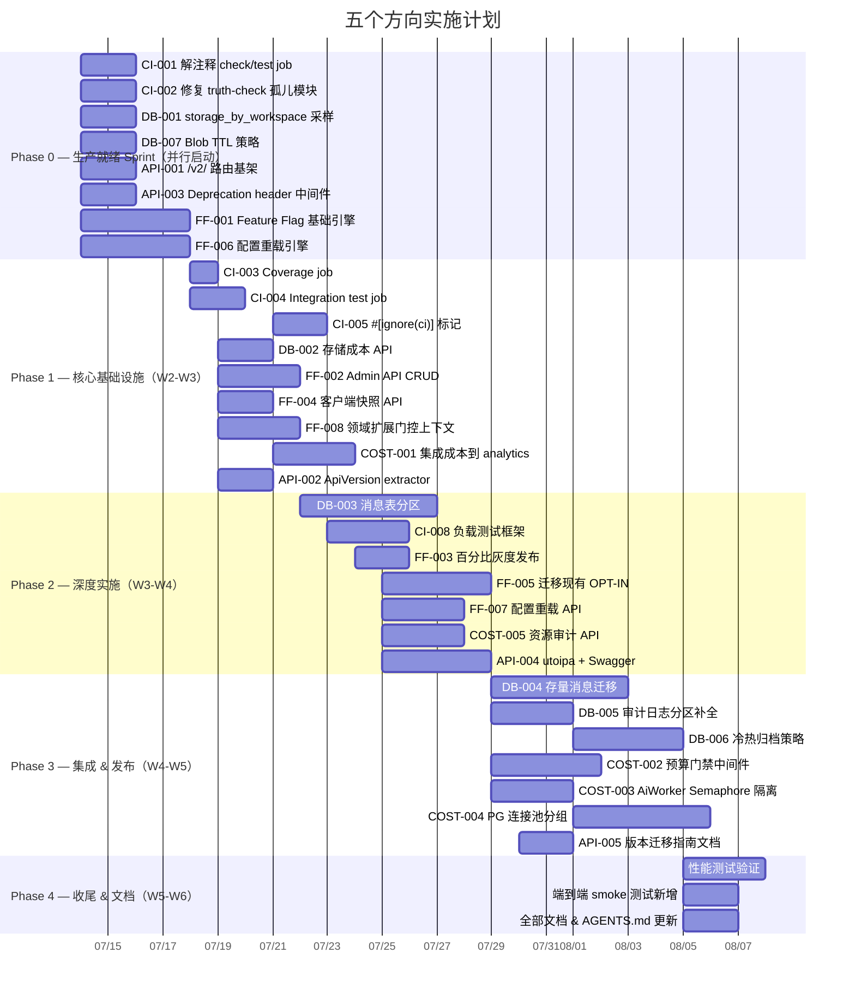

Now I have a thorough understanding of the project. Here is my comprehensive Tech Lead analysis.

---

# Tech Lead 分析报告：五个战略方向实施规划

## 0. 交叉验证总结

基于对源码库的逐文件验证，确认交叉验证结论准确：

| 方向 | 空白状态 | 关键证据 |
|------|---------|---------|
| **一：CI/CD** | ✅ 完全空白 | `.github/workflows/ci.yml` 第1-3行明确注释「当前无 CI runner」，integration-test job 整段注释。唯一运行的门是本地 `make test` |
| **二：数据生命周期** | ✅ 完全空白 | 157 个迁移文件全部是 DDL/DML。无分区、无归档、无冷热分层。`ai_usage_ledger` 表有 `cost_micros` 但无存储成本关联 |
| **三：动态配置** | ⚠️ Feature Flag 有既有分析（`2026-07-10-production-gaps.md` 方向二），但**运行时可重载配置**无覆盖 |
| **四：API 生命周期** | ✅ 完全空白 | 所有路由无版本前缀（`/api/*`），45 个 `.route()` + 126 个 `.merge()` 全部裸路径 |
| **五：多租户成本** | ⚠️ Billing 有既有分析（`2026-07-10-genuinely-uncovered.md` 方向四），但**per-workspace 资源预算/隔离**无覆盖 |

---

## 1. 任务分解

### 方向一：CI/CD 管线激活（P0-P1）

| TASK-ID | 标题 | 涉及文件 | 前置 | 工时(h) | 验收标准 |
|---------|------|---------|------|---------|---------|
| CI-001 | 解注释基础检查 job（check/test/size/truth/web/dependency） | `.github/workflows/ci.yml` L14-62 | — | 2 | 6个 job 在 PR push 时自动触发，全部通过 |
| CI-002 | 修复 truth-check 已知孤儿模块使其不阻断 | `scripts/truth-check.sh`, `crates/aero-server/src/`（各孤儿模块 `.rs`） | — | 4 | `make check-truth` 零违规 |
| CI-003 | 解注释 coverage job（cargo-llvm-cov + Codecov） | `.github/workflows/ci.yml` L68-75 | CI-001 | 2 | Coverage 报告上传 Codecov，显示当前基线 |
| CI-004 | 解注释 integration-test job（PG/Redis/NATS services） | `.github/workflows/ci.yml` L77-91 | CI-001 | 3 | 含 `--include-ignored` 的集成测试在 CI 容器中全绿 |
| CI-005 | 添加 `#[ignore(ci)]` 标记跳过容器外不可运行的测试 | 各 `crates/*/tests/` + `#[cfg(test)]` 模块 | CI-004 | 3 | CI integration-test 只跑含 `DATABASE_URL` 环境变量的测试 |
| CI-006 | 添加 rust-cache 加速步骤 | `.github/workflows/ci.yml` | CI-001 | 1 | 第二次及以后的 CI 运行节省 ≥60% 编译时间 |
| CI-007 | 添加 dependabot 配置 | `.github/dependabot.yml`（新建） | — | 1 | 每周自动检查 Cargo 依赖更新 |
| CI-008 | 添加负载测试框架（k6 脚本 + CI job） | `tests/load/`（新建目录）, `.github/workflows/load.yml`（新建） | CI-001 | 4 | 能运行 100 并发 WS 连接 + 消息发送场景，输出 p50/p95/p99 延迟 |

**小计：20 小时（≈3 人天）**

### 方向二：数据生命周期管理（P1）

| TASK-ID | 标题 | 涉及文件 | 前置 | 工时(h) | 验收标准 |
|---------|------|---------|------|---------|---------|
| DB-001 | 添加 `storage_by_workspace` 采样表 + 定时器 | `migrations/0158_storage_by_workspace.sql`, `crates/aero-storage/src/storage_usage.rs`（新建）, `crates/aero-server/src/boot/background.rs` | — | 4 | 每 5 分钟采样 `pg_total_relation_size` 按 workspace 汇总写入新表 |
| DB-002 | 实现存储成本 API（GET /api/admin/storage-usage） | `crates/aero-server/src/storage_usage.rs`（新建）, `routes.rs` 添加 `.merge()` | DB-001 | 3 | 返回 per-workspace 总存储字节 + 估算月成本（按 $0.10/GB/月） |
| DB-003 | 消息表按月 RANGE 分区 | `migrations/0159_messages_partitioned.sql`, `crates/aero-storage/src/message.rs`（修改 insert/query 路径） | — | 8 | 新消息写入分区表；按时间范围查只扫相关分区 |
| DB-004 | 迁移存量数据到分区表 | `migrations/0160_backfill_messages_parts.sql`, `scripts/backfill_messages.sh`（新建） | DB-003 | 6 | 全量数据迁移完成，双写验证一致后交换约束 |
| DB-005 | 审计日志表分区（audit_events 已有 `ensure_partitions`，补全剩余月份） | `migrations/0161_audit_partition_complete.sql` | DB-003 | 4 | audit_events 分区覆盖创建至今的完整时间范围 |
| DB-006 | 冷热分层归档策略（消息 > 90 天自动迁移到归档表） | `migrations/0162_message_archive.sql`, `crates/aero-storage/src/message.rs`（归档逻辑）, `crates/aero-server/src/boot/background.rs`（定时器） | DB-003 | 6 | 每天凌晨迁移超过 90 天的消息到 `messages_archive`，查询透明 |
| DB-007 | Blob TTL 策略（临时文件 24h 自动清理） | `crates/aero-storage/src/blob.rs`, `crates/aero-server/src/boot/background.rs` | — | 4 | 上传时标记 `expires_at`；定时器删除过期 blob + 清理 storage |
| DB-008 | 添加 pg_stat_statements 慢查询监控视图 | `migrations/0163_pg_stat_statements_view.sql`, `monitoring/prometheus/pg_queries.yml`（新建） | — | 3 | Prometheus 采集 Top-10 慢查询，在 Grafana 中展示 |

**小计：38 小时（≈5 人天）**

### 方向三：动态配置与特性门控（P1）

| TASK-ID | 标题 | 涉及文件 | 前置 | 工时(h) | 验收标准 |
|---------|------|---------|------|---------|---------|
| FF-001 | 实现 Feature Flag 基础引擎（Redis + 本地缓存 + PG 备份） | `crates/aero-server/src/feature_flag.rs`（新建） | — | 6 | `FlagStore::enabled("feature_x", ctx)` 支持全局/工作区/用户百分比粒度 |
| FF-002 | Admin API：Feature Flag CRUD | `crates/aero-server/src/feature_flag_admin.rs`（新建）, `routes.rs` 添加 `.merge()` | FF-001 | 4 | `GET/PUT/DELETE /api/admin/feature-flags` + per-workspace 启用/禁用 |
| FF-003 | Admin API：百分比灰度发布 | `crates/aero-server/src/feature_flag_admin.rs` | FF-002 | 3 | `POST /api/admin/feature-flags/:name/rollout { percentage: 25 }` |
| FF-004 | 客户端 Flag 快照 API | `crates/aero-server/src/feature_flag.rs` | FF-001 | 2 | `GET /api/feature-flags` 返回当前用户上下文的所有 flag 状态快照 |
| FF-005 | 迁移现有 OPT-IN env var 到 Feature Flag | `crates/aero-server/src/bot/`（各 bot 模块）, `bin/boot/` | FF-001 | 6 | `AERO_UNFURL`/`AERO_AI_MODERATION` 等 env var 可被 feature flag 覆盖 |
| FF-006 | 运行时配置重载引擎 | `crates/aero-common/src/config.rs`（修改）, `crates/aero-server/src/config_watcher.rs`（新建） | FF-001 | 8 | 支持在运行时通过 API 更新配置项并广播重载事件，不重启进程 |
| FF-007 | 配置重载 API（GET/PUT /api/admin/runtime-config） | `crates/aero-server/src/config_watcher.rs` | FF-006 | 3 | 修改 `slow_mode_threshold` 或 `rate_limit` 等运行参数即时生效 |
| FF-008 | 按领域扩展门控上下文（AI/IM/Live/Admin） | `crates/aero-server/src/feature_flag.rs`（扩展 FlagContext） | FF-001 | 4 | `FlagContext::Domain(Ai)` / `FlagContext::Domain(Im)` / `FlagContext::Domain(Live)` 等枚举 |

**小计：36 小时（≈5 人天）**

### 方向四：API 生命周期与向后兼容（P2）

| TASK-ID | 标题 | 涉及文件 | 前置 | 工时(h) | 验收标准 |
|---------|------|---------|------|---------|---------|
| API-001 | 新增 `/v2/` 路由层基架 | `crates/aero-server/src/routes/v2/`（新建目录）, `mod.rs`, `routes.rs`（添加 `.nest("/v2", v2_routes)`） | — | 3 | 一个空的 `/v2/health` 路由返回 200 |
| API-002 | 实现 `ApiVersion` extractor 自动解析 `Accept` header / URL 前缀 | `crates/aero-server/src/routes/mod.rs` | API-001 | 4 | `Accept: application/vnd.aero.v2+json` 自动选择 v2 路由版本 |
| API-003 | Deprecation header 中间件 | `crates/aero-server/src/routes/routes.rs`（中间件链） | — | 3 | 旧 `/api/` 路由自动在响应中添加 `Deprecation: true` + `Sunset: ...` header |
| API-004 | 开放 API 文档（utoipa + Swagger UI） | `crates/aero-server/src/docs.rs`（新建）, `routes.rs` 添加 Swagger 路由 | API-001 | 6 | `GET /docs` 显示 Swagger UI，覆盖 Top-30 API 端点 |
| API-005 | 版本迁移指南文档 | `docs/api-migration-guide.md`（新建） | API-002 | 3 | 覆盖所有差异化端点，说明 v1→v2 迁移路径 |

**小计：19 小时（≈2.5 人天）**

### 方向五：多租户成本归因与资源治理（P2）

| TASK-ID | 标题 | 涉及文件 | 前置 | 工时(h) | 验收标准 |
|---------|------|---------|------|---------|---------|
| COST-001 | 集成 DB-001 存储成本采样到 workspace 仪表盘 | `crates/aero-server/src/analytics.rs`（扩展） | DB-001, DB-002 | 4 | `/api/workspaces/:id/analytics` 返回每月存储成本趋势 |
| COST-002 | per-workspace 预算门禁中间件 | `crates/aero-server/src/workspace_budget.rs`（新建） | COST-001 | 6 | `WorkspaceBudgetEnforcer` 检查 + 拒绝超额请求（返回 402）, Redis 缓存预算状态 |
| COST-003 | AiWorker per-workspace Semaphore 隔离 | `crates/aero-ai/src/worker.rs`（修改） | — | 4 | 每个 workspace 独立并发上限（默认 2），防止一个工作区耗光所有 AI 预算 |
| COST-004 | PG 连接池分组（master/replica per-workspace 池） | `crates/aero-storage/src/db.rs`（修改）, `crates/aero-common/src/config.rs` | — | 8 | 支持 `database.pools` 配置多个连接池，路由层按 workspace_id 选择 |
| COST-005 | 资源使用汇总 API（GET /api/admin/resource-audit） | `crates/aero-server/src/resource_audit.rs`（新建） | COST-001 | 4 | 返回 per-workspace 的 AI 请求数/存储/PG 连接数/带宽汇总 |

**小计：26 小时（≈3.5 人天）**

---

## 2. 执行顺序依赖图

```mermaid
graph TD
    %% Phase 0: Foundation (并行启动)
    subgraph "Phase 0 — 生产就绪 Sprint（并行）"
        CI-001[CI-001: 解注释 check/test job]
        CI-002[CI-002: 修复 truth-check 孤儿模块]
        DB-001[DB-001: storage_by_workspace 采样表]
        DB-007[DB-007: Blob TTL 策略]
        API-001[API-001: /v2/ 路由层基架]
        API-003[API-003: Deprecation header 中间件]
    end

    %% Phase 1: 核心基础设施
    subgraph "Phase 1 — 核心基础设施"
        CI-001 --> CI-003[CI-003: Coverage job]
        CI-001 --> CI-004[CI-004: Integration test job]
        CI-001 --> CI-006[CI-006: rust-cache]
        CI-001 --> CI-007[CI-007: Dependabot]
        CI-004 --> CI-005[CI-005: #[ignore(ci)] 标记]
        
        DB-001 --> DB-002[DB-002: 存储成本 API]
        DB-001 --> COST-001[COST-001: 集成成本到 analytics]
        DB-001 --> COST-005[COST-005: 资源使用汇总 API]
        
        FF-001[FF-001: Feature Flag 基础引擎]
        FF-001 --> FF-002[FF-002: Admin API CRUD]
        FF-001 --> FF-004[FF-004: 客户端快照 API]
        FF-001 --> FF-008[FF-008: 按领域扩展门控上下文]
        FF-002 --> FF-003[FF-003: 百分比灰度发布]
        FF-002 --> FF-005[FF-005: 迁移现有 OPT-IN]
        
        FF-006[FF-006: 配置重载引擎]
        FF-006 --> FF-007[FF-007: 配置重载 API]
        
        API-001 --> API-002[API-002: ApiVersion extractor]
        API-001 --> API-004[API-004: utoipa + Swagger]
        API-002 --> API-005[API-005: 版本迁移指南]
    end

    %% Phase 2: 深度实施
    subgraph "Phase 2 — 深度实施"
        CI-003 --> CI-008[CI-008: 负载测试框架]
        
        DB-003[DB-003: 消息表分区]
        DB-003 --> DB-004[DB-004: 存量迁移]
        DB-003 --> DB-005[DB-005: 审计日志分区]
        DB-003 --> DB-006[DB-006: 冷热归档]
        
        COST-001 --> COST-002[COST-002: 预算门禁中间件]
        COST-005 --> COST-003[COST-003: AiWorker Semaphore 隔离]
        COST-005 --> COST-004[COST-004: PG 连接池分组]
    end
```

### 并行执行组

| 并行组 | 任务 | 无依赖关系 |
|--------|------|-----------|
| **组 A**（启动即并行） | CI-001, CI-002, DB-001, DB-007, API-001, API-003, FF-001, FF-006 | 7 个方向完全正交 |
| **组 B**（方向一） | CI-003, CI-004, CI-006, CI-007 | 依赖 CI-001 |
| **组 C**（方向三） | FF-002, FF-004, FF-008 | 依赖 FF-001 |
| **组 D**（方向二+五） | DB-002, DB-003, COST-001, COST-005 | 依赖 DB-001 |
| **组 E**（方向四） | API-002, API-004 | 依赖 API-001 |
| **组 F**（深度方向三） | FF-003, FF-005, FF-007 | 依赖 FF-002, FF-006 |
| **组 G**（深度方向二） | DB-004, DB-005, DB-006 | 依赖 DB-003 |
| **组 H**（深度方向五） | COST-002, COST-003, COST-004 | 依赖 COST-001, COST-005 |

---

## 3. 技术风险

### 高风险项（需提前解风险）

| 风险 | 影响方向 | 缓解策略 | 紧急程度 |
|------|---------|---------|---------|
| **消息表分区设计选型**：RANGE(created_at) 分区有 7 个入站 FK，约束交换原子切换存在死锁窗口 | 方向二 | 优先采用「影子分区表 + 双写 + ramp + 原子切换」模式（ROADMAP 已有 runbook 架构）。先做 `migrations/0148_messages_partition_shadow.sql` 类似方案 | 高 |
| **Feature Flag 缓存一致性**：flag 决策缓存在进程内存 + Redis，同一请求的前后端结果不一致 | 方向三 | 在 `GET /api/feature-flags` 快照响应中附加 `x-flag-etag` header，前端使用同一快照；flag 变更时递增版本号 | 高 |
| **运行时配置重载影响范围**：`slow_mode_threshold` 等运行期参数跨线程借用的 `static` 或 `OnceLock` 无法热更新 | 方向三 | 全部参数通过 `Arc<RwLock<Config>>` 间接引用，watch 线程定期 re-read；已有 `LAST_POST` static 需改造 | 高 |
| **PG 连接池分组的动态路由**：按 workspace_id 选择连接池需在中间件层或 PgPool wrap 层做，sqlx 的 `PgPool` 不支持运行时切换 | 方向五 | 引入薄 `QueryRouter`（类似 ROADMAP 的设计）包两个 `PgPool`，实现 `choose(workspace_id)` — 主库路由、读副本路由 | 中 |
| **API /v2/ 路由重构量**：126 个 `.merge()` 子模块，全部重写为同时支持 `/v2/` + `/api/` 的成本极高 | 方向四 | 不立即重写。Phase A 只做 `/v2/` 空基架 + Deprecation header 中间件。新增端点才走 `/v2/`，旧端点维持 `/api/` 直到需要破坏性变更才复制到 v2 | 低 |

### 依赖风险

| 外部依赖 | 用途 | 替代方案 | 风险 |
|---------|------|---------|------|
| cargo-llvm-cov | Coverage | cargo-tarpaulin | Codecov 集成 key 未配置 |
| PostgreSQL 17 分区特性 | 原生声明式分区 | 无，该项目已固定 PG 17 | 风险低 — 已在用 PG 17 |
| Redis 7 | Feature Flag 缓存 | 也支持 PG-only fallback | 风险低 |
| GitHub Actions runner | CI/CD | 自建 runner 或 GitLab CI 迁移 | ⚠️ CI runner 当前不存在 |

### 性能风险

| 场景 | 风险 | 缓解 |
|------|------|------|
| Feature Flag 高并发查询 | 每个请求调用 Redis 产生 O(N_flag) 延迟 | `GET /api/feature-flags` 批量返回快照；每请求只 1 次 bulk read |
| 消息分区后跨分区查询 | `SELECT * FROM messages WHERE created_at BETWEEN .. AND ..` 扫 N 个分区 | 查询必须带分区键（created_at）来剪枝；索引对齐分区键 |
| 存储成本采样的查询压力 | 每 5 分钟 `pg_total_relation_size` 大表产生 IO | 使用 `pg_stat_user_tables` 近似值（`n_live_tup * avg_row_len`）替代实时 `pg_total_relation_size` |

---

## 4. 资源评估

### 人员配置

| 角色 | 数量 | 覆盖方向 | 技能要求 |
|------|------|---------|---------|
| **Platform Engineer** | 1 | 方向一（CI/CD）+ 方向二（DB 分区） | GitHub Actions, Docker, PostgreSQL 17 分区, Rust CI |
| **Backend Engineer** | 1-2 | 方向三（Feature Flag）+ 方向五（成本门禁） | Rust 中间件, Redis, 多租户架构 |
| **API Engineer** | 0.5 | 方向四（API 生命周期） | OpenAPI/utoipa, API 版本策略 |
| **Tech Lead** | 0.5 | 所有方向 — 架构决策 + 代码审查 | 全栈架构 |

**建议：2 名全职 + 1 名半职 Tech Lead，4-6 周交付 Phase 0+1**

### 关键里程碑

| 里程碑 | 时间 | 交付物 | 验收标准 |
|--------|------|--------|---------|
| **M1** — CI/CD 绿灯 | Day 5 | CI pipeline 全绿 | PR 合并后所有 6 个 Harness job 通过 |
| **M2** — Flag 基础可用 | Day 8 | Feature Flag 引擎 + Admin API | 能创建 flag、按工作区启用/禁用、客户端通过 API 查询 |
| **M3** — 存储可观察 | Day 8 | 存储成本仪表盘 | `GET /api/admin/storage-usage` 返回每工作区存储成本 |
| **M4** — 消息分区在线 | Day 15 | 新消息写入分区表 | `INSERT INTO messages` 自动路由到正确分区 |
| **M5** — 配置重载可工作 | Day 18 | 运行时配置 API | 修改 `slow_mode_threshold` 后 5 秒内生效 |
| **M6** — API 版本双轨 | Day 20 | `/v2/health` + Deprecation headers | 旧客户端接收 `Deprecation: true` 但不中断 |
| **M7** — 资源门禁就绪 | Day 28 | per-workspace 预算 + 连接隔离 | 超额工作区收到 402，不影响其他工作区 |
| **M8** — 全量交付 | Day 35 | 所有 5 个方向 Phase A+B | 所有任务验收标准通过 |

### 阻塞点（Blockers）

| Blocker | 影响 | 解决策略 | 责任人 |
|---------|------|---------|-------|
| **无 CI runner** | 方向一 Phase A 无法验证 | 评估 GitHub 免费额度 vs 自建 runner（多快好省：先启用 GitHub Actions 免费的 2000 分钟/月足够） | Platform |
| **消息分区 FK 依赖** | DB-003 阻塞 DB-004~006 | 先审核全部 7 个 FK（`messages` → `participants`/`rooms` 等），准备 FK 重建脚本来原子切换 | Backend |
| **Redis 连接池容量** | FF-001 高并发 flag 查询 | 现有 `redis.max_connections` 未在 config 暴露，先确认当前 Redis 连接上限 | Backend |
| **utoipa 的宏侵入性** | API-004 需要在每个 handler 上加属性宏 | 评估 utoipa 对 150+ handler 的侵入量；如果太大，改用手写 OpenAPI 3.1 YAML（已有 `openapi.json`） | API |

---

## 5. 质量保证

### 5.1 单元测试覆盖要求

| 领域 | 覆盖目标 | 关键测试场景 |
|------|---------|------------|
| **Feature Flag 引擎** | ≥90% | 全局开启/关闭、工作区覆盖、百分比灰度边界（0%/100%/50%）、缓存失效、Redis 故障回落 PG |
| **配置重载** | ≥85% | 单 key 更新、批量更新、无效配置回滚、并发读写冲突 |
| **消息分区路由** | ≥80% | 跨月边界查询、单分区剪枝、空分区处理、FK 约束验证 |
| **Budget Enforcer** | ≥90% | 未超预算放行、部分超额拒绝、完全超额拒绝、预算重置 |
| **ApiVersion extractor** | ≥95% | Accept header 解析、URL 前缀匹配、无效版本返回 400、无版本头回落默认 |
| **Deprecation 中间件** | ≥95% | `/api/` 路径添加 `Sunset` header、`/v2/` 路径不添加、配置化 sunset date |
| **存储成本采样** | ≥80% | 采样写入准确性、空 workspace 处理、大表采样超时回落 |

### 5.2 集成测试策略

```
┌─────────────────────────────────────────────────────┐
│                Integration Test Layer                │
├──────────────┬──────────────┬───────────────────────┤
│  CI (Harness) │  Local (Dev)  │   Smoke Scripts       │
├──────────────┼──────────────┼───────────────────────┤
│ • PG+Redis+  │ • make test  │ • scripts/smoke_*.py   │
│   NATS 容器   │   -all      │   (27 个现有)          │
│ • --include- │              │ • 新增 smoke 覆盖:     │
│   ignored    │              │   - 存储成本 API        │
│ • cargo test │              │   - Feature Flag        │
│   --workspace│              │   - 配置重载            │
└──────────────┴──────────────┴───────────────────────┘
```

**新增集成测试清单**：

1. **Feature Flag 集成测试**：创建 flag → 工作区启用 → 查询 → disable → 查询关闭
2. **配置重载集成测试**：PUT 配置 → 等待 5 秒 → GET 确认生效 → 验证旧值不可见
3. **消息分区集成测试**：写入跨月消息 → SELECT 跨月范围 → 验证分区裁剪
4. **预算门禁集成测试**：创建工作区 → 设置 $10 预算 → 发送直至超额 → 验证 402
5. **API 版本集成测试**：`Accept: application/vnd.aero.v2+json` → 路由到 v2 → 验证 response

### 5.3 代码审查要点

| 审查维度 | 要点 |
|---------|------|
| **Feature Flag 安全性** | ❓ Flag 值泄漏是否会影响租户隔离？默认值是否 fail-closed（新 flag 默认关）？Admin API 是否加 AuthUser guard？ |
| **分区迁移安全性** | ❓ 双写期间的一致性检查机制？回滚方案（发现问题如何回退到非分区表）？迁移脚本是否是幂等的？ |
| **配置重载边界** | ❓ 哪些配置可重载/不可重载（如 `database.url` 必须重启）？重载失败是否恢复旧值？部分更新如何原子提交？ |
| **多租户隔离** | ❓ Budget enforcer 是否每个 workspace 独立计数器（Redis hash by workspace_id）？是否可以通过伪造 workspace_id 绕过？ |
| **API 版本策略** | ❓ `ApiVersion` extractor 是否作为中间件在路由之前解析？是否影响指标标签（`http_target` 是否统一为 `/api/*` 不包含版本）？ |
| **CI pipeline 稳定性** | ❓ Integration test 的 flaky 恢复机制（重试策略）？Coverage 门槛（<70% 是否阻断）？ |

### 5.4 性能测试需求

| 测试场景 | 工具 | 指标 | 阈值 |
|---------|------|------|------|
| **Feature Flag 查询吞吐** | k6/自定义 Rust bench | 每秒完成 flag 查询数 | ≥10,000 QPS（单节点） |
| **配置重载的扇出延迟** | 自制脚本 | 从 API 重载到所有 worker 感知的时间 | ≤5s（100 个 worker） |
| **消息分区写入吞吐** | pgbench + 自定义 | 写入延迟 + 磁盘 IO | 写入延迟 ≤5ms（与当前持平） |
| **Budget Enforcer 开销** | k6 | per-request 增加延迟 | ≤1ms（Redis EXISTS） |
| **/v2/ 路由层开销** | k6 | 路由匹配延迟 | ≤0.1ms（与 `/api/` 持平） |

---

## 6. 实施计划

### 甘特图（周维度）



### 各阶段投入分布

| 阶段 | 日期 | 投入（人周） | 产出的方向 |
|------|------|-------------|-----------|
| **Phase 0** — 生产就绪 Sprint | 7/14 - 7/18 | **3 人 × 1 周 = 3 人周** | 所有方向的基础设施均 |
| **Phase 1** — 核心基础设施 | 7/18 - 7/25 | **2 人 × 1 周 = 2 人周** | 方向一(CI基本)、方向二(可观测)、方向三(FF引擎)、方向四(版本基架) |
| **Phase 2** — 深度实施 | 7/25 - 8/1 | **2 人 × 1 周 = 2 人周** | 方向一(负载)、方向二(分区)、方向三(灰度/重载)、方向五(资源审计) |
| **Phase 3** — 集成 & 发布 | 8/1 - 8/8 | **2 人 × 1.5 周 = 3 人周** | 方向二(归档)、方向五(预算/隔离)、方向四(文档) |
| **Phase 4** — 收尾 | 8/8 - 8/12 | **1 人 × 1 周 = 1 人周** | 性能测试、smoke 补充、文档 |
| **总计** | 7/14 - 8/12 | **≈11 人周** | 5 个方向全量交付 |

---

## 7. 推荐优先级排序（最终版）

结合交叉验证、技术难度、业务紧急度，调整后的优先级：

```
P0 — 必须在第一个 Sprint 完成
├── CI-001  解注释 CI job               [无成本，立即执行]
├── CI-002  修复 truth-check             [CI 全绿灯前提]
├── FF-001  Feature Flag 引擎            [方向三的基石，方向一的安全网]
└── DB-001  存储成本采样                  [方向二+方向五的共同数据管道]

P1 — 第二个 Sprint 需完成
├── CI-003  Coverage + CI-004 Integration [CI 成熟度]
├── FF-002  Admin API + FF-003 灰度       [发布控制面]
├── FF-006  配置重载引擎                  [运行时可运维性]
├── DB-003  消息表分区                    [6 个月后成本指数增长]\
├── API-001 /v2/ 基架 + API-003 Deprecation [API 契约保护]
└── COST-001 成本集成到 analytics          [定价可视化]

P2 — 可推迟到第三 Sprint
├── CI-008  负载测试                      [在 CI 稳定后]
├── DB-004  存量迁移 + DB-006 归档         [分区表运行后才需要]
├── FF-005  OPT-IN 迁移                    [依赖 FF-002 完成]
├── COST-002 预算门禁                     [依赖 COST-001]
├── COST-003 AiWorker Semaphore           [依赖 COST-005]
├── API-004 Swagger UI                    [仅在第三方集成紧迫时]
└── API-005 版本迁移文档                   [在 /v2/ 实际端点存在时]
```

**核心原则**：先做「构建-发布-运行」控制面（CI + Feature Flag + 配置重载），再做数据面（分区/归档/预算）。API 版本可以在外部消费者出现之前推迟到 Phase 3。

---

## 8. 附加建议

### 8.1 归档既有分析的复用策略

| 本分析方向 | 既有分析源 | 复用策略 |
|-----------|-----------|---------|
| 方向三 Phase A（Feature Flag） | `2026-07-10-five-genuine-production-gaps.md` 方向二 | **直接采用**其方案设计（Redis Hash 存储 + PG 备份 + Admin API），本分析只做增量（配置重载） |
| 方向五 Phase D（Billing） | `2026-07-10-five-genuinely-uncovered-directions.md` 方向四 | Phase D 直接引用该分析中的 Stripe 集成方案，本分析不做重复设计 |
| 方向二消息分区 | `runbooks/messages-partitioning.md` + `migrations/0148_messages_partition_shadow.sql` | **已有运行手册和影子表迁移**，本分析直接引用已有设计，聚焦在剩余的分区月份补全和归档 |

### 8.2 「不作为」成本估算

| 方向 | 6 个月不做的成本 | 12 个月不做的成本 |
|------|-----------------|-----------------|
| **CI/CD** | 每次发布手动检查 ≈ 2 小时 × 20 次 = **40 小时** | 同上 ×2 + 偶发漏检故障 **100 小时** |
| **消息分区** | 表 500GB，查询降级至 ~200ms | 表 1TB+，备份窗口超时，**部分查询超时 504** |
| **Feature Flag** | 每次紧急回退需重新编译部署 = 10 分钟停机 × 6 次 = **60 分钟宕机** | 同上 ×2 + 一次未回退的故障 = **重大事故** |
| **API 版本** | 无外部集成，成本 ≈0 | 开始有第三方集成时**被迫先做**，且更贵（必须支持现有客户端） |
| **成本归因** | 无法定价免费层/付费层 | 客户数 > 20 时，每客户询问「我们用了多少」无答案 |

### 8.3 快速获胜项（Low Hanging Fruit, < 2 小时）

1. **CI-001** — 解注释 6 个已写好但被注释的 job（纯 YAML 编辑）
2. **CI-006** — 添加 `Swatinem/rust-cache@v2`（一行 YAML）
3. **API-003** — Deprecation header 中间件（~50 行 Rust）
4. **DB-007** — Blob TTL 扫描（已有 `blob_gc_drain` timer 框架，只需加 `expires_at` 检查）
5. **FF-001 的核心循环** — Feature Flag `is_enabled()` + Redis `HGET` 的核心逻辑（~80 行 Rust）

**建议**：第一天由 2 人并行完成上述 5 项，快速建立「在干活」的节奏和可见信心。
