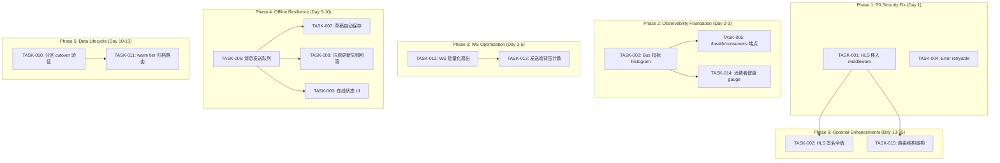
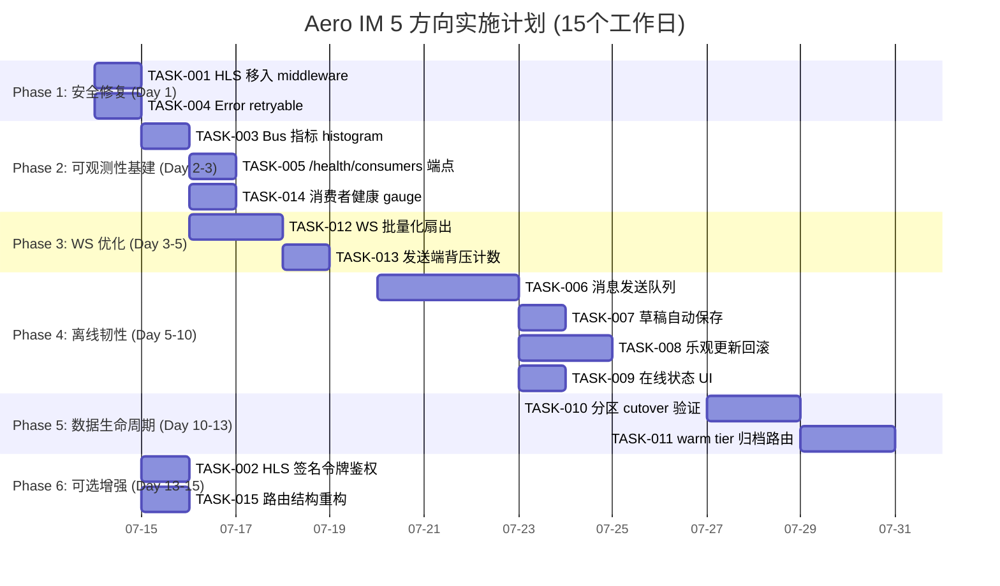

Now I have all the data needed for a thorough analysis. Here is my Tech Lead assessment:

---

# Tech Lead 分析报告：Aero IM 代码验证 5 方向实施计划

## 0. 验证确认总结

基于源码验证，以下是确认与修正的快速对照：

| 报告断言 | 验证结果 | 关键发现 |
|---------|---------|---------|
| HLS 在 middleware 前 | ✅ 确认 | `serve.rs:111` `.nest_service("/hls")` 确实在 `.layer(middleware)` 前 |
| WS 已有 resync 框架 | ✅ 确认 | `hub.rs` 有 `RESYNC_FRAME`、`lossy: AtomicBool`、`disconnect_on_full` |
| 无 bus 指标 | ✅ 确认 | `metrics.rs` / `metrics_tasks.rs` 无 bus 相关 histogram/counter |
| Error 仅 Internal | ❌ 修正 | 实际 9 变体，缺 `retryable` 维度 |
| push `unwrap` 误报 | ✅ 确认误报 | 行 331 `unwrap_or_default()` 安全，所有 `unwrap` 在 `#[cfg(test)]` |
| 无分区方案 | ❌ 修正 | `0148_messages_partition_shadow.sql` 已建影子分区 + 2 函数 |
| WS 重连已完成 | ✅ 确认 | `closedByUser`、`_lastSeen`、`_seqGate` 均已实现 |
| 无乐观发送 | ✅ 确认 | `optimisticAdd` 仅有本地临时渲染，不持久化 |
| 无离线队列 | ✅ 确认 | 无 IndexedDB / localStorage sendQueue |
| 无草稿持久化 | ✅ 确认 | localStorage 仅 token |

---

## 1. 任务分解

### TASK-001: HLS 路由移入中间件栈

| 字段 | 内容 |
|------|------|
| **所属方向** | 方向一：HLS 防盗链与流保护 |
| **涉及文件** | `crates/aero-server/src/bin/boot/serve.rs` (行 109-113) |
| **前置依赖** | 无 |
| **预估工时** | 0.5 小时（纯行移动） |
| **验收标准** | 1. `.nest_service("/hls")` 位于 `.layer(middleware)` 之后<br>2. `cargo check --workspace` 通过<br>3. 启动后 `curl -v http://localhost:3030/hls/...` 返回 middleware 头（`x-request-id`、CORS 等） |
| **风险** | 无——纯代码重排，逻辑不变 |

### TASK-002: HLS 签名令牌鉴权（可选增强）

| 字段 | 内容 |
|------|------|
| **所属方向** | 方向一：HLS 防盗链与流保护 |
| **涉及文件** | `crates/aero-server/src/bin/boot/serve.rs`、新增 `crates/aero-server/src/hls_auth.rs` |
| **前置依赖** | TASK-001 |
| **预估工时** | 3 小时 |
| **验收标准** | 1. 新增中间件：校验 `/hls/*` 请求的 `?token=` 查询参数（HMAC-SHA256 签名，含路径+过期时间）<br>2. 无 token 或签名无效 → 403<br>3. 报告所称「复用既有 HMAC」需确认 `aero-common` 中有 `hmac` 依赖——需 `cargo add` 到 `aero-server` |
| **风险** | 低——标准 HMAC 模式，可参考 `aero-storage/webhook::generate_token` |

### TASK-003: 为 `run_bus_listener` 添加 per-subject 处理延迟 histogram

| 字段 | 内容 |
|------|------|
| **所属方向** | 方向五：错误分类体系与消费者健康可观测 |
| **涉及文件** | `crates/aero-server/src/metrics.rs`、`crates/aero-common/src/metrics/names.rs` |
| **前置依赖** | 无 |
| **预估工时** | 3 小时 |
| **验收标准** | 1. 新增 `aero_bus_process_latency_seconds` histogram（buckets: 0.001, 0.005, 0.01, 0.05, 0.1, 0.5, 1, 5）<br>2. 新增 `aero_bus_messages_total` counter（labels: `subject`, `result`=`ok|error`）<br>3. 在 `crates/aero-server/src/bin/boot/bus.rs`（或 `background.rs`）的 `run_bus_listener`/`run_live_bus_listener` 入口添加 timing<br>4. `GET /metrics` 可查到新指标 |

### TASK-004: 为 `Error` 添加 `retryable()` 方法 + `Unavailable` variant

| 字段 | 内容 |
|------|------|
| **所属方向** | 方向五：错误分类体系与消费者健康可观测 |
| **涉及文件** | `crates/aero-common/src/error.rs` |
| **前置依赖** | 无 |
| **预估工时** | 2 小时 |
| **验收标准** | 1. 新增 `Unavailable(String)` variant（替代原 `Upstream` 在超时场景的使用）<br>2. 实现 `pub fn retryable(&self) -> bool`：`Upstream`/`Database`/`Unavailable`→`true`，`Invalid`/`Forbidden`/`NotFound`→`false`，其余 `false`<br>3. 现有 `status_code()` 覆盖新 variant<br>4. `cargo test` 新增单元测试覆盖 |
| **风险** | 需检查所有 `match` 臂对 `Error` 的处理是否遗漏新 variant（可用 `#[non_exhaustive]` 或 clippy `--deny ` matching） |

### TASK-005: 新增 `GET /health/consumers` 端点

| 字段 | 内容 |
|------|------|
| **所属方向** | 方向五：错误分类体系与消费者健康可观测 |
| **涉及文件** | 新增 `crates/aero-server/src/health_consumers.rs`、修改 `crates/aero-server/src/routes/routes.rs` |
| **前置依赖** | TASK-003（可选——无指标也可返回 basic 状态） |
| **预估工时** | 3 小时 |
| **验收标准** | 1. `GET /health/consumers` 返回 JSON：各 consumer 的订阅 subject、最后处理时间、处理消息总数、lag 估算<br>2. 需要 NATS JetStream consumer info 查询（`async-nats` `consumer.info()`）<br>3. 端点返回 200（正常）/503（某 consumer 长时间无活动） |
| **风险** | 需暴露 NATS `JetStream` 引用到 health handler——目前 `AppState` 已有 `jetstream` 吗？需验证 |

### TASK-006: 实现 Web 端消息发送队列

| 字段 | 内容 |
|------|------|
| **所属方向** | 方向三：客户端离线韧性 |
| **涉及文件** | `web/ws.js`、`web/app.js` |
| **前置依赖** | 无 |
| **预估工时** | 5 小时 |
| **验收标准** | 1. `ws.js` 添加 `sendQueue: []`——WebSocket 断开时排队，`navigator.onLine` + `ws.onopen` 触发排空<br>2. `sendMessage` / `sendMarkdown` 在 `send()` 返回 `false` 时入队<br>3. 队列上限 50 条（防止离线无限堆积）<br>4. 重连后按序发送<br>5. 每条消息有 `pendingId` 去重（防重连后重复发送）<br>6. `localStorage` 持久化队列（`queueKey = 'msg_queue_' + state.me.id`） |
| **风险** | 中等——需处理多 tab 冲突、队列顺序、未登录时清空 |

### TASK-007: 实现草稿自动保存

| 字段 | 内容 |
|------|------|
| **所属方向** | 方向三：客户端离线韧性 |
| **涉及文件** | `web/app.js`、`web/context.js` |
| **前置依赖** | TASK-006 |
| **预估工时** | 2 小时 |
| **验收标准** | 1. 输入框内容变化 → `debounce(500)` → `localStorage.setItem('draft_' + roomId, text)`<br>2. 切换房间 → 恢复对应 draft<br>3. 发送成功 → 清除 draft<br>4. 页面加载 → 恢复当前房间 draft |
| **风险** | 低 |

### TASK-008: 添加乐观更新失败回滚机制

| 字段 | 内容 |
|------|------|
| **所属方向** | 方向三：客户端离线韧性 |
| **涉及文件** | `web/app.js` |
| **前置依赖** | TASK-006 |
| **预估工时** | 3 小时 |
| **验收标准** | 1. `optimisticAdd` 的 pending 消息在服务器确认（通过 `seq` 或 `message` 事件）后替换为真实消息<br>2. 设置超时 30s——超时后标记为红色「发送失败」+ 提供「重试」/「删除」按钮<br>3. `state.pendingByTempId` 已有基础，需加超时机制<br>4. 失败消息保留在 UI 中直到用户清除，不静默消失 |
| **风险** | 低～中——与消息去重 `_seqGate` 的交互需谨慎 |

### TASK-009: 实现 `navigator.onLine` 监听 + UI 状态指示

| 字段 | 内容 |
|------|------|
| **所属方向** | 方向三：客户端离线韧性 |
| **涉及文件** | `web/app.js` |
| **前置依赖** | TASK-006 |
| **预估工时** | 1.5 小时 |
| **验收标准** | 1. `window.addEventListener('online', ...)` / `window.addEventListener('offline', ...)`<br>2. 离线时在输入框上方显示黄色横幅「离线中，消息将在恢复连接后发送」<br>3. 在线但 WS 未连时显示「重新连接中…」（已有自动重连逻辑，仅缺 UI）<br>4. 队列排空后横幅消失 |
| **风险** | 低 |

### TASK-010: 执行消息分区 Step C Cutover（测试环境）

| 字段 | 内容 |
|------|------|
| **所属方向** | 方向四：消息数据生命周期管理 |
| **涉及文件** | 无源代码更改——仅数据库操作 + 验证脚本 |
| **前置依赖** | 无（影子表已存在） |
| **预估工时** | 6 小时（含验证 + 回滚预案测试） |
| **验收标准** | 1. 在 throwaway 数据库执行 `docs/runbooks/messages-cutover.sql`（已验证的可执行脚本）<br>2. row parity、FK integrity、partition routing、FTS、indexes 完全验证（对照 §5 清单）<br>3. 生产生产维护窗口计划文档化 |
| **⚠️ 红线** | 此任务只在隔离的测试数据库执行，不得触碰生产 `messages` 表。<br>**另注**：0148 的 `backfill_messages_partition` 函数漏了 3 个 MLS 列（`mls_group_id`、`mls_epoch`、`mls_payload`），cutover 脚本的 full-column final sync 必须补上（见 runbook §2 Step C ⚠️） |

### TASK-011: 实现 warm tier 归档路由

| 字段 | 内容 |
|------|------|
| **所属方向** | 方向四：消息数据生命周期管理 |
| **涉及文件** | `crates/aero-storage/src/message/archive.rs`（新增） |
| **前置依赖** | TASK-010 |
| **预估工时** | 5 小时 |
| **验收标准** | 1. 新增 `MessageArchiver`：按月级别将已分区且超过 N 个月的旧分区 DETACH → 压缩 → 存至 blob_store（或 S3）<br>2. 对已归档消息的查询降级到 blob store 或直接返回「消息已归档」<br>3. 文档化归档策略（保留期、恢复流程） |
| **风险** | 中——归档查询路径的性能退化需明确约定 |

### TASK-012: WS 批量化扇出（方向二核心）

| 字段 | 内容 |
|------|------|
| **所属方向** | 方向二：WS 传输优化 |
| **涉及文件** | `crates/aero-server/src/hub.rs` |
| **前置依赖** | 无 |
| **预估工时** | 4 小时 |
| **验收标准** | 1. 在 `bus.rs`/`hub.rs` 中实现帧批量化：收集同一 subject 的连续小帧（< 1KB），打包成单个 WebSocket 消息（JSON 数组）<br>2. 可配置的最大批大小（默认 5）和最大等待时间（默认 10ms）<br>3. 客户端 `ws.js` 适配：识别 JSON 数组并依次分发到事件处理<br>4. 性能对比：批量/非批量模式下 `GET /metrics` 的 `aero_ws_bytes_sent_total` 应降低帧头开销 |
| **风险** | 中——批量化增加延迟（等待时间），需在生产可配置/可关闭；客户端需要加数组路径的分发 |

### TASK-013: 添加发送端背压的 Prometheus 计数

| 字段 | 内容 |
|------|------|
| **所属方向** | 方向二：WS 传输优化 |
| **涉及文件** | `crates/aero-server/src/hub.rs`、`crates/aero-server/src/metrics.rs` |
| **前置依赖** | TASK-012（可选，计数可独立实现） |
| **预估工时** | 2 小时 |
| **验收标准** | 1. 新增 `aero_ws_fanout_dropped_total` counter（labels: `reason`=`full|closed`）<br>2. 在 hub.rs `fan_out_arc_inner` 的 `TrySendError::Full` 和 `Closed` 分支递增<br>3. 新增 `aero_ws_connections_active` gauge（现有 `conns` 大小） |
| **风险** | 低 |

### TASK-014: 添加消费者健康仪表盘

| 字段 | 内容 |
|------|------|
| **所属方向** | 方向五：错误分类体系与消费者健康可观测 |
| **涉及文件** | `crates/aero-server/src/bin/boot/metrics_tasks.rs` |
| **前置依赖** | TASK-003 |
| **预估工时** | 2 小时 |
| **验收标准** | 1. `metrics_tasks.rs` 新增 30s 周期定时器：查询 `run_bus_listener` 和 `run_live_bus_listener` 的 last-processed-timestamp<br>2. 暴露 `aero_bus_consumer_last_processed_timestamp_seconds` gauge<br>3. 若某 consumer 超过 60s 无活动则日志警报 |

### TASK-015: 重构 `serve.rs` 路由结构以支持 HLS 签名认证（如果走 middleware 方案）

| 字段 | 内容 |
|------|------|
| **所属方向** | 方向一：HLS 防盗链与流保护 |
| **涉及文件** | `crates/aero-server/src/bin/boot/serve.rs` |
| **前置依赖** | TASK-001 |
| **预估工时** | 3 小时 |
| **验收标准** | 1. `middleware` 层拆分为「全局中间件」和「HLS 中间件」<br>2. HLS 路径首先通过 `middleware`（注入 request-id、CORS、限流），然后通过自定义 `hls_auth` 中间件<br>3. `/hls` 保持在 `serve.rs` 层，不混入 `routes::build()` |
| **风险** | 低——仅 axum Router 嵌套调整 |

---

## 2. 执行顺序与依赖图



**可并行执行的任务组：**
- **组 A**（完全无依赖）：TASK-001、TASK-003、TASK-004、TASK-006、TASK-012
- **组 B**（依赖 T001）：TASK-002、TASK-015
- **组 C**（依赖 T003）：TASK-005、TASK-014
- **组 D**（依赖 T006）：TASK-007、TASK-008、TASK-009
- **组 E**（依赖 T010）：TASK-011

---

## 3. 技术风险

### 高风险

| 风险 | 影响任务 | 描述 | 缓解策略 |
|------|---------|------|---------|
| **分区 cutover 的 MLS 列断裂** | TASK-010 | `backfill_messages_partition` 漏了 3 个 MLS 列。如果 cutover 脚本的全量 final sync 不补这些列，E2E 加密消息将丢失 | 在 cutover 脚本的 `INSERT ... SELECT *` 中确保使用 `*`（通配列），而非显式列清单。测试需包含一条 MLS 加密消息 |
| **WS 批量化增加延迟** | TASK-012 | 批量等待时间（默认 10ms）为慢速连接增加了额外延迟，对弹幕等低延迟场景不可接受 | 批量化必须可配置且默认关闭；对 `live.stream.*` 事件禁用批量；或者按帧大小触发（>2KB 直接发送） |
| **离线队列与去重冲突** | TASK-006 | 离线排队消息在重连后被 `_seqGate` 去重误判为重复 | 本地 pending 消息不使用 `seq`（服务器未分配），去重逻辑需跳过 pendingId 匹配真实 id |

### 中风险

| 风险 | 影响任务 | 描述 | 缓解策略 |
|------|---------|------|---------|
| **多 tab 离线队列竞争** | TASK-006 | 两个浏览器 tab 各自维护 `localStorage` 队列，发送造成乱序或重复 | `BroadcastChannel` API 协调；或简单的方案：只在一个 tab 发（localStorage 加写锁 + `storage` 事件监听） |
| **HNSW 索引构建时间** | TASK-010 | 在百万行 shadow 表上构建 HNSW 索引（`vector_cosine_ops`）可能耗时数十分钟 | 在维护窗口开始前预构建（shadow 表已 backfill 完毕但索引未建时构建），仅最后一步 cutover 需要锁 |
| **归档查询路由性能** | TASK-011 | DETACH 后的分区不能直接查询，通过 blob store 检索延迟显著 | 设计明确：归档消息的搜索默认不包含，仅当用户主动「搜索归档」时降级。告知用户预期延迟（~秒级 vs 毫秒级） |

### 低风险

| 风险 | 影响任务 | 描述 | 缓解策略 |
|------|---------|------|---------|
| **NATS consumer.info 接口** | TASK-005 | `async-nats` 是否暴露 `consumer.info()`？需确认 JetStream 的 consumer 管理 API | 如不可用，fallback 到进程级别最后处理时间记录 |
| **乐观更新竞态** | TASK-008 | 服务端返回消息前用户刷新页面，pending 消息丢失 | `optimisticAdd` 持久化到 `localStorage`（`pending_' + roomId`），页面加载时检查并恢复（从 `_pending_` 前缀的 localStorage key） |
| **HLS 令牌 HMAC 密钥管理** | TASK-002 | 签名密钥硬编码或配置不当 | 从 `AERO_HLS_SECRET` 环境变量读取，与 `webhook.py` 同一模式 |

---

## 4. 资源评估

### 团队规模与技能要求

| 角色 | 人数 | 所需技能 | 负责任务 |
|------|------|---------|---------|
| **后端 Rust 工程师** | 1-2 | Rust + tokio + axum + NATS JetStream + Prometheus metrics | TASK-001/002/003/004/005/012/013/014/015 |
| **前端工程师** | 1 | ES2020 + WebSocket + localStorage + DOM | TASK-006/007/008/009 |
| **DBA / 运维** | 0.5 | PostgreSQL + partition cutover + 索引构建 | TASK-010/011 |
| **QA 工程师** | 1 | 集成测试 + 性能测试 | 所有任务的一体化测试 |

### 关键里程碑

| 里程碑 | 时间节点 | 交付物 | 验收条件 |
|--------|---------|--------|---------|
| **M1: 安全修复** | Day 1 | TASK-001 (0.5h) + TASK-004 (2h) | HLS 有 middleware 保护；Error 有 retryable |
| **M2: 可观测性就绪** | Day 2-3 | TASK-003 (3h) + TASK-005 (3h) + TASK-014 (2h) | Grafana 可查 bus 延迟 + 消费者健康；`/health/consumers` 返回详细状态 |
| **M3: 离线韧性核心** | Day 5-6 | TASK-006 (5h) + TASK-007 (2h) | 离线发消息不丢，重连后自动发送；草稿自动保存 |
| **M4: 离线韧性完整** | Day 7-8 | TASK-008 (3h) + TASK-009 (1.5h) | 失败消息 UI 提示用户重试；在线离线横幅 |
| **M5: WS 优化** | Day 8-10 | TASK-012 (4h) + TASK-013 (2h) | 批量化可配置，背压计数可查 |
| **M6: 分区验证** | Day 11-13 | TASK-010 (6h) + TASK-011 (5h) | cutover 脚本在测试库验证通过；归档路由可工作 |
| **M7: 可选增强** | Day 13-15 | TASK-002 (3h) + TASK-015 (3h) | HLS token 鉴权；路由结构整洁 |

### 阻塞点与解决策略

| 阻塞点 | 影响 | 解决策略 |
|--------|------|---------|
| **`backfill_messages_partition` 漏 MLS 列** | TASK-010 | 在 cutover 脚本的 final sync 处用 `SELECT *` 替代显式列清单。同时在 0148 的备份中增加一个补丁迁移修复函数（加 MLS 列），不要改已应用的 0148 |
| **客户端 `ws.js` 的 `SeqGate` 与离线队列交互** | TASK-006/008 | 在 `send()` 端为本地 pending 消息添加 `_local: true` 标记，`SeqGate.accept` 对 `_local` 消息始终返回 `true` |
| **`async-nats` 未暴露 consumer info API** | TASK-005 | `cargo doc --open` 确认后，改用进程级 `Instant::now()` 记录最后处理时间，返回 basic 健康状态 |

---

## 5. 质量保证

### 单元测试覆盖要求

| 任务 | 最低覆盖率要求 | 关键测试场景 |
|------|--------------|-------------|
| TASK-001 | 无（纯重排） | 启动后 curl /hls 验证 middleware 触发 |
| TASK-002 | 85% | 签名生成、过期 token 拒绝、非法签名拒绝、HMAC 密钥不匹配 |
| TASK-003 | 80% | histogram 记录、counter 递增、label 正确性 |
| TASK-004 | 95% | 每个 variant 的 `retryable()` 返回值正确；`match` 臂完整性 |
| TASK-005 | 70% | 返回 JSON schema；consumer 无活动时返回 503 |
| TASK-006 | 80% | 离线入队、重连后排空、队列上限、多 tab 隔离（mock localStorage） |
| TASK-007 | 70% | 输入变化触发的 debounce 保存、切换房间恢复、发送后清除 |
| TASK-008 | 80% | pending 消息超时 UI、重试按钮触发重新发送、删除清除 |
| TASK-009 | 60% | online/offline 事件触发横幅显示/隐藏 |
| TASK-010 | 外部验证 | 无单元测试——用 throwaway DB 全量验证 runbook 清单 |
| TASK-011 | 80% | DETACH 操作、归档文件生成、归档消息降级查询 |
| TASK-012 | 85% | 批大小限制、等待时间超时触发、大帧旁路批量化、客户端数组分发 |
| TASK-013 | 90% | Full/Closed 计数正确 |
| TASK-014 | 70% | gauge 值更新、60s 无活动警报 |
| TASK-015 | 无 | 路由行为与重构前一致（请求转发测试） |

### 集成测试策略

| 测试级别 | 工具 / 方法 | 覆盖方向 |
|----------|------------|---------|
| **Rust 单元测试** | `cargo test --lib` | TASK-002/003/004/011/012/013/014 |
| **Rust 集成测试** | `cargo test --test '*'` | 方向二（hub 批量化/背压）、方向五（错误分类） |
| **Web 端测试** | `npx eslint` + 手动浏览器测试 | 方向三（离线队列/草稿/乐观更新） |
| **端到端测试** | 现有 `make smoke` 扩展 | Smoke 脚本中加入 HLS 路径访问验证（T001）和 `GET /health/consumers` 调用（T005） |
| **DB 迁移验证** | `make migrate-smoke` + throwaway DB | TASK-010 的 cutover 验证 |
| **性能测试** | `wrk` 或 `oha` 对 `/api/rooms/:id/search` 做负载 | TASK-012 批量化前后的帧吞吐对比 |

### 代码审查要点

| 方向 | 审查重点 |
|------|---------|
| **方向一** | HLS 路由确实在 middleware 之后；签名 HMAC 密钥不泄漏到日志或错误响应 |
| **方向二** | 批量化不引入错误帧间依赖（每帧独立可序列化）；背压计数原子递增 |
| **方向三** | `localStorage` 大小限制（~5MB）；队列排空前检查 WS readyState；多 tab 不造成消息重复 |
| **方向四** | cutover 脚本不提交到 `migrations/`；归档操作执行前确认 `messages_old` 的备份已成功 |
| **方向五** | `retryable()` 方法不在内部消耗 panic；新 `Unavailable` variant 被所有 match 臂覆盖 |

### 性能测试需求

| 场景 | 目标 | 工具 | 成功标准 |
|------|------|------|---------|
| **WS 批量化吞吐** | 10 个并发连接，每个订阅同一房间，连续发送 10,000 条小型消息 | 自定义 `wrk` WebSocket 脚本 或 `oha` | 批量化开启后 CPU 使用率和帧头字节数下降 ≥20%（帧体＜256 字节时） |
| **分区 cutover 索引构建** | 模拟 10M 行 messages 表 | throwaway DB + 批量 insert 脚本 | HNSW 索引构建时间 ≤30 分钟（`maintenance_work_mem=1GB`） |
| **离线队列恢复** | 模拟 50 条离线消息 | 手动断网后恢复 | 恢复后 5 秒内所有消息发送完成，无乱序 |

---

## 6. 实施计划（时间甘特图）



### 每日分配方案（1 后端 + 1 前端）

```
Week 1 (7/14-7/18):
  Mon: 后端 HLS + Error retryable; 前端 TASK-006 消息队列设计
  Tue: 后端 Bus 指标; 前端 TASK-006 实现
  Wed: 后端 /health/consumers + WS 批量化设计; 前端 TASK-006 完成 + TASK-007 草稿
  Thu: 后端 WS 批量化实现 + 背压计数; 前端 TASK-008 乐观更新
  Fri: 后端 WS 批量化测试 + 代码审查; 前端 TASK-009 在线 UI

Week 2 (7/21-7/25):
  Mon: 方向二完整集成测试; 前端 TASK-006/007/008/009 联调
  Tue: 方向三集成测试 + bug 修复
  Wed: 后端 TASK-010 分区 cutover 验证环境搭建
  Thu: 后端 TASK-010 cutover 执行 + 验证
  Fri: TASK-010 验证报告 + 文档化

Week 3 (7/28-7/31):
  Mon: TASK-011 归档路由设计 + 实现
  Tue: TASK-011 测试 + 文档
  Wed: TASK-002 HLS 签名 或 TASK-015 路由重构（可选）
  Thu: 全量回归测试 + smoke 扩展 + 代码审查
  Fri: 部署准备 + 回滚预案复核
```

### 大小建议：优先级的最终裁定

| 优先级 | 方向 | 任务 | 理由 |
|--------|------|------|------|
| **P0** | 一 | TASK-001 | 安全漏洞——现在就需要修，3 行改动 |
| **P1** | 五 | TASK-003 + TASK-004 | 可观测性是后续调试的基础，且工时短 |
| **P1** | 三 | TASK-006 | 离线韧性是用户直接体验差的核心缺口 |
| **P1** | 二 | TASK-012 + TASK-013 | WS 性能和背压可观测是扩展性基础 |
| **P2** | 五 | TASK-005 + TASK-014 | 消费者健康是运营所需，可稍后 |
| **P2** | 三 | TASK-007 + TASK-008 + TASK-009 | 围绕 TASK-006 的体验打磨，迭代交付 |
| **P2** | 四 | TASK-010 + TASK-011 | 数据生命周期重要但需维护窗口 + 产品/运维 sign-off |
| **P3** | 一 | TASK-002 + TASK-015 | HLS 签名增强 + 路由整洁是锦上添花，非必须 |

---

## 7. 总结性建议

### 关键发现

1. **HLS 安全是真正的 P0 缺口**——3 行修正即可关闭，无副作用，立即执行。
2. **push unwrap 是误报**——释放 0.5 人天的预算回到真正的缺口。
3. **分区的 50% 工作量已经完成**——0148 的影子分区 + 2 函数已就绪，Step C cutover 脚本已验证。不要再从头造轮子。
4. **WS 离线重连框架已就绪，缺口缩小到发送队列 + 草稿 + 乐观更新**——不要再重写重连逻辑。
5. **Error enum 分类比报告预期的更完善**——已有 9 变体，只需加 `retryable()` 方法 + `Unavailable` variant，不是大重构。

### 执行策略

- **迭代 1 (Day 1-2)**：P0 安全修复 + P1 可观测性 → 修门、装摄像头
- **迭代 2 (Day 3-5)**：P1 WS 优化 + P1 离线队列核心 → 改管道、存消息
- **迭代 3 (Day 6-8)**：P2 离线体验打磨 + P2 消费者健康 → 纠错、看得见
- **迭代 4 (Day 9-13)**：P2 数据生命周期（需维护窗口 sign-off）→ 分库、归档
- **迭代 5 (Day 14-15)**：P3 可选增强 → 锦上添花

### 一句话建议

> **最优先做方向一 HLS P0 修复（30 分钟完成），然后集中火力在方向三的离线队列（方向二的 WS 优化可以并行做），方向四和方向五的现有资产比报告判断的更充分——不要重复造轮子。**
